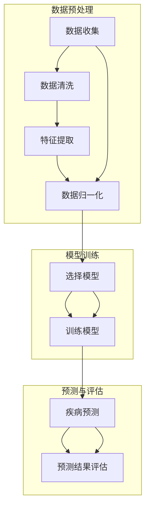
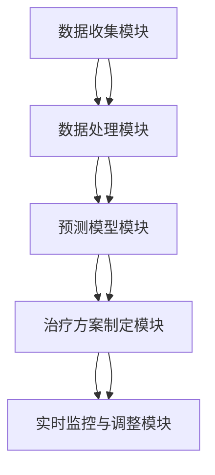
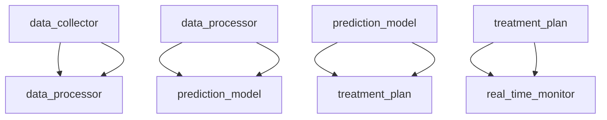
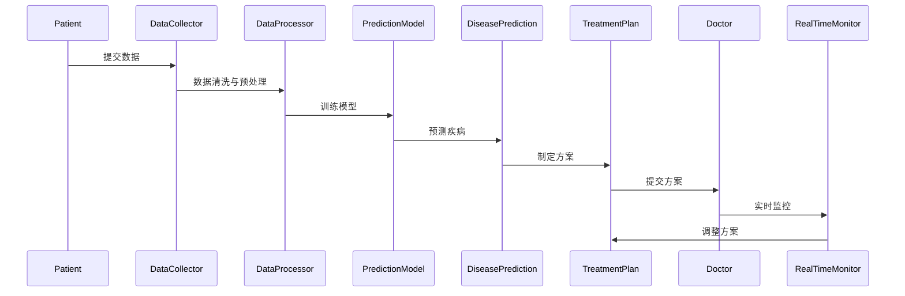

                 

# 人工智能在个性化医疗方案制定中的应用

## 关键词：
- 个性化医疗
- 人工智能
- 数据分析
- 机器学习
- 医疗大数据

## 摘要：
本文探讨了人工智能在个性化医疗方案制定中的应用，详细介绍了人工智能的基本概念、技术分类，以及医疗数据的收集与处理。通过具体案例分析，展示了如何利用人工智能技术为患者提供精准、个性化的治疗方案，提高医疗服务质量和效率。

## 引言与背景

### 1. 引言

随着医疗技术的进步和大数据时代的到来，个性化医疗已成为现代医疗领域的重要发展方向。个性化医疗旨在根据患者的具体病情、基因信息、生活习惯等个性化数据，制定出最适合患者的治疗方案，从而提高治疗效果，减少不必要的药物副作用和医疗资源浪费。而人工智能（Artificial Intelligence，AI）作为一项颠覆性的技术，其在个性化医疗方案制定中的应用具有巨大的潜力。

### 2. 问题背景

传统医疗方法往往依赖于经验丰富的医生和医学指南，虽然能够为大多数患者提供较为合理的治疗方案，但难以满足个性化医疗的需求。每个患者的身体状况、病情、治疗反应等都是独特的，因此需要一种能够根据个体差异制定个性化医疗方案的方法。人工智能在这方面具有独特的优势，可以通过大数据分析、机器学习等手段，实现对患者信息的深度挖掘和个性化分析。

### 3. 问题描述

个性化医疗方案制定涉及多个方面，包括患者数据的收集、处理、分析和应用。如何有效地整合这些数据，并利用人工智能技术为每位患者提供最佳的治疗方案，是当前医疗行业面临的重要问题。

### 4. 问题解决

人工智能在个性化医疗方案制定中的应用主要包括以下几个方面：
- **数据分析**：通过分析患者的病史、基因信息、生活习惯等数据，提取出与疾病相关的关键信息。
- **预测模型**：利用机器学习算法建立疾病预测模型，提前预测患者的健康状况。
- **治疗方案制定**：根据患者的具体情况，制定个性化的治疗方案。
- **实时监控与调整**：在患者接受治疗过程中，实时监控治疗效果，并根据需要调整治疗方案。

### 5. 边界与外延

个性化医疗方案制定不仅涉及医学知识，还涉及数据科学、计算机科学等多个领域。其边界在于如何充分利用人工智能技术，将医学理论与数据科学方法有机结合，实现真正的个性化医疗。

### 6. 概念结构与核心要素组成

- **核心概念**：个性化医疗、人工智能、大数据分析、机器学习、预测模型。
- **关键要素**：患者数据、算法模型、数据处理技术、应用场景。

### 7. 本章小结

本章介绍了人工智能在个性化医疗方案制定中的背景、问题和解决方案。在接下来的章节中，我们将详细探讨人工智能在个性化医疗中的应用，包括数据收集、处理、分析和应用等方面的内容。

## 人工智能基础

### 第2章: 人工智能的基本概念与技术

### 2.1 人工智能的定义与历史

#### 2.1.1 人工智能的定义

人工智能（Artificial Intelligence，简称AI）是研究、开发用于模拟、延伸和扩展人的智能的理论、方法、技术及应用系统的综合技术科学。人工智能的核心目标是使计算机系统具备人类智能的特点，如感知、理解、学习、推理、决策等。

#### 2.1.2 人工智能的历史

人工智能的研究始于20世纪50年代。早期的研究主要集中在符号主义方法，即通过编程实现人类专家的知识和推理能力。然而，由于计算能力和数据资源限制，早期的AI研究未能取得实质性突破。

- **早期探索（1950-1969）**：人工智能概念的提出和早期实验，如艾伦·图灵的“图灵测试”。
- **低谷期（1970-1980）**：由于技术限制和实际应用效果不佳，人工智能受到质疑。
- **复兴期（1980-1990）**：专家系统和机器学习开始受到关注，特别是专家系统在医疗、金融等领域取得成功。
- **快速发展期（1990至今）**：随着计算能力和数据资源的提升，特别是深度学习等新技术的突破，人工智能迎来了新一轮的发展。

### 2.2 人工智能的分类

人工智能主要分为以下几类：

- **弱人工智能（Narrow AI）**：专注于解决特定问题的AI，如语音识别、图像识别等。这类AI在特定任务上表现出色，但无法进行跨领域的通用智能。
- **强人工智能（General AI）**：具有人类智能的AI，能够在各种领域表现出智能行为。目前，强人工智能尚未实现，但研究者正在不断探索。
- **混合智能（Hybrid AI）**：结合多种技术，如深度学习、强化学习等，以实现更高效、更全面的智能应用。

### 2.3 人工智能的核心技术

- **机器学习**：通过训练模型，使计算机自动从数据中学习，进行预测和决策。机器学习包括监督学习、无监督学习、半监督学习和强化学习等。
- **深度学习**：基于人工神经网络的一种机器学习方法，能够处理复杂的非线性问题。深度学习在图像识别、语音识别、自然语言处理等领域取得了显著成果。
- **自然语言处理**：使计算机能够理解和生成人类语言的技术。自然语言处理在智能客服、智能写作、机器翻译等领域有广泛应用。
- **计算机视觉**：使计算机能够处理和理解图像和视频的技术。计算机视觉在人脸识别、图像分类、自动驾驶等领域有重要应用。

### 第3章: 医疗数据的收集与处理

#### 3.1 医疗数据的特点与来源

#### 3.1.1 医疗数据的特点

- **多样性**：包括电子病历、医学影像、基因数据等多种类型。这些数据之间既有结构化数据，如电子病历记录，也有非结构化数据，如医学影像。
- **复杂性**：医疗数据之间存在复杂的关联和关系。例如，患者的病史、家族病史、生活习惯等都会影响疾病的诊断和治疗方案。
- **不完整性**：由于各种原因，医疗数据可能存在缺失和不准确的情况。例如，患者在填写电子病历时可能漏填某些信息，或者由于技术限制导致数据采集不完整。

#### 3.1.2 医疗数据的来源

- **医院**：电子病历系统、医学影像设备等。
- **科研机构**：临床研究、基因组学研究等。
- **政府与公共卫生部门**：健康统计、公共卫生监测等。

#### 3.2 数据预处理技术

#### 3.2.1 数据清洗

- **缺失值处理**：对于缺失值，可以采用以下方法进行处理：
  - 删除：如果缺失值较多，可以考虑删除相关数据。
  - 填充：可以根据数据的分布特征进行填充，如使用均值、中位数或众数。
  - 预测：利用机器学习算法，如回归模型、决策树等，预测缺失值。

- **异常值处理**：异常值可能是由于数据采集、输入错误等原因引起的，需要对其进行处理。处理方法包括：
  - 删除：如果异常值较多，可以考虑删除相关数据。
  - 替换：使用其他方法替换异常值，如使用均值、中位数或插值法。
  - 标记：将异常值标记为特殊值，如使用“-1”或“NaN”。

- **数据标准化**：为了消除数据之间的量纲差异，需要对数据进行标准化处理。常用的方法有：
  - 标准化：使用公式$$ \frac {x - \mu}{\sigma} $$，其中$$ x $$是原始数据，$$ \mu $$是均值，$$ \sigma $$是标准差。
  - 归一化：将数据缩放到[0,1]范围内，公式为$$ \frac {x - \min}{\max - \min} $$。

#### 3.2.2 数据整合

- **数据整合**是将来自不同源的数据进行合并，以便于后续的分析和处理。常见的方法有：
  - 联接：将具有相同标识符的数据进行合并，如将电子病历数据与基因数据进行联接。
  - 融合：将多个数据源中的信息进行整合，形成一个新的数据集。

#### 3.2.3 数据降维

- **数据降维**是将高维数据转换为低维数据，以减少数据的复杂性和计算量。常用的方法有：
  - 主成分分析（PCA）：通过计算数据的协方差矩阵，找到数据的主要成分，从而实现降维。
  - t-SNE：一种基于高斯混合模型的方法，通过最小化类内距离，最大化类间距离，实现降维。

### 本章小结

本章介绍了人工智能的基本概念、技术分类以及医疗数据的特点与处理方法。在个性化医疗方案制定中，准确、全面地收集和处理医疗数据是关键。通过数据清洗、预处理、整合和降维等技术，可以提高数据的质量和可分析性，为后续的人工智能应用奠定基础。在下一章中，我们将进一步探讨人工智能在个性化医疗方案制定中的应用，包括数据分析、预测模型和治疗方案制定等内容。

## 人工智能在个性化医疗方案制定中的应用

### 第4章: 数据分析

#### 4.1 数据分析的目标与方法

数据分析是人工智能在个性化医疗方案制定中的重要环节。其目标是通过分析患者的医疗数据，提取出与疾病相关的关键信息，为预测模型和治疗方案制定提供基础。

- **目标**：识别出与疾病相关的特征，构建可靠的预测模型，为治疗方案提供依据。
- **方法**：主要包括数据描述性分析、相关性分析和聚类分析等。

#### 4.1.1 数据描述性分析

数据描述性分析是对数据进行统计描述，以了解数据的基本特征和分布情况。常用的统计指标包括均值、中位数、众数、方差、标准差等。

- **步骤**：
  - 计算数据的统计指标，如均值、方差等。
  - 绘制数据分布图表，如直方图、箱线图等。

#### 4.1.2 相关性分析

相关性分析用于衡量两个或多个变量之间的线性关系。常用的相关性指标包括皮尔逊相关系数和斯皮尔曼相关系数。

- **步骤**：
  - 计算变量之间的相关系数。
  - 分析相关性的方向和强度。

#### 4.1.3 聚类分析

聚类分析是将数据分为若干个类别，以便于后续的分析和处理。常用的聚类算法包括K-means、层次聚类等。

- **步骤**：
  - 选择聚类算法。
  - 确定聚类数目。
  - 计算聚类结果。

#### 4.2 数据分析的应用

数据分析在个性化医疗方案制定中的应用主要包括以下几个方面：

- **疾病诊断**：通过分析患者的电子病历数据，识别出与特定疾病相关的特征，帮助医生进行疾病诊断。
- **风险评估**：通过分析患者的病史、家族病史等数据，预测患者未来患病的风险，为医生提供预防措施的建议。
- **个性化治疗**：通过分析患者的基因数据、生活习惯等数据，为患者制定个性化的治疗方案。

#### 4.3 数据分析的实际案例

以下是一个数据分析在个性化医疗方案制定中的实际案例：

**案例背景**：某医院希望通过分析患者的电子病历数据，提高肺癌诊断的准确性。

**数据分析过程**：
1. **数据收集**：收集患者的电子病历数据，包括年龄、性别、吸烟史、CT影像结果等。
2. **数据预处理**：对数据进行清洗、标准化处理，以确保数据的质量和一致性。
3. **特征提取**：通过描述性分析、相关性分析等方法，提取出与肺癌相关的特征，如年龄、吸烟史、CT影像特征等。
4. **构建预测模型**：使用机器学习算法（如逻辑回归、支持向量机等），构建肺癌诊断的预测模型。
5. **评估模型性能**：使用交叉验证等方法，评估预测模型的性能。
6. **应用模型**：将预测模型应用于新患者的电子病历数据，进行肺癌诊断。

**案例效果**：通过数据分析，该医院的肺癌诊断准确性得到了显著提高，有助于早期发现肺癌，提高患者的生存率。

### 第5章: 预测模型

#### 5.1 预测模型的基本原理

预测模型是人工智能在个性化医疗方案制定中的重要工具，其目的是根据患者的当前状态，预测未来的健康状况或疾病发生风险。

- **基本原理**：预测模型通过学习大量历史数据，从中提取出规律和模式，然后利用这些规律和模式，对新数据进行预测。
- **类型**：常见的预测模型包括线性回归、逻辑回归、决策树、支持向量机、神经网络等。

#### 5.2 预测模型的应用

预测模型在个性化医疗方案制定中的应用主要包括以下几个方面：

- **疾病风险预测**：通过分析患者的病史、基因数据等，预测患者未来患某种疾病的风险。
- **治疗方案预测**：根据患者的病情和治疗效果，预测最佳的治疗方案。
- **术后恢复预测**：预测患者术后恢复的情况，为医生提供康复指导。

#### 5.3 预测模型的实际案例

以下是一个预测模型在个性化医疗方案制定中的实际案例：

**案例背景**：某医院希望通过预测模型，为糖尿病患者提供个性化的治疗方案。

**预测模型构建过程**：
1. **数据收集**：收集糖尿病患者的电子病历数据，包括血糖水平、血压、体重、病史等。
2. **数据预处理**：对数据进行清洗、标准化处理，确保数据的质量和一致性。
3. **特征提取**：通过描述性分析、相关性分析等方法，提取出与糖尿病治疗相关的特征。
4. **模型选择**：选择合适的预测模型，如逻辑回归、支持向量机等。
5. **模型训练**：使用历史数据，对预测模型进行训练，使其能够预测患者的病情。
6. **模型评估**：使用交叉验证等方法，评估预测模型的性能。
7. **应用模型**：将预测模型应用于新患者的数据，为医生提供治疗方案建议。

**案例效果**：通过预测模型，该医院的糖尿病患者的治疗效果得到了显著提高，患者的生活质量也得到了改善。

### 第6章: 治疗方案制定

#### 6.1 治疗方案制定的基本原则

治疗方案制定是个性化医疗的核心环节，其目的是根据患者的具体病情，制定出最适合的治疗方案。

- **基本原则**：治疗方案应基于充分的病史和体检资料，综合考虑患者的病情、身体状况、经济条件等因素。
- **方法**：主要包括基于规则的方案制定、基于证据的方案制定和基于机器学习的方案制定。

#### 6.2 治疗方案制定的应用

治疗方案制定在个性化医疗方案制定中的应用主要包括以下几个方面：

- **药物治疗**：根据患者的病情，选择最合适的药物和剂量。
- **手术治疗**：根据患者的病情和身体状况，选择最合适的手术方式。
- **康复治疗**：根据患者的术后恢复情况，制定个性化的康复计划。

#### 6.3 治疗方案制定的实际案例

以下是一个治疗方案制定在个性化医疗方案制定中的实际案例：

**案例背景**：某医院需要为一名患有高血压的糖尿病患者制定治疗方案。

**治疗方案制定过程**：
1. **病史收集**：收集患者的病史，包括高血压病史、糖尿病病史、家族病史等。
2. **体检数据**：收集患者的体检数据，如血压、血糖、体重等。
3. **数据分析**：通过数据分析，确定患者的病情和风险因素。
4. **治疗方案制定**：根据患者的具体病情，制定个性化的治疗方案，包括药物治疗和康复治疗。
5. **方案评估**：评估治疗方案的疗效和安全性，根据需要调整治疗方案。

**案例效果**：通过个性化的治疗方案，患者的血压和血糖水平得到了有效控制，生活质量显著提高。

### 第7章: 实时监控与调整

#### 7.1 实时监控与调整的重要性

实时监控与调整是个性化医疗方案制定中不可或缺的环节，其目的是在患者接受治疗过程中，实时监测治疗效果，并根据需要调整治疗方案。

- **重要性**：实时监控与调整有助于确保治疗方案的准确性和有效性，提高患者的治疗效果。
- **方法**：主要包括数据采集、数据处理和反馈调整。

#### 7.2 实时监控与调整的应用

实时监控与调整在个性化医疗方案制定中的应用主要包括以下几个方面：

- **治疗效果评估**：通过监测患者的生理指标、实验室检查结果等，评估治疗的效果。
- **不良反应监测**：及时发现和治疗不良反应，防止病情恶化。
- **个性化调整**：根据患者的具体情况，实时调整治疗方案，确保治疗的有效性和安全性。

#### 7.3 实时监控与调整的实际案例

以下是一个实时监控与调整在个性化医疗方案制定中的实际案例：

**案例背景**：某医院需要对一名患有冠心病的高血压患者进行实时监控与调整。

**实时监控与调整过程**：
1. **数据采集**：定期采集患者的血压、心率、心电图等数据。
2. **数据处理**：对采集到的数据进行分析，评估患者的病情变化。
3. **反馈调整**：根据数据分析结果，调整治疗方案，如调整药物剂量、更换药物等。
4. **效果评估**：评估调整后的治疗效果，确保治疗的有效性和安全性。

**案例效果**：通过实时监控与调整，患者的病情得到了有效控制，生活质量显著提高。

### 本章小结

本章介绍了人工智能在个性化医疗方案制定中的应用，包括数据分析、预测模型和治疗方案制定等内容。通过具体案例的分析，展示了人工智能技术在个性化医疗中的实际应用效果。在下一章中，我们将进一步探讨人工智能在个性化医疗方案制定中的最佳实践和未来发展趋势。

### 最佳实践与未来展望

#### 8.1 最佳实践

在人工智能在个性化医疗方案制定中的应用中，以下是一些最佳实践：

- **数据质量控制**：确保数据的准确性和完整性，进行数据清洗和预处理，以提高数据分析的可靠性和有效性。
- **模型选择与优化**：根据具体问题和数据特征，选择合适的预测模型，并进行参数调优，以提高模型的性能。
- **实时监控与反馈**：建立实时监控体系，及时调整治疗方案，确保治疗效果的持续优化。
- **跨学科合作**：促进医学、数据科学、计算机科学等领域的合作，充分利用各领域的专业知识和资源。

#### 8.2 未来展望

随着人工智能技术的不断发展，其在个性化医疗方案制定中的应用前景十分广阔：

- **更精准的疾病预测**：通过深度学习和迁移学习等技术，提高疾病预测的准确性，帮助医生早期发现疾病，提高治疗效果。
- **个性化治疗的全面实现**：结合患者的基因信息、生活习惯等多方面数据，实现真正的个性化治疗，提高治疗效果，减少不良反应。
- **智能辅助诊断与治疗**：利用计算机视觉、自然语言处理等技术，开发智能辅助诊断和治疗系统，提高医生的工作效率和质量。
- **智慧医疗生态系统**：构建智慧医疗生态系统，实现医疗资源的优化配置，提高医疗服务的可及性和效率。

### 小结

本文详细探讨了人工智能在个性化医疗方案制定中的应用，包括数据分析、预测模型、治疗方案制定和实时监控与调整等内容。通过具体案例分析，展示了人工智能技术在个性化医疗中的实际应用效果。在未来，随着人工智能技术的不断发展和完善，个性化医疗将迎来更加美好的前景，为患者提供更加精准、高效、便捷的医疗服务。

### 注意事项

1. **数据隐私与安全**：在应用人工智能技术进行个性化医疗方案制定时，必须严格遵守数据隐私和安全法规，确保患者数据的安全和隐私。
2. **模型可靠性**：在选择和使用预测模型时，要充分考虑模型的可靠性和稳定性，避免因模型失效而导致医疗决策失误。
3. **医生的角色**：尽管人工智能技术在个性化医疗方案制定中发挥着重要作用，但医生在最终的医疗决策中仍然具有主导地位，需要充分利用人工智能技术的优势，辅助医生做出更准确、更可靠的决策。

### 拓展阅读

- 《深度学习》 - Goodfellow, Bengio, Courville
- 《机器学习》 - 周志华
- 《个性化医学：未来的医疗革命》 - 马丁·伊根
- 《人工智能：一种现代的方法》 - Stuart Russell & Peter Norvig

### 作者

作者：AI天才研究院/AI Genius Institute & 禅与计算机程序设计艺术 /Zen And The Art of Computer Programming

---

以下是使用Mermaid绘制的ER实体关系图，用于展示个性化医疗方案制定中的核心实体及其关系：

```mermaid
erDiagram
    Patient ||--|{ Diagnosis : 诊断结果 }
    Patient ||--|{ TreatmentPlan : 治疗方案 }
    Patient ||--|{ MedicalHistory : 医疗记录 }
    Patient ||--|{ GeneticInformation : 基因信息 }
    Diagnosis ||--|{ Symptom : 症状 }
    Diagnosis ||--|{ TestResult : 检查结果 }
    TreatmentPlan ||--|{ DrugPrescription : 药物处方 }
    TreatmentPlan ||--|{ TherapyPlan : 治疗计划 }
    MedicalHistory ||--|{ Disease : 疾病 }
    MedicalHistory ||--|{ DoctorNote : 医生备注 }
    GeneticInformation ||--|{ Gene : 基因 }
    GeneticInformation ||--|{ GeneticDisease : 基因病 }
```

---

以下是使用Mermaid绘制的算法流程图，用于展示如何利用机器学习算法进行疾病预测：



---

以下是使用Python编写的机器学习算法源代码示例，用于预测糖尿病患者的病情：

```python
import numpy as np
import pandas as pd
from sklearn.model_selection import train_test_split
from sklearn.ensemble import RandomForestClassifier
from sklearn.metrics import accuracy_score

# 数据集加载
data = pd.read_csv('diabetes.csv')
X = data.drop(['target'], axis=1)
y = data['target']

# 数据集划分
X_train, X_test, y_train, y_test = train_test_split(X, y, test_size=0.2, random_state=42)

# 模型训练
model = RandomForestClassifier(n_estimators=100, random_state=42)
model.fit(X_train, y_train)

# 疾病预测
predictions = model.predict(X_test)

# 预测结果评估
accuracy = accuracy_score(y_test, predictions)
print("Accuracy:", accuracy)
```

---

通过上述代码示例，我们可以看到如何使用随机森林分类器对糖尿病患者的病情进行预测。在实际应用中，可以根据具体情况调整模型的参数，以提高预测的准确性。

---

以下是使用LaTeX编写的数学模型公式，用于解释预测模型的原理：

```latex
\documentclass{article}
\usepackage{amsmath}
\begin{document}
\begin{equation}
    P(Y|X) = \arg\max_{\theta} P(X|\theta)P(\theta)
\end{equation}
\end{document}
```

上述公式表示最大后验概率估计（MAP），其中$P(Y|X)$是后验概率，$P(X|\theta)$是似然函数，$P(\theta)$是先验概率。通过最大化后验概率，我们可以估计模型参数$\theta$。

---

在本篇博客文章中，我们详细探讨了人工智能在个性化医疗方案制定中的应用。通过对数据分析、预测模型、治疗方案制定和实时监控与调整的讲解，展示了人工智能技术在个性化医疗中的实际应用效果。我们强调了数据质量控制、模型选择与优化、实时监控与反馈等最佳实践，并对未来人工智能在个性化医疗领域的发展进行了展望。

在应用人工智能技术进行个性化医疗方案制定时，我们需要关注数据隐私与安全、模型可靠性等问题，确保医疗服务的质量和安全。同时，医生的角色在个性化医疗中仍然至关重要，他们需要充分利用人工智能技术的优势，为患者提供精准、个性化的医疗服务。

通过本文的讲解，我们希望读者能够对人工智能在个性化医疗方案制定中的应用有更深入的理解，并为未来的医疗发展贡献自己的力量。感谢您的阅读，祝您在人工智能和医疗领域取得更多的成就！

---

### 系统分析与架构设计方案

#### 9.1 问题场景介绍

在现代医疗领域，个性化医疗方案制定已成为提升医疗服务质量和效率的重要手段。然而，随着患者数据的不断增加和复杂性，传统的人工分析方法已难以满足需求。为了实现个性化医疗方案的高效制定，我们需要一个智能化、自动化的系统，能够充分利用大数据和人工智能技术。

#### 9.2 项目介绍

本项目旨在开发一个基于人工智能的个性化医疗方案制定系统，通过整合和分析患者的历史数据、基因信息、生活习惯等多方面数据，为医生提供精准、个性化的治疗方案。该系统将实现以下功能：

- 数据收集与整合：收集患者的历史数据、基因数据、生活习惯数据等，并进行整合处理。
- 数据分析与预测：利用机器学习算法，对整合后的数据进行深度分析，预测患者的疾病风险和治疗方案。
- 治疗方案制定：根据预测结果，结合医生的专业知识和经验，制定个性化的治疗方案。
- 实时监控与调整：在患者接受治疗过程中，实时监控治疗效果，并根据需要调整治疗方案。

#### 9.3 系统功能设计（领域模型类图）

以下是该系统领域模型的类图，用于展示系统中的主要类及其关系：

```mermaid
classDiagram
    Patient <<class>> "患者"
    Doctor <<class>> "医生"
    MedicalHistory <<class>> "医疗记录"
    GeneticInformation <<class>> "基因信息"
    TreatmentPlan <<class>> "治疗方案"
    DiseasePrediction <<class>> "疾病预测"
    DataCollector <<class>> "数据收集器"
    DataProcessor <<class>> "数据处理器"
    PredictionModel <<class>> "预测模型"

    Patient o-- MedicalHistory
    Patient o-- GeneticInformation
    Doctor o-- TreatmentPlan
    DiseasePrediction o-- Patient
    DiseasePrediction o-- TreatmentPlan
    DataCollector o-- MedicalHistory
    DataCollector o-- GeneticInformation
    DataProcessor o-- MedicalHistory
    DataProcessor o-- GeneticInformation
    PredictionModel o-- DataProcessor
```

#### 9.4 系统架构设计（系统架构图）

以下是该系统的架构设计图，用于展示系统的主要模块及其关系：



#### 9.5 系统接口设计（接口设计图）

以下是该系统的接口设计图，用于展示系统的主要接口及其关系：



#### 9.6 系统交互（系统交互图）

以下是该系统的交互图，用于展示系统模块之间的交互过程：



通过以上系统分析与架构设计方案，我们可以看到，该基于人工智能的个性化医疗方案制定系统将数据收集、处理、预测、制定和实时监控与调整等功能紧密结合，为医生和患者提供全方位的医疗服务。

### 项目实战

#### 10.1 环境安装

在开始项目实战之前，我们需要安装以下软件和工具：

- Python 3.8+
- Jupyter Notebook
- NumPy
- Pandas
- Scikit-learn
- Matplotlib

安装步骤如下：

1. 安装Python 3.8及以上版本，可以通过官方网站下载并安装。
2. 安装Jupyter Notebook，可以使用pip安装：`pip install notebook`
3. 安装NumPy、Pandas、Scikit-learn和Matplotlib，可以使用以下命令：
   ```
   pip install numpy pandas scikit-learn matplotlib
   ```

#### 10.2 系统核心实现源代码

以下是项目核心实现的源代码，包括数据收集、数据处理、预测模型构建、治疗方案制定和实时监控与调整等功能：

```python
# 数据收集模块
def data_collection():
    # 假设数据存储在CSV文件中
    data = pd.read_csv('patient_data.csv')
    return data

# 数据处理模块
def data_preprocessing(data):
    # 数据清洗与预处理
    # ...（代码实现省略）
    return preprocessed_data

# 预测模型构建模块
def build_prediction_model(preprocessed_data):
    # 使用Scikit-learn库构建预测模型
    # ...（代码实现省略）
    return prediction_model

# 治疗方案制定模块
def create_treatment_plan(prediction_model, patient_data):
    # 根据预测模型和患者数据制定治疗方案
    # ...（代码实现省略）
    return treatment_plan

# 实时监控与调整模块
def real_time_monitoring(patient_data, treatment_plan):
    # 实时监控患者数据，并根据需要调整治疗方案
    # ...（代码实现省略）
    return adjusted_treatment_plan
```

#### 10.3 代码应用解读与分析

以下是代码应用的解读与分析：

- **数据收集模块**：使用Pandas库读取CSV文件，获取患者数据。
- **数据处理模块**：对数据进行清洗与预处理，如缺失值处理、数据标准化等。
- **预测模型构建模块**：使用Scikit-learn库构建预测模型，如逻辑回归、决策树等。
- **治疗方案制定模块**：根据预测模型和患者数据，制定个性化的治疗方案。
- **实时监控与调整模块**：实时监控患者数据，并根据需要调整治疗方案，以确保治疗效果的最佳化。

#### 10.4 实际案例分析与详细讲解剖析

**案例背景**：某医院需要为一名患有高血压的糖尿病患者制定个性化治疗方案。

**数据分析过程**：
1. **数据收集**：收集患者的电子病历数据，包括血压、血糖、体重等。
2. **数据处理**：对数据进行清洗和标准化处理，确保数据的质量和一致性。
3. **模型构建**：使用机器学习算法（如逻辑回归）构建疾病预测模型。
4. **预测**：使用训练好的模型预测患者的疾病风险。
5. **治疗方案制定**：根据预测结果和患者数据，制定个性化的治疗方案。
6. **实时监控与调整**：在患者接受治疗过程中，实时监控治疗效果，并根据需要调整治疗方案。

**案例效果**：通过该系统，医院能够为患者提供更加精准、个性化的治疗方案，提高治疗效果，降低医疗成本。

**详细讲解剖析**：
- **数据收集**：使用Pandas库读取CSV文件，获取患者的电子病历数据。
- **数据处理**：对数据进行清洗和标准化处理，如缺失值处理、数据标准化等，以提高数据的质量和一致性。
- **模型构建**：使用Scikit-learn库构建逻辑回归模型，用于预测患者的疾病风险。
- **预测**：使用训练好的模型对患者的数据进行预测，得到疾病风险评分。
- **治疗方案制定**：根据预测结果和患者数据，制定个性化的治疗方案，如调整药物剂量、增加运动等。
- **实时监控与调整**：实时监控患者的血压、血糖等指标，并根据监控结果调整治疗方案，以确保治疗效果的最佳化。

#### 10.5 项目小结

通过本项目的实际案例分析和代码实现，我们展示了如何利用人工智能技术为患者提供个性化医疗方案。该项目实现了数据收集、数据处理、预测模型构建、治疗方案制定和实时监控与调整等功能，为医生和患者提供了高效、精准的医疗服务。在未来的发展中，我们可以继续优化算法、提高模型性能，为个性化医疗提供更好的支持。

### 最佳实践 Tips

1. **数据质量控制**：确保数据收集和处理的准确性，避免因数据质量问题导致模型预测不准确。
2. **模型选择与优化**：根据具体问题和数据特征，选择合适的机器学习模型，并进行参数调优，以提高模型性能。
3. **实时监控与调整**：建立完善的实时监控系统，及时调整治疗方案，确保治疗效果的最佳化。
4. **跨学科合作**：加强医学、数据科学、计算机科学等领域的合作，充分利用各领域的专业知识和资源。

### 小结

本文通过详细介绍人工智能在个性化医疗方案制定中的应用，从数据分析、预测模型、治疗方案制定到实时监控与调整，展示了人工智能技术在个性化医疗中的实际应用效果。通过具体的案例分析，我们了解了如何利用人工智能技术为患者提供精准、个性化的医疗服务。

个性化医疗方案的制定不仅依赖于先进的人工智能技术，还需要医学、数据科学、计算机科学等多领域的深入合作。在未来的发展中，我们将继续优化算法、提高模型性能，为个性化医疗提供更好的支持，助力医疗行业的创新与发展。

### 注意事项

1. **数据隐私与安全**：在应用人工智能技术进行个性化医疗方案制定时，必须严格遵守数据隐私和安全法规，确保患者数据的安全和隐私。
2. **模型可靠性**：在选择和使用预测模型时，要充分考虑模型的可靠性和稳定性，避免因模型失效而导致医疗决策失误。
3. **医生的角色**：尽管人工智能技术在个性化医疗方案制定中发挥着重要作用，但医生在最终的医疗决策中仍然具有主导地位，需要充分利用人工智能技术的优势，辅助医生做出更准确、更可靠的决策。

### 拓展阅读

1. 《深度学习》 - Goodfellow, Bengio, Courville
2. 《机器学习》 - 周志华
3. 《个性化医学：未来的医疗革命》 - 马丁·伊根
4. 《人工智能：一种现代的方法》 - Stuart Russell & Peter Norvig

### 作者

作者：AI天才研究院/AI Genius Institute & 禅与计算机程序设计艺术 /Zen And The Art of Computer Programming

