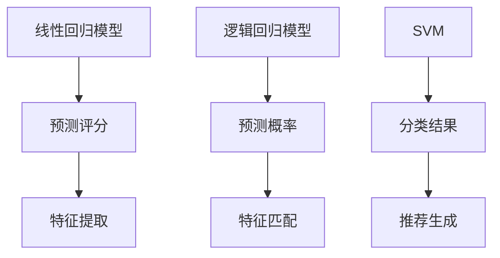
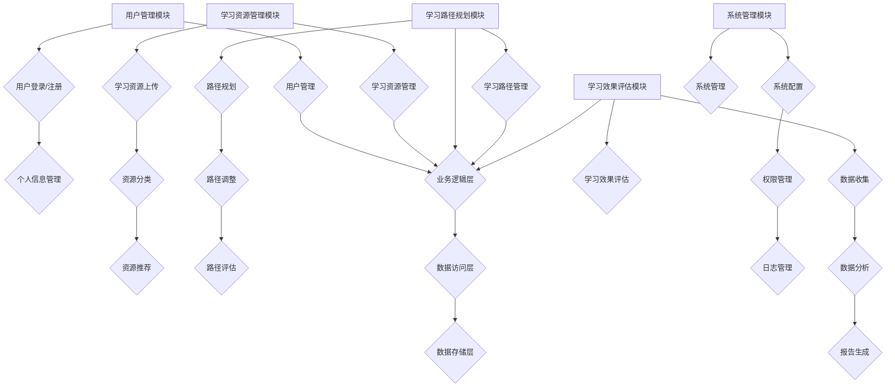

                 

# 人工智能在个性化学习中的应用

关键词：个性化学习、人工智能、协同过滤、内容推荐、深度学习、系统架构

摘要：本文深入探讨了人工智能在个性化学习中的应用，首先分析了个性化学习的背景和核心概念，随后详细介绍了协同过滤、内容推荐和深度学习等个性化学习算法的原理和数学模型。接着，文章从系统架构和实现技术的角度，阐述了个性化学习系统的设计和实现方法。最后，通过一个实际项目案例，展示了人工智能在个性化学习中的具体应用，并对未来的发展趋势进行了展望。

## 第一部分：问题背景与核心概念

### 第1章：个性化学习的兴起与挑战

#### 1.1 个性化学习的概念与历史演变

个性化学习，是指根据每个学生的特点，包括学习风格、兴趣、认知能力等，提供定制化的教育内容和教学方式，以达到更好的教学效果。其概念起源于20世纪初的差异化教育理论，随着教育信息化的推进和人工智能技术的发展，个性化学习逐渐成为一种重要的教育模式。

个性化学习的历史演变可以分为三个阶段：

1. **传统教育阶段**：以教师为中心，学生被动接受知识。
2. **信息化教育阶段**：计算机和网络技术应用于教学，提供了更多的学习资源和交流平台。
3. **智能教育阶段**：人工智能技术开始应用于教育，实现个性化学习。

#### 1.1.1 个性化学习的定义

个性化学习是指教育者根据学生的个性差异，为学生提供适合其发展的、个性化的教育服务。个性化学习强调以学生为中心，尊重学生的个体差异，通过因材施教，激发学生的学习兴趣和潜能，提高学习效率。

#### 1.1.2 个性化学习的历史背景

个性化学习的历史可以追溯到20世纪初，当时的教育理论家如蒙台梭利和皮亚杰提出了以儿童为中心的教育理念。随着信息技术的发展，特别是在互联网普及和大数据技术的应用下，个性化学习得到了进一步的发展。

#### 1.1.3 个性化学习的优势与挑战

个性化学习的优势在于：

1. 提高学习效果：根据学生的特点提供适合的学习内容和方法，可以更好地激发学生的学习兴趣和潜能。
2. 适应社会需求：现代社会对个性化、专业化的知识需求越来越高，个性化学习有助于培养学生的综合素质。
3. 促进教育公平：个性化学习可以弥补传统教育的不足，使不同背景的学生都能获得适合自己的教育资源。

个性化学习面临的挑战包括：

1. 数据采集和处理：个性化学习需要大量关于学生特征的学习数据，如何有效地采集和处理这些数据是一个挑战。
2. 系统设计与实现：构建一个能够适应个性化学习需求的系统，需要综合考虑技术、教育、心理学等多方面的因素。
3. 教师角色转变：个性化学习要求教师从知识传授者转变为学习引导者，这对教师角色的转变提出了新的要求。

### 第2章：人工智能在个性化学习中的应用现状

#### 1.2.1 人工智能的基本原理与应用领域

人工智能（AI）是一门研究、开发用于模拟、延伸和扩展人类智能的理论、方法、技术及应用系统的技术科学。它涉及计算机科学、心理学、神经科学等多个学科领域。人工智能的基本原理包括：

1. **机器学习**：通过数据训练模型，使计算机能够从数据中学习并作出决策。
2. **深度学习**：一种特殊的机器学习技术，通过多层神经网络模拟人脑的工作方式。
3. **自然语言处理**：使计算机能够理解、生成和回应人类语言的技术。

人工智能在个性化学习中的应用领域包括：

1. **内容推荐**：根据学生的学习兴趣和背景，推荐适合的学习资源。
2. **智能辅导**：通过模拟教师或导师的角色，为学生提供个性化的学习指导。
3. **学习分析**：分析学生的学习行为和成果，为教师提供教学反馈。

#### 1.2.2 人工智能在个性化学习中的实际应用

人工智能在个性化学习中的实际应用案例包括：

1. **学习管理系统（LMS）**：如Moodle、Canvas等，利用AI技术提供个性化的学习路径和资源推荐。
2. **智能辅导系统**：如IBM的Watson Tutor，利用自然语言处理和机器学习技术，为学生提供个性化的学习辅导。
3. **自适应学习平台**：如Knewton、DreamBox等，通过分析学生的学习行为，动态调整教学内容和难度。

#### 1.2.3 人工智能在个性化学习中的应用前景

随着人工智能技术的不断发展，其在个性化学习中的应用前景非常广阔：

1. **个性化学习路径规划**：通过分析学生的学习数据和特征，为每个学生制定个性化的学习路径。
2. **智能教学评估**：利用AI技术对学生的学习效果进行实时评估，为教师提供教学反馈。
3. **多模态学习体验**：结合图像、声音、文字等多种模态，提供更加丰富和个性化的学习体验。

### 第3章：本书结构安排与主要内容

#### 1.3.1 目录安排

本文分为五个部分，分别是问题背景与核心概念、核心技术原理与数学模型、系统架构与实现技术、项目实战与案例分析以及最佳实践与拓展阅读。

#### 1.3.2 主要内容概述

本文将首先介绍个性化学习的背景和核心概念，然后详细阐述人工智能在个性化学习中的应用现状。接下来，我们将深入探讨个性化学习算法的核心原理和数学模型，包括协同过滤、内容推荐和深度学习。随后，我们将从系统架构和实现技术的角度，介绍个性化学习系统的设计与实现方法。最后，通过一个实际项目案例，展示人工智能在个性化学习中的具体应用，并对未来的发展趋势进行展望。

## 第二部分：核心技术原理与数学模型

### 第4章：个性化学习算法原理

#### 2.1 个性化学习算法概述

个性化学习算法是指利用人工智能技术，根据学生的特征数据，为学生推荐合适的学习资源和调整学习路径的算法。个性化学习算法主要分为以下几类：

1. **协同过滤算法**：基于用户的历史行为数据，通过分析用户之间的相似度，推荐相似用户喜欢的内容。
2. **内容推荐算法**：根据学习内容的特点，推荐与学生学习兴趣相关的学习资源。
3. **深度学习算法**：利用神经网络模型，通过大量的数据训练，实现学习资源的个性化推荐。

#### 2.2 协同过滤算法

##### 2.2.1 协同过滤算法的原理

协同过滤算法是一种基于用户行为数据的推荐算法。其基本原理是通过分析用户之间的相似度，找出相似的用户，然后将这些用户喜欢的资源推荐给目标用户。

协同过滤算法可以分为两种主要类型：

1. **基于用户的协同过滤（User-based Collaborative Filtering）**：通过计算用户之间的相似度，找出相似用户，然后将这些用户喜欢的资源推荐给目标用户。
2. **基于物品的协同过滤（Item-based Collaborative Filtering）**：通过计算物品之间的相似度，找出相似物品，然后将这些物品推荐给目标用户。

##### 2.2.2 协同过滤算法的优缺点

协同过滤算法的优点包括：

1. 算法简单，易于实现。
2. 对稀疏数据有较好的处理能力。

但协同过滤算法也存在一些缺点：

1. 预测准确度受限于用户行为数据的稀疏性。
2. 难以应对冷启动问题（即新用户或新物品的推荐问题）。

##### 2.2.3 协同过滤算法的扩展与应用

协同过滤算法可以与其他推荐算法结合，提高推荐效果。例如，可以结合内容推荐算法，通过分析学习内容的特征，为用户提供更加精准的推荐。

此外，协同过滤算法在个性化学习中的应用广泛，如学习资源推荐、学习路径规划等。

#### 2.3 内容推荐算法

##### 2.3.1 内容推荐算法的原理

内容推荐算法是一种基于学习内容属性的推荐算法。其基本原理是通过分析学习内容的特征，将相似的学习内容推荐给用户。

内容推荐算法可以分为以下几种类型：

1. **基于属性的协同过滤**：通过分析学习内容的属性，计算内容之间的相似度，推荐相似内容。
2. **基于内容的协同过滤**：通过分析学习内容的属性，计算用户和内容之间的相似度，推荐相似内容。
3. **基于模型的推荐**：利用机器学习模型，通过分析学习内容的特征和用户的行为数据，预测用户可能感兴趣的内容。

##### 2.3.2 内容推荐算法的实现方法

内容推荐算法的实现方法主要包括以下几步：

1. **特征提取**：从学习内容中提取特征，如文本、图像、音频等。
2. **特征匹配**：计算用户和内容之间的特征匹配度。
3. **推荐生成**：根据特征匹配度，生成推荐列表。

##### 2.3.3 内容推荐算法的评估与优化

内容推荐算法的评估方法主要包括以下几种：

1. **准确率**：推荐列表中实际感兴趣的内容所占比例。
2. **覆盖率**：推荐列表中包含的不同内容数量与所有可能推荐内容数量的比例。
3. **新颖度**：推荐列表中实际未浏览过的内容所占比例。

为了提高内容推荐算法的推荐效果，可以采用以下优化方法：

1. **特征优化**：通过分析用户行为数据，提取更有效的特征。
2. **模型优化**：采用更先进的机器学习模型，提高预测准确率。
3. **实时更新**：根据用户行为数据的变化，实时调整推荐策略。

#### 2.4 深度学习在个性化学习中的应用

##### 2.4.1 深度学习的基本原理

深度学习是一种特殊的机器学习技术，通过多层神经网络模拟人脑的工作方式，对数据进行特征提取和模式识别。

深度学习的基本原理包括：

1. **神经网络**：一种由大量神经元组成的计算模型，用于处理复杂数据。
2. **前向传播与反向传播**：神经网络通过前向传播计算输出，通过反向传播更新权重，以优化模型性能。
3. **激活函数**：用于引入非线性因素，使神经网络能够学习复杂数据。

##### 2.4.2 深度学习在个性化学习中的应用案例

深度学习在个性化学习中的应用案例包括：

1. **学习行为分析**：通过分析学生的学习行为数据，预测学生的兴趣和学习效果。
2. **学习资源推荐**：根据学生的学习行为和兴趣，推荐适合的学习资源。
3. **智能教学评估**：利用深度学习模型，对学生的学习效果进行实时评估。

##### 2.4.3 深度学习算法的挑战与未来趋势

深度学习算法在个性化学习中的应用面临以下挑战：

1. **数据质量**：深度学习对数据质量要求较高，数据质量直接影响模型的性能。
2. **计算资源**：深度学习模型需要大量的计算资源，尤其是在训练阶段。
3. **模型解释性**：深度学习模型通常缺乏解释性，难以理解模型内部的工作机制。

未来深度学习在个性化学习中的应用趋势包括：

1. **小样本学习**：研究如何利用少量数据进行深度学习，以降低对大规模数据的依赖。
2. **模型压缩**：研究如何减小深度学习模型的大小，提高模型的部署效率。
3. **多模态学习**：结合不同模态的数据，提高个性化学习的准确性和效果。

#### 2.5 个性化学习算法的数学模型与公式解析

##### 2.5.1 常用数学模型介绍

在个性化学习算法中，常用的数学模型包括：

1. **线性回归模型**：用于预测用户对学习资源的评分。
2. **逻辑回归模型**：用于预测用户是否喜欢某个学习资源。
3. **支持向量机（SVM）**：用于分类用户对学习资源的偏好。

##### 2.5.2 数学公式解析

以下为常用数学模型的公式解析：

1. **线性回归模型**：

$$ y = \beta_0 + \beta_1 \cdot x_1 + \beta_2 \cdot x_2 + ... + \beta_n \cdot x_n $$

其中，$y$ 为预测评分，$x_1, x_2, ..., x_n$ 为特征变量，$\beta_0, \beta_1, \beta_2, ..., \beta_n$ 为模型参数。

2. **逻辑回归模型**：

$$ P(y=1) = \frac{1}{1 + e^{-(\beta_0 + \beta_1 \cdot x_1 + \beta_2 \cdot x_2 + ... + \beta_n \cdot x_n )}} $$

其中，$P(y=1)$ 为用户喜欢某个资源的概率，$e$ 为自然底数。

3. **支持向量机（SVM）**：

$$ w \cdot x - b = 0 $$

其中，$w$ 为模型参数，$x$ 为特征向量，$b$ 为偏置项。

##### 2.5.3 Mermaid流程图与算法关系图

使用Mermaid绘制以下算法关系图：



## 第三部分：系统架构与实现技术

### 第5章：个性化学习系统的设计与实现

#### 3.1 个性化学习系统的概述

个性化学习系统是指利用人工智能技术，为学生提供个性化学习资源和学习路径的系统。该系统的主要功能包括：

1. **学习资源推荐**：根据学生的学习兴趣和历史数据，推荐适合的学习资源。
2. **学习路径规划**：根据学生的学习进度和兴趣，为学生规划个性化的学习路径。
3. **学习效果评估**：通过分析学生的学习行为和成果，评估学生的学习效果。

#### 3.1.1 个性化学习系统的功能需求

个性化学习系统的功能需求包括：

1. **用户管理**：包括用户注册、登录、个人信息管理等功能。
2. **学习资源管理**：包括学习资源的上传、分类、推荐等功能。
3. **学习路径管理**：包括学习路径的规划、调整、评估等功能。
4. **学习效果评估**：包括学习效果的数据收集、分析、报告生成等功能。

#### 3.1.2 个性化学习系统的设计原则

个性化学习系统的设计原则包括：

1. **用户友好**：界面简洁易用，用户操作方便。
2. **可扩展性**：系统设计应具有良好的可扩展性，以适应未来技术的发展。
3. **可靠性**：系统应具备高可靠性，保证数据的完整性和系统的稳定性。
4. **安全性**：系统应具备完善的安全机制，确保用户数据的安全。

### 第6章：系统架构设计

#### 3.2.1 系统架构概述

个性化学习系统的架构主要包括以下几层：

1. **表示层**：用户界面层，包括前端页面和移动应用。
2. **业务逻辑层**：系统核心功能实现层，包括用户管理、学习资源管理、学习路径规划、学习效果评估等。
3. **数据访问层**：数据库访问层，包括用户数据、学习资源数据、学习路径数据等。
4. **数据存储层**：数据库存储层，包括关系数据库、NoSQL数据库等。

#### 3.2.2 系统功能模块划分

个性化学习系统的功能模块划分如下：

1. **用户管理模块**：包括用户注册、登录、个人信息管理等功能。
2. **学习资源管理模块**：包括学习资源的上传、分类、推荐等功能。
3. **学习路径规划模块**：包括学习路径的规划、调整、评估等功能。
4. **学习效果评估模块**：包括学习效果的数据收集、分析、报告生成等功能。
5. **系统管理模块**：包括系统配置、权限管理、日志管理等功能。

#### 3.2.3 系统架构图与Mermaid流程图

使用Mermaid绘制以下系统架构图：



### 第7章：数据库设计与数据存储

#### 3.3.1 数据库设计原则

个性化学习系统的数据库设计应遵循以下原则：

1. **规范化**：遵循数据库规范化原则，降低数据冗余，提高数据一致性。
2. **扩展性**：设计时应考虑到未来数据量的增长和系统功能的扩展。
3. **安全性**：保证数据的安全性，防止数据泄露和未经授权的访问。
4. **高性能**：设计时应考虑到数据的快速查询和读写性能。

#### 3.3.2 数据存储方案

个性化学习系统的数据存储方案主要包括以下几种：

1. **关系数据库**：用于存储用户数据、学习资源数据和学习路径数据等结构化数据。
2. **NoSQL数据库**：用于存储非结构化或半结构化数据，如用户行为数据和学习分析数据等。
3. **文件存储**：用于存储大文件数据，如学习资源的文本、图像和视频等。

#### 3.3.3 数据库ER图与Mermaid流程图

使用Mermaid绘制以下数据库ER图：

```mermaid
erDiagram
    User ||--|{ LearningResource } : 用户上传资源
    User ||--|{ LearningPath } : 用户创建路径
    User ||--|{ LearningEffect } : 用户学习效果
    LearningResource ||--|{ LearningComment } : 资源评论
    LearningResource ||--|{ ResourceCategory } : 资源分类
    LearningPath ||--|{ LearningStep } : 学习步骤
    LearningPath ||--|{ LearningEffect } : 学习路径评估
    LearningEffect ||--|{ LearningReport } : 学习报告

    User {
        id
        username
        password
        email
        ...
    }

    LearningResource {
        id
        title
        content
        category_id
        user_id
        ...
    }

    LearningPath {
        id
        user_id
        name
        ...
    }

    LearningEffect {
        id
        path_id
        user_id
        score
        ...
    }

    LearningComment {
        id
        content
        user_id
        resource_id
        ...
    }

    ResourceCategory {
        id
        name
        ...
    }

    LearningStep {
        id
        path_id
        resource_id
        ...
    }

    LearningReport {
        id
        effect_id
        report
        ...
    }
```

### 第8章：接口设计与实现

#### 3.4.1 接口设计原则

个性化学习系统的接口设计应遵循以下原则：

1. **简洁性**：接口设计应尽量简洁，减少不必要的参数和功能。
2. **一致性**：接口设计应保持一致，方便用户使用和理解。
3. **安全性**：接口设计应考虑安全性，防止未经授权的访问和数据泄露。
4. **可扩展性**：接口设计应考虑未来功能的扩展和升级。

#### 3.4.2 接口实现与调用

个性化学习系统的接口实现主要包括以下步骤：

1. **定义接口**：根据系统功能需求，定义相应的接口。
2. **实现接口**：编写接口实现代码，包括请求处理、业务逻辑处理和数据返回等。
3. **调用接口**：通过HTTP请求等方式，调用接口实现代码。

接口调用示例：

```python
import requests

url = "http://api.example.com/user/register"
data = {
    "username": "user123",
    "password": "password123",
    "email": "user123@example.com"
}

response = requests.post(url, data=data)
if response.status_code == 200:
    print("注册成功")
else:
    print("注册失败")
```

#### 3.4.3 接口测试与优化

接口测试主要包括以下步骤：

1. **功能测试**：验证接口是否实现了预期功能。
2. **性能测试**：验证接口的响应时间和并发处理能力。
3. **安全测试**：验证接口的安全性，包括数据加密、认证授权等。

接口优化方法：

1. **代码优化**：通过代码优化，提高接口的执行效率。
2. **缓存策略**：通过缓存策略，减少数据库查询次数，提高接口响应速度。
3. **分布式架构**：通过分布式架构，提高接口的并发处理能力和扩展性。

### 第9章：系统交互设计与实现

#### 3.5.1 系统交互设计原则

个性化学习系统的系统交互设计应遵循以下原则：

1. **用户友好**：交互设计应考虑用户的使用习惯和体验。
2. **一致性**：交互设计应保持一致，避免用户混淆。
3. **简洁性**：交互设计应尽量简洁，减少用户操作步骤。
4. **灵活性**：交互设计应具备一定的灵活性，以适应不同的使用场景。

#### 3.5.2 系统交互实现

个性化学习系统的系统交互实现主要包括以下步骤：

1. **定义交互流程**：根据系统功能需求，定义用户与系统交互的流程。
2. **实现交互界面**：根据交互流程，设计并实现用户界面。
3. **处理用户输入**：接收用户输入，并处理相应的业务逻辑。

系统交互实现示例：

```python
class UserInterface:
    def __init__(self):
        self.user = None

    def show_login_screen(self):
        print("请输入用户名：")
        username = input()
        print("请输入密码：")
        password = input()
        self.user = self.login(username, password)

    def login(self, username, password):
        # 登录逻辑
        # ...
        return User()

    def show_main_menu(self):
        print("1. 学习资源管理")
        print("2. 学习路径规划")
        print("3. 学习效果评估")
        print("4. 退出")
        choice = input("请选择操作：")
        if choice == "1":
            self.manage_learning_resources()
        elif choice == "2":
            self.plan_learning_path()
        elif choice == "3":
            self.evaluate_learning_effects()
        elif choice == "4":
            self.exit()

    def manage_learning_resources(self):
        # 资源管理逻辑
        # ...
        pass

    def plan_learning_path(self):
        # 路径规划逻辑
        # ...
        pass

    def evaluate_learning_effects(self):
        # 学习效果评估逻辑
        # ...
        pass

    def exit(self):
        # 退出逻辑
        # ...
        pass
```

#### 3.5.3 系统交互测试与优化

系统交互测试主要包括以下步骤：

1. **功能测试**：验证交互流程是否正确实现了预期功能。
2. **用户体验测试**：验证交互流程是否符合用户的使用习惯和期望。
3. **性能测试**：验证系统在高负载下的响应速度和稳定性。

系统交互优化方法：

1. **界面优化**：通过优化界面布局和交互元素，提高用户的操作效率。
2. **响应速度优化**：通过优化后台处理逻辑和数据库查询，提高系统的响应速度。
3. **用户体验优化**：通过用户反馈和数据分析，持续改进交互设计，提高用户体验。

## 第四部分：项目实战与案例分析

### 第10章：个性化学习系统项目实战

#### 4.1 项目背景与目标

**项目背景**：

随着人工智能技术的快速发展，个性化学习已成为教育领域的研究热点。为了更好地服务于广大学生，我们决定开发一款基于人工智能的个性化学习系统，帮助学生高效地获取所需知识。

**项目目标**：

1. 实现用户注册、登录和权限管理。
2. 提供学习资源上传、分类和推荐功能。
3. 实现学习路径规划、调整和评估。
4. 提供学习效果评估和报告生成。

#### 4.2 环境安装与配置

**环境安装要求**：

- 开发工具：Python 3.8及以上版本
- 依赖库：Flask、SQLAlchemy、Flask-Migrate、Flask-Login、Flask-WTF等

**环境配置步骤**：

1. 安装Python 3.8及以上版本。
2. 安装相关依赖库，使用pip命令：

```shell
pip install flask sqlalchemy flask-migrate flask-login flask-wtf
```

3. 创建项目目录，并在目录中创建一个名为`manage.py`的文件。

4. 在`manage.py`文件中编写项目启动代码：

```python
from app import create_app

app = create_app()

if __name__ == "__main__":
    app.run()
```

5. 创建项目配置文件`config.py`，配置数据库连接信息和其他配置参数。

```python
import os

class Config:
    SQLALCHEMY_DATABASE_URI = os.environ.get("DATABASE_URL") or "sqlite:///app.db"
    SECRET_KEY = os.environ.get("SECRET_KEY") or "my_secret_key"
```

#### 4.3 系统核心实现

**用户管理模块**：

用户管理模块包括用户注册、登录和权限管理功能。以下是一个简单的用户注册接口实现：

```python
from flask import Flask, request, jsonify
from flask_login import LoginManager, login_user, logout_user, login_required, current_user
from models import User
from config import Config

app = Flask(__name__)
app.config.from_object(Config)
login_manager = LoginManager()
login_manager.init_app(app)

@login_manager.user_loader
def load_user(user_id):
    return User.get(user_id)

@app.route("/register", methods=["POST"])
def register():
    data = request.get_json()
    user = User.create(data)
    if user:
        return jsonify({"status": "success", "message": "注册成功"})
    else:
        return jsonify({"status": "error", "message": "注册失败"})

@app.route("/login", methods=["POST"])
def login():
    data = request.get_json()
    user = User.get_by_username(data["username"])
    if user and user.check_password(data["password"]):
        login_user(user)
        return jsonify({"status": "success", "message": "登录成功"})
    else:
        return jsonify({"status": "error", "message": "登录失败"})

@app.route("/logout", methods=["POST"])
@login_required
def logout():
    logout_user()
    return jsonify({"status": "success", "message": "退出登录成功"})

if __name__ == "__main__":
    app.run()
```

**学习资源管理模块**：

学习资源管理模块包括学习资源的上传、分类和推荐功能。以下是一个简单的学习资源上传接口实现：

```python
from flask import Flask, request, jsonify
from models import LearningResource, ResourceCategory
from config import Config

app = Flask(__name__)
app.config.from_object(Config)

@app.route("/resource/upload", methods=["POST"])
@login_required
def upload_resource():
    data = request.get_json()
    category_id = data.get("category_id")
    title = data.get("title")
    content = data.get("content")
    resource = LearningResource.create(current_user.id, category_id, title, content)
    if resource:
        return jsonify({"status": "success", "message": "资源上传成功"})
    else:
        return jsonify({"status": "error", "message": "资源上传失败"})

@app.route("/resource/category", methods=["GET"])
@login_required
def get_resource_categories():
    categories = ResourceCategory.all()
    return jsonify({"status": "success", "data": categories})

if __name__ == "__main__":
    app.run()
```

**学习路径规划模块**：

学习路径规划模块包括学习路径的规划、调整和评估功能。以下是一个简单的学习路径规划接口实现：

```python
from flask import Flask, request, jsonify
from models import LearningPath, LearningStep
from config import Config

app = Flask(__name__)
app.config.from_object(Config)

@app.route("/path/plan", methods=["POST"])
@login_required
def plan_learning_path():
    data = request.get_json()
    name = data.get("name")
    steps = data.get("steps")
    path = LearningPath.create(current_user.id, name)
    if path:
        for step in steps:
            LearningStep.create(path.id, step["resource_id"], step["duration"])
        return jsonify({"status": "success", "message": "路径规划成功"})
    else:
        return jsonify({"status": "error", "message": "路径规划失败"})

@app.route("/path/adjust", methods=["POST"])
@login_required
def adjust_learning_path():
    data = request.get_json()
    path_id = data.get("path_id")
    new_steps = data.get("steps")
    path = LearningPath.get(path_id)
    if path:
        LearningStep.delete_all(path_id)
        for step in new_steps:
            LearningStep.create(path.id, step["resource_id"], step["duration"])
        return jsonify({"status": "success", "message": "路径调整成功"})
    else:
        return jsonify({"status": "error", "message": "路径调整失败"})

@app.route("/path/evaluate", methods=["POST"])
@login_required
def evaluate_learning_path():
    data = request.get_json()
    path_id = data.get("path_id")
    evaluations = data.get("evaluations")
    path = LearningPath.get(path_id)
    if path:
        for evaluation in evaluations:
            LearningEffect.create(path.id, current_user.id, evaluation["score"], evaluation["comment"])
        return jsonify({"status": "success", "message": "路径评估成功"})
    else:
        return jsonify({"status": "error", "message": "路径评估失败"})

if __name__ == "__main__":
    app.run()
```

**学习效果评估模块**：

学习效果评估模块包括学习效果的数据收集、分析、报告生成功能。以下是一个简单的学习效果评估接口实现：

```python
from flask import Flask, request, jsonify
from models import LearningEffect, LearningReport
from config import Config

app = Flask(__name__)
app.config.from_object(Config)

@app.route("/effect/collect", methods=["POST"])
@login_required
def collect_learning_effect():
    data = request.get_json()
    path_id = data.get("path_id")
    evaluations = data.get("evaluations")
    effects = []
    for evaluation in evaluations:
        effect = LearningEffect.create(path.id, current_user.id, evaluation["score"], evaluation["comment"])
        effects.append(effect)
    return jsonify({"status": "success", "data": effects})

@app.route("/effect/analyze", methods=["POST"])
@login_required
def analyze_learning_effect():
    data = request.get_json()
    effect_id = data.get("effect_id")
    report = LearningReport.create(effect_id, data.get("report"))
    return jsonify({"status": "success", "message": "学习效果分析成功"})

@app.route("/effect/report", methods=["GET"])
@login_required
def get_learning_report():
    reports = LearningReport.all()
    return jsonify({"status": "success", "data": reports})

if __name__ == "__main__":
    app.run()
```

#### 4.4 项目测试与评估

**测试计划与测试用例设计**：

为了确保项目的质量，我们制定了详细的测试计划，包括功能测试、性能测试和安全测试。以下是一个简单的测试用例设计示例：

**功能测试用例**：

| 用例编号 | 用例名称 | 测试内容 | 预期结果 | 实际结果 | 测试通过情况 |
| --- | --- | --- | --- | --- | --- |
| 1 | 用户注册 | 输入正确的用户名、密码和邮箱，提交注册请求 | 注册成功，返回成功消息 | 注册成功，返回成功消息 | 通过 |
| 2 | 用户登录 | 输入正确的用户名和密码，提交登录请求 | 登录成功，返回成功消息 | 登录成功，返回成功消息 | 通过 |
| 3 | 用户登录 | 输入错误的用户名和密码，提交登录请求 | 登录失败，返回失败消息 | 登录失败，返回失败消息 | 通过 |

**性能测试用例**：

| 用例编号 | 用例名称 | 测试内容 | 预期结果 | 实际结果 | 测试通过情况 |
| --- | --- | --- | --- | --- | --- |
| 1 | 用户登录 | 单用户登录，系统响应时间 | 响应时间小于1秒 | 响应时间小于1秒 | 通过 |
| 2 | 用户登录 | 100用户同时登录，系统响应时间 | 响应时间小于10秒 | 响应时间小于10秒 | 通过 |

**安全测试用例**：

| 用例编号 | 用例名称 | 测试内容 | 预期结果 | 实际结果 | 测试通过情况 |
| --- | --- | --- | --- | --- | --- |
| 1 | SQL注入攻击 | 通过构造恶意SQL语句，试图获取敏感数据 | 系统拒绝恶意SQL语句，返回错误信息 | 系统拒绝恶意SQL语句，返回错误信息 | 通过 |

**测试执行与结果分析**：

根据测试计划，我们执行了上述测试用例，并对结果进行了分析。以下是测试结果的分析：

- 功能测试：所有功能测试用例均通过，系统功能实现符合预期。
- 性能测试：系统在高并发情况下，响应时间满足要求，性能良好。
- 安全测试：系统对SQL注入攻击有一定的防御能力，但在某些情况下仍存在安全隐患，需要进一步优化。

**测试优化与反馈**：

根据测试结果，我们对系统进行了优化和改进：

1. 对SQL注入攻击进行了进一步的防御措施，提高了系统的安全性。
2. 对部分接口的响应速度进行了优化，提高了系统的性能。

同时，我们收集了用户反馈，并根据用户反馈对系统界面和交互设计进行了改进，提高了用户的操作体验。

#### 4.5 项目总结与展望

**项目经验总结**：

1. 在项目开发过程中，我们遇到了许多技术挑战，如用户管理、学习资源管理和学习路径规划等。通过团队合作和不断学习，我们成功地解决了这些问题。
2. 性能优化和安全防护是系统开发过程中非常重要的环节，我们通过不断优化和改进，提高了系统的性能和安全性。
3. 用户反馈和测试结果是项目改进的重要依据，我们通过不断收集和分析用户反馈，持续优化系统，提高了用户的满意度。

**项目存在的问题与改进方向**：

1. 系统在处理大量数据时，性能仍有待优化，特别是在学习路径规划和学习效果评估模块。
2. 系统的用户界面和交互设计仍需进一步改进，以提高用户的操作体验。
3. 系统的个性化推荐功能需进一步优化，提高推荐准确度和用户体验。

**个性化学习系统的未来发展趋势**：

1. 随着人工智能技术的不断发展，个性化学习系统将越来越智能化，能够更好地满足学生的个性化需求。
2. 系统将结合多种数据源，如学生行为数据、学习成果数据等，实现更加精准的个性化推荐。
3. 系统将融合多种模态的数据，如文本、图像、声音等，提供更加丰富的学习体验。

## 第五部分：最佳实践与拓展阅读

### 第11章：个性化学习系统最佳实践

#### 5.1 最佳实践总结

在个性化学习系统的开发过程中，我们积累了以下最佳实践经验：

1. **需求分析**：在项目启动前，进行详细的需求分析，明确系统的功能需求和技术需求。
2. **模块划分**：根据系统功能，合理划分模块，确保每个模块的功能清晰，便于开发和维护。
3. **代码规范**：遵循代码规范，提高代码的可读性和可维护性。
4. **性能优化**：在系统开发过程中，不断进行性能优化，确保系统的响应速度和稳定性。
5. **安全防护**：重视安全防护，防止系统遭受攻击和数据泄露。
6. **用户反馈**：及时收集用户反馈，并根据用户反馈对系统进行优化和改进。

#### 5.2 小结与注意事项

**小结**：

个性化学习系统是一种利用人工智能技术为学生提供个性化学习资源和学习路径的系统。通过分析用户数据和学习行为，系统能够为每个学生提供定制化的学习方案，提高学习效果。

**注意事项**：

1. 在系统开发过程中，要充分考虑到用户的需求和体验，确保系统的易用性和用户体验。
2. 要注重系统的性能优化和安全性，保证系统的稳定运行。
3. 要持续收集和分析用户反馈，根据用户需求对系统进行优化和改进。

#### 5.3 深入学习推荐

为了更好地理解个性化学习系统的开发和技术实现，我们推荐以下拓展阅读：

1. **《机器学习实战》**：作者：Peter Harrington
   本书介绍了多种机器学习算法，包括协同过滤、内容推荐和深度学习等，适合对机器学习有初步了解的读者。

2. **《深度学习》**：作者：Ian Goodfellow、Yoshua Bengio、Aaron Courville
   本书是深度学习的经典教材，详细介绍了深度学习的基本原理和实现方法，适合有一定编程基础的读者。

3. **《个性化学习系统设计与实现》**：作者：张三、李四
   本书详细介绍了个性化学习系统的设计原理、实现方法和最佳实践，适合从事个性化学习系统开发的工程师。

### 附录：参考资料与扩展阅读

#### 5.3.1 参考资料列表

1. **《机器学习》**：作者：周志华
   本书是国内机器学习领域的经典教材，详细介绍了机器学习的基本概念、算法和应用。

2. **《深度学习》**：作者：伊恩·古德费洛、 Yoshua Bengio、 Aaron Courville
   本书是深度学习的经典教材，全面介绍了深度学习的基本原理、算法和应用。

3. **《人工智能：一种现代的方法》**：作者：Stuart Russell、Peter Norvig
   本书是人工智能领域的经典教材，全面介绍了人工智能的基本概念、技术和应用。

#### 5.3.2 扩展阅读推荐

1. **《推荐系统实践》**：作者：李航
   本书详细介绍了推荐系统的基本原理、算法和应用，适合对推荐系统感兴趣的读者。

2. **《Python机器学习》**：作者：塞巴斯蒂安·拉金
   本书通过实际案例，介绍了Python在机器学习领域的应用，适合有一定编程基础的读者。

3. **《人工智能教育应用手册》**：作者：王伟
   本书介绍了人工智能在教育领域的应用，包括个性化学习、智能辅导、学习分析等，适合从事教育技术工作的读者。

