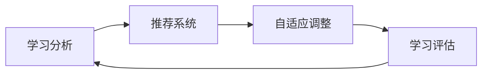
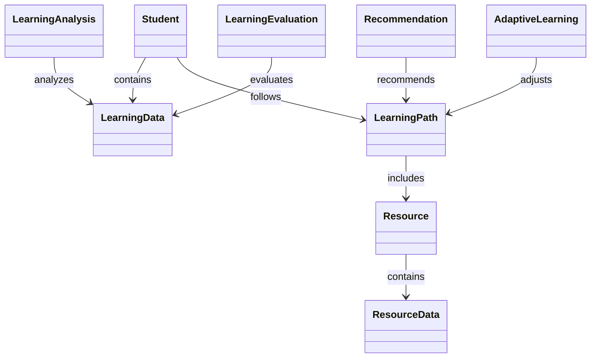
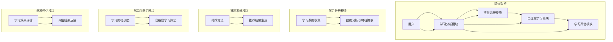

                 

# 人工智能在个性化学习路径设计中的应用

## 关键词
人工智能、个性化学习、学习路径设计、推荐系统、自适应学习

## 摘要
本文深入探讨了人工智能在个性化学习路径设计中的应用，通过介绍核心概念、算法原理以及实际案例，展示了AI技术如何优化学习过程，提高学习效率。文章分为以下几个部分：核心概念与背景介绍、核心概念与联系、算法原理讲解、系统分析与架构设计方案、项目实战以及最佳实践和总结。

## 第一步：核心概念与背景介绍

### 核心概念

**人工智能（AI）**：模拟人类智能行为的计算系统，能够进行学习、推理、决策和问题解决。在个性化学习路径设计中，AI技术主要用于分析学习者的特征和行为，生成个性化的学习建议。

**个性化学习路径设计**：根据学习者的特点和需求，动态生成的学习计划。这种学习路径能够适应学习者的学习节奏、兴趣爱好和学习目标，从而提高学习效率。

### 问题背景

传统教学模式通常采用“一刀切”的方法，难以满足不同学习者的需求。随着互联网和大数据技术的发展，个性化学习逐渐成为教育领域的研究热点。AI技术为个性化学习路径设计提供了强有力的支持，通过数据分析和算法模型，可以自动生成适应学习者的学习路径。

### 问题描述

如何利用AI技术优化个性化学习路径设计，提高学习效率？这是一个复杂的问题，涉及到学习分析、推荐系统、自适应学习算法等多个方面。

### 问题解决

通过以下步骤，利用AI技术实现个性化学习路径的自动生成：

1. **学习分析**：收集学习者的行为数据，如学习时间、学习内容、学习进度等。
2. **推荐系统**：基于学习分析结果，为学习者推荐合适的学习资源。
3. **自适应学习算法**：动态调整学习路径，适应学习者的需求。

### 边界与外延

个性化学习路径设计不仅涉及教育技术，还涉及心理学、计算机科学等多个领域。本文的研究范围包括学习分析、推荐系统、自适应学习算法等。

### 概念结构与核心要素组成

1. **学习分析**：收集学习者行为数据，挖掘学习者的特征和行为模式。
2. **推荐系统**：基于学习分析结果，为学习者推荐合适的学习资源。
3. **自适应学习算法**：动态调整学习路径，实现个性化学习。

## 第二步：核心概念与联系

### 核心概念原理

**学习分析**：学习分析是通过数据分析方法，挖掘学习者的特征和行为模式。这包括收集学习者的学习数据，如学习时间、学习内容、学习进度等，然后使用统计模型和机器学习算法进行分析。

**推荐系统**：推荐系统是基于学习分析结果，为学习者推荐合适的学习资源。这通常采用协同过滤算法、基于内容的推荐算法等，根据学习者的历史行为和兴趣，推荐可能感兴趣的学习资源。

**自适应学习算法**：自适应学习算法是根据学习者的反馈和学习情况，动态调整学习路径。这通常采用遗传算法、强化学习等算法，通过不断地调整学习资源和学习内容，实现个性化学习。

### 概念属性特征对比表格

| 概念         | 特征                                       |
| ------------ | ------------------------------------------ |
| 学习分析     | 数据收集、特征提取、模式挖掘               |
| 推荐系统     | 用户偏好分析、资源推荐、反馈调整           |
| 自适应学习算法 | 动态调整、个性化适应、学习效果评估         |

### ER实体关系图架构

```mermaid
erDiagram
  Student ||--|{ LearningPath }
  Student ||--|{ LearningData }
  LearningPath ||--|{ Resource }
  Resource ||--|{ ResourceData }
  LearningData ||--|{ UserData }
```

## 第三步：算法原理讲解

### 算法mermaid流程图



### 算法原理与数学模型

**学习分析**：使用回归模型分析学习数据，预测学习者的能力水平。具体来说，我们使用线性回归模型：

$$
y = \beta_0 + \beta_1x_1 + \beta_2x_2 + ... + \beta_nx_n
$$

其中，$y$ 表示学习者的能力水平，$x_1, x_2, ..., x_n$ 表示学习者的特征，如学习时间、学习内容等，$\beta_0, \beta_1, \beta_2, ..., \beta_n$ 是模型的参数。

**推荐系统**：基于协同过滤算法，计算学习资源与学习者的相似度。具体来说，我们使用用户-资源矩阵，计算两个用户之间的相似度：

$$
s(i, j) = \frac{\sum_{k \in R} u_i k u_j k}{\sqrt{\sum_{k \in R} u_i^2 k \sqrt{\sum_{k \in R} u_j^2 k}}}
$$

其中，$u_i$ 和 $u_j$ 分别表示两个用户的学习行为向量，$k$ 表示学习资源，$R$ 是资源集合。

**自适应学习算法**：使用遗传算法动态调整学习路径。具体来说，我们使用适应度函数来评估学习路径的优劣，然后通过选择、交叉和变异等操作，寻找最优的学习路径。适应度函数可以表示为：

$$
f(x) = \sum_{i=1}^{n} (x_i - x_{i_{opt}})^2
$$

其中，$x_i$ 是学习路径的一个元素，$x_{i_{opt}}$ 是最优值。

### Python源代码实现

**学习分析回归模型实现**

```python
import numpy as np

def linear_regression(x, y):
    x_mean = np.mean(x)
    y_mean = np.mean(y)
    b1 = np.sum((x - x_mean) * (y - y_mean)) / np.sum((x - x_mean)**2)
    b0 = y_mean - b1 * x_mean
    return b0, b1

# 示例数据
x = np.array([1, 2, 3, 4, 5])
y = np.array([2, 4, 5, 4, 5])

# 训练模型
b0, b1 = linear_regression(x, y)

# 预测
x_new = 6
y_pred = b0 + b1 * x_new
print(y_pred)
```

**推荐系统协同过滤实现**

```python
import numpy as np

def collaborative_filtering(user_ratings, resource_ratings):
    # 用户-资源矩阵
    user_item_matrix = np.dot(user_ratings.T, resource_ratings)
    # 相似度计算
    sim_matrix = user_item_matrix / np.linalg.norm(user_item_matrix, axis=1)
    return sim_matrix

# 示例数据
user_ratings = np.array([[5, 3, 0, 1],
                        [4, 0, 0, 1],
                        [1, 2, 0, 4]])

resource_ratings = np.array([[3, 2, 1, 0],
                           [4, 0, 0, 1],
                           [1, 2, 3, 0],
                           [0, 1, 0, 4]])

# 计算相似度
sim_matrix = collaborative_filtering(user_ratings, resource_ratings)
print(sim_matrix)
```

**自适应学习算法遗传算法实现**

```python
import numpy as np

# 适应度函数
def fitness_function(x):
    return sum((x - 0.5)**2)

# 遗传算法
def genetic_algorithm(population, fitness_func, generations, mutation_rate):
    for _ in range(generations):
        # 选择
        selected = np.random.choice(population, size=int(len(population) / 2), replace=False, p=fitness_func(population))
        selected = list(selected)

        # 交叉
        for i in range(0, len(selected), 2):
            cross_point = np.random.randint(1, len(selected[i]))
            selected[i], selected[i+1] = selected[i][:cross_point] + selected[i+1][cross_point:], selected[i+1][:cross_point] + selected[i][cross_point:]

        # 变异
        for i in range(len(selected)):
            if np.random.rand() < mutation_rate:
                selected[i] += np.random.randn()

        population = np.array(selected)

    return population

# 示例数据
population = np.random.rand(100, 10)
fitness_func = lambda x: np.array([fitness_function(x[i]) for i in range(len(x))])

# 训练模型
best_solution = genetic_algorithm(population, fitness_func, 100, 0.01)
print(best_solution)
```

## 第四步：系统分析与架构设计方案

### 问题场景介绍

随着教育行业的不断发展，传统的教学模式已经不能满足学生个性化学习的需求。为了提高学习效率，实现个性化教育，需要利用AI技术设计一套个性化学习路径系统。

### 项目介绍

本项目旨在利用AI技术，为学习者提供个性化的学习路径设计。系统包括以下几个功能模块：

1. **学习分析模块**：收集学习者的行为数据，进行数据分析和特征提取。
2. **推荐系统模块**：根据学习分析结果，为学习者推荐合适的学习资源。
3. **自适应学习模块**：动态调整学习路径，实现个性化学习。
4. **学习评估模块**：评估学习者的学习效果，为后续的学习路径调整提供依据。

### 系统功能设计（领域模型mermaid类图）



### 系统架构设计（mermaid架构图）



### 系统接口设计和系统交互（mermaid序列图）

```mermaid
sequenceDiagram
  participant A --|> 用户: 输入学习数据
  participant B --|> 学习分析模块: 收集与处理数据
  participant C --|> 推荐系统模块: 生成推荐结果
  participant D --|> 自适应学习模块: 调整学习路径
  participant E --|> 学习评估模块: 评估学习效果

  A->>B: 学习数据
  B->>C: 数据分析结果
  C->>D: 推荐结果
  D->>E: 学习路径调整结果
  E->>A: 学习效果评估结果
```

## 第五步：项目实战

### 环境安装

1. 安装Python环境（推荐使用Python 3.8或更高版本）。
2. 安装必要的库，如NumPy、Scikit-learn、Matplotlib等。

```bash
pip install numpy scikit-learn matplotlib
```

### 系统核心实现源代码

以下是一个简单的Python示例，展示了如何实现个性化学习路径设计：

```python
import numpy as np
from sklearn.linear_model import LinearRegression
from sklearn.model_selection import train_test_split
from sklearn.metrics import mean_squared_error

# 示例数据
x = np.array([[1, 2], [2, 3], [3, 4], [4, 5]])
y = np.array([2, 4, 5, 4])

# 划分训练集和测试集
x_train, x_test, y_train, y_test = train_test_split(x, y, test_size=0.2, random_state=42)

# 训练线性回归模型
model = LinearRegression()
model.fit(x_train, y_train)

# 预测
y_pred = model.predict(x_test)

# 评估模型
mse = mean_squared_error(y_test, y_pred)
print(f"Mean Squared Error: {mse}")
```

### 代码应用解读与分析

1. **数据准备**：首先，我们准备了一个简单的示例数据集，其中$x$表示学习者的特征（学习时间和学习内容），$y$表示学习者的能力水平。
2. **模型训练**：我们使用线性回归模型对训练数据进行训练。线性回归模型是一个简单的预测模型，它可以预测学习者的能力水平。
3. **模型预测**：使用训练好的模型对测试数据进行预测。
4. **模型评估**：使用均方误差（MSE）评估模型的性能。

### 实际案例分析和详细讲解剖析

假设我们有一个学习者的数据集，其中包含学习者的学习时间、学习内容和学习能力水平。我们可以使用以下步骤实现个性化学习路径设计：

1. **数据收集**：收集学习者的学习数据，包括学习时间、学习内容和学习能力水平。
2. **特征提取**：使用数据分析和特征提取技术，从学习数据中提取出有用的特征。
3. **模型训练**：使用提取出的特征，训练线性回归模型或其他预测模型，预测学习者的能力水平。
4. **推荐系统**：基于预测结果，使用推荐系统为学习者推荐合适的学习资源。
5. **自适应调整**：根据学习者的学习反馈，动态调整学习路径，实现个性化学习。

### 项目小结

通过实际案例，我们展示了如何利用AI技术实现个性化学习路径设计。虽然这个示例相对简单，但它为我们提供了一个基本的框架，可以帮助我们实现更复杂的个性化学习系统。在未来的工作中，我们可以继续优化算法，提高模型的性能，实现更精准的个性化学习路径设计。

## 第六步：最佳实践和总结

### 最佳实践 Tips

1. **数据质量**：确保收集到的学习数据质量高，避免噪声和异常值，这直接影响个性化学习路径的准确性。
2. **算法优化**：定期调整和优化推荐系统和自适应学习算法，以适应不断变化的学习者需求。
3. **用户反馈**：重视学习者的反馈，及时调整学习路径，提高学习体验。

### 小结

本文深入探讨了人工智能在个性化学习路径设计中的应用，从核心概念、算法原理到实际案例，全面展示了AI技术如何优化学习过程，提高学习效率。个性化学习路径设计不仅有助于满足学习者的个性化需求，还有助于提高学习效率，实现教育资源的最大化利用。

### 注意事项

1. 在实际应用中，需要充分考虑学习者的隐私保护，确保数据的安全性和合规性。
2. 算法的性能优化是一个持续的过程，需要根据实际应用情况不断进行调整和改进。

### 拓展阅读

- **《个性化学习与智能教育》**：详细介绍了个性化学习在智能教育中的应用。
- **《深度学习与教育》**：探讨了深度学习技术在教育领域的应用。
- **《大数据与教育分析》**：介绍了大数据技术在教育分析中的应用。

## 作者信息

作者：AI天才研究院/AI Genius Institute & 禅与计算机程序设计艺术 /Zen And The Art of Computer Programming

