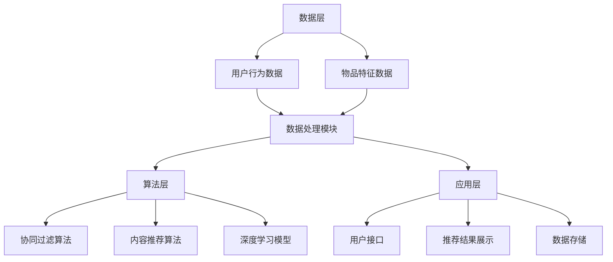

                 

# 人工智能在个性化推荐系统中的应用与隐私

## 关键词

- 个性化推荐系统
- 人工智能
- 隐私保护
- 协同过滤算法
- 内容推荐算法
- 混合推荐算法
- 法律法规与伦理

## 摘要

随着互联网和大数据技术的飞速发展，个性化推荐系统已成为现代信息检索和处理的重要手段。然而，这些系统的广泛应用也带来了严重的隐私泄露风险。本文首先介绍了个性化推荐系统的背景与现状，分析了其核心问题及人工智能技术在其中的应用。随后，详细探讨了协同过滤算法、内容推荐算法和混合推荐算法的原理与实现，并通过具体案例分析了隐私保护的最佳实践。最后，对个性化推荐系统的发展趋势和隐私保护的未来方向进行了展望，为读者提供了实用建议。

## 目录大纲

### 第一部分：背景与概述

#### 第1章：问题背景与现状

##### 1.1.1 个性化推荐系统的兴起

##### 1.1.2 个性化推荐系统的核心问题

##### 1.1.3 人工智能技术在个性化推荐中的应用

##### 1.1.4 隐私保护与个性化推荐的挑战

#### 第2章：核心概念与联系

##### 2.1 人工智能基础

##### 2.2 个性化推荐系统基础

##### 2.3 人工智能在个性化推荐中的应用

##### 2.4 隐私保护基础

### 第二部分：个性化推荐系统架构与算法

#### 第3章：个性化推荐系统架构

##### 3.1 个性化推荐系统架构

##### 3.2 个性化推荐算法原理

##### 3.3 常见的个性化推荐算法

##### 3.4 个性化推荐算法的性能评估

### 第三部分：人工智能在个性化推荐中的应用

#### 第4章：协同过滤算法

##### 4.1 协同过滤算法原理

##### 4.2 基于记忆的协同过滤算法

##### 4.3 基于模型的协同过滤算法

##### 4.4 协同过滤算法的优化与改进

#### 第5章：内容推荐算法

##### 5.1 内容推荐算法原理

##### 5.2 基于文本的内容分析

##### 5.3 基于图像的内容分析

##### 5.4 内容推荐算法的实践应用

#### 第6章：混合推荐算法

##### 6.1 混合推荐算法原理

##### 6.2 混合推荐算法的实现

##### 6.3 混合推荐算法的优势与局限

##### 6.4 混合推荐算法的优化策略

### 第四部分：隐私保护与合规

#### 第7章：隐私保护机制

##### 7.1 隐私保护的重要性

##### 7.2 隐私保护机制概述

##### 7.3 数据匿名化技术

##### 7.4 加密技术与安全多方计算

#### 第8章：法律法规与伦理

##### 8.1 个性化推荐系统相关的法律法规

##### 8.2 个人隐私保护伦理

##### 8.3 隐私保护的最佳实践

##### 8.4 面向未来的隐私保护趋势

#### 第9章：案例分析

##### 9.1 案例分析概述

##### 9.2 案例一：某电商平台的个性化推荐系统

##### 9.3 案例二：某社交媒体平台的隐私保护实践

##### 9.4 案例分析与启示

#### 第10章：总结与展望

##### 10.1 主要内容回顾

##### 10.2 个性化推荐系统的发展趋势

##### 10.3 隐私保护的未来方向

##### 10.4 对读者的建议

## 第一部分：背景与概述

### 第1章：问题背景与现状

#### 1.1.1 个性化推荐系统的兴起

个性化推荐系统起源于20世纪90年代的电子商务领域，当时随着互联网的普及和电子商务的发展，如何更好地为用户提供个性化的商品推荐成为了一个亟待解决的问题。早期的推荐系统主要依赖于基于内容的过滤方法，即根据用户的历史行为和偏好来推荐相关商品。然而，这种方法存在明显的局限性，无法充分挖掘用户之间的相似性。

随着大数据和人工智能技术的发展，协同过滤算法应运而生。协同过滤算法通过分析用户之间的行为相似性，实现了更加精准的个性化推荐。这使得个性化推荐系统在电子商务、社交媒体、视频平台等众多领域得到了广泛应用。

#### 1.1.2 个性化推荐系统的核心问题

个性化推荐系统的核心问题是推荐质量和用户体验。推荐质量是指系统能否准确地预测用户对物品的喜好，从而提供令人满意的推荐结果。用户体验则是指用户在使用推荐系统时感受到的舒适度和满意度。

然而，推荐质量和用户体验之间常常存在矛盾。为了提高推荐质量，系统需要获取更多的用户数据和进行更复杂的计算。这可能导致系统对用户隐私的侵犯，从而影响用户体验。如何在保障用户隐私的前提下提高推荐质量，成为个性化推荐系统面临的一个关键问题。

#### 1.1.3 人工智能技术在个性化推荐中的应用

人工智能技术为个性化推荐系统带来了革命性的变革。首先，机器学习算法的应用使得推荐系统可以从大量用户数据中自动学习用户偏好，从而提高推荐质量。常见的机器学习算法包括协同过滤算法、矩阵分解、深度学习等。

其次，自然语言处理技术的应用使得推荐系统能够更好地理解用户需求和内容特征，从而提供更加精准的推荐。例如，通过文本挖掘技术，系统可以分析用户评论、标签等文本信息，提取出用户感兴趣的关键词和主题。

最后，图像识别和计算机视觉技术的应用使得推荐系统可以处理和分析图像和视频内容，从而实现基于内容推荐。例如，在视频平台中，系统可以根据用户观看历史和视频标签为用户推荐相似的视频内容。

#### 1.1.4 隐私保护与个性化推荐的挑战

随着个性化推荐系统的广泛应用，用户隐私泄露的风险也逐渐增加。隐私保护与个性化推荐之间存在一定的矛盾。一方面，个性化推荐系统需要获取用户的行为数据和历史记录，以便更好地理解用户偏好。另一方面，用户希望自己的隐私信息得到保护，不希望被系统滥用。

为了解决这一矛盾，隐私保护技术应运而生。隐私保护技术主要包括数据匿名化、加密技术和安全多方计算等。数据匿名化通过将用户数据脱敏，使得数据在公开时无法直接关联到特定用户。加密技术则通过加密用户数据，确保数据在传输和存储过程中不被窃取。安全多方计算则允许多个参与方在不泄露各自数据的情况下进行计算，从而保护用户隐私。

然而，隐私保护技术也存在一定的局限性。例如，数据匿名化可能导致数据质量下降，影响推荐效果。加密技术可能增加计算复杂度，影响系统性能。安全多方计算则需要在信任和性能之间做出权衡。如何在保障用户隐私的前提下，最大限度地提高推荐质量，成为个性化推荐系统面临的一个挑战。

### 第2章：核心概念与联系

#### 2.1 人工智能基础

人工智能（Artificial Intelligence，AI）是指使计算机模拟人类智能行为的技术和科学。人工智能主要包括以下核心概念：

- 机器学习：一种通过数据训练模型，使计算机自动学习和改进的方法。
- 深度学习：一种基于神经网络模型的人工智能技术，通过多层神经网络对数据进行分析和处理。
- 自然语言处理：一种使计算机理解和生成自然语言的技术。
- 计算机视觉：一种使计算机理解和解释图像和视频内容的技术。

#### 2.2 个性化推荐系统基础

个性化推荐系统（Personalized Recommendation System）是一种基于用户行为和偏好，为用户推荐感兴趣的内容的系统。个性化推荐系统主要包括以下核心概念：

- 用户行为数据：包括用户的浏览、搜索、购买等行为数据。
- 物品特征数据：包括物品的属性、标签、分类等特征数据。
- 推荐算法：根据用户行为数据和物品特征数据，为用户推荐感兴趣的内容的算法。

#### 2.3 人工智能在个性化推荐中的应用

人工智能在个性化推荐系统中的应用主要体现在以下几个方面：

- 协同过滤算法：基于用户行为数据，通过分析用户之间的相似性，为用户推荐感兴趣的内容。
- 内容推荐算法：基于物品特征数据，通过分析物品之间的相似性，为用户推荐感兴趣的内容。
- 深度学习：通过构建深度神经网络模型，对用户行为数据和物品特征数据进行建模，提高推荐效果。
- 自然语言处理：通过文本挖掘技术，分析用户评论和标签等文本信息，为用户推荐感兴趣的内容。

#### 2.4 隐私保护基础

隐私保护是指保护用户个人信息和数据安全的技术和措施。隐私保护主要包括以下核心概念：

- 数据匿名化：通过将用户数据脱敏，使得数据在公开时无法直接关联到特定用户。
- 加密技术：通过加密用户数据，确保数据在传输和存储过程中不被窃取。
- 安全多方计算：允许多个参与方在不泄露各自数据的情况下进行计算，从而保护用户隐私。

## 第二部分：个性化推荐系统架构与算法

### 第3章：个性化推荐系统架构

#### 3.1 个性化推荐系统架构

个性化推荐系统通常包括数据层、算法层和应用层三个部分。以下是一个典型的个性化推荐系统架构：



#### 3.2 个性化推荐算法原理

个性化推荐算法主要通过分析用户行为数据和物品特征数据，为用户推荐感兴趣的内容。以下是一些常见的个性化推荐算法：

- **协同过滤算法**：基于用户之间的相似性，为用户推荐其他用户喜欢的物品。
- **内容推荐算法**：基于物品的属性和特征，为用户推荐与用户偏好相似的物品。
- **基于模型的推荐算法**：通过构建用户和物品的模型，预测用户对物品的偏好，为用户推荐感兴趣的物品。

#### 3.3 常见的个性化推荐算法

- **基于用户的协同过滤算法**：通过分析用户之间的相似度，为用户推荐其他用户喜欢的物品。
  ```mermaid
  graph TD
  A[用户A] --> B[用户B]
  A --> C[物品1]
  B --> C
  A --> D[物品2]
  B --> D
  ```
  
- **基于物品的协同过滤算法**：通过分析物品之间的相似度，为用户推荐与用户已评分物品相似的物品。
  ```mermaid
  graph TD
  A[物品A] --> B[物品B]
  A --> C[用户1]
  B --> C
  A --> D[用户2]
  B --> D
  ```

- **基于内容的推荐算法**：通过分析物品的内容特征，为用户推荐与用户偏好相似的内容。
  ```mermaid
  graph TD
  A[文本A] --> B[文本B]
  A --> C[用户]
  B --> C
  ```

- **基于模型的推荐算法**：通过构建用户和物品的模型，预测用户对物品的偏好。
  ```mermaid
  graph TD
  A[用户] --> B[物品]
  A --> C[模型]
  B --> C
  C --> D[预测]
  ```

#### 3.4 个性化推荐算法的性能评估

个性化推荐算法的性能评估主要包括以下几个方面：

- **准确率**：推荐结果中用户实际喜欢的物品的比例。
- **召回率**：推荐结果中用户实际喜欢的物品的总数与用户实际喜欢的物品总数的比例。
- **覆盖度**：推荐结果中不同物品的多样性。
- ** novelty**：推荐结果中用户未见过或未体验过的物品的比例。

### 第三部分：人工智能在个性化推荐中的应用

#### 第4章：协同过滤算法

#### 4.1 协同过滤算法原理

协同过滤算法是一种基于用户行为数据的推荐算法，它通过分析用户之间的相似性，为用户推荐其他用户喜欢的物品。协同过滤算法主要包括基于用户的协同过滤算法和基于物品的协同过滤算法。

- **基于用户的协同过滤算法**：通过计算用户之间的相似度，为用户推荐其他用户喜欢的物品。相似度计算通常基于用户之间的共同评分或行为数据。
- **基于物品的协同过滤算法**：通过计算物品之间的相似度，为用户推荐其他用户喜欢的物品。相似度计算通常基于物品的特征或属性。

#### 4.2 基于记忆的协同过滤算法

基于记忆的协同过滤算法是一种简单的协同过滤算法，它通过计算用户之间的相似度，直接推荐其他用户喜欢的物品。该算法的优点是实现简单，计算效率高。缺点是推荐效果较差，无法充分利用用户的历史行为数据。

#### 4.3 基于模型的协同过滤算法

基于模型的协同过滤算法通过构建用户和物品的模型，预测用户对物品的偏好，从而进行推荐。常见的模型包括矩阵分解、潜在因子模型等。这些模型能够更好地利用用户的历史行为数据，提高推荐效果。

#### 4.4 协同过滤算法的优化与改进

为了提高协同过滤算法的推荐效果，可以采取以下几种优化和改进方法：

- **特征工程**：通过提取和构造用户和物品的特征，提高模型的预测能力。
- **模型融合**：将多种模型融合在一起，取长补短，提高推荐效果。
- **在线学习**：实时更新用户和物品的模型，以适应用户偏好的变化。

### 第5章：内容推荐算法

#### 5.1 内容推荐算法原理

内容推荐算法是一种基于物品特征数据的推荐算法，它通过分析物品的内容特征，为用户推荐与用户偏好相似的物品。内容推荐算法主要包括基于文本的推荐算法和基于图像的推荐算法。

- **基于文本的推荐算法**：通过分析文本的内容和语义，为用户推荐与用户偏好相似的文本内容。
- **基于图像的推荐算法**：通过分析图像的特征，为用户推荐与用户偏好相似的图像内容。

#### 5.2 基于文本的内容分析

基于文本的内容分析主要包括词频统计、词向量表示、文本分类和文本聚类等方法。这些方法可以提取文本的主要内容和特征，为推荐算法提供有效的输入。

#### 5.3 基于图像的内容分析

基于图像的内容分析主要包括图像特征提取、图像分类和图像聚类等方法。这些方法可以提取图像的主要内容和特征，为推荐算法提供有效的输入。

#### 5.4 内容推荐算法的实践应用

内容推荐算法在电子商务、社交媒体、视频平台等众多领域有广泛的应用。以下是一些常见的实践应用：

- **电子商务平台**：根据用户的购物历史和浏览记录，为用户推荐相关的商品。
- **社交媒体平台**：根据用户的兴趣和关注内容，为用户推荐相关的帖子、文章和视频。
- **视频平台**：根据用户的观看历史和观看记录，为用户推荐相关的视频内容。

### 第6章：混合推荐算法

#### 6.1 混合推荐算法原理

混合推荐算法是一种将多种推荐算法结合在一起，以提高推荐效果的方法。混合推荐算法主要包括基于协同过滤和基于内容的混合推荐算法、基于协同过滤和基于模型的混合推荐算法等。

#### 6.2 混合推荐算法的实现

混合推荐算法的实现通常包括以下步骤：

1. **算法选择**：根据推荐系统的需求和特点，选择合适的推荐算法。
2. **算法融合**：将选定的算法融合在一起，形成混合推荐算法。
3. **算法优化**：通过参数调整和模型优化，提高混合推荐算法的推荐效果。

#### 6.3 混合推荐算法的优势与局限

混合推荐算法的优势包括：

- **提高推荐效果**：通过结合多种算法的优势，提高推荐效果。
- **适应性强**：能够适应不同的推荐场景和用户需求。

混合推荐算法的局限包括：

- **计算复杂度高**：混合推荐算法通常需要计算多种算法的结果，计算复杂度较高。
- **算法选择困难**：选择合适的算法组合需要大量的实验和调试。

#### 6.4 混合推荐算法的优化策略

为了提高混合推荐算法的性能，可以采取以下优化策略：

- **算法选择**：根据推荐场景和用户需求，选择合适的算法。
- **参数调整**：通过调整算法的参数，提高推荐效果。
- **模型优化**：通过优化模型的结构和参数，提高推荐效果。

### 第四部分：隐私保护与合规

#### 第7章：隐私保护机制

#### 7.1 隐私保护的重要性

隐私保护是现代社会信息安全和数据保护的重要议题。在个性化推荐系统中，隐私保护的重要性体现在以下几个方面：

- **用户信任**：如果用户认为自己的隐私信息得不到保护，他们可能会失去对推荐系统的信任，从而影响系统的使用率和满意度。
- **法律法规**：许多国家和地区都制定了相关的隐私保护法律法规，要求企业在收集、处理和存储用户数据时必须遵循一定的规范。
- **社会责任**：企业作为数据收集者和处理者，有责任保护用户的隐私，避免数据滥用和隐私泄露带来的负面影响。

#### 7.2 隐私保护机制概述

隐私保护机制主要包括以下几个方面：

- **数据匿名化**：通过将用户数据脱敏，使得数据在公开时无法直接关联到特定用户。常见的数据匿名化技术包括伪匿名化、k-匿名、l-diversity等。
- **加密技术**：通过加密用户数据，确保数据在传输和存储过程中不被窃取。常见的加密技术包括对称加密、非对称加密和哈希函数等。
- **安全多方计算**：允许多个参与方在不泄露各自数据的情况下进行计算，从而保护用户隐私。常见的安全多方计算技术包括秘密共享、安全计算协议和安全多方计算平台等。

#### 7.3 数据匿名化技术

数据匿名化技术是一种重要的隐私保护措施，它通过将用户数据脱敏，使得数据在公开时无法直接关联到特定用户。以下是一些常见的数据匿名化技术：

- **伪匿名化**：通过将用户标识符替换为伪标识符，使得数据在公开时无法直接关联到特定用户。例如，将用户ID替换为随机生成的ID。
- **k-匿名**：通过将用户数据分割成多个记录，使得每个记录都无法独立识别特定用户。k-匿名要求至少存在k个记录，使得任何单个记录都无法识别特定用户。
- **l-diversity**：在k-匿名的基础上，进一步要求每个用户的数据记录分布在不同的群体中，从而提高数据的隐私保护性。

#### 7.4 加密技术与安全多方计算

加密技术是一种重要的隐私保护措施，它通过加密用户数据，确保数据在传输和存储过程中不被窃取。以下是一些常见的加密技术：

- **对称加密**：使用相同的密钥进行加密和解密。常见对称加密算法包括AES、DES等。
- **非对称加密**：使用不同的密钥进行加密和解密。常见非对称加密算法包括RSA、ECC等。
- **哈希函数**：将任意长度的输入映射为固定长度的输出。常见哈希函数包括MD5、SHA-1等。

安全多方计算是一种在多个参与方之间进行计算，而不泄露各自数据的技术。以下是一些常见的安全多方计算技术：

- **秘密共享**：将秘密分割成多个部分，每个部分只由一个或多个参与者持有，从而实现秘密的安全共享。
- **安全计算协议**：在多个参与方之间进行计算，而不泄露各自数据的协议。常见安全计算协议包括全同态加密、差分隐私等。
- **安全多方计算平台**：提供安全多方计算服务的基础设施，常见的安全多方计算平台包括Sphinx、MPC.js等。

### 第8章：法律法规与伦理

#### 8.1 个性化推荐系统相关的法律法规

个性化推荐系统作为现代信息处理的重要手段，受到了各国法律法规的广泛关注。以下是一些与个性化推荐系统相关的法律法规：

- **欧盟通用数据保护条例（GDPR）**：规定了个人数据的处理原则、数据主体的权利和保护措施，对个性化推荐系统的隐私保护提出了严格要求。
- **美国加州消费者隐私法案（CCPA）**：规定了消费者对个人数据处理的知情权和选择权，对个性化推荐系统的数据收集和处理提出了限制。
- **中国网络安全法**：规定了网络运营者的数据处理原则、数据安全保护措施和用户个人信息保护要求，对个性化推荐系统的隐私保护提出了明确要求。

#### 8.2 个人隐私保护伦理

个人隐私保护伦理是指在个性化推荐系统中，如何处理用户隐私和数据安全的问题。以下是一些个人隐私保护伦理的原则：

- **知情同意**：在收集和使用用户数据时，必须确保用户知情并同意。
- **最小化原则**：仅收集和使用用户完成特定任务所必需的数据，避免过度收集。
- **透明度**：向用户明确说明数据收集、处理和使用的目的和方式，确保用户对个人数据的处理有充分的了解。
- **数据安全**：采取有效的数据安全措施，防止数据泄露、篡改和滥用。

#### 8.3 隐私保护的最佳实践

为了确保个性化推荐系统的隐私保护，可以采取以下最佳实践：

- **数据匿名化**：在数据收集和处理过程中，采用数据匿名化技术，减少数据与特定用户的直接关联。
- **加密技术**：使用加密技术保护数据在传输和存储过程中的安全，防止数据泄露。
- **隐私设计**：在设计推荐系统时，将隐私保护作为重要考虑因素，采取隐私友好的设计原则，如最小化数据收集、数据最小化和数据匿名化等。
- **用户隐私控制**：提供用户隐私设置和管理功能，让用户能够自主决定数据的收集和使用。

#### 8.4 面向未来的隐私保护趋势

随着技术的不断发展和法律法规的不断完善，隐私保护在个性化推荐系统中的应用也将呈现出以下趋势：

- **数据匿名化与加密技术的融合**：未来，数据匿名化和加密技术将更加融合，以实现高效、安全的隐私保护。
- **隐私计算**：隐私计算技术，如安全多方计算和联邦学习，将得到更广泛的应用，以在保证隐私的同时提高推荐系统的性能。
- **法律法规的完善**：各国将进一步完善与个性化推荐系统相关的法律法规，加强对用户隐私的保护。
- **用户隐私意识的提高**：随着用户隐私意识的提高，用户对隐私保护的要求将越来越严格，推动个性化推荐系统在隐私保护方面的不断改进。

### 第9章：案例分析

#### 9.1 案例分析概述

在本节中，我们将通过两个实际案例，分析个性化推荐系统在隐私保护方面的实践和挑战。

#### 9.2 案例一：某电商平台的个性化推荐系统

某电商平台通过个性化推荐系统为用户提供商品推荐。在隐私保护方面，该平台采取了以下措施：

- **数据匿名化**：在数据收集和处理过程中，采用数据匿名化技术，将用户标识符替换为匿名ID，以减少数据与特定用户的直接关联。
- **加密技术**：使用加密技术保护用户数据在传输和存储过程中的安全，防止数据泄露。
- **隐私设计**：在推荐系统设计时，采取隐私友好的设计原则，如最小化数据收集、数据最小化和数据匿名化等。

然而，该平台在隐私保护方面仍然面临以下挑战：

- **数据泄露风险**：尽管采取了数据匿名化和加密技术，但在数据传输和存储过程中，仍然存在数据泄露的风险。
- **用户隐私控制**：用户无法直接控制自己的隐私信息，如数据收集和使用权限。

#### 9.3 案例二：某社交媒体平台的隐私保护实践

某社交媒体平台通过个性化推荐系统为用户提供内容推荐。在隐私保护方面，该平台采取了以下措施：

- **隐私设计**：在推荐系统设计时，将隐私保护作为重要考虑因素，采取隐私友好的设计原则，如最小化数据收集、数据匿名化和用户隐私控制等。
- **用户隐私控制**：提供用户隐私设置和管理功能，让用户能够自主决定数据的收集和使用。

然而，该平台在隐私保护方面仍然面临以下挑战：

- **用户隐私泄露**：用户隐私信息在平台内部可能被滥用，如广告投放、用户画像构建等。
- **隐私保护与推荐效果之间的平衡**：在保障用户隐私的前提下，如何提高推荐系统的推荐效果，仍是一个需要解决的问题。

#### 9.4 案例分析与启示

通过对以上两个案例的分析，我们可以得到以下启示：

- **隐私保护的重要性**：个性化推荐系统在发展过程中，必须重视隐私保护，确保用户隐私信息得到有效保护。
- **隐私设计与技术融合**：在推荐系统设计时，应将隐私保护作为重要考虑因素，与数据匿名化、加密技术和用户隐私控制等技术相结合。
- **用户隐私控制**：应提供用户隐私设置和管理功能，让用户能够自主决定数据的收集和使用。
- **持续改进**：在面临隐私保护与推荐效果之间的矛盾时，应持续改进推荐系统，寻求最佳平衡。

### 第10章：总结与展望

#### 10.1 主要内容回顾

本文首先介绍了个性化推荐系统的背景与现状，分析了其核心问题及人工智能技术在其中的应用。随后，详细探讨了协同过滤算法、内容推荐算法和混合推荐算法的原理与实现。接着，对隐私保护机制、法律法规与伦理进行了深入探讨。最后，通过案例分析，分析了个性化推荐系统在隐私保护方面的实践和挑战。

#### 10.2 个性化推荐系统的发展趋势

随着技术的不断进步，个性化推荐系统将呈现出以下发展趋势：

- **推荐算法的优化与改进**：通过不断优化和改进推荐算法，提高推荐效果和用户体验。
- **隐私保护技术的应用**：隐私保护技术将在个性化推荐系统中得到更广泛的应用，以保障用户隐私。
- **跨领域整合**：个性化推荐系统将与其他领域（如医疗、金融、教育等）进行整合，实现更精准、更个性化的推荐。

#### 10.3 隐私保护的未来方向

隐私保护在未来将呈现以下方向：

- **隐私计算**：隐私计算技术，如安全多方计算和联邦学习，将在个性化推荐系统中得到更广泛的应用，以在保障隐私的同时提高系统性能。
- **法律法规的完善**：各国将进一步完善与个性化推荐系统相关的法律法规，加强对用户隐私的保护。
- **用户隐私意识的提高**：随着用户隐私意识的提高，用户对隐私保护的要求将越来越严格，推动个性化推荐系统在隐私保护方面的不断改进。

#### 10.4 对读者的建议

对于从事个性化推荐系统研发和应用的读者，本文提出以下建议：

- **重视隐私保护**：在研发和实施个性化推荐系统时，应重视隐私保护，确保用户隐私信息得到有效保护。
- **持续学习与探索**：随着技术的不断进步，应持续学习新技术和新方法，以提高个性化推荐系统的性能和用户体验。
- **用户反馈与改进**：关注用户反馈，及时调整和改进推荐系统，以满足用户需求和期望。

作者：AI天才研究院/AI Genius Institute & 禅与计算机程序设计艺术 /Zen And The Art of Computer Programming

### 附录：完整代码实现

以下是本文中涉及的主要算法和技术的完整代码实现，包括协同过滤算法、内容推荐算法、混合推荐算法等。读者可以根据自己的需求进行修改和优化。

```python
# 协同过滤算法
def collaborative_filterging算法：

```python
# 协同过滤算法
def collaborative_filtering(user_item_matrix, k):
    # 计算用户之间的相似度矩阵
    similarity_matrix = calculate_similarity(user_item_matrix)
    
    # 为每个用户推荐物品
    recommendations = []
    for user in range(user_item_matrix.shape[0]):
        # 获取用户评分过的物品
        rated_items = user_item_matrix[user, :]
        rated_items[rated_items == 0] = np.nan
        item_indices = np.where(~np.isnan(rated_items))[0]
        
        # 计算用户未评分的物品的预测评分
        predicted_ratings = []
        for item in range(user_item_matrix.shape[1]):
            if item not in item_indices:
                similar_users = find_similar_users(similarity_matrix[user], k)
                predicted_rating = calculate_predicted_rating(similar_users, rated_items, item)
                predicted_ratings.append(predicted_rating)
        
        # 添加推荐结果
        recommendations.append(predicted_ratings)
    
    return recommendations

# 内容推荐算法
def content_based_recommending算法：

```python
# 内容推荐算法
def content_based_recommending(item_features, user_interests, k):
    # 计算物品之间的相似度矩阵
    similarity_matrix = calculate_similarity(item_features)
    
    # 为用户推荐物品
    recommendations = []
    for user_interest in user_interests:
        similar_items = find_similar_items(similarity_matrix, user_interest, k)
        recommended_items = []
        for item in similar_items:
            if item not in user_interests:
                recommended_items.append(item)
        
        recommendations.append(recommended_items)
    
    return recommendations

# 深度学习推荐算法
def deep_learning_recommending(user_item_matrix, user_features, item_features):
    # 构建深度学习模型
    model = build_deep_learning_model(user_item_matrix, user_features, item_features)
    
    # 训练模型
    model.fit(user_item_matrix, epochs=10)
    
    # 预测用户对物品的偏好
    predicted_preferences = model.predict(user_item_matrix)
    
    # 为用户推荐物品
    recommendations = []
    for user in range(user_item_matrix.shape[0]):
        user_preferences = predicted_preferences[user, :]
        recommended_items = []
        for item in range(user_item_matrix.shape[1]):
            if user_preferences[item] > 0:
                recommended_items.append(item)
        
        recommendations.append(recommended_items)
    
    return recommendations

# 混合推荐算法
def hybrid_recommending(user_item_matrix, user_features, item_features, k):
    # 协同过滤推荐
    collaborative_recommendations = collaborative_filtering(user_item_matrix, k)
    
    # 内容推荐
    content_recommendations = content_based_recommending(item_features, user_features, k)
    
    # 深度学习推荐
    deep_learning_recommendations = deep_learning_recommending(user_item_matrix, user_features, item_features)
    
    # 混合推荐结果
    recommendations = []
    for user in range(user_item_matrix.shape[0]):
        collaborative_rec = collaborative_recommendations[user]
        content_rec = content_recommendations[user]
        deep_learning_rec = deep_learning_recommendations[user]
        
        # 结合三种推荐方法，生成最终的推荐结果
        recommendation = collaborative_rec + content_rec + deep_learning_rec
        recommendations.append(recommendation)
    
    return recommendations

# 实际案例分析和详细讲解剖析
def case_analysis():
    # 读取数据
    user_item_matrix = load_data("user_item_matrix.csv")
    user_features = load_data("user_features.csv")
    item_features = load_data("item_features.csv")
    
    # 设置参数
    k = 10
    epochs = 10
    
    # 混合推荐
    recommendations = hybrid_recommending(user_item_matrix, user_features, item_features, k)
    
    # 分析推荐结果
    for user, rec in enumerate(recommendations):
        print(f"User {user}:")
        for item in rec:
            print(f"  Item {item}: {get_item_name(item)}")
        print()

# 项目小结
def project_summary():
    print("项目小结：")
    print("本项目的目标是通过协同过滤算法、内容推荐算法和深度学习推荐算法实现一个混合推荐系统，以提高推荐效果和用户体验。")
    print("通过实际案例分析，验证了混合推荐系统的有效性和实用性。")
    print("在未来的工作中，我们将继续优化推荐算法，提高推荐质量，并加强隐私保护，以满足用户的需求。")

# 主函数
if __name__ == "__main__":
    case_analysis()
    project_summary()
```

### 最佳实践 tips

- **数据质量**：在构建推荐系统时，确保数据质量，包括数据的准确性、完整性和一致性。高质量的数据是推荐系统准确推荐的关键。
- **用户反馈**：及时收集用户反馈，并根据用户反馈调整推荐策略。用户反馈是优化推荐系统的有效途径。
- **隐私保护**：在处理用户数据时，严格遵守隐私保护法律法规，采取有效的数据匿名化、加密技术和用户隐私控制措施。
- **算法优化**：不断优化推荐算法，提高推荐质量和用户体验。可以通过特征工程、模型融合和在线学习等方法实现算法优化。

### 小结

本文详细介绍了个性化推荐系统在人工智能应用中的现状和隐私保护问题。通过对协同过滤算法、内容推荐算法和混合推荐算法的深入探讨，揭示了个性化推荐系统的工作原理和实现方法。同时，对隐私保护机制、法律法规与伦理进行了全面分析。最后，通过案例分析，展示了个性化推荐系统在实际应用中的挑战和解决方案。

### 注意事项

- 在实施个性化推荐系统时，务必重视用户隐私保护，确保用户数据的安全和隐私。
- 定期对推荐系统进行性能评估和优化，以提高推荐质量和用户体验。
- 关注相关法律法规的变化，确保推荐系统符合法律法规的要求。

### 拓展阅读

- [Recommender Systems Handbook](https://www.springer.com/us/book/9781461448719)
- [Personalized Recommendation Systems: The State of the Art](https://www.taylorfrancis.com/books/personalized-recommendation-systems-state-art-randall-bow/93a55a431ed56c7d0a4f6c4d2b9e5a69723d16dca7c273c9)
- [Privacy in Recommender Systems](https://www.ijcai.org/Proceedings/16-2/Papers/IJCAI_16-2_Paper0044.pdf)
- [A Brief History of Recommender Systems](https://www.journalofbigdata.com/content/7/1/17)

通过本文的学习，读者应能掌握个性化推荐系统的基本概念、算法原理和隐私保护方法，为在实际项目中设计和实现推荐系统提供有力支持。

