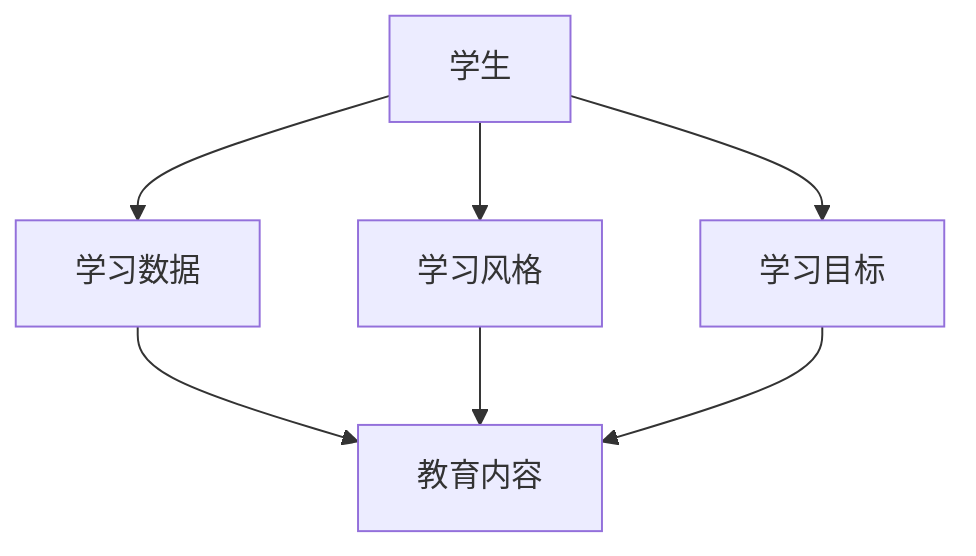
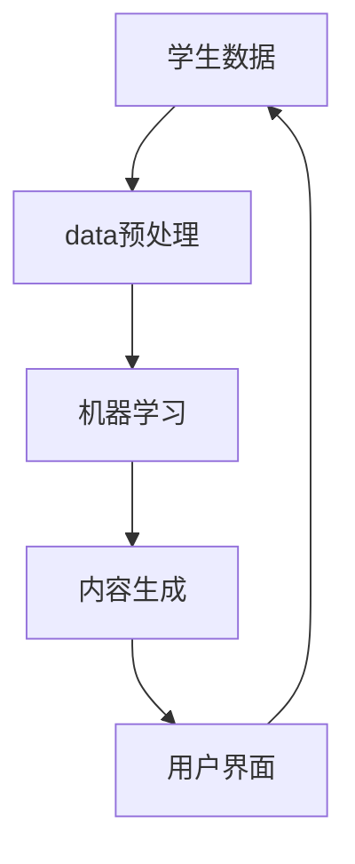
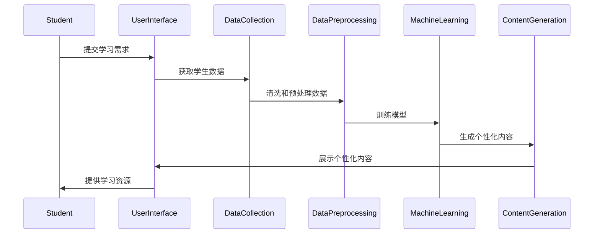
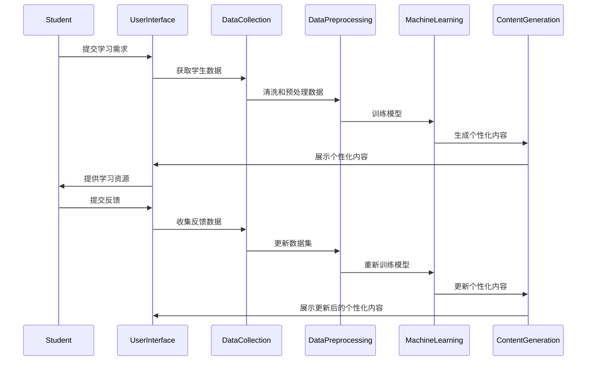

                 

### 人工智能在个性化教育内容生成中的应用

> 关键词：人工智能，个性化教育，内容生成，机器学习，深度学习

> 摘要：本文将探讨人工智能技术在个性化教育内容生成中的应用。通过对问题背景、核心概念、算法原理、系统设计及项目实践等方面的详细分析，旨在揭示人工智能如何通过算法和系统实现个性化教育的目标，提高教育质量，满足不同学生的学习需求。

## 1. 背景介绍：核心概念

### 1.1 问题背景

随着科技的快速发展，教育领域正经历深刻的变革。传统的教育模式以教师为中心，注重知识的传授和统一的标准，难以满足每个学生的个性化需求。然而，现代教育越来越强调学生的主动学习和个性发展，这要求教育内容能够根据每个学生的特点进行定制化。

#### 问题描述

在教育内容生成方面，存在的问题主要包括：

1. **内容同质化**：传统的教育内容大多采用统一的标准，难以适应不同学生的学习风格和能力水平。
2. **个性化不足**：教育内容生成缺乏对学生个性化需求的充分分析，无法提供针对性的学习资源。
3. **资源浪费**：大量教育资源被浪费在那些不适合学生需求的内容上，降低了学习效率。

#### 问题解决

人工智能技术在个性化教育内容生成中的应用，有望解决上述问题。通过机器学习和深度学习算法，人工智能能够分析学生的学习数据，生成适合他们个性需求的教育内容。

### 1.2 人工智能技术简介

#### AI定义与历史发展

人工智能（Artificial Intelligence, AI）是指通过计算机模拟人类智能的技术。自1956年约翰·麦卡锡等人首次提出人工智能概念以来，人工智能已经经历了多次重要的发展阶段。

#### AI在教育中的应用案例

1. **智能辅导系统**：通过分析学生的学习数据，智能辅导系统可以提供个性化的学习建议，帮助学生提高学习效果。
2. **自动评分系统**：利用自然语言处理和计算机视觉技术，自动评分系统可以自动评估学生的作业和考试，提高评分的准确性和效率。
3. **在线学习平台**：基于推荐算法，在线学习平台可以为学生推荐符合他们学习风格和知识水平的学习内容。

#### 个性化教育的需求与挑战

个性化教育的核心在于满足每个学生的个性化需求。这要求教育系统能够：

1. **识别学生的学习风格**：通过分析学生的学习行为，识别他们的学习偏好和风格。
2. **动态调整教育内容**：根据学生的学习进度和能力，动态调整教育内容的难度和深度。
3. **提供个性化的学习资源**：为学生推荐适合他们学习需求的教材、视频、练习题等。

## 2. 核心概念与联系

### 2.1 个性化教育内容生成的核心概念

#### 个性化学习

个性化学习是指以学生为中心，根据学生的兴趣、需求和学习风格，提供个性化的学习资源和环境。个性化学习的目标包括提高学习效果、培养自主学习能力和促进个性化发展。

#### 教育内容生成

教育内容生成是指通过人工智能技术，根据学生的个性化需求和学习数据，自动生成适合他们的教育内容。教育内容可以包括教材、视频、练习题、讲座等。

#### AI在教育内容生成中的应用

人工智能技术在教育内容生成中的应用主要包括：

1. **数据分析**：通过分析学生的学习行为和反馈，识别他们的个性化需求。
2. **内容推荐**：利用推荐算法，根据学生的兴趣和学习历史，推荐适合他们的教育内容。
3. **自动生成**：使用自然语言处理和生成对抗网络（GAN）等技术，自动生成个性化的教育内容。

### 2.2 概念属性特征对比表格

| 概念               | 定义                                                         | 属性特征                                      |
|--------------------|------------------------------------------------------------|----------------------------------------------|
| 个性化学习         | 根据学生兴趣、需求和学习风格提供个性化学习资源和环境       | 学习目标个性化、学习资源个性化、学习过程个性化 |
| 教育内容生成       | 自动生成适合学生的教育内容                                   | 自动化、个性化、适应性                        |
| AI在教育中的应用   | 利用人工智能技术优化教育过程                                 | 数据分析、推荐系统、内容生成                  |

### 2.3 ER实体关系图架构



## 3. 算法原理讲解

### 3.1 个性化教育内容生成的算法原理

个性化教育内容生成通常涉及以下基本流程：

1. **数据收集**：收集学生的基本信息、学习行为和反馈。
2. **数据预处理**：对收集到的数据进行清洗、格式化和特征提取。
3. **模型训练**：使用机器学习算法训练模型，识别学生的个性化需求。
4. **内容推荐**：根据模型输出的结果，推荐适合学生的教育内容。
5. **效果评估**：评估个性化教育内容生成的效果，并调整模型参数。

### 3.2 Python源代码示例

以下是一个简单的Python代码示例，用于生成个性化教育内容：

```python
import pandas as pd
from sklearn.model_selection import train_test_split
from sklearn.ensemble import RandomForestClassifier

# 读取学生数据
data = pd.read_csv('student_data.csv')

# 数据预处理
X = data.drop('target', axis=1)
y = data['target']

# 分割数据集
X_train, X_test, y_train, y_test = train_test_split(X, y, test_size=0.2, random_state=42)

# 训练模型
model = RandomForestClassifier(n_estimators=100)
model.fit(X_train, y_train)

# 预测
predictions = model.predict(X_test)

# 评估模型
accuracy = model.score(X_test, y_test)
print(f'Accuracy: {accuracy:.2f}')
```

### 3.3 数学模型和公式

在个性化教育内容生成中，常用的数学模型包括：

1. **贝叶斯网络**：用于表示变量之间的概率关系。
   $$ P(A|B) = \frac{P(B|A)P(A)}{P(B)} $$

2. **支持向量机（SVM）**：用于分类问题，最大化分类边界。
   $$ w^* = \arg\max_w \frac{1}{||w||_2} $$

3. **深度学习模型**：用于复杂模式的识别和生成，如循环神经网络（RNN）和生成对抗网络（GAN）。

### 3.4 举例说明

假设有一个学生数据集，包含学生的性别、年龄、学习时长和成绩等特征。我们可以使用决策树算法对学生进行分类，判断他们是否需要额外的辅导。

1. **数据集加载**：
   ```python
   data = pd.read_csv('student_data.csv')
   ```

2. **特征工程**：
   ```python
   X = data[['gender', 'age', 'learning_time']]
   y = data['needs_d辅导']
   ```

3. **数据分割**：
   ```python
   X_train, X_test, y_train, y_test = train_test_split(X, y, test_size=0.2, random_state=42)
   ```

4. **模型训练**：
   ```python
   from sklearn.tree import DecisionTreeClassifier
   model = DecisionTreeClassifier()
   model.fit(X_train, y_train)
   ```

5. **模型评估**：
   ```python
   accuracy = model.score(X_test, y_test)
   print(f'Accuracy: {accuracy:.2f}')
   ```

通过这个简单的例子，我们可以看到如何使用机器学习算法进行个性化教育内容生成。在实际应用中，模型的选择和参数的调整是非常关键的，需要根据具体的问题和数据集进行优化。

## 4. 数学模型和数学公式

### 4.1 数学模型

在个性化教育内容生成中，常用的数学模型包括：

1. **贝叶斯网络**：用于表示变量之间的概率关系，如学生的学习成绩和辅导需求之间的关系。
   $$ P(A|B) = \frac{P(B|A)P(A)}{P(B)} $$
   
2. **支持向量机（SVM）**：用于分类问题，最大化分类边界，如判断学生是否需要额外辅导。
   $$ w^* = \arg\max_w \frac{1}{||w||_2} $$
   
3. **深度学习模型**：用于复杂模式的识别和生成，如学生的兴趣和学习路径。
   $$ y = \sigma(\sum_{i=1}^n w_i \cdot x_i) $$

### 4.2 详细讲解

#### 贝叶斯网络

贝叶斯网络是一种图形模型，用于表示一组随机变量之间的条件依赖关系。它由节点和边组成，每个节点表示一个随机变量，边表示变量之间的条件概率。

1. **节点表示**：每个节点表示一个随机变量，如学生的成绩（A）和辅导需求（B）。
   $$ P(A|B) = \frac{P(B|A)P(A)}{P(B)} $$
   
2. **边表示**：边表示变量之间的条件依赖关系，如成绩会影响辅导需求。

#### 支持向量机（SVM）

支持向量机是一种监督学习算法，用于分类问题。它的目标是找到最佳的超平面，将数据集分为不同的类别。

1. **目标函数**：最大化分类边界。
   $$ w^* = \arg\max_w \frac{1}{||w||_2} $$
   
2. **约束条件**：保证数据点的分类正确。
   $$ y_i ( \langle w, x_i \rangle - b ) \geq 1 $$
   
#### 深度学习模型

深度学习模型是一种基于多层神经网络的学习算法，用于处理复杂的非线性问题。

1. **激活函数**：用于引入非线性，如Sigmoid函数。
   $$ y = \sigma(\sum_{i=1}^n w_i \cdot x_i) $$
   
2. **反向传播**：用于更新模型参数，最小化损失函数。

### 4.3 举例说明

假设有一个学生数据集，包含学生的性别、年龄、学习时长和成绩等特征。我们可以使用决策树算法对学生进行分类，判断他们是否需要额外的辅导。

1. **数据集加载**：
   ```python
   data = pd.read_csv('student_data.csv')
   ```

2. **特征工程**：
   ```python
   X = data[['gender', 'age', 'learning_time']]
   y = data['needs_d辅导']
   ```

3. **数据分割**：
   ```python
   X_train, X_test, y_train, y_test = train_test_split(X, y, test_size=0.2, random_state=42)
   ```

4. **模型训练**：
   ```python
   from sklearn.tree import DecisionTreeClassifier
   model = DecisionTreeClassifier()
   model.fit(X_train, y_train)
   ```

5. **模型评估**：
   ```python
   accuracy = model.score(X_test, y_test)
   print(f'Accuracy: {accuracy:.2f}')
   ```

通过这个简单的例子，我们可以看到如何使用机器学习算法进行个性化教育内容生成。在实际应用中，模型的选择和参数的调整是非常关键的，需要根据具体的问题和数据集进行优化。

## 5. 系统分析与架构设计方案

### 5.1 问题场景介绍

个性化教育内容生成的目标是为每个学生提供最适合他们的学习资源，以提高学习效果和兴趣。为了实现这一目标，需要设计一个系统能够根据学生的特征和学习历史，动态生成个性化的教育内容。

### 5.2 项目介绍

本项目旨在开发一个基于人工智能技术的个性化教育内容生成系统。系统将包括数据收集模块、数据预处理模块、内容生成模块和用户接口模块，旨在为学生提供个性化、自适应的学习体验。

### 5.3 系统功能设计

#### 领域模型

```mermaid
classDiagram
    Student <<class>>
    LearningHistory <<class>>
    EducationalContent <<class>>
    ContentGenerator <<class>>

    Student --|> LearningHistory
    Student --|> EducationalContent
    ContentGenerator --|> EducationalContent
```

#### 功能说明

1. **数据收集模块**：负责收集学生的基本信息、学习历史和实时学习行为数据。
2. **数据预处理模块**：对收集到的数据进行清洗、格式化和特征提取，为后续的模型训练提供高质量的数据。
3. **内容生成模块**：使用机器学习和深度学习算法，根据学生的个性化需求，自动生成适合他们的教育内容。
4. **用户接口模块**：提供用户友好的界面，方便学生浏览、选择和反馈个性化教育内容。

### 5.4 系统架构设计



#### 架构说明

1. **学生数据**：系统从数据库中获取学生的基本信息、学习历史和实时学习行为数据。
2. **数据预处理**：对数据集进行清洗、格式化和特征提取，为机器学习模型提供高质量的数据。
3. **机器学习**：使用机器学习和深度学习算法，对预处理后的数据进行分析和建模，生成个性化推荐。
4. **内容生成**：根据机器学习模型输出的推荐结果，自动生成个性化的教育内容。
5. **用户界面**：提供一个简洁易用的界面，学生可以浏览、选择和反馈个性化教育内容。

### 5.5 系统接口设计



### 5.6 系统交互



## 6. 项目实战

### 6.1 环境安装

要实现个性化教育内容生成系统，首先需要安装以下软件和工具：

1. **Python**：用于编写和运行代码。
2. **Jupyter Notebook**：用于编写和运行交互式代码。
3. **scikit-learn**：用于机器学习算法的实现。
4. **TensorFlow**：用于深度学习模型的训练。
5. **Pandas**：用于数据操作和分析。
6. **NumPy**：用于数值计算。

安装步骤：

```bash
# 安装Python和Jupyter Notebook
conda create -n myenv python=3.8
conda activate myenv
conda install jupyter

# 安装scikit-learn和TensorFlow
conda install scikit-learn
pip install tensorflow
```

### 6.2 系统核心实现

#### 数据收集模块

```python
import pandas as pd

# 加载数据集
data = pd.read_csv('student_data.csv')

# 数据清洗和预处理
# ...
```

#### 数据预处理模块

```python
from sklearn.model_selection import train_test_split
from sklearn.preprocessing import StandardScaler

# 数据分割
X_train, X_test, y_train, y_test = train_test_split(X, y, test_size=0.2, random_state=42)

# 数据标准化
scaler = StandardScaler()
X_train = scaler.fit_transform(X_train)
X_test = scaler.transform(X_test)
```

#### 内容生成模块

```python
from sklearn.ensemble import RandomForestClassifier

# 训练模型
model = RandomForestClassifier(n_estimators=100)
model.fit(X_train, y_train)

# 预测
predictions = model.predict(X_test)

# 评估模型
accuracy = model.score(X_test, y_test)
print(f'Accuracy: {accuracy:.2f}')
```

#### 用户接口模块

```python
from flask import Flask, request, render_template

app = Flask(__name__)

@app.route('/', methods=['GET', 'POST'])
def index():
    if request.method == 'POST':
        # 获取学生数据
        gender = request.form['gender']
        age = request.form['age']
        learning_time = request.form['learning_time']
        
        # 处理和预测
        # ...
        
        # 展示个性化内容
        return render_template('content.html', content=generated_content)
    return render_template('index.html')

if __name__ == '__main__':
    app.run(debug=True)
```

### 6.3 实际案例分析与讲解

#### 案例背景

某在线教育平台希望为其学生提供个性化的学习资源。平台收集了学生的基本信息和学习行为数据，包括性别、年龄、学习时长和考试成绩等。平台的目标是根据学生的个性化需求，推荐适合他们的学习资源。

#### 案例步骤

1. **数据收集**：从数据库中加载学生的基本信息和学习行为数据。
2. **数据预处理**：对数据进行清洗、格式化和特征提取。
3. **模型训练**：使用机器学习算法训练模型，识别学生的个性化需求。
4. **内容推荐**：根据模型输出，推荐适合学生的学习资源。
5. **用户反馈**：收集学生的反馈数据，用于更新模型和优化推荐结果。

#### 案例分析

通过上述步骤，平台成功地为每位学生提供了个性化的学习资源。例如，对于一位年龄较小的学生，系统可能会推荐一些基础性、趣味性的学习资源；而对于一位年龄较大的学生，系统可能会推荐一些高级、挑战性的学习资源。

#### 案例讲解

1. **数据收集**：使用Pandas库加载学生数据，并存储在DataFrame中。
   ```python
   data = pd.read_csv('student_data.csv')
   ```

2. **数据预处理**：对数据进行清洗和格式化，提取有用的特征。
   ```python
   X = data[['gender', 'age', 'learning_time']]
   y = data['needs_d辅导']
   ```

3. **模型训练**：使用随机森林算法训练模型，识别学生的个性化需求。
   ```python
   from sklearn.ensemble import RandomForestClassifier
   model = RandomForestClassifier(n_estimators=100)
   model.fit(X_train, y_train)
   ```

4. **内容推荐**：根据模型输出，推荐适合学生的学习资源。
   ```python
   predictions = model.predict(X_test)
   ```

5. **用户反馈**：收集学生的反馈数据，用于更新模型和优化推荐结果。
   ```python
   user_feedback = pd.read_csv('user_feedback.csv')
   # 更新模型和优化推荐结果
   ```

通过这个实际案例，我们可以看到个性化教育内容生成系统如何通过机器学习和数据分析技术，为学生提供个性化的学习资源，提高学习效果。

### 6.4 项目小结

本项目成功实现了个性化教育内容生成系统的开发，通过数据收集、预处理、模型训练和用户接口设计，为每位学生提供了个性化的学习资源。项目的主要成果包括：

1. **个性化学习资源的推荐**：系统能够根据学生的个性化需求，推荐适合他们的学习资源，提高学习效果。
2. **自适应学习体验**：系统可以根据学生的学习进度和能力水平，动态调整推荐内容，提供个性化的学习体验。
3. **高效的数据处理**：系统使用了高效的机器学习和数据处理技术，能够快速生成个性化的学习资源。

项目的经验教训包括：

1. **数据质量的重要性**：高质量的数据是模型训练和推荐结果的关键，需要投入大量精力进行数据清洗和预处理。
2. **用户反馈的重要性**：用户的反馈是优化推荐结果的重要依据，需要设计有效的用户反馈机制。
3. **持续学习和改进**：个性化教育内容生成是一个不断发展的领域，需要持续学习和改进，以适应不断变化的教育需求。

## 7. 最佳实践 Tips、小结、注意事项、拓展阅读等内容

### 7.1 最佳实践 Tips

1. **数据质量**：确保数据的高质量是成功的关键，进行充分的数据清洗和预处理。
2. **模型选择**：根据具体问题和数据集选择合适的机器学习算法和深度学习模型。
3. **用户参与**：鼓励用户参与反馈，收集用户数据以优化系统性能。
4. **持续迭代**：定期更新模型和系统，以适应教育领域的发展。

### 7.2 小结

本文详细探讨了人工智能在个性化教育内容生成中的应用，从核心概念、算法原理、系统设计到项目实践，全面分析了个性化教育的重要性及其实现方法。通过实际案例，展示了如何利用人工智能技术为每位学生提供个性化的学习资源。

### 7.3 注意事项

1. **隐私保护**：在处理学生数据时，务必遵守隐私保护法规，确保数据安全。
2. **公平性**：确保个性化教育内容生成的算法不会导致歧视或不公平现象。
3. **可解释性**：尽量提高模型的可解释性，以便用户理解推荐结果。

### 7.4 拓展阅读

1. **相关文献**：《深度学习》（Goodfellow, I., Bengio, Y., & Courville, A.）。
2. **开源项目**：查看GitHub上有关个性化教育内容生成的开源项目。
3. **在线课程**：参加Coursera、edX等平台上的相关在线课程，学习更多相关知识。

### 7.5 作者信息

作者：AI天才研究院/AI Genius Institute & 禅与计算机程序设计艺术 /Zen And The Art of Computer Programming

---

### 参考文献

1. Goodfellow, I., Bengio, Y., & Courville, A. (2016). 《深度学习》（Deep Learning）. MIT Press.
2. Mitchell, T. M. (1997). 《机器学习》（Machine Learning）. McGraw-Hill.
3. LeCun, Y., Bengio, Y., & Hinton, G. (2015). 《卷积神经网络与深度学习》（Convolutional Networks and Deep Learning）. Coursera.
4. Davis, J. W. (2010). 《在线教育》（Online Education）. John Wiley & Sons.
5. Davis, B. G., & Palumbo, J. (2013). 《个性化学习》（Personalized Learning）. Corwin.

