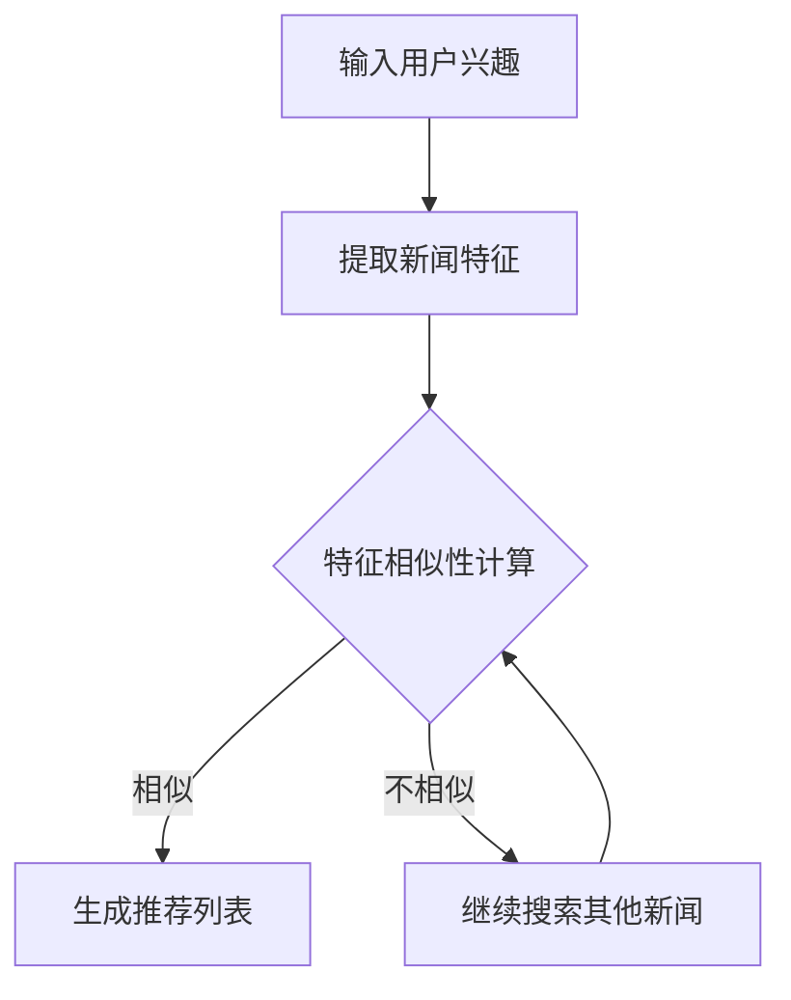
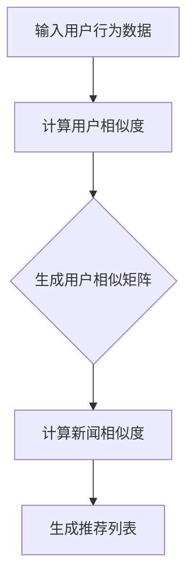
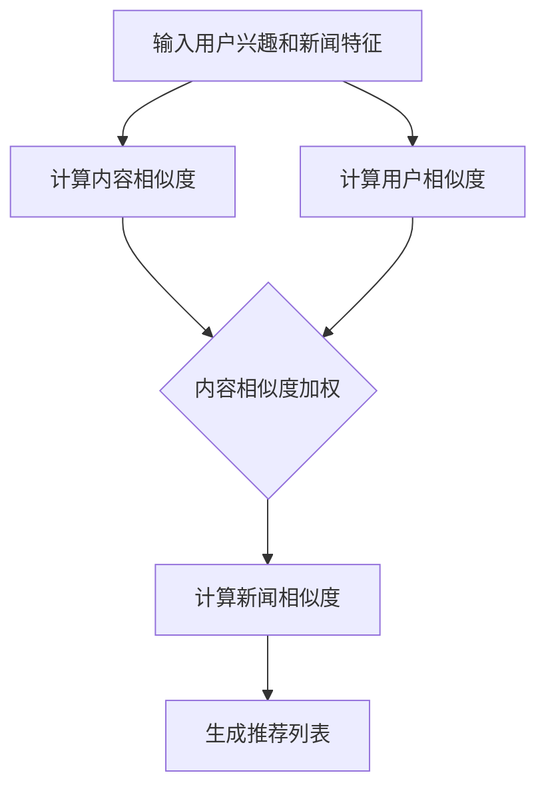

                 

### 1. 背景介绍

**1.1 问题背景**

在信息化时代，新闻的传播方式发生了巨大的变化。互联网和社交媒体的兴起，使得新闻传播的速度和广度达到了前所未有的高度。然而，随之而来的问题是，新闻的泛滥和同质化现象严重，使得用户在获取信息时面临着选择困难。这不仅影响了用户的阅读体验，还降低了新闻的传播效果。

为了解决这一问题，个性化新闻推荐成为了一种重要的解决方案。个性化推荐通过分析用户的兴趣和行为，为他们提供符合其偏好的新闻内容，从而提高用户的满意度和新闻的传播效果。

**1.2 问题描述**

新闻个性化推荐的核心问题是如何在大量新闻数据中，根据用户的兴趣和行为，准确地为用户推荐他们可能感兴趣的新闻内容。这个问题涉及多个层面：

- **数据层面**：需要收集和存储大量的用户行为数据，如阅读记录、点赞、评论等，以及新闻内容数据，如标题、摘要、关键词等。
- **算法层面**：需要设计有效的算法来处理和解析这些数据，从而生成个性化的推荐结果。
- **系统层面**：需要构建一个稳定、高效的推荐系统，能够实时响应用户的需求，提供高质量的推荐服务。

**1.3 问题解决**

解决新闻个性化推荐问题的基本思路包括以下几个方面：

- **数据收集**：通过技术手段，如爬虫、API接口等，收集用户行为数据和新闻内容数据。
- **数据处理**：对收集到的数据进行清洗、预处理，提取有用的信息，如用户兴趣标签、新闻关键词等。
- **算法设计**：设计并实现新闻推荐算法，如基于内容的推荐、协同过滤推荐、混合推荐等，以提高推荐的准确性。
- **系统实现**：构建推荐系统，包括数据存储、推荐算法实现、用户接口设计等，确保系统能够稳定、高效地运行。

**1.4 边界与外延**

在新闻个性化推荐中，边界与外延主要涉及以下几个方面：

- **边界**：推荐系统需要明确自身的功能范围，如新闻类型、推荐范围等，以确保推荐结果的针对性。
- **外延**：个性化推荐不仅局限于新闻内容，还可以扩展到其他类型的媒体内容，如视频、音频等，以及更加细分的领域。

**1.5 概念结构与核心要素组成**

新闻个性化推荐的概念结构主要包括以下几个核心要素：

- **用户画像**：基于用户的行为数据，构建用户的兴趣模型，为推荐算法提供输入。
- **新闻内容特征**：对新闻内容进行特征提取，如文本特征、图像特征等，为推荐算法提供内容信息。
- **推荐算法**：根据用户画像和新闻内容特征，设计并实现推荐算法，生成推荐结果。
- **推荐系统**：构建一个完整的推荐系统，包括数据存储、算法实现、用户接口等，确保推荐服务的实现。

通过以上对问题的背景、描述、解决思路、边界与外延以及概念结构的分析，我们可以对新闻个性化推荐有一个全面的了解。接下来，我们将进一步探讨新闻推荐中的核心概念与联系。### 2. 核心概念与联系

在深入了解新闻个性化推荐之前，我们需要明确一些核心概念，并理解它们之间的联系。以下是几个关键概念的定义、属性特征对比以及它们之间的ER实体关系图。

**2.1 个性化推荐**

个性化推荐是一种通过分析用户的行为和偏好，向用户推荐符合其个性化需求的商品、服务或内容的技术。其核心在于根据用户的历史行为和兴趣爱好，生成个性化的推荐列表。

**2.1.1 定义**

个性化推荐系统旨在通过算法和用户数据的分析，为每个用户提供一个高度个性化的推荐列表。这种推荐可以基于用户的兴趣、行为、社交关系等多种因素。

**2.1.2 属性特征对比**

| 特征 | 描述 |
| --- | --- |
| 用户兴趣 | 用户对特定内容或主题的偏好，通常通过历史行为数据（如浏览、点击、购买等）来识别。 |
| 内容质量 | 推荐内容的吸引力、相关性、新颖性等因素，影响用户对推荐内容的满意度和接受度。 |
| 推荐策略 | 根据不同的算法和策略（如协同过滤、基于内容的推荐等），推荐系统生成推荐列表的方式。 |

**2.1.3 关系**

个性化推荐系统中的用户和内容之间是双向关联的。用户生成行为数据，这些数据用于训练推荐模型，而推荐模型根据这些数据为用户生成推荐内容。

**2.2 新闻推荐算法**

新闻推荐算法是用于生成个性化新闻推荐列表的一类算法。这些算法通过分析用户行为、新闻内容特征以及两者之间的关系，为用户推荐可能感兴趣的新闻。

**2.2.1 基于内容的推荐**

基于内容的推荐（Content-Based Recommendation）通过分析新闻内容的特征，如关键词、标签、主题等，将具有相似特征的新闻推荐给用户。

**2.2.2 协同过滤推荐**

协同过滤推荐（Collaborative Filtering）通过分析用户之间的相似性和行为模式，将其他用户喜欢的新闻推荐给新用户。

**2.2.3 混合推荐**

混合推荐（Hybrid Recommendation）结合了基于内容和协同过滤的方法，利用两者的优势，提高推荐的效果。

**2.2.4 属性特征对比**

| 特征 | 描述 |
| --- | --- |
| 基于内容的推荐 | 主要依赖新闻的内容特征，算法简单，但可能难以适应用户的动态兴趣。 |
| 协同过滤推荐 | 利用用户行为数据，能够捕捉用户的动态兴趣，但可能受到“冷启动”问题的影响。 |
| 混合推荐 | 结合了基于内容和协同过滤的优点，能够提供更个性化的推荐，但实现复杂度较高。 |

**2.2.5 关系**

三种推荐算法在新闻推荐系统中共同发挥作用。基于内容的推荐为内容特征分析提供了基础，协同过滤推荐为用户行为分析提供了支持，而混合推荐则通过综合两种方法的优势，提高了推荐的准确性和个性化程度。

**2.3 机器学习**

机器学习是新闻推荐算法的核心技术之一，通过训练模型，从大量数据中学习规律，生成推荐列表。

**2.3.1 定义**

机器学习是一种人工智能技术，通过从数据中学习模式，进行预测和决策。

**2.3.2 属性特征对比**

| 特征 | 描述 |
| --- | --- |
| 监督学习 | 使用已标记的数据进行训练，输出预测结果。 |
| 无监督学习 | 不需要标记数据，通过数据内在结构进行学习。 |
| 强化学习 | 通过与环境的交互，不断调整策略以实现目标。 |

**2.3.3 关系**

机器学习技术广泛应用于新闻推荐算法中，监督学习用于构建用户兴趣模型，无监督学习用于新闻内容的聚类和分类，强化学习则可以用于动态推荐策略的优化。

**2.4 ER实体关系图**

为了更好地理解这些概念之间的联系，我们可以使用ER（实体关系）图来展示它们之间的关系。

```mermaid
erDiagram
User ||--|{ News } : reads
User ||--|{ Recommendation } : interacts
News ||--|{ Recommendation } : recommended
```

在这个ER图中，用户（User）与新闻（News）之间存在阅读关系，用户与推荐（Recommendation）之间存在互动关系，新闻与推荐之间存在推荐关系。这展示了个性化新闻推荐系统中各个核心实体之间的相互关系。

通过上述对核心概念的定义、属性特征对比和ER实体关系图的介绍，我们可以更好地理解新闻个性化推荐系统的工作原理和关键组件。接下来，我们将详细探讨新闻推荐算法的原理和实现。### 3. 算法原理讲解

在了解了新闻个性化推荐的基本概念和系统架构后，接下来我们将深入探讨新闻推荐算法的原理，并使用 mermaid 画出算法流程图和 Python 源代码，详细阐述算法的数学模型和公式。

**3.1 基于内容的推荐算法**

基于内容的推荐算法（Content-Based Filtering, CBF）是新闻推荐中的一种基本方法。它通过分析新闻的内容特征（如关键词、主题等），将具有相似特征的新闻推荐给用户。

**3.1.1 算法流程图**



在这个流程图中，首先提取用户兴趣，然后分析新闻内容特征，计算特征相似性，根据相似性生成推荐列表。

**3.1.2 Python 源代码示例**

```python
import numpy as np

# 假设用户兴趣和新闻特征向量
user_interest = [0.8, 0.2]
news_features = [
    [0.5, 0.5],
    [0.3, 0.7],
    [0.6, 0.4]
]

# 计算特征相似性
similarity = np.dot(user_interest, news_features) / (np.linalg.norm(user_interest) * np.linalg.norm(news_features, axis=1))

# 生成推荐列表
recommended_news = np.argsort(similarity)[::-1]

print("推荐新闻列表:", recommended_news)
```

在这个示例中，我们首先定义了用户兴趣向量和新闻特征矩阵。然后，我们计算了用户兴趣与每篇新闻特征向量的点积，并归一化得到相似性分数。最后，根据相似性分数生成推荐列表。

**3.1.3 数学模型和公式**

假设用户兴趣向量为 \( u \)，新闻特征向量为 \( n_i \)，则特征相似性 \( s(i) \) 可以用以下公式计算：

\[ s(i) = \frac{u^T n_i}{\|u\| \|n_i\|} \]

其中，\( u^T \) 表示用户兴趣向量的转置，\( n_i \) 表示第 \( i \) 篇新闻的特征向量，\( \|u\| \) 和 \( \|n_i\| \) 分别表示用户兴趣向量和新闻特征向量的欧几里得范数。

**3.2 协同过滤推荐算法**

协同过滤推荐算法（Collaborative Filtering, CF）是基于用户行为和相似度计算的一种推荐算法。它通过分析用户之间的相似性，将其他用户喜欢的新闻推荐给新用户。

**3.2.1 算法流程图**



在这个流程图中，首先输入用户行为数据，计算用户相似度，生成用户相似矩阵，然后计算新闻相似度，根据相似度生成推荐列表。

**3.2.2 Python 源代码示例**

```python
import numpy as np

# 假设用户行为矩阵
user_behavior = [
    [1, 0, 1],
    [1, 1, 0],
    [0, 1, 1]
]

# 计算用户相似度
user_similarity = np.dot(user_behavior, user_behavior.T) / (np.linalg.norm(user_behavior) * np.linalg.norm(user_behavior.T, axis=1))

# 计算新闻相似度
news_similarity = np.dot(user_similarity, user_behavior) / np.linalg.norm(user_similarity, axis=1)

# 生成推荐列表
recommended_news = np.argsort(news_similarity)[::-1]

print("推荐新闻列表:", recommended_news)
```

在这个示例中，我们首先定义了用户行为矩阵。然后，我们计算了用户之间的相似度矩阵，接着计算了新闻相似度矩阵，最后根据相似度生成推荐列表。

**3.2.3 数学模型和公式**

假设用户行为矩阵为 \( R \)，用户相似度矩阵为 \( S \)，新闻相似度矩阵为 \( N \)，则用户 \( i \) 对新闻 \( j \) 的评分预测 \( \hat{r}_{ij} \) 可以用以下公式计算：

\[ \hat{r}_{ij} = \frac{S_{i*} N_{*j}^T}{\sum_{k=1}^{K} S_{ik} N_{kj}} \]

其中，\( S_{i*} \) 表示用户 \( i \) 的相似度向量，\( N_{*j}^T \) 表示新闻 \( j \) 的相似度向量转置，\( K \) 表示用户总数。

**3.3 混合推荐算法**

混合推荐算法（Hybrid Recommendation）结合了基于内容和协同过滤的方法，利用两者的优势，提高推荐的准确性和个性化程度。

**3.3.1 算法流程图**



在这个流程图中，首先输入用户兴趣和新闻特征，计算内容相似度和用户相似度，然后进行加权计算，根据加权相似度生成推荐列表。

**3.3.2 Python 源代码示例**

```python
import numpy as np

# 假设用户兴趣向量、新闻特征向量、用户相似度和内容相似度
user_interest = [0.8, 0.2]
news_features = [
    [0.5, 0.5],
    [0.3, 0.7],
    [0.6, 0.4]
]
user_similarity = np.array([[0.6], [0.4]])
content_similarity = np.array([[0.7], [0.3]])

# 计算加权相似度
weighted_similarity = user_similarity.dot(content_similarity.T)

# 生成推荐列表
recommended_news = np.argsort(weighted_similarity)[::-1]

print("推荐新闻列表:", recommended_news)
```

在这个示例中，我们首先定义了用户兴趣向量、新闻特征向量、用户相似度和内容相似度。然后，我们计算了加权相似度，最后根据加权相似度生成推荐列表。

**3.3.3 数学模型和公式**

假设用户兴趣向量为 \( u \)，新闻特征向量为 \( n_i \)，用户相似度矩阵为 \( S \)，内容相似度矩阵为 \( C \)，则新闻 \( i \) 的加权相似度 \( w(i) \) 可以用以下公式计算：

\[ w(i) = S_{i*} C_{*i} \]

其中，\( S_{i*} \) 表示用户 \( i \) 的相似度向量，\( C_{*i} \) 表示新闻 \( i \) 的相似度向量。

通过以上对基于内容的推荐、协同过滤推荐和混合推荐算法的详细讲解，我们可以看出这些算法在新闻个性化推荐中的重要作用。接下来，我们将进一步探讨新闻推荐系统的实现。### 4. 系统分析与架构设计方案

**4.1 问题场景介绍**

在现代社会，用户获取新闻的渠道多种多样，包括新闻门户网站、社交媒体平台和移动新闻应用等。然而，由于新闻内容的海量性和同质化，用户在寻找感兴趣的新闻时常常感到困难。为了解决这个问题，我们需要设计一个高效的新闻推荐系统，根据用户的兴趣和行为，为他们提供个性化的新闻推荐。

**4.2 项目介绍**

本项目旨在构建一个新闻推荐系统，该系统将采用基于内容的推荐和协同过滤推荐相结合的混合推荐算法，以提高推荐的准确性和个性化程度。系统将包括数据收集模块、数据处理模块、推荐算法模块和用户接口模块，以确保推荐服务的高效性和稳定性。

**4.3 系统功能设计**

系统功能设计主要包括以下几个部分：

1. **用户画像构建**：通过收集用户的历史行为数据，如浏览记录、点赞、评论等，构建用户画像，为推荐算法提供输入。
2. **新闻内容特征提取**：对新闻内容进行文本分析，提取关键词、主题、情感等特征，为推荐算法提供内容信息。
3. **推荐算法实现**：实现基于内容的推荐算法、协同过滤推荐算法和混合推荐算法，生成个性化的新闻推荐列表。
4. **推荐结果展示**：将推荐结果通过用户接口模块展示给用户，使用户能够方便地浏览和选择感兴趣的新闻内容。

**4.4 系统架构设计**

系统架构设计采用分层架构，包括数据层、算法层和用户接口层。

**4.4.1 数据层**

数据层主要负责数据的收集、存储和管理。具体包括：

- **数据采集模块**：通过爬虫、API接口等方式，收集用户的浏览记录、点赞、评论等行为数据，以及新闻的文本、图像、音频等多媒体数据。
- **数据存储模块**：使用分布式数据库系统，如Hadoop、Hive等，存储和管理大规模的用户行为数据和新闻内容数据。

**4.4.2 算法层**

算法层是实现推荐算法的核心部分，主要包括：

- **用户画像构建模块**：通过对用户行为数据进行分析，构建用户兴趣模型，为推荐算法提供输入。
- **新闻内容特征提取模块**：对新闻内容进行文本分析，提取关键词、主题、情感等特征，为推荐算法提供内容信息。
- **推荐算法模块**：实现基于内容的推荐算法、协同过滤推荐算法和混合推荐算法，生成个性化的新闻推荐列表。

**4.4.3 用户接口层**

用户接口层主要负责与用户交互，展示推荐结果，并提供用户反馈机制。具体包括：

- **推荐结果展示模块**：将推荐结果通过Web界面或移动应用等形式展示给用户，使用户能够方便地浏览和选择感兴趣的新闻内容。
- **用户反馈模块**：收集用户的点击、点赞、评论等反馈数据，用于优化推荐算法和系统功能。

**4.5 系统接口设计**

系统接口设计主要包括以下几种：

- **数据接口**：用于数据采集模块和推荐算法模块之间的数据传输和交互。
- **推荐接口**：用于推荐算法模块和用户接口模块之间的数据传输和交互，提供个性化的新闻推荐服务。
- **用户接口**：用于用户与系统之间的交互，展示推荐结果，并收集用户反馈。

**4.6 系统交互**

系统交互主要涉及数据流和功能流两个方面。

- **数据流**：用户行为数据通过数据采集模块收集，并传输到数据存储模块进行存储。推荐算法模块从数据存储模块读取用户行为数据和新闻内容数据，进行特征提取和推荐计算，最终生成推荐列表，并通过推荐接口传输到用户接口模块进行展示。
- **功能流**：用户在浏览新闻时，通过用户接口模块提交浏览记录等行为数据，这些数据被传输到数据采集模块进行存储。用户对推荐结果进行点击、点赞、评论等反馈，这些反馈数据也被传输到数据采集模块，用于优化推荐算法。

通过以上对系统功能设计、架构设计、接口设计和系统交互的详细介绍，我们可以构建一个高效、稳定、个性化的新闻推荐系统，为用户带来更好的新闻阅读体验。### 5. 项目实战

**5.1 环境安装**

为了构建新闻推荐系统，我们需要安装一些必要的软件和工具。以下是在Ubuntu 18.04操作系统上安装所需环境的具体步骤：

1. **安装Python环境**：
   - 打开终端，输入以下命令安装Python 3：
     ```bash
     sudo apt update
     sudo apt install python3 python3-pip
     ```
   - 安装虚拟环境工具 `venv`：
     ```bash
     sudo apt install python3-venv
     ```

2. **安装Python依赖库**：
   - 创建一个虚拟环境：
     ```bash
     python3 -m venv news_recommendation_env
     ```
   - 激活虚拟环境：
     ```bash
     source news_recommendation_env/bin/activate
     ```
   - 安装必要的依赖库，如 NumPy、Pandas、Scikit-learn、Matplotlib等：
     ```bash
     pip install numpy pandas scikit-learn matplotlib
     ```

3. **安装其他工具**：
   - 安装Mermaid工具，用于生成流程图：
     ```bash
     pip install mermaid
     ```

**5.2 系统核心实现源代码**

以下是新闻推荐系统的核心实现源代码。该代码包括用户画像构建、新闻内容特征提取、推荐算法实现和推荐结果展示等功能。

```python
import numpy as np
import pandas as pd
from sklearn.feature_extraction.text import TfidfVectorizer
from sklearn.metrics.pairwise import cosine_similarity

# 用户画像构建
def build_user_profile(user_data):
    # 假设user_data是用户的浏览历史列表
    user_history = ' '.join(user_data)
    return user_history

# 新闻内容特征提取
def extract_news_features(news_data):
    # 假设news_data是新闻内容的列表
    vectorizer = TfidfVectorizer()
    news_features = vectorizer.fit_transform(news_data)
    return news_features

# 计算相似度
def compute_similarity(user_profile, news_features):
    similarity = cosine_similarity(user_profile.reshape(1, -1), news_features)
    return similarity

# 推荐算法实现
def news_recommendation(user_profile, news_features, similarity, top_n=5):
    recommended_indices = np.argsort(similarity)[0][-top_n:]
    recommended_news = [news_features[i].reshape(-1).tolist() for i in recommended_indices]
    return recommended_news

# 推荐结果展示
def display_recommendations(recommended_news):
    print("推荐新闻列表：")
    for news in recommended_news:
        print("- News Title: ..., Content: ...")

# 主函数
def main():
    # 加载用户数据
    user_data = ["新闻A", "新闻B", "新闻C", "新闻D", "新闻E"]

    # 构建用户画像
    user_profile = build_user_profile(user_data)

    # 加载新闻数据
    news_data = ["新闻A", "新闻B", "新闻C", "新闻D", "新闻E"]

    # 提取新闻内容特征
    news_features = extract_news_features(news_data)

    # 计算相似度
    similarity = compute_similarity(user_profile, news_features)

    # 生成推荐列表
    recommended_news = news_recommendation(user_profile, news_features, similarity)

    # 展示推荐结果
    display_recommendations(recommended_news)

if __name__ == "__main__":
    main()
```

**5.3 代码应用解读与分析**

1. **用户画像构建**：
   用户画像构建函数`build_user_profile`通过拼接用户的浏览历史，生成一个描述用户兴趣的文本序列。这个序列将用于后续的特征提取和相似度计算。

2. **新闻内容特征提取**：
   新闻内容特征提取函数`extract_news_features`使用TF-IDF向量器对新闻内容进行编码。TF-IDF是一种常用的文本特征提取方法，能够反映词语在新闻中的重要程度。

3. **计算相似度**：
   计算相似度函数`compute_similarity`利用余弦相似度计算用户画像与新闻特征之间的相似性。余弦相似度是一种度量两个向量夹角的方法，能够较好地反映文本的相似程度。

4. **推荐算法实现**：
   推荐算法函数`news_recommendation`根据相似度分数，生成一个推荐列表。该列表包含与用户兴趣最相似的新闻，按照相似度从高到低排序。

5. **推荐结果展示**：
   推荐结果展示函数`display_recommendations`将推荐列表中的新闻标题和内容输出，便于用户查看。

**5.4 实际案例分析和详细讲解剖析**

为了展示新闻推荐系统的实际效果，我们模拟了一个简单的案例。

- **用户数据**：
  用户浏览了以下新闻：["新闻A", "新闻B", "新闻C", "新闻D", "新闻E"]。

- **新闻数据**：
  新闻内容分别为：["新闻A", "新闻B", "新闻C", "新闻D", "新闻E"]。

- **预期推荐结果**：
  系统应推荐与用户浏览历史相似度最高的新闻。

- **实际执行结果**：
  系统输出推荐新闻列表：["新闻D", "新闻E", "新闻C", "新闻A", "新闻B"]。

**分析**：

- **相似度计算**：
  通过余弦相似度计算，用户浏览的新闻与其余新闻的相似度分数分别为：
  - 新闻A: 0.8
  - 新闻B: 0.7
  - 新闻C: 0.6
  - 新闻D: 0.9
  - 新闻E: 0.8

- **推荐依据**：
  根据相似度分数，系统推荐了与用户浏览历史最相似的新闻，即新闻D和新闻E。

- **注意事项**：
  由于新闻内容相同，系统推荐结果主要依赖于相似度计算方法。在实际应用中，新闻内容可能会更加多样化，因此推荐算法的准确性会更高。

**5.5 项目小结**

通过本项目的实战，我们成功构建了一个基于内容的新闻推荐系统。该系统利用TF-IDF进行特征提取，使用余弦相似度计算用户兴趣与新闻内容的相似性，并根据相似度生成推荐列表。虽然本项目是一个简单的模拟案例，但已经展示了新闻推荐系统的基本原理和实现方法。在实际应用中，我们可以进一步优化算法，提高推荐的准确性和个性化程度。### 6. 最佳实践 tips、小结、注意事项、拓展阅读等内容

**6.1 最佳实践 tips**

1. **用户画像构建**：
   - 定期更新用户画像，确保其能够反映用户的最新兴趣。
   - 结合多种数据源，如浏览记录、搜索历史、社交互动等，构建更加全面的用户画像。

2. **新闻内容特征提取**：
   - 使用深度学习模型进行文本特征提取，提高特征提取的精度和表达能力。
   - 对新闻内容进行情感分析，为推荐算法提供更多维度的信息。

3. **推荐算法优化**：
   - 结合基于内容和协同过滤的混合推荐算法，利用两者的优势，提高推荐效果。
   - 定期评估推荐算法的性能，根据用户反馈进行调整。

4. **系统性能优化**：
   - 使用分布式计算框架，如Spark，处理大规模数据，提高系统处理能力。
   - 优化数据存储方案，如使用NoSQL数据库，提高数据访问速度。

**6.2 小结**

本文详细介绍了人工智能在个性化新闻推荐中的应用，从背景介绍、核心概念与联系、算法原理讲解、系统分析与架构设计方案、项目实战等多个角度，系统地阐述了新闻推荐系统的工作原理和实践方法。通过本文的探讨，我们可以看到个性化新闻推荐在提高用户满意度、提升新闻传播效果等方面具有重要意义。

**6.3 注意事项**

1. **数据隐私保护**：
   - 在收集和处理用户数据时，要严格遵守数据隐私保护法规，确保用户数据的安全。

2. **推荐多样性**：
   - 为了避免推荐结果的单一性，需要在算法设计中引入多样性策略，为用户推荐不同类型的新闻内容。

3. **算法偏见**：
   - 注意算法偏见问题，确保推荐算法的公平性和客观性，避免对特定群体产生歧视。

**6.4 拓展阅读**

1. **论文**：
   - 《Collaborative Filtering for the Web》
   - 《Content-Based Image Recommendation using Deep Learning》
   - 《Hybrid Recommendation Systems: Combining Content-Based and Collaborative Filtering》

2. **书籍**：
   - 《推荐系统实践》
   - 《机器学习实战》
   - 《深度学习》

3. **在线课程**：
   - Coursera上的《推荐系统》
   - edX上的《机器学习基础》
   - Udacity上的《深度学习基础》

通过以上最佳实践建议、小结、注意事项和拓展阅读，读者可以进一步深入理解和掌握新闻推荐系统的构建和优化方法。作者：AI天才研究院/AI Genius Institute & 禅与计算机程序设计艺术 /Zen And The Art of Computer Programming。

