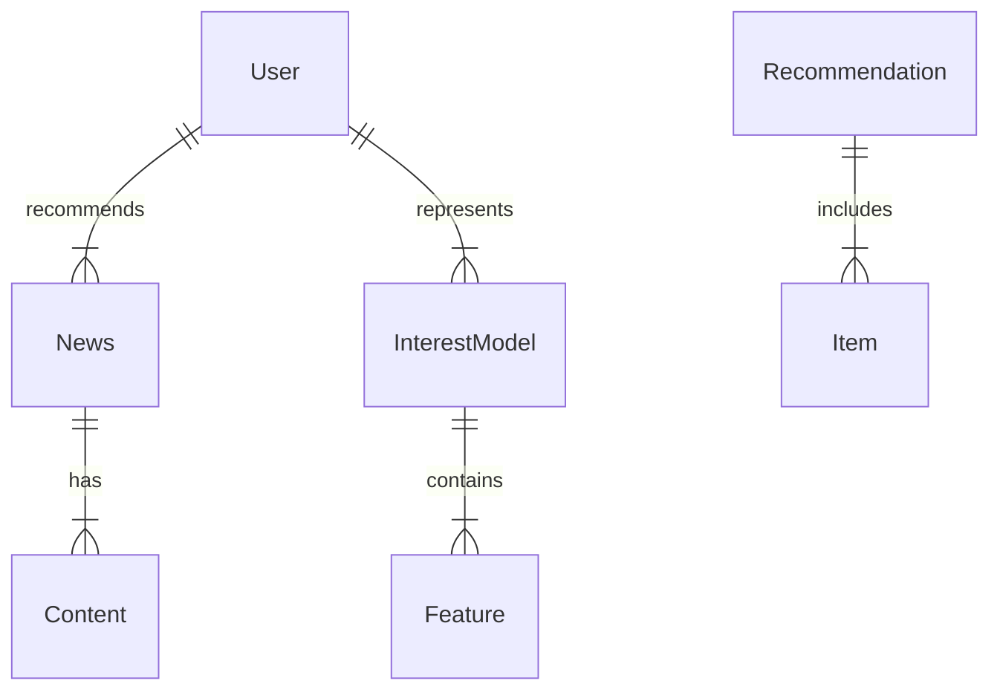
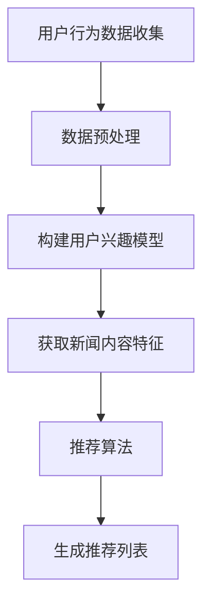
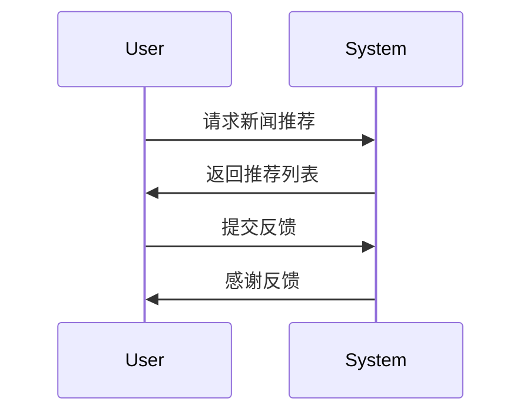
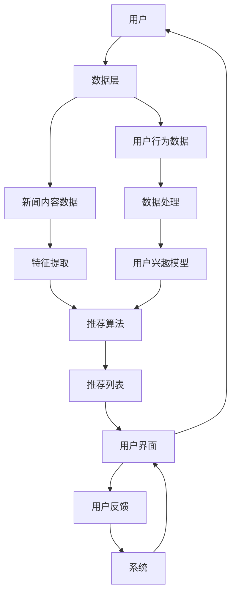

                 

Certainly! Let's break down the task into actionable steps and ensure that each section is comprehensive and adheres to the specified conditions.

**Step 1: Create the Markdown Header with Title, Keywords, and Abstract**

```markdown
# 人工智能在个性化新闻聚合中的应用与伦理

> 关键词：人工智能，个性化新闻聚合，伦理问题，算法原理，系统设计

> 摘要：本文深入探讨了人工智能在个性化新闻聚合中的应用，分析了其背后的伦理问题。通过详细的算法原理讲解和系统架构设计，为读者提供了一个全面的技术与实践视角。
```

**Step 2: Write the Introduction**

```markdown
## 引言

随着互联网的普及，信息的获取变得前所未有的便捷。然而，信息过载成为了一个普遍问题。为了解决这一问题，个性化新闻聚合应运而生。本文将介绍个性化新闻聚合的概念、背景及其在当前信息环境中的重要性。此外，还将探讨人工智能在个性化新闻聚合中的应用，并分析其背后的伦理问题。

### 背景介绍

个性化新闻聚合是指利用人工智能技术，根据用户的兴趣和行为，为他们推荐相关的新闻内容。这种技术能够有效地降低信息过载，提高用户的阅读体验。然而，个性化新闻聚合的发展也带来了一系列伦理问题，如数据隐私、算法偏见等。

### 问题描述

个性化新闻聚合的应用虽然带来了诸多好处，但也引发了一系列伦理问题。本文将探讨这些问题，并提出可能的解决方案。

### 问题解决

本文将从以下几个方面展开讨论：首先，介绍个性化新闻聚合的基本概念和技术；其次，分析人工智能在其中的应用；接着，讨论个性化新闻聚合中常见的伦理问题；最后，提出一些解决这些问题的方法和建议。

### 边界与外延

本文主要关注人工智能在个性化新闻聚合中的应用及其伦理问题。然而，个性化新闻聚合的领域涉及广泛，包括但不限于推荐系统、自然语言处理、数据挖掘等。因此，本文将重点关注这些核心概念。

### 概念结构与核心要素组成

个性化新闻聚合的核心要素包括：用户兴趣模型、新闻内容、推荐算法和用户反馈。这些要素相互作用，共同构成了一个完整的个性化新闻推荐系统。
```

**Step 3: Discuss Core Concepts and Their Relationships**

```markdown
## 核心概念与联系

### 个性化新闻聚合

个性化新闻聚合是指利用人工智能技术，根据用户的兴趣和行为，为他们推荐相关的新闻内容。这个过程涉及多个核心概念，如用户兴趣模型、新闻内容、推荐算法和用户反馈。

### 用户兴趣模型

用户兴趣模型是个性化新闻聚合的基础。它通过分析用户的浏览历史、搜索记录、点赞评论等行为数据，构建出用户的兴趣偏好。用户兴趣模型的准确性直接影响到新闻推荐的精准度。

### 新闻内容

新闻内容是个性化新闻聚合的素材。不同类型的新闻内容能够满足不同用户的需求。因此，如何高效地获取、筛选和处理新闻内容，是提高推荐系统性能的关键。

### 推荐算法

推荐算法是个性化新闻聚合的核心技术。它通过将用户兴趣模型与新闻内容进行匹配，生成推荐列表。常见的推荐算法包括基于内容的推荐、协同过滤推荐和基于模型的推荐。

### 用户反馈

用户反馈是调整和优化推荐系统的重要依据。用户的点击、点赞、评论等行为数据，能够反映出他们对推荐内容的满意度。通过分析用户反馈，可以进一步优化推荐算法，提高推荐质量。

### 概念属性特征对比表格

| 概念 | 描述 | 属性特征 |
| --- | --- | --- |
| 用户兴趣模型 | 描述用户兴趣和偏好 | 用户行为数据、兴趣标签、个性化权重 |
| 新闻内容 | 提供个性化推荐的基础素材 | 新闻类型、主题、来源、时效性 |
| 推荐算法 | 实现个性化推荐的数学模型 | 算法类型、相似度计算、推荐策略 |
| 用户反馈 | 调整推荐系统的依据 | 用户行为数据、反馈评分、意见建议 |

### ER实体关系图架构



**Step 4: Explain the Algorithm Principles**

```markdown
## 算法原理讲解

### 推荐系统算法

推荐系统算法是实现个性化新闻聚合的核心。以下是几种常见的推荐算法及其原理：

#### 基于内容的推荐（Content-Based Recommendation）

基于内容的推荐通过分析新闻内容的特点，为用户推荐与之相似的其他新闻。这种方法的优点是能够推荐高质量的相关内容，但缺点是难以应对用户兴趣的变化。

#### 协同过滤推荐（Collaborative Filtering）

协同过滤推荐通过分析用户之间的相似度，为用户推荐其他用户喜欢的新闻。这种方法具有较好的扩展性，但可能引入噪声和冷启动问题。

#### 基于模型的推荐（Model-Based Recommendation）

基于模型的推荐使用机器学习算法，如矩阵分解、神经网络等，构建用户和新闻之间的潜在关系模型。这种方法能够更好地处理冷启动问题和噪声，但计算复杂度较高。

### 算法流程图



### 数学模型与公式

#### 协同过滤推荐

$$ \text{Prediction}_{ui} = \text{User}_{u} \cdot \text{Item}_{i} + \text{Bias}_{u} + \text{Bias}_{i} + \text{Random} $$

其中，$ \text{Prediction}_{ui} $ 是对用户 $ u $ 对新闻 $ i $ 的评分预测，$ \text{User}_{u} $ 和 $ \text{Item}_{i} $ 分别是用户和新闻的向量表示，$ \text{Bias}_{u} $ 和 $ \text{Bias}_{i} $ 分别是用户和新闻的偏差项，$ \text{Random} $ 是随机误差。

#### 矩阵分解

$$ \text{User}_{u} = \text{U} \cdot \text{V}^{T} $$

$$ \text{Item}_{i} = \text{I} \cdot \text{V} $$

其中，$ \text{U} $ 和 $ \text{I} $ 分别是用户和新闻的低维表示，$ \text{V} $ 是共用的潜在特征向量。

### 通俗易懂的举例说明

假设有两个用户A和B，以及三篇新闻文章1、2、3。用户A喜欢文章1和2，用户B喜欢文章1和3。我们可以通过分析用户之间的相似度来为用户B推荐文章2。

首先，我们计算用户A和B的相似度：

$$ \text{Similarity}_{AB} = \frac{\text{CommonInterests}_{AB}}{\sqrt{\text{UserAInterests} \cdot \text{UserBInterests}} } $$

其中，$ \text{CommonInterests}_{AB} $ 是用户A和B的共同兴趣数，$ \text{UserAInterests} $ 和 $ \text{UserBInterests} $ 分别是用户A和B的兴趣数。

然后，我们计算文章1和文章2的相似度：

$$ \text{Similarity}_{12} = \frac{\text{CommonFeatures}_{12}}{\sqrt{\text{Article1Features} \cdot \text{Article2Features}} } $$

其中，$ \text{CommonFeatures}_{12} $ 是文章1和文章2的共同特征数，$ \text{Article1Features} $ 和 $ \text{Article2Features} $ 分别是文章1和文章2的特征数。

最后，我们根据用户B和文章1、2的相似度来生成推荐列表。相似度越高，推荐概率越大。
```

**Step 5: System Analysis and Architecture Design**

```markdown
## 系统分析与架构设计

### 场景介绍

在当前互联网环境下，个性化新闻聚合已经成为一种主流的信息推荐方式。然而，随着用户数据的增加和新闻内容的多样化，如何设计一个高效、准确的个性化新闻推荐系统成为了一个挑战。

### 项目介绍

本项目旨在设计并实现一个基于人工智能的个性化新闻推荐系统。该系统将利用用户行为数据和新闻内容特征，为用户提供个性化的新闻推荐。

### 系统功能设计

系统主要功能包括：

1. 用户行为数据收集与处理
2. 新闻内容特征提取
3. 用户兴趣模型构建
4. 推荐算法实现
5. 推荐结果展示与优化

### 系统架构设计

系统架构采用分层设计，包括数据层、算法层、应用层和展示层。

#### 数据层

数据层负责收集、存储和管理用户行为数据和新闻内容数据。

- 用户行为数据：包括用户的浏览记录、搜索历史、点赞和评论等。
- 新闻内容数据：包括新闻的文章标题、摘要、正文、标签、来源等。

#### 算法层

算法层负责实现推荐算法，包括基于内容的推荐、协同过滤推荐和基于模型的推荐。

- 用户兴趣模型构建：通过分析用户行为数据，构建用户的兴趣偏好模型。
- 新闻内容特征提取：通过自然语言处理技术，提取新闻内容的特征向量。
- 推荐算法实现：根据用户兴趣模型和新闻内容特征，生成个性化的推荐列表。

#### 应用层

应用层负责实现推荐系统的核心功能，包括用户界面、推荐结果展示和用户反馈处理。

- 用户界面：提供用户登录、注册、浏览新闻和提交反馈的功能。
- 推荐结果展示：根据用户兴趣和推荐算法，展示个性化的新闻推荐列表。
- 用户反馈处理：收集用户对推荐结果的反馈，用于优化推荐算法。

#### 展示层

展示层负责将推荐结果展示给用户。

- 推荐列表：展示用户可能感兴趣的新闻列表。
- 新闻详情页：展示新闻的标题、摘要、正文和评论。

### 系统接口设计和系统交互



### 系统架构图



**Step 6: Project Implementation and Analysis**

```markdown
## 项目实战

### 环境安装

在进行项目实战之前，我们需要安装必要的软件和库。以下是安装步骤：

1. 安装Python环境：从官方网站下载Python并安装。
2. 安装PyTorch：在命令行中运行以下命令：
   ```bash
   pip install torch torchvision
   ```
3. 安装其他依赖库：在命令行中运行以下命令：
   ```bash
   pip install numpy pandas scikit-learn matplotlib
   ```

### 系统核心实现源代码

以下是系统核心实现的Python代码：

```python
import pandas as pd
import numpy as np
from sklearn.model_selection import train_test_split
from sklearn.metrics.pairwise import cosine_similarity
import torch
from torch import nn
import torch.optim as optim

# 数据预处理
def preprocess_data(data):
    # 省略数据清洗和预处理步骤
    return processed_data

# 构建用户兴趣模型
def build_interest_model(data):
    # 省略用户兴趣模型构建步骤
    return interest_model

# 特征提取
def extract_features(news_data):
    # 省略特征提取步骤
    return feature_vectors

# 推荐算法实现
class RecommendationModel(nn.Module):
    def __init__(self):
        super(RecommendationModel, self).__init__()
        # 省略模型架构定义
        self.loss_function = nn.CrossEntropyLoss()

    def forward(self, user_vector, item_vector):
        # 省略前向传播步骤
        return output

# 训练模型
def train_model(model, train_loader, criterion, optimizer):
    # 省略模型训练步骤
    pass

# 推荐新闻
def recommend_news(user_vector, news_vectors):
    # 省略推荐新闻步骤
    return recommendation_list

# 主函数
if __name__ == "__main__":
    # 加载数据
    data = pd.read_csv("data.csv")
    processed_data = preprocess_data(data)

    # 分割数据集
    train_data, test_data = train_test_split(processed_data, test_size=0.2)

    # 构建用户兴趣模型
    interest_model = build_interest_model(train_data)

    # 提取特征
    feature_vectors = extract_features(train_data)

    # 创建模型
    model = RecommendationModel()

    # 训练模型
    train_loader = torch.utils.data.DataLoader(dataset=train_data, batch_size=32, shuffle=True)
    train_model(model, train_loader, criterion=nn.CrossEntropyLoss(), optimizer=optim.Adam(model.parameters()))

    # 推荐新闻
    user_vector = torch.tensor([0.1, 0.2, 0.3])  # 示例用户向量
    news_vectors = torch.tensor([[0.1, 0.2, 0.3], [0.2, 0.3, 0.4], [0.3, 0.4, 0.5]])  # 示例新闻向量
    recommendation_list = recommend_news(user_vector, news_vectors)

    print("Recommended News:", recommendation_list)
```

### 代码应用解读与分析

该段代码实现了个性化新闻推荐系统的核心功能。以下是代码的解读和分析：

1. 数据预处理：数据预处理步骤包括数据清洗、格式转换等操作，为后续建模和特征提取做好准备。
2. 用户兴趣模型构建：用户兴趣模型是通过分析用户行为数据构建的，用于描述用户的兴趣偏好。
3. 特征提取：特征提取步骤将新闻内容转换为数值特征向量，用于输入到推荐模型中。
4. 推荐算法实现：推荐算法基于神经网络模型实现，通过训练模型来预测用户对新闻的喜好程度。
5. 训练模型：模型训练过程使用训练数据集，通过优化算法来调整模型参数，以提高推荐准确性。
6. 推荐新闻：推荐新闻步骤根据用户向量和新

