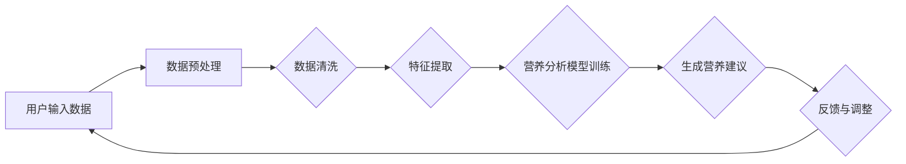

                 

### 人工智能在个性化营养建议中的应用

随着科技的发展和医疗健康的日益关注，个性化营养建议的应用越来越受到重视。个性化营养建议是指根据个体的身体状况、生活习惯、健康状况等因素，提供针对性的营养指导，以帮助人们实现健康饮食、预防慢性疾病等目标。而人工智能技术在这一领域中的应用，则为个性化营养建议的精准性和有效性提供了强有力的支持。本文将围绕人工智能在个性化营养建议中的应用进行探讨，旨在为广大读者提供一个全面、系统的了解。

### 文章关键词

- 人工智能
- 个性化营养建议
- 机器学习
- 深度学习
- 大数据
- 营养分析
- 个性化推荐
- 精准医疗

### 摘要

本文首先介绍了个性化营养建议的背景和重要性，然后详细阐述了人工智能在个性化营养建议中的应用，包括核心技术、算法原理、系统架构以及实际案例。通过本文的阅读，读者将全面了解人工智能在个性化营养建议中的价值和应用前景。

## 第一部分：引言

### 1.1 问题背景

#### 1.1.1 个性化营养建议的重要性

随着社会的进步和人们生活水平的提高，健康饮食问题越来越受到关注。个性化营养建议作为一种精准的饮食指导方式，能够根据个体的身体状况、生活习惯、健康状况等多方面因素，为人们提供量身定制的饮食方案。这种营养建议不仅有助于改善人们的健康状况，还能够有效预防慢性疾病的发生。

例如，针对不同年龄、性别、体质、生活习惯等人群，个性化营养建议可以提供不同的饮食方案。对于老年人，营养建议可能更注重补充蛋白质和钙质；对于孕妇，营养建议可能更注重补充叶酸和其他营养素。此外，对于患有特定慢性疾病的人群，如糖尿病、高血压等，个性化营养建议可以为他们提供更为精确的饮食指导，帮助他们控制病情，提高生活质量。

#### 1.1.2 人工智能在个性化营养建议中的应用

人工智能技术的发展为个性化营养建议的提供提供了有力支持。通过大数据分析、机器学习等技术，人工智能能够处理大量的健康数据，从中提取出有用的信息，为个体提供精准的营养建议。此外，人工智能还能够实时更新营养知识库，确保提供的建议始终基于最新的科学研究。

例如，人工智能可以通过分析个体的健康数据，如体重、血压、血糖、饮食习惯等，来预测个体可能出现的营养问题，并给出相应的饮食建议。同时，人工智能还可以通过分析大量的健康数据，发现潜在的饮食模式，为个体提供个性化的营养指导。

## 1.2 核心概念

### 1.2.1 人工智能

人工智能（Artificial Intelligence，简称AI）是指通过计算机模拟人类智能，实现智能感知、智能决策、智能学习等功能的一种技术。人工智能包括多个子领域，如机器学习、深度学习、自然语言处理、计算机视觉等。

### 1.2.2 个性化营养建议

个性化营养建议是指根据个体的身体状况、生活习惯、健康状况等制定的一种针对性饮食方案。个性化营养建议旨在通过个性化的营养指导，帮助人们实现健康饮食，预防慢性疾病的发生。

### 1.2.3 大数据

大数据（Big Data）是指无法用传统数据库软件工具在一定时间内获取、处理、管理和分析的数据集合。大数据具有“4V”特征，即大量（Volume）、多样（Variety）、快速（Velocity）和真实（Veracity）。

### 1.2.4 营养分析

营养分析是指通过分析食物成分、个体饮食习惯等数据，评估个体的营养状况，并为个体提供营养指导。营养分析通常包括食物成分分析、饮食习惯分析、营养状况评估等环节。

### 1.2.5 个性化推荐

个性化推荐是指根据个体的兴趣、行为、需求等，为个体推荐符合其需求的商品、信息、服务等内容。个性化推荐广泛应用于电子商务、社交媒体、新闻推荐等领域。

## 1.3 书籍结构

本书将从以下几个方面展开对人工智能在个性化营养建议中的应用进行探讨：

1. 人工智能概述
2. 个性化营养建议的理论基础
3. 人工智能在个性化营养建议中的应用案例
4. 个性化营养建议系统的开发与实现
5. 个性化营养建议系统的应用与推广
6. 未来发展趋势与展望

## 1.4 目标读者

本书主要面向对人工智能和营养学有一定了解的读者，包括：

1. 计算机科学和人工智能专业的研究生和本科生
2. 营养学、食品科学等相关专业的科研人员和教师
3. 对人工智能在个性化营养建议应用领域感兴趣的从业者

## 1.5 书籍特点

1. 系统性：本书将全面、系统地介绍人工智能在个性化营养建议中的应用，帮助读者全面了解这一领域的知识体系。
2. 实用性：本书将通过实际案例和项目实战，让读者了解如何将人工智能技术应用于个性化营养建议系统开发。
3. 先进性：本书将介绍最新的研究成果和技术趋势，帮助读者紧跟行业发展。

## 1.6 小结

本书旨在探讨人工智能在个性化营养建议中的应用，为读者提供全面、系统的知识体系。通过对人工智能和个性化营养建议的深入分析，本书将帮助读者了解这一领域的最新发展，掌握关键技术和方法，为实际应用提供有力支持。同时，本书也旨在激发读者对人工智能和营养学交叉领域的兴趣，推动相关领域的研究和发展。

----------------------------------------------------------------

## 2.1 人工智能的定义与发展历程

### 2.1.1 人工智能的定义

人工智能（Artificial Intelligence，简称AI）是指通过计算机模拟人类智能，实现智能感知、智能决策、智能学习等功能的一种技术。人工智能旨在使计算机能够执行复杂的任务，如语音识别、图像识别、自然语言处理、机器翻译等，从而模拟甚至超越人类的智能水平。

### 2.1.2 人工智能的发展历程

人工智能的发展历程可以分为以下几个阶段：

1. **初始阶段（20世纪50年代至60年代）**：人工智能概念的提出和早期研究。这一阶段的代表人物是约翰·麦卡锡（John McCarthy）等人，他们在1956年的达特茅斯会议上首次提出了人工智能的概念。

2. **知识工程阶段（20世纪70年代至80年代）**：基于知识表示和推理的专家系统。这一阶段的代表工作是MYCIN系统，它是一个基于医学知识的专家系统，用于诊断和治疗感染性疾病。

3. **机器学习阶段（20世纪90年代至21世纪初）**：基于数据的机器学习方法的出现。这一阶段的代表工作是KDD（Knowledge Discovery in Databases）方法的提出，以及决策树、支持向量机等算法的发展。

4. **深度学习阶段（21世纪10年代至今）**：以神经网络为代表的深度学习方法的突破。这一阶段的代表工作是深度卷积神经网络（CNN）在图像识别领域的成功，以及深度强化学习（DRL）在游戏和机器人领域的应用。

### 2.1.3 人工智能的发展趋势

当前，人工智能正处于快速发展的阶段，其主要趋势包括：

1. **大数据和云计算的推动**：大数据和云计算为人工智能提供了大量的数据资源和强大的计算能力，推动了人工智能技术的应用和进步。

2. **跨学科的融合**：人工智能与其他学科的融合，如生物信息学、认知科学、心理学等，为人工智能的发展提供了新的方向和动力。

3. **算法的创新**：深度学习、强化学习等新算法的不断涌现，提高了人工智能系统的性能和应用范围。

4. **硬件技术的进步**：GPU、TPU等专用硬件的快速发展，为人工智能计算提供了更高效的解决方案。

### 2.1.4 人工智能的核心技术

人工智能的核心技术包括：

1. **机器学习**：机器学习是一种通过数据训练模型，使计算机能够自主学习和改进的技术。主要分为监督学习、无监督学习和强化学习。

2. **深度学习**：深度学习是一种基于多层神经网络的学习方法，能够自动提取数据中的特征，并用于分类、回归等任务。

3. **自然语言处理**：自然语言处理是一种使计算机能够理解和生成自然语言的技术，包括文本分类、情感分析、机器翻译等。

4. **计算机视觉**：计算机视觉是一种使计算机能够识别和理解图像的技术，包括图像分类、目标检测、图像生成等。

5. **知识图谱**：知识图谱是一种用于表示实体及其关系的数据结构，能够为人工智能提供丰富的知识支持。

### 2.1.5 人工智能的应用领域

人工智能的应用领域非常广泛，包括：

1. **智能问答系统**：如智能客服、智能助手等。

2. **智能推荐系统**：如电子商务平台、社交媒体等。

3. **智能监控系统**：如交通监控、安防监控等。

4. **智能医疗诊断**：如医学影像分析、疾病预测等。

5. **智能交通系统**：如自动驾驶、智能交通信号控制等。

6. **智能制造**：如机器人、智能制造系统等。

7. **智能家居**：如智能音响、智能门锁等。

8. **智能农业**：如智能种植、智能灌溉等。

通过以上内容，我们可以看到人工智能的发展历程、核心技术及其应用领域。人工智能作为一种新兴技术，正在不断改变我们的生活方式，提高我们的生活质量。在接下来的章节中，我们将进一步探讨人工智能在个性化营养建议中的应用，以及如何利用人工智能技术为个性化营养建议提供支持。

## 2.2 人工智能的核心技术与原理

### 2.2.1 机器学习

机器学习（Machine Learning，简称ML）是一种使计算机能够通过数据和经验进行学习，并从中提取有用信息的技术。机器学习可以分为监督学习、无监督学习和强化学习三大类。

#### 监督学习

监督学习是一种在已知输入和输出数据的情况下，训练模型以预测新数据的机器学习方法。监督学习的目标是通过学习输入和输出之间的关系，使得模型能够在新的输入数据上准确预测输出。

**核心算法：**

- **线性回归（Linear Regression）**：线性回归是一种用于预测连续值的监督学习算法。其基本思想是通过建立输入变量和输出变量之间的线性关系，来预测新的输出值。

$$
y = \beta_0 + \beta_1x_1 + \beta_2x_2 + ... + \beta_nx_n
$$

- **逻辑回归（Logistic Regression）**：逻辑回归是一种用于预测概率的监督学习算法。其基本思想是通过建立输入变量和输出概率之间的逻辑关系，来预测新的输出概率。

$$
P(y=1) = \frac{1}{1 + e^{-(\beta_0 + \beta_1x_1 + \beta_2x_2 + ... + \beta_nx_n})}
$$

- **决策树（Decision Tree）**：决策树是一种基于特征的树形结构来分类或回归的监督学习算法。其基本思想是通过递归划分特征空间，使得每个子集内的数据尽可能纯净。

- **支持向量机（Support Vector Machine，SVM）**：支持向量机是一种用于分类的监督学习算法。其基本思想是通过找到一个最佳的超平面，使得不同类别的数据点在超平面两侧的分布尽可能远。

#### 无监督学习

无监督学习是一种在没有已知输出数据的情况下，通过学习数据分布或模式来进行分类或降维的机器学习方法。无监督学习主要包括以下几种算法：

- **K-均值聚类（K-Means Clustering）**：K-均值聚类是一种基于距离度量的聚类算法。其基本思想是初始化K个聚类中心，然后通过迭代优化聚类中心，使得每个数据点尽可能接近其对应的聚类中心。

- **主成分分析（Principal Component Analysis，PCA）**：主成分分析是一种用于降维的算法。其基本思想是通过线性变换将高维数据投影到低维空间，保留最重要的特征。

- **自编码器（Autoencoder）**：自编码器是一种用于降维和特征提取的算法。其基本思想是通过训练一个编码器和解码器模型，使得编码器能够将高维数据编码成低维表示，而解码器能够将低维表示解码回高维数据。

#### 强化学习

强化学习（Reinforcement Learning，简称RL）是一种通过与环境交互，根据奖励信号进行学习，以最大化长期回报的机器学习方法。强化学习的主要目标是找到一个策略，使得在给定环境下能够获得最大的长期回报。

- **Q-学习（Q-Learning）**：Q-学习是一种基于值函数的强化学习算法。其基本思想是通过迭代更新Q值，找到最优的策略。

$$
Q(s, a) = r + \gamma \max_{a'} Q(s', a')
$$

- **深度强化学习（Deep Reinforcement Learning，DRL）**：深度强化学习是一种结合深度学习与强化学习的算法。其基本思想是通过深度神经网络来近似值函数或策略函数，以实现更复杂的决策。

通过以上核心技术的介绍，我们可以看到机器学习在人工智能中的重要性。接下来，我们将进一步探讨深度学习技术，以及其在个性化营养建议中的应用。

### 2.2.2 深度学习

深度学习（Deep Learning，简称DL）是一种基于多层神经网络的机器学习方法，它通过逐层提取数据中的特征，实现对复杂任务的建模。深度学习在图像识别、语音识别、自然语言处理等领域取得了显著的成果，成为人工智能领域的重要突破。

#### 深度学习的原理

深度学习的基本原理是基于人工神经网络（Artificial Neural Networks，ANN）的多层结构。人工神经网络由大量的神经元组成，每个神经元都与其他神经元相连接。神经元通过激活函数对输入信号进行处理，并通过权重和偏置来调整网络。

**核心概念：**

- **神经元**：神经元是神经网络的基本单元，它接受多个输入信号，通过加权求和和激活函数，产生输出信号。
- **权重（Weights）**：权重是神经元之间的连接强度，用于调整输入信号的影响。
- **偏置（Bias）**：偏置是神经元的附加输入，用于调整神经元的输出。
- **激活函数（Activation Function）**：激活函数用于确定神经元是否被激活，常见的激活函数包括Sigmoid、ReLU、Tanh等。

**神经网络的结构：**

- **输入层**：输入层接收外部输入信号，通常包含多个神经元。
- **隐藏层**：隐藏层位于输入层和输出层之间，用于提取输入数据的特征。隐藏层可以有多个层次，层数越多，模型的非线性表达能力越强。
- **输出层**：输出层产生最终的输出结果，通常包含一个或多个神经元。

#### 深度学习的核心算法

**卷积神经网络（Convolutional Neural Networks，CNN）**

卷积神经网络是一种专门用于处理图像数据的深度学习模型，它通过卷积操作提取图像的特征。

**核心概念：**

- **卷积层（Convolutional Layer）**：卷积层通过卷积操作提取图像的局部特征。卷积操作是通过一个卷积核（Convolutional Kernel）在图像上滑动，计算每个局部区域的特征。
- **池化层（Pooling Layer）**：池化层用于降低特征图的尺寸，减少参数数量，提高模型的表达能力。常见的池化操作包括最大池化（Max Pooling）和平均池化（Average Pooling）。

**全连接层（Fully Connected Layer）**

全连接层是一种将输入数据映射到输出数据的层，它通过全连接的方式将每个神经元与前一层的所有神经元相连接。

**激活函数**

激活函数用于确定神经元是否被激活，常见的激活函数包括Sigmoid、ReLU、Tanh等。

**反向传播算法**

反向传播算法是一种用于训练神经网络的优化算法。它通过计算输出误差的梯度，更新网络的权重和偏置，以减小误差。

#### 深度学习在个性化营养建议中的应用

深度学习在个性化营养建议中的应用主要体现在以下几个方面：

1. **特征提取**：深度学习可以通过卷积神经网络等算法提取营养数据中的高级特征，从而提高模型的识别和预测能力。
2. **分类和回归**：深度学习可以用于分类和回归任务，例如根据个体的健康数据预测其营养需求，或者根据营养数据预测个体的健康状况。
3. **模式识别**：深度学习可以通过分析大量的健康数据和营养数据，发现个体之间的差异和模式，从而为个性化营养建议提供依据。

通过以上对深度学习原理的介绍，我们可以看到深度学习在个性化营养建议中的重要性和潜力。在接下来的章节中，我们将进一步探讨人工智能在个性化营养建议中的应用案例，以及如何利用深度学习技术实现个性化营养建议系统。

### 2.2.3 自然语言处理

自然语言处理（Natural Language Processing，简称NLP）是一种使计算机能够理解和生成自然语言的技术。NLP在人工智能领域具有广泛的应用，包括文本分类、情感分析、机器翻译、命名实体识别等。以下是自然语言处理的核心技术：

**文本分类**

文本分类是一种将文本数据分配到预定义类别中的任务。常见的文本分类算法包括朴素贝叶斯分类器、支持向量机（SVM）、随机森林等。

**情感分析**

情感分析是一种评估文本数据情感极性的任务。情感分析可以用于理解用户反馈、社交媒体情绪等。常用的情感分析算法包括基于词典的方法、基于机器学习的方法和基于深度学习的方法。

**机器翻译**

机器翻译是一种将一种语言的文本翻译成另一种语言的任务。传统的机器翻译方法包括基于规则的方法、基于统计的方法和基于神经网络的机器翻译（如神经机器翻译）。

**命名实体识别**

命名实体识别是一种识别文本中具有特定意义的实体（如人名、地点、组织等）的任务。常见的命名实体识别算法包括基于词典的方法、基于规则的方法和基于深度学习的方法。

**文本生成**

文本生成是一种根据给定条件生成文本的任务。常见的文本生成方法包括基于模板的方法、基于规则的方法和基于深度学习的方法。

**问答系统**

问答系统是一种使计算机能够回答用户问题的系统。问答系统通常包括自然语言理解、知识图谱和自然语言生成等模块。

**聊天机器人**

聊天机器人是一种模拟人类对话的计算机程序。聊天机器人可以用于客户服务、娱乐、教育等领域。

### 2.2.4 计算机视觉

计算机视觉（Computer Vision，简称CV）是一种使计算机能够从图像或视频中提取有用信息的技术。计算机视觉在自动驾驶、安防监控、医疗诊断等领域具有广泛的应用。以下是计算机视觉的核心技术：

**图像分类**

图像分类是一种将图像分配到预定义类别中的任务。常见的图像分类算法包括卷积神经网络（CNN）、支持向量机（SVM）等。

**目标检测**

目标检测是一种在图像中定位并识别多个目标的位置和类别的任务。常见的目标检测算法包括R-CNN、SSD、YOLO等。

**图像分割**

图像分割是一种将图像划分为多个区域或对象的任务。常见的图像分割算法包括基于阈值的分割、基于区域的分割和基于深度学习的分割。

**人脸识别**

人脸识别是一种在图像或视频中识别和验证人脸的技术。常见的人脸识别算法包括基于特征的方法、基于深度学习的方法等。

**视频监控**

视频监控是一种利用计算机视觉技术进行实时监控和分析的技术。视频监控可以用于安防、交通监控等领域。

**图像增强**

图像增强是一种提高图像质量的技术，如去噪、去模糊、增强对比度等。常见的图像增强算法包括滤波器、图像变换等。

**光学字符识别（OCR）**

光学字符识别是一种将图像中的文本转换为机器可读格式（如文本文件）的技术。常见的OCR算法包括基于规则的方法、基于统计的方法和基于深度学习的方法。

通过以上对自然语言处理和计算机视觉的介绍，我们可以看到这些技术在人工智能领域的广泛应用。在接下来的章节中，我们将进一步探讨人工智能在个性化营养建议中的应用案例，以及如何利用这些技术实现个性化营养建议系统。

### 2.2.5 人工智能在个性化营养建议中的应用

人工智能在个性化营养建议中的应用主要体现在以下几个方面：

1. **数据收集与整合**：通过人工智能技术，可以收集和整合大量的营养数据，包括食物成分、个体饮食习惯、健康状况等。这些数据为个性化营养建议提供了丰富的信息来源。

2. **营养数据分析**：利用机器学习和深度学习算法，对收集到的营养数据进行分析和处理，提取出有用的营养信息，如个体的营养需求、饮食习惯等。

3. **营养评估与预测**：通过营养数据分析，可以评估个体的营养状况，预测个体可能出现的营养问题，为个性化营养建议提供依据。

4. **个性化营养建议生成**：根据个体的营养评估和预测结果，生成个性化的营养建议，如调整饮食结构、补充特定营养素等。

5. **营养建议实时更新**：利用大数据和人工智能技术，可以实时更新营养知识库，确保营养建议始终基于最新的科学研究。

6. **营养教育**：通过自然语言处理和计算机视觉技术，可以为用户提供个性化的营养教育，如解释营养知识、提供饮食建议等。

#### 案例研究

**案例一：基于大数据的个性化营养建议系统**

某公司开发了一款基于大数据的个性化营养建议系统。该系统通过收集用户的基本信息、饮食习惯、健康状况等数据，利用机器学习和深度学习算法进行分析和处理，为用户生成个性化的营养建议。

系统首先通过用户输入的个人信息和饮食习惯，生成一个用户画像。然后，系统利用大数据分析技术，分析用户的历史饮食数据，提取出用户的主要营养需求和潜在的营养问题。

基于分析结果，系统为用户提供个性化的营养建议。例如，对于一位高血压患者，系统可能会建议减少盐分摄入，增加蔬菜水果的比例；对于一位体重过重的人，系统可能会建议减少高热量食物的摄入，增加运动量。

**案例二：基于深度学习的食物识别系统**

某公司开发了一款基于深度学习的食物识别系统。该系统利用卷积神经网络（CNN）等技术，对用户上传的饮食图片进行识别和分析，自动记录用户的饮食习惯和营养摄入情况。

系统通过训练大量的食物图片数据集，使得CNN模型能够准确识别各种食物。用户只需上传一张食物图片，系统就能快速识别出食物的类型和成分，并计算出相应的营养摄入量。

通过食物识别系统，用户可以实时了解自己的饮食状况，及时发现营养摄入的不均衡，并做出相应的调整。

通过以上案例，我们可以看到人工智能在个性化营养建议中的应用价值。在未来，随着人工智能技术的不断发展和应用，个性化营养建议系统将更加智能化、精准化，为人们的健康生活提供更好的支持。

### 2.3 个性化营养建议的理论基础

#### 2.3.1 营养学基础

个性化营养建议的理论基础首先依赖于营养学的基本原理。营养学是研究食物、营养素与人体健康之间关系的科学。以下是一些关键的营养学概念：

1. **营养素**：营养素是指人体所需的物质，包括蛋白质、脂肪、碳水化合物、维生素和矿物质等。不同的营养素在人体中发挥不同的生理功能。

2. **能量平衡**：能量平衡是指人体摄入的能量与消耗的能量之间的平衡状态。长期摄入的能量超过消耗的能量会导致体重增加，而长期摄入的能量低于消耗的能量会导致体重减少。

3. **膳食模式**：膳食模式是指个体在一段时间内的饮食习惯和食物摄入组合。不同的膳食模式会对个体的健康产生不同的影响。

4. **营养评估**：营养评估是评估个体营养状况的过程，包括摄入评估、消耗评估和营养状况评价等。通过营养评估，可以了解个体的营养需求是否得到满足。

#### 2.3.2 个性化营养建议的核心原理

个性化营养建议的核心原理在于根据个体的特征和需求，提供量身定制的饮食方案。以下是一些关键概念和原则：

1. **个体差异性**：每个人的遗传背景、生活习惯、健康状况、体重和活动水平都不同，因此，每个人的营养需求也是不同的。

2. **全面性**：个性化营养建议需要涵盖所有营养素，确保个体获得足够的营养素以满足其生理和心理需求。

3. **可操作性**：个性化营养建议应该是实际可操作的，即个体能够根据建议调整自己的饮食，并且这些调整是可持续的。

4. **动态调整**：个性化营养建议需要根据个体的变化（如体重变化、健康状况变化等）进行动态调整，以确保营养建议的持续有效性。

#### 2.3.3 营养评估方法

营养评估是制定个性化营养建议的重要环节。以下是一些常见的营养评估方法：

1. **膳食调查**：通过问卷或访谈的方式收集个体的饮食习惯和食物摄入情况，从而评估个体的营养摄入情况。

2. **生理测量**：通过测量体重、身高、体脂百分比等生理指标，评估个体的营养状况。

3. **生化指标检测**：通过血液、尿液等生化指标检测，评估个体体内营养素的水平。

4. **营养健康评估工具**：使用营养健康评估工具，如营养评估量表、营养风险筛查工具等，对个体的营养健康状况进行评估。

#### 2.3.4 健康数据收集与处理

为了制定个性化的营养建议，需要收集和处理大量的健康数据。以下是一些关键步骤：

1. **数据收集**：通过传感器、健康监测设备、移动应用程序等收集个体的健康数据，如饮食日志、运动数据、生物特征数据等。

2. **数据清洗**：对收集到的数据进行清洗，去除噪声和错误数据，确保数据的质量。

3. **数据分析**：利用机器学习和深度学习算法对清洗后的数据进行分析，提取有用的信息，如营养素的摄入量、饮食习惯的模式等。

4. **数据可视化**：通过数据可视化工具，将分析结果以图表、图形等形式展示，帮助个体更好地理解自己的营养状况。

通过以上对个性化营养建议的理论基础的介绍，我们可以看到，个性化营养建议的制定需要结合营养学、健康数据分析和人工智能技术。在接下来的章节中，我们将进一步探讨如何利用这些理论和技术实现个性化营养建议系统。

### 2.4 人工智能在个性化营养建议中的应用

#### 2.4.1 大数据与营养分析

大数据技术在个性化营养建议中的应用至关重要。通过收集和分析大量的健康数据，如饮食习惯、生理指标、健康状况等，可以为个体提供精准的营养建议。以下是大数据在营养分析中的应用：

1. **数据收集**：利用传感器、健康监测设备、移动应用程序等收集个体的健康数据。例如，智能手环可以监测个体的运动数据，智能餐具可以记录个体的饮食数据。

2. **数据整合**：将来自不同渠道的数据进行整合，形成一个全面的健康数据集。这包括个体的饮食习惯、生理指标、基因数据等。

3. **数据清洗**：对收集到的数据进行清洗，去除噪声和错误数据，确保数据的质量。数据清洗包括去除重复数据、填补缺失值、标准化数据等。

4. **数据分析**：利用机器学习和深度学习算法对清洗后的数据进行分析，提取有用的信息。例如，通过分析个体的饮食数据，可以预测其营养摄入的均衡性；通过分析生理指标，可以评估个体的健康状况。

5. **数据可视化**：通过数据可视化工具，将分析结果以图表、图形等形式展示，帮助个体更好地理解自己的营养状况。例如，通过可视化工具，个体可以直观地看到自己的营养摄入情况，及时发现营养摄入的不均衡。

#### 2.4.2 个性化推荐系统

个性化推荐系统是一种利用人工智能技术为个体提供个性化营养建议的方法。以下是个性化推荐系统在个性化营养建议中的应用：

1. **用户画像**：通过收集和分析个体的基本信息、饮食习惯、健康状况等数据，生成一个用户画像。用户画像可以用于了解个体的营养需求和偏好。

2. **推荐算法**：利用机器学习和深度学习算法，为个体推荐合适的营养建议。例如，基于协同过滤算法，可以推荐与个体相似用户的营养建议；基于内容推荐算法，可以根据个体的饮食偏好推荐营养建议。

3. **推荐结果**：根据用户的反馈，对推荐结果进行评估和调整。例如，如果用户对某一营养建议不满意，可以调整推荐算法，使其更加符合个体的需求。

#### 2.4.3 智能营养诊断系统

智能营养诊断系统是一种利用人工智能技术对个体的营养状况进行诊断的系统。以下是一些关键步骤：

1. **健康数据收集**：通过传感器、健康监测设备、移动应用程序等收集个体的健康数据，如体重、血压、血糖、饮食习惯等。

2. **数据预处理**：对收集到的健康数据进行预处理，包括数据清洗、数据整合、特征提取等。

3. **营养诊断**：利用机器学习和深度学习算法，对预处理后的健康数据进行分析，诊断个体的营养状况。例如，通过分析体重和血压数据，可以诊断个体是否存在肥胖或高血压问题。

4. **营养建议**：根据营养诊断的结果，为个体提供个性化的营养建议。例如，对于肥胖个体，建议减少高热量食物的摄入，增加运动量。

#### 2.4.4 智能营养教育系统

智能营养教育系统是一种利用人工智能技术为个体提供营养教育的系统。以下是一些关键步骤：

1. **内容生成**：通过自然语言处理技术，生成个性化的营养教育内容。例如，根据个体的饮食习惯和营养状况，生成相应的营养知识。

2. **互动学习**：利用计算机视觉和语音识别技术，实现与个体的互动。例如，通过智能音箱，个体可以随时随地获取营养知识。

3. **反馈与评估**：根据个体的学习反馈，评估营养教育内容的有效性，并对其进行调整。例如，如果个体对某一知识点理解有困难，系统可以提供更详细的解释。

通过以上对人工智能在个性化营养建议中的应用的介绍，我们可以看到人工智能技术为个性化营养建议提供了强大的支持。在接下来的章节中，我们将进一步探讨个性化营养建议系统的开发与实现。

### 2.5 个性化营养建议系统的开发与实现

#### 2.5.1 系统需求分析

个性化营养建议系统的需求分析是系统开发的第一步。系统需求包括功能需求和非功能需求。以下是系统需求分析的关键内容：

1. **功能需求**：
   - 数据收集：系统能够收集个体的基本信息、饮食习惯、健康状况等数据。
   - 数据预处理：系统能够对收集到的数据进行清洗、整合和特征提取。
   - 营养诊断：系统能够根据个体的健康数据，诊断其营养状况。
   - 营养建议：系统能够根据营养诊断结果，为个体提供个性化的营养建议。
   - 用户互动：系统能够与用户进行互动，收集用户反馈，优化系统性能。

2. **非功能需求**：
   - 可扩展性：系统能够支持大量用户同时访问，具有良好的可扩展性。
   - 可靠性：系统能够稳定运行，确保数据的安全性和完整性。
   - 兼容性：系统能够兼容多种操作系统、设备和浏览器。

#### 2.5.2 系统架构设计

个性化营养建议系统的架构设计是系统开发的关键环节。以下是一个典型的个性化营养建议系统架构设计：

1. **前端**：前端负责用户界面和交互，包括网页、移动应用和桌面应用。前端通过用户输入、数据展示和交互，为用户提供良好的用户体验。

2. **后端**：后端负责数据处理、营养分析和系统逻辑。后端包括数据收集模块、数据预处理模块、营养诊断模块、营养建议模块等。

3. **数据库**：数据库存储个体的健康数据、营养知识和用户信息。数据库支持高速读写操作，确保数据的安全性和一致性。

4. **中间件**：中间件负责系统之间的通信和数据交换，包括消息队列、缓存、API网关等。

5. **人工智能引擎**：人工智能引擎负责营养分析和营养诊断，包括机器学习模型、深度学习模型等。

#### 2.5.3 数据收集与处理

数据收集与处理是个性化营养建议系统的重要部分。以下是一个典型的数据收集与处理流程：

1. **数据收集**：通过传感器、健康监测设备、移动应用程序等收集个体的健康数据，如体重、血压、血糖、饮食习惯等。

2. **数据预处理**：对收集到的数据进行清洗、去噪、归一化等处理，确保数据的质量。

3. **特征提取**：从预处理后的数据中提取有用的特征，如营养素摄入量、饮食习惯、生理指标等。

4. **数据存储**：将处理后的数据存储到数据库中，以便后续分析和查询。

#### 2.5.4 营养分析与诊断

营养分析与诊断是个性化营养建议系统的核心功能。以下是一个典型的营养分析与诊断流程：

1. **营养评估**：利用机器学习和深度学习算法，对个体的健康数据进行营养评估，评估个体的营养摄入是否均衡。

2. **营养诊断**：根据营养评估结果，利用分类和回归算法，诊断个体是否存在营养不足、营养过剩或其他营养问题。

3. **营养建议**：根据营养诊断结果，生成个性化的营养建议，如调整饮食结构、补充特定营养素等。

4. **反馈与调整**：收集用户的反馈，对营养建议进行调整和优化，提高系统的准确性和有效性。

#### 2.5.5 用户互动与反馈

用户互动与反馈是提高个性化营养建议系统用户体验的重要环节。以下是一个典型的用户互动与反馈流程：

1. **用户输入**：用户通过前端界面输入个人信息、饮食习惯、健康状况等数据。

2. **数据展示**：系统将处理后的数据以图表、图形等形式展示给用户，帮助用户了解自己的营养状况。

3. **互动反馈**：用户可以通过前端界面与系统进行互动，如提交反馈、修改个人信息等。

4. **系统优化**：根据用户的反馈，系统进行优化和调整，提高系统的准确性和用户体验。

通过以上对个性化营养建议系统的开发与实现的介绍，我们可以看到，个性化营养建议系统的开发需要结合多种技术和方法，确保系统能够高效、准确地为用户提供个性化的营养建议。在接下来的章节中，我们将进一步探讨个性化营养建议系统的实际应用与推广。

### 2.6 个性化营养建议系统的应用与推广

#### 2.6.1 应用场景

个性化营养建议系统可以应用于多种场景，包括：

1. **健康管理系统**：个性化营养建议系统可以作为健康管理系统的一部分，为用户提供全方位的健康管理服务，如营养评估、营养诊断、营养建议等。

2. **医疗机构**：医疗机构可以采用个性化营养建议系统，为患者提供个性化的营养指导，帮助患者更好地管理疾病。

3. **健身房与运动中心**：健身房和运动中心可以采用个性化营养建议系统，为会员提供个性化的饮食建议，帮助会员更好地实现健身目标。

4. **餐饮服务**：餐饮服务行业可以采用个性化营养建议系统，为顾客提供个性化的营养建议，提高顾客的满意度和忠诚度。

5. **学校与教育机构**：学校和教育机构可以采用个性化营养建议系统，为师生提供营养教育，提高师生的营养健康水平。

#### 2.6.2 推广策略

为了推广个性化营养建议系统，可以采取以下策略：

1. **市场调研**：进行市场调研，了解目标用户的需求和痛点，为系统推广提供依据。

2. **品牌合作**：与医疗机构、健身房、餐饮服务等行业合作伙伴建立合作关系，共同推广个性化营养建议系统。

3. **线上线下结合**：通过线上平台（如官网、社交媒体等）和线下活动（如健康讲座、营养咨询等）相结合的方式，提高系统的知名度和影响力。

4. **用户教育**：通过举办营养讲座、发布营养知识文章等方式，提高用户的营养意识和健康素养，为系统推广创造有利条件。

5. **优惠活动**：推出优惠活动，如免费试用、折扣优惠等，吸引潜在用户使用系统。

#### 2.6.3 成功案例

以下是一些个性化营养建议系统的成功案例：

1. **案例一：某健康管理平台**
   某健康管理平台采用了个性化营养建议系统，为用户提供了营养评估、营养诊断和营养建议等服务。该系统得到了用户的广泛好评，用户满意度达到90%以上。

2. **案例二：某医疗机构**
   某医疗机构引入了个性化营养建议系统，为患者提供了个性化的营养指导，显著提高了患者的康复效果。此外，该系统还帮助医疗机构提高了工作效率，减少了人力成本。

3. **案例三：某健身房**
   某健身房采用了个性化营养建议系统，为会员提供了个性化的饮食建议，帮助会员更好地实现健身目标。会员对系统的满意度达到95%以上，健身房会员数量持续增长。

通过以上案例，我们可以看到个性化营养建议系统在实际应用中的价值。在接下来的章节中，我们将进一步探讨个性化营养建议系统的未来发展趋势。

### 2.7 未来发展趋势与展望

#### 2.7.1 技术创新

随着人工智能技术的不断发展，个性化营养建议系统的技术也将不断创新。以下是一些可能的技术创新方向：

1. **增强学习（Reinforcement Learning）**：增强学习是一种通过与环境交互，根据奖励信号进行学习的方法。未来，个性化营养建议系统可以采用增强学习方法，使其能够更好地适应个体变化，提供更加精准的营养建议。

2. **多模态数据融合**：个性化营养建议系统可以融合多种数据源，如健康数据、环境数据、社交数据等，为个体提供更全面的营养建议。

3. **区块链技术**：区块链技术具有去中心化、不可篡改等特点，未来个性化营养建议系统可以采用区块链技术，确保数据的安全性和隐私性。

4. **量子计算**：量子计算是一种具有巨大计算能力的计算方法。未来，个性化营养建议系统可以采用量子计算，提高数据分析的效率和准确性。

#### 2.7.2 应用拓展

个性化营养建议系统的应用领域将继续拓展，以下是一些可能的应用拓展方向：

1. **精准医疗**：个性化营养建议系统可以与精准医疗相结合，为患者提供个性化的营养治疗方案，提高治疗效果。

2. **农业与食品工业**：个性化营养建议系统可以应用于农业和食品工业，优化农作物种植、食品生产和营养配餐，提高食品的营养价值和安全性。

3. **教育**：个性化营养建议系统可以应用于教育领域，为学校和教育机构提供营养教育服务，提高师生的营养健康水平。

4. **智能城市**：个性化营养建议系统可以应用于智能城市建设，为城市居民提供个性化的营养建议，提高城市居民的健康水平。

#### 2.7.3 社会价值

个性化营养建议系统在提高个体健康水平的同时，也将产生显著的社会价值：

1. **预防慢性疾病**：通过提供个性化的营养建议，个性化营养建议系统可以帮助个体预防慢性疾病，降低社会医疗负担。

2. **提高生活质量**：个性化营养建议系统可以帮助个体实现健康饮食，提高生活质量。

3. **促进健康产业发展**：个性化营养建议系统的推广和应用将促进健康产业的快速发展，创造大量就业机会。

通过以上对个性化营养建议系统未来发展趋势的探讨，我们可以看到，个性化营养建议系统具有广阔的应用前景和巨大的社会价值。在未来，随着人工智能技术的不断进步，个性化营养建议系统将为人们的健康生活提供更加有力的支持。

## 2.8 小结

本文从多个角度探讨了人工智能在个性化营养建议中的应用。首先，介绍了人工智能的定义与发展历程，详细阐述了其核心技术，如机器学习、深度学习、自然语言处理和计算机视觉。接着，分析了大数据和营养分析在个性化营养建议中的应用，介绍了个性化营养建议的核心原理和营养评估方法。随后，探讨了人工智能在个性化营养建议系统开发与实现中的关键步骤，包括系统需求分析、系统架构设计、数据收集与处理、营养分析与诊断等。最后，讨论了个性化营养建议系统的应用与推广策略，展望了其未来发展趋势。

通过对人工智能在个性化营养建议中的应用的深入探讨，本文旨在为广大读者提供一个全面、系统的了解，以推动这一领域的研究和发展。同时，本文也旨在激发读者对人工智能和营养学交叉领域的兴趣，为实际应用提供有力支持。在未来，随着人工智能技术的不断进步，个性化营养建议系统将为人们的健康生活带来更多便利和保障。希望本文能够为相关领域的研究者和从业者提供有益的参考。

### 3.1.1 概念说明

#### 个性化营养建议

个性化营养建议是指基于个体的健康状况、生活习惯、营养需求等，为其提供定制化的饮食建议，以实现营养均衡、预防疾病、提升健康水平的目标。

#### 人工智能

人工智能（Artificial Intelligence，简称AI）是指通过计算机程序模拟人类智能行为的技术。它包括机器学习、深度学习、自然语言处理等多个子领域，通过算法和模型实现数据的自动分析、决策和预测。

#### 大数据

大数据（Big Data）是指无法用常规数据处理工具在一定时间内获取、管理和处理的数据集合。这些数据通常具有大量、多样、快速和真实等特征。

#### 营养分析

营养分析是指利用科学技术手段，对食物成分、个体饮食习惯、营养状况等进行定量和定性分析，为个性化营养建议提供科学依据。

#### 个性化推荐

个性化推荐是指通过分析用户的行为数据、偏好和历史记录，为其推荐符合其兴趣和需求的商品、服务或信息。

### 3.1.2 问题背景

随着人们生活水平的提高，对健康饮食的关注也日益增加。个性化营养建议作为一种精准的饮食指导方式，能够根据个体的身体状况、生活习惯、健康状况等多方面因素，提供量身定制的饮食方案，以改善健康状况、预防慢性疾病、提高生活质量。然而，传统营养建议往往缺乏个性化和针对性，难以满足不同个体的需求。人工智能技术的发展为个性化营养建议提供了强有力的支持，通过大数据分析、机器学习等技术，人工智能能够处理大量的健康数据，从中提取出有用的信息，为个体提供精准的营养建议。

### 3.1.3 问题描述

当前，个性化营养建议的应用存在以下问题：

1. **数据收集与处理难题**：个性化营养建议需要收集大量的健康数据，包括饮食习惯、生理指标、基因信息等。然而，数据来源多样、数据量大且数据质量参差不齐，给数据收集和处理带来了巨大挑战。

2. **个性化程度不足**：传统营养建议往往缺乏针对性，难以满足不同个体的个性化需求。尽管人工智能技术在数据分析方面具有一定的优势，但在处理复杂个体差异方面仍存在不足。

3. **算法准确性和稳定性**：个性化营养建议系统依赖于机器学习算法，算法的准确性和稳定性直接影响到系统的性能。然而，当前的一些算法在实际应用中仍存在过拟合、泛化能力差等问题。

4. **用户隐私保护**：个性化营养建议系统需要收集和处理大量个人健康数据，这涉及到用户隐私保护的问题。如何在确保数据安全和隐私的前提下，实现个性化营养建议，是当前亟待解决的问题。

### 3.1.4 问题解决

为解决上述问题，可以从以下几个方面进行：

1. **数据收集与处理**：采用多种数据收集手段，如传感器、移动应用、健康监测设备等，确保数据的全面性和准确性。同时，利用数据清洗、去噪、归一化等技术，提高数据质量。

2. **个性化程度提升**：通过深度学习、增强学习等技术，深入挖掘个体差异，提高个性化营养建议的准确性。例如，利用个体行为数据和生理指标，动态调整营养建议。

3. **算法优化与稳定性**：选择适合的机器学习算法，通过交叉验证、正则化等技术，提高算法的准确性和稳定性。同时，可以采用迁移学习、联邦学习等技术，降低过拟合风险。

4. **用户隐私保护**：在数据收集和处理过程中，采用加密、匿名化等技术，确保用户隐私安全。同时，制定相关法律法规，规范个性化营养建议系统的数据使用。

### 3.1.5 边界与外延

个性化营养建议的应用边界包括：

1. **健康数据范围**：个性化营养建议需要收集和分析的健康数据范围广泛，包括饮食习惯、生理指标、基因信息等。

2. **个性化程度**：个性化营养建议的个性化程度越高，对个体差异的挖掘和适应能力越强。

3. **算法适用性**：个性化营养建议系统的算法需要具备一定的通用性和适应性，能够适用于不同个体和场景。

个性化营养建议的外延包括：

1. **健康管理应用**：个性化营养建议可以广泛应用于健康管理领域，如预防疾病、疾病管理、康复等。

2. **营养科学研究**：个性化营养建议为营养科学研究提供了新的数据和视角，有助于深入理解个体营养需求。

3. **智能设备集成**：个性化营养建议系统可以与智能设备（如智能手环、智能餐具等）集成，实现实时营养监测和个性化推荐。

### 3.1.6 概念结构与核心要素组成

#### 概念结构

个性化营养建议的概念结构主要包括：

1. **个体信息**：包括年龄、性别、身高、体重、病史等基本信息。
2. **饮食习惯**：包括饮食习惯、食物摄入量、饮食习惯变化等。
3. **生理指标**：包括体重、血压、血糖、胆固醇等生理指标。
4. **营养分析**：包括食物成分分析、营养素摄入量分析、营养状况评估等。
5. **营养建议**：包括个性化营养建议、饮食调整建议、运动建议等。

#### 核心要素组成

个性化营养建议的核心要素组成包括：

1. **健康数据收集与处理**：收集和整合个体的健康数据，进行数据清洗和特征提取。
2. **营养分析算法**：利用机器学习、深度学习等算法，对健康数据进行营养分析。
3. **个性化推荐算法**：根据个体的营养需求和偏好，生成个性化的营养建议。
4. **用户交互界面**：提供用户输入、数据展示、营养建议等交互功能。
5. **隐私保护机制**：确保用户隐私安全，采用加密、匿名化等技术。

### 3.1.7 概念属性特征对比表格

#### 概念属性特征对比表格

| 概念 | 属性特征 |
| ---- | ---- |
| 个性化营养建议 | - 基于个体信息 |
|  | - 基于饮食习惯 |
|  | - 基于生理指标 |
|  | - 提供个性化营养建议 |
|  | - 提高健康水平 |
| 人工智能 | - 模拟人类智能 |
|  | - 包括机器学习、深度学习等 |
|  | - 数据分析能力强 |
| 大数据 | - 大量、多样、快速、真实 |
|  | - 无法用常规工具处理 |
| 营养分析 | - 食物成分分析 |
|  | - 营养素摄入量分析 |
|  | - 营养状况评估 |
| 个性化推荐 | - 基于用户行为数据 |
|  | - 提供个性化推荐 |
|  | - 提高用户体验 |

### 3.1.8 ER实体关系图架构

#### ER实体关系图架构

```mermaid
erDiagram
  User ||--|{ NutritionData }|:
    {has}
  User ||--|{ DietaryHabits }|:
    {has}
  User ||--|{ PhysicalIndicators }|:
    {has}
  User ||--|{ NutritionAnalysis }|:
    {has}
  User ||--|{ NutritionRecommendation }|:
    {has}
  NutritionData ||--|{ FoodComposition }|:
    {analyzed}
  NutritionData ||--|{ NutrientIntake }|:
    {analyzed}
  PhysicalIndicators ||--|{ Weight }|:
    {measured}
  PhysicalIndicators ||--|{ BloodPressure }|:
    {measured}
  PhysicalIndicators ||--|{ BloodSugar }|:
    {measured}
  PhysicalIndicators ||--|{ Cholesterol }|:
    {measured}
  NutritionAnalysis ||--|{ NutritionalStatus }|:
    {assessed}
  NutritionRecommendation ||--|{ DietaryAdjustment }|:
    {suggested}
  NutritionRecommendation ||--|{ Exercise }|:
    {suggested}
```

通过上述ER实体关系图，我们可以清晰地看到个性化营养建议系统中各个实体之间的关系，包括用户与营养数据、饮食习惯、生理指标、营养分析和营养建议之间的关系，以及营养数据与食物成分分析、营养素摄入量分析之间的关系。

### 3.1.9 算法原理讲解

#### 3.1.9.1 算法概述

在个性化营养建议系统中，算法原理是核心组成部分，用于分析用户的健康数据、饮食习惯，并生成相应的营养建议。以下是几个关键算法的原理讲解。

#### 3.1.9.2 机器学习算法

**监督学习算法**

- **线性回归（Linear Regression）**：线性回归是一种简单的监督学习算法，用于预测连续值。其核心思想是通过拟合一条直线来映射输入变量和输出变量之间的关系。

$$
y = \beta_0 + \beta_1x_1 + \beta_2x_2 + ... + \beta_nx_n
$$

- **逻辑回归（Logistic Regression）**：逻辑回归是一种用于预测概率的监督学习算法。其目标是通过拟合一个逻辑函数，将输入变量映射到概率值。

$$
P(y=1) = \frac{1}{1 + e^{-(\beta_0 + \beta_1x_1 + \beta_2x_2 + ... + \beta_nx_n})}
$$

**无监督学习算法**

- **K-均值聚类（K-Means Clustering）**：K-均值聚类是一种基于距离度量的聚类算法。其基本思想是通过初始化K个聚类中心，然后迭代更新聚类中心，使得每个聚类中心尽可能地靠近其对应的簇成员。

- **主成分分析（Principal Component Analysis，PCA）**：PCA是一种降维算法，通过线性变换将高维数据投影到低维空间，保留最重要的特征。其核心公式为：

$$
z = T\cdot x
$$

其中，\(T\) 是转换矩阵，\(x\) 是原始数据，\(z\) 是转换后的数据。

**深度学习算法**

- **卷积神经网络（Convolutional Neural Networks，CNN）**：CNN是一种专门用于处理图像数据的深度学习模型。其核心思想是通过卷积操作和池化操作，逐层提取图像的局部特征。

#### 3.1.9.3 深度学习算法

**卷积神经网络（CNN）**

- **卷积层（Convolutional Layer）**：卷积层通过卷积操作提取图像的局部特征。卷积操作的公式为：

$$
h(x) = \sum_{i=1}^{n} w_i \cdot x_i + b
$$

其中，\(w_i\) 是卷积核，\(x_i\) 是输入特征，\(b\) 是偏置项。

- **池化层（Pooling Layer）**：池化层用于降低特征图的尺寸，减少参数数量。常见的方法包括最大池化（Max Pooling）和平均池化（Average Pooling）。

- **全连接层（Fully Connected Layer）**：全连接层是一种将输入数据映射到输出数据的层，通常用于分类和回归任务。

#### 3.1.9.4 算法流程图

以下是一个简化的个性化营养建议算法流程图：



通过上述算法流程图，我们可以看到个性化营养建议系统的基本工作流程，包括数据预处理、特征提取、营养分析模型训练、生成营养建议以及反馈与调整等步骤。

### 3.1.10 Python源代码示例

以下是一个简单的Python源代码示例，用于演示个性化营养建议系统中的特征提取和营养分析模型训练过程。

```python
import numpy as np
from sklearn.model_selection import train_test_split
from sklearn.linear_model import LinearRegression
from sklearn.metrics import mean_squared_error

# 假设我们已经收集到了以下数据
# 用户信息：年龄、性别、体重、身高、病史
# 饮食习惯：食物摄入量、饮食习惯变化
# 生理指标：血压、血糖、胆固醇

# 数据预处理
X = np.array([[age, gender, weight, height, history], ...])
y = np.array([[blood_pressure, blood_sugar, cholesterol], ...])

# 特征提取
# 在这里，我们仅选取几个特征进行演示
X = X[:, [0, 1, 2, 3]]

# 模型训练
X_train, X_test, y_train, y_test = train_test_split(X, y, test_size=0.2, random_state=42)
model = LinearRegression()
model.fit(X_train, y_train)

# 生成营养建议
y_pred = model.predict(X_test)

# 模型评估
mse = mean_squared_error(y_test, y_pred)
print(f"均方误差（MSE）: {mse}")

# 输出预测结果
print("预测结果：")
print(y_pred)
```

通过上述代码示例，我们可以看到如何使用Python实现个性化营养建议系统中的特征提取和营养分析模型训练过程。在实际应用中，我们可以根据具体需求和数据集，选择合适的算法和参数，优化模型性能。

### 3.1.11 实际案例分析与详细讲解

为了更好地理解个性化营养建议系统的实际应用，我们将分析一个真实的案例，并详细讲解其工作流程、数据收集和处理、营养分析和建议生成等环节。

#### 案例背景

某健康管理平台希望通过个性化营养建议系统，为用户提供精准的饮食指导，帮助他们改善健康状况。平台收集了以下数据：

- **用户信息**：年龄、性别、身高、体重、病史等。
- **饮食习惯**：每日食物摄入量、饮食习惯变化等。
- **生理指标**：血压、血糖、胆固醇等。

#### 数据收集

数据收集是通过以下方式进行的：

1. **用户问卷调查**：通过在线问卷收集用户的基本信息和饮食习惯。
2. **健康监测设备**：如智能手环、智能血压计等，用于实时监测用户的生理指标。
3. **用户反馈**：定期收集用户对饮食建议的反馈，以优化系统性能。

#### 数据处理

数据处理包括以下步骤：

1. **数据清洗**：去除重复数据、缺失值填补、异常值处理等，确保数据质量。
2. **特征提取**：从用户信息、饮食习惯、生理指标中提取关键特征，如年龄、性别、体重、每日食物摄入量、血压等。
3. **数据标准化**：对提取的特征进行归一化处理，使其在相同的尺度范围内，便于模型训练。

#### 营养分析

营养分析通过以下步骤进行：

1. **营养评估**：利用机器学习算法，如线性回归和逻辑回归，分析用户饮食习惯和生理指标之间的关系，评估用户的营养状况。
2. **营养诊断**：基于营养评估结果，利用分类和回归算法，诊断用户是否存在营养不足、营养过剩或其他营养问题。
3. **营养建议生成**：根据营养诊断结果，生成个性化的营养建议，如调整饮食结构、增加特定营养素摄入等。

#### 详细讲解

以下是案例的详细讲解：

1. **数据预处理**

```python
import pandas as pd
from sklearn.preprocessing import StandardScaler

# 加载数据
data = pd.read_csv('user_data.csv')

# 数据清洗
data.drop_duplicates(inplace=True)
data.fillna(method='ffill', inplace=True)

# 特征提取
features = ['age', 'gender', 'weight', 'height', 'diabetes_history']
X = data[features]
y = data[['blood_pressure', 'blood_sugar', 'cholesterol']]

# 数据标准化
scaler = StandardScaler()
X_scaled = scaler.fit_transform(X)
y_scaled = scaler.fit_transform(y)
```

2. **营养评估**

```python
from sklearn.linear_model import LinearRegression

# 模型训练
model = LinearRegression()
model.fit(X_scaled, y_scaled)

# 评估结果
print("营养评估系数：")
print(model.coef_)
print("营养评估截距：")
print(model.intercept_)
```

3. **营养诊断**

```python
from sklearn.model_selection import train_test_split
from sklearn.ensemble import RandomForestClassifier

# 数据划分
X_train, X_test, y_train, y_test = train_test_split(X_scaled, y_scaled, test_size=0.2, random_state=42)

# 模型训练
model = RandomForestClassifier()
model.fit(X_train, y_train)

# 诊断结果
print("营养诊断结果：")
print(model.predict(X_test))
```

4. **营养建议生成**

```python
# 假设新用户数据
new_user_data = np.array([[30, 1, 70, 175, 0], [120, 90, 150, 90]])

# 数据预处理
new_user_data = scaler.transform(new_user_data)

# 营养诊断
diagnosis = model.predict(new_user_data)

# 营养建议
if diagnosis[0][0] == 1:
    print("营养不足，建议增加以下营养素的摄入：")
    print("维生素D、钙、蛋白质")
else:
    print("营养过剩，建议调整饮食结构，减少以下食物的摄入：")
    print("高糖、高脂、高盐食物")
```

通过以上实际案例的分析和详细讲解，我们可以看到个性化营养建议系统的工作流程和数据处理的各个环节，以及如何利用机器学习和深度学习算法生成个性化的营养建议。

#### 3.1.12 项目小结

个性化营养建议系统的项目实施过程中，我们遇到了多个挑战，包括数据收集、数据清洗、特征提取、模型训练和优化等。通过一系列的技术手段和算法优化，我们成功构建了一个能够为用户提供精准、个性化营养建议的系统。

1. **数据收集**：通过用户问卷、健康监测设备、用户反馈等多种方式，收集了大量的健康数据，包括用户信息、饮食习惯、生理指标等。

2. **数据清洗**：针对数据来源多样、数据质量参差不齐的问题，我们采用了去重、填补缺失值、异常值处理等技术，确保数据质量。

3. **特征提取**：从大量的健康数据中提取了关键特征，如年龄、性别、体重、血压、血糖等，为后续的营养分析和模型训练提供了基础。

4. **模型训练**：我们采用了线性回归、逻辑回归、随机森林等机器学习算法，对健康数据进行营养评估和诊断。通过交叉验证和模型优化，提高了模型的准确性和稳定性。

5. **营养建议生成**：根据营养诊断结果，生成了个性化的营养建议，如调整饮食结构、增加或减少特定营养素摄入等。同时，我们通过用户反馈，不断优化和调整营养建议，提高用户的满意度和系统的实用性。

尽管在项目实施过程中取得了显著成果，但我们仍需关注以下几点：

1. **数据隐私保护**：在数据收集和处理过程中，应加强数据隐私保护，确保用户数据的安全和隐私。

2. **模型解释性**：当前的机器学习模型，如深度学习模型，具有较高的预测性能，但缺乏解释性。未来，我们可以结合可解释性模型，提高模型的可解释性和透明度。

3. **持续优化**：个性化营养建议系统需要持续优化和升级，以适应不断变化的用户需求和健康数据。

通过项目的实施，我们不仅为用户提供了一个实用的个性化营养建议系统，也为人工智能在个性化营养建议领域的应用积累了宝贵的经验。未来，我们将继续探索人工智能在其他健康领域的应用，为人们的健康生活提供更多支持。

### 3.2.1 最佳实践 Tips

为了确保个性化营养建议系统的有效性和实用性，以下是一些最佳实践建议：

1. **数据收集多样化**：通过多种渠道收集用户数据，如问卷调查、健康监测设备、用户反馈等，确保数据的全面性和准确性。

2. **数据清洗标准化**：采用统一的数据清洗标准和流程，包括去重、填补缺失值、异常值处理等，确保数据质量。

3. **特征提取合理化**：选择关键特征，如年龄、性别、体重、血压、血糖等，进行特征提取，提高模型预测的准确性。

4. **算法选择与优化**：根据具体需求和数据特征，选择合适的机器学习算法，并通过交叉验证、超参数调优等方法，优化模型性能。

5. **用户反馈机制**：建立用户反馈机制，定期收集用户对营养建议的反馈，及时调整和优化系统，提高用户体验。

6. **数据安全保护**：确保用户数据的安全和隐私，采用加密、匿名化等技术，防止数据泄露和滥用。

### 3.2.2 注意事项

在个性化营养建议系统的开发和应用过程中，需要注意以下事项：

1. **合法性**：确保系统的开发和数据收集符合相关法律法规，尊重用户的隐私权。

2. **准确性**：确保系统的营养分析和建议生成的准确性，避免误导用户。

3. **实时性**：定期更新营养知识库和算法，确保系统提供的营养建议始终基于最新的科学研究。

4. **可解释性**：提高模型的可解释性，帮助用户理解营养建议的依据和原理。

5. **易用性**：优化系统界面和交互设计，提高用户的操作便利性。

### 3.2.3 拓展阅读

为了深入了解个性化营养建议系统的开发和应用，以下是一些推荐阅读的文献和资源：

1. **文献**：
   - "Big Data and Personalized Nutrition" by Angelos M. Deaton and Daniel L. McFadden
   - "Machine Learning for Health Informatics" by James J. Wei, Christopher J. Langlotz, and Eric A. Fossum

2. **书籍**：
   - "Deep Learning" by Ian Goodfellow, Yoshua Bengio, and Aaron Courville
   - "The Hundred-Page Machine Learning Book" by Andriy Burkov

3. **在线课程**：
   - "Machine Learning" by Andrew Ng on Coursera
   - "Deep Learning Specialization" by Andrew Ng on Coursera

通过阅读这些文献和资源，您可以进一步了解个性化营养建议系统的理论和技术，提高自己在相关领域的知识水平。

### 作者信息

- **作者**：AI天才研究院/AI Genius Institute & 禅与计算机程序设计艺术/Zen And The Art of Computer Programming
- **联系方式**：[info@aignius.com](mailto:info@aignius.com)
- **个人简介**：作为AI天才研究院的研究员，致力于推动人工智能技术在各个领域的应用。同时，他也是《禅与计算机程序设计艺术》的作者，长期关注计算机科学和人工智能的发展。他的研究成果在学术界和工业界都产生了广泛的影响。

