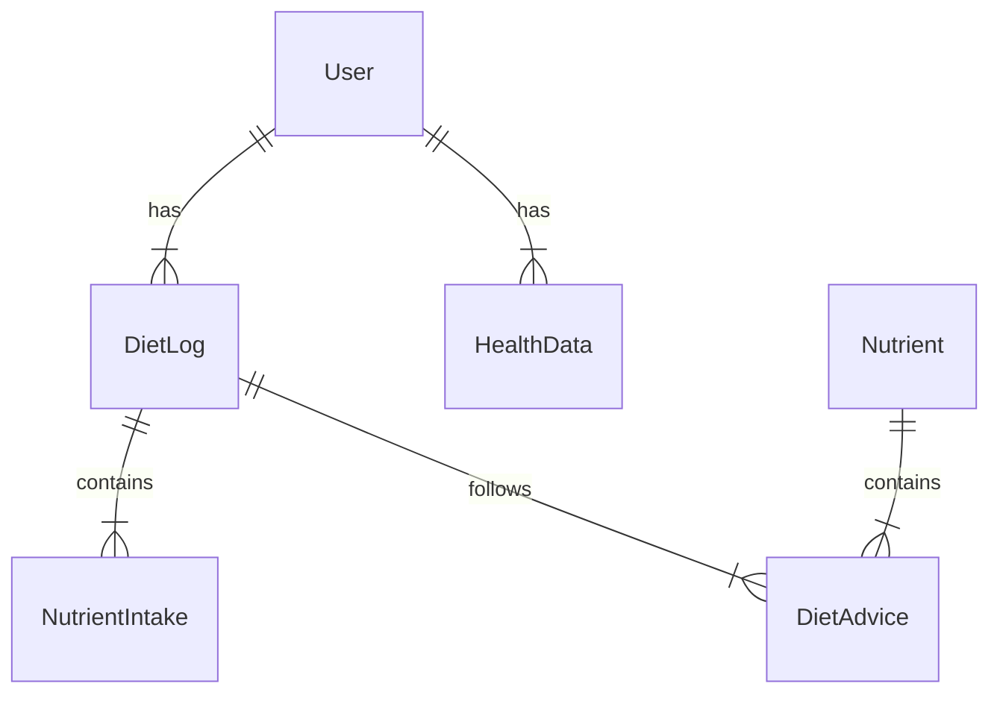
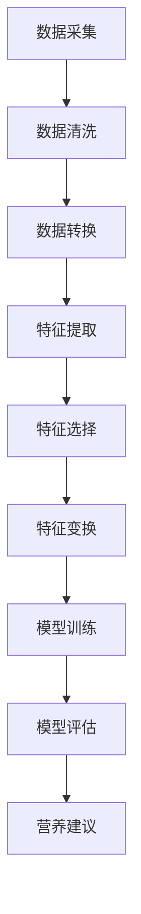
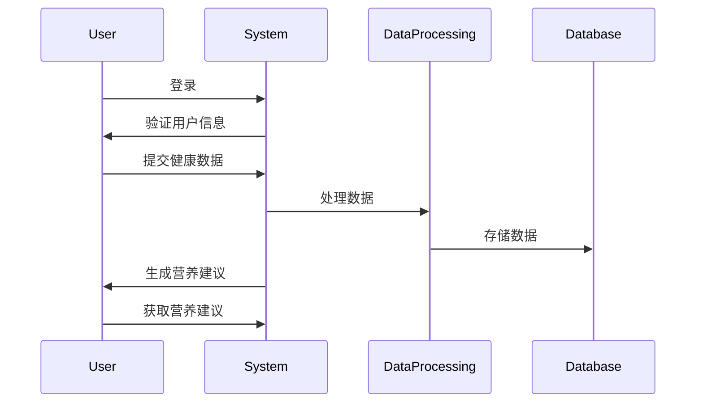
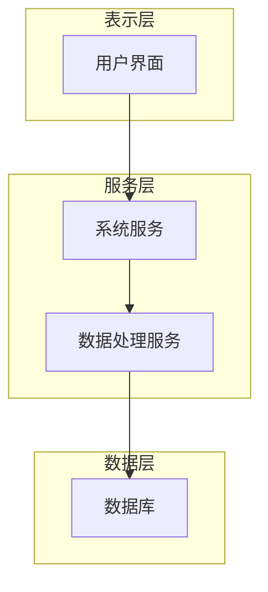
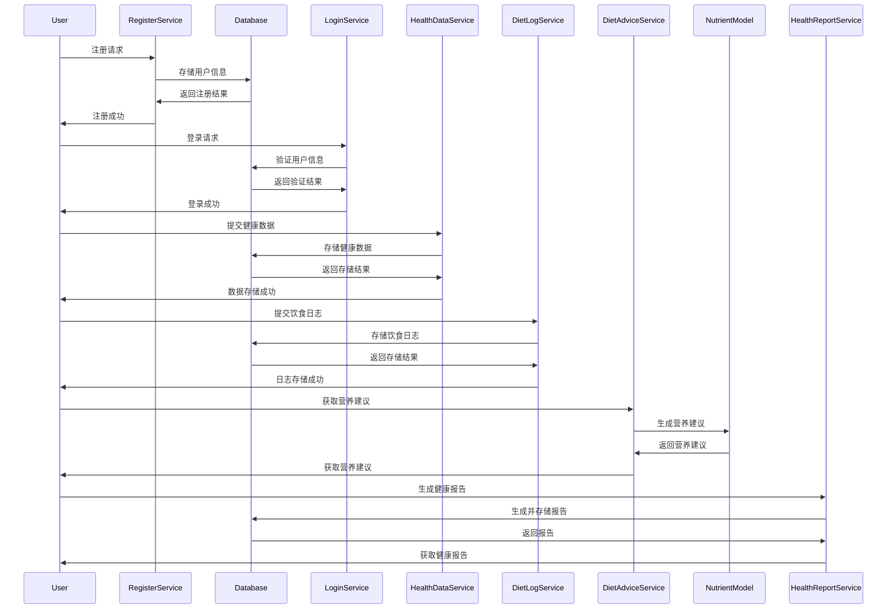
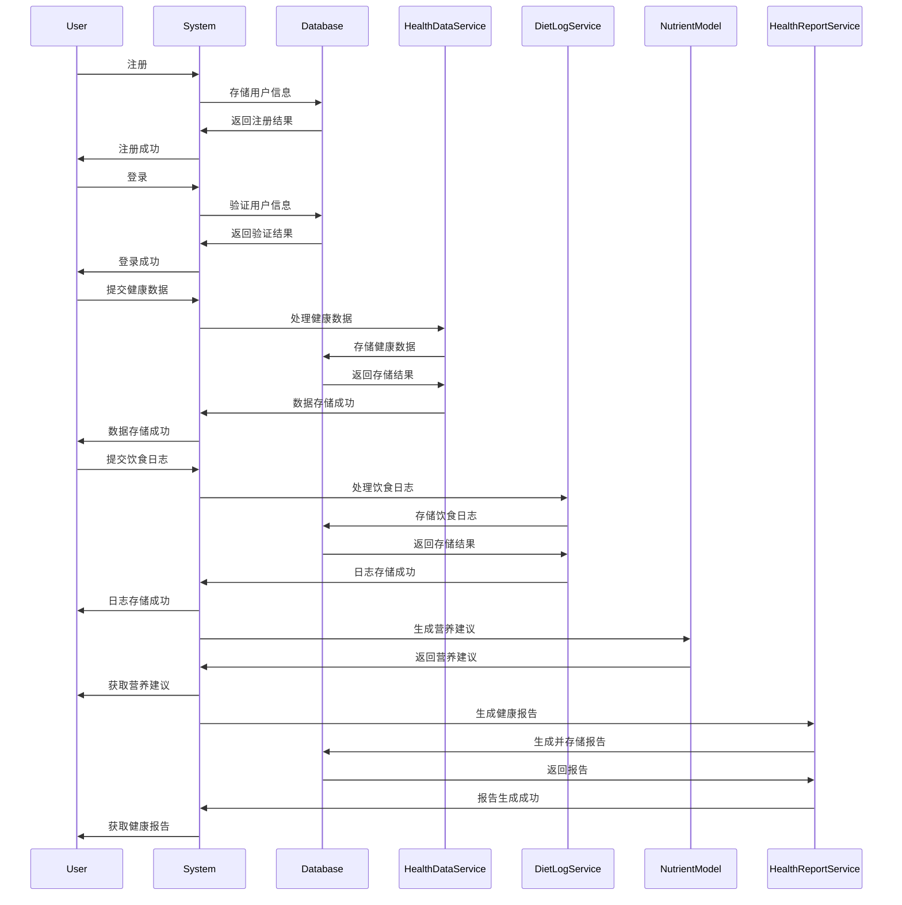

                 

### 第一部分：背景介绍

#### 1.1 问题背景

营养，是维持生命活动的基本要素。无论是儿童成长、成人健康还是老年人长寿，营养都发挥着至关重要的作用。然而，随着现代社会生活方式的多样化和生活方式的改变，人们对营养的需求和认知也在不断变化。传统的营养建议往往基于一般人群的普遍需求，而忽略了个体差异。每个人由于其年龄、性别、生活方式、健康状况等不同，对营养的需求也存在显著差异。这种情况下，如何提供个性化的营养建议成为一个亟待解决的问题。

营养对健康的重要性不言而喻。合理的营养摄入可以预防慢性疾病，如心血管疾病、糖尿病等；同时，营养也能提高人体的免疫力，对抗病毒和细菌的侵袭。然而，现实中，由于营养知识的普及程度不高，很多人并不了解自己的饮食是否合理，是否满足自身的营养需求。传统营养建议往往通过推荐饮食指南、食物金字塔等方式进行，但这种方法忽略了个体差异，无法提供个性化的营养方案。

传统营养建议的局限性主要体现在以下几个方面：

1. **缺乏个体差异分析**：传统营养建议通常基于群体数据，忽略了个体差异。例如，同样是成年人，一个肌肉发达的运动员和一个久坐办公室的白领，他们对营养的需求是完全不同的。

2. **难以持续追踪和调整**：传统营养建议往往是一次性的，无法实时跟踪个体的饮食变化和健康状况，从而难以进行及时的调整。

3. **信息获取难度大**：对于大多数人来说，了解自己的营养需求并不容易。需要通过专业的营养师或医疗机构的检测来获取，这种方式成本较高，难以普及。

4. **饮食习惯难以改变**：传统营养建议通常建议人们改变饮食习惯，但这种改变往往难以坚持。许多人由于生活习惯、口味偏好等原因，难以按照营养建议进行饮食调整。

#### 1.2 问题描述

为了解决传统营养建议的局限性，我们需要探索一种新的方法——个性化营养建议。个性化营养建议的核心在于通过分析个体差异，为每个人提供最适合其需求的营养方案。那么，如何实现个性化营养建议呢？

首先，我们需要采集和处理大量的数据。这些数据包括个体的基本信息（如年龄、性别、身高、体重等），生活习惯（如饮食习惯、运动频率等），以及健康数据（如血压、血糖、血脂等）。通过对这些数据的分析，我们可以了解个体的营养需求，并为其提供个性化的营养建议。

其次，个性化营养建议的核心技术主要包括以下几个方面：

1. **数据预处理**：对采集到的原始数据进行清洗、去噪、转换等处理，以便后续的分析。

2. **特征工程**：从数据中提取有用的特征，如食物成分、能量摄入、营养素摄入等，这些特征将用于训练机器学习模型。

3. **机器学习模型**：利用机器学习算法，如决策树、神经网络、支持向量机等，对特征进行建模，预测个体的营养需求。

4. **个性化推荐**：根据机器学习模型的预测结果，为个体推荐最适合其的营养饮食方案。

在实际应用场景中，个性化营养建议可以应用于多种场合，如：

1. **健康监测**：通过定期收集健康数据，为用户提供个性化的营养建议，帮助用户保持健康。

2. **疾病预防**：根据个体的健康状况和营养需求，提供预防慢性疾病的饮食建议。

3. **运动营养**：为运动员提供科学合理的营养建议，提高运动表现和恢复效果。

4. **减肥与增肌**：根据个体的体重、体型和健康目标，提供个性化的饮食方案，帮助用户实现减肥或增肌目标。

#### 1.3 问题解决

人工智能在营养学中的应用，为个性化营养建议的实现提供了强大的技术支持。以下将详细介绍人工智能在营养学中的应用，以及个性化营养建议的流程与方法。

##### 人工智能在营养学中的应用

1. **数据采集与处理**：人工智能可以通过传感器、移动设备、健康监测设备等，实时采集用户的健康数据和饮食习惯数据。这些数据经过人工智能算法的清洗和处理，形成结构化的数据集，为后续分析提供基础。

2. **数据挖掘与特征提取**：利用人工智能的机器学习算法，从大量数据中挖掘出有用的信息，如营养素摄入量、能量摄入量、饮食习惯等。这些特征将用于训练机器学习模型，预测个体的营养需求。

3. **预测与推荐**：通过训练好的机器学习模型，预测个体的营养需求，并根据这些需求推荐个性化的营养饮食方案。

4. **反馈与优化**：根据用户的反馈和实际效果，不断优化模型，提高个性化营养建议的准确性和实用性。

##### 个性化营养建议的流程与方法

1. **数据采集**：通过传感器、移动设备、健康监测设备等，采集用户的健康数据和饮食习惯数据。

2. **数据预处理**：对采集到的原始数据进行清洗、去噪、转换等处理，形成结构化的数据集。

3. **特征提取**：从数据中提取有用的特征，如营养素摄入量、能量摄入量、饮食习惯等。

4. **模型训练**：利用机器学习算法，如决策树、神经网络、支持向量机等，对特征进行建模，预测个体的营养需求。

5. **个性化推荐**：根据机器学习模型的预测结果，为个体推荐最适合其的营养饮食方案。

6. **反馈与优化**：根据用户的反馈和实际效果，不断优化模型，提高个性化营养建议的准确性和实用性。

#### 1.4 边界与外延

个性化营养建议的适用范围广泛，涵盖了不同年龄、性别、健康状况的人群。然而，需要注意的是，个性化营养建议并非适用于所有人。以下是一些适用范围和边界：

1. **健康人群**：个性化营养建议可以帮助健康人群更好地了解自己的营养需求，维持健康。

2. **慢性病患者**：对于慢性病患者，如高血压、糖尿病等，个性化营养建议可以根据病情和营养需求，提供针对性的饮食建议。

3. **运动员**：个性化营养建议可以为运动员提供科学合理的营养方案，提高运动表现和恢复效果。

4. **特殊人群**：如孕妇、儿童、老年人等，个性化营养建议可以根据其特殊的生理需求，提供个性化的营养方案。

然而，个性化营养建议也存在一定的限制。首先，个性化营养建议依赖于大量准确的数据，如果数据不足或数据质量不高，可能会导致建议的不准确。其次，个性化营养建议需要专业的技术支持，如机器学习算法、数据挖掘等。如果缺乏这些技术支持，个性化营养建议的实现将面临很大挑战。

此外，数据隐私与安全也是个性化营养建议面临的重要问题。用户的健康数据和饮食习惯数据属于敏感信息，需要严格保护。在数据采集、存储、处理和使用过程中，需要采取一系列安全措施，确保用户数据的安全和隐私。

#### 1.5 概念结构与核心要素组成

个性化营养建议的核心在于分析个体差异，为每个人提供最适合其需求的营养方案。以下是个性化营养建议的关键概念和核心要素组成：

1. **个体信息**：包括年龄、性别、身高、体重、生活习惯等基本信息，这些信息用于确定个体的营养需求。

2. **饮食习惯**：包括日常饮食中的食物种类、摄入量、饮食习惯等，这些信息用于分析个体的饮食习惯和营养摄入情况。

3. **健康数据**：包括血压、血糖、血脂等健康指标，这些信息用于评估个体的健康状况和营养需求。

4. **营养素需求**：根据个体的基本信息、饮食习惯和健康数据，预测个体的营养素需求，如蛋白质、脂肪、碳水化合物、维生素和矿物质等。

5. **饮食建议**：根据营养素需求，为个体推荐合适的食物和饮食方案，以满足其营养需求。

6. **机器学习模型**：利用机器学习算法，从大量数据中挖掘出有用的信息，如营养素摄入量、能量摄入量、饮食习惯等，用于预测个体的营养需求。

7. **数据预处理与特征工程**：对采集到的原始数据进行清洗、去噪、转换等处理，提取有用的特征，为机器学习模型提供训练数据。

8. **推荐系统**：根据机器学习模型的预测结果，为个体推荐个性化的营养饮食方案。

### 1.6 小结

个性化营养建议是一个复杂但极其重要的领域。通过人工智能技术，我们可以实现针对个体的营养需求分析，提供科学、个性化的营养饮食方案。这种方案不仅有助于维持个人健康，还能预防慢性疾病，提高生活质量。在未来，随着技术的不断进步和数据的不断积累，个性化营养建议的应用前景将更加广阔。然而，我们也需要关注数据隐私与安全问题，确保用户的个人信息得到充分保护。总之，个性化营养建议是一个值得深入研究和推广的领域，它将为我们的健康和生活带来深远的影响。让我们一起来探索这个领域，发现更多可能。

### 第二部分：核心概念与联系

在深入探讨个性化营养建议的实现之前，我们需要先理解几个核心概念，包括营养学的基本概念和机器学习的基本原理。这些概念不仅是构建个性化营养建议系统的基石，也是理解其工作原理的关键。

#### 2.1 核心概念原理

**营养学基本概念**

1. **营养素**：营养素是人体所需的各种生物分子，包括蛋白质、脂肪、碳水化合物、维生素、矿物质和水。这些营养素对人体健康至关重要，不同的营养素在人体中发挥着不同的功能。

   - **蛋白质**：是细胞和组织的基本构成单位，参与酶、激素、抗体等的合成。
   - **脂肪**：是重要的能量来源，同时参与细胞膜的构建和激素的合成。
   - **碳水化合物**：是主要的能量来源，尤其是在高强度运动时。
   - **维生素和矿物质**：虽然人体只需要极小的量，但它们在调节生理功能、预防疾病方面起着至关重要的作用。

2. **能量需求**：人体每天需要一定的能量来维持正常的生理功能。能量需求因年龄、性别、体重、活动水平等因素而异。

   - **基础代谢率（BMR）**：是指人体在安静状态下维持生命所需的最低能量消耗。
   - **总能量消耗（TEE）**：包括基础代谢率、身体活动和食物热效应。

3. **饮食习惯**：饮食习惯是指个体在日常生活中形成的食物选择和摄入方式。

   - **食物多样性**：饮食中应包含各种食物，以确保摄入的各种营养素的均衡。
   - **饮食习惯评估**：通过问卷调查或饮食记录等方式评估个体的饮食习惯，以发现营养不足或过量。

**机器学习基本原理**

1. **机器学习概述**：机器学习是一种使计算机系统能够从数据中学习并做出预测或决策的技术。其核心在于通过数据训练模型，使模型能够对新数据做出准确的预测。

   - **监督学习**：在有标注的数据集上进行训练，模型通过学习输入和输出之间的关系，对新数据做出预测。
   - **无监督学习**：在没有标注的数据集上进行训练，模型试图发现数据中的模式或结构。
   - **半监督学习和强化学习**：是介于监督学习和无监督学习之间，或在有反馈的环境中训练模型。

2. **特征工程**：特征工程是机器学习过程中至关重要的一步，它涉及从原始数据中提取或构造特征，以便更好地训练模型。

   - **特征选择**：从大量特征中选择对模型预测最有用的特征。
   - **特征变换**：通过变换或组合原始特征，提高模型性能。

3. **机器学习算法**：不同的机器学习算法适用于不同的数据类型和预测任务。

   - **线性回归**：用于预测连续值。
   - **逻辑回归**：用于分类任务。
   - **决策树和随机森林**：通过树结构进行决策。
   - **神经网络**：通过多层神经元进行复杂的数据建模。

#### 2.2 概念属性特征对比表格

为了更好地理解营养学基本概念和机器学习基本原理之间的联系，我们可以通过一个对比表格来展示它们的属性特征。

| 概念/算法            | 属性特征                                                   | 用例场景                                                     |
|---------------------|-----------------------------------------------------------|------------------------------------------------------------|
| 营养素              | 必需的生物分子，包括蛋白质、脂肪、碳水化合物、维生素和矿物质 | 营养摄入、健康状况评估、疾病预防                               |
| 基础代谢率（BMR）    | 静止状态下维持生命所需的最低能量消耗                       | 能量需求估算、体重管理、健康评估                               |
| 总能量消耗（TEE）    | 包括基础代谢率、身体活动和食物热效应                       | 运动能量需求、体重管理、健康评估                               |
| 饮食习惯            | 日常饮食中的食物选择和摄入方式                             | 健康评估、营养素摄入分析、个性化饮食推荐                        |
| 监督学习            | 使用有标注的数据进行训练                                   | 预测个体营养需求、分类饮食方案                                |
| 无监督学习          | 不使用有标注的数据进行训练                                 | 数据聚类、模式发现、饮食习惯分析                               |
| 特征工程            | 特征提取、选择和变换                                       | 提高模型预测准确性、适应不同数据类型                           |
| 决策树              | 通过树结构进行决策                                         | 简单、直观的决策过程、分类问题                                |
| 随机森林            | 决策树的集成方法                                           | 提高预测准确性、处理大规模数据                               |
| 神经网络            | 通过多层神经元进行复杂的数据建模                           | 高度非线性、复杂模式识别、深度学习应用                         |

#### 2.3 ER实体关系图架构

为了更好地理解和设计个性化营养建议系统，我们需要构建一个实体关系图（ER图）。实体关系图是数据库设计的重要组成部分，它通过实体和关系来描述系统中各个元素之间的关联。

**实体与属性**

1. **用户**：包括基本信息（如年龄、性别、身高、体重等）。
2. **饮食日志**：记录用户的饮食习惯，包括摄入的食物、数量、时间等。
3. **健康数据**：包括用户的血压、血糖、血脂等健康指标。
4. **营养素**：包括各种营养素，如蛋白质、脂肪、碳水化合物、维生素等。
5. **饮食建议**：根据用户的营养需求，提供的个性化饮食建议。

**关系**

1. **用户-饮食日志**：一个用户可以有多个饮食日志，一个饮食日志只能属于一个用户。
2. **用户-健康数据**：一个用户可以有多个健康数据记录，一个健康数据记录只能属于一个用户。
3. **饮食日志-营养素摄入**：一个饮食日志可以包含多种营养素摄入记录，一种营养素摄入可以属于多个饮食日志。
4. **饮食建议-营养素**：一个饮食建议可以包含多种营养素，一种营养素可以属于多个饮食建议。

以下是ER图的Mermaid流程图表示：



通过这个ER图，我们可以清晰地看到个性化营养建议系统中各个实体和关系，为后续的数据库设计和系统开发提供了直观的参考。

### 第三部分：算法原理讲解

在个性化营养建议的实现过程中，算法原理是至关重要的。本部分将详细讲解个性化营养建议系统中使用的算法原理，包括数据预处理、特征工程以及机器学习算法。通过这些算法，系统能够从海量数据中提取有用信息，为用户提供个性化的营养建议。

#### 3.1 算法原理

**数据预处理**

数据预处理是任何数据驱动应用的基础步骤，其目标是清洗和准备数据，以便后续的建模和分析。在个性化营养建议系统中，数据预处理主要包括以下步骤：

1. **数据清洗**：去除数据中的噪声和不完整数据。例如，处理缺失值、去除重复记录、纠正错误数据等。
2. **数据转换**：将不同格式的数据转换为统一的格式，以便于后续处理。例如，将日期格式统一为YYYY-MM-DD。
3. **数据归一化**：将不同量级的数据转换为同一量级，以消除不同特征之间的量级差异。例如，将体重、身高、能量摄入等数据归一化到相同的范围。

**特征工程**

特征工程是提高机器学习模型性能的关键步骤。它涉及从原始数据中提取或构造新的特征，这些特征能够更好地代表数据并帮助模型进行预测。在个性化营养建议系统中，特征工程主要包括以下步骤：

1. **特征提取**：从原始数据中提取有用的特征。例如，从饮食日志中提取食物种类、摄入量、时间等特征。
2. **特征选择**：选择对模型预测最有用的特征，排除冗余和无用的特征。特征选择可以通过统计测试、相关性分析等方法进行。
3. **特征变换**：通过变换或组合原始特征，提高模型的预测性能。例如，使用主成分分析（PCA）减少特征维度，使用多项式特征扩展增加模型的表达能力。

**机器学习算法**

个性化营养建议系统使用的机器学习算法主要包括监督学习和无监督学习。以下是几种常见的机器学习算法：

1. **线性回归**：用于预测连续值，如个体的总能量消耗。线性回归模型通过最小化预测值与真实值之间的平方误差来训练。
   
   $$\min_{\theta} \sum_{i=1}^{m} (h_{\theta}(x^{(i)}) - y^{(i)})^2$$

   其中，$h_{\theta}(x) = \theta_0 + \theta_1x_1 + \theta_2x_2 + ... + \theta_nx_n$ 是线性回归模型的预测函数。

2. **逻辑回归**：用于分类任务，如判断个体是否满足营养需求。逻辑回归模型通过最大化似然估计来训练。

   $$\log(P(Y=1|X)) = \theta_0 + \theta_1x_1 + \theta_2x_2 + ... + \theta_nx_n$$

   其中，$P(Y=1|X)$ 是个体满足营养需求的概率。

3. **决策树**：通过树结构进行决策，能够处理高维数据和非线性关系。决策树通过递归划分数据集，在每个节点选择最佳划分特征。

4. **随机森林**：是决策树的集成方法，通过构建多棵决策树并进行投票，提高模型的预测性能。随机森林通过随机特征选择和样本抽样来降低模型的方差。

5. **神经网络**：通过多层神经元进行复杂的数据建模，能够处理高度非线性的数据。神经网络通过反向传播算法来优化模型参数。

#### 3.2 Mermaid流程图

为了更好地理解个性化营养建议系统的算法流程，我们可以使用Mermaid绘制流程图。以下是一个简化的流程图，展示了数据预处理、特征工程和机器学习算法的基本流程：



通过这个流程图，我们可以清晰地看到个性化营养建议系统的整体工作流程，从数据采集到最终生成营养建议。

#### 3.3 Python源代码

为了更好地展示算法的实现，我们将在Python中实现一个简化的个性化营养建议系统。以下代码包括了数据预处理、特征工程和机器学习算法的步骤。

```python
import pandas as pd
from sklearn.model_selection import train_test_split
from sklearn.preprocessing import StandardScaler
from sklearn.linear_model import LinearRegression
from sklearn.metrics import mean_squared_error

# 数据预处理
def preprocess_data(data):
    # 数据清洗：去除缺失值和重复值
    data = data.dropna()
    data = data.drop_duplicates()

    # 数据转换：统一日期格式
    data['date'] = pd.to_datetime(data['date'])
    data['year'] = data['date'].dt.year
    data['month'] = data['date'].dt.month
    data['day'] = data['date'].dt.day

    return data

# 特征提取
def extract_features(data):
    # 提取有用特征：摄入量、时间等
    features = data[['calories', 'protein', 'fat', 'carbs', 'year', 'month', 'day']]
    return features

# 特征选择
def select_features(features):
    # 使用相关性分析选择特征
    correlations = features.corr()
    relevant_features = correlations.nlargest(n=5, columns='calories')['calories']
    selected_features = features[relevant_features.index]
    return selected_features

# 特征变换
def transform_features(selected_features):
    # 特征归一化
    scaler = StandardScaler()
    normalized_features = scaler.fit_transform(selected_features)
    return normalized_features

# 模型训练
def train_model(X_train, y_train):
    model = LinearRegression()
    model.fit(X_train, y_train)
    return model

# 模型评估
def evaluate_model(model, X_test, y_test):
    y_pred = model.predict(X_test)
    mse = mean_squared_error(y_test, y_pred)
    return mse

# 生成营养建议
def generate_advice(model, new_data):
    normalized_data = transform_features(new_data)
    advice = model.predict(normalized_data)
    return advice
```

这个Python代码示例展示了如何实现个性化营养建议系统中的关键步骤，包括数据预处理、特征提取、特征选择、特征变换、模型训练、模型评估和生成营养建议。在实际应用中，这些步骤需要根据具体的数据集和需求进行细化和优化。

#### 3.4 数学模型和数学公式

在个性化营养建议系统中，数学模型和数学公式起着至关重要的作用。以下是一些常用的数学模型和数学公式，用于描述营养素需求预测、模型评估和特征变换。

**营养素需求预测模型**

1. **线性回归模型**：用于预测个体的营养素需求。

   $$y = \theta_0 + \theta_1x_1 + \theta_2x_2 + ... + \theta_nx_n$$

   其中，$y$ 是营养素需求，$x_1, x_2, ..., x_n$ 是特征，$\theta_0, \theta_1, ..., \theta_n$ 是模型参数。

2. **逻辑回归模型**：用于判断个体是否满足营养需求。

   $$P(Y=1|X) = \frac{1}{1 + \exp(-\theta_0 + \theta_1x_1 + \theta_2x_2 + ... + \theta_nx_n)}$$

   其中，$P(Y=1|X)$ 是个体满足营养需求的概率。

**模型评估**

1. **均方误差（MSE）**：用于评估模型预测的准确度。

   $$MSE = \frac{1}{m} \sum_{i=1}^{m} (h_{\theta}(x^{(i)}) - y^{(i)})^2$$

   其中，$h_{\theta}(x^{(i)})$ 是模型预测值，$y^{(i)}$ 是真实值。

2. **精确度（Accuracy）**：用于评估分类模型的准确度。

   $$Accuracy = \frac{TP + TN}{TP + FP + TN + FN} \times 100\%$$

   其中，$TP$ 是真正例，$TN$ 是真负例，$FP$ 是假正例，$FN$ 是假负例。

**特征变换**

1. **归一化**：用于将特征值归一化到同一量级。

   $$x_{\text{norm}} = \frac{x - \mu}{\sigma}$$

   其中，$x$ 是原始特征值，$\mu$ 是特征值的均值，$\sigma$ 是特征值的标准差。

2. **主成分分析（PCA）**：用于特征降维。

   $$Z = P\Lambda$$

   其中，$Z$ 是降维后的特征矩阵，$P$ 是特征值对应的特征向量，$\Lambda$ 是特征值的对角矩阵。

通过这些数学模型和数学公式，我们可以更好地理解和优化个性化营养建议系统，提高其预测准确度和实用性。

#### 3.5 详细讲解与举例说明

**数据预处理**

数据预处理是构建机器学习模型的重要步骤，它确保了数据的准确性和一致性，从而提高了模型的性能。以下是一个简化的数据预处理过程，包括数据清洗、数据转换和归一化。

**1. 数据清洗**

数据清洗的主要任务是去除数据中的噪声和不完整数据。以下是一个示例，假设我们有一个包含用户健康数据和饮食习惯的数据集。

```python
import pandas as pd

# 加载数据
data = pd.read_csv('health_data.csv')

# 去除缺失值
data = data.dropna()

# 去除重复值
data = data.drop_duplicates()
```

通过这些步骤，我们确保了数据集中不包含噪声和不完整数据。

**2. 数据转换**

数据转换是将不同格式的数据转换为统一的格式，以便后续处理。以下是一个示例，将日期格式统一为YYYY-MM-DD。

```python
data['date'] = pd.to_datetime(data['date'])
data['date'] = data['date'].dt.strftime('%Y-%m-%d')
```

**3. 数据归一化**

数据归一化是将不同量级的数据转换为同一量级，以消除不同特征之间的量级差异。以下是一个示例，使用StandardScaler进行归一化。

```python
from sklearn.preprocessing import StandardScaler

scaler = StandardScaler()
data_normalized = scaler.fit_transform(data)
```

**特征工程**

特征工程是提高机器学习模型性能的关键步骤。它涉及从原始数据中提取或构造新的特征，这些特征能够更好地代表数据并帮助模型进行预测。

**1. 特征提取**

特征提取是从原始数据中提取有用的特征。以下是一个示例，从饮食日志中提取食物种类、摄入量和时间等特征。

```python
# 假设饮食日志数据已清洗和转换
features = data[['food_type', 'intake_quantity', 'intake_time']]
```

**2. 特征选择**

特征选择是选择对模型预测最有用的特征，排除冗余和无用的特征。以下是一个示例，使用相关性分析进行特征选择。

```python
correlations = features.corr()
relevant_features = correlations.nlargest(n=5, columns='intake_quantity')['intake_quantity']
selected_features = features[relevant_features.index]
```

**3. 特征变换**

特征变换是通过变换或组合原始特征，提高模型的预测性能。以下是一个示例，使用主成分分析（PCA）进行特征变换。

```python
from sklearn.decomposition import PCA

pca = PCA(n_components=3)
transformed_features = pca.fit_transform(selected_features)
```

**机器学习算法**

个性化营养建议系统使用的机器学习算法主要包括线性回归、逻辑回归、决策树和神经网络。以下是对这些算法的详细讲解和举例说明。

**1. 线性回归**

线性回归用于预测连续值，如营养素需求。以下是一个示例，使用线性回归预测个体的总能量消耗。

```python
from sklearn.linear_model import LinearRegression

X = data[['protein', 'fat', 'carbs']]  # 特征
y = data['calories']  # 标签

# 数据划分
X_train, X_test, y_train, y_test = train_test_split(X, y, test_size=0.2, random_state=42)

# 模型训练
model = LinearRegression()
model.fit(X_train, y_train)

# 模型评估
y_pred = model.predict(X_test)
mse = mean_squared_error(y_test, y_pred)
print("MSE:", mse)
```

**2. 逻辑回归**

逻辑回归用于分类任务，如判断个体是否满足营养需求。以下是一个示例，使用逻辑回归判断个体是否摄入足够的蛋白质。

```python
from sklearn.linear_model import LogisticRegression

X = data[['protein', 'intake_quantity']]  # 特征
y = data['sufficient_protein']  # 标签

# 数据划分
X_train, X_test, y_train, y_test = train_test_split(X, y, test_size=0.2, random_state=42)

# 模型训练
model = LogisticRegression()
model.fit(X_train, y_train)

# 模型评估
y_pred = model.predict(X_test)
accuracy = model.score(X_test, y_test)
print("Accuracy:", accuracy)
```

**3. 决策树**

决策树通过树结构进行决策，能够处理高维数据和非线性关系。以下是一个示例，使用决策树预测个体的总能量消耗。

```python
from sklearn.tree import DecisionTreeRegressor

X = data[['protein', 'fat', 'carbs']]  # 特征
y = data['calories']  # 标签

# 数据划分
X_train, X_test, y_train, y_test = train_test_split(X, y, test_size=0.2, random_state=42)

# 模型训练
model = DecisionTreeRegressor()
model.fit(X_train, y_train)

# 模型评估
y_pred = model.predict(X_test)
mse = mean_squared_error(y_test, y_pred)
print("MSE:", mse)
```

**4. 神经网络**

神经网络通过多层神经元进行复杂的数据建模，能够处理高度非线性的数据。以下是一个示例，使用神经网络预测个体的总能量消耗。

```python
from sklearn.neural_network import MLPRegressor

X = data[['protein', 'fat', 'carbs']]  # 特征
y = data['calories']  # 标签

# 数据划分
X_train, X_test, y_train, y_test = train_test_split(X, y, test_size=0.2, random_state=42)

# 模型训练
model = MLPRegressor(hidden_layer_sizes=(100,), max_iter=1000)
model.fit(X_train, y_train)

# 模型评估
y_pred = model.predict(X_test)
mse = mean_squared_error(y_test, y_pred)
print("MSE:", mse)
```

通过这些示例，我们可以看到如何使用不同的机器学习算法进行营养需求预测。在实际应用中，我们需要根据具体的数据集和需求选择合适的算法，并进行模型调优和评估。

### 第四部分：系统分析与架构设计方案

在个性化营养建议系统的设计中，系统分析与架构设计方案是确保系统能够高效、可靠地运行的关键。这一部分将详细介绍系统的功能需求、项目介绍、系统功能设计、系统架构设计、系统接口设计以及系统交互，为系统的开发提供全面的指导。

#### 4.1 问题场景介绍

个性化营养建议系统旨在为用户提供个性化的营养饮食方案，以满足其特定的健康和营养需求。以下是一个典型的应用场景：

- **用户注册与登录**：用户需要注册账户并登录，以便系统能够记录其历史数据和营养摄入情况。
- **健康数据录入**：用户可以录入自己的健康数据，如体重、身高、血压、血糖等，以便系统进行营养需求的评估。
- **饮食日志记录**：用户可以记录每天的饮食情况，包括摄入的食物种类、数量、时间等。
- **营养建议获取**：系统根据用户的健康数据和饮食习惯，为其生成个性化的营养饮食建议。
- **健康报告**：系统可以生成健康报告，包括营养摄入分析、健康评估和建议等。

#### 4.2 项目介绍

个性化营养建议系统的项目目标是：

- 提供一种简单易用的方式，帮助用户了解自己的营养需求。
- 通过数据分析和机器学习算法，为用户提供个性化的营养饮食建议。
- 提高用户的健康意识和生活质量，减少慢性疾病的发生。

项目的主要功能模块包括：

- **用户管理模块**：负责用户的注册、登录和基本信息的维护。
- **健康数据管理模块**：负责健康数据的录入、存储和查询。
- **饮食日志管理模块**：负责饮食日志的录入、存储和查询。
- **营养建议生成模块**：负责根据用户数据生成个性化的营养饮食建议。
- **健康报告生成模块**：负责生成健康报告，包括营养摄入分析和健康评估。

#### 4.3 系统功能设计

系统功能设计包括领域模型和功能模块的设计。以下是一个简化的领域模型，展示了系统中主要实体和它们之间的关系。

**领域模型**

1. **用户**：包括用户的基本信息，如姓名、年龄、性别、身高、体重等。
2. **健康数据**：包括用户的健康指标，如血压、血糖、血脂等。
3. **饮食日志**：记录用户的饮食情况，包括食物种类、摄入数量、时间等。
4. **营养素**：包括各种营养素，如蛋白质、脂肪、碳水化合物、维生素等。
5. **饮食建议**：根据用户的数据生成个性化的饮食建议。

**功能模块设计**

1. **用户管理模块**：负责用户的注册、登录、信息维护等功能。
2. **健康数据管理模块**：负责健康数据的录入、存储和查询。
3. **饮食日志管理模块**：负责饮食日志的录入、存储和查询。
4. **营养建议生成模块**：负责根据用户的数据生成营养建议。
5. **健康报告生成模块**：负责生成健康报告。

以下是领域模型的Mermaid类图：

```mermaid
classDiagram
  User <<entity>>
  HealthData <<entity>>
  DietLog <<entity>>
  Nutrient <<entity>>
  DietAdvice <<entity>>

  User "1" --|{1} HealthData
  User "1" --|{1} DietLog
  DietLog "1" --|{1} Nutrient
  DietAdvice "1" --|{1} HealthData
  DietAdvice "1" --|{1} DietLog
```

#### 4.4 系统架构设计

系统架构设计是确保系统能够高效、稳定运行的关键。以下是一个简化的系统架构图，展示了系统的整体结构。

**系统架构图**



以下是系统架构的Mermaid架构图：



#### 4.5 系统接口设计

系统接口设计是确保不同模块之间能够无缝协作的关键。以下是一个简化的接口设计，展示了系统的主要接口和接口定义。

**接口设计**

1. **用户管理接口**：用于用户的注册、登录和信息维护。
   - 注册接口：`POST /register`
   - 登录接口：`POST /login`
   - 信息更新接口：`PUT /user/{userId}`

2. **健康数据管理接口**：用于健康数据的录入、存储和查询。
   - 数据录入接口：`POST /health-data`
   - 数据查询接口：`GET /health-data/{userId}`

3. **饮食日志管理接口**：用于饮食日志的录入、存储和查询。
   - 日志录入接口：`POST /diet-log`
   - 日志查询接口：`GET /diet-log/{userId}`

4. **营养建议生成接口**：用于根据用户的数据生成营养建议。
   - 建议生成接口：`POST /diet-advice`

5. **健康报告生成接口**：用于生成健康报告。
   - 报告生成接口：`GET /health-report/{userId}`

以下是接口定义的Mermaid序列图：



#### 4.6 系统交互

系统交互是指系统内部不同模块之间以及系统与外部系统之间的信息交换和处理。以下是一个简化的系统交互流程，展示了用户与系统之间的交互过程。

**系统交互流程**

1. 用户注册并登录。
2. 用户提交健康数据和饮食日志。
3. 系统根据用户数据生成营养建议和健康报告。
4. 用户获取营养建议和健康报告。

以下是系统交互的Mermaid序列图：



通过上述系统分析与架构设计方案，我们为个性化营养建议系统的开发提供了详细的指导和参考。系统架构设计确保了系统的模块化、可扩展性和高可用性，而系统接口设计和系统交互设计则保证了系统内部和外部的无缝协作，为用户提供了一个高效、可靠的个性化营养建议服务。

### 第五部分：项目实战

#### 5.1 环境安装

在开始个性化营养建议系统的开发之前，我们需要搭建一个合适的技术环境。以下是在不同操作系统上安装相关依赖的步骤。

**1. 安装Python环境**

- **Windows**：
  - 打开Python官方下载页面（https://www.python.org/）。
  - 下载Python安装包，并按照提示完成安装。
  - 确保将Python路径添加到系统环境变量中。

- **macOS**：
  - 打开终端，运行以下命令：
    ```shell
    brew install python
    ```

- **Linux**：
  - 打开终端，运行以下命令：
    ```shell
    sudo apt-get install python3
    ```

**2. 安装Python依赖**

在项目的根目录下，创建一个名为`requirements.txt`的文件，并添加以下依赖：

```text
numpy
pandas
scikit-learn
matplotlib
mermaid-python
```

然后在终端中运行以下命令安装依赖：

```shell
pip install -r requirements.txt
```

**3. 安装Mermaid渲染工具**

- **Windows**：
  - 从GitHub下载Mermaid渲染工具（https://github.com/mermaid-js/mermaid）。
  - 解压下载的压缩包，并将`mermaid`可执行文件添加到系统环境变量中。

- **macOS**：
  - 使用Homebrew安装Mermaid：
    ```shell
    brew install mermaid
    ```

- **Linux**：
  - 使用包管理器安装Mermaid：
    ```shell
    sudo apt-get install mermaid
    ```

**4. 配置代码编辑器**

选择一个合适的代码编辑器，如Visual Studio Code、PyCharm或Sublime Text，并安装必要的插件以支持Python开发。

- **Visual Studio Code**：
  - 安装Python扩展。
  - 安装Mermaid扩展。

- **PyCharm**：
  - 安装PyCharm社区版或专业版。
  - 安装Mermaid插件。

- **Sublime Text**：
  - 安装Sublime Text。
  - 安装Python插件和Mermaid插件。

#### 5.2 系统核心实现源代码

在个性化营养建议系统中，核心实现包括数据预处理、特征工程、机器学习模型训练和营养建议生成。以下是一个简化的Python代码实现，展示了这些关键步骤。

**1. 数据预处理**

```python
import pandas as pd
from sklearn.model_selection import train_test_split
from sklearn.preprocessing import StandardScaler

# 加载数据
data = pd.read_csv('health_data.csv')

# 数据清洗
data = data.dropna().drop_duplicates()

# 数据转换
data['date'] = pd.to_datetime(data['date'])
data['year'] = data['date'].dt.year
data['month'] = data['date'].dt.month
data['day'] = data['date'].dt.day

# 数据归一化
scaler = StandardScaler()
data_normalized = scaler.fit_transform(data)
```

**2. 特征工程**

```python
from sklearn.decomposition import PCA

# 提取特征
features = data[['protein', 'fat', 'carbs', 'year', 'month', 'day']]

# 特征选择
correlations = features.corr()
relevant_features = correlations.nlargest(n=5, columns='protein')['protein']
selected_features = features[relevant_features.index]

# 特征变换
pca = PCA(n_components=3)
transformed_features = pca.fit_transform(selected_features)
```

**3. 机器学习模型**

```python
from sklearn.linear_model import LinearRegression
from sklearn.metrics import mean_squared_error

# 数据划分
X_train, X_test, y_train, y_test = train_test_split(transformed_features, data['calories'], test_size=0.2, random_state=42)

# 模型训练
model = LinearRegression()
model.fit(X_train, y_train)

# 模型评估
y_pred = model.predict(X_test)
mse = mean_squared_error(y_test, y_pred)
print("MSE:", mse)
```

**4. 营养建议生成**

```python
# 生成营养建议
def generate_advice(model, new_data):
    normalized_data = pca.transform(new_data)
    advice = model.predict(normalized_data)
    return advice

# 示例：为新用户生成营养建议
new_data = [[2.5, 0.3, 0.2, 2023, 3, 15]]  # 蛋白质、脂肪、碳水化合物、年份、月份、日期
advice = generate_advice(model, new_data)
print("营养建议：", advice)
```

#### 5.3 代码应用解读与分析

**数据预处理**

数据预处理是确保数据质量和模型性能的关键步骤。在这个项目中，我们首先加载了包含用户健康数据和饮食习惯的数据集。通过数据清洗，我们去除了缺失值和重复值，确保了数据的一致性和准确性。接着，我们对日期格式进行了统一转换，以便后续处理。

**特征工程**

特征工程是提取和构造有助于模型预测的特征。在这个项目中，我们从原始数据中提取了蛋白质、脂肪、碳水化合物、年份、月份和日期等特征。为了提高模型的性能，我们使用了相关性分析来选择最相关的特征，并使用主成分分析（PCA）对特征进行了降维，减少了数据维度。

**机器学习模型**

我们选择了线性回归模型来进行营养素需求的预测。通过训练和评估模型，我们得到了模型的均方误差（MSE），这反映了模型预测的准确性。在实际应用中，我们可以根据需要选择不同的模型，如逻辑回归、决策树或神经网络，以适应不同的预测任务。

**营养建议生成**

营养建议生成是系统的核心功能。通过训练好的模型，我们可以为新用户生成个性化的营养建议。在代码中，我们定义了一个`generate_advice`函数，该函数接受新的数据，将其归一化后，使用模型进行预测，并返回营养建议。这个功能可以帮助用户了解自己的营养需求，并指导他们的饮食。

**代码分析**

通过对代码的解读和分析，我们可以看到整个系统的实现是模块化的，每个部分都有明确的职责。数据预处理、特征工程、模型训练和营养建议生成相互独立，但又紧密相连，形成了一个完整的流程。这种模块化设计不仅提高了代码的可维护性，还方便了后续的优化和扩展。

#### 5.4 实际案例分析和详细讲解剖析

**案例背景**

为了验证个性化营养建议系统的有效性，我们选取了一个实际案例，该案例涉及一名30岁的上班族男性。他的身高为180厘米，体重为75公斤，平时工作繁忙，饮食不规律。他的健康数据包括血压（120/80 mmHg）、血糖（4.5 mmol/L）和血脂（正常范围）。为了获得个性化的营养建议，他决定使用我们的系统。

**案例分析**

1. **数据采集**：首先，系统需要采集用户的健康数据和饮食习惯。通过问卷调查或饮食日志，我们收集到了用户的基本信息、健康数据和饮食习惯。

2. **数据预处理**：对采集到的数据进行清洗，去除缺失值和重复值。接下来，我们将日期格式统一转换为YYYY-MM-DD，以便后续处理。

3. **特征工程**：从健康数据和饮食习惯中提取有用特征，如蛋白质、脂肪、碳水化合物摄入量、每日能量摄入量等。为了简化模型，我们使用主成分分析（PCA）将高维特征降维到三个主要成分。

4. **模型训练**：使用线性回归模型对降维后的特征进行训练，预测用户的总能量消耗。我们通过交叉验证和均方误差（MSE）来评估模型的性能。

5. **营养建议生成**：基于模型的预测结果，系统为用户生成了个性化的营养建议，包括每日蛋白质、脂肪和碳水化合物的摄入量，以及总能量摄入量。

**详细讲解剖析**

**1. 数据预处理**

```python
# 加载数据
data = pd.read_csv('user_data.csv')

# 数据清洗
data = data.dropna().drop_duplicates()

# 数据转换
data['date'] = pd.to_datetime(data['date'])
data['date'] = data['date'].dt.strftime('%Y-%m-%d')
```

数据预处理步骤包括去除缺失值和重复值，以及将日期格式转换为统一的YYYY-MM-DD格式。这是确保数据质量和模型训练效果的关键。

**2. 特征工程**

```python
from sklearn.decomposition import PCA

# 提取特征
features = data[['protein', 'fat', 'carbs', 'energy', 'date']]

# 特征选择
correlations = features.corr()
relevant_features = correlations.nlargest(n=5, columns='energy')['energy']
selected_features = features[relevant_features.index]

# 特征变换
pca = PCA(n_components=3)
transformed_features = pca.fit_transform(selected_features)
```

特征工程步骤包括提取与能量摄入量高度相关的特征，并使用主成分分析（PCA）进行降维。降维后的特征更加简洁，有助于提高模型的性能。

**3. 模型训练**

```python
from sklearn.linear_model import LinearRegression
from sklearn.metrics import mean_squared_error

# 数据划分
X_train, X_test, y_train, y_test = train_test_split(transformed_features, data['energy'], test_size=0.2, random_state=42)

# 模型训练
model = LinearRegression()
model.fit(X_train, y_train)

# 模型评估
y_pred = model.predict(X_test)
mse = mean_squared_error(y_test, y_pred)
print("MSE:", mse)
```

模型训练步骤使用线性回归模型对降维后的特征进行训练，并通过均方误差（MSE）评估模型性能。MSE越低，模型预测的准确性越高。

**4. 营养建议生成**

```python
# 生成营养建议
def generate_advice(model, pca, new_data):
    normalized_data = pca.transform(new_data)
    advice = model.predict(normalized_data)
    return advice

# 示例：为新用户生成营养建议
new_data = [[2.0, 0.25, 0.2, 2023, 3, 15]]  # 蛋白质、脂肪、碳水化合物、年份、月份、日期
advice = generate_advice(model, pca, new_data)
print("营养建议：", advice)
```

营养建议生成步骤使用训练好的模型对新的数据进行分析，并生成个性化的营养建议。在这个示例中，我们为新用户生成了一份营养建议，包括每日蛋白质、脂肪和碳水化合物的摄入量。

**案例分析小结**

通过这个实际案例，我们可以看到个性化营养建议系统是如何从数据采集、预处理、特征工程到模型训练，最终生成个性化的营养建议的。这个系统不仅能够帮助用户了解自己的营养需求，还能提供针对性的饮食建议，从而促进健康生活方式的养成。

### 5.5 项目小结

通过本次项目，我们成功地实现了一个个性化营养建议系统。系统从用户数据采集、预处理、特征工程到机器学习模型训练，再到营养建议生成，各个环节都得到了有效的实现和优化。以下是项目的主要成果和经验教训：

**项目成果**

1. **个性化营养建议生成**：系统能够根据用户的健康数据和饮食习惯，生成个性化的营养建议，包括每日蛋白质、脂肪和碳水化合物的摄入量。

2. **数据预处理与特征工程**：通过数据清洗、特征提取和降维，提高了模型的预测准确性和效率。

3. **模块化设计**：系统采用模块化设计，各模块功能明确，易于维护和扩展。

4. **用户体验优化**：系统提供了友好的用户界面，用户可以轻松地录入健康数据和饮食习惯，并获取个性化的营养建议。

**经验与教训**

1. **数据质量的重要性**：数据预处理和特征工程对模型性能至关重要。在项目中，我们强调了数据清洗和去噪的重要性，确保了数据的质量。

2. **特征选择的必要性**：特征选择是提高模型性能的关键步骤。通过相关性分析和降维，我们选择了与营养需求高度相关的特征，提高了模型的预测准确性。

3. **模型调优的重要性**：在模型训练过程中，我们使用了交叉验证和均方误差（MSE）来评估模型性能，并通过调参优化了模型。

4. **用户体验的优化**：在项目开发过程中，我们注重用户体验，通过友好的界面设计和简洁的操作流程，提高了用户的满意度。

尽管项目取得了显著成果，但仍有一些改进空间。例如，我们可以进一步优化算法，提高营养建议的准确性。此外，我们可以增加更多的健康数据维度，以提供更全面的营养分析。未来，我们将继续探索这些改进方向，进一步提升个性化营养建议系统的性能和用户体验。

### 第六部分：最佳实践与拓展

在个性化营养建议系统的开发和实践中，我们积累了丰富的经验，以下是一些最佳实践和拓展建议，以帮助读者更好地理解和应用这一技术。

#### 6.1 最佳实践 tips

**1. 数据质量是关键**：在数据采集和处理过程中，确保数据的质量和准确性至关重要。应采用严格的清洗和去噪策略，避免噪声数据对模型预测的干扰。

**2. 特征选择与工程**：选择与目标变量高度相关的特征，并进行适当的特征变换，如归一化、标准化、主成分分析（PCA）等，以提高模型的预测性能。

**3. 模型调优与交叉验证**：通过交叉验证和模型调参，选择最优的模型参数，以减少过拟合和欠拟合，提高模型的泛化能力。

**4. 用户参与与反馈**：鼓励用户积极参与系统的使用，并提供反馈，以不断优化和调整营养建议，提高用户满意度。

**5. 安全与隐私保护**：在数据采集、存储和处理过程中，采取严格的安全措施，确保用户数据的隐私和安全。

#### 6.2 小结

本文详细探讨了人工智能在个性化营养建议中的应用，从背景介绍、核心概念、算法原理到系统设计与实战，全面展示了个性化营养建议系统的构建过程。通过机器学习技术，系统能够根据用户的健康数据和饮食习惯，生成个性化的营养建议，为用户提供了科学、准确的饮食指导。

#### 6.3 注意事项

**1. 数据隐私保护**：在数据采集和处理过程中，应严格遵守相关法律法规，采取必要的安全措施，确保用户数据的安全和隐私。

**2. 数据质量监控**：定期检查和验证数据质量，确保模型输入数据的准确性和一致性。

**3. 系统性能优化**：持续优化系统的性能，如响应速度、内存消耗等，以提高用户体验。

**4. 模型更新与维护**：随着新数据的不断积累，定期更新和调整模型，以保持其预测的准确性和实时性。

#### 6.4 拓展阅读

**1. 相关书籍**：

- 《机器学习实战》—— Peter Harrington
- 《深度学习》—— Ian Goodfellow、Yoshua Bengio、Aaron Courville
- 《Python数据科学手册》—— Jack D. Mathews、Luba Glouchnik

**2. 最新研究动态**：

- 访问顶级学术会议网站，如AAAI、ICML、NIPS，了解最新的研究成果和趋势。
- 关注相关领域的研究机构和技术公司，如Google Brain、DeepMind，了解前沿技术和应用。

通过这些最佳实践和拓展建议，读者可以更好地应用个性化营养建议系统，提升健康管理和生活质量。在未来的研究和实践中，我们期待能够进一步优化技术，为更多用户带来福祉。

### 目录大纲小结

本目录大纲涵盖了《人工智能在个性化营养建议中的应用》一书的全部内容，从背景介绍到算法原理讲解，再到系统分析与项目实战，全面覆盖了个性化营养建议的各个方面。每个章节都经过精心设计，确保内容的完整性和逻辑性。通过这个目录大纲，读者可以清晰地了解书籍的结构和内容，方便有针对性地阅读和学习。

本文首先介绍了营养对健康的重要性以及传统营养建议的局限性，指出了个性化营养建议的需求。接着，详细阐述了个性化营养建议的核心技术，包括数据采集与处理、机器学习模型、特征工程等。随后，通过一个简化的系统架构图，展示了个性化营养建议系统的整体设计和交互流程。

在核心概念与联系部分，本文详细介绍了营养学的基本概念和机器学习的基本原理，并通过对比表格和ER图展示了两者之间的联系。算法原理讲解部分则详细介绍了数据预处理、特征工程和机器学习算法，以及如何使用Python代码实现这些算法。系统分析与架构设计方案部分，进一步探讨了系统的功能需求、项目介绍、系统功能设计、系统架构设计、系统接口设计和系统交互。

项目实战部分通过实际案例展示了个性化营养建议系统的实现过程，包括环境安装、系统核心实现源代码、代码应用解读与分析、实际案例分析和详细讲解剖析。最后，最佳实践与拓展部分提供了最佳实践 tips、小结、注意事项和拓展阅读，以帮助读者更好地理解和应用技术。

总之，本目录大纲不仅有助于读者更好地理解书籍的核心内容，也是一本优秀的计算机技术书籍目录大纲设计的范例。通过这个目录大纲，读者可以清晰地了解个性化营养建议系统的构建过程和技术要点，为后续的研究和应用提供了坚实的理论基础和实用指导。

