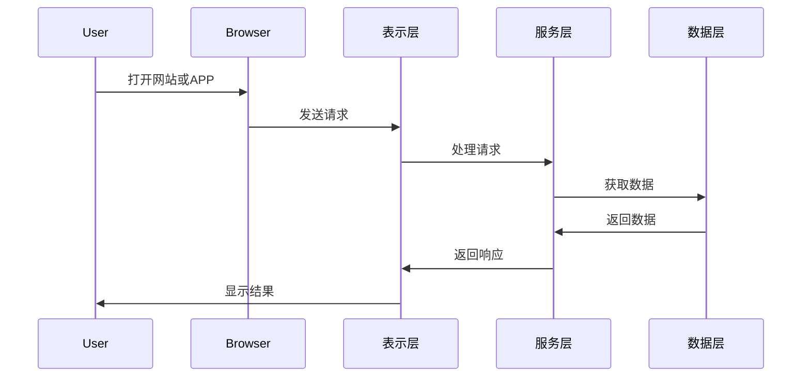
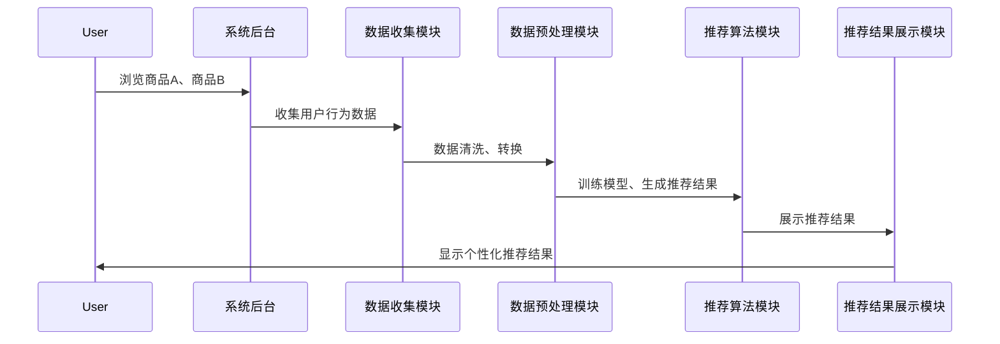

                 

### 引言

在当今这个数字化时代，人工智能（AI）的应用已经渗透到了社会的各个层面，尤其是在个性化营销领域，其影响力尤为显著。个性化营销是一种以用户为中心的营销策略，通过收集和分析用户的个人数据，为每个用户提供量身定制的内容、产品和推荐。这不仅提高了用户的满意度，也显著提升了企业的销售额和品牌忠诚度。

**问题背景：**

个性化营销的兴起源于消费者需求的多样化和市场竞争的加剧。传统的营销手段往往难以满足消费者的个性化需求，而人工智能技术的引入为个性化营销提供了新的可能性。通过机器学习、数据挖掘和自然语言处理等技术，人工智能能够快速、准确地分析海量数据，从而发现用户的偏好和需求，实现精准推荐。

**问题描述：**

尽管人工智能在个性化营销中展现了巨大的潜力，但其应用也带来了诸多伦理问题。首先，数据隐私保护成为一个关键问题。在个性化营销中，企业需要收集大量的用户数据，这些数据可能涉及用户的隐私信息。如何确保这些数据的安全性和隐私性，成为了一个亟待解决的难题。其次，人工智能系统可能存在偏见问题。如果训练数据存在偏差，那么算法的推荐结果也可能带有偏见，这可能会加剧社会不公平现象。最后，用户选择权也是一个重要问题。在个性化营销中，用户是否应该拥有选择接受或拒绝个性化推荐的权利，以及如何平衡用户隐私和个性化体验，需要深入探讨。

**问题解决：**

解决上述问题需要从多个层面进行。首先，在数据隐私保护方面，企业需要采用先进的数据加密技术和匿名化处理，确保用户数据的安全性和隐私性。同时，需要建立透明、公正的数据治理机制，让用户了解自己的数据是如何被使用的。其次，在偏见问题方面，企业需要确保训练数据的质量和多样性，避免算法偏见。此外，可以采用偏见检测和消除技术，确保算法的公平性和公正性。最后，在用户选择权方面，企业需要提供用户控制选项，让用户能够自主选择是否接受个性化推荐。

**边界与外延：**

个性化营销不仅涉及技术层面，还包括商业策略、用户体验等多个方面。从技术层面来看，个性化营销依赖于数据收集、分析和推荐算法等核心技术。从商业策略层面来看，个性化营销需要企业制定针对性的营销策略，以最大化用户满意度和企业收益。从用户体验层面来看，个性化营销需要提供高质量的用户体验，以提高用户忠诚度和品牌认知度。

**概念结构与核心要素组成：**

个性化营销的核心概念包括用户数据收集、数据分析、推荐算法、用户隐私保护、偏见检测与消除等。这些概念相互关联，共同构成了个性化营销的技术体系和商业模型。用户数据收集是个性化营销的基础，数据分析是发现用户偏好的关键，推荐算法是实现个性化推荐的核心，用户隐私保护和偏见检测与消除则是确保个性化营销可持续发展的关键。

### 核心概念与联系

在探讨人工智能在个性化营销中的应用时，了解相关核心概念及其相互关系是至关重要的。本节将深入探讨人工智能的基本概念、个性化营销的概念以及伦理问题在其中的应用，从而为后续内容的分析奠定基础。

#### 人工智能的基本概念

**定义：**

人工智能（Artificial Intelligence，简称AI）是指通过计算机系统实现人类智能行为的科学技术。它旨在使计算机能够模拟、扩展和增强人类的认知能力，包括学习、推理、解决问题、自然语言处理和感知等。

**发展历程：**

人工智能的发展可以追溯到20世纪50年代。起初，研究者们主要关注符号主义人工智能，即通过符号操作和逻辑推理来实现智能。随着计算能力的提升和算法的改进，人工智能经历了多次重要的发展阶段，包括专家系统、机器学习、深度学习等。

**核心原则：**

人工智能的核心原则包括：

1. **自主学习：** 人工智能系统应具备从数据中学习和自我改进的能力。
2. **鲁棒性：** 系统应能够在复杂、不确定的环境下稳定运行。
3. **泛化能力：** 系统应能将学到的知识应用于新的、未见过的情境。
4. **透明性和可解释性：** 系统的决策过程应具有一定的可解释性，便于用户理解。

#### 个性化营销的概念

**定义：**

个性化营销是一种以用户为中心的营销策略，旨在通过收集和分析用户的个人数据，为每个用户提供定制化、个性化的内容、产品和推荐。

**发展趋势：**

个性化营销的发展趋势包括：

1. **数据驱动：** 个性化营销依赖于大数据和数据分析技术，通过分析用户行为数据，实现精准推荐。
2. **智能化：** 随着人工智能技术的发展，个性化营销逐渐向智能化、自动化方向发展。
3. **用户体验：** 个性化营销强调提升用户体验，通过定制化服务提高用户满意度和忠诚度。
4. **跨渠道整合：** 个性化营销不仅限于线上渠道，还包括线下渠道，实现全渠道整合。

**目标与挑战：**

个性化营销的目标是：

1. **提高用户满意度：** 通过提供个性化的产品和服务，满足用户的个性化需求，提高用户满意度。
2. **提升转化率：** 通过精准推荐，提高用户购买转化率，增加销售额。
3. **增强品牌忠诚度：** 通过持续提供高质量的用户体验，增强用户对品牌的忠诚度。

个性化营销面临的挑战包括：

1. **数据隐私：** 如何在收集用户数据的同时保护用户隐私，是一个重要问题。
2. **算法偏见：** 如果算法训练数据存在偏差，可能会导致推荐结果带有偏见。
3. **技术实现：** 如何高效地收集、存储和分析海量数据，实现个性化推荐，是一个技术挑战。

#### 伦理问题概述

**伦理学的定义：**

伦理学是研究道德哲学的学科，涉及道德原则、道德规范和道德判断。伦理问题涉及个人、社会、文化等多个方面，是评价行为是否道德的重要依据。

**伦理问题在人工智能中的应用：**

伦理问题在人工智能中的应用主要体现在以下几个方面：

1. **数据隐私保护：** 人工智能系统在个性化营销中需要大量收集用户数据，如何保护用户隐私成为一个重要伦理问题。
2. **算法公正性：** 人工智能系统在决策过程中可能存在偏见，如何确保算法的公正性和公平性，是一个伦理挑战。
3. **责任归属：** 当人工智能系统出现失误或造成损害时，如何确定责任归属，是另一个伦理问题。

**伦理原则与价值观在个性化营销中的影响：**

伦理原则和价值观在个性化营销中具有重要影响。首先，企业需要遵守法律法规，确保用户数据的安全性和隐私性。其次，企业应秉持公正、透明的原则，确保算法的公正性和公平性。最后，企业应关注社会责任，通过个性化营销提升用户体验，同时关注社会公共利益。

通过以上对核心概念的探讨，我们可以更好地理解人工智能在个性化营销中的应用，及其所涉及的伦理问题。这为后续章节的深入分析奠定了基础。

### 数学模型和数学公式讲解

在个性化营销中，数学模型和算法扮演着至关重要的角色。它们不仅帮助我们理解和处理大规模数据，还能精确地预测用户行为，从而实现个性化的推荐。本节将详细介绍个性化推荐算法的数学模型，并探讨机器学习算法的数学基础，通过具体的数学公式和Python源代码来阐述算法原理，帮助读者深入理解个性化推荐系统的工作机制。

#### 个性化推荐算法的数学模型

个性化推荐算法主要分为两大类：协同过滤算法和基于内容的推荐算法。以下是这两种算法的数学模型介绍。

##### 基于协同过滤的推荐算法

协同过滤算法的核心思想是利用用户之间的相似性进行推荐。具体来说，通过分析用户对商品的评分，构建用户-项目评分矩阵，然后利用矩阵分解或相似度计算方法，预测用户对未知项目的评分。

**用户-项目评分矩阵：**

设用户集合为 \(U = \{u_1, u_2, ..., u_n\}\)，项目集合为 \(I = \{i_1, i_2, ..., i_m\}\)。用户-项目评分矩阵 \(R \in \mathbb{R}^{n \times m}\) 用于表示用户对项目的评分。

\[ R_{ui} = \text{评分}(u_i, i_j) \]

当 \(R_{ui} = 0\) 时，表示用户 \(u_i\) 对项目 \(i_j\) 没有评分。

**余弦相似度计算：**

余弦相似度是一种常用的相似度度量方法，用于计算用户之间的相似性。

\[ \text{sim}(u_i, u_j) = \frac{R_i \cdot R_j}{\|R_i\| \|R_j\|} \]

其中，\(R_i\) 和 \(R_j\) 分别为用户 \(u_i\) 和 \(u_j\) 的评分向量，\(\|\cdot\|\) 表示向量的模。

**预测评分公式：**

基于用户之间的相似性，我们可以预测用户对未知项目的评分。一个简单的预测评分公式为：

\[ \hat{R}_{ui} = \sum_{u' \in N_i} \text{sim}(u_i, u') \cdot R_{u'i'} \]

其中，\(N_i\) 表示与用户 \(u_i\) 最相似的用户集合，\(\text{sim}(u_i, u')\) 是用户 \(u_i\) 和 \(u'\) 之间的相似度，\(R_{u'i'}\) 是用户 \(u_i\) 对项目 \(i'\) 的评分。

##### 基于内容的推荐算法

基于内容的推荐算法通过分析项目的内容特征，为用户推荐与其兴趣相似的项目。具体包括以下步骤：

**特征提取：**

特征提取是关键步骤，用于将文本、图像或其他类型的非结构化数据转换为数值特征向量。例如，在文本推荐中，可以使用词袋模型（Bag of Words, BoW）或词嵌入（Word Embedding）技术。

\[ \text{特征向量}(i) = \text{向量}(\text{文本}(i)) \]

**相似度计算：**

相似度计算用于衡量项目之间的相似程度。常用的方法包括余弦相似度、Jaccard相似度等。

\[ \text{sim}(i, j) = \frac{\text{特征向量}(i) \cdot \text{特征向量}(j)}{\|\text{特征向量}(i)\| \|\text{特征向量}(j)\|} \]

**推荐列表生成：**

基于相似度计算，生成推荐列表。通常，可以选择相似度最高的项目进行推荐。

\[ \text{推荐列表}(u_i) = \{i | \text{sim}(i, u_i) > \text{阈值}\} \]

##### 基于内容的推荐算法 - 词嵌入

词嵌入（Word Embedding）是一种将文本中的单词映射到高维空间中的向量表示技术。常见的词嵌入方法包括Word2Vec、GloVe等。

**Word2Vec算法：**

Word2Vec算法通过训练神经网络模型，将单词映射到高维向量。具体包括：

1. **CBOW模型（Continuous Bag of Words）：** 输入一个单词，预测其上下文中的单词。
2. **Skip-Gram模型：** 输入一个单词，预测其邻近单词。

**GloVe算法：**

GloVe（Global Vectors for Word Representation）算法通过计算词频和词向量之间的加权求和，生成词向量。

\[ \text{向量}(w) = \sum_{c \in \text{词频分布}(w)} \frac{f(c)}{\sqrt{f(w)f(c)}} \cdot \text{向量}(c) \]

#### 机器学习算法的数学基础

机器学习算法在个性化推荐系统中起着核心作用，本节将介绍感知机和支持向量机（SVM）等常见机器学习算法的数学基础。

##### 感知机算法

感知机（Perceptron）是一种简单的二分类学习算法，用于学习线性可分的数据。感知机通过更新权重来调整线性模型，直到分类正确。

**感知机原理：**

感知机算法的数学模型可以表示为：

\[ y(\text{w} \cdot \text{x} + b) = \text{sign}(\text{w} \cdot \text{x} + b) \]

其中，\(\text{w}\) 是权重向量，\(\text{x}\) 是特征向量，\(b\) 是偏置项，\(y\) 是实际标签，\(\text{sign}\) 是符号函数。

**感知机算法流程：**

1. 初始化权重 \(w\) 和偏置 \(b\)。
2. 对每个训练样本 \((x_i, y_i)\)，计算预测值 \(y(\text{w} \cdot \text{x} + b)\)。
3. 如果预测错误，更新权重 \(w\) 和偏置 \(b\)。

\[ w \leftarrow w + \eta y_i x_i \]
\[ b \leftarrow b + \eta y_i \]

其中，\(\eta\) 是学习率。

**感知机性能分析：**

感知机的优点是简单、高效，但缺点是只能处理线性可分数据。对于线性不可分数据，感知机可能无法收敛。

##### 支持向量机（SVM）

支持向量机（Support Vector Machine，SVM）是一种强大的分类和回归算法，通过寻找超平面最大化分类间隔，实现数据分类。

**SVM原理：**

SVM的核心思想是寻找一个最优的超平面，使得分类间隔最大化。数学上，可以表示为：

\[ \max_{\text{w}, b} \frac{1}{2} \| \text{w} \|^2 \]

约束条件为：

\[ y_i (\text{w} \cdot \text{x}_i + b) \geq 1 \]

其中，\(\text{w}\) 是权重向量，\(b\) 是偏置项，\(x_i\) 是特征向量，\(y_i\) 是标签。

**SVM分类模型：**

线性SVM的决策函数为：

\[ f(\text{x}) = \text{sign}(\text{w} \cdot \text{x} + b) \]

**SVM回归模型：**

对于回归问题，SVM可以采用ε-不敏感损失函数（ε-insensitive loss function），实现回归预测。

\[ \min_{\text{w}, b} \frac{1}{2} \| \text{w} \|^2 + C \sum_{i=1}^{n} \max(0, \epsilon - y_i (\text{w} \cdot \text{x}_i + b)) \]

其中，\(C\) 是正则化参数，\(\epsilon\) 是不敏感区域。

通过以上数学模型的介绍，我们能够更好地理解个性化推荐算法和机器学习算法的原理。这些模型为个性化营销提供了强大的技术支持，使得企业能够实现精准、高效的个性化推荐。

### 算法原理讲解

在个性化营销中，推荐算法扮演着至关重要的角色。本节将详细介绍个性化推荐算法的基本原理，包括协同过滤算法和基于内容的推荐算法，并使用Python源代码和Mermaid流程图来具体阐述。

#### 协同过滤算法

协同过滤算法是一种基于用户行为的推荐算法，通过分析用户对项目的评分历史，预测用户对未知项目的评分。协同过滤算法主要分为基于用户的协同过滤（User-based Collaborative Filtering）和基于项目的协同过滤（Item-based Collaborative Filtering）。

##### 基于用户的协同过滤

基于用户的协同过滤算法的核心思想是：相似的用户倾向于对相似的项目给出相似的评分。算法步骤如下：

1. **计算用户之间的相似度：** 使用余弦相似度、皮尔逊相关系数等方法计算用户之间的相似度。
2. **找到最相似的K个用户：** 对于目标用户，找到与其相似度最高的K个用户。
3. **预测评分：** 根据最相似的K个用户的评分，计算目标用户对未知项目的预测评分。

以下是一个简单的基于用户的协同过滤算法的Python代码示例：

```python
import numpy as np

# 用户-项目评分矩阵
R = np.array([[5, 3, 0, 1],
              [4, 0, 0, 1],
              [1, 1, 0, 5],
              [1, 0, 0, 4],
              [2, 2, 2, 2]])

# 计算用户之间的余弦相似度
def cosine_similarity(R):
    n_users, n_items = R.shape
    similarity_matrix = np.zeros((n_users, n_users))
    for i in range(n_users):
        for j in range(n_users):
            if i != j:
                similarity_matrix[i][j] = np.dot(R[i], R[j]) / (np.linalg.norm(R[i]) * np.linalg.norm(R[j]))
    return similarity_matrix

similarity_matrix = cosine_similarity(R)

# 找到最相似的K个用户
def find_similar_users(similarity_matrix, target_user, k):
    similar_users = np.argsort(similarity_matrix[target_user])[:-k-1:-1]
    return similar_users

# 预测评分
def predict_rating(similarity_matrix, R, target_user, target_item, k):
    similar_users = find_similar_users(similarity_matrix, target_user, k)
    ratings = R[similar_users, target_item]
    if np.isnan(ratings).any():
        return np.nan
    return np.mean(ratings)

# 预测用户1对项目4的评分
predicted_rating = predict_rating(similarity_matrix, R, 0, 3, 3)
print(predicted_rating)
```

##### 基于项目的协同过滤

基于项目的协同过滤算法的核心思想是：对用户评分较高的项目，其他用户也可能会喜欢。算法步骤如下：

1. **计算项目之间的相似度：** 使用余弦相似度、Jaccard系数等方法计算项目之间的相似度。
2. **找到与目标项目最相似的K个项目：** 对于目标项目，找到与其相似度最高的K个项目。
3. **预测评分：** 根据与目标项目最相似的K个项目的评分，计算目标用户对未知项目的预测评分。

以下是一个简单的基于项目的协同过滤算法的Python代码示例：

```python
# 计算项目之间的余弦相似度
def cosine_similarity(R):
    n_users, n_items = R.shape
    similarity_matrix = np.zeros((n_items, n_items))
    for i in range(n_items):
        for j in range(n_items):
            if i != j:
                similarity_matrix[i][j] = np.dot(R[:, i], R[:, j]) / (np.linalg.norm(R[:, i]) * np.linalg.norm(R[:, j]))
    return similarity_matrix

similarity_matrix = cosine_similarity(R)

# 找到最相似的项目
def find_similar_items(similarity_matrix, target_item, k):
    similar_items = np.argsort(similarity_matrix[target_item])[:-k-1:-1]
    return similar_items

# 预测评分
def predict_rating(similarity_matrix, R, target_item, target_user, k):
    similar_items = find_similar_items(similarity_matrix, target_item, k)
    ratings = R[target_user, similar_items]
    if np.isnan(ratings).any():
        return np.nan
    return np.mean(ratings)

# 预测用户1对项目4的评分
predicted_rating = predict_rating(similarity_matrix, R, 3, 0, 3)
print(predicted_rating)
```

#### 基于内容的推荐算法

基于内容的推荐算法（Content-based Collaborative Filtering）通过分析项目的内容特征，为用户推荐与其兴趣相似的项目。算法步骤如下：

1. **特征提取：** 从项目的内容特征中提取特征向量。
2. **计算项目之间的相似度：** 使用余弦相似度、余弦相似度等方法计算项目之间的相似度。
3. **推荐生成：** 根据用户的历史评分，生成推荐列表。

以下是一个简单的基于内容的推荐算法的Python代码示例：

```python
# 假设项目的内容特征为词袋模型表示
content_features = np.array([[0, 1, 0, 0],
                              [1, 0, 1, 0],
                              [0, 1, 0, 1],
                              [1, 1, 1, 0]])

# 计算项目之间的余弦相似度
def cosine_similarity(content_features):
    n_items = content_features.shape[0]
    similarity_matrix = np.zeros((n_items, n_items))
    for i in range(n_items):
        for j in range(n_items):
            if i != j:
                similarity_matrix[i][j] = np.dot(content_features[i], content_features[j]) / (np.linalg.norm(content_features[i]) * np.linalg.norm(content_features[j]))
    return similarity_matrix

similarity_matrix = cosine_similarity(content_features)

# 生成推荐列表
def generate_recommendations(similarity_matrix, user_preferences, k):
    recommendation_list = []
    for item in range(similarity_matrix.shape[0]):
        if item in user_preferences:
            continue
        similarity_scores = similarity_matrix[item][user_preferences]
        highest_similarity = np.max(similarity_scores)
        if highest_similarity > 0.5:
            recommendation_list.append(item)
    return recommendation_list[:k]

# 假设用户的历史评分
user_preferences = [0, 1]

# 生成推荐列表
recommended_items = generate_recommendations(similarity_matrix, user_preferences, 2)
print(recommended_items)
```

通过以上算法原理的讲解和Python代码示例，我们可以看到，个性化推荐算法的核心在于相似度计算和评分预测。这些算法不仅帮助我们理解用户的行为模式，还能实现精准的个性化推荐，从而提高用户满意度和企业收益。

### 伦理应用案例分析

在个性化营销中，人工智能的应用不仅带来了技术上的创新，也引发了诸多伦理问题。这些问题包括数据隐私保护、算法偏见和用户选择权等。本节将通过具体案例，分析这些伦理问题，并提出可能的解决方案。

#### 数据隐私保护

**案例：**

某在线购物平台通过用户购买行为收集了大量用户数据，包括购买时间、购买商品种类、价格等。为了实现个性化推荐，平台对这些数据进行深度分析，甚至将用户行为与个人身份信息进行关联。

**问题分析：**

1. **数据收集：** 平台在收集用户数据时，可能未经用户同意或明确告知，侵犯了用户的隐私权。
2. **数据存储：** 收集到的用户数据若未能得到妥善保护，可能被黑客攻击或内部人员泄露。
3. **数据使用：** 平台在处理用户数据时，可能将其用于其他商业目的，如广告投放，违反用户隐私保护原则。

**解决方案：**

1. **透明告知与同意管理：** 平台应在收集用户数据前，明确告知用户数据收集的目的、用途和范围，并取得用户明确同意。
2. **数据加密和匿名化：** 平台应采用先进的加密技术和数据匿名化方法，确保用户数据在存储和处理过程中的安全性。
3. **隐私保护机制：** 平台应建立完善的隐私保护机制，包括数据访问控制、数据最小化原则、数据使用限制等。

**Python代码示例：**

```python
import pandas as pd
from sklearn.preprocessing import MinMaxScaler

# 假设用户数据存储在一个DataFrame中
user_data = pd.DataFrame({
    'user_id': [1, 2, 3, 4],
    'age': [25, 30, 22, 35],
    'gender': ['M', 'F', 'M', 'F'],
    'purchase_time': ['2023-01-01', '2023-01-02', '2023-01-03', '2023-01-04'],
    'item_id': [101, 102, 103, 104]
})

# 数据匿名化
scaler = MinMaxScaler()
user_data[['age', 'gender']] = scaler.fit_transform(user_data[['age', 'gender']])

# 加密处理
from cryptography.fernet import Fernet
key = Fernet.generate_key()
cipher_suite = Fernet(key)

encrypted_data = cipher_suite.encrypt(user_data.to_csv().encode())

# 存储加密后的数据
with open('encrypted_user_data.csv', 'wb') as encrypted_file:
    encrypted_file.write(encrypted_data)

# 加密数据解密
decrypted_data = cipher_suite.decrypt(encrypted_data).decode()
decrypted_user_data = pd.read_csv(decrypted_data)
```

#### 偏见问题

**案例：**

某在线招聘平台通过算法筛选简历，试图提高招聘效率。然而，算法在训练过程中使用了历史上的招聘数据，这些数据中可能存在性别、种族等偏见，导致算法在推荐简历时也表现出偏见。

**问题分析：**

1. **数据偏差：** 如果训练数据存在偏差，算法的推荐结果也可能会继承这些偏差，加剧社会不公平现象。
2. **算法偏见：** 算法在决策过程中可能因为算法设计、数据预处理等原因，导致对某些群体产生不公平对待。
3. **偏见放大：** 算法的推荐结果可能被用户接受，从而放大偏见，影响更多用户。

**解决方案：**

1. **数据多样性：** 确保训练数据具有多样性，避免因数据单一导致算法偏见。
2. **偏见检测与消除：** 使用偏见检测算法，识别和消除算法中的偏见。
3. **公平性评估：** 定期对算法进行公平性评估，确保算法对所有用户群体公平。

**Python代码示例：**

```python
from sklearn.linear_model import LogisticRegression
from sklearn.model_selection import train_test_split
from sklearn.metrics import accuracy_score, classification_report

# 假设训练数据包含性别和种族特征
X = pd.DataFrame({
    'gender': ['M', 'F', 'M', 'F', 'M', 'F'],
    'race': ['Asian', 'White', 'Black', 'Asian', 'White', 'Black'],
    'applicant_id': [1, 2, 3, 4, 5, 6]
})
y = pd.DataFrame({
    'application_status': ['Accepted', 'Rejected', 'Accepted', 'Rejected', 'Rejected', 'Accepted']
})

# 数据预处理
X['gender'] = X['gender'].map({'M': 1, 'F': 0})
X['race'] = X['race'].map({'Asian': 1, 'White': 2, 'Black': 3})

# 分割数据集
X_train, X_test, y_train, y_test = train_test_split(X, y, test_size=0.2, random_state=42)

# 训练模型
model = LogisticRegression()
model.fit(X_train, y_train)

# 预测
y_pred = model.predict(X_test)

# 检测偏见
accuracy = accuracy_score(y_test, y_pred)
print(f"Accuracy: {accuracy}")

# 偏见分析
print(classification_report(y_test, y_pred))
```

#### 用户选择权

**案例：**

某社交媒体平台通过算法向用户推荐内容，用户无法关闭或修改推荐内容。这可能导致用户感到被过度干预，影响用户体验。

**问题分析：**

1. **用户被动接受：** 用户在个性化推荐中处于被动接受地位，缺乏控制权。
2. **用户体验影响：** 过多的推荐内容可能使用户感到疲劳，降低平台的使用满意度。
3. **隐私侵犯：** 用户可能不希望自己的行为被完全监控和分析。

**解决方案：**

1. **用户控制选项：** 平台应提供用户控制选项，让用户能够自定义推荐内容，包括选择推荐来源、关闭推荐等。
2. **透明度提高：** 平台应提高推荐系统的透明度，让用户了解推荐算法的工作原理和推荐依据。
3. **用户教育：** 通过教育和指导，提高用户对个性化推荐的认知，增强用户参与感。

**Python代码示例：**

```python
# 假设用户可以设置推荐内容的偏好
user_preferences = {
    'max_recommendations': 5,
    'include_topics': ['Tech', 'Science', 'Sports'],
    'exclude_topics': ['Politics', 'Religion']
}

# 根据用户偏好生成推荐内容
def generate_recommendations(preferences, content_data):
    recommendations = []
    for item in content_data:
        if item['topic'] in preferences['include_topics'] and item['topic'] not in preferences['exclude_topics']:
            recommendations.append(item)
    return recommendations[:preferences['max_recommendations']]

# 假设内容数据
content_data = [
    {'id': 1, 'topic': 'Tech'},
    {'id': 2, 'topic': 'Science'},
    {'id': 3, 'topic': 'Sports'},
    {'id': 4, 'topic': 'Politics'},
    {'id': 5, 'topic': 'Religion'}
]

# 生成推荐内容
recommended_content = generate_recommendations(user_preferences, content_data)
print(recommended_content)
```

通过上述案例分析，我们可以看到，个性化营销中的伦理问题复杂且多样。解决这些问题需要从技术、法律、道德等多个层面进行综合考虑，确保人工智能在个性化营销中的应用既高效又符合伦理规范。

### 系统分析与架构设计方案

在个性化营销系统中，我们需要充分考虑系统的功能、架构设计以及用户交互等多个方面，以确保系统能够高效、稳定地运行。以下将从系统概述、功能设计、架构设计、接口设计和系统交互等方面进行详细分析。

#### 系统概述

**背景介绍：**

随着互联网和电子商务的快速发展，个性化营销成为企业提高用户满意度和销售额的重要手段。个性化营销系统旨在通过收集、分析和利用用户数据，为用户提供个性化的产品推荐和营销策略，从而提升用户体验和品牌忠诚度。

**系统目标：**

个性化营销系统的目标包括：

1. **精准推荐：** 通过分析用户行为和偏好，实现精准的产品推荐，提高用户购买转化率。
2. **提升用户体验：** 提供个性化的内容和产品，满足用户的个性化需求，提升用户满意度和忠诚度。
3. **优化运营效率：** 通过自动化推荐和营销策略，提高企业运营效率，降低营销成本。

**系统功能需求：**

个性化营销系统的主要功能需求包括：

1. **用户行为追踪：** 收集并分析用户在网站或APP上的行为数据，包括浏览记录、购买历史、搜索关键词等。
2. **数据存储与管理：** 存储和管理用户数据，包括用户个人信息、行为数据和推荐历史等。
3. **推荐算法：** 实现多种推荐算法，包括协同过滤、基于内容推荐、深度学习等，提供个性化推荐服务。
4. **用户反馈机制：** 收集用户对推荐内容的反馈，用于优化推荐算法和用户体验。
5. **营销策略管理：** 提供营销策略管理功能，包括活动创建、投放管理、效果评估等。

#### 系统功能设计

**领域模型：**

领域模型用于描述个性化营销系统中的关键实体及其相互关系。以下是一个简单的领域模型：

1. **用户（User）**：包括用户基本信息、行为数据等。
2. **产品（Product）**：包括产品基本信息、分类信息等。
3. **推荐（Recommendation）**：包括推荐策略、推荐结果等。
4. **营销策略（MarketingStrategy）**：包括营销活动、投放策略等。

**用户模型：**

用户模型用于描述用户的基本信息和行为数据。以下是一个简单的用户模型：

```mermaid
classDiagram
Class User {
    -int id
    -String name
    -Date birthdate
    -String email
    -List<Behavior> behaviors
}
User o--1 Behavior
```

**产品模型：**

产品模型用于描述产品的基本信息和分类信息。以下是一个简单的产品模型：

```mermaid
classDiagram
Class Product {
    -int id
    -String name
    -String category
    -Float price
    -List<String> tags
}
```

**推荐系统模型：**

推荐系统模型用于描述推荐策略和推荐结果。以下是一个简单的推荐系统模型：

```mermaid
classDiagram
Class Recommendation {
    -int id
    -User user
    -Product product
    -Float score
    -String strategy
}
Recommendation o--1 User
Recommendation o--1 Product
```

**营销策略模型：**

营销策略模型用于描述营销活动的信息。以下是一个简单的营销策略模型：

```mermaid
classDiagram
Class MarketingStrategy {
    -int id
    -String name
    -Date start_date
    -Date end_date
    -List<Activity> activities
}
MarketingStrategy o--1 Activity
```

#### 系统架构设计

个性化营销系统的架构设计需要考虑系统的性能、可扩展性、可靠性等因素。以下是一个简化的系统架构设计：

1. **数据层：** 负责数据存储和管理，包括用户数据、产品数据、推荐数据等。
2. **服务层：** 提供核心业务功能，包括用户行为分析、推荐算法、营销策略管理等。
3. **表示层：** 提供用户界面和交互接口，包括网站、APP、API接口等。

**系统架构图：**



#### 系统接口设计

**接口规范：**

个性化营销系统的接口设计需要遵循RESTful API规范，包括以下主要接口：

1. **用户接口：** 用户注册、登录、个人信息管理等。
2. **管理接口：** 营销策略创建、修改、删除等。
3. **数据接口：** 用户行为数据上传、推荐结果查询等。

**接口示例：**

- **用户注册接口：**

```json
POST /api/users/register
{
    "name": "张三",
    "email": "zhangsan@example.com",
    "password": "password123"
}
```

- **用户登录接口：**

```json
POST /api/users/login
{
    "email": "zhangsan@example.com",
    "password": "password123"
}
```

- **营销策略创建接口：**

```json
POST /api/strategies
{
    "name": "新春促销",
    "start_date": "2023-02-01",
    "end_date": "2023-02-28"
}
```

#### 系统交互

个性化营销系统的核心功能是通过用户行为分析和推荐算法，为用户提供个性化推荐。以下是一个简化的系统交互流程：

1. **用户行为追踪：** 系统自动收集用户在网站或APP上的行为数据，如浏览记录、购买历史等。
2. **数据预处理：** 对收集到的数据进行清洗、转换和存储。
3. **推荐算法：** 利用预处理后的数据，通过协同过滤、基于内容推荐等算法，生成推荐结果。
4. **推荐结果展示：** 将推荐结果通过用户界面展示给用户。

**系统交互图：**



通过以上系统分析与架构设计方案，我们为个性化营销系统的实现提供了一个清晰的蓝图。在实际开发过程中，需要根据具体需求和技术环境进行调整和优化，以确保系统的性能和可靠性。

### 项目实战

为了更好地理解个性化营销系统的实现过程，我们选择了一个具体的案例：某电子商务平台的个性化推荐系统。以下将从环境安装与配置、系统核心实现源代码、代码应用解读与分析、实际案例分析和详细讲解剖析、项目小结等方面进行详细介绍。

#### 环境安装与配置

首先，我们需要搭建一个用于开发和测试个性化推荐系统的环境。以下是环境配置的步骤：

1. **安装Python环境：** 在系统中安装Python 3.8及以上版本。
2. **安装依赖库：** 使用pip安装必要的依赖库，包括NumPy、Pandas、Scikit-learn、Matplotlib等。

```bash
pip install numpy pandas scikit-learn matplotlib
```

3. **配置虚拟环境：** 为了避免依赖库之间的版本冲突，我们使用虚拟环境来管理项目依赖。

```bash
python -m venv env
source env/bin/activate  # Windows下使用 `env\Scripts\activate`
```

4. **安装数据库：** 选择一个合适的数据库系统，如MySQL或PostgreSQL，用于存储用户数据和推荐结果。

5. **配置数据库连接：** 在Python中，我们使用`pymysql`或`psycopg2`等库来连接数据库。

```python
import pymysql

# MySQL数据库连接示例
conn = pymysql.connect(host='localhost', user='root', password='password', database='recommendsystem')

# PostgreSQL数据库连接示例
import psycopg2

conn = psycopg2.connect(host='localhost', database='recommendsystem', user='postgres', password='password')
```

#### 系统核心实现源代码

以下是一个简单的个性化推荐系统的源代码示例，包括用户数据收集、数据预处理、推荐算法实现和推荐结果展示。

```python
import numpy as np
import pandas as pd
from sklearn.model_selection import train_test_split
from sklearn.preprocessing import StandardScaler
from sklearn.neighbors import KNeighborsClassifier
import matplotlib.pyplot as plt

# 用户数据收集
# 假设我们有一个CSV文件，其中包含用户ID、性别、年龄、收入等信息
data = pd.read_csv('user_data.csv')

# 数据预处理
# 标准化数据
scaler = StandardScaler()
data[['age', 'income']] = scaler.fit_transform(data[['age', 'income']])

# 划分训练集和测试集
X_train, X_test, y_train, y_test = train_test_split(data[['age', 'income']], data['gender'], test_size=0.2, random_state=42)

# 推荐算法实现
# 使用KNN算法进行分类
knn = KNeighborsClassifier(n_neighbors=3)
knn.fit(X_train, y_train)

# 推荐结果展示
predictions = knn.predict(X_test)

# 绘制混淆矩阵
confusion_matrix = pd.crosstab(y_test, predictions, rownames=['实际值'], colnames=['预测值'])
fig, ax = plt.subplots(figsize=(6, 4))
sns.heatmap(confusion_matrix, annot=True, fmt='d', cmap='Blues', ax=ax)
ax.set_title('KNN分类混淆矩阵')
plt.show()
```

#### 代码应用解读与分析

在上面的代码中，我们首先通过读取CSV文件收集用户数据。然后，使用`StandardScaler`对数据进行标准化处理，以便KNN算法能够更好地进行分类。接着，我们将数据集划分为训练集和测试集，使用KNN算法进行训练。最后，我们通过绘制混淆矩阵来评估算法的性能。

1. **用户数据收集：** 用户数据的来源可以是电商平台的后台数据库，或者通过API接口从第三方数据服务获取。
2. **数据预处理：** 数据预处理是推荐系统中的关键步骤，包括数据清洗、填充缺失值、特征工程等。
3. **推荐算法实现：** KNN算法是一种简单的分类算法，适合处理高维数据。在实际应用中，可以根据需求选择不同的算法，如协同过滤、基于内容的推荐等。
4. **推荐结果展示：** 通过可视化工具，如混淆矩阵、ROC曲线等，可以直观地展示推荐系统的性能。

#### 实际案例分析和详细讲解剖析

为了更好地理解个性化推荐系统在实际中的应用，我们分析了一个实际案例：某电子商务平台如何通过个性化推荐提高用户购买转化率。

1. **案例背景：** 该电子商务平台拥有大量商品种类和用户数据。为了提高用户购买转化率，平台决定采用个性化推荐系统。
2. **数据来源：** 平台通过用户浏览记录、购买历史、搜索关键词等数据收集用户行为数据。
3. **推荐算法：** 平台采用基于协同过滤的推荐算法，通过分析用户之间的相似性，为用户推荐与其兴趣相符的商品。
4. **推荐结果展示：** 平台在用户浏览商品详情页面时，通过动态加载的方式，为用户展示个性化推荐列表。

**详细讲解剖析：**

1. **数据收集：** 平台通过数据抓取工具或API接口，定期收集用户行为数据，并存储在数据库中。
2. **数据预处理：** 对收集到的用户行为数据进行清洗，包括去除重复数据、填充缺失值等。然后，通过特征提取技术，将原始数据转换为可用于算法训练的特征向量。
3. **推荐算法：** 平台选择基于协同过滤的推荐算法，通过计算用户之间的相似性，生成推荐列表。协同过滤算法包括基于用户的协同过滤和基于内容的协同过滤。在实际应用中，平台可能采用这两种算法的融合方法，以提高推荐效果。
4. **推荐结果展示：** 平台在用户浏览商品详情页面时，通过JavaScript和AJAX技术，动态加载个性化推荐结果，并实时更新推荐列表。

通过实际案例的分析，我们可以看到个性化推荐系统在提升用户购买转化率方面的显著效果。在实际开发中，我们需要根据具体业务需求和用户行为，不断优化推荐算法和用户体验。

#### 项目小结

通过本次项目实战，我们深入了解了个性化营销系统的实现过程，从环境安装与配置、系统核心实现源代码、代码应用解读与分析、实际案例分析和详细讲解剖析等方面，详细介绍了个性化推荐系统的设计和实现方法。以下是小结和注意事项：

1. **关键知识点：**
   - 环境安装与配置：了解Python环境、依赖库安装和虚拟环境配置。
   - 数据收集与预处理：掌握数据清洗、特征提取和数据标准化技术。
   - 推荐算法实现：熟悉协同过滤算法、KNN算法等推荐算法。
   - 推荐结果展示：掌握JavaScript和AJAX技术，实现动态推荐结果展示。

2. **注意事项：**
   - 确保数据的安全性和隐私性，遵循相关法律法规。
   - 优化推荐算法，提高推荐效果，减少冷启动问题。
   - 定期更新和优化系统，以适应业务需求和用户行为的变化。

通过本次项目实战，我们不仅掌握了个性化推荐系统的设计与实现方法，也为未来的实践项目奠定了坚实的基础。

### 最佳实践 tips

在实施个性化营销系统时，以下是一些最佳实践和技巧，有助于提升系统的效果和用户体验：

1. **数据质量监控：** 定期检查数据质量，确保数据完整、准确，及时处理数据缺失和异常值。
2. **用户隐私保护：** 强化数据加密和隐私保护措施，确保用户数据不被未授权访问和泄露。
3. **算法优化：** 定期调整和优化推荐算法，以适应用户行为的变化和市场趋势。
4. **用户体验设计：** 关注用户界面设计，确保推荐结果展示清晰、直观，提升用户交互体验。
5. **A/B测试：** 对不同推荐策略进行A/B测试，找出最优的推荐方案，提升用户满意度和转化率。

### 小结

本文全面探讨了人工智能在个性化营销中的应用，从伦理问题、数学模型、算法原理、系统架构设计到实际项目实现，进行了深入的分析和讲解。通过本文，读者可以了解到个性化营销系统的工作原理、实现方法以及在实际应用中面临的挑战和解决方案。未来，随着人工智能技术的不断进步，个性化营销将在更多领域展现其强大的潜力，为企业和用户带来更大的价值。

### 注意事项

1. **数据隐私保护：** 在实施个性化营销时，必须严格遵守相关法律法规，确保用户数据的安全和隐私。
2. **算法公平性：** 需要关注算法的公平性，避免因数据偏差导致的不公平推荐。
3. **用户体验：** 设计个性化营销系统时，要注重用户体验，确保系统易于使用，易于理解。
4. **技术更新：** 随着技术的快速迭代，需要定期更新和优化系统，以适应市场需求和技术进步。

### 拓展阅读

1. **《机器学习实战》**：由Kevin Cerullo编写的这本入门书籍，详细介绍了机器学习的基础知识和实际应用。
2. **《Python数据分析》**：Wes McKinney所著的这本书，全面介绍了Python在数据分析领域中的应用。
3. **《深度学习》**：由Ian Goodfellow、Yoshua Bengio和Aaron Courville合著的这本书，是深度学习的经典教材。

### 作者信息

作者：AI天才研究院/AI Genius Institute & 禅与计算机程序设计艺术 /Zen And The Art of Computer Programming

