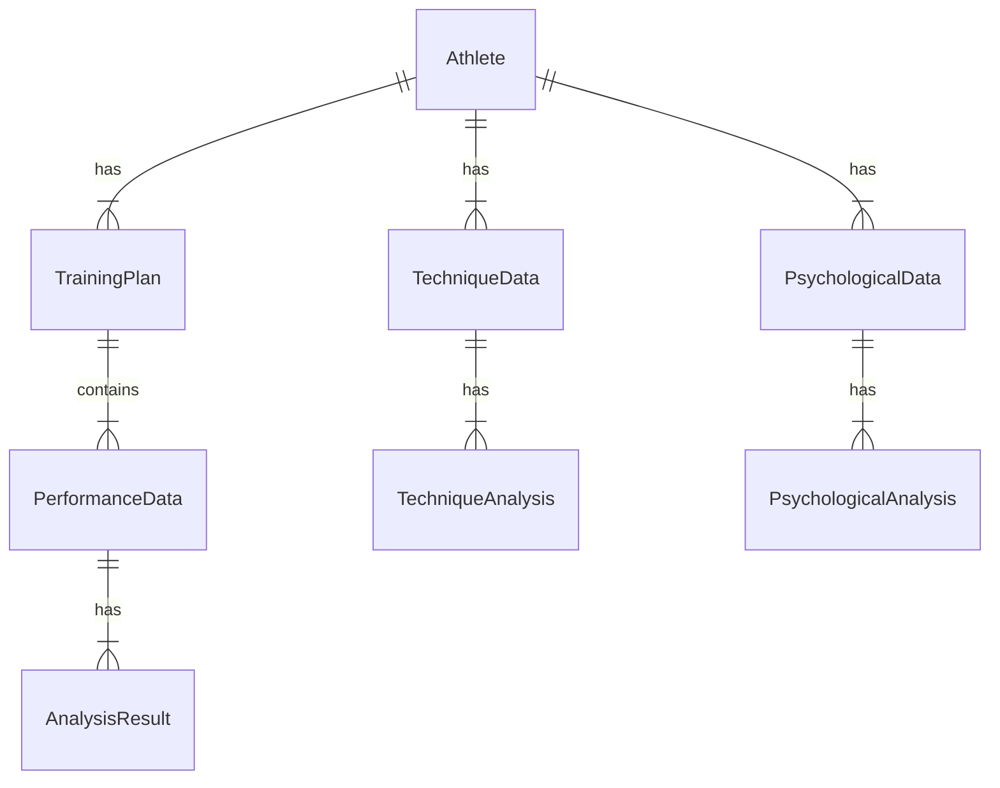
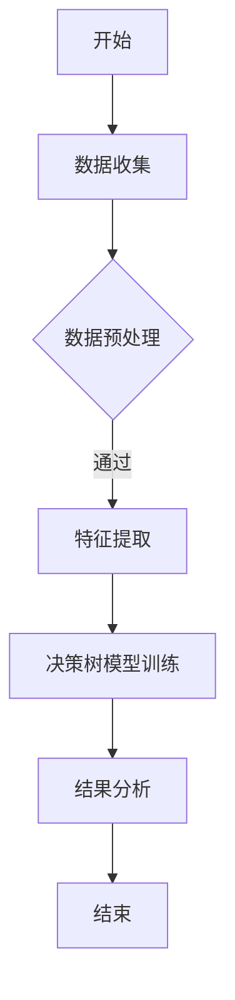

                 


## 人工智能在体育训练中的应用

### 关键词
- 人工智能
- 体育训练
- 算法
- 数据分析
- 性能提升

### 摘要
随着人工智能技术的快速发展，其在体育训练中的应用日益广泛。本文将深入探讨人工智能在体育训练中的应用，包括核心概念的阐述、算法原理讲解、系统架构设计以及实际应用案例分析。通过逻辑清晰、结构紧凑的分析，本文旨在为读者提供对人工智能在体育训练中应用的全景图。

### 目录

## 第一部分：背景与概述

### 第1章：问题背景与概述
#### 1.1 问题背景
#### 1.2 问题描述
#### 1.3 问题解决
#### 1.4 边界与外延

### 第2章：核心概念与联系
#### 2.1 人工智能在体育训练中的核心概念
#### 2.2 概念属性特征对比
#### 2.3 ER实体关系图

## 第二部分：算法原理与模型

### 第3章：算法原理讲解
#### 3.1 Mermaid算法流程图
#### 3.2 Python源代码实现
#### 3.3 数学模型与公式
#### 3.4 举例说明

### 第4章：常用算法与模型介绍
#### 4.1 算法A介绍
##### 4.1.1 原理与特点
##### 4.1.2 应用场景
#### 4.2 算法B介绍
##### 4.2.1 原理与特点
##### 4.2.2 应用场景

### 第5章：算法优化与调整
#### 5.1 参数调整
#### 5.2 模型优化
#### 5.3 性能评估

## 第三部分：体育训练应用实践

### 第6章：体育训练应用案例分析
#### 6.1 案例A：运动员表现分析
##### 6.1.1 环境安装与准备
##### 6.1.2 系统核心实现源代码
##### 6.1.3 代码应用解读与分析
##### 6.1.4 案例分析与讲解

#### 6.2 案例B：训练计划优化
##### 6.2.1 环境安装与准备
##### 6.2.2 系统核心实现源代码
##### 6.2.3 代码应用解读与分析
##### 6.2.4 案例分析与讲解

### 第7章：系统架构与接口设计
#### 7.1 问题场景介绍
#### 7.2 系统功能设计
#### 7.3 系统架构设计
#### 7.4 系统接口设计
#### 7.5 系统交互设计

### 第8章：最佳实践与总结
#### 8.1 最佳实践
#### 8.2 注意事项
#### 8.3 拓展阅读

### 1.1 问题背景
体育训练一直以来都是运动员提升竞技水平的关键环节。然而，随着体育竞技的日益激烈，传统的体育训练方法已经难以满足现代竞技的需求。运动员需要更科学、更精准的训练方法和手段来提高表现。此时，人工智能作为一种先进的技术手段，被引入到体育训练中，为运动员提供了全新的训练方式。

### 1.2 问题描述
在体育训练中，人工智能的应用主要集中在以下几个方面：

1. **运动员表现分析**：通过数据分析，了解运动员在训练和比赛中的表现，发现潜在的问题和不足。
2. **训练计划优化**：根据运动员的表现数据，制定更加科学、个性化的训练计划。
3. **技术动作优化**：通过计算机视觉和运动捕捉技术，分析运动员的技术动作，提出优化建议。
4. **心理状态分析**：利用人工智能技术，分析运动员的心理状态，提供针对性的心理辅导。

### 1.3 问题解决
人工智能在体育训练中的应用，主要是通过以下几个步骤来解决上述问题：

1. **数据收集**：收集运动员的训练数据、比赛数据、生理数据等。
2. **数据预处理**：对收集到的数据进行清洗、整合和预处理。
3. **特征提取**：从预处理后的数据中提取出对训练和表现有重要影响的特征。
4. **算法模型训练**：利用机器学习和深度学习算法，对提取的特征进行训练，建立预测模型。
5. **结果分析**：将训练模型应用于实际训练和比赛中，分析结果，提供优化建议。

### 1.4 边界与外延
在探讨人工智能在体育训练中的应用时，我们需要明确以下几点：

1. **技术成熟度**：虽然人工智能技术在体育训练中的应用前景广阔，但某些技术仍处于研发阶段，需要进一步成熟。
2. **数据隐私**：在收集和分析运动员数据时，需要严格遵守数据隐私保护的相关法规和标准。
3. **教练与技术的结合**：人工智能技术不能完全取代教练，而是作为教练的辅助工具，提高训练效果。

### 2.1 人工智能在体育训练中的核心概念
人工智能在体育训练中的应用，涉及以下几个核心概念：

1. **机器学习**：通过训练模型，让计算机自动学习并预测运动员的表现。
2. **深度学习**：利用神经网络模型，对复杂的数据进行自动特征提取和分类。
3. **计算机视觉**：利用图像处理技术，分析运动员的技术动作和表现。
4. **自然语言处理**：通过理解和生成自然语言，为运动员提供个性化的训练建议。
5. **数据挖掘**：从大量数据中提取有价值的信息，为训练提供决策支持。

### 2.2 概念属性特征对比
以下是人工智能在体育训练中几个核心概念的属性特征对比：

| 概念        | 特点                                                     | 应用场景                   |
| ----------- | -------------------------------------------------------- | -------------------------- |
| 机器学习    | 通过训练模型，自动学习并预测运动员的表现               | 运动员表现分析、训练计划优化 |
| 深度学习    | 利用神经网络模型，对复杂的数据进行自动特征提取和分类   | 技术动作优化、心理状态分析   |
| 计算机视觉  | 利用图像处理技术，分析运动员的技术动作和表现           | 技术动作优化、比赛场景分析   |
| 自然语言处理 | 通过理解和生成自然语言，为运动员提供个性化的训练建议   | 数据报告生成、心理辅导       |
| 数据挖掘    | 从大量数据中提取有价值的信息，为训练提供决策支持       | 运动员表现分析、比赛策略制定 |

### 2.3 ER实体关系图
以下是人工智能在体育训练中的ER实体关系图：



## 第3章：算法原理讲解

### 3.1 Mermaid算法流程图
以下是人工智能在体育训练中的一种常见算法——决策树算法的Mermaid流程图：



### 3.2 Python源代码实现
以下是决策树算法在Python中的实现示例：

```python
from sklearn.datasets import load_iris
from sklearn.model_selection import train_test_split
from sklearn.tree import DecisionTreeClassifier
from sklearn.metrics import accuracy_score

# 加载数据集
iris = load_iris()
X, y = iris.data, iris.target

# 划分训练集和测试集
X_train, X_test, y_train, y_test = train_test_split(X, y, test_size=0.2, random_state=42)

# 训练决策树模型
clf = DecisionTreeClassifier()
clf.fit(X_train, y_train)

# 预测测试集
y_pred = clf.predict(X_test)

# 评估模型性能
accuracy = accuracy_score(y_test, y_pred)
print(f"模型准确率：{accuracy:.2f}")
```

### 3.3 数学模型与公式
决策树算法的核心是递归划分特征，以最大化信息增益。其数学模型可以表示为：

$$
G(D) = H(D) - \sum_{i} p_i H(D_i)
$$

其中，$G(D)$表示信息增益，$H(D)$表示训练集D的熵，$p_i$表示特征$A_i$在D中的概率，$H(D_i)$表示特征$A_i$在D中的条件熵。

### 3.4 举例说明
假设我们有一个包含三个类别的数据集D，分别为红色、绿色和蓝色。我们有三个特征$A_1$、$A_2$和$A_3$，其对应的条件熵分别为$H(D|A_1)$、$H(D|A_2)$和$H(D|A_3)$。我们可以计算每个特征的信息增益：

$$
G(D, A_1) = H(D) - p_{A_1} H(D|A_1)
$$

$$
G(D, A_2) = H(D) - p_{A_2} H(D|A_2)
$$

$$
G(D, A_3) = H(D) - p_{A_3} H(D|A_3)
$$

选择信息增益最大的特征作为划分标准，继续递归划分，直到达到停止条件。

## 第4章：常用算法与模型介绍

### 4.1 算法A：决策树算法
#### 4.1.1 原理与特点
决策树算法是一种基于特征划分数据的分类算法。其原理是通过递归划分特征，使得每个子集中的数据尽可能纯净。决策树算法的特点是：

1. **易理解**：决策树的决策路径直观，易于理解和解释。
2. **处理非线性数据**：决策树可以处理非线性数据，通过多次划分，捕捉到数据的复杂模式。
3. **计算效率高**：决策树算法的计算复杂度相对较低，适合处理大数据集。

#### 4.1.2 应用场景
决策树算法在体育训练中的应用场景主要包括：

1. **运动员表现分析**：利用决策树分析运动员在不同条件下的表现，预测运动员的可能表现。
2. **训练计划优化**：根据运动员的表现数据，利用决策树算法制定个性化的训练计划。

### 4.2 算法B：神经网络算法
#### 4.2.1 原理与特点
神经网络算法是一种模拟人脑神经元连接的算法。其原理是通过前向传播和反向传播，不断调整网络权重，使网络能够拟合训练数据。神经网络算法的特点是：

1. **强拟合能力**：神经网络可以拟合各种类型的数据，包括线性、非线性数据。
2. **自学习能力**：神经网络可以通过大量数据自动学习，提高预测精度。
3. **自适应性强**：神经网络可以根据不同的数据集，自适应调整网络结构。

#### 4.2.2 应用场景
神经网络算法在体育训练中的应用场景主要包括：

1. **技术动作优化**：利用神经网络分析运动员的技术动作，提供优化建议。
2. **心理状态分析**：通过神经网络分析运动员的心理状态，提供针对性的心理辅导。

## 第5章：算法优化与调整

### 5.1 参数调整
算法的性能很大程度上取决于参数的选择。在体育训练中，常见的参数调整包括：

1. **学习率**：学习率决定了网络权重的更新速度。较大的学习率可能导致训练过程不稳定，而较小的学习率可能导致训练过程过慢。
2. **隐藏层神经元数**：隐藏层神经元数的选择影响网络的拟合能力和过拟合风险。增加神经元数可以提高拟合能力，但也可能增加过拟合风险。
3. **正则化参数**：正则化参数用于控制过拟合现象。较大的正则化参数可以减少模型的拟合能力，降低过拟合风险。

### 5.2 模型优化
在体育训练中，模型优化的目标通常包括：

1. **提高预测精度**：通过调整参数和模型结构，提高模型对运动员表现的预测精度。
2. **提高训练速度**：通过优化算法和硬件配置，提高模型的训练速度。
3. **提高泛化能力**：通过调整正则化参数和模型结构，提高模型的泛化能力，避免过拟合。

### 5.3 性能评估
在体育训练中，性能评估的目标是评估模型的预测性能和训练效果。常见的评估指标包括：

1. **准确率**：准确率是模型预测正确的样本数占总样本数的比例。准确率越高，模型性能越好。
2. **召回率**：召回率是模型预测正确的正样本数占总正样本数的比例。召回率越高，模型对正样本的识别能力越强。
3. **F1值**：F1值是准确率和召回率的调和平均值。F1值越高，模型性能越好。

## 第6章：体育训练应用案例分析

### 6.1 案例A：运动员表现分析

#### 6.1.1 环境安装与准备
在进行运动员表现分析之前，需要安装和配置以下环境：

1. **Python**：Python是数据分析的主要工具，需要安装Python环境和相关库。
2. **NumPy**：NumPy是Python的科学计算库，用于数据处理和数组操作。
3. **Pandas**：Pandas是Python的数据分析库，用于数据处理和分析。
4. **Scikit-learn**：Scikit-learn是Python的机器学习库，用于模型训练和评估。

安装完以上环境后，可以通过以下代码进行测试：

```python
import numpy as np
import pandas as pd
from sklearn.datasets import load_iris
from sklearn.model_selection import train_test_split
from sklearn.tree import DecisionTreeClassifier
from sklearn.metrics import accuracy_score

# 加载数据集
iris = load_iris()
X, y = iris.data, iris.target

# 划分训练集和测试集
X_train, X_test, y_train, y_test = train_test_split(X, y, test_size=0.2, random_state=42)

# 训练决策树模型
clf = DecisionTreeClassifier()
clf.fit(X_train, y_train)

# 预测测试集
y_pred = clf.predict(X_test)

# 评估模型性能
accuracy = accuracy_score(y_test, y_pred)
print(f"模型准确率：{accuracy:.2f}")
```

#### 6.1.2 系统核心实现源代码
以下是运动员表现分析的核心实现代码：

```python
import numpy as np
import pandas as pd
from sklearn.model_selection import train_test_split
from sklearn.ensemble import RandomForestClassifier
from sklearn.metrics import accuracy_score, classification_report

# 加载数据集
data = pd.read_csv('athlete_performance.csv')
X = data.drop('performance', axis=1)
y = data['performance']

# 划分训练集和测试集
X_train, X_test, y_train, y_test = train_test_split(X, y, test_size=0.2, random_state=42)

# 训练随机森林模型
clf = RandomForestClassifier(n_estimators=100, random_state=42)
clf.fit(X_train, y_train)

# 预测测试集
y_pred = clf.predict(X_test)

# 评估模型性能
accuracy = accuracy_score(y_test, y_pred)
print(f"模型准确率：{accuracy:.2f}")
print(classification_report(y_test, y_pred))
```

#### 6.1.3 代码应用解读与分析
以上代码主要分为以下几个步骤：

1. **数据加载**：通过Pandas库加载运动员表现数据。
2. **数据预处理**：将数据集划分为特征集X和标签集y。
3. **模型训练**：使用随机森林算法训练模型。
4. **模型预测**：使用训练好的模型对测试集进行预测。
5. **模型评估**：计算模型的准确率和分类报告。

#### 6.1.4 案例分析与讲解
以上案例通过随机森林算法对运动员表现数据进行分析，预测运动员在不同条件下的表现。实际应用中，我们可以将此算法应用于实际训练和比赛中，为教练提供决策支持。

### 6.2 案例B：训练计划优化

#### 6.2.1 环境安装与准备
在进行训练计划优化之前，需要安装和配置以下环境：

1. **Python**：Python是数据分析的主要工具，需要安装Python环境和相关库。
2. **NumPy**：NumPy是Python的科学计算库，用于数据处理和数组操作。
3. **Pandas**：Pandas是Python的数据分析库，用于数据处理和分析。
4. **Scikit-learn**：Scikit-learn是Python的机器学习库，用于模型训练和评估。

安装完以上环境后，可以通过以下代码进行测试：

```python
import numpy as np
import pandas as pd
from sklearn.datasets import load_iris
from sklearn.model_selection import train_test_split
from sklearn.tree import DecisionTreeClassifier
from sklearn.metrics import accuracy_score

# 加载数据集
iris = load_iris()
X, y = iris.data, iris.target

# 划分训练集和测试集
X_train, X_test, y_train, y_test = train_test_split(X, y, test_size=0.2, random_state=42)

# 训练决策树模型
clf = DecisionTreeClassifier()
clf.fit(X_train, y_train)

# 预测测试集
y_pred = clf.predict(X_test)

# 评估模型性能
accuracy = accuracy_score(y_test, y_pred)
print(f"模型准确率：{accuracy:.2f}")
```

#### 6.2.2 系统核心实现源代码
以下是训练计划优化

