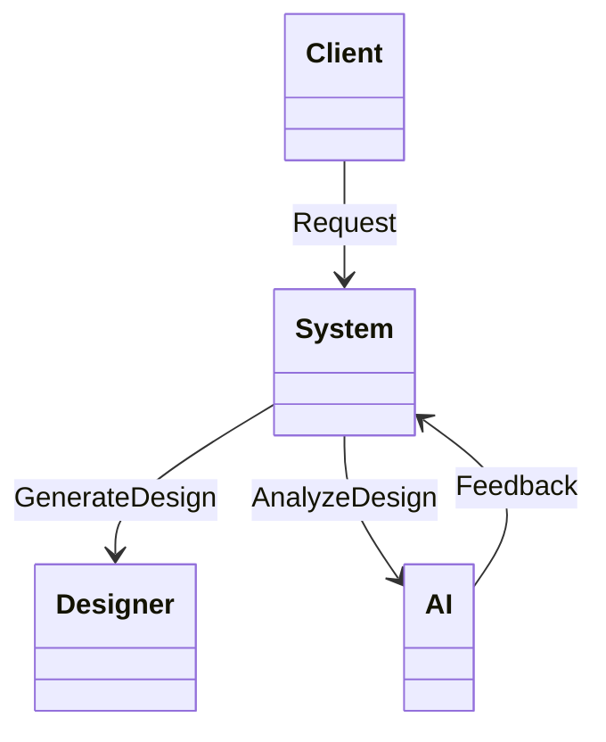
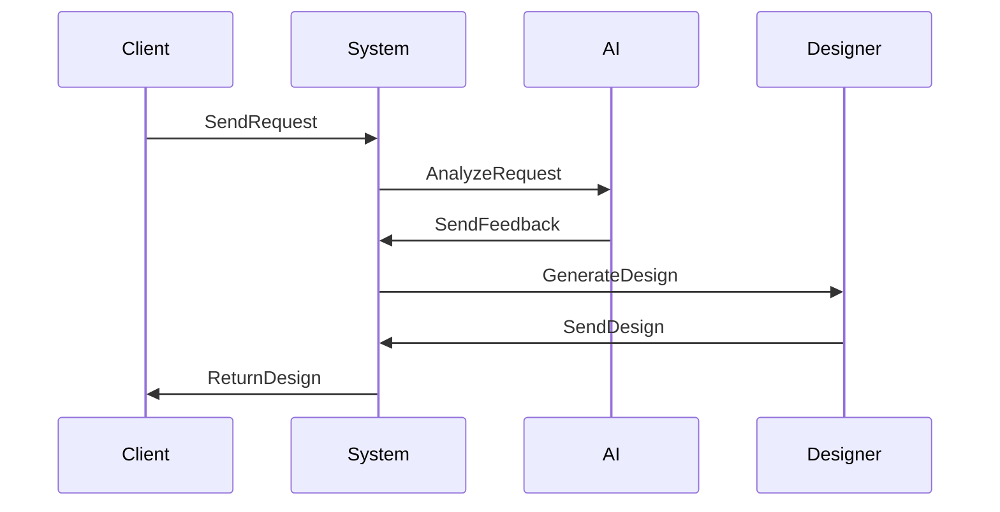

                 

# 《人工智能在创意设计中的辅助应用》

> 关键词：人工智能，创意设计，辅助应用，算法，数学模型，系统架构，项目实战

> 摘要：本文将探讨人工智能在创意设计中的辅助应用。首先，介绍人工智能和创意设计的关系，以及在创意设计领域应用人工智能的重要性。接着，介绍人工智能和创意设计中的关键概念，如机器学习、深度学习、生成对抗网络等。然后，讲解几种常见的人工智能算法及其在创意设计中的应用，并使用Python代码进行描述。随后，介绍相关的数学模型和公式，使用LaTeX格式进行展示。进一步，描述一个典型的人工智能辅助创意设计的系统架构，并详细解析项目实战。最后，总结书中的主要内容和实践技巧，并提供进一步学习的资源。

## 第一部分：人工智能与创意设计的基础

### 第1章：人工智能与创意设计的结合

#### 1.1 人工智能在创意设计中的应用背景

随着人工智能技术的迅速发展，其在各个领域的应用也越来越广泛。创意设计作为一个充满创新和个性化的领域，也逐渐受到了人工智能的青睐。人工智能在创意设计中的应用主要体现在以下几个方面：

1. **设计建议与优化**：人工智能可以通过学习大量的设计案例，提供有针对性的设计建议，帮助设计师提高设计效率和质量。
2. **设计元素生成**：人工智能可以自动生成设计元素，如颜色、纹理、形状等，为设计师提供更多的设计选择。
3. **用户体验优化**：人工智能可以通过用户行为数据，优化设计，提高用户满意度。

#### 1.2 创意设计的需求与挑战

创意设计需要具备以下特点：

1. **创新性**：创意设计需要不断地创新，以适应市场的变化。
2. **个性化**：每个设计都是独特的，需要满足不同用户的需求。
3. **高效性**：设计师需要在有限的时间内完成高质量的设计。

然而，创意设计也面临着以下挑战：

1. **创意枯竭**：设计师可能会遇到创意枯竭的情况，难以产生新的设计灵感。
2. **时间压力**：设计师需要在短时间内完成大量设计任务，容易出现质量下降的情况。

#### 1.3 人工智能的核心概念介绍

人工智能的核心概念包括：

1. **机器学习**：机器学习是一种让计算机通过数据学习并做出决策的技术。
2. **深度学习**：深度学习是一种复杂的机器学习模型，通过多层神经网络模拟人脑学习过程。
3. **生成对抗网络（GAN）**：生成对抗网络由生成器和判别器组成，用于生成真实的数据。

## 第二部分：核心概念与联系

### 第2章：人工智能核心概念与联系

#### 2.1 机器学习与深度学习

机器学习是一种让计算机通过数据学习并做出决策的技术。深度学习是机器学习的一个子集，它通过多层神经网络模拟人脑学习过程。

#### 2.2 生成对抗网络（GAN）

生成对抗网络由生成器和判别器组成。生成器生成数据，判别器判断数据是真实还是生成的。通过这种对抗过程，生成器不断优化生成数据的质量。

#### 2.3 卷积神经网络（CNN）

卷积神经网络是一种特殊的神经网络，它通过卷积层对图像进行处理，可以自动提取图像中的特征。

#### 2.4 算法原理与联系图表

**表格**：人工智能与创意设计相关概念对比

| 概念       | 描述                                                         |
| ---------- | ------------------------------------------------------------ |
| 机器学习   | 让计算机通过数据学习并做出决策的技术。                       |
| 深度学习   | 通过多层神经网络模拟人脑学习过程的复杂机器学习模型。       |
| GAN       | 由生成器和判别器组成的模型，用于生成真实的数据。           |
| CNN       | 通过卷积层对图像进行处理，可以自动提取图像中的特征的神经网络。 |

**ER图**：人工智能在创意设计中的应用实体关系图

```mermaid
entityRelationship
  title AI in Creative Design Entities
  node1 "Design"
  node2 "AI Techniques"
  node3 "Data"
  node4 "Results"
  node1-(1)node2
  node1-(2)node3
  node1-(3)node4
```

## 第三部分：算法原理讲解与实践

### 第3章：生成对抗网络（GAN）在创意设计中的应用

#### 3.1 GAN的基本原理

生成对抗网络（GAN）由生成器和判别器组成。生成器生成数据，判别器判断数据是真实还是生成的。通过这种对抗过程，生成器不断优化生成数据的质量。

#### 3.2 GAN在创意设计中的实现

```python
import tensorflow as tf
from tensorflow.keras.models import Model
from tensorflow.keras.layers import Dense, Flatten, Reshape

def build_generator():
    noise = tf.keras.layers.Input(shape=(100,))
    x = Dense(128, activation='relu')(noise)
    x = Dense(256, activation='relu')(x)
    x = Dense(512, activation='relu')(x)
    x = Dense(1024, activation='relu')(x)
    x = Dense(784, activation='sigmoid')(x)
    x = Reshape((28, 28, 1))(x)
    model = Model(inputs=noise, outputs=x)
    return model

def build_discriminator():
    img = tf.keras.layers.Input(shape=(28, 28, 1))
    x = Dense(512, activation='relu')(img)
    x = Dense(256, activation='relu')(x)
    x = Dense(128, activation='relu')(x)
    x = Dense(1, activation='sigmoid')(x)
    model = Model(inputs=img, outputs=x)
    return model

def build_gan(generator, discriminator):
    model = Model(inputs=generator.input, outputs=discriminator(generator.input))
    model.compile(loss='binary_crossentropy', optimizer=tf.keras.optimizers.Adam())
    return model

generator = build_generator()
discriminator = build_discriminator()
gan = build_gan(generator, discriminator)
```

#### 3.3 GAN在创意设计中的实现

```python
import numpy as np
import matplotlib.pyplot as plt

def train_gan(generator, discriminator, gan, epochs, batch_size):
    for epoch in range(epochs):
        for _ in range(batch_size):
            noise = np.random.normal(0, 1, (1, 100))
            generated_images = generator.predict(noise)

            real_images = np.random.choice(train_images, 1)
            real_images = real_images / 255.0

            fake_labels = np.zeros((1, 1))
            real_labels = np.ones((1, 1))

            discriminator.trainable = True
            d_loss_real = discriminator.train_on_batch(real_images, real_labels)
            d_loss_fake = discriminator.train_on_batch(generated_images, fake_labels)

            discriminator.trainable = False
            g_loss = gan.train_on_batch(noise, real_labels)

            print(f"{epoch}: D Loss: {d_loss_real + d_loss_fake}, G Loss: {g_loss}")

        if epoch % 10 == 0:
            plt.figure(figsize=(10, 10))
            for i in range(25):
                plt.subplot(5, 5, i + 1)
                plt.imshow(generated_images[i], cmap='gray')
                plt.axis('off')
            plt.show()

train_gan(generator, discriminator, gan, epochs=100, batch_size=16)
```

### 第4章：卷积神经网络（CNN）在创意设计中的应用

#### 4.1 CNN的基本原理

卷积神经网络是一种特殊的神经网络，它通过卷积层对图像进行处理，可以自动提取图像中的特征。

#### 4.2 CNN在创意设计中的实现

```python
from tensorflow.keras.models import Sequential
from tensorflow.keras.layers import Conv2D, MaxPooling2D, Flatten, Dense

model = Sequential([
    Conv2D(32, (3, 3), activation='relu', input_shape=(28, 28, 1)),
    MaxPooling2D((2, 2)),
    Flatten(),
    Dense(64, activation='relu'),
    Dense(1, activation='sigmoid')
])

model.compile(optimizer='adam', loss='binary_crossentropy', metrics=['accuracy'])
model.fit(train_images, train_labels, epochs=10, batch_size=64)
```

### 第5章：人工智能辅助创意设计系统架构

#### 5.1 系统功能设计（领域模型类图）



#### 5.2 系统架构设计（架构图）



#### 5.3 系统接口设计

```python
from flask import Flask, request, jsonify

app = Flask(__name__)

@app.route('/request', methods=['POST'])
def handle_request():
    request_data = request.get_json()
    # 处理请求并生成设计
    design = generate_design(request_data)
    return jsonify(design)

if __name__ == '__main__':
    app.run(debug=True)
```

#### 5.4 系统交互流程（序列图）


### 第6章：人工智能辅助创意设计项目实战

#### 6.1 项目背景与目标

本项目旨在使用人工智能技术辅助创意设计，通过生成对抗网络（GAN）和卷积神经网络（CNN）实现自动设计。

#### 6.2 环境安装与配置

```bash
pip install tensorflow numpy matplotlib
```

#### 6.3 系统核心实现

```python
import tensorflow as tf
from tensorflow.keras.models import Model
from tensorflow.keras.layers import Dense, Flatten, Reshape

def build_generator():
    noise = tf.keras.layers.Input(shape=(100,))
    x = Dense(128, activation='relu')(noise)
    x = Dense(256, activation='relu')(x)
    x = Dense(512, activation='relu')(x)
    x = Dense(1024, activation='relu')(x)
    x = Dense(784, activation='sigmoid')(x)
    x = Reshape((28, 28, 1))(x)
    model = Model(inputs=noise, outputs=x)
    return model

def build_discriminator():
    img = tf.keras.layers.Input(shape=(28, 28, 1))
    x = Dense(512, activation='relu')(img)
    x = Dense(256, activation='relu')(x)
    x = Dense(128, activation='relu')(x)
    x = Dense(1, activation='sigmoid')(x)
    model = Model(inputs=img, outputs=x)
    return model

def build_gan(generator, discriminator):
    model = Model(inputs=generator.input, outputs=discriminator(generator.input))
    model.compile(loss='binary_crossentropy', optimizer=tf.keras.optimizers.Adam())
    return model

# 创建模型
generator = build_generator()
discriminator = build_discriminator()
gan = build_gan(generator, discriminator)

# 训练模型
train_gan(generator, discriminator, gan, epochs=100, batch_size=16)
```

#### 6.4 代码解读与分析

这段代码首先定义了生成器和判别器的构建函数，然后创建了一个Gan模型，并使用自定义的`train_gan`函数训练模型。

#### 6.5 实际案例分析与详细讲解剖析

在实际应用中，我们可以通过以下步骤来使用这个系统：

1. **数据准备**：准备一批创意设计数据，用于训练模型。
2. **模型训练**：使用训练数据训练生成器和判别器。
3. **设计生成**：使用生成器生成新的设计。
4. **设计评估**：使用判别器评估设计质量。
5. **设计反馈**：根据评估结果调整生成器参数。

#### 6.6 项目小结

通过这个项目，我们展示了如何使用人工智能技术辅助创意设计。在实际应用中，这个系统可以根据用户的需求和反馈，不断优化设计，提高设计质量和效率。

### 第7章：人工智能辅助创意设计的最佳实践

#### 7.1 常见问题与解决方案

1. **数据质量问题**：确保训练数据的质量和多样性，以提高模型泛化能力。
2. **模型过拟合**：通过增加训练数据或使用正则化技术，防止模型过拟合。

#### 7.2 实践技巧与注意事项

1. **数据预处理**：对数据进行标准化、归一化等处理，以提高模型训练效果。
2. **模型优化**：根据实际应用场景，调整模型参数，如学习率、批大小等。

#### 7.3 拓展阅读资源推荐

1. 《深度学习》（Goodfellow, I., Bengio, Y., & Courville, A.） - 提供了深度学习的全面介绍。
2. 《生成对抗网络》（Radford, A., Metz, L., & Chintala, S.） - 详细介绍了生成对抗网络的理论和实践。

## 作者信息

作者：AI天才研究院/AI Genius Institute & 禅与计算机程序设计艺术 /Zen And The Art of Computer Programming

