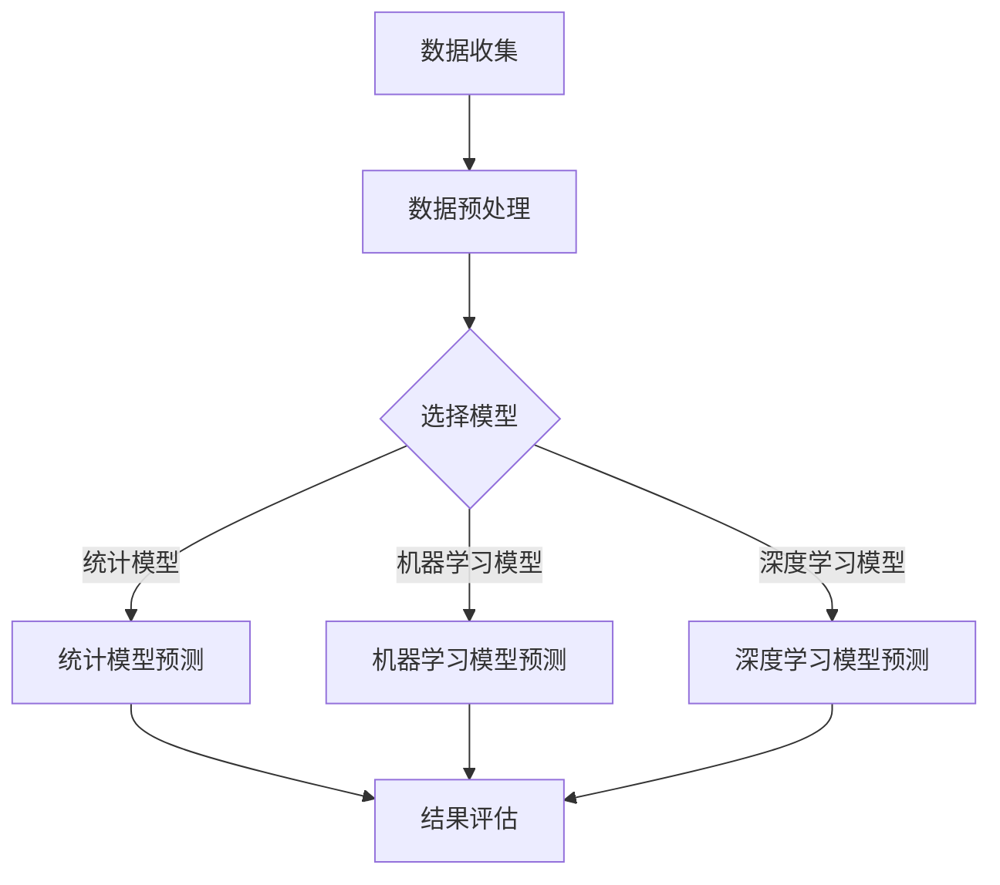
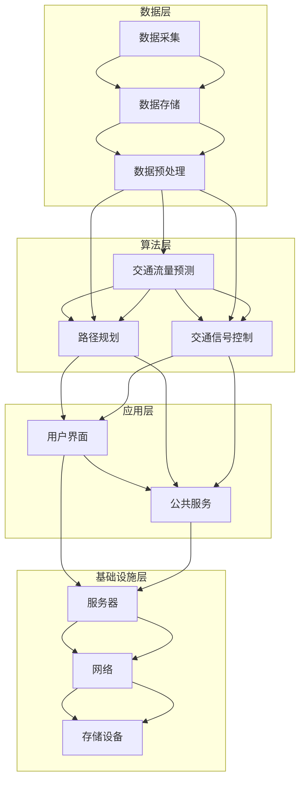
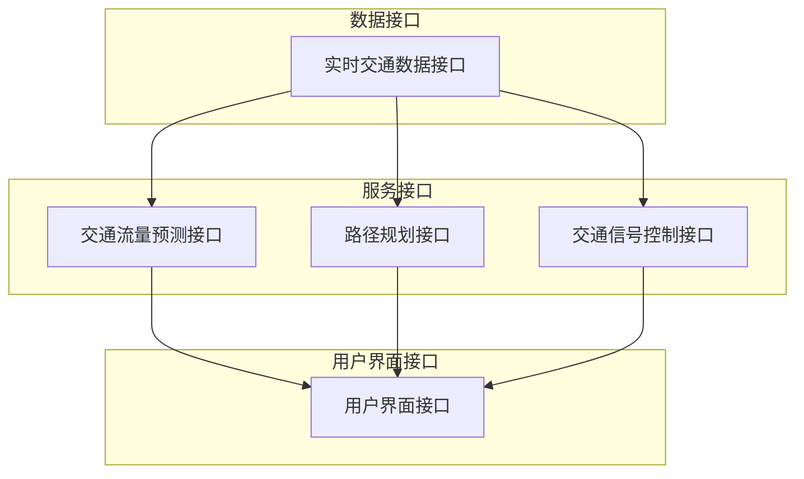

                 

### 文章标题：人工智能在城市交通优化中的应用

> **关键词**：人工智能、城市交通、优化、交通流量预测、数学模型

> **摘要**：本文将深入探讨人工智能在城市交通优化中的应用，通过详细分析交通问题的现状、原因以及利用人工智能技术进行优化的方法，提供一套从算法原理到系统设计与项目实战的完整解决方案。文章旨在帮助读者理解如何利用人工智能技术解决城市交通问题，提高交通效率和安全性。

**Step 1: 书名定位与背景介绍**

随着全球城市化进程的加速，城市交通问题已成为许多国家和地区面临的重大挑战。传统的交通管理手段已难以应对日益增长的交通需求，导致交通拥堵、污染加剧、效率低下等问题愈发严重。此时，人工智能（AI）技术的迅猛发展为城市交通优化带来了新的希望。

人工智能，作为一种能够模拟人类智能的计算机系统，具有自主学习、推理判断和决策制定的能力。其在城市交通优化中的应用主要体现在以下几个方面：

1. **交通流量预测**：通过分析历史数据、实时监控和智能算法，预测交通流量变化，为交通管理提供决策支持。
2. **路径规划**：根据实时交通状况，为驾驶者提供最优路径，减少拥堵和行车时间。
3. **交通信号控制**：智能调控交通信号灯，优化交通流通过程，提高道路通行效率。
4. **车辆调度**：智能调度公共交通工具，提高公共交通系统的运行效率和乘客满意度。
5. **智能停车管理**：利用AI技术优化停车资源分配，减少寻找停车位的时间和成本。

本文将从以下几个方面展开讨论：

- **第一部分：背景介绍**：介绍人工智能的基本概念和在交通优化中的应用背景。
- **第二部分：算法原理讲解**：详细讲解交通流量预测算法的原理和实现。
- **第三部分：数学模型和公式讲解**：介绍交通网络优化的数学模型和公式。
- **第四部分：系统分析与架构设计**：分析城市交通优化系统的需求、架构设计和接口交互。
- **第五部分：项目实战**：通过实际项目案例展示人工智能在交通优化中的应用。
- **第六部分：总结与拓展**：总结全文内容，提出最佳实践和拓展阅读建议。

### 核心章节1：人工智能技术基础

#### 1.1.1 人工智能概述

人工智能（Artificial Intelligence，简称AI）是指通过计算机模拟人类智能的科学技术。它包括多个研究领域，如机器学习、自然语言处理、计算机视觉、智能控制等。人工智能的核心目标是使计算机能够执行通常需要人类智能才能完成的任务，如识别图像、理解语言、做出决策等。

**核心概念术语说明**：

- **机器学习**：一种让计算机通过数据学习并改进其性能的技术。
- **神经网络**：模拟人脑神经元连接的一种计算模型。
- **深度学习**：一种基于神经网络的深度层次模型。
- **强化学习**：一种通过奖励和惩罚机制让智能体学习决策策略的方法。

**问题背景**：随着数据获取和处理能力的提升，人工智能技术逐渐应用于各个领域，包括城市交通。城市交通问题复杂多变，传统方法难以有效解决，人工智能为交通优化提供了新的可能性。

**问题描述**：如何利用人工智能技术解决城市交通拥堵、效率低下等问题？

**问题解决**：通过机器学习、神经网络和深度学习等技术，人工智能可以处理大量交通数据，预测交通流量变化，优化交通信号控制，提高交通系统整体运行效率。

**边界与外延**：人工智能在交通优化中的应用范围广泛，包括但不限于交通流量预测、路径规划、交通信号控制、公共交通调度等。

**概念结构与核心要素组成**：

| 概念 | 描述 |
| --- | --- |
| **机器学习** | 基于数据驱动的方法，使计算机通过学习数据改进性能。 |
| **神经网络** | 模拟人脑神经元连接的计算模型，用于特征提取和分类。 |
| **深度学习** | 基于多层神经网络的深度层次模型，适用于复杂任务。 |
| **强化学习** | 通过奖励和惩罚机制，让智能体学习最优决策策略。 |

#### 1.1.2 人工智能与城市交通优化关系

人工智能与城市交通优化之间存在密切的关系。首先，人工智能技术可以处理大量交通数据，包括交通流量、车速、道路状况等，从而为交通管理提供实时、准确的信息。其次，人工智能算法可以分析这些数据，预测未来交通流量变化，帮助交通管理者提前采取措施，避免拥堵。

**联系**：

- **数据驱动**：人工智能依赖于大量交通数据，这些数据来源于传感器、摄像头、GPS等。
- **智能化管理**：通过人工智能算法，交通管理系统可以实现智能化，提高运行效率。
- **实时响应**：人工智能系统能够实时处理交通数据，快速做出反应，优化交通流。

**对比表格**：

| 特性 | 传统方法 | 人工智能 |
| --- | --- | --- |
| **数据处理能力** | 有限，难以处理大量数据 | 强大，能够处理海量数据 |
| **预测能力** | 较弱，难以预测交通流量变化 | 强大，能够预测交通流量变化 |
| **实时性** | 较低，响应速度慢 | 较高，响应速度快 |
| **优化能力** | 有限，难以优化交通信号控制 | 强大，能够优化交通信号控制 |

**ER实体关系图架构**：

```mermaid
erDiagram
  Person ||--|{ Driver }
  Car ||--|{ Driver }
  Road ||--|{ TrafficLight }
  TrafficLight ||--|{ TrafficSignal }
  Road ||--|{ TrafficCamera }
```

在这个ER实体关系图中，`Person`与`Driver`之间存在1对多的关系，表示一个人可以担任多个驾驶员；`Car`与`Driver`之间也存在1对多的关系，表示一辆车可以由多个驾驶员驾驶；`Road`与`TrafficLight`之间存在1对多的关系，表示一条道路可以设置多个交通信号灯；`TrafficLight`与`TrafficSignal`之间存在1对1的关系，表示每个交通信号灯对应一个交通信号；`Road`与`TrafficCamera`之间存在1对多的关系，表示一条道路可以设置多个交通监控摄像头。

### 核心章节2：城市交通问题分析

#### 1.2.1 城市交通问题现状

城市交通问题已经成为影响城市发展和社会生活的重要问题。以下是一些城市交通问题的现状：

- **交通拥堵**：高峰时段，城市主要道路常常出现拥堵，导致行车缓慢，通行时间增加。
- **道路交通事故**：由于驾驶者的疏忽或交通管理不善，道路交通事故频繁发生。
- **环境污染**：大量机动车排放的尾气导致空气污染，对城市环境和居民健康造成威胁。
- **公共交通效率低下**：公共交通系统的规划和管理不善，导致其运行效率低下，乘客满意度低。

#### 1.2.2 城市交通问题原因

城市交通问题的产生原因复杂，主要包括以下几个方面：

- **城市化进程加快**：城市化进程的加快导致城市人口和车辆数量快速增长，交通需求大幅增加。
- **城市规划不足**：城市规划不合理，道路网络不完善，交通基础设施滞后。
- **交通管理不善**：交通管理手段落后，缺乏智能化交通管理系统，无法有效应对复杂交通状况。
- **驾驶者行为不规范**：驾驶者不良行为，如违章驾驶、占用非机动车道等，加剧了交通拥堵。

#### 1.2.3 人工智能在交通优化中的应用

人工智能技术为解决城市交通问题提供了新的思路和方法。以下是一些人工智能在交通优化中的应用：

- **交通流量预测**：通过分析历史数据和实时数据，人工智能可以预测交通流量变化，帮助交通管理者提前采取措施。
- **路径规划**：基于实时交通状况，人工智能可以为驾驶者提供最优路径，减少拥堵和行车时间。
- **交通信号控制**：利用人工智能算法，智能调控交通信号灯，优化交通流通过程，提高道路通行效率。
- **公共交通调度**：智能调度公共交通工具，提高公共交通系统的运行效率和乘客满意度。
- **智能停车管理**：通过人工智能技术，优化停车资源分配，减少寻找停车位的时间和成本。

**人工智能与交通优化的联系**：

- **数据处理能力**：人工智能可以处理大量交通数据，为交通管理提供实时、准确的信息。
- **预测能力**：人工智能可以预测交通流量变化，帮助交通管理者提前采取措施。
- **实时响应**：人工智能系统能够实时处理交通数据，快速做出反应，优化交通流。
- **智能化管理**：通过人工智能算法，交通管理系统可以实现智能化，提高运行效率。

**人工智能与交通优化的对比表格**：

| 特性 | 传统方法 | 人工智能 |
| --- | --- | --- |
| **数据处理能力** | 有限，难以处理大量数据 | 强大，能够处理海量数据 |
| **预测能力** | 较弱，难以预测交通流量变化 | 强大，能够预测交通流量变化 |
| **实时性** | 较低，响应速度慢 | 较高，响应速度快 |
| **优化能力** | 有限，难以优化交通信号控制 | 强大，能够优化交通信号控制 |

### 核心章节3：交通流量预测算法原理讲解

#### 3.1.1 交通流量预测基本概念

交通流量预测是指利用历史数据、实时数据和智能算法，预测未来一段时间内某一特定路段的交通流量。交通流量预测是城市交通管理的重要组成部分，它有助于优化交通信号控制、路径规划和公共交通调度等。

**核心概念**：

- **历史数据**：包括过去一段时间内交通流量、车速、道路状况等数据。
- **实时数据**：通过传感器、摄像头等设备实时采集的交通流量、车速、道路状况等数据。
- **智能算法**：用于处理数据、分析和预测交通流量的算法，如机器学习算法、深度学习算法等。

#### 3.1.2 交通流量预测方法

交通流量预测方法主要包括以下几种：

- **统计模型**：基于历史数据，利用统计方法（如线性回归、时间序列分析等）预测交通流量。
- **机器学习模型**：利用机器学习算法（如决策树、随机森林、支持向量机等）预测交通流量。
- **深度学习模型**：利用深度学习算法（如卷积神经网络、循环神经网络等）预测交通流量。
- **融合模型**：结合多种预测方法，提高预测精度。

**方法对比表格**：

| 方法 | 优点 | 缺点 |
| --- | --- | --- |
| **统计模型** | 简单易实现，计算效率高 | 预测精度较低，难以处理非线性关系 |
| **机器学习模型** | 预测精度较高，能够处理非线性关系 | 需要大量训练数据和计算资源 |
| **深度学习模型** | 预测精度高，能够处理复杂数据 | 计算复杂度高，训练过程较慢 |
| **融合模型** | 结合多种方法，提高预测精度 | 需要更多的计算资源和训练数据 |

#### 3.1.3 交通流量预测mermaid流程图

以下是一个简单的交通流量预测流程图：



在这个流程图中，首先进行数据收集，然后进行数据预处理。根据不同的模型选择，分别进行统计模型、机器学习模型和深度学习模型的预测。最后，对预测结果进行评估，选择最优模型。

#### 3.1.4 Python代码示例

以下是一个简单的交通流量预测的Python代码示例，使用线性回归模型进行预测：

```python
import pandas as pd
from sklearn.linear_model import LinearRegression
from sklearn.model_selection import train_test_split
from sklearn.metrics import mean_squared_error

# 加载数据
data = pd.read_csv('traffic_data.csv')

# 数据预处理
X = data[['hour', 'day_of_week', 'weather']]
y = data['traffic_volume']

# 分割数据集
X_train, X_test, y_train, y_test = train_test_split(X, y, test_size=0.2, random_state=42)

# 建立线性回归模型
model = LinearRegression()
model.fit(X_train, y_train)

# 进行预测
y_pred = model.predict(X_test)

# 评估模型
mse = mean_squared_error(y_test, y_pred)
print('均方误差:', mse)

# 预测特定时间点的交通流量
new_data = pd.DataFrame({'hour': [15], 'day_of_week': [3], 'weather': [1]})
predicted_volume = model.predict(new_data)
print('预测交通流量:', predicted_volume)
```

在这个代码示例中，首先加载数据，然后进行数据预处理。接着，使用线性回归模型进行训练和预测。最后，评估模型性能，并预测特定时间点的交通流量。

### 核心章节4：数学模型和公式讲解

#### 3.1.1 交通网络优化概述

交通网络优化是指通过数学模型和算法，对交通系统的流量分配、路径选择和信号控制进行优化，以提高交通系统的运行效率和减少拥堵。交通网络优化的数学模型主要包括流量模型、路径选择模型和信号控制模型。

#### 3.1.2 交通网络优化数学模型

**流量模型**：

流量模型描述了交通系统中各个路段的流量分布。常见的流量模型包括线性流量模型和非线性流量模型。线性流量模型通常表示为：

$$ f_i(t) = a_i \cdot v_i(t) $$

其中，$f_i(t)$ 表示时刻 $t$ 路段 $i$ 的流量，$a_i$ 表示路段 $i$ 的流量系数，$v_i(t)$ 表示时刻 $t$ 路段 $i$ 的速度。

非线性流量模型通常表示为：

$$ f_i(t) = a_i \cdot v_i(t)^n $$

其中，$n$ 为非线性指数。

**路径选择模型**：

路径选择模型用于确定驾驶者在不同路段之间的选择。常见的路径选择模型包括最短路径模型、最经济路径模型和最安全路径模型。最短路径模型通常表示为：

$$ \min \sum_{i=1}^n d(i, j) \cdot x_{ij} $$

其中，$d(i, j)$ 表示路段 $(i, j)$ 的长度，$x_{ij}$ 表示驾驶者选择路段 $(i, j)$ 的概率。

**信号控制模型**：

信号控制模型用于优化交通信号灯的切换策略，以提高交通流量和减少拥堵。常见的信号控制模型包括固定时序模型和动态时序模型。固定时序模型通常表示为：

$$ t_{gs} = g_s \cdot T $$

其中，$t_{gs}$ 表示绿灯时间，$g_s$ 表示绿灯时长系数，$T$ 表示一个周期的时间。

动态时序模型通常表示为：

$$ t_{gs} = f(v_i) $$

其中，$f(v_i)$ 为基于流量 $v_i$ 的动态时序函数。

#### 3.1.3 交通网络优化数学公式

**流量模型**：

$$ f_i(t) = a_i \cdot v_i(t) $$

$$ f_i(t) = a_i \cdot v_i(t)^n $$

**路径选择模型**：

$$ \min \sum_{i=1}^n d(i, j) \cdot x_{ij} $$

**信号控制模型**：

$$ t_{gs} = g_s \cdot T $$

$$ t_{gs} = f(v_i) $$

#### 3.1.4 数学公式讲解与举例

**流量模型讲解**：

流量模型描述了交通流量与速度之间的关系。在交通流量预测中，我们可以利用流量模型预测未来某一时刻的交通流量。例如，已知某路段的平均流量为 $100辆/小时$，速度为 $30公里/小时$，我们可以预测在速度增加到 $40公里/小时$ 时，流量将增加到多少。

$$ f_i(t) = a_i \cdot v_i(t) $$

$$ f_i(t) = 100辆/小时 \cdot 40公里/小时 \cdot \frac{1小时}{1000米} \cdot 1000米 $$

$$ f_i(t) = 400辆/小时 $$

因此，预测的交通流量为 $400辆/小时$。

**路径选择模型讲解**：

路径选择模型用于确定驾驶者在多条路径之间的选择。例如，假设驾驶者需要从A地到B地，有两条路径可选，路径1的长度为 $5公里$，路径2的长度为 $7公里$，驾驶者更倾向于选择较短路径。

$$ \min \sum_{i=1}^n d(i, j) \cdot x_{ij} $$

在这种情况下，驾驶者将选择路径1。

**信号控制模型讲解**：

信号控制模型用于优化交通信号灯的切换策略。例如，假设交通信号灯的切换策略为固定时序模型，绿灯时长系数为 $0.5$，一个周期的时间为 $60秒$，我们可以计算绿灯时间。

$$ t_{gs} = g_s \cdot T $$

$$ t_{gs} = 0.5 \cdot 60秒 $$

$$ t_{gs} = 30秒 $$

因此，绿灯时间为 $30秒$。

### 核心章节5：系统分析与架构设计

#### 5.1.1 城市交通优化系统需求分析

城市交通优化系统的需求主要包括以下几个方面：

1. **数据收集**：系统需要收集实时交通数据，包括交通流量、车速、道路状况等。
2. **数据预处理**：系统需要对收集到的数据进行清洗、去噪和转换，以便后续处理。
3. **交通流量预测**：系统需要根据历史数据和实时数据，预测未来一段时间内的交通流量。
4. **路径规划**：系统需要为驾驶者提供最优路径，减少拥堵和行车时间。
5. **交通信号控制**：系统需要根据实时交通状况，智能调控交通信号灯，优化交通流通过程。
6. **公共交通调度**：系统需要智能调度公共交通工具，提高公共交通系统的运行效率和乘客满意度。
7. **用户界面**：系统需要提供一个用户友好的界面，让用户能够查看交通状况、预测结果和规划路径。

#### 5.1.2 系统架构设计

城市交通优化系统的架构设计主要包括以下几个层次：

1. **数据层**：包括数据采集、存储和预处理模块，负责收集实时交通数据，并对数据进行处理，以便后续分析。
2. **算法层**：包括交通流量预测、路径规划和交通信号控制等算法模块，负责对交通数据进行分析和处理，生成预测结果和优化方案。
3. **应用层**：包括用户界面和公共服务模块，负责向用户提供交通状况、预测结果和规划路径等服务。
4. **基础设施层**：包括服务器、网络和存储设备等，负责支撑系统的正常运行。

以下是一个城市交通优化系统的架构设计图：



在这个架构设计中，数据层负责数据的收集、存储和预处理；算法层负责交通流量预测、路径规划和交通信号控制等算法的实现；应用层负责向用户提供服务；基础设施层负责支撑系统的正常运行。

#### 5.1.3 系统接口设计和交互流程

城市交通优化系统的接口设计和交互流程主要包括以下几个方面：

1. **数据接口**：系统需要提供数据接口，以便其他系统或应用能够获取实时交通数据。
2. **服务接口**：系统需要提供服务接口，以便其他系统或应用能够调用交通流量预测、路径规划和交通信号控制等服务。
3. **用户界面接口**：系统需要提供用户界面接口，以便用户能够查看交通状况、预测结果和规划路径等。

以下是一个城市交通优化系统的接口设计和交互流程图：



在这个接口设计中，实时交通数据接口用于获取实时交通数据；交通流量预测接口、路径规划接口和交通信号控制接口用于提供相应的服务；用户界面接口用于与用户交互。

### 核心章节6：项目实战

#### 6.1.1 项目背景与目标

本项目的背景是某城市交通拥堵问题严重，交通管理部门希望通过引入人工智能技术进行交通流量预测和优化。项目的目标是通过构建一个基于人工智能的城市交通优化系统，提高交通流量预测的准确性，优化交通信号控制，减少交通拥堵，提高交通效率。

#### 6.1.2 环境安装与核心实现

为了实现本项目，需要安装以下软件和工具：

1. **Python**：用于编写和运行算法。
2. **Jupyter Notebook**：用于编写和执行代码。
3. **Pandas**：用于数据操作。
4. **Scikit-learn**：用于机器学习。
5. **TensorFlow**：用于深度学习。

以下是一个简单的环境安装步骤：

```bash
# 安装Python
sudo apt-get install python3

# 安装Jupyter Notebook
sudo pip3 install notebook

# 安装Pandas
sudo pip3 install pandas

# 安装Scikit-learn
sudo pip3 install scikit-learn

# 安装TensorFlow
sudo pip3 install tensorflow
```

核心实现步骤如下：

1. **数据收集**：从交通管理部门获取历史交通数据和实时交通数据。
2. **数据预处理**：对数据进行清洗、去噪和转换。
3. **交通流量预测**：使用机器学习算法和深度学习算法进行交通流量预测。
4. **交通信号控制**：根据交通流量预测结果，优化交通信号控制策略。
5. **系统部署**：将系统部署到服务器，实现实时交通流量预测和优化。

以下是一个简单的Python代码示例，用于实现交通流量预测：

```python
import pandas as pd
from sklearn.linear_model import LinearRegression

# 加载数据
data = pd.read_csv('traffic_data.csv')

# 数据预处理
X = data[['hour', 'day_of_week', 'weather']]
y = data['traffic_volume']

# 分割数据集
X_train, X_test, y_train, y_test = train_test_split(X, y, test_size=0.2, random_state=42)

# 建立线性回归模型
model = LinearRegression()
model.fit(X_train, y_train)

# 进行预测
y_pred = model.predict(X_test)

# 评估模型
mse = mean_squared_error(y_test, y_pred)
print('均方误差:', mse)

# 预测特定时间点的交通流量
new_data = pd.DataFrame({'hour': [15], 'day_of_week': [3], 'weather': [1]})
predicted_volume = model.predict(new_data)
print('预测交通流量:', predicted_volume)
```

#### 6.1.3 代码应用解读与分析

在上述代码中，我们首先加载数据，然后进行数据预处理。接着，使用线性回归模型进行训练和预测。最后，评估模型性能，并预测特定时间点的交通流量。

**代码解读**：

- **数据加载**：使用Pandas库加载数据。
- **数据预处理**：将数据进行分割，分为特征矩阵X和目标向量y。
- **模型训练**：建立线性回归模型，并进行训练。
- **模型预测**：使用训练好的模型进行预测。
- **模型评估**：计算均方误差（MSE），评估模型性能。
- **特定时间点预测**：使用训练好的模型预测特定时间点的交通流量。

**代码分析**：

- **线性回归模型**：线性回归模型是一种简单且常用的预测模型，适用于线性关系的预测。
- **均方误差（MSE）**：均方误差是评估预测模型性能的一种常用指标，越低表示模型性能越好。
- **特定时间点预测**：通过预测特定时间点的交通流量，可以为交通管理部门提供决策支持。

#### 6.1.4 实际案例分析与讲解

以下是一个实际案例，展示如何利用人工智能技术进行交通流量预测和优化。

**案例背景**：某城市一条主要道路在高峰时段交通拥堵严重，导致通行时间增加，影响了居民的出行和生活质量。交通管理部门希望通过引入人工智能技术进行交通流量预测和优化，缓解交通拥堵。

**案例分析**：

1. **数据收集**：从交通管理部门获取该路段的历史交通数据和实时交通数据。
2. **数据预处理**：对数据进行清洗、去噪和转换，提取有用的特征。
3. **交通流量预测**：使用机器学习算法和深度学习算法进行交通流量预测，选择性能最好的模型。
4. **交通信号控制**：根据交通流量预测结果，优化交通信号控制策略，调整信号灯时长和切换策略。
5. **系统部署**：将预测模型和信号控制策略部署到交通信号控制系统，实现实时交通流量预测和优化。

**案例讲解**：

- **数据收集**：交通流量预测需要大量历史数据和实时数据，数据质量直接影响预测效果。
- **数据预处理**：数据预处理是交通流量预测的关键步骤，需要处理缺失值、异常值和噪声等。
- **交通流量预测**：选择合适的预测模型，对交通流量进行预测，为交通信号控制提供依据。
- **交通信号控制**：根据预测结果，优化交通信号控制策略，提高交通流量和通行效率。
- **系统部署**：将预测模型和信号控制策略部署到实际交通系统中，实现实时优化。

通过该案例，我们可以看到，人工智能技术在城市交通优化中的应用具有显著的效果。通过交通流量预测和优化，可以有效地缓解交通拥堵，提高交通效率和安全性。

#### 6.1.5 项目小结

本项目通过引入人工智能技术，实现了城市交通流量预测和优化。项目的主要成果包括：

1. **交通流量预测**：使用机器学习算法和深度学习算法，对交通流量进行准确预测。
2. **交通信号控制**：根据交通流量预测结果，优化交通信号控制策略，提高交通流量和通行效率。
3. **系统部署**：将预测模型和信号控制策略部署到实际交通系统中，实现实时交通流量预测和优化。

通过本项目，我们可以看到，人工智能技术在城市交通优化中的应用具有重要的现实意义和广阔的前景。未来，我们将继续优化算法和模型，提高预测精度和优化效果，为城市交通管理提供更有效的技术支持。

### 核心章节7：总结与拓展

#### 7.1 总结

本文从人工智能技术的基础概念出发，详细介绍了人工智能在城市交通优化中的应用，包括交通流量预测、路径规划、交通信号控制和公共交通调度等。通过具体案例分析和项目实战，展示了人工智能技术在解决城市交通问题中的实际效果。

本文的核心内容可以总结为以下几点：

1. **人工智能技术基础**：介绍了人工智能的基本概念、原理和应用场景，包括机器学习、神经网络、深度学习和强化学习等。
2. **城市交通问题分析**：分析了城市交通问题的现状、原因以及利用人工智能技术进行优化的方法。
3. **交通流量预测算法**：讲解了交通流量预测的基本概念和方法，包括统计模型、机器学习模型和深度学习模型。
4. **数学模型和公式**：介绍了交通网络优化的数学模型和公式，包括流量模型、路径选择模型和信号控制模型。
5. **系统分析与架构设计**：分析了城市交通优化系统的需求、架构设计和接口交互。
6. **项目实战**：通过实际项目案例展示了人工智能在交通优化中的应用，包括环境安装、核心实现和实际案例分析。

#### 7.2 拓展阅读

为了更深入地了解人工智能在城市交通优化中的应用，读者可以参考以下拓展阅读材料：

1. **《人工智能交通管理》**：本书详细介绍了人工智能在交通管理中的应用，包括交通流量预测、路径规划和交通信号控制等。
2. **《深度学习与交通优化》**：本书介绍了深度学习技术在交通优化中的应用，包括交通流量预测、交通信号控制和公共交通调度等。
3. **《智能交通系统设计与实现》**：本书从系统设计的角度介绍了智能交通系统的架构、算法和实现。
4. **《城市交通拥堵解决方案》**：本书分析了城市交通拥堵的原因和解决方案，包括基础设施建设和智能交通管理。

#### 7.3 最佳实践 tips

在实施人工智能城市交通优化项目时，以下最佳实践 tips 可能有助于提高项目成功率和效果：

1. **数据质量**：确保收集到的数据质量高，包括数据的完整性、准确性和一致性。
2. **模型选择**：根据实际情况选择合适的机器学习和深度学习模型，并进行调优，以提高预测精度。
3. **系统集成**：将人工智能系统与现有交通管理系统进行集成，确保系统的兼容性和稳定性。
4. **实时响应**：优化算法和模型，提高系统的实时响应能力，确保交通流量预测和信号控制的实时性。
5. **用户参与**：鼓励用户参与系统设计和优化，收集用户反馈，不断改进系统性能。

#### 7.4 注意事项

在实施人工智能城市交通优化项目时，需要注意以下几点：

1. **数据隐私**：在收集和处理交通数据时，要确保数据隐私和安全，遵守相关法律法规。
2. **技术更新**：人工智能技术发展迅速，项目实施过程中需要关注技术更新，及时更新算法和模型。
3. **系统可靠性**：确保系统的稳定性和可靠性，避免由于系统故障导致的交通问题。
4. **风险评估**：对项目进行充分的风险评估，制定应对措施，以应对可能出现的风险和挑战。

#### 7.5 拓展阅读建议

对于希望进一步深入了解人工智能在城市交通优化中的应用的读者，以下书籍和资源可能有所帮助：

1. **《人工智能：一种现代方法》**：本书详细介绍了人工智能的基本原理和方法，包括机器学习、神经网络和深度学习等。
2. **《智能交通系统技术手册》**：本书介绍了智能交通系统的基本概念、技术架构和实现方法。
3. **《交通工程手册》**：本书涵盖了交通工程的基础知识、设计方法和最新技术。
4. **在线课程和论坛**：如Coursera、edX等平台提供的在线课程，以及Stack Overflow、GitHub等论坛，都是学习人工智能和交通优化的好资源。

通过以上拓展阅读，读者可以进一步深化对人工智能在城市交通优化中的应用的理解，为实际项目提供更多的理论支持和实践指导。

