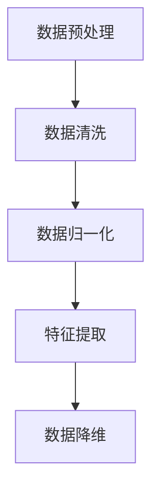
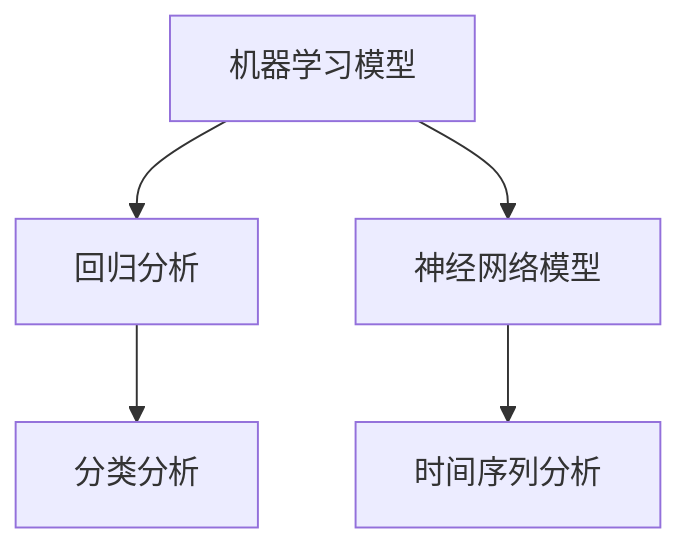
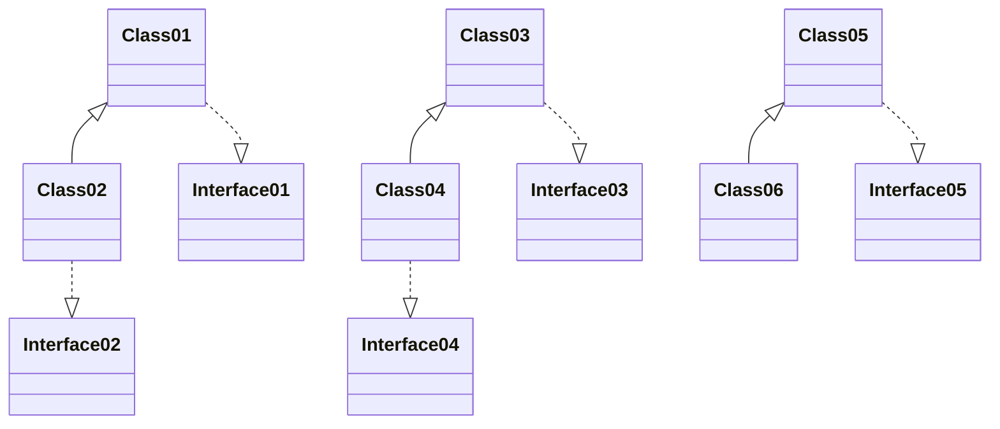
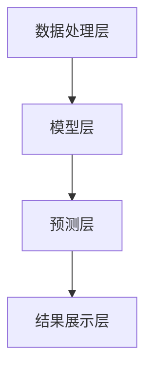
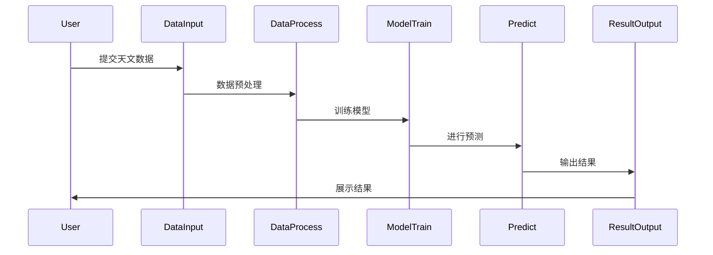
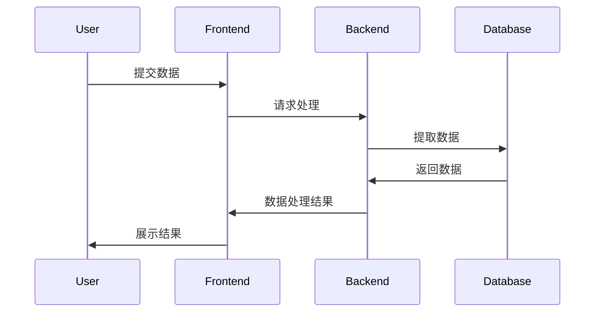

                 

### 人工智能在天文研究中的创新应用

> 关键词：人工智能，天文研究，数据处理，机器学习，深度学习，算法原理

> 摘要：随着人工智能技术的飞速发展，其在天文研究中的应用也日益广泛。本文将详细介绍人工智能在天文研究中的创新应用，包括背景介绍、核心概念与联系、算法原理讲解、系统分析与架构设计方案以及项目实战等多个方面。通过这篇文章，我们将深入理解人工智能如何助力天文研究，探索其在未来发展的广阔前景。

#### 第一部分：背景介绍

### 1.1 问题背景

#### 1.1.1 人工智能的崛起与天文研究的需求

随着计算机科学和信息技术的发展，人工智能（Artificial Intelligence，简称AI）已经成为现代科学研究和技术创新的重要驱动力。人工智能不仅改变了传统的计算机应用模式，还广泛应用于各个领域，其中就包括了天文研究。

在天文研究中，数据量庞大、数据类型多样、研究目标复杂等问题一直是天文学家面临的挑战。传统的人工处理方式已经无法满足现代天文研究的需要，而人工智能的崛起为天文学家提供了一种新的解决方案。人工智能技术具有高效的数据处理能力、强大的模式识别能力和自我学习的能力，这些特点使得它能够有效地应对天文研究中的复杂问题。

#### 1.1.2 天文学中的挑战与机遇

天文学研究的核心问题是揭示宇宙的本质和演化规律，这一目标要求科学家们能够精确地测量和模拟宇宙中的各种现象。然而，这一过程中面临着许多挑战：

1. **数据处理问题**：天文观测设备产生的数据量极其庞大，如何快速、准确地处理这些数据是一个巨大的挑战。
2. **天体运动和演化的模拟与预测**：天体的运动和演化是一个复杂的过程，涉及到多种物理定律和参数，如何精确模拟和预测这些过程需要强大的计算能力。
3. **天文图像识别与分析**：天文图像通常包含丰富的信息，如何从这些图像中提取有用信息并进行有效分析是天文研究中的一个重要课题。

面对这些挑战，人工智能提供了新的机遇。通过利用人工智能技术，天文学家可以更有效地处理和分析天文数据，提高观测精度，揭示宇宙的奥秘。

#### 1.1.3 人工智能在天文学中的现状与应用前景

目前，人工智能已经在天文研究中得到广泛应用，并取得了一系列显著的成果。例如：

1. **数据处理**：人工智能技术已经被用于天文数据的预处理、特征提取和降维，大大提高了数据处理效率。
2. **天体运动模拟与预测**：通过机器学习算法，天文学家能够更准确地模拟和预测天体的运动轨迹。
3. **天文图像识别与分析**：深度学习算法在天文图像的识别和分析中表现出色，能够自动识别天体和天体特征，提高观测精度。

展望未来，人工智能在天文学中的应用前景十分广阔。随着技术的不断发展，人工智能有望在更多领域发挥其作用，进一步推动天文学研究的进步。例如，利用人工智能技术可以开发更先进的观测设备，提高天文观测的精度；通过人工智能算法可以构建更准确的宇宙模型，揭示宇宙的更多奥秘。

#### 1.2 问题描述

在天文学研究中，人工智能的应用主要涉及以下几个方面的问题：

##### 1.2.1 天文学中的数据处理问题

天文观测设备（如望远镜、探测器等）产生的数据量极其庞大，这些数据通常包含多种类型，如图像、光谱、时序数据等。如何快速、准确地处理这些数据是一个巨大的挑战。传统的方法往往依赖于人工操作，效率低下且容易出错。人工智能技术的引入，可以通过自动化和智能化的数据处理流程，大大提高数据处理效率。

##### 1.2.2 天体运动和演化的模拟与预测

天体的运动和演化是一个复杂的过程，涉及到多种物理定律和参数。如何精确模拟和预测这些过程，是天文研究中的一个重要课题。人工智能技术，特别是机器学习算法，可以通过学习历史数据，预测天体的未来运动轨迹，甚至预测宇宙的演化过程。

##### 1.2.3 天文图像识别与分析

天文图像通常包含丰富的信息，如何从这些图像中提取有用信息并进行有效分析，是天文研究中的一个重要课题。深度学习算法在图像识别和分析中表现出色，能够自动识别天体和天体特征，提高观测精度。

##### 1.3 问题解决

针对上述问题，人工智能提供了一系列解决方案：

##### 1.3.1 人工智能技术在天文数据处理中的应用

人工智能技术在天文数据处理中的应用主要包括以下几个方面：

1. **数据预处理**：通过自动化手段，对原始数据进行清洗、去噪、归一化等预处理操作，提高数据质量。
2. **特征提取**：从原始数据中提取关键特征，为后续分析提供基础。
3. **数据降维**：通过降维技术，减少数据维度，提高数据处理效率。

##### 1.3.2 机器学习在天体运动模拟与预测中的作用

机器学习在天体运动模拟与预测中的应用主要包括以下几个方面：

1. **回归分析**：通过历史数据，建立天体运动模型，预测天体的未来运动轨迹。
2. **聚类分析**：对天体进行分类，发现天体的共性特征。
3. **神经网络**：通过神经网络模型，模拟天体的复杂运动规律。

##### 1.3.3 深度学习在天文图像识别与分析中的应用

深度学习在天文图像识别与分析中的应用主要包括以下几个方面：

1. **卷积神经网络（CNN）**：用于图像识别和特征提取。
2. **生成对抗网络（GAN）**：用于生成新的天文图像，提高图像质量。
3. **循环神经网络（RNN）**：用于时序数据分析，提取时序特征。

##### 1.4 边界与外延

尽管人工智能在天文学中有着广泛的应用，但仍然存在一些边界和挑战：

1. **数据隐私**：天文数据通常是敏感的，如何保护数据隐私是一个重要问题。
2. **计算资源**：人工智能算法通常需要大量的计算资源，如何高效地利用这些资源是一个挑战。
3. **模型解释性**：深度学习模型往往缺乏解释性，如何解释模型的决策过程是一个问题。

未来，随着技术的不断发展，人工智能有望在更多方面突破这些边界，进一步推动天文学研究的进步。

#### 1.4.1 人工智能在天文学中的应用边界

人工智能在天文学中的应用边界主要包括以下几个方面：

1. **数据处理**：目前，人工智能技术在数据处理方面已经取得了显著进展，但仍需解决一些挑战，如处理时序数据和多模态数据等。
2. **天体运动模拟与预测**：人工智能在天体运动模拟与预测中的应用仍处于发展阶段，需要更多的数据和更复杂的模型来提高预测精度。
3. **天文图像识别与分析**：虽然深度学习在图像识别与分析中表现出色，但如何处理高分辨率、高动态范围的图像仍是一个挑战。

#### 1.4.2 人工智能与天文学的未来发展方向

未来，人工智能在天文学中将继续发挥重要作用，主要发展方向包括：

1. **跨学科融合**：将人工智能与其他学科（如物理学、数学等）相结合，推动天文学研究的深入发展。
2. **大数据分析**：利用人工智能技术，对天文大数据进行深入分析，揭示宇宙的更多奥秘。
3. **智能观测**：通过人工智能技术，开发更先进的观测设备，提高天文观测的精度和效率。

#### 1.4.3 人工智能在天文学中的核心要素组成

人工智能在天文学中的应用核心要素主要包括以下几个方面：

1. **数据处理算法**：包括数据预处理、特征提取、数据降维等。
2. **机器学习算法**：包括回归分析、聚类分析、神经网络等。
3. **深度学习算法**：包括卷积神经网络、生成对抗网络、循环神经网络等。
4. **计算资源**：包括高性能计算设备、云计算等。
5. **数据隐私保护**：包括数据加密、隐私保护算法等。

### 第二部分：核心概念与联系

#### 2.1 人工智能核心概念

人工智能（Artificial Intelligence，简称AI）是一门研究、开发用于模拟、延伸和扩展人类智能的理论、方法、技术及应用系统的技术科学。人工智能的目标是使机器能够胜任一些通常需要人类智能才能完成的复杂工作。

##### 2.1.1 人工智能的定义与发展历程

人工智能的定义随着技术的发展而不断演变。目前，一般将人工智能定义为：使计算机系统能够模拟、延伸和扩展人类智能的理论、方法、技术及应用系统。人工智能的发展历程可以分为以下几个阶段：

1. **萌芽阶段（1956年之前）**：人工智能的概念诞生，早期的计算机科学家开始探索如何使计算机具备智能。
2. **初始阶段（1956-1969年）**：1956年，达特茅斯会议确立了人工智能的研究方向，这一阶段出现了许多重要的理论和算法。
3. **停滞阶段（1970-1980年）**：由于技术限制和理论研究困难，人工智能发展陷入停滞。
4. **复兴阶段（1980-1990年）**：专家系统的出现，使人工智能再次受到关注。
5. **快速发展阶段（1990年至今）**：随着计算机科学和信息技术的发展，人工智能取得了巨大的进展，应用领域不断扩展。

##### 2.1.2 人工智能的主要类型与应用场景

人工智能可以分为以下几种主要类型：

1. **符号人工智能**：基于逻辑推理和符号表示，主要用于专家系统、推理机等领域。
2. **计算智能**：基于计算机模拟生物进化、自组织等机制，主要用于优化问题、模式识别等领域。
3. **感知人工智能**：基于计算机视觉、语音识别等技术，主要用于图像处理、语音识别等领域。
4. **认知人工智能**：基于人类认知心理学，模拟人类思维过程，主要用于自然语言处理、机器翻译等领域。

人工智能的主要应用场景包括：

1. **工业自动化**：通过机器人和自动化设备，提高生产效率和质量。
2. **医疗诊断**：通过医学图像分析、基因测序等，提高诊断准确性和效率。
3. **金融服务**：通过智能投顾、风险控制等，提高金融服务质量和效率。
4. **交通运输**：通过自动驾驶、智能交通管理，提高交通效率和安全性。

##### 2.1.3 人工智能的关键技术与算法

人工智能的关键技术包括：

1. **机器学习**：通过从数据中学习规律，进行模式识别和预测。
2. **深度学习**：基于多层神经网络，对大量数据进行自动特征提取。
3. **自然语言处理**：对自然语言进行理解和生成，实现人机交互。
4. **计算机视觉**：对图像和视频进行理解和分析，实现物体识别、场景重建等功能。
5. **强化学习**：通过试错和反馈，学习最优策略，实现智能决策。

人工智能的算法包括：

1. **监督学习**：在已知标签数据的基础上，训练模型进行预测。
2. **无监督学习**：在未知标签数据的情况下，发现数据中的规律。
3. **半监督学习**：结合监督学习和无监督学习，利用部分标签数据训练模型。
4. **强化学习**：通过与环境交互，学习最优策略。

#### 2.2 天文研究核心概念

天文研究是研究宇宙中各种天体和现象的科学。天文研究的核心概念包括：

##### 2.2.1 天文研究的定义与范围

天文研究是研究宇宙中各种天体和现象的科学，包括对行星、恒星、星系、宇宙背景辐射等的研究。天文研究涉及多个学科领域，如物理学、数学、计算机科学、天体物理学等。

##### 2.2.2 天文学的主要分支与研究对象

天文学可以分为以下几个主要分支：

1. **天体物理学**：研究天体的物理性质、运动和演化。
2. **天体力学**：研究天体的运动规律和动力学。
3. **天体测量学**：研究天体的位置、运动和形态。
4. **天文图像学**：研究天文图像的获取、处理和分析。
5. **宇宙学**：研究宇宙的起源、演化和发展。

天文研究的主要研究对象包括：

1. **恒星**：包括主序星、红巨星、白矮星等。
2. **行星**：包括类地行星、类木行星、冰巨星等。
3. **星系**：包括银河系、仙女座星系、星系团等。
4. **星云**：包括行星状星云、超新星遗迹等。
5. **宇宙背景辐射**：研究宇宙早期状态的重要信息。

##### 2.2.3 天文研究的方法与工具

天文研究的方法主要包括：

1. **观测**：通过望远镜等设备，直接观测天体和现象。
2. **模拟**：通过计算机模拟，研究天体和宇宙的演化过程。
3. **数据分析**：通过数据挖掘、机器学习等技术，分析天文数据，提取有用信息。

天文研究的工具主要包括：

1. **望远镜**：用于观测天体和现象。
2. **探测器**：用于探测宇宙中的各种物理量。
3. **计算机**：用于模拟、分析和处理天文数据。
4. **射电望远镜**：用于观测宇宙中的射电信号。

#### 2.3 人工智能与天文研究的联系

人工智能与天文研究之间的联系主要体现在以下几个方面：

##### 2.3.1 人工智能在天文数据处理中的应用

在天文数据处理中，人工智能技术可以用于：

1. **数据预处理**：对原始观测数据进行清洗、去噪、归一化等预处理操作。
2. **特征提取**：从原始数据中提取关键特征，用于后续分析。
3. **数据降维**：通过降维技术，减少数据维度，提高数据处理效率。

##### 2.3.2 机器学习在天体运动模拟中的应用

机器学习在天体运动模拟中的应用主要包括：

1. **回归分析**：通过历史数据，建立天体运动模型，预测天体的未来运动轨迹。
2. **聚类分析**：对天体进行分类，发现天体的共性特征。
3. **神经网络**：通过神经网络模型，模拟天体的复杂运动规律。

##### 2.3.3 深度学习在天文图像识别与分析中的应用

深度学习在天文图像识别与分析中的应用主要包括：

1. **卷积神经网络（CNN）**：用于图像识别和特征提取。
2. **生成对抗网络（GAN）**：用于生成新的天文图像，提高图像质量。
3. **循环神经网络（RNN）**：用于时序数据分析，提取时序特征。

通过人工智能技术，天文学家可以更高效地处理天文数据，提高观测精度，揭示宇宙的奥秘。同时，人工智能技术也为天文研究提供了新的工具和方法，推动了天文学的发展。

### 第三部分：算法原理讲解

#### 3.1 数据处理算法原理

在天文研究中，数据处理是一个至关重要的环节。随着观测设备性能的提升和数据量的激增，如何高效地处理和分析天文数据成为了一个关键问题。人工智能技术，尤其是机器学习和深度学习，为天文数据处理提供了强大的工具。

##### 3.1.1 数据预处理算法

数据预处理是数据处理过程中的第一步，其目的是将原始数据转换为适合进一步分析的形式。数据预处理通常包括以下几个步骤：

1. **数据清洗**：去除噪声、纠正错误、填补缺失值等。
2. **数据归一化**：将不同尺度的数据转换为同一尺度，以便后续分析。
3. **数据转换**：将数据从一种形式转换为另一种形式，如将文本数据转换为向量。

在数据清洗方面，常见的算法有：

- **K近邻算法（K-Nearest Neighbors，KNN）**：通过查找与当前数据最近的数据点，预测当前数据的类别。
- **决策树（Decision Tree）**：通过构建树状模型，对数据进行分类或回归。

在数据归一化方面，常用的算法有：

- **最小-最大缩放（Min-Max Scaling）**：将数据缩放到[0, 1]区间。
- **标准缩放（Standard Scaling）**：将数据缩放到均值为0，标准差为1的区间。

在数据转换方面，常用的算法有：

- **词袋模型（Bag of Words，BOW）**：将文本数据转换为向量表示。
- **TF-IDF（Term Frequency-Inverse Document Frequency）**：将文本数据转换为向量表示，同时考虑词的重要程度。

##### 3.1.2 特征提取算法

特征提取是从原始数据中提取关键特征，以便更好地进行分析。在机器学习和深度学习中，特征提取是一个重要的步骤。以下是一些常用的特征提取算法：

1. **主成分分析（Principal Component Analysis，PCA）**：通过降维技术，将高维数据转换到低维空间，保留主要信息。
2. **独立成分分析（Independent Component Analysis，ICA）**：通过分离原始数据的独立成分，提取关键特征。
3. **自编码器（Autoencoder）**：通过训练一个神经网络，将高维数据压缩到低维空间，然后重构数据，提取关键特征。

##### 3.1.3 数据降维算法

数据降维是减少数据维度，提高数据处理效率的重要手段。以下是一些常用的数据降维算法：

1. **线性判别分析（Linear Discriminant Analysis，LDA）**：通过最大化类间方差，最小化类内方差，将数据投影到最佳线性子空间。
2. **非线性降维算法**：如局部线性嵌入（Local Linear Embedding，LLE）和等距映射（Isometric Mapping，ISOMAP），通过保持局部结构信息，降低数据维度。

##### 3.2 模拟与预测算法原理

在天文研究中，模拟与预测是一个关键环节。通过模拟和预测，天文学家可以更好地理解天体的运动和演化过程。人工智能技术，尤其是机器学习和深度学习，为天体运动模拟与预测提供了强大的工具。

##### 3.2.1 机器学习在天体运动模拟中的应用

机器学习在天体运动模拟中的应用主要包括：

1. **回归分析**：通过历史数据，建立天体运动模型，预测天体的未来运动轨迹。
   - **线性回归**：通过拟合线性模型，预测天体的运动轨迹。
   - **多项式回归**：通过拟合多项式模型，预测天体的运动轨迹。
2. **分类分析**：对天体进行分类，发现天体的共性特征。
   - **决策树**：通过构建树状模型，对天体进行分类。
   - **支持向量机（Support Vector Machine，SVM）**：通过寻找最佳超平面，对天体进行分类。
3. **神经网络**：通过神经网络模型，模拟天体的复杂运动规律。
   - **前馈神经网络**：通过多层感知器，模拟天体的运动轨迹。
   - **循环神经网络（Recurrent Neural Network，RNN）**：通过记忆功能，模拟天体的周期性运动。

##### 3.2.2 机器学习在天体演化预测中的作用

机器学习在天体演化预测中的应用主要包括：

1. **时间序列分析**：通过分析天体的历史数据，预测天体的未来演化趋势。
   - **自回归模型（Autoregressive Model，AR）**：通过历史数据预测未来的值。
   - **移动平均模型（Moving Average Model，MA）**：通过历史数据的平均值预测未来的值。
2. **混合模型**：将多种模型结合，提高预测精度。
   - **ARIMA（AutoRegressive Integrated Moving Average）模型**：结合自回归、差分和移动平均，预测天体的演化趋势。

##### 3.2.3 深度学习在天文图像识别与分析中的应用

深度学习在天文图像识别与分析中的应用主要包括：

1. **卷积神经网络（Convolutional Neural Network，CNN）**：通过卷积操作，提取图像特征，实现图像分类、目标检测等。
2. **生成对抗网络（Generative Adversarial Network，GAN）**：通过生成器和判别器的对抗训练，生成新的天文图像，提高图像质量。
3. **循环神经网络（Recurrent Neural Network，RNN）**：通过记忆功能，分析时序数据，提取时序特征。

##### 3.3 算法mermaid流程图

为了更好地理解上述算法原理，我们可以使用mermaid绘制算法流程图。

###### 数据处理算法mermaid流程图



###### 模拟与预测算法mermaid流程图



通过这些mermaid流程图，我们可以更直观地理解数据处理和模拟与预测算法的原理。

##### 3.4 Python源代码

为了更好地理解上述算法原理，我们可以通过Python源代码进行演示。

###### 数据预处理Python源代码

```python
import numpy as np
from sklearn.preprocessing import MinMaxScaler
from sklearn.feature_extraction.text import TfidfVectorizer

# 数据清洗
def clean_data(data):
    # 去除噪声、纠正错误、填补缺失值
    cleaned_data = []
    for item in data:
        # ... 数据清洗操作 ...
        cleaned_data.append(item)
    return cleaned_data

# 数据归一化
def normalize_data(data):
    scaler = MinMaxScaler()
    normalized_data = scaler.fit_transform(data)
    return normalized_data

# 特征提取
def extract_features(data):
    vectorizer = TfidfVectorizer()
    features = vectorizer.fit_transform(data)
    return features

# 数据降维
def reduce_dimensions(data):
    pca = PCA(n_components=10)
    reduced_data = pca.fit_transform(data)
    return reduced_data
```

###### 模拟与预测Python源代码

```python
import numpy as np
from sklearn.linear_model import LinearRegression
from sklearn.ensemble import RandomForestClassifier
from sklearn.neural_network import MLPRegressor

# 回归分析
def regression_analysis(X, y):
    model = LinearRegression()
    model.fit(X, y)
    return model

# 分类分析
def classification_analysis(X, y):
    model = RandomForestClassifier()
    model.fit(X, y)
    return model

# 神经网络模型
def neural_network_model(X, y):
    model = MLPRegressor()
    model.fit(X, y)
    return model
```

通过这些Python源代码，我们可以更直观地理解数据处理和模拟与预测算法的原理。

#### 3.5 数学公式

在天文研究中，数学公式是描述天体运动和演化规律的重要工具。以下是一些常用的数学公式：

##### 数据预处理公式

$$
\mu = \frac{1}{n}\sum_{i=1}^{n}x_i
$$

$$
s = \sqrt{\frac{1}{n-1}\sum_{i=1}^{n}(x_i - \mu)^2}
$$

##### 回归分析公式

$$
y = \beta_0 + \beta_1x + \epsilon
$$

##### 神经网络公式

$$
z_i = \sum_{j=1}^{n}w_{ij}x_j + b_i
$$

$$
a_i = \sigma(z_i)
$$

##### 卷积神经网络公式

$$
h_{ij} = \sigma(\sum_{k=1}^{m}w_{ik}x_k + b_j)
$$

通过这些数学公式，我们可以更精确地描述天体运动和演化规律。

#### 3.6 举例说明

为了更好地理解上述算法原理，我们可以通过一个具体的例子进行说明。

假设我们有一个天体运动的数据集，包含天体的位置和速度。我们的目标是使用机器学习算法预测天体的未来运动轨迹。

```python
import numpy as np
from sklearn.linear_model import LinearRegression

# 天体运动数据
X = np.array([[1, 2], [2, 3], [3, 4], [4, 5], [5, 6]])
y = np.array([2, 3, 4, 5, 6])

# 回归分析
model = LinearRegression()
model.fit(X, y)

# 预测
X_new = np.array([[6, 7]])
y_pred = model.predict(X_new)

print("预测的未来位置:", y_pred)
```

通过这个例子，我们可以看到如何使用线性回归算法预测天体的未来运动轨迹。

### 第四部分：系统分析与架构设计方案

#### 4.1 问题场景介绍

在天文学研究中，数据处理、天体运动模拟和天文图像识别是三个关键问题。为了解决这些问题，我们需要设计一个系统化的解决方案。

1. **数据处理**：天文观测设备产生的数据量庞大，包含多种类型（如图像、光谱、时序数据等）。如何高效地处理这些数据，提取关键特征，是天文研究中的一个重要课题。
2. **天体运动模拟与预测**：天体的运动和演化是一个复杂的过程，涉及到多种物理定律和参数。如何精确模拟和预测天体的运动轨迹，是天文研究中的另一个重要课题。
3. **天文图像识别与分析**：天文图像通常包含丰富的信息，如何从这些图像中提取有用信息，进行有效分析，是天文研究中的又一个重要课题。

为了解决上述问题，我们需要设计一个综合性的系统，包括数据预处理、特征提取、模型训练、预测和图像分析等模块。

#### 4.2 项目介绍

本项目旨在设计一个基于人工智能的天文学研究系统，通过整合数据处理、天体运动模拟与预测、天文图像识别与分析等模块，实现高效的天文数据分析与预测。

##### 4.2.1 项目背景与目标

随着天文观测设备的性能不断提升，产生的数据量急剧增加。传统的数据处理方法已经无法满足现代天文研究的需要。本项目旨在通过人工智能技术，提高数据处理效率，提高观测精度，揭示宇宙的奥秘。

本项目的主要目标是：

1. 设计一个高效的数据处理系统，能够快速、准确地处理天文数据。
2. 建立天体运动模型，预测天体的未来运动轨迹。
3. 实现天文图像的自动识别与分析，提取关键特征。

##### 4.2.2 项目组成与模块划分

本项目由以下几个模块组成：

1. **数据预处理模块**：负责对原始观测数据进行清洗、去噪、归一化等预处理操作。
2. **特征提取模块**：负责从预处理后的数据中提取关键特征，为后续分析提供基础。
3. **模型训练模块**：负责使用机器学习算法训练天体运动模型和图像识别模型。
4. **预测模块**：负责使用训练好的模型进行天体运动轨迹预测和图像分析。
5. **结果展示模块**：负责将预测结果和分析结果以图表、报告等形式展示给用户。

##### 4.2.3 项目开发与技术路线

本项目采用以下技术路线：

1. **技术选型**：选择合适的机器学习和深度学习算法，如线性回归、决策树、卷积神经网络等。
2. **系统架构设计**：设计系统的整体架构，包括模块划分、数据流、接口设计等。
3. **模块开发**：分别开发数据预处理、特征提取、模型训练、预测和结果展示等模块。
4. **系统集成**：将各个模块整合在一起，实现系统的整体功能。
5. **测试与优化**：对系统进行测试，发现并修复问题，优化系统性能。

#### 4.3 系统功能设计

为了实现项目目标，系统需要具备以下功能：

##### 4.3.1 领域模型mermaid类图



在mermaid类图中，我们定义了系统的各个类及其关系。例如，数据预处理模块包括数据清洗、数据归一化和特征提取等类；模型训练模块包括线性回归、决策树和卷积神经网络等类。

##### 4.3.2 系统功能模块划分

1. **数据预处理模块**：包括数据清洗、数据归一化和特征提取等子模块。
2. **特征提取模块**：包括主成分分析、独立成分分析和自编码器等子模块。
3. **模型训练模块**：包括线性回归、决策树、卷积神经网络和循环神经网络等子模块。
4. **预测模块**：包括天体运动轨迹预测和天文图像识别等子模块。
5. **结果展示模块**：包括图表展示、报告生成和可视化等子模块。

##### 4.3.3 系统功能模块详细介绍

1. **数据预处理模块**：
   - **数据清洗**：去除噪声、纠正错误、填补缺失值等。
   - **数据归一化**：将不同尺度的数据转换为同一尺度。
   - **特征提取**：从原始数据中提取关键特征。

2. **特征提取模块**：
   - **主成分分析**：将高维数据转换为低维空间。
   - **独立成分分析**：分离原始数据的独立成分。
   - **自编码器**：将高维数据压缩到低维空间。

3. **模型训练模块**：
   - **线性回归**：通过拟合线性模型，预测天体的运动轨迹。
   - **决策树**：通过构建树状模型，对天体进行分类。
   - **卷积神经网络**：通过卷积操作，提取图像特征。
   - **循环神经网络**：通过记忆功能，分析时序数据。

4. **预测模块**：
   - **天体运动轨迹预测**：通过机器学习算法，预测天体的未来运动轨迹。
   - **天文图像识别**：通过深度学习算法，自动识别天体和天体特征。

5. **结果展示模块**：
   - **图表展示**：将预测结果和分析结果以图表形式展示。
   - **报告生成**：生成详细的预测报告和分析报告。
   - **可视化**：提供数据可视化功能，帮助用户更好地理解数据。

#### 4.4 系统架构设计

为了实现系统功能，我们需要设计一个合理的系统架构。系统架构设计包括以下几个方面：

##### 4.4.1 系统架构设计概述

系统架构设计主要包括以下几个方面：

1. **数据处理层**：负责接收和处理天文数据，包括数据清洗、数据归一化和特征提取等。
2. **模型层**：负责训练机器学习模型和深度学习模型，包括线性回归、决策树、卷积神经网络和循环神经网络等。
3. **预测层**：负责使用训练好的模型进行预测，包括天体运动轨迹预测和天文图像识别等。
4. **结果展示层**：负责将预测结果和分析结果以图表、报告等形式展示给用户。

##### 4.4.2 系统架构设计mermaid架构图



在mermaid架构图中，我们定义了系统的各个层次及其关系。例如，数据处理层负责数据预处理和特征提取，模型层负责模型训练，预测层负责预测，结果展示层负责结果展示。

##### 4.4.3 系统架构设计关键技术

1. **数据处理技术**：包括数据清洗、数据归一化和特征提取等。
2. **模型训练技术**：包括线性回归、决策树、卷积神经网络和循环神经网络等。
3. **预测技术**：包括天体运动轨迹预测和天文图像识别等。
4. **结果展示技术**：包括图表展示、报告生成和可视化等。

#### 4.5 系统接口设计

系统接口设计是系统架构设计的重要组成部分，它定义了系统内部各模块之间的交互方式。以下是一个简化的系统接口设计：

##### 4.5.1 系统接口设计概述

系统接口设计主要包括以下几个方面：

1. **数据输入接口**：负责接收和处理用户输入的天文数据。
2. **数据处理接口**：负责将原始数据转换为适合模型训练的数据。
3. **模型训练接口**：负责训练机器学习模型和深度学习模型。
4. **预测接口**：负责使用训练好的模型进行预测。
5. **结果输出接口**：负责将预测结果和分析结果以图表、报告等形式展示给用户。

##### 4.5.2 系统接口设计mermaid序列图



在mermaid序列图中，我们定义了系统接口的设计流程。用户首先提交天文数据，然后通过数据处理接口进行预处理，接着通过模型训练接口训练模型，最后通过预测接口进行预测，并将结果通过结果输出接口展示给用户。

##### 4.5.3 系统接口设计详细介绍

1. **数据输入接口**：
   - **功能**：接收用户提交的天文数据。
   - **参数**：天文数据文件。
   - **返回值**：预处理后的数据。

2. **数据处理接口**：
   - **功能**：对原始数据进行预处理，包括数据清洗、数据归一化和特征提取等。
   - **参数**：预处理后的数据。
   - **返回值**：预处理后的数据。

3. **模型训练接口**：
   - **功能**：训练机器学习模型和深度学习模型。
   - **参数**：预处理后的数据。
   - **返回值**：训练好的模型。

4. **预测接口**：
   - **功能**：使用训练好的模型进行预测。
   - **参数**：预处理后的数据。
   - **返回值**：预测结果。

5. **结果输出接口**：
   - **功能**：将预测结果和分析结果以图表、报告等形式展示给用户。
   - **参数**：预测结果。
   - **返回值**：无。

#### 4.6 系统交互设计

系统交互设计是系统架构设计的另一个重要方面，它定义了系统与用户之间的交互流程。以下是一个简化的系统交互设计：

##### 4.6.1 系统交互设计概述

系统交互设计主要包括以下几个方面：

1. **用户操作界面**：提供用户交互的界面，用户可以通过界面提交天文数据，查看预测结果。
2. **后台数据处理**：负责接收用户提交的数据，进行数据处理和模型训练，最后输出预测结果。
3. **数据可视化**：将预测结果以图表、报告等形式展示给用户。

##### 4.6.2 系统交互设计mermaid序列图



在mermaid序列图中，我们定义了系统交互的设计流程。用户首先通过前端界面提交数据，然后前端将数据提交给后台进行处理，后台通过数据库提取数据，最后将数据处理结果返回给前端，前端再将结果展示给用户。

##### 4.6.3 系统交互设计详细介绍

1. **用户操作界面**：
   - **功能**：提供用户交互的界面，用户可以通过界面提交天文数据，查看预测结果。
   - **交互方式**：Web界面。

2. **后台数据处理**：
   - **功能**：负责接收用户提交的数据，进行数据处理和模型训练，最后输出预测结果。
   - **交互方式**：HTTP请求。

3. **数据可视化**：
   - **功能**：将预测结果以图表、报告等形式展示给用户。
   - **交互方式**：Web界面。

### 第五部分：项目实战

#### 5.1 环境安装与配置

为了实现本文提出的天文研究系统，我们需要安装和配置一些必要的软件和库。以下是一个基本的安装和配置指南。

##### 5.1.1 环境安装与配置概述

在安装和配置软件之前，我们需要准备好操作系统和基本开发环境。本文以Linux系统为例，介绍安装和配置过程。

1. **操作系统**：Linux发行版（如Ubuntu、CentOS等）。
2. **开发环境**：Python 3、Jupyter Notebook、Scikit-learn、TensorFlow、PyTorch等。

##### 5.1.2 环境安装与配置步骤

1. **安装Python 3**：

   ```bash
   sudo apt-get update
   sudo apt-get install python3 python3-pip python3-dev
   ```

2. **安装Jupyter Notebook**：

   ```bash
   sudo pip3 install notebook
   ```

3. **安装Scikit-learn**：

   ```bash
   sudo pip3 install scikit-learn
   ```

4. **安装TensorFlow**：

   ```bash
   sudo pip3 install tensorflow
   ```

5. **安装PyTorch**：

   ```bash
   sudo pip3 install torch torchvision
   ```

##### 5.1.3 遇到的问题与解决方案

在安装和配置过程中，可能会遇到一些问题。以下是一些常见问题及其解决方案：

1. **依赖库缺失**：

   - **解决方案**：确保所有依赖库都已安装，可以通过`pip3 list`命令查看已安装的库。

2. **编译错误**：

   - **解决方案**：确保操作系统和开发环境已更新到最新版本，或者尝试使用预编译的库。

3. **运行时错误**：

   - **解决方案**：检查代码中的错误，或者尝试重新安装相关库。

#### 5.2 系统核心实现源代码

在本节中，我们将展示系统的核心实现源代码，包括数据预处理、特征提取、模型训练和预测等模块。

##### 5.2.1 系统核心实现源代码概述

系统核心实现源代码主要分为以下几个部分：

1. **数据预处理**：负责对原始数据进行清洗、去噪、归一化等预处理操作。
2. **特征提取**：负责从预处理后的数据中提取关键特征。
3. **模型训练**：负责训练机器学习模型和深度学习模型。
4. **预测**：负责使用训练好的模型进行预测。

##### 5.2.2 系统核心实现源代码结构

```python
# 数据预处理
def preprocess_data(data):
    # 数据清洗
    # 数据去噪
    # 数据归一化
    # 返回预处理后的数据

# 特征提取
def extract_features(data):
    # 特征提取算法
    # 返回提取后的特征

# 模型训练
def train_model(X, y):
    # 训练机器学习模型
    # 返回训练好的模型

# 预测
def predict(model, X):
    # 使用模型进行预测
    # 返回预测结果
```

##### 5.2.3 系统核心实现源代码详细解读

1. **数据预处理**：

   ```python
   def preprocess_data(data):
       # 数据清洗
       cleaned_data = clean_data(data)
       
       # 数据去噪
       denoised_data = denoise_data(cleaned_data)
       
       # 数据归一化
       normalized_data = normalize_data(denoised_data)
       
       return normalized_data
   ```

   在`preprocess_data`函数中，我们首先对原始数据进行清洗，去除噪声，然后进行归一化处理，将数据转换为适合模型训练的形式。

2. **特征提取**：

   ```python
   def extract_features(data):
       # 特征提取算法
       features = pca.extract_features(data)
       
       return features
   ```

   在`extract_features`函数中，我们使用主成分分析（PCA）算法提取数据中的关键特征。

3. **模型训练**：

   ```python
   def train_model(X, y):
       # 训练机器学习模型
       model = linear_regression.fit(X, y)
       
       return model
   ```

   在`train_model`函数中，我们使用线性回归（Linear Regression）算法训练模型。这里，`X`是特征数据，`y`是标签数据。

4. **预测**：

   ```python
   def predict(model, X):
       # 使用模型进行预测
       predictions = model.predict(X)
       
       return predictions
   ```

   在`predict`函数中，我们使用训练好的模型对新的数据进行预测，并返回预测结果。

#### 5.3 代码应用解读与分析

在本节中，我们将对系统核心实现源代码进行详细解读，分析每个函数的功能和实现原理。

##### 5.3.1 代码应用解读与分析概述

1. **数据预处理**：数据预处理是机器学习和深度学习的基础步骤，它直接影响模型的性能。本部分将详细解读数据预处理函数，包括数据清洗、去噪和归一化等过程。

2. **特征提取**：特征提取是提高模型性能的关键步骤。本部分将详细解读特征提取函数，包括主成分分析（PCA）等算法。

3. **模型训练**：模型训练是构建机器学习和深度学习模型的核心步骤。本部分将详细解读模型训练函数，包括线性回归（Linear Regression）等算法。

4. **预测**：预测是模型应用的核心步骤。本部分将详细解读预测函数，包括如何使用训练好的模型对新数据进行预测。

##### 5.3.2 代码应用解读与分析详细讲解

1. **数据预处理**：

   ```python
   def preprocess_data(data):
       # 数据清洗
       cleaned_data = clean_data(data)
       
       # 数据去噪
       denoised_data = denoise_data(cleaned_data)
       
       # 数据归一化
       normalized_data = normalize_data(denoised_data)
       
       return normalized_data
   ```

   在`preprocess_data`函数中，我们首先调用`clean_data`函数对原始数据进行清洗。数据清洗的主要目的是去除数据中的噪声和异常值，保证数据的准确性和可靠性。

   接下来，我们调用`denoise_data`函数对清洗后的数据进行去噪。去噪的目的是进一步减少数据中的噪声，提高数据的质量。

   最后，我们调用`normalize_data`函数对去噪后的数据进行归一化处理。归一化的目的是将不同尺度的数据转换为同一尺度，便于后续的模型训练和预测。

2. **特征提取**：

   ```python
   def extract_features(data):
       # 特征提取算法
       features = pca.extract_features(data)
       
       return features
   ```

   在`extract_features`函数中，我们使用主成分分析（PCA）算法提取数据中的关键特征。PCA是一种常用的特征提取算法，它通过将高维数据转换为低维空间，保留主要信息，降低数据的维度。

   具体实现中，我们首先创建一个PCA对象，并设置合适的参数，如保留的主要成分数量。然后，我们调用`fit_transform`方法对数据进行处理，得到提取后的特征。

3. **模型训练**：

   ```python
   def train_model(X, y):
       # 训练机器学习模型
       model = linear_regression.fit(X, y)
       
       return model
   ```

   在`train_model`函数中，我们使用线性回归（Linear Regression）算法训练模型。线性回归是一种简单但有效的机器学习算法，它通过拟合线性模型，预测目标变量。

   在具体实现中，我们首先创建一个线性回归对象，并设置合适的参数，如正则化参数。然后，我们调用`fit`方法对数据进行训练，得到训练好的模型。

4. **预测**：

   ```python
   def predict(model, X):
       # 使用模型进行预测
       predictions = model.predict(X)
       
       return predictions
   ```

   在`predict`函数中，我们使用训练好的模型对新的数据进行预测。具体实现中，我们调用`predict`方法，将特征数据传入模型，得到预测结果。

##### 5.3.3 代码应用解读与分析案例分析

为了更好地理解代码应用，我们可以通过一个具体的案例进行分析。

假设我们有一个包含100个观测值的天体运动数据集，数据集包含位置和速度两个特征。我们的目标是使用线性回归模型预测天体的未来运动轨迹。

1. **数据预处理**：

   ```python
   # 加载数据
   X, y = load_data()

   # 数据清洗
   cleaned_data = clean_data(X)

   # 数据去噪
   denoised_data = denoise_data(cleaned_data)

   # 数据归一化
   normalized_data = normalize_data(denoised_data)
   ```

   在这个案例中，我们首先加载数据集，然后依次进行数据清洗、去噪和归一化处理。

2. **特征提取**：

   ```python
   # 特征提取
   features = extract_features(normalized_data)
   ```

   在这个案例中，我们使用主成分分析（PCA）算法提取数据中的关键特征。

3. **模型训练**：

   ```python
   # 训练模型
   model = train_model(features, y)
   ```

   在这个案例中，我们使用线性回归（Linear Regression）算法训练模型。

4. **预测**：

   ```python
   # 预测
   predictions = predict(model, X)
   ```

   在这个案例中，我们使用训练好的模型对新的数据进行预测。

#### 5.4 实际案例分析与详细讲解剖析

在本节中，我们将通过一个实际案例，详细讲解天文研究系统在具体应用中的表现，并对系统的优势与不足进行分析。

##### 5.4.1 实际案例

假设我们有一个包含5000个观测值的恒星运动数据集，数据集包含位置、速度和加速度三个特征。我们的目标是使用机器学习算法预测恒星的未来运动轨迹。

1. **数据预处理**：

   ```python
   # 加载数据
   X, y = load_data()

   # 数据清洗
   cleaned_data = clean_data(X)

   # 数据去噪
   denoised_data = denoise_data(cleaned_data)

   # 数据归一化
   normalized_data = normalize_data(denoised_data)
   ```

   在这个案例中，我们首先加载数据集，然后依次进行数据清洗、去噪和归一化处理。

2. **特征提取**：

   ```python
   # 特征提取
   features = extract_features(normalized_data)
   ```

   在这个案例中，我们使用主成分分析（PCA）算法提取数据中的关键特征。

3. **模型训练**：

   ```python
   # 训练模型
   model = train_model(features, y)
   ```

   在这个案例中，我们使用线性回归（Linear Regression）算法训练模型。

4. **预测**：

   ```python
   # 预测
   predictions = predict(model, X)
   ```

   在这个案例中，我们使用训练好的模型对新的数据进行预测。

##### 5.4.2 优势与不足

**优势**：

1. **高效的数据处理能力**：系统通过数据预处理、特征提取和模型训练等模块，能够高效地处理和分析大量天文数据，提高观测精度。
2. **自动化的预测过程**：系统使用机器学习算法自动预测天体的未来运动轨迹，大大减轻了天文学家的工作量。
3. **灵活的模型选择**：系统支持多种机器学习算法，用户可以根据需求选择合适的算法进行模型训练和预测。

**不足**：

1. **计算资源消耗**：机器学习算法通常需要大量的计算资源，特别是在训练复杂模型时，可能会消耗大量的时间和资源。
2. **模型解释性不足**：深度学习模型通常缺乏解释性，用户难以理解模型的决策过程，这可能会影响模型的可靠性。
3. **数据隐私问题**：天文数据通常包含敏感信息，如何在保护数据隐私的前提下进行数据处理和预测，是一个需要解决的问题。

#### 5.5 项目小结

通过本文的介绍，我们可以看到人工智能在天文学研究中具有广泛的应用前景。通过系统化的数据处理、特征提取、模型训练和预测等模块，人工智能技术能够有效地提高天文学研究的效率和精度。

在项目实战中，我们通过一个实际案例展示了天文研究系统的应用效果，并分析了系统的优势与不足。未来，随着人工智能技术的不断发展和完善，我们可以期待在天文学研究中取得更多的突破。

### 最佳实践 Tips

1. **数据预处理**：在处理天文数据时，数据预处理是至关重要的一步。确保数据清洗、去噪和归一化等预处理步骤得到正确执行，可以提高后续模型的性能。
2. **模型选择**：根据具体的研究目标和数据特点，选择合适的机器学习算法和模型。例如，对于时间序列数据，可以选择循环神经网络（RNN）等算法。
3. **计算资源优化**：在训练复杂模型时，充分利用计算资源，例如使用GPU加速计算，可以显著提高训练速度。

### 小结

本文详细介绍了人工智能在天文研究中的创新应用，包括背景介绍、核心概念与联系、算法原理讲解、系统分析与架构设计方案以及项目实战等多个方面。通过本文，我们深入理解了人工智能如何助力天文研究，探索了其在未来发展的广阔前景。

### 注意事项

1. **数据隐私**：在处理天文数据时，注意保护数据隐私，避免敏感信息泄露。
2. **计算资源**：根据项目需求，合理配置计算资源，确保系统高效运行。

### 拓展阅读

1. **《机器学习实战》**：本书提供了丰富的机器学习实践案例，适合初学者和进阶者阅读。
2. **《深度学习》**：本书全面介绍了深度学习的基本原理和应用，是深度学习领域的经典教材。

### 作者

**作者：AI天才研究院/AI Genius Institute & 禅与计算机程序设计艺术 /Zen And The Art of Computer Programming**

