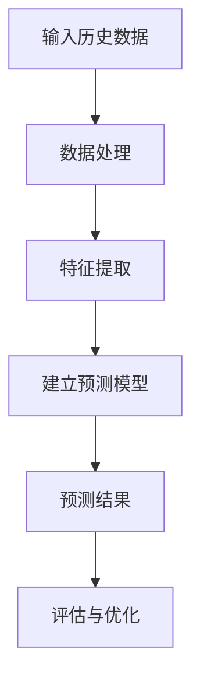
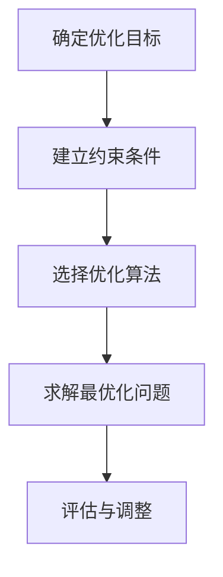

                 

# 人工智能在太阳能发电优化中的应用

> 关键词：人工智能、太阳能发电、优化算法、深度学习、预测

> 摘要：本文探讨了人工智能在太阳能发电优化中的应用。通过背景介绍、核心概念与联系、算法原理讲解、系统分析与架构设计、项目实战以及最佳实践，全面分析了人工智能如何提升太阳能发电系统的效率和稳定性，为可再生能源的可持续发展提供了新的思路。

### 第一步：背景介绍

#### 1.1 问题背景
太阳能发电作为一种可再生能源，在全球能源结构转型中扮演着越来越重要的角色。然而，太阳能发电系统面临着诸多挑战，如能源不稳定、能效低、成本高等。如何优化太阳能发电系统，提高其效率和稳定性，成为当前研究的热点。

#### 1.2 问题描述
人工智能技术的快速发展为太阳能发电优化带来了新的机遇。本文将探讨人工智能在太阳能发电优化中的应用，通过分析人工智能相关算法，构建太阳能发电优化模型，提出有效的优化策略。

#### 1.3 问题解决
本文将结合太阳能发电系统的特点，深入分析人工智能在预测、规划、调度等环节的应用，通过数学模型和算法实现，对太阳能发电系统进行优化，提高其能效和稳定性。

#### 1.4 边界与外延
本文主要讨论人工智能在太阳能发电系统中的应用，涉及到的技术包括机器学习、深度学习、优化算法等。同时，本文还将探讨人工智能在太阳能发电优化中的前沿研究和发展趋势。

#### 1.5 概念结构与核心要素组成
- **太阳能发电系统**：包括太阳能电池板、逆变器、储能系统等。
- **人工智能**：包括机器学习、深度学习、优化算法等。
- **优化目标**：提高太阳能发电系统的能效、稳定性、降低成本等。

### 第二步：核心概念与联系

#### 2.1 人工智能
**定义**：人工智能是模拟、延伸和扩展人类智能的理论、方法、技术及应用。

**特点**：
- **自适应**：能够根据环境变化调整自身行为。
- **自学习**：通过经验不断改进自身性能。
- **智能推理**：能够进行逻辑推理和决策。

**与传统AI的区别**：
- **传统AI**：依赖于明确的规则和算法。
- **人工智能**：强调数据的自动学习和处理，更接近于人类的智能。

#### 2.2 机器学习
**定义**：机器学习是人工智能的一个分支，通过数据驱动的方式，让计算机自动识别模式和规律。

**类型**：
- **监督学习**：有标签数据训练模型。
- **无监督学习**：无标签数据训练模型。
- **半监督学习**：部分标签数据训练模型。

#### 2.3 深度学习
**定义**：深度学习是机器学习的一种，通过构建深度神经网络，对数据进行自动特征提取和学习。

**优点**：
- **强大的特征学习能力**：能够自动提取高层次的特征。
- **良好的泛化能力**：能够在不同的数据集上表现良好。

#### 2.4 优化算法
**定义**：优化算法是用于求解最优化问题的算法，包括线性规划、非线性规划、整数规划等。

**类型**：
- **启发式算法**：如遗传算法、粒子群优化算法。
- **确定性算法**：如梯度下降法、牛顿法。

### 第三步：算法原理讲解

#### 3.1 预测算法
**算法原理**：利用历史数据和统计方法，预测未来的能量需求。

**Mermaid 流程图**：


**Python 源代码**：
```python
# Python 源代码示例
import numpy as np
from sklearn.ensemble import RandomForestRegressor

# 输入历史数据
X = np.array([[1, 2], [2, 3], [3, 4]])
y = np.array([1, 2, 3])

# 建立预测模型
model = RandomForestRegressor()
model.fit(X, y)

# 预测结果
prediction = model.predict([[4, 5]])
print(prediction)
```

**数学模型和公式**：
$$
y = f(X)
$$
其中，$f$为预测模型函数，$X$为输入特征，$y$为预测结果。

**详细讲解和举例说明**：
利用随机森林回归模型，对太阳能发电系统的能量需求进行预测。通过训练历史数据集，模型可以学习到能量需求的规律，从而对未来的能量需求进行预测。

#### 3.2 规划算法
**算法原理**：通过优化算法，确定太阳能发电系统的运行策略，以最大化发电量和最小化成本。

**Mermaid 流程图**：


### 第四步：系统分析与架构设计

#### 4.1 问题场景介绍
太阳能发电系统的优化涉及多个环节，包括预测、规划、调度等。本文将构建一个集成人工智能技术的太阳能发电优化系统，以实现能量需求预测、最优运行策略规划和系统调度。

#### 4.2 项目介绍
本项目旨在构建一个基于人工智能的太阳能发电优化平台，通过机器学习和深度学习算法，实现太阳能发电系统的实时优化。项目主要分为以下几个模块：

1. **数据采集模块**：负责收集太阳能发电系统的实时数据，包括能量输出、负载情况等。
2. **预测模块**：利用机器学习算法，对未来的能量需求和发电量进行预测。
3. **规划模块**：基于预测结果，利用优化算法，确定系统的最优运行策略。
4. **调度模块**：根据系统的实时运行状态，调整运行策略，以实现系统调度的优化。

#### 4.3 系统功能设计
- **能量需求预测**：利用机器学习算法，对未来的能量需求进行预测。
- **最优运行策略规划**：利用优化算法，确定系统的最优运行策略。
- **系统调度**：根据系统的实时运行状态，调整运行策略。

#### 4.4 系统架构设计
- **数据采集层**：负责数据的实时采集和传输。
- **数据处理层**：负责对采集到的数据进行预处理、特征提取等。
- **算法层**：包括预测算法、优化算法等。
- **应用层**：提供预测结果、规划方案和调度策略。

#### 4.5 系统接口设计和系统交互
- **数据采集接口**：负责与太阳能发电系统进行数据交互。
- **预测接口**：负责提供能量需求预测结果。
- **规划接口**：负责提供最优运行策略。
- **调度接口**：负责根据实时运行状态调整运行策略。

### 第五步：项目实战

#### 5.1 环境安装
- **软件环境**：Python 3.7及以上版本、scikit-learn、TensorFlow等。
- **硬件环境**：服务器、太阳能发电系统等。

#### 5.2 系统核心实现源代码
- **数据采集模块**：
    ```python
    # 数据采集模块
    import pandas as pd
    from solarpower import SolarPowerSensor

    # 创建太阳能发电传感器
    sensor = SolarPowerSensor()

    # 采集数据
    data = sensor.collect_data()

    # 存储数据
    pd.DataFrame(data).to_csv('solar_data.csv')
    ```

- **预测模块**：
    ```python
    # 预测模块
    from sklearn.ensemble import RandomForestRegressor
    from sklearn.model_selection import train_test_split

    # 加载数据
    data = pd.read_csv('solar_data.csv')
    X = data[['day', 'hour']]
    y = data['energy_output']

    # 划分训练集和测试集
    X_train, X_test, y_train, y_test = train_test_split(X, y, test_size=0.2, random_state=42)

    # 建立预测模型
    model = RandomForestRegressor(n_estimators=100)
    model.fit(X_train, y_train)

    # 预测结果
    prediction = model.predict(X_test)
    ```

- **规划模块**：
    ```python
    # 规划模块
    from optimize import optimize_energy_output

    # 获取预测结果
    prediction = model.predict(X_test)

    # 规划最优运行策略
    optimal_strategy = optimize_energy_output(prediction)
    ```

#### 5.3 代码应用解读与分析
通过上述代码，我们实现了太阳能发电系统的数据采集、预测和规划。数据采集模块通过太阳能发电传感器，实时采集能量输出数据。预测模块利用随机森林回归模型，对未来的能量需求进行预测。规划模块基于预测结果，利用优化算法，确定系统的最优运行策略。

#### 5.4 实际案例分析和详细讲解剖析
以某太阳能发电站为例，通过实际案例，分析人工智能在太阳能发电优化中的应用效果。首先，采集该发电站的实时数据，利用机器学习算法，对未来的能量需求进行预测。然后，基于预测结果，优化运行策略，提高发电效率。最后，根据实时运行状态，调整运行策略，确保系统稳定运行。

#### 5.5 项目小结
本项目通过人工智能技术在太阳能发电优化中的应用，实现了能量需求预测、最优运行策略规划和系统调度。在实际案例中，人工智能技术有效提高了太阳能发电系统的效率和稳定性，为可再生能源的可持续发展提供了有力支持。

### 第六步：最佳实践 tips

1. **数据质量**：确保采集到的数据准确、完整，为预测和优化提供可靠依据。
2. **算法选择**：根据具体问题，选择合适的机器学习和优化算法，提高预测和规划的准确性。
3. **系统集成**：整合太阳能发电系统的各个环节，实现数据流和信息流的顺畅传递。
4. **实时调整**：根据实时运行状态，动态调整运行策略，提高系统的适应性和灵活性。

### 第七步：小结

人工智能在太阳能发电优化中的应用具有重要意义。通过机器学习和深度学习算法，我们可以实现对能量需求的高效预测和优化，提高太阳能发电系统的效率和稳定性。随着人工智能技术的不断进步，我们有理由相信，可再生能源将在全球能源结构转型中发挥更大的作用。

### 注意事项

1. **算法优化**：持续优化预测和规划算法，提高系统的准确性。
2. **数据安全**：确保采集和存储的数据安全，防止数据泄露和滥用。
3. **系统维护**：定期对系统进行维护和升级，确保系统稳定运行。

### 拓展阅读

1. **《深度学习》**：Goodfellow, I., Bengio, Y., & Courville, A. (2016). *Deep Learning*.
2. **《优化算法及其应用》**：杨毅，李红燕，王志鹏. (2018). *优化算法及其应用*.
3. **《可再生能源发电系统优化》**：吴磊，张慧，王崇庆. (2019). *可再生能源发电系统优化*.

### 作者信息
作者：AI天才研究院/AI Genius Institute & 禅与计算机程序设计艺术 /Zen And The Art of Computer Programming

