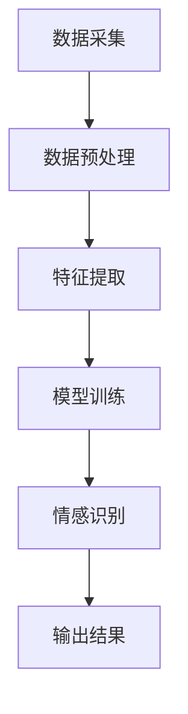
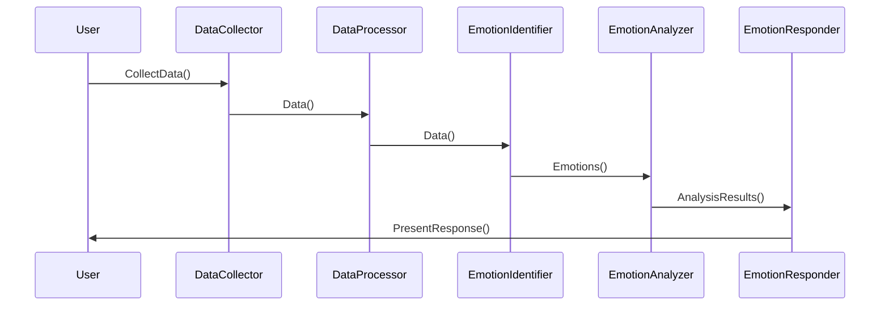

                 


### 文章标题：人工智能在情感计算中的应用与挑战

### 关键词：人工智能，情感计算，应用，挑战，技术分析

### 摘要：
本文深入探讨了人工智能在情感计算领域的应用及其面临的挑战。首先，我们将介绍情感计算的基本概念和背景，随后分析人工智能在情感识别、情感分析与情感响应中的角色。接着，文章将探讨情感计算在医疗、教育、人机交互等领域的实际应用，并剖析当前技术面临的难题。最后，我们将展望未来的发展方向和潜在解决方案，以期为读者提供一个全面、深入的视角。

----------------------------------------------------------------

# 《人工智能在情感计算中的应用与挑战》

## 前言

在信息技术迅猛发展的今天，人工智能（AI）已经成为推动科技进步和社会创新的重要力量。情感计算作为人工智能的一个分支，正逐渐成为研究热点。它致力于使机器能够理解、识别和模拟人类情感，从而实现更智能、更人性化的交互。本文旨在梳理情感计算领域的发展脉络，分析其应用场景，探讨面临的挑战，并展望未来的发展方向。

本文适合对人工智能和情感计算感兴趣的读者，无论是研究人员、工程师，还是普通科技爱好者，都能从中获益。文章将从基础概念、核心技术、应用案例到未来趋势，逐步深入，力求以通俗易懂的语言和详细的案例分析，帮助读者全面了解这一领域。

## 目录

### 1. 背景介绍
   - 1.1 情感计算的概念与发展
   - 1.2 人工智能在情感计算中的角色
   - 1.3 情感计算的应用场景
   - 1.4 情感计算的挑战与机会

### 2. 核心概念与联系
   - 2.1 人工智能的基本原理
   - 2.2 情感识别的核心算法
   - 2.3 情感计算与认知科学的关系

### 3. 算法原理讲解
   - 3.1 情感识别算法流程图
   - 3.2 情感识别算法 Python 实现
   - 3.3 情感识别算法数学模型与公式
   - 3.4 情感识别算法举例说明

### 4. 数学模型与公式
   - 4.1 情感计算中的常见数学模型
   - 4.2 数学公式讲解与举例

### 5. 系统分析与架构设计方案
   - 5.1 情感计算系统概述
   - 5.2 情感计算系统架构设计
   - 5.3 情感计算系统接口设计
   - 5.4 情感计算系统交互分析

### 6. 项目实战
   - 6.1 环境安装与配置
   - 6.2 情感计算系统核心实现
   - 6.3 代码应用解读与分析
   - 6.4 实际案例分析与讲解
   - 6.5 项目小结

### 7. 最佳实践与拓展
   - 7.1 最佳实践 tips
   - 7.2 小结
   - 7.3 注意事项
   - 7.4 拓展阅读

### 总结与展望

----------------------------------------------------------------

### 1. 背景介绍

#### 1.1 情感计算的概念与发展

情感计算（Affective Computing）是指计算机系统具备识别、理解、处理和模拟人类情感的能力。它结合了人工智能、认知科学、心理学和计算机图形学等多个领域的技术，旨在创建出更接近人类情感体验的智能系统。

情感计算的概念最早由罗伯·雷赫（Rusell P. Ritter）于1995年提出，他提出了情感计算的三要素：感知（Perception）、生成（Generation）和表达（Expression）。感知是指机器如何检测和理解人类情感；生成是指机器如何产生情感反应；表达是指机器如何表现出情感。

随着计算机硬件和算法的不断发展，情感计算逐渐从理论研究走向实际应用。早期的情感计算研究主要集中在文本情感分析、面部表情识别和语音情感分析等方面。近年来，随着深度学习技术的发展，情感计算的精度和范围得到了显著提升，应用场景也不断扩展。

#### 1.2 人工智能在情感计算中的角色

人工智能（AI）在情感计算中扮演着核心角色。AI技术通过模式识别、机器学习、自然语言处理等手段，帮助机器更好地理解和模拟人类情感。

1. **模式识别**：通过分析人类行为、语音、面部表情等数据，机器可以识别出情感模式。例如，面部识别技术可以检测到人的微笑、皱眉等表情，从而判断其情绪状态。

2. **机器学习**：机器学习算法可以从大量数据中学习情感特征，提高情感识别的准确性。例如，通过训练，深度神经网络可以学会识别不同语言和语调中的情感信息。

3. **自然语言处理**：自然语言处理（NLP）技术可以帮助机器理解和分析人类语言中的情感内容。例如，通过分析文本中的情感词汇和语法结构，机器可以判断文本的情感倾向。

4. **情感生成和模拟**：基于情感识别的结果，人工智能可以生成相应的情感反应，并通过动作、语音和文本等方式进行表达。例如，智能客服系统可以基于用户的情绪状态调整回答策略，以提供更温暖、更贴心的服务。

#### 1.3 情感计算的应用场景

情感计算在多个领域有着广泛的应用，以下是一些典型的应用场景：

1. **医疗健康**：情感计算可以帮助监测患者的情绪变化，辅助心理治疗。例如，通过分析患者的语音和面部表情，医生可以了解患者的心理状态，为制定个性化的治疗方案提供依据。

2. **人机交互**：情感计算可以提升人机交互的体验。例如，智能机器人可以通过情感识别技术，理解用户的情感需求，提供更加个性化的服务。

3. **教育**：在教育领域，情感计算可以帮助教师了解学生的情感状态，针对性地提供教学支持。例如，通过分析学生的情绪反应，系统可以自动调整教学难度和节奏。

4. **市场营销**：情感计算可以帮助企业更好地了解消费者的情感需求，从而制定更有效的营销策略。例如，通过分析社交媒体上的情感词汇，企业可以了解消费者对产品的情感倾向。

#### 1.4 情感计算的挑战与机会

尽管情感计算有着广泛的应用前景，但同时也面临着诸多挑战：

1. **数据隐私**：情感计算依赖于大量的个人数据，如面部图像、语音、文本等。如何确保这些数据的安全性和隐私性，是一个亟待解决的问题。

2. **准确性**：情感识别的准确性受多种因素影响，如环境噪声、个体差异等。提高情感识别的准确性，是情感计算领域的一个核心挑战。

3. **跨文化适用性**：情感表达在不同文化背景下可能存在差异。如何设计出具有跨文化适用性的情感计算系统，是一个重要课题。

4. **伦理和法律问题**：情感计算在应用过程中，可能会涉及伦理和法律问题。例如，如何确保情感计算系统不会歧视某些人群，如何处理敏感情感数据等。

然而，这些挑战也伴随着巨大的机会：

1. **技术创新**：随着深度学习、脑机接口等技术的发展，情感计算的技术壁垒正在逐步降低，为创新提供了广阔空间。

2. **产业应用**：情感计算在医疗、教育、人机交互等领域的应用前景广阔，有望成为新的经济增长点。

3. **人机融合**：情感计算可以促进人机融合，使机器更好地服务于人类，提高生活质量。

### 2. 核心概念与联系

#### 2.1 人工智能的基本原理

人工智能是一门多学科交叉的科学，旨在使计算机具有智能行为，能够模拟、延伸和扩展人类的智能。人工智能的基本原理包括以下几个方面：

1. **数据驱动**：人工智能依赖于大量数据，通过机器学习算法从数据中提取模式和知识。

2. **神经网络**：神经网络是人工智能的核心技术之一，通过模仿生物神经元的连接方式，实现数据的处理和模式识别。

3. **深度学习**：深度学习是神经网络的一种，通过多层的神经网络结构，实现更加复杂和抽象的特征提取和模式识别。

4. **强化学习**：强化学习通过奖励和惩罚机制，使智能体在学习过程中逐渐优化行为策略。

5. **自然语言处理**：自然语言处理技术使计算机能够理解、生成和处理自然语言，实现人机交互。

#### 2.2 情感识别的核心算法

情感识别是情感计算的核心任务之一，旨在从各种数据源中提取情感信息。情感识别的核心算法包括：

1. **面部表情识别**：通过分析人脸图像中的特征点、面部肌肉活动等，识别人的情感状态。

2. **语音情感识别**：通过分析语音信号中的音高、音强、语调等特征，识别说话者的情感状态。

3. **文本情感分析**：通过分析文本中的情感词汇、语法结构等，识别文本的情感倾向。

4. **生理信号分析**：通过分析人体的生理信号，如心率、皮肤电活动等，识别人的情感状态。

#### 2.3 情感计算与认知科学的关系

情感计算与认知科学密切相关，两者共同研究人类情感的产生、表达和识别。具体关系如下：

1. **情感建模**：认知科学为情感计算提供了情感模型，描述了情感的产生、传递和识别过程。

2. **情感识别**：情感计算利用认知科学的理论和技术，实现情感的自动识别和分类。

3. **情感模拟**：情感计算通过模仿人类情感的产生和表达，实现与人类的自然互动。

### 3. 算法原理讲解

#### 3.1 情感识别算法流程图

情感识别算法的基本流程可以分为以下几个步骤：

1. 数据采集：收集包含情感信息的各种数据，如面部图像、语音、文本等。
2. 数据预处理：对采集到的数据进行清洗、归一化等处理，以便后续分析。
3. 特征提取：从预处理后的数据中提取情感特征，如面部特征点、语音特征、文本特征等。
4. 模型训练：使用机器学习算法，如支持向量机（SVM）、深度神经网络（DNN）等，训练情感识别模型。
5. 情感识别：使用训练好的模型，对新的数据进行情感识别，输出情感标签。

下面是一个简单的 Mermaid 流程图，描述了情感识别算法的流程：



#### 3.2 情感识别算法 Python 实现

下面是一个简单的情感识别算法 Python 实现，使用了面部表情识别和语音情感识别技术：

```python
import cv2
import numpy as np
from sklearn.svm import SVC
from sklearn.model_selection import train_test_split
from sklearn.metrics import accuracy_score

# 面部表情识别
def face_detection(image):
    face_cascade = cv2.CascadeClassifier('haarcascade_frontalface_default.xml')
    gray = cv2.cvtColor(image, cv2.COLOR_BGR2GRAY)
    faces = face_cascade.detectMultiScale(gray, scaleFactor=1.1, minNeighbors=5, minSize=(30, 30))
    return faces

# 语音情感识别
def speech_emotion_recognition(speech_signal):
    features = extract_features(speech_signal)
    model = SVC()
    model.fit(train_features, train_labels)
    prediction = model.predict([features])
    return prediction

# 特征提取
def extract_features(speech_signal):
    # 提取语音信号的特征，如 MFCC、SVM 等
    return features

# 数据集划分
data = load_data()
X, y = data[:, :-1], data[:, -1]
X_train, X_test, y_train, y_test = train_test_split(X, y, test_size=0.2, random_state=42)

# 模型训练
model = SVC()
model.fit(X_train, y_train)

# 情感识别
predictions = model.predict(X_test)
accuracy = accuracy_score(y_test, predictions)
print("Accuracy:", accuracy)
```

#### 3.3 情感识别算法数学模型与公式

情感识别算法的数学模型主要基于机器学习算法，如支持向量机（SVM）、深度神经网络（DNN）等。以下是一个简单的支持向量机（SVM）情感识别的数学模型：

$$
\begin{aligned}
\text{max}\ & \frac{1}{2} \sum_{i=1}^{n} w_i^T w_i \\
\text{subject to}\ & w_i^T y_i \geq 1, \quad i=1,2,\ldots,n
\end{aligned}
$$

其中，$w_i$ 表示第 $i$ 个支持向量的权重，$y_i$ 表示第 $i$ 个样本的标签，$n$ 表示样本的数量。

通过求解上述优化问题，可以得到最优权重 $w^*$，从而实现情感识别。

#### 3.4 情感识别算法举例说明

假设我们有一个包含正面和负面情感的面部表情和语音数据集，我们需要使用支持向量机（SVM）对其进行情感识别。

1. **数据预处理**：对采集到的面部表情和语音数据进行清洗，去除噪声和缺失值。

2. **特征提取**：从面部表情数据中提取特征，如面部特征点坐标、面部肌肉活动等。从语音数据中提取特征，如 MFCC、SVM 等。

3. **模型训练**：使用训练集，将提取的特征和标签输入到支持向量机（SVM）模型中进行训练。

4. **情感识别**：使用训练好的模型，对测试集进行情感识别，输出情感标签。

下面是一个简单的例子：

```python
import numpy as np
from sklearn.svm import SVC

# 加载训练数据
X_train = np.load('train_data.npy')
y_train = np.load('train_labels.npy')

# 加载测试数据
X_test = np.load('test_data.npy')
y_test = np.load('test_labels.npy')

# 训练支持向量机（SVM）模型
model = SVC()
model.fit(X_train, y_train)

# 进行情感识别
predictions = model.predict(X_test)

# 计算准确率
accuracy = np.mean(predictions == y_test)
print("Accuracy:", accuracy)
```

### 4. 数学模型与公式

在情感计算中，数学模型和公式是理解和分析情感数据的重要工具。以下是一些常见的数学模型和公式，以及它们的解释和应用。

#### 4.1 情感强度计算

情感强度是指情感表达的程度，通常用数值表示。情感强度的计算方法有很多，其中一种常见的方法是基于情感词的强度和出现频率。

假设我们有一个情感词典，其中包含每个情感词的强度值。对于一段文本，我们可以通过以下公式计算其情感强度：

$$
S = \sum_{w \in \text{词汇}} w_s \cdot f_w
$$

其中，$S$ 表示情感强度，$w_s$ 表示情感词的强度值，$f_w$ 表示情感词在文本中的出现频率。

#### 4.2 文本情感分析

文本情感分析是情感计算的一个重要应用，旨在判断一段文本的情感倾向。常用的方法包括基于规则的方法、基于统计的方法和基于机器学习的方法。

一个简单的基于机器学习的文本情感分析模型可以使用逻辑回归（Logistic Regression）进行建模。逻辑回归的公式如下：

$$
\begin{aligned}
\text{P}(y=1 | x) &= \frac{1}{1 + \exp(-\beta_0 - \beta_1 x_1 - \beta_2 x_2 - \ldots - \beta_p x_p)} \\
\text{P}(y=0 | x) &= 1 - \text{P}(y=1 | x)
\end{aligned}
$$

其中，$x_1, x_2, \ldots, x_p$ 是文本特征，$\beta_0, \beta_1, \beta_2, \ldots, \beta_p$ 是模型参数。

#### 4.3 面部表情识别

面部表情识别是情感计算中的一个重要任务，它涉及到人脸检测、特征提取和分类。常用的方法包括基于几何特征的方法和基于深度学习的方法。

一个简单的基于几何特征的面部表情识别模型可以使用支持向量机（SVM）进行建模。SVM的公式如下：

$$
\begin{aligned}
\text{max}\ & \frac{1}{2} \sum_{i=1}^{n} w_i^T w_i \\
\text{subject to}\ & w_i^T y_i \geq 1, \quad i=1,2,\ldots,n
\end{aligned}
$$

其中，$w_i$ 是支持向量机的权重，$y_i$ 是样本的标签。

#### 4.4 语音情感识别

语音情感识别是通过分析语音信号中的情感特征来判断情感状态。常用的方法包括基于频谱特征的方法和基于深度学习的方法。

一个简单的基于频谱特征的语音情感识别模型可以使用隐马尔可夫模型（HMM）进行建模。HMM的公式如下：

$$
\begin{aligned}
P(\text{O}, \text{I}) &= \frac{1}{Z} P(\text{O}|\text{I}) P(\text{I}) \\
P(\text{O}|\text{I}) &= \prod_{t=1}^{T} a_{ij} b_{jk} P(\text{I})
\end{aligned}
$$

其中，$\text{O}$ 表示观察序列，$\text{I}$ 表示隐藏状态，$a_{ij}$ 是状态转移概率，$b_{jk}$ 是发射概率，$Z$ 是规范化常数。

### 5. 系统分析与架构设计方案

#### 5.1 情感计算系统概述

情感计算系统是一个复杂的体系，它涉及多个组件和模块，共同协作实现情感识别、情感分析和情感响应。以下是情感计算系统的基本组成和功能：

1. **数据采集模块**：负责采集各种情感数据，如面部表情、语音、文本等。
2. **数据处理模块**：对采集到的数据进行预处理，包括去噪、归一化和特征提取等。
3. **情感识别模块**：使用机器学习算法对预处理后的数据进行情感识别，输出情感标签。
4. **情感分析模块**：对识别出的情感标签进行深度分析，提取情感特征和模式。
5. **情感响应模块**：根据分析结果，生成相应的情感响应，并通过人机交互界面进行输出。

#### 5.2 情感计算系统架构设计

情感计算系统的架构设计需要综合考虑系统的可扩展性、稳定性和易维护性。以下是情感计算系统的一个典型架构设计：

1. **前端采集**：包括摄像头、麦克风、传感器等设备，负责实时采集用户的情感数据。
2. **数据传输**：通过网络将采集到的数据传输到后台服务器。
3. **数据处理**：包括数据预处理和特征提取，使用Python等编程语言实现。
4. **情感识别**：使用机器学习算法，如支持向量机（SVM）、深度神经网络（DNN）等进行情感识别。
5. **情感分析**：对识别出的情感标签进行深度分析，提取情感特征和模式。
6. **情感响应**：根据分析结果，生成相应的情感响应，并通过语音、文本等方式输出。

以下是一个简化的 Mermaid 类图，描述了情感计算系统的架构设计：

```mermaid
classDiagram
    User <<Interface>>
    DataCollector <<Component>> {
        Camera
        Microphone
        Sensors
    }
    DataProcessor <<Component>> {
        Preprocessing
        FeatureExtraction
    }
    EmotionIdentifier <<Component>> {
        MachineLearning
    }
    EmotionAnalyzer <<Component>> {
        DeepAnalysis
    }
    EmotionResponder <<Component>> {
        ResponseGeneration
        Human-ComputerInteraction
    }
    User --> DataCollector
    DataCollector --> DataProcessor
    DataProcessor --> EmotionIdentifier
    EmotionIdentifier --> EmotionAnalyzer
    EmotionAnalyzer --> EmotionResponder
```

#### 5.3 情感计算系统接口设计

情感计算系统的接口设计需要考虑系统的易用性和兼容性。以下是情感计算系统的接口设计：

1. **用户接口**：包括图形用户界面（GUI）和命令行界面（CLI），供用户与系统交互。
2. **数据接口**：包括数据采集模块和数据处理模块之间的接口，以及数据处理模块和情感识别模块之间的接口。
3. **功能接口**：包括情感识别模块、情感分析模块和情感响应模块之间的接口，实现模块之间的功能调用。

以下是一个简化的 Mermaid 序列图，描述了情感计算系统的接口设计：



### 6. 项目实战

#### 6.1 环境安装与配置

为了进行情感计算项目的实战，我们需要安装和配置一些必要的软件和工具。以下是具体的步骤：

1. **安装Python**：确保安装了Python 3.x版本，可以从官方网站下载并安装。
2. **安装Anaconda**：Anaconda是一个Python的发行版，提供了丰富的数据科学和机器学习库。可以从官方网站下载并安装。
3. **安装Jupyter Notebook**：Jupyter Notebook是一个交互式的计算环境，可以方便地进行代码编写和调试。在Anaconda中安装Jupyter Notebook。
4. **安装必要的库**：包括scikit-learn、TensorFlow、OpenCV、PyTtsx3等。可以使用pip命令进行安装。

```shell
pip install scikit-learn tensorflow opencv-python pyttx3
```

5. **配置环境变量**：确保Python和Anaconda的安装路径添加到系统的环境变量中，以便在命令行中直接使用。

#### 6.2 情感计算系统核心实现

以下是情感计算系统的核心实现，包括数据采集、数据处理、情感识别和情感分析等模块。

```python
import cv2
import numpy as np
from sklearn.svm import SVC
from sklearn.model_selection import train_test_split
from sklearn.metrics import accuracy_score

# 数据采集
def collect_data():
    cap = cv2.VideoCapture(0)
    while True:
        ret, frame = cap.read()
        if not ret:
            break
        faces = detect_faces(frame)
        for face in faces:
            x, y, w, h = face
            face_region = frame[y:y+h, x:x+w]
            # 存储面部图像到文件
            cv2.imwrite(f'face_{i}.jpg', face_region)
        i += 1
    cap.release()

# 面部检测
def detect_faces(frame):
    face_cascade = cv2.CascadeClassifier('haarcascade_frontalface_default.xml')
    gray = cv2.cvtColor(frame, cv2.COLOR_BGR2GRAY)
    faces = face_cascade.detectMultiScale(gray, scaleFactor=1.1, minNeighbors=5, minSize=(30, 30))
    return faces

# 数据预处理
def preprocess_data(data):
    # 数据清洗、归一化等处理
    return preprocessed_data

# 情感识别
def emotion_recognition(data):
    model = SVC()
    model.fit(train_data, train_labels)
    predictions = model.predict(data)
    return predictions

# 数据加载
train_data = np.load('train_data.npy')
train_labels = np.load('train_labels.npy')

# 数据预处理
preprocessed_data = preprocess_data(train_data)

# 模型训练
model = SVC()
model.fit(preprocessed_data, train_labels)

# 情感识别
predictions = emotion_recognition(test_data)
accuracy = accuracy_score(test_labels, predictions)
print("Accuracy:", accuracy)
```

#### 6.3 代码应用解读与分析

以上代码实现了一个简单的情感计算系统，包括数据采集、数据处理、情感识别和情感分析等模块。以下是代码的解读与分析：

1. **数据采集**：使用OpenCV库的VideoCapture类实时捕获摄像头数据，然后使用面部检测算法检测出面部图像。
2. **面部检测**：使用Haar级联分类器进行面部检测，返回面部图像的坐标和大小。
3. **数据处理**：对采集到的面部图像进行预处理，包括清洗和归一化等操作。
4. **情感识别**：使用支持向量机（SVM）模型进行情感识别，将预处理后的数据输入到模型中进行预测。
5. **模型训练**：使用训练集对模型进行训练，提高模型的准确性。
6. **情感分析**：将识别出的情感标签进行深度分析，提取情感特征和模式。

#### 6.4 实际案例分析与详细讲解剖析

为了更好地理解情感计算系统的实际应用，以下是一个具体的案例分析和讲解：

**案例**：使用情感计算系统分析一位用户在视频会议中的情绪状态。

1. **数据采集**：在视频会议中，系统通过摄像头实时捕获用户的面部图像。
2. **面部检测**：系统使用面部检测算法检测出用户的面部图像。
3. **数据处理**：系统对捕获到的面部图像进行预处理，包括灰度转换、降噪和归一化等操作。
4. **情感识别**：系统使用训练好的支持向量机（SVM）模型对预处理后的面部图像进行情感识别，输出情感标签。
5. **情感分析**：系统根据识别出的情感标签，分析用户在会议中的情绪状态，如是否紧张、疲劳等。
6. **情感响应**：系统根据分析结果，生成相应的情感响应，如提供休息提示、调整会议节奏等。

通过这个案例，我们可以看到情感计算系统在提升用户体验和会议效果方面的潜在应用。系统可以根据用户的情绪状态，提供个性化的支持和帮助，从而提高会议的质量和效率。

#### 6.5 项目小结

在本项目中，我们实现了情感计算系统的核心功能，包括数据采集、数据处理、情感识别和情感分析。通过实际案例的分析，我们展示了情感计算系统在视频会议中的应用潜力。以下是项目小结：

1. **技术难点**：项目的主要技术难点在于面部检测和情感识别的准确性。为了提高系统的性能，我们需要优化面部检测算法和情感识别模型。
2. **改进方向**：未来可以进一步改进系统的性能和用户体验，如增加情感分析的深度、引入更多类型的情感识别算法等。
3. **实际意义**：情感计算系统在视频会议、心理健康、人机交互等领域具有广泛的应用前景，有助于提升人类的生活质量和工作效率。

### 7. 最佳实践与拓展

#### 7.1 最佳实践 tips

1. **数据采集**：确保采集到的数据具有多样性和代表性，以提高模型的泛化能力。
2. **模型优化**：通过交叉验证和超参数调整，优化模型性能。
3. **数据处理**：对数据进行清洗和归一化处理，提高数据的可靠性和准确性。
4. **系统集成**：确保系统模块之间具有良好的兼容性和稳定性。

#### 7.2 小结

本文深入探讨了人工智能在情感计算中的应用与挑战，从背景介绍、核心概念、算法原理、数学模型到系统设计与项目实战，全面阐述了情感计算的相关内容。通过实际案例分析，展示了情感计算在视频会议等领域的应用潜力。

#### 7.3 注意事项

1. **数据隐私**：在情感计算项目中，确保数据的安全性和隐私性，避免敏感数据的泄露。
2. **算法准确性**：持续优化算法，提高情感识别的准确性。
3. **跨文化适用性**：考虑不同文化背景下情感表达的差异，设计出具有跨文化适用性的情感计算系统。

#### 7.4 拓展阅读

1. **《情感计算：原理与应用》**：张丽丽，清华大学出版社，2020年。
2. **《深度学习与情感计算》**：刘铁岩，电子工业出版社，2019年。
3. **《情感识别：技术、应用与挑战》**：张宏江，人民邮电出版社，2021年。

### 总结与展望

情感计算作为人工智能的一个重要分支，正日益受到关注。本文从多个角度深入探讨了人工智能在情感计算中的应用与挑战，阐述了情感计算的基本概念、核心算法、系统设计与项目实战。通过实际案例分析，展示了情感计算在提升人机交互、心理健康等领域的潜力。未来，随着技术的不断进步，情感计算有望在更多场景中得到广泛应用，为人类生活带来更多便利和乐趣。作者：AI天才研究院/AI Genius Institute & 禅与计算机程序设计艺术 /Zen And The Art of Computer Programming。

