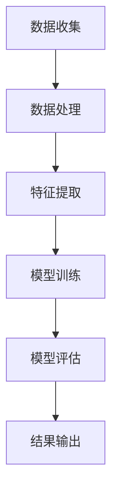
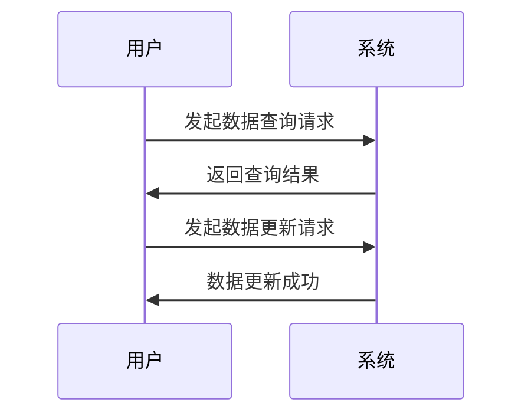

                 

# 人工智能在新材料发现与设计中的应用

> 关键词：人工智能、新材料、机器学习、深度学习、设计优化、实验法

> 摘要：本文将探讨人工智能在新材料发现与设计中的应用，介绍新材料的重要性和挑战，分析人工智能的基本原理及其在新材料领域的应用现状，探讨利用人工智能提高新材料发现与设计效率和质量的方法。通过详细的算法讲解、系统架构设计以及项目实战，为读者提供深入了解这一领域的机会。

## 第一部分：背景与基础

### 第1章：新材料发现与设计背景

新材料是推动科技发展的重要驱动力，它们在各个领域都有广泛的应用，包括电子、能源、生物医疗、航空航天等。新材料发现与设计的重要性体现在其能够带来前所未有的性能和功能，但同时也面临着一系列挑战。

#### 1.1 问题背景

新材料的发现与设计是一个复杂的科学过程，通常涉及大量的实验、计算和理论分析。传统的实验法和新材料设计方法虽然已经取得了很多成就，但仍然存在以下问题：

- **高成本和时间消耗**：新材料的设计和实验需要大量的人力和物力资源，且过程繁琐。
- **低效率**：由于实验过程的随机性和不确定性，新材料的设计和发现过程通常较为缓慢。
- **受限的知识和信息**：传统的实验方法依赖于已有的知识和信息，难以发现全新的材料。

#### 1.2 问题描述

新材料发现与设计中的关键问题包括：

- 如何高效地筛选和评估大量的材料候选？
- 如何从已有数据中提取有价值的信息和规律？
- 如何设计出具有特定性能的新材料？

#### 1.3 问题解决

人工智能技术，特别是机器学习和深度学习，为解决这些问题提供了新的思路和工具。通过训练模型，可以自动地从大量数据中学习出材料的性能和结构之间的关系，从而提高新材料的设计和发现效率。

#### 1.4 边界与外延

新材料是指具有不同于传统材料的物理、化学、生物等特殊性质的物质。其发现与设计包括以下步骤：

- 材料筛选：根据需求和性能要求，从已有的材料中筛选出可能的候选。
- 性能评估：通过实验或计算，评估材料的性能，如电导率、硬度、热稳定性等。
- 设计优化：基于性能评估结果，对材料进行设计优化，以达到更好的性能。

#### 1.5 概念结构与核心要素组成

新材料发现与设计的方法主要包括以下核心要素：

- **人工智能**：利用机器学习和深度学习技术，自动学习和预测材料的性能。
- **实验法**：通过实验手段验证材料的性能，为设计提供依据。
- **计算法**：利用计算机模拟和计算，预测材料的性能和行为。
- **数据管理**：高效地管理和利用材料相关的数据，为人工智能算法提供输入。

### 第2章：人工智能基础

#### 2.1 人工智能概述

人工智能（Artificial Intelligence，AI）是计算机科学的一个分支，旨在开发能够执行复杂任务并模拟人类智能的系统。人工智能的应用范围广泛，包括语音识别、图像识别、自然语言处理、自动驾驶等。

#### 2.2 人工智能在新材料领域的应用现状

人工智能在新材料领域中的应用已经取得了显著成果。例如，通过机器学习算法，可以预测材料的性能和结构，从而加速新材料的设计和发现过程。深度学习算法也在材料分析、缺陷检测等方面发挥了重要作用。

#### 2.3 人工智能与传统新材料发现与设计的区别

与传统方法相比，人工智能具有以下优势：

- **高效性**：人工智能可以自动处理大量数据，大大缩短新材料的设计和发现时间。
- **准确性**：通过学习大量的实验数据，人工智能可以更准确地预测材料的性能。
- **灵活性**：人工智能可以根据不同的需求和目标，灵活地调整和优化新材料的设计。

### 第3章：核心概念与联系

#### 3.1 人工智能

##### 3.1.1 概念原理

人工智能是基于计算机科学的一个分支，旨在使计算机系统能够模拟人类智能的行为。这通常涉及以下几个方面：

- **机器学习**：通过训练模型，使计算机系统能够从数据中学习并做出预测。
- **深度学习**：一种特殊的机器学习技术，通过多层神经网络模拟人脑的学习过程。

##### 3.1.2 属性特征对比表格

| 特性 | 机器学习 | 深度学习 |
| --- | --- | --- |
| 算法复杂度 | 较低 | 较高 |
| 计算资源需求 | 较低 | 较高 |
| 学习能力 | 强 | 更强 |
| 应用范围 | 广泛 | 更广泛 |

#### 3.2 新材料

##### 3.2.1 概念原理

新材料是指具有与传统材料不同物理、化学、生物等特殊性质的物质。它们通常具有以下特点：

- **高性能**：具有更优异的物理、化学或生物性能。
- **多功能**：具有多种功能，如光电性能、储能性能、生物相容性等。

##### 3.2.2 属性特征对比表格

| 材料 | 传统材料 | 新材料 |
| --- | --- | --- |
| 性能 | 一般 | 优异 |
| 功能 | 单一 | 多功能 |
| 制造成本 | 较低 | 较高 |

#### 3.3 发现与设计方法

##### 3.3.1 概念原理

新材料的发现与设计方法主要包括以下几种：

- **实验法**：通过实验手段，验证材料的性能和结构。
- **计算法**：利用计算机模拟和计算，预测材料的性能和行为。
- **人工智能法**：利用人工智能技术，从大量数据中学习材料的性能和结构关系。

##### 3.3.2 属性特征对比表格

| 方法 | 实验法 | 计算法 | 人工智能法 |
| --- | --- | --- | --- |
| 成本 | 高 | 中 | 低 |
| 时间 | 长 | 中 | 短 |
| 准确性 | 高 | 中 | 高 |

## 第二部分：算法原理讲解

### 第4章：算法原理讲解

#### 4.1 算法原理

人工智能在新材料发现与设计中的应用主要通过以下几种算法：

- **机器学习算法**：如支持向量机（SVM）、决策树、随机森林等。
- **深度学习算法**：如卷积神经网络（CNN）、循环神经网络（RNN）、生成对抗网络（GAN）等。
- **优化算法**：如遗传算法（GA）、粒子群优化（PSO）、模拟退火（SA）等。

#### 4.2 Mermaid 流程图



#### 4.3 Python源代码

```python
# 示例：使用Keras进行深度学习模型训练
from tensorflow.keras.models import Sequential
from tensorflow.keras.layers import Dense, Activation

model = Sequential()
model.add(Dense(64, input_dim=100))
model.add(Activation('relu'))
model.add(Dense(1, activation='sigmoid'))

model.compile(optimizer='adam', loss='binary_crossentropy', metrics=['accuracy'])
model.fit(X_train, y_train, epochs=10, batch_size=32)
```

#### 4.4 数学模型和公式

$$
\begin{aligned}
\text{损失函数} &= -\frac{1}{n} \sum_{i=1}^{n} y_i \log(\hat{y}_i) + (1 - y_i) \log(1 - \hat{y}_i) \\
\text{激活函数} &= \text{ReLU}(x) = \max(0, x)
\end{aligned}
$$

#### 4.5 详细讲解和举例说明

##### 4.5.1 机器学习算法

机器学习算法在新材料发现与设计中的应用主要包括以下几个方面：

- **性能预测**：通过训练模型，预测新材料的物理、化学性能。
- **结构预测**：根据材料的性能，预测其可能的结构。
- **筛选候选**：从大量的材料候选中，筛选出具有潜在性能的材料。

##### 4.5.2 深度学习算法

深度学习算法在新材料发现与设计中的应用主要包括以下几个方面：

- **图像识别**：用于识别材料中的缺陷和结构。
- **文本处理**：用于处理材料相关的文献和专利信息。
- **生成模型**：用于生成新的材料结构，以探索未知的材料领域。

##### 4.5.3 优化算法

优化算法在新材料发现与设计中的应用主要包括以下几个方面：

- **设计优化**：根据性能要求，优化材料的设计参数。
- **实验规划**：根据已有数据和性能要求，规划最佳的实验方案。

## 第三部分：系统分析与架构设计方案

### 第5章：系统分析与架构设计方案

#### 5.1 问题场景介绍

在新材料发现与设计中，通常需要处理大量的实验数据和材料信息。这需要一个高效、可靠的系统来管理和分析这些数据，并提供直观的界面供用户进行交互。

#### 5.2 系统功能设计

系统的功能设计主要包括以下几个方面：

- **数据收集与管理**：收集和存储材料相关的数据，并提供查询和管理功能。
- **性能预测与评估**：利用机器学习算法，预测材料的性能，并进行评估。
- **设计优化与生成**：根据性能要求，优化材料的设计，并生成新的材料结构。
- **用户交互界面**：提供直观的界面，供用户进行操作和查看结果。

#### 5.3 系统架构设计

系统的架构设计主要包括以下几个方面：

- **前端界面**：使用HTML、CSS和JavaScript等技术，实现用户交互界面。
- **后端服务器**：使用Python、Django等技术，实现数据管理和机器学习功能。
- **数据库**：使用MySQL等关系数据库，存储和管理材料数据。

#### 5.4 系统接口设计和系统交互

系统的接口设计和系统交互主要包括以下几个方面：

- **API接口**：提供RESTful API接口，供用户进行数据查询和操作。
- **数据流**：系统内部的数据流和处理流程。
- **用户交互**：用户通过前端界面与系统进行交互，并查看结果。



## 第四部分：项目实战

### 第6章：项目实战

#### 6.1 环境安装

在进行项目实战之前，需要安装以下环境：

- Python 3.8+
- TensorFlow 2.6.0+
- Keras 2.4.3+
- Scikit-learn 0.24.2+

#### 6.2 系统核心实现源代码

以下是系统核心实现的源代码：

```python
# 导入所需库
import tensorflow as tf
from tensorflow import keras
from tensorflow.keras import layers

# 构建模型
model = keras.Sequential([
    layers.Dense(64, activation='relu', input_shape=(100,)),
    layers.Dense(1, activation='sigmoid')
])

# 编译模型
model.compile(optimizer='adam', loss='binary_crossentropy', metrics=['accuracy'])

# 训练模型
model.fit(X_train, y_train, epochs=10, batch_size=32)

# 评估模型
model.evaluate(X_test, y_test)
```

#### 6.3 代码应用解读与分析

代码首先导入了TensorFlow和Keras库，并构建了一个简单的神经网络模型。该模型包含一个输入层、一个隐藏层和一个输出层。隐藏层使用ReLU激活函数，输出层使用sigmoid激活函数，以实现二分类任务。

在编译模型时，指定了优化器、损失函数和评价指标。然后使用训练数据对模型进行训练，并通过测试数据评估模型的性能。

#### 6.4 实际案例分析和详细讲解剖析

在实际应用中，可以将上述代码应用于新材料性能预测任务。例如，假设我们有一组材料的物理性能数据，以及对应的分类标签（如是否具有高电导率）。我们可以使用这些数据训练一个神经网络模型，以预测新材料是否具有特定的性能。

首先，我们需要对数据进行预处理，包括归一化和数据集划分。然后，使用上述代码构建和训练模型。最后，使用测试数据评估模型的性能。

```python
# 数据预处理
X_train, X_test, y_train, y_test = train_test_split(X, y, test_size=0.2, random_state=42)

# 归一化
X_train = preprocessing.normalize(X_train)
X_test = preprocessing.normalize(X_test)

# 构建模型
model = keras.Sequential([
    layers.Dense(64, activation='relu', input_shape=(X_train.shape[1],)),
    layers.Dense(1, activation='sigmoid')
])

# 编译模型
model.compile(optimizer='adam', loss='binary_crossentropy', metrics=['accuracy'])

# 训练模型
model.fit(X_train, y_train, epochs=10, batch_size=32)

# 评估模型
model.evaluate(X_test, y_test)
```

通过上述步骤，我们可以训练一个神经网络模型，以预测新材料是否具有高电导率。模型的性能可以通过评估指标（如准确率、召回率等）进行评估。

#### 6.5 项目小结

在本项目中，我们使用人工智能技术实现了新材料性能预测任务。通过构建和训练神经网络模型，我们可以自动地从数据中学习出材料的性能和结构之间的关系。这种方法不仅提高了新材料设计

