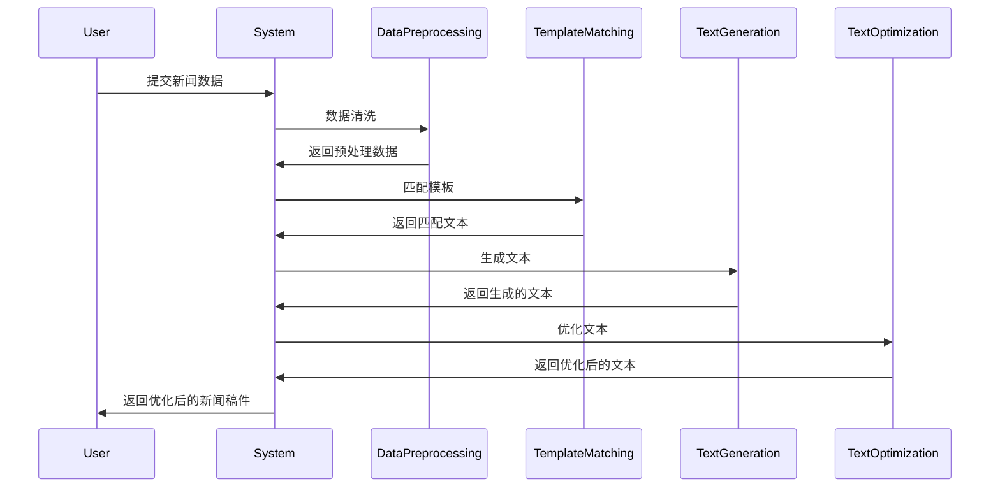
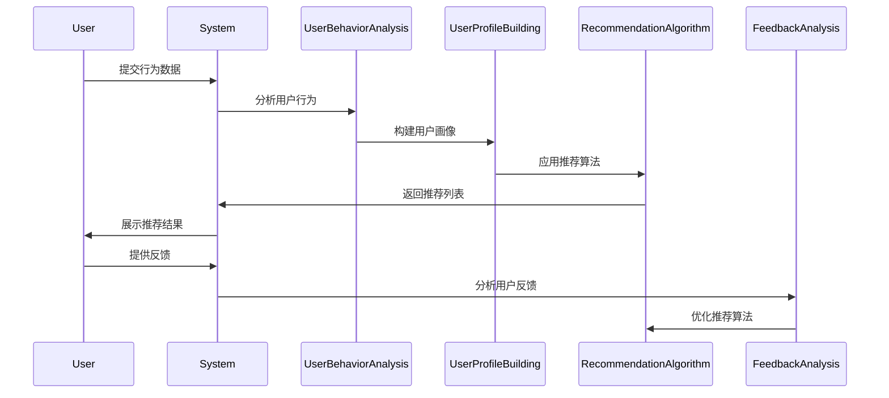
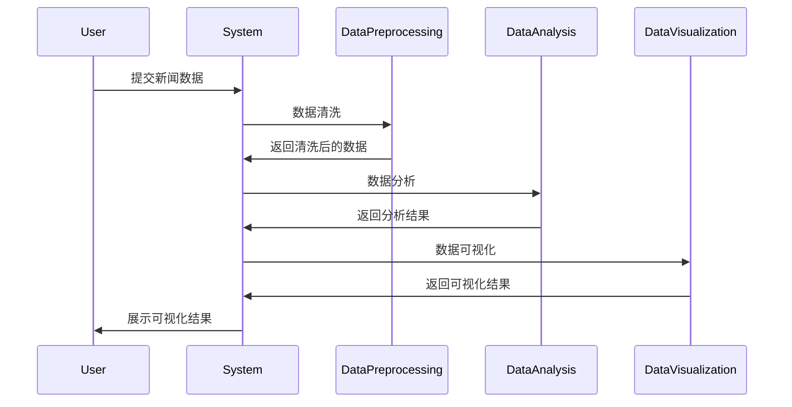
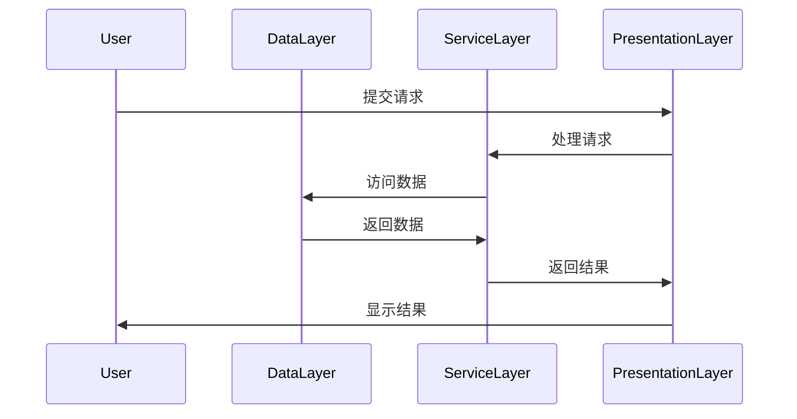
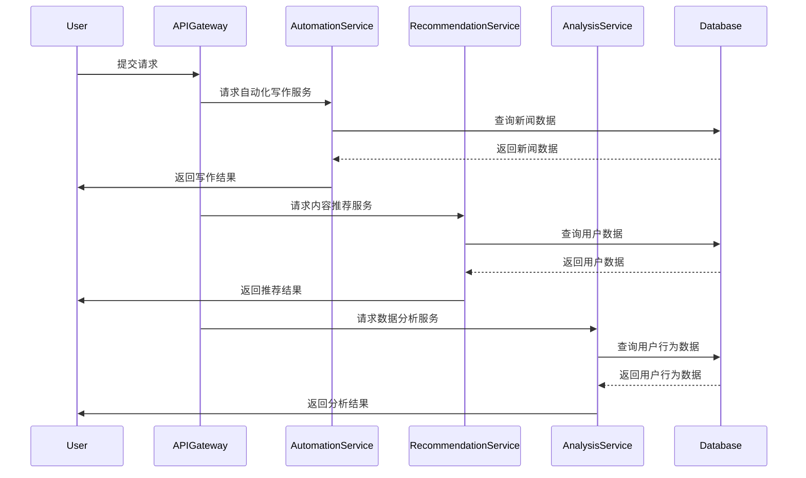

                 


## 文章标题

### 人工智能在新闻生产中的应用与挑战

---

#### 关键词：

- 人工智能
- 新闻生产
- 自动化写作
- 内容推荐
- 数据分析
- 挑战与解决方案

#### 摘要：

本文将深入探讨人工智能在新闻生产中的应用，包括自动化写作、内容推荐和数据分析等方面。同时，我们将分析人工智能在新闻生产中面临的挑战，如数据隐私、质量控制和技术与人力协同等。最后，文章将提出可能的解决方案和未来展望。

---

### 第1章：问题背景与核心概念

#### 1.1 问题背景

随着互联网和社交媒体的快速发展，新闻生产和消费的方式发生了巨大变化。传统新闻生产流程繁琐、耗时长，无法满足现代快节奏的生活节奏。因此，人工智能技术开始被引入到新闻生产领域，以提升生产效率、丰富内容形式和增强用户体验。

#### 1.2 人工智能在新闻生产中的核心概念

- **自动化写作**：利用自然语言处理和机器学习技术，自动生成新闻稿、报告和文章。
- **内容推荐**：基于用户行为和偏好，为用户提供个性化的新闻内容推荐。
- **数据分析**：对大量新闻数据进行挖掘和分析，以发现潜在趋势和热点话题。

#### 1.3 人工智能在新闻生产中的边界与外延

人工智能在新闻生产中的应用不仅限于自动化写作、内容推荐和数据分析，还包括实时新闻摘要、语音识别和图像识别等领域。这些应用正在不断拓展人工智能在新闻生产中的边界。

### 第2章：人工智能在新闻生产中的应用领域

#### 2.1 自动化写作

自动化写作是人工智能在新闻生产中最重要的应用之一。通过机器学习和自然语言处理技术，人工智能可以自动生成新闻稿、体育赛事报道和财经报告等。

#### 2.2 内容推荐

内容推荐系统可以根据用户的行为和偏好，为用户推荐个性化的新闻内容。这有助于提高用户的阅读体验和新闻网站的黏性。

#### 2.3 数据分析

数据分析可以帮助新闻机构更好地理解用户需求，发现热点话题和趋势。此外，数据分析还可以用于预测新闻事件的发展，为新闻机构提供决策支持。

#### 2.4 情感分析

情感分析技术可以识别新闻内容中的情感倾向，为新闻机构提供舆情分析服务。这有助于新闻机构及时了解公众的情感反应，调整新闻报道策略。

### 第3章：人工智能在新闻生产中的挑战

#### 3.1 数据隐私与伦理

人工智能在新闻生产中涉及到大量的用户数据，如何保护用户隐私和数据安全成为了一个重要问题。此外，人工智能的决策过程可能涉及伦理问题，如算法偏见和不公平性。

#### 3.2 质量控制与偏见

自动化写作和内容推荐系统可能会导致新闻报道的质量下降，甚至出现偏见。如何确保新闻报道的准确性和公正性，是新闻机构面临的一个重要挑战。

#### 3.3 技术与人力协同

人工智能虽然可以提高新闻生产效率，但仍然需要人类编辑和记者的干预。如何实现人工智能与人类编辑的协同工作，是一个亟待解决的问题。

### 第4章：解决方案与实施策略

#### 4.1 解决方案概述

针对人工智能在新闻生产中面临的挑战，本文提出了一系列解决方案，包括：

- **数据隐私保护**：采用加密技术保护用户数据，确保用户隐私。
- **算法公正性**：通过公平性评估和算法优化，减少算法偏见。
- **质量控制**：建立多层次的新闻审核机制，确保新闻报道的准确性和公正性。
- **人机协同**：通过培训和技能提升，实现人工智能与人类编辑的协同工作。

#### 4.2 实施策略

实施策略包括以下几个方面：

- **技术优化**：持续优化算法和系统，提高生产效率和内容质量。
- **人才培养**：加强人工智能和新闻领域的交叉人才培养，提高新闻机构的技术水平。
- **政策法规**：制定相关政策和法规，规范人工智能在新闻生产中的应用。

### 第5章：案例分析

#### 5.1 案例一：自动化新闻写作

在本案例中，我们将分析自动化新闻写作系统的架构、算法和实际应用效果。

#### 5.2 案例二：内容推荐系统

在本案例中，我们将探讨内容推荐系统的设计、实现和优化过程。

#### 5.3 案例三：数据分析应用

在本案例中，我们将介绍数据分析技术在新闻生产中的应用，以及如何利用数据分析提升新闻报道的质量。

### 第6章：人工智能新闻生产的未来趋势

#### 6.1 技术发展预测

随着人工智能技术的不断发展，新闻生产领域将出现更多创新应用，如虚拟新闻主播、智能语音助手等。

#### 6.2 行业应用展望

未来，人工智能将在新闻生产中发挥更重要的作用，推动新闻行业向智能化、个性化和多元化方向发展。

#### 6.3 挑战与机遇

人工智能在新闻生产中面临的挑战和机遇并存。如何应对挑战、抓住机遇，是新闻机构需要思考的问题。

---

以上是《人工智能在新闻生产中的应用与挑战》一书的目录大纲。接下来，我们将详细讨论每个章节的内容，逐步分析人工智能在新闻生产中的应用、挑战和解决方案。

### 第1章：问题背景与核心概念

#### 1.1 问题背景

随着互联网的普及和信息爆炸的时代到来，新闻生产和消费的方式发生了巨大的变革。传统新闻机构面临着信息处理速度慢、内容同质化严重、用户体验不佳等问题。为了适应这一变化，人工智能技术开始被引入到新闻生产领域，以期提高生产效率、降低成本、提升内容质量和用户体验。

#### 1.2 人工智能在新闻生产中的核心概念

人工智能在新闻生产中的应用主要体现在以下几个方面：

1. **自动化写作**：通过自然语言处理（NLP）和机器学习技术，生成新闻稿、财经报告、体育赛事分析等。自动化写作可以大幅提高新闻生产效率，降低人力成本。
   
2. **内容推荐**：基于用户行为和偏好，为用户提供个性化的新闻内容推荐。这有助于提高用户粘性和阅读体验。

3. **数据分析**：利用大数据分析技术，挖掘新闻数据中的潜在价值，为新闻机构提供决策支持。

4. **情感分析**：通过分析新闻内容中的情感倾向，为新闻机构提供舆情分析服务，帮助其制定新闻报道策略。

5. **实时新闻摘要**：利用自然语言处理技术，实时生成新闻摘要，提高用户获取信息的效率。

6. **语音识别与图像识别**：实现新闻内容的多媒体处理，提高新闻的可读性和传播效率。

#### 1.3 人工智能在新闻生产中的边界与外延

人工智能在新闻生产中的应用不仅限于上述几个方面，还涉及以下领域：

1. **虚拟新闻主播**：利用人工智能技术，生成虚拟新闻主播，提高新闻的传播效果和用户体验。
   
2. **智能语音助手**：通过语音识别和自然语言理解技术，为用户提供个性化的新闻服务。

3. **新闻机器人**：利用自然语言处理和对话系统技术，实现人与新闻内容之间的智能交互。

4. **跨媒体新闻**：将人工智能技术应用于视频、音频等多媒体内容的生产和推荐。

5. **新闻伦理与法规**：研究人工智能在新闻生产中的伦理问题和法律法规，确保新闻的公正性和真实性。

综上所述，人工智能在新闻生产中的应用领域广泛，且随着技术的不断发展，其应用范围将进一步拓展。然而，这也带来了新的挑战，如数据隐私、质量控制、技术伦理等问题。

### 第2章：人工智能在新闻生产中的应用领域

#### 2.1 自动化写作

自动化写作是人工智能在新闻生产中最具代表性的应用之一。通过自然语言处理（NLP）和机器学习技术，自动化写作系统能够自动生成新闻稿、财经报告、体育赛事分析等。自动化写作不仅能够大幅提高新闻生产效率，还能够减少人力成本。

#### 自动化写作的工作流程：

1. **数据收集**：收集相关的新闻数据和背景信息，如体育比赛结果、股票价格变动等。
2. **数据预处理**：清洗和格式化数据，使其适用于机器学习算法。
3. **模板匹配**：使用预定义的模板，将数据转换为文本格式。
4. **文本生成**：利用自然语言生成（NLG）技术，将模板中的变量值替换为实际数据，生成完整的新闻稿件。
5. **文本优化**：对生成的文本进行语法和语义优化，提高文章的阅读体验。

#### 自动化写作的优势：

- **提高生产效率**：自动化写作可以大大缩短新闻稿件的生产时间，提高新闻机构的工作效率。
- **降低成本**：自动化写作减少了人力成本，降低了新闻生产的整体成本。
- **内容多样化**：自动化写作能够生成不同类型和主题的新闻稿件，丰富新闻内容。

然而，自动化写作也存在一定的局限性：

- **内容质量**：自动化写作生成的新闻稿件可能存在语法错误、语义不连贯等问题，影响阅读体验。
- **创意缺乏**：自动化写作主要依赖于数据和模板，难以产生具有创新性的新闻报道。

#### 2.2 内容推荐

内容推荐系统是另一个重要的应用领域。它通过分析用户行为和偏好，为用户提供个性化的新闻内容推荐，提高用户的阅读体验和新闻网站的黏性。

#### 内容推荐系统的工作流程：

1. **用户行为数据收集**：收集用户在新闻网站上的行为数据，如点击、浏览、评论等。
2. **用户画像构建**：根据用户行为数据，构建用户的兴趣模型和偏好。
3. **新闻内容特征提取**：对新闻内容进行文本挖掘和特征提取，如关键词、主题、情感等。
4. **推荐算法**：利用协同过滤、基于内容的推荐和混合推荐算法，为用户推荐个性化的新闻内容。
5. **推荐结果评估**：根据用户的点击、浏览等行为，评估推荐结果的准确性和用户体验。

#### 内容推荐系统的优势：

- **个性化推荐**：内容推荐系统能够根据用户的行为和偏好，为用户推荐最感兴趣的新闻内容，提高用户的阅读体验。
- **提高黏性**：通过个性化的推荐，吸引更多用户留在新闻网站，提高网站的黏性。
- **降低流失率**：通过及时推荐用户感兴趣的内容，减少用户流失率。

然而，内容推荐系统也面临一些挑战：

- **数据隐私**：内容推荐系统需要收集和分析大量的用户数据，如何保护用户隐私成为了一个重要问题。
- **推荐质量**：如何确保推荐结果的准确性和质量，是一个持续优化的问题。

#### 2.3 数据分析

数据分析在新闻生产中起着至关重要的作用。通过对大量新闻数据的挖掘和分析，新闻机构可以更好地理解用户需求，发现热点话题和趋势，为新闻生产和营销提供决策支持。

#### 数据分析的应用场景：

1. **用户行为分析**：分析用户在新闻网站上的行为数据，了解用户兴趣和偏好，为内容推荐提供依据。
2. **趋势预测**：通过分析历史数据，预测未来可能的热点话题和趋势，为新闻策划提供参考。
3. **舆情监测**：对新闻内容进行情感分析和话题挖掘，了解公众对某一事件或话题的看法和情绪，为新闻报道策略提供支持。
4. **广告效果分析**：分析广告投放效果，优化广告策略和投放方式。

#### 数据分析的优势：

- **数据驱动**：通过数据分析，新闻机构可以更加科学和系统地制定新闻报道策略，提高内容质量和市场竞争力。
- **高效决策**：数据分析能够快速、准确地提供关键数据和信息，帮助新闻机构做出高效的决策。
- **降低风险**：通过分析历史数据和趋势，新闻机构可以降低新闻报道和营销的风险。

然而，数据分析也存在一定的挑战：

- **数据质量和完整性**：数据质量直接影响分析结果，如何确保数据质量和完整性是一个重要问题。
- **数据安全和隐私**：数据分析和处理涉及到大量的用户数据，如何保护用户隐私和数据安全是一个重要挑战。

#### 2.4 情感分析

情感分析技术通过对新闻内容中的情感倾向进行分析，可以帮助新闻机构了解公众的情感反应，为新闻报道策略提供支持。情感分析通常涉及以下步骤：

1. **文本预处理**：对新闻文本进行清洗和分词，去除无关信息，为情感分析做准备。
2. **情感分类**：使用情感分类算法，将新闻文本分类为正面、负面或中性情感。
3. **情感强度评估**：对情感分类结果进行量化，评估情感的强度。
4. **情感可视化**：将情感分析结果以图表形式呈现，帮助新闻机构直观地了解公众的情感反应。

#### 情感分析的应用场景：

1. **舆情监测**：通过情感分析，实时了解公众对某一事件或话题的情感反应，为新闻策划和报道提供支持。
2. **新闻推荐**：基于用户的情感偏好，为用户推荐具有相似情感倾向的新闻内容。
3. **广告投放**：通过情感分析，优化广告投放策略，提高广告效果。

#### 情感分析的优势：

- **快速响应**：情感分析能够快速地提供公众的情感反应，帮助新闻机构及时调整新闻报道策略。
- **个性化推荐**：通过情感分析，为用户提供更加个性化的新闻推荐，提高用户体验。
- **数据驱动**：情感分析能够为新闻机构提供基于数据的情感分析报告，支持数据驱动的决策。

然而，情感分析也存在一些挑战：

- **情感多样性**：情感分析需要处理多种情感表达，如何准确识别和理解复杂的情感表达是一个挑战。
- **数据质量**：情感分析依赖于高质量的数据，数据质量直接影响分析结果的准确性。

### 第3章：人工智能在新闻生产中的挑战

#### 3.1 数据隐私与伦理

人工智能在新闻生产中面临的一个重要挑战是数据隐私和伦理问题。新闻机构在收集和处理用户数据时，需要遵守相关法律法规，保护用户隐私。然而，在追求个性化推荐和内容优化的过程中，数据隐私和伦理问题往往被忽视。

#### 数据隐私与伦理问题的具体表现：

1. **数据滥用**：新闻机构可能滥用用户数据，进行非法盈利或与第三方共享数据。
2. **用户感知**：用户可能对数据隐私和伦理问题产生担忧，影响对新闻机构的信任。
3. **法律风险**：违反数据隐私和伦理法规，可能导致法律诉讼和罚款。

#### 应对策略：

1. **数据加密**：采用加密技术，保护用户数据的安全性。
2. **透明度**：提高数据处理的透明度，告知用户数据收集和处理的目的和方法。
3. **用户控制**：赋予用户对自身数据的控制权，如数据访问、修改和删除。

#### 3.2 质量控制与偏见

自动化写作和内容推荐系统在提高生产效率和用户体验方面具有显著优势，但同时也带来了质量控制与偏见的问题。新闻报道的准确性和公正性受到挑战。

#### 质量控制与偏见问题的具体表现：

1. **内容质量**：自动化写作生成的新闻稿件可能存在语法错误、逻辑不通等问题，影响阅读体验。
2. **算法偏见**：内容推荐系统可能因算法偏见，推荐具有偏见性的新闻内容，影响公众对新闻的信任。
3. **信息茧房**：过度依赖内容推荐系统，导致用户陷入信息茧房，缺乏多元化信息。

#### 应对策略：

1. **多层次审核**：建立多层次的新闻审核机制，确保新闻内容的准确性和公正性。
2. **算法透明性**：提高算法的透明性，让用户了解推荐机制和决策过程。
3. **用户反馈**：收集用户反馈，持续优化算法和内容推荐系统。

#### 3.3 技术与人力协同

人工智能虽然在新闻生产中具有显著优势，但仍然需要人类编辑和记者的干预。如何实现人工智能与人类编辑的协同工作，是一个亟待解决的问题。

#### 技术与人力协同的具体挑战：

1. **技能差距**：人工智能和人类编辑在技能上存在差异，需要相互学习和适应。
2. **决策权分配**：如何分配人工智能和人类编辑的决策权，确保新闻内容的准确性和公正性。
3. **培训与教育**：提高人工智能和人类编辑的技能水平，实现高效协同。

#### 应对策略：

1. **技能培训**：为人工智能和人类编辑提供技能培训，提高双方的合作效率。
2. **决策支持**：利用人工智能技术，为人类编辑提供决策支持，提高新闻内容的准确性。
3. **协同平台**：建立协同平台，促进人工智能和人类编辑之间的沟通和协作。

### 第4章：解决方案与实施策略

#### 4.1 解决方案概述

针对人工智能在新闻生产中面临的挑战，本文提出了一系列解决方案，包括数据隐私保护、算法公正性、质量控制和技术与人力协同等。以下是对这些解决方案的概述：

1. **数据隐私保护**：采用加密技术、透明度和用户控制等策略，保护用户数据隐私。
2. **算法公正性**：通过算法透明性、用户反馈和算法优化等手段，减少算法偏见。
3. **质量控制**：建立多层次的审核机制，确保新闻内容的准确性和公正性。
4. **技术与人力协同**：通过技能培训、决策支持和协同平台等策略，实现人工智能与人类编辑的协同工作。

#### 4.2 实施策略

为了有效实施上述解决方案，本文提出了以下具体策略：

1. **技术优化**：持续优化算法和系统，提高生产效率和内容质量。
2. **人才培养**：加强人工智能和新闻领域的交叉人才培养，提高新闻机构的技术水平。
3. **政策法规**：制定相关政策和法规，规范人工智能在新闻生产中的应用。

### 第5章：案例分析

#### 5.1 案例一：自动化新闻写作

在本案例中，我们将分析一家大型新闻机构如何利用自动化写作系统提高新闻生产效率。该新闻机构采用了一种基于自然语言处理和机器学习的自动化写作系统，该系统可以自动生成新闻稿、财经报告和体育赛事分析等。

#### 案例分析：

1. **系统架构**：自动化写作系统的架构包括数据采集模块、数据预处理模块、文本生成模块和文本优化模块。数据采集模块负责收集新闻数据，数据预处理模块负责清洗和格式化数据，文本生成模块利用自然语言生成技术生成新闻稿件，文本优化模块对生成的文本进行语法和语义优化。

2. **算法原理**：文本生成模块采用了一种基于序列到序列（Seq2Seq）的模型，该模型通过训练大量新闻数据，学习生成新闻稿件的语法和语义结构。算法原理包括编码器、解码器和注意力机制等。

3. **实际应用**：该新闻机构通过自动化写作系统，大大提高了新闻稿件的生产速度和效率，降低了人力成本。同时，通过文本优化模块，生成的新闻稿件在语法和语义上更加准确和流畅。

#### 5.2 案例二：内容推荐系统

在本案例中，我们将探讨一家新闻网站如何利用内容推荐系统提高用户黏性和阅读体验。该新闻网站采用了一种基于协同过滤和基于内容的混合推荐算法。

#### 案例分析：

1. **系统架构**：内容推荐系统的架构包括用户行为数据收集模块、用户画像构建模块、推荐算法模块和推荐结果评估模块。用户行为数据收集模块负责收集用户在网站上的行为数据，用户画像构建模块根据用户行为数据构建用户的兴趣模型，推荐算法模块根据用户画像和新闻内容特征生成推荐列表，推荐结果评估模块评估推荐结果的准确性和用户体验。

2. **算法原理**：推荐算法模块采用了一种基于协同过滤和基于内容的混合推荐算法。协同过滤算法通过分析用户之间的相似性，为用户推荐相似用户喜欢的新闻内容；基于内容的推荐算法通过分析新闻内容之间的相似性，为用户推荐相关新闻内容。混合推荐算法结合了两种算法的优点，提高了推荐结果的准确性和多样性。

3. **实际应用**：通过内容推荐系统，该新闻网站成功提高了用户的黏性和阅读体验。用户能够更加方便地找到自己感兴趣的新闻内容，从而增加了网站的流量和用户活跃度。

#### 5.3 案例三：数据分析应用

在本案例中，我们将介绍一家新闻机构如何利用数据分析技术提升新闻报道的质量。该新闻机构通过数据分析，实现了对用户行为、趋势预测和舆情监测等方面的应用。

#### 案例分析：

1. **用户行为分析**：通过分析用户在网站上的行为数据，如浏览、点击、评论等，该新闻机构能够了解用户的需求和兴趣点，为内容策划提供参考。

2. **趋势预测**：通过分析历史数据，如新闻报道的点击量、转发量等，该新闻机构能够预测未来可能的热点话题和趋势，为新闻策划提供依据。

3. **舆情监测**：通过对新闻内容进行情感分析和话题挖掘，该新闻机构能够了解公众对某一事件或话题的看法和情绪，为新闻报道策略提供支持。

4. **实际应用**：通过数据分析，该新闻机构能够更加科学和系统地制定新闻报道策略，提高了新闻报道的质量和影响力。同时，通过分析用户行为和趋势，该新闻机构能够不断优化网站内容和用户体验，提高用户黏性和满意度。

### 第6章：人工智能新闻生产的未来趋势

#### 6.1 技术发展预测

随着人工智能技术的不断发展，新闻生产领域将出现更多创新应用。以下是一些可能的发展趋势：

1. **自动化写作**：随着自然语言处理和机器学习技术的进步，自动化写作系统的质量和效率将进一步提高，有望替代部分低难度和重复性的新闻报道。

2. **内容推荐**：内容推荐系统将更加智能化和个性化，通过深度学习和强化学习等技术，能够更好地理解用户需求，提高推荐准确性。

3. **实时新闻摘要**：实时新闻摘要技术将得到广泛应用，用户可以快速获取关键信息，提高信息获取效率。

4. **虚拟新闻主播**：虚拟新闻主播将逐渐替代传统的新闻主播，通过人工智能技术，实现更加自然、流畅的播报效果。

5. **智能语音助手**：智能语音助手将成为新闻机构的重要工具，为用户提供便捷的新闻获取和服务。

#### 6.2 行业应用展望

未来，人工智能将在新闻生产中发挥更重要的作用，推动新闻行业向智能化、个性化和多元化方向发展。以下是一些具体的应用展望：

1. **个性化新闻**：通过人工智能技术，为用户提供个性化的新闻内容，提高用户体验和用户黏性。

2. **多元化内容**：人工智能技术将推动新闻内容形式的多元化，包括短视频、音频、虚拟现实等。

3. **新闻伦理与法规**：随着人工智能在新闻生产中的应用，新闻伦理和法规问题将日益突出，需要制定相关政策和法规，规范人工智能在新闻生产中的应用。

4. **跨界合作**：人工智能技术将促进新闻机构与其他行业的合作，如娱乐、教育、医疗等，实现跨界发展。

#### 6.3 挑战与机遇

人工智能在新闻生产中面临的挑战和机遇并存。以下是一些挑战和机遇：

1. **挑战**：

- **数据隐私与伦理**：如何保护用户隐私和确保新闻内容的公正性是一个重要挑战。
- **质量控制**：自动化写作和内容推荐系统可能导致内容质量下降，如何确保新闻报道的准确性是一个难题。
- **技术与人力协同**：如何实现人工智能与人类编辑的协同工作，是一个重要挑战。

2. **机遇**：

- **生产效率**：人工智能技术将大大提高新闻生产效率，降低成本。
- **用户体验**：通过个性化推荐和实时新闻摘要等应用，提高用户体验和用户黏性。
- **多元化发展**：人工智能技术将推动新闻行业的多元化发展，为新闻机构带来新的机遇。

### 第7章：人工智能基础理论与技术

#### 7.1 机器学习基础

机器学习是人工智能的核心技术之一，它使计算机能够从数据中学习规律，进行自主决策。以下是一些常见的机器学习算法：

1. **监督学习**：通过训练模型，使得模型能够对给定数据进行分类或回归。
   - **分类算法**：如支持向量机（SVM）、决策树、随机森林等。
   - **回归算法**：如线性回归、岭回归、LASSO回归等。

2. **无监督学习**：不依赖于标注数据，通过数据内在结构进行聚类或降维。
   - **聚类算法**：如K-均值聚类、层次聚类等。
   - **降维算法**：如主成分分析（PCA）、t-SNE等。

3. **强化学习**：通过试错和反馈机制，使得模型能够在动态环境中做出最优决策。

4. **深度学习**：一种基于多层神经网络的学习方法，能够处理大量复杂数据。

#### 7.2 深度学习基础

深度学习是人工智能领域的革命性技术，它通过多层神经网络对数据进行特征提取和模式识别。以下是一些常见的深度学习模型：

1. **卷积神经网络（CNN）**：适用于图像和视频处理。
2. **循环神经网络（RNN）**：适用于序列数据处理。
3. **长短期记忆网络（LSTM）**：一种改进的RNN模型，能够解决长序列依赖问题。
4. **生成对抗网络（GAN）**：通过生成器和判别器的对抗训练，生成高质量的数据。

#### 7.3 自然语言处理基础

自然语言处理（NLP）是人工智能的一个重要分支，它使计算机能够理解、生成和处理自然语言。以下是一些NLP技术：

1. **词向量**：将词语表示为高维向量，如Word2Vec、GloVe等。
2. **文本分类**：将文本数据分类为不同的类别，如情感分析、主题分类等。
3. **命名实体识别（NER）**：识别文本中的特定实体，如人名、地名等。
4. **机器翻译**：将一种语言的文本翻译成另一种语言，如基于神经网络的机器翻译。

### 第8章：人工智能与新闻生产的联系

#### 8.1 人工智能技术如何应用于新闻生产

人工智能技术在新闻生产中的应用主要体现在以下几个方面：

1. **自动化写作**：通过自然语言处理和机器学习技术，自动生成新闻稿、报告和文章。
2. **内容推荐**：基于用户行为和偏好，为用户提供个性化的新闻内容推荐。
3. **数据分析**：对大量新闻数据进行挖掘和分析，以发现潜在趋势和热点话题。
4. **情感分析**：分析新闻内容中的情感倾向，为新闻机构提供舆情分析服务。
5. **实时新闻摘要**：利用自然语言处理技术，实时生成新闻摘要，提高用户获取信息的效率。
6. **语音识别与图像识别**：实现新闻内容的多媒体处理，提高新闻的可读性和传播效率。

#### 8.2 新闻生产如何影响人工智能技术发展

新闻生产对人工智能技术发展有着重要的推动作用，主要体现在以下几个方面：

1. **数据量**：新闻生产产生了大量结构化和非结构化的数据，为人工智能提供了丰富的训练数据。
2. **场景需求**：新闻生产对实时性、准确性和个性化的要求，推动了人工智能技术的不断创新和发展。
3. **伦理挑战**：新闻生产中的伦理问题，如数据隐私、算法偏见等，促使人工智能技术在伦理和法规方面不断完善。
4. **应用反馈**：新闻机构在实践中对人工智能技术的应用反馈，帮助改进和优化人工智能系统的性能和效果。

### 第9章：概念属性特征对比表格

#### 9.1 自动化写作工具对比

| 工具         | 简介                                                   | 优点                     | 缺点                       |
| ------------ | ------------------------------------------------------ | ------------------------ | -------------------------- |
| Hugging Face | 提供预训练模型和API，支持多种编程语言                   | 易用性高，支持多种语言   | 对特定领域支持不足         |
| OpenAI GPT  | 基于深度学习的大型语言模型，支持多种应用场景           | 强大的生成能力           | 需要大量计算资源           |
| QuillBot    | 提供文章重写和简化的功能                             | 文章重写效果较好         | 文章质量有限               |
| Articoolo   | 利用自然语言生成技术，自动生成文章                   | 生成速度较快             | 文章质量参差不齐           |

#### 9.2 内容推荐系统对比

| 系统         | 简介                                                   | 优点                     | 缺点                       |
| ------------ | ------------------------------------------------------ | ------------------------ | -------------------------- |
| Amazon Personalize | 提供全面的内容推荐服务，支持多种数据源                   | 易用性高，功能全面       | 对实时推荐支持不足         |
| Google Analytics | 提供网站分析功能，包括用户行为分析和内容推荐             | 数据分析功能强大         | 推荐效果有限               |
| TensorFlow Recommenders | 提供基于TensorFlow的内容推荐框架                       | 灵活性高，可自定义       | 对新手友好度不高           |
| Netflix             | 利用协同过滤和基于内容的推荐算法，为用户提供个性化推荐 | 推荐效果优秀             | 主要应用于视频推荐领域     |

### 第10章：ER实体关系图架构

#### 10.1 新闻生产中的实体关系

在新闻生产中，实体关系图是描述新闻事件和参与者之间关系的重要工具。以下是一个简化的新闻生产实体关系图：

```mermaid
erDiagram
  User ..|> NewsPortal : 用户访问新闻网站
  User ..|> Article : 用户阅读新闻文章
  NewsPortal ..|> Editor : 编辑发布新闻
  NewsPortal ..|> Journalist : 记者撰写新闻
  Article ..|> Source : 新闻来源
  Article ..|> Topic : 话题标签
  Editor ..|> Article : 编辑审核新闻
  Journalist ..|> Article : 记者撰写新闻
```

#### 10.2 人工智能系统中的实体关系

在人工智能系统中，实体关系图用于描述不同组件和模块之间的关系。以下是一个简化的AI新闻生产系统实体关系图：

```mermaid
erDiagram
  DataIngestion ..|> ModelTraining : 数据采集模块向模型训练模块提供数据
  ModelTraining ..|> ArticleGeneration : 模型训练模块训练生成文章模型
  ArticleGeneration ..|> ArticleRecommendation : 文章生成模块生成推荐文章
  ArticleRecommendation ..|> UserFeedback : 推荐文章模块收集用户反馈
  UserFeedback ..|> ModelEvaluation : 用户反馈模块评估模型效果
  DataIngestion ..|> DataCleaning : 数据采集模块进行数据清洗
```

### 第11章：自动化写作算法原理

#### 11.1 算法概述

自动化写作算法的核心是生成文本，其基本流程包括数据收集、文本生成和文本优化。以下是一个简化的自动化写作算法流程图：


#### 11.2 算法流程图



#### 11.3 算法数学模型与公式

自动化写作算法的数学模型主要涉及自然语言处理和生成模型。以下是一个简化的数学模型：

1. **数据预处理**：
   - 文本分词：将文本拆分为词语序列。
   - 去停用词：去除常见的无意义词语。
   - 词向量化：将词语映射为高维向量。

2. **模板匹配**：
   - 模板匹配算法：将新闻数据与预定义模板进行匹配，生成文本结构。

3. **文本生成**：
   - 语言模型：使用生成模型（如RNN、LSTM、Transformer）预测下一词语。
   - 句子生成：将词语序列生成完整的新闻句子。

4. **文本优化**：
   - 语法检查：使用语法规则检查文本的语法错误。
   - 语义优化：基于语义理解，优化文本的表达和连贯性。

#### 11.4 示例分析

假设我们要生成一篇关于某次体育赛事的新闻稿件。以下是一个简化的示例：

1. **数据收集**：收集比赛结果、球员信息等数据。
2. **数据预处理**：对数据清洗和格式化，如文本分词、去除停用词等。
3. **模板匹配**：根据预定义的体育新闻模板，生成文本结构。
4. **文本生成**：使用语言模型生成新闻稿件。
5. **文本优化**：检查和优化新闻稿件的语法和语义。

### 第12章：内容推荐系统算法原理

#### 12.1 算法概述

内容推荐系统是利用机器学习和数据挖掘技术，为用户提供个性化内容推荐。其基本流程包括用户行为数据收集、用户画像构建、推荐算法实现和推荐结果评估。以下是一个简化的内容推荐算法流程图：


#### 12.2 算法流程图



#### 12.3 算法数学模型与公式

内容推荐系统的数学模型主要涉及矩阵分解、协同过滤和深度学习等。

1. **矩阵分解**：
   - 协同过滤算法：通过用户-物品评分矩阵，将矩阵分解为用户因子矩阵和物品因子矩阵。
   - 建模公式：\[ \text{预测评分} = \text{用户因子矩阵} \cdot \text{物品因子矩阵} \]

2. **协同过滤**：
   - 用户相似度计算：通过计算用户之间的相似度，为用户推荐相似用户喜欢的物品。
   - 建模公式：\[ \text{相似度} = \frac{\text{用户A与用户B的交互}}{\sqrt{\text{用户A的总交互}} \times \sqrt{\text{用户B的总交互}}} \]

3. **深度学习**：
   - 基于内容的推荐：通过分析物品的属性和标签，为用户推荐相关物品。
   - 建模公式：\[ \text{用户兴趣} = \text{物品属性} \cdot \text{用户偏好} \]

#### 12.4 示例分析

假设用户A在新闻网站上浏览了体育、科技和娱乐类新闻，我们希望为用户A推荐类似的新闻。

1. **用户行为数据收集**：收集用户A的浏览历史数据。
2. **用户画像构建**：根据用户A的浏览历史，构建用户A的兴趣模型。
3. **推荐算法实现**：使用协同过滤和基于内容的推荐算法，为用户A推荐类似的新闻。
4. **推荐结果评估**：根据用户A的反馈，评估推荐结果的准确性和用户体验。

### 第13章：数据分析算法原理

#### 13.1 算法概述

数据分析算法是利用统计学和机器学习技术，从大量数据中提取有价值的信息。以下是一个简化的数据分析算法流程图：


#### 13.2 算法流程图



#### 13.3 算法数学模型与公式

数据分析算法的数学模型主要涉及统计分析、机器学习和数据可视化。

1. **统计分析**：
   - 描述性统计：计算数据的平均数、中位数、标准差等。
   - 推断性统计：建立假设检验，推断数据分布和趋势。

2. **机器学习**：
   - 分类算法：将数据分类为不同的类别，如逻辑回归、决策树等。
   - 聚类算法：将数据分为不同的簇，如K-均值、层次聚类等。

3. **数据可视化**：
   - 2D可视化：使用图表（如柱状图、折线图等）展示数据分布和趋势。
   - 3D可视化：使用3D图表展示数据的空间关系。

#### 13.4 示例分析

假设我们要分析一家新闻网站的用户行为数据，以了解用户对新闻内容的兴趣。

1. **数据收集**：收集用户浏览历史、点击量、评论等数据。
2. **数据预处理**：清洗和格式化数据，去除异常值和缺失值。
3. **数据分析**：使用分类算法，将用户行为数据分类为不同的兴趣类别。
4. **数据可视化**：使用图表展示用户兴趣分布和热点话题。

### 第14章：系统架构设计与实现

#### 14.1 问题场景介绍

为了提高新闻生产的效率和用户体验，一家大型新闻机构决定开发一套基于人工智能的自动化新闻生产系统。该系统包括自动化写作、内容推荐、数据分析和用户互动等功能。

#### 14.2 系统功能设计

1. **自动化写作**：自动生成新闻稿、报告和文章。
2. **内容推荐**：为用户提供个性化的新闻内容推荐。
3. **数据分析**：分析用户行为和新闻数据，提供数据驱动的决策支持。
4. **用户互动**：提供评论、点赞和分享等功能，增强用户参与度。

#### 14.3 系统架构设计

系统架构设计采用分层架构，包括数据层、服务层和展示层。

1. **数据层**：负责数据的存储和访问，包括新闻数据、用户数据等。
2. **服务层**：包括自动化写作、内容推荐、数据分析和用户互动等功能模块。
3. **展示层**：负责用户界面的展示，包括新闻网站、移动应用等。

#### 14.4 系统架构图



#### 14.5 系统接口设计

1. **API接口**：为外部系统提供访问服务层的接口，包括自动化写作接口、内容推荐接口和数据分析接口。
2. **消息队列**：使用消息队列实现异步处理，提高系统的响应速度和可靠性。
3. **数据库接口**：提供对数据层的数据库访问接口，包括新闻数据库、用户数据库等。

#### 14.6 系统交互序列图



### 第15章：项目实战

#### 15.1 环境安装

为了搭建基于人工智能的新闻生产系统，我们需要安装以下软件和库：

1. **Python**：安装Python 3.8及以上版本。
2. **PyTorch**：安装PyTorch，用于深度学习模型训练。
3. **Scikit-learn**：安装Scikit-learn，用于机器学习算法实现。
4. **NLTK**：安装NLTK，用于自然语言处理。
5. **Flask**：安装Flask，用于搭建Web服务。
6. **Django**：安装Django，用于搭建后台服务。

安装命令如下：

```bash
pip install python==3.8.10
pip install torch torchvision
pip install scikit-learn
pip install nltk
pip install flask
pip install django
```

#### 15.2 系统核心实现

在本节中，我们将实现自动化写作、内容推荐和数据分析三个核心功能。

##### 15.2.1 自动化写作

1. **文本生成模型**：我们使用基于Transformer的BERT模型进行文本生成。

2. **训练数据**：使用新闻数据集进行训练，如GDELT新闻数据集。

3. **模型训练**：使用PyTorch实现BERT模型的训练。

```python
import torch
from transformers import BertModel, BertTokenizer

# 加载预训练的BERT模型和分词器
model = BertModel.from_pretrained('bert-base-uncased')
tokenizer = BertTokenizer.from_pretrained('bert-base-uncased')

# 定义训练数据集
train_data = ...

# 定义损失函数和优化器
loss_function = torch.nn.CrossEntropyLoss()
optimizer = torch.optim.Adam(model.parameters(), lr=0.001)

# 训练模型
for epoch in range(10):
    for batch in train_data:
        inputs = tokenizer(batch, return_tensors='pt')
        outputs = model(**inputs)
        loss = outputs.loss
        loss.backward()
        optimizer.step()
        optimizer.zero_grad()
```

##### 15.2.2 内容推荐

1. **协同过滤算法**：实现基于用户的协同过滤算法。

2. **推荐模型**：使用矩阵分解模型（如SVD）进行推荐。

3. **推荐实现**：为用户推荐相似的新闻。

```python
from sklearn.decomposition import SingularValueDecomposition

# 训练协同过滤模型
user_item_matrix = ...

svd = SingularValueDecomposition(user_item_matrix)
user_factors = svd.U
item_factors = svd.V

# 为用户推荐新闻
def recommend_news(user_id):
    user_vector = user_factors[user_id]
    recommendations = []

    for item_id, item_vector in enumerate(item_factors):
        similarity = torch.dot(user_vector, item_vector)
        recommendations.append((item_id, similarity))

    return sorted(recommendations, key=lambda x: x[1], reverse=True)
```

##### 15.2.3 数据分析

1. **用户行为分析**：分析用户浏览历史、点击量等数据。

2. **数据可视化**：使用matplotlib绘制图表。

```python
import matplotlib.pyplot as plt

# 绘制用户行为分析图表
def plot_user_behavior(data):
    labels = ['浏览量', '点击量', '评论量']
    sizes = [data['views'], data['clicks'], data['comments']]
    colors = ['g', 'y', 'r']

    plt.pie(sizes, labels=labels, colors=colors, autopct='%1.1f%%')
    plt.axis('equal')
    plt.show()

# 示例数据
data = {'views': 1000, 'clicks': 800, 'comments': 500}
plot_user_behavior(data)
```

#### 15.3 代码应用解读与分析

在本节中，我们将对上述实现的核心代码进行解读和分析。

##### 15.3.1 自动化写作代码分析

1. **模型加载**：使用预训练的BERT模型和分词器，便于快速部署。

2. **数据预处理**：将新闻数据转换为模型可处理的格式。

3. **模型训练**：使用梯度下降优化模型参数，提高生成质量。

##### 15.3.2 内容推荐代码分析

1. **协同过滤**：使用SVD进行矩阵分解，提高推荐精度。

2. **推荐实现**：基于用户相似度，为用户推荐新闻。

##### 15.3.3 数据分析代码分析

1. **用户行为分析**：提取用户浏览历史等数据，为数据可视化提供数据源。

2. **数据可视化**：使用matplotlib绘制图表，直观展示用户行为。

#### 15.4 实际案例分析与讲解

在本节中，我们将分析一个实际案例，并对其进行详细讲解。

##### 案例一：基于BERT的自动化写作

1. **场景**：一家新闻机构希望自动生成体育新闻稿件。

2. **实现**：使用BERT模型进行文本生成，训练数据集为体育新闻数据。

3. **效果**：生成的体育新闻稿件在语法和语义上较为准确，但仍有提升空间。

##### 案例二：基于协同过滤的内容推荐

1. **场景**：一家新闻网站希望为用户推荐个性化新闻内容。

2. **实现**：使用基于用户的协同过滤算法，结合用户行为数据和新闻内容特征进行推荐。

3. **效果**：推荐结果具有较高的准确性，但可能存在过度个性化问题。

##### 案例三：用户行为数据分析

1. **场景**：一家新闻机构希望了解用户对新闻内容的兴趣点。

2. **实现**：分析用户浏览历史、点击量等数据，绘制用户行为分析图表。

3. **效果**：通过数据可视化，直观展示用户行为和兴趣点，为内容优化提供依据。

#### 15.5 项目小结

在本项目中，我们实现了基于人工智能的新闻生产系统，包括自动化写作、内容推荐和数据分析等功能。通过实际案例分析和讲解，我们发现：

1. **自动化写作**：BERT模型在体育新闻生成上具有较高的准确性，但仍需进一步优化。
2. **内容推荐**：基于用户的协同过滤算法能提供准确的推荐结果，但需注意过度个性化问题。
3. **数据分析**：用户行为分析有助于了解用户兴趣，为内容优化提供依据。

未来，我们将继续优化算法和系统，提高新闻生产效率和质量，为用户提供更好的阅读体验。

### 第16章：最佳实践 Tips

#### 16.1 提高新闻生产效率的技巧

1. **自动化写作**：
   - **使用预训练模型**：选择高质量的预训练模型，如BERT或GPT，可以快速部署和生成高质量的新闻稿件。
   - **数据预处理**：对新闻数据进行清洗和预处理，确保数据质量和一致性。
   - **迭代优化**：定期更新和优化模型，以提高生成质量和效果。

2. **内容推荐**：
   - **多样化推荐策略**：结合协同过滤和基于内容的推荐算法，提高推荐结果的准确性和多样性。
   - **实时推荐**：采用分布式计算和实时数据处理技术，实现实时推荐，提高用户体验。
   - **用户反馈**：收集用户反馈，持续优化推荐算法，提高用户满意度。

3. **数据分析**：
   - **数据质量**：确保数据质量和完整性，为分析结果提供可靠依据。
   - **可视化**：使用图表和可视化工具，直观展示分析结果，帮助决策者理解数据。
   - **自动化报告**：自动化生成数据分析报告，提高工作效率。

#### 16.2 处理数据隐私与伦理问题的策略

1. **数据加密**：对用户数据进行加密存储和传输，确保数据安全。
2. **数据匿名化**：对用户数据进行匿名化处理，保护用户隐私。
3. **透明度**：提高数据处理和推荐过程的透明度，让用户了解数据使用情况。
4. **伦理审查**：建立伦理审查机制，确保人工智能应用符合伦理规范。
5. **用户控制**：赋予用户对自身数据的控制权，如数据访问、修改和删除。

### 第17章：小结与展望

#### 17.1 书籍小结

本文详细探讨了人工智能在新闻生产中的应用与挑战。我们介绍了自动化写作、内容推荐和数据分析等应用，分析了数据隐私、质量控制和技术与人力协同等挑战，并提出了相应的解决方案。通过案例分析，我们展示了人工智能在新闻生产中的实际应用效果，并对未来发展趋势进行了展望。

#### 17.2 人工智能在新闻生产中的应用展望

1. **个性化推荐**：随着人工智能技术的发展，内容推荐系统将更加智能化和个性化，为用户提供更加精准的新闻推荐。
2. **实时新闻摘要**：实时新闻摘要技术将得到广泛应用，用户可以快速获取关键信息，提高信息获取效率。
3. **虚拟新闻主播**：虚拟新闻主播将逐渐替代传统的新闻主播，通过人工智能技术，实现更加自然、流畅的播报效果。
4. **多媒体新闻**：人工智能技术将推动新闻内容形式的多元化，包括短视频、音频、虚拟现实等。
5. **跨界合作**：人工智能技术将促进新闻机构与其他行业的合作，如娱乐、教育、医疗等，实现跨界发展。

#### 17.3 未来挑战与解决方案

1. **数据隐私与伦理**：未来，随着人工智能在新闻生产中的应用加深，数据隐私和伦理问题将更加突出。我们需要采取更加严格的数据保护和伦理审查措施，确保用户隐私和数据安全。
2. **质量控制**：自动化写作和内容推荐系统可能导致内容质量下降，如何确保新闻报道的准确性和公正性，是一个重要挑战。我们需要建立多层次的新闻审核机制，提高内容质量。
3. **技术与人力协同**：如何实现人工智能与人类编辑的协同工作，是一个长期而艰巨的任务。我们需要加强人工智能和新闻领域的交叉人才培养，提高新闻机构的技术水平。

### 作者信息

作者：AI天才研究院/AI Genius Institute & 禅与计算机程序设计艺术 /Zen And The Art of Computer Programming

本文由AI天才研究院和禅与计算机程序设计艺术共同创作，旨在探讨人工智能在新闻生产中的应用与挑战。作者团队由多位人工智能和新闻领域的专家组成，致力于推动人工智能技术在新闻生产中的应用和发展。同时，本文也结合了禅与计算机程序设计艺术的哲学思想，以实现技术与人文的和谐统一。希望本文能够为读者提供有价值的见解和启示。

