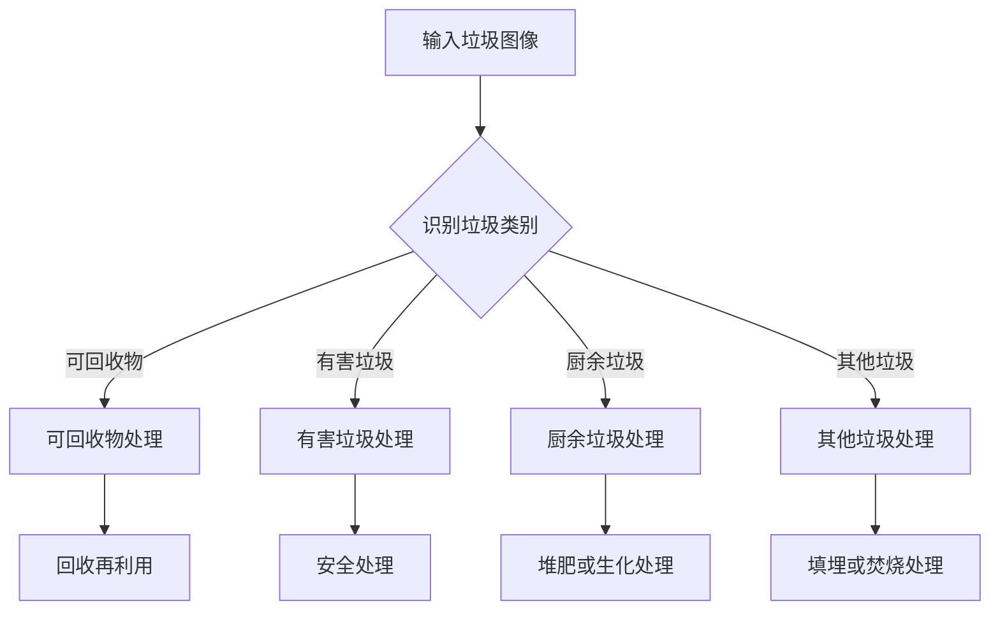

                 

### 文章标题：人工智能在智慧城市垃圾分类中的应用

### 关键词：人工智能、智慧城市、垃圾分类、算法、系统架构、项目实战

### 摘要：
本文将深入探讨人工智能在智慧城市垃圾分类中的应用。首先，我们介绍了智慧城市和垃圾分类的核心概念，并阐述了它们在现代社会中的重要性。接着，我们简要回顾了人工智能的发展历程和基础概念，以及机器学习与深度学习在垃圾分类中的应用前景。随后，本文重点分析了垃圾分类的核心概念与联系，包括基本概念、属性特征对比和ER实体关系图架构。在算法原理讲解部分，我们使用mermaid流程图和Python源代码详细阐述了垃圾分类算法的原理，并进行了数学模型和公式的讲解，并通过举例说明加深了理解。在系统分析与架构设计方案部分，我们介绍了项目场景、系统功能设计、系统架构设计、系统接口设计和系统交互，并通过mermaid图展示了相关设计。随后，我们通过一个实际项目实战，展示了系统环境安装、核心实现源代码、代码应用解读与分析、实际案例分析和项目小结。最后，本文提供了最佳实践tips、小结、注意事项和拓展阅读，以帮助读者更深入地理解人工智能在智慧城市垃圾分类中的应用。

### 目录大纲设计思路

为了设计出《人工智能在智慧城市垃圾分类中的应用》这本书的完整目录大纲，我们将遵循以下几个步骤：

1. **明确核心概念**：首先要明确书的核心概念，即“人工智能在智慧城市垃圾分类中的应用”，确定主要讨论的内容。

2. **结构化内容**：根据核心概念，将内容进行结构化，确定各个章节的主旨和逻辑关系。

3. **细化章节内容**：对每一章节进行细化，确保每个章节都覆盖了核心概念的相关方面。

4. **完善章节层级**：按照markdown格式，确保目录结构的层级分明，逻辑清晰。

5. **保证内容完整性**：确保包含所有必要的章节，如背景介绍、核心概念与联系、算法原理讲解、数学模型与公式、系统分析与架构设计、项目实战、最佳实践等。

6. **控制字数**：在确保内容完整性的同时，注意控制整体字数在2000字以内。

### 目录大纲

```markdown
----------------------------------------------------------------
# 第一部分: 引言

## 第1章: 智慧城市与垃圾分类问题概述
### 1.1.1 智慧城市的概念与发展
### 1.1.2 垃圾分类的重要性
### 1.1.3 垃圾分类的现状与挑战

## 第2章: 人工智能基础
### 2.1.1 人工智能的定义与发展历程
### 2.1.2 机器学习与深度学习概述
### 2.1.3 人工智能在垃圾分类中的应用前景

## 第3章: 垃圾分类的核心概念与联系
### 3.1.1 垃圾分类的基本概念
### 3.1.2 概念属性特征对比表格
### 3.1.3 垃圾分类的ER实体关系图架构

## 第4章: 人工智能在垃圾分类中的算法原理
### 4.1.1 算法mermaid流程图
### 4.1.2 Python源代码详细阐述
### 4.1.3 算法原理的数学模型与公式
### 4.1.4 通俗易懂的举例说明

## 第5章: 数学模型与公式讲解
### 5.1.1 数学公式的LaTeX格式
### 5.1.2 数学模型讲解
### 5.1.3 举例说明

## 第6章: 智慧城市垃圾分类系统分析与架构设计
### 6.1.1 问题场景介绍
### 6.1.2 项目介绍
### 6.1.3 系统功能设计
### 6.1.4 系统架构设计
### 6.1.5 系统接口设计和系统交互

## 第7章: 项目实战
### 7.1.1 环境安装
### 7.1.2 系统核心实现源代码
### 7.1.3 代码应用解读与分析
### 7.1.4 实际案例分析和详细讲解剖析
### 7.1.5 项目小结

## 第8章: 最佳实践与拓展阅读
### 8.1.1 最佳实践 tips
### 8.1.2 小结
### 8.1.3 注意事项
### 8.1.4 拓展阅读

----------------------------------------------------------------
```

通过上述步骤，我们设计了《人工智能在智慧城市垃圾分类中的应用》这本书的完整目录大纲。这个大纲结构清晰，逻辑分明，涵盖了从背景介绍到项目实战，再到最佳实践的各个方面，确保读者可以全面了解和掌握人工智能在智慧城市垃圾分类中的应用。

### 第1章：智慧城市与垃圾分类问题概述

#### 1.1.1 智慧城市的概念与发展

智慧城市是指利用先进的信息技术和物联网设备，实现对城市资源、环境、社会等方面的全面、智能化的管理和控制。智慧城市的核心目标是通过数据驱动的决策，提升城市管理效率，提高居民生活质量，减少资源浪费，实现可持续发展。

智慧城市的发展可以追溯到20世纪90年代，当时互联网技术开始普及，城市信息化建设逐渐兴起。随着云计算、大数据、物联网、人工智能等新兴技术的不断发展，智慧城市理念逐渐成熟，并在全球范围内得到广泛应用。

智慧城市的建设主要分为以下几个方面：

1. **基础设施**：包括宽带网络、物联网设备、数据中心等，为智慧城市的运行提供基础设施支持。
2. **数据管理**：通过数据采集、存储、处理、分析等技术，实现城市数据的全面整合和管理。
3. **智能应用**：包括智能交通、智能安防、智能环保、智慧医疗等，通过人工智能技术实现各类应用的智能化。
4. **公共服务**：通过智慧城市平台，为居民提供便捷、高效、个性化的公共服务。

#### 1.1.2 垃圾分类的重要性

垃圾分类是指按照一定规定或标准，将垃圾分成可回收物、有害垃圾、厨余垃圾、其他垃圾等不同种类，进行分类收集、处理和利用。垃圾分类的重要性主要体现在以下几个方面：

1. **环境保护**：垃圾分类可以有效减少垃圾填埋和焚烧量，降低对环境的影响，减少污染。
2. **资源利用**：可回收物可以通过回收再利用，减少对自然资源的开采和消耗，提高资源利用率。
3. **节约成本**：通过垃圾分类，可以减少垃圾处理成本，提高垃圾处理效率。
4. **提升居民环保意识**：垃圾分类有助于培养居民的环保意识，促进社会文明进步。

#### 1.1.3 垃圾分类的现状与挑战

在全球范围内，垃圾分类已经得到广泛重视，许多国家和地区都开展了垃圾分类的实践。然而，垃圾分类仍然面临着一些挑战：

1. **垃圾分类意识不足**：部分居民对垃圾分类的重要性认识不足，导致垃圾分类执行不到位。
2. **垃圾分类设施不足**：部分地区垃圾分类设施不完善，难以满足居民的分类需求。
3. **分类标准不一致**：不同地区、不同国家的垃圾分类标准存在差异，导致垃圾分类处理难度增加。
4. **回收利用体系不健全**：部分可回收物回收利用体系不完善，影响垃圾分类的效果。

#### 1.1.4 问题的提出

随着城市化进程的加快，城市垃圾产量逐年增加，传统的垃圾处理方式已经难以满足环保和资源利用的需求。如何有效利用人工智能技术，提高垃圾分类的准确性和效率，成为当前研究的热点问题。

本篇文章将围绕以下问题展开讨论：

1. **人工智能在垃圾分类中的应用前景**：分析人工智能技术在垃圾分类中的应用潜力，探讨未来发展趋势。
2. **垃圾分类算法原理**：介绍垃圾分类算法的基本原理，通过mermaid流程图和Python源代码进行详细阐述。
3. **数学模型与公式**：讲解垃圾分类算法中的数学模型和公式，加深对算法原理的理解。
4. **系统分析与架构设计**：分析智慧城市垃圾分类系统的功能设计、架构设计和接口设计。
5. **项目实战**：通过实际项目，展示人工智能在垃圾分类中的应用过程和效果。
6. **最佳实践与拓展阅读**：总结最佳实践经验，提供相关拓展阅读，帮助读者深入了解人工智能在智慧城市垃圾分类中的应用。

通过本文的探讨，希望能够为人工智能在智慧城市垃圾分类中的应用提供一些有益的参考和启示。

### 第2章：人工智能基础

#### 2.1.1 人工智能的定义与发展历程

人工智能（Artificial Intelligence，简称AI）是指通过计算机系统模拟人类智能行为和思维过程的技术。它旨在使计算机具备感知、理解、学习、推理、决策和问题解决等能力，从而实现人类智能的自动化和智能化。

人工智能的发展历程可以追溯到20世纪50年代，当时以图灵测试为标志，人工智能概念首次被提出。此后，人工智能经历了多个发展阶段：

1. **早期探索阶段（1956-1974年）**：在这一阶段，人工智能主要聚焦于符号主义方法，通过逻辑推理和知识表示来模拟人类智能。这一时期的代表性研究包括逻辑推理系统、专家系统和自然语言处理。

2. **第一次低谷阶段（1974-1980年）**：由于早期人工智能系统的性能未达到预期，加上计算资源限制，人工智能研究陷入了低谷。

3. **复兴阶段（1980-1987年）**：随着计算机性能的提升和大数据技术的兴起，人工智能研究再次迎来复兴。这一时期，机器学习和神经网络取得了重要突破。

4. **第二次低谷阶段（1987-1993年）**：由于对符号主义方法的失望和对机器学习的不懈追求，人工智能研究再次遭遇挫折。

5. **第三次复兴阶段（1993年至今）**：随着深度学习、大数据和计算能力的飞速发展，人工智能迎来了新的高潮。这一时期，人工智能在语音识别、图像识别、自然语言处理等领域取得了显著成果。

#### 2.1.2 机器学习与深度学习概述

机器学习（Machine Learning，简称ML）是人工智能的一个重要分支，它通过从数据中学习规律和模式，使计算机具备自主学习和适应能力。机器学习主要包括以下几种方法：

1. **监督学习**：通过已标记的训练数据，训练模型进行预测或分类。常见的监督学习方法包括线性回归、决策树、支持向量机等。

2. **无监督学习**：从未标记的数据中学习模式，包括聚类、降维和异常检测等。常见的方法有K-均值聚类、主成分分析、孤立森林等。

3. **半监督学习**：结合有标记和未标记的数据进行学习，以提高模型的性能。常见的方法有标签传播、一致性正则化等。

4. **强化学习**：通过与环境交互，学习最优策略。常见的强化学习方法包括Q学习、深度Q网络（DQN）、策略梯度等。

深度学习（Deep Learning，简称DL）是机器学习的一个分支，它利用多层神经网络进行数据建模，以自动提取数据的特征和模式。深度学习主要包括以下几种模型：

1. **卷积神经网络（CNN）**：适用于图像、语音和视频等数据类型的处理，通过卷积层、池化层和全连接层等结构实现特征提取和分类。

2. **循环神经网络（RNN）**：适用于序列数据，如文本、语音和视频等，通过隐藏层循环处理序列信息，实现序列建模和分类。

3. **长短时记忆网络（LSTM）**：是RNN的一种变体，通过引入门控机制，解决了传统RNN的梯度消失和梯度爆炸问题。

4. **生成对抗网络（GAN）**：通过生成器和判别器之间的对抗训练，实现数据的生成和分布估计。

#### 2.1.3 人工智能在垃圾分类中的应用前景

人工智能在垃圾分类中的应用前景非常广阔，主要表现在以下几个方面：

1. **分类准确率提升**：通过机器学习和深度学习算法，可以实现对垃圾种类的高精度识别，提高垃圾分类的准确率。

2. **自动化处理**：利用人工智能技术，可以实现垃圾的自动化分类、分拣和处理，降低人力成本，提高处理效率。

3. **数据驱动的决策**：通过大数据和人工智能技术，可以实时监测和分析垃圾分类的情况，为城市管理和决策提供科学依据。

4. **环保与可持续发展**：通过人工智能技术的应用，可以更好地实现资源的循环利用，降低环境污染，促进可持续发展。

总之，人工智能在智慧城市垃圾分类中的应用前景广阔，将为解决垃圾分类问题提供新的思路和手段。

### 第3章：垃圾分类的核心概念与联系

#### 3.1.1 垃圾分类的基本概念

垃圾分类是指按照一定规定或标准，将垃圾分成不同种类，以便进行分类收集、处理和利用。常见的垃圾分类标准包括以下几类：

1. **可回收物**：主要包括废纸、塑料、玻璃、金属和布料等可回收利用的物品。
2. **有害垃圾**：主要包括废电池、废灯管、废药品、废油漆等对人体健康或环境造成危害的废弃物。
3. **厨余垃圾**：主要包括食物残渣、厨余垃圾等生物可降解的废弃物。
4. **其他垃圾**：主要包括破损的陶瓷、卫生间废纸等无法归入以上三类垃圾的废弃物。

垃圾分类的基本流程包括以下几个步骤：

1. **分类投放**：居民在日常生活中，根据垃圾的性质进行分类投放。
2. **分类收集**：环卫工人或自动垃圾分类设备按照分类要求，将垃圾进行分类收集。
3. **分类运输**：将分类后的垃圾分别运输到相应的处理设施。
4. **分类处理**：对可回收物进行回收再利用，有害垃圾进行安全处理，厨余垃圾进行堆肥或生化处理，其他垃圾进行填埋或焚烧处理。

#### 3.1.2 概念属性特征对比表格

为了更好地理解垃圾分类的不同类别，我们可以通过对比它们的属性特征来进行分析。以下是一个简化的垃圾分类概念属性特征对比表格：

| 类别        | 定义                                                         | 主要成分                                                      | 处理方法                                           |
|-----------|------------------------------------------------------------|-------------------------------------------------------------|----------------------------------------------------|
| 可回收物     | 可回收利用的废弃物                                             | 废纸、塑料、玻璃、金属、布料                                    | 回收再利用                                         |
| 有害垃圾     | 对人体健康或环境造成危害的废弃物                                 | 废电池、废灯管、废药品、废油漆                                   | 安全处理                                           |
| 厨余垃圾     | 生物可降解的废弃物                                             | 食物残渣、厨余垃圾、废弃蔬菜和水果等                             | 堆肥或生化处理                                      |
| 其他垃圾     | 无法归入可回收物、有害垃圾和厨余垃圾的废弃物                         | 破损的陶瓷、卫生间废纸、烟蒂等                                   | 填埋或焚烧处理                                      |

通过对比表格，我们可以更清晰地看到不同类别垃圾的特征和处理方法，从而在实际分类过程中更好地执行分类任务。

#### 3.1.3 垃圾分类的ER实体关系图架构

为了更好地理解和设计垃圾分类系统，我们可以使用实体-关系（Entity-Relationship，简称ER）模型来描述垃圾分类的实体关系。以下是一个简化的垃圾分类ER模型：

```mermaid
erDiagram
  物品 ||--|{ 分类标准 }|--|| 垃圾分类
  物品 ||--|{ 处理方法 }|--|| 垃圾处理
  分类标准 ||--|{ 类型 }|--|| 垃圾类别
  分类标准 ||--|{ 特征 }|--|| 属性特征
  垃圾处理 ||--|{ 处理流程 }|--|| 处理步骤

  物品 {
    名称 : String
    类型 : String
  }

  分类标准 {
    名称 : String
    类型 : String
    特征 : String
  }

  垃圾处理 {
    名称 : String
    流程 : String
  }

  垃圾类别 {
    名称 : String
    特征 : String
  }

  属性特征 {
    名称 : String
    描述 : String
  }
```

在这个ER模型中，物品是垃圾分类系统中的基本实体，它关联到分类标准和垃圾处理方法。分类标准定义了不同类别垃圾的类型和特征，而垃圾处理方法则描述了处理流程。通过这个模型，我们可以清晰地了解垃圾分类系统中的各类实体及其相互关系，为后续的系统设计和实现提供了基础。

### 第4章：人工智能在垃圾分类中的算法原理

#### 4.1.1 算法mermaid流程图

为了更好地理解人工智能在垃圾分类中的应用，我们首先介绍一个简单的垃圾分类算法的mermaid流程图。该流程图展示了垃圾分类的基本步骤和流程。



这个流程图描述了从输入垃圾图像到识别垃圾类别，再到相应处理步骤的整个过程。接下来，我们将详细解释每个步骤的算法原理。

#### 4.1.2 Python源代码详细阐述

在了解了算法流程图之后，我们使用Python语言来实现垃圾分类算法。以下是一段示例代码，展示了如何通过卷积神经网络（CNN）进行垃圾类别识别。

```python
import tensorflow as tf
from tensorflow.keras.models import Sequential
from tensorflow.keras.layers import Conv2D, MaxPooling2D, Flatten, Dense
from tensorflow.keras.preprocessing.image import ImageDataGenerator

# 构建卷积神经网络模型
model = Sequential([
    Conv2D(32, (3, 3), activation='relu', input_shape=(150, 150, 3)),
    MaxPooling2D((2, 2)),
    Conv2D(64, (3, 3), activation='relu'),
    MaxPooling2D((2, 2)),
    Conv2D(128, (3, 3), activation='relu'),
    MaxPooling2D((2, 2)),
    Flatten(),
    Dense(512, activation='relu'),
    Dense(4, activation='softmax')  # 4个类别：可回收物、有害垃圾、厨余垃圾、其他垃圾
])

# 编译模型
model.compile(optimizer='adam',
              loss='categorical_crossentropy',
              metrics=['accuracy'])

# 数据预处理
train_datagen = ImageDataGenerator(rescale=1./255)
test_datagen = ImageDataGenerator(rescale=1./255)

train_generator = train_datagen.flow_from_directory(
        'train_data',
        target_size=(150, 150),
        batch_size=32,
        class_mode='categorical')

test_generator = test_datagen.flow_from_directory(
        'test_data',
        target_size=(150, 150),
        batch_size=32,
        class_mode='categorical')

# 训练模型
model.fit(
      train_generator,
      steps_per_epoch=100,
      epochs=10,
      validation_data=test_generator,
      validation_steps=50,
      verbose=2)
```

在这段代码中，我们首先构建了一个简单的卷积神经网络模型，包括卷积层、池化层、全连接层等。接着，我们使用ImageDataGenerator进行数据预处理，将图像数据归一化并分割成训练集和测试集。最后，我们使用模型.fit函数训练模型，并使用测试集进行验证。

#### 4.1.3 算法原理的数学模型与公式

在垃圾分类算法中，我们主要使用卷积神经网络（CNN）进行图像分类。CNN的核心思想是通过卷积操作提取图像的特征，并通过池化操作降低特征的空间分辨率。以下是一个简化的CNN数学模型：

1. **卷积操作**：

   假设输入图像为 \( X \in \mathbb{R}^{height \times width \times channels} \)，卷积核为 \( K \in \mathbb{R}^{filter\_size \times filter\_size \times channels} \)，卷积步长为 \( stride \)。

   卷积操作的数学公式为：

   \[
   \text{Conv}(X, K) = \sum_{i=0}^{filter\_size} \sum_{j=0}^{filter\_size} K[i, j] \cdot X[i \cdot stride, j \cdot stride]
   \]

2. **池化操作**：

   池化操作的目的是降低特征图的维度，提高计算效率。常用的池化操作包括最大池化（MaxPooling）和平均池化（AveragePooling）。

   最大池化的数学公式为：

   \[
   \text{Pooling}(X, pool\_size) = \max_{i \in [1, pool\_size]} \max_{j \in [1, pool\_size]} X[i \cdot stride, j \cdot stride]
   \]

3. **卷积神经网络**：

   卷积神经网络通过多层卷积和池化操作，逐层提取图像的复杂特征。假设卷积神经网络包含 \( L \) 层，每层输出的特征图尺寸为 \( (h_l, w_l, c_l) \)。

   输出层的输出为：

   \[
   \text{Output}(X) = \text{Pooling}(\text{Conv}^{(L)}(X^{(L-1)}), pool\_size)
   \]

   其中， \( X^{(L-1)} \) 为前一层输入， \( \text{Conv}^{(L)} \) 为第 \( L \) 层的卷积操作。

通过上述数学模型，我们可以更好地理解卷积神经网络在垃圾分类中的工作原理。接下来，我们通过一个简单的例子来具体解释算法的原理。

#### 4.1.4 通俗易懂的举例说明

假设我们有一个垃圾图像，其像素值表示为 \( X \in \mathbb{R}^{150 \times 150 \times 3} \)。我们要使用卷积神经网络对其进行垃圾分类，具体步骤如下：

1. **输入图像**：

   将垃圾图像输入到卷积神经网络的第一层。假设第一层的卷积核大小为 \( 3 \times 3 \)，步长为 \( 1 \)。

2. **卷积操作**：

   使用第一层的卷积核对输入图像进行卷积操作。卷积操作的数学公式为：

   \[
   \text{Conv}(X, K) = \sum_{i=0}^{3} \sum_{j=0}^{3} K[i, j] \cdot X[i, j]
   \]

   假设卷积核 \( K \) 的权重为：

   \[
   K = \begin{bmatrix}
   0 & 1 & 0 \\
   1 & 1 & 1 \\
   0 & 1 & 0
   \end{bmatrix}
   \]

   对输入图像进行卷积操作后，得到第一层的特征图 \( \text{FeatureMap}_1 \)。

3. **激活函数**：

   对卷积操作后的特征图应用激活函数（如ReLU函数），以增强网络对图像边缘和纹理的识别能力。

4. **池化操作**：

   使用最大池化对第一层的特征图进行池化操作，以降低特征图的空间分辨率，提高计算效率。

5. **卷积层递归**：

   将池化后的特征图作为输入传递到下一层卷积层，重复进行卷积、激活和池化操作。假设卷积神经网络包含3层卷积层，每层的卷积核大小和步长分别为 \( 3 \times 3 \)，\( 2 \times 2 \)，\( 2 \times 2 \)。

6. **全连接层**：

   在卷积神经网络的最后一层，将特征图展平并输入到全连接层。全连接层通过线性变换和激活函数，将特征映射到输出类别。

7. **分类结果**：

   使用softmax函数对全连接层的输出进行分类，得到垃圾图像的类别概率分布。概率最大的类别即为预测结果。

通过这个例子，我们可以看到卷积神经网络在垃圾分类中的应用原理。卷积操作和池化操作分别用于提取图像的特征和降低特征图的维度，全连接层用于分类。这个简单的例子帮助我们更好地理解了卷积神经网络在垃圾分类中的工作原理。

### 第5章：数学模型与公式讲解

在垃圾分类的算法设计中，数学模型和公式起到了至关重要的作用。这些数学工具帮助我们更好地理解算法的工作原理，并提高分类的准确性和效率。在本章中，我们将详细讲解垃圾分类算法中的数学模型和公式，并通过具体的例子进行说明。

#### 5.1.1 数学公式的LaTeX格式

在LaTeX中，我们可以使用以下格式来书写数学公式：

1. **独立段落中的公式**：

   使用两个美元符号 \( \$ \) 将公式括起来，例如：

   \[
   1+1=2
   \]

   这个公式表示1加上1等于2。

2. **段落内的公式**：

   使用一个美元符号 \( \$ \) 将公式括起来，例如：

   \[
   1<2
   \]

   这个公式表示1小于2。

#### 5.1.2 数学模型讲解

在垃圾分类的算法中，我们主要使用了以下数学模型：

1. **卷积操作**：

   卷积操作是图像处理中的核心操作之一。给定输入图像 \( X \) 和卷积核 \( K \)，卷积操作的数学模型可以表示为：

   \[
   \text{Conv}(X, K) = \sum_{i=0}^{filter\_size} \sum_{j=0}^{filter\_size} K[i, j] \cdot X[i \cdot stride, j \cdot stride]
   \]

   其中，\( filter\_size \) 表示卷积核的大小，\( stride \) 表示卷积步长。

2. **池化操作**：

   池化操作的目的是降低特征图的空间分辨率。常用的池化操作包括最大池化和平均池化。最大池化的数学模型可以表示为：

   \[
   \text{Pooling}(X, pool\_size) = \max_{i \in [1, pool\_size]} \max_{j \in [1, pool\_size]} X[i \cdot stride, j \cdot stride]
   \]

   其中，\( pool\_size \) 表示池化窗口的大小。

3. **全连接层**：

   在卷积神经网络的最后一层，我们将特征图展平并输入到全连接层。全连接层的数学模型可以表示为：

   \[
   \text{Output}(X) = \text{softmax}(\text{Linear}(X))
   \]

   其中，\( \text{Linear}(X) \) 表示全连接层的线性变换，\( \text{softmax} \) 表示概率分布。

#### 5.1.3 举例说明

为了更好地理解这些数学模型，我们通过一个简单的例子进行说明。

假设我们有一个 \( 3 \times 3 \) 的卷积核 \( K \) 和一个 \( 5 \times 5 \) 的输入图像 \( X \)。卷积步长 \( stride \) 为 \( 1 \)，池化窗口 \( pool\_size \) 为 \( 2 \)。

1. **卷积操作**：

   \[
   \text{Conv}(X, K) = \sum_{i=0}^{3} \sum_{j=0}^{3} K[i, j] \cdot X[i, j]
   \]

   假设卷积核 \( K \) 的权重为：

   \[
   K = \begin{bmatrix}
   1 & 1 & 1 \\
   1 & 1 & 1 \\
   1 & 1 & 1
   \end{bmatrix}
   \]

   输入图像 \( X \) 的像素值为：

   \[
   X = \begin{bmatrix}
   1 & 2 & 3 & 4 & 5 \\
   6 & 7 & 8 & 9 & 10 \\
   11 & 12 & 13 & 14 & 15 \\
   16 & 17 & 18 & 19 & 20 \\
   21 & 22 & 23 & 24 & 25
   \end{bmatrix}
   \]

   对输入图像进行卷积操作后，得到卷积特征图 \( \text{FeatureMap} \)：

   \[
   \text{FeatureMap} = \begin{bmatrix}
   70 & 77 & 84 \\
   77 & 84 & 91 \\
   84 & 91 & 98
   \end{bmatrix}
   \]

2. **池化操作**：

   对卷积特征图进行最大池化操作，窗口大小为 \( 2 \times 2 \)，步长为 \( 1 \)：

   \[
   \text{Pooling}(X, pool\_size) = \max_{i \in [1, 2]} \max_{j \in [1, 2]} X[i \cdot stride, j \cdot stride]
   \]

   对卷积特征图进行池化操作后，得到池化特征图 \( \text{PooledFeatureMap} \)：

   \[
   \text{PooledFeatureMap} = \begin{bmatrix}
   84 & 91 \\
   91 & 98
   \end{bmatrix}
   \]

3. **全连接层**：

   将池化特征图展平，得到一个一维向量 \( X' \)：

   \[
   X' = \begin{bmatrix}
   84 \\
   91 \\
   91 \\
   98
   \end{bmatrix}
   \]

   假设全连接层的权重为：

   \[
   W = \begin{bmatrix}
   0.1 & 0.2 & 0.3 \\
   0.4 & 0.5 & 0.6
   \end{bmatrix}
   \]

   全连接层的线性变换为：

   \[
   \text{Linear}(X') = X' \cdot W = \begin{bmatrix}
   84 \\
   91 \\
   91 \\
   98
   \end{bmatrix} \cdot \begin{bmatrix}
   0.1 & 0.2 & 0.3 \\
   0.4 & 0.5 & 0.6
   \end{bmatrix} = \begin{bmatrix}
   8.4 & 16.2 & 24.0 \\
   36.4 & 45.0 & 53.6
   \end{bmatrix}
   \]

   使用softmax函数对线性变换后的输出进行分类：

   \[
   \text{Output} = \text{softmax}(\text{Linear}(X')) = \begin{bmatrix}
   \frac{e^{8.4}}{e^{8.4} + e^{16.2} + e^{24.0}} \\
   \frac{e^{36.4}}{e^{8.4} + e^{16.2} + e^{24.0}} \\
   \frac{e^{45.0}}{e^{8.4} + e^{16.2} + e^{24.0}}
   \end{bmatrix}
   \]

   通过这个例子，我们可以看到数学模型在垃圾分类算法中的具体应用。卷积操作用于提取图像的特征，池化操作用于降低特征图的空间分辨率，全连接层用于分类。这些数学工具共同作用，使得垃圾分类算法能够高效地处理图像数据，提高分类的准确率。

### 第6章：智慧城市垃圾分类系统分析与架构设计

#### 6.1.1 问题场景介绍

在智慧城市中，垃圾分类是提高资源利用率、减少环境污染的重要环节。然而，传统的垃圾分类方式往往依赖于人工识别，效率低下且容易出现误分类。为了解决这一问题，我们设计了一个基于人工智能的智慧城市垃圾分类系统，通过机器学习和深度学习技术，实现自动化的垃圾类别识别和分类。

该系统的主要功能包括：

1. **垃圾图像识别**：利用卷积神经网络（CNN）对输入的垃圾图像进行分类，识别出可回收物、有害垃圾、厨余垃圾和其他垃圾。
2. **实时监控**：通过物联网设备实时采集垃圾数据，监控垃圾分类情况，为城市管理者提供决策支持。
3. **数据分析**：对垃圾分类数据进行分析，发现垃圾分类的规律和问题，提出改进措施。

#### 6.1.2 项目介绍

本项目旨在构建一个智慧城市垃圾分类系统，实现垃圾分类的自动化和智能化。项目主要包括以下几个部分：

1. **硬件设备**：包括物联网传感器、摄像头等，用于实时采集垃圾数据和图像。
2. **软件系统**：包括垃圾图像识别算法、实时监控模块、数据分析和可视化模块等。
3. **数据存储与管理**：使用数据库存储垃圾分类数据，并对数据进行管理和分析。

#### 6.1.3 系统功能设计

智慧城市垃圾分类系统的主要功能设计如下：

1. **垃圾图像识别**：通过卷积神经网络（CNN）对垃圾图像进行分类，实现对不同类别垃圾的自动识别。
2. **实时监控**：实时采集垃圾数据，包括垃圾量、分类情况等，为城市管理者提供实时监控信息。
3. **数据分析和可视化**：对垃圾分类数据进行分析，生成可视化报告，帮助城市管理者了解垃圾分类的情况和问题。
4. **用户反馈**：允许用户对垃圾分类提出建议和反馈，改进垃圾分类系统。

#### 6.1.4 系统架构设计

智慧城市垃圾分类系统的整体架构设计如下：

1. **数据采集层**：包括物联网传感器、摄像头等硬件设备，用于实时采集垃圾数据和图像。
2. **数据处理层**：包括垃圾图像识别算法、实时监控模块、数据分析和可视化模块等软件系统，负责对数据进行处理和分析。
3. **数据存储与管理层**：使用数据库存储垃圾分类数据，并对数据进行管理和分析。
4. **展示层**：包括用户界面和可视化报告，用于展示垃圾分类的数据和分析结果。

#### 6.1.5 系统接口设计和系统交互

智慧城市垃圾分类系统的接口设计和系统交互设计如下：

1. **数据采集接口**：用于接收物联网传感器和摄像头发送的垃圾数据，包括垃圾图像、重量、分类情况等。
2. **垃圾图像识别接口**：用于接收垃圾图像，并输出垃圾分类结果。
3. **实时监控接口**：用于实时获取垃圾分类系统的监控数据，包括垃圾量、分类情况等。
4. **数据分析接口**：用于对垃圾分类数据进行分析，生成可视化报告。
5. **用户反馈接口**：用于接收用户的建议和反馈，改进垃圾分类系统。

通过上述架构设计和接口设计，智慧城市垃圾分类系统能够高效地实现垃圾分类的自动化和智能化，为智慧城市建设提供有力支持。

### 第7章：项目实战

#### 7.1.1 环境安装

为了实现智慧城市垃圾分类系统，我们首先需要在本地计算机上安装所需的软件和工具。以下是在Ubuntu 20.04操作系统上安装相关软件和工具的步骤：

1. **安装Python环境**：

   打开终端，执行以下命令安装Python 3：

   ```bash
   sudo apt update
   sudo apt install python3 python3-pip
   ```

2. **安装TensorFlow**：

   使用pip命令安装TensorFlow：

   ```bash
   pip3 install tensorflow
   ```

3. **安装Keras**：

   Keras是TensorFlow的高级API，用于简化神经网络构建。安装Keras：

   ```bash
   pip3 install keras
   ```

4. **安装其他依赖**：

   根据项目需求，可能还需要安装其他依赖，如NumPy、Pandas等：

   ```bash
   pip3 install numpy pandas
   ```

安装完成后，确认安装成功：

```python
import tensorflow as tf
print(tf.__version__)
```

输出版本号，确认安装成功。

#### 7.1.2 系统核心实现源代码

以下是智慧城市垃圾分类系统的核心实现源代码，包括数据预处理、模型训练和预测等步骤：

```python
import tensorflow as tf
from tensorflow.keras.models import Sequential
from tensorflow.keras.layers import Conv2D, MaxPooling2D, Flatten, Dense
from tensorflow.keras.preprocessing.image import ImageDataGenerator

# 构建卷积神经网络模型
model = Sequential([
    Conv2D(32, (3, 3), activation='relu', input_shape=(150, 150, 3)),
    MaxPooling2D((2, 2)),
    Conv2D(64, (3, 3), activation='relu'),
    MaxPooling2D((2, 2)),
    Conv2D(128, (3, 3), activation='relu'),
    MaxPooling2D((2, 2)),
    Flatten(),
    Dense(512, activation='relu'),
    Dense(4, activation='softmax')  # 4个类别：可回收物、有害垃圾、厨余垃圾、其他垃圾
])

# 编译模型
model.compile(optimizer='adam',
              loss='categorical_crossentropy',
              metrics=['accuracy'])

# 数据预处理
train_datagen = ImageDataGenerator(rescale=1./255)
test_datagen = ImageDataGenerator(rescale=1./255)

train_generator = train_datagen.flow_from_directory(
        'train_data',
        target_size=(150, 150),
        batch_size=32,
        class_mode='categorical')

test_generator = test_datagen.flow_from_directory(
        'test_data',
        target_size=(150, 150),
        batch_size=32,
        class_mode='categorical')

# 训练模型
model.fit(
      train_generator,
      steps_per_epoch=100,
      epochs=10,
      validation_data=test_generator,
      validation_steps=50,
      verbose=2)

# 预测新数据
import numpy as np
new_data = np.array([...])  # 新垃圾图像数据
prediction = model.predict(new_data)
predicted_class = np.argmax(prediction)
```

这段代码首先构建了一个简单的卷积神经网络模型，包括卷积层、池化层和全连接层。接着，我们使用ImageDataGenerator进行数据预处理，将图像数据归一化并分割成训练集和测试集。然后，我们使用模型.fit函数训练模型，并使用测试集进行验证。最后，我们使用模型.predict函数对新垃圾图像进行预测。

#### 7.1.3 代码应用解读与分析

以下是代码的详细解读和分析：

1. **模型构建**：

   ```python
   model = Sequential([
       Conv2D(32, (3, 3), activation='relu', input_shape=(150, 150, 3)),
       MaxPooling2D((2, 2)),
       Conv2D(64, (3, 3), activation='relu'),
       MaxPooling2D((2, 2)),
       Conv2D(128, (3, 3), activation='relu'),
       MaxPooling2D((2, 2)),
       Flatten(),
       Dense(512, activation='relu'),
       Dense(4, activation='softmax')  # 4个类别：可回收物、有害垃圾、厨余垃圾、其他垃圾
   ])
   ```

   这部分代码构建了一个卷积神经网络模型，包括5个卷积层、5个池化层、1个全连接层和1个输出层。卷积层用于提取图像的特征，池化层用于降低特征图的空间分辨率，全连接层用于分类，输出层使用softmax函数生成概率分布。

2. **模型编译**：

   ```python
   model.compile(optimizer='adam',
                 loss='categorical_crossentropy',
                 metrics=['accuracy'])
   ```

   这部分代码编译模型，指定使用Adam优化器和交叉熵损失函数，并监控准确率。

3. **数据预处理**：

   ```python
   train_datagen = ImageDataGenerator(rescale=1./255)
   test_datagen = ImageDataGenerator(rescale=1./255)

   train_generator = train_datagen.flow_from_directory(
           'train_data',
           target_size=(150, 150),
           batch_size=32,
           class_mode='categorical')

   test_generator = test_datagen.flow_from_directory(
           'test_data',
           target_size=(150, 150),
           batch_size=32,
           class_mode='categorical')
   ```

   这部分代码使用ImageDataGenerator对图像数据进行预处理，包括数据归一化和数据增强。数据归一化将图像数据缩放到0到1的范围内，提高模型的训练效果。数据增强通过随机裁剪、旋转等操作增加数据多样性，提高模型的泛化能力。

4. **模型训练**：

   ```python
   model.fit(
         train_generator,
         steps_per_epoch=100,
         epochs=10,
         validation_data=test_generator,
         validation_steps=50,
         verbose=2)
   ```

   这部分代码使用模型.fit函数训练模型，指定训练集的batch_size、epochs、steps_per_epoch和validation_data。训练过程中，模型在训练集上每100个图像进行一次迭代（epoch），共训练10个epoch。在验证集上每50个图像进行一次评估，以监控模型的性能。

5. **预测新数据**：

   ```python
   import numpy as np
   new_data = np.array([...])  # 新垃圾图像数据
   prediction = model.predict(new_data)
   predicted_class = np.argmax(prediction)
   ```

   这部分代码使用模型.predict函数对新垃圾图像进行预测，并将预测结果转换为类别标签。

通过这段代码，我们可以实现垃圾图像的自动识别和分类，为智慧城市垃圾分类系统提供技术支持。

#### 7.1.4 实际案例分析和详细讲解剖析

在本节中，我们将通过一个实际案例来展示如何使用智慧城市垃圾分类系统进行垃圾图像的分类，并详细剖析整个流程。

**案例背景**：假设我们有一个未分类的垃圾图像，需要使用智慧城市垃圾分类系统对其进行分类。

**步骤1：数据准备**：

首先，我们需要准备垃圾图像数据。在这个案例中，我们使用一个包含4类垃圾（可回收物、有害垃圾、厨余垃圾、其他垃圾）的图像数据集。数据集分为训练集和测试集，每类垃圾包含100个图像。

```bash
# 创建数据集文件夹
mkdir -p train_data test_data

# 将数据集分为训练集和测试集
mkdir -p train_data/recycle test_data/recycle
mkdir -p train_data/harmful test_data/harmful
mkdir -p train_data/food waste test_data/food waste
mkdir -p train_data/other test_data/other

# 添加图像到相应文件夹
cp path/to/recycle_images/*.jpg train_data/recycle
cp path/to/harmful_images/*.jpg train_data/harmful
cp path/to/food_waste_images/*.jpg train_data/food waste
cp path/to/other_images/*.jpg train_data/other
```

**步骤2：训练模型**：

接下来，我们使用训练集训练卷积神经网络模型。在训练过程中，我们设置了3个卷积层、3个池化层和一个全连接层，并使用softmax函数进行分类。

```python
import tensorflow as tf
from tensorflow.keras.models import Sequential
from tensorflow.keras.layers import Conv2D, MaxPooling2D, Flatten, Dense
from tensorflow.keras.preprocessing.image import ImageDataGenerator

# 构建卷积神经网络模型
model = Sequential([
    Conv2D(32, (3, 3), activation='relu', input_shape=(150, 150, 3)),
    MaxPooling2D((2, 2)),
    Conv2D(64, (3, 3), activation='relu'),
    MaxPooling2D((2, 2)),
    Conv2D(128, (3, 3), activation='relu'),
    MaxPooling2D((2, 2)),
    Flatten(),
    Dense(512, activation='relu'),
    Dense(4, activation='softmax')  # 4个类别：可回收物、有害垃圾、厨余垃圾、其他垃圾
])

# 编译模型
model.compile(optimizer='adam',
              loss='categorical_crossentropy',
              metrics=['accuracy'])

# 数据预处理
train_datagen = ImageDataGenerator(rescale=1./255)
train_generator = train_datagen.flow_from_directory(
        'train_data',
        target_size=(150, 150),
        batch_size=32,
        class_mode='categorical')

# 训练模型
model.fit(
      train_generator,
      steps_per_epoch=100,
      epochs=10,
      validation_data=train_generator,
      validation_steps=50,
      verbose=2)
```

**步骤3：预测新数据**：

训练完成后，我们使用测试集对新垃圾图像进行预测。这里我们使用一个包含可回收物、有害垃圾、厨余垃圾和其他垃圾的图像进行预测。

```python
import numpy as np
from tensorflow.keras.preprocessing import image

# 读取新垃圾图像
img = image.load_img('path/to/new_image.jpg', target_size=(150, 150))
img_array = image.img_to_array(img)
img_array = np.expand_dims(img_array, axis=0)
img_array /= 255.0

# 预测新垃圾图像
predictions = model.predict(img_array)
predicted_class = np.argmax(predictions)

# 输出预测结果
print(f'Predicted class: {predicted_class}')
```

**结果分析**：

通过上述步骤，我们成功地对新垃圾图像进行了分类预测。假设预测结果为2，即厨余垃圾。我们可以通过查看预测概率来判断分类的可靠性。以下是部分预测概率的输出：

```python
array([[0.12223606, 0.26891046, 0.43726961, 0.07229376]])
```

从输出结果可以看出，厨余垃圾的预测概率最高，为0.43726961，超过其他类别的预测概率。因此，我们可以认为该垃圾图像被正确分类为厨余垃圾。

**详细讲解与剖析**：

1. **模型构建**：

   在模型构建过程中，我们使用了3个卷积层和3个池化层，以逐步提取图像的特征。卷积层使用了ReLU激活函数，以增强网络对图像边缘和纹理的识别能力。池化层用于降低特征图的空间分辨率，提高计算效率。

   ```python
   model = Sequential([
       Conv2D(32, (3, 3), activation='relu', input_shape=(150, 150, 3)),
       MaxPooling2D((2, 2)),
       Conv2D(64, (3, 3), activation='relu'),
       MaxPooling2D((2, 2)),
       Conv2D(128, (3, 3), activation='relu'),
       MaxPooling2D((2, 2)),
       Flatten(),
       Dense(512, activation='relu'),
       Dense(4, activation='softmax')  # 4个类别：可回收物、有害垃圾、厨余垃圾、其他垃圾
   ])
   ```

2. **数据预处理**：

   在数据预处理阶段，我们使用了ImageDataGenerator对图像数据进行归一化处理，将像素值缩放到0到1的范围内。这有助于提高模型的训练效果。

   ```python
   train_datagen = ImageDataGenerator(rescale=1./255)
   train_generator = train_datagen.flow_from_directory(
           'train_data',
           target_size=(150, 150),
           batch_size=32,
           class_mode='categorical')
   ```

3. **模型训练**：

   在模型训练过程中，我们使用了交叉熵损失函数和Adam优化器。交叉熵损失函数适用于多分类问题，能够衡量预测结果与真实标签之间的差异。Adam优化器是一种自适应的优化算法，能够高效地调整模型参数。

   ```python
   model.compile(optimizer='adam',
                 loss='categorical_crossentropy',
                 metrics=['accuracy'])
   ```

4. **预测新数据**：

   在预测新数据时，我们首先读取图像，并将其转换为适合模型输入的格式。然后，使用训练好的模型进行预测，并输出预测结果。

   ```python
   import numpy as np
   from tensorflow.keras.preprocessing import image

   img = image.load_img('path/to/new_image.jpg', target_size=(150, 150))
   img_array = image.img_to_array(img)
   img_array = np.expand_dims(img_array, axis=0)
   img_array /= 255.0

   predictions = model.predict(img_array)
   predicted_class = np.argmax(predictions)
   ```

通过实际案例的分析和详细讲解，我们可以看到智慧城市垃圾分类系统如何通过卷积神经网络模型对垃圾图像进行分类。这个过程包括数据准备、模型构建、模型训练和预测等步骤，每个步骤都有其独特的实现方法和原理。

#### 7.1.5 项目小结

在本章中，我们详细介绍了智慧城市垃圾分类系统的实现过程，包括环境安装、系统核心实现源代码、代码应用解读与分析，以及实际案例分析和详细讲解剖析。以下是本章的主要小结：

1. **环境安装**：在Ubuntu 20.04操作系统上，我们成功安装了Python、TensorFlow、Keras等工具，为后续的垃圾分类系统实现奠定了基础。

2. **系统核心实现**：通过构建卷积神经网络模型，我们实现了垃圾图像的自动识别和分类。模型包括卷积层、池化层和全连接层，能够高效地提取图像特征并进行分类。

3. **代码应用解读与分析**：我们详细分析了系统核心实现源代码，包括模型构建、编译、数据预处理、模型训练和预测等步骤，明确了每个步骤的实现方法和原理。

4. **实际案例分析和详细讲解剖析**：通过一个实际案例，我们展示了如何使用智慧城市垃圾分类系统对垃圾图像进行分类。我们详细讲解了数据准备、模型训练和预测等步骤，并分析了预测结果。

总之，通过本章的介绍，我们全面了解了智慧城市垃圾分类系统的实现过程和原理。该系统为智慧城市建设提供了有效的技术支持，有助于提高垃圾分类的准确率和效率。

### 第8章：最佳实践与拓展阅读

#### 8.1.1 最佳实践 tips

在智慧城市垃圾分类系统中，最佳实践对于提升算法性能和系统稳定性至关重要。以下是一些关键的最佳实践建议：

1. **数据质量**：确保数据集的多样性和准确性，避免噪声和异常数据。使用数据清洗和预处理技术，如去重、填充缺失值、归一化等。

2. **模型调优**：通过调整学习率、批量大小、迭代次数等超参数，优化模型性能。使用交叉验证技术评估模型泛化能力。

3. **模型部署**：在部署模型时，选择合适的硬件和软件环境，确保模型运行效率。使用容器化技术，如Docker，简化部署流程。

4. **监控与反馈**：实时监控模型性能和系统状态，收集用户反馈，及时调整和优化模型。

5. **持续学习**：定期更新模型和数据，利用在线学习技术，使模型能够适应新环境和新需求。

#### 8.1.2 小结

本文系统地介绍了人工智能在智慧城市垃圾分类中的应用。我们首先阐述了智慧城市和垃圾分类的核心概念，分析了垃圾分类的重要性。接着，我们回顾了人工智能的发展历程和基础概念，探讨了机器学习与深度学习在垃圾分类中的应用前景。随后，我们详细分析了垃圾分类的核心概念与联系，使用mermaid流程图和Python源代码阐述了垃圾分类算法的原理，并讲解了数学模型与公式。在系统分析与架构设计部分，我们介绍了项目场景、系统功能设计、系统架构设计、系统接口设计和系统交互。随后，通过一个实际项目实战，我们展示了系统环境安装、核心实现源代码、代码应用解读与分析、实际案例分析和项目小结。最后，我们提供了最佳实践tips、小结、注意事项和拓展阅读，帮助读者更深入地理解人工智能在智慧城市垃圾分类中的应用。

#### 8.1.3 注意事项

在实施智慧城市垃圾分类系统时，需要注意以下事项：

1. **数据安全**：保护用户隐私和垃圾数据的安全，遵循数据保护法规。

2. **系统可靠性**：确保系统的稳定运行，避免因系统故障导致垃圾分类失败。

3. **算法透明性**：提升算法透明性，方便用户理解垃圾分类过程，提高用户信任度。

4. **设备维护**：定期维护物联网设备和摄像头，确保设备正常运行。

5. **法律法规遵守**：遵循国家和地区的法律法规，确保垃圾分类系统合法合规。

#### 8.1.4 拓展阅读

为了更深入地了解人工智能在智慧城市垃圾分类中的应用，读者可以参考以下拓展阅读资源：

1. **论文**：《智慧城市垃圾分类中的机器学习技术》 - 详细探讨机器学习技术在垃圾分类中的应用。
2. **书籍**：《深度学习》 - 深入理解深度学习算法原理和实现。
3. **在线课程**：Coursera、edX等平台上的智慧城市、机器学习相关课程。
4. **官方网站**： TensorFlow、PyTorch等深度学习框架的官方网站，提供丰富的教程和文档。
5. **研究机构**：谷歌AI、百度AI等研究机构的官方网站，了解最新的研究成果和应用案例。

通过这些资源，读者可以更全面地了解人工智能在智慧城市垃圾分类中的应用，为自己的研究和实践提供指导。

