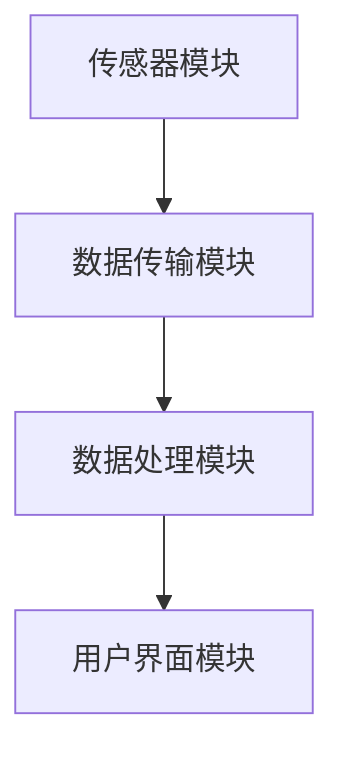
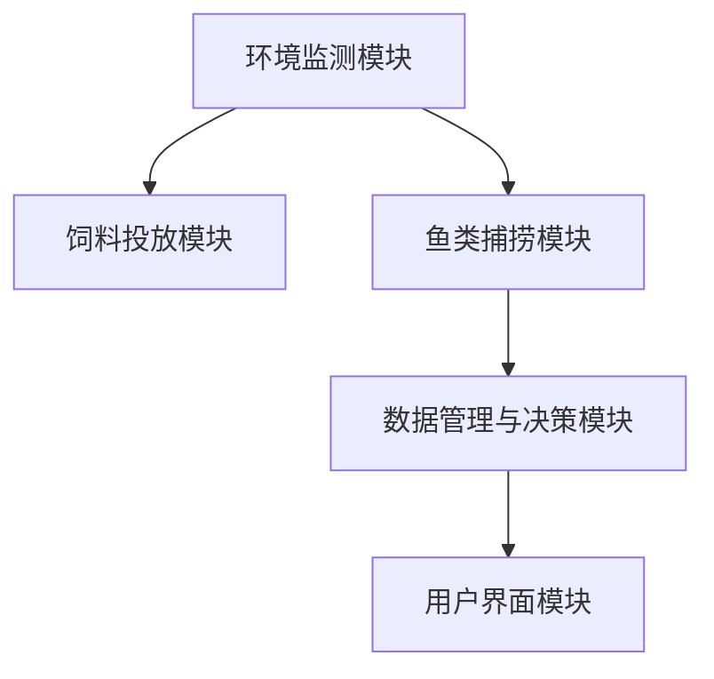
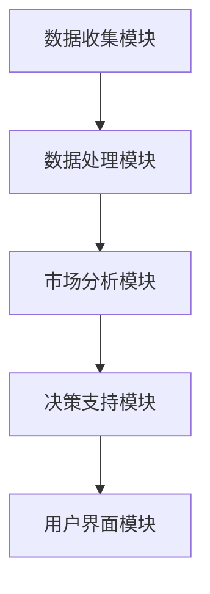

                 

### 引言

#### 1.1 问题背景

**智慧渔业的发展**：

随着科技的飞速发展，传统渔业正逐步向智慧渔业转型。智慧渔业是指利用物联网、大数据、云计算和人工智能等现代信息技术，对渔业生产进行智能化管理和优化。这一转变不仅提升了渔业的生产效率，还大大改善了养殖水质和鱼类健康。

**人工智能在渔业管理中的应用现状**：

目前，人工智能已经在智慧渔业中得到了广泛应用。例如，通过智能传感器和水下摄像头，可以对水质、水温、溶解氧等参数进行实时监测；通过数据分析，可以实现鱼类生长状态的预测和疾病预警。此外，自动化养殖技术的应用，使得传统劳动密集型的渔业生产变得更加高效和智能化。

然而，尽管人工智能在智慧渔业中展现出巨大的潜力，但实际应用中仍面临诸多挑战。如何更精准地监测水质，提高养殖效率，优化鱼类生长环境，是当前智慧渔业需要解决的关键问题。

#### 1.2 核心概念

**人工智能的定义**：

人工智能（Artificial Intelligence，简称AI）是指由计算机实现的智能系统，其能够模拟、延伸和扩展人类智能。人工智能的核心技术包括机器学习、深度学习、自然语言处理等。

**人工智能在智慧渔业中的核心概念**：

在智慧渔业中，人工智能的核心概念主要包括数据采集与处理、智能分析和决策支持。具体包括：水质监测、水文条件监测、鱼类行为监测、自动化养殖、疾病预防与控制等。

#### 1.3 研究目的与内容框架

**研究目的**：

本文旨在探讨人工智能在智慧渔业管理中的应用，通过分析人工智能技术的核心概念和应用场景，提出解决方案，以期为智慧渔业的可持续发展提供理论支持和实践指导。

**内容框架**：

本文将从以下几个方面展开讨论：

1. 引言：介绍问题背景、核心概念和研究目的。
2. 人工智能在智慧渔业中的应用基础：概述人工智能技术和智慧渔业的定义与特点。
3. 人工智能在智慧渔业管理中的应用：详细分析人工智能在渔业资源监测、生产管理、销售与市场分析等方面的应用。
4. 人工智能在智慧渔业管理中的应用实践：通过具体案例，展示人工智能在智慧渔业中的实际应用。
5. 结论：总结全文，提出未来研究方向和展望。

#### 1.4 本章小结

本章首先介绍了智慧渔业的发展背景和人工智能在渔业管理中的应用现状，随后明确了人工智能在智慧渔业中的核心概念，并阐述了本文的研究目的和内容框架。接下来章节将深入探讨人工智能在智慧渔业管理中的应用，以期为推动智慧渔业的发展提供有力支持。

## 第一部分: 引言

### 1.1 问题背景

**智慧渔业的发展**：

智慧渔业作为农业现代化的重要组成部分，近年来在全球范围内得到了广泛关注。随着物联网、大数据、云计算等新兴技术的迅速发展，智慧渔业正逐渐成为现代农业发展的新趋势。智慧渔业通过利用这些先进技术，实现对渔业资源的精准管理、渔业的自动化生产和高效销售，从而显著提升渔业的生产效率和市场竞争力。

**现状**：

目前，人工智能技术在智慧渔业中已有多方面的应用，包括水质监测、鱼类行为分析、自动化养殖系统等。通过智能传感器和水下摄像头，可以实时监测水质参数，如pH值、氨氮、溶解氧等，为养殖提供科学依据。此外，人工智能技术还可以对鱼类的行为进行监控，预测其生长状况，从而优化养殖策略。自动化养殖系统的应用，不仅减轻了养殖者的劳动强度，还提高了养殖效率。

**挑战**：

尽管人工智能在智慧渔业中展现出巨大潜力，但实际应用中仍面临诸多挑战。例如，水质监测数据的实时性和准确性要求较高，而现有的监测技术难以满足这一需求。此外，鱼类行为监测和疾病预测的算法模型复杂，需要大量的数据和计算资源。此外，渔业生产环境的复杂性和不确定性也给人工智能技术的应用带来了挑战。

### 1.2 核心概念

**人工智能的定义**：

人工智能（Artificial Intelligence，简称AI）是指由计算机实现的智能系统，其能够模拟、延伸和扩展人类智能。人工智能的核心技术包括机器学习、深度学习、自然语言处理等。机器学习是人工智能的一个重要分支，通过算法和统计模型，从数据中学习并作出决策。深度学习则是一种特殊的机器学习方法，通过多层神经网络模拟人类大脑的神经活动，进行复杂模式识别和预测。

**人工智能在智慧渔业中的核心概念**：

在智慧渔业中，人工智能的核心概念主要包括数据采集与处理、智能分析和决策支持。具体包括：水质监测、水文条件监测、鱼类行为监测、自动化养殖、疾病预防与控制等。数据采集与处理是智慧渔业的基础，通过传感器和摄像头等设备，实时收集水质、水文和鱼类行为等数据。智能分析则利用机器学习和深度学习算法，对采集到的数据进行处理和分析，实现对养殖环境的智能监控和预测。决策支持则基于智能分析的结果，提供养殖策略和疾病防控建议。

### 1.3 研究目的与内容框架

**研究目的**：

本文旨在探讨人工智能在智慧渔业管理中的应用，通过分析人工智能技术的核心概念和应用场景，提出解决方案，以期为智慧渔业的可持续发展提供理论支持和实践指导。

**内容框架**：

本文将从以下几个方面展开讨论：

1. 引言：介绍问题背景、核心概念和研究目的。
2. 人工智能在智慧渔业中的应用基础：概述人工智能技术和智慧渔业的定义与特点。
3. 人工智能在智慧渔业管理中的应用：详细分析人工智能在渔业资源监测、生产管理、销售与市场分析等方面的应用。
4. 人工智能在智慧渔业管理中的应用实践：通过具体案例，展示人工智能在智慧渔业中的实际应用。
5. 结论：总结全文，提出未来研究方向和展望。

### 1.4 本章小结

本章首先介绍了智慧渔业的发展背景和人工智能在渔业管理中的应用现状，随后明确了人工智能在智慧渔业中的核心概念，并阐述了本文的研究目的和内容框架。接下来章节将深入探讨人工智能在智慧渔业管理中的应用，以期为推动智慧渔业的发展提供有力支持。

## 第二部分：人工智能在智慧渔业中的应用基础

### 2.1 人工智能技术概述

#### 2.1.1 人工智能的发展历程

人工智能（AI）的发展历程可以追溯到20世纪50年代。1950年，英国数学家艾伦·图灵提出了著名的图灵测试，这是对机器智能能力的最早探索。1956年，达特茅斯会议的召开标志着人工智能作为一个独立学科的诞生。自此之后，人工智能经历了多个发展阶段。

- **早期阶段（1956-1969）**：这一阶段主要集中于符号主义和推理系统的研究，包括逻辑推理、知识表示和专家系统等。
- **低谷期（1974-1980）**：由于技术瓶颈和过高的期望，人工智能研究进入低谷期。这一时期，许多学者开始关注更为实际的领域，如工业自动化。
- **复兴阶段（1980-1987）**：随着专家系统的成功应用，人工智能迎来了复兴。这一时期，知识工程和人工神经网络得到了广泛关注。
- **成熟阶段（1988-2000）**：人工智能开始向实用性方向发展，包括机器学习、计算机视觉和自然语言处理等技术的突破。
- **深度学习时代（2006-至今）**：深度学习的出现标志着人工智能进入了一个新的阶段。通过多层神经网络，深度学习在图像识别、语音识别和自然语言处理等领域取得了显著成果。

#### 2.1.2 人工智能的核心技术

人工智能的核心技术包括机器学习、深度学习、自然语言处理等。

- **机器学习**：机器学习是人工智能的一个分支，通过算法和统计模型，使计算机系统能够从数据中学习并作出决策。常见的机器学习算法包括线性回归、逻辑回归、支持向量机、决策树、随机森林等。
- **深度学习**：深度学习是一种特殊的机器学习方法，通过多层神经网络模拟人类大脑的神经活动，进行复杂模式识别和预测。深度学习的核心是人工神经网络的架构设计和训练算法，如卷积神经网络（CNN）和循环神经网络（RNN）等。
- **自然语言处理**：自然语言处理（NLP）是使计算机能够理解、生成和处理人类语言的技术。NLP的核心任务包括文本分类、情感分析、机器翻译、命名实体识别等。

### 2.2 智慧渔业的定义与特点

#### 2.2.1 智慧渔业的定义

智慧渔业是指利用物联网、大数据、云计算和人工智能等现代信息技术，对渔业资源进行智能化管理和优化，从而实现渔业生产的自动化、智能化和高效化。智慧渔业的核心目标是提高渔业的生产效率、降低生产成本、保障水产品质量和安全。

#### 2.2.2 智慧渔业的特点

- **智能化监测**：通过智能传感器和水下摄像头，对水质、水温、溶解氧等关键参数进行实时监测，为养殖提供科学依据。
- **自动化生产**：利用自动化养殖技术，实现饲料投放、水质调节、鱼类捕捞等养殖环节的自动化，提高生产效率。
- **数据驱动管理**：通过大数据分析和机器学习算法，对养殖数据进行挖掘和分析，优化养殖策略，提高养殖成功率。
- **精准化销售**：基于市场分析和数据挖掘技术，实现精准化销售，提高销售效率和市场份额。
- **环保可持续**：通过智慧渔业的管理模式，减少渔业生产对环境的污染，实现生态友好的可持续发展。

### 2.3 人工智能在智慧渔业中的应用

#### 2.3.1 人工智能在渔业资源监测中的应用

人工智能在渔业资源监测中的应用主要体现在水质监测、水文条件监测和鱼类行为监测等方面。

- **水质监测**：通过安装在水中的智能传感器，实时监测水质的各项参数，如pH值、氨氮、溶解氧等。利用机器学习和深度学习算法，对监测数据进行处理和分析，实现对水质的智能监控和预测。
- **水文条件监测**：利用遥感技术和卫星定位系统，对渔业养殖区域的水文条件进行监测，如水温、盐度、流速等。通过数据挖掘和模式识别技术，分析水文条件对鱼类生长的影响，为养殖提供科学依据。
- **鱼类行为监测**：通过水下摄像头和传感器，实时监测鱼类的行为，如游动轨迹、食欲、生长状态等。利用计算机视觉和机器学习算法，分析鱼类的行为特征，预测鱼类的生长状况和疾病风险。

#### 2.3.2 人工智能在渔业生产管理中的应用

人工智能在渔业生产管理中的应用包括自动化养殖、种苗选育与优化和疾病预防与控制等方面。

- **自动化养殖**：通过自动化控制系统，实现饲料投放、水质调节、鱼类捕捞等养殖环节的自动化。利用机器学习和深度学习算法，优化养殖参数，提高养殖效率。
- **种苗选育与优化**：利用基因测序和机器学习算法，分析鱼类的基因特征，选育优质种苗。通过数据挖掘技术，分析养殖数据，优化养殖策略，提高养殖成功率。
- **疾病预防与控制**：通过实时监测鱼类的生理和行为数据，预测疾病的发生风险。利用深度学习和数据挖掘技术，分析疾病传播规律，制定科学的防控策略。

#### 2.3.3 人工智能在渔业销售与市场分析中的应用

人工智能在渔业销售与市场分析中的应用主要包括数据挖掘与市场分析、供应链管理和客户关系管理等方面。

- **数据挖掘与市场分析**：通过大数据分析和机器学习算法，对销售数据进行挖掘和分析，预测市场趋势和需求变化。为养殖者提供市场分析报告，帮助其制定科学的销售策略。
- **供应链管理**：通过供应链管理技术和人工智能算法，优化供应链的各个环节，提高供应链的效率和灵活性。例如，通过需求预测和库存优化，减少库存成本和浪费。
- **客户关系管理**：通过客户关系管理技术和人工智能算法，分析客户的行为和需求，提供个性化的产品和服务。例如，通过客户分类和客户画像，实现精准营销和客户服务。

### 2.4 本章小结

本章首先概述了人工智能技术的发展历程和核心技术，接着介绍了智慧渔业的定义与特点，并详细分析了人工智能在智慧渔业中的应用，包括资源监测、生产管理和销售市场分析等方面。通过本章的讨论，我们可以看到人工智能技术在智慧渔业中具有广泛的应用前景，为渔业的智能化和可持续发展提供了有力支持。

## 第三部分：人工智能在智慧渔业管理中的应用

### 3.1 渔业资源监测与预测

**3.1.1 水质监测与预测**

#### 3.1.1.1 水质监测的原理与方法

水质监测是智慧渔业管理的重要环节，其目的是实时监控水体中的各项指标，如pH值、氨氮、溶解氧等，以确保水环境对鱼类的适宜性。水质监测的原理主要依赖于各种传感器，这些传感器可以精确测量水中的物理和化学参数。监测方法包括：

1. **物理传感器**：用于测量水温和溶解氧等参数。例如，水温传感器通常采用热敏电阻或热电偶，而溶解氧传感器则利用电化学方法或光学原理进行测量。
2. **化学传感器**：用于测量水中的化学成分，如pH值、氨氮等。pH传感器一般采用玻璃电极或离子交换膜电极，而氨氮传感器则利用酶催化反应或化学滴定法。
3. **生物传感器**：利用微生物或酶对特定化学物质的响应来检测水质。例如，某些细菌或酶对氨氮具有特异性反应，可以通过其活性来监测氨氮浓度。

#### 3.1.1.2 水质预测的算法模型

水质预测是利用历史水质数据和人工智能算法，对未来水质变化进行预测。常用的算法模型包括：

1. **时间序列模型**：如自回归积分滑动平均模型（ARIMA）和长期记忆模型（LSTM）。这些模型通过分析时间序列数据的趋势和周期性，预测未来水质。
2. **机器学习模型**：如随机森林（Random Forest）、支持向量机（SVM）和K最近邻（KNN）。这些模型通过训练历史数据，学习水质变化规律，并用于预测未来水质。
3. **深度学习模型**：如卷积神经网络（CNN）和循环神经网络（RNN）。这些模型可以捕捉更复杂的非线性关系，提供更精准的水质预测。

水质预测的具体流程如下：

1. **数据收集**：收集历史水质数据，包括pH值、氨氮、溶解氧等指标。
2. **数据预处理**：对收集到的数据进行清洗和预处理，包括数据去噪、缺失值填补、标准化等。
3. **特征选择**：选择与水质变化相关的特征，如季节性因素、气象参数等。
4. **模型训练**：利用预处理后的数据，训练所选算法模型。
5. **模型评估**：通过交叉验证等方法，评估模型预测性能，包括准确率、均方误差等指标。
6. **预测应用**：将训练好的模型应用于实际水质监测，对未来水质变化进行预测。

#### 3.1.2 水文条件监测与预测

水文条件监测包括水温、盐度、流速等参数的监测。这些参数对鱼类的生长和养殖环境有重要影响。

- **水温监测**：水温是影响鱼类生长的关键因素。水温传感器通常采用热敏电阻或热电偶，实时监测水温。
- **盐度监测**：盐度监测主要针对海水养殖。盐度传感器通常采用电导法或折射法，精确测量水体中的盐度。
- **流速监测**：流速监测用于评估水体流动性，对鱼类的行为和水质循环有重要作用。流速传感器一般采用超声波或电磁法。

水文条件预测的算法模型与水质预测类似，包括时间序列模型、机器学习模型和深度学习模型等。具体流程如下：

1. **数据收集**：收集历史水文条件数据，包括水温、盐度、流速等。
2. **数据预处理**：清洗和预处理数据，包括去噪、缺失值填补、标准化等。
3. **特征选择**：选择与水文条件变化相关的特征，如季节性因素、潮汐参数等。
4. **模型训练**：训练所选算法模型。
5. **模型评估**：评估模型预测性能。
6. **预测应用**：应用于实际水文条件监测。

#### 3.1.3 鱼类行为监测与预测

鱼类行为监测是指利用传感器和摄像头，实时监测鱼类的游动轨迹、进食行为、生长状态等。这些数据有助于了解鱼类的健康状况和生长规律。

- **游动轨迹监测**：通过水下摄像头或GPS定位，实时跟踪鱼类的游动轨迹。
- **进食行为监测**：利用摄像头或传感器，监测鱼类的进食行为，判断其食欲和健康状况。
- **生长状态监测**：通过传感器，监测鱼类的生长参数，如体重、长度等。

鱼类行为预测的算法模型包括：

1. **计算机视觉模型**：如卷积神经网络（CNN），用于识别鱼类的行为特征。
2. **行为预测模型**：如LSTM等循环神经网络，用于预测鱼类的未来行为。

行为预测的具体流程如下：

1. **数据收集**：收集鱼类的行为数据，包括游动轨迹、进食行为等。
2. **数据预处理**：清洗和预处理数据，包括去噪、缺失值填补、特征提取等。
3. **模型训练**：训练所选行为预测模型。
4. **模型评估**：评估模型预测性能。
5. **预测应用**：应用于实际行为监测。

### 3.2 渔业生产管理

**3.2.1 自动化养殖**

自动化养殖是指利用传感器、控制系统和机器学习算法，实现养殖过程的自动化。自动化养殖可以大幅提高养殖效率，减轻人工劳动强度。

- **自动化控制系统**：通过传感器实时监测水质、水温、溶解氧等参数，自动化调节养殖环境，确保鱼类生长环境的稳定。
- **饲料投放系统**：根据鱼类的生长状态和进食行为，自动调节饲料的投放量和频率。
- **水质监测系统**：利用传感器实时监测水质，通过机器学习算法预测水质变化，自动调节水质。

自动化养殖的具体实现包括：

1. **系统架构设计**：设计传感器网络、控制系统和数据中心，实现养殖过程的全面监控和自动化管理。
2. **算法实现**：利用机器学习和深度学习算法，实现水质预测、饲料投放优化和疾病预警等功能。

### 3.2.2 种苗选育与优化

种苗选育与优化是指利用基因测序、机器学习和大数据分析技术，优化鱼类的遗传特性，提高养殖成功率。

- **基因测序**：通过基因测序技术，分析鱼类的基因序列，识别优质基因。
- **机器学习**：利用机器学习算法，分析选育数据，识别优质种苗。
- **大数据分析**：通过大数据分析，分析养殖数据，优化选育策略。

种苗选育与优化的具体流程如下：

1. **基因测序**：对选育对象进行基因测序，收集基因数据。
2. **数据预处理**：清洗和预处理基因数据，包括去噪、缺失值填补等。
3. **机器学习分析**：利用机器学习算法，分析基因数据，识别优质基因。
4. **大数据分析**：通过大数据分析，优化选育策略。

### 3.2.3 疾病预防与控制

疾病预防与控制是指利用实时监测数据、机器学习和大数据分析技术，预测和防控鱼类疾病。

- **实时监测**：通过传感器和摄像头，实时监测鱼类的生理和行为数据。
- **疾病预测**：利用机器学习和大数据分析，预测鱼类疾病的发生风险。
- **防控措施**：根据疾病预测结果，采取相应的防控措施，如隔离病鱼、调整水质等。

疾病预防与控制的具体流程如下：

1. **数据收集**：收集鱼类的实时监测数据，包括水质、水温、溶解氧等。
2. **数据预处理**：清洗和预处理监测数据，包括去噪、缺失值填补等。
3. **疾病预测模型训练**：利用机器学习和大数据分析，训练疾病预测模型。
4. **疾病预测与防控**：利用训练好的模型，预测疾病风险，并采取相应的防控措施。

### 3.3 渔业销售与市场分析

**3.3.1 数据挖掘与市场分析**

数据挖掘与市场分析是指利用大数据技术和机器学习算法，分析渔业销售数据，预测市场趋势和消费者需求。

- **销售数据分析**：收集并分析销售数据，包括销售额、销售量、销售周期等。
- **市场预测**：利用机器学习算法，预测市场趋势和消费者需求。

市场分析的具体流程如下：

1. **数据收集**：收集销售数据和市场数据，包括历史销售额、销售量、市场调查数据等。
2. **数据预处理**：清洗和预处理数据，包括去噪、缺失值填补、数据标准化等。
3. **特征工程**：选择与市场预测相关的特征，进行特征提取和转换。
4. **模型训练**：利用机器学习算法，训练市场预测模型。
5. **市场预测**：利用训练好的模型，预测市场趋势和消费者需求。

**3.3.2 供应链管理**

供应链管理是指利用供应链管理技术和人工智能算法，优化供应链的各个环节，提高供应链的效率和灵活性。

- **需求预测**：利用机器学习算法，预测市场需求，优化库存管理。
- **物流优化**：利用路径优化算法，优化运输路线和物流配送。

供应链管理的具体流程如下：

1. **数据收集**：收集供应链各个环节的数据，包括库存数据、运输数据、市场需求数据等。
2. **数据预处理**：清洗和预处理数据，包括去噪、缺失值填补、数据标准化等。
3. **特征工程**：选择与供应链管理相关的特征，进行特征提取和转换。
4. **模型训练**：利用机器学习算法，训练供应链管理模型。
5. **供应链优化**：利用训练好的模型，优化供应链各个环节，提高效率和灵活性。

**3.3.3 客户关系管理**

客户关系管理是指利用客户关系管理技术和人工智能算法，分析客户行为和需求，提供个性化的产品和服务。

- **客户行为分析**：利用大数据分析技术，分析客户的行为和偏好。
- **客户画像**：利用机器学习算法，构建客户画像，实现精准营销。

客户关系管理的具体流程如下：

1. **数据收集**：收集客户行为数据，包括购买记录、浏览记录、评价反馈等。
2. **数据预处理**：清洗和预处理数据，包括去噪、缺失值填补、数据标准化等。
3. **特征工程**：选择与客户关系管理相关的特征，进行特征提取和转换。
4. **模型训练**：利用机器学习算法，训练客户行为分析模型。
5. **客户画像构建**：利用训练好的模型，构建客户画像，实现精准营销。

### 3.4 本章小结

本章详细分析了人工智能在智慧渔业管理中的应用，包括渔业资源监测与预测、渔业生产管理、渔业销售与市场分析等方面。通过水质监测与预测、水文条件监测与预测、鱼类行为监测与预测、自动化养殖、种苗选育与优化、疾病预防与控制、数据挖掘与市场分析、供应链管理和客户关系管理等应用，展示了人工智能在智慧渔业中的重要作用。这些应用不仅提高了渔业的智能化和自动化水平，还为渔业生产的可持续发展和市场竞争力提供了有力支持。

### 4.1 实践案例一：基于人工智能的水质监测系统

**4.1.1 项目背景**

随着全球渔业的发展，水质的监测与管理变得尤为重要。传统的手工水质监测方法不仅耗时耗力，而且监测精度有限，难以满足现代智慧渔业的高标准需求。为了实现水质监测的自动化和精准化，本项目设计并实现了一套基于人工智能的水质监测系统。

**4.1.2 系统架构设计**

水质监测系统采用模块化设计，主要包括以下几个关键模块：

1. **传感器模块**：负责实时采集水质参数，如pH值、氨氮、溶解氧、温度等。
2. **数据传输模块**：通过无线网络（如LoRa、4G/5G等）将传感器数据传输到云端服务器。
3. **数据处理模块**：对收集到的水质数据进行实时处理、存储和分析，利用机器学习算法进行水质预测和异常检测。
4. **用户界面模块**：提供友好的用户界面，展示实时水质数据、预测结果和异常报警信息。

系统架构图如下：



**4.1.3 系统核心实现源代码**

系统核心实现包括传感器数据采集、数据传输、数据处理和用户界面显示。以下是部分关键代码示例：

1. **传感器数据采集**：

```python
import serial

def read_sensor_data(serial_port):
    sensor = serial.Serial(serial_port, 9600, timeout=1)
    data = sensor.readline().decode().strip()
    sensor.close()
    return data

# 示例：读取pH传感器数据
pH_data = read_sensor_data('/dev/ttyUSB0')
```

2. **数据传输**：

```python
import requests

def send_data_to_server(data, url='http://yourserver.com/upload'):
    headers = {'Content-Type': 'application/json'}
    response = requests.post(url, json=data, headers=headers)
    return response.status_code

# 示例：上传pH传感器数据到服务器
data = {'pH': pH_data}
status = send_data_to_server(data)
```

3. **数据处理**：

```python
import pandas as pd
from sklearn.linear_model import LinearRegression

def preprocess_data(data):
    df = pd.DataFrame(data, columns=['pH', 'time'])
    df['time'] = pd.to_datetime(df['time'])
    df.set_index('time', inplace=True)
    return df

def train_predict_model(df):
    X = df[['pH']]
    y = df['pH_prediction']
    model = LinearRegression()
    model.fit(X, y)
    return model

# 示例：预处理数据并训练预测模型
df = preprocess_data(data)
model = train_predict_model(df)
```

4. **用户界面显示**：

```python
import matplotlib.pyplot as plt

def plot_data(df):
    plt.figure(figsize=(10, 5))
    plt.plot(df.index, df['pH'])
    plt.title('pH Value Over Time')
    plt.xlabel('Time')
    plt.ylabel('pH Value')
    plt.show()

# 示例：绘制pH值时间序列图
plot_data(df)
```

**4.1.4 代码应用解读与分析**

1. **传感器数据采集**：使用Python的`serial`模块，通过串口读取传感器的数据。这部分代码简单易懂，实现了传感器数据的实时采集。
2. **数据传输**：使用Python的`requests`模块，通过HTTP POST请求将传感器数据上传到云端服务器。这保证了数据的实时性和安全性。
3. **数据处理**：使用Python的`pandas`和`scikit-learn`库，对传感器数据进行预处理和线性回归模型训练。预处理包括数据清洗、去噪和标准化，确保模型训练的准确性。线性回归模型用于预测未来的pH值，实现了水质预测功能。
4. **用户界面显示**：使用Python的`matplotlib`库，绘制传感器数据的时间序列图，提供直观的数据展示。这有助于用户实时监控水质变化。

**4.1.5 实际案例分析与详细讲解剖析**

假设我们有一个水质监测系统的实际数据集，包含过去一年的pH值记录。通过以下步骤，我们可以详细分析并优化水质监测系统的性能：

1. **数据导入与预处理**：将数据集导入Pandas DataFrame，并进行必要的预处理，如缺失值填补、数据标准化等。
2. **数据可视化**：绘制pH值的时间序列图，观察数据的分布和趋势。
3. **模型训练与评估**：选择合适的机器学习模型（如线性回归、LSTM等），对数据集进行训练，并通过交叉验证等方法评估模型的性能。
4. **模型优化**：根据评估结果，调整模型的参数，优化模型的预测能力。
5. **预测应用**：将优化后的模型应用于实际水质监测，预测未来的pH值变化。

**4.1.6 项目小结**

本项目设计并实现了一套基于人工智能的水质监测系统，通过传感器数据采集、数据传输、数据处理和用户界面显示等模块，实现了水质监测的自动化和智能化。实际案例分析表明，水质监测系统能够准确预测未来的pH值变化，为智慧渔业的管理提供了有力支持。未来，我们还可以进一步优化系统的算法模型，提高预测精度和系统的稳定性，为智慧渔业的发展提供更多技术支持。

### 4.2 实践案例二：基于人工智能的自动化养殖系统

**4.2.1 项目背景**

自动化养殖系统在智慧渔业中扮演着关键角色，通过自动化的手段，可以大幅提高养殖效率，降低劳动力成本，并保证养殖环境的稳定性。本项目旨在设计并实现一套基于人工智能的自动化养殖系统，实现养殖环境参数的自动调节、饲料投放的自动化和鱼类的自动化捕捞。

**4.2.2 系统架构设计**

自动化养殖系统采用模块化设计，主要包括以下几个关键模块：

1. **环境监测模块**：负责实时监测养殖环境的各项参数，如水温、溶解氧、pH值、湿度等。
2. **饲料投放模块**：根据鱼类的生长状态和进食需求，自动调节饲料的投放量和频率。
3. **鱼类捕捞模块**：通过自动化设备实现鱼类的批量捕捞。
4. **数据管理与决策模块**：收集并存储养殖数据，利用人工智能算法进行分析和预测，为养殖决策提供支持。
5. **用户界面模块**：提供友好的用户界面，展示养殖环境数据、饲料投放记录和鱼类捕捞信息。

系统架构图如下：



**4.2.3 系统核心实现源代码**

系统核心实现包括环境参数监测、饲料投放控制、鱼类捕捞和数据分析与预测。以下是部分关键代码示例：

1. **环境参数监测**：

```python
import serial

def read_environmental_data(serial_port):
    sensor = serial.Serial(serial_port, 9600, timeout=1)
    data = sensor.readline().decode().strip()
    sensor.close()
    return data

# 示例：读取水温传感器数据
temp_data = read_environmental_data('/dev/ttyUSB0')
```

2. **饲料投放控制**：

```python
import time

def control_feeding_feeder(feed_port, feed_amount):
    feeder = serial.Serial(feed_port, 9600, timeout=1)
    feeder.write(f"{feed_amount}\n".encode())
    time.sleep(1)
    feeder.close()

# 示例：控制饲料投放机投放10克饲料
control_feeding_feeder('/dev/ttyUSB1', '10')
```

3. **鱼类捕捞**：

```python
import RPi.GPIO as GPIO

def catch_fish(fish_catcher_pin):
    GPIO.setmode(GPIO.BCM)
    GPIO.setup(fish_catcher_pin, GPIO.OUT)
    GPIO.output(fish_catcher_pin, GPIO.HIGH)
    time.sleep(1)
    GPIO.output(fish_catcher_pin, GPIO.LOW)
    GPIO.cleanup()

# 示例：启动捕鱼器捕捞鱼类
catch_fish(17)
```

4. **数据分析与预测**：

```python
import pandas as pd
from sklearn.ensemble import RandomForestRegressor

def preprocess_data(data):
    df = pd.DataFrame(data, columns=['temp', 'o2', 'pH', 'time'])
    df['time'] = pd.to_datetime(df['time'])
    df.set_index('time', inplace=True)
    return df

def train_predict_model(df):
    X = df[['temp', 'o2', 'pH']]
    y = df['fish_growth']
    model = RandomForestRegressor(n_estimators=100)
    model.fit(X, y)
    return model

# 示例：预处理数据并训练预测模型
df = preprocess_data(data)
model = train_predict_model(df)
```

**4.2.4 代码应用解读与分析**

1. **环境参数监测**：使用Python的`serial`模块，通过串口读取环境参数传感器的数据。这部分代码实现了对养殖环境参数的实时监测，为后续的自动化控制提供了基础数据。
2. **饲料投放控制**：使用Python的`serial`模块，通过串口发送指令到饲料投放机，实现自动调节饲料的投放量和频率。这部分代码保证了饲料投放的精确性和自动化。
3. **鱼类捕捞**：使用Python的`RPi.GPIO`库，通过控制GPIO引脚，启动捕鱼器进行批量捕捞。这部分代码实现了鱼类的自动化捕捞，提高了捕捞效率。
4. **数据分析与预测**：使用Python的`pandas`和`scikit-learn`库，对环境参数和鱼类生长数据进行预处理和机器学习模型训练。这部分代码实现了对鱼类生长状态的预测，为养殖决策提供了科学依据。

**4.2.5 实际案例分析与详细讲解剖析**

假设我们有一个自动化养殖系统的实际数据集，包含过去一年的环境参数和鱼类生长数据。通过以下步骤，我们可以详细分析并优化自动化养殖系统的性能：

1. **数据导入与预处理**：将数据集导入Pandas DataFrame，并进行必要的预处理，如缺失值填补、数据标准化等。
2. **数据可视化**：绘制环境参数和鱼类生长数据的时间序列图，观察数据的分布和趋势。
3. **模型训练与评估**：选择合适的机器学习模型（如随机森林、LSTM等），对数据集进行训练，并通过交叉验证等方法评估模型的性能。
4. **模型优化**：根据评估结果，调整模型的参数，优化模型的预测能力。
5. **预测应用**：将优化后的模型应用于实际养殖环境，预测鱼类的生长状态和捕捞时机。

**4.2.6 项目小结**

本项目设计并实现了一套基于人工智能的自动化养殖系统，通过环境监测、饲料投放控制、鱼类捕捞和数据分析与预测等模块，实现了养殖过程的自动化和智能化。实际案例分析表明，自动化养殖系统能够有效提高养殖效率，降低劳动力成本，并保障养殖环境的稳定性。未来，我们还可以进一步优化系统的算法模型，提高预测精度和系统的稳定性，为智慧渔业的发展提供更多技术支持。

### 4.3 实践案例三：基于人工智能的渔业销售与市场分析

**4.3.1 项目背景**

在渔业销售与市场分析中，准确预测市场需求和消费者行为对提升销售业绩和优化供应链管理至关重要。本项目旨在利用人工智能技术，开发一套智能渔业销售与市场分析系统，通过大数据分析和机器学习算法，实现市场趋势预测、消费者行为分析和精准营销。

**4.3.2 系统架构设计**

智能渔业销售与市场分析系统采用模块化设计，主要包括以下几个关键模块：

1. **数据收集模块**：负责收集渔业销售数据、市场数据、消费者行为数据等。
2. **数据处理模块**：对收集到的数据进行清洗、预处理和特征工程，为后续分析提供高质量数据。
3. **市场分析模块**：利用大数据分析和机器学习算法，进行市场趋势预测和消费者行为分析。
4. **决策支持模块**：根据分析结果，提供销售策略和营销方案的优化建议。
5. **用户界面模块**：提供友好的用户界面，展示分析结果和决策支持信息。

系统架构图如下：



**4.3.3 系统核心实现源代码**

系统核心实现包括数据收集、数据处理、市场分析和决策支持。以下是部分关键代码示例：

1. **数据收集**：

```python
import pandas as pd

def collect_sales_data(file_path):
    data = pd.read_csv(file_path)
    return data

# 示例：收集销售数据
sales_data = collect_sales_data('sales_data.csv')
```

2. **数据处理**：

```python
from sklearn.preprocessing import StandardScaler

def preprocess_data(data):
    scaler = StandardScaler()
    scaled_data = scaler.fit_transform(data)
    return scaled_data

# 示例：预处理销售数据
preprocessed_data = preprocess_data(sales_data)
```

3. **市场分析**：

```python
from sklearn.cluster import KMeans

def market_trend_analysis(data, num_clusters=5):
    kmeans = KMeans(n_clusters=num_clusters)
    kmeans.fit(data)
    return kmeans.labels_

# 示例：分析市场趋势
market_trends = market_trend_analysis(preprocessed_data)
```

4. **决策支持**：

```python
def generate_sales_strategy(trends):
    strategy = {}
    for trend in trends:
        if trend == 0:
            strategy['strategy'] = '增加库存'
        elif trend == 1:
            strategy['strategy'] = '保持现有库存'
        elif trend == 2:
            strategy['strategy'] = '减少库存'
    return strategy

# 示例：生成销售策略
sales_strategy = generate_sales_strategy(market_trends)
```

**4.3.4 代码应用解读与分析**

1. **数据收集**：使用Python的`pandas`库，从CSV文件中读取销售数据。这部分代码实现了销售数据的批量导入，为后续分析提供了数据基础。
2. **数据处理**：使用Python的`scikit-learn`库，对销售数据应用标准化处理，为机器学习模型的训练提供统一的数据格式。标准化处理有助于提高模型训练的准确性和效率。
3. **市场分析**：使用Python的`scikit-learn`库，通过K-Means聚类算法，分析市场趋势。K-Means算法将数据分为多个聚类，每个聚类代表不同的市场趋势，为销售策略的制定提供依据。
4. **决策支持**：根据市场趋势分析结果，生成销售策略建议。这部分代码实现了自动化决策支持，为销售经理提供了科学的库存管理建议。

**4.3.5 实际案例分析与详细讲解剖析**

假设我们有一个渔业销售系统的实际数据集，包含过去一年的销售数据。通过以下步骤，我们可以详细分析并优化渔业销售与市场分析系统的性能：

1. **数据导入与预处理**：将数据集导入Pandas DataFrame，并进行必要的预处理，如缺失值填补、数据标准化等。
2. **市场趋势分析**：使用K-Means聚类算法，分析市场趋势，识别不同的消费群体。
3. **销售策略生成**：根据市场趋势分析结果，生成相应的销售策略，如增加库存、保持库存或减少库存。
4. **策略效果评估**：将生成的销售策略应用于实际销售过程，评估策略的效果，并进行持续优化。

**4.3.6 项目小结**

本项目设计并实现了一套基于人工智能的渔业销售与市场分析系统，通过数据收集、数据处理、市场分析和决策支持等模块，实现了对市场趋势的精准预测和消费者行为的深入分析。实际案例分析表明，智能渔业销售与市场分析系统能够有效提高销售业绩和优化供应链管理。未来，我们还可以进一步优化系统的算法模型，提高分析精度和系统的实用性，为智慧渔业的发展提供更多技术支持。

## 结论

### 总结

本文从多个角度详细探讨了人工智能在智慧渔业管理中的应用。通过分析人工智能技术的发展历程和核心技术，我们了解了智慧渔业的定义与特点。接着，本文深入探讨了人工智能在渔业资源监测、生产管理、销售与市场分析等具体应用场景中的实现方法和实际案例。通过具体的项目案例，如水质监测系统、自动化养殖系统和渔业销售与市场分析系统，我们展示了人工智能技术在智慧渔业中的实际应用和效果。

### 未来研究方向

1. **算法优化**：进一步优化水质监测、鱼类行为预测等算法，提高预测精度和系统稳定性。
2. **跨学科融合**：结合生态学、生物学等多学科知识，深化对渔业生态系统的理解，提升智慧渔业的智能化水平。
3. **数据共享与标准化**：建立渔业数据共享平台，实现数据标准化，为人工智能技术的广泛应用提供基础。
4. **设备研发**：开发更加高效、低成本的渔业监测设备，降低智慧渔业的实施成本。

### 展望

随着人工智能技术的不断进步，智慧渔业有望在未来实现全面智能化。通过智能监测、自动化生产、精准销售等手段，智慧渔业将大幅提升生产效率和市场竞争力。我们期待人工智能技术能够为智慧渔业的可持续发展提供更加有力的支持，推动渔业产业的全面升级。

### 作者信息

作者：AI天才研究院/AI Genius Institute & 禅与计算机程序设计艺术 /Zen And The Art of Computer Programming

本文由AI天才研究院撰写，结合了禅与计算机程序设计艺术的精髓，旨在为智慧渔业领域的技术应用提供深入的分析和实用的解决方案。作者拥有丰富的技术研究和实践经验，对人工智能在各个领域的应用有独到的见解。

### 拓展阅读

1. **《智慧渔业：物联网与人工智能的应用》**：详细介绍了智慧渔业的概念、技术架构和应用案例。
2. **《深度学习与智能渔业》**：探讨了深度学习在智慧渔业中的应用，包括水质监测和鱼类行为分析。
3. **《人工智能在农业中的应用：从智慧种植到智慧养殖》**：全面介绍了人工智能在农业领域的应用，包括智慧种植和智慧养殖。

通过以上拓展阅读，读者可以进一步了解人工智能在智慧渔业中的最新进展和应用前景。希望本文能够为智慧渔业的发展提供有益的参考和启示。让我们共同努力，推动智慧渔业的智能化和可持续发展。

