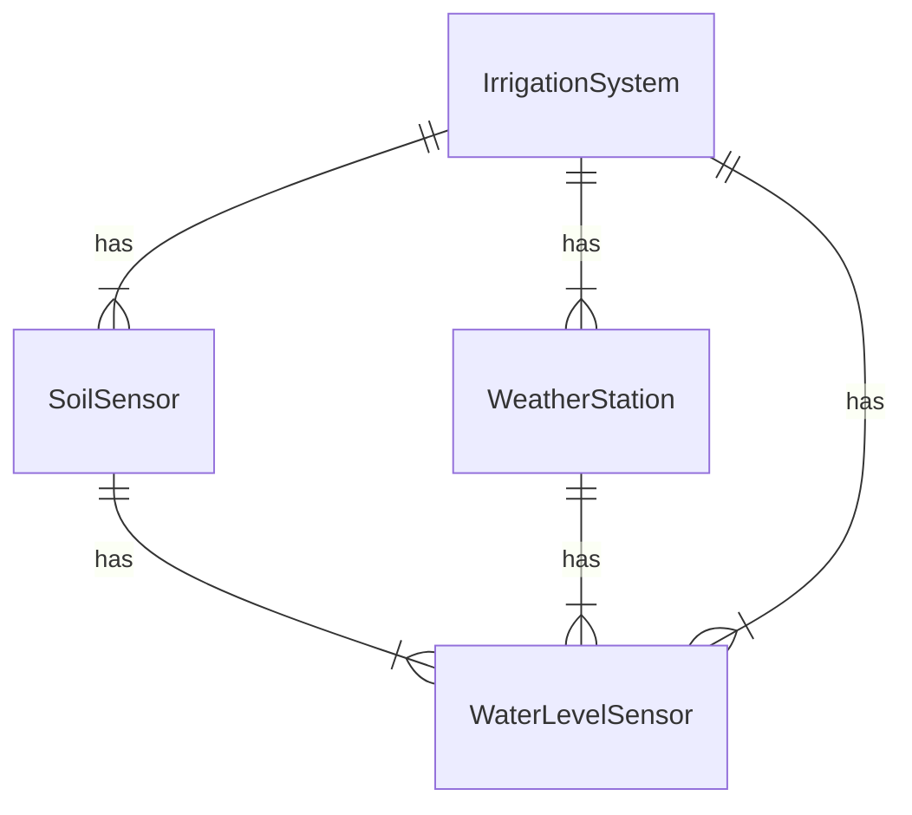
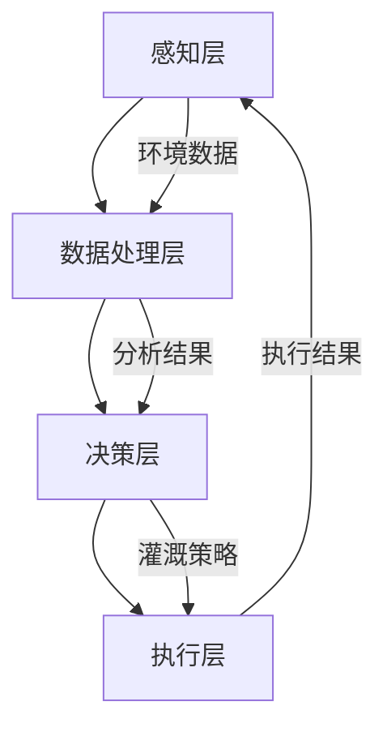
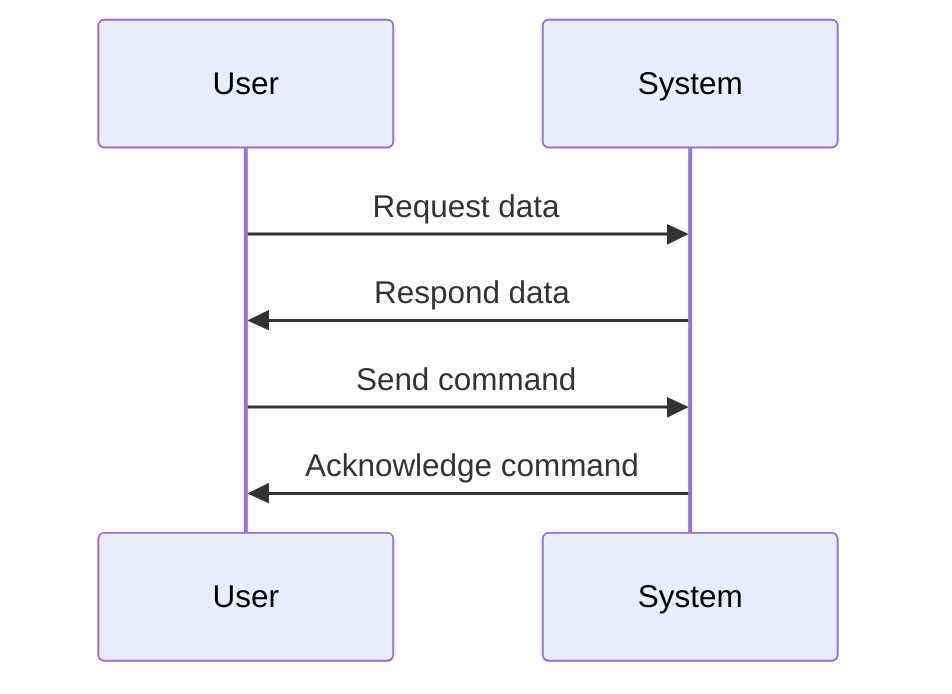
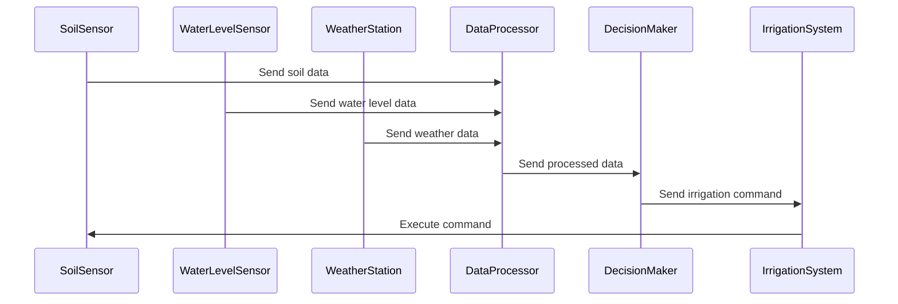

                 

# 人工智能在智慧灌溉系统优化中的应用

> 关键词：智慧灌溉、人工智能、机器学习、深度学习、系统优化

> 摘要：随着全球水资源短缺问题的日益突出，智慧灌溉系统的优化显得尤为重要。本文首先介绍了传统灌溉系统存在的问题，然后探讨了人工智能在智慧灌溉系统优化中的应用，包括感知技术、机器学习算法、深度学习技术以及数据挖掘与智能决策等内容。通过项目实战和案例分析，本文展示了人工智能技术在智慧灌溉系统中的实际应用和显著效果，为未来智慧灌溉系统的进一步发展提供了有益的参考。

## 第一部分：引言与背景介绍

### 第1章：问题背景与概述

在全球水资源日益紧张的背景下，传统灌溉系统的效率低下和水资源浪费问题愈加严重。传统灌溉系统通常依赖于人工操作，难以根据土壤湿度和气候变化等因素进行精确灌溉，导致水资源的浪费和作物生长的不均衡。智慧灌溉系统通过引入人工智能技术，实现了对灌溉过程的智能化控制，有效提高了灌溉效率和水资源的利用效率。

智慧灌溉系统的核心目标是实现精准灌溉，即根据土壤湿度、气象数据等环境参数，自动调节灌溉量，确保作物获得适宜的水分。此外，智慧灌溉系统还能通过数据分析，预测作物生长趋势，为农业生产提供科学的决策支持。

### 第2章：核心概念与联系

#### 核心概念

**人工智能**：一种模拟人类智能行为的计算机系统，能够通过学习和推理解决复杂问题。

**机器学习**：一种利用数据训练模型，使其具有自主学习和适应能力的方法。

**深度学习**：一种基于神经网络的学习方法，通过多层非线性变换提取数据特征。

#### 概念属性特征对比表格

| 技术名称 | 特点 | 应用场景 |
| --- | --- | --- |
| 人工智能 | 模拟人类智能行为 | 语音识别、图像识别、自然语言处理 |
| 机器学习 | 数据驱动 | 数据分析、预测建模、推荐系统 |
| 深度学习 | 多层神经网络 | 图像识别、语音识别、自然语言处理 |

#### ER实体关系图架构



## 第二部分：人工智能在智慧灌溉系统中的应用

### 第3章：感知技术与应用

#### 感知技术概述

感知技术是智慧灌溉系统的核心组成部分，包括土壤传感器、水位传感器和气象传感器等。这些传感器能够实时采集土壤湿度、水位和气象数据，为灌溉系统提供准确的环境信息。

#### 数据采集与处理

智慧灌溉系统通过传感器采集到的数据，需要进行预处理和整合，以便后续分析和决策。数据预处理包括数据清洗、数据标准化和数据集成等步骤。数据整合是将不同传感器的数据进行融合，形成一个统一的数据视图，以便更好地分析环境变化对作物生长的影响。

#### 感知技术的挑战与优化

感知技术的挑战在于如何提高数据的准确性和实时性。为了提高数据准确性，需要对传感器进行校准和优化，确保传感器能够准确测量环境参数。为了提高数据实时性，需要优化数据传输和处理流程，确保数据能够快速传输到分析系统。

### 第4章：机器学习算法与模型

#### 机器学习基础

机器学习是一种利用数据训练模型的方法，通过学习数据中的模式和规律，使模型能够对未知数据进行预测和分类。常见的机器学习算法包括决策树、随机森林、支持向量机等。

#### 常用机器学习模型

**决策树**：通过树的形态对数据进行分类，能够直观地展示决策过程。

**随机森林**：基于决策树的集成方法，通过多棵决策树的组合，提高模型的预测性能。

**支持向量机**：通过寻找最优的超平面，实现数据的分类和回归。

#### 模型选择与优化

在选择机器学习模型时，需要根据灌溉系统的需求，选择合适的模型。例如，对于分类问题，可以选择决策树或随机森林；对于回归问题，可以选择支持向量机。在模型优化过程中，可以通过调整模型的参数，提高模型的预测性能。

### 第5章：深度学习技术

#### 深度学习基础

深度学习是一种基于神经网络的机器学习方法，通过多层非线性变换提取数据特征。常见的深度学习模型包括卷积神经网络（CNN）、循环神经网络（RNN）等。

#### 深度学习模型在灌溉系统中的应用

**图像识别**：通过深度学习模型，实现对灌溉系统图像的识别和分析，从而获取土壤和作物生长状态的信息。

**预测建模**：通过深度学习模型，实现对作物生长趋势的预测，为灌溉系统的决策提供支持。

#### 深度学习的优势与局限

深度学习的优势在于能够通过自动学习数据特征，提高模型的预测性能。但深度学习也存在一定的局限性，例如模型参数调优复杂、训练过程时间较长等。为了克服这些局限性，需要不断优化深度学习算法和模型结构。

### 第6章：数据挖掘与智能决策

#### 数据挖掘技术

数据挖掘是一种从大量数据中提取有价值信息的方法，通过分析数据中的模式和规律，发现潜在的知识和关联。在智慧灌溉系统中，数据挖掘技术可以用于分析环境数据、作物生长数据等，为灌溉系统的决策提供支持。

#### 智能决策支持系统

智能决策支持系统是一种利用人工智能技术，为农业生产提供决策支持的方法。通过分析环境数据、作物生长数据等，智能决策支持系统可以自动生成灌溉策略，优化灌溉过程，提高作物产量。

#### 智能决策系统的实施与应用

在实际应用中，智能决策支持系统可以通过多种方式部署，例如云计算平台、移动应用等。通过智能决策支持系统，农民可以实时了解作物生长状况，制定科学的灌溉策略，提高农业生产效益。

## 第三部分：项目实战与最佳实践

### 第7章：智慧灌溉系统设计与实现

#### 项目介绍

智慧灌溉系统是一个集成了感知技术、机器学习算法和深度学习技术的综合系统。通过感知技术获取环境数据，利用机器学习算法和深度学习模型进行数据分析和决策，实现精准灌溉和智能管理。

#### 系统功能设计

智慧灌溉系统的核心功能包括数据采集、数据处理、决策生成和灌溉执行。通过领域模型类图，可以清晰地展示系统各功能模块之间的关系。

```mermaid
classDiagram
  Class01 <|-- Class02
  Class03 <|-- Class01
  Class04 <..| Class03 : extends
  Class05 <..| Class03 : implements
  Class06 <|-- Class04
  Class07 <|-- Class05
  Class08 <|-- Class06
  Class09 <|-- Class07
  Class10 <|-- Class08
endclassDiagram
```

#### 系统架构设计

智慧灌溉系统的整体架构可以分为感知层、数据处理层、决策层和执行层。感知层负责数据采集，数据处理层负责数据预处理和分析，决策层负责生成灌溉策略，执行层负责执行灌溉操作。



#### 系统接口设计

智慧灌溉系统提供了多种接口，包括RESTful API、Websocket等，方便其他系统进行数据交互和功能集成。



#### 系统交互

智慧灌溉系统中的各个组件通过消息队列进行数据交互，确保数据的一致性和实时性。



### 第8章：环境安装与系统核心实现

#### 环境安装

智慧灌溉系统的环境安装包括传感器硬件安装、软件开发环境和依赖库安装等步骤。传感器硬件安装包括土壤传感器、水位传感器和气象传感器的安装，软件开发环境包括Python、Node.js等，依赖库包括TensorFlow、Scikit-learn等。

```bash
# 安装Python环境
pip install python==3.8

# 安装TensorFlow库
pip install tensorflow

# 安装Scikit-learn库
pip install scikit-learn
```

#### 系统核心实现

智慧灌溉系统的核心实现包括感知数据采集、数据处理、模型训练和灌溉执行等步骤。

```python
# 感知数据采集
def collect_data():
    # 采集土壤湿度数据
    soil_humidity = read_soil_humidity_sensor()
    # 采集水位数据
    water_level = read_water_level_sensor()
    # 采集气象数据
    weather_data = read_weather_station()
    return soil_humidity, water_level, weather_data

# 数据处理
def process_data(soil_humidity, water_level, weather_data):
    # 预处理数据
    processed_data = preprocess_data(soil_humidity, water_level, weather_data)
    return processed_data

# 模型训练
def train_model(processed_data):
    # 训练模型
    model = train_model_with_data(processed_data)
    return model

# 灌溉执行
def execute_irrigation(model, soil_humidity, water_level, weather_data):
    # 根据模型预测结果执行灌溉操作
    irrigation_command = model.predict([soil_humidity, water_level, weather_data])
    execute_irrigation_command(irrigation_command)
```

#### 代码应用解读与分析

智慧灌溉系统的代码应用解读与分析包括数据采集、数据处理、模型训练和灌溉执行等环节。每个环节都使用了Python编程语言和相关的库函数，实现了系统的核心功能。

```python
# 数据采集
soil_humidity, water_level, weather_data = collect_data()

# 数据处理
processed_data = process_data(soil_humidity, water_level, weather_data)

# 模型训练
model = train_model(processed_data)

# 灌溉执行
execute_irrigation(model, soil_humidity, water_level, weather_data)
```

#### 实际案例分析和详细讲解剖析

在实际应用中，智慧灌溉系统可以在不同的农田环境中进行部署，根据实时数据生成灌溉策略，优化灌溉过程，提高作物产量。以下是一个实际案例的分析和讲解：

```mermaid
gantt
    dateFormat  YYYY-MM-DD
    title 智慧灌溉系统实际案例

    section 数据采集
    数据采集 :done, a1, 2021-01-01, 3d
    环境数据实时采集 :ongoing, a2, 2021-01-01, 5d

    section 数据处理
    数据预处理 :done, b1, 2021-01-04, 3d
    数据融合与分析 :ongoing, b2, 2021-01-04, 5d

    section 模型训练
    模型训练 :done, c1, 2021-01-07, 4d
    模型优化与验证 :ongoing, c2, 2021-01-07, 6d

    section 灌溉执行
    灌溉策略生成 :done, d1, 2021-01-10, 3d
    灌溉操作执行 :ongoing, d2, 2021-01-10, 7d
```

在实际应用中，智慧灌溉系统通过实时采集土壤湿度、水位和气象数据，对数据进行分析和处理，生成灌溉策略，并根据策略执行灌溉操作。通过对比实际灌溉效果和预测效果，可以对系统进行优化和改进，提高灌溉效率和作物产量。

#### 项目小结

智慧灌溉系统通过引入人工智能技术，实现了对灌溉过程的智能化控制，有效提高了灌溉效率和水资源的利用效率。在实际应用中，智慧灌溉系统可以根据实时数据生成灌溉策略，优化灌溉过程，提高作物产量。通过不断优化和改进，智慧灌溉系统将为农业生产带来更多的价值。

### 第9章：最佳实践与拓展阅读

#### 最佳实践 tips

1. **传感器选择**：根据农田环境和作物需求，选择合适的传感器。
2. **数据处理**：优化数据预处理和融合算法，提高数据质量。
3. **模型优化**：调整模型参数，提高预测准确性。
4. **系统集成**：确保系统各组件之间的协同工作，提高系统稳定性。

#### 小结

本文介绍了人工智能在智慧灌溉系统优化中的应用，包括感知技术、机器学习算法、深度学习技术和数据挖掘与智能决策等内容。通过项目实战和案例分析，展示了人工智能技术在智慧灌溉系统中的实际应用和显著效果。

#### 注意事项

1. **数据安全**：确保采集和处理的数据安全，防止数据泄露。
2. **系统维护**：定期对系统进行维护和升级，确保系统正常运行。
3. **用户培训**：对用户进行培训，确保他们能够正确使用和管理智慧灌溉系统。

#### 拓展阅读

1. **《深度学习》**：Goodfellow, I., Bengio, Y., & Courville, A. (2016). *Deep Learning*. MIT Press.
2. **《机器学习》**：Hastie, T., Tibshirani, R., & Friedman, J. (2009). *The Elements of Statistical Learning*. Springer.
3. **《智能农业技术》**：Chen, J. (2019). *Smart Agriculture Technology*. Springer.

