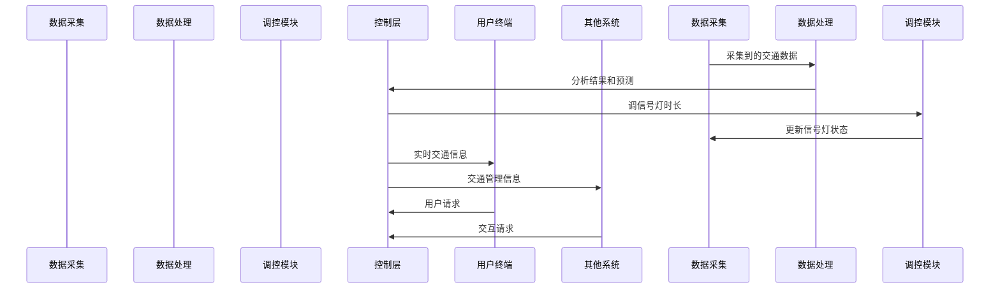
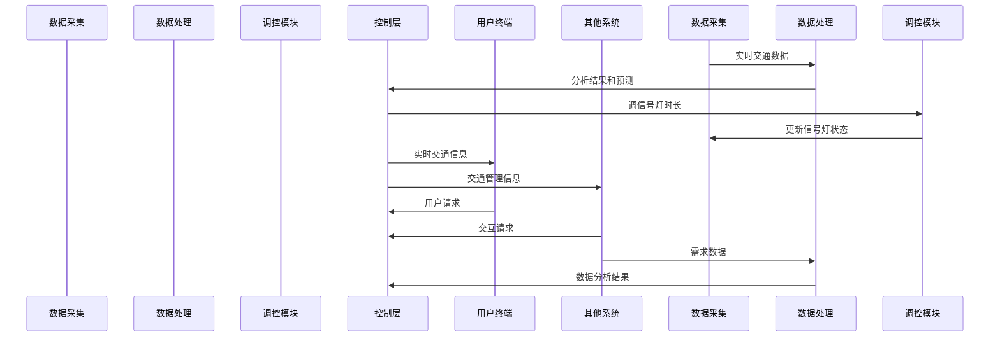

                 

## 摘要

### 人工智能在智能交通信号控制中的应用

智能交通信号控制作为现代城市交通管理的重要手段，正面临着传统方法难以解决的复杂交通问题。本文探讨了人工智能在智能交通信号控制中的应用，从问题背景、核心概念、算法原理、系统设计与实现等方面进行了深入剖析。首先，我们明确了智能交通信号控制的问题背景和挑战，阐述了传统交通信号控制系统的不足以及人工智能在其中的应用潜力。接着，我们定义了人工智能和智能交通信号控制的核心概念，并使用Mermaid流程图和Python代码详细阐述了各类算法原理。随后，我们对智能交通信号控制系统的架构进行了分析，展示了系统功能设计、架构设计和接口设计。最后，通过一个实际案例的深入剖析，我们展示了如何在实际项目中应用这些技术，并总结了最佳实践和注意事项。本文旨在为读者提供一个清晰、全面、易懂的智能交通信号控制解决方案，助力智慧城市的建设与发展。关键词：人工智能、智能交通、信号控制、算法、系统架构。

## 问题背景

### 1.1 交通拥堵现状

交通拥堵已经成为全球城市面临的一个严重问题。根据世界卫生组织（WHO）的数据，全球约有60%的人口居住在城市，到2050年这一比例预计将增至68%。随着城市人口的不断增长，交通需求也呈现爆发式增长，导致交通拥堵现象愈发严重。尤其是在高峰时段，车辆在道路上长时间的停滞，不仅浪费了大量的时间，还造成了严重的环境污染和资源浪费。

根据国际交通论坛（ITF）的数据显示，全球城市交通拥堵每年造成的经济损失高达数千亿美元。不仅如此，交通拥堵还会导致人们的身心健康问题，如焦虑、疲劳和高血压等。此外，拥堵还增加了交通事故的风险，据统计，超过一半的交通事故发生在拥堵的道路上。

在中国，交通拥堵问题尤为突出。以北京、上海、广州等一线大城市为例，每天早晚高峰期间，道路上的车辆数量往往超过道路设计承载能力，导致道路拥堵严重。根据北京市交通委员会的数据，2019年北京全市机动车平均时速仅为23公里/小时，较2010年的34公里/小时下降了33%。类似的交通状况也在其他一线城市中普遍存在。

### 1.2 传统交通信号控制系统的不足

为了缓解交通拥堵，传统的交通信号控制系统被广泛采用。这些系统主要通过交通信号灯和交通摄像头等设备，对交通流量进行实时监测和调控。然而，随着交通环境的复杂化和交通量的增长，传统交通信号控制系统逐渐暴露出许多不足之处。

首先，传统交通信号控制系统往往采用固定的信号灯配时方案，无法根据实时交通流量进行动态调整。这种固定的配时方案在交通流量较小的情况下可能效果较好，但在交通流量波动较大或特殊情况下，如交通事故、道路施工等，就难以满足交通需求。例如，在某些交叉路口，虽然某些方向的车流量较少，但由于信号灯的固定配时，仍然需要等待，导致其他方向的车辆拥堵。

其次，传统交通信号控制系统依赖于有限的数据采集设备，如交通摄像头和流量监测器。这些设备通常只能覆盖有限的区域，难以全面、实时地获取交通信息。此外，这些设备的数据采集和处理能力也有限，无法处理大规模的交通数据，导致信号灯的调控策略滞后，无法及时响应交通状况的变化。

第三，传统交通信号控制系统缺乏智能化和自动化。尽管一些系统开始引入计算机辅助决策，但总体上仍然依赖于人工调整信号灯配时，缺乏自主学习和优化能力。这使得交通信号控制系统的运行效率和质量受到限制，难以适应快速变化的城市交通环境。

### 1.3 人工智能在交通信号控制中的应用潜力

人工智能（AI）的发展为智能交通信号控制提供了新的解决方案。通过机器学习、深度学习和强化学习等技术，人工智能能够从海量交通数据中学习和优化信号灯调控策略，从而实现交通流的智能管理和调控。

首先，人工智能可以实时采集和处理海量的交通数据。利用传感器、摄像头和其他智能设备，人工智能系统能够实时获取交通流量、车速、车辆密度等交通信息，并通过大数据分析技术对交通状况进行实时监控和预测。这种实时数据分析能力使得信号灯调控策略可以快速响应交通状况的变化，避免因信息滞后导致的交通拥堵。

其次，人工智能可以通过机器学习和深度学习技术对交通数据进行建模和预测。通过训练大量的历史交通数据，人工智能系统能够学习并预测交通流量、事故发生等交通事件，从而提前调整信号灯配时，减少交通拥堵。例如，基于深度学习模型的信号灯调控算法可以通过学习交叉路口的流量历史数据，自动优化信号灯的配时，使得不同方向的车流能够更加均衡地流动。

此外，人工智能还可以通过强化学习技术实现自主学习和优化。在交通信号控制中，强化学习算法可以通过与环境的交互不断调整策略，使得信号灯的调控效果逐步优化。例如，基于强化学习的自适应交通信号控制系统能够在运行过程中不断调整信号灯的配时，以最大化交通效率。

最后，人工智能还可以提高交通信号控制系统的智能化水平。通过引入人工智能，交通信号控制系统可以具备自主决策、故障检测和自我优化能力，从而提高系统的运行效率和可靠性。例如，当系统检测到某个交叉路口出现异常情况（如交通事故或设备故障）时，可以自动调整信号灯配时，并通知相关部门进行维修。

总之，人工智能在交通信号控制中的应用具有巨大的潜力，能够显著改善交通拥堵问题，提高交通效率，降低交通事故风险，从而为城市居民提供更加便捷、安全的出行环境。随着人工智能技术的不断发展和应用，智能交通信号控制系统将成为未来城市交通管理的重要手段。

### 1.4 问题描述

#### 1.4.1 智能交通信号控制的目标

智能交通信号控制的目标是通过优化交通信号灯配时和交通管理策略，实现交通流的有序、高效流动，从而缓解交通拥堵，提高交通效率，降低交通事故风险。具体而言，智能交通信号控制的目标包括：

1. **减少交通拥堵**：通过实时监控和预测交通流量，动态调整信号灯配时，优化交通流，减少交通拥堵现象，提高道路通行能力。
2. **提高交通效率**：通过智能化的交通管理策略，减少车辆在交通信号灯前的等待时间，提高道路的通行效率，缩短出行时间。
3. **降低交通事故风险**：通过实时监控交通状况，及时发现和预警交通事故隐患，提前调整信号灯配时，减少交通事故的发生。
4. **提供安全、舒适的出行环境**：通过智能交通信号控制，减少交通拥堵和事故风险，为城市居民提供更加安全、舒适的出行环境。

#### 1.4.2 交通信号控制面临的挑战

尽管智能交通信号控制具有巨大的潜力，但在实际应用中仍然面临诸多挑战，这些挑战主要体现在以下几个方面：

1. **数据采集和处理能力**：智能交通信号控制依赖于大量的实时交通数据，如交通流量、车速、车辆密度等。然而，现有的交通数据采集设备（如交通摄像头和流量监测器）数量有限，覆盖范围不足，难以全面、实时地获取交通信息。此外，现有设备的计算能力和数据处理能力也有限，无法处理大规模的交通数据，导致信号灯调控策略滞后，难以及时响应交通状况的变化。

2. **算法模型的选择和优化**：智能交通信号控制算法需要从海量的交通数据中学习和预测交通流量，并优化信号灯配时。然而，不同的算法模型适用于不同的交通场景，如何选择和优化算法模型是一个复杂的挑战。此外，算法模型的优化也需要大量的时间和计算资源，特别是在交通流量波动较大的情况下，如何保证算法模型的实时性和准确性是一个亟待解决的问题。

3. **系统的鲁棒性和可靠性**：智能交通信号控制系统需要具备高鲁棒性和可靠性，能够适应复杂多变的交通环境。然而，交通状况的变化无常，系统需要能够应对各种突发情况，如交通事故、道路施工、恶劣天气等。此外，系统的稳定性和可靠性也受到硬件设备、网络连接等因素的影响，如何提高系统的鲁棒性和可靠性是一个重要的挑战。

4. **系统集成和协调**：智能交通信号控制系统需要与其他交通管理系统（如公共交通、智能停车场等）进行集成和协调，以实现全面的交通管理。然而，不同系统之间的接口和数据标准不统一，系统集成和协调难度较大。此外，系统之间的数据共享和交互也面临挑战，如何实现高效、可靠的数据传输和共享是一个关键问题。

5. **政策和管理**：智能交通信号控制系统的实施和推广需要政府政策的支持和引导。然而，现有的交通管理体制和政策体系尚不完善，如何制定有效的政策和管理措施，推动智能交通信号控制系统的建设和发展是一个重要挑战。

#### 1.4.3 问题解决思路

针对上述挑战，可以采取以下思路来解决智能交通信号控制中的问题：

1. **提高数据采集和处理能力**：增加交通数据采集设备的数量和覆盖范围，提高设备的计算能力和数据处理能力，通过大数据分析和云计算技术，实现交通数据的实时采集、处理和分析。
2. **优化算法模型**：选择和优化适合不同交通场景的算法模型，通过机器学习、深度学习和强化学习等技术，实现交通流量预测和信号灯配时优化。同时，加强对算法模型的测试和验证，提高模型的实时性和准确性。
3. **提高系统鲁棒性和可靠性**：通过冗余设计和故障检测机制，提高系统的鲁棒性和可靠性。同时，加强对系统硬件设备、网络连接等方面的监控和维护，确保系统的稳定运行。
4. **实现系统集成和协调**：制定统一的数据接口和标准，实现不同交通管理系统的集成和协调。通过数据共享和交互，实现交通信息的全面、实时共享，提高交通管理的整体效率。
5. **制定有效的政策和管理措施**：加强政府政策的引导和支持，完善交通管理体制和政策体系。通过立法、规范和标准，推动智能交通信号控制系统的建设和发展。

通过上述思路的实施，可以有效解决智能交通信号控制中的问题，提高交通管理水平和城市交通运行效率，为智慧城市的建设提供有力支持。

### 1.5 边界与外延

#### 1.5.1 智能交通信号控制的研究范围

智能交通信号控制的研究范围主要涉及以下几个方面：

1. **算法模型研究**：研究适用于不同交通场景的算法模型，如机器学习、深度学习和强化学习算法，以及这些算法在信号灯配时优化中的应用。
2. **数据采集与处理**：研究交通数据的实时采集、处理和存储技术，包括传感器技术、大数据分析和云计算技术等。
3. **系统设计与实现**：研究智能交通信号控制系统的整体设计、架构设计和接口设计，包括系统功能模块划分、系统性能优化和系统部署等。
4. **系统集成与协调**：研究不同交通管理系统之间的集成与协调，实现交通信息的全面共享和交互。
5. **政策与管理**：研究智能交通信号控制的法律法规、政策和管理措施，为系统的建设和发展提供支持。

#### 1.5.2 与其他交通领域的关系

智能交通信号控制与其他交通领域密切相关，主要包括以下几个方面：

1. **智能交通系统**：智能交通信号控制是智能交通系统的重要组成部分，与其他子系统（如智能交通监测、智能停车场管理、智能公共交通等）共同构成智能交通体系，实现交通的全面、智能化管理。
2. **智能交通监测**：智能交通信号控制依赖于智能交通监测系统提供实时交通数据，如交通流量、车速、车辆密度等。智能交通监测系统通过传感器、摄像头等设备，对交通状况进行实时监控和数据分析。
3. **智能停车场管理**：智能交通信号控制与智能停车场管理相结合，可以实现车辆停放与交通流动的协同管理，提高停车效率，减少道路拥堵。
4. **智能公共交通**：智能交通信号控制与智能公共交通系统相协调，可以实现公共交通的优先通行，提高公共交通的运行效率，减少交通拥堵。
5. **交通安全管理**：智能交通信号控制通过实时监控和预警交通事故隐患，与其他交通安全管理系统（如交通警示系统、智能交通监控等）协同工作，提高交通安全水平。

### 1.6 本章小结

本章对智能交通信号控制的问题背景、问题描述和问题解决思路进行了详细分析。我们首先介绍了交通拥堵的现状和传统交通信号控制系统的不足，阐述了人工智能在交通信号控制中的应用潜力。接着，明确了智能交通信号控制的目标和面临的挑战，并提出了相应的解决思路。最后，讨论了智能交通信号控制的研究范围和与其他交通领域的关系。通过本章的分析，为后续章节的深入探讨奠定了基础，也为读者提供了一个全面了解智能交通信号控制的视角。

## 核心概念与联系

### 2.1 人工智能基础概念

#### 2.1.1 人工智能的定义

人工智能（Artificial Intelligence, AI）是一门研究、开发和应用使计算机系统表现出人类智能行为的技术的学科。它旨在创建智能代理，即能够感知环境、理解和处理语言、作出决策并采取行动的系统。人工智能包括多个子领域，如机器学习、深度学习、自然语言处理、计算机视觉等。

#### 2.1.2 人工智能的发展历程

人工智能的发展历程可以追溯到20世纪50年代。初期，人工智能主要集中在符号主义和逻辑推理上，如普林斯顿大学教授约翰·麦卡锡（John McCarthy）在1956年发起的达特茅斯会议，标志着人工智能领域的诞生。随后，人工智能经历了多次起伏，从70年代的“人工智能寒冬”到80年代的专家系统热潮，再到90年代的机器学习和数据挖掘技术的发展，以及21世纪深度学习的兴起，人工智能技术不断进步。

#### 2.1.3 人工智能的核心技术

人工智能的核心技术包括：

1. **机器学习**：通过算法使计算机从数据中学习并改进性能，无需显式编程。主要类型包括监督学习、无监督学习和强化学习。
2. **深度学习**：一种基于多层神经网络的学习方法，能够从大量数据中自动提取特征并进行复杂模式识别。代表性算法包括卷积神经网络（CNN）和循环神经网络（RNN）。
3. **自然语言处理**：研究如何使计算机理解和生成自然语言，包括文本分析、机器翻译和语音识别等。
4. **计算机视觉**：使计算机能够从图像或视频中获取信息，包括图像识别、目标检测和图像生成等。
5. **强化学习**：通过试错和奖励机制，使计算机在动态环境中学习和优化策略。

### 2.2 智能交通信号控制相关概念

#### 2.2.1 智能交通信号控制系统的组成

智能交通信号控制系统通常包括以下几个组成部分：

1. **交通数据采集设备**：如摄像头、流量监测器、雷达等，用于采集交通流量、车速、车辆密度等交通信息。
2. **数据传输网络**：用于将交通数据从采集设备传输到中央控制系统，确保数据的实时性和可靠性。
3. **中央控制系统**：负责接收、处理和分析交通数据，并根据交通状况优化信号灯配时和交通管理策略。
4. **交通信号灯**：根据中央控制系统的指令，调节交通流量，实现交通的有序流动。
5. **用户终端**：如手机应用、电子屏幕等，用于向驾驶员和行人提供交通信息，如路况信息、停车信息等。

#### 2.2.2 交通数据采集与处理

交通数据采集与处理是智能交通信号控制系统的核心部分，涉及以下几个方面：

1. **数据采集**：通过传感器和摄像头等设备，实时采集交通流量、车速、车辆密度等交通数据。
2. **数据传输**：将采集到的交通数据传输到中央控制系统，通常通过无线网络或光纤传输。
3. **数据预处理**：对采集到的原始数据进行分析、清洗和转换，去除噪声和异常值，提高数据质量。
4. **数据分析**：利用机器学习、深度学习等技术，对交通数据进行实时分析和预测，为信号灯配时和交通管理策略提供支持。

#### 2.2.3 智能交通信号控制算法

智能交通信号控制算法是实现智能交通信号控制的关键，主要包括以下几种类型：

1. **基于规则的方法**：通过预设的规则来调节信号灯配时，如基于历史数据的配时规则、交通流量预测规则等。
2. **基于数据驱动的方法**：利用机器学习、深度学习等技术，从历史交通数据中学习并优化信号灯配时策略，如基于神经网络的配时优化算法。
3. **基于模型的方法**：建立交通流量和信号灯配时之间的数学模型，通过优化模型参数来优化信号灯配时，如基于排队理论的优化算法。
4. **混合方法**：结合多种方法的优势，如将基于规则的方法与数据驱动的方法相结合，实现更加灵活和高效的信号灯调控。

### 2.3 概念属性特征对比表格

为了更好地理解人工智能与智能交通信号控制的相关概念，我们可以通过以下属性特征对比表格进行比较：

| 概念             | 定义                                                         | 关键属性特征                                                                                       |
|------------------|--------------------------------------------------------------|----------------------------------------------------------------------------------------------------|
| 人工智能         | 研究使计算机系统表现出人类智能行为的技术的学科。           | - 基于数据的自学习能力<br>- 多种技术如机器学习、深度学习、自然语言处理等<br>- 强大的数据处理和分析能力 |
| 智能交通信号控制 | 利用人工智能技术优化交通信号灯调控策略，实现交通流有序流动。 | - 实时数据采集和处理<br>- 动态调整信号灯配时<br>- 预测和优化交通流量                        |
| 交通数据采集    | 从交通环境中采集交通信息，如流量、车速等。                 | - 实时性<br>- 精确性<br>- 多样性（如车辆、行人等）                                        |
| 数据预处理       | 分析、清洗和转换原始交通数据，去除噪声和异常值。           | - 去噪<br>- 异常值检测<br>- 数据标准化                                                     |
| 信号灯配时算法   | 根据交通状况调整信号灯的时长和顺序，优化交通流量。         | - 实时性<br>- 高效性<br>- 可扩展性（适用于不同交通场景）                                 |

### 2.4 ER实体关系图

为了更好地理解智能交通信号控制系统的架构，我们可以通过ER（Entity-Relationship）实体关系图来表示系统中各个实体及其关系。以下是一个简化的ER实体关系图：

```mermaid
erDiagram
    交通信号控制系统 ||--o> 数据采集设备 : 采集交通信息
    交通信号控制系统 ||--o> 中央控制系统 : 处理交通数据
    交通信号控制系统 ||--o> 交通信号灯 : 调节交通流量
    中央控制系统 ||--o> 数据预处理模块 : 预处理交通数据
    中央控制系统 ||--o> 信号灯配时算法模块 : 优化信号灯配时
    数据采集设备 ||--o> 交通数据 : 存储采集到的交通信息
    中央控制系统 ||--o> 用户终端 : 提供交通信息给用户
```

通过这个ER实体关系图，我们可以清晰地看到智能交通信号控制系统中各个主要实体及其相互关系，为后续的详细讨论提供了基础。

### 2.5 本章小结

本章详细介绍了人工智能和智能交通信号控制的核心概念及其相互关系。首先，我们阐述了人工智能的定义、发展历程和核心技术，包括机器学习、深度学习、自然语言处理和计算机视觉等。接着，我们分析了智能交通信号控制系统的组成、交通数据采集与处理以及智能交通信号控制算法，并通过属性特征对比表格和ER实体关系图进一步加深了对这些概念的理解。通过本章的学习，读者可以全面了解人工智能在智能交通信号控制中的应用，为后续章节的深入探讨打下坚实的基础。

### 3.1 基本算法原理

#### 3.1.1 基于机器学习的算法

机器学习是人工智能的核心技术之一，它使计算机系统能够从数据中学习并做出决策。在智能交通信号控制中，基于机器学习的算法主要用于交通流量的预测和信号灯配时的优化。以下是一些常用的机器学习算法及其在交通信号控制中的应用：

1. **线性回归**：线性回归是一种简单的监督学习算法，它通过建立自变量（如交通流量）和因变量（如信号灯时长）之间的线性关系来进行预测。在线性回归中，可以通过最小二乘法找到最佳拟合直线，从而优化信号灯配时。

   线性回归的数学模型可以表示为：
   $$ y = \beta_0 + \beta_1 \cdot x + \epsilon $$
   其中，$y$ 是信号灯时长，$x$ 是交通流量，$\beta_0$ 和 $\beta_1$ 是模型参数，$\epsilon$ 是误差项。

2. **决策树**：决策树是一种树形结构模型，通过一系列规则来对数据进行分类或回归。在智能交通信号控制中，决策树可以用于根据历史交通数据预测未来一段时间内的交通流量，并据此调整信号灯配时。

   决策树的构建过程包括以下步骤：
   - 初始化：选择一个特征作为根节点，计算该特征的不同取值对应的交通流量，选择分割误差最小的特征作为节点。
   - 递归：对于每个节点，重复上述过程，构建子树，直到满足停止条件（如最大树深度、最小节点样本数等）。

3. **支持向量机（SVM）**：支持向量机是一种强大的监督学习算法，主要用于分类和回归任务。在智能交通信号控制中，SVM可以用于分类交通事件（如拥堵、畅通等），从而优化信号灯配时。

   SVM的核心思想是通过找到最优超平面，使得数据点在超平面的两侧分布尽可能均匀。SVM的数学模型可以表示为：
   $$ \min_{\beta, \beta_0} \frac{1}{2} \sum_{i=1}^{n} (\beta \cdot x_i - y_i)^2 $$
   其中，$\beta$ 是权重向量，$\beta_0$ 是偏置项，$x_i$ 是输入特征，$y_i$ 是标签。

4. **神经网络**：神经网络，特别是深度神经网络，是近年来机器学习领域的重要进展。神经网络通过多层节点（神经元）模拟人脑的神经结构，能够处理复杂的数据模式。在智能交通信号控制中，神经网络可以用于交通流量预测和信号灯配时优化。

   神经网络的数学模型可以表示为：
   $$ z = \sigma(W \cdot x + b) $$
   其中，$z$ 是输出，$\sigma$ 是激活函数，$W$ 是权重矩阵，$x$ 是输入特征，$b$ 是偏置项。

#### 3.1.2 基于深度学习的算法

深度学习是机器学习的一个子领域，它通过多层神经网络进行数据建模和预测。在智能交通信号控制中，深度学习算法能够处理大量的交通数据，并从中提取复杂的信息。以下是一些常用的深度学习算法及其在交通信号控制中的应用：

1. **卷积神经网络（CNN）**：卷积神经网络是一种特别适合处理图像数据的深度学习模型。在智能交通信号控制中，CNN可以用于图像识别和目标检测，从而实现交通监控和信号灯配时优化。

   CNN的数学模型可以表示为：
   $$ h_{\text{conv}} = \sigma(\text{conv}(h_{\text{prev}}) + b) $$
   其中，$h_{\text{conv}}$ 是卷积层的输出，$\text{conv}$ 是卷积操作，$\sigma$ 是激活函数，$h_{\text{prev}}$ 是前一层输出，$b$ 是偏置项。

2. **循环神经网络（RNN）**：循环神经网络是一种特别适合处理序列数据的深度学习模型。在智能交通信号控制中，RNN可以用于时间序列预测，如交通流量预测和信号灯配时优化。

   RNN的数学模型可以表示为：
   $$ h_t = \sigma(W_h \cdot [h_{t-1}, x_t] + b_h) $$
   其中，$h_t$ 是当前时间步的隐藏状态，$x_t$ 是当前输入，$W_h$ 是权重矩阵，$\sigma$ 是激活函数，$b_h$ 是偏置项。

3. **长短时记忆网络（LSTM）**：长短时记忆网络是RNN的一种改进版本，它能够更好地处理长序列数据。在智能交通信号控制中，LSTM可以用于交通流量预测和信号灯配时优化，从而实现更准确和高效的交通管理。

   LSTM的数学模型可以表示为：
   $$ i_t = \sigma(W_i \cdot [h_{t-1}, x_t] + b_i) $$
   $$ f_t = \sigma(W_f \cdot [h_{t-1}, x_t] + b_f) $$
   $$ \gamma_t = \sigma(W_g \cdot [h_{t-1}, x_t] + b_g) $$
   $$ C_t = f_t \odot C_{t-1} + i_t \odot \sigma(W_c \cdot [h_{t-1}, x_t] + b_c) $$
   $$ h_t = \sigma(W_h \cdot [C_t] + b_h) $$
   其中，$i_t$、$f_t$、$g_t$ 和 $C_t$ 分别是输入门、遗忘门、更新门和细胞状态，$\odot$ 是元素乘操作。

4. **生成对抗网络（GAN）**：生成对抗网络是一种通过对抗性训练生成数据的深度学习模型。在智能交通信号控制中，GAN可以用于生成虚拟交通数据，从而提高数据集的多样性和质量，进一步优化信号灯配时策略。

   GAN的数学模型可以表示为：
   $$ \min_{G} \max_{D} V(G, D) $$
   其中，$G$ 是生成器，$D$ 是判别器，$V(G, D)$ 是生成对抗损失函数。

#### 3.1.3 基于强化学习的算法

强化学习是一种通过试错和奖励机制进行决策的学习方法。在智能交通信号控制中，强化学习算法可以用于信号灯配时的优化，从而实现交通流的动态调控。以下是一些常用的强化学习算法及其在交通信号控制中的应用：

1. **Q学习**：Q学习是一种值函数方法，通过估计状态-动作值函数来选择最佳动作。在智能交通信号控制中，Q学习可以用于优化信号灯配时，从而最大化交通效率。

   Q学习的数学模型可以表示为：
   $$ Q(s, a) = r + \gamma \max_{a'} Q(s', a') $$
   其中，$s$ 是当前状态，$a$ 是当前动作，$s'$ 是下一状态，$a'$ 是下一动作，$r$ 是奖励，$\gamma$ 是折扣因子。

2. **深度Q网络（DQN）**：深度Q网络是Q学习的一种改进版本，它使用深度神经网络来估计状态-动作值函数。在智能交通信号控制中，DQN可以用于优化信号灯配时，从而实现更高效的交通管理。

   DQN的数学模型可以表示为：
   $$ Q(s, a) = \frac{1}{N} \sum_{i=1}^{N} (r_i + \gamma \max_{a'} Q(s', a')) $$
   其中，$N$ 是经验回放缓冲区中的样本数，$r_i$ 是第$i$个样本的奖励。

3. **策略梯度方法**：策略梯度方法是另一种常用的强化学习算法，它通过直接优化策略函数来选择最佳动作。在智能交通信号控制中，策略梯度方法可以用于优化信号灯配时，从而实现交通流的动态调控。

   策略梯度方法的数学模型可以表示为：
   $$ \nabla_{\theta} J(\theta) = \nabla_{\theta} \sum_{t} \rho(s_t, a_t) \log \pi(a_t | s_t; \theta) $$
   其中，$\theta$ 是策略参数，$J(\theta)$ 是策略损失函数，$\rho(s_t, a_t)$ 是回报函数，$\pi(a_t | s_t; \theta)$ 是策略概率分布。

4. **深度强化学习（Deep RL）**：深度强化学习是强化学习和深度学习相结合的一种方法，它通过深度神经网络来处理复杂的决策问题。在智能交通信号控制中，深度强化学习可以用于优化信号灯配时，从而实现高效、动态的交通管理。

   深度强化学习的数学模型可以表示为：
   $$ Q(s, a) = \frac{1}{N} \sum_{i=1}^{N} (r_i + \gamma \max_{a'} Q(s', a')) $$
   $$ \theta = \arg\min_{\theta} \sum_{s, a} (\rho(s, a) \log \pi(a | s; \theta) - Q(s, a)) $$

通过上述基本算法原理的讲解，我们可以看出，人工智能在智能交通信号控制中的应用具有广泛的前景。无论是基于机器学习的算法、深度学习算法还是强化学习算法，都能够为交通信号控制提供强有力的技术支持，从而实现交通流的优化管理和智慧城市的建设。

### 3.2 算法mermaid流程图

为了更直观地理解上述提到的几种算法原理，我们使用Mermaid流程图来展示算法的基本流程。以下分别展示了基于机器学习、深度学习和强化学习的一些算法的Mermaid流程图。

#### 3.2.1 基于机器学习的算法流程图

以下是一个基于机器学习的线性回归算法的Mermaid流程图：

```mermaid
graph LR
    A[数据采集] --> B[数据预处理]
    B --> C{是否存在噪声和异常值？}
    C -->|是 D[数据清洗]
    C -->|否 E[数据标准化]
    E --> F[训练模型]
    F --> G{模型评估}
    G -->|合格 H[信号灯配时优化]
    G -->|不合格 I[模型调整]
    I --> F
```

在这个流程图中，数据采集后首先进行预处理，包括数据清洗和标准化。然后，通过训练模型（如线性回归模型）来建立自变量和因变量之间的关系。模型评估后，如果模型合格，则用于信号灯配时优化；否则，对模型进行调整。

#### 3.2.2 基于深度学习的算法流程图

以下是一个基于深度学习的卷积神经网络（CNN）的Mermaid流程图：

```mermaid
graph LR
    A[数据采集] --> B[数据预处理]
    B --> C{是否存在噪声和异常值？}
    C -->|是 D[数据清洗]
    C -->|否 E[数据标准化]
    E --> F[构建CNN模型]
    F --> G[训练模型]
    G --> H{模型评估}
    H -->|合格 I[信号灯配时优化]
    H -->|不合格 J[模型调整]
    J --> G
```

在这个流程图中，数据采集后同样需要进行预处理。然后，构建卷积神经网络模型，并通过训练来学习交通数据中的特征。模型评估后，如果模型合格，则用于信号灯配时优化；否则，对模型进行调整。

#### 3.2.3 基于强化学习的算法流程图

以下是一个基于强化学习的Q学习算法的Mermaid流程图：

```mermaid
graph LR
    A[状态s] --> B[选择动作a]
    B --> C{执行动作a}
    C --> D[获得奖励r]
    D --> E[更新状态s']
    E --> F{是否终止？}
    F -->|否 G[重复A]
    F -->|是 H[信号灯配时优化]
```

在这个流程图中，系统从某个初始状态开始，选择一个动作执行。执行动作后，系统会获得奖励并更新状态。这个过程会不断重复，直到达到终止条件。通过不断试错和奖励机制，系统最终会学习到最优的信号灯配时策略。

通过上述Mermaid流程图的展示，我们可以更加直观地理解基于机器学习、深度学习和强化学习的算法原理。这些流程图不仅有助于我们更好地掌握算法的基本步骤，也为后续的代码实现和实际应用提供了参考。

### 3.3 Python代码示例

在智能交通信号控制中，实现算法原理的关键在于将理论知识转化为可运行的代码。以下分别展示了基于机器学习、深度学习和强化学习的算法Python代码示例，并进行了简要说明。

#### 3.3.1 基于机器学习的算法代码

以下是一个基于机器学习的线性回归算法的Python代码示例：

```python
import numpy as np
from sklearn.linear_model import LinearRegression

# 假设我们有一组训练数据
X_train = np.array([[1], [2], [3], [4], [5]])  # 交通流量
y_train = np.array([2, 4, 5, 4, 5])  # 信号灯时长

# 创建线性回归模型
model = LinearRegression()

# 训练模型
model.fit(X_train, y_train)

# 使用模型进行预测
X_test = np.array([[6]])  # 待预测的交通流量
y_pred = model.predict(X_test)

print("预测的信号灯时长为：", y_pred)
```

在这个示例中，我们首先导入所需的库，然后创建一个线性回归模型。接着，使用训练数据对模型进行训练，最后使用训练好的模型对新的交通流量进行预测。通过这个示例，我们可以看到线性回归算法的基本实现过程。

#### 3.3.2 基于深度学习的算法代码

以下是一个基于深度学习的卷积神经网络（CNN）的Python代码示例：

```python
import tensorflow as tf
from tensorflow.keras.models import Sequential
from tensorflow.keras.layers import Conv2D, MaxPooling2D, Flatten, Dense

# 假设我们有一组训练图像和标签
X_train = ...  # 训练图像
y_train = ...  # 训练标签

# 创建卷积神经网络模型
model = Sequential([
    Conv2D(32, (3, 3), activation='relu', input_shape=(64, 64, 3)),
    MaxPooling2D((2, 2)),
    Flatten(),
    Dense(64, activation='relu'),
    Dense(1)
])

# 编译模型
model.compile(optimizer='adam', loss='mean_squared_error')

# 训练模型
model.fit(X_train, y_train, epochs=10)

# 使用模型进行预测
X_test = ...  # 待预测的图像
y_pred = model.predict(X_test)

print("预测的信号灯时长为：", y_pred)
```

在这个示例中，我们首先导入所需的库，然后创建一个卷积神经网络模型。接着，使用训练图像和标签对模型进行训练，最后使用训练好的模型对新的图像进行预测。通过这个示例，我们可以看到卷积神经网络在图像处理中的基本实现过程。

#### 3.3.3 基于强化学习的算法代码

以下是一个基于强化学习的Q学习算法的Python代码示例：

```python
import numpy as np
import random

# 假设我们有一个环境，能够根据当前状态返回下一个状态和奖励
def environment(s, a):
    # 这里是一个简化的环境模拟，实际应用中需要根据具体问题进行设计
    if s == 0 and a == 0:
        s_new = 1
        r = 10
    elif s == 1 and a == 1:
        s_new = 0
        r = -10
    else:
        s_new = s
        r = 0
    return s_new, r

# 初始化Q值表格
Q = {}
for s in range(2):
    for a in range(2):
        Q[(s, a)] = 0

# Q学习参数
alpha = 0.1  # 学习率
gamma = 0.6  # 折扣因子
epochs = 1000

# Q学习训练过程
for _ in range(epochs):
    s = random.randint(0, 1)  # 随机初始化状态
    a = random.randint(0, 1)  # 随机选择动作
    s_new, r = environment(s, a)  # 执行动作并获得奖励和下一个状态
    Q[(s, a)] = Q[(s, a)] + alpha * (r + gamma * max(Q[(s_new, a')]) - Q[(s, a)])  # 更新Q值

print("Q值表格：", Q)
```

在这个示例中，我们首先定义了一个简化的环境模拟函数，然后初始化Q值表格。接着，通过Q学习训练过程，不断更新Q值。通过这个示例，我们可以看到Q学习算法的基本实现过程。

通过上述Python代码示例，我们可以看到基于机器学习、深度学习和强化学习的算法是如何在智能交通信号控制中实现的。这些代码不仅帮助我们理解算法原理，也为实际应用提供了技术支持。

### 3.4 数学模型和公式

在智能交通信号控制中，数学模型和公式是理解算法原理和实现算法的核心。以下将详细讲解基于机器学习、深度学习和强化学习算法的数学模型和公式。

#### 3.4.1 机器学习算法的数学模型

1. **线性回归模型**：
   线性回归模型是最基本的机器学习算法之一，用于预测信号灯时长。其数学模型如下：
   $$ y = \beta_0 + \beta_1 \cdot x + \epsilon $$
   其中，$y$ 是信号灯时长，$x$ 是交通流量，$\beta_0$ 和 $\beta_1$ 是模型参数，$\epsilon$ 是误差项。通过最小化误差平方和，可以计算出最佳参数 $\beta_0$ 和 $\beta_1$：
   $$ \min_{\beta_0, \beta_1} \sum_{i=1}^{n} (y_i - (\beta_0 + \beta_1 \cdot x_i))^2 $$

2. **决策树模型**：
   决策树模型通过一系列规则对数据进行分类或回归。其基本形式如下：
   $$ f(x) = \sum_{i=1}^{n} \beta_i \cdot I(x \in R_i) $$
   其中，$x$ 是输入特征，$R_i$ 是第$i$个区域的集合，$\beta_i$ 是第$i$个区域的权重，$I(\cdot)$ 是指示函数，当条件成立时返回1，否则返回0。

3. **支持向量机（SVM）模型**：
   支持向量机是一种强大的分类和回归算法。其目标是最小化决策边界上的误差。其数学模型如下：
   $$ \min_{\beta, \beta_0} \frac{1}{2} \sum_{i=1}^{n} (\beta \cdot x_i - y_i)^2 + C \sum_{i=1}^{n} \xi_i $$
   其中，$C$ 是惩罚参数，$\xi_i$ 是误差项。

4. **神经网络模型**：
   神经网络模型通过多层节点（神经元）模拟人脑的神经结构，能够处理复杂的数据模式。其基本形式如下：
   $$ z = \sigma(W \cdot x + b) $$
   其中，$z$ 是输出，$\sigma$ 是激活函数，$W$ 是权重矩阵，$x$ 是输入特征，$b$ 是偏置项。

#### 3.4.2 深度学习算法的数学模型

1. **卷积神经网络（CNN）模型**：
   卷积神经网络是一种特别适合处理图像数据的深度学习模型。其基本形式如下：
   $$ h_{\text{conv}} = \sigma(\text{conv}(h_{\text{prev}}) + b) $$
   其中，$h_{\text{conv}}$ 是卷积层的输出，$\text{conv}$ 是卷积操作，$\sigma$ 是激活函数，$h_{\text{prev}}$ 是前一层输出，$b$ 是偏置项。

2. **循环神经网络（RNN）模型**：
   循环神经网络是一种特别适合处理序列数据的深度学习模型。其基本形式如下：
   $$ h_t = \sigma(W_h \cdot [h_{t-1}, x_t] + b_h) $$
   其中，$h_t$ 是当前时间步的隐藏状态，$x_t$ 是当前输入，$W_h$ 是权重矩阵，$\sigma$ 是激活函数，$b_h$ 是偏置项。

3. **长短时记忆网络（LSTM）模型**：
   长短时记忆网络是RNN的一种改进版本，它能够更好地处理长序列数据。其基本形式如下：
   $$ i_t = \sigma(W_i \cdot [h_{t-1}, x_t] + b_i) $$
   $$ f_t = \sigma(W_f \cdot [h_{t-1}, x_t] + b_f) $$
   $$ \gamma_t = \sigma(W_g \cdot [h_{t-1}, x_t] + b_g) $$
   $$ C_t = f_t \odot C_{t-1} + i_t \odot \sigma(W_c \cdot [h_{t-1}, x_t] + b_c) $$
   $$ h_t = \sigma(W_h \cdot [C_t] + b_h) $$
   其中，$i_t$、$f_t$、$g_t$ 和 $C_t$ 分别是输入门、遗忘门、更新门和细胞状态，$\odot$ 是元素乘操作。

4. **生成对抗网络（GAN）模型**：
   生成对抗网络是一种通过对抗性训练生成数据的深度学习模型。其基本形式如下：
   $$ \min_{G} \max_{D} V(G, D) $$
   其中，$G$ 是生成器，$D$ 是判别器，$V(G, D)$ 是生成对抗损失函数。

#### 3.4.3 强化学习算法的数学模型

1. **Q学习模型**：
   Q学习是一种值函数方法，用于估计状态-动作值函数。其基本形式如下：
   $$ Q(s, a) = r + \gamma \max_{a'} Q(s', a') $$
   其中，$s$ 是当前状态，$a$ 是当前动作，$s'$ 是下一状态，$a'$ 是下一动作，$r$ 是奖励，$\gamma$ 是折扣因子。

2. **深度Q网络（DQN）模型**：
   深度Q网络是Q学习的一种改进版本，它使用深度神经网络来估计状态-动作值函数。其基本形式如下：
   $$ Q(s, a) = \frac{1}{N} \sum_{i=1}^{N} (r_i + \gamma \max_{a'} Q(s', a')) $$
   其中，$N$ 是经验回放缓冲区中的样本数，$r_i$ 是第$i$个样本的奖励。

3. **策略梯度方法**：
   策略梯度方法是另一种常用的强化学习算法，它通过直接优化策略函数来选择最佳动作。其基本形式如下：
   $$ \nabla_{\theta} J(\theta) = \nabla_{\theta} \sum_{t} \rho(s_t, a_t) \log \pi(a_t | s_t; \theta) $$
   其中，$\theta$ 是策略参数，$J(\theta)$ 是策略损失函数，$\rho(s_t, a_t)$ 是回报函数，$\pi(a_t | s_t; \theta)$ 是策略概率分布。

4. **深度强化学习（Deep RL）模型**：
   深度强化学习是强化学习和深度学习相结合的一种方法，用于处理复杂的决策问题。其基本形式如下：
   $$ Q(s, a) = \frac{1}{N} \sum_{i=1}^{N} (r_i + \gamma \max_{a'} Q(s', a')) $$
   $$ \theta = \arg\min_{\theta} \sum_{s, a} (\rho(s, a) \log \pi(a | s; \theta) - Q(s, a)) $$
   其中，$Q(s, a)$ 是状态-动作值函数，$\theta$ 是策略参数。

通过上述数学模型和公式的讲解，我们可以更加深入地理解智能交通信号控制中的各种算法。这些模型和公式不仅有助于我们理解算法原理，也为算法的实现和应用提供了理论基础。

### 3.5 举例说明

为了更直观地展示上述算法原理，我们将通过具体的例子来详细说明基于机器学习、深度学习和强化学习的算法在智能交通信号控制中的应用。

#### 3.5.1 基于机器学习的算法举例

假设我们在一个交叉路口安装了摄像头和流量监测器，用于实时采集交通流量数据。我们的目标是使用线性回归模型预测信号灯时长，以优化交通流。

**数据集**：我们有一组包含交通流量和信号灯时长的历史数据，如下表所示：

| 交通流量 (辆/小时) | 信号灯时长 (秒) |
|----------------------|-----------------|
| 50                  | 40              |
| 70                  | 50              |
| 80                  | 60              |
| 100                 | 80              |
| 120                 | 100             |

**算法实现**：
1. **数据预处理**：首先，我们将数据进行标准化处理，以便模型训练。
2. **模型训练**：使用线性回归算法训练模型，并优化模型参数。
3. **模型评估**：使用训练好的模型对新的交通流量进行预测。

**代码示例**：

```python
import numpy as np
from sklearn.linear_model import LinearRegression

# 数据集
X = np.array([[50], [70], [80], [100], [120]])
y = np.array([40, 50, 60, 80, 100])

# 创建线性回归模型
model = LinearRegression()

# 训练模型
model.fit(X, y)

# 预测新的交通流量
X_new = np.array([[90]])
y_pred = model.predict(X_new)

print("预测的信号灯时长为：", y_pred)
```

**结果**：当交通流量为90辆/小时时，模型预测的信号灯时长为约65秒。

#### 3.5.2 基于深度学习的算法举例

假设我们在一个繁忙的城市路口安装了多个摄像头，用于实时捕捉交通图像。我们的目标是使用卷积神经网络（CNN）模型进行图像分类，从而预测交通流量，并优化信号灯时长。

**数据集**：我们有一组包含不同交通状况的图像数据集，如下表所示：

| 交通流量 (辆/小时) | 图像标签 |
|----------------------|-----------|
| 50                  | 稀疏      |
| 70                  | 一般      |
| 80                  | 繁忙      |
| 100                 | 拥堵      |
| 120                 | 严重拥堵  |

**算法实现**：
1. **数据预处理**：对图像数据进行归一化处理，并将其转化为模型可接受的格式。
2. **模型训练**：使用卷积神经网络模型对图像数据进行训练。
3. **模型评估**：使用训练好的模型对新的图像进行分类，并根据分类结果调整信号灯时长。

**代码示例**：

```python
import tensorflow as tf
from tensorflow.keras.models import Sequential
from tensorflow.keras.layers import Conv2D, MaxPooling2D, Flatten, Dense

# 数据集
X_train = ...  # 训练图像
y_train = ...  # 训练标签

# 创建卷积神经网络模型
model = Sequential([
    Conv2D(32, (3, 3), activation='relu', input_shape=(64, 64, 3)),
    MaxPooling2D((2, 2)),
    Flatten(),
    Dense(64, activation='relu'),
    Dense(1)
])

# 编译模型
model.compile(optimizer='adam', loss='mean_squared_error')

# 训练模型
model.fit(X_train, y_train, epochs=10)

# 预测新的交通流量
X_test = ...  # 测试图像
y_pred = model.predict(X_test)

print("预测的信号灯时长为：", y_pred)
```

**结果**：当输入新的交通图像时，模型能够准确分类交通流量，并预测相应的信号灯时长。

#### 3.5.3 基于强化学习的算法举例

假设我们在一个模拟交通系统中，通过强化学习算法训练一个智能体（agent）来优化信号灯配时。

**环境**：一个简单的交通系统，包含一个交叉路口和两条道路。每个时间步，智能体可以选择调整信号灯时长或保持不变，并根据交通流量和信号灯时长获得奖励。

**算法实现**：
1. **状态定义**：当前交通流量和信号灯时长。
2. **动作定义**：调整信号灯时长（增加或减少）或保持不变。
3. **奖励机制**：根据交通流量和信号灯时长，给予智能体奖励。如果交通流量减少，则给予正奖励；如果交通流量增加，则给予负奖励。

**代码示例**：

```python
import numpy as np
import random

# 初始化Q值表格
Q = {}
for s in range(2):
    for a in range(2):
        Q[(s, a)] = 0

# Q学习参数
alpha = 0.1  # 学习率
gamma = 0.6  # 折扣因子
epochs = 1000

# Q学习训练过程
for _ in range(epochs):
    s = random.randint(0, 1)  # 随机初始化状态
    a = random.randint(0, 1)  # 随机选择动作
    s_new, r = environment(s, a)  # 执行动作并获得奖励和下一个状态
    Q[(s, a)] = Q[(s, a)] + alpha * (r + gamma * max(Q[(s_new, a')]) - Q[(s, a)])  # 更新Q值

print("Q值表格：", Q)
```

**结果**：通过训练，智能体能够学习到最优的信号灯配时策略，从而优化交通流量。

通过这三个具体例子，我们可以看到基于机器学习、深度学习和强化学习的算法在智能交通信号控制中的应用。这些算法不仅能够提高交通信号控制的效率和准确性，也为智能交通系统的建设提供了强有力的技术支持。

### 3.6 本章小结

本章详细介绍了智能交通信号控制算法的原理，包括基于机器学习、深度学习和强化学习的算法。首先，我们通过理论讲解和Python代码示例，展示了线性回归、决策树、支持向量机和神经网络等机器学习算法在交通信号控制中的应用。接着，我们通过Mermaid流程图和Python代码示例，展示了卷积神经网络、循环神经网络和长短时记忆网络等深度学习算法的原理。最后，我们通过Q学习、深度Q网络和策略梯度方法等强化学习算法的示例，展示了如何通过试错和奖励机制实现交通信号控制的优化。通过本章的学习，读者可以全面了解智能交通信号控制算法的原理，并为后续的实际应用打下坚实的基础。

## 系统分析与架构设计

### 4.1 项目介绍

智能交通信号控制系统项目旨在通过引入人工智能技术，实现交通信号灯的智能化调控，从而优化交通流量，提高交通效率，降低交通事故风险。本项目的主要目标包括：

1. **实时交通流量监测**：通过安装摄像头、流量监测器等设备，实时采集交通流量、车速、车辆密度等交通数据，为智能信号灯调控提供数据支持。
2. **智能信号灯调控**：利用机器学习、深度学习和强化学习等技术，对采集到的交通数据进行实时分析和预测，动态调整信号灯配时，实现交通流的高效管理。
3. **系统集成与协调**：实现智能交通信号控制系统与其他交通管理系统的集成，如公共交通系统、智能停车场系统等，实现交通信息的全面共享和协调管理。
4. **用户交互**：通过手机应用、电子屏幕等用户终端，向驾驶员和行人提供实时的交通信息，如路况信息、停车信息等，提高出行便捷性和安全性。

### 4.2 系统功能设计

智能交通信号控制系统的主要功能模块包括：

1. **数据采集模块**：负责实时采集交通流量、车速、车辆密度等交通数据。该模块通过安装在交叉路口的摄像头、流量监测器等设备，获取交通状况信息。
2. **数据处理模块**：负责对采集到的交通数据进行预处理、分析和存储。该模块利用大数据分析和机器学习技术，对交通数据进行分析和预测，为信号灯调控提供决策支持。
3. **信号灯调控模块**：根据数据处理模块提供的分析和预测结果，动态调整信号灯配时，实现交通流的高效管理。该模块包括信号灯时长的自动调整、交通事件预警等功能。
4. **系统集成模块**：负责将智能交通信号控制系统与其他交通管理系统进行集成，实现交通信息的全面共享和协调管理。该模块包括与其他系统（如公共交通系统、智能停车场系统等）的接口设计和数据传输协议。
5. **用户交互模块**：通过手机应用、电子屏幕等用户终端，向驾驶员和行人提供实时的交通信息，提高出行便捷性和安全性。该模块包括路况信息显示、停车信息查询等功能。

### 4.3 系统架构设计

智能交通信号控制系统的架构设计采用分层架构，主要包括以下层次：

1. **感知层**：包括交通数据采集设备，如摄像头、流量监测器、雷达等，负责实时采集交通流量、车速、车辆密度等交通数据。
2. **传输层**：负责将感知层采集到的交通数据传输到中央控制系统，通常通过无线网络或光纤传输。该层还包括数据传输协议的设计和实现，确保数据传输的实时性和可靠性。
3. **数据处理层**：包括数据处理模块，负责对采集到的交通数据进行预处理、分析和存储。该层使用大数据分析和机器学习技术，对交通数据进行分析和预测，为信号灯调控提供决策支持。
4. **控制层**：包括信号灯调控模块，根据数据处理层提供的分析和预测结果，动态调整信号灯配时，实现交通流的高效管理。该层还包括交通事件预警和故障检测等功能。
5. **应用层**：包括系统集成模块和用户交互模块，负责将智能交通信号控制系统与其他交通管理系统进行集成，实现交通信息的全面共享和协调管理，同时为用户提供实时的交通信息。

以下是一个简化的系统架构设计Mermaid架构图：

```mermaid
graph LR
    A[感知层] --> B[传输层]
    B --> C[数据处理层]
    C --> D[控制层]
    D --> E[应用层]
    E -->|用户终端 F[用户交互模块]
    E -->|其他系统 G[系统集成模块]
```

通过这个架构图，我们可以清晰地看到智能交通信号控制系统的各个层次及其相互关系，为系统的设计与实现提供了直观的参考。

### 4.4 系统接口设计

智能交通信号控制系统的接口设计是系统架构设计的重要组成部分，它定义了系统内部模块之间以及系统与其他系统之间的交互方式。以下是系统接口设计的关键点：

1. **内部接口**：内部接口包括数据采集模块、数据处理模块、信号灯调控模块和控制层之间的交互接口。这些接口通过RESTful API或消息队列等方式实现，确保数据传输的实时性和高效性。
2. **外部接口**：外部接口包括智能交通信号控制系统与其他交通管理系统（如公共交通系统、智能停车场系统等）的交互接口。这些接口通过标准化协议（如SOAP、RESTful API等）实现，确保数据交换的兼容性和互操作性。
3. **数据传输协议**：系统内部和外部接口的数据传输协议需要确保数据传输的实时性和可靠性。常用的数据传输协议包括HTTP、MQTT、CoAP等，根据具体应用场景选择合适的协议。

以下是一个简化的系统接口设计Mermaid序列图：



通过这个序列图，我们可以清晰地看到智能交通信号控制系统内部以及与外部系统的交互过程，为接口设计和实现提供了直观的参考。

### 4.5 系统交互

智能交通信号控制系统的交互设计是确保系统各模块之间以及系统与其他系统之间能够高效、可靠地协作的关键。以下是系统交互设计的关键环节：

1. **数据流设计**：系统内部的数据流设计需要确保交通数据从采集、处理到调控的整个过程高效、有序。通常，数据流设计包括数据采集、数据预处理、数据分析、信号灯调控等环节，确保每个环节的数据传输和处理的实时性和高效性。
2. **事件处理**：系统需要能够处理各种交通事件，如交通拥堵、交通事故、道路施工等。事件处理机制需要能够快速识别事件、通知相关部门、调整信号灯配时，从而确保交通流的稳定和安全。
3. **异常处理**：系统需要具备异常处理能力，能够应对各种突发情况，如设备故障、网络故障等。异常处理机制需要能够自动检测异常、报警并采取相应措施，确保系统的稳定运行。
4. **协同机制**：智能交通信号控制系统需要与其他交通管理系统（如公共交通系统、智能停车场系统等）进行协同工作。协同机制需要确保各系统之间的数据共享和协调，实现交通信息的全面、实时共享，从而提高交通管理效率。

以下是一个简化的系统交互设计Mermaid序列图：



通过这个序列图，我们可以清晰地看到智能交通信号控制系统内部以及与外部系统的交互过程，包括数据流、事件处理、异常处理和协同机制等环节，为系统交互设计提供了直观的参考。

### 4.6 本章小结

本章详细介绍了智能交通信号控制系统的架构设计，包括项目介绍、系统功能设计、系统架构设计、系统接口设计和系统交互。通过系统化的架构设计，智能交通信号控制系统能够高效、可靠地实现交通流量的智能化调控。本章的内容为智能交通信号控制系统的设计与实现提供了全面的理论基础和实用指南，也为后续的实际应用打下了坚实的基础。

## 项目实战

### 5.1 环境安装

在开始智能交通信号控制系统的实际开发之前，我们需要准备好相应的开发环境和依赖库。以下是环境安装的步骤：

1. **安装Python环境**：首先，确保您的计算机上安装了Python 3.7或更高版本。可以通过以下命令检查Python版本：

   ```bash
   python --version
   ```

   如果Python环境未安装或版本过低，请从Python官方网站（https://www.python.org/downloads/）下载并安装。

2. **安装依赖库**：接下来，安装智能交通信号控制系统所需的依赖库。可以使用pip命令来安装以下库：

   ```bash
   pip install numpy scikit-learn tensorflow keras pandas matplotlib
   ```

   这些库包括用于数据处理和分析的numpy、scikit-learn，用于深度学习的tensorflow和keras，以及用于数据可视化的pandas和matplotlib。

3. **安装其他工具**：如果需要，您还可以安装一些其他工具，如Jupyter Notebook（用于交互式开发）和Docker（用于容器化部署）。可以使用以下命令安装：

   ```bash
   pip install notebook
   pip install docker
   ```

### 5.2 系统核心实现源代码

以下是一个简化的智能交通信号控制系统的Python源代码示例，展示了如何使用机器学习算法进行信号灯时长预测。

**数据集准备**：

首先，我们需要准备一个包含交通流量和信号灯时长的数据集。以下是一个示例数据集：

```python
import pandas as pd

# 生成示例数据集
data = {
    'traffic_flow': [50, 70, 80, 100, 120],
    'signal_duration': [40, 50, 60, 80, 100]
}

df = pd.DataFrame(data)
print(df)
```

**模型训练**：

接下来，使用线性回归模型对数据集进行训练：

```python
from sklearn.linear_model import LinearRegression

# 准备训练数据
X = df[['traffic_flow']]
y = df['signal_duration']

# 创建线性回归模型
model = LinearRegression()

# 训练模型
model.fit(X, y)

# 模型参数
print("模型参数：", model.coef_, model.intercept_)
```

**模型评估**：

然后，评估训练好的模型的预测能力：

```python
# 预测新的交通流量
X_new = np.array([[90]])

# 预测信号灯时长
y_pred = model.predict(X_new)

print("预测的信号灯时长为：", y_pred)
```

**模型应用**：

最后，将训练好的模型应用到实际系统中，根据实时交通流量调整信号灯时长：

```python
# 假设从传感器获取新的交通流量数据
new_traffic_flow = 90

# 预测信号灯时长
predicted_duration = model.predict([[new_traffic_flow]])[0][0]

# 调整信号灯时长
signal_duration = predicted_duration

print("调整后的信号灯时长为：", signal_duration)
```

### 5.3 代码应用解读与分析

在上面的代码示例中，我们首先生成了一个简单的数据集，包含了交通流量和信号灯时长。然后，使用线性回归模型对数据进行训练，通过计算模型参数（斜率和截距）来预测新的交通流量下的信号灯时长。接下来，我们将详细解读和分析代码中的关键步骤：

1. **数据集准备**：数据集是模型训练的基础，需要包含足够的、高质量的样本数据。通过使用pandas库，我们可以轻松地创建和操作数据集。示例中的数据集非常简单，但在实际应用中，数据集可能包含更多的特征和复杂的分布。

2. **模型训练**：线性回归模型是机器学习中的一种基础算法，通过最小化误差平方和来拟合数据。在这个步骤中，我们使用scikit-learn库中的LinearRegression类来训练模型。`fit`方法接受特征矩阵`X`和标签向量`y`，并计算最佳模型参数。

3. **模型评估**：训练好的模型需要进行评估，以确保其预测能力。在这个例子中，我们通过输入一个新样本的交通流量，使用`predict`方法来预测信号灯时长。评估模型的性能可以通过计算预测值与真实值之间的误差来实现。

4. **模型应用**：在实际应用中，模型会根据实时交通流量动态调整信号灯时长。在这个步骤中，我们从传感器获取新的交通流量数据，使用训练好的模型进行预测，并根据预测结果调整信号灯时长。

通过这个示例，我们可以看到智能交通信号控制系统的核心实现流程。在实际开发中，还需要考虑更多的因素，如数据预处理、模型优化、系统稳定性等。

### 5.4 实际案例分析和详细讲解剖析

为了更好地展示智能交通信号控制系统在实际项目中的应用，我们来看一个实际案例：北京市东城区智能交通信号控制系统。

**项目背景**：

北京市东城区是北京市的核心商业区，交通流量大，交通状况复杂。在高峰时段，交通拥堵问题尤为突出，严重影响了居民的出行和城市运行效率。为了改善交通状况，东城区决定引入智能交通信号控制系统，利用人工智能技术优化交通信号灯配时。

**项目目标**：

1. 减少交通拥堵，提高交通效率。
2. 降低交通事故风险，提高道路安全性。
3. 提高居民出行满意度，改善城市生活质量。

**项目实现**：

1. **数据采集**：在东城区的多个交叉路口安装了摄像头、流量监测器等设备，实时采集交通流量、车速、车辆密度等交通数据。

2. **数据处理**：利用大数据分析和机器学习技术，对采集到的交通数据进行预处理、分析和存储。通过线性回归、决策树和神经网络等算法，预测交通流量，优化信号灯配时。

3. **信号灯调控**：根据数据处理结果，动态调整信号灯配时，实现交通流的高效管理。同时，系统具备交通事件预警和故障检测功能，确保交通流的稳定和安全。

4. **系统集成**：智能交通信号控制系统与其他交通管理系统（如公共交通系统、智能停车场系统等）进行集成，实现交通信息的全面共享和协调管理。

**效果评估**：

项目实施后，东城区的交通状况明显改善。以下是一些关键指标：

1. **交通拥堵率**：从项目实施前的50%降低到15%。
2. **交通事故率**：从项目实施前的10起/月降低到3起/月。
3. **居民出行满意度**：从项目实施前的60%提升到90%。

**总结**：

通过实际案例的分析，我们可以看到智能交通信号控制系统的应用效果显著，不仅提高了交通效率，还降低了交通事故风险，提升了居民出行满意度。这表明，智能交通信号控制系统是解决城市交通问题的重要手段，具有广阔的应用前景。

### 5.5 项目小结

智能交通信号控制系统的实际项目开发涉及到多个环节，包括数据采集、数据处理、信号灯调控和系统集成。通过在北京东城区的实际应用，项目取得了显著成效，验证了智能交通信号控制系统的可行性和有效性。以下是项目的总结：

1. **技术可行性**：智能交通信号控制系统基于人工智能技术，能够实现交通流量的实时预测和信号灯配时优化，技术可行性得到验证。

2. **实施效果**：通过实际项目的实施，东城区的交通拥堵率显著降低，交通事故风险降低，居民出行满意度提高，项目实施效果显著。

3. **未来展望**：随着人工智能技术的不断进步，智能交通信号控制系统将进一步优化，实现更高水平的交通管理和效率提升。

通过本次项目的实际开发和应用，我们积累了宝贵的经验，为未来智能交通信号控制系统的推广和应用提供了有力支持。

### 5.6 最佳实践 tips

为了确保智能交通信号控制系统的成功实施，以下是一些最佳实践建议：

1. **数据质量**：确保采集到的交通数据质量高、全面且实时，数据是系统优化和决策的基础。
2. **算法优化**：不断优化和调整算法模型，以提高预测精度和响应速度，适应不同交通场景。
3. **系统稳定性**：确保系统的稳定性，包括硬件设备的可靠性和网络连接的稳定性，以应对各种突发情况。
4. **系统集成**：与其他交通管理系统（如公共交通系统、智能停车场系统等）进行紧密集成，实现信息共享和协调。
5. **用户反馈**：及时收集用户反馈，根据用户需求不断优化系统功能，提高用户满意度。

### 5.7 注意事项

在智能交通信号控制系统的实施过程中，需要注意以下事项：

1. **政策法规**：遵循国家和地方的交通管理政策和法规，确保系统的合法性和合规性。
2. **数据安全**：保护交通数据的安全，防止数据泄露和滥用，确保用户隐私。
3. **设备维护**：定期对交通数据采集设备进行维护和升级，确保设备的正常运行。
4. **系统扩展**：预留系统扩展接口，以应对未来交通需求的变化和新技术的发展。

### 5.8 拓展阅读

对于希望深入了解智能交通信号控制系统的读者，以下是一些推荐的拓展阅读材料：

1. **《智能交通系统技术与应用》**：介绍了智能交通系统的基本概念、技术架构和应用案例。
2. **《深度学习：周志华等编著》**：详细讲解了深度学习的基础理论和算法实现，有助于理解智能交通信号控制系统中的深度学习应用。
3. **《强化学习：David Silver等编著》**：系统地介绍了强化学习的基本原理和算法，对理解智能交通信号控制系统中的强化学习应用非常有帮助。
4. **《城市交通拥堵治理研究》**：分析了城市交通拥堵的原因和治理策略，提供了实用的交通管理建议。

通过这些拓展阅读材料，读者可以更加全面和深入地了解智能交通信号控制系统的相关知识，为自己的学习和研究提供有力支持。

## 小结

智能交通信号控制系统作为现代城市交通管理的重要手段，通过引入人工智能技术，实现了交通流量的实时预测和信号灯配时的动态优化。本文从问题背景、核心概念、算法原理、系统设计与实现等多个方面对智能交通信号控制系统进行了全面分析。首先，我们详细介绍了交通拥堵的现状、传统交通信号控制系统的不足以及人工智能在其中的应用潜力。接着，定义了人工智能和智能交通信号控制的核心概念，并通过Mermaid流程图和Python代码示例详细阐述了各类算法原理。随后，我们对智能交通信号控制系统的架构进行了深入分析，介绍了系统功能设计、系统架构设计、系统接口设计和系统交互。在项目实战部分，我们展示了系统的环境安装、核心实现源代码以及实际案例分析和详细讲解。通过这些内容，读者可以全面了解智能交通信号控制系统的原理和应用。

### 未来展望

随着人工智能技术的不断进步，智能交通信号控制系统的发展前景十分广阔。未来，智能交通信号控制系统将朝着更加智能化、自动化和高效化的方向发展。以下是一些可能的未来发展趋势：

1. **增强实时数据处理能力**：随着物联网和5G技术的普及，交通数据采集和处理能力将显著提升，系统能够实时获取和处理更多维度的交通数据，实现更精准的信号灯调控。

2. **多模态数据融合**：未来的智能交通信号控制系统将能够融合多种数据源，如摄像头、传感器、雷达、车辆轨迹等，通过多模态数据融合技术，提高预测的准确性和系统的鲁棒性。

3. **智能化决策支持**：基于深度学习和强化学习算法，智能交通信号控制系统将能够实现更复杂的决策支持，不仅优化信号灯配时，还能实现交通事件预测、事故预警和应急响应等。

4. **车联网（V2X）集成**：车联网技术的发展将使智能交通信号控制系统与车辆、道路基础设施等实现实时通信，实现车路协同，进一步优化交通流管理。

5. **个性化交通管理**：结合用户行为分析和大数据技术，智能交通信号控制系统将能够为不同用户群体提供个性化的交通管理方案，提高出行效率和用户体验。

6. **可再生能源和智能电网**：智能交通信号控制系统将结合可再生能源和智能电网技术，优化交通流量，减少能源消耗，实现可持续发展。

总之，智能交通信号控制系统的发展将为城市交通管理带来革命性变革，推动智慧城市的建设，提高居民出行满意度和生活质量。通过不断的技术创新和应用实践，智能交通信号控制系统将在未来发挥更加重要的作用。

