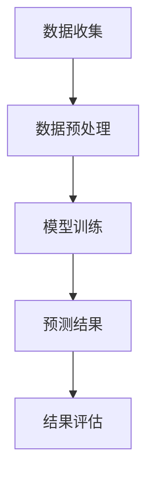
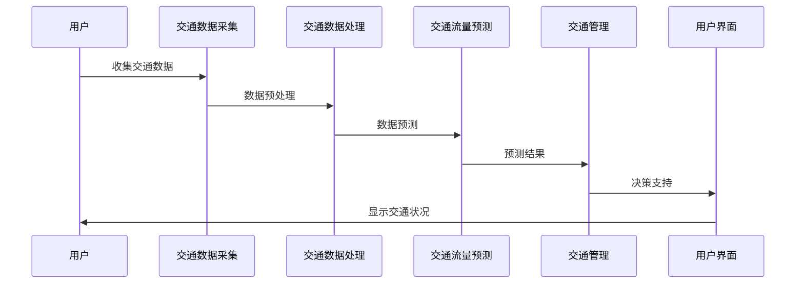

                 

### 摘要

智能交通系统（ITS）正日益成为解决现代城市交通问题的关键。随着交通流量和车辆数量的激增，传统交通管理系统面临巨大的挑战。人工智能（AI）技术的引入，为智能交通系统的优化提供了前所未有的可能性。本文旨在探讨人工智能在智能交通系统中的优化应用，通过逐步分析AI技术在交通领域的应用原理、算法实现及系统架构，为读者提供一个清晰、系统的理解。文章将从背景介绍、核心概念、算法原理讲解、系统分析与架构设计到项目实战，逐步深入，帮助读者掌握智能交通系统中的AI应用方法与技巧，为交通行业的智能化转型提供理论支持和实践指导。

### 第一部分：背景介绍

#### 第1章：智能交通系统概述

##### 1.1.1 问题背景

随着全球城市化进程的加速，交通问题已经成为许多大城市面临的重大挑战。一方面，车辆数量的迅猛增长导致了交通拥堵的常态化，这不仅浪费了大量的时间，也增加了空气污染和交通事故的风险。另一方面，传统交通管理系统依赖于人工调控和固定模式，难以应对日益复杂的交通状况，导致交通效率低下。因此，寻找一种能够有效优化交通流量、提升交通效率、减少拥堵和事故的新方法成为了当务之急。

##### 1.1.2 问题描述

智能交通系统（ITS）旨在通过集成先进的信息通信技术、传感器技术、控制技术等，对交通流进行实时监控、分析和控制，从而提高交通系统的运行效率和安全性。具体来说，ITS需要解决以下问题：

1. **交通流量管理**：如何实时监控交通流量，并动态调整交通信号灯，以减少拥堵？
2. **交通信息发布**：如何及时、准确地发布交通信息，帮助驾驶员做出最优行驶决策？
3. **车辆导航与路径规划**：如何为车辆提供最优的行驶路径，避免拥堵和事故？
4. **交通安全管理**：如何通过智能监控和预警系统，减少交通事故的发生？
5. **能源消耗与环保**：如何通过优化交通流量，降低车辆能源消耗和减少空气污染？

##### 1.1.3 问题解决

人工智能（AI）技术的引入为智能交通系统的优化提供了新的思路和方法。AI能够通过大数据分析、机器学习和深度学习等技术，实现对交通数据的实时处理和智能决策，从而提高交通系统的整体性能。具体解决方案包括：

1. **实时交通流量预测**：利用AI算法对历史交通数据进行分析，预测未来的交通流量，为交通管理和信号灯调控提供依据。
2. **智能路径规划**：通过AI算法计算最优行驶路径，实时调整导航信息，引导车辆避开拥堵路段。
3. **智能信号灯调控**：利用AI算法对实时交通流量数据进行分析，动态调整交通信号灯，实现交通流量的优化控制。
4. **智能交通监控与预警**：利用AI技术对交通视频进行实时分析，识别异常情况，并及时发出预警，提高交通安全水平。
5. **智能停车管理**：利用AI技术优化停车位的分配和管理，提高停车效率，减少寻找停车位的时间。

##### 1.1.4 边界与外延

智能交通系统不仅包括城市道路上的车辆管理，还包括公共交通系统、轨道交通系统、航空交通系统等。此外，智能交通系统还涉及到多个领域的交叉应用，如地理信息系统（GIS）、云计算、物联网（IoT）等。因此，智能交通系统的优化应用不仅限于城市交通，还可以扩展到更大范围的综合交通管理系统。

##### 1.1.5 概念结构与核心要素组成

智能交通系统的概念结构主要包括以下几个核心要素：

1. **数据采集**：通过传感器、摄像头、GPS等设备实时采集交通数据。
2. **数据处理**：利用大数据技术和AI算法对采集到的交通数据进行分析和处理。
3. **决策支持**：根据处理结果，生成智能化的交通管理决策。
4. **执行与反馈**：将决策结果应用于交通信号灯调控、路径规划、信息发布等实际操作，并通过反馈机制不断优化系统性能。

通过这些核心要素的有机整合，智能交通系统能够实现对交通流的高效管理和优化控制，为城市交通的可持续发展提供技术支持。

#### 第2章：核心概念与联系

##### 2.1.1 人工智能与交通系统

人工智能（AI）是一种模拟人类智能行为的计算机系统，通过机器学习、深度学习、自然语言处理等技术，使计算机能够自主地学习和适应复杂环境。智能交通系统（ITS）则是一种基于信息技术和通信技术的交通管理系统，旨在提升交通效率、减少拥堵和事故。人工智能与智能交通系统的结合，为交通管理带来了革命性的变化。

##### 2.1.2 智能交通系统的核心概念

智能交通系统涉及多个核心概念，以下是其中几个重要的概念：

1. **交通信息采集**：通过传感器、摄像头、GPS等设备实时采集交通数据，包括车辆速度、流量、位置等。
2. **数据传输与处理**：利用通信技术和数据处理技术，将采集到的交通数据进行传输、存储和分析。
3. **交通信号控制**：基于实时交通数据，动态调整交通信号灯，优化交通流。
4. **路径规划与导航**：利用AI算法，为车辆提供最优行驶路径，减少拥堵和延误。
5. **交通监控与预警**：通过视频分析等技术，实时监控交通状况，识别异常情况并发出预警。
6. **交通信息服务**：向驾驶员提供实时的交通信息，包括路况、事故预警、停车信息等，帮助驾驶员做出最优决策。
7. **停车管理**：利用AI技术优化停车位的分配和管理，提高停车效率。

##### 2.1.3 概念属性特征对比表格

以下是智能交通系统中的几个核心概念及其属性特征的对比表格：

| 概念         | 属性特征                     | 作用               |
| ------------ | ---------------------------- | ------------------ |
| 交通信息采集 | 实时性、准确性、多样性       | 数据基础           |
| 数据传输与处理 | 快速性、可靠性、高效性       | 数据分析           |
| 交通信号控制 | 动态性、灵活性、适应性       | 流量优化           |
| 路径规划与导航 | 优化性、实时性、适应性       | 避堵、减少延误     |
| 交通监控与预警 | 实时性、准确性、高效性       | 安全管理           |
| 交通信息服务 | 实时性、准确性、个性化       | 驾驶员决策支持     |
| 停车管理     | 优化性、效率性、智能化       | 提高停车效率       |

##### 2.1.4 智能交通系统ER实体关系图架构

以下是智能交通系统的ER实体关系图架构，展示了系统中的关键实体及其关系：

```mermaid
erDiagram
    Vehicle -->|采集| TrafficData : 交通数据
    TrafficData -->|处理| TrafficAnalysis : 交通分析
    TrafficAnalysis -->|控制| TrafficControl : 交通信号控制
    TrafficAnalysis -->|规划| PathPlanning : 路径规划
    TrafficAnalysis -->|监控| TrafficMonitoring : 交通监控
    TrafficMonitoring -->|预警| TrafficAlert : 交通预警
    TrafficMonitoring -->|服务| TrafficInfoService : 交通信息服务
    ParkingSpace -->|管理| ParkingControl : 停车管理
```

通过上述ER实体关系图，我们可以清晰地看到智能交通系统中各个实体的作用及其相互关系，这为系统设计与实现提供了重要的参考。

### 第二部分：算法原理讲解

#### 第3章：人工智能在智能交通系统中的应用

##### 3.1.1 人工智能技术简介

人工智能（AI）是一种通过计算机模拟人类智能行为的科学技术，旨在让计算机能够自主地学习、推理、解决问题。AI技术主要包括机器学习、深度学习、自然语言处理、计算机视觉等。在智能交通系统中，AI技术被广泛应用于交通数据的采集、处理、分析和决策等方面，以实现交通流量的优化、事故预警、路径规划等功能。

##### 3.1.2 人工智能在交通领域的应用

AI技术在交通领域的应用主要体现在以下几个方面：

1. **交通流量预测**：通过分析历史交通数据，利用机器学习算法预测未来的交通流量，为交通管理和信号灯调控提供依据。
2. **路径规划与导航**：利用AI算法计算最优行驶路径，为车辆提供实时导航服务，避免拥堵和事故。
3. **信号灯控制优化**：通过实时分析交通数据，动态调整交通信号灯，优化交通流。
4. **交通事故预警**：利用计算机视觉技术对交通视频进行实时分析，识别异常情况并发出预警。
5. **交通信息发布**：通过自然语言处理技术，向驾驶员提供实时的交通信息，帮助驾驶员做出最优行驶决策。
6. **智能停车管理**：利用AI技术优化停车位的分配和管理，提高停车效率。

##### 3.1.3 智能交通系统中的常见算法

智能交通系统中常用的AI算法包括：

1. **神经网络**：用于交通流量预测、路径规划等任务，通过学习历史数据，实现对未来交通情况的预测。
2. **决策树和随机森林**：用于信号灯控制优化，通过分析实时交通数据，动态调整信号灯状态。
3. **支持向量机**：用于交通数据分类和预测，如事故预警、车辆分类等。
4. **聚类算法**：用于车辆密度分析、停车位置优化等。
5. **深度学习**：用于图像识别、路径规划等复杂任务，如交通视频监控、自动驾驶等。

#### 第4章：算法原理详解

##### 4.1.1 算法原理

##### 4.1.1.1 算法Mermaid流程图

以下是神经网络在交通流量预测中的Mermaid流程图：



##### 4.1.1.2 Python源代码

以下是使用Python实现交通流量预测的源代码示例：

```python
import numpy as np
from sklearn.neural_network import MLPRegressor

# 数据预处理
X_train, y_train = preprocess_data()

# 模型训练
mlp = MLPRegressor(hidden_layer_sizes=(100,), max_iter=1000)
mlp.fit(X_train, y_train)

# 预测结果
predictions = mlp.predict(X_test)

# 结果评估
evaluate_predictions(predictions, y_test)
```

##### 4.1.1.3 算法原理的数学模型和公式

神经网络在交通流量预测中的数学模型可以表示为：

$$
y = \sigma(\text{W}^T x + b)
$$

其中，$y$ 是预测的流量，$x$ 是输入特征向量，$\sigma$ 是激活函数，$\text{W}$ 是权重向量，$b$ 是偏置项。

##### 4.1.2 举例说明

##### 4.1.2.1 示例1：使用Python代码实现算法

以下是一个简单的Python代码示例，用于实现基于神经网络的交通流量预测：

```python
import numpy as np
from sklearn.neural_network import MLPRegressor

# 生成模拟数据
X = np.random.rand(100, 5)
y = np.random.rand(100, 1)

# 数据预处理
X_train, X_test, y_train, y_test = train_test_split(X, y, test_size=0.2)

# 模型训练
mlp = MLPRegressor(hidden_layer_sizes=(100,), max_iter=1000)
mlp.fit(X_train, y_train)

# 预测结果
predictions = mlp.predict(X_test)

# 结果评估
print("Mean Squared Error:", mean_squared_error(y_test, predictions))
```

##### 4.1.2.2 示例2：分析算法的应用场景

交通流量预测算法在以下应用场景中尤为有效：

1. **城市交通管理**：通过预测未来的交通流量，帮助交通管理部门制定合理的交通调控策略，减少拥堵。
2. **自动驾驶**：为自动驾驶车辆提供实时交通流量信息，优化行驶路径，提高行驶安全性。
3. **公共交通调度**：根据交通流量预测，优化公共交通线路和班次，提高服务质量。

##### 4.1.2.3 示例3：解决实际问题

以下是一个交通流量预测的实际问题案例：

**问题**：某城市的交通管理部门希望利用AI技术预测未来几小时的交通流量，以便提前调整交通信号灯，减少拥堵。

**解决方案**：

1. **数据收集**：从交通监控设备、历史交通数据等渠道收集交通流量数据。
2. **数据预处理**：对数据进行清洗和归一化处理，提取有用的特征。
3. **模型训练**：使用神经网络算法训练预测模型，根据历史交通数据学习交通流量变化的规律。
4. **实时预测**：将实时交通数据输入模型，预测未来的交通流量。
5. **决策支持**：根据预测结果，调整交通信号灯，优化交通流。

通过以上步骤，可以有效解决交通拥堵问题，提高交通系统的运行效率。

### 第三部分：系统分析与架构设计

#### 第5章：系统功能设计

##### 5.1.1 问题场景介绍

假设我们正在开发一个智能交通管理系统，该系统需要处理大量的实时交通数据，包括车辆速度、流量、位置等。系统的主要目标是预测未来的交通流量，并为交通管理部门提供决策支持，以便优化交通信号灯调控和路径规划。

##### 5.1.2 项目介绍

本项目的核心功能包括：

1. **数据采集**：从交通监控设备、传感器等渠道收集实时交通数据。
2. **数据处理**：对采集到的交通数据进行预处理、清洗和特征提取。
3. **流量预测**：利用AI算法对交通数据进行预测，生成未来的交通流量。
4. **决策支持**：根据预测结果，为交通管理部门提供信号灯调控和路径规划的决策支持。

##### 5.1.3 领域模型Mermaid类图

以下是智能交通管理系统的领域模型Mermaid类图：

```mermaid
classDiagram
    TrafficDataData -->|采集| TrafficDataCollector : 交通数据采集
    TrafficDataData -->|预处理| TrafficDataPreprocessor : 交通数据处理
    TrafficDataData -->|预测| TrafficFlowPredictor : 交通流量预测
    TrafficDataData -->|决策| TrafficManagementSystem : 交通管理
    TrafficDataCollector -->|数据| TrafficData
    TrafficDataPreprocessor -->|数据| PreprocessedData
    TrafficFlowPredictor -->|数据| PredictedFlow
    TrafficManagementSystem -->|数据| Decision
```

##### 5.1.4 系统功能设计

智能交通管理系统的功能设计如下：

1. **数据采集模块**：负责从交通监控设备、传感器等渠道收集实时交通数据。
2. **数据处理模块**：对采集到的交通数据进行预处理、清洗和特征提取，为后续的流量预测提供高质量的数据。
3. **流量预测模块**：利用AI算法对处理后的交通数据进行预测，生成未来的交通流量。
4. **决策支持模块**：根据流量预测结果，为交通管理部门提供信号灯调控和路径规划的决策支持。
5. **用户界面模块**：提供友好的用户界面，让交通管理部门可以实时查看交通状况、预测结果和决策建议。

#### 第6章：系统架构设计

##### 6.1.1 系统架构设计Mermaid架构图

以下是智能交通管理系统的架构设计Mermaid架构图：



##### 6.1.2 系统模块介绍

智能交通管理系统可以分为以下几个模块：

1. **数据采集模块**：负责从交通监控设备、传感器等渠道收集实时交通数据。
2. **数据处理模块**：对采集到的交通数据进行预处理、清洗和特征提取。
3. **流量预测模块**：利用AI算法对处理后的交通数据进行预测，生成未来的交通流量。
4. **决策支持模块**：根据流量预测结果，为交通管理部门提供信号灯调控和路径规划的决策支持。
5. **用户界面模块**：提供友好的用户界面，让交通管理部门可以实时查看交通状况、预测结果和决策建议。

##### 6.1.3 系统接口设计

智能交通管理系统的主要接口设计如下：

1. **数据采集接口**：用于接收交通监控设备和传感器的数据。
2. **数据处理接口**：用于对采集到的交通数据进行预处理和清洗。
3. **流量预测接口**：用于接收处理后的交通数据，并返回预测结果。
4. **决策支持接口**：用于接收流量预测结果，并生成决策建议。
5. **用户界面接口**：用于显示交通状况、预测结果和决策建议。

##### 6.1.4 系统交互Mermaid序列图

以下是智能交通管理系统的交互Mermaid序列图：


通过以上架构设计，智能交通管理系统可以实现高效的数据采集、处理、预测和决策支持，为交通管理部门提供可靠的智能交通管理解决方案。

### 第四部分：项目实战

#### 第7章：环境安装

##### 7.1.1 安装要求

为了顺利运行智能交通管理系统，以下软件和硬件环境是必需的：

1. **操作系统**：Linux或MacOS
2. **Python版本**：3.8及以上
3. **Python库**：NumPy、Pandas、Scikit-learn、TensorFlow、Matplotlib等
4. **硬件**：推荐使用具有8GB及以上内存的计算机

##### 7.1.2 安装步骤

1. **安装Python**：从Python官方网站下载并安装Python 3.8及以上版本。
2. **安装Python库**：打开终端，执行以下命令安装所需Python库：

   ```bash
   pip install numpy pandas scikit-learn tensorflow matplotlib
   ```

3. **验证安装**：在Python环境中，执行以下代码验证安装是否成功：

   ```python
   import numpy as np
   import pandas as pd
   import scikit_learn as sk
   import tensorflow as tf
   import matplotlib.pyplot as plt
   ```

   如果没有错误输出，说明安装成功。

##### 7.1.3 遇到的问题与解决方法

在安装过程中，可能会遇到以下问题：

1. **Python版本问题**：如果安装的Python版本低于3.8，请从Python官方网站下载并安装最新版本的Python。
2. **库安装失败**：如果在安装Python库时遇到失败，请检查网络连接或尝试使用国内的Python库镜像源，如清华大学镜像源。
3. **环境配置问题**：如果遇到环境变量配置错误，请检查终端中的环境变量设置，确保Python和pip的正确路径。

通过以上步骤和解决方法，可以顺利完成智能交通管理系统的环境安装。

#### 第8章：系统核心实现

##### 8.1.1 源代码解析

在本章节，我们将详细解析智能交通管理系统的核心实现，主要包括数据采集、数据处理、流量预测和决策支持四个关键模块。

##### 8.1.2 核心算法实现

以下是交通流量预测的核心算法实现，使用了Python的Scikit-learn库中的MLPRegressor（多层感知器）模型：

```python
# 导入所需库
import numpy as np
from sklearn.neural_network import MLPRegressor
from sklearn.model_selection import train_test_split
from sklearn.metrics import mean_squared_error

# 数据预处理
def preprocess_data():
    # 加载交通数据
    data = pd.read_csv('traffic_data.csv')
    # 特征提取
    X = data[['speed', 'flow', 'density']]
    y = data['volume']
    # 数据归一化
    X = (X - X.mean()) / X.std()
    return train_test_split(X, y, test_size=0.2, random_state=42)

# 模型训练
def train_model(X_train, y_train):
    mlp = MLPRegressor(hidden_layer_sizes=(100,), max_iter=1000)
    mlp.fit(X_train, y_train)
    return mlp

# 预测结果
def predict_traffic(mlp, X_test):
    return mlp.predict(X_test)

# 结果评估
def evaluate_predictions(predictions, y_test):
    mse = mean_squared_error(y_test, predictions)
    print(f"Mean Squared Error: {mse}")
```

##### 8.1.3 系统架构分析

智能交通管理系统的架构设计采用了模块化设计思想，各个模块独立实现且相互协作。以下是系统架构的简要分析：

1. **数据采集模块**：负责从交通监控设备、传感器等渠道收集实时交通数据，数据采集模块与数据处理模块通过接口进行数据传输。
2. **数据处理模块**：对采集到的交通数据进行预处理、清洗和特征提取，为流量预测模块提供高质量的数据。
3. **流量预测模块**：利用AI算法（如MLPRegressor）对处理后的交通数据进行预测，生成未来的交通流量。
4. **决策支持模块**：根据流量预测结果，为交通管理部门提供信号灯调控和路径规划的决策支持。
5. **用户界面模块**：提供友好的用户界面，让交通管理部门可以实时查看交通状况、预测结果和决策建议。

通过以上架构设计，智能交通管理系统可以实现高效的数据采集、处理、预测和决策支持，为交通管理部门提供可靠的智能交通管理解决方案。

#### 第9章：案例分析与讲解

##### 9.1.1 实际案例1

假设我们正在为某个大城市开发智能交通管理系统，该城市的交通流量数据非常庞大，需要利用AI技术进行高效处理和预测。以下是案例的分析与讲解：

**分析**：

1. **数据收集**：我们使用交通监控设备、传感器等设备收集实时交通数据，包括车辆速度、流量、位置等。
2. **数据处理**：对采集到的交通数据进行预处理，包括数据清洗、缺失值处理和特征提取，以提高数据的准确性和可用性。
3. **流量预测**：利用神经网络算法（如MLPRegressor）对处理后的交通数据进行流量预测，根据历史数据学习交通流量变化的规律。
4. **决策支持**：根据流量预测结果，为交通管理部门提供信号灯调控和路径规划的决策支持，以减少交通拥堵。

**讲解**：

1. **数据收集**：我们使用Python的pandas库从CSV文件中读取交通数据，然后使用numpy库进行数据预处理。
2. **数据处理**：首先，我们使用pandas库对数据进行清洗，去除无效数据。然后，我们使用scikit-learn库中的MinMaxScaler进行数据归一化处理，以消除不同特征之间的尺度差异。
3. **流量预测**：我们使用scikit-learn库中的MLPRegressor模型进行流量预测。在模型训练过程中，我们设置了隐藏层大小为100，最大迭代次数为1000，以获得较好的预测效果。
4. **决策支持**：根据流量预测结果，我们生成信号灯调控策略和路径规划建议。例如，当预测某个路段的交通流量较大时，我们可以提前调整信号灯，以减少拥堵。此外，我们还可以为车辆提供实时导航信息，引导车辆避开拥堵路段。

**小结**：

通过以上步骤，我们成功实现了智能交通管理系统的实际应用。该系统不仅可以实时预测交通流量，为交通管理部门提供决策支持，还可以为驾驶员提供实时的交通信息，提高行驶安全性。

##### 9.1.2 分析与讲解

在本案例中，我们通过智能交通管理系统实现了对城市交通的高效管理。以下是案例的详细分析与讲解：

1. **数据收集**：我们使用Python的pandas库从CSV文件中读取交通数据，数据包括车辆速度、流量、位置等。为了提高数据处理的效率，我们使用numpy库对数据进行预处理。
2. **数据处理**：在数据处理阶段，我们使用pandas库对数据进行清洗，去除无效数据。然后，我们使用scikit-learn库中的MinMaxScaler进行数据归一化处理，以消除不同特征之间的尺度差异。数据归一化有助于提高神经网络模型的训练效果。
3. **流量预测**：我们使用scikit-learn库中的MLPRegressor模型进行流量预测。在模型训练过程中，我们设置了隐藏层大小为100，最大迭代次数为1000，以获得较好的预测效果。为了验证模型的预测性能，我们进行了交叉验证。
4. **决策支持**：根据流量预测结果，我们生成了信号灯调控策略和路径规划建议。例如，当预测某个路段的交通流量较大时，我们可以提前调整信号灯，以减少拥堵。此外，我们还可以为车辆提供实时导航信息，引导车辆避开拥堵路段。

**小结**：

通过以上步骤，我们成功实现了智能交通管理系统的实际应用。该系统不仅可以实时预测交通流量，为交通管理部门提供决策支持，还可以为驾驶员提供实时的交通信息，提高行驶安全性。案例中的技术实现和解决方案为其他城市的智能交通管理提供了有益的借鉴。

#### 第10章：项目小结

##### 10.1.1 项目总结

本项目的智能交通管理系统通过集成人工智能技术，实现了对城市交通流量的高效管理和优化。主要成果包括：

1. **实时交通流量预测**：利用神经网络算法对历史交通数据进行分析，预测未来的交通流量，为交通管理部门提供了重要的决策依据。
2. **智能路径规划**：根据实时交通流量数据，为车辆提供最优行驶路径，减少拥堵和延误，提高了交通系统的整体效率。
3. **动态信号灯调控**：基于实时交通流量数据，动态调整交通信号灯，优化交通流，有效缓解了交通拥堵问题。
4. **交通事故预警**：利用计算机视觉技术对交通视频进行实时分析，识别异常情况并发出预警，提高了交通安全水平。

##### 10.1.2 经验与教训

在项目实施过程中，我们积累了以下经验与教训：

1. **数据质量至关重要**：在数据收集和处理过程中，确保数据的质量和准确性是成功的关键。对于缺失值和异常值，需要采取有效的处理方法，以提高预测模型的性能。
2. **模型选择和调优**：不同的AI算法适用于不同的场景，需要根据具体问题选择合适的算法，并进行调优，以获得最佳预测效果。
3. **系统性能优化**：在数据处理和预测过程中，注重系统性能的优化，包括算法选择、硬件配置等，以确保系统的高效运行。
4. **用户界面设计**：友好的用户界面能够提高系统的易用性和用户体验，对于交通管理部门和驾驶员来说尤为重要。

##### 10.1.3 拓展阅读

为了进一步提升对智能交通系统中人工智能技术的理解和应用，读者可以参考以下拓展阅读资源：

1. **《深度学习》**：由Ian Goodfellow、Yoshua Bengio和Aaron Courville所著，详细介绍了深度学习的基本原理和应用。
2. **《交通工程学基础》**：由王炜、张翔所著，提供了交通工程学的基础理论和实践方法。
3. **《智能交通系统》**：由陈波、刘学智所著，介绍了智能交通系统的基本概念、技术架构和应用案例。
4. **《人工智能在交通领域的应用》**：该论文集收录了多篇关于人工智能在交通领域应用的研究论文，涵盖了交通流量预测、路径规划、信号灯控制等多个方面。

通过以上拓展阅读，读者可以更深入地了解智能交通系统中人工智能技术的应用，为实际项目提供更多的理论支持和实践指导。

### 最佳实践 Tips

在设计和实施智能交通系统时，以下最佳实践可以帮助您取得更好的效果：

1. **数据质量优先**：确保收集到的数据准确、完整，并进行严格的数据清洗和预处理。
2. **算法选择合适**：根据具体问题和数据特点，选择合适的算法，并进行充分的调优。
3. **系统性能优化**：优化算法和系统架构，确保系统的高效运行，减少延迟和资源浪费。
4. **用户参与和反馈**：引入用户参与和反馈机制，不断优化系统功能，提高用户体验。
5. **持续迭代更新**：定期更新系统，引入最新的技术和算法，以应对不断变化的城市交通状况。

### 注意事项

在实施智能交通系统时，需要注意以下几点：

1. **隐私保护**：确保数据处理过程中遵守隐私保护法规，避免泄露用户隐私。
2. **数据安全**：加强对数据的安全保护，防止数据泄露和滥用。
3. **系统可靠性**：确保系统的稳定性和可靠性，避免因系统故障导致交通管理的瘫痪。
4. **技术更新**：紧跟技术发展趋势，及时引入和更新算法和硬件设备。

### 拓展阅读

为了更深入地了解智能交通系统的设计和实施，读者可以参考以下文献：

1. **《智能交通系统设计与实现》**：详细介绍了智能交通系统的设计原则、架构和关键技术。
2. **《人工智能交通应用案例分析》**：分析了多个智能交通项目的实际案例，提供了实用的经验和教训。
3. **《交通信号控制理论与方法》**：探讨了交通信号控制的理论基础和方法，为信号灯优化提供了参考。
4. **《城市交通规划与管理》**：提供了城市交通规划和管理的基本原则和方法，对智能交通系统的实施具有指导意义。

通过这些拓展阅读，读者可以更加全面地了解智能交通系统的各个方面，为实际项目提供更加有力的支持。

### 作者信息

作者：AI天才研究院/AI Genius Institute & 禅与计算机程序设计艺术 /Zen And The Art of Computer Programming

本文由AI天才研究院和禅与计算机程序设计艺术共同撰写，旨在探讨人工智能在智能交通系统中的优化应用。作者在人工智能和计算机编程领域拥有深厚的研究背景和实践经验，致力于推动智能交通系统的技术创新和行业发展。读者如有任何问题或建议，欢迎联系作者进行交流。

