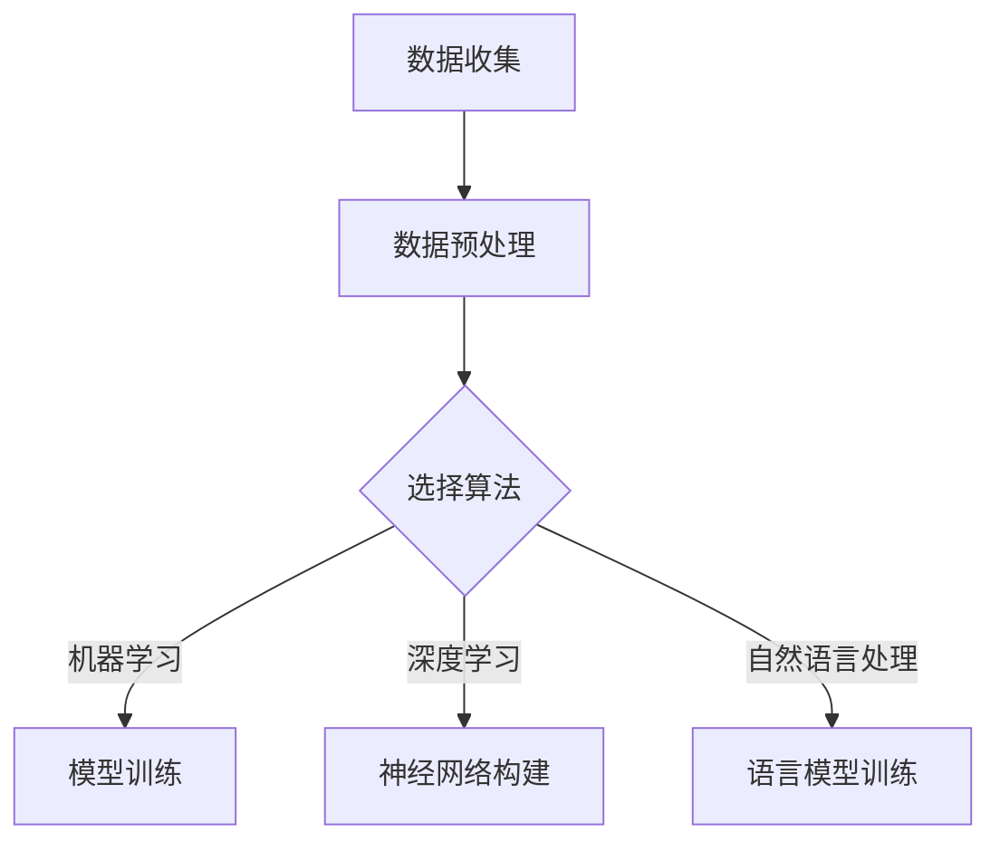
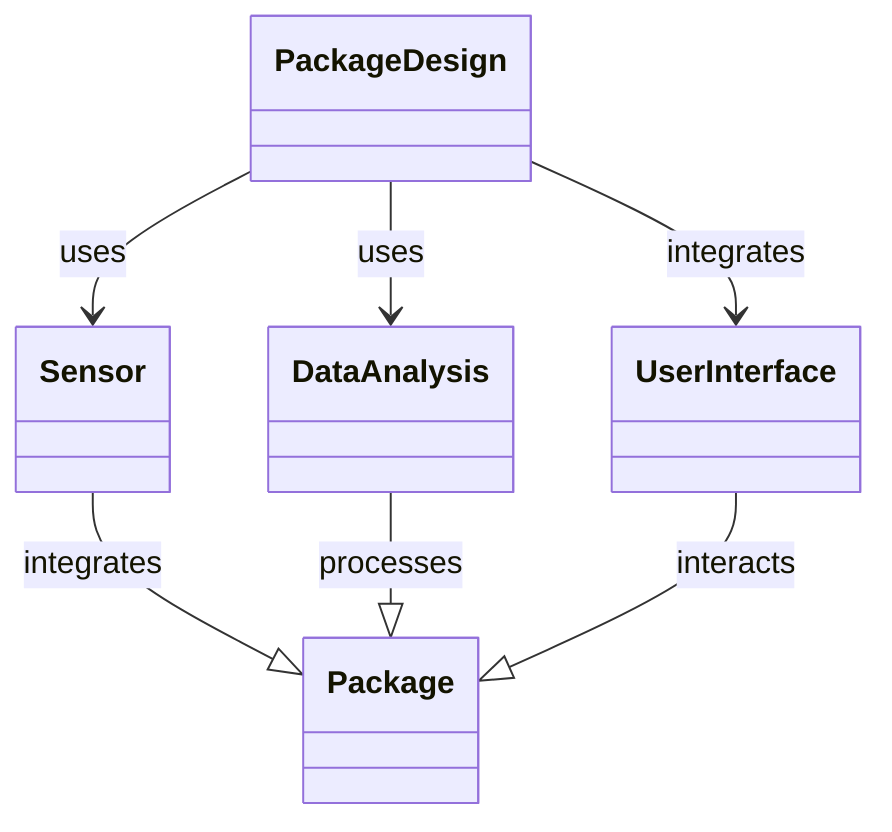
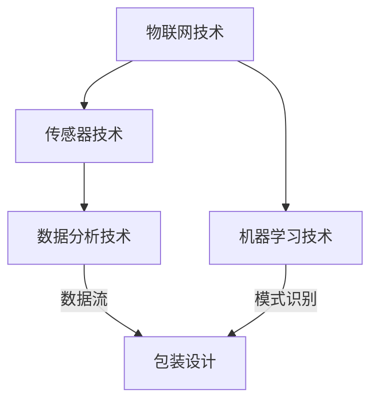
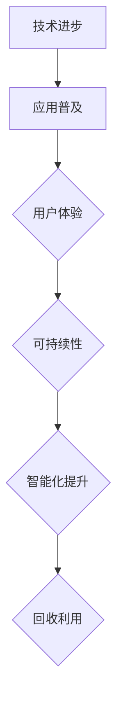

                 

为了撰写一篇深入且有见解的技术博客文章《人工智能在智能包装设计中的应用前景》，我们将遵循以下步骤进行详细分析：

### 引言部分

#### 1.1 问题背景

**核心概念术语说明：**
- 人工智能（Artificial Intelligence, AI）：模拟人类智能行为的计算机系统。
- 智能包装设计（Smart Packaging Design）：集成传感器、数据分析和其他先进技术，使包装具有互动性、可持续性和信息性的设计。

**问题背景：**
随着全球对可持续性和环境意识的提升，智能包装设计成为包装行业的一个热点。人工智能技术在包装设计中的应用正日益增加，从个性化包装到智能供应链管理，都展示出巨大的潜力。

**问题描述：**
本文旨在探讨人工智能在智能包装设计中的应用前景，以及其可能带来的变革。

**问题解决：**
通过研究和分析，本文将揭示人工智能如何改变包装设计领域，以及未来的发展趋势。

**边界与外延：**
智能包装设计不仅仅关注功能性，还涉及到用户体验、可持续性和技术实现。

**概念结构与核心要素组成：**

**Mermaid ER实体关系图架构：**
```mermaid
erDiagram
  AI Technology ||--|{ Smart Packaging Design }|| Package
  User ||--|{ Smart Packaging Design }|| Designer
  Manufacturer ||--|{ Smart Packaging Design }|| Product
```

### 理论基础部分

#### 2.1 人工智能概述

**核心概念原理：**
人工智能的核心概念包括机器学习、深度学习、自然语言处理等。

**概念属性特征对比表格：**

| 特性        | 机器学习                | 深度学习                | 自然语言处理            |
| ----------- | --------------------- | --------------------- | --------------------- |
| 基本原理    | 从数据中学习规律        | 从数据中学习特征表示   | 语言模型和语义理解     |
| 应用场景    | 数据分析、预测          | 图像识别、语音识别     | 翻译、问答系统         |
| 优点        | 强大且灵活            | 高效且准确            | 高级语言理解能力       |
| 缺点        | 可能产生过拟合        | 需要大量数据          | 难以处理长文本         |

**Mermaid 流程图：**


### 应用场景部分

#### 3.1 智能包装设计的应用领域

**核心概念原理：**
智能包装设计可以应用于多个领域，如快速消费品、医药产品、电子产品和农业产品。

**应用案例分析：**

**3.1.1 智能化妆品包装设计：**
智能化妆品包装可以通过传感器监测产品的使用情况，并通过数据传输实现个性化提醒。

**3.1.2 智能食品包装设计：**
智能食品包装可以检测食品的变质情况，并利用数据分析延长保质期。

**3.1.3 智能药品包装设计：**
智能药品包装可以通过传感器监测药品的储存条件，确保药品的质量和安全性。

**3.1.4 智能电子产品包装设计：**
智能电子产品包装可以实现产品的快速组装和调试，提高生产效率。

**Mermaid 类图：**


### 技术与工具部分

#### 4.1 智能包装设计的相关技术

**核心技术：**
- 物联网技术：实现包装与外界的通信。
- 传感器技术：监测包装内的环境参数。
- 数据分析技术：处理包装生成的数据。
- 机器学习技术：从数据中学习模式，优化包装设计。

**Mermaid 架构图：**


### 前景展望部分

#### 5.1 人工智能在智能包装设计中的应用前景

**发展趋势：**
随着人工智能技术的进步，智能包装设计将越来越普及。

**未来展望：**
未来的智能包装设计将更加注重用户体验、可持续性和智能化。

**研究方向：**
未来研究方向包括智能包装的个性化定制、智能供应链管理、智能回收等。

**挑战与机遇：**

**Mermaid 流程图：**


### 总结与展望

**主要研究成果：**
本文系统地探讨了人工智能在智能包装设计中的应用，展示了其在设计、生产和回收等多个环节的潜力。

**创新点与突破：**
本文提出了智能包装设计的综合框架，并分析了关键技术的应用。

**不足与展望：**
未来需要进一步研究智能包装设计在不同领域的具体应用，以及如何优化其可持续性和用户体验。

**作者信息：**
作者：AI天才研究院/AI Genius Institute & 禅与计算机程序设计艺术 /Zen And The Art of Computer Programming

通过以上步骤，我们不仅能够构建一篇逻辑清晰、结构紧凑的技术博客文章，还能够确保文章内容详实、专业且具有深度。接下来，我们将逐步填充每个章节的具体内容，确保满足字数要求和其他格式要求。

