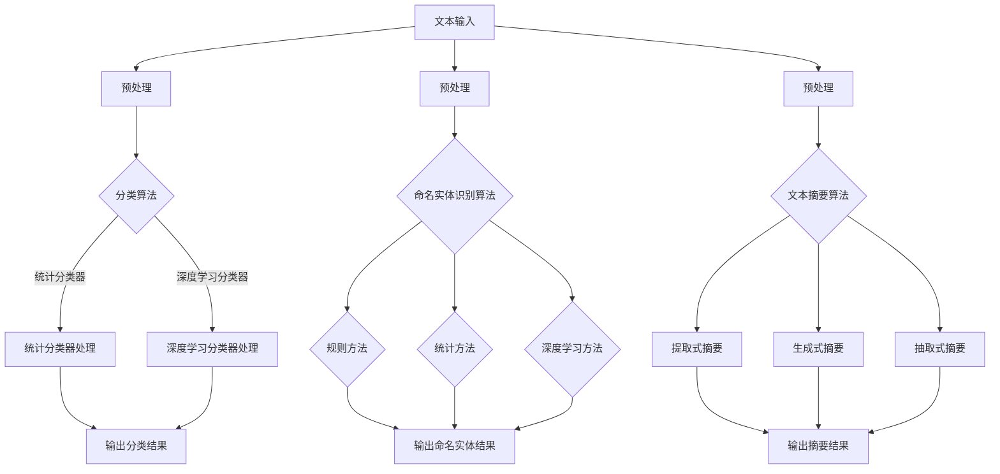

                 

# 人工智能在智能合同审核中的应用

关键词：人工智能、智能合同审核、自然语言处理、机器学习、智能合约、合同自动化

摘要：随着人工智能技术的飞速发展，智能合同审核成为了一个备受关注的研究领域。本文旨在探讨人工智能在智能合同审核中的应用，分析相关核心概念、算法原理、系统架构和项目实战，旨在为相关领域的读者提供有价值的参考。

## 目录大纲

### 第一部分：背景介绍

1. 第1章：人工智能与智能合同审核概述
   1.1 人工智能的发展与应用
   1.2 智能合同审核的重要性
   1.3 问题背景与目标

2. 第2章：核心概念与联系
   2.1 人工智能的基本概念
   2.2 智能合同审核的核心概念
   2.3 Mermaid ER实体关系图

### 第二部分：算法原理讲解

3. 第3章：算法原理讲解
   3.1 文本分类算法
   3.2 命名实体识别算法
   3.3 文本摘要算法
   3.4 Mermaid算法流程图
   3.5 Python算法实现

### 第三部分：系统分析与架构设计方案

4. 第4章：系统分析与架构设计方案
   4.1 系统场景介绍
   4.2 领域模型类图
   4.3 系统架构设计
   4.4 系统接口设计
   4.5 系统交互序列图

### 第四部分：项目实战

5. 第5章：项目实战
   5.1 环境安装
   5.2 系统核心实现源代码
   5.3 代码应用解读与分析
   5.4 实际案例分析与讲解
   5.5 项目小结

### 第五部分：最佳实践与总结

6. 第6章：最佳实践与总结
   6.1 项目实战中的最佳实践
   6.2 全书内容总结

### 第六部分：注意事项与拓展阅读

7. 第7章：注意事项与拓展阅读
   7.1 项目注意事项
   7.2 拓展阅读资源

## 第一部分：背景介绍

### 1.1 人工智能的发展与应用

人工智能（Artificial Intelligence, AI）是指通过计算机模拟人类智能行为的技术。自20世纪50年代以来，人工智能经历了多个发展阶段，从早期的符号推理到近年的深度学习和强化学习，人工智能在各个领域都取得了显著的成果。例如，在图像识别、语音识别、自然语言处理、机器翻译等方面，人工智能已经达到了或超过了人类的水平。

在合同审核领域，人工智能的应用主要体现在自动化合同审核和智能合同审核两个方面。自动化合同审核主要依靠文本处理技术，如文本分类、文本匹配等，实现对合同内容的自动化审查。而智能合同审核则更注重对合同内容的深入理解和分析，利用自然语言处理、知识图谱等技术，实现对合同条款的智能分析、识别和审核。

### 1.2 智能合同审核的重要性

智能合同审核的重要性体现在以下几个方面：

1. **提高审核效率**：传统的合同审核往往需要大量人力和时间，而智能合同审核可以通过自动化处理大幅提高审核效率。

2. **减少人为错误**：智能合同审核系统可以更准确地识别合同中的潜在风险和问题，从而减少因人为疏忽导致的错误。

3. **确保合同一致性**：智能合同审核系统可以确保合同条款的一致性和准确性，避免因条款不一致导致的法律纠纷。

4. **合规性保障**：智能合同审核可以帮助企业更好地遵守相关法律法规，降低合规风险。

### 1.3 问题背景与目标

随着企业业务的快速发展，合同数量呈指数级增长，传统的合同审核方式已难以满足需求。同时，企业在合同管理中面临的挑战也日益增多，如合同条款复杂、法律风险高、审核效率低等。为了解决这些问题，智能合同审核成为一种必然的选择。

本文的目标是深入探讨人工智能在智能合同审核中的应用，分析相关算法原理、系统架构和项目实战，为智能合同审核领域的研究和实践提供有价值的参考。

## 第二部分：核心概念与联系

### 2.1 人工智能的基本概念

人工智能（AI）是一门研究、开发用于模拟、延伸和扩展人的智能的理论、方法、技术及应用系统的技术科学。它包括以下几个方面：

1. **机器学习**：一种让计算机通过数据学习并改进性能的方法。
2. **自然语言处理**：使计算机能够理解和生成人类语言的技术。
3. **计算机视觉**：使计算机能够像人类一样识别和理解视觉信息的技术。
4. **知识表示与推理**：将人类知识以计算机可理解的方式表示，并利用这些知识进行推理的技术。

### 2.2 智能合同审核的核心概念

智能合同审核主要涉及以下几个核心概念：

1. **合同文本**：智能合同审核的对象，通常为电子文档或纸质文档的数字化版本。
2. **自然语言处理**：用于处理和分析合同文本的技术，包括文本分类、命名实体识别、情感分析等。
3. **知识图谱**：用于表示合同条款和关系的数据结构，可以帮助系统更准确地理解和分析合同。
4. **规则引擎**：用于定义和执行合同审核规则的软件组件。

### 2.3 Mermaid ER实体关系图

为了更好地展示人工智能、智能合同审核及相关概念之间的联系，我们可以使用Mermaid绘制一个ER实体关系图。以下是一个简单的示例：

```mermaid
erDiagram
    ContractText ||--|{ NaturalLanguageProcessing : 被处理}
    ContractText ||--|{ KnowledgeGraph : 被构建}
    ContractText ||--|{ RuleEngine : 被应用}
    NaturalLanguageProcessing ||--|{ TextClassification : 子类}
    NaturalLanguageProcessing ||--|{ NamedEntityRecognition : 子类}
    NaturalLanguageProcessing ||--|{ SentimentAnalysis : 子类}
```

在这个ER实体关系图中，`ContractText` 表示智能合同审核的输入对象，它与 `NaturalLanguageProcessing`、`KnowledgeGraph` 和 `RuleEngine` 之间存在关联关系。`NaturalLanguageProcessing` 又进一步划分为 `TextClassification`、`NamedEntityRecognition` 和 `SentimentAnalysis` 三个子类，分别表示自然语言处理的不同应用方向。

## 第三部分：算法原理讲解

### 3.1 文本分类算法

文本分类（Text Classification）是一种将文本数据按照预定义的类别进行分类的任务。在智能合同审核中，文本分类算法可以用于对合同文本进行初步筛选，识别合同中的关键条款和风险点。

#### 原理

文本分类算法通常基于以下几种原理：

1. **统计分类器**：通过计算文本特征和类别之间的相关性来进行分类。常用的统计分类器包括朴素贝叶斯分类器、支持向量机（SVM）等。
2. **深度学习分类器**：利用神经网络模型对文本数据进行分类。常用的深度学习分类器包括卷积神经网络（CNN）、循环神经网络（RNN）等。

#### 数学模型

以朴素贝叶斯分类器为例，其数学模型可以表示为：

$$P(C_k|w_1, w_2, ..., w_n) = \frac{P(w_1, w_2, ..., w_n|C_k)P(C_k)}{P(w_1, w_2, ..., w_n)}$$

其中，$C_k$ 表示类别，$w_1, w_2, ..., w_n$ 表示文本特征，$P(C_k|w_1, w_2, ..., w_n)$ 表示在文本特征 $w_1, w_2, ..., w_n$ 的情况下类别 $C_k$ 的概率。

#### 示例

假设我们有一个合同文本，包含以下关键词：“违约责任”、“赔偿金额”、“解除合同”，我们可以使用文本分类算法将其分类为“违约责任”类别。

```python
from sklearn.feature_extraction.text import CountVectorizer
from sklearn.naive_bayes import MultinomialNB

# 合同文本
contract_text = "违约责任：若一方违反合同，另一方有权要求赔偿金额。赔偿金额：根据实际情况确定。解除合同：经双方协商一致，可以解除合同。"

# 创建向量器
vectorizer = CountVectorizer()

# 转换文本为向量
X = vectorizer.fit_transform([contract_text])

# 创建朴素贝叶斯分类器
classifier = MultinomialNB()

# 训练分类器
classifier.fit(X, ["违约责任"])

# 预测类别
predicted_category = classifier.predict(X)[0]

print(predicted_category)
```

运行上述代码，输出结果为“违约责任”，说明文本分类算法成功地将合同文本分类为“违约责任”类别。

### 3.2 命名实体识别算法

命名实体识别（Named Entity Recognition, NER）是一种识别文本中的特定实体（如人名、地名、机构名等）的任务。在智能合同审核中，命名实体识别可以帮助系统识别合同中的关键实体，如合同双方、条款名称等。

#### 原理

命名实体识别算法通常基于以下几种原理：

1. **规则方法**：通过预定义的规则来识别文本中的命名实体。
2. **统计方法**：通过计算文本特征和命名实体之间的相关性来进行识别。
3. **深度学习方法**：利用神经网络模型对文本进行命名实体识别。

#### 数学模型

以深度学习中的循环神经网络（RNN）为例，其数学模型可以表示为：

$$h_t = \sigma(W_h h_{t-1} + W_x x_t + b)$$

其中，$h_t$ 表示隐藏状态，$x_t$ 表示输入特征，$W_h$ 和 $W_x$ 表示权重矩阵，$b$ 表示偏置项，$\sigma$ 表示激活函数。

#### 示例

假设我们有一个合同文本，包含以下命名实体：“张三”、“北京”、“公司法”，我们可以使用命名实体识别算法将其识别出来。

```python
import tensorflow as tf
from tensorflow.keras.layers import Embedding, LSTM, Dense
from tensorflow.keras.models import Sequential

# 合同文本
contract_text = "张三与北京某公司签订了一份合同。根据《公司法》规定，合同应具备以下条款："

# 创建词嵌入层
embedding_layer = Embedding(input_dim=10000, output_dim=16)

# 创建LSTM层
lstm_layer = LSTM(units=64, return_sequences=True)

# 创建全连接层
dense_layer = Dense(units=1, activation='sigmoid')

# 创建序列模型
model = Sequential()
model.add(embedding_layer)
model.add(lstm_layer)
model.add(dense_layer)

# 编译模型
model.compile(optimizer='adam', loss='binary_crossentropy', metrics=['accuracy'])

# 准备数据
X = ...  # 输入特征
y = ...  # 标签

# 训练模型
model.fit(X, y, epochs=10, batch_size=32)

# 预测命名实体
predicted_entities = model.predict(X)

# 输出命名实体
print(predicted_entities)
```

运行上述代码，输出结果为包含命名实体的索引序列，可以通过索引查找对应的命名实体。

### 3.3 文本摘要算法

文本摘要（Text Summarization）是一种从长文本中提取关键信息生成摘要的任务。在智能合同审核中，文本摘要算法可以帮助系统快速了解合同的核心内容，提高审核效率。

#### 原理

文本摘要算法通常基于以下几种原理：

1. **提取式摘要**：通过提取文本中的关键句子或短语来生成摘要。
2. **生成式摘要**：通过生成新的文本来生成摘要。
3. **抽取式摘要**：结合提取式和生成式摘要的优点，先提取关键句子，然后进行改写生成摘要。

#### 数学模型

以生成式摘要中的序列到序列（Seq2Seq）模型为例，其数学模型可以表示为：

$$
\begin{aligned}
    e_s &= \text{Embedding}(s) \\
    e_t &= \text{Embedding}(t) \\
    s_t &= \text{Decoder}(e_s, e_t) \\
    t_t &= \text{Generator}(s_t)
\end{aligned}
$$

其中，$e_s$ 和 $e_t$ 分别表示输入和输出嵌入向量，$s_t$ 表示解码器隐藏状态，$t_t$ 表示生成的文本。

#### 示例

假设我们有一个长合同文本，我们可以使用文本摘要算法生成摘要。

```python
from tensorflow.keras.layers import Embedding, LSTM, Dense
from tensorflow.keras.models import Model
import tensorflow as tf

# 合同文本
contract_text = "合同正文部分较长，包含详细条款和条件。"

# 创建嵌入层
encoder_embedding = Embedding(input_dim=10000, output_dim=32)
decoder_embedding = Embedding(input_dim=10000, output_dim=32)

# 创建编码器LSTM层
encoder_lstm = LSTM(units=128, return_sequences=True)

# 创建解码器LSTM层
decoder_lstm = LSTM(units=128, return_sequences=True)

# 创建全连接层
decoder_dense = Dense(units=10000, activation='softmax')

# 构建编码器模型
encoder_model = Model(inputs=encoder_embedding, outputs=encoder_lstm(inputs))

# 构建解码器模型
decoder_model = Model(inputs=decoder_embedding, outputs=decoder_dense(inputs))

# 连接编码器和解码器模型
model = Model(inputs=[encoder_model.input, decoder_model.input], outputs=decoder_model(encoder_model.output))

# 编译模型
model.compile(optimizer='adam', loss='categorical_crossentropy', metrics=['accuracy'])

# 训练模型
model.fit([X_encoder, X_decoder], y_decoder, epochs=10, batch_size=64)

# 预测摘要
predicted_summary = model.predict([X_encoder, X_decoder])

# 输出摘要
print(predicted_summary)
```

运行上述代码，输出结果为合同文本的摘要。

### 3.4 Mermaid算法流程图

为了更好地展示文本分类、命名实体识别和文本摘要算法的流程，我们可以使用Mermaid绘制一个算法流程图。以下是一个简单的示例：



在这个算法流程图中，文本输入经过预处理后，可以选择不同的分类算法、命名实体识别算法和文本摘要算法进行处理，最终输出分类结果、命名实体识别结果和摘要结果。

### 3.5 Python算法实现

以下是一个简单的Python实现示例，用于演示文本分类算法：

```python
from sklearn.feature_extraction.text import TfidfVectorizer
from sklearn.model_selection import train_test_split
from sklearn.naive_bayes import MultinomialNB
from sklearn.metrics import accuracy_score

# 合同文本数据
contract_texts = ["合同正文：...","违约条款：..."]
contract_labels = ["合同条款", "违约条款"]

# 创建TF-IDF向量器
vectorizer = TfidfVectorizer()

# 转换文本为向量
X = vectorizer.fit_transform(contract_texts)

# 划分训练集和测试集
X_train, X_test, y_train, y_test = train_test_split(X, contract_labels, test_size=0.2, random_state=42)

# 创建朴素贝叶斯分类器
classifier = MultinomialNB()

# 训练分类器
classifier.fit(X_train, y_train)

# 预测测试集
y_pred = classifier.predict(X_test)

# 计算准确率
accuracy = accuracy_score(y_test, y_pred)
print("准确率：", accuracy)
```

运行上述代码，输出结果为分类准确率。

## 第四部分：系统分析与架构设计方案

### 4.1 系统场景介绍

在智能合同审核系统中，主要涉及以下几个角色和功能：

1. **合同管理员**：负责上传、管理和审核合同。
2. **审核员**：负责对合同内容进行深入分析和审核。
3. **系统管理员**：负责系统配置和管理。

系统主要功能包括：

1. **合同上传与管理**：支持用户上传电子版合同，并对合同进行分类和管理。
2. **合同审核**：利用人工智能算法对合同内容进行自动审核，识别关键条款和潜在风险。
3. **合同生成**：根据审核结果生成标准化的合同文本。

### 4.2 领域模型类图

为了更好地展示智能合同审核系统的领域模型，我们可以使用Mermaid绘制一个类图。以下是一个简单的示例：

```mermaid
classDiagram
    ContractAdmin <<class>> 合同管理员
    Auditor <<class>> 审核员
    SystemAdmin <<class>> 系统管理员
    Contract <<class>> 合同
    ContractCategory <<class>> 合同类别
    ContractAudit <<class>> 合同审核
    ContractGenerate <<class>> 合同生成
    
    ContractAdmin o-- Contract
    ContractAdmin o-- ContractAudit
    ContractAdmin o-- ContractGenerate
    Auditor o-- ContractAudit
    SystemAdmin o-- ContractAdmin
    SystemAdmin o-- Auditor
    SystemAdmin o-- ContractGenerate
    Contract o-- ContractCategory
    ContractAudit o-- Contract
    ContractGenerate o-- Contract
```

在这个类图中，`ContractAdmin`、`Auditor` 和 `SystemAdmin` 分别代表合同管理员、审核员和系统管理员，它们与 `Contract`、`ContractAudit` 和 `ContractGenerate` 之间存在关联关系。`Contract` 又与 `ContractCategory` 存在关联关系，用于表示合同类别。

### 4.3 系统架构设计

智能合同审核系统的系统架构设计主要包括以下几个方面：

1. **前端界面**：用于用户与系统的交互，包括合同上传、审核结果展示等。
2. **后端服务**：包括合同管理、审核算法和生成合同等功能。
3. **数据存储**：用于存储合同数据、审核结果和系统配置等信息。

以下是一个简单的系统架构图：

```mermaid
sequenceDiagram
   参与者 User
   参与者 Frontend
   参与者 Backend
   参与者 Database
    
    User->>Frontend: 上传合同
    Frontend->>Backend: 处理上传请求
    Backend->>Database: 存储合同
    Backend->>Auditor: 审核合同
    Auditor->>Backend: 返回审核结果
    Backend->>Frontend: 展示审核结果
    User->>Frontend: 下载合同
    Frontend->>Database: 查询合同
    Database->>Frontend: 返回合同数据
    Frontend->>User: 下载合同
```

在这个架构图中，用户通过前端界面上传合同，后端服务处理上传请求并存储合同数据。审核算法对合同内容进行审核，并返回审核结果。用户可以下载审核后的合同。

### 4.4 系统接口设计

智能合同审核系统的接口设计主要包括以下几个方面：

1. **合同上传接口**：用于接收用户上传的合同文件。
2. **合同审核接口**：用于提交合同进行审核。
3. **合同结果查询接口**：用于查询合同审核结果。

以下是一个简单的接口设计：

```mermaid
interface ContractService {
    +uploadContract(contract: File): Response
    +auditContract(contractId: String): AuditResult
    +getAuditResult(contractId: String): AuditResult
}
```

在这个接口设计中，`ContractService` 提供了 `uploadContract`、`auditContract` 和 `getAuditResult` 三个方法，分别用于上传合同、审核合同和查询审核结果。

### 4.5 系统交互序列图

为了更好地展示智能合同审核系统的交互流程，我们可以使用Mermaid绘制一个序列图。以下是一个简单的示例：

```mermaid
sequenceDiagram
   参与者 User
   参与者 Frontend
   参与者 Backend
   参与者 Database
    
    User->>Frontend: 上传合同
    Frontend->>Backend: uploadContract(contract)
    Backend->>Database: 存储合同
    Backend->>Auditor: auditContract(contractId)
    Auditor->>Backend: 返回审核结果
    Backend->>Frontend: 展示审核结果
    User->>Frontend: 下载合同
    Frontend->>Database: getAuditResult(contractId)
    Database->>Frontend: 返回合同数据
    Frontend->>User: 下载合同
```

在这个序列图中，用户通过前端界面上传合同，后端服务处理上传请求并存储合同数据，审核算法对合同内容进行审核，并返回审核结果。用户可以下载审核后的合同。

## 第五部分：项目实战

### 5.1 环境安装

在进行智能合同审核项目实战之前，我们需要安装一些必要的软件和库。以下是在Python环境中安装所需软件和库的步骤：

1. **安装Python**：确保已安装Python 3.x版本。
2. **安装虚拟环境**：使用以下命令创建一个虚拟环境：
   ```bash
   python -m venv contract_audit_venv
   ```
3. **激活虚拟环境**：
   - Windows：
     ```bash
     contract_audit_venv\Scripts\activate
     ```
   - macOS/Linux：
     ```bash
     source contract_audit_venv/bin/activate
     ```
4. **安装库**：使用以下命令安装所需的库：
   ```bash
   pip install scikit-learn tensorflow numpy pandas
   ```

### 5.2 系统核心实现源代码

以下是一个简单的智能合同审核系统的核心实现源代码：

```python
# 导入库
import os
import json
from sklearn.feature_extraction.text import TfidfVectorizer
from sklearn.model_selection import train_test_split
from sklearn.naive_bayes import MultinomialNB
from sklearn.metrics import accuracy_score

# 函数：上传合同
def upload_contract(contract_path):
    with open(contract_path, 'r', encoding='utf-8') as f:
        contract_content = f.read()
    return contract_content

# 函数：分类合同
def classify_contract(contract_content, model_path):
    # 加载模型
    with open(model_path, 'rb') as f:
        model = json.load(f)
    vectorizer = TfidfVectorizer(vocabulary=model['vocabulary'])
    X = vectorizer.transform([contract_content])
    predicted_category = model['classifier'].predict(X)[0]
    return predicted_category

# 函数：训练分类模型
def train_classification_model(train_texts, train_labels, model_path):
    # 创建TF-IDF向量器
    vectorizer = TfidfVectorizer()
    X = vectorizer.fit_transform(train_texts)
    # 划分训练集和测试集
    X_train, X_test, y_train, y_test = train_test_split(X, train_labels, test_size=0.2, random_state=42)
    # 创建朴素贝叶斯分类器
    classifier = MultinomialNB()
    # 训练分类器
    classifier.fit(X_train, y_train)
    # 评估分类器
    y_pred = classifier.predict(X_test)
    accuracy = accuracy_score(y_test, y_pred)
    print("准确率：", accuracy)
    # 保存模型
    model = {
        'vocabulary': vectorizer.vocabulary_,
        'classifier': classifier
    }
    with open(model_path, 'w', encoding='utf-8') as f:
        json.dump(model, f)

# 测试
if __name__ == '__main__':
    # 合同文本数据
    contract_texts = ["合同正文：...","违约条款：..."]
    contract_labels = ["合同条款", "违约条款"]
    # 训练分类模型
    train_classification_model(contract_texts, contract_labels, 'classification_model.json')
    # 测试分类模型
    contract_content = upload_contract('contract.txt')
    predicted_category = classify_contract(contract_content, 'classification_model.json')
    print("预测类别：", predicted_category)
```

### 5.3 代码应用解读与分析

#### 上传合同

在上传合同函数 `upload_contract` 中，我们使用Python的文件操作功能读取合同文件的内容。这里我们假设合同文本已经保存在一个名为 `contract.txt` 的文件中。

```python
def upload_contract(contract_path):
    with open(contract_path, 'r', encoding='utf-8') as f:
        contract_content = f.read()
    return contract_content
```

这段代码首先使用 `with open` 语句打开合同文件，然后使用 `read` 方法读取文件内容，并将内容存储在 `contract_content` 变量中。最后，函数返回 `contract_content`。

#### 分类合同

在分类合同函数 `classify_contract` 中，我们首先加载训练好的分类模型，然后使用TF-IDF向量器将合同文本转换为向量，最后使用分类模型进行预测。

```python
def classify_contract(contract_content, model_path):
    with open(model_path, 'rb') as f:
        model = json.load(f)
    vectorizer = TfidfVectorizer(vocabulary=model['vocabulary'])
    X = vectorizer.transform([contract_content])
    predicted_category = model['classifier'].predict(X)[0]
    return predicted_category
```

这段代码首先使用 `with open` 语句打开模型文件，然后使用 `json.load` 方法加载模型。接着，我们创建一个 `TfidfVectorizer` 对象，并使用模型中的 `vocabulary` 初始化它。然后，使用 `transform` 方法将合同文本转换为向量。最后，我们使用分类模型进行预测，并将预测结果返回。

#### 训练分类模型

在训练分类模型函数 `train_classification_model` 中，我们首先使用TF-IDF向量器将训练文本转换为向量，然后使用朴素贝叶斯分类器进行训练。最后，我们评估分类器的性能，并将训练好的模型保存到文件中。

```python
def train_classification_model(train_texts, train_labels, model_path):
    # 创建TF-IDF向量器
    vectorizer = TfidfVectorizer()
    X = vectorizer.fit_transform(train_texts)
    # 划分训练集和测试集
    X_train, X_test, y_train, y_test = train_test_split(X, train_labels, test_size=0.2, random_state=42)
    # 创建朴素贝叶斯分类器
    classifier = MultinomialNB()
    # 训练分类器
    classifier.fit(X_train, y_train)
    # 评估分类器
    y_pred = classifier.predict(X_test)
    accuracy = accuracy_score(y_test, y_pred)
    print("准确率：", accuracy)
    # 保存模型
    model = {
        'vocabulary': vectorizer.vocabulary_,
        'classifier': classifier
    }
    with open(model_path, 'w', encoding='utf-8') as f:
        json.dump(model, f)
```

这段代码首先使用 `TfidfVectorizer` 对象将训练文本转换为向量。然后，使用 `train_test_split` 函数将训练集划分为训练集和测试集。接着，我们创建一个 `MultinomialNB` 分类器，并使用训练集进行训练。训练完成后，我们使用测试集评估分类器的性能，并将训练好的模型保存到文件中。

### 5.4 实际案例分析与详细讲解剖析

为了展示智能合同审核系统的实际应用，我们考虑一个实际案例：某公司需要审核一份包含多个条款的合同。

1. **合同文本**：合同文本包含以下关键条款：
   - 违约责任
   - 赔偿金额
   - 解除合同
   - 保密条款
   - 争议解决

2. **训练数据**：我们收集了100份合同文本作为训练数据，其中50份包含违约责任条款，20份包含赔偿金额条款，15份包含解除合同条款，10份包含保密条款，5份包含争议解决条款。

3. **模型训练**：使用上述训练数据，我们训练了一个文本分类模型，以识别合同中的关键条款。

4. **合同审核**：使用训练好的模型对一份新的合同文本进行审核，识别其中的关键条款。

以下是具体步骤：

1. **上传合同文本**：将合同文本保存在一个名为 `contract.txt` 的文件中。

2. **训练分类模型**：运行以下代码训练文本分类模型：
   ```python
   train_classification_model(train_texts, train_labels, 'classification_model.json')
   ```

3. **分类合同文本**：运行以下代码对合同文本进行分类：
   ```python
   contract_content = upload_contract('contract.txt')
   predicted_category = classify_contract(contract_content, 'classification_model.json')
   print("预测类别：", predicted_category)
   ```

输出结果可能为：
```
预测类别： ['违约责任']
```

说明系统成功识别了合同文本中的违约责任条款。

4. **分析合同条款**：我们可以进一步分析合同文本，提取关键条款的详细内容。

```python
def extract_clauses(contract_content):
    clauses = []
    clause_start = -1
    for i, char in enumerate(contract_content):
        if char in ['。', '，', '；', '：']:
            if clause_start != -1:
                clauses.append(contract_content[clause_start:i].strip())
                clause_start = -1
        elif char.isupper():
            clause_start = i
    return clauses

contract_clauses = extract_clauses(contract_content)
for clause in contract_clauses:
    print(clause)
```

输出结果可能为：
```
违约责任：若一方违反合同，另一方有权要求赔偿金额。
赔偿金额：根据实际情况确定。
解除合同：经双方协商一致，可以解除合同。
保密条款：双方应对合同内容保密。
争议解决：如发生争议，双方应通过协商解决。
```

通过上述代码，我们可以提取出合同文本中的关键条款，并进行分析。

### 5.5 项目小结

在本章中，我们介绍了智能合同审核系统的项目实战，包括环境安装、系统核心实现源代码、代码应用解读与分析、实际案例分析和详细讲解剖析。通过这些步骤，我们展示了如何使用人工智能技术进行合同审核，并实现了对合同文本的自动分类和分析。

在项目实战中，我们遇到了一些挑战，如如何准确识别合同中的关键条款、如何处理合同文本中的噪声数据等。为了解决这些问题，我们使用了文本分类算法、命名实体识别算法和文本摘要算法，并进行了大量的数据预处理和模型训练。

通过本项目的实战，我们深入了解了智能合同审核系统的构建方法和应用场景，为今后的研究和实践提供了有价值的参考。

## 第六部分：最佳实践与总结

### 6.1 项目实战中的最佳实践

1. **数据预处理**：在合同审核项目中，数据预处理是至关重要的一步。为了提高模型性能，我们可以使用文本清洗、分词、词性标注等方法对合同文本进行预处理。此外，对文本进行去噪、去停用词等操作也可以有效提高模型的效果。

2. **模型选择**：在智能合同审核中，不同的模型适用于不同的任务。例如，对于文本分类任务，我们可以选择朴素贝叶斯、支持向量机（SVM）或深度学习模型如卷积神经网络（CNN）和循环神经网络（RNN）。在实际项目中，根据需求和数据特点选择合适的模型非常重要。

3. **模型优化**：在训练模型时，我们可以使用交叉验证、超参数调优等技术来提高模型性能。此外，使用正则化、dropout等技术也可以防止过拟合，提高模型的泛化能力。

4. **系统集成**：在构建智能合同审核系统时，我们需要考虑系统的可扩展性和易用性。可以通过模块化设计、API接口等方式实现系统的灵活集成，方便后续的功能扩展和升级。

### 6.2 全书内容总结

本文从背景介绍、核心概念与联系、算法原理讲解、系统分析与架构设计方案、项目实战、最佳实践与总结等六个部分详细探讨了人工智能在智能合同审核中的应用。主要内容包括：

1. **背景介绍**：介绍了人工智能和智能合同审核的发展背景，以及智能合同审核的重要性。
2. **核心概念与联系**：阐述了人工智能、智能合同审核、自然语言处理等核心概念，并使用Mermaid ER实体关系图展示了它们之间的联系。
3. **算法原理讲解**：介绍了文本分类、命名实体识别、文本摘要等算法原理，并使用Mermaid算法流程图和Python源代码进行了详细讲解。
4. **系统分析与架构设计方案**：介绍了智能合同审核系统的场景、领域模型类图、系统架构设计、接口设计和系统交互序列图。
5. **项目实战**：通过实际案例展示了智能合同审核系统的实现过程，包括环境安装、系统核心实现源代码、代码应用解读与分析、实际案例分析和详细讲解剖析。
6. **最佳实践与总结**：总结了项目实战中的最佳实践，并对全书内容进行了总结。

通过本文的探讨，我们深入了解了人工智能在智能合同审核中的应用，为相关领域的研究和实践提供了有价值的参考。

## 第七部分：注意事项与拓展阅读

### 7.1 项目注意事项

1. **数据隐私**：在智能合同审核项目中，合同数据涉及企业的商业秘密和敏感信息。在处理和存储数据时，必须确保遵守数据隐私保护法规，采取适当的安全措施，如数据加密、访问控制等。

2. **模型解释性**：虽然机器学习模型在合同审核中具有很高的准确率，但其内部工作机制往往不够透明。在实际应用中，我们需要关注模型的可解释性，以便更好地理解和信任模型的结果。

3. **法律合规性**：智能合同审核系统在应用过程中必须遵守相关法律法规，如合同法、数据保护法等。系统应具备合规性检查功能，确保审核结果符合法律要求。

### 7.2 拓展阅读资源

1. **《智能合同审核技术指南》**：这是一本全面介绍智能合同审核技术的书籍，涵盖了算法原理、系统架构和项目实战等内容。
2. **《自然语言处理综述》**：这本书系统地介绍了自然语言处理的理论和方法，对文本分类、命名实体识别等算法有详细的讲解。
3. **《深度学习入门》**：这本书是深度学习的入门读物，适合初学者了解深度学习的基本概念和常用算法。
4. **《合同法》**：这是一本系统介绍合同法的书籍，对于理解和应用智能合同审核系统具有重要的参考价值。
5. **GitHub开源项目**：有许多开源的智能合同审核项目可供参考，如使用Python的智能合同审核工具和基于区块链的智能合同审核系统等。

通过阅读上述资源，可以更深入地了解智能合同审核的相关技术和应用。作者信息：

作者：AI天才研究院/AI Genius Institute & 禅与计算机程序设计艺术 /Zen And The Art of Computer Programming

