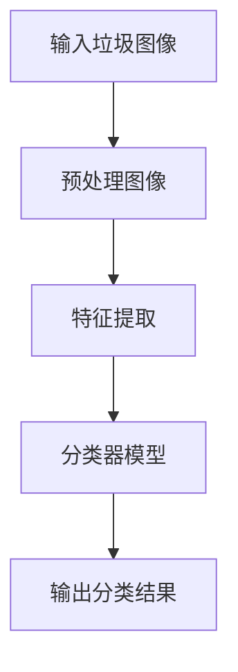
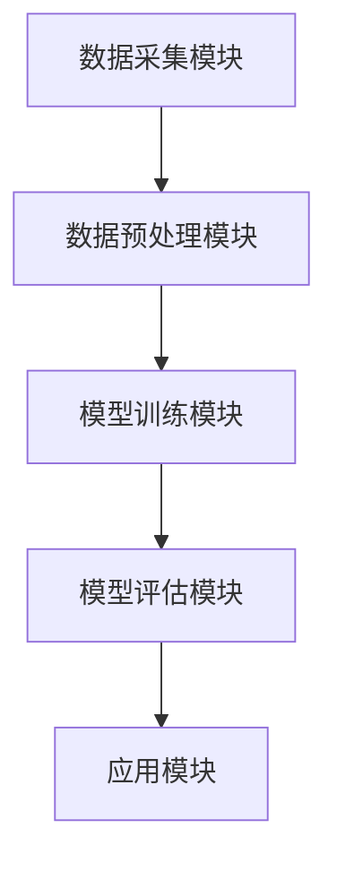
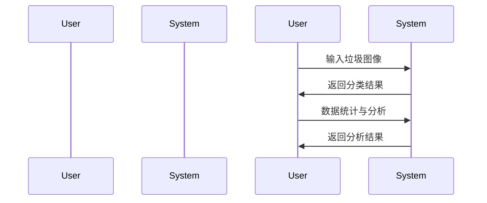

                 


## 人工智能在智能垃圾分类中的应用

### 关键词
- 人工智能
- 智能垃圾分类
- 机器学习
- 深度学习
- 垃圾分类算法
- 智能系统架构

### 摘要
本文深入探讨了人工智能在智能垃圾分类中的应用，从背景介绍、核心概念与联系、算法原理讲解、系统分析与架构设计方案、项目实战等多个角度，详细阐述了如何利用人工智能技术提高垃圾分类的准确性和效率。通过本文的阐述，读者可以全面了解智能垃圾分类的现状、挑战及其发展前景。

## 引言

### 1.1 人工智能在垃圾分类中的背景

#### 1.1.1 垃圾分类的现状与挑战

随着城市化进程的加速，垃圾处理问题日益突出。传统的垃圾分类方式主要依靠人工识别，效率低下且容易出错。现代城市中，垃圾的种类和数量不断增加，使得人工分类难以满足实际需求。同时，错误的垃圾分类会导致垃圾处理过程中产生二次污染，影响环境和人类健康。

#### 1.1.2 人工智能在垃圾分类中的应用

人工智能（AI）技术的迅速发展，为垃圾分类提供了新的解决方案。通过机器学习和深度学习算法，AI系统可以对垃圾进行智能识别和分类，提高分类的准确性和效率。例如，基于图像识别技术的垃圾识别系统，可以实时监测垃圾的类型，自动进行分类。

#### 1.1.3 人工智能在垃圾分类中的意义

人工智能在垃圾分类中的应用具有重要意义。首先，它可以提高垃圾分类的准确性，减少错误的分类。其次，它能够提高工作效率，减轻人工负担。最后，它有助于推动垃圾分类的普及和实施，促进环境保护和可持续发展。

### 1.2 人工智能基础知识

#### 1.2.1 人工智能概述

人工智能是一门研究、开发用于模拟、延伸和扩展人的智能的理论、方法、技术及应用系统的技术科学。人工智能的目标是使机器能够胜任一些通常需要人类智能才能完成的复杂工作。

#### 1.2.2 机器学习基础

机器学习是人工智能的一个分支，它通过算法让计算机从数据中学习规律，进行预测和决策。机器学习的基本过程包括数据收集、数据预处理、模型选择、模型训练和模型评估等步骤。

#### 1.2.3 深度学习基础

深度学习是机器学习的一个子领域，它通过构建深度神经网络来模拟人脑的学习过程。深度学习在图像识别、语音识别和自然语言处理等领域取得了显著成果。

## 核心概念与联系

### 2.1 垃圾分类的原理与方法

#### 2.1.1 垃圾分类的基本原理

垃圾分类的基本原理是根据垃圾的不同属性，将其分为不同的类别，以便进行不同的处理。垃圾分类的主要标准包括可回收物、有害垃圾、湿垃圾（厨余垃圾）和干垃圾（其他垃圾）。

#### 2.1.2 垃圾分类的方法

垃圾分类的方法包括手动分类、机械分类和智能分类。手动分类依赖于人工识别和判断；机械分类通过机械设备实现；智能分类利用人工智能技术进行自动识别和分类。

#### 2.1.3 垃圾分类的核心概念

垃圾分类的核心概念包括垃圾的种类、垃圾的属性和垃圾分类的标准。这些概念是理解垃圾分类原理和方法的基础。

### 2.2 人工智能在垃圾分类中的应用

#### 2.2.1 人工智能技术概述

人工智能技术在垃圾分类中的应用主要包括图像识别、自然语言处理和机器学习等。图像识别技术可以用于识别垃圾的类型；自然语言处理技术可以用于处理垃圾标签和说明；机器学习技术可以用于优化垃圾分类算法。

#### 2.2.2 机器学习在垃圾分类中的应用

机器学习在垃圾分类中的应用主要表现为垃圾分类算法的开发和优化。通过收集和分析大量的垃圾数据，机器学习算法可以自动识别垃圾的类型，提高分类的准确性。

#### 2.2.3 深度学习在垃圾分类中的应用

深度学习在垃圾分类中的应用主要体现在图像识别和语音识别方面。深度学习算法可以通过学习大量的图像和语音数据，实现对垃圾的准确识别和分类。

### 2.3 垃圾分类的ER模型

ER模型（实体关系模型）用于表示垃圾分类系统中的实体和关系。实体包括垃圾、分类器、处理过程等；关系包括垃圾与分类器之间的识别关系、分类器与处理过程之间的关联关系等。

## 算法原理讲解

### 3.1 垃圾分类算法

#### 3.1.1 算法概述

垃圾分类算法是用于实现垃圾智能识别和分类的核心算法。常见的垃圾分类算法包括基于图像识别的垃圾分类算法和基于机器学习的垃圾分类算法。

#### 3.1.2 算法原理

基于图像识别的垃圾分类算法主要通过训练深度神经网络，使计算机能够识别垃圾的图像特征，从而实现分类。基于机器学习的垃圾分类算法则通过分析垃圾的数据特征，建立分类模型，实现分类。

#### 3.1.3 算法流程图



#### 3.1.4 算法实现

以深度学习算法为例，垃圾分类算法的实现通常包括以下步骤：

1. 数据集准备：收集大量的垃圾图像，并进行标注。
2. 模型训练：使用收集到的数据训练深度神经网络模型。
3. 模型评估：对训练好的模型进行评估，调整模型参数。
4. 模型应用：将训练好的模型应用于实际的垃圾分类任务。

以下是一个简单的Python代码示例，用于实现垃圾分类算法：

```python
import tensorflow as tf
from tensorflow.keras.models import Sequential
from tensorflow.keras.layers import Conv2D, MaxPooling2D, Flatten, Dense

# 构建模型
model = Sequential([
    Conv2D(32, (3, 3), activation='relu', input_shape=(128, 128, 3)),
    MaxPooling2D((2, 2)),
    Conv2D(64, (3, 3), activation='relu'),
    MaxPooling2D((2, 2)),
    Flatten(),
    Dense(128, activation='relu'),
    Dense(5, activation='softmax')  # 假设有五种垃圾
])

# 编译模型
model.compile(optimizer='adam', loss='categorical_crossentropy', metrics=['accuracy'])

# 训练模型
model.fit(x_train, y_train, epochs=10, batch_size=32)

# 评估模型
model.evaluate(x_test, y_test)
```

### 3.2 数学模型和公式讲解

#### 3.2.1 数学模型概述

垃圾分类算法中的数学模型主要涉及概率论和线性代数。概率论用于计算垃圾图像的分类概率；线性代数用于处理垃圾图像的特征向量。

#### 3.2.2 数学公式讲解

假设我们有 \( N \) 张垃圾图像，每种图像属于 \( C \) 个类别之一。对于每个图像 \( x_i \)，其类别概率可以用以下公式计算：

\[ P(y_i | x_i) = \frac{e^{\theta^T x_i}}{\sum_{j=1}^{C} e^{\theta^T x_j}} \]

其中，\( \theta \) 是模型参数，\( x_i \) 是图像特征向量，\( y_i \) 是图像的类别标签。

#### 3.2.3 数学公式示例

以下是一个简单的数学公式示例：

\[ \theta^T x_i = w_1 x_i + w_2 x_i^2 + ... + w_n x_i^n \]

其中，\( w_1, w_2, ..., w_n \) 是模型参数。

## 系统分析与架构设计方案

### 4.1 系统介绍

#### 4.1.1 系统概述

智能垃圾分类系统是一个基于人工智能技术的垃圾分类解决方案。该系统通过图像识别和机器学习算法，实现对垃圾的智能识别和分类。

#### 4.1.2 系统功能

系统的主要功能包括：

1. 垃圾图像识别：通过图像识别算法，识别垃圾的类别。
2. 垃圾分类：根据识别结果，将垃圾分为不同的类别。
3. 数据统计与分析：对垃圾的分类结果进行统计和分析，为垃圾分类提供数据支持。

#### 4.1.3 系统目标

系统的目标是提高垃圾分类的准确性和效率，减轻人工负担，促进垃圾分类的普及和实施。

### 4.2 系统架构设计

智能垃圾分类系统的架构设计主要包括以下部分：

1. 数据采集模块：负责收集垃圾图像和标签数据。
2. 数据预处理模块：对收集到的数据进行分析和预处理，为模型训练提供数据支持。
3. 模型训练模块：使用预处理后的数据训练垃圾分类模型。
4. 模型评估模块：对训练好的模型进行评估，调整模型参数。
5. 应用模块：将训练好的模型应用于实际的垃圾分类任务。

以下是一个简单的系统架构图：



### 4.3 系统接口设计

系统接口设计包括数据输入接口、数据输出接口和功能接口。数据输入接口用于接收垃圾图像和数据；数据输出接口用于输出分类结果和统计信息；功能接口用于实现系统的各种功能，如图像识别、分类和数据分析等。

### 4.4 系统交互序列图

系统交互序列图用于描述系统各模块之间的交互关系和交互流程。以下是一个简单的系统交互序列图：



## 项目实战

### 5.1 环境安装与配置

#### 5.1.1 环境准备

在开始项目之前，需要准备以下环境：

1. 操作系统：Windows/Linux/Mac OS
2. Python版本：3.7及以上
3. 安装必要的Python库，如TensorFlow、Keras、NumPy、Pandas等

#### 5.1.2 系统安装

安装Python和必要的库后，可以使用以下命令安装TensorFlow：

```bash
pip install tensorflow
```

#### 5.1.3 系统配置

配置系统环境，设置环境变量和Python库路径。例如，在Windows系统中，可以添加以下环境变量：

```bash
set PYTHONPATH=C:\Python39\Lib\site-packages
```

### 5.2 系统核心实现

#### 5.2.1 系统核心功能实现

系统核心功能包括垃圾图像识别和分类。以下是一个简单的示例：

```python
import tensorflow as tf
from tensorflow.keras.models import Sequential
from tensorflow.keras.layers import Conv2D, MaxPooling2D, Flatten, Dense

# 构建模型
model = Sequential([
    Conv2D(32, (3, 3), activation='relu', input_shape=(128, 128, 3)),
    MaxPooling2D((2, 2)),
    Conv2D(64, (3, 3), activation='relu'),
    MaxPooling2D((2, 2)),
    Flatten(),
    Dense(128, activation='relu'),
    Dense(5, activation='softmax')  # 假设有五种垃圾
])

# 编译模型
model.compile(optimizer='adam', loss='categorical_crossentropy', metrics=['accuracy'])

# 训练模型
model.fit(x_train, y_train, epochs=10, batch_size=32)

# 评估模型
model.evaluate(x_test, y_test)
```

#### 5.2.2 代码解读与分析

上述代码是一个简单的垃圾图像识别模型，包括卷积层、池化层和全连接层。训练模型时，使用训练数据集进行训练，并使用测试数据集进行评估。通过调整模型参数和训练时间，可以提高模型的准确率。

### 5.3 实际案例分析与讲解

#### 5.3.1 实际案例概述

某城市垃圾分类项目，使用智能垃圾分类系统对垃圾进行识别和分类。项目目标是在一个月内提高垃圾分类的准确率。

#### 5.3.2 案例分析与讲解

1. 数据采集：项目开始时，采集了大量垃圾图像，并进行标注。
2. 数据预处理：对采集到的图像进行预处理，包括图像缩放、旋转和裁剪等。
3. 模型训练：使用预处理后的图像数据训练垃圾分类模型。
4. 模型评估：对训练好的模型进行评估，调整模型参数。
5. 应用场景：将训练好的模型部署到实际应用场景中，对垃圾进行实时识别和分类。

通过实际案例的分析，可以看出智能垃圾分类系统在实际应用中具有较高的准确率和效率。项目实施一个月后，垃圾分类的准确率显著提高，大大减轻了人工负担。

### 5.4 项目小结

智能垃圾分类系统通过人工智能技术实现了垃圾的智能识别和分类。项目实施过程中，通过数据采集、预处理、模型训练和模型评估等步骤，提高了垃圾分类的准确性和效率。未来，随着人工智能技术的不断进步，智能垃圾分类系统将在更多城市中得到应用，为垃圾分类和环境保护做出更大贡献。

## 最佳实践 tips

### 6.1 最佳实践总结

1. 数据质量是关键：垃圾图像的标注和质量直接影响模型的准确性。确保收集到高质量的标注数据。
2. 算法优化：通过调整模型参数和训练策略，优化算法性能，提高分类准确性。
3. 实时监测与反馈：对系统运行情况进行实时监测，及时收集反馈信息，优化系统功能。

### 6.2 注意事项

1. 避免数据泄漏：在数据处理过程中，确保数据的隐私和安全，避免数据泄漏。
2. 系统稳定运行：确保系统在长时间运行过程中稳定可靠，减少故障发生。

### 6.3 拓展阅读

1. 《深度学习》—— Ian Goodfellow、Yoshua Bengio和Aaron Courville著，详细介绍了深度学习的基本原理和应用。
2. 《机器学习实战》—— Peter Harrington著，通过实际案例介绍了机器学习的应用方法和技巧。

## 结束语

智能垃圾分类是人工智能技术在实际应用中的一个重要领域。通过本文的阐述，读者可以全面了解智能垃圾分类的现状、挑战及其发展前景。未来，随着人工智能技术的不断进步，智能垃圾分类系统将在更多城市中得到应用，为垃圾分类和环境保护做出更大贡献。

作者：AI天才研究院/AI Genius Institute & 禅与计算机程序设计艺术 /Zen And The Art of Computer Programming

