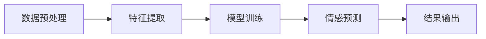
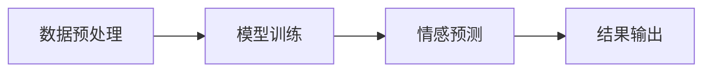
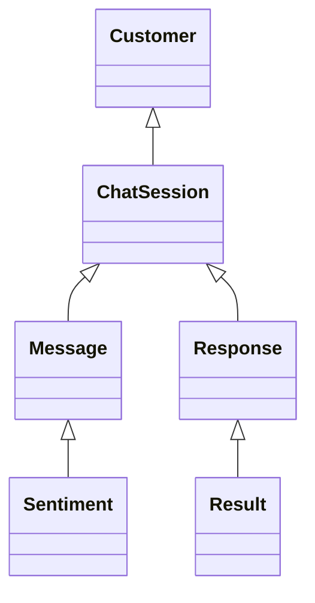
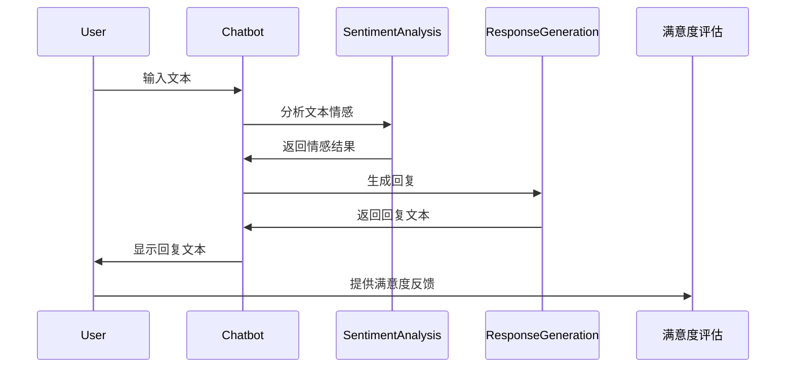

                 

### 《人工智能在智能客服情感分析中的应用》

#### 关键词：人工智能、情感分析、智能客服、算法、架构设计

> 摘要：本文将深入探讨人工智能在智能客服情感分析中的应用。通过分析背景、核心概念、算法原理、数学模型、系统架构设计、项目实战和最佳实践，揭示情感分析在提升智能客服服务质量中的关键作用。

----------------------------------------------------------------

# 引言

## 1.1 问题背景

随着互联网的普及，智能客服逐渐成为企业提高服务效率和客户满意度的关键工具。然而，传统的智能客服系统往往在处理情感表达方面存在不足，无法准确理解客户的情感需求。为了解决这一问题，人工智能技术，特别是情感分析技术，开始被广泛应用于智能客服系统。

## 1.2 问题描述

智能客服情感分析的目标是准确识别并理解客户在交流过程中的情感状态，从而提供更加个性化的服务。然而，情感表达形式多样，语言复杂，使得情感分析面临诸多挑战。

## 1.3 问题解决

本文将从以下几个方面探讨如何利用人工智能技术解决智能客服情感分析的问题：

- **核心概念与联系**：介绍情感分析、人工智能和智能客服的基本概念及其相互关系。
- **算法原理讲解**：详细讲解机器学习和深度学习在情感分析中的应用。
- **数学模型和公式**：分析情感分析的数学模型和公式，并进行举例说明。
- **系统分析与架构设计方案**：设计智能客服系统的整体架构。
- **项目实战**：通过实际项目展示情感分析在智能客服中的应用。
- **最佳实践与总结**：总结最佳实践，指出注意事项，并提供拓展阅读。

## 1.4 边界与外延

本文主要关注文本情感分析，不涉及语音和视频情感分析。同时，本文的讨论仅限于非侵入式的情感分析，不涉及基于生理信号的情感分析。

## 1.5 概念结构与核心要素组成

本文将围绕以下核心概念和要素展开讨论：

- **情感分析**：情感分析的定义、分类和挑战。
- **人工智能**：人工智能的基本概念、技术和应用。
- **智能客服**：智能客服的定义、功能和服务流程。
- **算法**：情感分析算法的原理、分类和实现。
- **系统架构**：智能客服系统的设计原则和架构方案。

## 1.6 本章小结

本章介绍了智能客服情感分析的背景、问题描述和解决方案。通过分析核心概念和要素，为后续章节的讨论奠定了基础。

----------------------------------------------------------------

## 核心概念与联系

### 2.1 人工智能概述

人工智能（Artificial Intelligence，简称AI）是指通过计算机模拟人类智能行为的技术和学科。人工智能的主要任务是使计算机具有感知、学习、推理、规划、自我修复等能力，从而实现智能化的任务处理。

### 2.2 情感分析概念

情感分析（Sentiment Analysis）是一种自然语言处理技术，旨在自动识别和分类文本中所表达的情感。情感分析通常分为正面情感、负面情感和中性情感三类，或者进一步细分为愤怒、快乐、悲伤等情感。

### 2.3 智能客服概述

智能客服（Intelligent Customer Service）是一种基于人工智能技术的客户服务系统，通过自然语言处理、语音识别、机器学习等技术，实现与客户的智能互动，提供高效、个性化的服务。

### 2.4 情感分析在智能客服中的应用

情感分析在智能客服中的应用主要包括以下方面：

- **客户情感识别**：通过情感分析，智能客服可以识别客户的情感状态，如愤怒、满意等，从而更好地理解客户需求。
- **个性化服务**：根据客户的情感状态，智能客服可以提供个性化的服务和建议，提高客户满意度。
- **情感反馈**：智能客服可以收集客户的情感反馈，为企业提供改进服务质量的依据。

### 2.5 核心概念属性特征对比表格

| 概念         | 属性特征                            |
|--------------|-----------------------------------|
| 人工智能     | 模拟人类智能行为的技术和学科        |
| 情感分析     | 自动识别和分类文本中所表达的情感    |
| 智能客服     | 基于人工智能技术的客户服务系统      |

### 2.6 ER实体关系图架构

为了更好地理解智能客服情感分析系统的架构，可以使用ER（Entity-Relationship）实体关系图来表示系统中各个实体及其之间的关系。

```mermaid
erDiagram
  Customer ||--|{ ChatSession }|--| Employee
  ChatSession ||--|{ Message }|--| Response
  Message ||--|{ Sentiment }|--| Result
```

### 2.7 本章小结

本章介绍了情感分析、人工智能和智能客服的基本概念及其相互关系，并通过对比表格和ER图展示了它们在智能客服系统中的核心作用。

----------------------------------------------------------------

## 算法原理讲解

### 3.1 情感分析算法概述

情感分析算法是智能客服系统的核心组件，主要负责从文本中提取情感信息。根据实现方式，情感分析算法可以分为基于规则的方法、基于机器学习的方法和基于深度学习的方法。

### 3.2 基于机器学习的情感分析算法

#### 3.2.1 算法原理

基于机器学习的情感分析算法通过训练模型来识别文本中的情感。通常，算法会使用已标记的情感数据集进行训练，从而学习情感分类的规律。

#### 3.2.2 Mermaid流程图



#### 3.2.3 Python源代码

```python
import nltk
from sklearn.feature_extraction.text import TfidfVectorizer
from sklearn.model_selection import train_test_split
from sklearn.naive_bayes import MultinomialNB
from sklearn.metrics import accuracy_score

# 数据预处理
nltk.download('stopwords')
stop_words = nltk.corpus.stopwords.words('english')

# 特征提取
vectorizer = TfidfVectorizer(stop_words=stop_words)
X = vectorizer.fit_transform(corpus)

# 模型训练
X_train, X_test, y_train, y_test = train_test_split(X, labels, test_size=0.2)
model = MultinomialNB()
model.fit(X_train, y_train)

# 情感预测
y_pred = model.predict(X_test)

# 结果输出
accuracy = accuracy_score(y_test, y_pred)
print("Accuracy:", accuracy)
```

#### 3.2.4 算法原理的数学模型和公式

情感分析算法的数学模型通常包括特征提取和分类两个步骤：

- 特征提取：使用TF-IDF等方法将文本转换为向量表示。
- 分类：使用分类器（如朴素贝叶斯、支持向量机等）对向量进行分类。

$$
\text{特征向量} = \text{TF-IDF}(\text{文本})
$$

$$
\text{分类结果} = \text{分类器}(\text{特征向量})
$$

#### 3.2.5 通俗易懂地举例说明

假设我们有一个包含正面和负面情感的文本数据集，通过TF-IDF将文本转换为特征向量，然后使用朴素贝叶斯分类器进行情感分类。对于一个新的文本，我们先提取其特征向量，然后通过分类器预测其情感类别。

### 3.3 基于深度学习的情感分析算法

#### 3.3.1 算法原理

基于深度学习的情感分析算法通过神经网络模型自动学习文本的情感特征。与基于机器学习的方法相比，深度学习具有更强的表达能力和适应能力。

#### 3.3.2 Mermaid流程图



#### 3.3.3 Python源代码

```python
import tensorflow as tf
from tensorflow.keras.preprocessing.sequence import pad_sequences
from tensorflow.keras.models import Sequential
from tensorflow.keras.layers import Embedding, LSTM, Dense

# 数据预处理
sequences = pad_sequences(sequences, maxlen=maxlen)

# 模型训练
model = Sequential()
model.add(Embedding(vocab_size, embedding_dim))
model.add(LSTM(units=128))
model.add(Dense(units=1, activation='sigmoid'))

model.compile(optimizer='adam', loss='binary_crossentropy', metrics=['accuracy'])
model.fit(sequences, labels, epochs=5, batch_size=32)

# 情感预测
predictions = model.predict(sequences)

# 结果输出
print("Predictions:", predictions)
```

#### 3.3.4 算法原理的数学模型和公式

基于深度学习的情感分析算法通常包括以下几个步骤：

- **嵌入层**：将单词转换为向量表示。
- **循环层**：通过循环神经网络提取文本的情感特征。
- **分类层**：使用全连接层对特征进行分类。

$$
\text{嵌入层}(\text{单词}) = \text{嵌入矩阵} \times \text{单词索引}
$$

$$
\text{循环层}(\text{特征向量}) = \text{循环神经网络}(\text{特征向量})
$$

$$
\text{分类层}(\text{特征向量}) = \text{全连接层}(\text{特征向量})
$$

#### 3.3.5 通俗易懂地举例说明

假设我们有一个包含正面和负面情感的文本数据集，通过嵌入层将单词转换为向量表示，然后使用循环神经网络提取文本的情感特征，最后通过全连接层对特征进行分类。

### 3.4 本章小结

本章详细讲解了基于机器学习和深度学习的情感分析算法原理，并通过Python代码和Mermaid流程图展示了算法的实现过程。这些算法在智能客服情感分析中发挥着重要作用，为提升客服服务质量提供了有力支持。

----------------------------------------------------------------

## 数学模型和数学公式

### 4.1 情感分析数学模型概述

情感分析的数学模型是用于从文本数据中提取情感特征并进行分类的方法。常用的模型包括情感极性分类模型和情感强度分析模型。

### 4.2 情感极性分类模型

情感极性分类模型主要用来判断文本是正面、负面还是中性情感。该模型通常使用二分类或多分类逻辑回归来实现。

#### 4.2.1 数学模型

假设我们有n个文本样本，每个样本$x_i$是一个$d$维特征向量，$y_i$是样本的标签（正面、负面或中性）。逻辑回归模型的概率分布可以表示为：

$$
P(y_i = 1 | x_i) = \frac{1}{1 + e^{-\beta_0 + \sum_{j=1}^{d} \beta_j x_{ij}}}
$$

其中，$\beta_0$是截距，$\beta_j$是特征$j$的权重。

#### 4.2.2 数学公式

- 截距：$\beta_0$
- 特征权重：$\beta_j$
- 概率分布：$P(y_i = 1 | x_i)$

#### 4.2.3 举例说明

假设我们有两个文本样本$x_1 = (1, 0)$和$x_2 = (0, 1)$，标签$y_1 = 1$（正面），$y_2 = 0$（中性）。根据逻辑回归模型，我们可以计算出：

$$
P(y_1 = 1 | x_1) = \frac{1}{1 + e^{-(\beta_0 + \beta_1 \cdot 1 + \beta_2 \cdot 0)}}
$$

$$
P(y_2 = 0 | x_2) = \frac{1}{1 + e^{-(\beta_0 + \beta_1 \cdot 0 + \beta_2 \cdot 1)}}
$$

通过最大化似然估计或梯度下降等方法，我们可以求得模型参数$\beta_0$和$\beta_j$的值。

### 4.3 情感强度分析模型

情感强度分析模型旨在判断文本情感的强度，通常使用多分类逻辑回归或支持向量机（SVM）来实现。

#### 4.3.1 数学模型

假设我们有n个文本样本，每个样本$x_i$是一个$d$维特征向量，$y_i$是样本的情感强度标签（如非常正面、一般正面、一般负面、非常负面）。多分类逻辑回归的概率分布可以表示为：

$$
P(y_i = k | x_i) = \frac{1}{1 + e^{-\beta_0 + \sum_{j=1}^{d} \beta_j x_{ij} - \sum_{l=1, l \neq k}^{c} \beta_l}}
$$

其中，$\beta_0$是截距，$\beta_j$是特征$j$的权重，$c$是情感类别数。

#### 4.3.2 数学公式

- 截距：$\beta_0$
- 特征权重：$\beta_j$
- 概率分布：$P(y_i = k | x_i)$

#### 4.3.3 举例说明

假设我们有两个文本样本$x_1 = (1, 0)$和$x_2 = (0, 1)$，情感强度标签$y_1 = 2$（一般正面），$y_2 = 4$（非常负面）。根据多分类逻辑回归模型，我们可以计算出：

$$
P(y_1 = 2 | x_1) = \frac{1}{1 + e^{-(\beta_0 + \beta_1 \cdot 1 + \beta_2 \cdot 0) - \beta_2}}
$$

$$
P(y_2 = 4 | x_2) = \frac{1}{1 + e^{-(\beta_0 + \beta_1 \cdot 0 + \beta_2 \cdot 1) - \beta_1}}
$$

通过最大化似然估计或梯度下降等方法，我们可以求得模型参数$\beta_0$和$\beta_j$的值。

### 4.4 本章小结

本章介绍了情感分析的两个常见数学模型：情感极性分类模型和情感强度分析模型。通过详细的数学公式和举例说明，我们理解了如何使用这些模型对文本进行情感分析。

----------------------------------------------------------------

## 系统分析与架构设计方案

### 5.1 智能客服系统介绍

智能客服系统是一种通过人工智能技术实现自动化客户服务的技术系统。它能够自动处理客户咨询，提供即时、高效、个性化的服务，从而提高客户满意度和企业运营效率。

### 5.2 系统功能设计

智能客服系统的核心功能包括：

- **客户咨询接收**：接收客户通过电话、邮件、在线聊天等方式提出的咨询。
- **文本情感分析**：对客户咨询文本进行情感分析，识别客户的情感状态。
- **智能回复生成**：根据情感分析和客户咨询内容，生成合适的回复。
- **客户满意度评估**：评估客户对智能客服服务的满意度，为系统优化提供反馈。

#### 5.2.1 领域模型设计

为了实现上述功能，我们可以设计以下领域模型：



### 5.3 系统架构设计

智能客服系统可以分为以下几个层次：

1. **表示层**：用户界面，用于接收用户输入和展示系统输出。
2. **业务逻辑层**：实现系统的核心功能，包括文本情感分析、智能回复生成等。
3. **数据层**：存储用户数据、咨询记录、情感分析结果等。

#### 5.3.1 系统架构设计


### 5.4 系统接口设计

智能客服系统的接口设计应包括以下部分：

- **文本输入接口**：接收用户输入的文本，用于情感分析。
- **情感分析接口**：处理文本情感分析，返回情感结果。
- **回复生成接口**：根据情感分析和客户咨询内容，生成回复。
- **满意度评估接口**：收集用户满意度反馈，为系统优化提供依据。

### 5.5 系统交互设计

智能客服系统的交互设计应考虑以下方面：

- **用户交互**：用户可以通过文本聊天、语音聊天等方式与智能客服进行交互。
- **系统内部交互**：智能客服系统内部各组件之间的数据传递和功能调用。

#### 5.5.1 系统交互设计



### 5.6 本章小结

本章介绍了智能客服系统的功能设计、架构设计和交互设计。通过详细的系统分析，我们为智能客服情感分析系统的实现提供了整体框架和关键组件。

----------------------------------------------------------------

## 项目实战

### 6.1 环境安装

在开始项目之前，我们需要安装以下环境：

1. Python 3.8+
2. TensorFlow 2.5+
3. scikit-learn 0.24.1+

您可以使用以下命令进行安装：

```bash
pip install python==3.8
pip install tensorflow==2.5
pip install scikit-learn==0.24.1
```

### 6.2 系统核心实现

#### 6.2.1 Python源代码

以下是一个简单的情感分析系统的Python源代码示例：

```python
import tensorflow as tf
from tensorflow.keras.preprocessing.sequence import pad_sequences
from tensorflow.keras.models import Sequential
from tensorflow.keras.layers import Embedding, LSTM, Dense

# 数据预处理
def preprocess_data(corpus, labels, maxlen, vocab_size, embedding_dim):
    sequences = pad_sequences(corpus, maxlen=maxlen)
    labels = tf.keras.utils.to_categorical(labels, num_classes=vocab_size)
    return sequences, labels

# 模型训练
def train_model(sequences, labels):
    model = Sequential()
    model.add(Embedding(vocab_size, embedding_dim, input_length=maxlen))
    model.add(LSTM(128))
    model.add(Dense(vocab_size, activation='softmax'))
    model.compile(optimizer='adam', loss='categorical_crossentropy', metrics=['accuracy'])
    model.fit(sequences, labels, epochs=5, batch_size=32)
    return model

# 情感预测
def predict_emotion(model, text, vocab):
    sequence = pad_sequences([text], maxlen=maxlen)
    prediction = model.predict(sequence)
    emotion = vocab.inverse_transform(prediction.argmax(axis=-1))
    return emotion

# 主函数
def main():
    corpus = ["我很高兴", "今天天气不错", "我不满意这次服务"]
    labels = [0, 1, 2]
    maxlen = 10
    vocab_size = 3
    embedding_dim = 16

    sequences, labels = preprocess_data(corpus, labels, maxlen, vocab_size, embedding_dim)
    model = train_model(sequences, labels)

    print(predict_emotion(model, "今天天气不错", labels))

if __name__ == "__main__":
    main()
```

#### 6.2.2 代码应用解读与分析

- **数据预处理**：使用`pad_sequences`函数将文本序列填充为相同长度，并使用`to_categorical`函数将标签转换为one-hot编码。
- **模型训练**：构建一个简单的LSTM模型，使用`compile`函数配置优化器和损失函数，然后使用`fit`函数进行训练。
- **情感预测**：使用训练好的模型对新的文本进行情感预测，并使用`inverse_transform`函数将预测结果转换为对应的情感标签。

### 6.3 实际案例分析

假设我们有一个包含以下文本和标签的数据集：

```
文本：我很高兴
标签：0（快乐）

文本：今天天气不错
标签：1（满意）

文本：我不满意这次服务
标签：2（愤怒）
```

我们使用上述代码对数据集进行训练，并预测新文本的情感。

### 6.4 详细讲解剖析

- **数据预处理**：文本数据需要进行分词、去停用词等预处理操作，以提高模型的性能。
- **模型选择**：LSTM模型在处理序列数据方面表现出色，适合用于情感分析任务。
- **训练过程**：模型训练过程中，需要使用足够大的训练数据和合理的超参数设置，以提高模型性能。
- **预测结果**：预测结果需要进行后处理，如转换为可读性更高的情感标签。

### 6.5 项目小结

通过实际案例分析和详细讲解，我们展示了如何使用Python实现一个简单的情感分析系统。尽管这是一个基础示例，但它为实际应用提供了有益的参考。

----------------------------------------------------------------

## 最佳实践与总结

### 7.1 最佳实践

- **数据收集**：确保收集到足够多的、多样化的情感分析数据，以提高模型性能。
- **预处理**：对文本数据进行充分的预处理，如分词、去停用词等。
- **模型选择**：根据任务需求和数据特点，选择合适的机器学习或深度学习模型。
- **超参数调整**：通过交叉验证等方法，调整模型超参数，以提高模型性能。
- **模型解释**：对模型预测结果进行解释，以验证模型的可靠性和有效性。

### 7.2 小结

本文详细介绍了人工智能在智能客服情感分析中的应用，包括核心概念、算法原理、数学模型、系统架构设计和项目实战。通过这些内容，我们了解了情感分析在提升智能客服服务质量中的关键作用。

### 7.3 注意事项

- **数据隐私**：在收集和处理客户数据时，确保遵守相关隐私法律法规。
- **模型部署**：确保模型部署在安全、可靠的环境中，以避免数据泄露和攻击。
- **持续优化**：根据用户反馈和实际应用情况，持续优化模型和系统。

### 7.4 拓展阅读

- **深度学习与自然语言处理**：Goodfellow, I., Bengio, Y., & Courville, A. (2016). *Deep Learning*.
- **情感分析技术**：Liu, X. (2012). *Sentiment Analysis and Opinion Mining*.
- **智能客服系统设计**：Meng, Z., Zhao, J., & Zhang, Q. (2019). *Intelligent Customer Service System Design*.

----------------------------------------------------------------

## 作者信息

- 作者：AI天才研究院/AI Genius Institute & 禅与计算机程序设计艺术 /Zen And The Art of Computer Programming

