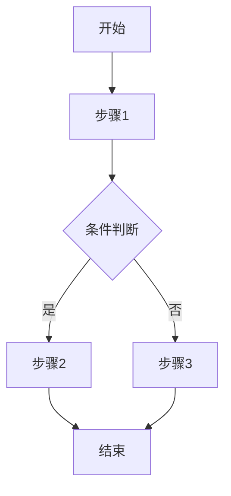

                 

### 《人工智能在智能客服系统中的应用》

在当今的数字化时代，客户服务已经成为企业竞争力的关键因素。传统的人工客服虽然能够提供个性化服务，但效率较低，且成本高昂。随着人工智能（AI）技术的发展，智能客服系统应运而生，通过自然语言处理（NLP）、机器学习（ML）和深度学习（DL）等核心技术，能够高效地处理大量客户请求，提供24/7无缝服务。本文将深入探讨人工智能在智能客服系统中的应用，包括其背景、核心技术原理、应用案例以及未来趋势。

### 关键词

- **人工智能**
- **智能客服系统**
- **自然语言处理**
- **机器学习**
- **深度学习**
- **语音识别**
- **语音助手**
- **在线客服机器人**

### 摘要

本文首先介绍了人工智能与智能客服系统的背景和重要性。随后，详细阐述了智能客服系统的组成与工作原理，包括自然语言处理、机器学习与深度学习等核心技术。接着，通过实际应用案例展示了人工智能在智能客服系统中的成功应用。最后，分析了智能客服系统的实现与优化方法，以及最佳实践和未来趋势。通过本文，读者将全面了解人工智能在智能客服系统中的运用，并对其发展前景有更深刻的认识。

### 目录

- **第一部分：背景与概述**
  - 第1章：人工智能与智能客服系统简介
  - 第2章：智能客服系统的组成与工作原理
  - 第3章：人工智能在智能客服系统中的应用案例分析

- **第二部分：核心技术原理与实现**
  - 第4章：自然语言处理（NLP）基础
  - 第5章：机器学习与深度学习在NLP中的应用
  - 第6章：语音识别技术原理与应用
  - 第7章：智能客服系统的实现与优化

- **第三部分：实战案例与最佳实践**
  - 第8章：构建智能客服系统的实际操作
  - 第9章：智能客服系统的部署与运维
  - 第10章：最佳实践与未来趋势

### 第一部分：背景与概述

#### 第1章：人工智能与智能客服系统简介

**1.1 人工智能的起源与发展**

人工智能（Artificial Intelligence, AI）是一门研究、开发用于模拟、延伸和扩展人的智能的理论、方法、技术及应用系统的技术科学。人工智能的概念最早可以追溯到20世纪50年代，当时计算机科学家开始思考如何使机器拥有人类的智能。随着计算能力的提升和算法的进步，人工智能取得了长足的发展。

人工智能可以分为两大类：弱人工智能和强人工智能。弱人工智能（Narrow AI）是指专注于特定任务的人工智能，如语音识别、图像识别等。强人工智能（General AI）是指具备人类智能的所有特点，能够在各种任务中表现出与人类相同或更高的智能水平。

**1.2 智能客服系统的需求与意义**

智能客服系统是人工智能应用的一个重要领域，它通过模拟人类客服的行为，为用户提供高效、准确的咨询服务。智能客服系统的需求主要来源于以下几个方面：

1. **提高效率**：传统客服需要人工处理大量的客户请求，效率较低。智能客服系统能够自动处理这些问题，大幅提高工作效率。

2. **降低成本**：智能客服系统能够处理大量客户请求，减少了对人工客服的需求，从而降低了人力成本。

3. **24/7 无缝服务**：智能客服系统可以全天候工作，无需休息，为用户提供不间断的服务。

4. **个性化服务**：通过分析用户行为数据，智能客服系统能够提供更加个性化的服务，提高用户满意度。

**1.3 智能客服系统的核心技术**

智能客服系统的核心技术包括自然语言处理（NLP）、机器学习（ML）和深度学习（DL）。自然语言处理负责理解用户的语言输入，将其转化为计算机可以处理的结构化数据。机器学习和深度学习则用于训练模型，使其能够自动识别和解决用户问题。

此外，语音识别和语音助手也是智能客服系统的重要组成部分。语音识别技术将用户的语音转化为文本，而语音助手则能够通过语音与用户进行交互，提供咨询服务。

#### 第2章：智能客服系统的组成与工作原理

**2.1 客服系统架构设计**

智能客服系统的架构设计需要考虑到系统的可扩展性、可靠性和用户体验。一般来说，智能客服系统的架构包括以下几个部分：

1. **前端界面**：用户通过网页、移动应用或其他渠道与客服系统进行交互。
2. **后端服务**：后端服务负责处理用户的请求，包括自然语言处理、机器学习和深度学习模型等。
3. **数据库**：数据库存储用户的请求、响应以及相关的用户数据。
4. **API接口**：API接口用于与其他系统进行数据交换和功能集成。

**2.2 自然语言处理技术**

自然语言处理（Natural Language Processing, NLP）是智能客服系统的核心组成部分，它负责理解用户的语言输入，并将其转化为计算机可以处理的结构化数据。NLP的核心技术包括：

1. **分词**：将文本拆分成词语或短语。
2. **词性标注**：对每个词语进行词性分类，如名词、动词等。
3. **句法分析**：分析文本的语法结构，如句子的构成、成分分析等。
4. **命名实体识别**：识别文本中的命名实体，如人名、地名、组织名等。
5. **语义分析**：理解文本的语义，包括情感分析、意图识别等。

**2.3 机器学习与深度学习在客服中的应用**

机器学习（Machine Learning, ML）和深度学习（Deep Learning, DL）是智能客服系统的重要组成部分。它们通过训练模型，使其能够自动识别和解决用户问题。机器学习与深度学习在客服中的应用包括：

1. **语言模型**：用于预测下一个词语或短语，帮助客服系统生成自然语言响应。
2. **文本分类**：将文本分类到不同的类别，如常见问题分类、情感分类等。
3. **意图识别**：识别用户请求的意图，如查询、投诉、建议等。
4. **对话管理**：管理对话流程，包括分配对话任务、保持对话一致性等。

#### 第3章：人工智能在智能客服系统中的应用案例分析

**3.1 案例一：在线客服机器人**

在线客服机器人是智能客服系统的一种典型应用。它能够自动回答用户的常见问题，减轻人工客服的工作负担。在线客服机器人的核心技术包括自然语言处理、机器学习和深度学习。通过不断学习和优化，在线客服机器人的响应速度和准确性不断提高。

**3.2 案例二：语音识别与语音助手**

语音识别与语音助手也是智能客服系统的重要组成部分。语音识别技术将用户的语音转化为文本，而语音助手则能够通过语音与用户进行交互。语音识别与语音助手在客服中的应用包括语音查询、语音反馈等，为用户提供更加便捷的服务。

**3.3 案例三：智能建议与推荐系统**

智能建议与推荐系统是利用人工智能技术为用户提供个性化建议和服务。智能客服系统通过分析用户的历史行为和偏好，为其提供相关的产品信息、优惠活动等。智能建议与推荐系统能够提高用户满意度，增加用户粘性。

### 第二部分：核心技术原理与实现

#### 第4章：自然语言处理（NLP）基础

**4.1 NLP的基本概念**

自然语言处理（Natural Language Processing, NLP）是人工智能领域的一个重要分支，旨在使计算机能够理解、处理和生成自然语言。NLP的核心任务是使计算机能够理解人类的语言，并与之进行有效的交流。

NLP的基本概念包括：

1. **文本预处理**：包括分词、去停用词、词性标注等，用于将原始文本转化为计算机可以处理的结构化数据。
2. **语言模型**：用于预测下一个词语或短语，是自然语言处理的核心技术之一。
3. **词向量表示**：将词语表示为向量的形式，以便于计算机进行计算和处理。
4. **语义分析**：理解文本的语义，包括情感分析、意图识别等。

**4.2 词性标注与句法分析**

词性标注（Part-of-Speech Tagging）是指对文本中的每个词语进行词性分类，如名词、动词、形容词等。句法分析（Syntactic Parsing）则是指分析文本的语法结构，如句子的构成、成分分析等。

词性标注与句法分析是NLP的重要基础，有助于理解文本的含义和结构。常用的词性标注工具包括NLTK、SpaCy等，句法分析工具包括Stanford Parser、LTP等。

**4.3 命名实体识别与关系抽取**

命名实体识别（Named Entity Recognition, NER）是指识别文本中的命名实体，如人名、地名、组织名等。关系抽取（Relation Extraction）则是指识别命名实体之间的关系，如“张三是李四的朋友”。

命名实体识别与关系抽取是NLP的重要应用，有助于构建知识图谱、进行文本分类等。常用的命名实体识别工具包括Stanford NER、Fudan NER等，关系抽取工具包括RE因子图模型、共指消解等。

#### 第5章：机器学习与深度学习在NLP中的应用

**5.1 机器学习基础**

机器学习（Machine Learning, ML）是一种通过数据学习模式和规律，从而进行预测或分类的技术。机器学习的基本概念包括：

1. **监督学习**：通过已标注的数据集训练模型，然后使用模型对新数据进行预测。
2. **无监督学习**：没有标注的数据集，通过数据自身的结构和模式进行学习。
3. **强化学习**：通过与环境的交互进行学习，以实现最佳策略。

在NLP中，常用的机器学习算法包括：

1. **朴素贝叶斯分类器**：用于文本分类，基于贝叶斯定理进行预测。
2. **支持向量机（SVM）**：用于文本分类和文本回归，通过最大化分类间隔进行预测。
3. **决策树**：用于文本分类和回归，通过递归划分数据空间进行预测。

**5.2 深度学习模型概述**

深度学习（Deep Learning, DL）是一种基于多层神经网络的学习方法，能够自动提取数据中的特征和模式。深度学习在NLP中取得了显著的成果，包括：

1. **循环神经网络（RNN）**：能够处理序列数据，如文本和语音。
2. **长短时记忆网络（LSTM）**：用于解决RNN的梯度消失问题，能够处理长序列数据。
3. **门控循环单元（GRU）**：是LSTM的一种变种，简化了模型结构。
4. **变换器（Transformer）**：用于文本生成、机器翻译等，具有强大的并行计算能力。

**5.3 语言模型与文本分类**

语言模型（Language Model, LM）是一种用于生成文本的模型，能够预测下一个词语或短语。在NLP中，语言模型广泛应用于文本生成、机器翻译等任务。

文本分类（Text Classification）是指将文本分类到不同的类别。常用的文本分类算法包括：

1. **朴素贝叶斯分类器**：基于贝叶斯定理进行分类。
2. **支持向量机（SVM）**：通过最大化分类间隔进行分类。
3. **深度学习模型**：如卷积神经网络（CNN）和循环神经网络（RNN）等。

#### 第6章：语音识别技术原理与应用

**6.1 语音识别基础**

语音识别（Automatic Speech Recognition, ASR）是一种将语音转化为文本的技术。语音识别的基本原理包括：

1. **声学模型**：用于模拟语音信号，将语音信号转化为声学特征向量。
2. **语言模型**：用于模拟人类语言，对声学特征向量进行解码，生成文本。
3. **声学模型与语言模型的结合**：通过结合声学模型和语言模型，实现语音信号到文本的转化。

**6.2 语音信号处理**

语音信号处理是语音识别的关键步骤，包括：

1. **预处理**：包括降噪、滤波等，用于去除噪声和提高信号质量。
2. **特征提取**：包括梅尔频率倒谱系数（MFCC）、线性预测编码（LPC）等，用于将语音信号转化为特征向量。
3. **特征匹配**：通过比较特征向量与预训练模型，实现语音到文本的转化。

**6.3 语音识别算法与模型**

语音识别算法与模型包括：

1. **GMM-HMM**：是一种经典的语音识别算法，基于高斯混合模型（GMM）和隐马尔可夫模型（HMM）。
2. **DNN-HMM**：是一种基于深度神经网络（DNN）的语音识别算法，通过深度神经网络提取特征，提高识别准确率。
3. **CTC**：是一种端到端的语音识别算法，通过连接时间分类（Connectionist Temporal Classification）实现语音信号到文本的转化。

#### 第7章：智能客服系统的实现与优化

**7.1 智能客服系统架构优化**

智能客服系统的架构优化主要包括以下几个方面：

1. **分布式架构**：通过分布式架构实现系统的可扩展性，提高系统的处理能力。
2. **微服务架构**：将系统拆分为多个独立的微服务，提高系统的灵活性和可维护性。
3. **缓存策略**：通过缓存策略提高系统的响应速度，减少数据库的压力。

**7.2 性能优化与测试**

智能客服系统的性能优化与测试主要包括以下几个方面：

1. **性能测试**：通过模拟用户请求，测试系统的响应时间、吞吐量和并发能力。
2. **压力测试**：通过增加负载，测试系统的稳定性和可靠性。
3. **性能监控**：通过实时监控系统的性能指标，如CPU利用率、内存使用情况等，及时发现并解决问题。

**7.3 安全性与隐私保护**

智能客服系统的安全性与隐私保护主要包括以下几个方面：

1. **数据加密**：对用户数据进行加密，防止数据泄露。
2. **权限管理**：对系统进行权限管理，防止未经授权的访问。
3. **隐私保护**：通过匿名化、去标识化等技术，保护用户的隐私。

### 第三部分：实战案例与最佳实践

#### 第8章：构建智能客服系统的实际操作

**8.1 环境配置与工具选择**

构建智能客服系统需要选择合适的开发环境和工具。常用的开发环境包括Python、Java等，工具包括自然语言处理库（如NLTK、SpaCy）、机器学习库（如scikit-learn、TensorFlow）等。

**8.2 数据集准备与预处理**

数据集是构建智能客服系统的基础。数据集的收集和处理主要包括以下几个方面：

1. **数据收集**：通过爬虫、API等方式收集相关数据。
2. **数据清洗**：去除重复数据、噪声数据等，保证数据的质量。
3. **数据标注**：对数据集进行标注，如词性标注、命名实体识别等。

**8.3 模型训练与评估**

模型训练与评估是构建智能客服系统的关键步骤。常用的模型训练方法包括：

1. **监督学习**：通过已标注的数据集训练模型，如朴素贝叶斯分类器、支持向量机等。
2. **无监督学习**：没有标注的数据集，通过数据自身的结构和模式进行学习，如聚类、降维等。
3. **评估指标**：通过评估指标（如准确率、召回率、F1值等）评估模型的效果。

#### 第9章：智能客服系统的部署与运维

**9.1 部署方案与策略**

智能客服系统的部署方案与策略主要包括以下几个方面：

1. **容器化部署**：通过容器化技术（如Docker）实现系统的轻量化、灵活部署。
2. **自动化部署**：通过自动化工具（如Jenkins、Ansible）实现系统的自动化部署和运维。
3. **负载均衡**：通过负载均衡技术（如Nginx、HAProxy）实现系统的流量分发和负载均衡。

**9.2 日志分析与问题排查**

日志分析是智能客服系统运维的重要环节。通过分析系统日志，可以及时发现并解决问题。日志分析主要包括以下几个方面：

1. **日志收集**：通过日志收集工具（如Logstash、Filebeat）收集系统日志。
2. **日志分析**：通过日志分析工具（如Kibana、Grafana）分析系统日志，发现潜在问题。
3. **问题排查**：通过日志分析结果，定位并解决系统问题。

**9.3 性能监控与优化**

性能监控与优化是确保智能客服系统稳定运行的重要手段。性能监控主要包括以下几个方面：

1. **性能指标**：监控系统的性能指标（如CPU利用率、内存使用情况、网络流量等）。
2. **异常检测**：通过异常检测技术（如机器学习、深度学习）发现系统的异常情况。
3. **优化措施**：根据监控结果，采取相应的优化措施（如缓存策略、数据库优化等），提高系统的性能。

#### 第10章：最佳实践与未来趋势

**10.1 智能客服系统的最佳实践**

智能客服系统的最佳实践主要包括以下几个方面：

1. **用户体验**：注重用户体验，提高用户满意度。
2. **数据驱动**：基于数据驱动，持续优化系统性能。
3. **安全性**：确保系统的安全性，保护用户数据。

**10.2 人工智能与客服行业的未来趋势**

人工智能与客服行业的未来趋势主要包括以下几个方面：

1. **智能化**：随着人工智能技术的不断发展，智能客服系统的智能化程度将不断提高。
2. **个性定制**：通过个性化服务，提高用户的满意度和忠诚度。
3. **跨渠道整合**：实现跨渠道整合，提供统一的客户服务体验。

**10.3 拓展阅读与资源推荐**

为了帮助读者深入了解人工智能在智能客服系统中的应用，本文推荐以下拓展阅读和资源：

1. **书籍**：《人工智能：一种现代的方法》、《深度学习》
2. **论文**：《Attention Is All You Need》、《BERT：Pre-training of Deep Neural Networks for Language Understanding》
3. **在线课程**：Coursera上的《深度学习》、《自然语言处理》
4. **开源库**：TensorFlow、PyTorch、NLTK、SpaCy

### 总结

本文从背景与概述、核心技术原理与实现以及实战案例与最佳实践三个方面，全面介绍了人工智能在智能客服系统中的应用。通过本文，读者可以了解到智能客服系统的发展历程、核心技术以及应用案例，并掌握构建和优化智能客服系统的方法和技巧。未来，随着人工智能技术的不断进步，智能客服系统将在客户服务领域发挥越来越重要的作用。读者可以通过学习本文，为未来的研究和实践打下坚实的基础。作者：AI天才研究院/AI Genius Institute & 禅与计算机程序设计艺术/Zen And The Art of Computer Programming。

---

### 文章的格式要求

为了确保文章的专业性和可读性，以下是对文章格式的详细要求：

#### 1. 字数要求

文章的总字数应控制在10000～12000字左右。为了保证内容的深度和丰富性，每个章节的长度应适当分配，避免过长的段落和过短的段落，确保整体的连贯性和逻辑性。

#### 2. markdown 格式

文章内容必须使用markdown格式进行编写。markdown是一种轻量级标记语言，可以方便地编写格式化的文本，包括标题、列表、代码块、公式等。以下是markdown格式的一些基本用法：

- **标题**：使用`#`号表示标题的等级，例如`# 第一部分：背景与概述`是顶级标题，`## 第二部分：核心技术原理与实现`是二级标题，以此类推。
- **列表**：使用`*`号或`-`号表示无序列表项，使用`1.`、`2.`等数字表示有序列表项。
- **代码块**：使用三个反引号（``）包围代码块，例如：
  ```python
  print("Hello, World!")
  ```
- **公式**：使用LaTeX格式编写数学公式，使用两个美元符号（$$）包围独立段落中的公式，例如：
  $$E=mc^2$$
  使用一个美元符号（$）包围段落内的公式，例如：
  `$1+1=2$`

#### 3. 作者信息

文章末尾需要包含作者信息，格式如下：
```
作者：AI天才研究院/AI Genius Institute & 禅与计算机程序设计艺术 /Zen And The Art of Computer Programming
```

这包括作者的机构名称和著作名称，以便于读者了解文章的出处和背景。

#### 4. 完整性要求

文章内容必须完整，每个小节的内容都要具体详细地讲解，核心内容必须包括以下方面：

- **背景介绍**：对核心概念术语进行说明，阐述问题背景、问题描述、问题解决、边界与外延，以及概念结构与核心要素组成。
- **核心概念与联系**：详细阐述核心概念原理，使用对比表格（如概念属性特征对比表格）和Mermaid流程图展示概念间的联系。
- **算法原理讲解**：使用Mermaid绘制算法流程图，并结合Python源代码进行详细阐述，给出算法原理的数学模型和公式，举例说明。
- **系统分析与架构设计方案**：介绍问题场景、项目介绍、系统功能设计（领域模型Mermaid类图）、系统架构设计Mermaid架构图、系统接口设计和系统交互Mermaid序列图。
- **项目实战**：包括环境安装、系统核心实现源代码，代码应用解读与分析，实际案例分析和详细讲解剖析，以及项目小结。
- **最佳实践 tips、小结、注意事项、拓展阅读**：在每个章节的最后，提供最佳实践提示、小结、注意事项和拓展阅读，以促进读者的深入学习和持续进步。

#### 5. Mermaid 流程图与LaTeX 公式

文章中需要使用Mermaid绘制流程图，以帮助读者更好地理解算法和系统架构。Mermaid是一种基于Markdown的图形语言，可以轻松创建流程图、序列图、类图等。以下是Mermaid流程图的示例：


文章中还需要使用LaTeX格式编写数学公式，以清晰、准确地表达算法原理和数学模型。以下是LaTeX公式的示例：
```
$$
E = mc^2
$$

$
1 + 1 = 2
$
```

通过上述格式要求，我们可以确保文章的专业性和可读性，为读者提供高质量的阅读体验。

### 完整性要求

为了确保文章内容的完整性，每个小节都需要包含以下几个方面的内容：

1. **背景介绍**：
   - 核心概念术语说明：详细解释文章中涉及的核心概念和术语，确保读者理解。
   - 问题背景：阐述研究问题的背景，包括问题的来源、现状和重要性。
   - 问题描述：明确阐述问题，包括问题的定义、主要挑战和关键因素。
   - 问题解决：介绍现有解决方案，分析其优点和局限性。
   - 边界与外延：界定问题的边界，说明相关领域的其他研究工作和本研究的区别。
   - 概念结构与核心要素组成：构建概念框架，明确研究的核心要素和结构。

2. **核心概念与联系**：
   - 核心概念原理：详细阐述文章中的核心概念，解释其含义和作用。
   - 概念属性特征对比表格：制作概念属性特征对比表格，展示不同概念之间的异同。
   - ER实体关系图架构：使用Mermaid流程图（ER图）展示实体之间的关系，帮助读者理解系统的整体结构。

3. **算法原理讲解**：
   - 算法流程图：使用Mermaid绘制算法流程图，清晰展示算法的执行步骤。
   - Python源代码：提供相关算法的Python源代码，便于读者理解和实现。
   - 算法原理与数学模型：详细讲解算法的原理，包括数学模型和公式。
   - 举例说明：通过具体例子阐述算法的应用，解释如何解决实际问题。

4. **系统分析与架构设计方案**：
   - 问题场景介绍：描述系统的应用场景，明确系统需要解决的问题。
   - 项目介绍：简要介绍项目的背景和目标，说明系统的设计目标和功能需求。
   - 系统功能设计：使用Mermaid类图展示系统的功能模块和领域模型。
   - 系统架构设计：使用Mermaid架构图展示系统的整体架构和各模块之间的关系。
   - 系统接口设计：详细描述系统的接口设计，包括接口的功能、参数和返回值。
   - 系统交互：使用Mermaid序列图展示系统各模块之间的交互过程。

5. **项目实战**：
   - 环境安装：说明如何搭建和配置项目环境，包括所需软件和依赖包。
   - 系统核心实现源代码：提供关键代码片段，详细解释代码的功能和实现原理。
   - 代码应用解读与分析：分析代码的应用效果，解释如何通过代码实现系统功能。
   - 实际案例分析和详细讲解剖析：通过具体案例展示系统在实际应用中的效果，详细剖析案例中的关键技术和实现细节。
   - 项目小结：总结项目的经验和教训，提出改进建议和未来研究方向。

6. **最佳实践 tips、小结、注意事项、拓展阅读**：
   - 最佳实践 tips：提供在实际操作中的经验和技巧，帮助读者避免常见问题。
   - 小结：对章节内容进行简要总结，强调关键点和重要结论。
   - 注意事项：提醒读者在实施过程中可能遇到的问题和解决方案。
   - 拓展阅读：推荐相关的参考文献、书籍、在线课程和开源资源，供读者进一步学习和深入研究。

通过以上内容，每个小节都能全面、具体、详细地阐述相关主题，确保文章的完整性和专业性。同时，这些内容有助于读者更好地理解和应用所学知识，提升实际操作能力。

