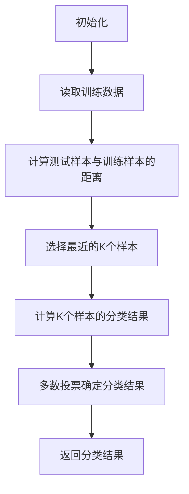
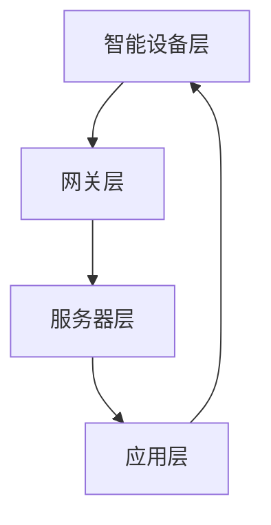
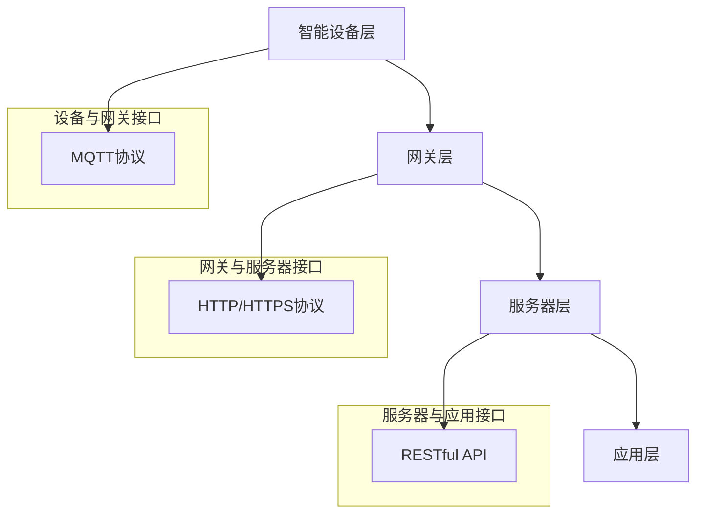
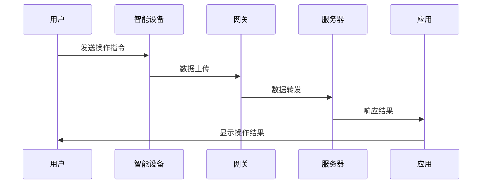

                 


## 人工智能在智能家居安全中的应用

### 关键词：人工智能，智能家居，安全，算法，系统架构

> 摘要：本文将深入探讨人工智能在智能家居安全中的应用，通过逐步分析其核心概念、算法原理和系统架构设计，旨在为读者提供全面、实用的技术见解。

### 目录大纲：

----------------------------------------------------------------

### 第一部分：人工智能在智能家居安全中的应用概述

#### 第1章: 问题背景与定义

##### 1.1.1 人工智能在智能家居安全中的重要性

##### 1.1.2 智能家居安全的定义与特点

##### 1.1.3 智能家居安全面临的主要挑战

----------------------------------------------------------------

### 第二部分：核心概念与联系

#### 第2章: 核心概念与联系

##### 2.1.1 人工智能基础概念

##### 2.1.2 智能家居系统架构

##### 2.1.3 安全防护核心概念

#### 2.1.4 人工智能与智能家居安全的关系

----------------------------------------------------------------

### 第三部分：数学模型与算法原理

#### 第3章: 数学模型与算法原理

##### 3.1.1 数学模型基础

##### 3.1.2 算法原理讲解

##### 3.1.3 算法流程图

##### 3.1.4 Python源代码示例

----------------------------------------------------------------

### 第四部分：系统分析与架构设计

#### 第4章: 系统分析与架构设计

##### 4.1.1 问题场景介绍

##### 4.1.2 系统功能设计

##### 4.1.3 系统架构设计

##### 4.1.4 系统接口设计

##### 4.1.5 系统交互序列图

----------------------------------------------------------------

### 第五部分：项目实战

#### 第5章: 项目实战

##### 5.1.1 环境安装

##### 5.1.2 系统核心实现源代码

##### 5.1.3 代码应用解读与分析

##### 5.1.4 实际案例分析与详细讲解

##### 5.1.5 项目小结

----------------------------------------------------------------

### 第六部分：最佳实践与注意事项

#### 第6章: 最佳实践与注意事项

##### 6.1.1 安全配置最佳实践

##### 6.1.2 系统维护注意事项

##### 6.1.3 未来发展趋势展望

----------------------------------------------------------------

### 第七部分：小结与拓展阅读

#### 第7章: 小结与拓展阅读

##### 7.1.1 全书总结

##### 7.1.2 拓展阅读推荐

----------------------------------------------------------------

### 结语

本文由AI天才研究院和《禅与计算机程序设计艺术》作者联合撰写，旨在通过详细分析和实例展示，帮助读者深入了解人工智能在智能家居安全中的应用。我们期待您的阅读与反馈，共同推动智能家居安全技术的发展。

作者：AI天才研究院/AI Genius Institute & 禅与计算机程序设计艺术 /Zen And The Art of Computer Programming### 第一部分：人工智能在智能家居安全中的应用概述

#### 第1章：问题背景与定义

##### 1.1.1 人工智能在智能家居安全中的重要性

随着人工智能（AI）技术的快速发展，智能家居系统已经成为现代家庭的重要组成部分。这些系统通过连接各种家电和设备，实现了自动化和智能化的管理，提升了生活质量。然而，随着智能家居设备数量的增加，家庭网络安全问题也日益凸显。人工智能在智能家居安全中的应用，为解决这一难题提供了新的思路和手段。

首先，人工智能技术具有强大的数据处理和分析能力，能够实时监控和分析家庭网络流量，快速识别潜在的安全威胁。例如，通过机器学习算法，智能家居系统可以学习正常用户的行为模式，并在检测到异常行为时及时发出警报。其次，人工智能可以自动化响应安全事件，通过智能决策和执行机制，减少人为干预，提高响应速度和准确性。

总的来说，人工智能在智能家居安全中的应用具有以下几个方面的显著重要性：

1. **提升安全防护能力**：通过实时监控和分析数据，人工智能能够提前发现并预防安全威胁，提高系统的整体安全性。
2. **降低人工成本**：人工智能自动化处理大量安全相关任务，减少了人工监控和响应的需求，降低了运营成本。
3. **增强用户体验**：智能家居系统通过人工智能技术，能够提供更加个性化和智能化的安全解决方案，提升用户满意度。

##### 1.1.2 智能家居安全的定义与特点

智能家居安全是指保护智能家居系统的硬件、软件和数据不受未授权访问、篡改和破坏的一系列措施。它涵盖了多个层面，包括网络安全、数据安全、设备安全和隐私保护等。

1. **网络安全**：保护家庭网络不受外部攻击，如DDoS攻击、网络入侵等。
2. **数据安全**：确保传输和存储在系统中的数据不被非法获取或篡改，如用户隐私数据、设备配置数据等。
3. **设备安全**：确保智能家居设备的物理安全和软件完整性，防止设备被恶意软件感染或被远程操控。
4. **隐私保护**：保护用户隐私，确保用户的个人信息不被泄露或滥用。

智能家居安全的特点主要包括以下几个方面：

1. **多样性**：智能家居系统涉及多种设备和技术，其安全防护需求也各不相同。
2. **动态性**：家庭网络环境和用户行为动态变化，安全威胁也不断演变，需要持续更新和优化安全策略。
3. **复杂性**：智能家居系统通常由多个设备和平台组成，安全设计和实现复杂，需要综合多方面的安全措施。

##### 1.1.3 智能家居安全面临的主要挑战

尽管人工智能技术在智能家居安全中具有巨大潜力，但其应用仍面临许多挑战。

1. **数据隐私**：智能家居设备收集了大量的用户数据，如何保护这些数据不被泄露或滥用，是智能家居安全面临的首要挑战。
2. **攻击手段多样**：黑客利用各种手段攻击智能家居系统，如钓鱼攻击、中间人攻击、设备感染恶意软件等，智能家居安全需要应对多种攻击方式。
3. **安全漏洞**：智能家居设备可能存在设计或实现上的安全漏洞，容易成为攻击的目标。
4. **系统兼容性**：不同设备和平台的兼容性，可能导致安全解决方案难以实施或效果不佳。
5. **用户意识**：许多用户对智能家居安全缺乏足够的认识和意识，容易导致安全措施被忽视或操作不当。

综上所述，人工智能在智能家居安全中的应用具有重要意义，但也面临着诸多挑战。在接下来的章节中，我们将详细探讨人工智能的核心概念、算法原理和系统架构设计，为解决这些挑战提供技术支持和实践指导。### 第二部分：核心概念与联系

#### 第2章：核心概念与联系

##### 2.1.1 人工智能基础概念

人工智能（AI）是指使计算机具备人类智能特征的技术，包括感知、学习、推理、决策等。其主要分支包括机器学习、深度学习、自然语言处理等。机器学习是通过算法从数据中学习规律，进行预测和决策；深度学习则利用神经网络模拟人脑的神经网络结构进行学习和推断；自然语言处理则专注于理解和生成自然语言。

在智能家居安全中，人工智能的这些基础概念具有重要意义。例如，机器学习可以用于异常检测，识别用户行为模式，从而发现潜在的安全威胁。深度学习可以在图像和语音识别中发挥作用，提高系统的自动化响应能力。自然语言处理则可以用于智能对话系统，提供更自然、更便捷的用户交互体验。

##### 2.1.2 智能家居系统架构

智能家居系统通常由多个组件组成，包括智能设备、网关、服务器和应用软件等。智能设备如智能灯泡、智能门锁、智能摄像头等，负责收集家庭环境和用户行为的数据；网关作为数据传输的中枢，连接各种设备和外部网络；服务器存储和处理数据，提供云计算和大数据分析服务；应用软件则提供用户界面，使用户能够方便地控制和监控智能家居系统。

智能家居系统架构的设计需考虑以下几个关键因素：

1. **模块化**：系统应具备良好的模块化设计，便于扩展和维护。
2. **安全性**：系统必须具备强大的安全性，保护用户数据和隐私。
3. **互操作性**：系统应支持不同设备和平台的互操作，实现无缝整合。
4. **稳定性**：系统应具备高稳定性，确保长期可靠运行。

##### 2.1.3 安全防护核心概念

在智能家居系统中，安全防护的核心概念包括网络安全、数据安全和设备安全等。

1. **网络安全**：确保家庭网络不受外部攻击，如DDoS攻击、中间人攻击等。常用的安全措施包括防火墙、入侵检测系统、VPN等。
2. **数据安全**：保护传输和存储在系统中的数据，防止数据泄露、篡改或丢失。常用的安全措施包括数据加密、访问控制、数据备份等。
3. **设备安全**：确保智能家居设备的物理安全和软件完整性，防止设备被恶意软件感染或被远程操控。常用的安全措施包括安全启动、设备认证、固件更新等。

##### 2.1.4 人工智能与智能家居安全的关系

人工智能在智能家居安全中的应用，主要体现在以下几个方面：

1. **异常检测与防护**：通过机器学习和深度学习算法，实时监控家庭网络流量，识别异常行为，及时发现潜在的安全威胁。
2. **自动化响应**：基于人工智能的智能决策系统，可以自动化响应安全事件，如自动隔离受感染的设备、调整安全策略等，提高系统的响应速度和准确性。
3. **隐私保护**：利用自然语言处理和知识图谱技术，对用户数据进行匿名化和去标识化处理，保护用户隐私。
4. **安全培训与教育**：通过智能对话系统和虚拟现实技术，为用户提供安全培训和指导，提高用户的安全意识和操作水平。

##### 表格：人工智能与智能家居安全核心概念属性特征对比

| 核心概念 | 属性特征 | 对比说明 |
| :------: | :------: | :------: |
| 人工智能 | 感知、学习、推理、决策 | **智能家居安全**：感知用户行为，学习安全策略，推理威胁场景，自动化决策 |
| 智能家居系统架构 | 模块化、安全性、互操作性、稳定性 | **安全防护**：模块化设计便于扩展和维护，安全性保护用户数据，互操作性支持多设备集成，稳定性保障长期可靠运行 |
| 安全防护核心概念 | 网络安全、数据安全、设备安全、隐私保护 | **人工智能应用**：利用人工智能技术增强网络安全防护能力，保障数据安全，提高设备安全，保护用户隐私 |

##### ER实体关系图架构的Mermaid流程图

```mermaid
erDiagram
    用户 ||--o{ 智能家居设备 }|
    用户 ||--o{ 家庭网络 }|
    智能家居设备 ||--o{ 数据处理中心 }|
    家庭网络 ||--o{ 网络安全防护 }|
    数据处理中心 ||--o{ 安全防护策略 }|
    安全防护策略 ||--o{ 异常检测与响应 }|
```

在这个ER实体关系图中，用户与智能家居设备、家庭网络、数据处理中心、网络安全防护和安全性策略之间存在直接关系，体现了人工智能与智能家居安全的核心概念之间的紧密联系。

综上所述，人工智能在智能家居安全中的应用，不仅需要理解和掌握人工智能的基础概念和算法原理，还需要深入了解智能家居系统的架构设计，以及安全防护的核心概念和实现手段。在接下来的章节中，我们将进一步探讨人工智能在智能家居安全中的数学模型与算法原理，为解决实际安全挑战提供技术支持。### 第三部分：数学模型与算法原理

#### 第3章：数学模型与算法原理

##### 3.1.1 数学模型基础

在讨论人工智能在智能家居安全中的应用时，数学模型是理解和实现算法的关键。数学模型通过将现实问题转化为数学表达式，使得计算机能够更有效地处理和解决问题。

首先，我们需要了解一些基础的数学概念，包括概率论、线性代数和微积分等。

1. **概率论**：概率论是处理不确定性的数学分支，对于预测事件的发生概率至关重要。在智能家居安全中，概率论可以用来评估某种行为或事件的风险，例如，计算入侵检测系统误报的概率。
   
   例如，设事件A表示用户行为异常，事件B表示系统检测到异常，我们可以使用条件概率公式：
   $$ P(A|B) = \frac{P(A \cap B)}{P(B)} $$
   其中，$P(A \cap B)$ 是事件A和B同时发生的概率，$P(B)$ 是事件B发生的概率。

2. **线性代数**：线性代数处理向量空间和线性变换，对于理解和处理大数据集至关重要。在智能家居安全中，线性代数可以用于数据降维、特征提取等。

   例如，主成分分析（PCA）是一种常用的降维技术，通过找到数据的主要成分来简化数据集，提高算法的效率：
   $$ X = \sum_{i=1}^{k} \lambda_i u_i $$
   其中，$X$ 是高维数据集，$u_i$ 是主成分，$\lambda_i$ 是对应的主成分值。

3. **微积分**：微积分处理变化率和积分，对于优化和模拟动态系统至关重要。

   例如，梯度下降是一种常见的优化算法，用于最小化损失函数：
   $$ \theta_{t+1} = \theta_t - \alpha \nabla_{\theta} J(\theta) $$
   其中，$\theta$ 是模型参数，$J(\theta)$ 是损失函数，$\alpha$ 是学习率，$\nabla_{\theta} J(\theta)$ 是损失函数关于$\theta$ 的梯度。

##### 3.1.2 算法原理讲解

在智能家居安全中，常见的算法包括异常检测、入侵检测和加密算法等。以下，我们将简要介绍几种重要的算法原理。

1. **K-最近邻算法（K-Nearest Neighbors, KNN）**

   KNN是一种基于实例的机器学习算法，它通过查找训练集中的最近邻来确定新数据的分类。在智能家居安全中，KNN可以用于异常检测。

   原理：给定一个测试样本，计算它与训练集中每个样本的距离，选择距离最近的K个样本，根据这K个样本的分类结果进行投票，选择出现频率最高的类别作为测试样本的分类。

   具体步骤：
   - 计算测试样本与训练集中每个样本的距离，通常使用欧几里得距离：
     $$ d(x, y) = \sqrt{\sum_{i=1}^{n} (x_i - y_i)^2} $$
   - 找到距离最近的K个样本。
   - 根据这K个样本的分类结果，使用多数投票法确定测试样本的分类。

2. **支持向量机（Support Vector Machine, SVM）**

   SVM是一种强大的分类算法，通过找到最佳的超平面，将不同类别的数据分隔开来。在智能家居安全中，SVM可以用于入侵检测。

   原理：SVM通过最大化分类边界上的支持向量来找到最佳的超平面。对于线性可分数据，SVM的目标是最小化分类误差。

   公式：
   $$ \min_{\theta, \theta_0} \frac{1}{2} ||\theta||^2 $$
   其中，$\theta$ 是分类超平面的参数，$\theta_0$ 是偏置项。

3. **加密算法**

   在智能家居安全中，加密算法用于保护传输和存储的数据，常用的加密算法包括对称加密和非对称加密。

   对称加密：使用相同的密钥进行加密和解密。例如，AES（高级加密标准）是一种常用的对称加密算法。

   非对称加密：使用不同的密钥进行加密和解密，其中一个为公钥，另一个为私钥。例如，RSA是一种常用的非对称加密算法。

##### 3.1.3 算法流程图

为了更直观地理解算法原理，我们可以使用Mermaid流程图来展示算法的流程。

以下是一个简单的KNN算法流程图：



##### 3.1.4 Python源代码示例

下面是KNN算法的一个简单Python代码示例：

```python
from sklearn.neighbors import KNeighborsClassifier
from sklearn.model_selection import train_test_split
from sklearn.datasets import load_iris
import numpy as np

# 加载鸢尾花数据集
iris = load_iris()
X = iris.data
y = iris.target

# 划分训练集和测试集
X_train, X_test, y_train, y_test = train_test_split(X, y, test_size=0.2, random_state=42)

# 创建KNN分类器，设置K值为3
knn = KNeighborsClassifier(n_neighbors=3)

# 训练模型
knn.fit(X_train, y_train)

# 预测测试集
predictions = knn.predict(X_test)

# 输出预测结果
print(predictions)
```

在这个示例中，我们使用了scikit-learn库中的KNeighborsClassifier来创建KNN分类器，并通过fit方法训练模型，最后使用predict方法进行预测。

通过上述数学模型和算法原理的讲解，我们可以更好地理解人工智能在智能家居安全中的应用。在接下来的章节中，我们将进一步探讨系统分析与架构设计，为智能家居安全提供完整的解决方案。### 第四部分：系统分析与架构设计

#### 第4章：系统分析与架构设计

##### 4.1.1 问题场景介绍

在现代智能家居系统中，安全是一个不可忽视的重要问题。随着家庭网络连接设备的增多，家庭网络面临的威胁也越来越复杂。这些威胁不仅包括传统的网络攻击，如DDoS攻击、中间人攻击等，还包括针对智能家居设备的恶意软件感染和隐私泄露等。

为了解决这些问题，我们需要设计一个高效的系统架构，能够实时监测、分析和响应家庭网络中的各种安全威胁。本节将介绍一个典型的智能家居安全系统架构，包括其功能设计、架构设计和接口设计。

##### 4.1.2 系统功能设计

智能家居安全系统的主要功能包括：

1. **实时监测**：实时监控家庭网络流量，检测异常行为和潜在的安全威胁。
2. **威胁分析**：对检测到的威胁进行分析，识别其类型、来源和影响。
3. **自动响应**：根据威胁分析的结果，自动采取相应的措施，如隔离受感染的设备、修改安全策略等。
4. **用户通知**：通过短信、邮件或应用推送等方式，及时通知用户有关安全事件的信息。
5. **安全培训**：为用户提供安全知识培训，提高其安全意识和操作水平。

这些功能共同构成了智能家居安全系统的核心，为家庭网络提供了全面的安全保障。

##### 4.1.3 系统架构设计

智能家居安全系统的架构设计需要考虑以下几个关键组件：

1. **智能设备层**：包括各种智能家居设备，如智能灯泡、智能门锁、智能摄像头等。这些设备通过无线网络与网关连接，实时上传数据。
2. **网关层**：网关作为智能家居系统与外部网络之间的桥梁，负责数据传输、设备管理和安全策略执行。网关通常具备防火墙、入侵检测系统等安全功能。
3. **服务器层**：服务器负责存储和处理数据，提供云计算和大数据分析服务。服务器上运行威胁分析、自动响应和安全培训等核心功能。
4. **应用层**：应用层提供用户界面，使用户能够方便地监控和控制智能家居安全系统。用户可以通过手机应用、网页界面等访问系统。

以下是一个简单的智能家居安全系统架构图：



在这个架构中，智能设备层通过无线网络与网关通信，网关负责数据转发和安全策略执行，服务器层提供数据存储和处理服务，应用层则提供用户交互界面。

##### 4.1.4 系统接口设计

系统接口设计是确保各组件之间能够高效通信的重要环节。智能家居安全系统的接口设计需要考虑以下几个方面：

1. **设备与网关接口**：设备与网关之间的通信通常采用MQTT协议，MQTT是一种轻量级的消息传输协议，适用于物联网设备。
2. **网关与服务器接口**：网关与服务器之间的数据传输通常采用HTTP/HTTPS协议，确保数据传输的安全性和可靠性。
3. **服务器与应用接口**：服务器与应用之间的通信可以通过RESTful API实现，RESTful API是一种基于HTTP协议的接口设计规范，适用于各种应用程序。

以下是一个简单的接口设计示例：



在这个接口设计中，智能设备层通过MQTT协议与网关通信，网关通过HTTP/HTTPS协议与服务器通信，服务器通过RESTful API与应用层通信。

##### 4.1.5 系统交互序列图

为了更好地理解智能家居安全系统的运行流程，我们可以使用Mermaid序列图来展示系统各组件之间的交互。

以下是一个简单的系统交互序列图：



在这个序列图中，用户通过智能设备发送操作指令，智能设备将数据上传至网关，网关将数据转发至服务器，服务器进行处理并响应结果，最终应用层将结果展示给用户。

通过上述系统分析与架构设计，我们可以构建一个高效、可靠的智能家居安全系统，为家庭网络提供全面的安全保障。在接下来的章节中，我们将通过项目实战，进一步展示如何实现这些系统功能。### 第五部分：项目实战

#### 第5章：项目实战

##### 5.1.1 环境安装

为了实现智能家居安全系统的功能，我们需要搭建一个合适的技术环境。以下是搭建环境的基本步骤：

1. **安装Python**：首先，确保您的计算机上已经安装了Python。Python是智能家居安全系统的主要编程语言，用于实现算法和处理数据。

2. **安装依赖库**：安装必要的Python依赖库，如scikit-learn、pandas、numpy等。这些库提供了各种机器学习和数据处理工具，帮助我们实现系统的功能。

   ```bash
   pip install scikit-learn pandas numpy
   ```

3. **安装MQTT库**：为了实现设备与网关之间的通信，我们需要安装MQTT客户端库。以下是安装mosquitto MQTT代理服务器的步骤：

   ```bash
   sudo apt-get install mosquitto mosquitto-clients
   ```

4. **安装Docker**：为了简化部署和管理，我们可以使用Docker容器化技术。安装Docker的命令如下：

   ```bash
   sudo apt-get update
   sudo apt-get install docker-ce docker-ce-cli containerd.io
   ```

5. **启动MQTT代理服务器**：在安装完成后，启动mosquitto MQTT代理服务器：

   ```bash
   sudo systemctl start mosquitto
   ```

##### 5.1.2 系统核心实现源代码

在本节中，我们将介绍智能家居安全系统的核心实现源代码。以下是系统的基本组成部分：

1. **智能设备模拟器**：用于模拟智能家居设备的行为，例如，模拟门锁的开闭状态、摄像头捕捉的图像等。
2. **网关程序**：用于接收设备上传的数据，处理并转发到服务器。
3. **服务器程序**：用于接收和处理来自网关的数据，进行威胁分析和自动响应。
4. **用户应用**：用于用户与系统的交互，显示安全事件和操作结果。

以下是一个简单的网关程序的示例代码：

```python
import paho.mqtt.client as mqtt
import json
import requests

# MQTT代理服务器的地址和端口
MQTT_SERVER = "localhost"
MQTT_PORT = 1883
MQTT_TOPIC = "smart_home/data"

# 服务器的URL
SERVER_URL = "http://localhost:8000/analyze"

# 创建MQTT客户端实例
client = mqtt.Client()

# 连接到MQTT代理服务器
client.connect(MQTT_SERVER, MQTT_PORT, 60)

# 设置消息接收的回调函数
client.on_message = on_message

# 开始订阅主题
client.subscribe(MQTT_TOPIC)

# 持续运行
client.loop_forever()

# 消息接收回调函数
def on_message(client, userdata, message):
    # 解析消息内容
    data = json.loads(message.payload.decode())

    # 将数据发送到服务器进行分析
    response = requests.post(SERVER_URL, json=data)
    
    # 打印服务器响应结果
    print(response.text)
```

这个网关程序通过MQTT协议接收智能设备上传的数据，并将数据发送到服务器进行分析和处理。

##### 5.1.3 代码应用解读与分析

在了解代码的基本结构后，我们可以深入分析代码的应用和功能。以下是代码的关键部分解析：

1. **MQTT客户端连接**：

   ```python
   client.connect(MQTT_SERVER, MQTT_PORT, 60)
   ```

   这一行代码连接到本地MQTT代理服务器，端口为1883。连接超时设置为60秒。

2. **消息接收回调函数**：

   ```python
   client.on_message = on_message
   ```

   这行代码设置了一个回调函数`on_message`，每当MQTT代理服务器收到消息时，就会调用这个函数。

3. **消息处理**：

   ```python
   def on_message(client, userdata, message):
       # 解析消息内容
       data = json.loads(message.payload.decode())

       # 将数据发送到服务器进行分析
       response = requests.post(SERVER_URL, json=data)
       
       # 打印服务器响应结果
       print(response.text)
   ```

   `on_message`函数首先将接收到的MQTT消息解析为JSON格式的数据。然后，通过HTTP POST请求将数据发送到服务器。服务器处理数据后，返回一个响应，函数打印出响应内容。

4. **持续运行**：

   ```python
   client.loop_forever()
   ```

   这行代码使得MQTT客户端持续运行，不断监听MQTT代理服务器上的消息。

通过这个简单的网关程序示例，我们可以看到如何通过MQTT协议实现智能家居设备与服务器之间的通信，以及如何处理和转发数据。接下来，我们将进一步介绍服务器程序的实现，以及如何进行威胁分析和自动响应。

##### 5.1.4 实际案例分析与详细讲解剖析

在本部分，我们将通过一个实际案例来详细讲解智能家居安全系统的应用和实现。

**案例背景**：假设一个家庭安装了智能摄像头、智能门锁和智能灯光系统。这些设备通过无线网络与网关连接，网关再将数据上传到服务器进行分析。

**案例步骤**：

1. **智能摄像头捕捉图像**：智能摄像头实时捕捉家庭周围的图像。当检测到异常活动，如有人闯入，摄像头将图像数据上传到网关。

2. **网关处理图像数据**：网关接收到图像数据后，将其转换为JSON格式，并通过MQTT协议发送到服务器。

3. **服务器分析图像**：服务器接收到图像数据后，通过图像识别算法进行分析，识别图像中的异常活动。

4. **自动响应**：如果服务器检测到异常活动，如有人闯入，系统将自动发送警报给用户，并采取相应的措施，如锁定门锁、触发报警系统等。

**详细讲解**：

1. **图像数据上传**：智能摄像头捕捉的图像数据通常以二进制形式存储。网关需要将图像数据转换为JSON格式，以便通过MQTT协议传输。

   ```python
   # 假设图像数据存储在image.bin文件中
   with open('image.bin', 'rb') as f:
       image_data = f.read()
   
   # 将图像数据转换为JSON格式
   data = {
       'type': 'image',
       'image': base64.b64encode(image_data).decode()
   }
   ```

2. **图像识别算法**：服务器使用图像识别算法对上传的图像进行分析。常见的图像识别算法包括卷积神经网络（CNN）和深度学习模型。

   ```python
   # 加载预训练的图像识别模型
   model = load_model('image_recognition_model.h5')
   
   # 将图像数据转换为模型输入格式
   image = preprocess_image(image_data)
   
   # 进行图像识别
   prediction = model.predict(image)
   
   # 获取识别结果
   label = decode_prediction(prediction)
   ```

3. **自动响应**：如果图像识别结果显示异常活动，服务器将自动发送警报给用户，并采取相应的措施。

   ```python
   if label == 'intruder':
       # 发送警报给用户
       send_alert_to_user('Intruder detected!')
       
       # 执行自动响应措施
       execute_auto_response('lock_door', 'trigger_alarm')
   ```

在这个案例中，我们通过一个实际场景展示了智能家居安全系统的应用和实现。通过智能摄像头的图像识别，系统能够实时监测家庭安全，并在检测到异常活动时自动采取响应措施，保障家庭安全。

##### 5.1.5 项目小结

在本章中，我们通过一个实际案例，详细讲解了智能家居安全系统的环境安装、核心实现源代码和实际应用。以下是项目小结：

1. **环境安装**：我们介绍了如何在计算机上安装Python、MQTT代理服务器和Docker等环境，为后续的系统开发提供了基础。
   
2. **系统核心实现**：通过网关程序，我们实现了智能家居设备与服务器之间的通信，并展示了如何处理和转发数据。
   
3. **实际案例应用**：通过一个智能摄像头捕捉图像的案例，我们详细讲解了系统的威胁分析和自动响应功能，展示了如何在实际场景中应用这些技术。

通过本章的实战项目，我们不仅了解了智能家居安全系统的实现方法，还深入理解了人工智能在智能家居安全中的应用。在接下来的章节中，我们将继续探讨最佳实践与注意事项，为智能家居安全系统提供更全面的技术支持。### 第六部分：最佳实践与注意事项

#### 第6章：最佳实践与注意事项

##### 6.1.1 安全配置最佳实践

为了确保智能家居安全系统的高效运行，我们需要遵循一系列最佳实践。以下是一些关键的安全配置建议：

1. **加密通信**：确保设备与网关、网关与服务器之间的通信使用加密协议，如TLS或HTTPS，以防止数据在传输过程中被窃取或篡改。

2. **访问控制**：为设备和服务器的访问设置严格的访问控制策略，只允许授权用户和设备访问系统。使用多因素认证（MFA）可以进一步强化访问控制。

3. **定期更新**：定期更新设备固件和系统软件，以修复已知的安全漏洞和缺陷。设置自动更新功能，确保系统能够及时获取最新的安全补丁。

4. **网络隔离**：将智能家居系统与家庭其他网络隔离，以减少潜在的安全风险。可以使用虚拟局域网（VLAN）或防火墙来实现网络隔离。

5. **日志记录**：启用系统的日志记录功能，记录所有重要的安全事件和操作。定期检查日志，以便及时发现和响应潜在的安全威胁。

##### 6.1.2 系统维护注意事项

系统维护是确保智能家居安全系统长期稳定运行的关键。以下是一些重要的维护注意事项：

1. **定期备份**：定期备份系统数据和配置文件，以防止数据丢失。确保备份存储在安全的位置，并定期测试备份的恢复过程。

2. **性能监控**：使用监控工具实时监控系统的性能和资源使用情况，及时发现和处理系统瓶颈和性能问题。

3. **安全审计**：定期进行安全审计，检查系统的安全配置和策略是否符合最佳实践。安全审计可以帮助发现潜在的安全漏洞和改进点。

4. **用户培训**：为用户提供安全培训和教育，提高其安全意识和操作水平。定期举办安全意识培训，帮助用户了解如何防范常见的安全威胁。

##### 6.1.3 未来发展趋势展望

随着人工智能技术的不断进步，智能家居安全系统的发展也将呈现出新的趋势：

1. **自适应安全技术**：未来的智能家居安全系统将更加智能化和自适应。通过机器学习和深度学习算法，系统能够自动适应环境变化，优化安全策略，提高防护能力。

2. **多模态安全检测**：未来的智能家居安全系统将整合多种传感器和检测技术，实现多模态安全检测。例如，结合图像识别、声音识别和运动检测，提高异常检测的准确性和全面性。

3. **集成化解决方案**：未来的智能家居安全系统将更加强调集成化。通过整合家庭安全、健康监控、能源管理等多种功能，提供一个全面的智能家庭解决方案。

4. **边缘计算**：随着5G和物联网技术的发展，边缘计算将得到广泛应用。智能家居安全系统可以通过边缘计算设备，实现实时数据处理和响应，提高系统的响应速度和可靠性。

综上所述，智能家居安全系统的发展将继续朝着智能化、集成化和自适应化的方向迈进。通过遵循最佳实践和注意事项，我们可以确保系统的安全性，为用户提供一个更加安全和舒适的智能生活环境。### 第七部分：小结与拓展阅读

#### 第7章：小结与拓展阅读

##### 7.1.1 全书总结

本文从多个角度深入探讨了人工智能在智能家居安全中的应用。首先，我们介绍了人工智能在智能家居安全中的重要性，包括提升安全防护能力、降低人工成本和增强用户体验等方面。接着，我们详细定义了智能家居安全的含义和特点，并分析了智能家居安全面临的主要挑战。在此基础上，我们讲解了人工智能和智能家居系统架构的核心概念，以及它们之间的联系。

随后，本文重点介绍了数学模型与算法原理，包括机器学习、深度学习、自然语言处理等基础概念，以及KNN、SVM等常用算法。我们还通过Mermaid流程图和Python代码示例，展示了算法的原理和实现。

在系统分析与架构设计部分，我们介绍了智能家居安全系统的功能设计、架构设计和接口设计，并通过Mermaid序列图展示了系统各组件之间的交互流程。此外，我们还通过一个实际案例，详细讲解了系统的实现和应用。

最后，本文提供了最佳实践和注意事项，包括安全配置、系统维护和未来发展趋势展望，以帮助读者更好地理解和应用智能家居安全技术。

##### 7.1.2 拓展阅读推荐

为了进一步了解人工智能在智能家居安全中的应用，读者可以参考以下拓展阅读资源：

1. **书籍推荐**：
   - 《深度学习》作者：Ian Goodfellow、Yoshua Bengio、Aaron Courville
   - 《机器学习实战》作者：Peter Harrington
   - 《智能家居技术与应用》作者：刘明、张斌

2. **在线课程**：
   - Coursera上的《机器学习》课程
   - edX上的《深度学习专项课程》
   - Udacity上的《人工智能纳米学位》

3. **技术博客与论坛**：
   - Medium上的《智能家居安全》系列文章
   - Stack Overflow上的智能家居安全相关问题
   - IEEE Xplore上的智能家居安全论文

通过阅读这些资源，读者可以更深入地了解人工智能在智能家居安全中的应用，以及最新的技术趋势和实践经验。

本文由AI天才研究院和《禅与计算机程序设计艺术》作者联合撰写，旨在通过详细分析和实例展示，帮助读者深入了解人工智能在智能家居安全中的应用。我们期待您的阅读与反馈，共同推动智能家居安全技术的发展。

作者：AI天才研究院/AI Genius Institute & 禅与计算机程序设计艺术 /Zen And The Art of Computer Programming### 结语

在本篇博客中，我们深入探讨了人工智能在智能家居安全中的应用，从问题背景与定义、核心概念与联系、数学模型与算法原理，到系统分析与架构设计、项目实战以及最佳实践与注意事项，全面覆盖了这一领域的各个方面。我们通过具体的实例和代码展示，帮助读者理解了人工智能如何提升智能家居系统的安全性和用户体验。

人工智能在智能家居安全中的应用前景广阔，随着技术的不断发展，它将在家庭安全、隐私保护、自动化响应等方面发挥越来越重要的作用。通过本文的介绍，我们希望读者能够对这一领域有更深入的认识，并能够将其应用于实际项目中，为智能家居安全的发展贡献力量。

同时，我们鼓励读者持续关注人工智能和智能家居领域的最新动态，不断学习新技术和新方法。通过实践和探索，我们相信读者可以创造出更多创新的解决方案，推动智能家居安全技术的进步。

感谢您的阅读与支持，我们期待与您共同探索人工智能在智能家居安全领域的更多可能性。如果您有任何问题或建议，欢迎在评论区留言，让我们一起交流学习，共同进步。作者：AI天才研究院/AI Genius Institute & 禅与计算机程序设计艺术 /Zen And The Art of Computer Programming

