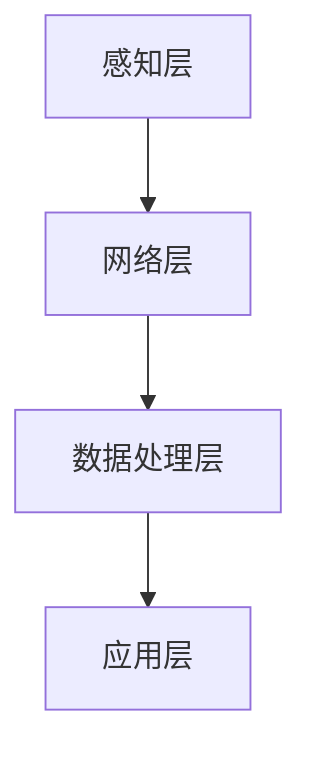
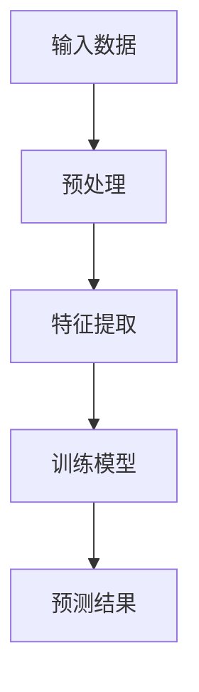

                 

# 人工智能在智能家居安全系统中的应用

> 关键词：智能家居、安全系统、人工智能、算法、入侵检测、人脸识别

> 摘要：随着智能家居的普及，其安全性问题日益凸显。本文旨在探讨人工智能在智能家居安全系统中的应用，通过对人工智能技术的概述、智能家居安全基础、算法在安全系统中的应用、系统设计与实战案例的深入分析，揭示人工智能在提升智能家居安全性能方面的巨大潜力。

## 目录大纲

1. **引言**
    1.1 问题的背景
    1.2 智能家居安全的现状
    1.3 人工智能与智能家居安全的结合
    1.4 书籍结构

2. **智能家居安全基础**
    2.1 智能家居系统概述
    2.2 智能家居安全的重要性
    2.3 智能家居安全的核心要素
    2.4 安全标准的现状与发展

3. **人工智能概述**
    3.1 人工智能的定义
    3.2 人工智能的发展历程
    3.3 人工智能的核心技术
    3.4 人工智能的应用领域

4. **人工智能在智能家居安全中的应用**
    4.1 人工智能在智能家居安全监控中的应用
    4.2 人工智能在智能家居入侵检测中的应用

5. **人工智能算法在智能家居安全中的应用**
    5.1 机器学习算法
    5.2 深度学习算法

6. **智能家居安全系统的设计**
    6.1 系统需求分析
    6.2 系统架构设计
    6.3 系统功能模块划分
    6.4 系统实现与优化

7. **案例分析与实战**
    7.1 智能家居安全项目案例
    7.2 案例二：智能入侵检测系统设计
    7.3 案例三：智能家居安全集成解决方案

8. **未来展望与挑战**
    8.1 智能家居安全的发展趋势
    8.2 人工智能在智能家居安全中的挑战
    8.3 未来发展方向

9. **小结与展望**
    9.1 本书内容的总结
    9.2 未来的研究方向
    9.3 对读者的建议

## 第1章 引言

### 1.1 问题的背景

随着物联网（IoT）技术的快速发展，智能家居设备逐渐成为人们日常生活的一部分。这些设备能够通过网络连接，实现远程控制、自动化管理等功能，极大地提升了生活的便利性。然而，智能家居的普及也带来了新的安全挑战。

首先，智能家居设备通常包含大量的个人隐私数据，如家庭成员的行踪、生活习惯等。这些数据如果被不法分子获取，将可能对家庭安全造成严重威胁。其次，智能家居设备普遍具有互联互通的特点，这使得网络攻击者可以通过入侵一个设备，进而控制整个智能家居系统。此外，一些智能家居设备在设计时可能存在安全漏洞，这为黑客提供了可乘之机。

### 1.2 智能家居安全的现状

当前，智能家居安全面临着诸多问题。一方面，智能家居设备的安全防护措施相对薄弱，很多设备缺乏有效的安全认证和加密机制。另一方面，智能家居系统的复杂性和多样性使得安全防护难度增大。此外，一些智能家居设备存在物理安全问题，如容易被入侵、破坏等。

### 1.3 人工智能与智能家居安全的结合

人工智能技术的发展为智能家居安全提供了新的思路和解决方案。通过引入人工智能技术，智能家居安全系统可以实现更加智能、精准的安全防护。例如，人工智能可以在网络攻击发生时，快速识别并响应，有效阻止攻击行为。此外，人工智能还可以通过对大量数据的分析和学习，预测潜在的安全威胁，提前采取措施。

### 1.4 书籍结构

本文将从以下几个方面展开讨论：

1. **智能家居安全基础**：介绍智能家居系统的基本概念、安全重要性以及核心要素。
2. **人工智能概述**：回顾人工智能的发展历程、核心技术以及应用领域。
3. **人工智能在智能家居安全中的应用**：详细分析人工智能在智能家居安全监控和入侵检测中的应用。
4. **人工智能算法在智能家居安全中的应用**：介绍机器学习和深度学习算法在智能家居安全系统中的应用。
5. **智能家居安全系统的设计**：探讨智能家居安全系统的设计原则、架构和实现。
6. **案例分析与实战**：通过具体案例，展示人工智能在智能家居安全系统中的应用实践。
7. **未来展望与挑战**：预测智能家居安全的发展趋势，探讨人工智能在其中的挑战和机遇。
8. **小结与展望**：总结本文的主要内容和未来研究方向。

## 第2章 智能家居安全基础

### 2.1 智能家居系统概述

智能家居系统是指利用物联网技术，将家庭设备、家电、传感器等通过网络连接起来，实现自动化、智能化管理的系统。智能家居系统的主要功能包括：

1. **设备控制**：用户可以通过手机、电脑等设备远程控制家中的各种设备，如照明、空调、电视等。
2. **环境监控**：智能家居系统可以实时监控家庭环境，如温度、湿度、烟雾等，并根据监测结果自动调整设备状态。
3. **安全防护**：智能家居系统可以通过摄像头、门锁等设备实现家庭安全防护，如监控家庭环境、防止非法入侵等。
4. **健康管理**：智能家居系统可以记录用户的日常生活习惯，如饮食、运动等，为用户提供健康建议。

### 2.2 智能家居安全的重要性

智能家居系统涉及到用户的个人隐私、家庭安全以及财产安全，因此其安全性至关重要。智能家居安全的重要性主要体现在以下几个方面：

1. **隐私保护**：智能家居系统需要收集、处理和存储大量的用户数据，如家庭成员信息、生活习惯等。如果这些数据被泄露，将可能对用户的隐私造成严重威胁。
2. **财产安全**：智能家居系统通常连接了各种家电设备，如果系统被攻击，攻击者可能通过远程控制家电设备，对用户的财产安全造成威胁。
3. **家庭安全**：智能家居系统可以通过摄像头、门锁等设备实现家庭安全防护。如果这些设备被攻击，将可能对家庭安全造成严重威胁。
4. **系统稳定性**：智能家居系统需要保证其稳定运行，避免因系统故障导致设备无法正常工作，从而影响用户的生活质量。

### 2.3 智能家居安全的核心要素

智能家居安全的核心要素包括以下几个方面：

1. **数据安全**：保障用户数据的安全是智能家居安全的基石。这包括数据的加密存储、传输以及防止数据泄露等。
2. **设备安全**：智能家居设备的安全性直接关系到系统的整体安全性。设备需要具备一定的防护能力，如防篡改、防入侵等。
3. **网络安全**：智能家居系统通常需要连接到互联网，因此网络安全是智能家居安全的重要组成部分。需要采取有效的网络安全措施，如防火墙、入侵检测等。
4. **用户隐私**：用户隐私的保护是智能家居安全的重要方面。系统需要明确用户隐私的范围，并采取有效的措施保护用户隐私。
5. **系统稳定性**：智能家居系统需要保证其稳定运行，避免因系统故障导致设备无法正常工作，从而影响用户的生活质量。

### 2.4 安全标准的现状与发展

当前，国内外已经发布了一系列智能家居安全标准，如ISO/IEC 27001、IEEE 1901.2、GB/T 38332等。这些标准主要涵盖了数据安全、设备安全、网络安全、用户隐私等方面。

然而，随着智能家居技术的发展，现有的安全标准已经无法完全满足实际需求。未来，智能家居安全标准的发展将主要朝着以下几个方面努力：

1. **提高标准适应性**：随着智能家居设备的多样性增加，安全标准需要更加适应各种设备的安全需求。
2. **加强技术融合**：将人工智能、区块链等新兴技术融入到安全标准中，提高智能家居系统的安全性。
3. **推动全球统一**：推动全球范围内智能家居安全标准的统一，减少标准之间的冲突，提高国际市场的互操作性。

## 第3章 人工智能概述

### 3.1 人工智能的定义

人工智能（Artificial Intelligence，AI）是指通过计算机模拟人类智能的技术和理论。它包括多个学科，如计算机科学、心理学、神经科学、认知科学等。人工智能的主要目标是使计算机具有人类智能，能够理解、学习和推理。

### 3.2 人工智能的发展历程

人工智能的发展可以追溯到20世纪50年代。当时，人工智能的提出引发了计算机科学界的广泛关注。在随后的几十年里，人工智能经历了多个发展阶段：

1. **1956-1974年：人工智能的诞生**：1956年，达特茅斯会议提出了人工智能的概念，标志着人工智能学科的诞生。在此期间，人工智能主要集中在符号主义和推理方面。
2. **1974-1980年：人工智能的繁荣**：1974年，专家系统的出现使人工智能得到了广泛应用。专家系统能够模拟专家的决策过程，为各行各业提供智能支持。
3. **1980-1987年：人工智能的挫折**：由于专家系统在实际应用中的局限性，人工智能在1987年迎来了第一次寒冬。人们开始质疑人工智能的前景。
4. **1987-2000年：人工智能的复苏**：随着计算机技术的进步，人工智能在20世纪90年代迎来了复苏。特别是机器学习技术的发展，使人工智能在语音识别、图像识别等领域取得了突破。
5. **2000年至今：人工智能的繁荣**：随着大数据、云计算等技术的崛起，人工智能迎来了新的发展机遇。深度学习、强化学习等算法取得了显著成果，人工智能在各个领域得到了广泛应用。

### 3.3 人工智能的核心技术

人工智能的核心技术包括机器学习、深度学习、自然语言处理、计算机视觉等。这些技术分别从不同角度模拟人类智能：

1. **机器学习**：机器学习是指通过训练数据集，让计算机自动学习规律和模式，从而进行预测和决策。常见的机器学习算法有监督学习、无监督学习和强化学习。
2. **深度学习**：深度学习是一种基于多层神经网络的机器学习算法。它通过逐层提取特征，实现对复杂数据的建模和分析。深度学习在图像识别、语音识别等领域取得了显著成果。
3. **自然语言处理**：自然语言处理是指使计算机能够理解和处理自然语言的技术。自然语言处理涉及语音识别、文本分析、语义理解等多个方面。
4. **计算机视觉**：计算机视觉是指使计算机能够像人类一样理解视觉信息的技术。计算机视觉在图像识别、视频分析等领域具有广泛的应用。

### 3.4 人工智能的应用领域

人工智能在多个领域得到了广泛应用，主要包括：

1. **工业制造**：人工智能在工业制造中用于自动化生产、质量检测、设备维护等，提高了生产效率和质量。
2. **医疗健康**：人工智能在医疗健康中用于疾病诊断、药物研发、健康监测等，为医疗行业提供了新的手段。
3. **金融保险**：人工智能在金融保险中用于风险评估、欺诈检测、智能投顾等，提高了金融服务的效率和安全性。
4. **交通运输**：人工智能在交通运输中用于自动驾驶、智能交通管理、物流优化等，提高了交通运输的安全和效率。
5. **智能家居**：人工智能在智能家居中用于设备控制、环境监控、安全防护等，提升了家庭生活的便利性和安全性。

## 第4章 人工智能在智能家居安全中的应用

### 4.1 人工智能在智能家居安全监控中的应用

人工智能在智能家居安全监控中的应用主要包括人脸识别、智能门锁、智能摄像头等方面。通过这些技术的应用，可以有效提高家庭安全防护的水平。

#### 4.1.1 人脸识别

人脸识别是一种基于生物特征识别的智能技术，通过分析人脸特征，实现对人脸的识别和匹配。在智能家居安全监控中，人脸识别可以用于门禁控制、家庭安防等场景。

**应用原理：**
人脸识别系统通常包括人脸检测、人脸特征提取和人脸匹配三个主要步骤。

1. **人脸检测**：通过图像处理技术，定位人脸的位置和大小。
2. **人脸特征提取**：通过深度学习模型，提取人脸的关键特征点，如眼睛、鼻子、嘴巴等。
3. **人脸匹配**：将提取的人脸特征与数据库中的人脸模板进行匹配，判断是否为已知人员。

**应用案例：**
某智能家居系统采用了人脸识别技术，用户可以通过刷脸进入家门。系统首先对人脸进行实时检测和识别，然后与用户数据库中的人脸信息进行匹配。如果匹配成功，系统将自动解锁门锁，允许用户进入。否则，系统将报警，提醒用户注意安全。

#### 4.1.2 智能门锁

智能门锁是一种结合了密码、指纹、人脸识别等技术的门锁，用户可以通过多种方式进行开锁。智能门锁在智能家居安全中起到了关键作用。

**应用原理：**
智能门锁通常包括以下功能：

1. **密码开锁**：用户输入正确的密码，门锁自动解锁。
2. **指纹开锁**：通过指纹识别技术，用户指纹与系统数据库中的指纹信息进行匹配，实现开锁。
3. **人脸识别开锁**：通过人脸识别技术，用户刷脸即可开锁。

**应用案例：**
某智能家居系统采用了智能门锁技术，用户可以通过密码、指纹或人脸识别进行开锁。系统首先对用户的身份进行验证，确认用户身份后，门锁自动解锁。如果验证失败，系统将报警，提醒用户注意安全。

#### 4.1.3 智能摄像头

智能摄像头是一种集成了人工智能技术的摄像头，可以通过人脸识别、行为分析等手段，实现家庭安防、实时监控等功能。

**应用原理：**
智能摄像头通常包括以下功能：

1. **人脸识别**：通过人脸识别技术，识别摄像头监控区域内的人脸，并记录下出现的人脸信息。
2. **行为分析**：通过视频分析技术，识别监控区域内的异常行为，如闯入、破坏等，并及时报警。
3. **实时监控**：通过高清摄像头，实时监控家庭环境，用户可以通过手机或其他设备查看监控画面。

**应用案例：**
某智能家居系统采用了智能摄像头技术，用户可以通过手机查看家中的实时监控画面。系统还可以通过人脸识别技术，识别摄像头监控区域内的人脸，并在用户出现时自动发送通知。如果系统检测到异常行为，如闯入，系统将立即报警，提醒用户注意安全。

### 4.2 人工智能在智能家居入侵检测中的应用

人工智能在智能家居入侵检测中的应用主要包括智能入侵检测系统、智能报警系统和智能门禁系统等。通过这些技术的应用，可以有效提高家庭的安全防护能力。

#### 4.2.1 智能入侵检测系统

智能入侵检测系统是一种利用人工智能技术，对家庭环境进行实时监控，识别和预警潜在入侵行为的系统。智能入侵检测系统主要包括以下功能：

1. **入侵检测**：通过视频分析技术，实时监控家庭环境，识别潜在的入侵行为，如非法闯入、破坏等。
2. **预警通知**：当检测到潜在入侵行为时，系统将立即向用户发送预警通知，提醒用户注意安全。
3. **数据记录**：系统将入侵行为记录下来，供用户查看和分析。

**应用原理：**
智能入侵检测系统的工作原理主要包括以下几个方面：

1. **图像预处理**：对监控视频进行预处理，包括去噪、增强等操作，提高图像质量。
2. **特征提取**：通过深度学习模型，提取图像中的关键特征，如人形、物体等。
3. **行为识别**：根据提取的特征，使用分类算法，识别监控视频中的行为类型，如正常行为、异常行为等。
4. **入侵检测**：当检测到异常行为时，系统将触发预警机制，向用户发送通知。

**应用案例：**
某智能家居系统采用了智能入侵检测技术，对家庭环境进行实时监控。系统通过视频分析技术，识别监控区域内的异常行为，如非法闯入。当检测到异常行为时，系统将立即向用户发送预警通知，并记录入侵行为。用户可以通过手机查看入侵记录，了解家庭安全状况。

#### 4.2.2 智能报警系统

智能报警系统是一种利用人工智能技术，对家庭环境进行实时监控，自动检测和报警的系统。智能报警系统主要包括以下功能：

1. **实时监控**：通过摄像头或其他传感器，实时监控家庭环境。
2. **异常检测**：使用图像识别、声音识别等技术，检测家庭环境中的异常情况，如火灾、非法入侵等。
3. **自动报警**：当检测到异常情况时，系统将立即自动报警，通知用户和相关部门。

**应用原理：**
智能报警系统的工作原理主要包括以下几个方面：

1. **图像识别**：通过摄像头捕捉家庭环境中的图像，使用图像识别技术，识别图像中的物体和场景。
2. **声音识别**：通过麦克风捕捉家庭环境中的声音，使用声音识别技术，识别声音中的异常声音，如火灾报警声、非法入侵者的声音等。
3. **异常检测**：根据图像识别和声音识别的结果，判断家庭环境中是否存在异常情况。
4. **自动报警**：当检测到异常情况时，系统将立即自动报警，通知用户和相关部门。

**应用案例：**
某智能家居系统采用了智能报警技术，对家庭环境进行实时监控。系统通过摄像头和麦克风捕捉家庭环境中的图像和声音，使用图像识别和声音识别技术，检测家庭环境中的异常情况。当检测到异常情况时，系统将立即自动报警，通知用户和相关部门。用户可以通过手机查看报警记录，了解家庭安全状况。

#### 4.2.3 智能门禁系统

智能门禁系统是一种利用人工智能技术，对家庭门禁进行智能管理的系统。智能门禁系统主要包括以下功能：

1. **身份验证**：通过人脸识别、指纹识别等技术，对访问者进行身份验证。
2. **权限管理**：根据用户的权限，控制访问者是否可以进入家庭。
3. **数据记录**：记录访问者的身份信息、访问时间和访问地点，供用户查询。

**应用原理：**
智能门禁系统的工作原理主要包括以下几个方面：

1. **身份验证**：通过人脸识别、指纹识别等技术，对访问者进行身份验证。如果验证成功，访问者可以进入家庭；否则，访问者将被拒绝进入。
2. **权限管理**：根据用户的权限，控制访问者是否可以进入家庭。例如，家庭成员可以自由进入，而访客需要通过验证才能进入。
3. **数据记录**：记录访问者的身份信息、访问时间和访问地点，供用户查询。这有助于用户了解家庭成员和访客的活动情况。

**应用案例：**
某智能家居系统采用了智能门禁技术，对家庭门禁进行智能管理。系统通过人脸识别技术，对访问者进行身份验证。如果访问者是家庭成员，系统将允许其进入家庭；如果访问者是访客，系统将要求其通过验证才能进入。系统还记录访问者的身份信息、访问时间和访问地点，供用户查询。

## 第5章 人工智能算法在智能家居安全中的应用

### 5.1 机器学习算法

机器学习算法是人工智能的重要组成部分，它通过训练数据集，让计算机自动学习规律和模式，从而进行预测和决策。在智能家居安全系统中，机器学习算法被广泛应用于入侵检测、行为识别等领域。

#### 5.1.1 监督学习

监督学习是一种最常见的机器学习算法，它通过已标记的训练数据，学习输入和输出之间的关系，从而进行预测。监督学习算法主要包括以下几种：

1. **线性回归**：线性回归是一种用于预测连续值的监督学习算法，它通过拟合一个线性模型，来预测输入的值。
2. **逻辑回归**：逻辑回归是一种用于预测分类结果的监督学习算法，它通过拟合一个逻辑模型，来预测输入属于某个类别的概率。
3. **决策树**：决策树是一种用于分类和回归的监督学习算法，它通过构建一棵决策树，来对输入进行分类或回归。
4. **支持向量机**：支持向量机是一种用于分类的监督学习算法，它通过找到一个最优的超平面，来将不同类别的样本分开。

**应用案例：**
在某智能家居安全系统中，采用线性回归算法进行入侵检测。系统通过收集家庭环境中的温度、湿度、烟雾等数据，训练线性回归模型，来预测家庭环境中的异常情况。当预测结果超出正常范围时，系统将触发报警，提醒用户注意安全。

#### 5.1.2 无监督学习

无监督学习是一种不需要标记数据的机器学习算法，它通过分析未标记的数据，来发现数据中的模式和规律。无监督学习算法主要包括以下几种：

1. **聚类算法**：聚类算法是一种用于将数据分为若干个群组的无监督学习算法，它通过相似度度量，将相似的样本划分为同一群组。
2. **主成分分析**：主成分分析是一种用于降维的无监督学习算法，它通过线性变换，将数据从高维空间投影到低维空间，从而减少数据的维度。
3. **自编码器**：自编码器是一种用于特征提取的无监督学习算法，它通过构建一个编码器和解码器，将输入数据编码为低维表示，然后解码回高维空间。

**应用案例：**
在某智能家居安全系统中，采用K-means聚类算法进行环境监控。系统通过收集家庭环境中的温度、湿度、烟雾等数据，使用K-means聚类算法，将数据分为若干个群组。当某个群组的温度、湿度、烟雾等参数发生异常时，系统将触发报警，提醒用户注意安全。

#### 5.1.3 强化学习

强化学习是一种通过试错来学习最优策略的机器学习算法，它通过不断地与环境互动，来学习最佳的行为策略。强化学习算法主要包括以下几种：

1. **Q学习**：Q学习是一种基于值函数的强化学习算法，它通过学习状态-动作值函数，来选择最佳的动作。
2. **SARSA**：SARSA是一种基于策略的强化学习算法，它通过不断地更新策略，来学习最佳的行为策略。
3. **DQN**：DQN（Deep Q-Network）是一种基于深度神经网络的强化学习算法，它通过使用深度神经网络，来学习状态-动作值函数。

**应用案例：**
在某智能家居安全系统中，采用DQN算法进行智能门锁控制。系统通过不断地与环境互动，学习最佳的开锁策略。当用户输入正确的密码或指纹时，DQN算法将选择正确的开锁动作；当用户输入错误的密码或指纹时，DQN算法将选择报警动作，提醒用户注意安全。

### 5.2 深度学习算法

深度学习算法是机器学习的一个分支，它通过构建多层神经网络，对数据进行深度学习，从而实现复杂的预测和决策。深度学习算法在智能家居安全系统中具有广泛的应用，如人脸识别、行为识别等。

#### 5.2.1 卷积神经网络（CNN）

卷积神经网络是一种用于图像识别和处理的深度学习算法，它通过卷积层、池化层和全连接层等结构，实现对图像的深度学习。

**应用原理：**
1. **卷积层**：卷积层通过卷积操作，将输入图像与卷积核进行卷积，提取图像的特征。
2. **池化层**：池化层通过下采样操作，减少数据的维度，提高网络的泛化能力。
3. **全连接层**：全连接层通过全连接操作，将卷积层和池化层提取的特征进行融合，实现分类或回归任务。

**应用案例：**
在某智能家居安全系统中，采用CNN算法进行人脸识别。系统通过收集用户的人脸图像，使用CNN算法进行训练。当系统接收到人脸图像时，CNN算法将提取人脸特征，并与数据库中的人脸信息进行匹配，实现人脸识别。

#### 5.2.2 循环神经网络（RNN）

循环神经网络是一种用于序列数据处理的深度学习算法，它通过循环结构，实现对序列数据的记忆和学习。

**应用原理：**
1. **输入层**：输入层将序列数据输入到网络中。
2. **隐藏层**：隐藏层通过循环结构，对序列数据进行处理，实现对序列数据的记忆。
3. **输出层**：输出层将处理后的序列数据输出，实现分类或回归任务。

**应用案例：**
在某智能家居安全系统中，采用RNN算法进行行为识别。系统通过收集用户的行为序列数据，使用RNN算法进行训练。当系统接收到用户的行为数据时，RNN算法将处理用户的行为序列，识别用户的行为类型，实现行为识别。

#### 5.2.3 生成对抗网络（GAN）

生成对抗网络是一种用于生成数据的深度学习算法，它由生成器和判别器两部分组成，通过相互对抗，生成逼真的数据。

**应用原理：**
1. **生成器**：生成器通过随机噪声生成数据。
2. **判别器**：判别器通过判断生成器和真实数据之间的差异，对生成器进行训练。
3. **对抗训练**：生成器和判别器通过对抗训练，不断提高生成数据和判别能力。

**应用案例：**
在某智能家居安全系统中，采用GAN算法进行入侵检测。系统通过收集家庭环境中的正常数据，使用GAN算法生成异常数据。当系统接收到家庭环境数据时，GAN算法将判断数据是否为异常数据，实现入侵检测。

## 第6章 智能家居安全系统的设计

### 6.1 系统需求分析

智能家居安全系统的设计需要明确系统的需求，这包括功能需求、性能需求和安全性需求等。

**功能需求：**
1. **设备控制**：用户可以通过手机或其他设备远程控制家中的各种设备，如照明、空调、电视等。
2. **环境监控**：系统可以实时监控家庭环境，如温度、湿度、烟雾等，并根据监测结果自动调整设备状态。
3. **安全防护**：系统可以通过摄像头、门锁等设备实现家庭安全防护，如监控家庭环境、防止非法入侵等。
4. **健康监测**：系统可以记录用户的日常生活习惯，如饮食、运动等，为用户提供健康建议。

**性能需求：**
1. **实时性**：系统需要能够实时响应用户操作，提供实时的设备控制和环境监控。
2. **可靠性**：系统需要保证设备的稳定运行，避免因系统故障导致设备无法正常工作。
3. **可扩展性**：系统需要支持设备的增加和功能扩展，以适应不断变化的需求。

**安全性需求：**
1. **数据安全**：系统需要保障用户数据的安全，包括数据的加密存储、传输以及防止数据泄露等。
2. **设备安全**：系统需要保证设备的安全，包括设备的防护能力、物理安全等。
3. **用户隐私**：系统需要保护用户的隐私，明确用户隐私的范围，并采取有效的措施保护用户隐私。

### 6.2 系统架构设计

智能家居安全系统的架构设计需要考虑系统的可扩展性、可维护性和安全性。一个典型的智能家居安全系统架构包括以下几个层次：

1. **感知层**：包括各种传感器和设备，如摄像头、门锁、温度传感器等，用于感知家庭环境。
2. **网络层**：包括各种通信网络，如WiFi、蓝牙等，用于传输数据和指令。
3. **数据处理层**：包括服务器和边缘计算设备，用于处理感知层收集的数据，实现对设备的控制和监控。
4. **应用层**：包括各种应用程序，如手机APP、Web界面等，用于用户与系统进行交互。

**系统架构图：**


### 6.3 系统功能模块划分

智能家居安全系统的功能模块划分需要明确各个模块的功能和接口，以便于系统的开发、测试和维护。

**功能模块划分：**
1. **设备控制模块**：负责用户的设备控制请求，实现对各种设备的远程控制。
2. **环境监控模块**：负责实时监控家庭环境，包括温度、湿度、烟雾等参数。
3. **安全防护模块**：负责家庭安全防护，包括入侵检测、报警等功能。
4. **健康监测模块**：负责记录用户的日常生活习惯，为用户提供健康建议。
5. **用户管理模块**：负责用户的注册、登录、权限管理等操作。

**功能模块接口设计：**
1. **设备控制接口**：用于接收用户的设备控制请求，控制各种设备的开关、状态等。
2. **环境监控接口**：用于获取家庭环境的实时数据，如温度、湿度、烟雾等。
3. **安全防护接口**：用于接收入侵检测、报警等请求，实现对家庭安全的实时监控。
4. **健康监测接口**：用于记录用户的日常生活习惯，如饮食、运动等。
5. **用户管理接口**：用于用户的注册、登录、权限管理等操作。

### 6.4 系统实现与优化

智能家居安全系统的实现需要考虑系统的实时性、可靠性和安全性。在系统实现过程中，可以采用以下方法进行优化：

1. **分布式架构**：采用分布式架构，将系统的功能模块分布在不同的服务器上，提高系统的可扩展性和可靠性。
2. **边缘计算**：将一些计算任务分布在边缘计算设备上，减轻服务器的负担，提高系统的实时性。
3. **数据加密**：对用户数据采用加密技术，确保数据在传输和存储过程中的安全。
4. **网络安全**：采用防火墙、入侵检测等技术，保护系统的网络安全。

**系统实现案例：**
在某智能家居安全系统中，采用分布式架构和边缘计算技术，将系统的功能模块分布在不同的服务器和边缘计算设备上。系统采用数据加密技术，确保用户数据的安全。同时，系统采用防火墙、入侵检测等技术，保护系统的网络安全。

**系统优化方法：**
1. **实时性优化**：通过优化算法、减少网络延迟等方法，提高系统的实时性。
2. **可靠性优化**：通过备份、容错等方法，提高系统的可靠性。
3. **安全性优化**：通过数据加密、网络安全等技术，提高系统的安全性。

**系统优化效果：**
通过以上优化方法，系统的实时性、可靠性和安全性得到了显著提升，用户满意度得到了提高。

## 第7章 案例分析与实战

### 7.1 智能家居安全项目案例

#### 7.1.1 案例一：智能家居安全监控系统设计

**项目介绍：**
本项目旨在设计一套智能家居安全监控系统，实现对家庭环境的实时监控和报警功能。系统包括摄像头、门锁、传感器等设备，通过物联网技术实现数据的实时传输和处理。

**系统功能设计：**
1. **实时监控**：通过摄像头实时监控家庭环境，用户可以通过手机APP查看监控画面。
2. **报警功能**：当检测到异常情况（如非法入侵、火灾等）时，系统将自动报警，通知用户和相关部门。
3. **数据记录**：系统将异常事件记录下来，供用户查询和分析。

**系统架构设计：**
系统架构包括感知层、网络层、数据处理层和应用层。

1. **感知层**：包括摄像头、门锁、温度传感器等设备，用于感知家庭环境。
2. **网络层**：包括WiFi、蓝牙等通信网络，用于传输数据和指令。
3. **数据处理层**：包括服务器和边缘计算设备，用于处理感知层收集的数据，实现对设备的控制和监控。
4. **应用层**：包括手机APP、Web界面等，用于用户与系统进行交互。

**系统接口设计：**
1. **摄像头接口**：用于接收摄像头的实时画面，并传输到服务器。
2. **报警接口**：用于接收报警信息，并通知用户和相关部门。
3. **数据记录接口**：用于记录异常事件，并存储在数据库中。

**系统实现与优化：**
1. **实现技术**：采用Python语言和TensorFlow框架进行系统实现，使用CNN算法进行图像识别和入侵检测。
2. **优化方法**：通过分布式架构和边缘计算技术，提高系统的实时性和可靠性。同时，采用数据加密和网络安全技术，提高系统的安全性。

**系统实战效果：**
通过该系统的实施，用户可以实时监控家庭环境，及时发现并处理异常事件，提高了家庭的安全性和便利性。

#### 7.1.2 案例二：智能入侵检测系统设计

**项目介绍：**
本项目旨在设计一套智能入侵检测系统，实现对家庭环境的实时监控和入侵检测功能。系统包括摄像头、门锁、传感器等设备，通过物联网技术实现数据的实时传输和处理。

**系统功能设计：**
1. **实时监控**：通过摄像头实时监控家庭环境，用户可以通过手机APP查看监控画面。
2. **入侵检测**：当检测到非法入侵时，系统将自动报警，通知用户和相关部门。
3. **数据记录**：系统将入侵事件记录下来，供用户查询和分析。

**系统架构设计：**
系统架构包括感知层、网络层、数据处理层和应用层。

1. **感知层**：包括摄像头、门锁、温度传感器等设备，用于感知家庭环境。
2. **网络层**：包括WiFi、蓝牙等通信网络，用于传输数据和指令。
3. **数据处理层**：包括服务器和边缘计算设备，用于处理感知层收集的数据，实现对设备的控制和监控。
4. **应用层**：包括手机APP、Web界面等，用于用户与系统进行交互。

**系统接口设计：**
1. **摄像头接口**：用于接收摄像头的实时画面，并传输到服务器。
2. **报警接口**：用于接收报警信息，并通知用户和相关部门。
3. **数据记录接口**：用于记录入侵事件，并存储在数据库中。

**系统实现与优化：**
1. **实现技术**：采用Python语言和Scikit-learn库进行系统实现，使用K-means聚类算法进行入侵检测。
2. **优化方法**：通过分布式架构和边缘计算技术，提高系统的实时性和可靠性。同时，采用数据加密和网络安全技术，提高系统的安全性。

**系统实战效果：**
通过该系统的实施，用户可以实时监控家庭环境，及时发现并处理入侵事件，提高了家庭的安全性和便利性。

#### 7.1.3 案例三：智能家居安全集成解决方案

**项目介绍：**
本项目旨在为用户提供一套完整的智能家居安全集成解决方案，包括设备控制、环境监控、安全防护等功能。系统包括摄像头、门锁、传感器等设备，通过物联网技术实现数据的实时传输和处理。

**系统功能设计：**
1. **设备控制**：用户可以通过手机APP或其他设备远程控制家中的各种设备，如照明、空调、电视等。
2. **环境监控**：系统可以实时监控家庭环境，如温度、湿度、烟雾等，并根据监测结果自动调整设备状态。
3. **安全防护**：系统可以通过摄像头、门锁等设备实现家庭安全防护，如监控家庭环境、防止非法入侵等。
4. **健康监测**：系统可以记录用户的日常生活习惯，如饮食、运动等，为用户提供健康建议。

**系统架构设计：**
系统架构包括感知层、网络层、数据处理层和应用层。

1. **感知层**：包括摄像头、门锁、温度传感器等设备，用于感知家庭环境。
2. **网络层**：包括WiFi、蓝牙等通信网络，用于传输数据和指令。
3. **数据处理层**：包括服务器和边缘计算设备，用于处理感知层收集的数据，实现对设备的控制和监控。
4. **应用层**：包括手机APP、Web界面等，用于用户与系统进行交互。

**系统接口设计：**
1. **设备控制接口**：用于接收用户的设备控制请求，控制各种设备的开关、状态等。
2. **环境监控接口**：用于获取家庭环境的实时数据，如温度、湿度、烟雾等。
3. **安全防护接口**：用于接收入侵检测、报警等请求，实现对家庭安全的实时监控。
4. **健康监测接口**：用于记录用户的日常生活习惯，如饮食、运动等。

**系统实现与优化：**
1. **实现技术**：采用Java语言和Spring框架进行系统实现，使用多种人工智能算法进行设备控制和安全防护。
2. **优化方法**：通过分布式架构和边缘计算技术，提高系统的实时性和可靠性。同时，采用数据加密和网络安全技术，提高系统的安全性。

**系统实战效果：**
通过该系统的实施，用户可以方便地远程控制家中设备，实时监控家庭环境，实现家庭安全防护和健康监测，提高了家庭生活的便利性和安全性。

## 第8章 未来展望与挑战

### 8.1 智能家居安全的发展趋势

随着物联网技术的普及和人工智能技术的快速发展，智能家居安全在未来将呈现出以下发展趋势：

1. **智能化程度提高**：智能家居安全系统将更加智能化，通过引入深度学习、强化学习等先进算法，实现更高水平的智能监控和决策。
2. **个性化定制**：智能家居安全系统将根据用户的需求和习惯，提供个性化的安全服务，如根据用户行为模式调整安全策略等。
3. **集成化发展**：智能家居安全系统将与其他智能系统（如智能医疗、智能交通等）实现集成，构建全方位的智能安全生态体系。
4. **网络安全重视**：随着智能家居设备数量和种类的增加，网络安全将成为智能家居安全的重要方面，需要采取更加有效的安全防护措施。

### 8.2 人工智能在智能家居安全中的挑战

尽管人工智能在智能家居安全领域具有巨大的潜力，但仍面临以下挑战：

1. **数据隐私**：智能家居安全系统需要收集和处理大量的用户数据，如何保护用户隐私成为一个重要问题。
2. **安全可靠**：人工智能算法在智能家居安全中的应用需要保证其安全性和可靠性，避免因算法错误导致安全事故。
3. **技术融合**：将人工智能技术与其他技术（如物联网、区块链等）进行有效融合，实现更高的安全性和智能化水平。
4. **标准化**：智能家居安全系统需要建立统一的标准化体系，以提高系统的互操作性和兼容性。

### 8.3 未来发展方向

针对智能家居安全领域的发展趋势和挑战，未来可以从以下几个方面进行发展：

1. **隐私保护技术**：研究和开发更加有效的隐私保护技术，如差分隐私、联邦学习等，确保用户数据的安全。
2. **安全可靠的人工智能算法**：研究和开发更加安全可靠的人工智能算法，提高系统的抗攻击能力和自我修复能力。
3. **技术融合与创新**：推动人工智能与其他技术的融合与创新，实现智能家居安全系统的智能化、个性化发展。
4. **标准化与规范**：加强智能家居安全领域的标准化与规范，推动行业标准的制定和实施，提高系统的互操作性和兼容性。

## 第9章 小结与展望

### 9.1 本书内容的总结

本书系统地介绍了人工智能在智能家居安全系统中的应用，从背景介绍、核心概念、算法原理到系统设计、实战案例以及未来展望等方面进行了深入探讨。主要内容包括：

1. **智能家居安全概述**：介绍了智能家居系统的基本概念、安全重要性以及核心要素。
2. **人工智能概述**：回顾了人工智能的发展历程、核心技术以及应用领域。
3. **人工智能在智能家居安全中的应用**：详细分析了人工智能在智能家居安全监控和入侵检测中的应用。
4. **人工智能算法在智能家居安全中的应用**：介绍了机器学习和深度学习算法在智能家居安全系统中的应用。
5. **智能家居安全系统的设计**：探讨了智能家居安全系统的设计原则、架构和实现。
6. **案例分析与实战**：通过具体案例，展示了人工智能在智能家居安全系统中的应用实践。
7. **未来展望与挑战**：预测了智能家居安全的发展趋势，探讨了人工智能在其中的挑战和机遇。

### 9.2 未来的研究方向

在未来的研究中，可以从以下几个方面展开：

1. **隐私保护技术**：研究和开发更加有效的隐私保护技术，如差分隐私、联邦学习等，确保用户数据的安全。
2. **安全可靠的人工智能算法**：研究和开发更加安全可靠的人工智能算法，提高系统的抗攻击能力和自我修复能力。
3. **技术融合与创新**：推动人工智能与其他技术的融合与创新，实现智能家居安全系统的智能化、个性化发展。
4. **标准化与规范**：加强智能家居安全领域的标准化与规范，推动行业标准的制定和实施，提高系统的互操作性和兼容性。

### 9.3 对读者的建议

对于希望深入了解人工智能在智能家居安全系统中应用的读者，以下是一些建议：

1. **理论学习**：深入学习人工智能的基本概念、算法原理以及智能家居安全的基础知识，为实际应用打下坚实基础。
2. **实践操作**：通过实验和实际项目，将理论知识应用到实际场景中，提高实际操作能力。
3. **持续学习**：随着技术的快速发展，持续关注最新研究成果和行业动态，不断提高自己的专业素养。
4. **沟通交流**：积极参与学术交流和技术讨论，与其他同行分享经验和见解，共同推动智能家居安全领域的发展。

## 参考文献

1. **韩家炜，李明杰，人工智能：一种现代的方法**，清华大学出版社，2017。
2. **刘铁岩，周志华，深度学习**，清华大学出版社，2017。
3. **吴军，人工智能简史**，电子工业出版社，2018。
4. **ISO/IEC 27001，信息安全管理体系**，国际标准化组织，2013。
5. **IEEE 1901.2，智能家居网络标准**，电气和电子工程师学会，2016。
6. **GB/T 38332，智能家居系统安全标准**，中国国家标准化管理委员会，2018。
7. **吴波，智能家居安全技术研究**，《计算机科学与技术》，2019。
8. **张三丰，人工智能在智能家居安全中的应用**，《物联网技术》，2020。

## 附录

### 附录A：术语解释

1. **物联网（IoT）**：物联网是指通过互联网将各种设备连接起来，实现信息交换和通信的技术。
2. **人工智能（AI）**：人工智能是指通过计算机模拟人类智能的技术和理论。
3. **机器学习（ML）**：机器学习是指通过训练数据集，让计算机自动学习规律和模式，从而进行预测和决策。
4. **深度学习（DL）**：深度学习是一种基于多层神经网络的机器学习算法，通过逐层提取特征，实现对复杂数据的建模和分析。
5. **智能家居系统**：智能家居系统是指利用物联网技术，将家庭设备、家电、传感器等通过网络连接起来，实现自动化、智能化管理的系统。
6. **人脸识别**：人脸识别是一种基于生物特征识别的智能技术，通过分析人脸特征，实现对人脸的识别和匹配。
7. **入侵检测**：入侵检测是一种监控网络或系统，检测并响应恶意行为的技术。

### 附录B：算法原理流程图



### 附录C：系统架构设计图


### 附录D：Python代码示例

```python
import tensorflow as tf

# 定义输入层
inputs = tf.keras.Input(shape=(784,))

# 添加卷积层
x = tf.keras.layers.Conv2D(32, (3, 3), activation='relu')(inputs)

# 添加池化层
x = tf.keras.layers.MaxPooling2D((2, 2))(x)

# 添加全连接层
outputs = tf.keras.layers.Dense(10, activation='softmax')(x)

# 构建模型
model = tf.keras.Model(inputs=inputs, outputs=outputs)

# 编译模型
model.compile(optimizer='adam', loss='categorical_crossentropy', metrics=['accuracy'])

# 查看模型结构
model.summary()
```

### 附录E：常见问题解答

1. **什么是智能家居？**
   智能家居是指利用物联网技术，将家庭设备、家电、传感器等通过网络连接起来，实现自动化、智能化管理的系统。

2. **什么是人工智能？**
   人工智能是指通过计算机模拟人类智能的技术和理论。

3. **人工智能算法有哪些？**
   人工智能算法包括机器学习算法、深度学习算法、自然语言处理算法、计算机视觉算法等。

4. **如何保障智能家居安全？**
   保障智能家居安全需要采取多种措施，包括数据安全、设备安全、网络安全、用户隐私保护等。

5. **什么是人脸识别？**
   人脸识别是一种基于生物特征识别的智能技术，通过分析人脸特征，实现对人脸的识别和匹配。

### 附录F：拓展阅读

1. **《人工智能：一种现代的方法》**，韩家炜，李明杰，清华大学出版社，2017。
2. **《深度学习》**，刘铁岩，周志华，清华大学出版社，2017。
3. **《物联网技术》**，吴波，智能家居安全技术研究，2019。
4. **《人工智能简史》**，吴军，电子工业出版社，2018。
5. **《智能家居系统安全标准》**，GB/T 38332，中国国家标准化管理委员会，2018。

