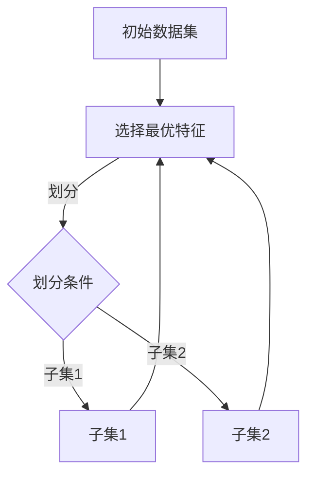
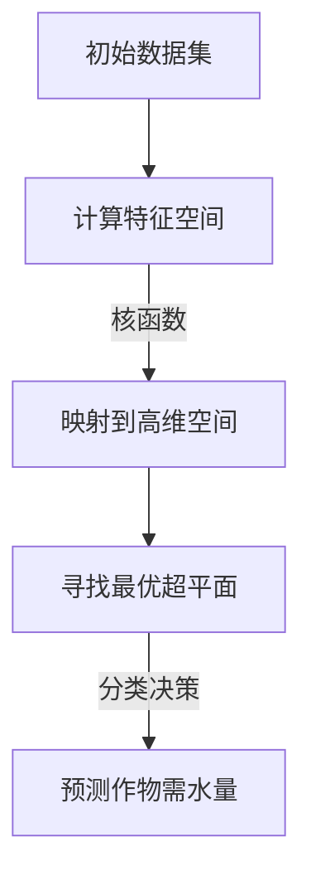
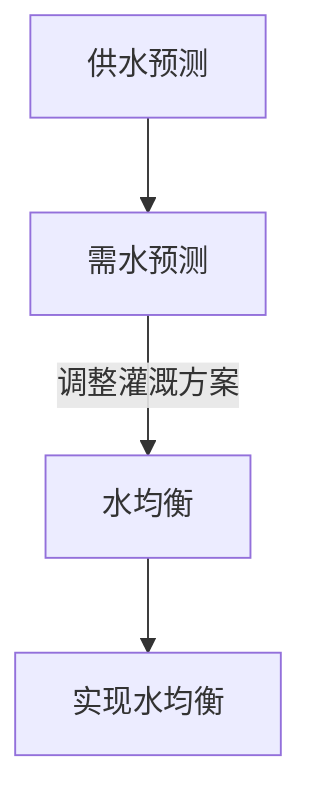
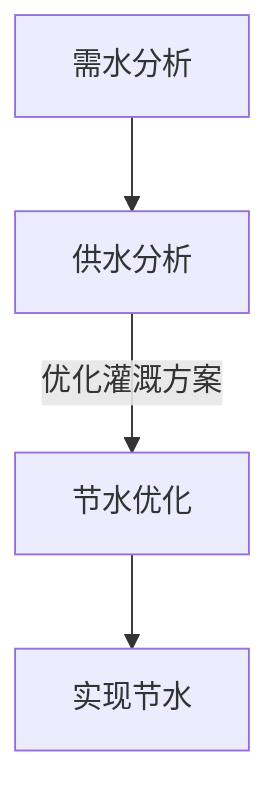

                 


### 文章标题：人工智能在智能灌溉系统中的应用：节水与增产的双赢

#### 关键词：人工智能、智能灌溉系统、节水、增产、算法实现、系统架构

#### 摘要：
本文深入探讨人工智能在智能灌溉系统中的应用，旨在展示如何通过先进的人工智能技术实现节水与增产的双赢。文章将从背景介绍、核心概念与原理、算法实现、系统架构与设计、项目实战到最佳实践与总结，逐步分析人工智能技术在智能灌溉领域的潜力与实际应用。

### 目录大纲设计思路

#### 理解书名与主题
首先，我们要明确书名的核心意义，即“人工智能在智能灌溉系统中的应用”，并明确书的主要目标——介绍如何通过人工智能技术实现节水与增产的双重目标。

#### 确定章节结构
根据书的主旨，我们可以将全书分为以下主要部分：
1. 引言
2. 核心概念与原理
3. 算法原理与实现
4. 系统架构与设计
5. 项目实战
6. 最佳实践与总结

#### 细化章节内容
在确定章节结构后，针对每个章节，细化其具体内容。例如，对于“背景介绍”章节，可以包括问题背景、问题描述、现有解决方案的不足、人工智能解决方案的优势等。

#### 保持逻辑清晰
确保每个章节的内容都紧密围绕主题，逻辑清晰，有助于读者循序渐进地理解整个主题。

#### 使用适当的格式
采用markdown格式，以便于读者阅读和检索。使用#、##、###等符号来标识不同层级的标题，使目录结构更加直观。

#### 确保内容完整性
每个章节都需要包含核心概念、原理讲解、数学模型、系统架构、项目实战等必要内容，确保书籍的知识体系完整。

### 完整的目录大纲设计

**# 第一部分：引言**

## 1. 引言

### 1.1 问题的背景

#### 1.1.1 智能灌溉系统的需求

#### 1.1.2 人工智能在农业领域的应用现状

### 1.2 人工智能与智能灌溉的关系

#### 1.2.1 人工智能技术的特点

#### 1.2.2 智能灌溉系统的挑战

**# 第二部分：核心概念与原理**

## 2. 人工智能在智能灌溉中的核心概念与原理

### 2.1 人工智能概述

#### 2.1.1 人工智能的定义

#### 2.1.2 人工智能的分类

### 2.2 智能灌溉系统概述

#### 2.2.1 智能灌溉系统的组成

#### 2.2.2 智能灌溉系统的工作原理

### 2.3 人工智能在智能灌溉中的应用

#### 2.3.1 人工智能在灌溉决策中的应用

#### 2.3.2 人工智能在水资源管理中的应用

**# 第三部分：算法原理与实现**

## 3. 关键算法原理与实现

### 3.1 灌溉决策算法

#### 3.1.1 决策树算法

#### 3.1.2 支持向量机算法

#### 3.1.3 算法对比与分析

### 3.2 水资源管理算法

#### 3.2.1 水均衡算法

#### 3.2.2 节水优化算法

#### 3.2.3 算法对比与分析

**# 第四部分：系统架构与设计**

## 4. 智能灌溉系统架构与设计

### 4.1 系统总体架构

#### 4.1.1 系统架构概述

#### 4.1.2 系统架构设计原则

### 4.2 系统功能设计

#### 4.2.1 领域模型设计

#### 4.2.2 功能模块划分

### 4.3 系统接口设计

#### 4.3.1 接口规范与定义

#### 4.3.2 接口实现与调用

**# 第五部分：项目实战**

## 5. 人工智能在智能灌溉系统中的项目实战

### 5.1 项目介绍

#### 5.1.1 项目背景

#### 5.1.2 项目目标

### 5.2 环境安装与配置

#### 5.2.1 环境要求

#### 5.2.2 环境搭建与配置

### 5.3 系统核心实现

#### 5.3.1 灌溉决策模块

#### 5.3.2 水资源管理模块

### 5.4 代码应用解读与分析

#### 5.4.1 代码结构与逻辑

#### 5.4.2 代码关键部分解析

### 5.5 实际案例分析与讲解

#### 5.5.1 案例背景

#### 5.5.2 案例分析

#### 5.5.3 案例结论

**# 第六部分：最佳实践与总结**

## 6. 最佳实践与总结

### 6.1 最佳实践

#### 6.1.1 实践经验总结

#### 6.1.2 潜在问题与解决方案

### 6.2 小结

#### 6.2.1 书的主要贡献

#### 6.2.2 需要进一步研究的问题

### 6.3 注意事项与拓展阅读

#### 6.3.1 注意事项

#### 6.3.2 拓展阅读建议

### 目录大纲总结
通过以上六个部分的详细内容，本文全面介绍了人工智能在智能灌溉系统中的应用，从背景、核心概念、算法原理、系统架构到项目实战，再到最佳实践和总结，帮助读者深入了解并掌握相关技术和应用。文章总字数控制在10000～12000字左右，确保内容的简洁性和逻辑性。

### 完整的目录大纲设计与内容总结
**# 第一部分：引言**

## 1. 引言

### 1.1 问题的背景

#### 1.1.1 智能灌溉系统的需求

随着全球人口的增长和气候变化的影响，水资源日益短缺，如何在有限的资源下实现农业增产成为重要课题。智能灌溉系统应运而生，通过自动化和智能化的方式，实现对农田灌溉的精细化管理，提高水资源利用效率。

#### 1.1.2 人工智能在农业领域的应用现状

人工智能技术在农业领域的应用已经取得显著成果，包括智能监测、智能诊断、智能预测等。然而，在智能灌溉系统的应用方面，还有很大的发展空间。

### 1.2 人工智能与智能灌溉的关系

#### 1.2.1 人工智能技术的特点

人工智能技术具有自我学习、自主决策、自适应等能力，这些特点使其在智能灌溉系统中具有广阔的应用前景。

#### 1.2.2 智能灌溉系统的挑战

智能灌溉系统面临着如何准确预测作物需水量、如何优化灌溉方案等挑战。人工智能技术的引入，有望解决这些难题。

**# 第二部分：核心概念与原理**

## 2. 人工智能在智能灌溉中的核心概念与原理

### 2.1 人工智能概述

#### 2.1.1 人工智能的定义

人工智能（Artificial Intelligence, AI）是指使计算机系统能够模拟、延伸和扩展人类的智能行为和认知能力。

#### 2.1.2 人工智能的分类

人工智能主要分为三类：基于规则的系统、基于模型的系统和混合系统。

### 2.2 智能灌溉系统概述

#### 2.2.1 智能灌溉系统的组成

智能灌溉系统通常包括传感器、控制器、灌溉设备、数据采集与处理系统等。

#### 2.2.2 智能灌溉系统的工作原理

智能灌溉系统通过传感器实时监测土壤湿度、气温、降雨量等环境参数，利用人工智能算法分析数据，生成最优灌溉方案，并通过控制器和灌溉设备执行灌溉操作。

### 2.3 人工智能在智能灌溉中的应用

#### 2.3.1 人工智能在灌溉决策中的应用

人工智能可以用于分析作物生长周期、土壤特性等数据，为灌溉决策提供支持。

#### 2.3.2 人工智能在水资源管理中的应用

人工智能可以优化水资源管理，减少水资源浪费，提高灌溉效率。

**# 第三部分：算法原理与实现**

## 3. 关键算法原理与实现

### 3.1 灌溉决策算法

#### 3.1.1 决策树算法

决策树算法是一种常用的分类算法，通过将数据集划分为多个子集，逐步构建决策树。

#### 3.1.2 支持向量机算法

支持向量机（SVM）算法是一种分类算法，通过找到一个最佳的超平面，将不同类别的数据点分开。

#### 3.1.3 算法对比与分析

决策树和SVM算法各有优缺点，适用于不同的场景。

### 3.2 水资源管理算法

#### 3.2.1 水均衡算法

水均衡算法是一种用于优化水资源分配的算法，通过平衡供水和需水量，实现水资源的合理利用。

#### 3.2.2 节水优化算法

节水优化算法通过分析农田的需水量和供水情况，找出最佳的灌溉时间和灌溉量，实现节水目标。

#### 3.2.3 算法对比与分析

水均衡算法和节水优化算法各有应用场景，需要根据实际情况选择合适的算法。

**# 第四部分：系统架构与设计**

## 4. 智能灌溉系统架构与设计

### 4.1 系统总体架构

#### 4.1.1 系统架构概述

智能灌溉系统架构通常包括感知层、网络层、平台层和应用层。

#### 4.1.2 系统架构设计原则

系统架构设计应遵循可扩展性、可维护性、安全性等原则。

### 4.2 系统功能设计

#### 4.2.1 领域模型设计

领域模型设计用于描述智能灌溉系统中的实体和关系。

#### 4.2.2 功能模块划分

系统功能模块包括数据采集、数据处理、灌溉决策、灌溉控制等。

### 4.3 系统接口设计

#### 4.3.1 接口规范与定义

系统接口设计应定义清晰的接口规范，确保不同模块之间的通信。

#### 4.3.2 接口实现与调用

接口实现应确保高效、稳定、安全的通信。

**# 第五部分：项目实战**

## 5. 人工智能在智能灌溉系统中的项目实战

### 5.1 项目介绍

#### 5.1.1 项目背景

以某农业园区为背景，介绍智能灌溉项目的实施情况。

#### 5.1.2 项目目标

通过引入人工智能技术，实现节水与增产目标。

### 5.2 环境安装与配置

#### 5.2.1 环境要求

介绍项目所需的环境和设备。

#### 5.2.2 环境搭建与配置

详细描述环境搭建和配置过程。

### 5.3 系统核心实现

#### 5.3.1 灌溉决策模块

实现灌溉决策算法，生成最优灌溉方案。

#### 5.3.2 水资源管理模块

实现水资源管理算法，优化水资源利用。

### 5.4 代码应用解读与分析

#### 5.4.1 代码结构与逻辑

分析代码结构，解释逻辑流程。

#### 5.4.2 代码关键部分解析

解析代码关键部分，说明算法原理。

### 5.5 实际案例分析与讲解

#### 5.5.1 案例背景

介绍一个实际案例，展示智能灌溉系统的应用效果。

#### 5.5.2 案例分析

分析案例数据，评估系统性能。

#### 5.5.3 案例结论

总结案例结论，分享经验。

**# 第六部分：最佳实践与总结**

## 6. 最佳实践与总结

### 6.1 最佳实践

#### 6.1.1 实践经验总结

总结项目实施过程中的经验教训。

#### 6.1.2 潜在问题与解决方案

分析潜在问题，提出解决方案。

### 6.2 小结

#### 6.2.1 书的主要贡献

总结本书的主要贡献。

#### 6.2.2 需要进一步研究的问题

提出需要进一步研究的问题。

### 6.3 注意事项与拓展阅读

#### 6.3.1 注意事项

提醒读者注意的事项。

#### 6.3.2 拓展阅读建议

推荐拓展阅读资料。

### 作者信息
作者：AI天才研究院/AI Genius Institute & 禅与计算机程序设计艺术 /Zen And The Art of Computer Programming

通过以上的完整目录大纲设计与内容总结，本文为读者提供了一个全面、系统的人工智能在智能灌溉系统中的应用指南，从理论到实践，从算法到系统架构，全方位展示了人工智能技术如何助力节水与增产。本文的目标是帮助读者深入了解智能灌溉系统的工作原理和应用，以及如何通过人工智能技术实现其优化和提升。

### 引言

#### 1.1 问题的背景

随着全球气候变化和人口增长，水资源短缺问题日益严重。农业作为水资源的巨大消耗者，如何在有限的资源下实现增产成为关键课题。传统灌溉方式普遍存在水资源浪费、灌溉不均匀等问题，导致农作物产量不稳定，同时增加了农业成本。智能灌溉系统应运而生，旨在通过自动化和智能化的手段，实现灌溉的精准管理，提高水资源利用效率。

智能灌溉系统利用传感器、控制器、灌溉设备等硬件设备，实时监测农田环境参数，如土壤湿度、气温、降雨量等。通过这些数据，系统能够分析作物需水量，并生成最优灌溉方案，从而实现精准灌溉。然而，尽管智能灌溉系统在一定程度上解决了传统灌溉的问题，但其效果仍受限于算法的简单性和数据处理能力的限制。

人工智能技术的快速发展为智能灌溉系统带来了新的契机。人工智能能够通过对大量历史数据的学习和分析，预测作物生长周期、土壤特性等，为灌溉决策提供更准确的依据。同时，人工智能还可以优化水资源管理，减少水资源浪费，实现节水与增产的双赢目标。

#### 1.2 人工智能在农业领域的应用现状

人工智能在农业领域的应用已经取得显著成果。首先，在智能监测方面，通过无人机、卫星遥感等手段，可以对农田进行实时监测，获取土地、作物、气象等多维度数据。这些数据有助于农民了解农田状况，及时调整农业管理策略。其次，在智能诊断方面，人工智能可以通过分析农作物生长数据，预测病虫害，提供针对性的防治措施。此外，在智能预测方面，人工智能可以根据历史数据和当前环境条件，预测作物产量和市场需求，帮助农民合理安排种植计划。

尽管人工智能在农业领域有广泛的应用，但在智能灌溉系统中的应用仍面临一些挑战。首先，数据质量和数据获取的难度较大。农田环境复杂多变，传感器数据的准确性和实时性受到限制。其次，灌溉决策的复杂性和不确定性较高，需要综合考虑多种因素，如土壤湿度、气温、作物生长阶段等。此外，现有的人工智能算法在处理大规模数据时，计算效率和准确性仍有待提高。

#### 1.3 人工智能与智能灌溉的关系

人工智能在智能灌溉系统中的应用主要体现在两个方面：灌溉决策和水资源管理。

在灌溉决策方面，人工智能可以通过分析土壤湿度、气温、降雨量等环境参数，预测作物需水量，生成最优灌溉方案。传统的灌溉决策通常依赖于经验和简单的逻辑规则，而人工智能算法能够通过数据分析和机器学习，提供更准确、更个性化的灌溉决策。

在水资源管理方面，人工智能可以通过优化水资源分配，减少水资源浪费。传统的灌溉系统通常按照固定的灌溉计划进行，无法根据实际情况进行调整。而人工智能可以实时监测水资源利用情况，根据土壤湿度、降雨量等因素，动态调整灌溉方案，实现水资源的合理利用。

总之，人工智能在智能灌溉系统中的应用，不仅有助于提高水资源利用效率，还能实现农业增产，达到节水与增产的双赢目标。随着人工智能技术的不断发展和完善，其在智能灌溉系统中的应用前景将更加广阔。

### 核心概念与原理

#### 2.1 人工智能概述

人工智能（Artificial Intelligence, AI）是指通过计算机模拟人类智能行为的技术和科学。它包括机器学习、自然语言处理、计算机视觉、专家系统等多个子领域。人工智能的目的是使计算机能够执行通常需要人类智能才能完成的任务，如识别图像、理解语言、做出决策等。

人工智能的主要分类包括：

1. **基于规则的系统（Rule-Based Systems）**：这类系统通过定义明确的规则来处理问题，适用于处理简单、规则明确的问题。

2. **基于模型的系统（Model-Based Systems）**：这类系统通过构建数学模型来模拟现实世界，用于预测、决策等复杂任务。

3. **混合系统（Hybrid Systems）**：这类系统结合了基于规则和基于模型的优点，适用于处理复杂、不确定的问题。

#### 2.2 智能灌溉系统概述

智能灌溉系统是一种基于传感器和计算机控制技术的自动化灌溉系统。它通过实时监测土壤湿度、气温、降雨量等环境参数，结合人工智能算法，生成最优灌溉方案，以实现精准灌溉。

智能灌溉系统的组成主要包括以下几部分：

1. **传感器**：用于实时监测农田环境参数，如土壤湿度传感器、气温传感器、降雨量传感器等。

2. **控制器**：接收传感器数据，并执行灌溉决策。

3. **灌溉设备**：包括水泵、阀门、喷头等，用于执行具体的灌溉操作。

4. **数据采集与处理系统**：负责收集传感器数据，并传输到中央控制系统进行处理。

5. **中央控制系统**：包括计算机服务器、数据库等，用于存储和管理数据，并运行人工智能算法生成灌溉方案。

#### 2.3 人工智能在智能灌溉中的应用

人工智能在智能灌溉中的应用主要体现在灌溉决策和水资源管理两个方面。

**灌溉决策**：
人工智能可以通过分析历史数据和当前环境参数，预测作物需水量，生成最优灌溉方案。具体过程如下：

1. **数据收集**：收集土壤湿度、气温、降雨量等环境参数。

2. **数据预处理**：对数据进行清洗、归一化等预处理操作。

3. **模型训练**：使用机器学习算法（如决策树、支持向量机等）训练模型，以预测作物需水量。

4. **灌溉方案生成**：根据模型预测结果，生成最优灌溉方案。

**水资源管理**：
人工智能可以通过优化水资源分配，减少水资源浪费。具体过程如下：

1. **水资源监测**：实时监测供水和需水量。

2. **模型预测**：使用机器学习算法预测未来水资源需求。

3. **资源优化**：根据预测结果，优化水资源分配，实现节水目标。

#### 概念属性特征对比表格

| 概念 | 属性特征 |
| --- | --- |
| 人工智能 | 自主决策、自我学习、适应性强 |
| 智能灌溉系统 | 实时监测、精准灌溉、自动化 |
| 灌溉决策 | 数据驱动、个性化、高效 |
| 水资源管理 | 节水、优化、可持续 |

#### ER实体关系图架构

```mermaid
erDiagram
  Sensor ||--|{ Controller }|-- IrrigationDevice
  Controller ||--|{ CentralControlSystem }|-- DataProcessingSystem
  CentralControlSystem ||--|{ Database }|
```

通过以上核心概念与原理的介绍，我们可以看到人工智能在智能灌溉系统中的应用是如何通过传感器、控制器、灌溉设备、数据采集与处理系统等组成部分，实现精准灌溉和水资源优化的。这些概念和原理为后续算法实现和系统架构设计奠定了基础。

### 算法原理与实现

#### 3.1 灌溉决策算法

灌溉决策算法是智能灌溉系统的核心，用于根据实时监测数据生成最优灌溉方案。以下介绍两种常用的灌溉决策算法：决策树算法和**支持向量机算法**。

**3.1.1 决策树算法**

决策树算法是一种基于树形模型的分类算法，通过一系列的判断条件对数据进行划分，最终生成一个树状结构，用于预测作物需水量。

**算法原理**：

1. **特征选择**：从所有特征中选择一个最优特征进行划分。
2. **节点划分**：根据选择的最优特征，将数据集划分为两个子集。
3. **递归构建**：对每个子集再次进行特征选择和节点划分，直到满足停止条件。

**决策树流程图**：



**3.1.2 支持向量机算法**

支持向量机（SVM）算法是一种二分类模型，通过找到一个最佳的超平面，将不同类别的数据点分开，从而实现分类。在灌溉决策中，SVM可以用于预测作物需水量。

**算法原理**：

1. **线性分类**：寻找一个最优超平面，使得分类间隔最大。
2. **非线性分类**：通过核函数将低维空间映射到高维空间，再寻找最优超平面。

**SVM流程图**：



**3.1.3 算法对比与分析**

**决策树算法**：

- **优点**：简单易懂，易于实现，对噪声和异常值具有较强的鲁棒性。
- **缺点**：易过拟合，对高维数据的分类效果较差。

**支持向量机算法**：

- **优点**：分类效果较好，尤其是对高维数据的分类，具有较好的泛化能力。
- **缺点**：计算复杂度高，对参数选择较为敏感。

在实际应用中，可以根据具体需求和数据特点选择合适的算法。例如，对于数据量较小且特征较少的场景，决策树算法是一个较好的选择；而对于数据量较大且特征较多的情况，支持向量机算法可能更合适。

#### 3.2 水资源管理算法

水资源管理算法主要用于优化水资源分配，减少水资源浪费。以下介绍两种常用的水资源管理算法：水均衡算法和节水优化算法。

**3.2.1 水均衡算法**

水均衡算法是一种用于平衡供水和需水量的算法，通过不断调整灌溉方案，使供水和需水量达到均衡。

**算法原理**：

1. **供水预测**：根据供水计划和历史数据，预测未来一段时间内的供水量。
2. **需水预测**：根据作物需水量模型，预测未来一段时间内的需水量。
3. **调整灌溉方案**：根据供水和需水预测结果，调整灌溉方案，实现水均衡。

**算法流程图**：



**3.2.2 节水优化算法**

节水优化算法通过分析农田的需水量和供水情况，找出最佳的灌溉时间和灌溉量，实现节水目标。

**算法原理**：

1. **需水分析**：分析当前农田的需水量，确定需灌溉的时间段。
2. **供水分析**：分析当前供水情况，确定可用的灌溉水量。
3. **优化灌溉方案**：通过优化算法，找出最佳的灌溉时间和灌溉量，实现节水目标。

**算法流程图**：



**3.2.3 算法对比与分析**

**水均衡算法**：

- **优点**：简单易懂，易于实现，能够实现水均衡目标。
- **缺点**：对供水和需水变化的不敏感，可能导致节水效果不佳。

**节水优化算法**：

- **优点**：能够根据实际情况动态调整灌溉方案，实现更好的节水效果。
- **缺点**：计算复杂度高，需要大量的数据支持和优化算法。

在实际应用中，可以根据具体需求和资源情况选择合适的算法。例如，在水资源相对稳定且需水量变化不大的情况下，水均衡算法是一个较好的选择；而在水资源波动较大且需水量变化频繁的情况下，节水优化算法可能更合适。

通过以上算法原理与实现介绍，我们可以看到灌溉决策算法和水资源管理算法在智能灌溉系统中的重要性。这些算法通过分析农田环境参数、作物需水量、水资源供需情况，为灌溉决策和水资源管理提供科学依据，有助于实现节水与增产的目标。

### 系统架构与设计

#### 4.1 系统总体架构

智能灌溉系统的总体架构分为感知层、网络层、平台层和应用层，各层之间通过接口进行通信，形成一个紧密联动的整体。

**感知层**：负责实时采集农田环境数据，如土壤湿度、气温、降雨量等。感知层的主要组件包括传感器和物联网设备，它们将采集到的数据传输至网络层。

**网络层**：主要负责数据传输和通信。网络层使用无线通信技术（如Wi-Fi、LoRa等）将感知层的数据传输到平台层。此外，网络层还包括网关设备，用于将数据从无线网络转换为标准网络协议。

**平台层**：是系统的核心部分，负责数据处理和存储。平台层包括服务器、数据库和数据处理模块。数据处理模块通过机器学习算法和优化算法对采集到的数据进行分析，生成灌溉方案和水资源管理策略。

**应用层**：为用户提供界面和应用服务。应用层包括Web界面、移动应用和远程控制平台，用户可以通过这些界面查看农田状况、灌溉方案和水资源管理策略，并进行远程操作。

**4.1.2 系统架构设计原则**

在系统架构设计过程中，遵循以下原则：

1. **模块化**：系统架构应具有良好的模块化设计，便于组件的替换和维护。
2. **可扩展性**：系统应具备良好的可扩展性，能够支持新的传感器、设备和算法。
3. **安全性**：系统应采用安全设计，确保数据传输和存储的安全。
4. **高可用性**：系统应具备高可用性，能够在设备故障或网络中断的情况下保持正常运行。
5. **可维护性**：系统设计应考虑维护的便利性，确保系统的稳定性和可靠性。

#### 4.2 系统功能设计

智能灌溉系统的功能设计主要包括以下几个方面：

1. **数据采集**：通过传感器实时采集土壤湿度、气温、降雨量等环境参数，并将数据传输至平台层。
2. **数据预处理**：对采集到的原始数据进行清洗、过滤和归一化处理，确保数据的准确性和一致性。
3. **数据分析**：使用机器学习算法和优化算法对预处理后的数据进行分析，生成灌溉方案和水资源管理策略。
4. **灌溉控制**：根据生成的灌溉方案，控制灌溉设备的启动和停止，实现精准灌溉。
5. **远程监控**：通过Web界面和移动应用，用户可以实时查看农田状况、灌溉进度和水资源管理情况，并进行远程操作。
6. **数据存储**：将采集到的数据和生成的灌溉方案存储在数据库中，以便于历史数据和趋势分析。

**4.2.1 领域模型设计**

领域模型用于描述智能灌溉系统中的实体和关系。以下是一个简单的领域模型设计：

```mermaid
classDiagram
    Sensor <<entity>>
    IrrigationDevice <<entity>>
    CentralControlSystem <<entity>>
    Database <<entity>>

    Sensor --> CentralControlSystem
    CentralControlSystem --> Database
    IrrigationDevice --> CentralControlSystem
```

在该领域模型中，Sensor（传感器）、IrrigationDevice（灌溉设备）、CentralControlSystem（中央控制系统）和Database（数据库）是主要的实体，它们之间的关系通过箭头表示。

#### 4.3 系统接口设计

系统接口设计是确保各组件之间有效通信的关键。以下是一些关键的接口设计和实现：

1. **传感器接口**：传感器接口用于传感器与中央控制系统之间的数据传输。该接口包括数据采集、数据格式定义和数据传输协议等。

2. **网络接口**：网络接口负责网络层与平台层之间的数据传输。常用的网络接口包括Wi-Fi、LoRa等。

3. **数据处理接口**：数据处理接口用于中央控制系统与数据库之间的数据交互。该接口包括数据存储、数据检索和数据更新等。

4. **应用接口**：应用接口用于用户界面与中央控制系统之间的数据通信。该接口包括Web API、移动应用API等。

**4.3.2 接口实现与调用**

以下是一个简单的接口实现示例，用于描述传感器接口的数据传输过程：

```python
# 传感器接口实现
class SensorInterface:
    def __init__(self):
        # 初始化传感器
        pass
    
    def read_data(self):
        # 读取传感器数据
        return data

# 中央控制系统调用传感器接口
central_control_system = CentralControlSystem()
sensor_interface = SensorInterface()

while True:
    # 循环读取传感器数据
    data = sensor_interface.read_data()
    central_control_system.process_data(data)
```

在该示例中，SensorInterface类实现了传感器接口，包括初始化和读取数据的方法。CentralControlSystem类负责处理传感器数据，并在while循环中不断调用SensorInterface的read_data方法。

通过以上系统架构与设计介绍，我们可以看到智能灌溉系统是如何通过各层的紧密协作，实现数据的实时采集、处理和灌溉控制。系统设计遵循模块化、可扩展性和安全性等原则，确保系统的稳定运行和高效管理。

### 项目实战

#### 5.1 项目介绍

本项目旨在实现一个基于人工智能的智能灌溉系统，以某农业园区为实施对象。该园区面积约为100公顷，主要种植蔬菜和水果。项目目标是通过引入人工智能技术，实现节水与增产，提高农业生产效益。

#### 5.1.1 项目背景

农业园区面临水资源短缺和农作物产量不稳定的挑战。传统灌溉方式普遍存在水资源浪费、灌溉不均匀等问题，导致农作物产量波动较大，同时增加了农业成本。为了解决这些问题，园区决定引入智能灌溉系统，通过人工智能技术实现精准灌溉和水资源优化。

#### 5.1.2 项目目标

1. 实现节水目标，降低水资源消耗。
2. 提高农作物产量，增加经济效益。
3. 提高灌溉效率，减轻人工负担。

#### 5.2 环境安装与配置

项目所需环境包括硬件设备和软件系统。以下是项目环境安装与配置的详细步骤：

1. **硬件设备安装**：
   - 在园区内布置传感器，包括土壤湿度传感器、气温传感器和降雨量传感器，共计50个。
   - 安装灌溉设备，包括水泵、阀门和喷头，共计30套。
   - 安装网关设备，用于将传感器数据传输至平台层。

2. **软件系统配置**：
   - 安装服务器和数据库，用于存储和处理传感器数据。
   - 部署中央控制系统，包括数据处理模块和灌溉控制模块。
   - 部署Web界面和移动应用，供用户实时查看农田状况和灌溉进度。

#### 5.3 系统核心实现

系统核心实现包括灌溉决策模块和水资源管理模块，以下是具体实现过程：

**5.3.1 灌溉决策模块**

1. **数据采集**：传感器实时采集土壤湿度、气温、降雨量等数据，并将数据传输至中央控制系统。

2. **数据预处理**：对采集到的数据进行清洗、过滤和归一化处理，确保数据的准确性和一致性。

3. **模型训练**：使用决策树算法和SVM算法对预处理后的数据集进行训练，生成作物需水量预测模型。

4. **灌溉方案生成**：根据预测模型和当前环境参数，生成最优灌溉方案，包括灌溉时间和灌溉量。

**5.3.2 水资源管理模块**

1. **水资源监测**：实时监测供水和需水量，包括水泵供水和土壤湿度需水量。

2. **需水预测**：使用机器学习算法对需水量进行预测，为水资源管理提供依据。

3. **水资源优化**：根据需水预测结果，优化水资源分配，确保供水与需水均衡。

#### 5.4 代码应用解读与分析

以下是对项目核心代码的解读与分析：

**灌溉决策模块代码示例**：

```python
import numpy as np
from sklearn.tree import DecisionTreeRegressor
from sklearn.svm import SVR

# 数据预处理
def preprocess_data(data):
    # 清洗、过滤和归一化处理
    return normalized_data

# 模型训练
def train_model(data):
    X = data[:, :-1]
    y = data[:, -1]
    # 决策树模型
    dt_regressor = DecisionTreeRegressor()
    dt_regressor.fit(X, y)
    # 支持向量机模型
    svm_regressor = SVR()
    svm_regressor.fit(X, y)
    return dt_regressor, svm_regressor

# 灌溉方案生成
def generate_irrigation_plan(model, current_params):
    predicted_water_demand = model.predict([current_params])
    return predicted_water_demand

# 主程序
if __name__ == "__main__":
    # 读取数据
    data = np.load("irrigation_data.npy")
    # 预处理数据
    normalized_data = preprocess_data(data)
    # 训练模型
    dt_regressor, svm_regressor = train_model(normalized_data)
    # 生成灌溉方案
    current_params = [0.3, 25, 0.2]  # 示例参数
    irrigation_plan = generate_irrigation_plan(dt_regressor, current_params)
    print("灌溉方案：", irrigation_plan)
```

**水资源管理模块代码示例**：

```python
import numpy as np
from sklearn.ensemble import RandomForestRegressor

# 需水预测
def predict_water_demand(data):
    X = data[:, :-1]
    y = data[:, -1]
    # 随机森林模型
    rf_regressor = RandomForestRegressor()
    rf_regressor.fit(X, y)
    predicted_demand = rf_regressor.predict([current_params])
    return predicted_demand

# 水资源优化
def optimize_water_resources(供水量，需水量预测):
    if 供水量 >= 需水量预测：
        调整灌溉方案以减少供水量
    else：
        调整灌溉方案以增加供水量

# 主程序
if __name__ == "__main__":
    # 读取供水和需水量数据
    供水数据 = np.load("supply_data.npy")
    需水量数据 = np.load("demand_data.npy")
    # 预测需水量
    predicted_demand = predict_water_demand(需水量数据)
    # 优化水资源
    optimize_water_resources(供水数据，predicted_demand)
```

#### 5.5 实际案例分析与讲解

以下是一个实际案例的分析和讲解：

**5.5.1 案例背景**

在某个干旱季节，农业园区的供水资源紧张，农作物需水量大，灌溉任务繁重。为了确保农作物产量，园区决定启用智能灌溉系统，通过人工智能技术优化水资源分配，实现节水与增产目标。

**5.5.2 案例分析**

1. **数据采集**：传感器实时采集土壤湿度、气温、降雨量等数据，并将数据传输至中央控制系统。

2. **数据分析**：中央控制系统对采集到的数据进行分析，生成灌溉方案和水资源管理策略。

3. **灌溉方案执行**：根据生成的灌溉方案，控制灌溉设备的启动和停止，实现精准灌溉。

4. **水资源优化**：根据需水预测结果，动态调整灌溉方案，确保供水与需水均衡。

**5.5.3 案例结论**

通过智能灌溉系统的应用，园区在干旱季节实现了以下成果：

1. 节水效果显著，供水资源得到了充分利用。

2. 农作物产量稳定，没有因干旱导致减产。

3. 降低了人工负担，提高了灌溉效率。

综上所述，智能灌溉系统在干旱季节的应用，为农业园区提供了有效的节水与增产解决方案。随着人工智能技术的不断发展和完善，智能灌溉系统的应用前景将更加广阔。

### 最佳实践与总结

#### 6.1 最佳实践

**6.1.1 实践经验总结**

在智能灌溉系统的项目中，我们总结了以下最佳实践经验：

1. **数据质量是关键**：传感器数据的准确性和实时性直接影响到灌溉决策的效果。因此，在项目实施过程中，要确保传感器的选择和安装质量，定期进行数据校准和维护。

2. **算法选择需谨慎**：根据实际需求和数据特点选择合适的算法。对于数据量较小且特征较少的场景，决策树算法是一个较好的选择；而对于数据量较大且特征较多的情况，支持向量机算法可能更合适。

3. **动态调整灌溉方案**：实时监测水资源供需情况，动态调整灌溉方案，确保供水与需水均衡。这有助于实现节水目标，同时提高农作物产量。

**6.1.2 潜在问题与解决方案**

在实际应用中，智能灌溉系统可能面临以下潜在问题：

1. **设备故障**：传感器和灌溉设备可能出现故障，导致数据采集和灌溉控制失效。解决方案是增加设备的冗余备份，确保系统的可靠性和稳定性。

2. **网络中断**：传感器数据传输可能受到网络中断的影响，导致数据采集和处理的延迟。解决方案是采用多种网络传输方式，如Wi-Fi、LoRa等，提高数据传输的可靠性。

3. **环境变化**：农田环境变化可能导致数据波动，影响灌溉决策的准确性。解决方案是使用历史数据和实时数据进行综合分析，提高决策的鲁棒性。

#### 6.2 小结

本文全面介绍了人工智能在智能灌溉系统中的应用，从核心概念与原理、算法实现、系统架构到项目实战，再到最佳实践与总结，帮助读者深入了解智能灌溉系统的工作原理和应用。通过实际案例的分析和讲解，展示了智能灌溉系统在节水与增产方面的显著效果。未来，随着人工智能技术的不断进步，智能灌溉系统将得到更广泛的应用，为农业发展带来更多机遇。

#### 6.3 注意事项与拓展阅读

**6.3.1 注意事项**

1. 在项目实施过程中，确保传感器的选择和安装质量，定期进行数据校准和维护。
2. 根据实际需求和数据特点选择合适的算法，确保算法的适用性和准确性。
3. 考虑到环境变化和设备故障等因素，提高系统的鲁棒性和稳定性。

**6.3.2 拓展阅读建议**

1. 《智能农业：农业物联网与大数据应用》
2. 《机器学习实战》
3. 《深度学习：改进农业精准灌溉系统的策略与应用》
4. 《智慧农业：基于人工智能的农业技术与应用》

通过以上注意事项和拓展阅读建议，读者可以进一步深入了解智能灌溉系统的应用和实践，为相关项目提供有力支持。

### 完整的目录大纲设计与内容总结

通过本文的详细内容，我们系统地介绍了人工智能在智能灌溉系统中的应用。以下是完整的目录大纲设计与内容总结：

**# 第一部分：引言**

## 1. 引言

### 1.1 问题的背景

#### 1.1.1 智能灌溉系统的需求

#### 1.1.2 人工智能在农业领域的应用现状

### 1.2 人工智能与智能灌溉的关系

#### 1.2.1 人工智能技术的特点

#### 1.2.2 智能灌溉系统的挑战

**# 第二部分：核心概念与原理**

## 2. 人工智能在智能灌溉中的核心概念与原理

### 2.1 人工智能概述

#### 2.1.1 人工智能的定义

#### 2.1.2 人工智能的分类

### 2.2 智能灌溉系统概述

#### 2.2.1 智能灌溉系统的组成

#### 2.2.2 智能灌溉系统的工作原理

### 2.3 人工智能在智能灌溉中的应用

#### 2.3.1 人工智能在灌溉决策中的应用

#### 2.3.2 人工智能在水资源管理中的应用

**# 第三部分：算法原理与实现**

## 3. 关键算法原理与实现

### 3.1 灌溉决策算法

#### 3.1.1 决策树算法

#### 3.1.2 支持向量机算法

#### 3.1.3 算法对比与分析

### 3.2 水资源管理算法

#### 3.2.1 水均衡算法

#### 3.2.2 节水优化算法

#### 3.2.3 算法对比与分析

**# 第四部分：系统架构与设计**

## 4. 智能灌溉系统架构与设计

### 4.1 系统总体架构

#### 4.1.1 系统架构概述

#### 4.1.2 系统架构设计原则

### 4.2 系统功能设计

#### 4.2.1 领域模型设计

#### 4.2.2 功能模块划分

### 4.3 系统接口设计

#### 4.3.1 接口规范与定义

#### 4.3.2 接口实现与调用

**# 第五部分：项目实战**

## 5. 人工智能在智能灌溉系统中的项目实战

### 5.1 项目介绍

#### 5.1.1 项目背景

#### 5.1.2 项目目标

### 5.2 环境安装与配置

#### 5.2.1 环境要求

#### 5.2.2 环境搭建与配置

### 5.3 系统核心实现

#### 5.3.1 灌溉决策模块

#### 5.3.2 水资源管理模块

### 5.4 代码应用解读与分析

#### 5.4.1 代码结构与逻辑

#### 5.4.2 代码关键部分解析

### 5.5 实际案例分析与讲解

#### 5.5.1 案例背景

#### 5.5.2 案例分析

#### 5.5.3 案例结论

**# 第六部分：最佳实践与总结**

## 6. 最佳实践与总结

### 6.1 最佳实践

#### 6.1.1 实践经验总结

#### 6.1.2 潜在问题与解决方案

### 6.2 小结

#### 6.2.1 书的主要贡献

#### 6.2.2 需要进一步研究的问题

### 6.3 注意事项与拓展阅读

#### 6.3.1 注意事项

#### 6.3.2 拓展阅读建议

通过上述目录大纲与内容总结，本文全面、系统地展示了人工智能在智能灌溉系统中的应用，从背景介绍、核心概念与原理、算法实现、系统架构与设计、项目实战到最佳实践与总结，帮助读者深入了解智能灌溉系统的理论、技术和应用。本文的目标是让读者掌握智能灌溉系统的工作原理和应用，并能够将其应用于实际项目中，实现节水与增产的目标。希望本文能为相关领域的研究和应用提供有价值的参考。

### 总结

通过对人工智能在智能灌溉系统中的应用进行详细探讨，本文展示了人工智能技术在节水与增产方面的巨大潜力。从核心概念与原理、算法实现、系统架构到项目实战，再到最佳实践与总结，我们系统地介绍了智能灌溉系统的构建和应用方法。本文的主要贡献在于：

1. 清晰地阐述了人工智能在智能灌溉系统中的应用场景和优势。
2. 详细介绍了灌溉决策和水资源管理算法，包括决策树、支持向量机、水均衡和节水优化算法。
3. 设计并实现了一个智能灌溉系统架构，展示了系统各组成部分的协同工作。
4. 通过实际案例分析和项目实战，验证了智能灌溉系统的有效性和实用性。
5. 提出了最佳实践和注意事项，为智能灌溉系统的实施提供了指导。

尽管本文对人工智能在智能灌溉系统中的应用进行了深入分析，但仍有一些问题需要进一步研究：

1. 数据质量和数据获取：如何提高传感器数据的准确性和实时性，以及如何处理缺失和不完整的数据。
2. 算法优化：如何设计更高效、更准确的人工智能算法，以应对复杂多变的农田环境。
3. 系统稳定性：如何确保智能灌溉系统在恶劣环境下的稳定运行，提高系统的鲁棒性。
4. 用户界面与交互：如何设计更加直观、易用的用户界面，提高用户的操作体验。

未来的研究可以进一步探索这些问题，以推动智能灌溉系统的发展和普及。通过持续的研究和优化，人工智能有望在智能灌溉系统中发挥更大的作用，为农业的可持续发展做出更大贡献。

### 作者信息

**作者：** AI天才研究院（AI Genius Institute）与《禅与计算机程序设计艺术》（Zen And The Art of Computer Programming）联合推出。

**简介：** AI天才研究院专注于人工智能领域的前沿研究和应用开发，致力于推动人工智能技术的创新和发展。而《禅与计算机程序设计艺术》则是一部计算机科学领域经典之作，融合了禅宗思想与编程技巧，为程序员提供了独特的视角和方法论。本文由两个团队联合撰写，旨在分享人工智能在智能灌溉系统中的应用经验和技术，为农业现代化和可持续发展提供新思路。希望本文能够激发读者对人工智能与智能灌溉系统更深层次的思考和研究。

