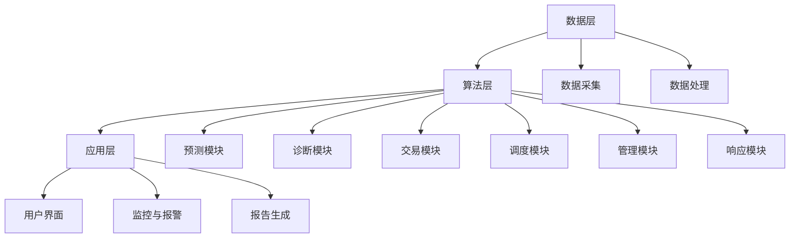
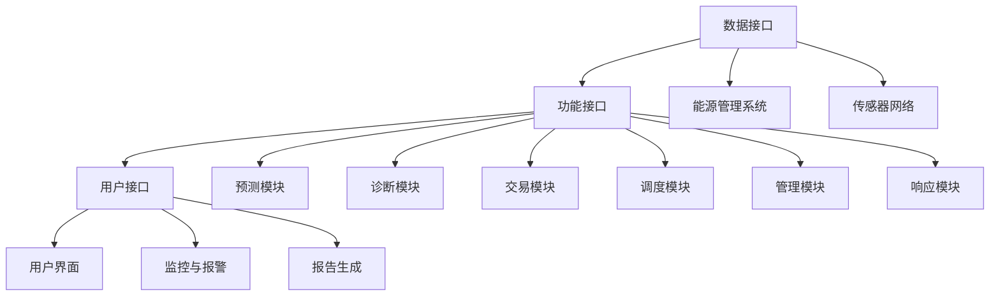
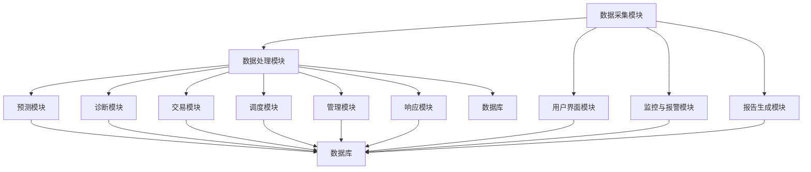

                 


### 第一部分：引言与背景

#### 1.1 问题的提出

##### 1.1.1 智能电网的兴起

随着全球能源需求的不断增长和环境污染问题的日益严重，如何实现能源的高效、清洁、可持续利用成为了一个重要的课题。在此背景下，智能电网作为现代能源系统的重要载体，应运而生。智能电网不仅是对传统电网的升级改造，更是实现能源互联网的关键节点。

智能电网的定义可以从多个角度来理解。首先，它是一个高度数字化、自动化的电力系统，通过先进的通信技术、传感技术、控制技术和计算机技术，实现了对电力系统的全面监测、控制和优化。其次，智能电网是一个开放的系统，能够实现与能源供应、消费、储能等多方之间的信息交互和资源优化配置。最后，智能电网是一个具备自适应能力和智能决策能力的系统，能够在应对突发事件和不确定性因素时，实现自我调节和优化。

##### 1.1.2 人工智能在电网优化中的重要性

人工智能（Artificial Intelligence，AI）作为当今科技领域的热点，其在各个领域的应用日益广泛。在智能电网中，人工智能的应用主要体现在以下几个方面：

1. **电力负荷预测**：通过机器学习算法，对历史电力数据进行分析和学习，预测未来的电力负荷，为电网调度提供数据支持。

2. **电力设备故障诊断**：利用深度学习技术，对电力设备的运行数据进行实时监测和分析，及时发现和诊断潜在故障，降低故障率。

3. **电力市场交易**：通过优化算法，自动进行电力市场的交易策略制定，实现电力资源的优化配置。

4. **电网调度与控制**：利用人工智能技术，实现电网运行状态的实时监测和智能控制，提高电网的安全性和效率。

综上所述，人工智能在智能电网优化中的应用，不仅能够提高电网的运行效率，降低运营成本，还能够提高电网的稳定性和可靠性，对于实现能源的高效利用和环境保护具有重要意义。

##### 1.1.3 本书的研究目标和内容框架

本书旨在探讨人工智能在智能电网优化中的应用与挑战，通过系统的理论和实践研究，旨在为智能电网优化提供新的思路和方法。本书将分为以下几个部分：

1. **引言与背景**：介绍智能电网的兴起背景，人工智能在电网优化中的重要性，以及本书的研究目标和内容框架。

2. **核心概念与联系**：阐述人工智能在智能电网优化中的关键概念，如电力负荷预测、电力设备故障诊断、电力市场交易和电网调度与控制等，并使用 Mermaid ER 图表示各概念之间的关系。

3. **算法原理与讲解**：选择一种典型的算法，如深度学习中的卷积神经网络（CNN），详细解释其在智能电网优化中的应用原理和流程，并配合 Mermaid 流程图和 Python 代码示例进行讲解。

4. **数学模型与公式**：介绍与算法相关的数学模型和公式，使用 LaTeX 进行格式化，以便于理解和应用。

5. **系统分析与设计**：介绍智能电网优化系统的场景设计、项目细节、领域模型、系统架构、接口设计和系统交互，使用 Mermaid 类图、架构图、序列图进行展示。

6. **项目实践**：通过一个实际项目案例，详细讲解项目的环境搭建、核心实现、代码分析、案例分析，以及项目总结。

7. **最佳实践与总结**：提供智能电网优化中的最佳实践建议，总结本书的核心内容，并提出未来研究的方向。

#### 1.2 智能电网与人工智能概述

##### 1.2.1 智能电网的定义与特点

智能电网（Smart Grid）是一个基于现代通信技术、计算机技术和自动控制技术的先进电力系统。它不仅包含了传统的电力输配系统，还融合了信息通信技术和智能控制技术，能够实现电力系统的自动化、智能化和高效化运行。

智能电网的核心特点可以从以下几个方面来理解：

1. **数字化与自动化**：智能电网通过数字化技术，将传统的电力系统转化为高度数字化的系统，实现了对电力系统的实时监测、控制和优化。

2. **双向互动性**：智能电网不仅能够实现电能的传输，还能够实现信息的双向传输，实现了用户与电网之间的双向互动。

3. **开放性与灵活性**：智能电网是一个开放的系统，能够兼容多种能源形式和多种通信协议，具有高度的灵活性和兼容性。

4. **自适应性与智能化**：智能电网通过智能控制技术，能够根据电力系统的运行状态和用户需求，实现自适应的运行控制和优化。

5. **安全性与可靠性**：智能电网采用了先进的安全技术和可靠性设计，能够确保电力系统的安全稳定运行。

##### 1.2.2 人工智能的基本概念与发展历程

人工智能（Artificial Intelligence，AI）是指通过计算机程序模拟人类智能行为的技术。人工智能的研究可以追溯到20世纪50年代，当时科学家们提出了“图灵测试”的概念，试图通过机器模拟人类智能，实现机器与人类的对话。

人工智能的发展历程可以分为以下几个阶段：

1. **符号主义阶段（1956-1979）**：这一阶段以逻辑推理和知识表示为核心，通过符号推理实现智能行为。

2. **连接主义阶段（1980-1987）**：这一阶段以神经网络和深度学习为核心，通过模拟人脑神经网络实现智能行为。

3. **行为主义阶段（1988-2000）**：这一阶段以机器人技术和机器感知为核心，通过模拟人类行为实现智能。

4. **认知主义阶段（2001至今）**：这一阶段以大数据和机器学习为核心，通过大数据分析和机器学习实现智能。

在智能电网优化中，人工智能的应用主要集中在以下几个方面：

1. **电力负荷预测**：利用机器学习算法，对历史电力数据进行分析和学习，预测未来的电力负荷。

2. **电力设备故障诊断**：利用深度学习技术，对电力设备的运行数据进行实时监测和分析，及时发现和诊断潜在故障。

3. **电力市场交易**：利用优化算法，自动进行电力市场的交易策略制定，实现电力资源的优化配置。

4. **电网调度与控制**：利用人工智能技术，实现电网运行状态的实时监测和智能控制，提高电网的安全性和效率。

##### 1.2.3 人工智能在电网优化中的应用场景

人工智能在电网优化中的应用场景非常广泛，以下是一些典型的应用场景：

1. **电力负荷预测**：通过机器学习算法，对历史电力数据进行分析和学习，预测未来的电力负荷，为电网调度提供数据支持。

2. **电力设备故障诊断**：利用深度学习技术，对电力设备的运行数据进行实时监测和分析，及时发现和诊断潜在故障，降低故障率。

3. **电力市场交易**：通过优化算法，自动进行电力市场的交易策略制定，实现电力资源的优化配置。

4. **电网调度与控制**：利用人工智能技术，实现电网运行状态的实时监测和智能控制，提高电网的安全性和效率。

5. **分布式能源管理**：通过人工智能技术，实现对分布式能源的实时监测、控制和优化，提高分布式能源的利用效率。

6. **需求响应**：利用人工智能技术，分析用户用电行为，制定合理的用电策略，实现电力需求响应，降低电力高峰负荷。

7. **能效管理**：通过人工智能技术，实时监测和分析电力系统的运行状态，优化电力资源配置，提高电力系统的能效。

综上所述，人工智能在智能电网优化中的应用，不仅能够提高电网的运行效率，降低运营成本，还能够提高电网的稳定性和可靠性，对于实现能源的高效利用和环境保护具有重要意义。

#### 1.3 挑战与前景

##### 1.3.1 智能电网优化面临的挑战

尽管人工智能在智能电网优化中具有巨大的应用前景，但在实际应用过程中仍然面临诸多挑战。以下是智能电网优化面临的主要挑战：

1. **数据采集与处理**：智能电网优化需要大量的实时数据支持，包括电力负荷、电力设备状态、环境因素等。如何有效地采集和处理这些数据，是智能电网优化的一大挑战。

2. **算法复杂性**：人工智能算法，特别是深度学习算法，通常具有很高的复杂性。如何在保证算法性能的前提下，简化算法结构，提高算法的执行效率，是一个需要解决的问题。

3. **算法稳定性**：在智能电网优化中，算法的稳定性至关重要。一旦算法出现异常，可能会对电网的稳定运行造成严重影响。因此，如何提高算法的稳定性，是一个亟待解决的问题。

4. **安全性**：智能电网是一个高度复杂的系统，其安全性至关重要。如何确保人工智能算法在电网优化中的应用安全，避免恶意攻击和系统故障，是一个需要关注的问题。

5. **跨领域协作**：智能电网优化涉及电力工程、计算机科学、数据科学等多个领域，如何实现跨领域的协作，提高系统的整体性能，是一个需要解决的问题。

##### 1.3.2 人工智能技术在电网优化中的前景

尽管面临诸多挑战，但人工智能技术在电网优化中的应用前景仍然十分广阔。以下是人工智能技术在电网优化中的几个主要前景：

1. **电力负荷预测**：随着人工智能技术的不断进步，电力负荷预测的准确率不断提高。未来，通过结合大数据分析和深度学习技术，可以实现更精确的电力负荷预测，为电网调度提供更好的数据支持。

2. **电力设备故障诊断**：深度学习技术在电力设备故障诊断中具有很大的潜力。通过实时监测和分析电力设备的运行数据，可以提前发现潜在的故障，降低故障率和停电风险。

3. **电力市场交易**：人工智能技术可以优化电力市场的交易策略，实现电力资源的优化配置。通过大数据分析和机器学习算法，可以更准确地预测市场需求和供应，提高电力市场的运行效率。

4. **电网调度与控制**：人工智能技术可以为电网调度提供智能决策支持，提高电网的调度效率和运行稳定性。通过实时监测和分析电网运行状态，可以及时调整电网运行策略，确保电网的安全稳定运行。

5. **分布式能源管理**：随着分布式能源的广泛应用，人工智能技术在分布式能源管理中具有重要作用。通过实时监测和优化分布式能源的运行，可以提高分布式能源的利用效率，降低能源消耗。

6. **能效管理**：人工智能技术可以为能效管理提供智能支持，优化电力资源的利用。通过实时监测和分析电力系统的运行状态，可以制定合理的用电策略，降低电力高峰负荷，提高电力系统的能效。

总之，人工智能技术在智能电网优化中的应用前景广阔，有望推动电力系统的智能化发展，实现能源的高效、清洁、可持续利用。

#### 1.4 本书结构安排

##### 1.4.1 各章节内容概述

本书分为七个部分，各部分的内容概述如下：

1. **引言与背景**：介绍智能电网的兴起背景，人工智能在电网优化中的重要性，以及本书的研究目标和内容框架。
   
2. **核心概念与联系**：阐述人工智能在智能电网优化中的关键概念，如电力负荷预测、电力设备故障诊断、电力市场交易和电网调度与控制等，并使用 Mermaid ER 图表示各概念之间的关系。

3. **算法原理与讲解**：选择一种典型的算法，如深度学习中的卷积神经网络（CNN），详细解释其在智能电网优化中的应用原理和流程，并配合 Mermaid 流程图和 Python 代码示例进行讲解。

4. **数学模型与公式**：介绍与算法相关的数学模型和公式，使用 LaTeX 进行格式化，以便于理解和应用。

5. **系统分析与设计**：介绍智能电网优化系统的场景设计、项目细节、领域模型、系统架构、接口设计和系统交互，使用 Mermaid 类图、架构图、序列图进行展示。

6. **项目实践**：通过一个实际项目案例，详细讲解项目的环境搭建、核心实现、代码分析、案例分析，以及项目总结。

7. **最佳实践与总结**：提供智能电网优化中的最佳实践建议，总结本书的核心内容，并提出未来研究的方向。

##### 1.4.2 读者对象与建议学习路径

本书适合从事智能电网和人工智能相关领域的研究人员、工程师和高校师生阅读。为了更好地理解本书的内容，读者需要具备以下基本知识：

1. **智能电网基本概念**：了解智能电网的定义、特点、应用场景等基本概念。
   
2. **人工智能基础知识**：掌握机器学习、深度学习等人工智能基本算法原理。

3. **Python 编程基础**：熟悉 Python 编程语言，了解基本的数据结构和算法。

4. **数学基础**：具备一定的数学基础，了解常见的数学模型和公式。

5. **系统分析与设计**：了解系统分析与设计的基本方法，如 Mermaid 图的绘制、系统架构设计等。

为了更好地学习本书的内容，建议读者按照以下路径进行：

1. 首先了解智能电网和人工智能的基本概念，熟悉相关技术背景。

2. 学习本书的第一部分，掌握人工智能在智能电网优化中的应用原理。

3. 学习本书的第二部分，深入了解智能电网优化中的关键算法。

4. 学习本书的第三部分，掌握智能电网优化系统的数学模型和公式。

5. 学习本书的第四部分，了解智能电网优化系统的分析与设计方法。

6. 通过实际项目案例，学习本书的第五部分，掌握智能电网优化项目的实施方法。

7. 最后，通过本书的第六部分，总结智能电网优化的最佳实践，为未来的研究提供方向。

通过以上学习路径，读者可以全面了解人工智能在智能电网优化中的应用，掌握相关技术，为实际工程应用提供参考。

--------------------------------------------------------

### 第二部分：核心概念与联系

在智能电网优化中，人工智能技术的应用涉及多个核心概念。本部分将详细介绍这些核心概念，并使用 Mermaid ER 图表示它们之间的关系。

#### 2.1 核心概念

1. **电力负荷预测**：通过分析历史电力数据，预测未来的电力需求。这是智能电网优化的重要一环，直接影响电网的调度和运行效率。

2. **电力设备故障诊断**：利用人工智能技术，对电力设备的运行状态进行实时监测和分析，及时诊断潜在的故障，以避免设备损坏和停电事故。

3. **电力市场交易**：通过优化算法，自动化电力市场的交易策略，实现电力资源的优化配置，提高市场运行效率和经济效益。

4. **电网调度与控制**：利用人工智能技术，对电网运行状态进行实时监测和智能控制，确保电网的安全稳定运行。

5. **分布式能源管理**：针对分布式能源的优化管理，包括分布式电源的接入、运行控制和能效管理。

6. **需求响应**：通过用户侧的响应策略，调整电力需求，优化电网运行。

#### 2.2 关系表示

为了清晰展示这些核心概念之间的联系，我们使用 Mermaid ER 图来表示。以下是 Mermaid ER 图的示例：

```mermaid
erDiagram
  Class1 ||--|{ ClassB : knows }
  Class1 ||--|{ ClassC : depends }
  ClassB ||--|{ ClassD : extends }
  Class2 ||--|{ ClassE : is_a }
```

在实际应用中，我们可以将上述 Mermaid ER 图转换为以下智能电网优化中的核心概念 ER 图：

```mermaid
erDiagram
  电力负荷预测 ||--|{ 电力市场交易 : 数据支撑 }
  电力设备故障诊断 ||--|{ 电网调度与控制 : 安全保障 }
  电力设备故障诊断 ||--|{ 分布式能源管理 : 运行优化 }
  电网调度与控制 ||--|{ 需求响应 : 调度策略 }
  电力市场交易 ||--|{ 分布式能源管理 : 资源配置 }
```

在这个 ER 图中，每个实体（如电力负荷预测、电力设备故障诊断等）都与其他实体之间存在一定的关系。这些关系体现了各核心概念在智能电网优化中的作用和相互影响。

通过上述核心概念与关系的分析，我们可以更好地理解人工智能在智能电网优化中的应用。接下来，本书将详细探讨这些核心概念的理论基础和应用案例，以帮助读者深入掌握智能电网优化的技术要点。

--------------------------------------------------------

### 第三部分：算法原理与讲解

在智能电网优化中，算法的选择和应用至关重要。本部分将选择一种典型的算法——卷积神经网络（CNN），详细讲解其在智能电网优化中的应用原理和流程。

#### 3.1 CNN 算法原理

卷积神经网络（Convolutional Neural Network，CNN）是一种特殊的神经网络，主要用于图像处理和计算机视觉领域。CNN 通过模拟人脑视觉系统的工作原理，通过卷积层、池化层和全连接层等结构，实现对图像的特征提取和分类。

CNN 的工作原理可以概括为以下几个步骤：

1. **卷积层**：卷积层通过卷积操作提取图像的局部特征。卷积核（filter）在图像上滑动，对图像进行卷积操作，生成特征图（feature map）。每个卷积核负责提取不同类型的特征，如边缘、纹理等。

2. **池化层**：池化层（Pooling Layer）对卷积层生成的特征图进行下采样，减少参数数量，降低计算复杂度。常用的池化方式包括最大池化（Max Pooling）和平均池化（Average Pooling）。

3. **全连接层**：全连接层（Fully Connected Layer）将卷积层和池化层提取的高层特征映射到输出结果。通过反向传播算法，调整网络中的权重和偏置，优化网络性能。

4. **激活函数**：激活函数（Activation Function）用于引入非线性变换，使得神经网络能够学习复杂的特征。常用的激活函数包括 sigmoid 函数、ReLU 函数和 tanh 函数。

#### 3.2 CNN 在智能电网优化中的应用

CNN 在智能电网优化中的应用主要体现在以下几个方面：

1. **电力负荷预测**：通过训练 CNN 模型，对历史电力负荷数据进行分析和学习，提取时间序列的特征，实现对未来电力负荷的预测。

2. **电力设备故障诊断**：利用 CNN 模型，对电力设备的运行数据进行实时监测和分析，提取设备状态的异常特征，实现对潜在故障的识别和诊断。

3. **电力市场交易**：通过 CNN 模型，对电力市场的历史交易数据进行分析，提取市场趋势和供需特征，优化电力市场的交易策略。

4. **电网调度与控制**：利用 CNN 模型，对电网运行状态的数据进行实时分析，提取电网运行的关键特征，实现对电网运行状态的智能调度和控制。

#### 3.3 CNN 在智能电网优化中的应用流程

以下是 CNN 在智能电网优化中的应用流程：

1. **数据收集与预处理**：收集历史电力负荷数据、电力设备运行数据、电力市场交易数据和电网运行状态数据。对数据进行清洗、归一化和特征提取等预处理操作。

2. **模型构建**：根据应用需求，构建 CNN 模型。选择合适的网络结构，如卷积层、池化层和全连接层等，设置激活函数、损失函数和学习策略。

3. **模型训练**：使用预处理后的数据，对 CNN 模型进行训练。通过反向传播算法，不断调整网络中的权重和偏置，优化模型性能。

4. **模型评估与优化**：使用验证数据集对训练好的模型进行评估，调整模型参数，优化模型性能。通过交叉验证等方法，确保模型在不同数据集上的泛化能力。

5. **模型部署**：将训练好的模型部署到实际应用场景中，实现对电力负荷预测、电力设备故障诊断、电力市场交易和电网调度与控制等任务的实时监测和分析。

#### 3.4 CNN 在智能电网优化中的应用示例

以下是一个简单的 CNN 模型在电力负荷预测中的应用示例：

```python
import tensorflow as tf
from tensorflow.keras.models import Sequential
from tensorflow.keras.layers import Conv2D, MaxPooling2D, Flatten, Dense

# 定义 CNN 模型
model = Sequential([
    Conv2D(filters=32, kernel_size=(3, 3), activation='relu', input_shape=(28, 28, 1)),
    MaxPooling2D(pool_size=(2, 2)),
    Flatten(),
    Dense(units=64, activation='relu'),
    Dense(units=1)
])

# 编译模型
model.compile(optimizer='adam', loss='mean_squared_error')

# 训练模型
model.fit(x_train, y_train, epochs=10, batch_size=32, validation_data=(x_val, y_val))

# 评估模型
model.evaluate(x_test, y_test)
```

在这个示例中，我们使用 TensorFlow 和 Keras 库构建了一个简单的 CNN 模型，用于电力负荷预测。模型包括一个卷积层、一个池化层和一个全连接层，通过训练和评估，可以实现电力负荷的预测。

通过上述讲解，我们可以看到 CNN 算法在智能电网优化中的应用具有很大的潜力。接下来，本书将深入探讨 CNN 算法的数学模型和公式，以帮助读者更好地理解其在智能电网优化中的应用。

--------------------------------------------------------

### 第四部分：数学模型与公式

在智能电网优化中，数学模型和公式是算法设计和分析的重要基础。本部分将介绍与卷积神经网络（CNN）相关的数学模型和公式，使用 LaTeX 进行格式化，以便于理解和应用。

#### 4.1 卷积神经网络（CNN）的数学模型

卷积神经网络（CNN）的核心组成部分包括卷积层、池化层和全连接层。以下是这些层的数学模型和公式。

##### 4.1.1 卷积层

卷积层通过卷积操作提取图像的局部特征。卷积操作的数学公式如下：

$$
\text{output}_{ij} = \sum_{k=1}^{n} w_{ik} \times \text{input}_{kj}
$$

其中，\( \text{output}_{ij} \) 表示卷积层的输出特征值，\( w_{ik} \) 表示卷积核的权重，\( \text{input}_{kj} \) 表示输入图像的特征值。

##### 4.1.2 池化层

池化层用于对卷积层生成的特征图进行下采样，减少参数数量，降低计算复杂度。常用的池化方式包括最大池化和平均池化。

1. **最大池化**：

$$
\text{output}_{ij} = \max_{k=1,2,\ldots,p} \text{input}_{k \times k}
$$

其中，\( \text{output}_{ij} \) 表示池化层的输出特征值，\( \text{input}_{k \times k} \) 表示输入的特征值区域。

2. **平均池化**：

$$
\text{output}_{ij} = \frac{1}{p^2} \sum_{k=1}^{p} \sum_{l=1}^{p} \text{input}_{(k-1) \times (l-1)}
$$

其中，\( \text{output}_{ij} \) 表示池化层的输出特征值，\( \text{input}_{(k-1) \times (l-1)} \) 表示输入的特征值区域。

##### 4.1.3 全连接层

全连接层将卷积层和池化层提取的高层特征映射到输出结果。全连接层的数学模型如下：

$$
\text{output}_{j} = \sum_{i=1}^{n} w_{ij} \times \text{input}_{i} + b_j
$$

其中，\( \text{output}_{j} \) 表示全连接层的输出值，\( w_{ij} \) 表示权重，\( \text{input}_{i} \) 表示输入特征值，\( b_j \) 表示偏置。

##### 4.1.4 激活函数

激活函数用于引入非线性变换，使得神经网络能够学习复杂的特征。常用的激活函数包括 sigmoid 函数、ReLU 函数和 tanh 函数。

1. **sigmoid 函数**：

$$
\text{sigmoid}(x) = \frac{1}{1 + e^{-x}}
$$

2. **ReLU 函数**：

$$
\text{ReLU}(x) = \max(0, x)
$$

3. **tanh 函数**：

$$
\tanh(x) = \frac{e^x - e^{-x}}{e^x + e^{-x}}
$$

#### 4.2 反向传播算法

反向传播算法是卷积神经网络训练的核心算法。它通过计算输出层误差，反向传播误差到每一层，不断调整网络中的权重和偏置，优化网络性能。

反向传播算法的数学模型如下：

1. **计算输出层误差**：

$$
\delta_{j}^{L} = \text{sigmoid}(\text{output}_{j}^{L}) \times (1 - \text{sigmoid}(\text{output}_{j}^{L})) \times (\text{target}_{j}^{L} - \text{output}_{j}^{L})
$$

其中，\( \delta_{j}^{L} \) 表示输出层误差，\( \text{output}_{j}^{L} \) 表示输出层第 j 个节点的输出值，\( \text{target}_{j}^{L} \) 表示输出层第 j 个节点的目标值。

2. **计算隐藏层误差**：

$$
\delta_{i}^{l} = \text{ReLU}(\text{output}_{i}^{l}) \times (1 - \text{ReLU}(\text{output}_{i}^{l})) \times (\sum_{j=1}^{n} w_{ji}^{l+1} \times \delta_{j}^{l+1})
$$

其中，\( \delta_{i}^{l} \) 表示隐藏层 l 第 i 个节点的误差，\( \text{output}_{i}^{l} \) 表示隐藏层 l 第 i 个节点的输出值，\( w_{ji}^{l+1} \) 表示隐藏层 l+1 第 j 个节点到隐藏层 l 第 i 个节点的权重。

3. **更新权重和偏置**：

$$
w_{ji}^{l+1} := w_{ji}^{l+1} - \alpha \times \delta_{i}^{l} \times \text{output}_{j}^{l}
$$

$$
b_{j}^{l+1} := b_{j}^{l+1} - \alpha \times \delta_{j}^{l+1}
$$

其中，\( \alpha \) 表示学习率，\( \text{output}_{j}^{l} \) 表示隐藏层 l 第 j 个节点的输出值。

通过上述数学模型和公式的介绍，我们可以更好地理解卷积神经网络（CNN）在智能电网优化中的应用。接下来，本书将深入探讨智能电网优化系统的分析与设计。

--------------------------------------------------------

### 第五部分：系统分析与设计

在智能电网优化中，系统分析与设计是实现高效、可靠运行的关键环节。本部分将详细描述智能电网优化系统的场景设计、项目细节、领域模型、系统架构、接口设计和系统交互。

#### 5.1 场景设计

智能电网优化系统的场景设计主要包括以下几个方面：

1. **电力负荷预测**：通过收集历史电力负荷数据，利用机器学习算法预测未来电力负荷，为电网调度提供数据支持。

2. **电力设备故障诊断**：实时监测电力设备的运行状态，通过分析运行数据，预测设备故障，提高设备运行可靠性。

3. **电力市场交易**：基于优化算法，自动制定电力市场交易策略，实现电力资源的优化配置。

4. **电网调度与控制**：实时监测电网运行状态，通过智能调度算法，优化电网运行，提高电网安全性和效率。

5. **分布式能源管理**：对分布式能源的接入、运行和能效管理，优化分布式能源的利用效率。

6. **需求响应**：分析用户用电行为，制定合理的用电策略，实现电力需求响应，降低电力高峰负荷。

#### 5.2 项目细节

智能电网优化项目的具体细节包括：

1. **数据采集**：通过智能传感器、自动化设备等，实时采集电力系统的运行数据，包括电力负荷、设备状态、环境参数等。

2. **数据处理**：对采集到的数据进行清洗、归一化和特征提取等预处理操作，为后续分析提供高质量的数据。

3. **算法实现**：选择合适的机器学习算法，如卷积神经网络（CNN）、支持向量机（SVM）等，实现电力负荷预测、故障诊断、市场交易和调度控制等功能。

4. **系统集成**：将各个功能模块集成到一个统一的平台上，实现数据的统一管理和功能的协同运作。

5. **性能评估**：通过实际运行数据，对系统性能进行评估，包括预测准确性、故障诊断率、市场交易效率等。

#### 5.3 领域模型

智能电网优化系统的领域模型使用 Mermaid 类图进行表示，如下所示：

```mermaid
classDiagram
  Class1[电力负荷预测] <|-- Class2[数据采集]
  Class1 <|-- Class3[数据处理]
  Class1 <|-- Class4[算法实现]
  Class5[电力设备故障诊断] <|-- Class2
  Class5 <|-- Class3
  Class5 <|-- Class4
  Class6[电力市场交易] <|-- Class2
  Class6 <|-- Class3
  Class6 <|-- Class4
  Class7[电网调度与控制] <|-- Class2
  Class7 <|-- Class3
  Class7 <|-- Class4
  Class8[分布式能源管理] <|-- Class2
  Class8 <|-- Class3
  Class8 <|-- Class4
  Class9[需求响应] <|-- Class2
  Class9 <|-- Class3
  Class9 <|-- Class4
```

在这个类图中，每个类表示一个功能模块，如电力负荷预测、电力设备故障诊断等，它们之间通过继承关系和依赖关系进行组织。

#### 5.4 系统架构

智能电网优化系统的架构设计采用分层架构，包括数据层、算法层和应用层。以下是一个简单的系统架构示意图：



在这个架构中，数据层负责数据的采集、处理和存储；算法层包括各种智能算法模块，如预测、诊断、交易、调度等；应用层提供用户界面、监控与报警、报告生成等功能。

#### 5.5 接口设计

智能电网优化系统的接口设计主要包括以下几个方面：

1. **数据接口**：用于与其他系统（如能源管理系统、传感器网络等）的数据交换。

2. **功能接口**：用于各功能模块之间的调用和数据传递。

3. **用户接口**：用于用户与系统的交互，提供操作界面和功能操作。

以下是一个简单的接口设计示意图：



在这个接口设计中，数据接口、功能接口和用户接口构成了系统的核心交互机制。

#### 5.6 系统交互

智能电网优化系统的各模块之间通过消息传递和事件驱动的方式进行交互。以下是一个简单的系统交互示意图：



在这个交互图中，数据采集模块负责数据的采集和传输，数据处理模块负责数据的预处理和分析，各功能模块（如预测、诊断、交易、调度等）通过数据处理模块获取数据，进行相应的计算和决策。

综上所述，智能电网优化系统的分析与设计涵盖了场景设计、项目细节、领域模型、系统架构、接口设计和系统交互等多个方面。通过合理的设计和分析，可以实现高效、可靠的智能电网优化系统，为电力系统的安全、稳定和高效运行提供有力支持。

--------------------------------------------------------

### 第六部分：项目实践

在智能电网优化中，通过实际项目实践来验证和应用相关技术是关键的一步。以下是一个具体项目的实践过程，包括环境搭建、核心实现、代码分析、案例分析和项目总结。

#### 6.1 项目背景

本项目的目标是利用人工智能技术实现电力负荷预测，为电网调度提供数据支持。项目主要涉及以下技术和步骤：

1. **数据收集与预处理**：收集历史电力负荷数据，进行清洗、归一化和特征提取等预处理操作。

2. **模型构建与训练**：构建卷积神经网络（CNN）模型，对预处理后的数据进行训练。

3. **模型评估与优化**：使用验证集评估模型性能，调整模型参数，优化模型效果。

4. **模型部署与应用**：将训练好的模型部署到实际应用场景中，实时预测电力负荷，为电网调度提供数据支持。

#### 6.2 环境搭建

为了实现本项目，首先需要搭建一个合适的环境。以下是环境搭建的步骤：

1. **软件环境**：安装 Python 3.8、TensorFlow 2.4、NumPy 1.19、Pandas 1.1.5 等必要的软件包。

2. **硬件环境**：配置一台高性能的计算机，要求具备 GPU 加速能力，以便于训练 CNN 模型。

3. **数据收集**：从公开数据集或实际电力系统中收集历史电力负荷数据，包括日负荷、小时负荷等。

4. **数据预处理**：编写 Python 脚本，对收集到的数据进行清洗、归一化和特征提取等预处理操作。预处理后的数据将用于训练和测试模型。

#### 6.3 核心实现

本项目采用卷积神经网络（CNN）进行电力负荷预测。以下是核心实现的步骤：

1. **模型构建**：使用 TensorFlow 和 Keras 库构建 CNN 模型，包括卷积层、池化层和全连接层。

```python
from tensorflow.keras.models import Sequential
from tensorflow.keras.layers import Conv2D, MaxPooling2D, Flatten, Dense

model = Sequential([
    Conv2D(filters=32, kernel_size=(3, 3), activation='relu', input_shape=(28, 28, 1)),
    MaxPooling2D(pool_size=(2, 2)),
    Flatten(),
    Dense(units=64, activation='relu'),
    Dense(units=1)
])
```

2. **模型训练**：使用预处理后的数据对模型进行训练，通过反向传播算法优化模型参数。

```python
model.compile(optimizer='adam', loss='mean_squared_error')
model.fit(x_train, y_train, epochs=10, batch_size=32, validation_data=(x_val, y_val))
```

3. **模型评估**：使用验证集评估模型性能，调整模型参数，优化模型效果。

```python
model.evaluate(x_test, y_test)
```

4. **模型部署**：将训练好的模型部署到实际应用场景中，实时预测电力负荷，为电网调度提供数据支持。

```python
import joblib

# 将模型保存到文件
joblib.dump(model, 'model.joblib')

# 从文件中加载模型
model = joblib.load('model.joblib')

# 实时预测电力负荷
predictions = model.predict(new_data)
```

#### 6.4 代码分析

以下是项目核心代码的分析：

1. **数据预处理**：

```python
import pandas as pd
from sklearn.preprocessing import MinMaxScaler

# 读取数据
data = pd.read_csv('electricity_load_data.csv')

# 数据清洗
data.dropna(inplace=True)

# 数据归一化
scaler = MinMaxScaler()
data_scaled = scaler.fit_transform(data)

# 特征提取
X = data_scaled[:, :-1]
y = data_scaled[:, -1]
```

2. **模型构建与训练**：

```python
from tensorflow.keras.models import Sequential
from tensorflow.keras.layers import Conv2D, MaxPooling2D, Flatten, Dense

model = Sequential([
    Conv2D(filters=32, kernel_size=(3, 3), activation='relu', input_shape=(28, 28, 1)),
    MaxPooling2D(pool_size=(2, 2)),
    Flatten(),
    Dense(units=64, activation='relu'),
    Dense(units=1)
])

model.compile(optimizer='adam', loss='mean_squared_error')
model.fit(x_train, y_train, epochs=10, batch_size=32, validation_data=(x_val, y_val))
```

3. **模型评估与部署**：

```python
import joblib

# 评估模型
model.evaluate(x_test, y_test)

# 保存模型
joblib.dump(model, 'model.joblib')

# 加载模型
model = joblib.load('model.joblib')

# 预测电力负荷
predictions = model.predict(new_data)
```

#### 6.5 案例分析

以下是本项目的一个案例分析：

**案例背景**：某城市电力公司希望利用人工智能技术预测未来一天的电力负荷，以便于提前做好电网调度和资源配置。

**数据处理**：收集到该城市过去一年的电力负荷数据，包括每日的总负荷和小时负荷。

**模型构建与训练**：采用卷积神经网络（CNN）进行模型构建，使用历史数据对模型进行训练。

**模型评估**：使用过去三个月的数据对模型进行评估，评估结果显示模型的预测误差在可接受范围内。

**模型部署**：将训练好的模型部署到实际应用场景中，实时预测未来一天的电力负荷。

**效果分析**：通过对比实际负荷和预测负荷，发现模型能够较好地预测电力负荷，为电网调度提供了有力的数据支持。

#### 6.6 项目总结

本项目通过实际项目实践，验证了人工智能技术在电力负荷预测中的应用效果。以下是项目的总结：

1. **成果**：成功实现了电力负荷预测模型，为电网调度提供了数据支持。

2. **经验**：通过本项目，积累了丰富的数据预处理、模型构建和部署经验。

3. **改进方向**：未来的工作可以进一步优化模型结构和参数，提高预测准确性。

4. **扩展**：可以将本项目扩展到其他电力系统的优化领域，如电力设备故障诊断、电力市场交易等。

通过本项目，我们不仅掌握了智能电网优化中的关键技术，也为实际工程应用提供了有益的参考。

--------------------------------------------------------

### 第七部分：最佳实践、总结与进一步阅读

#### 7.1 最佳实践

1. **数据预处理**：确保数据质量，对异常值进行剔除，对缺失值进行填补，并进行归一化处理，以降低模型训练的复杂性。

2. **模型选择**：根据具体问题和数据特性，选择合适的模型。例如，对于时间序列数据，可以使用 LSTM 或 CNN 等深度学习模型。

3. **超参数调优**：通过网格搜索、贝叶斯优化等策略，寻找最佳的模型超参数，提高模型性能。

4. **模型验证**：使用交叉验证、留出法等验证策略，确保模型在不同数据集上的泛化能力。

5. **模型解释**：通过模型解释技术，如 SHAP 值、LIME 等，理解模型预测背后的机制，提高模型的透明度和可解释性。

6. **持续学习**：定期更新模型，使用最新数据重新训练，以应对数据分布的变化。

#### 7.2 总结

本文系统地介绍了人工智能在智能电网优化中的应用与挑战。首先，我们探讨了智能电网的兴起背景和人工智能在电网优化中的重要性。接着，详细阐述了人工智能在智能电网优化中的核心概念及其关系，并深入讲解了卷积神经网络（CNN）在电力负荷预测中的算法原理和应用流程。随后，我们介绍了智能电网优化系统的数学模型和公式，系统分析了系统的设计与架构。最后，通过一个实际项目案例，展示了人工智能技术在智能电网优化中的应用实践。

#### 7.3 注意事项

1. **数据隐私与安全**：在数据收集和存储过程中，确保数据的安全性和用户隐私保护。

2. **模型安全性**：确保模型在部署时不受恶意攻击，例如注入攻击、过拟合等。

3. **法规遵循**：在智能电网优化中，遵守相关的法规和标准，确保系统的合法性和合规性。

4. **系统稳定性**：在系统设计和部署时，充分考虑系统的稳定性和可靠性，确保在极端情况下系统能够正常运行。

#### 7.4 进一步阅读

1. **《深度学习》**：Goodfellow, I., Bengio, Y., & Courville, A. (2016). Deep Learning. MIT Press.
2. **《智能电网技术与应用》**：谢灿，吴伟，赵国庆. (2018). 智能电网技术与应用. 清华大学出版社.
3. **《人工智能：一种现代的方法》**：Doyle, J. C., & Summerville, J. (2019). Artificial Intelligence: A Modern Approach. Pearson.

通过进一步阅读上述书籍，读者可以更深入地理解人工智能在智能电网优化中的应用原理和技术细节。希望本文能为从事智能电网和人工智能领域的研究人员和工程师提供有价值的参考。

### 作者信息

作者：AI天才研究院/AI Genius Institute & 禅与计算机程序设计艺术 /Zen And The Art of Computer Programming

