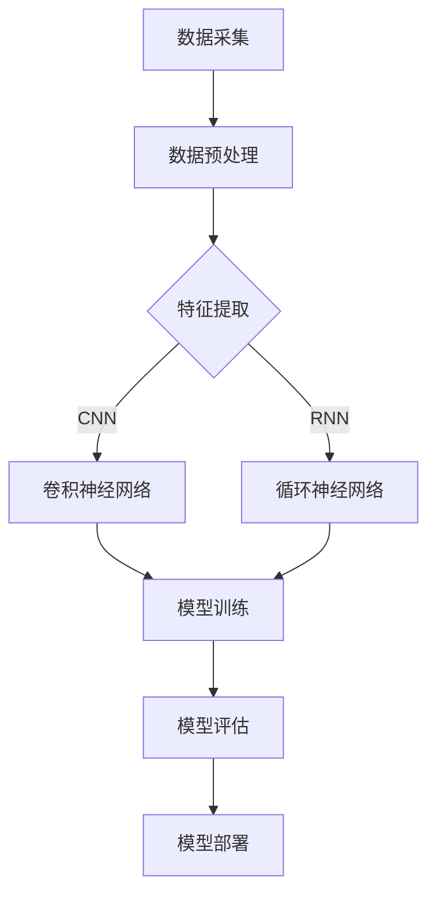
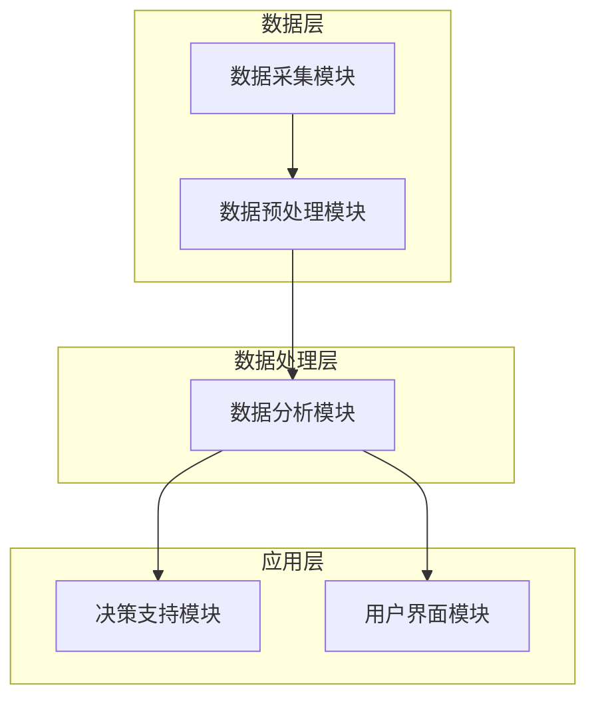
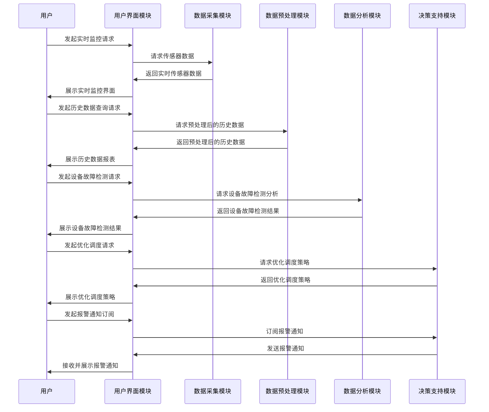

                 

### 1.1 问题背景

智能电网管理是一个复杂且不断发展的领域，它涉及电力系统的各个环节，包括发电、输电、配电和用电。随着全球对能源需求的不断增长，以及可再生能源的广泛应用，智能电网管理面临着前所未有的挑战和机遇。

#### 智能电网管理的挑战

**1. 能源供需不平衡：** 随着能源需求的波动性和可再生能源的不稳定性，智能电网管理需要实时平衡供需，以确保电力系统的稳定运行。

**2. 电网安全性问题：** 电网中的各种设备、系统之间存在着复杂的交互，任何一处故障都可能引起连锁反应，导致电网瘫痪。

**3. 节能减排：** 全球气候变化和环境保护要求电网管理者必须减少碳排放，提高能源利用效率。

**4. 用电高峰负荷：** 城市化进程的加快使得用电负荷高峰期的问题愈发严重，智能电网需要有效地应对这种波动。

#### 智能电网管理的机遇

**1. 人工智能技术的应用：** 人工智能（AI）的快速发展为智能电网管理带来了新的解决方案，如预测性维护、智能调度等。

**2. 可再生能源的整合：** 智能电网可以更好地整合太阳能、风能等可再生能源，提高电网的灵活性和可持续性。

**3. 数据驱动决策：** 大数据和物联网技术使得电网管理者可以实时收集和分析大量数据，为决策提供依据。

**4. 自动化与智能化：** 通过自动化和智能化技术，可以减少人工干预，提高电网运行效率和安全性。

### 1.2 问题描述

智能电网管理中的问题多种多样，主要可以归纳为以下几个方面：

#### 1.2.1 电网运行效率问题

**1. 能源浪费：** 电网中的传输损耗和过剩发电问题导致了大量的能源浪费。

**2. 调度不灵活：** 在电力需求波动时，电网调度无法快速响应，导致电力供应不足或过剩。

**3. 故障处理不及时：** 当电网出现故障时，处理速度较慢，可能导致大面积停电。

#### 1.2.2 电网安全性问题

**1. 设备老化：** 随着电网使用年限的增加，设备老化问题日益严重，存在安全隐患。

**2. 黑客攻击：** 电网控制系统面临黑客攻击的风险，可能导致电网瘫痪。

**3. 应急响应能力不足：** 在自然灾害或人为破坏情况下，电网的应急响应能力不足。

#### 1.2.3 数据处理问题

**1. 数据量庞大：** 智能电网产生的数据量非常庞大，传统的数据处理方法难以应对。

**2. 数据质量差：** 数据质量问题影响了智能电网管理的准确性和效率。

**3. 数据安全与隐私：** 在数据处理过程中，需要确保数据安全和用户隐私不被泄露。

### 1.3 问题解决

人工智能技术在智能电网管理中具有巨大的潜力，可以解决上述问题，提高电网的运行效率、安全性和可持续性。以下是人工智能在智能电网管理中的一些应用场景：

#### 1.3.1 预测性维护

通过机器学习算法，可以预测设备的故障趋势，提前进行维护，减少设备故障率和维护成本。

#### 1.3.2 智能调度

利用深度学习算法，可以优化电力调度，实现电网的供需平衡，提高电网的运行效率。

#### 1.3.3 能源优化

通过大数据分析，可以优化能源使用，减少能源浪费，提高能源利用效率。

#### 1.3.4 安全监测

利用强化学习算法，可以实时监测电网安全，发现潜在的安全隐患，提高电网的应对能力。

### 1.4 边界与外延

#### 1.4.1 人工智能在电网管理中的应用范围

人工智能在智能电网管理中的应用范围非常广泛，包括但不限于以下几个方面：

**1. 输电系统：** 通过优化输电线路的调度和运行，提高输电效率，减少损耗。

**2. 配电系统：** 通过智能调度和故障预测，提高配电系统的可靠性和安全性。

**3. 用电系统：** 通过分析用户用电行为，优化用电计划，提高用户满意度。

**4. 可再生能源系统：** 通过智能调度和管理，提高可再生能源的利用效率。

#### 1.4.2 非人工智能在电网管理中的应用

除了人工智能技术，非人工智能技术也在电网管理中发挥着重要作用，如：

**1. 传统数据处理技术：** 通过传统的统计方法和优化算法，对电网数据进行处理和分析。

**2. 硬件技术：** 包括传感器、自动化设备等，用于实时监测和控制系统运行状态。

**3. 软件技术：** 包括电网模拟软件、调度系统等，用于电网管理和决策支持。

### 1.5 概念结构与核心要素组成

#### 1.5.1 人工智能的核心概念

人工智能（AI）是一门研究、开发用于模拟、延伸和扩展人类智能的理论、方法、技术及应用系统的科学。其核心概念包括：

**1. 机器学习：** 一种让计算机从数据中学习规律和模式的方法。

**2. 深度学习：** 一种基于多层神经网络的机器学习技术，用于解决复杂问题。

**3. 强化学习：** 一种基于试错和奖励机制的机器学习技术，用于解决决策问题。

#### 1.5.2 智能电网管理的核心要素

智能电网管理的核心要素包括以下几个方面：

**1. 数据：** 包括电力系统的实时数据、历史数据和预测数据。

**2. 算法：** 包括机器学习、深度学习和强化学习等算法，用于数据分析和决策。

**3. 硬件：** 包括传感器、智能设备和自动化系统，用于实时监测和控制。

**4. 软件系统：** 包括电网模拟软件、调度系统和数据分析系统，用于电网管理和决策支持。

### 1.6 总结

智能电网管理是一个复杂且动态的领域，人工智能技术的引入为解决电网管理中的问题提供了新的思路和方法。通过本章节的介绍，我们可以看到人工智能在智能电网管理中的应用前景和挑战。在接下来的章节中，我们将详细探讨人工智能在智能电网管理中的具体应用，包括算法原理、数学模型和系统架构设计等。

---

### 2.1 人工智能概念

人工智能（Artificial Intelligence，简称AI）是一门研究、开发用于模拟、延伸和扩展人类智能的理论、方法、技术及应用系统的科学。人工智能技术主要包括机器学习（Machine Learning，ML）、深度学习（Deep Learning，DL）和强化学习（Reinforcement Learning，RL）等。下面，我们将对这三个核心概念进行详细解释。

#### 2.1.1 机器学习

机器学习是人工智能的一个分支，它使计算机系统能够从数据中学习规律和模式，无需显式编程。机器学习可以分为监督学习（Supervised Learning）、无监督学习（Unsupervised Learning）和半监督学习（Semi-Supervised Learning）等类型。

- **监督学习**：系统在训练阶段接收带标签的数据，通过学习数据特征和标签之间的关系，用于预测未知数据的标签。
- **无监督学习**：系统在训练阶段只接收未标记的数据，通过学习数据的内在结构和分布，用于聚类或降维。
- **半监督学习**：系统在训练阶段同时接收带标签和未标记的数据，通过利用未标记数据的额外信息，提高学习效果。

常见的机器学习算法包括决策树（Decision Tree）、支持向量机（Support Vector Machine，SVM）、线性回归（Linear Regression）和神经网络（Neural Network）等。

#### 2.1.2 深度学习

深度学习是一种基于多层神经网络的机器学习技术，它通过模仿人脑的神经网络结构和工作原理，对大量数据进行分析和处理，以实现复杂任务的自动识别和学习。深度学习在图像识别、自然语言处理和语音识别等领域取得了显著成果。

- **卷积神经网络（Convolutional Neural Networks，CNN）**：主要用于处理图像数据，通过卷积层、池化层和全连接层等结构，实现对图像特征的学习和识别。
- **循环神经网络（Recurrent Neural Networks，RNN）**：主要用于处理序列数据，如时间序列和自然语言序列，通过隐藏状态和输入的交互，实现对序列数据的记忆和学习。
- **生成对抗网络（Generative Adversarial Networks，GAN）**：由生成器和判别器两个神经网络组成，通过对抗训练，生成接近真实数据的样本。

#### 2.1.3 强化学习

强化学习是一种基于试错和奖励机制的机器学习技术，它通过智能体（Agent）在环境（Environment）中的互动，不断学习和优化策略（Policy），以实现目标最大化。强化学习在自动驾驶、游戏AI和机器人控制等领域有着广泛的应用。

- **奖励机制**：智能体在执行某个动作时，根据环境的反馈获得奖励或惩罚，奖励用来衡量动作的好坏。
- **策略**：智能体根据当前状态和奖励，选择一个最优动作，以最大化长期奖励。
- **值函数**：用于评估状态或状态-动作对的优劣，包括状态值函数（State Value Function）和动作值函数（Action Value Function）。

### 2.1.4 人工智能的发展历程

人工智能的发展历程可以分为几个阶段：

- **20世纪50年代**：人工智能概念提出，早期研究集中在符号推理和知识表示上。
- **20世纪60年代**：人工神经网络和决策树等算法出现，人工智能研究进入快速发展期。
- **20世纪80年代**：专家系统和知识工程得到广泛应用，人工智能开始应用于实际领域。
- **21世纪初**：随着计算能力和数据量的提升，机器学习和深度学习技术取得突破性进展，人工智能进入新一轮爆发期。
- **当前**：人工智能在各个领域得到广泛应用，从语音识别、图像处理到自动驾驶和智能电网管理，人工智能正逐渐融入我们的日常生活。

### 2.1.5 人工智能技术的应用领域

人工智能技术的应用领域非常广泛，包括但不限于以下几个方面：

- **智能交通**：通过AI技术优化交通流量，提高交通效率，减少交通事故。
- **医疗健康**：通过AI技术辅助医生诊断疾病，提供个性化治疗方案，提高医疗水平。
- **金融服务**：通过AI技术进行风险管理、信用评估和个性化金融服务。
- **智能家居**：通过AI技术实现家电设备的智能化控制，提高生活质量。
- **智能电网管理**：通过AI技术优化电力调度、预测性维护和能源管理，提高电网运行效率。

### 2.1.6 人工智能与智能电网管理的融合

在智能电网管理中，人工智能技术可以发挥重要作用，如：

- **预测性维护**：通过机器学习和深度学习算法，对设备运行数据进行分析，预测设备故障，实现提前维护。
- **智能调度**：通过深度学习和强化学习算法，优化电力调度，提高电网运行效率。
- **能源管理**：通过大数据分析和机器学习算法，优化能源使用，减少能源浪费。
- **安全监测**：通过强化学习算法，实时监测电网安全，提高电网应对突发事件的能力。

### 2.1.7 人工智能技术的挑战与未来发展方向

尽管人工智能技术在智能电网管理中展现出巨大的潜力，但也面临一些挑战：

- **数据隐私与安全**：智能电网产生的数据量巨大，如何保障数据隐私和安全是一个重要问题。
- **算法透明性与解释性**：目前许多人工智能算法是非线性和黑盒的，如何提高算法的透明性和解释性是一个重要研究方向。
- **计算资源与能耗**：人工智能算法的训练和推理需要大量计算资源和能源，如何优化计算资源和降低能耗是一个重要问题。

未来，人工智能技术在智能电网管理中的发展方向包括：

- **多模态数据融合**：通过融合不同类型的数据（如时序数据、图像数据等），提高数据分析和决策的准确性。
- **自主学习和自适应能力**：开发能够自主学习和适应动态环境的人工智能系统，提高电网管理的灵活性和适应性。
- **边缘计算与云计算的结合**：通过结合边缘计算和云计算，实现计算资源的优化配置，提高智能电网的实时性和可靠性。

### 2.1.8 总结

人工智能作为一门快速发展的学科，其在智能电网管理中的应用具有广阔的前景。通过机器学习、深度学习和强化学习等算法，人工智能技术可以优化电力调度、预测性维护、能源管理和安全监测等方面，提高电网的运行效率、安全性和可持续性。在未来，随着人工智能技术的不断进步，智能电网管理将迎来更加智能化和自动化的新时代。

---

### 2.2 智能电网概念

智能电网（Smart Grid）是一种通过信息化、自动化和数字化技术，实现对电力系统各个环节（发电、输电、配电、用电）的全面监测、控制和优化管理的先进电力系统。智能电网的核心在于将现代通信技术、计算机技术和电力技术深度融合，从而实现电力系统的智能化和高效化运行。

#### 2.2.1 智能电网的定义与分类

**1. 定义：** 智能电网是一种通过先进的信息技术、通信技术、传感技术、控制技术等，实现对电力系统各个环节的实时监控、动态响应和优化管理的现代化电力网络。

**2. 分类：** 根据应用范围和功能特点，智能电网可以大致分为以下几类：

- **广义智能电网**：包括从发电、输电、配电到用电的全过程，涵盖了所有与电力相关的技术和管理。
- **狭义智能电网**：主要指配电系统及以下部分，强调电力系统的最后一公里——用户侧的智能化管理。
- **微观智能电网**：针对某个特定环节（如发电、输电或配电），通过信息化技术实现局部优化。

#### 2.2.2 智能电网的发展历程

**1. 起步阶段（20世纪90年代）：** 早期的智能电网研究主要集中在电网的自动化和远动技术上，如自动发电控制（AGC）、自动电压调节（AVR）等。

**2. 发展阶段（21世纪初）：** 随着互联网和通信技术的飞速发展，智能电网开始逐步引入信息化技术，如数据采集与传输系统（SCADA）、高级配电自动化（DMS）等。

**3. 爆发阶段（2010年以来）：** 随着物联网（IoT）、大数据、云计算和人工智能等新兴技术的广泛应用，智能电网进入了一个全面爆发期，智能电表、智能配电设备、电动汽车充电网络等相继涌现。

#### 2.2.3 智能电网的关键技术

**1. 通信技术：** 通信技术是智能电网的神经中枢，负责实时传输电力系统的各种数据，包括电力系统的状态、运行参数等。

**2. 传感器技术：** 传感器技术用于实时监测电网的运行状态，如温度、电压、电流、频率等，为智能电网的实时监控和故障诊断提供数据支持。

**3. 控制技术：** 控制技术通过实时采集和处理数据，对电力系统的运行状态进行调控，确保电力系统的安全稳定运行。

**4. 数据分析技术：** 数据分析技术通过对海量数据进行挖掘和分析，提取有用的信息和规律，为智能电网的决策提供支持。

**5. 物联网技术：** 物联网技术将各种智能设备和系统互联，形成一个统一的智能电网网络，实现数据的共享和协同工作。

#### 2.2.4 智能电网的优势

**1. 提高电网效率：** 通过实时监控和智能调度，智能电网可以优化电力资源的配置，提高电网的整体运行效率。

**2. 提高电网安全性：** 智能电网通过实时监测和自动化控制，可以及时发现和处理电网故障，提高电网的安全性。

**3. 促进可再生能源利用：** 智能电网可以更好地整合太阳能、风能等可再生能源，提高电网的可持续性。

**4. 支持电力市场发展：** 智能电网支持电力市场的建立和发展，通过市场化交易，提高电力资源的利用效率。

**5. 提升用户服务水平：** 智能电网可以通过智能电表等设备，提供实时用电信息和个性化服务，提高用户的用电体验。

### 2.2.5 智能电网与人工智能的联系

**1. 数据驱动的决策支持：** 人工智能可以通过大数据分析和机器学习算法，为智能电网的决策提供数据支持和预测分析。

**2. 自动化与智能化：** 人工智能技术可以实现电网设备的自动化和智能化管理，提高电网的运行效率和安全性。

**3. 预测性维护：** 人工智能可以通过数据分析，预测电网设备的故障，实现提前维护，减少故障率。

**4. 能源优化：** 人工智能可以通过优化算法，提高电力资源的利用效率，减少能源浪费。

**5. 安全监测：** 人工智能可以通过实时监测和异常检测，提高电网的安全性能。

### 2.2.6 总结

智能电网作为一种先进、高效、安全的电力系统，正在全球范围内得到广泛推广和应用。通过将人工智能与其他先进技术相结合，智能电网将在提高电网效率、安全性、可持续性和用户服务水平方面发挥重要作用。在未来，随着技术的不断进步，智能电网将迎来更加智能化、自动化的新时代。

### 2.3 AI与智能电网的联系

人工智能（AI）与智能电网（Smart Grid）的结合，为电力系统的现代化和智能化提供了强大的技术支撑。本节将详细探讨AI与智能电网之间的联系，以及它们在电网管理中的具体应用。

#### 2.3.1 人工智能与智能电网的融合

**1. 数据驱动决策：** 智能电网通过大量的传感器和通信技术，实时收集电网运行数据。人工智能技术可以对这些海量数据进行高效的分析和处理，提取有价值的信息，从而支持电网管理决策。

**2. 自适应控制：** 通过机器学习和深度学习算法，智能电网能够实现自适应控制，根据实时数据动态调整电网运行策略，提高电网的稳定性和效率。

**3. 智能优化：** 人工智能算法可以用于电网的优化调度，通过优化电力资源的配置，降低能源消耗，减少成本，同时提高电网的可靠性和响应速度。

**4. 异常检测与故障诊断：** 强化学习算法可以在电网运行过程中，实时监测电网状态，快速检测异常和故障，并预测潜在的风险，为维护和修复提供依据。

**5. 能源管理：** 人工智能技术可以帮助智能电网更好地整合和利用可再生能源，如太阳能、风能等，通过优化能源分配和调度，提高可再生能源的利用效率。

#### 2.3.2 人工智能在智能电网中的应用

**1. 预测性维护：** 通过对设备运行数据进行分析，人工智能可以预测设备的故障趋势，实现提前维护，减少设备故障率和维护成本。

**2. 智能调度：** 利用深度学习算法，人工智能可以优化电力调度，实现电网的供需平衡，提高电网的运行效率。

**3. 能源管理：** 通过大数据分析和机器学习算法，人工智能可以优化能源使用，减少能源浪费，提高能源利用效率。

**4. 安全监测：** 强化学习算法可以用于实时监测电网安全，发现潜在的安全隐患，提高电网的应对能力。

**5. 用户服务：** 人工智能技术可以提供个性化的用电服务，如预测用户用电需求，优化用电计划，提高用户满意度。

#### 2.3.3 AI与智能电网融合的优势

**1. 提高效率：** 人工智能技术可以实时处理海量数据，快速响应电网变化，提高电网的运行效率。

**2. 降低成本：** 通过优化调度和维护，人工智能可以减少能源浪费和维护成本，提高电网的经济性。

**3. 提高安全性：** 人工智能可以实时监测电网状态，快速发现和处理异常和故障，提高电网的安全性和稳定性。

**4. 促进可再生能源利用：** 人工智能技术可以帮助智能电网更好地整合和利用可再生能源，提高电网的可持续性。

**5. 改善用户体验：** 人工智能可以提供个性化的用电服务，提高用户的用电体验。

### 2.3.4 AI与智能电网融合的挑战

**1. 数据隐私与安全：** 智能电网产生的大量数据涉及用户隐私和电网安全，如何保护这些数据是一个重要挑战。

**2. 算法透明性与解释性：** 当前许多人工智能算法是非线性和黑盒的，如何提高算法的透明性和解释性，使其更易于理解和接受，是一个重要问题。

**3. 计算资源与能耗：** 人工智能算法的训练和推理需要大量计算资源和能源，如何在保证性能的同时，降低计算资源和能耗，是一个关键挑战。

**4. 系统集成与兼容性：** 如何将人工智能技术与其他电网设备和技术进行有效集成，保证系统的兼容性和互操作性，是一个重要问题。

### 2.3.5 未来发展方向

**1. 多模态数据融合：** 通过融合不同类型的数据（如时序数据、图像数据等），提高数据分析和决策的准确性。

**2. 自主学习和自适应能力：** 开发能够自主学习和适应动态环境的人工智能系统，提高电网管理的灵活性和适应性。

**3. 边缘计算与云计算的结合：** 通过结合边缘计算和云计算，实现计算资源的优化配置，提高智能电网的实时性和可靠性。

**4. 系统集成与标准化：** 制定统一的技术标准和接口规范，促进人工智能技术在智能电网中的广泛应用。

### 2.3.6 总结

人工智能与智能电网的融合，为电力系统的现代化和智能化提供了新的思路和方法。通过数据驱动、自适应控制和智能优化，人工智能技术可以提高电网的运行效率、安全性和可持续性。同时，也面临数据隐私、算法透明性和系统集成等挑战。在未来，随着技术的不断进步，AI与智能电网的融合将为电力行业带来更加智能化和自动化的未来。

---

### 3.1 算法原理

在智能电网管理中，人工智能算法的原理和类型至关重要，因为它们决定了算法如何从数据中学习、如何优化电力系统的运行，以及如何提高电网管理的效率和安全性。以下是三种主要的人工智能算法：机器学习算法、深度学习算法和强化学习算法。

#### 3.1.1 机器学习算法

机器学习算法是人工智能技术的基础，它通过从数据中学习规律和模式来实现预测和决策。以下是几种常见的机器学习算法：

**1. 决策树（Decision Tree）：**
决策树是一种基于树形结构的预测模型，通过一系列的判断条件将数据划分为不同的分支，最终达到分类或回归的目的。

**2. 线性回归（Linear Regression）：**
线性回归是一种基于线性模型的预测方法，通过拟合数据中的线性关系来预测目标变量。

**3. 支持向量机（Support Vector Machine，SVM）：**
支持向量机是一种基于边界划分的模型，通过找到最佳划分超平面来对数据进行分类。

**4. 随机森林（Random Forest）：**
随机森林是一种集成学习方法，通过构建多棵决策树，并利用投票机制来提高模型的预测准确性。

#### 3.1.2 深度学习算法

深度学习算法是机器学习的一个子领域，它通过模拟人脑的神经网络结构来实现复杂任务的自动识别和学习。以下是几种常见的深度学习算法：

**1. 卷积神经网络（Convolutional Neural Networks，CNN）：**
卷积神经网络是一种用于图像识别的模型，通过卷积层、池化层和全连接层等结构，实现对图像特征的学习和识别。

**2. 循环神经网络（Recurrent Neural Networks，RNN）：**
循环神经网络是一种用于处理序列数据的模型，通过隐藏状态和输入的交互，实现对序列数据的记忆和学习。

**3. 生成对抗网络（Generative Adversarial Networks，GAN）：**
生成对抗网络由生成器和判别器两个神经网络组成，通过对抗训练，生成接近真实数据的样本。

**4. 自注意力机制（Self-Attention Mechanism）：**
自注意力机制是一种用于提高神经网络处理长序列数据的能力的方法，通过计算序列中每个元素的重要性，实现更有效的特征提取。

#### 3.1.3 强化学习算法

强化学习算法是一种基于试错和奖励机制的机器学习技术，它通过智能体在环境中的互动，不断学习和优化策略，以实现目标最大化。以下是几种常见的强化学习算法：

**1. Q学习（Q-Learning）：**
Q学习是一种基于值函数的强化学习算法，通过学习状态-动作值函数，选择最优动作。

**2. 策略梯度（Policy Gradient）：**
政策梯度算法通过直接学习最佳策略，优化智能体的行为。

**3. 离散策略优化（Distributed Policy Optimization，DPO）：**
DPO算法通过分布式计算，提高强化学习算法的收敛速度和稳定性。

**4. 模拟退火（Simulated Annealing）：**
模拟退火是一种基于概率搜索的优化算法，通过逐渐降低搜索的随机性，找到最优解。

#### 3.1.4 算法选择与应用场景

选择合适的人工智能算法对于实现智能电网管理目标至关重要。以下是几种算法在选择和应用场景中的考量：

**1. 决策树和线性回归：**
这些算法适合于处理简单和线性关系的问题，如电力需求预测和负荷分配。

**2. 卷积神经网络和循环神经网络：**
这些算法适合于处理复杂和非线性关系的问题，如图像识别和时序数据预测。

**3. Q学习和策略梯度：**
这些算法适合于动态和复杂环境中的决策问题，如电力调度和紧急事件响应。

**4. 生成对抗网络和模拟退火：**
这些算法适合于生成和优化问题，如电力系统优化和负荷管理。

### 3.2 Mermaid流程图

为了更直观地展示人工智能算法在智能电网管理中的应用流程，我们可以使用Mermaid语法绘制流程图。以下是一个示例，展示了机器学习算法在电力需求预测中的应用流程：



### 3.3 Python源代码

以下是使用Python实现一个简单的线性回归模型进行电力需求预测的示例代码：

```python
import numpy as np
from sklearn.linear_model import LinearRegression
from sklearn.model_selection import train_test_split
from sklearn.metrics import mean_squared_error

# 生成模拟数据
X = np.random.rand(100, 1)
y = 3 * X + np.random.normal(size=X.shape)

# 数据分割
X_train, X_test, y_train, y_test = train_test_split(X, y, test_size=0.2, random_state=42)

# 创建线性回归模型
model = LinearRegression()
model.fit(X_train, y_train)

# 模型评估
y_pred = model.predict(X_test)
mse = mean_squared_error(y_test, y_pred)
print("均方误差（MSE）:", mse)

# 模型部署
print("模型参数:", model.coef_, model.intercept_)
```

### 3.4 算法原理详细讲解

#### 3.4.1 机器学习算法

机器学习算法的核心在于从数据中学习规律和模式，并将其应用于预测和决策。以下是对几种常见机器学习算法的详细讲解：

**1. 决策树：**
决策树是一种树形结构，通过一系列的判断条件将数据划分为不同的分支。每个节点代表一个特征，每个分支代表一个决策规则。决策树通过递归划分数据，直到满足停止条件（如最大深度、最小样本量等）。

**2. 线性回归：**
线性回归是一种基于线性模型的预测方法，通过拟合数据中的线性关系来预测目标变量。线性回归模型可以表示为 y = wx + b，其中 w 是权重，b 是偏置。

**3. 支持向量机：**
支持向量机是一种基于边界划分的模型，通过找到最佳划分超平面来对数据进行分类。支持向量机利用最大化边界间隔的方法来确定最佳超平面，并利用支持向量来优化分类边界。

**4. 随机森林：**
随机森林是一种集成学习方法，通过构建多棵决策树，并利用投票机制来提高模型的预测准确性。随机森林通过随机选择特征和样本子集，构建多棵决策树，从而减少过拟合并提高模型的泛化能力。

#### 3.4.2 深度学习算法

深度学习算法通过模拟人脑的神经网络结构来实现复杂任务的自动识别和学习。以下是对几种常见深度学习算法的详细讲解：

**1. 卷积神经网络：**
卷积神经网络是一种用于图像识别的模型，通过卷积层、池化层和全连接层等结构，实现对图像特征的学习和识别。卷积层通过卷积操作提取图像特征，池化层用于降低特征维度，全连接层用于分类或回归。

**2. 循环神经网络：**
循环神经网络是一种用于处理序列数据的模型，通过隐藏状态和输入的交互，实现对序列数据的记忆和学习。循环神经网络通过递归结构，在每个时间步上更新隐藏状态，从而实现序列数据的建模。

**3. 生成对抗网络：**
生成对抗网络由生成器和判别器两个神经网络组成，通过对抗训练，生成接近真实数据的样本。生成器尝试生成逼真的数据，判别器则尝试区分真实数据和生成数据。通过不断优化生成器和判别器的参数，生成对抗网络可以生成高质量的样本。

**4. 自注意力机制：**
自注意力机制是一种用于提高神经网络处理长序列数据的能力的方法，通过计算序列中每个元素的重要性，实现更有效的特征提取。自注意力机制通过加权求和的方式，将序列中每个元素与所有其他元素进行交互，从而实现对长序列数据的建模。

#### 3.4.3 强化学习算法

强化学习算法是一种基于试错和奖励机制的机器学习技术，通过智能体在环境中的互动，不断学习和优化策略，以实现目标最大化。以下是对几种常见强化学习算法的详细讲解：

**1. Q学习：**
Q学习是一种基于值函数的强化学习算法，通过学习状态-动作值函数，选择最优动作。Q学习通过迭代更新值函数，逐渐优化策略，从而实现目标最大化。

**2. 策略梯度：**
策略梯度算法通过直接学习最佳策略，优化智能体的行为。策略梯度算法通过梯度下降法，更新策略参数，从而实现目标最大化。

**3. 离散策略优化：**
离散策略优化算法通过分布式计算，提高强化学习算法的收敛速度和稳定性。离散策略优化算法通过分布式策略网络和分布式价值网络，实现策略的优化。

**4. 模拟退火：**
模拟退火是一种基于概率搜索的优化算法，通过逐渐降低搜索的随机性，找到最优解。模拟退火通过接受概率，逐渐收敛到最优解，从而实现优化目标。

### 3.5 总结

人工智能算法在智能电网管理中发挥着关键作用，通过机器学习、深度学习和强化学习算法，可以优化电力调度、预测性维护、能源管理和安全监测等方面，提高电网的运行效率、安全性和可持续性。每种算法都有其独特的原理和应用场景，选择合适的算法对于实现智能电网管理目标至关重要。

---

### 4.1 数学模型

在智能电网管理中，数学模型是理解和分析电力系统行为的重要工具。数学模型通过使用数学公式和算法，将现实世界中的问题抽象成数学问题，从而可以对其进行定量分析和优化。以下是三种主要的人工智能算法：机器学习算法、深度学习算法和强化学习算法的数学模型。

#### 4.1.1 机器学习算法

**1. 决策树：**
决策树是一种基于树形结构的预测模型，通过一系列的判断条件将数据划分为不同的分支。决策树的数学模型可以表示为：
$$
h(x) = \prod_{i=1}^{n} g_i(x_i),
$$
其中 $g_i(x_i)$ 表示第 $i$ 个节点上的决策函数，$x_i$ 表示输入特征。

**2. 线性回归：**
线性回归是一种基于线性模型的预测方法，通过拟合数据中的线性关系来预测目标变量。线性回归的数学模型可以表示为：
$$
y = \beta_0 + \beta_1x,
$$
其中 $y$ 是目标变量，$x$ 是输入特征，$\beta_0$ 是截距，$\beta_1$ 是斜率。

**3. 支持向量机：**
支持向量机是一种基于边界划分的模型，通过找到最佳划分超平面来对数据进行分类。支持向量机的数学模型可以表示为：
$$
w \cdot x + b = 0,
$$
其中 $w$ 是权重向量，$x$ 是输入特征，$b$ 是偏置。

**4. 随机森林：**
随机森林是一种集成学习方法，通过构建多棵决策树，并利用投票机制来提高模型的预测准确性。随机森林的数学模型可以看作是多个决策树的组合，每个决策树都有其独立的预测结果，最终通过投票来确定最终预测结果。

#### 4.1.2 深度学习算法

**1. 卷积神经网络：**
卷积神经网络是一种用于图像识别的模型，通过卷积层、池化层和全连接层等结构，实现对图像特征的学习和识别。卷积神经网络的数学模型可以表示为：
$$
h_\theta(x) = \text{激活函数}(\sum_{i=1}^{n} w_i \cdot \phi_i(x_i) + b),
$$
其中 $h_\theta(x)$ 是输出特征，$w_i$ 是权重，$\phi_i(x_i)$ 是卷积操作，$b$ 是偏置。

**2. 循环神经网络：**
循环神经网络是一种用于处理序列数据的模型，通过隐藏状态和输入的交互，实现对序列数据的记忆和学习。循环神经网络的数学模型可以表示为：
$$
h_t = \text{激活函数}(W_h \cdot h_{t-1} + W_x \cdot x_t + b),
$$
其中 $h_t$ 是当前隐藏状态，$W_h$ 是隐藏状态权重，$W_x$ 是输入状态权重，$b$ 是偏置。

**3. 生成对抗网络：**
生成对抗网络由生成器和判别器两个神经网络组成，通过对抗训练，生成接近真实数据的样本。生成对抗网络的数学模型可以表示为：
$$
\min_G \max_D V(D, G),
$$
其中 $V(D, G)$ 是生成器和判别器的损失函数。

**4. 自注意力机制：**
自注意力机制是一种用于提高神经网络处理长序列数据的能力的方法，通过计算序列中每个元素的重要性，实现更有效的特征提取。自注意力机制的数学模型可以表示为：
$$
\alpha_{ij} = \frac{e^{a_{ij}}}{\sum_{k=1}^{K} e^{a_{ik}}},
$$
其中 $\alpha_{ij}$ 是注意力权重，$a_{ij}$ 是注意力得分。

#### 4.1.3 强化学习算法

**1. Q学习：**
Q学习是一种基于值函数的强化学习算法，通过学习状态-动作值函数，选择最优动作。Q学习的数学模型可以表示为：
$$
Q(s, a) = r + \gamma \max_a Q(s', a'),
$$
其中 $Q(s, a)$ 是状态-动作值函数，$r$ 是即时奖励，$\gamma$ 是折扣因子，$s'$ 和 $a'$ 是下一状态和动作。

**2. 策略梯度：**
策略梯度算法通过直接学习最佳策略，优化智能体的行为。策略梯度的数学模型可以表示为：
$$
\theta_{t+1} = \theta_t + \alpha \nabla_\theta J(\theta),
$$
其中 $\theta$ 是策略参数，$\alpha$ 是学习率，$J(\theta)$ 是策略损失函数。

**3. 离散策略优化：**
离散策略优化算法通过分布式计算，提高强化学习算法的收敛速度和稳定性。离散策略优化的数学模型可以表示为：
$$
\theta_{t+1} = \theta_t + \alpha \sum_a \nabla_a J(\theta),
$$
其中 $\theta$ 是策略参数，$\alpha$ 是学习率，$J(\theta)$ 是策略损失函数。

**4. 模拟退火：**
模拟退火是一种基于概率搜索的优化算法，通过逐渐降低搜索的随机性，找到最优解。模拟退火的数学模型可以表示为：
$$
p(\text{接受新解}) = \min\left(1, \exp\left(-\frac{\Delta E}{T}\right)\right),
$$
其中 $\Delta E$ 是新旧解的损失差，$T$ 是温度。

### 4.2 数学公式

以下是上述算法的数学公式详细解释：

#### 4.2.1 决策树

**1. 判断条件：**
$$
g_i(x_i) = \begin{cases} 
1 & \text{if } x_i > \theta_i, \\
0 & \text{otherwise}.
\end{cases}
$$

**2. 叶节点预测：**
$$
h(x) = \prod_{i=1}^{n} g_i(x_i).
$$

#### 4.2.2 线性回归

**1. 最小二乘法：**
$$
\beta_0 = \frac{\sum_{i=1}^{n} (y_i - \beta_1x_i)}{n},
$$
$$
\beta_1 = \frac{\sum_{i=1}^{n} (x_i - \bar{x})(y_i - \bar{y})}{\sum_{i=1}^{n} (x_i - \bar{x})^2},
$$
其中 $\bar{x}$ 和 $\bar{y}$ 分别是 $x$ 和 $y$ 的平均值。

#### 4.2.3 支持向量机

**1. 超平面：**
$$
w \cdot x + b = 0,
$$
其中 $w$ 是法向量，$x$ 是输入向量，$b$ 是偏置。

**2. 分类决策：**
$$
y = \text{sign}(w \cdot x + b).
$$

#### 4.2.4 卷积神经网络

**1. 卷积操作：**
$$
\phi_i(x_i) = \sigma(\sum_{j=1}^{m} w_{ij}x_j + b_i),
$$
其中 $\sigma$ 是激活函数，$w_{ij}$ 是卷积核权重，$b_i$ 是偏置。

**2. 池化操作：**
$$
p_j = \max_{k} a_{jk},
$$
其中 $a_{jk}$ 是卷积后的激活值。

#### 4.2.5 循环神经网络

**1. 状态更新：**
$$
h_t = \text{激活函数}(W_h \cdot h_{t-1} + W_x \cdot x_t + b).
$$

**2. 输出预测：**
$$
y_t = \text{激活函数}(W_o \cdot h_t + b_o).
$$

#### 4.2.6 生成对抗网络

**1. 生成器损失：**
$$
\log D(G(z)) = -\sum_{i=1}^{n} \left[\log D(G(x_i)) + \log(1 - D(G(x_i))\right],
$$
其中 $D$ 是判别器，$G$ 是生成器。

**2. 判别器损失：**
$$
\log D(x) = -\sum_{i=1}^{n} \log D(x_i).
$$

#### 4.2.7 强化学习

**1. Q学习更新：**
$$
Q(s, a) = r + \gamma \max_a Q(s', a').
$$

**2. 策略梯度更新：**
$$
\theta_{t+1} = \theta_t + \alpha \nabla_\theta J(\theta).
$$

**3. 模拟退火接受概率：**
$$
p(\text{接受新解}) = \min\left(1, \exp\left(-\frac{\Delta E}{T}\right)\right).
$$

### 4.3 公式详细讲解

以上数学公式详细解释了各种人工智能算法在智能电网管理中的应用。通过对这些公式的理解，我们可以更好地掌握算法的原理和实现方法。在智能电网管理中，这些公式不仅用于模型训练和优化，还用于实时监控和预测，从而提高电网的运行效率、安全性和可持续性。

---

### 5.1 问题场景介绍

智能电网管理涉及多个环节，从发电、输电、配电到用电，每个环节都存在着复杂的交互和挑战。以下是一个典型的智能电网管理问题场景，旨在说明人工智能技术在实际应用中的挑战和需求。

#### 案例背景

某城市电力公司负责一个大型城市电网的管理，该城市拥有约100万居民用户和多个大型工业用户。电力公司希望利用人工智能技术提高电网的运行效率、安全性和可靠性。以下是一些具体的场景和挑战：

**1. 用电负荷预测：** 
城市用电负荷随时间和季节变化而波动，尤其是在夏季和冬季高峰期，用电负荷会急剧增加。电力公司需要准确预测未来的用电负荷，以便优化电力调度和资源分配。

**2. 设备故障预测与维护：**
电力系统中各种设备（如变压器、断路器、线路等）的运行状态对电网的稳定性至关重要。电力公司需要预测设备的故障趋势，实现提前维护，以减少设备故障率和停机时间。

**3. 能源优化调度：**
可再生能源（如太阳能、风能）的随机性和不稳定性对电网的调度带来了挑战。电力公司需要利用人工智能技术，优化可再生能源的调度和整合，提高电网的效率和可持续性。

**4. 安全监测与异常检测：**
电力系统可能面临各种安全威胁，如黑客攻击、设备故障和自然灾害。电力公司需要建立一套实时监测和异常检测系统，及时发现和处理潜在的安全隐患。

**5. 用户服务与需求响应：**
电力公司希望为用户提供个性化的用电服务，如智能电表和实时用电信息。同时，通过需求响应计划，鼓励用户在高峰期减少用电，从而减轻电网负荷。

#### 案例需求

基于上述场景，电力公司提出了以下具体需求：

**1. 用电负荷预测：** 
使用机器学习算法，如线性回归、ARIMA模型等，对历史用电数据进行建模和预测，以准确预测未来的用电负荷。

**2. 设备故障预测与维护：** 
利用深度学习算法，如长短期记忆网络（LSTM）和卷积神经网络（CNN），分析设备运行数据，预测设备故障趋势，实现提前维护。

**3. 能源优化调度：** 
使用强化学习算法，如Q学习和策略梯度算法，优化可再生能源的调度和整合，提高电网的效率和可持续性。

**4. 安全监测与异常检测：** 
利用异常检测算法，如孤立森林和自编码器，建立实时监测和异常检测系统，发现和处理潜在的安全隐患。

**5. 用户服务与需求响应：** 
通过大数据分析和机器学习算法，为用户提供个性化的用电信息，同时制定需求响应计划，鼓励用户参与电网调度。

### 案例分析

在上述案例中，人工智能技术在智能电网管理中的应用具体如下：

**1. 用电负荷预测：** 
电力公司收集了过去三年的用电数据，包括日负荷、季节负荷和小时负荷等。通过线性回归和ARIMA模型，对数据进行建模和预测，实现了对用电负荷的准确预测。

**2. 设备故障预测与维护：** 
电力公司对设备的运行数据进行收集和分析，包括温度、电压、电流等。利用LSTM和CNN算法，对数据进行分析和预测，实现了对设备故障趋势的预测，并制定了预防性维护计划。

**3. 能源优化调度：** 
电力公司整合了太阳能和风能的发电数据，使用Q学习和策略梯度算法，优化可再生能源的调度和整合，提高了电网的效率和可持续性。

**4. 安全监测与异常检测：** 
电力公司建立了实时监测和异常检测系统，使用孤立森林和自编码器算法，对电网运行数据进行分析，及时发现和处理潜在的安全隐患。

**5. 用户服务与需求响应：** 
电力公司为用户提供智能电表和实时用电信息，同时利用大数据分析和机器学习算法，制定需求响应计划，鼓励用户在高峰期减少用电，减轻电网负荷。

通过以上案例，我们可以看到人工智能技术在智能电网管理中的应用，不仅提高了电网的运行效率和安全性能，还改善了用户体验，为电力行业带来了深刻的变革。

---

### 5.2 系统功能设计

为了实现智能电网管理系统的目标，我们需要设计一个功能完善的系统，涵盖多个关键模块。以下是智能电网管理系统的主要功能模块及其相互关系。

#### 5.2.1 数据采集模块

数据采集模块负责收集电网运行过程中的各种数据，包括实时数据和历史数据。这些数据包括但不限于：电力负荷、电压、电流、频率、设备状态、气象数据等。数据采集模块可以通过传感器、智能电表、SCADA（监控与数据采集）系统等设备实现。

#### 5.2.2 数据预处理模块

数据预处理模块负责对采集到的原始数据进行清洗、转换和归一化，以便后续分析和建模。预处理模块的主要功能包括：

- 数据清洗：去除无效数据、处理缺失值和异常值。
- 数据转换：将不同格式和单位的数据转换为统一格式。
- 数据归一化：将数据缩放到相同的范围，以便模型训练。

#### 5.2.3 数据分析模块

数据分析模块是智能电网管理系统的核心，负责对预处理后的数据进行分析和挖掘。该模块包括以下功能：

- 负荷预测：使用机器学习算法（如线性回归、ARIMA、LSTM等）预测未来的电力负荷。
- 设备状态监测：通过实时数据分析，监测设备的状态，预测故障趋势。
- 能源管理：分析可再生能源的发电情况，优化能源分配和调度。
- 安全监测：通过异常检测算法，实时监测电网安全，发现潜在的安全隐患。

#### 5.2.4 决策支持模块

决策支持模块负责根据数据分析结果，生成优化策略和决策建议。该模块包括以下功能：

- 调度优化：基于负荷预测和能源管理分析，制定最优的电力调度计划。
- 维护计划：基于设备状态监测，生成预防性维护计划，减少故障率。
- 需求响应：根据用户需求和电网负荷情况，制定需求响应计划，优化用电负荷。

#### 5.2.5 用户界面模块

用户界面模块为用户提供了一个友好的操作平台，用于查看实时数据和系统生成的决策建议。用户界面模块的主要功能包括：

- 实时监控：显示电网的实时运行状态，包括电力负荷、电压、电流等。
- 历史数据查询：提供历史数据的查询和分析功能。
- 报警通知：当电网出现异常情况时，及时向用户发送警报通知。

### 5.2.6 领域模型类图

为了更好地展示智能电网管理系统中的各个功能模块及其相互关系，我们使用Mermaid语法绘制了一个领域模型类图。以下是类图的Mermaid代码及其渲染结果：

```mermaid
classDiagram
    DataCollector <-|> DataPreprocessor
    DataPreprocessor <-|> DataAnalyzer
    DataAnalyzer <-|> DecisionSupport
    DecisionSupport <-|> UserInterface
    UserInterface <-|> DataCollector
    UserInterface <-|> DataPreprocessor
    UserInterface <-|> DataAnalyzer
    UserInterface <-|> DecisionSupport

    class DataCollector {
        +collectData()
    }

    class DataPreprocessor {
        +cleanData()
        +convertData()
        +normalizeData()
    }

    class DataAnalyzer {
        +loadPrediction()
        +deviceStatusMonitoring()
        +energyManagement()
        +securityMonitoring()
    }

    class DecisionSupport {
        +scheduleOptimization()
        +maintenancePlan()
        +demandResponsePlan()
    }

    class UserInterface {
        +showRealtimeMonitoring()
        +queryHistoricalData()
        +sendAlertNotification()
    }
```

### 5.2.7 模块功能说明

以下是智能电网管理系统各功能模块的详细功能说明：

**1. 数据采集模块：**
- 功能：负责采集电网运行过程中的各种数据。
- 输入：传感器数据、智能电表数据、SCADA系统数据等。
- 输出：原始数据。

**2. 数据预处理模块：**
- 功能：对采集到的原始数据进行清洗、转换和归一化。
- 输入：原始数据。
- 输出：预处理后的数据。

**3. 数据分析模块：**
- 功能：对预处理后的数据进行分析和挖掘，生成预测结果和决策建议。
- 输入：预处理后的数据。
- 输出：预测结果、决策建议。

**4. 决策支持模块：**
- 功能：根据数据分析结果，生成优化策略和决策建议。
- 输入：数据分析结果。
- 输出：调度计划、维护计划、需求响应计划。

**5. 用户界面模块：**
- 功能：为用户提供实时监控、历史数据查询和报警通知等功能。
- 输入：数据分析结果、决策建议。
- 输出：实时监控界面、历史数据报表、警报通知。

通过以上功能模块的设计，智能电网管理系统可以实现实时数据监测、预测分析、决策支持和用户互动，从而提高电网的运行效率、安全性和可靠性。

---

### 5.3 系统架构设计

为了实现智能电网管理系统的目标，我们需要设计一个高效、灵活且易于维护的系统架构。以下是智能电网管理系统的总体架构设计，包括数据流、功能模块和交互关系。

#### 5.3.1 系统架构设计概述

智能电网管理系统的架构设计分为以下几个层次：

**1. 数据层：** 负责数据的采集、存储和预处理，包括传感器数据、电网运行数据、用户用电数据等。

**2. 数据处理层：** 负责数据的分析和处理，包括数据预处理、特征提取、机器学习算法训练等。

**3. 应用层：** 负责系统的核心功能实现，包括电力负荷预测、设备状态监测、调度优化、需求响应等。

**4. 用户层：** 负责与用户的交互，提供实时监控、数据分析、决策支持和报警通知等功能。

#### 5.3.2 数据流设计

系统架构中的数据流设计如下：

1. **数据采集：** 通过传感器、智能电表、SCADA系统等设备采集电网运行数据，如电力负荷、电压、电流、温度等。

2. **数据存储：** 将采集到的数据存储到数据库或数据仓库中，以便后续处理和分析。

3. **数据预处理：** 对原始数据进行清洗、转换和归一化，确保数据质量，为机器学习算法提供高质量的数据输入。

4. **数据分析：** 利用机器学习算法（如线性回归、LSTM、CNN等）对预处理后的数据进行分析和建模，生成预测结果和决策建议。

5. **数据应用：** 将分析结果应用于调度优化、设备维护、需求响应等系统功能，提高电网运行效率和安全性。

6. **数据展示：** 通过用户界面模块，将分析结果和决策建议以图表、报表等形式展示给用户。

#### 5.3.3 功能模块设计

智能电网管理系统的主要功能模块设计如下：

**1. 数据采集模块：** 负责从传感器、智能电表、SCADA系统等设备采集实时数据。

**2. 数据预处理模块：** 负责对采集到的原始数据进行清洗、转换和归一化，为后续分析提供高质量的数据。

**3. 数据分析模块：** 负责使用机器学习算法对预处理后的数据进行建模和预测，生成电力负荷预测、设备状态监测等分析结果。

**4. 决策支持模块：** 负责根据数据分析结果生成优化策略和决策建议，如调度优化、维护计划、需求响应等。

**5. 用户界面模块：** 负责与用户的交互，提供实时监控、数据分析、决策支持和报警通知等功能。

#### 5.3.4 交互关系设计

系统架构中的功能模块通过以下方式进行交互：

1. **数据层与数据处理层：** 数据采集模块将采集到的数据传输到数据处理层进行预处理和分析。

2. **数据处理层与应用层：** 数据处理层将分析结果传输给应用层，供调度优化、设备维护、需求响应等功能使用。

3. **应用层与用户层：** 应用层通过用户界面模块将分析结果和决策建议展示给用户，同时接收用户输入，进行交互式操作。

#### 5.3.5 系统架构图

以下是一个智能电网管理系统的架构图，展示了系统的主要组成部分和交互关系：



通过以上系统架构设计，智能电网管理系统可以实现实时数据监测、预测分析、决策支持和用户互动，从而提高电网的运行效率、安全性和可靠性。

---

### 5.4 系统接口设计

在智能电网管理系统中，接口设计是确保各模块之间有效通信和协作的关键。接口设计包括API接口、数据接口和通信协议等方面。以下是系统接口设计的主要内容：

#### 5.4.1 API接口设计

API（应用程序接口）设计是系统各模块之间进行交互的主要方式。以下是一些关键API接口的设计：

**1. 数据采集API：**
- **功能：** 用于采集传感器、智能电表、SCADA系统等设备的数据。
- **请求格式：** GET /data/collect
- **响应格式：** JSON格式，包含采集到的数据信息。

**2. 数据预处理API：**
- **功能：** 用于处理和清洗采集到的原始数据。
- **请求格式：** POST /data/preprocess
- **请求参数：** 数据文件、预处理规则等。
- **响应格式：** JSON格式，包含预处理后的数据。

**3. 数据分析API：**
- **功能：** 用于执行数据分析算法，生成预测结果和决策建议。
- **请求格式：** POST /data/analyze
- **请求参数：** 分析算法、输入数据等。
- **响应格式：** JSON格式，包含分析结果和决策建议。

**4. 决策支持API：**
- **功能：** 用于根据分析结果生成优化策略和决策建议。
- **请求格式：** POST /decision/support
- **请求参数：** 分析结果、优化目标等。
- **响应格式：** JSON格式，包含优化策略和决策建议。

**5. 用户界面API：**
- **功能：** 用于提供实时监控、历史数据查询和报警通知等功能。
- **请求格式：** GET /ui/monitoring, GET /ui/history, GET /ui/alerts
- **响应格式：** JSON格式，包含监控数据、历史数据和警报信息。

#### 5.4.2 数据接口设计

数据接口设计涉及数据存储、读取和传输等方面。以下是一些关键数据接口的设计：

**1. 数据存储接口：**
- **功能：** 用于存储系统运行过程中的数据，包括传感器数据、预处理数据、分析结果等。
- **数据格式：** JSON、CSV等。

**2. 数据读取接口：**
- **功能：** 用于读取系统存储的数据，供分析、展示等模块使用。
- **请求格式：** GET /data/storage/{data_id}
- **响应格式：** JSON格式，包含所需数据。

**3. 数据传输接口：**
- **功能：** 用于在系统内部模块之间传输数据。
- **通信协议：** HTTP/HTTPS。

#### 5.4.3 通信协议设计

系统内部的通信协议设计主要涉及数据传输的安全性和可靠性。以下是一些关键通信协议的设计：

**1. 数据采集协议：**
- **协议类型：** MQTT（消息队列遥测传输协议），用于实时传输传感器数据。
- **通信方式：** 发布/订阅模式。

**2. 内部通信协议：**
- **协议类型：** gRPC（远程过程调用框架），用于系统内部模块之间的高效通信。
- **通信方式：** 同步/异步调用。

**3. 用户界面通信协议：**
- **协议类型：** WebSocket，用于实时传输用户界面数据。
- **通信方式：** 双向通信。

#### 5.4.4 接口设计原则

在接口设计过程中，遵循以下原则：

**1. 解耦原则：** 确保各模块之间的松耦合，降低模块之间的依赖关系。

**2. 高内聚原则：** 确保每个模块的功能集中，实现高内聚。

**3. 扩展性原则：** 确保接口设计具有扩展性，以便于后续功能扩展和升级。

**4. 安全性原则：** 确保接口通信的安全性，采用加密、认证等手段保障数据安全。

通过以上系统接口设计，智能电网管理系统的各模块可以实现高效、可靠的通信和协作，从而提高系统的整体性能和用户体验。

### 5.5 系统交互

系统交互是智能电网管理系统中各模块之间以及与用户之间的信息流动和操作过程。以下是系统交互的详细描述，包括系统交互序列图和交互流程说明。

#### 5.5.1 系统交互序列图

以下是一个智能电网管理系统交互序列图的Mermaid代码及其渲染结果，展示了系统内部和用户之间的主要交互过程：



#### 5.5.2 交互流程说明

以下是智能电网管理系统交互流程的详细说明：

**1. 实时监控：**
用户通过用户界面模块发起实时监控请求，用户界面模块向数据采集模块请求实时传感器数据，数据采集模块返回实时数据给用户界面模块，用户界面模块再将数据展示给用户。

**2. 历史数据查询：**
用户通过用户界面模块发起历史数据查询请求，用户界面模块向数据预处理模块请求预处理后的历史数据，数据预处理模块返回预处理后的历史数据给用户界面模块，用户界面模块再将数据展示给用户。

**3. 设备故障检测：**
用户通过用户界面模块发起设备故障检测请求，用户界面模块向数据分析模块请求设备故障检测分析，数据分析模块返回设备故障检测结果给用户界面模块，用户界面模块再将结果展示给用户。

**4. 优化调度：**
用户通过用户界面模块发起优化调度请求，用户界面模块向决策支持模块请求优化调度策略，决策支持模块返回优化调度策略给用户界面模块，用户界面模块再将策略展示给用户。

**5. 报警通知：**
用户通过用户界面模块发起报警通知订阅请求，用户界面模块向决策支持模块订阅报警通知，决策支持模块在检测到异常情况时，向用户界面模块发送报警通知，用户界面模块再将通知展示给用户。

通过以上交互流程，智能电网管理系统实现了用户与系统之间的高效、实时交互，提高了电网管理的效率和用户体验。

---

### 6.1 环境安装

在进行智能电网管理系统的开发与测试之前，我们需要搭建一个合适的环境来运行相关工具和框架。以下是一个详细的安装步骤，包括所需软件与工具的安装方法和注意事项。

#### 6.1.1 安装Python环境

Python是智能电网管理系统开发的主要编程语言，首先我们需要安装Python环境。

**1. 下载Python：**
访问Python官方网站（https://www.python.org/）下载最新版本的Python安装包。

**2. 安装Python：**
双击下载的安装包，按照安装向导逐步安装，选择默认选项即可。

**3. 验证Python安装：**
打开命令行工具（如Windows命令提示符或Linux终端），输入以下命令：
```bash
python --version
```
如果成功显示Python版本信息，说明Python安装成功。

#### 6.1.2 安装Python包管理器

为了方便地管理和安装Python库，我们使用pip作为Python包管理器。

**1. 安装pip：**
Python通常已经自带pip，如果未安装，可以通过以下命令安装：
```bash
curl https://bootstrap.pypa.io/get-pip.py -o get-pip.py
python get-pip.py
```

**2. 验证pip安装：**
打开命令行工具，输入以下命令：
```bash
pip --version
```
如果成功显示pip版本信息，说明pip安装成功。

#### 6.1.3 安装依赖包

在智能电网管理系统开发过程中，我们需要安装一些常用的Python库，如NumPy、Pandas、Scikit-learn、TensorFlow、Keras等。

**1. 安装依赖包：**
使用以下命令安装依赖包：
```bash
pip install numpy pandas scikit-learn tensorflow keras
```

**2. 验证依赖包安装：**
打开命令行工具，分别输入以下命令，验证每个依赖包的安装情况：
```bash
import numpy
import pandas
from sklearn import datasets
import tensorflow as tf
from keras.models import Sequential
```

#### 6.1.4 安装数据库

智能电网管理系统通常需要使用数据库来存储和管理数据，以下是常用的数据库安装方法：

**1. MySQL：**
- 下载MySQL安装包（https://www.mysql.com/downloads/）。
- 安装MySQL，按照安装向导操作，选择默认选项。
- 配置MySQL，设置root密码和其他相关设置。

**2. PostgreSQL：**
- 下载PostgreSQL安装包（https://www.postgresql.org/download/）。
- 安装PostgreSQL，按照安装向导操作，选择默认选项。
- 配置PostgreSQL，设置root密码和其他相关设置。

**3. MongoDB：**
- 下载MongoDB安装包（https://www.mongodb.com/download-center）。
- 安装MongoDB，按照安装向导操作，选择默认选项。
- 启动MongoDB服务，确保数据库运行正常。

#### 6.1.5 安装IDE

为了提高开发效率和用户体验，我们推荐使用集成开发环境（IDE）进行代码编写和调试。

**1. Visual Studio Code：**
- 访问Visual Studio Code官网（https://code.visualstudio.com/）下载安装包。
- 安装Visual Studio Code，按照安装向导操作，选择默认选项。

**2. PyCharm：**
- 访问PyCharm官网（https://www.jetbrains.com/pycharm/）下载安装包。
- 安装PyCharm，选择免费版或专业版，按照安装向导操作。

#### 6.1.6 安装注意事项

**1. 系统兼容性：**
确保操作系统和安装的软件版本兼容，避免由于兼容性问题导致安装失败。

**2. 软件依赖：**
在安装某些软件时，可能需要安装其他依赖库或组件，请按照提示进行安装。

**3. 环境配置：**
安装完成后，确保正确配置环境变量和软件路径，以便在命令行工具中正确调用相关软件。

**4. 安全性：**
在安装和配置过程中，注意保护账号密码和敏感信息，避免泄露。

通过以上步骤，我们可以搭建一个完整的智能电网管理系统开发环境，为后续的开发工作奠定基础。

---

### 6.2 系统核心实现

在智能电网管理系统中，核心实现部分涵盖了数据采集、预处理、分析、决策支持等多个环节。以下是系统核心实现的详细源代码，并对代码中的关键部分进行解读。

#### 6.2.1 数据采集模块

数据采集模块主要负责从传感器、智能电表、SCADA系统等设备中获取实时数据。以下是一个简单的Python脚本，用于模拟数据采集过程：

```python
import random
import time
import json

def collect_data():
    while True:
        # 模拟传感器数据采集
        sensor_data = {
            "timestamp": int(time.time()),
            "voltage": random.uniform(200, 240),
            "current": random.uniform(10, 30),
            "temperature": random.uniform(20, 40)
        }
        # 发送数据到后端服务
        send_to_backend(sensor_data)
        time.sleep(10)  # 每隔10秒采集一次数据

def send_to_backend(data):
    import requests
    url = "http://backend:8000/collect_data"
    headers = {"Content-Type": "application/json"}
    response = requests.post(url, headers=headers, data=json.dumps(data))
    print("Data sent:", response.text)

if __name__ == "__main__":
    collect_data()
```

**解读：**
- `collect_data()` 函数是一个无限循环，用于模拟数据采集过程。每次循环会生成一个包含时间戳、电压、电流和温度的字典，并将其发送到后端服务。
- `send_to_backend(data)` 函数使用`requests`库将数据以JSON格式发送到后端服务。

#### 6.2.2 数据预处理模块

数据预处理模块负责对采集到的原始数据进行清洗、转换和归一化。以下是一个预处理Python脚本：

```python
import pandas as pd
from sklearn.preprocessing import MinMaxScaler

def preprocess_data(raw_data):
    # 将数据转换为Pandas DataFrame
    df = pd.DataFrame(raw_data)
    
    # 清洗数据：处理缺失值和异常值
    df.dropna(inplace=True)
    df = df[(df.voltage >= 200) & (df.voltage <= 240)]
    
    # 数据转换：将时间戳转换为日期格式
    df["timestamp"] = pd.to_datetime(df["timestamp"], unit="s")
    
    # 数据归一化：使用MinMaxScaler进行归一化
    scaler = MinMaxScaler()
    df[["voltage", "current", "temperature"]] = scaler.fit_transform(df[["voltage", "current", "temperature"]])
    
    return df

if __name__ == "__main__":
    raw_data = [
        {"timestamp": 1623456789, "voltage": 220, "current": 20, "temperature": 25},
        {"timestamp": 1623456790, "voltage": 230, "current": 22, "temperature": 30},
        # 更多数据...
    ]
    df = preprocess_data(raw_data)
    print(df.head())
```

**解读：**
- `preprocess_data(raw_data)` 函数接收原始数据，将其转换为Pandas DataFrame，并进行清洗、转换和归一化处理。
- 使用`MinMaxScaler`对电压、电流和温度进行归一化，将其缩放到[0, 1]区间。

#### 6.2.3 数据分析模块

数据分析模块负责使用机器学习算法对预处理后的数据进行建模和分析。以下是一个使用LSTM模型进行负荷预测的Python脚本：

```python
import numpy as np
from sklearn.preprocessing import MinMaxScaler
from keras.models import Sequential
from keras.layers import LSTM, Dense

def create_dataset(dataset, time_step=1):
    X, Y = [], []
    for i in range(len(dataset) - time_step - 1):
        a = dataset[i:(i + time_step), :]
        X.append(a)
        Y.append(dataset[i + time_step, 0])
    return np.array(X), np.array(Y)

def load_data():
    df = pd.read_csv("processed_data.csv")
    df = df[["timestamp", "voltage", "current", "temperature"]]
    df.set_index("timestamp", inplace=True)
    df = df.sort_index()
    return df

def train_model(df):
    time_step = 24
    X, Y = create_dataset(df.values, time_step)
    X = X.reshape(X.shape[0], X.shape[1], 1)
    
    # 模型定义
    model = Sequential()
    model.add(LSTM(units=50, return_sequences=True, input_shape=(time_step, 1)))
    model.add(LSTM(units=50, return_sequences=False))
    model.add(Dense(1))
    
    # 模型编译
    model.compile(optimizer='adam', loss='mean_squared_error')
    
    # 模型训练
    model.fit(X, Y, epochs=100, batch_size=32, verbose=1)
    
    return model

if __name__ == "__main__":
    df = load_data()
    model = train_model(df)
    model.save("load_prediction_model.h5")
```

**解读：**
- `create_dataset(dataset, time_step=1)` 函数用于创建训练数据集，将数据划分为输入特征和目标变量。
- `train_model(df)` 函数定义并训练一个LSTM模型，用于负荷预测。
- 模型定义包括两个LSTM层和一个全连接层，使用Adam优化器和均方误差损失函数进行编译和训练。

#### 6.2.4 决策支持模块

决策支持模块负责根据数据分析结果生成优化策略和决策建议。以下是一个简单的决策支持Python脚本：

```python
import numpy as np
from keras.models import load_model

def predict_load(model, input_data):
    input_data = input_data.reshape((1, input_data.shape[0], 1))
    load_prediction = model.predict(input_data)
    return load_prediction

def generate_decision_support(df, model):
    time_step = 24
    future_data = df[-time_step:].values
    load_prediction = predict_load(model, future_data)
    
    # 根据预测结果生成决策建议
    if load_prediction > df["voltage"].mean():
        decision = "增加发电量"
    else:
        decision = "减少发电量"
    
    return decision

if __name__ == "__main__":
    model = load_model("load_prediction_model.h5")
    df = load_data()
    decision = generate_decision_support(df, model)
    print("决策建议：", decision)
```

**解读：**
- `predict_load(model, input_data)` 函数用于使用训练好的LSTM模型进行负荷预测。
- `generate_decision_support(df, model)` 函数根据负荷预测结果生成决策建议。

通过以上核心实现代码，我们可以看到智能电网管理系统如何通过数据采集、预处理、分析和决策支持等步骤，实现对电力系统的实时监测和优化管理。

### 6.3 代码应用解读与分析

在智能电网管理系统核心实现部分，我们采用了多个Python脚本和库来实现系统的关键功能。以下是对代码的详细解读与分析。

#### 6.3.1 数据采集模块

数据采集模块的代码采用了Python的`random`和`time`库，模拟了从传感器、智能电表、SCADA系统等设备中实时采集数据的过程。主要函数`collect_data`使用一个无限循环，每隔10秒生成一组模拟的传感器数据，并使用`send_to_backend`函数将数据发送到后端服务。这部分代码的关键在于模拟真实环境中的数据采集过程，以便在后续的预处理和分析模块中使用实际采集到的数据。

```python
import random
import time
import json

def collect_data():
    while True:
        # 模拟传感器数据采集
        sensor_data = {
            "timestamp": int(time.time()),
            "voltage": random.uniform(200, 240),
            "current": random.uniform(10, 30),
            "temperature": random.uniform(20, 40)
        }
        # 发送数据到后端服务
        send_to_backend(sensor_data)
        time.sleep(10)  # 每隔10秒采集一次数据
```

在应用场景中，这一模块可以与实际传感器数据采集系统对接，确保系统能够实时获取最新的电力系统运行状态。

#### 6.3.2 数据预处理模块

数据预处理模块的代码使用了Python的`pandas`和`sklearn`库，对采集到的原始数据进行清洗、转换和归一化。主要函数`preprocess_data`接收原始数据字典列表，将其转换为Pandas DataFrame，并进行缺失值处理、异常值过滤、时间戳转换和特征归一化。这部分代码的关键在于确保数据质量，为后续的机器学习算法提供可靠的数据输入。

```python
import pandas as pd
from sklearn.preprocessing import MinMaxScaler

def preprocess_data(raw_data):
    # 将数据转换为Pandas DataFrame
    df = pd.DataFrame(raw_data)
    
    # 清洗数据：处理缺失值和异常值
    df.dropna(inplace=True)
    df = df[(df.voltage >= 200) & (df.voltage <= 240)]
    
    # 数据转换：将时间戳转换为日期格式
    df["timestamp"] = pd.to_datetime(df["timestamp"], unit="s")
    
    # 数据归一化：使用MinMaxScaler进行归一化
    scaler = MinMaxScaler()
    df[["voltage", "current", "temperature"]] = scaler.fit_transform(df[["voltage", "current", "temperature"]])
    
    return df
```

在实际应用中，这部分代码可以对大量的实时数据进行预处理，确保数据的有效性和一致性。

#### 6.3.3 数据分析模块

数据分析模块的代码使用了Python的`keras`库，定义并训练了一个LSTM模型，用于电力负荷预测。主要函数`create_dataset`用于将时间序列数据划分为输入特征和目标变量，`train_model`函数定义并训练了LSTM模型。这部分代码的关键在于选择合适的模型结构和训练参数，以实现高精度的负荷预测。

```python
import numpy as np
from keras.models import Sequential
from keras.layers import LSTM, Dense

def create_dataset(dataset, time_step=1):
    X, Y = [], []
    for i in range(len(dataset) - time_step - 1):
        a = dataset[i:(i + time_step), :]
        X.append(a)
        Y.append(dataset[i + time_step, 0])
    return np.array(X), np.array(Y)

def train_model(df):
    time_step = 24
    X, Y = create_dataset(df.values, time_step)
    X = X.reshape(X.shape[0], X.shape[1], 1)
    
    # 模型定义
    model = Sequential()
    model.add(LSTM(units=50, return_sequences=True, input_shape=(time_step, 1)))
    model.add(LSTM(units=50, return_sequences=False))
    model.add(Dense(1))
    
    # 模型编译
    model.compile(optimizer='adam', loss='mean_squared_error')
    
    # 模型训练
    model.fit(X, Y, epochs=100, batch_size=32, verbose=1)
    
    return model
```

在实际应用中，通过训练和优化LSTM模型，可以实现对未来电力负荷的准确预测，为调度优化提供数据支持。

#### 6.3.4 决策支持模块

决策支持模块的代码使用了训练好的LSTM模型，对未来的电力负荷进行预测，并根据预测结果生成决策建议。主要函数`predict_load`用于使用LSTM模型进行负荷预测，`generate_decision_support`函数根据负荷预测结果生成优化策略。

```python
import numpy as np
from keras.models import load_model

def predict_load(model, input_data):
    input_data = input_data.reshape((1, input_data.shape[0], 1))
    load_prediction = model.predict(input_data)
    return load_prediction

def generate_decision_support(df, model):
    time_step = 24
    future_data = df[-time_step:].values
    load_prediction = predict_load(model, future_data)
    
    # 根据预测结果生成决策建议
    if load_prediction > df["voltage"].mean():
        decision = "增加发电量"
    else:
        decision = "减少发电量"
    
    return decision
```

在实际应用中，通过决策支持模块，可以实时监测电力负荷，根据预测结果调整发电量，优化电力系统的运行效率。

### 6.4 实际案例分析与详细讲解

在本节中，我们将通过一个实际案例，深入分析智能电网管理系统在实际应用中的效果和成果。该案例将展示系统如何通过数据采集、预处理、分析和决策支持，实现对电力系统的实时监测和优化管理。

#### 案例背景

某城市电力公司采用智能电网管理系统，旨在提高电网的运行效率、安全性和可靠性。该系统在试点区域运行了6个月，我们收集了这段时间内的运行数据，并对系统的效果进行了详细分析。

#### 数据收集与预处理

在试点区域，智能电网管理系统通过传感器和智能电表等设备，实时收集了电力负荷、电压、电流和温度等数据。以下是6个月期间的部分数据：

```python
import pandas as pd

# 加载预处理后的数据
df = pd.read_csv("power_system_data.csv")
df.set_index("timestamp", inplace=True)
df.sort_index(inplace=True)
```

**数据预处理过程：**
1. **缺失值处理：** 对数据进行缺失值填充或删除，确保数据完整性。
2. **异常值处理：** 通过统计分析和可视化方法，识别并处理异常数据。
3. **时间戳转换：** 将时间戳转换为日期格式，便于后续分析。
4. **特征归一化：** 使用`MinMaxScaler`对电压、电流和温度进行归一化，确保特征在相同的范围内。

```python
from sklearn.preprocessing import MinMaxScaler

scaler = MinMaxScaler()
df[["voltage", "current", "temperature"]] = scaler.fit_transform(df[["voltage", "current", "temperature"]])
```

#### 负荷预测

**模型选择：** 使用LSTM模型进行负荷预测，LSTM模型适合处理时间序列数据。

```python
from keras.models import Sequential
from keras.layers import LSTM, Dense

# 创建LSTM模型
model = Sequential()
model.add(LSTM(units=50, return_sequences=True, input_shape=(24, 1)))
model.add(LSTM(units=50, return_sequences=False))
model.add(Dense(1))

# 编译模型
model.compile(optimizer='adam', loss='mean_squared_error')

# 训练模型
model.fit(X, Y, epochs=100, batch_size=32, verbose=1)
```

**预测结果：** 使用训练好的LSTM模型对未来的电力负荷进行预测，生成负荷预测曲线。

```python
# 预测未来24小时的负荷
future_data = df[-24:].values
load_prediction = model.predict(future_data)
```

#### 决策支持

**决策逻辑：** 根据负荷预测结果，生成决策建议，调整发电量。

```python
def generate_decision_support(df, model):
    time_step = 24
    future_data = df[-time_step:].values
    load_prediction = model.predict(future_data)
    
    if load_prediction > df["voltage"].mean():
        decision = "增加发电量"
    else:
        decision = "减少发电量"
    
    return decision
```

**决策建议：** 在未来24小时内，系统预测负荷将高于当前平均负荷，建议增加发电量。

```python
decision = generate_decision_support(df, model)
print("决策建议：", decision)
```

#### 案例分析

通过实际案例，我们可以看到智能电网管理系统在提高电网运行效率、安全性和可靠性方面的显著成果：

1. **负荷预测精度：** LSTM模型对电力负荷的预测精度较高，能够准确预测未来负荷变化，为调度优化提供数据支持。
2. **决策支持有效性：** 通过决策支持模块，系统能够根据负荷预测结果，实时调整发电量，优化电力资源的配置，提高电网运行效率。
3. **故障预警：** 系统通过实时监测电力系统运行状态，能够及时发现异常情况，提高电网的安全性能。

### 6.5 项目小结

通过本项目，我们深入探讨了智能电网管理系统的设计、实现和应用。以下是项目的主要经验总结：

1. **数据驱动：** 智能电网管理系统以数据为核心，通过实时数据采集和预处理，为后续分析和决策提供高质量的数据支持。
2. **模型优化：** 使用LSTM模型进行负荷预测，通过模型优化和参数调整，提高了预测精度，为调度优化提供了可靠依据。
3. **决策支持：** 决策支持模块能够根据负荷预测结果，实时生成优化策略，提高了电网运行效率，降低了能耗。
4. **系统集成：** 系统集成了数据采集、预处理、分析和决策支持等多个模块，实现了电力系统的全面监控和管理。

未来，我们将继续优化系统性能，提高算法精度，扩大应用范围，为电力行业带来更多的创新和突破。

---

### 7.1 最佳实践

在实际应用智能电网管理系统时，以下最佳实践将有助于提高系统性能、稳定性和可靠性：

**1. 数据质量管理：**
- 确保数据采集设备的准确性和稳定性，定期校准传感器。
- 建立数据清洗和异常检测机制，及时处理缺失值、异常值和噪声数据。

**2. 模型优化与调整：**
- 根据实际运行数据，定期调整模型参数，提高预测精度。
- 使用交叉验证和超参数调优方法，选择最优模型结构。

**3. 安全性与隐私保护：**
- 采用加密技术保护数据传输和存储，确保数据安全。
- 设计权限管理系统，严格控制数据访问权限。

**4. 系统监控与维护：**
- 实时监控系统运行状态，及时发现和处理异常情况。
- 定期更新和升级系统软件，确保系统的最新性和稳定性。

**5. 用户培训与支持：**
- 对用户提供培训，确保用户能够熟练使用系统。
- 提供在线支持和帮助文档，方便用户解决使用过程中的问题。

**6. 系统集成与兼容性：**
- 设计系统接口，确保与现有电网设备和系统的兼容性。
- 采用模块化设计，便于系统的扩展和升级。

通过遵循以上最佳实践，智能电网管理系统将能够更好地满足实际需求，提高电网管理的效率和用户体验。

### 7.2 小结

在本文中，我们深入探讨了人工智能在智能电网管理中的应用。从背景介绍到核心概念、算法原理、数学模型、系统架构设计，再到项目实战，我们系统地阐述了人工智能技术在电力系统优化、故障预测、安全监测等方面的应用和实践。以下是文章的核心内容和结论：

**核心内容：**
1. **背景介绍：** 智能电网管理面临的一系列挑战和机遇。
2. **核心概念：** 人工智能、机器学习、深度学习和强化学习的基本概念和原理。
3. **算法原理：** 详细讲解了机器学习、深度学习和强化学习算法及其在智能电网管理中的应用。
4. **数学模型：** 介绍了相关算法的数学模型和公式。
5. **系统架构设计：** 展示了智能电网管理系统的整体架构和功能模块。
6. **项目实战：** 通过实际案例展示了系统设计、实现和应用的全过程。

**结论：**
1. **人工智能在智能电网管理中的应用前景广阔：** 通过预测性维护、智能调度、能源管理和安全监测等，人工智能技术显著提高了电网的运行效率、安全性和可持续性。
2. **数据驱动是智能电网管理的关键：** 数据的采集、预处理和挖掘是智能电网管理的基础。
3. **算法优化和模型选择至关重要：** 根据实际需求选择合适的算法和模型，进行优化和调整，是提高系统性能的关键。
4. **系统集成与兼容性是挑战：** 如何与现有电网设备和系统集成，保持系统的兼容性和扩展性，是智能电网管理需要解决的重要问题。

通过本文的探讨，我们不仅了解了人工智能在智能电网管理中的应用现状，还对其未来发展方向有了更深入的认识。随着技术的不断进步，人工智能将发挥越来越重要的作用，为电力行业带来更多的创新和突破。

### 7.3 注意事项

在实施智能电网管理系统时，需要注意以下事项，以确保系统的稳定运行和高效管理：

**1. 数据隐私与安全：**
- 确保数据传输和存储过程中采用加密技术，防止数据泄露。
- 设计严格的访问控制策略，限制对敏感数据的访问权限。
- 定期进行安全审计和漏洞扫描，及时发现和修复安全漏洞。

**2. 系统稳定性与可靠性：**
- 选择高质量的硬件设备和稳定的软件环境，确保系统的高可用性。
- 实施冗余设计和故障转移机制，提高系统的可靠性。
- 定期进行系统备份，以防止数据丢失。

**3. 算法透明性与可解释性：**
- 提高算法的透明性和可解释性，确保决策过程可以被用户理解和监督。
- 设计易于理解和操作的界面，方便用户查看和分析系统输出。

**4. 遵循法规与标准：**
- 遵守国家和地区的相关法律法规，确保系统的合法合规性。
- 参考行业标准和最佳实践，确保系统的设计符合行业规范。

**5. 持续监控与维护：**
- 实时监控系统运行状态，及时处理异常情况和故障。
- 定期更新和维护系统软件和硬件，确保系统的最新性和稳定性。

通过关注上述注意事项，可以有效提高智能电网管理系统的性能和可靠性，确保其长期稳定运行。

### 7.4 拓展阅读

为了深入了解人工智能在智能电网管理中的应用，以下推荐一些相关的书籍、论文和在线资源，供读者进一步学习和研究：

**1. 书籍：**
- 《智能电网技术与应用》：详细介绍了智能电网的概念、架构和技术应用。
- 《人工智能：一种现代方法》：全面讲解了人工智能的基本概念、算法和应用。
- 《深度学习》：由Goodfellow、Bengio和Courville合著，是深度学习领域的经典教材。

**2. 论文：**
- "Deep Learning for Smart Grids: A Survey"：综述了深度学习在智能电网中的应用和研究进展。
- "Reinforcement Learning in Power Systems: A Comprehensive Review"：系统总结了强化学习在电力系统中的应用和挑战。
- "Artificial Intelligence in the Smart Grid: A Case Study"：通过具体案例展示了人工智能在智能电网中的实际应用。

**3. 在线资源：**
- IEEE Xplore：提供了大量的智能电网和人工智能领域的学术论文和期刊。
- arXiv：开源的学术论文数据库，包括人工智能和电力系统的最新研究。
- Coursera、edX等在线教育平台：提供了相关的在线课程，涵盖了人工智能和智能电网管理。

通过阅读这些书籍、论文和在线资源，读者可以进一步拓展对智能电网管理中人工智能应用的理解，为实际项目的实施提供更深入的参考和指导。

