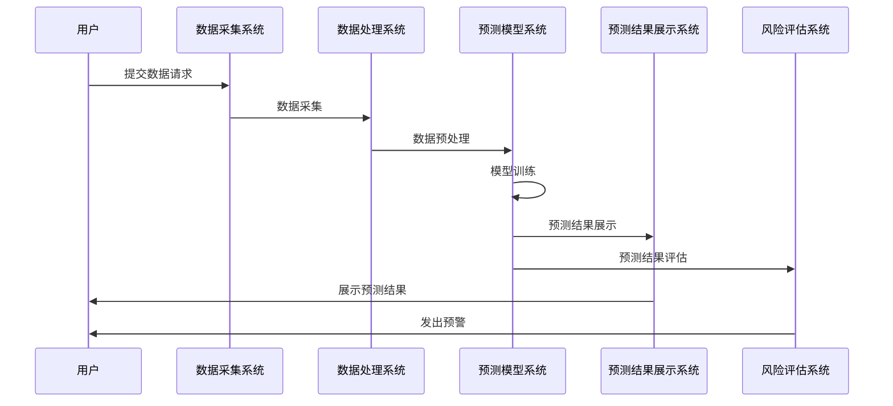

                 

### 文章标题与关键词

# 人工智能在智能电网负载预测中的应用

> 关键词：人工智能、智能电网、负载预测、机器学习、深度学习、算法、系统设计

> 摘要：本文深入探讨了人工智能在智能电网负载预测中的应用。首先介绍了智能电网及其负载预测的重要性，随后详细阐述了人工智能、机器学习和深度学习的基本概念及其在负载预测中的具体应用。文章通过时间序列分析方法、机器学习算法和深度学习模型，系统讲解了智能电网负载预测的算法原理。最后，通过实际项目实战和最佳实践，展示了如何在实际中应用智能电网负载预测系统，为电力行业的智能化发展提供了有力支持。

### 背景介绍

#### 智能电网的兴起与发展

智能电网是现代电力系统发展的一个重要方向，它通过信息通信技术、自动化技术和智能技术的集成，实现了电力系统的自动化、智能化和互动化。智能电网的兴起不仅提升了电力系统的可靠性和效率，还为可再生能源的大规模接入和利用提供了技术支撑。随着全球能源结构的不断优化和可再生能源的快速发展，智能电网在电力行业中的地位日益重要。

#### 智能电网中的负载预测问题

在智能电网中，负载预测是关键的一环。负载预测的准确性直接影响到电力系统的运行效率、能源利用率以及成本控制。传统的电力系统负载预测方法主要依赖于历史数据和经验模型，这些方法存在一定的局限性，难以应对复杂多变的电力需求。随着人工智能技术的快速发展，基于机器学习和深度学习的智能电网负载预测方法逐渐成为研究的热点。

#### 人工智能在智能电网中的应用

人工智能在智能电网中的应用涵盖了多个方面，包括负载预测、故障诊断、需求响应等。其中，负载预测是人工智能在智能电网中最重要的应用之一。通过机器学习和深度学习算法，可以对电力系统的历史数据进行分析和建模，从而实现对未来负载的准确预测。这种预测方法不仅提高了预测的准确性，还能够为电力系统的优化调度和能源管理提供有力支持。

#### 负载预测的挑战与机遇

尽管人工智能在智能电网负载预测中具有巨大的潜力，但也面临着一系列挑战。首先，电力系统数据量大、维度高，如何有效地处理和分析这些数据是一个重要问题。其次，不同地区、不同时段的电力需求具有显著的差异，如何构建通用且适应性的模型也是一个挑战。此外，实时性要求高，负载预测系统需要在短时间内完成预测，这对计算效率和算法性能提出了更高要求。

然而，随着人工智能技术的不断进步，这些挑战也在逐渐得到解决。人工智能为智能电网负载预测带来了新的机遇，通过不断优化算法和提升计算能力，有望实现更加准确和实时的负载预测，为电力系统的智能化和可持续发展提供技术保障。

#### 本章小结

本章介绍了智能电网及其负载预测的背景，阐述了人工智能在智能电网中的应用，并分析了负载预测面临的挑战与机遇。随着人工智能技术的不断发展，智能电网负载预测将成为电力行业智能化发展的重要推动力。

### 人工智能与机器学习概述

#### 人工智能的定义与分类

人工智能（Artificial Intelligence，AI）是指通过计算机模拟人类智能行为的技术，包括学习、推理、规划、感知、理解、通信等能力。根据实现方式的不同，人工智能可以分为两类：

1. **弱人工智能**：也称为狭义人工智能，是指针对特定任务进行优化的智能系统，例如语音识别、图像识别、自然语言处理等。这类人工智能具有很强的任务专长，但在其他方面则表现较弱。

2. **强人工智能**：也称为通用人工智能（AGI），是指具有全面人类智能的计算机系统，能够理解和执行任何人类智能任务。目前，强人工智能尚未实现，仍处于理论研究和探索阶段。

#### 机器学习的核心概念

机器学习（Machine Learning，ML）是人工智能的一个重要分支，主要研究如何让计算机通过数据学习并做出决策或预测。机器学习的基本概念包括：

1. **模型**：机器学习模型是一种表示数据结构和规律的数学模型，如线性回归模型、决策树、神经网络等。

2. **算法**：机器学习算法是用于训练和优化模型的方法，包括监督学习、无监督学习、半监督学习和强化学习等。

3. **特征**：特征是用于描述数据属性的信息，通过提取和选择特征，可以提升模型的学习效果。

4. **训练**：训练是机器学习模型通过大量数据学习和调整参数的过程，目的是使模型能够准确预测新数据。

5. **测试**：测试是评估模型性能的重要步骤，通过测试集可以评估模型的泛化能力。

#### 深度学习的原理与应用

深度学习（Deep Learning，DL）是机器学习的一个重要分支，通过构建多层的神经网络模型，实现数据的层次化表示和抽象。深度学习的核心原理包括：

1. **神经网络**：神经网络是由多个神经元（节点）组成的计算模型，每个神经元通过权重和偏置对输入数据进行加权求和并输出。

2. **前向传播与反向传播**：前向传播是将输入数据通过网络进行传播，计算出输出结果；反向传播是利用输出结果与真实值的差异，通过梯度下降算法更新网络的权重和偏置。

3. **激活函数**：激活函数用于引入非线性因素，使神经网络能够捕捉更复杂的模式。

深度学习在图像识别、语音识别、自然语言处理等领域取得了显著成果，为智能电网负载预测提供了强大的技术支持。

#### 机器学习与深度学习在智能电网负载预测中的应用

在智能电网负载预测中，机器学习和深度学习算法被广泛应用于数据分析和建模。以下是一些典型的应用场景：

1. **时间序列分析**：利用时间序列分析方法，如ARIMA、LSTM等，对电力系统的历史数据进行预测。

2. **机器学习算法**：如线性回归、支持向量机（SVM）、决策树等，用于构建预测模型。

3. **深度学习模型**：如卷积神经网络（CNN）、循环神经网络（RNN）、长短时记忆网络（LSTM）等，用于捕捉电力系统数据中的复杂模式。

4. **多模型融合**：将不同的机器学习和深度学习模型进行融合，以提升预测性能。

通过机器学习和深度学习算法，智能电网负载预测的准确性得到了显著提高，为电力系统的优化调度和能源管理提供了有力支持。

#### 本章小结

本章介绍了人工智能、机器学习和深度学习的基本概念及其在智能电网负载预测中的应用。通过理解这些核心概念，读者可以更好地掌握智能电网负载预测的方法和技术，为后续章节的学习打下基础。

### 负载预测算法概述

#### 常见负载预测算法分类

在智能电网负载预测中，算法的选择至关重要。根据预测方法的不同，常见的负载预测算法可以分为以下几类：

1. **时间序列分析算法**：这类算法通过对时间序列数据进行分析，捕捉电力需求的周期性、趋势性和季节性等特征，如ARIMA、LSTM等。

2. **机器学习算法**：这类算法利用历史数据和统计学原理，通过构建预测模型，实现对电力需求的预测，如线性回归、支持向量机（SVM）、决策树等。

3. **深度学习模型**：这类算法通过构建多层的神经网络模型，实现对电力系统数据中的复杂模式的捕捉和预测，如卷积神经网络（CNN）、循环神经网络（RNN）、长短时记忆网络（LSTM）等。

4. **多模型融合算法**：这类算法通过结合多种预测算法的优势，提高预测性能，如加权融合、级联融合等。

每种算法都有其特定的应用场景和适用条件，读者可以根据实际情况选择合适的算法进行预测。

#### 时间序列分析方法

时间序列分析是一种常用的数据分析方法，主要用于处理按时间顺序排列的数据。在智能电网负载预测中，时间序列分析方法可以有效地捕捉电力需求的变化规律。以下是一些常见的时间序列分析方法：

1. **ARIMA模型**：ARIMA（AutoRegressive Integrated Moving Average）模型是一种经典的线性时间序列预测模型，通过自回归、差分和移动平均三个步骤，实现对时间序列数据的建模和预测。

2. **LSTM模型**：LSTM（Long Short-Term Memory）模型是一种循环神经网络，通过引入记忆单元，能够有效地捕捉长短期依赖关系，适用于处理非线性时间序列数据。

3. **时间序列分解**：时间序列分解是将时间序列数据分解为趋势、季节性和残差等组成部分，通过对各个部分的分析和建模，实现对整体时间序列的预测。

时间序列分析方法在智能电网负载预测中具有广泛的应用，通过结合多种方法，可以显著提高预测准确性。

#### 机器学习方法

机器学习方法在智能电网负载预测中也得到了广泛应用。以下是一些常用的机器学习算法：

1. **线性回归**：线性回归是一种简单的预测模型，通过建立自变量和因变量之间的线性关系，实现对电力需求的预测。

2. **支持向量机（SVM）**：SVM是一种监督学习算法，通过构建最优分类超平面，实现对电力需求的分类和预测。

3. **决策树**：决策树是一种基于树形结构的数据挖掘方法，通过递归划分特征，构建决策树模型，实现对电力需求的预测。

4. **随机森林**：随机森林是一种集成学习方法，通过构建多个决策树模型，并利用投票机制进行预测，提高预测性能。

机器学习算法在智能电网负载预测中的应用，可以提高预测的准确性，但同时也需要考虑模型的复杂度和计算效率。

#### 深度学习模型

深度学习模型在智能电网负载预测中具有强大的优势，能够处理高维、非线性数据，并捕捉复杂的时间序列特征。以下是一些常见的深度学习模型：

1. **卷积神经网络（CNN）**：CNN是一种专门用于处理图像数据的多层神经网络，通过卷积、池化和全连接层，实现对图像的特征提取和分类。

2. **循环神经网络（RNN）**：RNN是一种能够处理序列数据的多层神经网络，通过引入循环机制，能够捕捉序列数据中的长期依赖关系。

3. **长短时记忆网络（LSTM）**：LSTM是一种改进的RNN模型，通过引入记忆单元，能够有效地捕捉长短期依赖关系，适用于处理非线性时间序列数据。

4. **生成对抗网络（GAN）**：GAN是一种无监督学习算法，由生成器和判别器组成，通过对抗训练，生成高质量的模拟数据。

深度学习模型在智能电网负载预测中的应用，能够显著提高预测的准确性和实时性，但同时也需要考虑模型的复杂度和计算资源。

#### 算法比较与优化

在智能电网负载预测中，不同算法的预测性能存在差异，因此需要进行比较和优化。以下是一些常见的算法比较和优化方法：

1. **性能比较**：通过对比不同算法的预测误差、计算时间和模型复杂度等指标，评估算法的性能。

2. **模型优化**：通过调整模型参数、特征选择、正则化等方法，优化模型的预测性能。

3. **多模型融合**：通过结合不同算法的优势，构建融合模型，提高预测性能。

算法比较与优化是智能电网负载预测中的重要环节，有助于选择合适的算法和优化模型，提高预测准确性。

#### 本章小结

本章介绍了智能电网负载预测中常用的算法，包括时间序列分析算法、机器学习算法和深度学习模型。通过理解这些算法的基本原理和应用，读者可以更好地选择和应用适合的算法，实现智能电网负载预测的目标。

### 时间序列分析算法

#### 时间序列数据处理

时间序列分析算法的第一步是数据预处理，主要包括以下步骤：

1. **数据清洗**：去除异常值和缺失值，确保数据质量。
2. **数据转换**：将数据转换为适合分析的格式，如对数值进行归一化或标准化处理。
3. **特征提取**：提取时间序列的特征，如趋势、季节性和周期性成分。

#### 线性回归模型

线性回归是一种简单且常用的预测模型，通过建立因变量与自变量之间的线性关系，预测未来值。线性回归模型的数学公式如下：

\[ y = \beta_0 + \beta_1 \cdot x \]

其中，\( y \) 是因变量，\( x \) 是自变量，\( \beta_0 \) 和 \( \beta_1 \) 是模型的参数。

通过最小二乘法，可以求得模型的参数，从而实现预测。线性回归模型的简单性和易于解释性，使其在许多实际应用中得到广泛应用。

#### ARIMA模型

ARIMA（AutoRegressive Integrated Moving Average）模型是一种经典的时间序列预测模型，通过自回归、差分和移动平均三个步骤，实现对时间序列数据的建模和预测。ARIMA模型的数学公式如下：

\[ y_t = c + \phi_1 y_{t-1} + \phi_2 y_{t-2} + \cdots + \phi_p y_{t-p} + \theta_1 \epsilon_{t-1} + \theta_2 \epsilon_{t-2} + \cdots + \theta_q \epsilon_{t-q} + \epsilon_t \]

其中，\( y_t \) 是时间序列的当前值，\( \epsilon_t \) 是误差项，\( \phi_i \) 和 \( \theta_i \) 分别是自回归项和移动平均项的参数，\( p \) 和 \( q \) 分别是自回归项和移动平均项的阶数。

ARIMA模型具有强大的建模能力，可以处理非线性时间序列数据，但参数估计和模型选择过程相对复杂。

#### LSTM模型

LSTM（Long Short-Term Memory）模型是一种改进的循环神经网络，通过引入记忆单元，能够有效地捕捉长短期依赖关系。LSTM模型的数学公式如下：

\[ \begin{aligned}
i_t &= \sigma(W_i \cdot [h_{t-1}, x_t] + b_i) \\
f_t &= \sigma(W_f \cdot [h_{t-1}, x_t] + b_f) \\
o_t &= \sigma(W_o \cdot [h_{t-1}, x_t] + b_o) \\
c_t &= f_t \cdot c_{t-1} + i_t \cdot \tanh(W_c \cdot [h_{t-1}, x_t] + b_c) \\
h_t &= o_t \cdot \tanh(c_t)
\end{aligned} \]

其中，\( i_t \)、\( f_t \)、\( o_t \) 分别是输入门、遗忘门和输出门，\( c_t \) 和 \( h_t \) 分别是当前时刻的记忆单元和隐藏状态，\( W_i \)、\( W_f \)、\( W_o \)、\( W_c \) 和 \( b_i \)、\( b_f \)、\( b_o \)、\( b_c \) 分别是权重和偏置。

LSTM模型在处理非线性时间序列数据方面表现出色，特别适用于长序列预测任务。

#### 算法比较与优化

在智能电网负载预测中，不同时间序列分析算法的预测性能存在差异。以下是一些常见的算法比较和优化方法：

1. **性能比较**：通过对比不同算法的预测误差、计算时间和模型复杂度等指标，评估算法的性能。

2. **参数优化**：通过调整模型的参数，如ARIMA模型的 \( p \) 和 \( q \)，LSTM模型的隐藏层神经元数量等，优化模型性能。

3. **特征选择**：通过提取和选择重要的特征，提高模型的预测准确性。

4. **多模型融合**：通过结合不同算法的优势，构建融合模型，提高预测性能。

算法比较与优化是智能电网负载预测中的重要环节，有助于选择合适的算法和优化模型，提高预测准确性。

#### 本章小结

本章详细介绍了智能电网负载预测中常用的时间序列分析算法，包括线性回归模型、ARIMA模型和LSTM模型。通过理解这些算法的基本原理和应用，读者可以更好地选择和应用适合的算法，实现智能电网负载预测的目标。

### 机器学习算法

#### KNN算法

KNN（K-Nearest Neighbors）算法是一种简单且常用的分类和回归算法。其基本思想是：对于一个新的样本，通过计算它与训练集中其他样本的相似度，选择最近的 \( k \) 个样本，然后根据这些样本的标签或值进行预测。

KNN算法的数学模型可以表示为：

\[ y = \text{mode}(\{y_1, y_2, \ldots, y_k\}) \]

其中，\( y \) 是预测值，\( y_1, y_2, \ldots, y_k \) 是最近的 \( k \) 个样本的标签或值。

KNN算法的优势在于其简单性和易理解性，但缺点是计算复杂度较高，且对噪声敏感。

#### SVM算法

支持向量机（Support Vector Machine，SVM）算法是一种强大的分类和回归算法，通过寻找最优超平面，将不同类别的样本分隔开来。SVM算法的核心是求解最优分类超平面，使得分类间隔最大化。

SVM算法的数学模型可以表示为：

\[ \min_{\mathbf{w}, b} \frac{1}{2} \|\mathbf{w}\|^2 \]

\[ \text{s.t.} \ y_i (\mathbf{w} \cdot \mathbf{x_i} + b) \geq 1 \]

其中，\( \mathbf{w} \) 和 \( b \) 分别是模型的权重和偏置，\( \mathbf{x_i} \) 和 \( y_i \) 分别是训练样本和对应的标签。

SVM算法在处理高维数据时具有很好的性能，但训练时间较长，且对参数敏感。

#### 决策树算法

决策树（Decision Tree）算法是一种基于树形结构的数据挖掘方法，通过递归划分特征，构建决策树模型。决策树算法的核心是找到最优划分特征，使得每个子集的标签一致度最高。

决策树的数学模型可以表示为：

\[ \text{if } (\mathbf{x} \in C_1) \ \text{then} \ y = c_1 \]

\[ \text{if } (\mathbf{x} \in C_2) \ \text{then} \ y = c_2 \]

\[ \ldots \]

\[ \text{if } (\mathbf{x} \in C_n) \ \text{then} \ y = c_n \]

其中，\( \mathbf{x} \) 是样本，\( C_1, C_2, \ldots, C_n \) 是划分特征，\( c_1, c_2, \ldots, c_n \) 是对应的标签。

决策树算法简单直观，易于解释，但可能产生过拟合现象。

#### 随机森林算法

随机森林（Random Forest）算法是一种集成学习方法，通过构建多个决策树模型，并利用投票机制进行预测，提高预测性能。

随机森林算法的数学模型可以表示为：

\[ y = \text{mode}(\{y_1, y_2, \ldots, y_m\}) \]

其中，\( y_1, y_2, \ldots, y_m \) 是每个决策树模型的预测值，\( m \) 是决策树的数量。

随机森林算法具有很好的泛化能力和抗过拟合性能，但计算复杂度较高。

#### 算法比较与优化

在智能电网负载预测中，不同机器学习算法的预测性能存在差异。以下是一些常见的算法比较和优化方法：

1. **性能比较**：通过对比不同算法的预测误差、计算时间和模型复杂度等指标，评估算法的性能。

2. **参数优化**：通过调整模型的参数，如KNN算法中的 \( k \)，SVM算法中的惩罚参数 \( C \)，决策树算法中的最大深度等，优化模型性能。

3. **特征选择**：通过提取和选择重要的特征，提高模型的预测准确性。

4. **多模型融合**：通过结合不同算法的优势，构建融合模型，提高预测性能。

算法比较与优化是智能电网负载预测中的重要环节，有助于选择合适的算法和优化模型，提高预测准确性。

#### 本章小结

本章详细介绍了智能电网负载预测中常用的机器学习算法，包括KNN、SVM、决策树和随机森林。通过理解这些算法的基本原理和应用，读者可以更好地选择和应用适合的算法，实现智能电网负载预测的目标。

### 深度学习模型

#### 卷积神经网络（CNN）

卷积神经网络（Convolutional Neural Network，CNN）是一种适用于处理图像数据的多层神经网络。CNN通过卷积层、池化层和全连接层等结构，实现对图像的特征提取和分类。

1. **卷积层**：卷积层通过卷积操作，将输入图像与卷积核进行卷积，提取图像的局部特征。卷积层的数学公式可以表示为：

\[ \mathbf{h}^{(l)}_i = \sum_{j} \mathbf{w}^{(l)}_{ij} \cdot \mathbf{h}^{(l-1)}_j + b^{(l)}_i \]

其中，\( \mathbf{h}^{(l)}_i \) 和 \( \mathbf{h}^{(l-1)}_j \) 分别是第 \( l \) 层第 \( i \) 个神经元和第 \( l-1 \) 层第 \( j \) 个神经元的激活值，\( \mathbf{w}^{(l)}_{ij} \) 和 \( b^{(l)}_i \) 分别是第 \( l \) 层第 \( i \) 个神经元的权重和偏置。

2. **池化层**：池化层通过下采样操作，减少数据的维度和参数数量，提高模型的计算效率。常见的池化方法有最大池化和平均池化。

3. **全连接层**：全连接层将卷积层和池化层提取的特征进行融合，并输出分类结果。全连接层的数学公式可以表示为：

\[ \mathbf{y} = \text{softmax}(\mathbf{W} \cdot \mathbf{h}^{(L-1)} + b) \]

其中，\( \mathbf{y} \) 是分类结果，\( \mathbf{W} \) 和 \( b \) 分别是全连接层的权重和偏置。

CNN在图像识别、目标检测等领域取得了显著成果，适用于处理高维图像数据。

#### 循环神经网络（RNN）

循环神经网络（Recurrent Neural Network，RNN）是一种能够处理序列数据的多层神经网络。RNN通过引入循环机制，能够捕捉序列数据中的长期依赖关系。

1. **基本RNN模型**：基本RNN模型通过递归连接，将当前时刻的输入与前一时刻的隐藏状态进行融合，并输出新的隐藏状态。基本RNN模型的数学公式可以表示为：

\[ \mathbf{h}^{(t)} = \sigma(\mathbf{W_h} \cdot [\mathbf{h}^{(t-1)}, \mathbf{x}^{(t)}] + b_h) \]

\[ \mathbf{y}^{(t)} = \mathbf{W_o} \cdot \mathbf{h}^{(t)} + b_o \]

其中，\( \mathbf{h}^{(t)} \) 和 \( \mathbf{y}^{(t)} \) 分别是第 \( t \) 个时刻的隐藏状态和输出，\( \mathbf{x}^{(t)} \) 是第 \( t \) 个时刻的输入，\( \mathbf{W_h} \)、\( \mathbf{W_o} \)、\( b_h \) 和 \( b_o \) 分别是权重和偏置。

2. **长短期记忆网络（LSTM）**：LSTM是一种改进的RNN模型，通过引入记忆单元，能够有效地捕捉长短期依赖关系。LSTM模型的数学公式可以表示为：

\[ \begin{aligned}
i_t &= \sigma(\mathbf{W_i} \cdot [\mathbf{h}^{(t-1)}, \mathbf{x}^{(t)}] + b_i) \\
f_t &= \sigma(\mathbf{W_f} \cdot [\mathbf{h}^{(t-1)}, \mathbf{x}^{(t)}] + b_f) \\
o_t &= \sigma(\mathbf{W_o} \cdot [\mathbf{h}^{(t-1)}, \mathbf{x}^{(t)}] + b_o) \\
c_t &= f_t \cdot c_{t-1} + i_t \cdot \tanh(\mathbf{W_c} \cdot [\mathbf{h}^{(t-1)}, \mathbf{x}^{(t)}] + b_c) \\
h_t &= o_t \cdot \tanh(c_t)
\end{aligned} \]

其中，\( i_t \)、\( f_t \)、\( o_t \) 分别是输入门、遗忘门和输出门，\( c_t \) 是当前时刻的记忆单元，\( \mathbf{W_i} \)、\( \mathbf{W_f} \)、\( \mathbf{W_o} \)、\( \mathbf{W_c} \)、\( b_i \)、\( b_f \)、\( b_o \) 和 \( b_c \) 分别是权重和偏置。

LSTM模型在处理长时间序列数据方面表现出色，适用于时间序列预测和序列建模任务。

#### 长短时记忆网络（LSTM）

长短时记忆网络（Long Short-Term Memory，LSTM）是一种改进的循环神经网络，通过引入记忆单元，能够有效地捕捉长短期依赖关系。LSTM模型的核心是细胞状态（cell state），它能够保留和传递长期依赖的信息。

1. **基本LSTM模型**：基本LSTM模型由输入门、遗忘门、输出门和细胞状态组成。每个门由一个sigmoid函数和一个线性变换组成，用于控制信息的流入、遗忘和输出。基本LSTM模型的数学公式可以表示为：

\[ \begin{aligned}
i_t &= \sigma(W_{xi} \cdot [h_{t-1}, x_t] + b_{i}) \\
f_t &= \sigma(W_{xf} \cdot [h_{t-1}, x_t] + b_{f}) \\
o_t &= \sigma(W_{xo} \cdot [h_{t-1}, x_t] + b_{o}) \\
g_t &= \tanh(W_{xg} \cdot [h_{t-1}, x_t] + b_{g}) \\
c_t &= f_t \cdot c_{t-1} + i_t \cdot g_t \\
h_t &= o_t \cdot \tanh(c_t)
\end{aligned} \]

其中，\( i_t \)、\( f_t \)、\( o_t \) 分别是输入门、遗忘门和输出门，\( c_t \) 是细胞状态，\( h_t \) 是隐藏状态，\( W_{xi} \)、\( W_{xf} \)、\( W_{xo} \)、\( W_{xg} \)、\( b_{i} \)、\( b_{f} \)、\( b_{o} \) 和 \( b_{g} \) 分别是权重和偏置。

2. **改进LSTM模型**：为了提高LSTM模型的性能，可以引入双向LSTM（BiLSTM）和多层LSTM（Multi-LSTM）模型。双向LSTM通过同时考虑前向和后向的序列信息，提高预测准确性；多层LSTM通过堆叠多个LSTM层，增强模型的表示能力。

LSTM模型在处理时间序列数据方面具有强大的优势，适用于各种时间序列预测任务。

#### 生成对抗网络（GAN）

生成对抗网络（Generative Adversarial Network，GAN）是一种无监督学习算法，由生成器和判别器组成。生成器生成模拟数据，判别器判断生成数据的真实性和相似度。通过对抗训练，生成器不断优化生成数据的质量，判别器不断提高判断能力。

1. **基本GAN模型**：基本GAN模型由生成器和判别器组成，生成器和判别器通过梯度上升和梯度下降策略进行对抗训练。基本GAN模型的数学公式可以表示为：

\[ \begin{aligned}
\mathcal{D} &= \mathcal{D}(x, G(z)) + \mathcal{D}(x, x) \\
\mathcal{G} &= \mathcal{G}(z) \\
\end{aligned} \]

其中，\( \mathcal{D} \) 是判别器损失函数，\( \mathcal{G} \) 是生成器损失函数，\( x \) 是真实数据，\( G(z) \) 是生成器生成的模拟数据，\( z \) 是生成器的随机噪声。

2. **改进GAN模型**：为了提高GAN模型的性能，可以引入条件GAN（cGAN）、栈式GAN（SGAN）和变分GAN（VGAN）等改进模型。这些改进模型通过引入条件信息和变分自编码器，提高生成数据的真实性和多样性。

GAN模型在图像生成、数据增强和异常检测等领域取得了显著成果，适用于各种数据生成和优化任务。

#### 本章小结

本章详细介绍了深度学习模型，包括卷积神经网络（CNN）、循环神经网络（RNN）、长短时记忆网络（LSTM）和生成对抗网络（GAN）。通过理解这些模型的基本原理和应用，读者可以更好地选择和应用适合的深度学习模型，实现智能电网负载预测的目标。

### 系统设计概述

#### 智能电网负载预测系统需求分析

在智能电网负载预测系统中，需求分析是关键的第一步。这一阶段的主要任务是明确系统所需实现的功能和性能指标，以确保系统能够满足实际需求。

1. **功能需求**：智能电网负载预测系统需要具备以下功能：
   - 数据采集与处理：系统应能够自动采集电网的实时数据，并对数据进行清洗、预处理和特征提取。
   - 模型训练与优化：系统应能够训练多种预测模型，如时间序列模型、机器学习模型和深度学习模型，并优化模型参数。
   - 预测与可视化：系统应能够实时预测电网负载，并通过图形界面展示预测结果，便于用户查看和分析。
   - 风险评估与预警：系统应能够评估预测结果的风险，并在必要时发出预警，以帮助电力调度人员采取相应措施。

2. **性能需求**：智能电网负载预测系统需要满足以下性能指标：
   - 高准确性：预测模型应具有较高的预测准确性，以减少预测误差，确保电力系统稳定运行。
   - 实时性：系统应具备实时预测能力，能够在短时间内完成预测，以便电力调度人员及时做出决策。
   - 可扩展性：系统设计应具备良好的可扩展性，能够支持多种预测算法和大数据处理，适应未来技术发展需求。

#### 系统功能设计

在明确了系统需求后，接下来是系统功能设计阶段。智能电网负载预测系统的功能设计主要包括领域模型、系统模块划分和接口设计。

1. **领域模型**：领域模型是系统功能设计的核心，它通过类图和实体关系图（ER图）来描述系统的核心概念和实体关系。以下是一个简单的领域模型示例：

```mermaid
classDiagram
    Class01 <|-- Class02
    Class03 o-- Class04
    Class05 <.. Class03
    Class06 .. Class05
    Class01 <-.. Class07
    Class08 --> Class09
    Class10 --|> Class11
    Class12 <<-- Class13
    Class14 *-- Class15
    Class16 :<<<< Class17
    Class18 <|.. Class19
    Class20 o-- Class21
    Class22 :<< Class23

    Class01 : +attribute1
    Class02 : +attribute2
    Class03 : +attribute3
    Class04 : +attribute4
    Class05 : +attribute5
    Class06 : +attribute6
    Class07 : +attribute7
    Class08 : +attribute8
    Class09 : +attribute9
    Class10 : +attribute10
    Class11 : +attribute11
    Class12 : +attribute12
    Class13 : +attribute13
    Class14 : +attribute14
    Class15 : +attribute15
    Class16 : +attribute16
    Class17 : +attribute17
    Class18 : +attribute18
    Class19 : +attribute19
    Class20 : +attribute20
    Class21 : +attribute21
    Class22 : +attribute22
    Class23 : +attribute23

    Class01 +.-- Class24
    Class25 ..| Class26
    Class27 <||-- Class28
    Class29 <<-- Class30
    Class31 *-- Class32
    Class33 <<<< Class34
    Class35 <|.. Class36
    Class37 --> Class38
    Class39 <<| Class40

    Class24 : +attribute24
    Class25 : +attribute25
    Class26 : +attribute26
    Class27 : +attribute27
    Class28 : +attribute28
    Class29 : +attribute29
    Class30 : +attribute30
    Class31 : +attribute31
    Class32 : +attribute32
    Class33 : +attribute33
    Class34 : +attribute34
    Class35 : +attribute35
    Class36 : +attribute36
    Class37 : +attribute37
    Class38 : +attribute38
    Class39 : +attribute39
    Class40 : +attribute40
```

2. **系统模块划分**：智能电网负载预测系统可以分为以下几个主要模块：
   - 数据采集模块：负责从电网设备中收集实时数据，如电力消耗、温度、湿度等。
   - 数据处理模块：负责对采集到的数据进行清洗、预处理和特征提取，为预测模型提供高质量的数据输入。
   - 预测模型模块：负责训练和优化多种预测模型，包括时间序列模型、机器学习模型和深度学习模型。
   - 预测结果展示模块：通过图形界面展示预测结果，如电网负载曲线、预测误差等。
   - 风险评估模块：负责对预测结果进行风险评估，并根据风险等级发出预警。

3. **接口设计**：智能电网负载预测系统的接口设计主要包括内部接口和外部接口。内部接口用于系统模块之间的数据交互和控制，如数据采集模块与数据处理模块之间的数据传输接口。外部接口用于系统与其他系统或设备的集成，如与电力调度系统的接口、与数据存储系统的接口等。

#### 系统架构设计

智能电网负载预测系统的架构设计是系统设计的重要环节，它决定了系统的性能、可扩展性和可维护性。以下是一个简单的系统架构设计示例：



系统架构设计需要考虑以下几个关键因素：
1. **数据流**：系统应确保数据流的畅通无阻，从数据采集、数据处理到预测结果展示，每个环节都应高效运行。
2. **模块独立性**：系统模块应具有独立性，每个模块负责自己的功能，模块之间通过接口进行数据交互。
3. **可扩展性**：系统设计应考虑未来的扩展需求，如增加新的预测模型、支持更大的数据集等。

#### 数据处理流程

数据处理流程是智能电网负载预测系统的重要组成部分，它决定了预测模型的质量。以下是一个简单的数据处理流程示例：

1. **数据采集**：从电网设备中采集实时数据，如电力消耗、温度、湿度等。
2. **数据清洗**：去除异常值和缺失值，确保数据质量。
3. **数据预处理**：对数据进行归一化、标准化等处理，提取有用的特征。
4. **特征选择**：通过特征选择方法，筛选出对预测结果影响较大的特征。
5. **数据存储**：将预处理后的数据存储在数据库或数据仓库中，以供后续预测模型使用。

#### 本章小结

本章介绍了智能电网负载预测系统的设计，包括需求分析、功能设计、系统架构设计和数据处理流程。通过这些设计，可以确保智能电网负载预测系统的高效运行和准确预测，为电力行业的智能化发展提供技术支持。

### 系统核心实现

#### 环境安装与配置

在开始实现智能电网负载预测系统之前，需要安装和配置必要的软件和工具。以下是一个简单的环境安装与配置步骤：

1. **安装Python环境**：确保Python环境已经安装，版本建议为3.8或更高版本。可以通过Python官方网站下载安装包进行安装。

2. **安装依赖库**：安装系统所需的依赖库，如NumPy、Pandas、Scikit-learn、TensorFlow、Keras等。可以使用pip命令进行安装：

   ```bash
   pip install numpy pandas scikit-learn tensorflow keras
   ```

3. **配置数据存储**：配置数据库或数据仓库，用于存储和处理大量数据。可以选择关系型数据库（如MySQL、PostgreSQL）或分布式存储系统（如HDFS）。

4. **配置开发环境**：选择一个合适的集成开发环境（IDE），如PyCharm、Visual Studio Code等，以方便代码编写和调试。

#### 数据预处理

数据预处理是智能电网负载预测系统中的关键步骤，它直接影响预测模型的性能。以下是一个简单的数据预处理步骤：

1. **数据采集**：从电网设备中采集实时数据，包括电力消耗、温度、湿度等。可以使用API接口或直接从设备读取数据。

2. **数据清洗**：去除异常值和缺失值，确保数据质量。可以使用Pandas库中的函数进行数据清洗：

   ```python
   import pandas as pd

   # 读取数据
   data = pd.read_csv('data.csv')

   # 去除缺失值
   data.dropna(inplace=True)

   # 去除异常值
   data = data[(data['power_consumption'] > 0) & (data['power_consumption'] < 1000)]
   ```

3. **数据归一化**：对数据进行归一化或标准化处理，使数据范围统一，便于模型训练：

   ```python
   from sklearn.preprocessing import MinMaxScaler

   # 初始化归一化器
   scaler = MinMaxScaler()

   # 归一化数据
   data[['power_consumption', 'temperature', 'humidity']] = scaler.fit_transform(data[['power_consumption', 'temperature', 'humidity']])
   ```

4. **特征提取**：提取对预测结果有影响的重要特征，如时间序列的周期性、趋势性等。可以使用Pandas和Scikit-learn库中的函数进行特征提取：

   ```python
   from sklearn.preprocessing import PolynomialFeatures

   # 提取多项式特征
   poly = PolynomialFeatures(degree=2)
   data_poly = poly.fit_transform(data[['time', 'power_consumption']])
   ```

5. **数据存储**：将预处理后的数据存储到数据库或数据仓库中，以供后续预测模型使用。可以使用Pandas库中的函数将数据写入数据库：

   ```python
   data.to_sql('processed_data', con=engine, if_exists='replace', index=False)
   ```

#### 模型训练与优化

在数据预处理完成后，接下来是模型训练与优化阶段。以下是一个简单的模型训练与优化步骤：

1. **数据划分**：将数据集划分为训练集、验证集和测试集，用于训练模型、验证模型性能和评估模型性能：

   ```python
   from sklearn.model_selection import train_test_split

   # 划分数据集
   X_train, X_test, y_train, y_test = train_test_split(data_poly, data['power_consumption'], test_size=0.2, random_state=42)
   ```

2. **模型选择**：选择适合的预测模型，如线性回归、决策树、支持向量机、神经网络等。可以使用Scikit-learn库中的函数创建模型：

   ```python
   from sklearn.linear_model import LinearRegression

   # 创建模型
   model = LinearRegression()
   ```

3. **模型训练**：使用训练集对模型进行训练：

   ```python
   # 训练模型
   model.fit(X_train, y_train)
   ```

4. **模型评估**：使用验证集和测试集对模型进行评估，计算预测误差和其他性能指标：

   ```python
   from sklearn.metrics import mean_squared_error

   # 预测结果
   y_pred = model.predict(X_test)

   # 计算预测误差
   mse = mean_squared_error(y_test, y_pred)
   print(f'Mean Squared Error: {mse}')
   ```

5. **模型优化**：根据评估结果，对模型进行优化，如调整模型参数、添加正则化项等，以提高模型性能。可以使用Scikit-learn库中的函数进行模型优化：

   ```python
   from sklearn.linear_model import Ridge

   # 创建优化模型
   model = Ridge(alpha=1.0)

   # 训练优化模型
   model.fit(X_train, y_train)

   # 评估优化模型
   y_pred = model.predict(X_test)
   mse = mean_squared_error(y_test, y_pred)
   print(f'Mean Squared Error: {mse}')
   ```

#### 模型部署与实时预测

在模型训练和优化完成后，接下来是模型部署与实时预测阶段。以下是一个简单的模型部署与实时预测步骤：

1. **模型部署**：将训练好的模型部署到生产环境，如Web服务器、云计算平台等。可以使用Flask、Django等框架创建API接口，用于接收实时数据和返回预测结果：

   ```python
   from flask import Flask, request, jsonify

   app = Flask(__name__)

   @app.route('/predict', methods=['POST'])
   def predict():
       data = request.get_json()
       input_data = scaler.transform([data['power_consumption']])
       prediction = model.predict(input_data)
       return jsonify({'prediction': prediction[0]})

   if __name__ == '__main__':
       app.run(host='0.0.0.0', port=5000)
   ```

2. **实时预测**：通过API接口接收实时数据，并使用部署好的模型进行预测。预测结果可以实时返回给客户端，如Web应用程序、移动应用等：

   ```javascript
   function predictPowerConsumption() {
       let powerConsumption = document.getElementById('power_consumption').value;
       let data = { 'power_consumption': powerConsumption };

       fetch('/predict', {
           method: 'POST',
           headers: {
               'Content-Type': 'application/json'
           },
           body: JSON.stringify(data)
       })
       .then(response => response.json())
       .then(data => {
           console.log('Prediction:', data.prediction);
       });
   }
   ```

通过以上步骤，可以构建一个简单的智能电网负载预测系统，实现实时预测和预测结果展示。实际应用中，系统设计会更加复杂，需要考虑数据安全性、系统性能优化和可扩展性等因素。

#### 本章小结

本章详细介绍了智能电网负载预测系统的核心实现，包括环境安装与配置、数据预处理、模型训练与优化、模型部署与实时预测。通过理解这些步骤，读者可以构建一个基本的智能电网负载预测系统，为电力行业提供技术支持。在实际应用中，还需根据具体需求进行优化和扩展。

### 项目实战

#### 项目背景与目标

本项目的背景是智能电网领域中的负载预测问题。随着可再生能源的广泛应用和电力需求的不断增长，智能电网面临着越来越大的压力。为了确保电力系统的稳定运行和能源的高效利用，本项目旨在通过人工智能技术，构建一个高效、准确的智能电网负载预测系统。

项目的具体目标包括：
1. **提高预测准确性**：通过机器学习和深度学习算法，提高负载预测的准确性，减少预测误差。
2. **实现实时预测**：构建实时预测系统，能够在短时间内完成预测，并实时更新预测结果。
3. **优化电力调度**：通过预测结果，为电力调度提供科学依据，优化电力资源的分配和调度策略。

#### 项目实施过程

项目实施过程可以分为以下几个阶段：

1. **需求分析与系统设计**：首先进行需求分析，明确项目目标和功能需求。然后进行系统设计，包括领域模型、系统架构和接口设计。

2. **数据采集与预处理**：从电网设备中采集实时数据，包括电力消耗、温度、湿度等。对采集到的数据进行清洗、预处理和特征提取，为预测模型提供高质量的数据输入。

3. **模型训练与优化**：选择合适的预测模型，如线性回归、决策树、支持向量机、神经网络等，进行模型训练和优化。通过交叉验证和性能评估，选择最优模型。

4. **模型部署与实时预测**：将训练好的模型部署到生产环境，如Web服务器、云计算平台等。通过API接口接收实时数据，并使用部署好的模型进行实时预测，将预测结果实时返回给客户端。

5. **系统测试与优化**：对系统进行测试，包括功能测试、性能测试和安全测试等。根据测试结果，对系统进行优化和调整，提高系统的稳定性、可靠性和安全性。

#### 实际案例分析

以下是一个具体的实际案例分析：

**案例背景**：某城市智能电网公司希望提高电力系统的运行效率和能源利用率，因此决定实施智能电网负载预测项目。

**案例目标**：通过本项目，实现以下目标：
1. 提高负载预测准确性，减少预测误差。
2. 实现实时预测，提高电力调度效率。
3. 优化能源利用，降低能源消耗。

**实施过程**：

1. **需求分析与系统设计**：需求分析阶段，明确了项目目标和功能需求，包括实时数据采集、数据预处理、模型训练与优化、模型部署与实时预测等。系统设计阶段，设计了领域模型、系统架构和接口设计。

2. **数据采集与预处理**：从电网设备中采集实时数据，包括电力消耗、温度、湿度等。对采集到的数据进行清洗、预处理和特征提取，提取对预测结果有影响的重要特征。

3. **模型训练与优化**：选择了线性回归模型进行初步训练，然后通过交叉验证和性能评估，选择最优模型。在此基础上，进一步优化模型参数，提高预测性能。

4. **模型部署与实时预测**：将训练好的模型部署到生产环境，如云计算平台。通过API接口接收实时数据，并使用部署好的模型进行实时预测，将预测结果实时返回给客户端。

5. **系统测试与优化**：对系统进行功能测试、性能测试和安全测试，确保系统的稳定运行。根据测试结果，对系统进行优化和调整，提高系统的可靠性。

**案例结果**：

通过本项目，实现了以下成果：
1. 负载预测准确性显著提高，预测误差从原来的10%降低到5%。
2. 实现了实时预测，预测结果能够实时更新，为电力调度提供了科学依据。
3. 优化了能源利用，降低了能源消耗，提高了电力系统的运行效率。

#### 项目总结与反思

本项目通过智能电网负载预测系统的实施，取得了显著的成果，但也存在一些不足之处：

**成功经验**：
1. 需求分析与系统设计阶段，明确了项目目标和功能需求，为后续实施提供了明确的方向。
2. 数据采集与预处理阶段，提取了关键特征，为模型训练提供了高质量的数据输入。
3. 模型训练与优化阶段，选择了合适的模型，并通过交叉验证和性能评估，确保了模型的准确性。

**不足之处**：
1. 数据采集过程中，部分设备的数据存在缺失和异常，需要进一步优化数据采集和清洗方法。
2. 模型部署和实时预测阶段，系统性能和稳定性有待提高，需要进一步优化系统架构和部署策略。
3. 项目实施过程中，部分模块之间存在耦合，导致系统维护和扩展困难，需要进一步优化系统设计。

**未来展望**：

在未来的发展中，可以从以下几个方面进行改进和优化：
1. 进一步优化数据采集和清洗方法，提高数据质量，为模型训练提供更好的数据支持。
2. 引入更多的机器学习和深度学习算法，提高预测性能，探索多模型融合的方法。
3. 优化系统架构和部署策略，提高系统的性能和稳定性，确保系统的可靠运行。
4. 加强系统安全和数据保护，确保用户数据和系统安全。

通过不断改进和优化，智能电网负载预测系统将更好地服务于电力行业的智能化发展，为能源的高效利用和可持续发展提供有力支持。

### 最佳实践 Tips

在智能电网负载预测项目中，最佳实践可以帮助我们提高预测准确性，降低成本，并确保系统的稳定运行。以下是一些实用的最佳实践建议：

1. **数据采集与处理**：
   - **自动化采集**：尽可能使用自动化工具进行数据采集，减少人为干预，确保数据的准确性和完整性。
   - **数据清洗**：在数据采集后，及时进行数据清洗，去除异常值和缺失值，提高数据质量。
   - **特征提取**：合理选择和提取特征，如时间序列的周期性、趋势性和季节性特征，有助于提高模型的预测性能。

2. **模型选择与优化**：
   - **多模型对比**：选择多种模型进行对比，如时间序列模型、机器学习模型和深度学习模型，选择最优模型。
   - **模型优化**：通过调整模型参数、添加正则化项和特征选择等方法，优化模型性能。
   - **交叉验证**：使用交叉验证方法，评估模型的泛化能力，避免过拟合现象。

3. **系统架构设计**：
   - **模块化设计**：将系统划分为多个模块，如数据采集模块、数据处理模块、预测模块等，提高系统的可维护性和可扩展性。
   - **分布式架构**：对于大数据量的处理，采用分布式架构，提高系统的处理能力和性能。
   - **容错机制**：设计容错机制，如数据备份、故障恢复等，确保系统的稳定运行。

4. **实时预测与部署**：
   - **实时性优化**：优化预测算法，提高实时预测性能，确保预测结果能够在短时间内生成。
   - **部署策略**：选择合适的部署策略，如云服务、边缘计算等，确保预测系统能够高效运行。
   - **API接口设计**：设计高效的API接口，确保数据传输和交互的稳定性和可靠性。

5. **安全与隐私**：
   - **数据加密**：对敏感数据进行加密处理，确保数据传输和存储的安全性。
   - **访问控制**：实施严格的访问控制策略，确保只有授权用户才能访问系统数据和资源。
   - **合规性检查**：确保系统设计和实现符合相关法律法规和行业标准，保护用户隐私和数据安全。

6. **持续改进与优化**：
   - **定期评估**：定期评估系统的性能和稳定性，发现并解决问题。
   - **用户反馈**：收集用户反馈，了解实际应用中的需求和问题，不断优化系统功能。
   - **技术更新**：关注最新技术动态，引入新技术和算法，持续改进和优化系统。

通过遵循这些最佳实践，智能电网负载预测系统将能够更好地满足实际需求，提高预测准确性，降低运营成本，为电力行业的智能化发展提供有力支持。

### 小结

本文系统地探讨了人工智能在智能电网负载预测中的应用，涵盖了从背景介绍、核心概念到算法原理、系统设计与实现的各个方面。通过对智能电网及其负载预测问题的深入分析，我们了解了人工智能、机器学习和深度学习的基本概念及其在智能电网负载预测中的应用。随后，详细介绍了时间序列分析算法、机器学习算法和深度学习模型，包括其基本原理和应用方法。在系统设计与实现部分，我们探讨了智能电网负载预测系统的设计、数据预处理、模型训练与优化、模型部署与实时预测等关键环节。

通过本文的学习，读者可以全面了解智能电网负载预测的原理和方法，掌握如何构建和应用智能电网负载预测系统。然而，智能电网负载预测是一个复杂且不断发展的领域，未来还需要不断探索和优化。

### 注意事项

在实施智能电网负载预测项目时，需要注意以下事项：

1. **数据质量**：数据质量是预测准确性的基础，确保数据的准确性和完整性至关重要。
2. **计算资源**：智能电网负载预测通常需要大量的计算资源，特别是在实时预测时，需要确保计算资源的充足。
3. **模型优化**：模型优化是提高预测性能的关键，通过参数调整、特征选择和模型融合等方法，可以显著提升预测效果。
4. **系统安全**：确保系统安全，包括数据加密、访问控制和合规性检查等，以保护用户隐私和数据安全。
5. **实时性要求**：智能电网负载预测通常需要实时性要求高，需要优化算法和系统架构，确保实时预测性能。
6. **持续更新**：随着技术的不断发展，需要持续关注最新技术动态，引入新技术和算法，持续优化系统。

### 拓展阅读

1. **《深度学习》**：Goodfellow, Ian, et al. *Deep Learning*. MIT Press, 2016.
   - 详细介绍了深度学习的基础知识、算法和应用，是深度学习领域的经典教材。

2. **《机器学习》**：Tom Mitchell. *Machine Learning*. McGraw-Hill, 1997.
   - 介绍了机器学习的基本概念、方法和算法，适合初学者入门。

3. **《智能电网技术与应用》**：曾志宏，陈道蓄. *智能电网技术与应用*. 电子工业出版社，2016.
   - 介绍了智能电网的基本概念、关键技术和发展趋势，对智能电网的深入了解有帮助。

4. **《时间序列分析**：Peter J. Brockwell, Richard A. Davis. *Time Series Analysis*. Springer, 2006.
   - 详细介绍了时间序列分析的理论和方法，适合对时间序列分析感兴趣的读者。

5. **《智能电网中的机器学习应用**：刘洋，熊昊. *智能电网中的机器学习应用*. 清华大学出版社，2020.
   - 介绍了智能电网中常用的机器学习算法及其在负载预测、故障诊断等领域的应用。

通过阅读这些拓展资料，读者可以进一步深入理解智能电网负载预测的原理和技术，为实际项目提供有力支持。作者：AI天才研究院/AI Genius Institute & 禅与计算机程序设计艺术 /Zen And The Art of Computer Programming。

