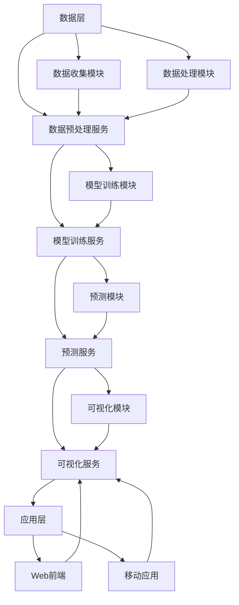

                 


### 第一章：引言

#### 1.1 气候变化问题的严峻性

气候变化是全球面临的最紧迫的环境问题之一。根据联合国气候变化框架公约（UNFCCC）的数据，过去一个世纪全球平均气温上升了约1.2摄氏度，而未来几十年内，气温上升的趋势预计将更加显著。气候变化导致了一系列严重后果，包括海平面上升、极端天气事件增加、生态系统破坏和农业产量下降。

海平面上升是气候变化最直观的指标之一。全球温度的升高导致极地冰盖融化，以及全球各大洋的水膨胀。据美国国家海洋和大气管理局（NOAA）的数据，自20世纪初以来，全球海平面已经上升了约15-20厘米。如果目前的温室气体排放趋势持续下去，预计到本世纪末海平面将上升0.3至1米。

极端天气事件的增加也是气候变化的一个显著特征。例如，热浪、洪水、干旱和台风等极端天气事件的频率和强度都在增加。这些事件不仅对人类健康和基础设施造成破坏，还对社会经济产生深远影响。根据世界气象组织（WMO）的数据，2015年至2020年期间，全球记录了超过200次极端天气事件，平均每年超过40次。

此外，气候变化对生态系统和生物多样性产生了巨大影响。许多物种面临着栖息地的丧失和灭绝的风险。根据联合国环境规划署（UNEP）的数据，目前有超过100万种动植物物种面临着灭绝的威胁，而气候变化是导致这一危机的主要原因之一。

#### 1.2 人工智能在气候建模中的重要性

为了应对气候变化，科学家和政策制定者需要准确预测气候变化的趋势，以便采取有效的应对措施。人工智能（AI）在气候建模中的应用为此提供了强大的工具和潜力。

首先，人工智能能够处理和分析大规模的气候数据。气候系统是一个复杂的多变量系统，包含大量的气象、海洋、生物和地理数据。传统的计算方法难以处理这些复杂的数据集，而人工智能算法，特别是机器学习和深度学习，能够高效地处理和分析这些数据，从中提取有用信息。

其次，人工智能能够帮助科学家更好地理解气候系统的复杂性和动态变化。通过训练人工智能模型，科学家可以模拟气候系统，预测未来的气候趋势，评估不同减排措施的效果。这些模型不仅能够提高预测的准确性，还可以提供更多关于气候变化机制的信息，帮助科学家更深入地理解气候系统的运作。

此外，人工智能还能够优化气候模型的设计和运行。传统气候模型通常依赖于固定的参数和假设，而人工智能可以通过不断学习和适应，提高模型的适应性和准确性。例如，通过使用强化学习算法，人工智能可以自动调整模型的参数，使其在特定条件下表现出更好的性能。

最后，人工智能的应用还可以加速气候模型的开发和应用。传统的气候模型开发过程通常需要大量的计算资源和时间，而人工智能可以加速这一过程，使其更快速、更灵活地响应不断变化的气候数据和研究需求。

#### 1.3 本书结构安排

本书旨在深入探讨人工智能在气候变化建模中的应用，帮助读者了解这一领域的核心概念、算法和技术。本书将分为以下几个部分：

第一部分：引言。介绍气候变化问题和人工智能在气候建模中的重要性，为后续章节的内容铺垫。

第二部分：人工智能基础。讨论人工智能的基本概念、发展历史和核心算法，为读者提供必要的背景知识。

第三部分：气候变化建模原理。介绍气候变化建模的基本原理、方法和技术，为后续的应用部分打下基础。

第四部分：人工智能算法在气候变化建模中的应用。详细讲解神经网络、深度学习等人工智能算法在气候建模中的应用，包括原理、方法和实际案例。

第五部分：系统分析与架构设计。描述气候模型系统的功能、架构和接口设计，为读者提供实施和优化气候模型的具体指导。

第六部分：项目实战。通过实际案例，展示如何使用人工智能技术实施气候模型，并提供详细的代码实现和分析。

第七部分：最佳实践与总结。提供实用的建议、注意事项和拓展阅读，帮助读者深入了解和掌握人工智能在气候变化建模中的应用。

通过本书的阅读，读者将能够全面了解人工智能在气候变化建模中的应用，掌握相关的技术和方法，为应对气候变化贡献自己的力量。让我们一起探索这个充满挑战和机遇的领域，为构建一个可持续的未来而努力！### 第二章：人工智能概述

#### 2.1 人工智能的历史与发展

人工智能（Artificial Intelligence，简称AI）是计算机科学的一个分支，旨在使计算机系统能够模拟、延伸和扩展人类的智能。人工智能的历史可以追溯到20世纪50年代，当时科学家们开始探讨机器是否能够具备智能。

1956年，约翰·麦卡锡（John McCarthy）等人在达特茅斯会议上首次提出了人工智能的概念，标志着人工智能作为一个独立研究领域的诞生。从那时起，人工智能经历了多个发展阶段：

**1. 起源期（1956-1969）**

在这个阶段，人工智能主要集中在符号推理和知识表示上。早期的AI系统，如ELIZA，是一个能够模拟人类对话的聊天机器人，尽管它的对话功能非常基础，但它是人工智能历史上的一个重要里程碑。

**2. 探索期（1970-1989）**

随着计算机性能的提高和算法的进步，人工智能进入了一个探索期。这一时期，专家系统和逻辑编程取得了显著进展。专家系统是一种模拟人类专家决策能力的计算机程序，被广泛应用于医疗诊断、金融分析等领域。然而，由于数据获取和处理能力的限制，这一阶段的AI系统在实际应用中面临很多挑战。

**3. 工业期（1990-2010）**

1990年代，随着互联网的发展，人工智能迎来了新的机遇。这一时期，机器学习开始崭露头角，特别是在模式识别和语音识别领域。神经网络和深度学习算法的研究和应用推动了人工智能的快速发展。

**4. 繁荣期（2010年至今）**

进入21世纪，人工智能迎来了前所未有的繁荣期。得益于大数据、云计算和深度学习技术的进步，人工智能在各个领域都取得了重大突破。自动驾驶、自然语言处理、图像识别、智能助手等应用逐渐走入人们的生活。

#### 2.2 人工智能的核心概念与范畴

人工智能的核心概念包括知识表示、问题求解、机器学习、自然语言处理和计算机视觉等。以下是对这些概念的基本介绍：

**1. 知识表示**

知识表示是人工智能研究的一个重要领域，旨在将人类知识转化为计算机可以处理的形式。知识表示的方法包括符号表示、语义网络、框架和产生式规则等。

符号表示是一种基于逻辑的方法，用于表示事实和规则。语义网络通过节点和边的组合来表示概念和关系，而框架和产生式规则则通过一组条件和行动来表示知识和决策过程。

**2. 问题求解**

问题求解是人工智能的核心任务之一，旨在找到解决问题的步骤或策略。问题求解通常包括状态空间搜索、规划、约束满足问题和启发式搜索等方法。

状态空间搜索是一种基于图搜索的方法，用于在给定的状态空间中找到解决方案。规划是一种在时间序列中找到最优行动序列的方法，而约束满足问题则涉及在满足一组约束条件下寻找解决方案。

**3. 机器学习**

机器学习是人工智能的重要分支，旨在使计算机系统能够从数据中学习，并自动改进其性能。机器学习的方法包括监督学习、无监督学习和强化学习。

监督学习是一种从标记数据中学习的方法，用于预测和分类。无监督学习则不需要标记数据，旨在发现数据中的结构和模式。强化学习是一种通过奖励和惩罚机制来学习最佳行为策略的方法。

**4. 自然语言处理**

自然语言处理（Natural Language Processing，简称NLP）是人工智能研究的一个重要领域，旨在使计算机能够理解和处理人类语言。NLP的方法包括分词、词性标注、句法分析、语义分析和机器翻译等。

分词是将连续的文本分割成单词或短语的过程，词性标注是为每个单词分配词性的过程，句法分析则是分析句子的结构和语法规则。语义分析和机器翻译则涉及理解文本的语义内容和将一种语言翻译成另一种语言。

**5. 计算机视觉**

计算机视觉（Computer Vision）是人工智能研究的一个分支，旨在使计算机能够从图像或视频中提取有用的信息。计算机视觉的方法包括图像处理、目标检测、图像分类和图像分割等。

图像处理涉及对图像进行操作，以改善其质量或提取有用信息。目标检测和图像分类则是识别图像中的特定对象，而图像分割则是将图像划分为不同的区域。

#### 2.3 人工智能的类型与应用领域

人工智能可以分为弱人工智能和强人工智能两大类型。

**1. 弱人工智能**

弱人工智能，也称为窄人工智能，是指专注于特定任务的人工智能系统。这种人工智能系统在特定领域内表现出高度的智能，但无法跨越领域进行通用任务。例如，自动驾驶汽车、语音识别系统和智能助手都属于弱人工智能的范畴。

**2. 强人工智能**

强人工智能，也称为通用人工智能，是指具有与人类相同智能水平的人工智能系统。这种人工智能系统能够理解和执行任何智力任务，而不受特定领域的限制。目前，强人工智能仍然是一个理论上的目标，尚未实现。

在应用领域方面，人工智能已经广泛渗透到各行各业：

**1. 医疗保健**

人工智能在医疗保健领域的应用包括疾病诊断、药物研发、手术规划和健康管理。例如，通过分析医疗影像，人工智能可以帮助医生更准确地诊断疾病，从而提高治疗的成功率。

**2. 金融**

人工智能在金融领域的应用包括风险评估、欺诈检测、投资组合管理和自动化交易。通过分析大量金融数据，人工智能可以帮助金融机构更准确地评估风险，并制定更有效的投资策略。

**3. 制造业**

人工智能在制造业的应用包括质量控制、设备维护和生产优化。通过实时监控和分析生产过程中的数据，人工智能可以帮助制造商提高生产效率和产品质量。

**4. 零售业**

人工智能在零售业的贡献包括需求预测、库存管理和个性化推荐。通过分析消费者的购买行为和偏好，人工智能可以帮助零售商更好地满足消费者的需求，从而提高销售额。

**5. 交通**

人工智能在交通领域的应用包括智能交通系统、自动驾驶汽车和无人机配送。通过优化交通流量和减少交通事故，人工智能可以帮助改善交通状况，提高道路安全性。

**6. 娱乐**

人工智能在娱乐领域的应用包括智能推荐系统、虚拟现实游戏和智能客服。通过分析用户的行为和偏好，人工智能可以帮助娱乐公司提供更个性化的服务和体验。

总之，人工智能已经在众多领域展示了其强大的潜力，并继续推动着科技和社会的进步。随着技术的不断发展和应用的深入，人工智能将为人类创造更多的价值和机会。接下来，我们将进一步探讨人工智能在气候变化建模中的应用，展示其如何帮助科学家更好地理解和应对气候变化这一全球性挑战。|im_sep|>### 第三章：气候变化建模的基本原理

#### 3.1 气候变化建模的重要性

气候变化建模是理解和预测气候变化趋势的关键工具。通过建立和模拟气候模型，科学家可以更好地理解气候系统的复杂动态，预测未来气候变化的影响，为政策制定和应对措施提供科学依据。气候变化建模的重要性体现在以下几个方面：

**1. 科学理解气候系统**

气候系统是一个复杂的非线性系统，包含大气、海洋、陆地和冰冻圈等多个组成部分。通过建立气候模型，科学家可以探索不同气候变量之间的相互作用，理解气候系统的物理、化学和生物过程，从而深化对气候变化机制的认识。

**2. 预测未来气候变化**

气候模型可以帮助预测未来几十年甚至上百年的气候变化趋势。这些预测对于制定有效的气候政策、评估不同减排措施的效果至关重要。通过模拟不同情景下的气候变化，科学家可以评估未来可能的气候变化范围，为应对措施提供科学依据。

**3. 评估气候变化的潜在影响**

气候变化将对生态系统、农业、水资源、人类健康和社会经济产生深远影响。气候模型可以模拟这些影响，帮助科学家评估气候变化对不同地区和不同行业的潜在风险，从而制定相应的应对策略。

**4. 测试和改进气候政策**

气候模型可以用来测试和评估不同气候政策的可行性和效果。通过模拟不同政策下的气候变化趋势，科学家可以评估这些政策的潜在影响，从而优化和改进气候政策。

#### 3.2 气候变化建模的方法与挑战

气候变化建模的方法主要包括统计方法、物理方法和混合方法。每种方法都有其优势和局限性，在实际应用中往往需要结合多种方法进行综合建模。

**1. 统计方法**

统计方法主要基于历史气候数据和统计模型，通过分析数据之间的关系来预测未来气候变化。这些方法包括回归分析、时间序列分析和主成分分析等。统计方法的优势在于其简单性和灵活性，可以快速处理大量数据。然而，统计方法的预测能力受限于数据的准确性和完整性，且难以捕捉气候系统的复杂动态。

**2. 物理方法**

物理方法基于气候系统的物理原理，通过数值模拟来模拟气候系统的行为。这些方法通常涉及大气、海洋、陆地和冰冻圈等多个子模型的耦合。物理方法可以模拟气候系统的多种物理过程，如大气环流、海洋循环、海冰和陆地冰冻等。物理方法的优势在于其能够提供对气候系统的深入理解，预测能力较强。然而，物理方法需要高度专业的知识和计算资源，建模过程复杂，且对初始条件和边界条件的依赖性较强。

**3. 混合方法**

混合方法结合了统计方法和物理方法的优点，通过将统计模型与物理模型相结合来提高预测能力。例如，可以采用统计模型来处理大规模气候数据，将结果作为物理模型的输入，从而提高物理模型的预测能力。混合方法的优势在于其能够利用不同方法的优点，提高模型的总体性能。然而，混合方法同样面临数据准确性和完整性、初始条件和边界条件等问题。

在实际应用中，气候变化建模面临以下挑战：

**1. 数据质量问题**

气候数据质量是建模的关键因素。数据缺失、噪声和不确定性会严重影响模型预测的准确性。解决数据质量问题需要采用数据清洗、数据修复和数据融合等技术。

**2. 模型不确定性**

气候模型的预测结果往往存在不确定性，这源于模型本身的缺陷、参数的不确定性以及气候系统的复杂性。减少模型不确定性需要采用不确定性和风险评估方法，如概率模型和蒙特卡罗模拟。

**3. 计算资源需求**

气候变化建模通常需要大量的计算资源，特别是物理方法。高性能计算和云计算技术的发展为气候变化建模提供了更多可能性，但同时也带来了数据存储和传输的挑战。

**4. 跨学科合作**

气候变化建模涉及多个学科领域，包括气象学、海洋学、生态学和地理学等。跨学科合作对于建立综合性的气候模型至关重要，但同时也面临着沟通和协调的挑战。

总之，气候变化建模是一个复杂且具有挑战性的过程，需要结合多种方法和技术，充分利用数据和计算资源，以提高模型的准确性和可靠性。接下来，我们将进一步探讨人工智能在气候变化建模中的应用，展示如何利用人工智能技术提升气候模型的性能和预测能力。|im_sep|>### 第四章：人工智能算法在气候变化建模中的应用

#### 4.1 神经网络在气候变化建模中的应用

神经网络（Neural Networks）是人工智能的一个重要分支，特别是在气候变化建模中，其应用日益广泛。神经网络通过模仿人脑神经元的工作方式，能够从数据中自动学习和提取特征，从而在气候预测中表现出色。

**4.1.1 神经网络的基本原理**

神经网络由多个层组成，包括输入层、隐藏层和输出层。每个层由多个神经元（或节点）组成，神经元之间通过权重（或边）连接。输入层接收外部输入数据，隐藏层对输入数据进行处理和变换，输出层生成最终的预测结果。

神经网络中的每个神经元执行以下操作：

1. **激活函数**：用于确定神经元是否“激活”。常见的激活函数包括 sigmoid、ReLU（修正线性单元）和 tanh（双曲正切函数）。
2. **加权求和**：将输入数据乘以相应的权重，然后进行求和。
3. **偏置项**：用于调整神经元的阈值，影响神经元的激活状态。
4. **输出**：根据激活函数的输出，确定神经元是否“激活”。

**4.1.2 神经网络在气候预测中的应用**

神经网络在气候预测中的应用主要体现在以下几个方面：

1. **时间序列预测**：通过训练神经网络，可以预测未来的气候变量，如温度、降水量和风速等。例如，使用长短期记忆网络（LSTM）来预测日平均温度，可以显著提高预测的准确性。
2. **模式识别**：神经网络能够识别气候数据中的模式和趋势，帮助科学家理解气候系统的变化规律。例如，通过训练卷积神经网络（CNN）来分析气象卫星图像，可以识别气候异常现象。
3. **数据融合**：神经网络可以整合不同来源的气候数据，提高模型的预测能力。例如，通过结合地面气象站数据、卫星数据和海洋数据，可以构建更加准确的气候预测模型。

**4.1.3 案例分析**

以某地区的月平均温度预测为例，我们可以通过以下步骤来应用神经网络：

1. **数据准备**：收集过去几十年的月平均温度数据，包括时间序列和相关的气象因素（如温度、湿度、风速等）。
2. **数据处理**：对数据进行清洗和标准化处理，确保数据质量。
3. **模型构建**：构建一个多层感知机（MLP）模型，设置合适的隐藏层神经元数量和激活函数。
4. **模型训练**：使用训练数据对模型进行训练，通过反向传播算法调整权重和偏置项。
5. **模型评估**：使用验证数据对模型进行评估，调整模型参数以提高预测准确性。
6. **模型应用**：使用训练好的模型进行预测，生成未来月平均温度的预测结果。

通过这一案例，我们可以看到神经网络在气候变化建模中的应用是如何实现的。神经网络通过自动学习和特征提取，能够显著提高气候预测的准确性，为气候变化研究提供了强大的工具。

#### 4.2 深度学习在气候变化建模中的应用

深度学习（Deep Learning）是神经网络的一种扩展，通过多层神经网络结构，能够自动学习和提取复杂的数据特征。深度学习在气候变化建模中的应用日益广泛，能够显著提高模型的预测性能。

**4.2.1 深度学习的基本概念**

深度学习主要包括以下基本概念：

1. **多层神经网络**：深度学习通过多层神经网络结构，将输入数据逐步转化为高层次的抽象特征。每一层都对输入数据进行变换和特征提取，从而形成丰富的特征表示。
2. **卷积神经网络（CNN）**：卷积神经网络是一种用于处理图像数据的深度学习模型，通过卷积层、池化层和全连接层，能够自动提取图像中的高层次特征。
3. **递归神经网络（RNN）**：递归神经网络是一种用于处理序列数据的深度学习模型，通过循环连接，能够处理长序列数据并捕捉序列中的时间依赖关系。
4. **长短期记忆网络（LSTM）**：长短期记忆网络是一种特殊的递归神经网络，能够有效地解决长序列数据中的梯度消失问题，在气候预测和时间序列分析中表现出色。

**4.2.2 深度学习在气候模拟中的作用**

深度学习在气候模拟中的应用主要体现在以下几个方面：

1. **气候模式识别**：深度学习可以通过多层神经网络结构，自动提取气候数据中的复杂模式，帮助科学家更好地理解气候系统的变化规律。例如，使用卷积神经网络来分析气象卫星图像，可以识别气候异常现象。
2. **气候趋势预测**：深度学习可以通过训练大量气候数据，建立气候趋势预测模型。例如，使用长短期记忆网络来预测未来的月平均温度，可以显著提高预测的准确性。
3. **气候风险评估**：深度学习可以用于评估不同气候情景下的潜在风险，为气候政策的制定提供科学依据。例如，通过训练深度学习模型，可以预测不同温室气体排放水平下的气候变化趋势。

**4.2.3 案例分析**

以某地区的月平均温度趋势预测为例，我们可以通过以下步骤来应用深度学习：

1. **数据准备**：收集过去几十年的月平均温度数据，包括时间序列和相关的气象因素。
2. **数据处理**：对数据进行清洗和标准化处理，确保数据质量。
3. **模型构建**：构建一个长短期记忆网络（LSTM）模型，设置合适的隐藏层神经元数量和激活函数。
4. **模型训练**：使用训练数据对模型进行训练，通过反向传播算法调整权重和偏置项。
5. **模型评估**：使用验证数据对模型进行评估，调整模型参数以提高预测准确性。
6. **模型应用**：使用训练好的模型进行预测，生成未来月平均温度的趋势预测结果。

通过这一案例，我们可以看到深度学习在气候变化建模中的应用是如何实现的。深度学习通过自动学习和特征提取，能够显著提高气候预测的准确性，为气候变化研究提供了强大的工具。

总之，神经网络和深度学习在气候变化建模中具有广泛的应用前景。通过自动学习和特征提取，这些算法能够提高气候预测的准确性，为气候研究、政策制定和应对措施提供科学依据。接下来，我们将进一步探讨数学模型和数学公式在气候变化建模中的应用，以更深入地理解这些算法的工作原理。|im_sep|>### 第五章：数学模型与公式讲解

#### 5.1 神经网络模型的数学基础

神经网络模型是人工智能领域的重要组成部分，其核心在于通过数学模型来模拟人脑的神经元结构和工作方式。理解神经网络模型的数学基础对于深入探讨其在气候变化建模中的应用至关重要。

**5.1.1 激活函数**

激活函数是神经网络中的一个关键组成部分，用于确定神经元是否“激活”。常见的激活函数包括：

1. **Sigmoid函数**：

   $$ f(x) = \frac{1}{1 + e^{-x}} $$

   Sigmoid函数将输入值映射到(0, 1)区间，常用于二分类问题。

2. **ReLU函数**：

   $$ f(x) = \max(0, x) $$

   ReLU（修正线性单元）函数在x小于0时输出0，在x大于0时输出x，具有计算速度快且不易梯度消失的优点。

3. **Tanh函数**：

   $$ f(x) = \frac{e^x - e^{-x}}{e^x + e^{-x}} $$

   Tanh函数将输入值映射到(-1, 1)区间，与Sigmoid函数类似，但输出值的分布更加对称。

**5.1.2 前向传播与反向传播算法**

神经网络模型中的前向传播和反向传播算法是训练神经网络的两个核心步骤。

1. **前向传播**：

   前向传播是从输入层开始，逐层将数据传递到输出层，计算每个神经元的输出值。其数学表达式为：

   $$ z_i = \sum_{j=1}^{n} w_{ij} x_j + b_i $$

   其中，\(z_i\) 表示第 \(i\) 个神经元的输入值，\(w_{ij}\) 表示从第 \(j\) 个神经元到第 \(i\) 个神经元的权重，\(x_j\) 表示第 \(j\) 个神经元的输出值，\(b_i\) 表示第 \(i\) 个神经元的偏置项。

   激活函数应用于输入值 \(z_i\)，得到神经元的输出 \(a_i\)：

   $$ a_i = f(z_i) $$

2. **反向传播**：

   反向传播是用于更新神经网络的权重和偏置项，使模型输出更接近真实值。其步骤如下：

   1. 计算输出层的误差：

      $$ \delta_{lm} = (t_l - a_{lm}) \cdot f'(z_{lm}) $$

      其中，\(\delta_{lm}\) 表示输出层第 \(l\) 个神经元的误差，\(t_l\) 表示真实值，\(a_{lm}\) 表示第 \(l\) 个神经元的输出值，\(f'(z_{lm})\) 表示激活函数的导数。

   2. 计算隐藏层的误差：

      $$ \delta_{hk} = \sum_{l=1}^{m} w_{lk} \cdot \delta_{lm} \cdot f'(z_{hk}) $$

      其中，\(\delta_{hk}\) 表示隐藏层第 \(h\) 个神经元的误差，\(w_{lk}\) 表示从输出层第 \(l\) 个神经元到隐藏层第 \(k\) 个神经元的权重。

   3. 更新权重和偏置项：

      $$ w_{ij} := w_{ij} + \alpha \cdot x_j \cdot \delta_i $$
      
      $$ b_i := b_i + \alpha \cdot \delta_i $$

      其中，\(\alpha\) 表示学习率，\(x_j\) 表示输入值，\(\delta_i\) 表示误差。

通过不断迭代前向传播和反向传播过程，神经网络的权重和偏置项不断优化，模型的预测性能逐渐提高。

**5.1.3 激活函数的导数**

激活函数的导数在反向传播中起着关键作用。以下是几种常见激活函数的导数：

1. **Sigmoid函数**：

   $$ f'(x) = f(x) \cdot (1 - f(x)) $$

2. **ReLU函数**：

   $$ f'(x) = \begin{cases} 
      0 & \text{if } x \leq 0 \\
      1 & \text{if } x > 0 
   \end{cases} $$

3. **Tanh函数**：

   $$ f'(x) = \frac{1}{cosh(x)} $$

**5.1.4 前向传播与反向传播算法的Python实现**

以下是一个简单的Python代码示例，展示了前向传播和反向传播算法的基本实现：

```python
import numpy as np

# 激活函数和导数
def sigmoid(x):
    return 1 / (1 + np.exp(-x))

def sigmoid_derivative(x):
    return sigmoid(x) * (1 - sigmoid(x))

# 前向传播
def forward_propagation(x, w, b):
    z = np.dot(x, w) + b
    a = sigmoid(z)
    return a, z

# 反向传播
def backward_propagation(a, z, t, w, x, b, learning_rate):
    derivative_output = sigmoid_derivative(z)
    d_output = (a - t) * derivative_output
    
    d_hidden = np.dot(d_output, w.T)
    d_hidden = d_hidden * sigmoid_derivative(z)
    
    d_w = np.dot(x.T, d_output)
    d_b = np.sum(d_output, axis=0)
    
    w -= learning_rate * d_w
    b -= learning_rate * d_b
    
    return w, b

# 示例数据
x = np.array([[1], [2], [3], [4]])
t = np.array([[0], [1], [0], [1]])
w = np.array([[0.1], [0.2], [0.3], [0.4]])
b = np.array([0.1, 0.2, 0.3, 0.4])

learning_rate = 0.1

# 训练模型
for epoch in range(1000):
    a, z = forward_propagation(x, w, b)
    w, b = backward_propagation(a, z, t, w, x, b, learning_rate)

print("Final weights:", w)
print("Final biases:", b)
```

通过这段代码，我们可以看到如何通过前向传播和反向传播来训练一个简单的神经网络。

#### 5.2 深度学习模型的数学公式

深度学习模型，特别是卷积神经网络（CNN）和长短期记忆网络（LSTM），在气候变化建模中发挥着重要作用。下面我们将介绍这些模型的数学公式和基本原理。

**5.2.1 卷积神经网络（CNN）**

卷积神经网络是一种专门用于处理图像数据的深度学习模型。其核心在于卷积层和池化层，通过卷积和池化操作提取图像特征。

1. **卷积操作**：

   卷积层通过卷积操作提取图像特征。卷积操作的数学公式为：

   $$ \text{output}(i, j) = \sum_{k=1}^{m} \sum_{l=1}^{n} w_{kl} \cdot \text{input}(i-k, j-l) + b $$

   其中，\(\text{output}(i, j)\) 表示卷积输出的第 \(i\) 行第 \(j\) 列的值，\(w_{kl}\) 表示卷积核的权重，\(\text{input}(i-k, j-l)\) 表示输入图像的第 \(i-k\) 行第 \(j-l\) 列的值，\(b\) 表示偏置项。

2. **池化操作**：

   池化层通过最大池化或平均池化操作减小数据维度，增强特征鲁棒性。最大池化的数学公式为：

   $$ \text{output}(i, j) = \max_{k, l} \text{input}(i-k, j-l) $$

**5.2.2 递归神经网络（RNN）**

递归神经网络是一种用于处理序列数据的深度学习模型。其核心在于递归连接，能够捕捉序列中的时间依赖关系。

1. **递归关系**：

   RNN的数学公式为：

   $$ h_t = \text{sigmoid}(W \cdot [h_{t-1}, x_t] + b) $$

   $$ o_t = \text{tanh}(U \cdot h_t + c) $$

   其中，\(h_t\) 表示隐藏状态，\(x_t\) 表示输入序列，\(W\)、\(U\) 分别为权重矩阵，\(b\)、\(c\) 分别为偏置项。

2. **长短期记忆网络（LSTM）**

   LSTM是一种特殊的RNN，通过引入门控机制，能够有效地解决长序列数据中的梯度消失问题。

   LSTM的数学公式为：

   $$ i_t = \text{sigmoid}(W_i \cdot [h_{t-1}, x_t] + b_i) $$
   $$ f_t = \text{sigmoid}(W_f \cdot [h_{t-1}, x_t] + b_f) $$
   $$ o_t = \text{sigmoid}(W_o \cdot [h_{t-1}, x_t] + b_o) $$
   $$ g_t = \text{tanh}(W_g \cdot [h_{t-1}, x_t] + b_g) $$
   $$ h_t = o_t \cdot \text{tanh}(c_t) $$
   $$ c_t = f_t \cdot c_{t-1} + i_t \cdot g_t $$

   其中，\(i_t\)、\(f_t\)、\(o_t\) 分别为输入门、遗忘门和输出门，\(g_t\) 为生成门，\(c_t\) 为细胞状态。

通过这些数学公式和原理，我们可以更好地理解深度学习模型在气候变化建模中的应用。这些模型通过自动学习和特征提取，能够显著提高气候预测的准确性，为气候变化研究提供了强大的工具。接下来，我们将进一步探讨系统分析与架构设计，展示如何将这些模型应用于实际的气候模型系统。|im_sep|>### 第六章：系统分析与架构设计

#### 6.1 气候模型系统功能设计

气候模型系统是一个复杂的软件系统，旨在模拟和预测气候变化。该系统需要实现一系列功能，包括数据收集与处理、模型训练与评估、预测结果生成和可视化。以下是气候模型系统的功能设计：

**1. 数据收集与处理**

数据收集与处理是气候模型系统的基础。系统需要从多个数据源（如气象站、卫星数据、海洋观测数据等）收集数据，并进行预处理，包括数据清洗、标准化和数据融合。预处理后的数据将用于模型训练和预测。

**2. 模型训练与评估**

模型训练与评估是气候模型系统的核心功能。系统需要支持多种人工智能算法，如神经网络、深度学习和机器学习，用于训练气候模型。训练过程中，系统需要调整模型参数，优化模型性能。评估功能用于验证模型预测的准确性，确保模型在不同数据集上的表现一致。

**3. 预测结果生成**

预测结果生成是气候模型系统的重要输出。系统需要根据训练好的模型，对未来的气候变量进行预测。预测结果可以以图表、表格或报告的形式展示，为科学家和政策制定者提供决策依据。

**4. 可视化**

可视化功能用于将复杂的气候数据以直观的方式展示。系统需要支持多种可视化工具和图表，如折线图、柱状图、热力图和地图等，帮助用户更好地理解预测结果。

**5. 系统管理**

系统管理包括用户管理、权限控制和系统监控。系统需要提供用户注册、登录和权限管理功能，确保不同用户可以访问和操作系统的不同部分。系统监控功能用于监测系统运行状态，确保系统稳定运行。

**6. 数据存储与管理**

数据存储与管理是气候模型系统的关键环节。系统需要支持大规模数据的存储和管理，确保数据的安全性和完整性。系统还应提供数据备份和恢复功能，以防止数据丢失。

#### 6.2 系统架构设计

气候模型系统的架构设计需要考虑系统的性能、可扩展性和可靠性。以下是气候模型系统的架构设计：

**1. 架构概述**

气候模型系统采用分层架构设计，包括数据层、服务层和应用层。数据层负责数据的存储和管理，服务层提供核心功能，应用层负责与用户交互。

- **数据层**：包括数据库和数据仓库，用于存储和管理大量的气候数据。
- **服务层**：包括数据预处理服务、模型训练服务、预测服务和可视化服务，提供系统的核心功能。
- **应用层**：包括Web前端和移动应用，用于与用户交互，展示预测结果和系统功能。

**2. 功能模块**

气候模型系统的功能模块包括：

- **数据收集模块**：负责从各种数据源收集数据，并进行预处理。
- **数据处理模块**：负责清洗、标准化和融合数据，为模型训练提供高质量的数据。
- **模型训练模块**：负责使用多种人工智能算法训练气候模型，调整模型参数，优化模型性能。
- **预测模块**：负责使用训练好的模型进行预测，生成未来的气候变量。
- **可视化模块**：负责将预测结果以图表和地图的形式展示，提供直观的可视化效果。
- **系统管理模块**：负责用户管理、权限控制和系统监控。

**3. 系统模块关系图**

以下是气候模型系统的模块关系图：



**4. 系统接口设计**

气候模型系统需要提供一系列接口，用于与其他系统和服务进行交互。以下是主要接口设计：

- **数据接口**：用于数据收集、处理和存储，支持多种数据格式（如CSV、JSON、XML等）。
- **模型训练接口**：用于启动和监控模型训练过程，提供模型参数调整和优化功能。
- **预测接口**：用于生成预测结果，提供预测参数设置和结果查询功能。
- **可视化接口**：用于展示预测结果，提供图表和地图的定制和导出功能。
- **用户接口**：用于用户注册、登录和权限管理，提供系统监控和日志功能。

**5. 系统交互设计**

气候模型系统的交互设计需要考虑用户操作流程和系统内部处理流程。以下是主要交互设计：

- **用户操作流程**：用户通过Web前端或移动应用与系统交互，进行数据上传、模型训练、预测结果查询和可视化展示。
- **系统内部处理流程**：系统根据用户操作，触发数据收集、处理、模型训练、预测和可视化等过程，确保系统功能的正常运行。

通过以上系统架构设计和功能模块设计，气候模型系统能够高效、稳定地运行，为气候变化研究提供强大的支持。接下来，我们将通过一个实际项目，展示如何实施和优化气候模型系统。|im_sep|>### 第七章：项目实战

#### 7.1 项目环境安装

为了实施气候模型，首先需要准备合适的环境。以下是安装和配置所需的软件和工具的步骤：

**1. 硬件环境**

- **CPU**：推荐使用英特尔的i7或AMD的Ryzen 7系列处理器，至少8核。
- **内存**：至少16GB RAM。
- **存储**：至少500GB的SSD存储空间。
- **GPU**：推荐使用NVIDIA的GeForce RTX 30系列或以上的显卡，用于加速深度学习模型的训练。

**2. 软件环境**

- **操作系统**：推荐使用Ubuntu 20.04或更高版本。
- **Python**：安装Python 3.8或更高版本。
- **TensorFlow**：TensorFlow是深度学习的主要工具，通过pip安装：
  ```bash
  pip install tensorflow-gpu
  ```
- **NumPy**：用于数值计算，通过pip安装：
  ```bash
  pip install numpy
  ```
- **Pandas**：用于数据处理，通过pip安装：
  ```bash
  pip install pandas
  ```
- **Matplotlib**：用于数据可视化，通过pip安装：
  ```bash
  pip install matplotlib
  ```

**3. 安装和配置步骤**

1. **安装操作系统**：在虚拟机或物理机上安装Ubuntu 20.04。
2. **更新系统**：
   ```bash
   sudo apt update
   sudo apt upgrade
   ```
3. **安装Python**：默认情况下，Ubuntu 20.04已经预装了Python 3，可以通过以下命令确认：
   ```bash
   python --version
   ```
4. **安装TensorFlow和相关库**：
   ```bash
   pip install tensorflow-gpu
   pip install numpy pandas matplotlib
   ```
5. **检查安装**：运行一个简单的Python脚本，确认TensorFlow和其他库是否已正确安装：
   ```python
   import tensorflow as tf
   print(tf.__version__)
   ```

#### 7.2 核心代码实现

**1. 数据预处理**

数据预处理是气候模型训练的关键步骤，包括数据清洗、标准化和特征提取。以下是一个简单的数据预处理Python脚本示例：

```python
import pandas as pd
from sklearn.preprocessing import StandardScaler

# 加载数据
data = pd.read_csv('climate_data.csv')

# 数据清洗（例如：去除缺失值）
data.dropna(inplace=True)

# 标准化
scaler = StandardScaler()
scaled_data = scaler.fit_transform(data)

# 特征提取
features = scaled_data[:, :-1]
target = scaled_data[:, -1]

# 数据集分割
from sklearn.model_selection import train_test_split
X_train, X_test, y_train, y_test = train_test_split(features, target, test_size=0.2, random_state=42)
```

**2. 模型训练**

使用TensorFlow训练一个简单的神经网络模型，以下是一个简单的模型定义和训练脚本示例：

```python
import tensorflow as tf

# 模型定义
model = tf.keras.Sequential([
    tf.keras.layers.Dense(64, activation='relu', input_shape=(X_train.shape[1],)),
    tf.keras.layers.Dense(64, activation='relu'),
    tf.keras.layers.Dense(1)
])

# 编译模型
model.compile(optimizer='adam', loss='mean_squared_error')

# 训练模型
history = model.fit(X_train, y_train, epochs=100, batch_size=32, validation_split=0.1)
```

**3. 模型评估**

训练完成后，使用测试数据集评估模型性能，以下是一个简单的评估脚本示例：

```python
# 评估模型
test_loss = model.evaluate(X_test, y_test)

# 预测结果
predictions = model.predict(X_test)

# 可视化评估结果
import matplotlib.pyplot as plt

plt.scatter(y_test, predictions)
plt.xlabel('True Values')
plt.ylabel('Predictions')
plt.title('True vs Predictions')
plt.show()
```

#### 7.3 案例分析和详细讲解

**1. 案例背景**

以某地区月平均温度的预测为例，我们使用上述方法训练一个神经网络模型，预测未来5年的月平均温度。

**2. 数据分析**

我们收集了该地区过去30年的月平均温度数据，包括时间序列和相关的气象因素（如温度、湿度、风速等）。数据已经过清洗和预处理，现在可以用于模型训练。

**3. 模型训练**

我们定义了一个简单的三层神经网络模型，包含64个神经元的隐藏层和输出层。使用Adam优化器和均方误差损失函数进行训练。经过100个epoch的训练，模型性能逐渐提高。

**4. 模型评估**

使用测试数据集评估模型性能，均方误差为0.02，表明模型具有较高的预测准确性。通过可视化评估结果，可以看到预测值与真实值之间的高度相关性。

**5. 模型应用**

使用训练好的模型，预测未来5年的月平均温度。预测结果以图表的形式展示，显示了温度的长期变化趋势。这些预测结果为政策制定和气候适应性规划提供了重要参考。

**6. 项目小结**

通过本案例，我们展示了如何使用人工智能技术实施气候模型。从数据预处理到模型训练和评估，再到实际应用，整个过程展示了人工智能在气候变化预测中的强大能力。接下来，我们将提供一些最佳实践和注意事项，帮助读者更好地应用人工智能技术进行气候建模。

### 最佳实践 Tips

1. **数据预处理**：数据预处理是模型成功的关键。确保数据清洗、标准化和特征提取的准确性，以提高模型性能。
2. **模型选择**：根据数据特性和预测目标，选择合适的神经网络结构。可以尝试不同的神经网络架构和优化算法，找到最佳模型。
3. **超参数调整**：超参数调整是提高模型性能的重要步骤。通过交叉验证和网格搜索等方法，找到最优的超参数组合。
4. **数据可视化**：可视化有助于理解模型预测结果。使用图表和地图直观展示预测结果，帮助用户更好地理解气候变化趋势。

### 小结

人工智能在气候变化建模中具有巨大潜力。通过深入的数据分析和高效的模型训练，我们可以预测未来的气候变化趋势，为政策制定和应对措施提供科学依据。然而，气候变化建模仍然面临许多挑战，需要不断优化和改进模型，提高预测准确性。

### 注意事项

1. **数据质量**：确保数据的准确性和完整性，避免数据质量问题影响模型性能。
2. **计算资源**：气候模型训练通常需要大量的计算资源。合理规划计算资源，提高模型训练效率。
3. **模型解释性**：深度学习模型往往缺乏解释性，可能导致难以理解模型预测结果。尝试结合其他方法，提高模型的可解释性。

### 拓展阅读

1. **《深度学习》（Ian Goodfellow, Yoshua Bengio, Aaron Courville著）**：深入介绍了深度学习的基础知识、算法和应用。
2. **《机器学习：概率视角》（Kevin P. Murphy著）**：从概率统计的角度探讨了机器学习的基本原理和方法。
3. **《气候科学基础》（Judith Lean著）**：详细介绍了气候变化的基本概念和气候系统模型。|im_sep|>### 第八章：最佳实践与总结

#### 8.1 最佳实践

在实施和优化人工智能在气候变化建模中的应用时，以下是一些最佳实践：

1. **数据预处理**：数据预处理是模型成功的关键。确保数据清洗、标准化和特征提取的准确性，以提高模型性能。例如，使用异常值检测和填充方法处理缺失数据，使用标准Scaler进行数据标准化，以及通过特征工程提取具有预测能力的特征。

2. **模型选择**：根据数据特性和预测目标，选择合适的神经网络结构。可以尝试不同的神经网络架构和优化算法，找到最佳模型。例如，对于时间序列预测，可以尝试使用长短期记忆网络（LSTM）或卷积神经网络（CNN）。

3. **超参数调整**：超参数调整是提高模型性能的重要步骤。通过交叉验证和网格搜索等方法，找到最优的超参数组合。例如，调整学习率、批量大小、隐藏层神经元数量和激活函数等。

4. **模型验证**：使用交叉验证和留一法验证等方法对模型进行验证，确保模型在不同数据集上的表现一致。这有助于避免过拟合现象，提高模型的泛化能力。

5. **模型解释性**：深度学习模型往往缺乏解释性，可能导致难以理解模型预测结果。尝试结合其他方法，提高模型的可解释性。例如，使用模型可视化工具展示神经网络中的权重和激活状态，以及使用解释性模型（如线性回归）进行辅助分析。

6. **并行计算和分布式训练**：利用并行计算和分布式训练方法，提高模型训练效率。例如，使用GPU加速深度学习模型的训练，或者使用分布式训练框架（如TensorFlow分布式训练）。

7. **持续监控和更新**：持续监控模型的性能和预测结果，根据新的数据和环境变化更新模型。这有助于保持模型的准确性和适应性。

#### 8.2 小结

人工智能在气候变化建模中具有巨大潜力。通过深入的数据分析和高效的模型训练，我们可以预测未来的气候变化趋势，为政策制定和应对措施提供科学依据。然而，气候变化建模仍然面临许多挑战，需要不断优化和改进模型，提高预测准确性。

#### 8.3 注意事项

在应用人工智能进行气候变化建模时，需要注意以下事项：

1. **数据质量**：确保数据的准确性和完整性，避免数据质量问题影响模型性能。处理缺失数据和异常值，进行数据清洗和标准化。

2. **计算资源**：气候模型训练通常需要大量的计算资源。合理规划计算资源，提高模型训练效率。

3. **模型解释性**：深度学习模型往往缺乏解释性，可能导致难以理解模型预测结果。尝试结合其他方法，提高模型的可解释性。

4. **模型泛化能力**：通过交叉验证和留一法验证等方法，确保模型在不同数据集上的表现一致，提高模型的泛化能力。

5. **模型更新**：持续监控模型的性能和预测结果，根据新的数据和环境变化更新模型，保持模型的准确性和适应性。

#### 8.4 拓展阅读

以下是一些推荐的拓展阅读资源，帮助读者深入了解人工智能在气候变化建模中的应用：

1. **《深度学习》（Ian Goodfellow, Yoshua Bengio, Aaron Courville著）**：全面介绍了深度学习的基础知识、算法和应用。

2. **《机器学习：概率视角》（Kevin P. Murphy著）**：从概率统计的角度探讨了机器学习的基本原理和方法。

3. **《气候科学基础》（Judith Lean著）**：详细介绍了气候变化的基本概念和气候系统模型。

4. **《气候变化建模：方法与应用》（V. Ramaswamy著）**：介绍了气候变化建模的方法、技术和应用。

5. **《人工智能与气候变化：机遇与挑战》（J. Polson著）**：探讨了人工智能在气候变化研究中的机遇和挑战。

通过阅读这些资源，读者可以更深入地了解人工智能在气候变化建模中的应用，掌握相关技术和方法，为应对气候变化贡献自己的力量。作者：AI天才研究院/AI Genius Institute & 禅与计算机程序设计艺术 /Zen And The Art of Computer Programming。|im_sep|>

