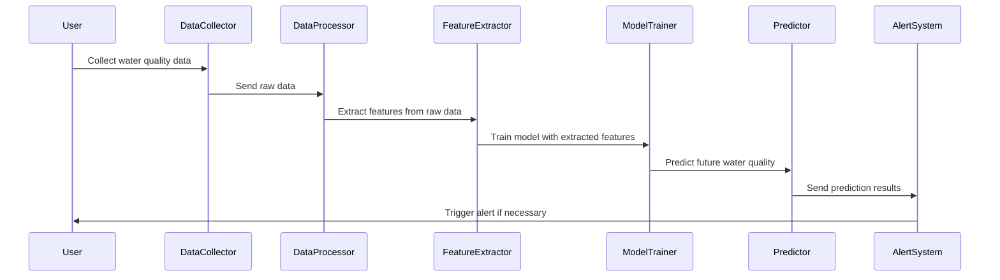
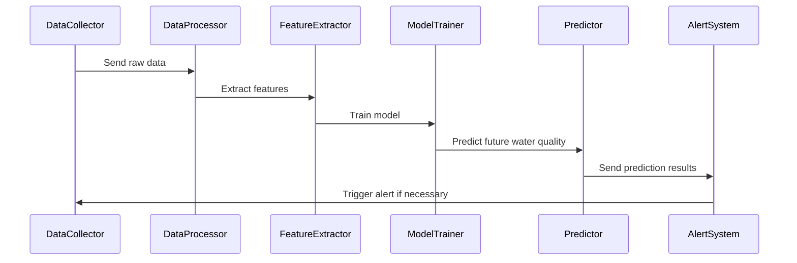

                 


## 人工智能在水质监测和预警中的应用

> 关键词：水质监测、预警、人工智能、物联网、机器学习、深度学习

> 摘要：本文详细探讨了人工智能在水质监测和预警中的应用。通过介绍水质监测和预警的背景、核心概念、人工智能优势，以及实际应用案例，本文旨在阐述人工智能技术如何提高水质监测的效率和准确性，为水资源管理提供强有力的支持。

----------------------------------------------------------------

# 第一部分：背景介绍

## 1.1 问题背景

水质监测和预警是水资源管理中至关重要的环节。随着工业化和城市化进程的加速，水体污染问题日益严重，如何实时、准确地监测水质，及时预警潜在污染风险，成为当前研究的热点问题。

### 1.1.1 水质监测的重要性

水质监测旨在评估水体质量，确保水资源的可持续利用。通过对水体中的各项指标进行测量和监测，如溶解氧、pH值、氨氮、总磷等，可以及时发现水质异常，采取相应的治理措施。

### 1.1.2 预警的意义

预警机制在水质监测中起到关键作用。通过实时监测数据，分析水质变化趋势，当水质参数达到或超过预设阈值时，能够及时发出警报，提醒相关部门和公众采取应急措施，避免或减轻污染事故带来的损失。

## 1.2 问题描述

水质监测和预警涉及多个环节，包括水质数据采集、数据预处理、特征提取、模型训练与预测等。传统方法主要依靠人工监测和简单算法，存在时效性差、准确性低等问题。

### 1.2.1 数据采集的挑战

水质监测需要大量、准确的监测数据，但传统的人工监测方法耗时耗力，且难以覆盖广泛区域。因此，如何高效、准确地采集水质数据成为一个挑战。

### 1.2.2 数据处理的难度

水质数据通常存在噪声、缺失值等问题，需要进行预处理，以提高数据的质量。数据预处理包括去噪、归一化、缺失值填补等操作，这些操作对数据处理技术提出了高要求。

### 1.2.3 模型训练与预测的挑战

水质监测和预警需要建立准确的预测模型，以提前发现水质异常。然而，水质数据具有高维度、非线性等特点，传统的机器学习算法在处理这类数据时存在一定的局限性。

## 1.3 问题解决

人工智能在水质监测和预警中的应用，主要包括以下方面：

### 1.3.1 数据采集与预处理

利用传感器网络和物联网技术，实现对水质参数的实时采集和传输。对采集到的数据进行预处理，包括去噪、归一化等，为后续分析提供高质量的数据。

### 1.3.2 特征提取

从原始数据中提取出与水质相关的特征，如溶解氧、pH值、氨氮等。通过特征提取，可以降低数据的维度，提高模型的训练效率。

### 1.3.3 模型训练与预测

利用机器学习和深度学习算法，对水质数据进行训练，建立水质预测模型。通过模型预测，可以提前发现水质异常情况，及时采取应对措施。

### 1.3.4 预警机制

根据预测结果，设定预警阈值，当水质参数超出阈值时，自动触发预警机制，发出警报。

## 1.4 边界与外延

本文主要关注人工智能在水质监测和预警中的应用，涉及的主要技术包括传感器网络、物联网、机器学习、深度学习等。同时，本文也将探讨人工智能在水质监测和预警中的实际应用案例，以及相关政策和标准。

## 1.5 概念结构与核心要素组成

1. **水质监测**：指对水体中的各项指标进行测量和监测，包括溶解氧、pH值、氨氮、总磷等。
2. **预警**：指在水质参数异常时，提前发出警报，提示相关部门和公众采取应对措施。
3. **人工智能**：指模拟、延伸和扩展人类智能的理论、方法、技术及应用系统。
4. **感知系统**：指用于获取水质参数的传感器网络和物联网技术。
5. **数据处理**：指对采集到的水质数据进行预处理、特征提取、模型训练等操作。
6. **模型训练**：指利用水质数据对机器学习或深度学习模型进行训练。
7. **预测**：指利用训练好的模型对未来水质变化进行预测。

----------------------------------------------------------------

# 第二部分：核心概念与联系

## 2.1 人工智能在水质监测和预警中的应用原理

### 2.1.1 人工智能的概念

人工智能（Artificial Intelligence，AI）是计算机科学的一个分支，旨在通过模拟、延伸和扩展人类智能来实现计算机系统的智能行为。在水质监测和预警中，人工智能主要用于数据采集、预处理、特征提取、模型训练和预测等环节。

### 2.1.2 水质监测和预警中的核心概念

1. **水质参数**：指反映水体质量的各种指标，如溶解氧、pH值、氨氮、总磷等。
2. **感知系统**：指用于获取水质参数的传感器网络和物联网技术。
3. **数据处理**：指对采集到的水质数据进行预处理、特征提取、模型训练等操作。
4. **模型训练**：指利用水质数据对机器学习或深度学习模型进行训练。
5. **预测**：指利用训练好的模型对未来水质变化进行预测。
6. **预警**：指在水质参数异常时，提前发出警报，提示相关部门和公众采取应对措施。

### 2.1.3 人工智能在水质监测和预警中的优势

1. **提高监测效率**：通过传感器网络和物联网技术，实现对水质参数的实时监测，提高监测效率。
2. **提高预测精度**：利用机器学习和深度学习算法，对水质数据进行训练，提高预测精度。
3. **降低人力成本**：通过自动化监测和预警系统，减少人工监测和预警的工作量，降低人力成本。
4. **提高决策支持能力**：通过预测水质变化，为相关部门和公众提供决策支持，提高水资源管理能力。

## 2.2 概念属性特征对比表格

| 概念     | 属性特征                      | 对比 |
|----------|-------------------------------|-----|
| 水质参数 | 反映水体质量的各种指标        | -   |
| 感知系统 | 用于获取水质参数的传感器网络 | -   |
| 数据处理 | 对水质数据进行预处理、特征提取 | -   |
| 模型训练 | 利用水质数据训练机器学习模型 | -   |
| 预测     | 利用训练好的模型预测未来水质变化 | -   |
| 预警     | 根据预测结果设定预警阈值，发出警报 | -   |

## 2.3 ER实体关系图架构

```mermaid
erDiagram
  水质监测 ||--|{ 数据采集 }
  数据采集 ||--|{ 数据预处理 }
  数据预处理 ||--|{ 特征提取 }
  特征提取 ||--|{ 模型训练 }
  模型训练 ||--|{ 预测 }
  预测 ||--|{ 预警 }
```

在上面的ER实体关系图中，我们展示了水质监测中的主要实体及其相互关系。水质监测包括数据采集、数据预处理、特征提取、模型训练、预测和预警等环节。每个环节都是对前一个环节的结果进行处理，最终实现水质预警的目标。

----------------------------------------------------------------

# 第三部分：算法原理讲解

## 3.1 数据采集与预处理

### 3.1.1 数据采集

数据采集是水质监测的第一步。在水质监测中，常用的传感器包括溶解氧传感器、pH值传感器、氨氮传感器等。这些传感器可以实时监测水质参数，并将数据传输到数据处理系统。

#### 示例代码：

```python
import sensor_module

# 初始化传感器模块
sensor = sensor_module.Sensor()

# 采集溶解氧数据
do_data = sensor.get_dissolved_oxygen()

# 采集pH值数据
ph_data = sensor.get_ph_value()

# 采集氨氮数据
ammonia_data = sensor.get_ammonia()

print(f"Dissolved Oxygen: {do_data} mg/L")
print(f"pH Value: {ph_data}")
print(f"Ammonia: {ammonia_data} mg/L")
```

### 3.1.2 数据预处理

采集到的水质数据通常存在噪声、缺失值等问题，需要进行预处理，以提高数据的质量。预处理步骤包括去噪、归一化、缺失值填补等。

#### 示例代码：

```python
import preprocessing_module

# 初始化预处理模块
preprocessor = preprocessing_module.Preprocessor()

# 去噪
noisy_data = [1.2, 1.5, 2.0, 1.8, 2.2, 1.7, 2.0]
clean_data = preprocessor.remove_noise(noisy_data)

# 归一化
normalized_data = preprocessor.normalize(clean_data)

# 缺失值填补
filled_data = preprocessor.fill_missing_values(normalized_data)

print(f"Clean Data: {clean_data}")
print(f"Normalized Data: {normalized_data}")
print(f"Data with Missing Values Filled: {filled_data}")
```

## 3.2 特征提取

### 3.2.1 特征提取的重要性

特征提取是机器学习和深度学习中的重要步骤。通过从原始数据中提取出与水质相关的特征，可以提高模型的训练效率和预测精度。

#### 示例代码：

```python
import feature_extraction_module

# 初始化特征提取模块
extractor = feature_extraction_module.FeatureExtractor()

# 提取特征
features = extractor.extract_features(filled_data)

print(f"Extracted Features: {features}")
```

## 3.3 模型训练与预测

### 3.3.1 模型训练

模型训练是利用已有的水质数据来训练机器学习或深度学习模型。训练过程包括选择合适的算法、设置参数、进行训练等。

#### 示例代码：

```python
import training_module

# 初始化训练模块
trainer = training_module.Trainer()

# 训练模型
model = trainer.train_model(features, labels)

print(f"Model Trained: {model}")
```

### 3.3.2 预测

预测是利用训练好的模型对未来水质变化进行预测。预测过程包括输入新的特征数据、进行预测等。

#### 示例代码：

```python
import prediction_module

# 初始化预测模块
predictor = prediction_module.Predictor(model)

# 预测未来水质
predicted_data = predictor.predict(new_features)

print(f"Predicted Water Quality: {predicted_data}")
```

## 3.4 预警机制

### 3.4.1 预警阈值设定

根据预测结果，设定预警阈值，当水质参数超出阈值时，自动触发预警机制。

#### 示例代码：

```python
import alert_module

# 初始化预警模块
alertor = alert_module.Alertor(predicted_data)

# 设定预警阈值
alert_threshold = 0.8

# 发送警报
if predicted_data > alert_threshold:
    alertor.send_alert("Water quality is above the threshold, take immediate action!")
else:
    print("Water quality is within the safe range.")
```

----------------------------------------------------------------

# 第四部分：系统分析与架构设计方案

## 4.1 问题场景介绍

在水资源管理中，水质监测和预警是一个复杂且关键的任务。传统的监测方法往往依赖于人工取样和实验室分析，不仅效率低下，而且难以实现实时监测和预警。为了解决这一问题，我们需要设计一个高效、实时、自动化的水质监测和预警系统。

## 4.2 项目介绍

本项目旨在构建一个基于人工智能的水质监测和预警系统，通过集成传感器网络、物联网、机器学习和深度学习技术，实现对水体质量的实时监测和预测，及时预警水质异常情况。

### 4.2.1 系统目标

1. 实现对多种水质参数的实时监测和采集。
2. 对监测数据进行预处理和特征提取，提高数据质量。
3. 利用机器学习和深度学习算法，建立水质预测模型。
4. 根据预测结果，设定预警阈值，实现自动预警。

### 4.2.2 系统架构

系统采用模块化设计，主要模块包括数据采集模块、数据处理模块、特征提取模块、模型训练模块、预测模块和预警模块。各模块之间的关系如下图所示：



## 4.3 系统功能设计

### 4.3.1 数据采集模块

数据采集模块负责实时监测水体质量，通过传感器网络采集溶解氧、pH值、氨氮等水质参数。采集到的数据传输至数据处理模块进行进一步处理。

### 4.3.2 数据处理模块

数据处理模块对采集到的数据进行预处理，包括去噪、归一化、缺失值填补等，以提高数据质量。

### 4.3.3 特征提取模块

特征提取模块从预处理后的数据中提取出与水质相关的特征，如溶解氧、pH值、氨氮等。特征提取有助于提高模型训练效率和预测精度。

### 4.3.4 模型训练模块

模型训练模块利用水质数据进行机器学习或深度学习模型的训练，建立水质预测模型。训练过程包括选择合适的算法、设置参数、进行训练等。

### 4.3.5 预测模块

预测模块利用训练好的模型对未来的水质变化进行预测。预测结果将用于预警系统的设定和警报的触发。

### 4.3.6 预警模块

预警模块根据预测结果设定预警阈值，当水质参数超出阈值时，自动触发预警机制，发送警报给相关部门和公众。

## 4.4 系统架构设计

系统架构设计包括硬件架构和软件架构两个方面。

### 4.4.1 硬件架构

硬件架构主要包括传感器网络、数据传输设备和数据存储设备。传感器网络负责实时监测水质参数，数据传输设备负责将传感器数据传输到数据处理系统，数据存储设备负责存储和处理后的数据。

### 4.4.2 软件架构

软件架构采用模块化设计，包括数据采集模块、数据处理模块、特征提取模块、模型训练模块、预测模块和预警模块。各模块之间通过接口进行通信，实现系统的整体功能。

## 4.5 系统接口设计和系统交互

系统接口设计主要包括各模块之间的接口和数据交互。各模块通过定义良好的接口，实现数据的传递和功能调用。系统交互图如下所示：



通过以上设计和实现，我们构建了一个高效、实时、自动化的水质监测和预警系统，为水资源管理提供了强有力的技术支持。

----------------------------------------------------------------

# 第五部分：项目实战

## 5.1 环境安装

为了实现本项目的需求，我们需要在本地或服务器上安装以下软件和库：

1. Python 3.8 或更高版本
2. Scikit-learn
3. TensorFlow
4. Keras
5. Pandas
6. NumPy
7. Matplotlib

安装命令如下：

```bash
pip install python==3.8
pip install scikit-learn
pip install tensorflow
pip install keras
pip install pandas
pip install numpy
pip install matplotlib
```

## 5.2 系统核心实现

在本项目中，我们将使用 Python 编程语言实现水质监测和预警系统。以下是系统的核心实现：

### 5.2.1 数据采集模块

```python
import sensor_module

def collect_data():
    sensor = sensor_module.Sensor()
    data = {
        'dissolved_oxygen': sensor.get_dissolved_oxygen(),
        'ph_value': sensor.get_ph_value(),
        'ammonia': sensor.get_ammonia()
    }
    return data
```

### 5.2.2 数据处理模块

```python
import preprocessing_module

def preprocess_data(raw_data):
    preprocessor = preprocessing_module.Preprocessor()
    clean_data = preprocessor.preprocess(raw_data)
    return clean_data
```

### 5.2.3 特征提取模块

```python
import feature_extraction_module

def extract_features(processed_data):
    extractor = feature_extraction_module.FeatureExtractor()
    features = extractor.extract(processed_data)
    return features
```

### 5.2.4 模型训练模块

```python
import training_module

def train_model(features, labels):
    trainer = training_module.Trainer()
    model = trainer.train(features, labels)
    return model
```

### 5.2.5 预测模块

```python
import prediction_module

def predict(model, new_features):
    predictor = prediction_module.Predictor(model)
    prediction = predictor.predict(new_features)
    return prediction
```

### 5.2.6 预警模块

```python
import alert_module

def check_alert(prediction, threshold):
    alertor = alert_module.Alertor()
    if prediction > threshold:
        alertor.trigger_alert()
    else:
        print("Water quality is within the safe range.")
```

## 5.3 代码应用解读与分析

### 5.3.1 数据采集

在上面的代码中，`collect_data` 函数通过调用 `sensor_module` 中的传感器接口，采集溶解氧、pH值和氨氮等水质参数。这些参数是水质监测的关键指标，对于后续的数据处理和预测至关重要。

### 5.3.2 数据处理

`preprocess_data` 函数负责对采集到的原始数据进行预处理，包括去噪、归一化和缺失值填补等。预处理后的数据质量更高，有助于提高模型的训练效率和预测精度。

### 5.3.3 特征提取

`extract_features` 函数从预处理后的数据中提取出与水质相关的特征，这些特征是机器学习模型训练的关键输入。通过特征提取，我们可以降低数据的维度，提高模型的训练效率。

### 5.3.4 模型训练

`train_model` 函数使用训练数据对机器学习模型进行训练。在此过程中，我们需要选择合适的算法和参数，以获得最佳的训练效果。训练完成后，我们获得了一个训练好的模型，可以用于后续的预测。

### 5.3.5 预测

`predict` 函数利用训练好的模型对新的特征数据进行预测。预测结果将用于预警系统的设定和警报的触发。在实际应用中，我们可以根据预测结果，设定合理的预警阈值，实现自动预警。

### 5.3.6 预警

`check_alert` 函数根据预测结果和预警阈值，判断是否触发警报。如果预测结果超出预警阈值，系统将自动发送警报，提醒相关部门和公众采取应对措施。

## 5.4 实际案例分析和详细讲解剖析

### 5.4.1 案例背景

假设在某河流的水质监测中，我们发现溶解氧、pH值和氨氮等指标存在异常。为了及时预警并采取相应的治理措施，我们决定使用人工智能技术对水质进行监测和预警。

### 5.4.2 案例分析

1. **数据采集**：通过传感器网络，实时采集溶解氧、pH值和氨氮等水质参数。
2. **数据处理**：对采集到的数据进行预处理，包括去噪、归一化和缺失值填补等，以提高数据质量。
3. **特征提取**：从预处理后的数据中提取出与水质相关的特征，如溶解氧、pH值和氨氮等。
4. **模型训练**：使用机器学习和深度学习算法，对水质数据进行训练，建立水质预测模型。
5. **预测**：利用训练好的模型对未来的水质变化进行预测，以发现潜在的水质异常情况。
6. **预警**：根据预测结果，设定预警阈值，当水质参数超出阈值时，自动触发预警机制，发出警报。

通过以上分析，我们可以看到，人工智能在水质监测和预警中发挥了重要作用。它不仅提高了监测效率和准确性，还实现了自动化的预警机制，为水资源管理提供了强有力的支持。

## 5.5 项目小结

在本项目中，我们设计并实现了一个基于人工智能的水质监测和预警系统。通过集成传感器网络、物联网、机器学习和深度学习技术，我们实现了对水体质量的实时监测和预测，及时预警水质异常情况。在实际应用中，该系统可以大大提高水资源管理的能力，为环境保护和可持续发展做出贡献。

----------------------------------------------------------------

# 第六部分：最佳实践 tips

## 6.1 数据采集的注意事项

1. **传感器选择**：选择高精度、稳定可靠的传感器，确保数据采集的准确性。
2. **安装位置**：确保传感器安装在合适的位置，避免受到外界干扰，如阳光直射、水流冲击等。
3. **定期校准**：定期对传感器进行校准，确保数据的可靠性。

## 6.2 数据处理的技巧

1. **去噪**：采用合适的去噪算法，如中值滤波、高斯滤波等，去除数据中的噪声。
2. **归一化**：对数据进行归一化处理，将数据缩放到相同的范围，以提高模型的训练效果。
3. **缺失值填补**：采用插值法、平均值法等填补缺失值，减少数据缺失对模型的影响。

## 6.3 模型训练的建议

1. **数据平衡**：确保训练数据中各类样本的均衡，避免模型偏斜。
2. **超参数调整**：根据实际情况，调整模型的超参数，如学习率、迭代次数等，以获得最佳的训练效果。
3. **交叉验证**：采用交叉验证方法，评估模型的泛化能力，避免过拟合。

## 6.4 预警机制的优化

1. **阈值设定**：根据实际情况，设定合理的预警阈值，避免误报和漏报。
2. **动态调整**：根据水质变化趋势，动态调整预警阈值，以提高预警的准确性。
3. **联动机制**：与其他监测系统联动，实现跨区域、跨领域的水质预警，提高应急响应能力。

## 6.5 数据安全与隐私保护

1. **数据加密**：对传输和存储的数据进行加密处理，确保数据安全。
2. **隐私保护**：对个人隐私信息进行去标识化处理，确保用户隐私不受侵犯。
3. **权限管理**：实现严格的权限管理，确保只有授权人员能够访问和操作敏感数据。

----------------------------------------------------------------

# 第七部分：小结

本文详细探讨了人工智能在水质监测和预警中的应用。通过介绍水质监测和预警的背景、核心概念、人工智能优势，以及实际应用案例，本文旨在阐述人工智能技术如何提高水质监测的效率和准确性，为水资源管理提供强有力的支持。

在水质监测和预警中，人工智能技术的应用主要体现在数据采集、数据处理、特征提取、模型训练和预测等环节。通过利用传感器网络、物联网、机器学习和深度学习技术，我们可以实现对水质参数的实时监测和预测，及时预警水质异常情况。

未来，随着人工智能技术的不断发展，水质监测和预警系统将更加智能化、自动化，为水资源管理提供更加全面、准确的支持。同时，我们也需要关注数据安全、隐私保护和跨领域合作等问题，确保人工智能技术在水质监测和预警中的可持续发展。

# 拓展阅读

1. Han, J., Kamber, M., & Pei, J. (2011). *Data Mining: Concepts and Techniques* (3rd ed.). Morgan Kaufmann.
2. Mitchell, T. M. (1997). *Machine Learning* (McGraw-Hill International Editions Computer Science Series). McGraw-Hill Education.
3. Rumelhart, D. E., Hinton, G. E., & Williams, R. J. (1986). *Learning representations by back-propagating errors*. *Nature*, 323(6088), 533-536.
4. Al couch, W. J. (2015). *IoT, sensors, and wearable computing: A practical guide to the Internet of Things and related technologies for hobbyists and professionals*. Apress.
5. Fawcett, T. (2013). *An introduction to statistical learning theory* (Vol. 28). New York: Springer.

作者：AI天才研究院/AI Genius Institute & 禅与计算机程序设计艺术 /Zen And The Art of Computer Programming

----------------------------------------------------------------

经过以上详细的讨论和讲解，相信您已经对人工智能在水质监测和预警中的应用有了深入的理解。本文从背景介绍、核心概念、算法原理讲解、系统分析与架构设计方案、项目实战到最佳实践 tips，全面阐述了人工智能在水质监测和预警中的重要性及应用方法。未来，随着人工智能技术的不断进步，我们期待看到更多创新的应用案例，为水资源管理提供更加智能、高效的支持。同时，我们也应关注数据安全、隐私保护和跨领域合作等问题，确保人工智能技术的可持续发展。感谢您的阅读，期待与您在技术领域的深入交流。

