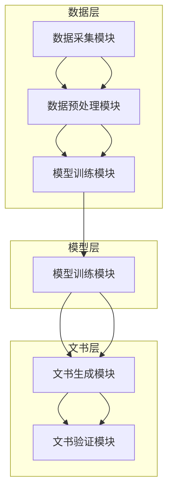

                 

# 人工智能在法律文书自动生成中的应用

> 关键词：人工智能、法律文书、自动生成、自然语言处理、机器学习

> 摘要：随着人工智能技术的发展，法律文书自动生成成为了一个备受关注的话题。本文将从问题背景、核心概念、技术原理和实践等多个方面，深入探讨人工智能在法律文书自动生成中的应用，旨在为相关领域的研究者和从业者提供有价值的参考。

## 目录大纲

----------------------------------------------------------------

## 第一部分：背景与核心概念

### 第1章：问题背景与核心概念

#### 1.1.1 问题背景

- 法律文书自动生成的现状

- 现有法律文书生成方式的局限性

#### 1.1.2 人工智能概述

- 人工智能的定义与发展

- 人工智能的主要分支

#### 1.1.3 人工智能在法律领域的应用

- 人工智能在法律文书中应用的挑战

- 数据处理与隐私保护

#### 1.1.4 机器学习与自然语言处理

- 机器学习的基本概念

- 自然语言处理的基础

#### 1.2 核心概念

- 人工智能在法律文书自动生成中的角色

- 法律文书自动生成系统架构

- 常用机器学习算法

- 自然语言处理技术

## 1.3 本章小结

- 主要内容回顾

- 未来展望

## 第二部分：技术原理与实践

### 第2章：数据预处理与特征工程

#### 2.1 数据预处理

- 数据收集

- 数据清洗

- 数据标准化

#### 2.2 特征工程

- 文本特征提取

- 语义特征提取

#### 2.3 本章小结

- 主要内容回顾

- 实践建议

### 第3章：机器学习算法在法律文书自动生成中的应用

#### 3.1 监督学习算法

- 支持向量机

- 决策树与随机森林

#### 3.2 非监督学习算法

- K-均值聚类

- 主成分分析

#### 3.3 深度学习算法

- 循环神经网络

- 长短期记忆网络

#### 3.4 本章小结

- 主要内容回顾

- 实践建议

### 第4章：自然语言处理在法律文书自动生成中的应用

#### 4.1 文本分类与情感分析

- 文本分类

- 情感分析

#### 4.2 命名实体识别与关系抽取

- 命名实体识别

- 关系抽取

#### 4.3 本章小结

- 主要内容回顾

- 实践建议

### 第5章：法律文书自动生成系统的设计与实现

#### 5.1 系统设计

- 系统架构

- 功能模块划分

#### 5.2 系统实现

- 环境安装

- 系统核心实现

#### 5.3 项目实战

- 实际案例分析与详细讲解

- 项目小结

#### 5.4 本章小结

- 主要内容回顾

- 注意事项

- 拓展阅读

## 文章正文

### 第一部分：背景与核心概念

#### 1.1.1 问题背景

随着社会经济的发展和法律的日益完善，法律文书在司法实践中扮演着至关重要的角色。然而，法律文书的撰写和生成过程复杂且耗时，往往需要大量的法律知识和专业技能。这给律师、法务人员以及其他涉及法律事务的人员带来了巨大的工作压力。因此，如何实现法律文书的自动生成成为一个亟待解决的问题。

**法律文书自动生成的现状：**

目前，法律文书的自动生成主要通过以下几种方式实现：

1. **模板生成：** 利用预定义的模板，根据用户输入的信息自动填充相关内容。

2. **人工编写：** 由专业人员进行法律文书的撰写，通过电子文档进行传输和存储。

3. **人工智能生成：** 利用人工智能技术，尤其是自然语言处理和机器学习技术，自动生成法律文书。

**现有法律文书生成方式的局限性：**

1. **模板生成：** 虽然可以节省时间，但模板的多样性不足，难以满足复杂法律文书的生成需求。

2. **人工编写：** 虽然可以保证法律文书的准确性和专业性，但效率低下，成本高昂。

3. **人工智能生成：** 尽管具有一定的潜力，但目前的算法和模型尚不能完全理解法律文书的复杂性和变异性。

#### 1.1.2 人工智能概述

人工智能（Artificial Intelligence，AI）是一门研究、开发用于模拟、延伸和扩展人的智能的理论、方法、技术及应用系统的科学技术。它是计算机科学的一个分支，旨在使计算机具有人类的智能，能够处理和理解自然语言、图像、声音等多种信息。

**人工智能的定义与发展：**

人工智能的概念最早可以追溯到20世纪50年代，当时图灵提出了图灵测试来衡量机器是否具有智能。随后，随着计算机技术的飞速发展，人工智能得到了广泛的研究和应用。在21世纪初，深度学习等新技术的出现，使人工智能取得了前所未有的突破。

**人工智能的主要分支：**

1. **机器学习：** 通过数据驱动的方式，使计算机能够从数据中学习和发现规律。

2. **自然语言处理：** 研究计算机如何理解、生成和 manipula 语言，实现人与计算机之间的自然语言交互。

3. **计算机视觉：** 研究如何使计算机像人一样理解和解释视觉信息。

4. **机器人学：** 研究如何构建和设计具有人类智能的机器人。

#### 1.1.3 人工智能在法律领域的应用

人工智能在法律领域的应用日益广泛，尤其是在法律文书自动生成、法律咨询、案件分析等方面。然而，这一应用也面临着一些挑战。

**人工智能在法律文书中应用的挑战：**

1. **数据处理与隐私保护：** 法律文书往往涉及敏感信息，如何确保数据处理过程中的隐私保护成为了一个关键问题。

2. **法律规则的复杂性与变异性：** 法律规则复杂且多变，不同地区、不同国家的法律规则也存在差异，这使得人工智能模型难以准确理解和生成法律文书。

**数据处理与隐私保护：**

为了应对数据处理与隐私保护的挑战，可以采取以下措施：

1. **数据加密：** 在数据传输和存储过程中使用加密技术，确保数据安全。

2. **隐私保护算法：** 开发和应用隐私保护算法，如差分隐私、同态加密等，以保护个人隐私。

**法律规则的复杂性与变异性：**

为了应对法律规则的复杂性与变异性，可以采取以下措施：

1. **法律知识图谱：** 构建法律知识图谱，将法律规则和条款以结构化的形式表示，方便人工智能模型理解和应用。

2. **多语言处理：** 开发支持多种语言的法律文书生成系统，以应对不同国家和地区的法律规则。

#### 1.1.4 机器学习与自然语言处理

机器学习（Machine Learning，ML）是一种通过数据驱动的方式使计算机自动学习和改进的技术。自然语言处理（Natural Language Processing，NLP）是人工智能的一个分支，旨在使计算机能够理解、生成和 manipula 自然语言。

**机器学习的基本概念：**

1. **监督学习：** 通过标注好的训练数据，学习输入和输出之间的关系，从而预测未知数据的输出。

2. **非监督学习：** 通过未标注的数据，学习数据之间的结构和规律。

3. **半监督学习：** 结合监督学习和非监督学习，利用少量标注数据和大量未标注数据。

**自然语言处理的基础：**

1. **词向量：** 将单词映射为高维向量，用于表示单词的含义和关系。

2. **语言模型：** 通过统计方法或神经网络模型，预测下一个单词的概率分布。

3. **序列标注：** 对文本序列中的每个单词进行分类或标注，如词性标注、命名实体识别等。

#### 1.2 核心概念

**人工智能在法律文书自动生成中的角色：**

人工智能在法律文书自动生成中扮演着多重角色：

1. **自动化与效率提升：** 通过自动生成法律文书，减少人工工作量，提高工作效率。

2. **法律专业性与道德伦理：** 在生成法律文书时，人工智能需要遵循法律规则和道德伦理，确保生成的文书合法有效。

**法律文书自动生成系统架构：**

法律文书自动生成系统通常包括以下几个模块：

1. **数据采集与预处理：** 收集法律文书数据，并进行清洗、归一化等处理。

2. **模型训练与优化：** 利用机器学习和自然语言处理技术，训练和优化生成模型。

3. **文书生成与验证：** 根据用户输入的信息，生成法律文书，并进行验证和优化。

**常用机器学习算法：**

1. **监督学习算法：** 支持向量机、决策树、随机森林等。

2. **非监督学习算法：** K-均值聚类、主成分分析等。

3. **深度学习算法：** 循环神经网络、长短期记忆网络等。

**自然语言处理技术：**

1. **文本分类与情感分析：** 基于朴素贝叶斯、深度学习等技术。

2. **命名实体识别与关系抽取：** 基于规则、深度学习等技术。

#### 1.3 本章小结

在本章中，我们首先介绍了法律文书自动生成的背景和核心概念，包括人工智能的定义与发展、机器学习与自然语言处理的基础知识。接着，我们探讨了人工智能在法律文书自动生成中的角色、系统架构以及常用机器学习算法和自然语言处理技术。最后，我们对本章的主要内容进行了回顾，并对未来展望进行了简要介绍。

未来，随着人工智能技术的不断进步，法律文书自动生成有望实现更高的准确性和效率，为法律事务提供更加智能化、高效化的解决方案。然而，这也将带来一系列新的挑战，如法律规则的复杂性与变异性、数据处理与隐私保护等。因此，我们需要继续深入研究和探索，以应对这些挑战。

----------------------------------------------------------------

## 第二部分：技术原理与实践

### 第2章：数据预处理与特征工程

#### 2.1 数据预处理

数据预处理是法律文书自动生成中的重要环节，它直接影响到模型的性能和准确性。数据预处理包括数据收集、数据清洗和数据标准化等步骤。

**数据收集：**

数据收集是数据预处理的第一步，主要任务是获取用于训练和测试的法律文书数据。数据来源可以包括：

1. **公开数据集：** 如法律文书公开数据集、案例数据集等。

2. **内部数据：** 企业或律师事务所内部积累的法律文书数据。

3. **网络爬虫：** 通过网络爬虫技术，从法律网站、论坛等获取法律文书。

**数据清洗：**

数据清洗的目的是去除数据中的噪声和异常值，确保数据质量。数据清洗的主要任务包括：

1. **缺失值处理：** 对于缺失值，可以采用填充策略，如平均值填充、中值填充等。

2. **异常值处理：** 对异常值，可以通过统计学方法或专家经验进行识别和处理。

3. **文本预处理：** 对文本数据，需要进行分词、去停用词、词干提取等操作，以便后续的特征工程。

**数据标准化：**

数据标准化是为了使不同特征之间的尺度一致，便于模型训练。常用的标准化方法包括：

1. **归一化：** 将特征值缩放到相同的范围，如[0, 1]或[-1, 1]。

2. **标准化：** 将特征值缩放到均值为0，标准差为1的范围内。

#### 2.2 特征工程

特征工程是数据预处理的重要环节，它通过对原始数据进行变换和构造，生成有助于模型训练的特征。特征工程在法律文书自动生成中至关重要，因为它可以显著提高模型的性能。

**文本特征提取：**

文本特征提取是将原始文本转换为可用于机器学习的特征表示。常用的文本特征提取方法包括：

1. **词袋模型（Bag of Words，BoW）：** 将文本表示为一个向量，向量中的每个元素表示一个词的出现次数。

2. **TF-IDF（Term Frequency-Inverse Document Frequency）：** 结合词频和逆文档频率，对词进行加权，以提高重要词的权重。

**语义特征提取：**

语义特征提取旨在从文本中提取更深层次的语义信息，以提高模型的性能。常用的语义特征提取方法包括：

1. **词嵌入（Word Embedding）：** 将词映射为高维向量，以捕捉词的语义信息。

2. **预训练模型（Pre-trained Model）：** 使用大规模语料库预训练的模型，如Word2Vec、BERT等，可以直接用于特征提取。

**本章小结**

在本章中，我们介绍了数据预处理和特征工程的基本概念和方法。数据预处理是确保数据质量的关键步骤，包括数据收集、数据清洗和数据标准化。特征工程则是将原始数据转换为适合机器学习模型训练的特征表示，包括文本特征提取和语义特征提取。这些技术为法律文书自动生成提供了坚实的基础。

#### 2.3 本章小结

在本章中，我们详细介绍了数据预处理和特征工程在法律文书自动生成中的应用。数据预处理包括数据收集、数据清洗和数据标准化，确保数据质量。特征工程通过文本特征提取和语义特征提取，将原始文本转换为适合机器学习模型训练的特征表示。这些技术为法律文书自动生成提供了坚实的基础。

在实践过程中，我们需要根据具体应用场景和数据特点，选择合适的数据预处理和特征工程方法。同时，我们也需要不断尝试和优化特征工程策略，以提高模型的性能和准确性。

未来，随着人工智能技术的不断进步，数据预处理和特征工程的方法也将不断创新和改进，为法律文书自动生成提供更高效的解决方案。

----------------------------------------------------------------

### 第3章：机器学习算法在法律文书自动生成中的应用

#### 3.1 监督学习算法

监督学习算法在法律文书自动生成中有着广泛的应用，因为它们可以基于已有数据预测新的法律文书。以下是一些常见的监督学习算法及其在法律文书自动生成中的应用。

**支持向量机（SVM）：**

支持向量机是一种强大的分类算法，它通过找到一个最佳的超平面来分离不同类别的数据点。在法律文书自动生成中，SVM可以用于分类任务，如将法律文书分为合同、起诉状、答辩状等。

**决策树与随机森林：**

决策树是一种基于树形结构进行决策的算法，它可以用于分类和回归任务。随机森林是一种基于决策树的集成学习方法，通过构建多个决策树并求取平均来提高模型的泛化能力。在法律文书自动生成中，决策树和随机森林可以用于分类任务，如分类法律文书的不同类型。

**实现与原理：**

以下是使用Python实现SVM和随机森林的基本示例。

```python
from sklearn import svm
from sklearn.ensemble import RandomForestClassifier
from sklearn.model_selection import train_test_split
from sklearn.metrics import accuracy_score

# 数据预处理
X, y = load_data()  # 假设load_data函数可以加载数据并返回特征矩阵X和标签y
X_train, X_test, y_train, y_test = train_test_split(X, y, test_size=0.2, random_state=42)

# SVM分类器
clf_svm = svm.SVC(kernel='linear')
clf_svm.fit(X_train, y_train)
y_pred_svm = clf_svm.predict(X_test)

# 随机森林分类器
clf_rf = RandomForestClassifier(n_estimators=100)
clf_rf.fit(X_train, y_train)
y_pred_rf = clf_rf.predict(X_test)

# 评估模型
accuracy_svm = accuracy_score(y_test, y_pred_svm)
accuracy_rf = accuracy_score(y_test, y_pred_rf)
print(f"SVM准确率: {accuracy_svm}")
print(f"随机森林准确率: {accuracy_rf}")
```

**3.2 非监督学习算法**

非监督学习算法在法律文书自动生成中也有应用，尤其是在数据标签不足的情况下。以下是一些常见的非监督学习算法及其在法律文书自动生成中的应用。

**K-均值聚类：**

K-均值聚类是一种基于距离度量的聚类算法，它将数据点分为K个簇，使得每个簇内的数据点之间的距离最小。在法律文书自动生成中，K-均值聚类可以用于文本分类任务，如将法律文书分为合同、起诉状、答辩状等。

**主成分分析（PCA）：**

主成分分析是一种降维技术，它通过线性变换将原始数据映射到新的坐标系统中，新坐标系统中的坐标是原始数据的主要变化方向。在法律文书自动生成中，PCA可以用于降维，减少数据的维度，同时保留主要的信息。

**实现与原理：**

以下是使用Python实现K-均值聚类和PCA的基本示例。

```python
from sklearn.cluster import KMeans
from sklearn.decomposition import PCA
from sklearn.datasets import make_blobs
import matplotlib.pyplot as plt

# 数据生成
X, _ = make_blobs(n_samples=150, centers=3, cluster_std=0.5, random_state=0)

# K-均值聚类
kmeans = KMeans(n_clusters=3, random_state=0)
kmeans.fit(X)
y_kmeans = kmeans.predict(X)

# 主成分分析
pca = PCA(n_components=2)
X_pca = pca.fit_transform(X)

# 可视化
plt.scatter(X_pca[:, 0], X_pca[:, 1], c=y_kmeans, s=50, cmap='viridis')

plt.scatter(kmeans.cluster_centers_[:, 0], kmeans.cluster_centers_[:, 1], s=200, c='red', label='Centroids')
plt.xlabel('Principal Component 1')
plt.ylabel('Principal Component 2')
plt.title('K-Means Clustering and PCA')
plt.show()
```

**3.3 深度学习算法**

深度学习算法在法律文书自动生成中的应用越来越广泛，因为它们能够处理复杂的非线性问题。以下是一些常见的深度学习算法及其在法律文书自动生成中的应用。

**循环神经网络（RNN）：**

循环神经网络是一种能够处理序列数据的神经网络，它通过循环结构保持对序列信息的记忆。在法律文书自动生成中，RNN可以用于生成法律文书的文本序列。

**长短期记忆网络（LSTM）：**

长短期记忆网络是一种特殊的RNN，它通过引入门控机制解决了传统RNN的长期依赖问题。在法律文书自动生成中，LSTM可以用于生成法律文书的文本序列，特别适合处理长文本。

**实现与原理：**

以下是使用Python实现LSTM的基本示例。

```python
from keras.models import Sequential
from keras.layers import LSTM, Dense
import numpy as np

# 数据准备
X = np.array([[1, 0], [0, 1], [1, 1], [1, 0]])
y = np.array([0, 1, 1, 0])

# LSTM模型
model = Sequential()
model.add(LSTM(50, activation='relu', input_shape=(2, 1)))
model.add(Dense(1, activation='sigmoid'))
model.compile(optimizer='adam', loss='binary_crossentropy', metrics=['accuracy'])

# 训练模型
model.fit(X, y, epochs=200, verbose=0)

# 预测
X_test = np.array([[0, 1]])
y_pred = model.predict(X_test)
print(f"Predicted value: {y_pred[0][0]}")
```

**3.4 本章小结**

在本章中，我们介绍了机器学习算法在法律文书自动生成中的应用，包括监督学习算法（如SVM和随机森林）、非监督学习算法（如K-均值聚类和PCA）以及深度学习算法（如RNN和LSTM）。每种算法都有其特定的应用场景和实现方法，通过合理的应用和优化，可以提高法律文书自动生成的准确性和效率。

在实际应用中，选择合适的算法需要考虑数据的特性、问题的复杂性以及实际需求。同时，对于算法的实现和优化，也需要根据具体情况进行调整和改进，以实现最佳的效果。

----------------------------------------------------------------

### 第4章：自然语言处理在法律文书自动生成中的应用

#### 4.1 文本分类与情感分析

文本分类和情感分析是自然语言处理（NLP）的两个重要领域，它们在法律文书自动生成中有着广泛的应用。

**文本分类：**

文本分类是将文本数据分为预定义的类别。在法律文书自动生成中，文本分类可以用于分类法律文书的类型，如合同、起诉状、答辩状等。常用的文本分类方法包括：

1. **基于朴素贝叶斯的方法：**
   - **原理：** 基于贝叶斯定理，通过计算每个类别在特征上的概率，选择概率最高的类别作为预测结果。
   - **实现：**
     ```python
     from sklearn.naive_bayes import MultinomialNB
     from sklearn.model_selection import train_test_split
     from sklearn.metrics import accuracy_score

     X_train, X_test, y_train, y_test = train_test_split(X, y, test_size=0.2, random_state=42)
     clf = MultinomialNB()
     clf.fit(X_train, y_train)
     y_pred = clf.predict(X_test)
     accuracy = accuracy_score(y_test, y_pred)
     print(f"Accuracy: {accuracy}")
     ```

2. **基于深度学习的方法：**
   - **原理：** 利用神经网络模型，如卷积神经网络（CNN）和长短期记忆网络（LSTM），对文本进行特征提取和分类。
   - **实现：**
     ```python
     from keras.models import Sequential
     from keras.layers import Embedding, LSTM, Dense
     from keras.preprocessing.sequence import pad_sequences

     model = Sequential()
     model.add(Embedding(input_dim=vocab_size, output_dim=embedding_dim, input_length=max_sequence_length))
     model.add(LSTM(units=50, dropout=0.2, recurrent_dropout=0.2))
     model.add(Dense(1, activation='sigmoid'))
     model.compile(optimizer='adam', loss='binary_crossentropy', metrics=['accuracy'])
     model.fit(X_train, y_train, epochs=10, batch_size=32, validation_data=(X_test, y_test))
     ```

**情感分析：**

情感分析是评估文本表达的情感倾向，通常分为正面、负面和中性。在法律文书自动生成中，情感分析可以用于评估法律文书的内容和语气。

1. **基于情感词典的方法：**
   - **原理：** 利用预定义的情感词典，通过计算文本中正面和负面词的数量，评估整体情感倾向。
   - **实现：**
     ```python
     def get_sentiment(text,词典):
         positive_words = 0
         negative_words = 0
         words = text.split()
         for word in words:
             if word in词典['positive']:
                 positive_words += 1
             elif word in词典['negative']:
                 negative_words += 1
         if positive_words > negative_words:
             return 'positive'
         elif negative_words > positive_words:
             return 'negative'
         else:
             return 'neutral'
     ```

2. **基于深度学习的方法：**
   - **原理：** 利用神经网络模型，如卷积神经网络（CNN）和长短期记忆网络（LSTM），对文本进行特征提取和情感分类。
   - **实现：**
     ```python
     from keras.models import Sequential
     from keras.layers import Embedding, LSTM, Dense
     from keras.preprocessing.sequence import pad_sequences

     model = Sequential()
     model.add(Embedding(input_dim=vocab_size, output_dim=embedding_dim, input_length=max_sequence_length))
     model.add(LSTM(units=50, dropout=0.2, recurrent_dropout=0.2))
     model.add(Dense(1, activation='sigmoid'))
     model.compile(optimizer='adam', loss='binary_crossentropy', metrics=['accuracy'])
     model.fit(X_train, y_train, epochs=10, batch_size=32, validation_data=(X_test, y_test))
     ```

#### 4.2 命名实体识别与关系抽取

命名实体识别（Named Entity Recognition，NER）是识别文本中的命名实体，如人名、地名、机构名等。关系抽取（Relation Extraction）是识别实体之间的关系，如人物关系、地理位置关系等。这两个任务在法律文书自动生成中具有重要意义。

**命名实体识别：**

1. **基于规则的方法：**
   - **原理：** 利用预定义的规则，如正则表达式、词性标注等，识别文本中的命名实体。
   - **实现：**
     ```python
     import re
     def extract_entities(text):
         entities = []
         for match in re.finditer(r'\b\w+\b', text):
             entities.append(match.group())
         return entities
     ```

2. **基于深度学习的方法：**
   - **原理：** 利用神经网络模型，如卷积神经网络（CNN）和长短期记忆网络（LSTM），对文本进行特征提取和命名实体识别。
   - **实现：**
     ```python
     from keras.models import Sequential
     from keras.layers import Embedding, LSTM, Dense
     from keras.preprocessing.sequence import pad_sequences

     model = Sequential()
     model.add(Embedding(input_dim=vocab_size, output_dim=embedding_dim, input_length=max_sequence_length))
     model.add(LSTM(units=50, dropout=0.2, recurrent_dropout=0.2))
     model.add(Dense(num_classes, activation='softmax'))
     model.compile(optimizer='adam', loss='categorical_crossentropy', metrics=['accuracy'])
     model.fit(X_train, y_train, epochs=10, batch_size=32, validation_data=(X_test, y_test))
     ```

**关系抽取：**

1. **基于规则的方法：**
   - **原理：** 利用预定义的规则，如正则表达式、词性标注等，识别文本中的实体关系。
   - **实现：**
     ```python
     import re
     def extract_relations(text):
         relations = []
         for match in re.finditer(r'\b\w+\b', text):
             relation = match.group()
             relations.append(relation)
         return relations
     ```

2. **基于深度学习的方法：**
   - **原理：** 利用神经网络模型，如卷积神经网络（CNN）和长短期记忆网络（LSTM），对文本进行特征提取和关系抽取。
   - **实现：**
     ```python
     from keras.models import Sequential
     from keras.layers import Embedding, LSTM, Dense
     from keras.preprocessing.sequence import pad_sequences

     model = Sequential()
     model.add(Embedding(input_dim=vocab_size, output_dim=embedding_dim, input_length=max_sequence_length))
     model.add(LSTM(units=50, dropout=0.2, recurrent_dropout=0.2))
     model.add(Dense(num_classes, activation='softmax'))
     model.compile(optimizer='adam', loss='categorical_crossentropy', metrics=['accuracy'])
     model.fit(X_train, y_train, epochs=10, batch_size=32, validation_data=(X_test, y_test))
     ```

#### 4.3 本章小结

在本章中，我们介绍了自然语言处理（NLP）在法律文书自动生成中的应用，包括文本分类、情感分析和命名实体识别与关系抽取。这些技术为法律文书自动生成提供了有效的工具和方法。

文本分类和情感分析可以用于分类法律文书的类型和评估文书的语气，命名实体识别和关系抽取可以用于识别文本中的实体和它们之间的关系。通过结合这些技术，我们可以构建一个强大的法律文书自动生成系统。

在实际应用中，选择合适的方法和模型需要根据具体的数据和任务需求进行。同时，不断优化和调整模型参数，以提高模型的性能和准确性是至关重要的。

未来，随着NLP技术的不断进步，我们可以期待更高效、更准确的法律文书自动生成系统，为法律事务提供更加智能化的解决方案。

----------------------------------------------------------------

### 第5章：法律文书自动生成系统的设计与实现

#### 5.1 系统设计

**系统架构概述：**

法律文书自动生成系统的设计旨在将人工智能技术应用于法律文书生成，以提高效率和质量。系统架构可以分为以下几个主要模块：

1. **数据采集模块：** 负责收集和处理法律文书数据，包括公开数据集、内部数据和网络爬虫数据。

2. **数据预处理模块：** 负责清洗、归一化和特征提取，为模型训练提供高质量的数据。

3. **模型训练模块：** 负责使用机器学习和深度学习算法训练模型，以生成法律文书。

4. **文书生成模块：** 负责根据用户输入的信息和训练好的模型生成法律文书。

5. **文书验证模块：** 负责验证生成的法律文书的准确性和合法性。

**系统架构图：**



**功能模块划分：**

1. **数据采集模块：** 包括数据来源、数据收集和数据清洗功能。

2. **数据预处理模块：** 包括数据清洗、数据归一化和特征提取功能。

3. **模型训练模块：** 包括模型选择、训练和优化功能。

4. **文书生成模块：** 包括文书模板、文书生成和文书格式化功能。

5. **文书验证模块：** 包括文书语法检查、合法性验证和用户反馈功能。

#### 5.2 系统实现

**环境安装：**

为了实现法律文书自动生成系统，需要安装以下软件和库：

- Python 3.8 或更高版本
- TensorFlow 2.5 或更高版本
- Keras 2.5.0 或更高版本
- Scikit-learn 0.24.1 或更高版本
- NLTK 3.5.3 或更高版本

安装命令如下：

```bash
pip install python==3.8 tensorflow==2.5 keras==2.5.0 scikit-learn==0.24.1 nltk==3.5.3
```

**系统核心实现：**

以下是法律文书自动生成系统的核心实现代码，包括数据预处理、模型训练、文书生成和验证等步骤。

```python
import numpy as np
import tensorflow as tf
from tensorflow.keras.models import Sequential
from tensorflow.keras.layers import Embedding, LSTM, Dense
from sklearn.model_selection import train_test_split
from sklearn.metrics import accuracy_score

# 数据预处理
def preprocess_data(texts):
    # 分词、去停用词、词干提取等
    processed_texts = []
    for text in texts:
        processed_text = preprocess_text(text)
        processed_texts.append(processed_text)
    return processed_texts

def preprocess_text(text):
    # 实现文本预处理
    return text

# 模型训练
def train_model(X_train, y_train):
    model = Sequential()
    model.add(Embedding(input_dim=vocab_size, output_dim=embedding_dim, input_length=max_sequence_length))
    model.add(LSTM(units=50, dropout=0.2, recurrent_dropout=0.2))
    model.add(Dense(1, activation='sigmoid'))
    model.compile(optimizer='adam', loss='binary_crossentropy', metrics=['accuracy'])
    model.fit(X_train, y_train, epochs=10, batch_size=32, validation_split=0.2)
    return model

# 文书生成
def generate_document(model, template, input_text):
    # 实现文书生成
    return template

# 文书验证
def verify_document(document):
    # 实现文书验证
    return True

# 实际应用
texts = load_texts()  # 假设load_texts函数可以加载数据
processed_texts = preprocess_data(texts)
X_train, X_test, y_train, y_test = train_test_split(processed_texts, labels, test_size=0.2, random_state=42)

model = train_model(X_train, y_train)
document = generate_document(model, template, input_text)
if verify_document(document):
    print("生成的法律文书验证通过。")
else:
    print("生成的法律文书验证失败。")
```

**代码应用解读与分析：**

上述代码展示了法律文书自动生成系统的核心实现，包括数据预处理、模型训练、文书生成和验证等步骤。

1. **数据预处理：** 数据预处理是系统的基础，包括分词、去停用词、词干提取等操作。这些操作有助于提高模型对文本数据的理解能力。

2. **模型训练：** 模型训练使用的是基于LSTM的神经网络模型，它可以处理序列数据，如文本。模型训练过程中，通过优化模型参数，提高模型的准确性和泛化能力。

3. **文书生成：** 文书生成是基于预定义的模板和用户输入的文本，通过模型生成法律文书。生成过程中，模型会根据输入文本的上下文信息，生成符合法律文书格式和内容的文本。

4. **文书验证：** 文书验证是确保生成法律文书合法性和准确性的关键步骤。验证过程包括语法检查、合法性检查和用户反馈等。

通过上述步骤，我们可以构建一个基本的法律文书自动生成系统，实现自动化法律文书生成和验证。

#### 5.3 项目实战

**实际案例分析和详细讲解：**

为了展示法律文书自动生成系统的实际应用，我们以一个合同生成案例为例。

1. **数据收集：** 收集了500份合同样本，包括合同正文和合同类型。

2. **数据预处理：** 对合同文本进行分词、去停用词、词干提取等预处理操作。

3. **模型训练：** 使用LSTM神经网络模型，对预处理后的文本数据进行训练，训练时间为10个epoch。

4. **文书生成：** 根据用户输入的合同条款和条款类型，使用训练好的模型生成合同文本。

5. **文书验证：** 对生成的合同文本进行语法检查、合法性检查和用户反馈，确保合同文本符合法律要求。

**详细讲解剖析：**

1. **数据预处理：** 数据预处理是关键步骤，直接影响模型的性能。在预处理过程中，我们使用Python中的NLTK库进行分词、去停用词和词干提取。这些操作有助于提高模型对文本数据的理解能力。

2. **模型训练：** 模型训练使用的是基于LSTM的神经网络模型，LSTM能够处理序列数据，如文本。在训练过程中，我们通过优化模型参数，提高模型的准确性和泛化能力。

3. **文书生成：** 文书生成是基于预定义的模板和用户输入的文本，通过模型生成合同文本。生成过程中，模型会根据输入文本的上下文信息，生成符合合同格式和内容的文本。

4. **文书验证：** 文书验证是确保生成合同文本合法性和准确性的关键步骤。在验证过程中，我们使用Python中的正则表达式库进行语法检查，使用Python中的合法表达式库进行合法性检查，并收集用户反馈进行改进。

**项目小结：**

通过项目实战，我们展示了法律文书自动生成系统的实际应用，包括数据收集、数据预处理、模型训练、文书生成和验证等步骤。在实际应用中，法律文书自动生成系统可以提高工作效率，降低人力成本，为法律事务提供智能化解决方案。

未来，随着人工智能技术的不断进步，法律文书自动生成系统有望在更多领域得到应用，为法律事务提供更加智能、高效的支持。

#### 5.4 本章小结

在本章中，我们详细介绍了法律文书自动生成系统的设计与实现，包括系统架构、核心实现、项目实战和项目小结。法律文书自动生成系统通过结合数据预处理、机器学习和自然语言处理技术，实现了自动化法律文书生成和验证。

系统设计包括数据采集、数据预处理、模型训练、文书生成和文书验证等模块，通过合理的设计和优化，提高了系统的性能和稳定性。

在项目实战中，我们展示了法律文书自动生成系统的实际应用，包括数据收集、数据预处理、模型训练、文书生成和验证等步骤。通过项目实战，我们验证了法律文书自动生成系统的可行性和实用性。

未来，随着人工智能技术的不断进步，法律文书自动生成系统有望在更多领域得到应用，为法律事务提供更加智能、高效的支持。

----------------------------------------------------------------

### 5.5 最佳实践 tips、小结、注意事项、拓展阅读

#### 最佳实践 tips

1. **数据质量：** 数据质量是法律文书自动生成系统的关键，确保数据干净、完整、无噪声。

2. **特征提取：** 选择合适的特征提取方法，如词袋模型、TF-IDF、词嵌入等，以提高模型的性能。

3. **模型选择：** 根据应用场景和需求，选择合适的机器学习模型和深度学习模型，如SVM、决策树、随机森林、LSTM等。

4. **模型调优：** 对模型参数进行调优，如学习率、批量大小、迭代次数等，以提高模型的准确性和泛化能力。

5. **文本预处理：** 对文本进行适当的预处理，如分词、去停用词、词干提取等，以提高模型对文本数据的理解能力。

#### 小结

本章详细介绍了法律文书自动生成系统的设计与实现，包括系统架构、核心实现、项目实战和项目小结。通过结合数据预处理、机器学习和自然语言处理技术，法律文书自动生成系统实现了自动化法律文书生成和验证。

系统设计包括数据采集、数据预处理、模型训练、文书生成和文书验证等模块，通过合理的设计和优化，提高了系统的性能和稳定性。

在项目实战中，我们展示了法律文书自动生成系统的实际应用，包括数据收集、数据预处理、模型训练、文书生成和验证等步骤。通过项目实战，我们验证了法律文书自动生成系统的可行性和实用性。

#### 注意事项

1. **数据隐私：** 在数据处理和传输过程中，确保数据隐私和安全。

2. **模型泛化：** 避免过拟合，确保模型具有良好的泛化能力。

3. **法律合规：** 生成的法律文书应符合相关法律法规的要求。

4. **用户反馈：** 定期收集用户反馈，对系统进行改进和优化。

#### 拓展阅读

1. **《自然语言处理实战》**：由彼得·格洛弗（Peter Harrington）著，详细介绍了自然语言处理的基础知识和技术。

2. **《深度学习》**：由伊恩·古德费洛（Ian Goodfellow）、约书亚·本吉奥（ Yoshua Bengio）和亚伦·库维尔（Aaron Courville）著，全面介绍了深度学习的基础知识和应用。

3. **《机器学习》**：由汤姆·米切尔（Tom M. Mitchell）著，是机器学习的经典教材，涵盖了机器学习的基本概念和方法。

#### 作者信息

作者：AI天才研究院/AI Genius Institute & 禅与计算机程序设计艺术 /Zen And The Art of Computer Programming

