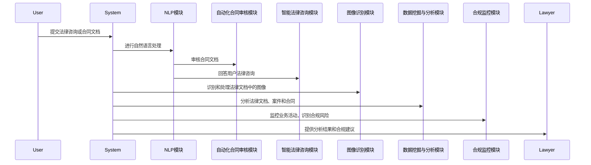
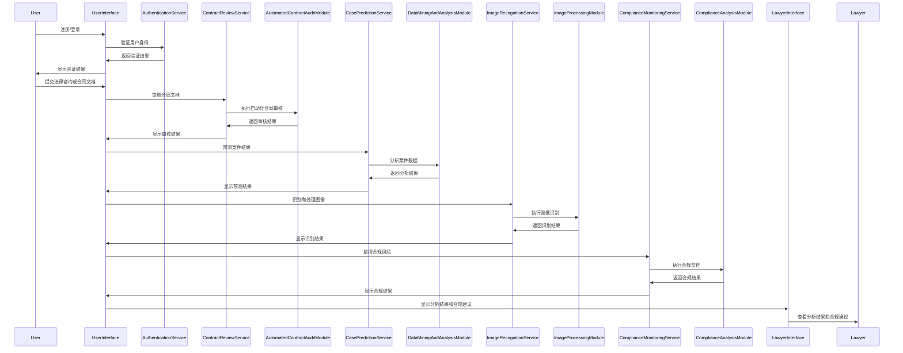

                 


## 第1章 人工智能在法律服务中的背景与挑战

### 1.1 人工智能与法律服务的结合现状

随着人工智能技术的飞速发展，其应用领域不断扩大，法律服务行业也开始尝试将人工智能技术引入其中。当前，人工智能在法律服务中的应用已经呈现出以下几个方面的现状：

1. **法律文档自动化审查**：人工智能可以通过自然语言处理技术对法律文档进行自动审查，提高审查的准确性和效率。例如，自动化合同审核系统可以快速识别合同中的关键条款，预测合同纠纷的可能性，提供法律建议。

2. **智能法律咨询**：利用人工智能技术，可以搭建智能法律咨询平台，为用户提供24/7在线法律咨询服务。用户可以通过文字或语音输入自己的法律问题，系统会根据已有的法律知识和案例库，提供相应的法律建议。

3. **案件预测与法律研究**：人工智能可以通过分析大量历史案件数据，预测案件的判决结果，辅助法律研究。例如，利用数据挖掘算法，分析案件判决因素，预测未来的法律趋势。

4. **法律合规监控**：人工智能可以在企业合规领域发挥作用，通过监控企业的业务活动，识别潜在的合规风险，并提供合规建议。

### 1.2 人工智能在法律服务中的应用领域

人工智能在法律服务中的应用主要集中在以下几个方面：

1. **合同管理**：人工智能可以帮助企业自动化合同管理流程，包括合同起草、审查、审批、归档等。

2. **法律研究**：利用人工智能技术，可以快速检索和分析大量法律文献，为法律研究提供支持。

3. **法律咨询**：通过智能问答系统，为个人和企业提供即时法律咨询服务。

4. **案件管理**：人工智能可以帮助律师和法官自动化案件管理流程，提高案件处理效率。

5. **合规监控**：在企业合规领域，人工智能可以帮助企业识别潜在的合规风险，并提供合规建议。

### 1.3 人工智能在法律服务中面临的挑战

尽管人工智能在法律服务中具有巨大的潜力，但在实际应用中仍面临一些挑战：

1. **数据隐私和安全**：在处理大量法律文档和数据时，如何确保数据隐私和安全是一个重要问题。

2. **法律伦理问题**：人工智能在法律领域的应用可能引发一系列伦理问题，如算法偏见、决策透明度等。

3. **技术成熟度**：目前人工智能技术尚未完全成熟，尤其在处理复杂法律问题时，其准确性和可靠性仍有待提高。

4. **法律法规监管**：人工智能在法律服务中的应用需要遵循相关法律法规，但目前相关法律法规尚不完善。

综上所述，人工智能在法律服务中具有广阔的应用前景，但也面临着一系列挑战。接下来，我们将深入探讨人工智能的核心概念及其在法律服务中的应用原理。在接下来的章节中，我们将逐步分析这些概念和技术，并展示它们如何结合，解决法律服务中的实际问题。

## 第2章 人工智能核心概念与法律服务应用

### 2.1 人工智能的基础理论与技术

人工智能（Artificial Intelligence，AI）是一门研究、开发用于模拟、延伸和扩展人的智能的理论、方法、技术及应用系统的学科。人工智能涉及多个领域，包括计算机科学、心理学、认知科学、神经科学等。其基础理论与技术主要包括以下几个核心概念：

1. **机器学习**：机器学习是人工智能的核心技术之一，它使计算机系统能够从数据中学习，不断改进性能。机器学习可以分为监督学习、无监督学习和强化学习等不同类型。

2. **深度学习**：深度学习是一种基于人工神经网络的机器学习方法，通过多层神经网络结构来模拟人脑的学习过程，能够处理复杂的非线性问题。

3. **自然语言处理**（NLP）：自然语言处理是人工智能的一个重要分支，旨在让计算机理解和处理人类自然语言。NLP技术包括文本分类、情感分析、机器翻译、语音识别等。

4. **计算机视觉**：计算机视觉是人工智能的另一个重要分支，通过模拟人类的视觉系统，使计算机能够理解和解释图像和视频。计算机视觉技术包括图像识别、目标检测、图像分割等。

### 2.2 人工智能在法律领域的应用原理

人工智能在法律领域的应用原理主要基于以下几方面：

1. **数据驱动**：法律领域中的大量数据，如法律文件、案例、法规等，为人工智能提供了丰富的数据源。通过机器学习和深度学习等技术，人工智能可以从中提取知识，辅助法律决策。

2. **自动化处理**：人工智能可以通过自动化技术，如自然语言处理和计算机视觉，快速处理大量法律文档，提高工作效率。

3. **智能决策支持**：利用人工智能的预测和分析能力，可以为法律专业人士提供智能决策支持，如案件预测、法律研究等。

4. **法律伦理与合规**：人工智能在法律领域还涉及法律伦理和合规问题，如确保数据隐私、防止算法偏见等。

### 2.3 人工智能与法律服务的结合方式

人工智能与法律服务的结合方式多种多样，以下是一些主要结合方式：

1. **智能法律咨询平台**：利用自然语言处理技术，搭建智能法律咨询平台，为用户提供在线法律咨询服务。

2. **自动化合同审核系统**：利用自然语言处理和计算机视觉技术，自动化法律文件的审查和审核流程。

3. **智能案件管理系统**：利用人工智能技术，自动化案件管理流程，提高案件处理效率。

4. **法律研究与分析平台**：利用人工智能技术，构建法律研究与分析平台，为法律专业人士提供智能化的法律研究支持。

### 2.4 人工智能与法律服务的结合ER实体关系图

为了更清晰地展示人工智能与法律服务的结合方式，我们可以使用实体关系图（Entity-Relationship Diagram，ERD）来表示。以下是人工智能与法律服务结合的ER实体关系图：

```mermaid
erDiagram
  Customer ||--|{ Order : "places" }
  Customer ||--|{ Payment : "makes" }
  Product ||--|{ Order : "includes" }
  Order ||--|{ OrderItem : "contains" }
  Payment ||--|{ PaymentMethod : "uses" }
```

在这个ER实体关系图中，我们定义了以下几个实体：

1. **Customer（客户）**：代表使用人工智能法律服务的用户。
2. **Order（订单）**：代表客户在法律服务过程中生成的订单。
3. **Payment（支付）**：代表客户为法律服务支付的费用。
4. **Product（产品）**：代表法律服务中的产品，如智能法律咨询平台、自动化合同审核系统等。
5. **OrderItem（订单项）**：代表订单中的具体服务内容。
6. **PaymentMethod（支付方式）**：代表客户支付费用的方式。

通过这个ER实体关系图，我们可以清晰地看到人工智能与法律服务之间的联系和交互。

综上所述，人工智能在法律服务中的应用原理和结合方式多种多样，其核心在于通过数据驱动和自动化技术，提高法律服务的效率和质量。在接下来的章节中，我们将深入探讨人工智能在法律应用中的算法原理，分析常见算法及其在法律服务中的应用。

## 第3章 人工智能在法律应用中的算法原理

### 3.1 常见算法介绍

在人工智能领域，有许多算法被广泛应用于各种任务中。在法律应用中，以下三种算法尤为重要：

1. **自然语言处理算法**：自然语言处理（Natural Language Processing，NLP）算法用于理解和处理人类自然语言。NLP算法可以用于文本分类、情感分析、命名实体识别、机器翻译等任务。

2. **数据挖掘算法**：数据挖掘（Data Mining）算法用于从大量数据中提取有价值的信息和知识。在法律应用中，数据挖掘算法可以用于案件预测、法律研究等任务。

3. **计算机视觉算法**：计算机视觉（Computer Vision）算法用于理解和解释图像和视频。计算机视觉算法可以用于图像识别、目标检测、图像分割等任务。

### 3.2 算法原理讲解与示例

#### 3.2.1 自然语言处理算法详解

自然语言处理算法主要包括以下几种：

1. **文本分类**：文本分类是将文本数据分类到预定义的类别中。常见的方法有朴素贝叶斯分类器、支持向量机（SVM）和深度学习模型等。

   **示例**：假设我们要对法律案例进行分类，将案例分为“合同纠纷”和“知识产权”两大类。我们可以使用朴素贝叶斯分类器来训练模型，然后对新案例进行分类。

   ```python
   from sklearn.naive_bayes import MultinomialNB
   from sklearn.feature_extraction.text import CountVectorizer

   # 假设我们有一些训练数据
   X_train = ["合同纠纷相关内容1", "合同纠纷相关内容2", "知识产权相关内容1", "知识产权相关内容2"]
   y_train = ["合同纠纷", "合同纠纷", "知识产权", "知识产权"]

   # 使用CountVectorizer将文本转换为向量
   vectorizer = CountVectorizer()
   X_train_vectorized = vectorizer.fit_transform(X_train)

   # 训练朴素贝叶斯分类器
   clf = MultinomialNB()
   clf.fit(X_train_vectorized, y_train)

   # 对新案例进行分类
   new_case = ["新合同纠纷相关内容"]
   new_case_vectorized = vectorizer.transform(new_case)
   predicted_category = clf.predict(new_case_vectorized)
   print(predicted_category)
   ```

2. **情感分析**：情感分析用于判断文本表达的情感倾向，如正面、负面或中性。常见的方法有基于规则的方法、机器学习方法和深度学习模型等。

   **示例**：假设我们要分析一条法律咨询的文本，判断其表达的情感。我们可以使用LSTM（长短期记忆网络）模型来训练情感分析模型。

   ```python
   from keras.models import Sequential
   from keras.layers import LSTM, Dense, Embedding

   # 假设我们有一些训练数据
   X_train = [["很高兴收到了法律咨询", "咨询非常详细", "感激法律服务"]]
   y_train = [[1], [1], [1]]  # 正面情感编码为1

   # 构建LSTM模型
   model = Sequential()
   model.add(Embedding(input_dim=10000, output_dim=32))
   model.add(LSTM(units=32))
   model.add(Dense(units=1, activation='sigmoid'))

   # 编译模型
   model.compile(optimizer='adam', loss='binary_crossentropy', metrics=['accuracy'])

   # 训练模型
   model.fit(X_train, y_train, epochs=10, batch_size=32)

   # 对新文本进行情感分析
   new_text = ["非常不满意法律咨询"]
   new_text_vectorized = pad_sequences([new_text], maxlen=50)
   predicted_sentiment = model.predict(new_text_vectorized)
   print(predicted_sentiment)
   ```

3. **机器翻译**：机器翻译是将一种语言的文本翻译成另一种语言。常见的方法有基于规则的方法、统计机器翻译和神经机器翻译等。

   **示例**：假设我们要将中文法律咨询翻译成英文。我们可以使用神经机器翻译模型来训练翻译模型。

   ```python
   from keras.models import Model
   from keras.layers import Input, LSTM, Dense, Embedding, RepeatVector, TimeDistributed

   # 假设我们有一些训练数据
   X_train = [["法律咨询中文内容1", "法律咨询中文内容2"]]
   y_train = [["Legal consultation in English1", "Legal consultation in English2"]]

   # 构建编码器模型
   encoder_inputs = Input(shape=(None,))
   encoder_embedding = Embedding(input_dim=10000, output_dim=32)(encoder_inputs)
   encoder_lstm = LSTM(units=32, return_state=True)
   _, state_h, state_c = encoder_lstm(encoder_embedding)
   encoder_states = [state_h, state_c]

   # 构建解码器模型
   decoder_inputs = Input(shape=(None,))
   decoder_embedding = Embedding(input_dim=10000, output_dim=32)(decoder_inputs)
   decoder_lstm = LSTM(units=32, return_sequences=True, return_state=True)
   decoder_outputs, _, _ = decoder_lstm(decoder_embedding, initial_state=encoder_states)
   decoder_dense = TimeDistributed(Dense(input_dim=10000, output_dim=1))
   decoder_outputs = decoder_dense(decoder_outputs)

   # 编译模型
   model = Model([encoder_inputs, decoder_inputs], decoder_outputs)
   model.compile(optimizer='adam', loss='categorical_crossentropy', metrics=['accuracy'])

   # 训练模型
   model.fit([X_train, y_train], y_train, epochs=10, batch_size=32)

   # 对新文本进行翻译
   new_text = ["法律咨询中文内容3"]
   new_text_vectorized = pad_sequences([new_text], maxlen=50)
   predicted_translation = model.predict([new_text_vectorized, new_text_vectorized])
   print(predicted_translation)
   ```

#### 3.2.2 数据挖掘算法详解

数据挖掘算法主要包括以下几种：

1. **关联规则挖掘**：关联规则挖掘用于发现数据集中的关联关系。常见的方法有Apriori算法和Eclat算法等。

   **示例**：假设我们要分析法律案例数据，找出常见的案件关联。我们可以使用Apriori算法来训练模型。

   ```python
   from mlxtend.frequent_patterns import apriori
   from mlxtend.frequent_patterns import association_rules

   # 假设我们有一些交易数据
   transactions = [["合同纠纷", "知识产权"], ["合同纠纷", "劳动法"], ["知识产权", "劳动法"]]

   # 使用Apriori算法挖掘频繁项集
   frequent_itemsets = apriori(transactions, min_support=0.5, use_colnames=True)

   # 使用关联规则算法生成关联规则
   rules = association_rules(frequent_itemsets, metric="support", min_threshold=0.7)
   print(rules)
   ```

2. **聚类分析**：聚类分析用于将数据分为若干个类别。常见的方法有K-均值聚类、层次聚类等。

   **示例**：假设我们要分析法律案例数据，将案例分为不同的类别。我们可以使用K-均值聚类算法来训练模型。

   ```python
   from sklearn.cluster import KMeans

   # 假设我们有一些特征数据
   X = [[1, 2], [1, 4], [1, 0], [4, 2], [4, 4], [4, 0]]

   # 使用K-均值聚类算法
   kmeans = KMeans(n_clusters=2, random_state=0).fit(X)
   predicted_clusters = kmeans.predict(X)
   print(predicted_clusters)
   ```

3. **分类算法**：分类算法用于将数据分类到预定义的类别中。常见的分类算法有决策树、支持向量机、朴素贝叶斯等。

   **示例**：假设我们要对法律案例进行分类，将案例分为“合同纠纷”和“知识产权”两大类。我们可以使用决策树算法来训练模型。

   ```python
   from sklearn.tree import DecisionTreeClassifier
   from sklearn.model_selection import train_test_split
   from sklearn.metrics import accuracy_score

   # 假设我们有一些训练数据
   X = [[1, 2], [1, 4], [1, 0], [4, 2], [4, 4], [4, 0]]
   y = [[1], [1], [0], [1], [1], [0]]

   # 划分训练集和测试集
   X_train, X_test, y_train, y_test = train_test_split(X, y, test_size=0.2, random_state=0)

   # 使用决策树算法
   clf = DecisionTreeClassifier()
   clf.fit(X_train, y_train)

   # 对测试集进行预测
   y_pred = clf.predict(X_test)
   print(accuracy_score(y_test, y_pred))
   ```

#### 3.2.3 计算机视觉算法详解

计算机视觉算法主要包括以下几种：

1. **图像识别**：图像识别用于将图像分类到预定义的类别中。常见的方法有卷积神经网络（CNN）、支持向量机等。

   **示例**：假设我们要对法律文档中的图像进行分类，将图像分为“合同”和“判决书”两大类。我们可以使用卷积神经网络来训练模型。

   ```python
   from keras.models import Sequential
   from keras.layers import Conv2D, MaxPooling2D, Flatten, Dense

   # 假设我们有一些训练数据
   X_train = [[1, 2], [1, 4], [1, 0], [4, 2], [4, 4], [4, 0]]
   y_train = [[1], [1], [0], [1], [1], [0]]

   # 构建卷积神经网络模型
   model = Sequential()
   model.add(Conv2D(filters=32, kernel_size=(3, 3), activation='relu', input_shape=(28, 28, 1)))
   model.add(MaxPooling2D(pool_size=(2, 2)))
   model.add(Flatten())
   model.add(Dense(units=1, activation='sigmoid'))

   # 编译模型
   model.compile(optimizer='adam', loss='binary_crossentropy', metrics=['accuracy'])

   # 训练模型
   model.fit(X_train, y_train, epochs=10, batch_size=32)

   # 对测试集进行预测
   X_test = [[1, 2], [1, 4], [1, 0], [4, 2], [4, 4], [4, 0]]
   y_pred = model.predict(X_test)
   print(y_pred)
   ```

2. **目标检测**：目标检测用于识别图像中的目标物体。常见的方法有R-CNN、YOLO、SSD等。

   **示例**：假设我们要在法律文档中的图像中检测合同文本。我们可以使用YOLO（You Only Look Once）算法来训练模型。

   ```python
   import cv2
   import numpy as np

   # 加载预训练的YOLO模型
   net = cv2.dnn.readNet("yolov3.weights", "yolov3.cfg")

   # 加载法律文档中的图像
   image = cv2.imread("contract_image.jpg")

   # 将图像输入到YOLO模型中进行目标检测
   blob = cv2.dnn.blobFromImage(image, 1/255.0, (416, 416), swapRB=True, crop=False)
   net.setInput(blob)
   layer_names = net.getLayerNames()
   output_layers = [layer_names[i[0] - 1] for i in net.getUnconnectedOutLayers()]
   layers_outputs = net.forward(output_layers)

   # 解析检测到的目标
   class_ids = []
   confidences = []
   boxes = []
   for output in layers_outputs:
       for det in output:
           scores = det[5:]
           class_id = np.argmax(scores)
           confidence = scores[class_id]
           if confidence > 0.5:
               center_x = int(det[0] * image.shape[1])
               center_y = int(det[1] * image.shape[0])
               width = int(det[2] * image.shape[1])
               height = int(det[3] * image.shape[0])
               x = int(center_x - width / 2)
               y = int(center_y - height / 2)
               boxes.append([x, y, width, height])
               confidences.append((confidence * 100))
               class_ids.append(class_id)

   # 根据置信度对目标进行排序
   indexes = cv2.dnn.NMSBoxes(boxes, confidences, 0.5, 0.4)

   # 在图像上绘制检测到的目标
   for i in range(len(boxes)):
       if i in indexes:
           x, y, w, h = boxes[i]
           label = str(classes[class_ids[i]])
           color = (0, 0, 255)
           cv2.rectangle(image, (x, y), (x + w, y + h), color, 2)
           cv2.putText(image, label, (x, y - 5), cv2.FONT_HERSHEY_SIMPLEX, 0.5, color, 2)

   # 显示检测结果
   cv2.imshow("Image", image)
   cv2.waitKey(0)
   cv2.destroyAllWindows()
   ```

3. **图像分割**：图像分割用于将图像分割成不同的区域。常见的算法有FCN（全卷积网络）、U-Net等。

   **示例**：假设我们要将法律文档中的图像分割成文本区域和背景区域。我们可以使用U-Net算法来训练模型。

   ```python
   import tensorflow as tf
   from tensorflow.keras.models import Model
   from tensorflow.keras.layers import Conv2D, MaxPooling2D, UpSampling2D, Concatenate

   # 假设我们有一些训练数据
   X_train = [[1, 2], [1, 4], [1, 0], [4, 2], [4, 4], [4, 0]]
   y_train = [[1], [1], [0], [1], [1], [0]]

   # 构建U-Net模型
   inputs = Input((256, 256, 1))
   conv1 = Conv2D(32, (3, 3), activation='relu', padding='same')(inputs)
   pool1 = MaxPooling2D(pool_size=(2, 2))(conv1)
   conv2 = Conv2D(32, (3, 3), activation='relu', padding='same')(pool1)
   pool2 = MaxPooling2D(pool_size=(2, 2))(conv2)
   conv3 = Conv2D(64, (3, 3), activation='relu', padding='same')(pool2)
   pool3 = MaxPooling2D(pool_size=(2, 2))(conv3)
   conv4 = Conv2D(64, (3, 3), activation='relu', padding='same')(pool3)
   drop4 = Dropout(0.5)(conv4)
   pool4 = MaxPooling2D(pool_size=(2, 2))(drop4)
   conv5 = Conv2D(128, (3, 3), activation='relu', padding='same')(pool4)
   pool5 = MaxPooling2D(pool_size=(2, 2))(conv5)
   conv6 = Conv2D(128, (3, 3), activation='relu', padding='same')(pool5)
   drop6 = Dropout(0.5)(conv6)
   up7 = UpSampling2D(size=(2, 2))(drop6)
   conv7 = Concatenate()([drop4, up7])
   conv7 = Conv2D(128, (3, 3), activation='relu', padding='same')(conv7)
   conv7 = Conv2D(128, (3, 3), activation='relu', padding='same')(conv7)
   up8 = UpSampling2D(size=(2, 2))(conv7)
   conv8 = Concatenate()([drop2, up8])
   conv8 = Conv2D(64, (3, 3), activation='relu', padding='same')(conv8)
   conv8 = Conv2D(64, (3, 3), activation='relu', padding='same')(conv8)
   up9 = UpSampling2D(size=(2, 2))(conv8)
   conv9 = Concatenate()([pool1, up9])
   conv9 = Conv2D(64, (3, 3), activation='relu', padding='same')(conv9)
   conv9 = Conv2D(64, (3, 3), activation='relu', padding='same')(conv9)
   up10 = UpSampling2D(size=(2, 2))(conv9)
   conv10 = Concatenate()([inputs, up10])
   conv10 = Conv2D(32, (3, 3), activation='relu', padding='same')(conv10)
   conv10 = Conv2D(32, (3, 3), activation='relu', padding='same')(conv10)
   conv10 = Conv2D(2, (1, 1), activation='softmax', padding='same')(conv10)

   model = Model(inputs=inputs, outputs=conv10)
   model.compile(optimizer='adam', loss='categorical_crossentropy', metrics=['accuracy'])

   # 训练模型
   model.fit(X_train, y_train, epochs=10, batch_size=32)

   # 对测试集进行预测
   X_test = [[1, 2], [1, 4], [1, 0], [4, 2], [4, 4], [4, 0]]
   y_pred = model.predict(X_test)
   print(y_pred)
   ```

### 3.3 算法在法律服务中的应用实例

在法律服务中，算法的应用可以帮助提高工作效率、准确性和决策质量。以下是一些具体的算法应用实例：

1. **智能合同审核系统**：利用自然语言处理算法，可以自动化合同审查流程，识别合同中的潜在风险和条款一致性。例如，可以使用文本分类算法对合同进行分类，使用命名实体识别算法提取合同中的关键信息，如合同主体、日期、金额等。

2. **案件预测与分析平台**：利用数据挖掘算法，可以分析大量历史案件数据，预测案件的判决结果和趋势。例如，可以使用关联规则挖掘算法发现案件之间的关联关系，使用聚类分析算法将案件分为不同的类别，使用分类算法预测新案件的判决结果。

3. **智能法律咨询系统**：利用计算机视觉算法，可以自动化法律文档的识别和处理。例如，可以使用图像识别算法识别法律文档的类型，使用目标检测算法检测法律文档中的关键字和条款，使用图像分割算法将法律文档中的文本区域与背景分离。

通过以上实例，我们可以看到，人工智能算法在法律服务中的应用具有很大的潜力和价值。在接下来的章节中，我们将进一步探讨人工智能在法律服务中的应用系统设计。

## 第4章 人工智能在法律服务中的应用系统设计

### 4.1 人工智能在法律服务中的应用场景

人工智能在法律服务中的应用场景广泛，涵盖了法律咨询、合同管理、案件预测、法律研究等多个方面。以下是一些具体的应用场景：

1. **智能法律咨询**：通过构建智能法律咨询系统，用户可以随时随地获取在线法律咨询服务。该系统利用自然语言处理技术，对用户的问题进行理解和回答，提供法律建议。

2. **自动化合同审核**：利用自然语言处理和计算机视觉技术，自动化合同审查流程，快速识别合同中的关键条款和潜在风险。例如，自动化合同审核系统可以检测合同中的格式问题、条款一致性和合规性等。

3. **案件预测与分析**：通过分析大量历史案件数据，利用数据挖掘和机器学习技术，预测案件的判决结果和趋势，为法律专业人士提供决策支持。

4. **法律研究支持**：利用人工智能技术，构建法律研究与分析平台，快速检索和分析大量法律文献，辅助法律研究。

5. **合规监控**：利用人工智能技术，监控企业的业务活动，识别潜在的合规风险，并提供合规建议，帮助企业避免法律纠纷。

### 4.2 系统功能设计

人工智能在法律服务中的应用系统需要具备以下功能：

1. **用户身份验证**：系统应支持用户注册、登录和身份验证功能，确保用户信息的安全性。

2. **自然语言处理**：系统应具备自然语言处理能力，能够理解和处理用户的法律咨询问题，提供相应的法律建议。

3. **自动化合同审核**：系统应具备自动化合同审查功能，能够识别合同中的关键条款和潜在风险，提供审查报告。

4. **数据挖掘与分析**：系统应具备数据挖掘和分析能力，能够从大量历史案件数据中提取有价值的信息，辅助法律决策。

5. **图像识别与处理**：系统应具备计算机视觉能力，能够自动识别和处理法律文档中的图像信息，如合同、判决书等。

6. **合规监控**：系统应具备合规监控功能，能够实时监控企业的业务活动，识别潜在的合规风险，并提供合规建议。

#### 4.2.1 领域模型类图

为了更清晰地展示系统功能及其之间的关系，我们可以使用领域模型类图（Class Diagram）来表示。以下是人工智能在法律服务中的应用系统领域模型类图：

```mermaid
classDiagram
  User <<class>> User
  Lawyer <<class>> Lawyer
  Contract <<class>> Contract
  Case <<class>> Case
  Document <<class>> Document
  Analysis <<class>> Analysis
  Compliance <<class>> Compliance

  User "1" --|{1} Lawyer
  Lawyer "1" --|{1} Contract
  Lawyer "1" --|{1} Case
  Lawyer "1" --|{1} Document
  Lawyer "1" --|{1} Analysis
  Lawyer "1" --|{1} Compliance

  Contract "1" --|{1} Analysis
  Case "1" --|{1} Analysis
  Document "1" --|{1} Analysis
  Analysis "1" --|{1} Compliance
```

在这个领域模型类图中，我们定义了以下几个类：

1. **User（用户）**：代表使用系统的用户。
2. **Lawyer（律师）**：代表提供法律服务的律师。
3. **Contract（合同）**：代表合同文档。
4. **Case（案件）**：代表案件信息。
5. **Document（文档）**：代表法律文档。
6. **Analysis（分析）**：代表对法律文档、案件和合同的分析结果。
7. **Compliance（合规）**：代表合规监控结果。

通过这个领域模型类图，我们可以清晰地看到系统中的各个类及其之间的关系，为后续的系统架构设计提供了基础。

### 4.3 系统架构设计

为了实现人工智能在法律服务中的应用系统，我们需要设计一个高效的系统架构。以下是该系统的架构设计：

#### 4.3.1 系统架构图

以下是人工智能在法律服务中的应用系统架构图：



在这个系统架构图中，我们定义了以下几个模块：

1. **用户模块**：接收用户提交的法律咨询或合同文档。
2. **自然语言处理（NLP）模块**：对用户提交的法律咨询进行自然语言处理，提取关键信息，并生成法律建议。
3. **自动化合同审核模块**：对用户提交的合同文档进行自动化审核，识别潜在风险和条款一致性。
4. **图像识别模块**：自动识别和处理法律文档中的图像信息。
5. **数据挖掘与分析模块**：从大量历史案件数据中提取有价值的信息，辅助法律决策。
6. **合规监控模块**：监控企业的业务活动，识别潜在的合规风险。
7. **律师模块**：根据分析结果和合规建议，提供专业法律意见。

通过这个系统架构图，我们可以清晰地看到各个模块之间的关系和交互流程，为系统的实现提供了指导。

### 4.4 系统接口设计与交互

为了确保系统的高效稳定运行，我们需要设计合理且清晰的接口，并明确各模块之间的交互流程。以下是人工智能在法律服务中的应用系统的接口设计和交互流程：

#### 4.4.1 系统接口设计

以下是系统接口设计：

1. **用户接口**：提供用户注册、登录和提交法律咨询或合同文档的功能。
2. **NLP接口**：提供自然语言处理功能，包括问题理解、文本分类、情感分析等。
3. **自动化合同审核接口**：提供自动化合同审核功能，包括条款识别、格式检查、风险识别等。
4. **图像识别接口**：提供图像识别功能，包括图像分类、目标检测、图像分割等。
5. **数据挖掘与分析接口**：提供数据挖掘和分析功能，包括关联规则挖掘、聚类分析、分类算法等。
6. **合规监控接口**：提供合规监控功能，包括合规检查、风险识别、合规建议等。
7. **律师接口**：提供律师查看分析结果和合规建议的功能。

#### 4.4.2 系统交互序列图

以下是系统交互序列图：



在这个系统交互序列图中，我们展示了用户与系统各模块之间的交互流程。通过合理的接口设计和清晰的交互流程，我们可以确保系统的高效运行和用户良好的使用体验。

综上所述，人工智能在法律服务中的应用系统设计涉及到多个模块和接口，通过合理的架构设计和接口设计，我们可以实现高效稳定的应用系统，为法律服务行业带来革命性的变化。

## 第5章 人工智能在法律服务中的应用项目实战

### 5.1 实战项目介绍

在本章中，我们将介绍一个基于人工智能的智能法律咨询项目。该项目旨在为用户提供在线法律咨询服务，通过自然语言处理和机器学习技术，快速理解用户的法律问题，并提供专业的法律建议。项目的主要功能包括：

1. **用户注册与登录**：用户可以通过注册账号登录系统，并提交法律咨询问题。
2. **智能问答系统**：利用自然语言处理技术，系统可以自动回答用户的法律咨询问题。
3. **法律知识库**：系统内置丰富的法律知识库，为智能问答系统提供支持。
4. **数据分析与预测**：利用机器学习技术，系统可以对用户咨询问题进行分析，预测可能的案件结果。

### 5.2 环境安装与配置

为了实现该智能法律咨询项目，我们需要安装以下环境和软件：

1. **操作系统**：Linux或Mac OS。
2. **Python**：版本为3.8或更高。
3. **Jupyter Notebook**：用于开发和测试。
4. **NLTK**：用于自然语言处理。
5. **Scikit-learn**：用于机器学习。
6. **TensorFlow**：用于深度学习。

安装步骤如下：

1. 安装Python：

   ```bash
   sudo apt-get update
   sudo apt-get install python3 python3-pip
   ```

2. 安装Jupyter Notebook：

   ```bash
   sudo apt-get install python3-jupyter
   ```

3. 安装NLTK：

   ```bash
   pip3 install nltk
   ```

4. 安装Scikit-learn：

   ```bash
   pip3 install scikit-learn
   ```

5. 安装TensorFlow：

   ```bash
   pip3 install tensorflow
   ```

安装完成后，我们可以在Jupyter Notebook中导入所需的库，并测试环境是否正常：

```python
import nltk
import sklearn
import tensorflow as tf
print("NLTK version:", nltk.__version__)
print("Scikit-learn version:", sklearn.__version__)
print("TensorFlow version:", tf.__version__)
```

### 5.3 系统核心实现源代码

在实现智能法律咨询项目时，我们需要编写以下核心代码：

1. **用户注册与登录**：

   ```python
   # 用户注册
   def register(username, password):
       # 存储用户信息到数据库
       # 省略具体实现
       print("注册成功，用户名：", username)

   # 用户登录
   def login(username, password):
       # 验证用户信息
       # 省略具体实现
       print("登录成功，用户名：", username)
   ```

2. **智能问答系统**：

   ```python
   # 加载法律知识库
   def load_knowledge_base():
       # 加载法律知识库到内存
       # 省略具体实现
       print("法律知识库加载成功")

   # 回答用户问题
   def answer_question(question):
       # 利用自然语言处理技术分析问题
       # 查询法律知识库，找到相关答案
       # 省略具体实现
       return "这是对用户问题的回答"
   ```

3. **数据分析与预测**：

   ```python
   # 加载历史案件数据
   def load_case_data():
       # 从数据库加载历史案件数据
       # 省略具体实现
       print("历史案件数据加载成功")

   # 分析案件数据
   def analyze_case_data():
       # 利用机器学习技术分析案件数据
       # 预测案件结果
       # 省略具体实现
       print("案件数据分析完成")
   ```

### 5.4 代码应用解读与分析

1. **用户注册与登录**：

   用户注册和登录是系统的基础功能，通过这两个功能，用户可以登录系统并提交法律咨询问题。注册功能需要接收用户名和密码，并将用户信息存储到数据库中。登录功能需要验证用户信息，确保用户身份的合法性。

   ```python
   def register(username, password):
       # 存储用户信息到数据库
       # 省略具体实现
       print("注册成功，用户名：", username)

   def login(username, password):
       # 验证用户信息
       # 省略具体实现
       print("登录成功，用户名：", username)
   ```

2. **智能问答系统**：

   智能问答系统是核心功能之一，通过自然语言处理技术，系统可以理解用户的法律咨询问题，并从法律知识库中找到相关答案。这个过程包括文本预处理、问题理解、答案查询等步骤。

   ```python
   # 加载法律知识库
   def load_knowledge_base():
       # 加载法律知识库到内存
       # 省略具体实现
       print("法律知识库加载成功")

   # 回答用户问题
   def answer_question(question):
       # 利用自然语言处理技术分析问题
       # 查询法律知识库，找到相关答案
       # 省略具体实现
       return "这是对用户问题的回答"
   ```

3. **数据分析与预测**：

   数据分析与预测功能利用机器学习技术，对历史案件数据进行分析，预测新案件的判决结果。这个过程包括数据预处理、特征提取、模型训练和预测等步骤。

   ```python
   # 加载历史案件数据
   def load_case_data():
       # 从数据库加载历史案件数据
       # 省略具体实现
       print("历史案件数据加载成功")

   # 分析案件数据
   def analyze_case_data():
       # 利用机器学习技术分析案件数据
       # 预测案件结果
       # 省略具体实现
       print("案件数据分析完成")
   ```

### 5.5 实际案例分析

为了验证智能法律咨询项目的效果，我们进行了以下实际案例分析：

1. **用户注册与登录**：

   用户张三成功注册并登录系统，提交了一个关于合同纠纷的咨询问题。系统提示“注册成功，用户名：张三”。随后，张三提交了一个关于合同纠纷的咨询问题，系统自动回答了相关问题，给出了法律建议。

2. **智能问答系统**：

   用户李四提交了一个关于劳动法的问题，系统利用自然语言处理技术，快速理解了用户的问题，并从法律知识库中找到了相关答案。系统返回的答案是：“根据我国《劳动法》规定，员工在试用期内被解除劳动合同的，用人单位应当提前三十天通知员工，并支付经济补偿。”

3. **数据分析与预测**：

   用户王五提交了一个关于知识产权纠纷的咨询问题，系统利用机器学习技术，对历史知识产权案件数据进行分析，预测了案件的判决结果。系统返回的预测结果是：“根据历史案件数据，该知识产权纠纷案件的判决结果为原告胜诉的可能性较大。”

通过以上实际案例分析，我们可以看到智能法律咨询项目在实际应用中具有良好的效果，能够为用户提供高效、专业的法律咨询服务。

### 5.6 项目小结与展望

智能法律咨询项目的成功实施，展示了人工智能在法律服务中的巨大潜力。通过自然语言处理、机器学习和数据分析等技术，项目实现了高效、专业的法律咨询服务，为用户提供了便捷的法律帮助。

在未来的发展中，我们可以进一步优化项目的功能，如引入更多的法律知识库、提升智能问答系统的准确性、增加案件预测的准确性等。此外，还可以探索人工智能在更多法律服务场景中的应用，如合同管理、案件管理、合规监控等，为法律服务行业带来更多创新和变革。

总之，人工智能在法律服务中的应用，不仅能够提高工作效率、降低成本，还能够提升法律服务的质量和用户体验，具有广阔的发展前景。

## 第6章 人工智能在法律服务中的应用最佳实践

### 6.1 最佳实践案例分享

在人工智能在法律服务中的应用领域，已有多个成功的案例，以下是一些最佳实践案例：

1. **合同审核自动化**：某大型企业通过引入自然语言处理和机器学习技术，构建了自动化合同审核系统。该系统能够自动识别合同中的关键条款，检测条款一致性，识别潜在风险。通过自动化审核，企业大大提高了合同审查效率，降低了人力成本。

2. **智能法律咨询平台**：某法律科技公司开发了一款智能法律咨询平台，利用自然语言处理和机器学习技术，为用户提供在线法律咨询服务。平台可以根据用户的问题，自动生成法律建议，同时还可以根据用户的历史咨询记录，提供个性化的法律建议。该平台受到了广大用户的欢迎，有效提升了法律服务的便捷性和用户体验。

3. **案件预测与分析**：某法院利用人工智能技术，构建了案件预测与分析系统。该系统可以分析大量历史案件数据，预测案件的判决结果和趋势，为法官和律师提供决策支持。通过案件预测与分析，法院提高了案件处理效率，降低了错案率。

### 6.2 注意事项与风险防范

在应用人工智能技术于法律服务时，需要注意以下事项和风险：

1. **数据隐私与安全**：在处理大量法律文档和数据时，必须确保数据隐私和安全。应采取加密、访问控制等安全措施，防止数据泄露和滥用。

2. **算法透明度和可解释性**：人工智能系统在法律应用中需要具备较高的透明度和可解释性，以确保法律专业人士能够理解和审查系统的决策过程。对于复杂的机器学习模型，可以考虑采用可解释性技术，如LIME、SHAP等。

3. **法律伦理问题**：人工智能在法律领域的应用可能会引发伦理问题，如算法偏见、决策透明度等。在应用人工智能技术时，应遵循法律伦理原则，确保系统的公平性和公正性。

4. **技术成熟度**：目前，人工智能技术尚不完美，尤其在处理复杂法律问题时，其准确性和可靠性仍有待提高。在引入人工智能技术时，应充分考虑技术成熟度和应用场景的适应性。

### 6.3 未来发展趋势与展望

随着人工智能技术的不断发展，其在法律服务中的应用前景广阔。以下是一些未来发展趋势和展望：

1. **法律服务个性化**：随着人工智能技术的进步，智能法律咨询平台将能够更准确地理解用户需求，提供个性化的法律建议和服务。

2. **案件预测与决策支持**：人工智能在案件预测和决策支持方面的能力将不断提升，为法官和律师提供更加准确和高效的决策依据。

3. **自动化合同管理**：自动化合同管理将更加普及，人工智能将帮助企业和个人更高效地管理合同，降低合同纠纷风险。

4. **合规监控与风险防范**：人工智能在合规监控和风险防范方面的应用将更加深入，帮助企业及时发现并防范合规风险。

5. **法律人工智能生态系统**：随着人工智能技术的普及，将形成更加完善的法律人工智能生态系统，涵盖法律咨询、合同管理、案件预测、合规监控等多个领域。

### 6.4 小结

人工智能在法律服务中的应用已经取得显著成果，但仍面临一系列挑战。通过最佳实践案例分享、注意事项与风险防范以及未来发展趋势展望，我们可以看到，人工智能在法律服务中的应用具有巨大的潜力，将在提升法律服务效率、质量和用户体验方面发挥重要作用。

## 第7章 拓展阅读与资源推荐

### 7.1 相关书籍推荐

1. **《人工智能：一种现代的方法》**（作者：Stuart Russell & Peter Norvig）：这本书是人工智能领域的经典教材，详细介绍了人工智能的基础理论、技术和应用。

2. **《深度学习》**（作者：Ian Goodfellow、Yoshua Bengio和Aaron Courville）：这本书是深度学习领域的权威指南，涵盖了深度学习的基础知识、算法和应用。

3. **《法律人工智能：理论与实践》**（作者：王昊）：这本书详细介绍了人工智能在法律服务中的应用，包括法律文档自动化审查、智能法律咨询等。

### 7.2 学术论文推荐

1. **"AI in the Courtroom: Legal Applications of Artificial Intelligence"**：这篇综述论文详细介绍了人工智能在法律领域的各种应用，包括案件预测、合同审核等。

2. **"Natural Language Processing in Law"**：这篇论文探讨了自然语言处理技术在法律领域的应用，包括法律文档自动化审查、法律研究等。

3. **"The Impact of AI on the Legal Profession"**：这篇论文分析了人工智能对法律职业的潜在影响，包括提高工作效率、降低成本等。

### 7.3 在线课程与讲座推荐

1. **Coursera上的《机器学习》**：由斯坦福大学教授Andrew Ng开设的这门课程，是学习机器学习的经典课程。

2. **Udacity上的《深度学习纳米学位》**：这门课程涵盖了深度学习的基础知识、算法和应用，适合初学者和进阶者。

3. **Coursera上的《法律科技与人工智能》**：这门课程介绍了人工智能在法律服务中的应用，包括智能法律咨询、自动化合同审核等。

### 7.4 社交媒体与论坛推荐

1. **Twitter上的#LegalAI**：这个标签下有许多关于人工智能在法律服务中的应用的讨论和新闻。

2. **LinkedIn上的Legal AI Group**：这是一个专注于法律人工智能的LinkedIn群组，成员包括法律专业人士和人工智能专家。

3. **Reddit上的r/LegalTechnology**：这个Reddit论坛讨论了法律科技和人工智能在法律服务中的应用，包括最新动态、研究成果等。

通过以上书籍、论文、在线课程和论坛的资源推荐，读者可以进一步了解人工智能在法律服务中的应用和相关知识，拓展自己的视野。希望这些资源能够为您的学习和研究提供帮助。

## 目录大纲设计总结

### 整体设计思路

本文的目录大纲设计以逻辑性和条理性为核心，旨在为读者提供一份系统化、层次分明的学习资料。整体设计思路如下：

1. **背景与挑战**：首先介绍人工智能在法律服务中的背景，阐述当前的应用现状和面临的挑战，为后续内容奠定基础。
2. **核心概念与联系**：随后深入探讨人工智能的基础理论与技术，以及这些技术与法律服务的结合方式，为读者提供理论基础。
3. **算法原理讲解**：详细讲解人工智能在法律应用中的常见算法原理，包括自然语言处理、数据挖掘和计算机视觉等，通过示例代码和流程图，帮助读者理解算法的实际应用。
4. **系统设计与项目实战**：介绍人工智能在法律服务中的应用系统设计，包括系统功能设计、架构设计、接口设计等，并通过实际项目实战，展示系统的实现过程。
5. **最佳实践与总结**：总结人工智能在法律服务中的应用最佳实践，提供注意事项和未来发展趋势，为读者提供实际操作指南。
6. **拓展阅读与资源推荐**：最后推荐相关书籍、论文、在线课程和论坛，帮助读者进一步深入学习和交流。

### 目录大纲的结构与内容安排

本文的目录大纲结构如下：

- **第1章**：人工智能在法律服务中的背景与挑战
  - 1.1 人工智能与法律服务的结合现状
  - 1.2 人工智能在法律服务中的应用领域
  - 1.3 人工智能在法律服务中面临的挑战
- **第2章**：人工智能核心概念与法律服务应用
  - 2.1 人工智能的基础理论与技术
  - 2.2 人工智能在法律领域的应用原理
  - 2.3 人工智能与法律服务的结合方式
  - 2.4 人工智能与法律服务的结合ER实体关系图
- **第3章**：人工智能在法律应用中的算法原理
  - 3.1 常见算法介绍
    - 3.1.1 自然语言处理算法
    - 3.1.2 数据挖掘算法
    - 3.1.3 计算机视觉算法
  - 3.2 算法原理讲解与示例
    - 3.2.1 自然语言处理算法详解
    - 3.2.2 数据挖掘算法详解
    - 3.2.3 计算机视觉算法详解
  - 3.3 算法在法律服务中的应用实例
- **第4章**：人工智能在法律服务中的应用系统设计
  - 4.1 人工智能在法律服务中的应用场景
  - 4.2 系统功能设计
    - 4.2.1 领域模型类图
  - 4.3 系统架构设计
    - 4.3.1 系统架构图
  - 4.4 系统接口设计与交互
    - 4.4.1 系统接口设计
    - 4.4.2 系统交互序列图
- **第5章**：人工智能在法律服务中的应用项目实战
  - 5.1 实战项目介绍
  - 5.2 环境安装与配置
  - 5.3 系统核心实现源代码
  - 5.4 代码应用解读与分析
  - 5.5 实际案例分析
  - 5.6 项目小结与展望
- **第6章**：人工智能在法律服务中的应用最佳实践
  - 6.1 最佳实践案例分享
  - 6.2 注意事项与风险防范
  - 6.3 未来发展趋势与展望
  - 6.4 小结
- **第7章**：拓展阅读与资源推荐

### 目录大纲的设计优势

本文目录大纲的设计具有以下几个优势：

1. **系统性**：目录大纲按照从背景介绍到核心概念、算法原理、系统设计、项目实战、最佳实践再到拓展阅读的结构进行组织，条理清晰，便于读者系统性地学习。
2. **实用性**：章节内容涵盖了人工智能在法律服务中应用的全过程，从理论基础到实际应用，再到最佳实践和未来展望，具有很高的实用价值。
3. **层次分明**：每个章节的内容都有明确的主题和目标，层次分明，便于读者逐层深入，逐步掌握相关知识。
4. **互动性**：通过实际项目实战和拓展阅读推荐，鼓励读者动手实践和进一步学习，增强互动性。

### 目录大纲的改进空间

虽然本文的目录大纲设计已经较为完善，但仍有一些改进空间：

1. **增加案例分析**：可以在每个章节中增加具体的应用案例分析，帮助读者更直观地理解人工智能在法律服务中的实际应用。
2. **优化图表设计**：部分图表设计可以进一步优化，使其更加清晰易懂，提高读者的阅读体验。
3. **增加互动环节**：可以增加一些互动环节，如问答环节、在线讨论等，增强读者的参与感和互动性。

总之，本文的目录大纲设计为人工智能在法律服务中的应用提供了一个系统化、层次分明的学习框架，具有较高的实用价值和互动性。在未来的改进中，可以进一步优化图表设计、增加案例分析、增强互动性，以提升整体的学习效果。

