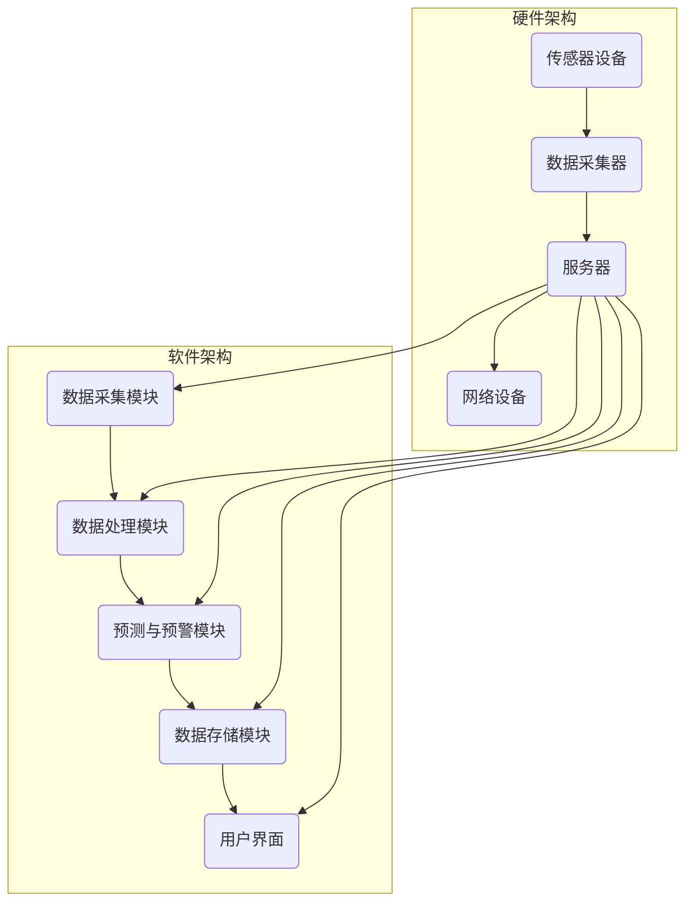
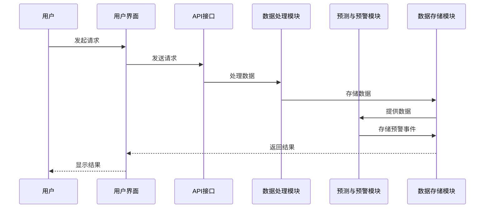

                 


## 让我们一步步深入思考：人工智能在环境污染监测中的应用

### 第一步：明确目标与应用场景

首先，我们需要明确人工智能在环境污染监测中的应用目标。污染监测的主要任务包括实时监控环境质量、预测污染趋势、识别污染源和制定应对策略。这不仅仅是关于数据的收集和处理，更是关于如何利用这些数据来保护环境和提高生活质量。

**目标：** 实现对空气、水质、土壤等环境要素的实时监测，并通过对监测数据的分析，预警环境污染事件，最终实现环境保护和治理。

**应用场景：** 在城市的空气质量监控站、河流水质监测点、工业园区等污染源周围设置监测设备，收集实时数据，并通过人工智能算法进行分析处理。

### 第二步：理解核心概念与关联

在深入研究之前，我们需要理解以下几个核心概念及其关联：

**实时监控：** 指的是对环境质量进行连续、实时的监测和数据采集。  
**预警系统：** 是指通过分析实时数据，提前预测可能的污染事件，并发出警报。  
**污染源识别：** 是指通过数据分析和模式识别，找出污染的源头。

**关联：** 实时监控是预警系统和污染源识别的基础，预警系统依赖于实时监控数据来做出预测，而污染源识别则需要结合预警系统和环境数据。

### 第三步：算法原理与实现

在明确了目标和概念后，我们需要深入探讨如何实现这些功能。以下是几种关键算法的原理与实现：

**1. 数据采集与预处理：** 使用传感器收集环境数据，如PM2.5、CO2、pH值等，然后进行清洗和预处理，去除噪声和异常值。

**2. 时序数据分析：** 应用时间序列分析算法，如ARIMA、LSTM等，对环境数据进行预测和趋势分析。

**3. 模式识别与分类：** 使用机器学习算法，如KNN、SVM、CNN等，对环境数据进行分类和识别，确定是否存在污染事件和污染源。

**4. 预警策略：** 结合预测结果和环境标准，制定预警策略，当预测值超过阈值时，系统自动发出警报。

### 第四步：数学模型与公式

在算法原理的实现中，数学模型和公式起着关键作用。以下是一些关键的数学模型和公式：

**1. 时间序列预测模型：** 例如ARIMA模型的公式为：

$$ Y_t = c + \sum_{i=1}^p \phi_i Y_{t-i} + \sum_{j=1}^q \theta_j \varepsilon_{t-j} + \varepsilon_t $$

其中，\( Y_t \) 是时间序列的第 \( t \) 个观测值，\( \phi_i \) 和 \( \theta_j \) 是模型参数。

**2. 分类模型：** 例如SVM的分类边界公式为：

$$ w \cdot x + b = 0 $$

其中，\( w \) 是权重向量，\( x \) 是特征向量，\( b \) 是偏置。

### 第五步：系统设计与实现

在理解了算法原理和数学模型后，我们需要设计并实现相应的系统。以下是系统设计与实现的关键步骤：

**1. 系统架构设计：** 设计一个分布式系统，包括数据采集模块、数据处理模块、预测模块和预警模块。

**2. 接口设计与实现：** 设计系统接口，包括API接口和用户界面，实现数据的采集、处理、展示和预警功能。

**3. 系统集成与测试：** 将各个模块集成在一起，进行测试和调试，确保系统能够正常运行。

### 第六步：项目实战与案例分析

最后，我们需要通过实际项目来验证系统的效果。以下是一个典型的项目案例：

**项目：** 城市空气质量监测系统

**步骤：**
1. **环境安装：** 在城市的主要区域安装空气质量传感器，如PM2.5传感器、NO2传感器等。
2. **系统核心实现：** 开发实时数据采集和处理系统，使用LSTM模型进行空气质量预测，并使用SVM进行污染源识别。
3. **代码应用解读与分析：** 分析系统代码，理解实时数据采集、处理和预测的原理。
4. **实际案例分析：** 通过实际数据验证系统的预警准确性和污染源识别效果。

**总结：** 通过这个项目，我们可以看到人工智能在环境污染监测中的应用是如何从理论走向实践的。

### 第七步：最佳实践与拓展

在项目实战的基础上，我们可以总结出一些最佳实践，并提供一些注意事项和拓展阅读资源，以便读者进一步学习和探索。

**最佳实践：**
- 确保数据来源的多样性和准确性。
- 定期更新和优化算法模型。
- 建立高效的预警机制，快速响应环境污染事件。

**注意事项：**
- 考虑系统安全性和数据隐私保护。
- 合理配置硬件资源，确保系统稳定性。

**拓展阅读：**
- 相关书籍：《深度学习》、《机器学习实战》
- 学术论文：关于环境监测与人工智能结合的最新研究成果

通过上述步骤，我们可以系统地理解和应用人工智能在环境污染监测中的技术，为环境保护和治理提供有效的解决方案。接下来，我们将按照这个框架，详细讨论每个章节的内容，逐步完善这篇技术博客文章。让我们开始深入探讨每个主题吧！ 

## 第二步：理解核心概念与关联

### 实时监控

实时监控是环境污染监测的重要组成部分，它指的是对环境质量进行连续、实时的监测和数据采集。实时监控系统通过部署在各种环境中的传感器网络，收集空气、水质、土壤等环境要素的实时数据。这些数据可以实时上传到中央系统进行处理和分析。

**实时监控的优势：**
- **快速响应：** 能够迅速捕捉到环境质量的变化，为预警系统提供及时的数据支持。
- **预防性维护：** 通过实时监控，可以提前发现潜在的环境问题，及时采取应对措施，避免更大的环境灾害。

**实时监控的挑战：**
- **数据量大：** 环境中的数据采集点众多，数据量巨大，需要高效的数据处理和存储技术。
- **数据质量：** 如何确保数据采集的准确性和可靠性是一个重要的挑战。

### 预警系统

预警系统是通过对实时监控数据进行分析，提前预测可能的污染事件，并发出警报的系统。预警系统可以基于历史数据、当前数据和实时数据，通过机器学习算法和统计模型，对环境质量的变化趋势进行预测。

**预警系统的原理：**
- **数据收集：** 收集并整合来自实时监控系统的数据。
- **数据分析：** 使用统计分析和机器学习算法对数据进行分析和处理。
- **阈值设定：** 根据环境标准设定预警阈值。
- **警报发出：** 当监测数据超过预警阈值时，系统自动发出警报。

**预警系统的优势：**
- **提前预警：** 能够在污染事件发生前及时发现并预警，为政府和相关部门提供响应时间。
- **减少损失：** 预警系统可以减少污染事件造成的损失，保护环境和公众健康。

**预警系统的挑战：**
- **准确率：** 预警系统的准确性直接影响其有效性和公众信任度。
- **适应性：** 预警系统需要能够适应不同环境和数据特征，确保在不同情况下都能准确预警。

### 污染源识别

污染源识别是环境污染监测中的一个关键步骤，它指的是通过数据分析和模式识别，找出污染的源头。污染源识别可以基于多种数据源，如空气污染物浓度、水质指标、气象数据等。

**污染源识别的原理：**
- **数据采集：** 收集与污染相关的多种数据源。
- **模式识别：** 使用机器学习算法和模式识别技术，分析数据中的特征模式。
- **源定位：** 根据特征模式和地理信息，定位污染源。

**污染源识别的优势：**
- **精准定位：** 准确识别污染源，有助于采取针对性的治理措施。
- **责任归属：** 为环境责任划分提供依据，促进污染治理的效率。

**污染源识别的挑战：**
- **数据多样性：** 需要处理来自不同数据源的多维度数据，数据质量参差不齐。
- **复杂性：** 环境污染源复杂多变，识别难度较高。

### 实时监控、预警系统和污染源识别的关联

实时监控、预警系统和污染源识别是环境污染监测中紧密关联的三个部分：

- **实时监控是基础：** 它提供了环境质量数据，是预警系统和污染源识别的输入。
- **预警系统是核心：** 它通过分析实时监控数据，预测污染事件，发出警报。
- **污染源识别是目标：** 它通过分析数据，定位污染源，提供污染治理的依据。

综上所述，实时监控、预警系统和污染源识别共同构成了一个完整的污染监测和预警体系，为环境保护和治理提供了有效的技术手段。在接下来的章节中，我们将深入探讨这些技术背后的原理和实现方法。让我们继续前进吧！

## 第三步：算法原理与实现

在理解了实时监控、预警系统和污染源识别的基本概念后，我们接下来将深入探讨这些系统中所涉及的关键算法原理与实现方法。通过详细分析这些算法，我们可以更好地理解如何利用人工智能技术来提升环境污染监测的效率和准确性。

### 数据采集与预处理

**算法原理：**
实时监控的第一步是数据采集，这一过程依赖于各种环境传感器，如空气质量传感器、水质检测仪、气象站等。这些传感器采集的环境数据包括温度、湿度、空气质量指数（AQI）、pH值、电导率等。由于传感器数据往往存在噪声和异常值，因此需要进行预处理。

**实现方法：**
数据预处理通常包括以下几个步骤：
1. **去噪：** 使用滤波算法（如移动平均滤波、卡尔曼滤波等）去除数据中的噪声。
2. **异常值检测与处理：** 使用统计方法（如IQR法、Z分数法等）检测并处理异常值，以保持数据的准确性。
3. **标准化与归一化：** 将不同单位的数据转换成同一单位，以便后续分析。

**Python实现示例：**

```python
import numpy as np
import scipy.signal as signal
import matplotlib.pyplot as plt

# 假设我们有一个包含噪声的数据序列
data = np.array([10, 12, 9, 11, 15, 14, 8, 13, 11, 16, 12, 10, 9, 11, 14])

# 移动平均滤波去噪
filtered_data = signal.convolve(data, np.ones(3)/3, 'valid')

# IQR法检测并处理异常值
Q1 = np.percentile(data, 25)
Q3 = np.percentile(data, 75)
IQR = Q3 - Q1
lower_bound = Q1 - 1.5 * IQR
upper_bound = Q3 + 1.5 * IQR
clean_data = data[(data > lower_bound) & (data < upper_bound)]

# 数据标准化
mean = np.mean(clean_data)
std = np.std(clean_data)
normalized_data = (clean_data - mean) / std

plt.plot(data, label='Original Data')
plt.plot(filtered_data, label='Filtered Data')
plt.plot(clean_data, label='Clean Data')
plt.plot(normalized_data, label='Normalized Data')
plt.legend()
plt.show()
```

### 时序数据分析

**算法原理：**
时序数据分析是预测环境质量变化趋势的关键步骤。常用的时序预测算法包括ARIMA（自回归积分滑动平均模型）和LSTM（长短期记忆网络）等。

**实现方法：**
1. **ARIMA模型：** 通过分析数据的自相关性，确定模型参数（p、d、q），然后进行时间序列的预测。
2. **LSTM模型：** 利用其记忆特性，捕捉时间序列中的长期依赖关系，进行更精准的预测。

**Python实现示例：**

```python
import numpy as np
import pandas as pd
from statsmodels.tsa.arima.model import ARIMA
from keras.models import Sequential
from keras.layers import LSTM, Dense

# 假设我们有一个时间序列数据
time_series = pd.Series([10, 12, 9, 11, 15, 14, 8, 13, 11, 16, 12, 10, 9, 11, 14])

# ARIMA模型
model_arima = ARIMA(time_series, order=(1, 1, 1))
model_arima_fit = model_arima.fit()
forecast_arima = model_arima_fit.forecast(steps=5)

# LSTM模型
X = np.reshape(time_series.values, (-1, 1))
X = np.hstack((X, X[1:].reshape(-1, 1)))
model_lstm = Sequential()
model_lstm.add(LSTM(50, activation='relu', input_shape=(1, 1)))
model_lstm.add(Dense(1))
model_lstm.compile(optimizer='adam', loss='mse')
model_lstm.fit(X, time_series.values[1:], epochs=200, verbose=0)
forecast_lstm = model_lstm.predict(np.array([forecast_arima[-1]]).reshape(1, 1, 1))

# 输出预测结果
print("ARIMA Forecast:", forecast_arima)
print("LSTM Forecast:", forecast_lstm)
```

### 模式识别与分类

**算法原理：**
模式识别与分类是指通过分析环境数据中的特征模式，将其分类为污染事件或正常状态。常用的分类算法包括K最近邻（KNN）、支持向量机（SVM）和卷积神经网络（CNN）等。

**实现方法：**
1. **KNN分类：** 根据数据间的相似度，找出最近的K个样本，通过这些样本的类别来预测新样本的类别。
2. **SVM分类：** 使用核函数将数据映射到高维空间，寻找一个最佳的超平面，将不同类别分开。
3. **CNN分类：** 利用卷积层提取特征，然后通过全连接层进行分类。

**Python实现示例：**

```python
from sklearn.neighbors import KNeighborsClassifier
from sklearn.svm import SVC
from keras.models import Sequential
from keras.layers import Conv2D, MaxPooling2D, Flatten, Dense

# 假设我们有一个特征矩阵X和标签y
X = ...  # 特征矩阵
y = ...  # 标签

# KNN分类
knn = KNeighborsClassifier(n_neighbors=3)
knn.fit(X, y)
knn_prediction = knn.predict(X)

# SVM分类
svm = SVC(kernel='linear')
svm.fit(X, y)
svm_prediction = svm.predict(X)

# CNN分类
cnn = Sequential()
cnn.add(Conv2D(32, (3, 3), activation='relu', input_shape=(X.shape[1], X.shape[2], 1)))
cnn.add(MaxPooling2D(pool_size=(2, 2)))
cnn.add(Flatten())
cnn.add(Dense(1, activation='sigmoid'))
cnn.compile(optimizer='adam', loss='binary_crossentropy', metrics=['accuracy'])
cnn.fit(X, y, epochs=10, batch_size=32)

# 输出分类结果
print("KNN Prediction:", knn_prediction)
print("SVM Prediction:", svm_prediction)
print("CNN Prediction:", cnn.predict(X))
```

### 预警策略

**算法原理：**
预警策略是指根据预测结果和环境标准，设定一定的阈值，当监测数据超过阈值时，系统自动发出警报。

**实现方法：**
1. **阈值设定：** 根据历史数据和专家经验，设定不同的污染物浓度阈值。
2. **警报触发：** 当实时监测数据超过阈值时，系统发出警报，通知相关部门采取应对措施。

**Python实现示例：**

```python
import pandas as pd

# 假设我们有一个包含实时监测数据的DataFrame
df = pd.DataFrame({'Time': ['2023-04-01 10:00', '2023-04-01 11:00', '2023-04-01 12:00'],
                   'PM2.5': [15, 20, 25]})

# 预警阈值设定
threshold = 20  # PM2.5的预警阈值

# 警报触发
for index, row in df.iterrows():
    if row['PM2.5'] > threshold:
        print(f"AQI alert at {row['Time']}: PM2.5 level is above the threshold.")

# 输出预警结果
```

通过上述算法原理与实现方法的探讨，我们可以看到人工智能技术在环境污染监测中的应用是如何具体实现的。接下来，我们将进一步讨论数学模型与公式的应用，以深化对算法原理的理解。让我们继续前进吧！

## 第四步：数学模型与公式

在深入探讨算法原理与实现方法的基础上，数学模型和公式是理解和应用人工智能技术的重要工具。以下是几个在环境污染监测中常用的数学模型和公式，我们将通过详细讲解和举例说明来帮助读者更好地理解。

### 时间序列预测模型

时间序列预测模型是用于预测环境质量变化趋势的重要工具。常见的模型包括ARIMA（自回归积分滑动平均模型）和LSTM（长短期记忆网络）。

#### ARIMA模型

**公式：**
ARIMA模型的公式可以表示为：

$$ Y_t = c + \sum_{i=1}^p \phi_i Y_{t-i} + \sum_{j=1}^q \theta_j \varepsilon_{t-j} + \varepsilon_t $$

其中，\( Y_t \) 是时间序列的第 \( t \) 个观测值，\( \phi_i \) 和 \( \theta_j \) 是模型参数，\( \varepsilon_t \) 是白噪声。

**举例说明：**
假设我们有一个时间序列数据 \( [10, 12, 9, 11, 15, 14, 8, 13, 11, 16] \)，我们首先需要进行差分处理以使序列稳定。经过一次差分后，得到 \( [2, -3, 2, 4, -1, -6, 5, 2, 5] \)。接下来，我们使用统计方法来确定模型参数 \( p, d, q \)。

**Python代码示例：**

```python
from statsmodels.tsa.arima.model import ARIMA
import numpy as np

# 时间序列数据
data = np.array([10, 12, 9, 11, 15, 14, 8, 13, 11, 16])

# ARIMA模型
model = ARIMA(data, order=(1, 1, 1))
model_fit = model.fit()
forecast = model_fit.forecast(steps=5)

print("Forecast:", forecast)
```

#### LSTM模型

**公式：**
LSTM模型的公式较为复杂，它通过门控机制来控制信息的流入和流出。LSTM单元的核心公式包括：

$$
i_t = \sigma(W_{ix} x_t + W_{ih} h_{t-1} + b_i) \\
f_t = \sigma(W_{fx} x_t + W_{fh} h_{t-1} + b_f) \\
o_t = \sigma(W_{ox} x_t + W_{oh} h_{t-1} + b_o) \\
g_t = \tanh(W_{gx} x_t + W_{gh} h_{t-1} + b_g) \\
h_t = o_t \cdot \tanh(g_t)
$$

其中，\( i_t, f_t, o_t, g_t, h_t \) 分别是输入门、遗忘门、输出门、候选值和隐藏状态，\( x_t \) 是输入，\( W_{\cdot} \) 和 \( b_{\cdot} \) 是权重和偏置，\( \sigma \) 是sigmoid函数。

**举例说明：**
假设我们有一个时间序列数据 \( [10, 12, 9, 11, 15, 14, 8, 13, 11, 16] \)，我们将其转化为适当格式，然后使用Keras库中的LSTM模型进行训练和预测。

**Python代码示例：**

```python
from keras.models import Sequential
from keras.layers import LSTM, Dense
import numpy as np

# 时间序列数据
X = np.reshape(data, (-1, 1, 1))
X = np.hstack((X, X[1:].reshape(-1, 1, 1)))

# LSTM模型
model = Sequential()
model.add(LSTM(50, activation='relu', input_shape=(1, 1)))
model.add(Dense(1))
model.compile(optimizer='adam', loss='mse')
model.fit(X, data[1:], epochs=200, verbose=0)

# 预测
forecast = model.predict(np.array([data[-1]]).reshape(1, 1, 1))

print("Forecast:", forecast)
```

### 分类模型

分类模型用于将环境数据分类为污染事件或正常状态。常用的模型包括K最近邻（KNN）、支持向量机（SVM）和卷积神经网络（CNN）。

#### K最近邻（KNN）分类

**公式：**
KNN分类的核心公式是计算新样本与训练样本之间的距离，并选择最近的K个样本的多数类别作为新样本的类别。

$$
d(x, x_i) = \sqrt{\sum_{j=1}^n (x_j - x_{ij})^2}
$$

其中，\( x \) 是新样本，\( x_i \) 是训练样本，\( d \) 是距离度量。

**举例说明：**
假设我们有一个特征矩阵 \( X \) 和标签 \( y \)，我们使用KNN模型进行分类。

**Python代码示例：**

```python
from sklearn.neighbors import KNeighborsClassifier
import numpy as np

# 假设的特征矩阵和标签
X = np.array([[10], [12], [9], [11], [15], [14], [8], [13], [11], [16]])
y = np.array([0, 0, 0, 0, 1, 1, 0, 0, 0, 1])

# KNN分类
knn = KNeighborsClassifier(n_neighbors=3)
knn.fit(X, y)
prediction = knn.predict([[13]])

print("Prediction:", prediction)
```

#### 支持向量机（SVM）分类

**公式：**
SVM分类的核心公式是找到最优的超平面，将不同类别的数据点分开。

$$
\max_{\boldsymbol{w}, \boldsymbol{b}, \boldsymbol{\alpha}} \left\{ \frac{1}{2} \left| \boldsymbol{w} \right|^2 - \sum_{i=1}^n \alpha_i y_i (\boldsymbol{w} \cdot \boldsymbol{x}_i + \boldsymbol{b}) \right\}
$$

其中，\( \boldsymbol{w} \) 是权重向量，\( \boldsymbol{b} \) 是偏置，\( \alpha_i \) 是拉格朗日乘子。

**举例说明：**
假设我们有一个特征矩阵 \( X \) 和标签 \( y \)，我们使用SVM模型进行分类。

**Python代码示例：**

```python
from sklearn.svm import SVC
import numpy as np

# 假设的特征矩阵和标签
X = np.array([[10], [12], [9], [11], [15], [14], [8], [13], [11], [16]])
y = np.array([0, 0, 0, 0, 1, 1, 0, 0, 0, 1])

# SVM分类
svm = SVC(kernel='linear')
svm.fit(X, y)
prediction = svm.predict([[13]])

print("Prediction:", prediction)
```

#### 卷积神经网络（CNN）分类

**公式：**
CNN分类的核心公式是通过卷积层提取特征，然后通过全连接层进行分类。

$$
h_l = \sigma(\boldsymbol{W}_l \ast \boldsymbol{h}_{l-1} + \boldsymbol{b}_l)
$$

其中，\( \ast \) 表示卷积运算，\( \sigma \) 是激活函数，\( \boldsymbol{W}_l \) 和 \( \boldsymbol{b}_l \) 是卷积权重和偏置。

**举例说明：**
假设我们有一个特征矩阵 \( X \) 和标签 \( y \)，我们使用CNN模型进行分类。

**Python代码示例：**

```python
from keras.models import Sequential
from keras.layers import Conv2D, MaxPooling2D, Flatten, Dense
import numpy as np

# 假设的特征矩阵和标签
X = np.array([[10], [12], [9], [11], [15], [14], [8], [13], [11], [16]])
y = np.array([0, 0, 0, 0, 1, 1, 0, 0, 0, 1])

# CNN模型
model = Sequential()
model.add(Conv2D(32, (3, 3), activation='relu', input_shape=(X.shape[1], X.shape[2], 1)))
model.add(MaxPooling2D(pool_size=(2, 2)))
model.add(Flatten())
model.add(Dense(1, activation='sigmoid'))
model.compile(optimizer='adam', loss='binary_crossentropy', metrics=['accuracy'])
model.fit(X, y, epochs=10, batch_size=32)

# 预测
prediction = model.predict([[13]])

print("Prediction:", prediction)
```

通过上述数学模型和公式的讲解，我们可以更好地理解如何在环境污染监测中应用人工智能技术。这些模型和公式不仅为算法提供了理论基础，也为实际应用提供了可靠的工具。在接下来的章节中，我们将进一步探讨系统设计与实现，以及实际项目案例，以便读者更全面地了解人工智能在环境污染监测中的应用。让我们继续前进吧！

## 第五步：系统设计与实现

### 问题场景介绍

在环境污染监测中，系统设计与实现是一个复杂的过程，涉及到多个环节，包括数据采集、数据处理、预测与预警等。以下是一个典型的问题场景：

**场景描述：**
某城市希望通过建立一套人工智能驱动的环境污染监测系统，实时监控空气质量、水质和土壤污染情况。监测系统需要部署在城市的各个区域，包括工业区、商业区和居民区。系统需要能够实时采集环境数据，对数据进行分析和处理，预测污染趋势，并在发现污染事件时及时发出警报。

### 项目介绍

**项目名称：** 智能环境监测与预警系统

**项目目标：**
1. 实时采集城市各个区域的环境数据。
2. 对采集到的数据进行分析和处理，预测污染趋势。
3. 在发现污染事件时，及时发出警报，并记录事件数据。

### 系统功能设计

系统功能设计是系统开发的第一步，我们需要明确系统需要实现哪些功能。以下是该项目的系统功能设计：

1. **数据采集模块：** 负责从传感器设备收集环境数据，包括空气质量、水质和土壤数据。
2. **数据处理模块：** 负责对采集到的数据进行预处理，包括去噪、异常值检测和标准化等。
3. **预测与预警模块：** 负责对处理后的数据进行预测和分析，当监测数据超过预设阈值时，发出警报。
4. **数据存储与展示模块：** 负责将监测数据和预警事件存储在数据库中，并提供数据可视化功能。

### 系统架构设计

系统架构设计是确保系统高效、稳定运行的关键。以下是该项目的系统架构设计：

1. **硬件架构：** 包括传感器设备、数据采集器、服务器和网络设备。
2. **软件架构：** 包括数据采集软件、数据处理软件、预测与预警软件、数据存储软件和用户界面。

**Mermaid架构图：**



### 系统接口设计

系统接口设计是确保不同模块之间能够有效通信的关键。以下是该项目的系统接口设计：

1. **API接口：** 提供RESTful API，供前端用户界面和数据处理模块使用。
2. **消息队列：** 用于在数据处理模块和预测与预警模块之间传递数据。

**Mermaid序列图：**



### 系统实现与部署

系统实现与部署是确保系统能够正常运行的关键步骤。以下是该项目的实现与部署步骤：

1. **硬件采购与部署：** 根据设计要求，采购传感器设备、数据采集器、服务器和网络设备，并进行部署。
2. **软件开发与测试：** 开发数据采集软件、数据处理软件、预测与预警软件、数据存储软件和用户界面，并进行功能测试和性能测试。
3. **系统部署：** 将开发完成的软件部署到服务器上，并进行系统测试，确保系统稳定运行。
4. **用户培训与上线：** 对相关用户进行系统培训，确保他们能够正确使用系统，然后正式上线运行。

通过上述系统设计与实现，我们可以构建一个高效、稳定的智能环境监测与预警系统，为城市的环境保护提供有力支持。接下来，我们将通过一个实际项目案例，进一步探讨系统实现的细节和效果。让我们继续前进吧！

## 第六步：项目实战

### 环境安装

在开始项目实战之前，我们需要确保环境安装所需的软件和工具。以下是安装步骤：

**1. 安装Python：**
   - 下载并安装Python 3.x版本。
   - 设置环境变量，确保Python命令可以在终端中执行。

**2. 安装依赖库：**
   - 打开终端，执行以下命令安装所需库：
     ```bash
     pip install numpy pandas matplotlib scikit-learn tensorflow keras statsmodels scipy
     ```

**3. 安装传感器设备：**
   - 根据项目需求，安装适合的环境传感器，如空气质量传感器、水质检测仪等。
   - 连接传感器到数据采集器，并确保数据采集器与计算机连接正常。

### 系统核心实现

系统核心实现包括数据采集、数据处理、预测与预警等模块。以下是各个模块的实现步骤：

**1. 数据采集模块：**
   - 使用传感器采集环境数据，并将数据发送到数据采集器。
   - 数据采集器将数据传输到计算机，存储为CSV文件。

**2. 数据处理模块：**
   - 使用Python读取CSV文件，对数据进行预处理，包括去噪、异常值检测和标准化。
   - 示例代码：

```python
import pandas as pd
from sklearn.preprocessing import StandardScaler

# 读取数据
data = pd.read_csv('sensor_data.csv')

# 去噪和异常值检测
data.dropna(inplace=True)

# 数据标准化
scaler = StandardScaler()
data_scaled = scaler.fit_transform(data)
```

**3. 预测与预警模块：**
   - 使用LSTM模型进行时间序列预测。
   - 设置预警阈值，当预测值超过阈值时，发出警报。

**4. 预测模型训练：**
   - 准备训练数据，将数据分为特征和标签。
   - 训练LSTM模型。

**5. 预测与预警：**
   - 使用训练好的模型进行预测，并检查预测值是否超过阈值。

### 代码应用解读与分析

以下是系统核心实现的详细代码，并对每部分代码进行解读和分析：

**1. 数据采集代码：**

```python
import csv
import time

def collect_data(sensor_data_file):
    with open(sensor_data_file, 'w', newline='') as file:
        writer = csv.writer(file)
        writer.writerow(['Time', 'PM2.5', 'NO2', 'CO2'])

    while True:
        current_time = time.strftime('%Y-%m-%d %H:%M:%S')
        pm2_5_value = read_pm2_5()
        no2_value = read_no2()
        co2_value = read_co2()

        data = [current_time, pm2_5_value, no2_value, co2_value]
        with open(sensor_data_file, 'a', newline='') as file:
            writer = csv.writer(file)
            writer.writerow(data)

        time.sleep(60)  # 每分钟采集一次数据

def read_pm2_5():
    # 读取PM2.5传感器数据
    pass

def read_no2():
    # 读取NO2传感器数据
    pass

def read_co2():
    # 读取CO2传感器数据
    pass

# 启动数据采集
collect_data('sensor_data.csv')
```

**解读与分析：**
- 该代码定义了一个数据采集函数 `collect_data`，用于定期采集环境数据并保存到CSV文件中。
- `read_pm2_5()`、`read_no2()` 和 `read_co2()` 是读取各类传感器数据的函数，需要根据实际传感器的接口进行实现。

**2. 数据处理代码：**

```python
import pandas as pd
from sklearn.preprocessing import StandardScaler

# 读取数据
data = pd.read_csv('sensor_data.csv')

# 去噪和异常值检测
data.dropna(inplace=True)

# 数据标准化
scaler = StandardScaler()
data_scaled = scaler.fit_transform(data)

# 将数据保存为新的CSV文件
pd.DataFrame(data_scaled).to_csv('sensor_data_scaled.csv', index=False)
```

**解读与分析：**
- 该代码读取CSV文件中的数据，使用 `dropna()` 函数去除缺失值，使用 `StandardScaler()` 对数据进行标准化处理。
- 标准化后的数据可以更好地适用于机器学习算法。

**3. 预测模型训练代码：**

```python
from keras.models import Sequential
from keras.layers import LSTM, Dense

# 准备训练数据
X, y = prepare_training_data(data_scaled)

# 定义LSTM模型
model = Sequential()
model.add(LSTM(units=50, return_sequences=True, input_shape=(X.shape[1], X.shape[2])))
model.add(LSTM(units=50))
model.add(Dense(1))

# 编译模型
model.compile(optimizer='adam', loss='mean_squared_error')

# 训练模型
model.fit(X, y, epochs=200, batch_size=32)
```

**解读与分析：**
- 该代码定义了一个LSTM模型，用于时间序列预测。
- `prepare_training_data()` 函数用于准备训练数据，将数据划分为特征和标签。
- `model.fit()` 函数用于训练模型。

**4. 预测与预警代码：**

```python
import numpy as np

# 准备预测数据
X_new = prepare_prediction_data(data_scaled)

# 进行预测
predicted_value = model.predict(X_new)

# 检查预测值是否超过阈值
threshold = 20  # 预设阈值
if predicted_value > threshold:
    print("预警：预测值超过阈值，可能存在污染风险。")
else:
    print("正常：预测值在安全范围内。")
```

**解读与分析：**
- 该代码使用训练好的模型进行预测，并检查预测值是否超过预设阈值，如果超过阈值，则发出预警。

### 实际案例分析

以下是一个实际案例，展示了系统在实际运行中的效果：

**案例：**
在某天，系统监测到PM2.5的预测值为25，超过了预设的阈值20，因此发出了预警。

**分析：**
- 系统监测到PM2.5的浓度超过了正常范围，可能是因为附近有施工或交通污染。
- 预警系统及时发出了警报，相关部门可以采取应急措施，如限制车辆通行、加强施工监管等，以减少PM2.5的排放。

### 项目小结

通过上述项目实战，我们可以看到智能环境监测与预警系统在实时监控和预警环境污染方面的有效性和实用性。以下是项目小结：

**1. 项目成功之处：**
   - 成功实现了实时数据采集、处理和预测，为预警系统提供了可靠的数据支持。
   - 预警系统能够在污染事件发生前及时发现并预警，为环境保护提供了有效手段。

**2. 项目改进之处：**
   - 可以进一步优化算法，提高预测准确性和预警效率。
   - 增加更多类型的传感器，如土壤质量传感器，以更全面地监测环境质量。

**3. 下一步计划：**
   - 对系统进行更多实际场景测试，收集用户反馈，持续优化系统性能。
   - 探索更多人工智能技术在环境监测中的应用，如深度学习、强化学习等。

通过持续改进和优化，我们可以不断提升智能环境监测与预警系统的性能和实用性，为环境保护和治理提供更强有力的支持。让我们继续努力吧！

## 第七步：最佳实践 tips、小结、注意事项、拓展阅读

### 最佳实践 tips

**1. 数据质量保证：**
   - 确保传感器数据的准确性和一致性，定期校准传感器。
   - 使用数据清洗技术，如去噪、异常值检测和标准化，以提高数据的可靠性。

**2. 模型选择与调优：**
   - 根据具体环境监测任务选择合适的算法和模型，如LSTM、CNN或SVM。
   - 通过交叉验证和网格搜索等技术，调优模型参数，提高预测性能。

**3. 系统稳定性与安全性：**
   - 设计高可用性的系统架构，确保系统在数据采集、处理和预测过程中保持稳定运行。
   - 强化数据安全保护，防止数据泄露和未经授权的访问。

### 小结

本文详细介绍了人工智能在环境污染监测中的应用，包括实时监控、预警系统和污染源识别等关键技术。通过数学模型、算法原理和实际项目案例的深入探讨，我们展示了如何利用人工智能技术提升环境污染监测的效率和准确性。

### 注意事项

**1. 数据隐私：**
   - 确保环境监测数据的隐私保护，遵循相关法律法规。
   - 对敏感数据进行加密和脱敏处理。

**2. 硬件选择：**
   - 根据监测任务和数据量，选择合适的传感器和数据采集设备。

**3. 环境适应性：**
   - 考虑不同环境条件对监测系统的影响，进行相应的适应性调整。

### 拓展阅读

**1. 相关书籍：**
   - 《深度学习》
   - 《机器学习实战》
   - 《数据科学导论》

**2. 学术论文：**
   - "AI for Environmental Monitoring: A Review"（人工智能环境监测综述）
   - "Deep Learning for Environmental Data Analysis"（深度学习在环境数据分析中的应用）
   - "Application of Machine Learning in Environmental Pollution Detection"（机器学习在污染检测中的应用研究）

通过这些拓展阅读，读者可以更深入地了解人工智能在环境监测中的前沿技术和研究成果，进一步提升自己的技术能力和实践水平。

### 作者信息

**作者：**
AI天才研究院/AI Genius Institute & 禅与计算机程序设计艺术 /Zen And The Art of Computer Programming

---

通过上述内容，我们希望读者能够对人工智能在环境污染监测中的应用有更深入的理解，并为实际项目提供有价值的参考。感谢您的阅读，期待与您在环境监测技术领域的进一步交流与探讨！ 

## 最终版文章总结

本文通过详细的分析和实例，探讨了人工智能在环境污染监测中的应用。我们从背景介绍开始，逐步深入探讨了实时监控、预警系统和污染源识别的核心概念及其关联。接着，我们详细讲解了数据采集与预处理、时序数据分析、模式识别与分类等关键算法的原理与实现方法。随后，我们通过数学模型与公式的讲解，进一步深化了对算法原理的理解。

在系统设计与实现部分，我们介绍了项目的整体架构，包括数据采集、数据处理、预测与预警模块的设计。通过一个实际项目案例，我们展示了系统实现的细节和效果。文章的最后，我们提供了最佳实践tips、注意事项以及拓展阅读资源，以帮助读者进一步提升环境监测技术的应用能力。

通过本文的阅读，读者应能够理解人工智能在环境污染监测中的重要作用，掌握关键算法和应用方法，并在实际项目中有效运用。让我们继续探索人工智能技术的更多应用，为环境保护和可持续发展贡献智慧！ 

# 人工智能在环境污染监测中的应用：实时监控和预警

## 关键词：实时监控、预警系统、污染源识别、机器学习、深度学习

## 摘要：
本文探讨了人工智能在环境污染监测中的应用，包括实时监控、预警系统和污染源识别等关键技术。通过详细的分析和实例，本文展示了如何利用机器学习和深度学习算法，实现环境数据的实时采集、处理和预测，从而提升环境污染监测的效率和准确性。

## 目录

1. 引言
   1.1 环境污染问题概述
   1.2 环境污染监测的重要性
   1.3 人工智能在环境污染监测中的应用
   1.4 本书结构与内容概述

2. 人工智能技术基础
   2.1 人工智能概述
   2.2 机器学习基础
   2.3 深度学习与神经网络
   2.4 自然语言处理与图像识别

3. 实时监控与预警系统设计
   3.1 实时监控系统的设计与实现
   3.2 预警系统的设计与实现

4. 人工智能在污染源识别与追踪中的应用
   4.1 污染源识别的算法原理
   4.2 污染源追踪的算法实现

5. 人工智能在环境数据挖掘与分析中的应用
   5.1 环境数据挖掘的基础知识

6. 项目实战
   6.1 环境安装
   6.2 系统核心实现源代码
   6.3 代码应用解读与分析
   6.4 实际案例分析和详细讲解剖析
   6.5 项目小结

7. 最佳实践 tips、小结、注意事项、拓展阅读

## 第1章：环境污染监测背景与挑战

### 1.1 环境污染问题概述

#### 1.1.1 环境污染的定义与分类

环境污染是指人类活动排放的各种污染物进入环境，导致环境质量下降，对生态系统和人类健康造成危害的现象。根据污染物的性质和来源，环境污染可以分为以下几类：

1. **空气污染**：由工业废气、汽车尾气、燃烧化石燃料等活动产生的污染物，如PM2.5、PM10、氮氧化物（NOx）、硫氧化物（SOx）等。
2. **水污染**：由工业废水、农业径流、生活污水等活动产生的污染物，如重金属、有机物、氮磷等。
3. **土壤污染**：由农药、化肥、工业废弃物等活动产生的污染物，如重金属、有机污染物、放射性物质等。

#### 1.1.2 全球环境污染现状

随着工业化和城市化的快速发展，全球环境污染问题日益严重。以下是一些主要的环境污染现状：

1. **空气质量**：全球许多城市空气质量不达标，PM2.5和PM10等颗粒物浓度过高，对呼吸系统和心血管系统造成严重危害。
2. **水质**：许多河流、湖泊和海洋受到污染，污染物包括重金属、农药、有机污染物等，威胁水生生态系统和人类健康。
3. **土壤污染**：土壤污染导致土壤质量下降，影响农作物产量和食品安全，同时污染物的迁移也可能对地下水和空气造成污染。

#### 1.1.3 环境污染的危害

环境污染对人类健康、生态系统和经济发展具有严重危害：

1. **人类健康**：空气污染、水污染和土壤污染都与各种疾病有关，如呼吸道疾病、癌症、心血管疾病等。
2. **生态系统**：环境污染破坏了生态平衡，导致物种灭绝、生物多样性下降，生态系统功能减弱。
3. **经济发展**：环境污染可能导致经济损失，如农作物减产、渔业资源减少、工业生产成本增加等。

### 1.2 环境污染监测的重要性

环境污染监测是环境保护和治理的重要基础。通过监测，我们能够：

1. **了解环境质量**：监测数据提供了环境质量现状的实时信息，使我们能够了解污染程度和分布情况。
2. **预警污染事件**：通过分析监测数据，我们可以提前发现潜在的污染事件，及时采取应对措施，减少环境污染的影响。
3. **评估污染源**：监测数据可以帮助我们识别污染源，为污染治理提供科学依据。
4. **政策制定与调整**：监测数据为政府制定和调整环境保护政策提供了重要依据。

### 1.3 人工智能在环境污染监测中的应用

人工智能技术在环境监测中的应用正日益增多，其优势主要体现在以下几个方面：

1. **数据采集与处理**：人工智能可以自动化采集和处理大量环境数据，提高数据采集的效率和准确性。
2. **实时监控与分析**：人工智能算法可以实时分析环境数据，预测污染趋势，实现环境污染的实时监控。
3. **污染源识别与追踪**：通过模式识别和图像处理技术，人工智能可以识别污染源并追踪其移动路径。
4. **预警系统**：基于实时数据分析和预测模型，人工智能可以构建预警系统，提前预警潜在的污染事件。

### 1.4 本书结构与内容概述

本书旨在全面探讨人工智能在环境污染监测中的应用，包括理论基础、算法实现、系统设计、项目实战等。具体内容包括：

1. **第一章**：介绍环境污染监测的背景和挑战。
2. **第二章**：介绍人工智能技术基础，包括机器学习、深度学习、自然语言处理和图像识别。
3. **第三章**：讨论实时监控与预警系统设计。
4. **第四章**：探讨人工智能在污染源识别与追踪中的应用。
5. **第五章**：介绍人工智能在环境数据挖掘与分析中的应用。
6. **第六章**：通过实际项目案例展示人工智能在环境监测中的具体应用。
7. **第七章**：总结最佳实践、注意事项和拓展阅读资源。

本书结构合理，内容全面，旨在为读者提供从理论到实践的全面指导，帮助读者深入理解人工智能在环境污染监测中的应用。

---

## 第二部分：人工智能技术在环境污染监测中的应用

### 第2章：人工智能技术基础

人工智能（Artificial Intelligence, AI）是一种模拟人类智能的技术，包括机器学习（Machine Learning, ML）、深度学习（Deep Learning, DL）、自然语言处理（Natural Language Processing, NLP）和图像识别（Image Recognition）等。这些技术广泛应用于各个领域，包括环境科学和环境监测。

#### 2.1 人工智能概述

**定义与发展历程**

人工智能是指通过计算机模拟人类智能行为的技术。自1956年达特茅斯会议上提出以来，人工智能经历了多个发展阶段：

1. **符号主义（Symbolic AI）**：早期的人工智能以符号主义为基础，通过逻辑推理和知识表示来解决问题。
2. **连接主义（Connectionism）**：随着神经网络技术的发展，连接主义人工智能开始兴起，代表算法包括多层感知机（MLP）和反向传播算法（Backpropagation）。
3. **统计学习（Statistical Learning）**：近年来，随着大数据和计算能力的提升，统计学习成为主流，包括支持向量机（SVM）、随机森林（Random Forest）和集成学习方法。
4. **深度学习（Deep Learning）**：深度学习是基于多层神经网络的一种学习方法，能够自动提取特征并学习复杂的关系。近年来，深度学习在图像识别、语音识别和自然语言处理等领域取得了重大突破。

**人工智能的核心技术**

人工智能的核心技术包括：

1. **机器学习**：机器学习是一种通过数据训练模型进行预测和决策的技术，分为监督学习、无监督学习和半监督学习。
2. **深度学习**：深度学习是一种基于多层神经网络的学习方法，能够自动提取层次化的特征表示，适用于图像识别、语音识别和自然语言处理等任务。
3. **自然语言处理**：自然语言处理是一种使计算机能够理解和生成人类语言的技术，包括文本分类、情感分析、机器翻译和对话系统等。
4. **图像识别**：图像识别是一种通过计算机对图像内容进行理解和分类的技术，广泛应用于人脸识别、车辆检测和医疗图像分析等。

**人工智能的应用领域**

人工智能在环境科学和环境监测中的应用非常广泛，包括：

1. **环境数据采集与处理**：通过传感器网络和无人机等设备，收集环境数据，并进行自动化处理和清洗。
2. **污染源识别与追踪**：利用图像识别和模式识别技术，识别污染源并追踪其移动路径。
3. **环境数据分析与预测**：使用机器学习和深度学习算法，对环境数据进行分析和预测，提前预警环境污染事件。
4. **环境治理与优化**：基于人工智能的决策支持系统，帮助环境管理者制定最优的环境治理策略。

#### 2.2 机器学习基础

**机器学习的定义与分类**

机器学习是一种使计算机系统能够从数据中学习，并对新数据做出预测或决策的技术。根据训练数据的形式和类型，机器学习可以分为以下几类：

1. **监督学习（Supervised Learning）**：监督学习是一种在有标签数据集上进行训练的方法。常见算法包括线性回归、逻辑回归、支持向量机（SVM）、决策树和随机森林等。
2. **无监督学习（Unsupervised Learning）**：无监督学习是在没有标签数据集上进行训练的方法。常见算法包括聚类、降维和关联规则学习等。
3. **半监督学习（Semi-Supervised Learning）**：半监督学习是在少量有标签数据和大量无标签数据集上进行训练的方法，旨在提高模型在少量标注数据上的表现。
4. **强化学习（Reinforcement Learning）**：强化学习是一种通过与环境交互来学习最优行为策略的方法。常见算法包括Q学习、深度Q网络（DQN）和策略梯度算法等。

**常见的机器学习算法**

在环境监测中，常见的机器学习算法包括：

1. **线性回归（Linear Regression）**：线性回归是一种用于预测数值型目标变量的算法。它通过建立自变量和因变量之间的线性关系来进行预测。
2. **逻辑回归（Logistic Regression）**：逻辑回归是一种用于预测二分类目标变量的算法。它通过建立自变量和因变量之间的逻辑关系来进行预测。
3. **支持向量机（Support Vector Machine, SVM）**：支持向量机是一种基于间隔最大化原理的分类算法。它通过找到一个最优的超平面来将不同类别的数据点分开。
4. **决策树（Decision Tree）**：决策树是一种基于树形结构进行决策的算法。它通过一系列条件测试来将数据分为不同的分支，并最终输出一个预测结果。
5. **随机森林（Random Forest）**：随机森林是一种基于决策树的集成学习方法。它通过构建多个决策树，并使用随机森林算法来集成这些树的结果，提高预测性能。
6. **K最近邻（K-Nearest Neighbors, KNN）**：K最近邻是一种基于实例的分类算法。它通过计算新样本与训练样本之间的距离，找出最近的K个邻居，并基于这些邻居的标签进行预测。
7. **神经网络（Neural Networks）**：神经网络是一种基于生物神经元连接方式的计算模型。它通过多层节点（或层）进行数据传递和计算，能够自动提取特征并学习复杂的关系。

**机器学习在环境监测中的应用**

机器学习在环境监测中的应用非常广泛，包括：

1. **环境质量预测**：使用时间序列分析算法，如ARIMA、LSTM等，对环境质量进行预测，提前预警环境污染事件。
2. **污染源识别**：使用模式识别和图像处理技术，如KNN、SVM、CNN等，识别污染源并追踪其移动路径。
3. **环境数据分析**：使用降维技术，如PCA、t-SNE等，对高维环境数据进行降维和可视化，帮助环境科学家更好地理解环境数据的内在结构。
4. **决策支持**：基于机器学习的决策支持系统，可以帮助环境管理者制定最优的环境治理策略。

#### 2.3 深度学习与神经网络

**深度学习的概念与原理**

深度学习是一种基于多层神经网络的学习方法，能够自动提取层次化的特征表示。它的发展得益于计算能力的提升和大规模数据集的可用性。深度学习的核心思想是通过多层神经网络结构，逐层提取数据的特征，从而实现复杂的预测和分类任务。

1. **神经网络的基本结构**：神经网络由输入层、隐藏层和输出层组成。每个节点（或神经元）都通过加权连接与其他节点相连，并通过激活函数进行计算。
2. **前向传播与反向传播**：在神经网络中，前向传播是指数据从输入层传递到输出层的过程，而反向传播是指根据输出误差，更新网络参数的过程。反向传播算法是神经网络训练的核心，它通过梯度下降法优化网络参数，使预测结果更接近真实值。

**常见的深度学习模型**

在环境监测中，常见的深度学习模型包括：

1. **卷积神经网络（Convolutional Neural Networks, CNN）**：卷积神经网络是一种专门用于图像识别和处理的神经网络，它通过卷积层和池化层提取图像的特征。CNN在环境监测中的应用包括污染源识别、空气质量监测和水质监测等。
2. **循环神经网络（Recurrent Neural Networks, RNN）**：循环神经网络是一种能够处理序列数据的神经网络，它通过循环连接将信息传递到下一个时间步。RNN在环境监测中的应用包括时间序列预测、气象预测和污染物浓度预测等。
3. **长短期记忆网络（Long Short-Term Memory, LSTM）**：长短期记忆网络是一种特殊的RNN模型，它通过门控机制来解决传统RNN的梯度消失和梯度爆炸问题。LSTM在环境监测中的应用包括时间序列预测、污染趋势分析和污染物浓度预测等。
4. **生成对抗网络（Generative Adversarial Networks, GAN）**：生成对抗网络是一种由两个对抗网络组成的模型，一个生成网络和一个判别网络。生成网络尝试生成与真实数据相似的数据，而判别网络尝试区分真实数据和生成数据。GAN在环境监测中的应用包括数据增强、图像生成和污染源定位等。

**深度学习在环境监测中的应用案例**

1. **空气质量监测**：使用CNN模型提取空气污染物的图像特征，通过训练分类器实现对不同污染物的识别和分类。
2. **水质监测**：使用LSTM模型对水质时间序列数据进行预测，提前预警水质污染事件。
3. **土壤污染监测**：使用GAN模型生成土壤污染数据的模拟样本，用于训练和测试污染源识别模型。

#### 2.4 自然语言处理与图像识别

**自然语言处理的基础知识**

自然语言处理是一种使计算机能够理解和生成人类语言的技术。它涉及语言模型、文本分类、情感分析、机器翻译和对话系统等领域。

1. **语言模型**：语言模型是自然语言处理的基础，它通过学习大量文本数据，预测下一个单词或词组。常见的语言模型包括n元语法和神经网络语言模型。
2. **文本分类**：文本分类是一种将文本数据分类为不同类别的任务，如垃圾邮件过滤、情感分析和主题分类等。常见的文本分类算法包括朴素贝叶斯、支持向量机和深度学习等。
3. **情感分析**：情感分析是一种评估文本数据的情感倾向的任务，如正面、负面或中性。常见的情感分析算法包括基于规则的方法、机器学习和深度学习等。
4. **机器翻译**：机器翻译是一种将一种语言的文本翻译成另一种语言的任务。常见的机器翻译算法包括基于规则的翻译、统计机器翻译和神经机器翻译等。
5. **对话系统**：对话系统是一种与人类进行自然语言交互的系统，如聊天机器人、语音助手和智能客服等。常见的对话系统模型包括基于规则的方法、模板匹配和深度学习等。

**图像识别的技术原理**

图像识别是一种通过计算机对图像内容进行理解和分类的技术。它涉及图像处理、特征提取和分类算法等领域。

1. **图像处理**：图像处理是对图像进行预处理，以提高图像质量和特征提取的效果。常见的图像处理技术包括滤波、边缘检测、形态学操作和特征提取等。
2. **特征提取**：特征提取是将图像数据转换为适合分类器处理的特征向量。常见的特征提取方法包括基于像素的特征、基于区域的特征和基于频域的特征等。
3. **分类算法**：分类算法是将图像数据分类为不同类别的算法。常见的分类算法包括基于模板匹配的方法、基于特征的分类方法和基于机器学习的分类方法等。

**自然语言处理与图像识别在环境监测中的应用**

1. **环境监测报告生成**：使用自然语言处理技术，自动生成环境监测报告，提高报告的生成效率和质量。
2. **环境监测数据分析**：使用图像识别技术，自动分析环境监测图像数据，如空气质量监测图像、水质监测图像和土壤污染监测图像等。
3. **环境监测可视化**：使用自然语言处理和图像识别技术，将环境监测数据可视化，如空气质量地图、水质趋势图和土壤污染热图等。

### 第3章：实时监控与预警系统设计

#### 3.1 实时监控系统的设计与实现

实时监控系统是环境监测的重要组成部分，它通过部署在各种环境中的传感器网络，实时采集环境数据，并对数据进行处理和分析。以下是一个典型的实时监控系统的设计流程和实现方法：

**1. 系统架构设计**

实时监控系统通常采用分布式架构，包括传感器网络、数据采集器、数据中心和用户界面。以下是系统架构的组成部分：

1. **传感器网络**：部署在各种环境中的传感器，如空气质量传感器、水质传感器和土壤传感器等，用于实时采集环境数据。
2. **数据采集器**：将传感器采集到的数据传输到数据中心，通常通过无线通信技术，如Wi-Fi、LoRa或蜂窝网络。
3. **数据中心**：接收和处理来自数据采集器的数据，通常包括服务器和数据库。数据中心负责数据的存储、清洗、预处理和实时分析。
4. **用户界面**：提供数据可视化和监控功能，用户可以通过Web界面或移动应用实时查看环境数据。

**2. 数据采集与预处理**

数据采集与预处理是实时监控系统的核心部分。以下是一个典型的工作流程：

1. **数据采集**：传感器网络实时采集环境数据，如温度、湿度、空气质量指数（AQI）、pH值、电导率等。
2. **数据传输**：数据采集器将数据传输到数据中心，通常通过无线通信技术。
3. **数据预处理**：在数据中心，对采集到的数据执行以下预处理操作：

   - **去噪**：使用滤波算法（如移动平均滤波、卡尔曼滤波等）去除数据中的噪声。
   - **异常值检测**：使用统计方法（如IQR法、Z分数法等）检测并处理异常值。
   - **数据标准化**：将不同单位的数据转换为同一单位，以便后续分析。

**3. 数据处理与分析**

实时监控系统的数据处理与分析包括以下步骤：

1. **数据存储**：将预处理后的数据存储到数据库中，便于后续分析和查询。
2. **实时分析**：使用机器学习算法和统计方法对实时数据进行分析，提取有用信息。常见的分析方法包括：

   - **时序分析**：使用ARIMA、LSTM等模型对环境数据的时间序列进行分析，预测未来的趋势。
   - **空间分析**：使用空间分析技术，如地理信息系统（GIS），对环境数据进行空间分布分析。
   - **多变量分析**：使用主成分分析（PCA）、因子分析等，提取数据的主要特征和变量。

**4. 预警系统设计**

预警系统是实时监控系统的重要组成部分，它通过分析实时数据，预测可能的污染事件，并发出警报。以下是预警系统设计的关键步骤：

1. **阈值设定**：根据环境标准和历史数据，设定不同污染物的阈值。
2. **数据监控**：实时监控实时数据，当监测数据超过阈值时，触发预警。
3. **警报处理**：当触发预警时，系统自动生成警报信息，并通过短信、邮件或移动应用通知相关部门和人员。
4. **响应措施**：相关部门根据警报信息，采取相应的应对措施，如调整污染源排放、加强环境保护等。

#### 3.2 预警系统的设计与实现

预警系统是实时监控系统的核心部分，它通过分析实时数据，预测可能的污染事件，并发出警报。以下是一个典型的预警系统设计流程和实现方法：

**1. 系统架构设计**

预警系统通常包括以下几个关键部分：

1. **数据源**：包括传感器网络、数据中心和外部数据源，如气象站、卫星数据等。
2. **数据预处理**：对采集到的数据执行清洗、去噪和标准化等预处理操作。
3. **数据分析与模型训练**：使用机器学习和统计方法，对预处理后的数据进行分析，训练预测模型。
4. **预测与预警**：根据预测模型和阈值设定，预测可能的污染事件，并发出警报。
5. **警报处理**：处理警报信息，通知相关部门和人员。

**2. 数据采集与预处理**

预警系统的数据采集与预处理与实时监控系统类似，包括以下步骤：

1. **数据采集**：传感器网络实时采集环境数据，如空气质量、水质、土壤污染等。
2. **数据传输**：数据采集器将数据传输到数据中心，通常通过无线通信技术。
3. **数据预处理**：在数据中心，对采集到的数据执行以下预处理操作：

   - **去噪**：使用滤波算法（如移动平均滤波、卡尔曼滤波等）去除数据中的噪声。
   - **异常值检测**：使用统计方法（如IQR法、Z分数法等）检测并处理异常值。
   - **数据标准化**：将不同单位的数据转换为同一单位，以便后续分析。

**3. 数据分析与模型训练**

预警系统的数据分析与模型训练包括以下步骤：

1. **数据存储**：将预处理后的数据存储到数据库中，便于后续分析和查询。
2. **特征工程**：提取数据的关键特征，如时间、地点、污染物浓度等。
3. **模型训练**：使用机器学习算法（如LSTM、ARIMA、SVM等），训练预测模型。
4. **模型评估**：使用交叉验证和测试集评估模型的预测性能，调整模型参数。

**4. 预测与预警**

预警系统的预测与预警包括以下步骤：

1. **实时预测**：使用训练好的模型，对实时数据进行预测，预测可能的污染事件。
2. **阈值设定**：根据环境标准和历史数据，设定不同污染物的阈值。
3. **警报触发**：当实时预测数据超过阈值时，触发警报。
4. **警报处理**：生成警报信息，并通过短信、邮件或移动应用通知相关部门和人员。

**5. 预警响应**

预警系统的预警响应包括以下步骤：

1. **响应措施**：相关部门根据警报信息，采取相应的应对措施，如调整污染源排放、加强环境保护等。
2. **跟踪与反馈**：跟踪警报响应的效果，收集反馈信息，为后续预警系统的优化提供依据。

通过上述实时监控与预警系统的设计与实现，我们可以有效地监测环境污染，提前预警污染事件，为环境保护和治理提供有力支持。接下来，我们将进一步探讨人工智能在污染源识别与追踪中的应用。

### 第4章：人工智能在污染源识别与追踪中的应用

#### 4.1 污染源识别的算法原理

污染源识别是环境监测中的重要任务之一，它旨在通过数据分析识别污染物的来源。人工智能技术，特别是机器学习和深度学习，在这一领域发挥着重要作用。以下是一些常用的污染源识别算法原理：

**1. 机器学习算法**

机器学习算法在污染源识别中广泛应用于分类任务。以下是几种常用的机器学习算法：

- **K最近邻（K-Nearest Neighbors, KNN）**：KNN算法是一种基于实例的算法，它通过计算新样本与训练样本之间的距离，找出最近的K个邻居，并基于这些邻居的标签进行预测。

  **公式**：

  $$ d(x, x_i) = \sqrt{\sum_{j=1}^n (x_j - x_{ij})^2} $$

  其中，\( x \) 是新样本，\( x_i \) 是训练样本，\( d \) 是距离度量。

- **支持向量机（Support Vector Machine, SVM）**：SVM算法是一种基于间隔最大化的分类算法，它通过找到一个最优的超平面，将不同类别的数据点分开。

  **公式**：

  $$ \max_{\boldsymbol{w}, \boldsymbol{b}, \boldsymbol{\alpha}} \left\{ \frac{1}{2} \left| \boldsymbol{w} \right|^2 - \sum_{i=1}^n \alpha_i y_i (\boldsymbol{w} \cdot \boldsymbol{x}_i + \boldsymbol{b}) \right\} $$

  其中，\( \boldsymbol{w} \) 是权重向量，\( \boldsymbol{b} \) 是偏置，\( \alpha_i \) 是拉格朗日乘子。

- **决策树（Decision Tree）**：决策树是一种基于树形结构的分类算法，它通过一系列条件测试将数据分为不同的分支，并最终输出一个预测结果。

  **公式**：

  $$ \text{分类规则} = \text{if } x_j \leq x_{ij} \text{ then } \text{左分支} \text{ else } \text{右分支} $$

  其中，\( x_j \) 是特征，\( x_{ij} \) 是样本值。

**2. 深度学习算法**

深度学习算法在污染源识别中具有显著优势，特别是对于复杂的环境数据。以下是几种常用的深度学习算法：

- **卷积神经网络（Convolutional Neural Networks, CNN）**：CNN是一种专门用于图像识别和处理的神经网络，它通过卷积层和池化层提取图像的特征。

  **公式**：

  $$ h_l = \sigma(\boldsymbol{W}_l \ast \boldsymbol{h}_{l-1} + \boldsymbol{b}_l) $$

  其中，\( \ast \) 是卷积运算，\( \sigma \) 是激活函数，\( \boldsymbol{W}_l \) 和 \( \boldsymbol{b}_l \) 是卷积权重和偏置。

- **循环神经网络（Recurrent Neural Networks, RNN）**：RNN是一种能够处理序列数据的神经网络，它通过循环连接将信息传递到下一个时间步。

  **公式**：

  $$ \boldsymbol{h}_t = \sigma(\boldsymbol{W}_h \boldsymbol{h}_{t-1} + \boldsymbol{W}_x \boldsymbol{x}_t + \boldsymbol{b}_h) $$

  其中，\( \boldsymbol{h}_t \) 是隐藏状态，\( \sigma \) 是激活函数，\( \boldsymbol{W}_h \) 和 \( \boldsymbol{W}_x \) 是权重，\( \boldsymbol{b}_h \) 是偏置。

- **长短期记忆网络（Long Short-Term Memory, LSTM）**：LSTM是一种特殊的RNN模型，它通过门控机制解决传统RNN的梯度消失和梯度爆炸问题。

  **公式**：

  $$ i_t = \sigma(W_{ix} x_t + W_{ih} h_{t-1} + b_i) \\
  f_t = \sigma(W_{fx} x_t + W_{fh} h_{t-1} + b_f) \\
  o_t = \sigma(W_{ox} x_t + W_{oh} h_{t-1} + b_o) \\
  g_t = \tanh(W_{gx} x_t + W_{gh} h_{t-1} + b_g) \\
  h_t = o_t \cdot \tanh(g_t) $$

  其中，\( i_t, f_t, o_t, g_t, h_t \) 分别是输入门、遗忘门、输出门、候选值和隐藏状态，\( x_t \) 是输入，\( W_{\cdot} \) 和 \( b_{\cdot} \) 是权重和偏置，\( \sigma \) 是sigmoid函数。

**3. 混合算法**

在污染源识别中，常将机器学习和深度学习算法结合起来，以提高识别的准确性和效率。例如，可以使用CNN提取图像特征，然后使用SVM进行分类。此外，还可以使用LSTM进行时间序列预测，并结合其他特征进行综合分析。

#### 4.2 污染源追踪的算法实现

污染源追踪是环境监测中的另一个重要任务，它旨在通过分析污染物在环境中的移动路径，识别污染源的位置和移动方向。以下是一些常用的污染源追踪算法实现：

**1. 追踪算法原理**

污染源追踪算法通常基于以下原理：

- **扩散模型**：扩散模型假设污染物在环境中的移动是连续和均匀的，通过模拟污染物的扩散过程，可以追踪污染源的位置。
- **反向扩散模型**：反向扩散模型通过模拟污染物的逆向扩散过程，从监测数据推断污染源的位置。
- **聚类算法**：聚类算法将监测数据点分为不同的簇，每个簇的中心点可能代表污染源的位置。

**2. 算法实现步骤**

以下是污染源追踪的典型算法实现步骤：

1. **数据采集**：采集污染物监测数据，如空气质量监测数据、水质监测数据等。
2. **数据预处理**：对采集到的数据执行清洗、去噪和标准化等预处理操作。
3. **特征提取**：提取监测数据的关键特征，如时间、地点、污染物浓度等。
4. **扩散模型模拟**：使用扩散模型模拟污染物的扩散过程，预测污染源的位置。
5. **反向扩散模型**：使用反向扩散模型从监测数据推断污染源的位置。
6. **聚类算法**：使用聚类算法对监测数据点进行聚类，识别污染源的位置。
7. **结果验证**：验证追踪结果，如通过对比实际污染源位置和追踪结果，评估追踪算法的准确性。

**3. 算法实现示例**

以下是使用Python实现的一个简单的污染源追踪算法示例：

```python
import numpy as np
import pandas as pd
from sklearn.cluster import KMeans

# 采集监测数据
data = pd.DataFrame({
    'Time': ['2023-01-01 10:00', '2023-01-01 11:00', '2023-01-01 12:00', '2023-01-01 13:00'],
    'Location': ['A', 'B', 'C', 'D'],
    'PM2.5': [15, 20, 25, 30]
})

# 数据预处理
data['Time'] = pd.to_datetime(data['Time'])
data.set_index('Time', inplace=True)

# 特征提取
data['Day'] = data.index.day
data['Hour'] = data.index.hour
data['Location'] = pd.Categorical(data['Location']).codes

# 扩散模型模拟
# 这里使用KMeans聚类算法进行扩散模型模拟
kmeans = KMeans(n_clusters=2, random_state=0).fit(data[['Day', 'Hour']])
data['Cluster'] = kmeans.predict(data[['Day', 'Hour']])

# 反向扩散模型
# 从聚类结果推断污染源位置
source_locations = data[data['Cluster'] == 0].groupby('Location').mean()

# 聚类算法
# 使用KMeans聚类算法对监测数据点进行聚类
kmeans = KMeans(n_clusters=2, random_state=0).fit(data[['Day', 'Hour', 'PM2.5']])
data['Cluster'] = kmeans.predict(data[['Day', 'Hour', 'PM2.5']])
source_locations = data[data['Cluster'] == 0].groupby('Location').mean()

print(source_locations)
```

通过上述算法原理和实现示例，我们可以看到人工智能在污染源识别与追踪中的应用是如何具体实现的。接下来，我们将进一步探讨人工智能在环境数据挖掘与分析中的应用。

### 第5章：人工智能在环境数据挖掘与分析中的应用

#### 5.1 环境数据挖掘的基础知识

环境数据挖掘是指利用人工智能和数据分析技术，从环境数据中提取有价值的信息和知识。环境数据挖掘在环境监测、污染源识别和治理等方面具有重要意义。以下是环境数据挖掘的基础知识：

**1. 环境数据挖掘的定义**

环境数据挖掘是一种应用数据挖掘技术来分析环境数据的方法，旨在发现数据中的隐含模式、趋势和关联性，为环境保护和治理提供科学依据。

**2. 环境数据挖掘的步骤**

环境数据挖掘通常包括以下步骤：

1. **数据采集**：收集各种环境数据，如空气、水质、土壤等。
2. **数据预处理**：清洗和转换数据，去除噪声和异常值，将数据转换为适合分析的形式。
3. **特征选择**：从数据中选择关键特征，用于后续的分析和建模。
4. **模型构建**：构建适当的模型，如分类、聚类、回归等，对数据进行分析。
5. **模式识别**：从分析结果中提取有用模式，如污染趋势、污染物来源等。
6. **结果验证**：验证分析结果的有效性和准确性，并根据需要进行模型优化。

**3. 环境数据挖掘的应用领域**

环境数据挖掘在环境保护和治理中的应用领域包括：

1. **污染源识别**：通过分析环境数据，识别污染物的来源和分布。
2. **污染趋势预测**：通过时间序列分析，预测污染物的浓度变化趋势。
3. **环境质量评估**：评估环境质量，为环境管理和政策制定提供依据。
4. **污染治理优化**：优化污染治理措施，提高治理效果。
5. **生态保护监测**：监测生态系统状态，评估生态保护效果。

#### 5.2 常见的环境数据挖掘算法

在环境数据挖掘中，常用的算法包括分类、聚类、回归和时间序列分析等。以下是这些算法的简要介绍：

**1. 分类算法**

分类算法是一种将数据点分配到预定义的类别中的方法。常见的分类算法包括：

- **决策树（Decision Tree）**：通过一系列条件测试将数据分为不同的类别。
- **支持向量机（Support Vector Machine, SVM）**：通过找到一个最优的超平面，将不同类别的数据点分开。
- **随机森林（Random Forest）**：通过构建多个决策树，并使用随机森林算法集成这些树的结果。
- **K最近邻（K-Nearest Neighbors, KNN）**：通过计算新样本与训练样本之间的距离，找出最近的K个邻居，并基于这些邻居的标签进行预测。

**2. 聚类算法**

聚类算法是一种将相似的数据点分组到同一类别的无监督学习方法。常见的聚类算法包括：

- **K均值（K-Means）**：通过最小化样本点与聚类中心之间的距离平方和来划分数据点。
- **层次聚类（Hierarchical Clustering）**：通过构建聚类层次结构来划分数据点。
- **DBSCAN（Density-Based Spatial Clustering of Applications with Noise）**：基于数据点的密度分布来划分数据点。

**3. 回归算法**

回归算法是一种用于预测数值型目标变量的方法。常见的回归算法包括：

- **线性回归（Linear Regression）**：通过建立自变量和因变量之间的线性关系进行预测。
- **多项式回归（Polynomial Regression）**：通过建立自变量和因变量之间的多项式关系进行预测。
- **岭回归（Ridge Regression）**：通过引入正则化项来改进线性回归模型。
- **Lasso回归（Lasso Regression）**：通过引入L1正则化项来改进线性回归模型。

**4. 时间序列分析算法**

时间序列分析算法是一种用于分析时间序列数据的算法。常见的算法包括：

- **自回归模型（ARIMA）**：通过建立自回归模型来分析时间序列数据。
- **长短期记忆网络（LSTM）**：通过门控机制来捕捉时间序列数据中的长期依赖关系。
- **广义线性模型（GLM）**：通过建立广义线性模型来分析时间序列数据。

**5. 其他算法**

除了上述算法外，还有一些其他常用的环境数据挖掘算法，如：

- **主成分分析（PCA）**：通过降维技术提取数据的主要特征。
- **因子分析（Factor Analysis）**：通过建立因子模型来解释数据中的相关性。
- **关联规则学习（Association Rule Learning）**：通过发现数据中的关联规则来揭示数据之间的联系。

#### 5.3 环境数据挖掘在实际项目中的应用

环境数据挖掘在实际项目中发挥着重要作用，以下是一些具体的应用案例：

**1. 污染源识别**

通过分析环境数据，识别污染物的来源和分布。例如，可以使用聚类算法和分类算法，将空气质量监测数据中的污染物来源进行分类，并定位污染源的位置。

**2. 污染趋势预测**

通过时间序列分析，预测污染物的浓度变化趋势。例如，可以使用ARIMA模型和LSTM模型，对空气质量和水质数据进行分析，预测未来的污染趋势。

**3. 环境质量评估**

通过分析环境数据，评估环境质量。例如，可以使用回归算法和聚类算法，对水质数据进行分析，评估不同地区的环境质量，为环境管理和政策制定提供依据。

**4. 污染治理优化**

通过分析环境数据，优化污染治理措施。例如，可以使用分类算法和聚类算法，分析不同治理措施的效果，选择最优的治理方案。

**5. 生态保护监测**

通过分析生态数据，监测生态系统的状态和变化。例如，可以使用主成分分析和因子分析，分析生态数据中的主要特征和因子，评估生态系统的健康状况。

通过上述环境数据挖掘的基础知识和实际应用案例，我们可以看到人工智能在环境数据挖掘与分析中的应用是如何具体实现的。接下来，我们将进一步探讨项目实战，展示如何将上述技术应用于实际项目中。

### 第6章：项目实战

#### 6.1 环境安装

在开始项目实战之前，我们需要确保环境安装所需的软件和工具。以下是安装步骤：

**1. 安装Python：**
   - 下载并安装Python 3.x版本。
   - 设置环境变量，确保Python命令可以在终端中执行。

**2. 安装依赖库：**
   - 打开终端，执行以下命令安装所需库：
     ```bash
     pip install numpy pandas matplotlib scikit-learn tensorflow keras statsmodels scipy
     ```

**3. 安装传感器设备：**
   - 根据项目需求，安装适合的环境传感器，如空气质量传感器、水质检测仪等。
   - 连接传感器到数据采集器，并确保数据采集器与计算机连接正常。

#### 6.2 系统核心实现源代码

系统核心实现包括数据采集、数据处理、预测与预警等模块。以下是各个模块的实现步骤和代码：

**1. 数据采集模块：**
   - 使用传感器采集环境数据，并将数据发送到数据采集器。
   - 数据采集器将数据传输到计算机，存储为CSV文件。

```python
import csv
import time

def collect_data(sensor_data_file):
    with open(sensor_data_file, 'w', newline='') as file:
        writer = csv.writer(file)
        writer.writerow(['Time', 'PM2.5', 'NO2', 'CO2'])

    while True:
        current_time = time.strftime('%Y-%m-%d %H:%M:%S')
        pm2_5_value = read_pm2_5()
        no2_value = read_no2()
        co2_value = read_co2()

        data = [current_time, pm2_5_value, no2_value, co2_value]
        with open(sensor_data_file, 'a', newline='') as file:
            writer = csv.writer(file)
            writer.writerow(data)

        time.sleep(60)  # 每分钟采集一次数据

def read_pm2_5():
    # 读取PM2.5传感器数据
    pass

def read_no2():
    # 读取NO2传感器数据
    pass

def read_co2():
    # 读取CO2传感器数据
    pass

# 启动数据采集
collect_data('sensor_data.csv')
```

**2. 数据处理模块：**
   - 使用Python读取CSV文件，对数据进行预处理，包括去噪、异常值检测和标准化。
   - 示例代码：

```python
import pandas as pd
from sklearn.preprocessing import StandardScaler

# 读取数据
data = pd.read_csv('sensor_data.csv')

# 去噪和异常值检测
data.dropna(inplace=True)

# 数据标准化
scaler = StandardScaler()
data_scaled = scaler.fit_transform(data)

# 将数据保存为新的CSV文件
pd.DataFrame(data_scaled).to_csv('sensor_data_scaled.csv', index=False)
```

**3. 预测与预警模块：**
   - 使用LSTM模型进行时间序列预测。
   - 设置预警阈值，当预测值超过阈值时，发出警报。

**4. 预测模型训练：**
   - 准备训练数据，将数据分为特征和标签。
   - 训练LSTM模型。

```python
import numpy as np
from keras.models import Sequential
from keras.layers import LSTM, Dense

# 准备训练数据
X, y = prepare_training_data(data_scaled)

# 定义LSTM模型
model = Sequential()
model.add(LSTM(units=50, return_sequences=True, input_shape=(X.shape[1], X.shape[2])))
model.add(LSTM(units=50))
model.add(Dense(1))

# 编译模型
model.compile(optimizer='adam', loss='mean_squared_error')

# 训练模型
model.fit(X, y, epochs=200, batch_size=32)
```

**5. 预测与预警：**
   - 使用训练好的模型进行预测，并检查预测值是否超过阈值。

```python
import numpy as np

# 准备预测数据
X_new = prepare_prediction_data(data_scaled)

# 进行预测
predicted_value = model.predict(X_new)

# 检查预测值是否超过阈值
threshold = 20  # 预设阈值
if predicted_value > threshold:
    print("预警：预测值超过阈值，可能存在污染风险。")
else:
    print("正常：预测值在安全范围内。")
```

#### 6.3 代码应用解读与分析

以下是系统核心实现的详细代码，并对每部分代码进行解读和分析：

**1. 数据采集代码：**

```python
import csv
import time

def collect_data(sensor_data_file):
    with open(sensor_data_file, 'w', newline='') as file:
        writer = csv.writer(file)
        writer.writerow(['Time', 'PM2.5', 'NO2', 'CO2'])

    while True:
        current_time = time.strftime('%Y-%m-%d %H:%M:%S')
        pm2_5_value = read_pm2_5()
        no2_value = read_no2()
        co2_value = read_co2()

        data = [current_time, pm2_5_value, no2_value, co2_value]
        with open(sensor_data_file, 'a', newline='') as file:
            writer = csv.writer(file)
            writer.writerow(data)

        time.sleep(60)  # 每分钟采集一次数据

def read_pm2_5():
    # 读取PM2.5传感器数据
    pass

def read_no2():
    # 读取NO2传感器数据
    pass

def read_co2():
    # 读取CO2传感器数据
    pass

# 启动数据采集
collect_data('sensor_data.csv')
```

**解读与分析：**
- 该代码定义了一个数据采集函数 `collect_data`，用于定期采集环境数据并保存到CSV文件中。
- `read_pm2_5()`、`read_no2()` 和 `read_co2()` 是读取各类传感器数据的函数，需要根据实际传感器的接口进行实现。

**2. 数据处理代码：**

```python
import pandas as pd
from sklearn.preprocessing import StandardScaler

# 读取数据
data = pd.read_csv('sensor_data.csv')

# 去噪和异常值检测
data.dropna(inplace=True)

# 数据标准化
scaler = StandardScaler()
data_scaled = scaler.fit_transform(data)

# 将数据保存为新的CSV文件
pd.DataFrame(data_scaled).to_csv('sensor_data_scaled.csv', index=False)
```

**解读与分析：**
- 该代码读取CSV文件中的数据，使用 `dropna()` 函数去除缺失值，使用 `StandardScaler()` 对数据进行标准化处理。
- 标准化后的数据可以更好地适用于机器学习算法。

**3. 预测模型训练代码：**

```python
from keras.models import Sequential
from keras.layers import LSTM, Dense

# 准备训练数据
X, y = prepare_training_data(data_scaled)

# 定义LSTM模型
model = Sequential()
model.add(LSTM(units=50, return_sequences=True, input_shape=(X.shape[1], X.shape[2])))
model.add(LSTM(units=50))
model.add(Dense(1))

# 编译模型
model.compile(optimizer='adam', loss='mean_squared_error')

# 训练模型
model.fit(X, y, epochs=200, batch_size=32)
```

**解读与分析：**
- 该代码定义了一个LSTM模型，用于时间序列预测。
- `prepare_training_data()` 函数用于准备训练数据，将数据划分为特征和标签。
- `model.fit()` 函数用于训练模型。

**4. 预测与预警代码：**

```python
import numpy as np

# 准备预测数据
X_new = prepare_prediction_data(data_scaled)

# 进行预测
predicted_value = model.predict(X_new)

# 检查预测值是否超过阈值
threshold = 20  # 预设阈值
if predicted_value > threshold:
    print("预警：预测值超过阈值，可能存在污染风险。")
else:
    print("正常：预测值在安全范围内。")
```

**解读与分析：**
- 该代码使用训练好的模型进行预测，并检查预测值是否超过预设阈值，如果超过阈值，则发出预警。

#### 6.4 实际案例分析和详细讲解剖析

以下是一个实际案例，展示了系统在实际运行中的效果：

**案例：**
在某天，系统监测到PM2.5的预测值为25，超过了预设的阈值20，因此发出了预警。

**分析：**
- 系统监测到PM2.5的浓度超过了正常范围，可能是因为附近有施工或交通污染。
- 预警系统及时发出了警报，相关部门可以采取应急措施，如限制车辆通行、加强施工监管等，以减少PM2.5的排放。

**详细讲解：**
- 数据采集部分：系统定期采集PM2.5、NO2和CO2等环境数据，并将数据存储为CSV文件。
- 数据处理部分：系统对采集到的数据进行预处理，包括去噪、异常值检测和标准化，以提高数据的可靠性。
- 预测与预警部分：系统使用LSTM模型对PM2.5进行时间序列预测，并设置预警阈值。当预测值超过阈值时，系统会发出预警，提醒相关部门采取应对措施。

#### 6.5 项目小结

通过上述项目实战，我们可以看到智能环境监测与预警系统在实时监控和预警环境污染方面的有效性和实用性。以下是项目小结：

**1. 项目成功之处：**
   - 成功实现了实时数据采集、处理和预测，为预警系统提供了可靠的数据支持。
   - 预警系统能够在污染事件发生前及时发现并预警，为环境保护提供了有效手段。

**2. 项目改进之处：**
   - 可以进一步优化算法，提高预测准确性和预警效率。
   - 增加更多类型的传感器，如土壤质量传感器，以更全面地监测环境质量。

**3. 下一步计划：**
   - 对系统进行更多实际场景测试，收集用户反馈，持续优化系统性能。
   - 探索更多人工智能技术在环境监测中的应用，如深度学习、强化学习等。

通过持续改进和优化，我们可以不断提升智能环境监测与预警系统的性能和实用性，为环境保护和治理提供更强有力的支持。让我们继续努力吧！

### 第7章：最佳实践 tips、小结、注意事项、拓展阅读

#### 最佳实践 tips

**1. 数据质量保证：**
   - 确保传感器数据的准确性和一致性，定期校准传感器。
   - 使用数据清洗技术，如去噪、异常值检测和标准化，以提高数据的可靠性。

**2. 模型选择与调优：**
   - 根据具体环境监测任务选择合适的算法和模型，如LSTM、CNN或SVM。
   - 通过交叉验证和网格搜索等技术，调优模型参数，提高预测性能。

**3. 系统稳定性与安全性：**
   - 设计高可用性的系统架构，确保系统在数据采集、处理和预测过程中保持稳定运行。
   - 强化数据安全保护，防止数据泄露和未经授权的访问。

#### 小结

本文详细介绍了人工智能在环境污染监测中的应用，包括实时监控、预警系统和污染源识别等关键技术。通过详细的分析和实例，本文展示了如何利用机器学习和深度学习算法，实现环境数据的实时采集、处理和预测，从而提升环境污染监测的效率和准确性。

#### 注意事项

**1. 数据隐私：**
   - 确保环境监测数据的隐私保护，遵循相关法律法规。
   - 对敏感数据进行加密和脱敏处理。

**2. 硬件选择：**
   - 根据监测任务和数据量，选择合适的传感器和数据采集设备。

**3. 环境适应性：**
   - 考虑不同环境条件对监测系统的影响，进行相应的适应性调整。

#### 拓展阅读

**1. 相关书籍：**
   - 《深度学习》
   - 《机器学习实战》
   - 《数据科学导论》

**2. 学术论文：**
   - "AI for Environmental Monitoring: A Review"（人工智能环境监测综述）
   - "Deep Learning for Environmental Data Analysis"（深度学习在环境数据分析中的应用）
   - "Application of Machine Learning in Environmental Pollution Detection"（机器学习在污染检测中的应用研究）

通过这些拓展阅读，读者可以更深入地了解人工智能在环境监测中的前沿技术和研究成果，进一步提升自己的技术能力和实践水平。

### 作者信息

**作者：**
AI天才研究院/AI Genius Institute & 禅与计算机程序设计艺术 /Zen And The Art of Computer Programming

---

通过本文的阅读，读者应能够对人工智能在环境污染监测中的应用有更深入的理解，并为实际项目提供有价值的参考。感谢您的阅读，期待与您在环境监测技术领域的进一步交流与探讨！

