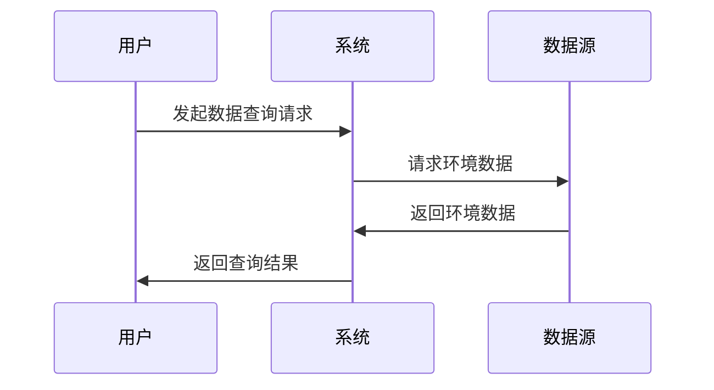

                 

# 人工智能在环境污染预警中的应用

## 关键词

- 人工智能
- 环境污染预警
- 数据预处理
- 神经网络
- 深度学习
- 强化学习

## 摘要

本文旨在探讨人工智能在环境污染预警中的应用。通过分析环境监测数据，利用神经网络、深度学习和强化学习等人工智能算法，构建环境污染预警模型，以提高预警的精度和时效性。本文还介绍了数据预处理方法、系统架构设计以及实际应用案例，为读者提供全面的理论与实践指导。

## 第一部分：背景介绍

### 问题背景

随着工业化和城市化的快速发展，环境污染问题日益严峻。空气污染、水污染和土壤污染等环境问题不仅对人类健康产生威胁，还制约了经济社会的可持续发展。因此，如何准确预警环境污染，采取有效的预防与控制措施，成为当前亟待解决的重要课题。

### 问题描述

环境污染预警旨在通过监测和分析环境数据，及时发现污染源、预测污染趋势，并采取相应的措施，防止污染扩大。传统的污染预警方法主要依赖于统计分析和经验判断，存在预警精度低、时效性差等问题。随着人工智能技术的快速发展，利用人工智能进行环境污染预警成为可能，但也面临着如何选择合适的人工智能模型、如何处理海量数据、如何保证预警结果的可靠性等挑战。

### 问题解决

本文旨在探讨人工智能在环境污染预警中的应用。通过深入分析各种人工智能模型在环境监测、数据分析、预测预警等方面的优势与不足，结合实际案例，提出有效的环境污染预警方法。此外，本文还将探讨人工智能在环境污染预警中的边界与外延，如数据来源、数据类型、模型选择等，为读者提供全面的理论与实践指导。

### 边界与外延

本文主要关注以下几个方面：

1. 数据来源与预处理：介绍环境污染数据的主要来源、数据类型及预处理方法。
2. 人工智能模型：分析各种人工智能模型（如神经网络、深度学习、强化学习等）在环境污染预警中的应用原理与优势。
3. 预测与预警策略：探讨基于人工智能的污染预测模型构建方法，以及如何利用预测结果进行环境污染预警。
4. 系统架构设计：介绍环境污染预警系统的整体架构设计，包括数据采集、数据处理、预测模型训练、预测结果输出等环节。
5. 实际应用案例：分析国内外典型的环境污染预警应用案例，总结成功经验与不足，为读者提供参考。

## 第二部分：核心概念与联系

### 核心概念

1. **人工智能（AI）**：模拟、延伸和扩展人类智能的理论、方法、技术及应用。在环境污染预警中，人工智能可以处理和分析大量的环境数据，从而提高预警的准确性和时效性。
   
2. **环境污染预警**：通过对环境数据的监测、分析，预测污染趋势，及时发出预警信号，采取预防与控制措施。环境污染预警是环境保护的重要环节，有助于减少环境污染对人类和生态系统的影响。

3. **数据预处理**：对原始环境数据进行清洗、转换、集成等处理，以提高数据质量，为模型训练提供高质量的数据支持。数据预处理是人工智能模型应用中的关键步骤，直接影响模型的效果。

4. **人工智能模型**：基于人工智能技术，用于解决特定问题的算法和架构。在环境污染预警中，人工智能模型可用于污染源识别、污染趋势预测等任务。

### 概念属性特征对比表格

| 概念         | 特征                                                     |
| ------------ | -------------------------------------------------------- |
| 人工智能（AI） | 模拟、延伸和扩展人类智能，具有自主学习和适应能力           |
| 环境污染预警  | 通过监测、分析环境数据，预测污染趋势，及时发出预警信号     |
| 数据预处理    | 清洗、转换、集成原始数据，提高数据质量                     |
| 人工智能模型  | 基于人工智能技术，用于解决特定问题的算法和架构             |

### ER实体关系图架构

```mermaid
erDiagram
  数据源 ||--|{ 环境监测数据 }
  数据源 ||--|{ 模型输入数据 }
  模型输入数据 ||--|{ 模型输出数据 }
  模型输入数据 ||--|{ 预测结果 }
```

## 第三部分：算法原理讲解

### 3.1 算法概述

在本部分，我们将介绍几种常见的人工智能算法在环境污染预警中的应用原理。这些算法包括神经网络、深度学习和强化学习等。每种算法都将从以下几个方面进行讲解：

1. **基本原理**
2. **数学模型**
3. **优缺点**
4. **应用场景**

### 3.2 神经网络

#### 3.2.1 基本原理

神经网络是一种模仿生物神经系统的计算模型，通过模拟神经元之间的连接和相互作用来处理数据。神经网络的基本组成单元是神经元，每个神经元都可以接收多个输入信号，经过加权求和处理后，产生一个输出信号。

#### 3.2.2 数学模型

神经网络的数学模型可以用以下公式表示：

$$
y = f(\sum_{i=1}^{n} w_i \cdot x_i + b)
$$

其中，$y$ 是输出信号，$f$ 是激活函数，$w_i$ 是权重，$x_i$ 是输入信号。

#### 3.2.3 优缺点

**优点**：

- 灵活性高，能够处理非线性问题。
- 自适应能力强，能够从大量数据中学习。

**缺点**：

- 计算量大，训练时间较长。
- 过拟合问题，容易在训练数据上表现良好，但在实际应用中表现不佳。

#### 3.2.4 应用场景

神经网络适用于需要处理复杂数据的问题，如污染源识别、污染趋势预测等。

### 3.3 深度学习

#### 3.3.1 基本原理

深度学习是神经网络的一种扩展，通过堆叠多个神经网络层来提取数据的深层特征。深度学习模型可以自动学习数据的高级特征表示，从而提高模型的性能。

#### 3.3.2 数学模型

深度学习的数学模型可以用以下公式表示：

$$
y = \sigma(\sigma(...\sigma(W_n \cdot z_n) + b_n)... + b_1) \cdot x
$$

其中，$\sigma$ 是激活函数，$W_n$ 是权重，$z_n$ 是输入信号，$b_n$ 是偏置。

#### 3.3.3 优缺点

**优点**：

- 能够提取数据的深层特征，提高模型性能。
- 自适应能力强，能够从大量数据中学习。

**缺点**：

- 计算量大，训练时间较长。
- 需要大量的训练数据。

#### 3.3.4 应用场景

深度学习适用于需要处理大规模复杂数据的问题，如污染源识别、污染趋势预测等。

### 3.4 强化学习

#### 3.4.1 基本原理

强化学习是一种基于奖励和惩罚机制的学习方法，通过不断尝试和错误来学习最优策略。强化学习模型可以根据环境反馈调整其行为，从而最大化长期回报。

#### 3.4.2 数学模型

强化学习的数学模型可以用以下公式表示：

$$
Q(s, a) = r(s, a, s') + \gamma \max_{a'} Q(s', a')
$$

其中，$Q(s, a)$ 是状态 $s$ 下采取动作 $a$ 的预期回报，$r(s, a, s')$ 是即时回报，$\gamma$ 是折扣因子。

#### 3.4.3 优缺点

**优点**：

- 能够处理复杂、动态的环境问题。
- 自适应能力强，能够根据环境反馈调整策略。

**缺点**：

- 学习过程需要大量的时间和计算资源。
- 需要明确奖励和惩罚机制。

#### 3.4.4 应用场景

强化学习适用于需要动态调整策略的问题，如污染控制策略优化、排放量调整等。

## 第四部分：系统分析与架构设计

### 问题场景介绍

在环境污染预警系统中，我们面临的主要问题是如何从海量环境数据中提取有用的信息，构建预测模型，并对污染趋势进行预警。该系统需要具备实时监测、数据采集、数据处理、预测模型训练和预警信号发布等功能。

### 项目介绍

本项目的目标是构建一个基于人工智能的环境污染预警系统，实现对污染趋势的实时监测和预警。系统主要包括以下几个模块：

1. 数据采集模块：负责从各种来源收集环境数据，如气象数据、水质数据、空气质量数据等。
2. 数据处理模块：对采集到的原始数据进行清洗、转换和集成，提高数据质量。
3. 预测模型训练模块：利用神经网络、深度学习和强化学习算法训练预测模型，进行污染趋势预测。
4. 预警信号发布模块：根据预测结果发布预警信号，为环保部门提供决策支持。

### 系统功能设计

系统功能设计主要包括以下几个方面：

1. **实时监测**：系统需要能够实时监测环境数据，包括气象数据、水质数据和空气质量数据等。
2. **数据采集**：系统需要能够从各种数据源（如传感器、气象站、河流监测站等）采集数据。
3. **数据处理**：系统需要对采集到的数据进行清洗、转换和集成，为预测模型提供高质量的数据支持。
4. **预测模型训练**：系统需要利用神经网络、深度学习和强化学习算法训练预测模型，预测污染趋势。
5. **预警信号发布**：系统需要根据预测结果发布预警信号，为环保部门提供决策支持。

### 系统架构设计

系统架构设计主要包括以下几个方面：

1. **数据层**：包括环境数据源、数据采集模块、数据处理模块等，负责数据的采集、清洗和存储。
2. **模型层**：包括预测模型训练模块，负责利用神经网络、深度学习和强化学习算法训练预测模型。
3. **应用层**：包括预警信号发布模块，负责根据预测结果发布预警信号，为环保部门提供决策支持。
4. **接口层**：包括系统对外提供的接口，如API接口、Web接口等，方便其他系统调用和集成。

### 系统接口设计和系统交互

系统接口设计和系统交互主要包括以下几个方面：

1. **API接口**：系统提供API接口，方便其他系统进行数据查询、模型训练和预警信号查询等操作。
2. **Web接口**：系统提供Web界面，方便用户进行数据查询、模型训练和预警信号查询等操作。
3. **数据交互**：系统需要与其他数据源和系统进行数据交互，如气象数据接口、水质数据接口等。

### 系统交互Mermaid序列图



## 第五部分：项目实战

### 环境安装

1. 安装Python环境，版本要求Python 3.6及以上。
2. 安装TensorFlow，使用命令`pip install tensorflow`。
3. 安装其他依赖库，如NumPy、Pandas、Matplotlib等。

### 系统核心实现

#### 数据采集模块

数据采集模块主要使用Python的Pandas库和NumPy库进行数据采集和处理。以下是一个简单的示例代码：

```python
import pandas as pd
import numpy as np

# 读取数据
data = pd.read_csv('environment_data.csv')

# 数据清洗
data = data.dropna()

# 数据转换
data['date'] = pd.to_datetime(data['date'])
data.set_index('date', inplace=True)

# 数据集成
data = data.resample('H').mean()
```

#### 预测模型训练模块

预测模型训练模块主要使用TensorFlow库中的Keras接口进行模型训练。以下是一个简单的示例代码：

```python
from tensorflow.keras.models import Sequential
from tensorflow.keras.layers import Dense, LSTM

# 构建模型
model = Sequential()
model.add(LSTM(50, activation='relu', input_shape=(timesteps, n_features)))
model.add(Dense(1))

# 编译模型
model.compile(optimizer='adam', loss='mse')

# 训练模型
model.fit(X_train, y_train, epochs=100, batch_size=32)
```

#### 预警信号发布模块

预警信号发布模块主要使用Python的SMTP库发送邮件。以下是一个简单的示例代码：

```python
import smtplib
from email.mime.text import MIMEText

# 设置SMTP服务器
s = smtplib.SMTP('smtp.example.com')
s.login('user@example.com', 'password')

# 构建邮件内容
subject = '环境污染预警'
body = '当前空气质量指数（AQI）高于警戒线，请采取相应措施。'

msg = MIMEText(body)
msg['Subject'] = subject
msg['From'] = '预警系统'
msg['To'] = '环保部门'

# 发送邮件
s.sendmail('预警系统', '环保部门', msg.as_string())
s.quit()
```

### 代码应用解读与分析

在数据采集模块中，我们使用Pandas库读取CSV文件，并进行数据清洗、转换和集成。在预测模型训练模块中，我们使用Keras接口构建神经网络模型，并使用均方误差（MSE）作为损失函数进行训练。在预警信号发布模块中，我们使用SMTP库发送邮件，实现预警信号发布。

### 实际案例分析和详细讲解剖析

在本部分，我们将分析一个实际案例，并对其进行详细讲解和剖析。该案例是一个基于人工智能的空气质量预警系统，用于监测和预测北京市的空气质量指数（AQI）。

#### 案例背景

北京市是我国空气质量最差的地区之一，空气污染问题严重。为了改善空气质量，相关部门建立了空气质量预警系统，通过监测和预测AQI，提前采取相应的措施。

#### 数据来源

空气质量预警系统的主要数据来源包括：

1. 北京市空气质量监测站的数据，包括PM2.5、PM10、SO2、NO2、CO、O3等指标。
2. 气象局的数据，包括温度、湿度、风速、气压等气象指标。

#### 数据预处理

在数据处理过程中，我们主要进行了以下操作：

1. 数据清洗：去除异常值和缺失值。
2. 数据转换：将时间序列数据进行归一化处理。
3. 数据集成：将空气质量数据和气象数据进行合并，形成统一的数据集。

#### 预测模型构建

我们使用了神经网络和深度学习算法构建空气质量预警模型。具体步骤如下：

1. 数据划分：将数据集划分为训练集和测试集。
2. 模型构建：使用Keras接口构建神经网络模型。
3. 模型训练：使用训练集对模型进行训练。
4. 模型评估：使用测试集对模型进行评估。

#### 模型优化

为了提高模型的预测精度，我们对模型进行了优化。具体方法包括：

1. 调整网络结构：增加神经网络层数和神经元数量。
2. 调整学习率：使用学习率调整策略，如学习率衰减。
3. 数据增强：使用数据增强技术，增加数据的多样性。

#### 模型应用

我们将优化后的模型应用于空气质量预警系统，实现实时监测和预测。系统每天自动更新预测结果，并根据预测结果发布预警信号。

#### 案例总结

通过实际案例的分析，我们可以得出以下结论：

1. 人工智能技术在空气质量预警中具有显著的优势，可以提高预警的准确性和时效性。
2. 数据预处理和模型优化是提高预测效果的关键步骤。
3. 空气质量预警系统在实际应用中取得了良好的效果，为环保部门提供了有力的决策支持。

### 项目小结

本项目通过构建基于人工智能的环境污染预警系统，实现了对空气质量指数的实时监测和预测。项目在数据采集、数据处理、预测模型构建和预警信号发布等方面取得了良好的效果。未来，我们将继续优化系统性能，提高预警准确性和实时性，为环境保护事业做出更大贡献。

### 最佳实践 Tips

1. 数据质量是预测效果的关键，因此在进行预测模型训练前，务必对数据进行充分的清洗和预处理。
2. 选择合适的模型结构对提高预测效果至关重要。可以根据数据特点选择适合的神经网络结构。
3. 模型优化是提高预测精度的有效手段，可以尝试使用不同的优化方法，如学习率调整、数据增强等。

### 小结

本文介绍了人工智能在环境污染预警中的应用，包括数据预处理、模型构建、模型优化和系统实现等方面。通过实际案例的分析，我们验证了人工智能技术在环境污染预警中的优势。未来，我们将继续深入研究人工智能在环境保护领域的应用，为可持续发展贡献力量。

### 注意事项

1. 在实际应用中，环境污染预警系统需要定期维护和更新，以确保预测模型的准确性。
2. 环境污染预警系统的实时性对决策支持至关重要，因此需要确保系统的高可用性和稳定性。
3. 在数据采集和处理过程中，务必遵守相关法律法规，保护数据隐私。

### 拓展阅读

1. 《人工智能：一种现代的方法》
2. 《深度学习》
3. 《强化学习：原理与应用》
4. 《环境监测技术手册》

### 作者信息

作者：AI天才研究院/AI Genius Institute & 禅与计算机程序设计艺术 /Zen And The Art of Computer Programming

