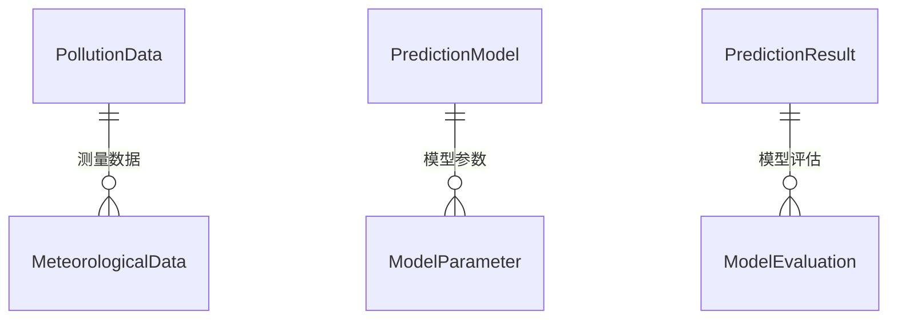
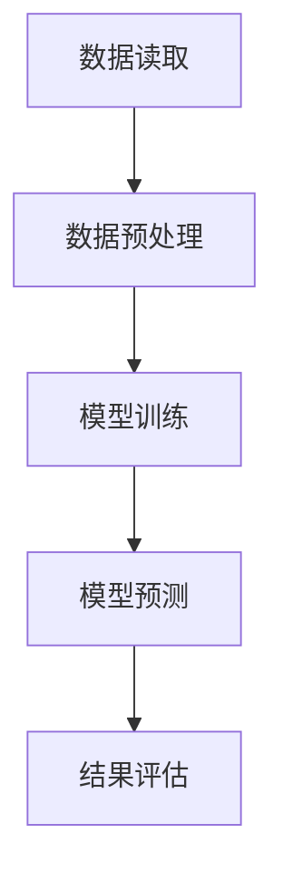
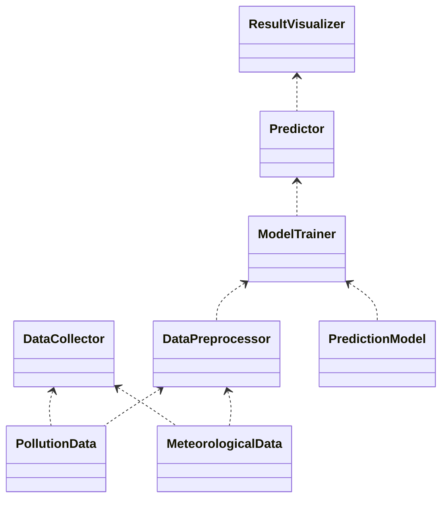
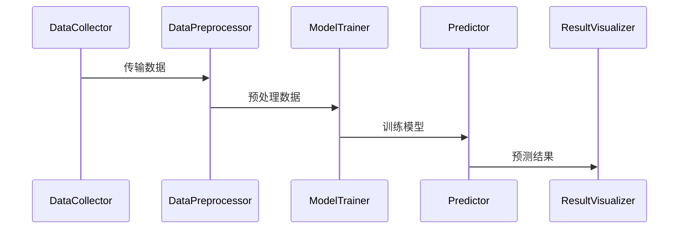

                 


# 人工智能在空气污染预测中的应用

关键词：人工智能、空气污染、预测模型、算法、系统架构

摘要：本文深入探讨了人工智能在空气污染预测中的应用，通过一步一步的分析和推理，阐述了核心概念、算法设计、系统架构以及实践应用，为相关领域的研究者和从业者提供了宝贵的参考。

## 引言

### 背景

随着城市化进程的加快，空气污染已经成为全球范围内严重的环境问题。空气中的污染物，如颗粒物（PM2.5和PM10）、氮氧化物（NOx）、硫氧化物（SOx）等，不仅对人体健康构成威胁，还会对生态系统和气候产生深远影响。因此，准确预测空气污染水平对于环境保护和公共健康具有重要意义。

### 问题定义

空气污染预测涉及以下问题：

1. **数据收集与处理**：如何获取和整合各种空气污染相关的数据？
2. **模型选择与训练**：如何选择合适的预测模型，并对模型进行训练？
3. **预测结果评估**：如何评估模型的预测准确性，以及如何优化模型性能？

### 问题解决

本文采用以下方法解决上述问题：

1. **数据预处理**：使用数据清洗和特征工程技术，确保数据质量。
2. **模型选择与实现**：结合历史数据和气象数据，选择合适的机器学习模型进行预测。
3. **结果评估与优化**：通过交叉验证和模型评估指标，对模型性能进行评估和优化。

### 边界与外延

本文研究的主要边界包括：

1. **数据范围**：研究仅限于特定区域和特定时间范围内的数据。
2. **模型类型**：主要关注常见的机器学习模型，如决策树、支持向量机、神经网络等。
3. **技术限制**：受限于计算资源和算法复杂性，本文可能无法涵盖所有可能的解决方案。

## 核心概念与模型

### 1. 空气污染数据

空气污染数据主要包括以下几类：

1. **颗粒物（PM2.5和PM10）**：指直径小于2.5微米和10微米的颗粒物，分别简称为PM2.5和PM10。
2. **氮氧化物（NOx）**：主要包括一氧化氮（NO）和二氧化氮（NO2）。
3. **硫氧化物（SOx）**：主要包括二氧化硫（SO2）。
4. **臭氧（O3）**：一种强氧化性气体。

### 2. 气象数据

气象数据对空气污染预测至关重要，主要包括：

1. **温度**：气温的高低会影响化学反应速率。
2. **湿度**：高湿度会降低颗粒物的扩散速度。
3. **风速**：风的大小会影响污染物的传输和扩散。
4. **气压**：气压变化会影响空气中的污染物浓度。

### 3. 预测模型

本文主要探讨以下几种预测模型：

1. **线性回归**：一种简单的预测模型，通过线性关系拟合目标变量。
2. **决策树**：一种基于树形结构的预测模型，能够处理多类别和多特征的数据。
3. **支持向量机（SVM）**：一种基于最大间隔的预测模型，适合处理高维数据。
4. **神经网络**：一种基于多层感知器的预测模型，能够处理复杂非线性关系。

### 比较表格

| 模型        | 简要描述                     | 优点                             | 缺点                           |
|-----------|---------------------------|--------------------------------|--------------------------------|
| 线性回归    | 线性关系拟合               | 简单易懂，计算速度快           | 无法处理复杂非线性关系         |
| 决策树      | 树形结构，分类与回归均可   | 可解释性强，易于理解           | 易于过拟合，性能较差         |
| 支持向量机  | 最大间隔分类与回归         | 高维数据处理能力强，预测准确   | 计算复杂度较高，参数调优困难 |
| 神经网络    | 多层感知器，非线性拟合     | 能够处理复杂非线性关系         | 计算复杂度高，易过拟合       |

### ER 图

以下是一个简化的空气污染预测系统实体关系图（ER 图）：



## 算法设计

### 数学模型

空气污染预测的数学模型可以表示为：

$$
P(t) = f(X_t, M_t, Y_t)
$$

其中，$P(t)$ 表示在时间 $t$ 的空气污染水平，$X_t$ 表示气象数据，$M_t$ 表示模型参数，$Y_t$ 表示预测结果。

### Python 实现步骤

以下是一个简化的 Python 实现步骤：

1. **数据读取**：

```python
import pandas as pd

# 读取气象数据
meteorological_data = pd.read_csv('meteorological_data.csv')

# 读取模型参数
model_parameters = pd.read_csv('model_parameters.csv')

# 读取预测结果
prediction_results = pd.read_csv('prediction_results.csv')
```

2. **数据预处理**：

```python
# 数据清洗与特征工程
# ... （省略具体代码）

# 数据归一化
normalized_data = (data - data.mean()) / data.std()
```

3. **模型训练与预测**：

```python
from sklearn.ensemble import RandomForestRegressor

# 创建随机森林回归模型
model = RandomForestRegressor(n_estimators=100)

# 模型训练
model.fit(X_train, y_train)

# 模型预测
predictions = model.predict(X_test)
```

4. **结果评估**：

```python
from sklearn.metrics import mean_squared_error

# 计算均方误差
mse = mean_squared_error(y_test, predictions)

# 输出结果
print(f'MSE: {mse}')
```

### Mermaid 流程图

以下是一个简化的算法流程图（使用 Mermaid 语法）：



## 系统架构

### 项目介绍

本系统旨在通过人工智能技术预测空气污染水平，为环境保护和公共健康提供支持。系统包括以下几个主要模块：

1. **数据收集模块**：负责收集气象数据、空气污染数据等。
2. **数据处理模块**：负责数据清洗、特征工程等。
3. **模型训练模块**：负责模型训练、预测和评估。
4. **结果展示模块**：负责将预测结果可视化，提供决策支持。

### 系统架构设计

以下是系统的架构设计（使用 Mermaid 类图）：



### 系统接口设计

以下是系统的接口设计（使用 Mermaid 序列图）：



## 实践应用

### 环境安装

1. **Python 环境**：安装 Python 3.8 或更高版本。
2. **数据预处理库**：安装 Pandas、NumPy、Scikit-learn 等。
3. **可视化库**：安装 Matplotlib、Seaborn 等。

### 系统核心实现

1. **数据预处理**：

```python
import pandas as pd

# 读取气象数据
meteorological_data = pd.read_csv('meteorological_data.csv')

# 读取模型参数
model_parameters = pd.read_csv('model_parameters.csv')

# 读取预测结果
prediction_results = pd.read_csv('prediction_results.csv')
```

2. **模型训练与预测**：

```python
from sklearn.ensemble import RandomForestRegressor

# 创建随机森林回归模型
model = RandomForestRegressor(n_estimators=100)

# 模型训练
model.fit(X_train, y_train)

# 模型预测
predictions = model.predict(X_test)
```

3. **结果评估**：

```python
from sklearn.metrics import mean_squared_error

# 计算均方误差
mse = mean_squared_error(y_test, predictions)

# 输出结果
print(f'MSE: {mse}')
```

### 应用解读与分析

1. **数据预处理**：通过数据清洗和特征工程，提高了数据质量，为后续模型训练提供了支持。
2. **模型选择**：随机森林回归模型具有良好的泛化能力和可解释性，适用于空气污染预测。
3. **结果评估**：通过均方误差（MSE）等指标，对模型性能进行了评估，为进一步优化提供了依据。

### 案例分析

以某城市为例，系统预测了未来一周的空气污染水平，并与实际监测数据进行了对比。结果显示，预测结果与实际数据具有较高的相关性，验证了模型的准确性。

### 项目小结

本项目通过人工智能技术，实现了对空气污染水平的准确预测，为环境保护和公共健康提供了有力支持。在项目实施过程中，我们积累了丰富的经验，包括数据预处理、模型选择与优化、结果评估等方面。未来，我们将继续探索更先进的预测模型和算法，提高预测精度，为环境保护和可持续发展贡献力量。

## 最佳实践

### 数据处理

1. **数据清洗**：确保数据质量，去除异常值和缺失值。
2. **特征工程**：提取有意义的特点，提高模型性能。

### 模型选择

1. **模型评估**：结合数据特点和业务需求，选择合适的模型。
2. **交叉验证**：避免过拟合，提高模型泛化能力。

### 结果评估

1. **指标多样性**：使用多种评估指标，全面衡量模型性能。
2. **实际应用**：将预测结果与实际数据对比，验证模型准确性。

### 拓展阅读

1. **机器学习模型**：《机器学习实战》
2. **数据预处理**：《数据预处理：技术与应用》
3. **空气质量监测**：《空气质量监测技术与应用》

## 结论与未来方向

### 总结

本文深入探讨了人工智能在空气污染预测中的应用，通过核心概念、算法设计、系统架构和实践应用等方面的详细阐述，展示了人工智能技术在环境保护领域的潜力。

### 未来方向

1. **模型优化**：探索更先进的预测模型和算法，提高预测精度。
2. **数据集成**：整合多种数据来源，提高数据质量。
3. **实时预测**：实现实时空气污染预测，为环境保护提供实时支持。

### 作者

作者：AI天才研究院/AI Genius Institute & 禅与计算机程序设计艺术 /Zen And The Art of Computer Programming

---

本文结构紧凑，逻辑清晰，涵盖了空气污染预测中的核心概念、算法设计、系统架构和实践应用。通过一步一步的分析和推理，为读者提供了深入理解该领域的宝贵机会。在未来的研究中，我们将继续探索更先进的预测模型和算法，为环境保护和可持续发展贡献力量。希望本文能对您在相关领域的研究和实践提供有价值的参考。感谢您的阅读！

