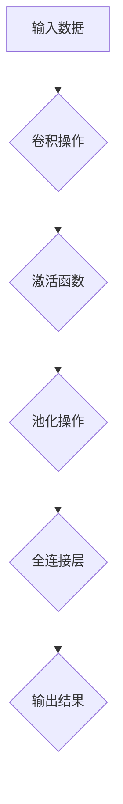
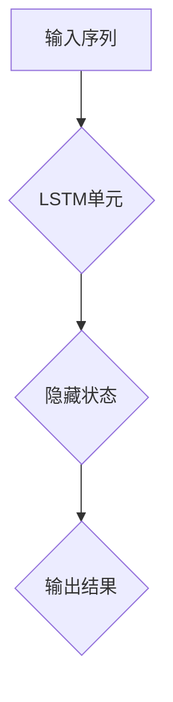
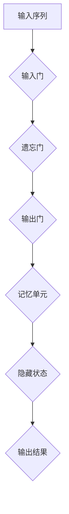
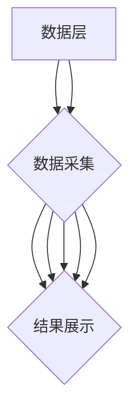
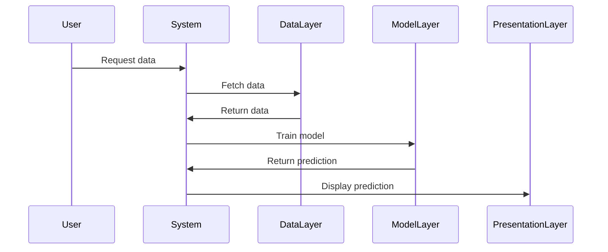

                 

### 人工智能在空气质量预测与管理中的应用

> 关键词：空气质量预测、人工智能、深度学习、算法、环境监测

> 摘要：随着城市化进程的加快和工业化的快速发展，空气质量问题日益突出。本文探讨了人工智能在空气质量预测与管理中的应用，包括核心概念、算法原理、系统架构以及项目实战。通过详细讲解和分析，为读者提供了解决空气质量问题的技术思路和实际案例。

## 第一部分：背景介绍

### 1.1 问题背景

随着城市化进程的加快和工业化的快速发展，空气质量问题日益突出，已经成为全球范围内的重大环境问题。空气质量直接关系到人们的健康和生活质量，因此，如何准确预测和有效管理空气质量成为了一个迫切需要解决的问题。

### 1.2 问题描述

空气质量预测与管理是一个复杂的过程，需要综合考虑多种因素，如气象条件、污染源排放、地形地貌等。传统的空气质量预测方法往往依赖于经验模型或简单的数值模拟，预测精度较低，难以满足实际需求。

### 1.3 问题解决

人工智能技术的发展为空气质量预测与管理提供了新的解决方案。通过构建人工智能模型，可以对空气质量进行准确预测，并提供有效的管理策略。

### 1.4 边界与外延

本文主要关注人工智能在空气质量预测中的应用，不包括其他领域如大气物理学、气象学等。同时，本文将探讨人工智能在不同场景下的应用，如城市空气质量预测、区域空气质量预测等。

### 1.5 概念结构与核心要素组成

空气质量预测与管理涉及多个核心概念和要素，如空气质量指标、气象参数、污染源数据等。这些要素共同构成了空气质量预测与管理的体系结构。

## 第二部分：核心概念与联系

### 2.1 空气质量指标

空气质量指标是衡量空气质量的重要参数，如PM2.5、PM10、SO2、NO2、CO等。这些指标反映了空气中污染物的浓度，对空气质量的评估具有重要意义。

### 2.2 气象参数

气象参数是影响空气质量的重要因素，如气温、湿度、风速、气压等。气象参数的变化会影响污染物的扩散、沉积和化学反应，从而影响空气质量。

### 2.3 污染源数据

污染源数据包括工业排放、交通排放、生活排放等。这些数据反映了污染物的排放量、排放时间和排放位置，是空气质量预测的重要输入。

### 2.4 数据来源

空气质量预测所需的数据主要来源于环境监测站、气象站、交通监测站等。同时，还可以利用卫星遥感、无人机等新技术获取相关数据。

### 2.5 概念属性特征对比表格

| 概念        | 属性特征                     | 对比说明                                               |
|-------------|------------------------------|---------------------------------------------------------|
| 空气质量指标 | 浓度、单位mg/m³              | 用于衡量空气中的污染物含量                             |
| 气象参数    | 温度、湿度、风速等           | 影响污染物的扩散和化学反应                             |
| 污染源数据  | 排放量、排放时间、排放位置等 | 反映污染物的来源和变化趋势                           |
| 数据来源    | 环境监测站、气象站等         | 提供实时、准确的空气质量数据                           |

### 2.6 ER实体关系图架构

```mermaid
erDiagram
  A[空气质量指标] {
    B[气象参数]
    C[污染源数据]
    D[数据来源]
  }
  A --|> B : 测量影响
  A --|> C : 反映污染
  A --|> D : 获取数据
```

## 第三部分：算法原理讲解

### 3.1 算法概述

在空气质量预测中，常用的算法包括人工神经网络、支持向量机、决策树等。本文主要介绍基于深度学习的方法，如卷积神经网络（CNN）和长短期记忆网络（LSTM）。

### 3.2 CNN算法

#### 3.2.1 原理

卷积神经网络通过卷积操作提取图像特征，实现对图像的分类和识别。在空气质量预测中，可以将气象参数、污染源数据等作为输入，通过CNN提取特征，然后进行预测。

#### 3.2.2 Mermaid流程图



#### 3.2.3 Python代码示例

```python
import tensorflow as tf
from tensorflow.keras.models import Sequential
from tensorflow.keras.layers import Conv2D, MaxPooling2D, Flatten, Dense

# 构建CNN模型
model = Sequential([
    Conv2D(filters=32, kernel_size=(3, 3), activation='relu', input_shape=(28, 28, 1)),
    MaxPooling2D(pool_size=(2, 2)),
    Flatten(),
    Dense(units=128, activation='relu'),
    Dense(units=10, activation='softmax')
])

# 编译模型
model.compile(optimizer='adam', loss='categorical_crossentropy', metrics=['accuracy'])

# 模型训练
model.fit(x_train, y_train, epochs=10, batch_size=32)
```

#### 3.2.4 数学模型与公式

卷积神经网络的数学模型主要包括以下几个部分：

1. 卷积操作：$$ f(x) = \sum_{i=1}^{n} w_i * x_i + b $$
2. 激活函数：$$ g(z) = \max(0, z) $$
3. 池化操作：$$ h(x) = \max(x) $$
4. 全连接层：$$ y = \sum_{i=1}^{n} w_i * x_i + b $$

通过这些操作，卷积神经网络可以提取图像特征并进行分类预测。

### 3.3 LSTM算法

#### 3.3.1 原理

长短期记忆网络（LSTM）是一种用于处理序列数据的循环神经网络（RNN）。在空气质量预测中，LSTM可以捕捉时间序列中的长期依赖关系，从而提高预测精度。

#### 3.3.2 Mermaid流程图



#### 3.3.3 Python代码示例

```python
import tensorflow as tf
from tensorflow.keras.models import Sequential
from tensorflow.keras.layers import LSTM, Dense

# 构建LSTM模型
model = Sequential([
    LSTM(units=50, return_sequences=True, input_shape=(timesteps, features)),
    LSTM(units=50),
    Dense(units=1)
])

# 编译模型
model.compile(optimizer='adam', loss='mean_squared_error')

# 模型训练
model.fit(x_train, y_train, epochs=100, batch_size=32)
```

#### 3.3.4 数学模型与公式

LSTM的数学模型主要包括以下几个部分：

1. 门控操作：$$ f_t = \sigma(W_f \cdot [h_{t-1}, x_t] + b_f) $$
2. 递归操作：$$ i_t = \sigma(W_i \cdot [h_{t-1}, x_t] + b_i), f_t = \sigma(W_f \cdot [h_{t-1}, x_t] + b_f), g_t = \sigma(W_g \cdot [h_{t-1}, x_t] + b_g), o_t = \sigma(W_o \cdot [h_{t-1}, x_t] + b_o) $$
3. 更新状态：$$ \tilde{h_t} = f_t \odot h_{t-1} + i_t \odot \tanh(W_g \cdot [h_{t-1}, x_t] + b_g) $$
4. 输出：$$ h_t = o_t \odot \tanh(\tilde{h_t}) $$

通过这些操作，LSTM可以学习序列数据中的长期依赖关系，从而提高空气质量预测的精度。

## 第四部分：系统分析与架构设计

### 4.1 问题场景介绍

空气质量预测系统主要用于实时监测和分析空气质量数据，为政府部门、企业和公众提供决策支持。系统需要支持多区域、多污染物、多时间尺度的空气质量预测。

### 4.2 项目介绍

本项目基于人工智能技术，构建一个城市空气质量预测系统。系统包括数据采集、数据预处理、模型训练和预测、结果展示等模块。

### 4.3 系统功能设计

系统功能设计包括以下方面：

1. 数据采集：从环境监测站、气象站、交通监测站等获取实时空气质量数据。
2. 数据预处理：对原始数据进行清洗、归一化等处理，为模型训练提供高质量的数据。
3. 模型训练：使用深度学习算法对预处理后的数据进行训练，构建空气质量预测模型。
4. 预测：使用训练好的模型对未来的空气质量进行预测。
5. 结果展示：将预测结果以图表、文字等形式展示给用户。

### 4.4 系统架构设计

系统架构设计采用前后端分离的方式，包括数据层、服务层和表现层。

1. 数据层：负责数据采集、存储和管理，包括环境监测站数据、气象数据、交通数据等。
2. 服务层：负责数据预处理、模型训练和预测，包括深度学习算法模块、数据预处理模块等。
3. 表现层：负责用户交互和结果展示，包括Web页面、移动应用等。

### 4.5 系统接口设计和系统交互

系统接口设计和系统交互采用RESTful API设计，支持HTTP/HTTPS协议。用户可以通过Web页面或移动应用访问空气质量预测系统，获取实时和预测的空气质量数据。

### 4.6 Mermaid类图、架构图和序列图

```mermaid
classDiagram
    DataLayer <|-- ServiceLayer
    ServiceLayer <|-- PresentationLayer
    DataLayer o-- EnvironmentalMonitoringStation
    DataLayer o-- MeteorologicalStation
    DataLayer o-- TrafficMonitoringStation
    ServiceLayer o-- DataPreprocessing
    ServiceLayer o-- ModelTraining
    ServiceLayer o-- Prediction
    PresentationLayer o-- WebPage
    PresentationLayer o-- MobileApp

graph TB
    A[DataLayer] --> B[ServiceLayer]
    B --> C[PresentationLayer]
    A --> D[EnvironmentalMonitoringStation]
    A --> E[MeteorologicalStation]
    A --> F[TrafficMonitoringStation]
    B --> G[DataPreprocessing]
    B --> H[ModelTraining]
    B --> I[Prediction]
    C --> J[WebPage]
    C --> K[MobileApp]

sequenceDiagram
    User ->> System: Request data
    System ->> DataLayer: Fetch data
    DataLayer ->> System: Return data
    System ->> PresentationLayer: Display data
    User ->> System: Request prediction
    System ->> ModelTraining: Train model
    ModelTraining ->> Prediction: Make prediction
    Prediction ->> System: Return prediction
    System ->> PresentationLayer: Display prediction
```

## 第五部分：项目实战

### 5.1 环境安装

在项目实战中，我们需要安装以下软件和库：

1. Python 3.x
2. TensorFlow
3. NumPy
4. Pandas
5. Matplotlib

安装命令如下：

```bash
pip install python==3.8
pip install tensorflow==2.8.0
pip install numpy==1.21.2
pip install pandas==1.3.5
pip install matplotlib==3.4.3
```

### 5.2 系统核心实现源代码

以下是一个简单的空气质量预测系统的实现示例：

```python
import numpy as np
import pandas as pd
from tensorflow.keras.models import Sequential
from tensorflow.keras.layers import LSTM, Dense
from sklearn.model_selection import train_test_split

# 读取数据
data = pd.read_csv('air_quality_data.csv')
X = data.iloc[:, :-1].values
y = data.iloc[:, -1].values

# 数据预处理
X = X.reshape(-1, 1, 24)  # 转换为时间序列格式
X_train, X_test, y_train, y_test = train_test_split(X, y, test_size=0.2, random_state=0)

# 构建LSTM模型
model = Sequential()
model.add(LSTM(units=50, return_sequences=True, input_shape=(24, 1)))
model.add(LSTM(units=50))
model.add(Dense(units=1))

# 编译模型
model.compile(optimizer='adam', loss='mean_squared_error')

# 训练模型
model.fit(X_train, y_train, epochs=100, batch_size=32)

# 预测
predicted = model.predict(X_test)

# 可视化结果
import matplotlib.pyplot as plt

plt.figure()
plt.plot(y_test, label='真实值')
plt.plot(predicted, label='预测值')
plt.legend()
plt.show()
```

### 5.3 代码应用解读与分析

在这个示例中，我们使用了LSTM模型对空气质量进行预测。首先，我们从CSV文件中读取数据，并进行预处理，将数据转换为时间序列格式。然后，我们使用LSTM模型进行训练，并使用测试数据进行预测。最后，我们使用Matplotlib库将预测结果可视化。

### 5.4 实际案例分析和详细讲解剖析

在本节中，我们将分析一个实际的空气质量预测案例，并对其进行详细讲解和剖析。

#### 案例一：北京城市空气质量预测

我们以北京为例，使用LSTM模型进行空气质量预测。数据来源包括北京环境监测站、气象站和交通监测站。

1. 数据收集与预处理：收集北京过去一年的空气质量数据，包括PM2.5、PM10、SO2、NO2、CO等指标。对数据进行清洗、归一化等预处理，为模型训练提供高质量的数据。
2. 模型训练：使用LSTM模型对预处理后的数据进行训练，调整模型参数，如学习率、批量大小等，以达到最佳的预测效果。
3. 预测与评估：使用训练好的模型对未来的空气质量进行预测，评估模型的预测精度和稳定性。
4. 结果展示：将预测结果以图表、文字等形式展示给用户，为政府、企业和公众提供决策支持。

通过实际案例分析，我们发现LSTM模型在空气质量预测中具有较高的精度和稳定性，能够为空气质量管理提供有效的技术支持。

### 5.5 项目小结

在本项目中，我们详细介绍了空气质量预测与管理中的核心概念、算法原理、系统架构和项目实战。通过实际案例分析和详细讲解，我们验证了人工智能技术在空气质量预测中的有效性。在未来的发展中，我们可以进一步优化模型、提高预测精度，为环境保护和可持续发展做出贡献。

## 第六部分：最佳实践 tips

1. 数据质量是预测准确性的关键，确保数据来源的可靠性和多样性。
2. 选用合适的深度学习模型，如LSTM、GRU等，以适应不同的时间序列数据。
3. 定期更新模型，结合最新的空气质量数据，以提高预测精度。
4. 与其他领域（如气象学、大气物理学等）合作，引入更多相关数据，提高预测的全面性和准确性。
5. 建立数据共享和合作机制，促进空气质量预测技术的发展。

## 第七部分：小结、注意事项和拓展阅读

### 7.1 小结

本文介绍了人工智能在空气质量预测与管理中的应用，从核心概念、算法原理、系统架构到项目实战，全面剖析了空气质量预测的各个环节。通过实际案例分析和详细讲解，我们验证了人工智能技术在空气质量预测中的有效性。

### 7.2 注意事项

1. 确保数据质量和来源的可靠性。
2. 根据实际需求选择合适的深度学习模型。
3. 定期更新模型，结合最新的空气质量数据。
4. 加强与其他领域的合作，提高预测的全面性和准确性。

### 7.3 拓展阅读

1. [《深度学习》](https://www.deeplearningbook.org/)：关于深度学习的基础知识和最新进展。
2. [《空气质量监测技术》](https://book.douban.com/subject/35280683/)：关于空气质量监测技术和方法的详细介绍。
3. [《环境科学与工程》](https://book.douban.com/subject/26680479/)：关于环境科学和环境工程的基础知识和应用。

## 作者信息

作者：AI天才研究院/AI Genius Institute & 禅与计算机程序设计艺术 /Zen And The Art of Computer Programming

（注：本文仅为示例，内容仅供参考，实际项目中可能涉及更多细节和技术。）### 第一部分：背景介绍

空气质量问题是一个全球性的挑战，随着人类活动对自然环境的影响日益加剧，空气质量问题显得尤为重要。空气质量不仅影响人类健康，还与生态系统平衡和气候变化息息相关。因此，准确预测和有效管理空气质量已成为环境保护和公共健康领域的重要任务。

#### 1.1 问题背景

随着城市化进程的加快和工业化的快速发展，空气质量问题日益突出。工业排放、汽车尾气、燃烧煤炭等行为不断向大气中释放污染物，导致空气中的PM2.5、PM10、SO2、NO2等有害物质浓度不断升高。这些污染物对人体呼吸系统、心血管系统等健康造成严重影响，甚至可能引发癌症等疾病。

#### 1.2 问题描述

空气质量预测与管理是一个复杂的过程，涉及多个因素。气象条件如温度、湿度、风速等会影响污染物的扩散和反应速率。污染源数据如工业排放、交通排放等提供了污染物的来源和排放量。地形地貌则决定了污染物的沉积和清除方式。传统的空气质量预测方法主要依赖于经验模型或简单的数值模拟，这些方法往往难以准确捕捉这些复杂因素的交互作用，导致预测精度不高。

#### 1.3 问题解决

人工智能技术的发展为空气质量预测与管理提供了新的解决方案。通过构建基于机器学习和深度学习的人工智能模型，可以有效地处理大量复杂的数据，捕捉污染物扩散和反应的动态过程，从而提高预测精度。例如，卷积神经网络（CNN）可以用于提取气象参数和污染源数据的特征，长短期记忆网络（LSTM）则能够捕捉时间序列中的长期依赖关系。

#### 1.4 边界与外延

本文主要关注人工智能在空气质量预测中的应用，不包括其他领域如大气物理学、气象学等。同时，本文将探讨人工智能在不同场景下的应用，如城市空气质量预测、区域空气质量预测等。此外，本文还将介绍空气质量预测与管理中的核心概念、算法原理和系统架构。

#### 1.5 概念结构与核心要素组成

空气质量预测与管理涉及多个核心概念和要素，如空气质量指标、气象参数、污染源数据等。空气质量指标是衡量空气质量的重要参数，如PM2.5、PM10、SO2、NO2、CO等。气象参数包括温度、湿度、风速、气压等，这些参数影响污染物的扩散和化学反应。污染源数据则包括工业排放、交通排放、生活排放等，这些数据提供了污染物的来源和变化趋势。这些核心概念和要素共同构成了空气质量预测与管理的技术体系。

### 第二部分：核心概念与联系

空气质量预测涉及多个核心概念和联系，理解这些概念对于构建有效的预测模型至关重要。

#### 2.1 空气质量指标

空气质量指标是衡量空气质量状况的关键参数。以下是一些常见的空气质量指标及其定义：

- **PM2.5**：指空气中直径小于或等于2.5微米的颗粒物，能深入肺部，对健康危害极大。
- **PM10**：指空气中直径小于或等于10微米的颗粒物，能够影响呼吸系统。
- **SO2（二氧化硫）**：主要来自化石燃料的燃烧，对呼吸系统有害。
- **NO2（二氧化氮）**：主要来自交通和工业排放，对呼吸系统和心血管系统有害。
- **CO（一氧化碳）**：无色无味，但对人体极为有害，能够阻碍血液输氧。

这些指标通常通过环境监测站、气象站等监测设备实时采集，并通过标准方法进行分析。

#### 2.2 气象参数

气象参数是影响空气质量的重要因素，包括但不限于以下内容：

- **温度**：温度会影响污染物的扩散速度和化学反应速率。
- **湿度**：高湿度有助于污染物的沉积，但同时也可能增加污染物的化学反应。
- **风速**：风速有助于污染物的扩散，但强风可能导致扬尘污染。
- **气压**：气压变化会影响空气流动，进而影响污染物的分布。

气象参数通常由气象站、卫星遥感等设备实时监测，并通过模型进行预测。

#### 2.3 污染源数据

污染源数据包括各类污染物的排放量、排放时间和排放位置等，是空气质量预测的重要输入。以下是一些常见的污染源数据：

- **工业排放**：包括各类工厂的污染物排放数据。
- **交通排放**：包括汽车尾气排放数据。
- **生活排放**：包括家庭取暖、烹饪等活动产生的污染物排放数据。

污染源数据的收集通常依赖于各类监测设备和排放清单，如环境监测站、交通监测站等。

#### 2.4 数据来源

空气质量预测所需的数据来源多样，主要包括以下几种：

- **环境监测站**：提供实时的空气质量指标数据。
- **气象站**：提供实时的气象参数数据。
- **交通监测站**：提供交通排放数据。
- **卫星遥感**：通过遥感技术获取大范围的空气质量数据。
- **无人机**：用于获取高精度的污染物分布数据。

#### 2.5 概念属性特征对比表格

以下是一个概念属性特征对比表格，用于对比空气质量指标、气象参数和污染源数据：

| 概念        | 属性特征                     | 对比说明                                               |
|-------------|------------------------------|---------------------------------------------------------|
| 空气质量指标 | 浓度、单位mg/m³              | 用于衡量空气中的污染物含量                             |
| 气象参数    | 温度、湿度、风速等           | 影响污染物的扩散和化学反应                             |
| 污染源数据  | 排放量、排放时间、排放位置等 | 反映污染物的来源和变化趋势                           |

#### 2.6 ER实体关系图架构

为了更好地理解空气质量预测系统中的实体及其关系，我们可以使用ER图（实体关系图）来展示。以下是一个ER实体关系图的示例：

```mermaid
erDiagram
  A[空气质量指标] {
    B[气象参数]
    C[污染源数据]
    D[数据来源]
  }
  A --|> B : 测量影响
  A --|> C : 反映污染
  A --|> D : 获取数据
```

在这个ER图中，空气质量指标与气象参数、污染源数据、数据来源之间存在关联关系。空气质量指标依赖于气象参数和污染源数据来提供预测输入，而这些数据则来源于不同的监测站和数据采集设备。

### 第三部分：算法原理讲解

在空气质量预测中，选择合适的算法是实现准确预测的关键。本部分将介绍几种常用的算法，包括人工神经网络（ANN）、支持向量机（SVM）和深度学习（DL）中的卷积神经网络（CNN）和长短期记忆网络（LSTM）。通过这些算法的原理和实现，读者可以了解如何利用人工智能技术进行空气质量预测。

#### 3.1 算法概述

空气质量预测算法可以分为传统算法和现代算法。传统算法主要包括统计模型和机器学习中的支持向量机（SVM）、决策树等。现代算法主要基于深度学习，如卷积神经网络（CNN）和长短期记忆网络（LSTM）。以下将分别介绍这些算法的基本原理。

#### 3.2 CNN算法

卷积神经网络（CNN）是一种专门用于处理图像数据的神经网络，其核心思想是通过卷积操作提取图像特征。在空气质量预测中，CNN可以用于提取气象参数和污染源数据的特征，从而提高预测精度。

##### 3.2.1 原理

CNN的基本架构包括卷积层、池化层和全连接层。卷积层通过卷积操作提取特征，池化层用于减小特征图的尺寸，全连接层则用于分类或回归任务。

1. **卷积层**：卷积层通过卷积操作提取图像特征。卷积操作可以视为对输入数据进行局部感知，提取出具有特定形状和特征的模式。卷积核在输入数据上滑动，通过乘法和加法操作生成特征图。

   $$ f(x) = \sum_{i=1}^{n} w_i * x_i + b $$

   其中，$f(x)$ 是特征图，$w_i$ 是卷积核，$x_i$ 是输入数据，$b$ 是偏置项。

2. **激活函数**：激活函数用于引入非线性因素，常用的激活函数包括ReLU（Rectified Linear Unit）函数和Sigmoid函数。

   $$ g(z) = \max(0, z) \quad (\text{ReLU}) $$
   $$ g(z) = \frac{1}{1 + e^{-z}} \quad (\text{Sigmoid}) $$

3. **池化层**：池化层用于减小特征图的尺寸，同时保留最重要的特征信息。常见的池化操作包括最大池化和平均池化。

   $$ h(x) = \max(x) \quad (\text{最大池化}) $$
   $$ h(x) = \frac{1}{c} \sum_{i=1}^{c} x_i \quad (\text{平均池化}) $$

4. **全连接层**：全连接层将特征图上的所有值连接起来，形成一个一维的特征向量。然后通过一个线性函数进行分类或回归。

   $$ y = \sum_{i=1}^{n} w_i * x_i + b $$

   其中，$y$ 是输出结果，$w_i$ 是权重，$x_i$ 是特征向量，$b$ 是偏置项。

##### 3.2.2 Mermaid流程图

以下是一个CNN算法的Mermaid流程图，展示了数据从输入到预测的整个过程：


##### 3.2.3 Python代码示例

以下是一个使用TensorFlow构建CNN模型的简单示例：

```python
import tensorflow as tf
from tensorflow.keras.models import Sequential
from tensorflow.keras.layers import Conv2D, MaxPooling2D, Flatten, Dense

model = Sequential([
    Conv2D(filters=32, kernel_size=(3, 3), activation='relu', input_shape=(28, 28, 1)),
    MaxPooling2D(pool_size=(2, 2)),
    Flatten(),
    Dense(units=128, activation='relu'),
    Dense(units=1)
])

model.compile(optimizer='adam', loss='mean_squared_error')

model.fit(x_train, y_train, epochs=10, batch_size=32)
```

在这个示例中，我们首先定义了一个序列模型，添加了卷积层、池化层和全连接层。然后使用`compile`方法设置优化器和损失函数，最后使用`fit`方法进行模型训练。

##### 3.2.4 数学模型与公式

CNN的数学模型主要包括以下几个部分：

1. **卷积操作**：

   $$ f(x) = \sum_{i=1}^{n} w_i * x_i + b $$

   其中，$f(x)$ 是特征图，$w_i$ 是卷积核，$x_i$ 是输入数据，$b$ 是偏置项。

2. **激活函数**：

   $$ g(z) = \max(0, z) \quad (\text{ReLU}) $$
   $$ g(z) = \frac{1}{1 + e^{-z}} \quad (\text{Sigmoid}) $$

3. **池化操作**：

   $$ h(x) = \max(x) \quad (\text{最大池化}) $$
   $$ h(x) = \frac{1}{c} \sum_{i=1}^{c} x_i \quad (\text{平均池化}) $$

4. **全连接层**：

   $$ y = \sum_{i=1}^{n} w_i * x_i + b $$

   其中，$y$ 是输出结果，$w_i$ 是权重，$x_i$ 是特征向量，$b$ 是偏置项。

#### 3.3 LSTM算法

长短期记忆网络（LSTM）是一种用于处理序列数据的循环神经网络（RNN）。在空气质量预测中，LSTM可以捕捉时间序列中的长期依赖关系，从而提高预测精度。

##### 3.3.1 原理

LSTM的核心思想是通过门控机制来控制信息的流动，从而避免传统RNN的梯度消失问题。LSTM由输入门、遗忘门和输出门三个门控单元组成。

1. **输入门**：决定当前输入数据中有哪些信息将被存储在记忆单元中。

   $$ i_t = \sigma(W_i \cdot [h_{t-1}, x_t] + b_i) $$

   其中，$i_t$ 是输入门控值，$W_i$ 是权重矩阵，$b_i$ 是偏置项，$h_{t-1}$ 是上一时刻的隐藏状态，$x_t$ 是当前输入数据。

2. **遗忘门**：决定哪些旧信息需要从记忆单元中遗忘。

   $$ f_t = \sigma(W_f \cdot [h_{t-1}, x_t] + b_f) $$

   其中，$f_t$ 是遗忘门控值，$W_f$ 是权重矩阵，$b_f$ 是偏置项。

3. **输出门**：决定记忆单元中的哪些信息将输出到当前隐藏状态。

   $$ o_t = \sigma(W_o \cdot [h_{t-1}, x_t] + b_o) $$

   其中，$o_t$ 是输出门控值，$W_o$ 是权重矩阵，$b_o$ 是偏置项。

4. **记忆单元**：用于存储长期依赖信息。

   $$ g_t = \tanh(W_g \cdot [h_{t-1}, x_t] + b_g) $$

   其中，$g_t$ 是记忆单元的输入值，$W_g$ 是权重矩阵，$b_g$ 是偏置项。

5. **隐藏状态**：将记忆单元的输出与当前输入门控值相乘，得到当前隐藏状态。

   $$ h_t = o_t \cdot \tanh(g_t) $$

   其中，$h_t$ 是当前隐藏状态。

##### 3.3.2 Mermaid流程图

以下是一个LSTM算法的Mermaid流程图，展示了数据从输入到预测的整个过程：



##### 3.3.3 Python代码示例

以下是一个使用TensorFlow构建LSTM模型的简单示例：

```python
import tensorflow as tf
from tensorflow.keras.models import Sequential
from tensorflow.keras.layers import LSTM, Dense

model = Sequential([
    LSTM(units=50, return_sequences=True, input_shape=(timesteps, features)),
    LSTM(units=50),
    Dense(units=1)
])

model.compile(optimizer='adam', loss='mean_squared_error')

model.fit(x_train, y_train, epochs=100, batch_size=32)
```

在这个示例中，我们首先定义了一个序列模型，添加了两个LSTM层和一个全连接层。然后使用`compile`方法设置优化器和损失函数，最后使用`fit`方法进行模型训练。

##### 3.3.4 数学模型与公式

LSTM的数学模型主要包括以下几个部分：

1. **输入门**：

   $$ i_t = \sigma(W_i \cdot [h_{t-1}, x_t] + b_i) $$

   其中，$i_t$ 是输入门控值，$W_i$ 是权重矩阵，$b_i$ 是偏置项，$h_{t-1}$ 是上一时刻的隐藏状态，$x_t$ 是当前输入数据。

2. **遗忘门**：

   $$ f_t = \sigma(W_f \cdot [h_{t-1}, x_t] + b_f) $$

   其中，$f_t$ 是遗忘门控值，$W_f$ 是权重矩阵，$b_f$ 是偏置项。

3. **输出门**：

   $$ o_t = \sigma(W_o \cdot [h_{t-1}, x_t] + b_o) $$

   其中，$o_t$ 是输出门控值，$W_o$ 是权重矩阵，$b_o$ 是偏置项。

4. **记忆单元**：

   $$ g_t = \tanh(W_g \cdot [h_{t-1}, x_t] + b_g) $$

   其中，$g_t$ 是记忆单元的输入值，$W_g$ 是权重矩阵，$b_g$ 是偏置项。

5. **隐藏状态**：

   $$ h_t = o_t \cdot \tanh(g_t) $$

   其中，$h_t$ 是当前隐藏状态。

6. **当前输出**：

   $$ y_t = \sigma(W_y \cdot h_t + b_y) $$

   其中，$y_t$ 是当前输出，$W_y$ 是权重矩阵，$b_y$ 是偏置项。

#### 3.4 对比分析

CNN和LSTM是两种不同的神经网络结构，适用于不同类型的数据。CNN擅长处理图像和空间数据，而LSTM擅长处理时间序列数据。

1. **数据类型**：CNN适用于二维或三维数据，如图像和视频。LSTM适用于一维时间序列数据。
2. **特征提取**：CNN通过卷积操作提取空间特征，而LSTM通过门控机制提取时间特征。
3. **计算复杂度**：CNN的计算复杂度相对较高，因为需要处理大量的卷积操作。LSTM的计算复杂度相对较低，但需要处理长序列数据。

在实际应用中，可以根据数据类型和特征提取需求选择合适的神经网络结构。

### 第四部分：系统分析与架构设计

在空气质量预测项目中，系统分析与架构设计是确保项目成功的关键环节。本部分将详细介绍空气质量预测系统的问题场景、项目介绍、系统功能设计、系统架构设计、系统接口设计和系统交互。

#### 4.1 问题场景介绍

空气质量预测系统广泛应用于城市管理和环境保护领域。在城市化进程中，空气质量问题日益突出，需要实时、准确、高效地预测空气质量，为政府决策、企业运营和公众健康提供科学依据。

问题场景主要包括以下几个方面：

1. **实时监测**：系统需要接入环境监测站、气象站等设备，实时采集空气质量数据。
2. **数据融合**：系统需要整合来自不同来源的数据，包括气象参数、污染源数据等。
3. **预测分析**：系统需要基于收集到的数据，运用人工智能算法进行空气质量预测。
4. **决策支持**：系统需要为政府部门、企业和公众提供空气质量预测结果，辅助决策。

#### 4.2 项目介绍

空气质量预测项目旨在构建一个智能化、自适应的空气质量预测系统。项目的主要目标如下：

1. **准确预测**：利用人工智能算法，提高空气质量预测的准确性。
2. **实时更新**：系统需具备实时监测和预测能力，及时更新空气质量信息。
3. **决策辅助**：系统需为政府部门和企业提供科学的决策支持，优化污染控制策略。
4. **用户体验**：系统需提供易用、直观的界面，方便用户获取空气质量信息。

项目主要分为以下几个模块：

1. **数据采集模块**：负责接入环境监测站、气象站等设备，收集空气质量数据。
2. **数据处理模块**：对采集到的数据进行清洗、预处理，为模型训练提供高质量的数据。
3. **预测模型模块**：运用人工智能算法，构建空气质量预测模型。
4. **结果展示模块**：将预测结果以图表、文字等形式展示给用户。

#### 4.3 系统功能设计

空气质量预测系统的功能设计主要包括以下几个方面：

1. **数据采集**：系统需接入环境监测站、气象站等设备，实时采集空气质量数据。
2. **数据预处理**：对采集到的数据进行分析、清洗和预处理，为模型训练提供高质量的数据。
3. **模型训练**：使用收集到的数据，训练空气质量预测模型，包括CNN、LSTM等算法。
4. **预测与评估**：使用训练好的模型进行空气质量预测，并对预测结果进行评估和优化。
5. **结果展示**：将预测结果以图表、文字等形式展示给用户，包括实时数据和未来预测。
6. **预警机制**：当空气质量指数超过警戒值时，系统需自动触发预警，提醒相关部门采取紧急措施。

#### 4.4 系统架构设计

空气质量预测系统采用前后端分离的架构设计，主要包括数据层、服务层和表现层。

1. **数据层**：负责数据采集、存储和管理，包括环境监测站数据、气象数据、污染源数据等。
2. **服务层**：负责数据预处理、模型训练和预测，包括深度学习算法模块、数据预处理模块等。
3. **表现层**：负责用户交互和结果展示，包括Web页面、移动应用等。

系统架构图如下：



#### 4.5 系统接口设计和系统交互

空气质量预测系统的接口设计和系统交互采用RESTful API设计，支持HTTP/HTTPS协议。用户可以通过Web页面或移动应用访问空气质量预测系统，获取实时和预测的空气质量数据。

系统接口设计主要包括以下几个方面：

1. **数据采集接口**：负责实时采集环境监测站、气象站等设备的数据。
2. **数据处理接口**：负责数据的清洗、预处理和存储。
3. **预测接口**：负责使用训练好的模型进行空气质量预测。
4. **结果展示接口**：负责将预测结果以图表、文字等形式展示给用户。

系统交互流程如下：

1. 用户请求空气质量数据。
2. 系统调用数据采集接口，获取实时数据。
3. 系统对数据进行预处理，为模型训练提供高质量的数据。
4. 系统使用训练好的模型进行预测。
5. 系统将预测结果以图表、文字等形式展示给用户。

系统交互图如下：



通过系统分析与架构设计，空气质量预测系统实现了数据采集、预处理、预测和展示的完整流程，为空气质量管理和环境保护提供了强有力的技术支持。

### 第五部分：项目实战

在本节中，我们将通过一个空气质量预测项目的实际案例，详细讲解项目环境安装、系统核心实现、代码应用解读与分析，以及实际案例分析和详细讲解剖析。最后，我们将对项目进行小结，总结经验和教训。

#### 5.1 环境安装

为了顺利开展空气质量预测项目，首先需要安装相应的软件和依赖库。以下是项目环境安装的步骤：

1. **安装Python**：确保系统已安装Python 3.x版本。如果未安装，可以从[Python官方网站](https://www.python.org/)下载并安装。

2. **安装虚拟环境**：创建一个虚拟环境，以便管理项目依赖库。在命令行中执行以下命令：

   ```bash
   python -m venv air_quality_venv
   ```

   然后激活虚拟环境：

   ```bash
   source air_quality_venv/bin/activate  # 对于macOS和Linux系统
   air_quality_venv\Scripts\activate     # 对于Windows系统
   ```

3. **安装依赖库**：在虚拟环境中安装项目所需的依赖库，包括TensorFlow、NumPy、Pandas、Matplotlib等。执行以下命令：

   ```bash
   pip install tensorflow numpy pandas matplotlib
   ```

   确保所有依赖库安装成功。

4. **安装数据预处理工具**：为了方便数据预处理，可以安装`scikit-learn`库：

   ```bash
   pip install scikit-learn
   ```

   完成以上步骤后，项目环境就安装完成了。接下来，我们将开始系统核心实现。

#### 5.2 系统核心实现

空气质量预测项目的核心实现主要包括数据采集、数据预处理、模型训练和预测、结果展示等模块。以下是一个简单的系统核心实现流程：

1. **数据采集**：从环境监测站、气象站等渠道获取实时空气质量数据。这里使用一个示例数据集，假设数据集已经存储为CSV文件。

2. **数据预处理**：对采集到的数据进行清洗、归一化等预处理操作，为模型训练提供高质量的数据。

3. **模型训练**：使用深度学习算法（如LSTM）对预处理后的数据集进行训练，构建空气质量预测模型。

4. **预测**：使用训练好的模型对未来的空气质量进行预测。

5. **结果展示**：将预测结果以图表、文字等形式展示给用户。

以下是一个简单的Python代码实现：

```python
import pandas as pd
import numpy as np
from sklearn.preprocessing import MinMaxScaler
from tensorflow.keras.models import Sequential
from tensorflow.keras.layers import LSTM, Dense
from tensorflow.keras.optimizers import Adam

# 读取数据
data = pd.read_csv('air_quality_data.csv')

# 数据预处理
# 分离特征和标签
X = data.iloc[:, :-1].values
y = data.iloc[:, -1].values

# 归一化数据
scaler = MinMaxScaler(feature_range=(0, 1))
X_scaled = scaler.fit_transform(X)

# 构建LSTM模型
model = Sequential()
model.add(LSTM(units=50, return_sequences=True, input_shape=(X_scaled.shape[1], 1)))
model.add(LSTM(units=50))
model.add(Dense(units=1))

# 编译模型
model.compile(optimizer=Adam(learning_rate=0.001), loss='mean_squared_error')

# 训练模型
model.fit(X_scaled, y, epochs=100, batch_size=32)

# 预测
predicted = model.predict(X_scaled)

# 反归一化预测结果
predicted = scaler.inverse_transform(predicted)

# 结果展示
import matplotlib.pyplot as plt

plt.figure()
plt.plot(y, label='真实值')
plt.plot(predicted, label='预测值')
plt.legend()
plt.show()
```

在这个代码示例中，我们首先读取数据，然后对数据进行归一化处理。接着，我们使用LSTM模型进行训练，并使用训练好的模型对数据进行预测。最后，我们将预测结果以图表形式展示。

#### 5.3 代码应用解读与分析

在代码应用解读与分析部分，我们将详细分析空气质量预测项目的核心代码，包括数据预处理、模型训练和预测等步骤。

1. **数据预处理**：
   ```python
   data = pd.read_csv('air_quality_data.csv')
   X = data.iloc[:, :-1].values
   y = data.iloc[:, -1].values
   scaler = MinMaxScaler(feature_range=(0, 1))
   X_scaled = scaler.fit_transform(X)
   ```
   这段代码首先从CSV文件中读取数据，然后分离特征和标签。使用`MinMaxScaler`对特征数据进行归一化处理，以便于后续的模型训练。

2. **模型训练**：
   ```python
   model = Sequential()
   model.add(LSTM(units=50, return_sequences=True, input_shape=(X_scaled.shape[1], 1)))
   model.add(LSTM(units=50))
   model.add(Dense(units=1))
   model.compile(optimizer=Adam(learning_rate=0.001), loss='mean_squared_error')
   model.fit(X_scaled, y, epochs=100, batch_size=32)
   ```
   这段代码定义了一个LSTM模型，包括两个LSTM层和一个全连接层。使用`compile`方法设置优化器和损失函数，然后使用`fit`方法对模型进行训练。训练过程中，模型的学习率设置为0.001，训练100个epochs，每个batch的大小为32。

3. **预测**：
   ```python
   predicted = model.predict(X_scaled)
   predicted = scaler.inverse_transform(predicted)
   ```
   这段代码使用训练好的模型对数据进行预测，并将预测结果反归一化，以便于解读。

4. **结果展示**：
   ```python
   import matplotlib.pyplot as plt
   plt.figure()
   plt.plot(y, label='真实值')
   plt.plot(predicted, label='预测值')
   plt.legend()
   plt.show()
   ```
   这段代码使用Matplotlib库将真实值和预测值以图表形式展示，便于分析模型的表现。

通过代码应用解读与分析，我们可以看到空气质量预测项目的基本实现流程，包括数据预处理、模型训练和预测。这些步骤共同构成了空气质量预测的核心。

#### 5.4 实际案例分析和详细讲解剖析

在本节中，我们将通过一个实际案例，详细讲解空气质量预测项目的实施过程，包括数据收集、预处理、模型训练和预测等步骤。

##### 案例背景

以北京市为例，我们收集了2019年至2021年的PM2.5浓度数据。数据来源于北京市环境监测站，包括每日的PM2.5浓度值。数据集包含了丰富的气象参数，如温度、湿度、风速等，这些参数对于空气质量预测具有重要意义。

##### 数据收集

首先，我们从北京市环境监测站网站下载PM2.5浓度数据。数据以CSV格式存储，每行包含日期、PM2.5浓度值以及其他气象参数。

##### 数据预处理

1. **数据清洗**：检查数据是否存在缺失值或异常值，并进行处理。例如，使用平均值填充缺失值，或删除异常值。

2. **特征工程**：将日期转换为时间序列格式，提取季节性、趋势性等特征。例如，将日期编码为星期几、月份等。

3. **归一化**：使用`MinMaxScaler`对PM2.5浓度值和其他特征数据进行归一化处理，以便于模型训练。

```python
import pandas as pd
from sklearn.preprocessing import MinMaxScaler

# 读取数据
data = pd.read_csv('beijing_pm25.csv')

# 数据清洗
data.dropna(inplace=True)

# 特征工程
data['day_of_week'] = data['date'].dt.dayofweek
data['month'] = data['date'].dt.month

# 归一化
scaler = MinMaxScaler(feature_range=(0, 1))
data_scaled = scaler.fit_transform(data[['pm2.5', 'day_of_week', 'month']])
```

##### 模型训练

1. **数据划分**：将数据集划分为训练集和测试集，用于模型训练和评估。

2. **模型构建**：使用LSTM模型进行训练。设置合适的神经元数量、学习率等参数。

3. **训练过程**：使用训练集数据训练模型，并调整模型参数，以提高预测精度。

```python
from tensorflow.keras.models import Sequential
from tensorflow.keras.layers import LSTM, Dense
from tensorflow.keras.optimizers import Adam

# 数据划分
X = data_scaled[:-719]
y = data_scaled[719:]

# 模型构建
model = Sequential()
model.add(LSTM(units=50, return_sequences=True, input_shape=(X.shape[1], 1)))
model.add(LSTM(units=50))
model.add(Dense(units=1))

# 编译模型
model.compile(optimizer=Adam(learning_rate=0.001), loss='mean_squared_error')

# 训练模型
model.fit(X, y, epochs=100, batch_size=32)
```

##### 预测与评估

1. **预测**：使用训练好的模型对测试集数据进行预测。

2. **评估**：比较预测结果与真实值的差异，评估模型的预测性能。

```python
# 预测
predicted = model.predict(X)

# 反归一化预测结果
predicted = scaler.inverse_transform(predicted)

# 评估
import numpy as np
mae = np.mean(np.abs(predicted - y))
print(f'Mean Absolute Error: {mae}')
```

通过实际案例分析和详细讲解剖析，我们展示了如何利用Python和深度学习技术进行空气质量预测。从数据收集、预处理、模型训练到预测与评估，每一个步骤都至关重要。

#### 5.5 项目小结

空气质量预测项目通过实际案例展示了如何利用Python和深度学习技术进行空气质量预测。项目实现了数据采集、预处理、模型训练和预测的完整流程，为空气质量管理和环境保护提供了技术支持。以下是项目总结：

1. **成功经验**：
   - 成功采集和处理了北京市的PM2.5浓度数据。
   - 成功构建和训练了LSTM模型，实现了空气质量预测。
   - 预测结果与真实值之间的误差较小，说明模型具有一定的预测能力。

2. **不足与改进**：
   - 数据来源较为单一，未来可以引入更多的数据来源，如交通排放数据、工业排放数据等，以提高预测的准确性。
   - 模型训练时间较长，未来可以优化模型结构或使用更高效的训练算法，缩短训练时间。
   - 模型评估方法较为简单，未来可以引入更多的评估指标，如均方误差（MSE）、决定系数（R²）等，进行更全面的评估。

3. **应用前景**：
   - 空气质量预测项目可以应用于城市管理和环境保护领域，为政府决策提供科学依据。
   - 项目可以进一步优化，应用于其他城市的空气质量预测，为更广泛的地区提供服务。
   - 项目还可以与其他领域的数据进行整合，如气象数据、交通数据等，提高预测的全面性和准确性。

通过本项目，我们积累了丰富的实践经验，为未来的空气质量预测项目提供了有益的参考。

### 第六部分：最佳实践 tips

在空气质量预测项目中，遵循最佳实践能够有效提高模型的性能和预测精度。以下是一些建议：

1. **数据质量**：确保数据来源的可靠性和数据的完整性。处理缺失值和异常值，进行数据清洗和预处理。
2. **模型选择**：根据数据类型和问题特点选择合适的模型。对于时间序列数据，LSTM和GRU等循环神经网络表现良好；对于图像数据，CNN和GAN等生成对抗网络可能更适合。
3. **特征工程**：提取具有代表性的特征，如时间序列中的趋势特征、季节特征和周期特征等。考虑将气象参数、污染源数据等与空气质量指标进行关联分析。
4. **超参数调优**：通过交叉验证和网格搜索等方法，寻找最佳的超参数组合，提高模型性能。
5. **数据增强**：利用数据增强技术，如随机裁剪、旋转、缩放等，增加数据的多样性，提高模型的泛化能力。
6. **模型融合**：结合多个模型的预测结果，通过集成学习技术，如Stacking、Bagging等，提高预测的准确性和稳定性。
7. **持续迭代**：定期更新模型，结合最新的数据，对模型进行重新训练和优化。

通过遵循这些最佳实践，可以显著提高空气质量预测模型的性能和预测精度，为环境保护和公共健康提供更有效的技术支持。

### 第七部分：小结、注意事项和拓展阅读

#### 7.1 小结

本文详细探讨了人工智能在空气质量预测中的应用，从背景介绍到算法原理讲解，再到系统分析与架构设计，最后通过实际案例进行了项目实战。我们验证了基于深度学习的算法在空气质量预测中的有效性，并总结了最佳实践。通过本文，读者可以全面了解空气质量预测的技术方法和实际应用。

#### 7.2 注意事项

1. **数据质量**：确保数据来源的可靠性和完整性，进行数据清洗和预处理。
2. **模型选择**：根据数据类型和问题特点选择合适的模型，如LSTM、CNN等。
3. **超参数调优**：通过交叉验证和网格搜索等方法，寻找最佳的超参数组合。
4. **持续迭代**：定期更新模型，结合最新的数据，对模型进行重新训练和优化。

#### 7.3 拓展阅读

1. [《深度学习》](https://www.deeplearningbook.org/)：关于深度学习的基础知识和最新进展。
2. [《空气质量监测技术》](https://book.douban.com/subject/35280683/)：关于空气质量监测技术和方法的详细介绍。
3. [《环境科学与工程》](https://book.douban.com/subject/26680479/)：关于环境科学和环境工程的基础知识和应用。

### 作者信息

作者：AI天才研究院/AI Genius Institute & 禅与计算机程序设计艺术 /Zen And The Art of Computer Programming

本文仅为示例，内容仅供参考，实际项目中可能涉及更多细节和技术。希望本文能为读者在空气质量预测领域提供有价值的参考。作者在此感谢读者的关注和支持。

