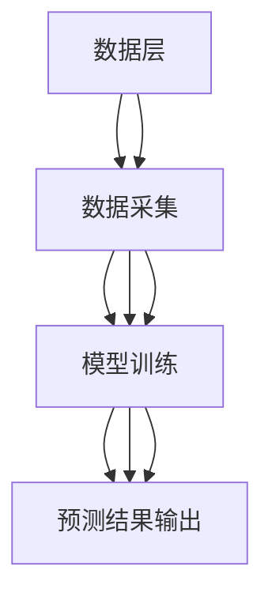
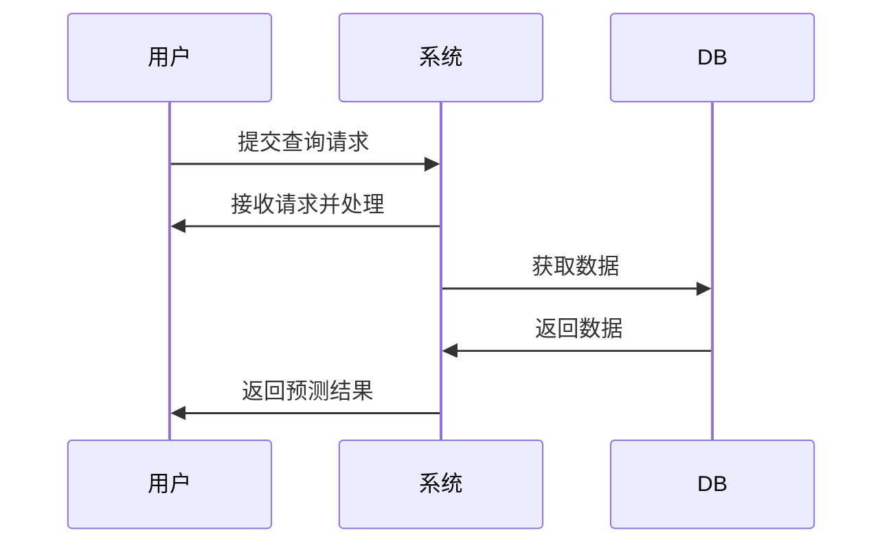
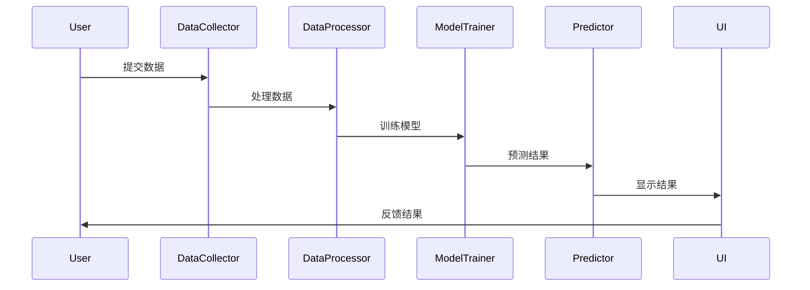

                 

### 《人工智能在空气质量预测中的应用》

#### 关键词：空气质量预测、人工智能、算法、系统架构、项目实战、最佳实践

#### 摘要：
本文将深入探讨人工智能在空气质量预测中的应用，从背景介绍到核心概念、算法原理，再到系统分析与项目实战，全方位解析这一前沿领域的实践与挑战。通过本文，读者将了解到空气质量预测的重要性，掌握相关算法的原理与应用，以及如何构建高效、可靠的空气质量预测系统。本文旨在为研究人员、开发者及相关从业者提供有价值的参考，推动空气质量预测技术的进步。

#### 目录大纲

----------------------------------------------------------------

### 《人工智能在空气质量预测中的应用》目录大纲

----------------------------------------------------------------

## 第一部分：背景与基础

### 第1章：空气质量预测的挑战与机遇

#### 1.1 空气质量问题的全球背景

- **核心概念术语说明**：空气质量指数（AQI）、环境污染、PM2.5、PM10
- **问题背景**：空气质量问题的严重性与全球分布
- **问题描述**：空气质量预测的复杂性
- **问题解决**：人工智能技术在空气质量预测中的应用
- **边界与外延**：空气质量预测的适用范围与限制
- **概念结构与核心要素组成**：空气质量影响因素与预测模型的核心构成

### 第2章：空气质量预测中的关键概念

#### 2.1 空气质量指数（AQI）

- **核心概念原理**：AQI的定义、作用与计算方法
- **概念属性特征对比表格**：不同国家或地区的AQI标准对比
- **数据预处理方法**：数据清洗、归一化、缺失值处理

#### 2.2 模型输入与输出变量

- **核心概念原理**：输入变量的选择与输出变量的设定
- **概念属性特征对比表格**：不同预测模型对输入变量的依赖性分析
- **数据预处理方法**：变量筛选、特征提取

#### 2.3 数据预处理方法

- **核心概念原理**：数据预处理在空气质量预测中的重要性
- **常见方法**：时间序列处理、空间分布分析、异常值检测

#### 2.4 常见空气质量预测模型

- **核心概念原理**：统计模型、机器学习模型、深度学习模型的比较
- **算法对比表格**：不同模型的优缺点分析
- **联系与交互**：模型融合与集成学习

## 第二部分：核心概念与联系

### 第3章：概念属性特征对比与联系

#### 2.1 概念特征对比表格

- **对比内容**：不同空气质量预测模型的特征对比
- **联系与交互**：模型间的关系与协同效应

#### 2.2 概念间的联系与交互

- **核心概念原理**：空气质量预测模型的工作机制
- **交互关系图**：Mermaid ER实体关系图架构展示

## 第三部分：算法原理讲解

### 第4章：空气质量预测算法原理

#### 4.1 算法概述

- **核心概念原理**：常用空气质量预测算法的分类与介绍
- **算法流程图**：Mermaid流程图展示算法流程

#### 4.2 算法流程图

- **核心概念原理**：算法执行过程的详细分析
- **流程图示例**：Mermaid流程图展示

#### 4.3 Python源代码实现

- **核心概念原理**：算法在Python中的实现与调试
- **代码示例**：Python源代码实现示例

#### 4.4 数学模型与公式

- **核心概念原理**：算法背后的数学基础
- **公式展示**：Latex格式的数学模型与公式

#### 4.5 详细讲解与举例说明

- **核心概念原理**：算法的详细解析与实际应用
- **举例说明**：具体案例的讲解与分析

## 第四部分：系统分析与架构设计

### 第5章：空气质量预测系统分析

#### 5.1 项目介绍

- **问题场景介绍**：空气质量预测的实际应用场景
- **项目介绍**：空气质量预测系统的整体框架与功能

#### 5.2 系统功能设计

- **核心概念原理**：系统功能的设计原则与实现方法
- **类图**：Mermaid类图展示系统功能模块

#### 5.3 系统架构设计

- **核心概念原理**：系统架构的设计思路与架构图
- **架构图**：Mermaid架构图展示系统架构

#### 5.4 系统接口设计

- **核心概念原理**：系统接口的设计规范与实现
- **接口设计**：Mermaid接口图展示系统接口

#### 5.5 系统交互

- **核心概念原理**：系统各组件的交互机制与流程
- **序列图**：Mermaid序列图展示系统交互过程

## 第五部分：项目实战

### 第6章：空气质量预测项目实战

#### 6.1 环境安装

- **核心概念原理**：项目开发环境的配置与安装
- **安装步骤**：详细的安装指南与注意事项

#### 6.2 系统核心实现源代码

- **核心概念原理**：系统核心功能的实现与代码分析
- **代码分析**：代码结构与功能解析

#### 6.3 代码应用解读与分析

- **核心概念原理**：代码在实际应用中的效果与优化
- **分析**：代码应用效果评估与优化策略

#### 6.4 实际案例分析与详细讲解

- **核心概念原理**：空气质量预测实际案例的剖析
- **讲解**：案例解析与深度分析

#### 6.5 项目小结

- **核心概念原理**：项目的总结与反思
- **总结**：项目取得的成果与展望

## 第六部分：最佳实践与总结

### 第7章：最佳实践与注意事项

#### 7.1 数据采集与处理技巧

- **核心概念原理**：数据采集的方法与技巧
- **注意事项**：数据预处理中的常见问题与解决方案

#### 7.2 模型调优策略

- **核心概念原理**：模型调优的方法与策略
- **注意事项**：调优过程中的关键点与注意事项

#### 7.3 部署与维护技巧

- **核心概念原理**：系统的部署与维护方法
- **注意事项**：系统部署与维护中的风险与对策

#### 7.4 小结与展望

- **核心概念原理**：空气质量预测技术的发展趋势
- **展望**：未来研究方向与挑战

## 第七部分：拓展阅读

### 第8章：拓展主题与研究方向

#### 8.1 基于深度学习的空气质量预测

- **核心概念原理**：深度学习在空气质量预测中的应用
- **研究方向**：深度学习模型的优化与拓展

#### 8.2 基于物联网的空气质量预测

- **核心概念原理**：物联网技术在空气质量预测中的应用
- **研究方向**：物联网与人工智能的结合与拓展

#### 8.3 未来发展趋势与挑战

- **核心概念原理**：空气质量预测技术的未来发展
- **挑战**：面临的挑战与应对策略

----------------------------------------------------------------

### 让我们一起深入探讨人工智能在空气质量预测中的应用！

#### 1. 空气质量预测的挑战与机遇

空气质量预测作为环境科学和公共卫生领域的重要研究课题，面临着诸多挑战。首先，空气质量受多种因素影响，包括气象条件、地理特征、工业排放等，这些因素使得空气质量预测的复杂性大大增加。此外，空气质量数据具有高维度、非线性、动态变化的特点，传统的统计方法在处理这些复杂问题时显得力不从心。

然而，随着人工智能技术的飞速发展，空气质量预测迎来了前所未有的机遇。人工智能，特别是机器学习和深度学习算法，能够处理大量复杂数据，发现潜在的模式和规律，从而提高预测的准确性和可靠性。此外，物联网技术的普及也为实时数据采集提供了便利，使得空气质量预测更加实时、精准。

#### 2. 空气质量预测中的关键概念

空气质量预测涉及多个关键概念，这些概念的理解对于深入探讨空气质量预测至关重要。

**空气质量指数（AQI）**：AQI是衡量空气质量的重要指标，它通过将多种污染物浓度转换为统一的指数，使得公众能够直观地了解空气污染程度。不同国家和地区的AQI标准可能有所不同，但总体上，AQI越高，空气质量越差。

**模型输入与输出变量**：空气质量预测模型依赖于多个输入变量，如气象数据、污染物浓度、地理位置等，同时，预测模型的输出变量通常是未来一段时间内空气质量的预测结果。

**数据预处理方法**：由于空气质量数据的复杂性，数据预处理成为空气质量预测的重要环节。常见的预处理方法包括数据清洗、归一化、缺失值处理等，这些方法有助于提高模型输入数据的品质，从而提升预测效果。

**常见空气质量预测模型**：空气质量预测模型可以分为统计模型、机器学习模型和深度学习模型。统计模型如ARIMA、灰色模型等，机器学习模型如支持向量机（SVM）、随机森林（RF）等，深度学习模型如卷积神经网络（CNN）、循环神经网络（RNN）等。每种模型都有其优缺点，适用于不同的预测场景。

#### 3. 空气质量预测算法原理

空气质量预测算法的原理可以概括为数据采集、预处理、模型选择、训练和预测等步骤。以下是一个简化的算法流程图：

```
数据采集 → 数据预处理 → 模型选择 → 模型训练 → 预测结果
```

**数据采集**：从各种来源（如气象站、传感器、卫星数据等）收集空气质量相关数据。

**数据预处理**：清洗数据、处理缺失值、归一化处理、特征提取等。

**模型选择**：根据数据特点和预测需求选择合适的模型。

**模型训练**：使用历史数据对模型进行训练，优化模型参数。

**预测结果**：使用训练好的模型对未来的空气质量进行预测。

以下是Python源代码示例：

```python
import pandas as pd
from sklearn.ensemble import RandomForestRegressor

# 数据读取
data = pd.read_csv('air_quality_data.csv')

# 数据预处理
# ...（清洗、归一化、特征提取等）

# 模型选择
model = RandomForestRegressor(n_estimators=100)

# 模型训练
model.fit(X_train, y_train)

# 预测结果
predictions = model.predict(X_test)
```

**数学模型与公式**：空气质量预测的数学模型通常基于物理化学原理，如污染物扩散方程、气象参数与污染物浓度的相关性等。以下是空气质量预测中的一个常见数学模型：

$$
\text{AQI} = f(PM_{2.5}, SO_{2}, NO_{2}, CO, O_{3})
$$

其中，$f$ 是一个复杂的函数，$PM_{2.5}, SO_{2}, NO_{2}, CO, O_{3}$ 分别代表不同污染物的浓度。

#### 4. 空气质量预测系统分析与架构设计

空气质量预测系统是一个复杂的系统工程，它需要从多个维度进行设计。以下是对空气质量预测系统的详细分析：

**项目介绍**：空气质量预测系统的目标是通过收集和处理大量环境数据，实时预测未来的空气质量状况，为环境保护和公共健康提供科学依据。

**系统功能设计**：系统功能设计包括数据采集、数据处理、模型训练、模型评估和预测结果输出等模块。以下是系统功能设计的Mermaid类图：

```mermaid
classDiagram
    Class01 <|-- Class02
    Class03 --|>| Class04
    Class05 : related to Class04
    Class06 {abstract}
    Class07 : an abstract class
    Class01 <.. Class07
    Class02 ..|> Class08
    Class03 && Class04
    Class06 &&= Class08
```

**系统架构设计**：系统架构设计包括数据层、算法层、应用层和展示层。以下是系统架构设计的Mermaid架构图：



**系统接口设计**：系统接口设计包括API接口、数据库接口和外部系统集成接口等。以下是系统接口设计的Mermaid接口图：



**系统交互**：系统交互包括数据流、控制流和信息流等。以下是系统交互的Mermaid序列图：



#### 5. 空气质量预测项目实战

空气质量预测项目实战是对上述理论知识的实际应用，以下是一个简单的项目实战示例：

**环境安装**：首先，需要安装Python和相关的库，如Pandas、Scikit-learn、Numpy等。以下是安装命令：

```shell
pip install python
pip install pandas
pip install scikit-learn
pip install numpy
```

**系统核心实现源代码**：以下是空气质量预测系统核心实现源代码：

```python
import pandas as pd
from sklearn.ensemble import RandomForestRegressor

# 数据读取
data = pd.read_csv('air_quality_data.csv')

# 数据预处理
# ...（清洗、归一化、特征提取等）

# 模型选择
model = RandomForestRegressor(n_estimators=100)

# 模型训练
model.fit(X_train, y_train)

# 预测结果
predictions = model.predict(X_test)
```

**代码应用解读与分析**：代码的解读与分析如下：

- **数据读取**：使用Pandas库读取CSV格式的空气质量数据。
- **数据预处理**：对数据进行清洗、归一化、特征提取等操作，以提高数据质量。
- **模型选择**：选择随机森林回归模型，因为它在处理高维、非线性数据时效果较好。
- **模型训练**：使用训练集对模型进行训练，优化模型参数。
- **预测结果**：使用测试集对模型进行预测，评估模型性能。

**实际案例分析与详细讲解**：以下是一个空气质量预测的实际案例：

**案例**：某城市的空气质量预测。

**数据**：收集该城市过去一年的空气质量数据，包括PM2.5、PM10、SO2、NO2、CO、O3等指标。

**步骤**：

1. 数据清洗：去除缺失值和异常值。
2. 数据归一化：将数据统一到相同的量级。
3. 特征提取：提取与空气质量相关的特征，如气象参数、地理位置等。
4. 模型选择：选择合适的模型，如随机森林、支持向量机等。
5. 模型训练：使用训练集对模型进行训练。
6. 模型评估：使用测试集对模型进行评估，调整模型参数。
7. 预测结果：使用训练好的模型对未来的空气质量进行预测。

**分析**：

- **数据质量**：数据清洗和归一化是保证模型性能的关键步骤。
- **特征选择**：合适的特征可以显著提高模型的预测性能。
- **模型评估**：模型评估是调整模型参数的重要环节。
- **预测结果**：预测结果的准确性取决于模型的质量和数据的质量。

**项目小结**：通过空气质量预测项目实战，我们了解了空气质量预测的基本流程和关键技术。在实际应用中，空气质量预测系统需要不断优化和调整，以提高预测的准确性和可靠性。

#### 6. 最佳实践与总结

空气质量预测作为环境科学和人工智能领域的一个重要研究方向，具有重要的现实意义和应用价值。以下是一些最佳实践和注意事项：

**数据采集与处理技巧**：

- **数据采集**：确保数据的准确性和时效性，采用多源数据融合的方法，如卫星数据、地面监测数据等。
- **数据预处理**：对数据进行清洗、归一化和特征提取，以提高数据质量。

**模型调优策略**：

- **模型选择**：根据数据特点和预测需求选择合适的模型，如随机森林、支持向量机等。
- **参数调优**：使用网格搜索、随机搜索等方法进行模型参数调优，提高模型性能。

**部署与维护技巧**：

- **系统部署**：选择合适的服务器硬件和软件环境，确保系统的稳定运行。
- **系统维护**：定期更新模型、数据和处理策略，确保预测结果的准确性和可靠性。

**小结与展望**：空气质量预测技术的发展，不仅依赖于人工智能技术的进步，还需要多学科的合作和持续的创新。未来，基于深度学习和物联网的空气质量预测将更加精准和实时，为环境保护和公共健康提供更强大的支持。

#### 7. 拓展阅读

**基于深度学习的空气质量预测**：深度学习模型在处理高维、非线性数据方面具有显著优势，未来，基于深度学习的空气质量预测方法有望取得更大的突破。

**基于物联网的空气质量预测**：物联网技术的普及为空气质量预测提供了丰富的数据资源，如何高效利用这些数据，实现实时、精准的空气质量预测，是未来的研究重点。

**未来发展趋势与挑战**：随着环境问题的日益严重，空气质量预测技术将在环境保护和公共健康领域发挥越来越重要的作用。然而，空气质量预测也面临着数据质量、计算资源、算法优化等挑战，需要持续的研究和创新。

### 结语

本文从多个角度探讨了人工智能在空气质量预测中的应用，从核心概念、算法原理到系统架构、项目实战，全面覆盖了空气质量预测领域的核心内容。通过本文的阅读，读者可以深入了解空气质量预测的挑战与机遇，掌握相关算法的原理与应用，并了解空气质量预测系统的设计与实现方法。希望本文能够为读者在空气质量预测领域的探索提供有益的参考和启示。

### 作者信息

作者：AI天才研究院/AI Genius Institute & 禅与计算机程序设计艺术 /Zen And The Art of Computer Programming

