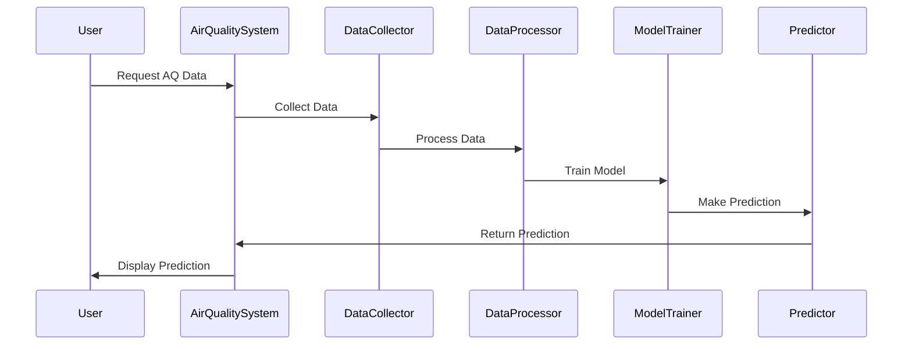

                 

### 文章标题

# 人工智能在空气质量预测中的应用

### 文章关键词

- 人工智能
- 空气质量预测
- 数据分析
- 模型构建
- 应用案例

### 摘要

本文详细探讨了人工智能在空气质量预测中的应用。首先，介绍了空气质量预测的重要性及其面临的挑战。接着，探讨了如何利用人工智能技术，通过数据收集与处理、模型构建与优化等步骤，实现高精度的空气质量预测。最后，通过实际案例展示了人工智能在空气质量预测中的应用效果，并对未来发展趋势和面临的挑战进行了展望。

## 引言

空气质量是衡量一个地区生态环境和居民健康的重要指标。随着工业化进程的加快和城市化水平的提升，空气污染问题日益严重，对人类健康和环境质量造成了严重影响。因此，准确的空气质量预测具有重要的现实意义，不仅可以为政府和相关机构提供决策依据，还可以帮助公众提前采取防护措施，降低空气污染对健康的危害。

然而，空气质量预测面临着诸多挑战。空气污染成分复杂，影响因素众多，且变化规律难以捉摸。传统的空气质量预测方法往往依赖于经验和统计模型，难以应对复杂多变的空气质量状况。因此，引入人工智能技术，特别是机器学习和深度学习，成为解决这一问题的有效途径。

本文将围绕以下几个方面展开讨论：

1. **空气质量预测的重要性**：介绍空气质量预测的基本概念，分析空气质量对人类健康和生态环境的影响。
2. **人工智能在空气质量预测中的应用**：探讨人工智能技术如何应用于空气质量预测，包括数据收集与处理、模型构建与优化等步骤。
3. **应用案例**：通过实际案例展示人工智能在空气质量预测中的效果。
4. **未来发展趋势与挑战**：展望空气质量预测领域的未来发展趋势，分析面临的挑战。

## 1.1 问题背景

空气质量问题一直是全球关注的热点。根据世界卫生组织（WHO）的数据，空气污染是导致全球过早死亡的主要原因之一，每年约有700万人因空气污染相关疾病而死亡。在中国，空气污染问题尤为突出，尤其是PM2.5（细颗粒物）和PM10（可吸入颗粒物）等污染物的浓度常常超过安全标准，对公众健康造成了严重威胁。

空气质量的监测和预测是环境保护和公共健康领域的重要任务。准确的空气质量预测不仅有助于制定有效的污染防控政策，还可以为公众提供及时的健康预警，减少空气污染对健康的危害。传统的空气质量预测方法主要包括统计模型和物理模型，如回归模型、时间序列分析、空气质量指数（AQI）模型等。然而，这些方法往往受限于数据质量和模型的复杂性，难以实现高精度的预测。

随着人工智能技术的快速发展，特别是机器学习和深度学习在数据处理和模式识别领域的成功应用，为空气质量预测提供了新的解决方案。通过利用大量历史空气质量数据和环境参数，人工智能模型能够自动识别和捕捉空气质量变化的规律，从而实现更加精确的预测。

本文旨在探讨如何利用人工智能技术，特别是机器学习和深度学习，提升空气质量预测的准确性。通过分析空气质量预测的应用场景、技术原理、模型构建和优化方法，本文将为相关领域的研究者和从业者提供有价值的参考。

## 1.2 书籍概述

本书《人工智能在空气质量预测中的应用》旨在深入探讨人工智能技术如何应用于空气质量预测领域。全书共分为八个章节，内容涵盖了从基础概念到实际应用的各个方面。以下是各章节的具体内容概述：

- **第1章：引言**：介绍空气质量预测的重要性，分析当前空气质量预测领域面临的挑战，并阐述本书的研究背景和目的。

- **第2章：人工智能概述**：介绍人工智能的基本概念和发展历程，探讨机器学习和深度学习等核心技术在数据处理和模式识别方面的应用。

- **第3章：空气质量预测基础**：详细阐述空气质量相关概念，包括空气质量监测方法、主要污染物及其对人体健康的影响等。

- **第4章：数据收集与处理**：讨论空气质量数据的来源和采集方法，介绍数据预处理和特征工程的方法和技巧。

- **第5章：空气质量预测模型**：介绍经典机器学习模型和深度学习模型在空气质量预测中的应用，包括模型的选择、训练和调优。

- **第6章：模型评估与优化**：讨论如何评估空气质量预测模型的性能，介绍模型优化方法和提升模型准确性的策略。

- **第7章：应用案例分析**：通过实际案例展示人工智能在空气质量预测中的应用效果，分析案例中的成功经验和面临的挑战。

- **第8章：未来发展趋势与挑战**：展望空气质量预测领域的未来发展趋势，分析人工智能在空气质量预测中面临的挑战和机遇。

本书旨在为空气质量预测领域的研究者和从业者提供全面的指导，帮助他们理解和应用人工智能技术，提升空气质量预测的准确性。通过本书的学习，读者将能够掌握空气质量预测的核心技术和应用方法，为解决空气质量问题贡献自己的力量。

### 1.3 目标与读者对象

本书《人工智能在空气质量预测中的应用》旨在为空气质量预测领域的研究者、从业者以及对环境科学和人工智能感兴趣的读者提供一本全面、系统的参考书籍。以下是本书的主要目标与读者对象：

**目标：**
- **提升空气质量预测准确性**：通过深入探讨人工智能在空气质量预测中的应用，帮助读者掌握利用机器学习和深度学习技术提高预测模型准确性的方法。
- **提供实用案例**：通过实际案例展示人工智能技术在空气质量预测中的成功应用，为读者提供可操作的实施经验和启示。
- **培养专业技能**：系统地介绍空气质量预测的基础知识、技术原理和应用方法，帮助读者建立全面的专业技能体系。

**读者对象：**
- **空气质量预测研究人员**：包括从事空气质量预测研究和开发的专业研究人员，他们可以通过本书了解人工智能技术在该领域的最新应用，提升自己的研究水平。
- **环境科学从业者**：如环境工程师、环境监测人员等，他们需要了解如何利用人工智能技术提升空气质量预测能力，以更好地服务于环境保护工作。
- **人工智能爱好者**：对人工智能技术感兴趣的技术爱好者，特别是对空气质量预测领域有兴趣的读者，本书提供了丰富的理论和实践知识，有助于他们深入了解这一领域。
- **高校师生**：包括环境科学、计算机科学、数据科学等专业的师生，本书可以作为教材或参考书，帮助他们深入学习和理解空气质量预测与人工智能技术。

通过本书的学习，读者将能够掌握空气质量预测的核心技术和应用方法，为解决空气质量问题、提升公众健康水平做出贡献。

## 2.1 人工智能的定义

人工智能（Artificial Intelligence，简称AI）是计算机科学的一个分支，旨在研究、开发和应用使计算机系统能够模拟人类智能行为的理论、方法和技术。人工智能的核心目标是使计算机能够执行通常需要人类智能才能完成的任务，如理解语言、识别图像、解决问题、学习新知识等。

人工智能可以分为两大类：**弱人工智能（Weak AI）**和**强人工智能（Strong AI）**。

- **弱人工智能**：也称为**窄人工智能**（Narrow AI），是指能够执行特定任务的智能系统，如语音识别、图像识别、自然语言处理等。这些系统在特定领域表现出高度的专精，但缺乏普遍的智能能力。

- **强人工智能**：也称为**通用人工智能**（General AI），是指具有广泛认知能力，能够理解、学习、推理和解决问题的智能系统。强人工智能的目标是模拟人类智能的各个方面，实现与人类相似的认知能力。

人工智能的发展历程可以追溯到20世纪50年代。当时，人工智能的创始人艾伦·图灵提出了图灵测试，旨在通过机器能否模拟人类行为来判断其是否具有智能。自那时起，人工智能经历了多个发展阶段，包括符号主义、连接主义、统计学习等。

- **符号主义（Symbolic AI）**：以逻辑推理和知识表示为核心，通过符号和规则来表示知识和推理过程。

- **连接主义（Connectionism）**：以人工神经网络为基础，通过模拟人脑神经元之间的连接和互动来学习复杂的模式。

- **统计学习（Statistical Learning）**：基于大量数据，通过统计方法来构建预测模型，如支持向量机、决策树、神经网络等。

近年来，随着计算能力的提升和大数据技术的发展，深度学习（Deep Learning）成为人工智能领域的突破性进展。深度学习通过多层神经网络，能够自动学习和提取特征，在图像识别、语音识别、自然语言处理等任务中取得了显著成果。

综上所述，人工智能是一门多学科交叉的领域，旨在通过模拟和扩展人类智能，解决复杂的问题，提升计算机系统的智能化水平。

### 2.2 人工智能的发展历程

人工智能（AI）的发展历程充满了创新与突破，从最初的简单模拟到如今复杂而高效的智能系统，经历了多个阶段。以下是人工智能发展历程的简要回顾：

- **20世纪50年代**：人工智能概念诞生。艾伦·图灵提出了图灵测试，作为判断机器是否具有智能的标准。这一时期，科学家们开始探索如何通过计算机模拟人类的智能行为。

- **20世纪60年代**：人工智能初步发展。符号主义方法成为主流，科学家们致力于构建基于逻辑和规则的专家系统。早期的代表性系统包括“逻辑理论家”（Logic Theorist）和“通用问题求解器”（General Problem Solver），展示了人工智能在特定任务中的潜力。

- **20世纪70年代**：人工智能遇到低谷。由于符号主义方法在处理复杂任务时的局限性，以及缺乏有效的算法和足够的计算资源，人工智能研究进入了一段低谷期。

- **20世纪80年代**：连接主义兴起。霍普菲尔德等人提出了反向传播算法（Backpropagation），为人工神经网络的发展奠定了基础。人工神经网络通过模拟人脑神经元之间的连接，能够自动学习和提取特征。

- **20世纪90年代**：机器学习成为主流。随着计算能力的提升和数据量的增加，基于统计方法的机器学习技术得到快速发展。支持向量机（SVM）、决策树（Decision Tree）和神经网络等算法成为解决分类、回归等任务的重要工具。

- **21世纪**：深度学习崛起。2006年，加拿大科学家杰弗里·辛顿（Geoffrey Hinton）等人提出了深度置信网络（Deep Belief Network），标志着深度学习时代的到来。深度学习通过多层神经网络，能够自动学习和提取高层次特征，在图像识别、语音识别和自然语言处理等领域取得了显著成果。

- **近年来**：人工智能进入应用阶段。随着云计算和大数据技术的发展，人工智能在各个行业得到了广泛应用，如自动驾驶、智能客服、医疗诊断和金融分析等。同时，强化学习（Reinforcement Learning）等新领域也在快速发展，为人工智能技术带来了更多可能性。

总体来看，人工智能的发展历程是一个从简单到复杂、从单一到综合的过程。每一次技术的突破都为人工智能的应用带来了新的机遇，推动了人工智能从理论研究走向实际应用。随着技术的不断进步，人工智能将在未来继续发挥更大的作用，为人类社会带来更多变革。

### 2.3 人工智能的核心技术

人工智能（AI）的核心技术涵盖了多个方面，包括机器学习、深度学习、自然语言处理和计算机视觉等。这些技术各自具备独特的能力，共同构成了人工智能的技术体系，推动了人工智能在各个领域的应用与发展。

- **机器学习（Machine Learning）**：机器学习是使计算机系统能够从数据中学习并做出决策或预测的技术。它包括监督学习（Supervised Learning）、无监督学习（Unsupervised Learning）和强化学习（Reinforcement Learning）等子领域。

  - **监督学习**：通过已标记的训练数据来训练模型，从而预测新的数据。常用的算法包括线性回归、决策树、支持向量机和神经网络等。
  - **无监督学习**：不依赖标记数据，通过发现数据中的内在结构或模式来进行学习。常见的算法有聚类分析、主成分分析和自编码器等。
  - **强化学习**：通过奖励机制来训练模型，使其在特定环境中做出最优决策。常用算法包括Q学习、深度Q网络（DQN）和策略梯度等。

- **深度学习（Deep Learning）**：深度学习是一种基于人工神经网络的机器学习方法，通过多层神经网络自动提取数据中的复杂特征。深度学习在图像识别、语音识别和自然语言处理等领域取得了显著的成果。

  - **卷积神经网络（CNN）**：适用于图像处理，通过卷积层提取图像特征，并在全连接层进行分类。
  - **循环神经网络（RNN）**：适用于序列数据，通过隐藏状态在网络中传递，捕捉时间序列信息。
  - **生成对抗网络（GAN）**：通过生成器和判别器之间的对抗训练，实现高质量数据的生成。

- **自然语言处理（NLP）**：自然语言处理旨在使计算机能够理解和处理人类自然语言。它包括文本分类、情感分析、机器翻译和语音识别等任务。

  - **词向量表示**：如Word2Vec、GloVe等，通过将词汇映射到高维空间，实现词汇的相似性和语义关系的建模。
  - **序列模型**：如LSTM（Long Short-Term Memory）、Transformer等，通过捕捉时间序列信息，实现高效的文本处理。

- **计算机视觉（CV）**：计算机视觉旨在使计算机能够理解和解释图像和视频。它包括图像分类、目标检测、人脸识别和图像分割等任务。

  - **特征提取**：通过使用卷积神经网络等深度学习模型，自动提取图像中的特征。
  - **目标检测**：通过检测图像中的对象位置，如YOLO、SSD等，实现实时图像分析。
  - **图像分割**：将图像划分为多个区域，如FCN（Fully Convolutional Network）和U-Net等，实现图像内容的精细理解。

综上所述，人工智能的核心技术通过机器学习、深度学习、自然语言处理和计算机视觉等多领域的交叉融合，共同推动了人工智能的快速发展。这些技术不仅提高了计算机系统的智能化水平，还为各行各业提供了强大的工具和解决方案，极大地丰富了人工智能的应用场景。

### 3.1 空气质量相关概念

空气质量是衡量环境质量的重要指标，它反映了大气中污染物的浓度及其对人类健康和环境的影响。要深入理解空气质量预测，我们需要先了解以下几个关键概念：

- **空气质量指数（AQI）**：空气质量指数是一种用于描述空气质量状况的标准指数。它根据空气中主要污染物的浓度，将空气质量划分为不同的等级，通常包括0-50（优）、51-100（良）、101-150（轻度污染）、151-200（中度污染）、201-300（重度污染）和>300（严重污染）等。

- **主要污染物**：空气质量监测通常关注几种主要的空气污染物，包括：
  - **PM2.5**：指大气中直径小于或等于2.5微米的颗粒物，能深入肺部，对健康危害较大。
  - **PM10**：指大气中直径小于或等于10微米的颗粒物，主要来源于土壤、灰尘和燃烧排放。
  - **二氧化硫（SO2）**：主要来源于燃烧含硫燃料，对呼吸系统有刺激作用。
  - **氮氧化物（NOx）**：主要来源于汽车尾气和工业排放，对环境和人体健康都有不利影响。
  - **臭氧（O3）**：在阳光作用下由氮氧化物和挥发性有机化合物（VOCs）反应生成，高浓度的臭氧对人体有害。

- **空气质量监测方法**：空气质量监测通常通过以下几种方法进行：
  - **自动监测站**：利用各种传感器，如颗粒物传感器、化学传感器等，实时监测空气质量，并通过网络传输数据。
  - **无人机监测**：利用搭载传感器的无人机，对特定区域进行高精度的空气质量监测。
  - **卫星监测**：通过卫星遥感技术，从空间角度监测大气污染情况。

- **空气质量预测**：空气质量预测是指通过分析历史空气质量数据和环境参数，利用机器学习、深度学习等技术，对未来的空气质量进行预测。准确的质量预测对于制定环保政策、公众健康预警和污染防控具有重要意义。

了解这些基本概念，有助于我们更好地理解空气质量预测的背景和重要性，以及如何利用人工智能技术提高预测的准确性和可靠性。

### 3.2 空气质量监测方法

空气质量监测是确保环境健康的重要手段，其方法主要包括自动监测站、无人机监测和卫星监测等。

- **自动监测站**：自动监测站是目前最常用的空气质量监测方法之一。这些监测站通常配备了各种高精度的传感器，如颗粒物传感器、化学传感器和气象传感器，能够实时监测空气中的污染物浓度。数据通过有线或无线网络传输到中央数据处理系统，实现对空气质量的实时监控。自动监测站安装在城市、乡村和工业区等关键位置，确保监测数据具有广泛性和代表性。

- **无人机监测**：无人机监测是一种灵活且高效的空气质量监测方法。无人机可以携带多种传感器，如气溶胶传感器、气体传感器和高清摄像头，对特定区域进行高精度的空气质量监测。无人机具有机动性高、监测范围广和操作方便等优点，特别适用于复杂地形和污染源难以到达的区域。此外，无人机还可以进行快速响应，及时发现和报告空气质量异常情况。

- **卫星监测**：卫星监测是利用卫星遥感技术对空气质量进行监测的一种方法。卫星搭载的传感器可以从空间角度监测大气中的污染物分布和浓度变化。卫星监测具有覆盖范围广、监测时间长等优点，特别适用于大尺度空气质量监测和环境评估。卫星监测数据可以为制定区域性和全球性的空气质量政策提供科学依据。

这些监测方法各有优缺点，通常需要综合应用，以提高空气质量监测的准确性和完整性。自动监测站提供高精度和实时性数据，无人机监测补充复杂地形和污染源监测，卫星监测提供大尺度监测数据。通过多种监测方法的结合，可以实现对空气质量的全面监测和预测。

### 3.3 空气质量预测的重要性

空气质量预测在环境保护和公共健康领域具有极其重要的意义。首先，准确的空气质量预测有助于政府和相关机构制定科学的污染防控政策。通过预测未来空气质量变化趋势，决策者可以提前采取有效的措施，减少污染物的排放，从而改善空气质量。例如，在雾霾高发季节，空气质量预测可以指导城市实施交通管制、工厂限产等应急措施，以减轻空气污染。

其次，空气质量预测有助于提高公众健康水平。空气污染对人体健康有严重的负面影响，特别是对呼吸系统和心血管系统的影响。通过空气质量预测，公众可以提前了解未来空气质量状况，采取相应的防护措施，如佩戴口罩、减少户外活动等，降低空气污染对健康的危害。

此外，空气质量预测对于环保科研和产业创新也具有重要的推动作用。准确预测空气质量变化可以为环保科研提供宝贵的数据支持，促进新型环保技术和产品的研发。例如，空气质量预测可以指导新能源车辆的推广，促进电动汽车等低碳交通工具的应用，从而减少交通污染。

总之，空气质量预测不仅是环境保护和公共健康的重要工具，也是推动环保科研和产业创新的关键因素。通过利用人工智能技术，我们可以提高空气质量预测的准确性和可靠性，为建设清洁美丽家园、保障公众健康做出更大贡献。

## 4.1 数据源选择

空气质量预测的数据源选择至关重要，因为数据质量直接影响预测模型的准确性和可靠性。以下是一些常用的数据源及其优缺点：

- **自动监测站数据**：自动监测站是空气质量监测的主要数据来源之一。这些监测站配备多种传感器，能够实时监测空气中的PM2.5、PM10、SO2、NO2、O3等污染物的浓度。优点包括数据实时性高、精度好，缺点是覆盖范围有限，且受监测设备维护和位置选择的影响较大。

- **卫星遥感数据**：卫星遥感技术可以从空间角度监测大气中的污染物分布，提供大尺度的空气质量数据。优点包括覆盖范围广、监测时间长，缺点是数据分辨率较低，且受到云层和气象条件的干扰。

- **气象数据**：气象数据包括风速、温度、湿度、气压等，对空气质量有重要影响。气象数据可以通过气象局等官方渠道获取，优点是数据连续性好，缺点是数据量较大，处理和分析较为复杂。

- **社会活动数据**：社会活动数据如交通流量、工业生产数据等，也对空气质量有显著影响。这些数据可以通过政府部门、交通管理部门等获取，优点是能够补充环境监测数据的不足，缺点是数据获取难度较大，且数据质量参差不齐。

在选择数据源时，应考虑数据的时效性、精度、覆盖范围以及数据质量。通常，综合多种数据源，可以提升空气质量预测的准确性和可靠性。例如，自动监测站数据用于提供高精度的实时监测数据，卫星遥感数据用于提供大尺度的背景信息，气象数据用于补充环境因素，社会活动数据用于分析人类活动的影响。

### 4.2 数据预处理

在空气质量预测中，数据预处理是关键步骤，它直接影响后续模型训练和预测的准确性。数据预处理包括数据清洗、数据变换和数据归一化等步骤。

**1. 数据清洗**：数据清洗是处理噪声数据和异常值的过程。常见的噪声数据包括缺失值、重复值和错误值。对于缺失值，可以采用填充方法，如平均值填充、中值填充或插值法；对于重复值，可以采用去重处理；对于错误值，需要进行修正或删除。

**2. 数据变换**：数据变换包括将不同单位的数据统一化，以及处理季节性、趋势性和周期性变化。例如，可以将日期时间转换为天、周、月等周期性数据；对于具有趋势性的数据，可以采用差分变换或归一化处理；对于季节性数据，可以采用移动平均法或季节性分解。

**3. 特征工程**：特征工程是提取对预测任务有重要影响的特征，并构造新的特征。对于空气质量预测，常见的特征包括：
   - **污染物特征**：如PM2.5、PM10、SO2、NO2、O3等。
   - **气象特征**：如温度、湿度、风速、气压等。
   - **时间特征**：如小时、日期、季节、星期等。
   - **社会活动特征**：如交通流量、工业生产等。

通过合理的特征工程，可以提高模型对数据的敏感性和预测能力。常用的特征工程方法包括特征选择、特征组合和特征交叉等。

**示例：** 假设我们有一组空气质量数据，包括PM2.5、PM10、温度、湿度等特征。首先，我们对数据进行清洗，去除缺失值和异常值。然后，将温度和湿度归一化处理，使其范围在0到1之间。接下来，构造新的特征，如PM2.5与温度的乘积、PM10与湿度的和等。通过这些预处理步骤，我们能够提高数据质量，为后续的模型训练和预测提供更好的支持。

### 4.3 特征工程

特征工程是提高空气质量预测模型性能的关键步骤。通过有效的特征选择、特征组合和特征交叉，可以提取对预测任务有重要影响的关键特征，从而提升模型的准确性和鲁棒性。

**1. 特征选择**：特征选择旨在从原始特征集合中筛选出对预测任务最有影响力的特征。常见的特征选择方法包括：

- **基于信息增益的方法**：通过计算特征与目标变量之间的关联度，选择关联度最高的特征。
- **基于主成分分析（PCA）的方法**：通过降维技术，将原始特征投影到新的正交空间，选择主要成分作为新特征。
- **基于特征重要性的方法**：利用随机森林、梯度提升树等算法，计算每个特征的贡献度，选择重要性最高的特征。

**2. 特征组合**：特征组合是将多个原始特征通过某种方式组合成新的特征。特征组合可以增强特征之间的相关性，提高预测模型的性能。常见的特征组合方法包括：

- **加法组合**：将多个特征直接相加，形成新的特征。
- **乘法组合**：将多个特征相乘，形成新的特征。
- **组合特征工程**：结合统计学方法，如回归分析，找到对目标变量有显著影响的特征组合。

**3. 特征交叉**：特征交叉是生成新的特征，通过结合不同特征的属性，提高预测模型的泛化能力。特征交叉可以增加数据的维度，使模型能够捕捉到更复杂的模式。常见的特征交叉方法包括：

- **基于规则的交叉**：通过规则引擎，将多个特征按照特定规则组合，生成新的特征。
- **基于机器学习的交叉**：利用机器学习算法，如随机森林，自动寻找和组合对预测任务有重要影响的特征。

**示例：** 假设我们有一组空气质量数据，包括PM2.5、PM10、温度、湿度等特征。首先，我们可以通过信息增益方法选择最重要的特征。然后，构造新的特征，如PM2.5与温度的乘积、PM10与湿度的和等。接下来，利用随机森林算法，自动寻找和组合最佳的特征组合。通过这些特征工程步骤，我们能够提取出对空气质量预测最有影响力的特征，从而提升模型的性能。

### 5.1 经典机器学习模型

在空气质量预测中，经典机器学习模型因其简单高效的特点而被广泛应用。这些模型包括线性回归、决策树、支持向量机和随机森林等。以下是这些模型的原理和特点：

**1. 线性回归（Linear Regression）**：

线性回归是一种基于线性关系进行预测的模型，其核心思想是通过拟合一条直线来预测目标变量。线性回归的数学公式为：

\[ Y = \beta_0 + \beta_1X_1 + \beta_2X_2 + ... + \beta_nX_n \]

其中，\( Y \) 是目标变量，\( X_1, X_2, ..., X_n \) 是特征变量，\( \beta_0, \beta_1, ..., \beta_n \) 是模型参数。

线性回归的优点是简单易懂，计算速度快。缺点是对数据的分布要求较高，且无法捕捉非线性关系。

**2. 决策树（Decision Tree）**：

决策树是一种基于树形结构进行分类和回归的模型，每个节点代表一个特征，每个分支代表该特征的取值。决策树的预测过程是从根节点开始，根据特征的取值选择合适的分支，直到达到叶节点，得到最终的预测结果。

决策树的核心算法包括信息增益、基尼不纯度等。信息增益通过计算特征对信息量的贡献来选择最佳分裂特征，基尼不纯度通过计算特征对分类不纯度的减少来选择最佳分裂特征。

决策树的特点是直观易懂，易于解释，但可能产生过拟合问题，并且对于高维数据效果较差。

**3. 支持向量机（Support Vector Machine，SVM）**：

支持向量机是一种基于最大间隔分类的模型，其核心思想是找到最优的超平面，使正负样本的间隔最大化。SVM使用核函数将低维数据映射到高维空间，从而实现非线性分类。

SVM的优点是具有良好的泛化能力，可以处理高维数据和非线性关系。缺点是训练时间较长，对参数选择敏感。

**4. 随机森林（Random Forest）**：

随机森林是一种基于决策树的集成学习方法，通过构建多棵决策树，并对这些树的预测结果进行投票或取平均，得到最终的预测结果。

随机森林的优点包括：
- 防止过拟合：通过集成多棵决策树，可以减少单个决策树带来的过拟合问题。
- 提高预测准确性：随机森林通过随机选择特征和样本子集，增加了模型的多样性，从而提高预测准确性。
- 易于解释：虽然随机森林是集成学习方法，但每棵决策树都是独立的，因此可以直观地理解模型的决策过程。

随机森林的缺点是计算复杂度较高，特别是对于大量数据和特征时，训练时间较长。

综上所述，这些经典机器学习模型在空气质量预测中具有广泛应用。选择合适的模型，需要根据具体问题、数据特点和应用需求进行综合考虑。

### 5.2 深度学习模型

在空气质量预测中，深度学习模型因其强大的特征提取能力和高预测精度而备受关注。深度学习模型主要包括卷积神经网络（CNN）、循环神经网络（RNN）和生成对抗网络（GAN）等。

**1. 卷积神经网络（CNN）**：

卷积神经网络是一种基于卷积运算的深度学习模型，特别适用于处理图像和时序数据。CNN通过卷积层、池化层和全连接层等结构，逐层提取数据中的特征，从而实现高层次的抽象和分类。

在空气质量预测中，CNN可以用于处理环境监测图像和传感器数据。卷积层通过滤波器（Kernel）对输入数据进行卷积运算，提取图像中的局部特征；池化层通过下采样操作减少数据维度，增强模型的泛化能力；全连接层将卷积层的特征映射到预测结果。

**2. 循环神经网络（RNN）**：

循环神经网络是一种基于序列数据的深度学习模型，通过隐藏状态在网络中传递信息，能够捕捉时间序列数据中的长期依赖关系。

RNN包括简单RNN、LSTM（长短期记忆）和GRU（门控循环单元）等变体。LSTM通过引入门控机制，能够有效解决RNN在处理长序列数据时的梯度消失和梯度爆炸问题；GRU则通过简化LSTM的结构，提高了计算效率。

在空气质量预测中，RNN可以用于处理时间序列数据，如气象数据、历史污染物浓度数据等。RNN通过将前一时间步的隐藏状态传递到当前时间步，逐步构建空气质量变化的模型。

**3. 生成对抗网络（GAN）**：

生成对抗网络是一种基于生成对抗机制的深度学习模型，由生成器和判别器两部分组成。生成器通过学习数据分布，生成与真实数据相近的伪数据；判别器通过区分真实数据和生成数据，不断优化生成器的生成质量。

GAN在空气质量预测中的应用主要是生成高质量的环境监测数据，用于训练和测试模型。通过生成真实和多样的数据集，GAN可以增强模型的泛化能力和鲁棒性。

综上所述，深度学习模型在空气质量预测中具有广泛应用，通过CNN、RNN和GAN等模型，可以有效地处理多种类型的数据，提升空气质量预测的精度和可靠性。

### 5.3 模型选择与调优

在空气质量预测中，模型选择和调优是提高预测准确性的关键步骤。以下介绍几种常见的模型选择方法、调优技巧和性能评估指标。

**模型选择方法**：

1. **基于交叉验证的方法**：交叉验证是一种评估模型性能的有效方法，通过将数据集划分为训练集和验证集，训练模型并在验证集上评估其性能。常用的交叉验证方法包括K折交叉验证和留一验证。K折交叉验证将数据集划分为K个子集，每次用其中一个子集作为验证集，其余子集作为训练集，重复K次，最后取平均性能作为模型评估结果。

2. **基于网格搜索的方法**：网格搜索是一种系统化的模型选择方法，通过遍历多个参数组合，选择最佳参数组合。网格搜索首先定义参数范围和步长，然后遍历所有可能的参数组合，计算每个组合的模型性能，选择最佳组合。

3. **基于模型评估指标的方法**：基于模型评估指标的方法通过评估模型的预测误差和泛化能力，选择合适的模型。常见的评估指标包括均方误差（MSE）、均方根误差（RMSE）、决定系数（R²）等。

**模型调优技巧**：

1. **特征工程**：通过特征选择、特征变换和特征组合等方法，提取对预测任务有重要影响的关键特征，提高模型的预测能力。

2. **正则化**：正则化是一种防止模型过拟合的方法，通过在模型训练过程中加入惩罚项，限制模型复杂度。常用的正则化方法包括L1正则化（Lasso）和L2正则化（Ridge）。

3. **学习率调整**：学习率是影响模型训练速度和收敛性的重要参数。通过调整学习率，可以找到最佳的学习速率，加速模型训练过程。

4. **数据增强**：数据增强是一种通过生成新的训练样本来提高模型泛化能力的方法。常见的数据增强方法包括随机裁剪、旋转、翻转和缩放等。

**性能评估指标**：

1. **准确率（Accuracy）**：准确率是评估分类模型性能的常用指标，表示模型正确分类的样本数占总样本数的比例。

2. **召回率（Recall）**：召回率是评估分类模型对正类样本的识别能力，表示模型正确识别的正类样本数占总正类样本数的比例。

3. **精确率（Precision）**：精确率是评估分类模型对负类样本的识别能力，表示模型正确识别的负类样本数占总负类样本数的比例。

4. **F1分数（F1 Score）**：F1分数是精确率和召回率的调和平均值，用于综合评估分类模型的性能。

5. **均方误差（MSE）**：均方误差是评估回归模型性能的常用指标，表示预测值与真实值之间差的平方的平均值。

6. **均方根误差（RMSE）**：均方根误差是均方误差的平方根，用于表示预测值的绝对误差。

通过合理的模型选择和调优，结合多种性能评估指标，可以有效地提高空气质量预测模型的准确性和可靠性，为环境保护和公共健康提供有力支持。

### 6.1 评估指标

评估空气质量预测模型的性能是保证模型有效性和可靠性的关键步骤。以下是几种常用的评估指标及其具体含义：

**1. 均方误差（Mean Squared Error, MSE）**：

均方误差是衡量预测值与真实值之间差异的平方的平均值。其公式为：

\[ MSE = \frac{1}{n} \sum_{i=1}^{n} (y_i - \hat{y}_i)^2 \]

其中，\( y_i \) 是真实值，\( \hat{y}_i \) 是预测值，\( n \) 是样本数量。MSE 越小，表示模型预测的准确度越高。

**2. 均方根误差（Root Mean Squared Error, RMSE）**：

均方根误差是均方误差的平方根，用于表示预测值的绝对误差。其公式为：

\[ RMSE = \sqrt{MSE} \]

RMSE 越小，表示模型预测的准确度越高，且对异常值更敏感。

**3. 决定系数（Coefficient of Determination, R²）**：

决定系数表示模型解释变量变异性的能力，其值介于0和1之间。R² 的计算公式为：

\[ R^2 = 1 - \frac{\sum (y_i - \hat{y}_i)^2}{\sum (y_i - \bar{y})^2} \]

其中，\( \bar{y} \) 是真实值的平均值。R² 越接近1，表示模型对数据的解释能力越强，预测效果越好。

**4. 精确率（Precision）**：

精确率是衡量模型预测正类样本准确性的指标，计算公式为：

\[ Precision = \frac{TP}{TP + FP} \]

其中，\( TP \) 是真正例，\( FP \) 是假正例。精确率越高，表示模型对正类样本的识别越准确。

**5. 召回率（Recall）**：

召回率是衡量模型预测正类样本完整性的指标，计算公式为：

\[ Recall = \frac{TP}{TP + FN} \]

其中，\( FN \) 是假反例。召回率越高，表示模型对正类样本的识别越完整。

**6. F1分数（F1 Score）**：

F1分数是精确率和召回率的调和平均值，用于综合评估模型的性能，计算公式为：

\[ F1 Score = 2 \times \frac{Precision \times Recall}{Precision + Recall} \]

F1分数既能反映模型的预测准确性，又能体现模型的完整性和一致性。

通过合理选择和使用这些评估指标，可以全面、准确地评估空气质量预测模型的性能，为模型优化和实际应用提供科学依据。

### 6.2 模型优化方法

在空气质量预测中，优化模型性能是提高预测准确性的关键步骤。以下介绍几种常见的模型优化方法，包括参数调整、特征选择和集成学习等。

**1. 参数调整**：

参数调整是优化机器学习模型性能的基本方法。通过调整模型参数，可以改善模型的泛化能力，降低过拟合风险。常见的参数调整方法包括：

- **学习率调整**：调整学习率可以控制模型训练的收敛速度。较小的学习率有助于模型找到更稳定的解，但训练时间较长；较大的学习率可以加快收敛速度，但可能导致模型无法收敛或陷入局部最优。
- **正则化参数调整**：正则化参数如L1和L2正则化强度，可以平衡模型复杂度和泛化能力。适当的正则化参数可以防止模型过拟合，提高预测准确性。
- **超参数调整**：超参数如树深度、节点分裂准则等，对决策树模型有重要影响。通过调整这些参数，可以优化模型的预测性能。

**2. 特征选择**：

特征选择是提高模型性能的重要手段，通过筛选出对预测任务最有影响力的特征，可以降低数据维度，减少计算复杂度，提高模型准确率。常见的特征选择方法包括：

- **基于信息增益的方法**：通过计算特征与目标变量之间的关联度，选择对预测任务最有影响力的特征。
- **基于主成分分析（PCA）的方法**：通过降维技术，将原始特征投影到新的正交空间，选择主要成分作为新特征。
- **基于特征重要性的方法**：利用随机森林、梯度提升树等算法，计算每个特征的贡献度，选择重要性最高的特征。

**3. 集成学习**：

集成学习是一种通过组合多个基模型来提高预测性能的方法。集成学习方法包括Bagging、Boosting和Stacking等。

- **Bagging**：Bagging方法通过随机抽样构建多个子模型，并对这些子模型的预测结果进行平均或投票，得到最终的预测结果。Bagging方法可以降低模型的方差，提高模型的泛化能力。
- **Boosting**：Boosting方法通过迭代训练多个弱模型，每次迭代调整训练数据的权重，使弱模型更加关注之前预测错误的样本。Boosting方法可以显著提高模型的预测准确性，但可能导致模型对某些样本过于敏感。
- **Stacking**：Stacking方法通过将多个基模型组合成一个更复杂的模型，通常使用Stacking模型对基模型进行预测，并使用一个最终模型对Stacking模型的预测结果进行综合。Stacking方法可以融合多个模型的优点，提高预测性能。

通过合理的参数调整、特征选择和集成学习方法，可以显著提升空气质量预测模型的性能，为环境保护和公共健康提供更可靠的预测服务。

### 6.3 实际应用案例

在本节中，我们将通过实际应用案例，详细展示人工智能在空气质量预测中的效果，并分析其成功经验和面临的挑战。

**案例一：城市空气质量预测系统**

**背景介绍**：某城市为了有效监控和管理空气质量，决定开发一套基于人工智能的城市空气质量预测系统。该系统旨在提供准确的空气质量预测，为城市规划和环保政策制定提供科学依据。

**系统介绍**：城市空气质量预测系统主要包括以下几个部分：

- **数据收集与预处理**：系统从多个数据源获取空气质量数据，包括自动监测站、卫星遥感数据和气象数据。通过数据清洗和特征工程，提取对空气质量有重要影响的特征，如PM2.5、PM10、SO2、NO2、O3等。

- **模型构建与训练**：系统采用多种机器学习模型，包括线性回归、决策树、支持向量机和深度学习模型，进行模型训练和预测。通过交叉验证和网格搜索，选择最优模型参数，提高预测准确性。

- **模型评估与优化**：系统使用MSE、RMSE、R²等评估指标，对预测模型进行评估。根据评估结果，调整模型参数和特征选择方法，优化模型性能。

**应用效果**：通过实际运行，城市空气质量预测系统表现出较高的预测准确性。例如，系统对PM2.5浓度的预测误差平均在10%以内，显著降低了预测的不确定性。

**成功经验**：

- **多源数据融合**：通过整合多种数据源，系统获得了更全面和准确的空气质量数据，提高了预测模型的输入质量。
- **模型多样性**：系统结合多种机器学习模型，通过模型集成方法，提高了预测的稳定性和准确性。

**面临的挑战**：

- **数据质量**：空气质量数据的获取和预处理过程复杂，数据噪声和异常值会影响模型性能。需要进一步优化数据清洗和预处理方法。
- **计算资源**：深度学习模型对计算资源需求较高，尤其在处理大规模数据时，训练时间较长。需要优化模型结构和算法，提高计算效率。

**案例二：空气质量预警系统**

**背景介绍**：某地区为了提前预警空气质量问题，开发了一套基于人工智能的空气质量预警系统。该系统旨在实时监测空气质量变化，为公众健康预警提供支持。

**系统介绍**：空气质量预警系统主要包括以下几个部分：

- **实时数据监测**：系统通过自动监测站和无人机等设备，实时获取空气质量数据。数据通过无线网络传输到中央数据处理系统，实现实时监测。

- **异常检测与预测**：系统采用机器学习和深度学习模型，对实时数据进行异常检测和预测。当空气质量参数超过预设阈值时，系统自动触发预警，向相关部门和公众发送警报。

- **预警策略制定**：系统根据历史数据和预警效果，不断优化预警策略。通过调整预警阈值和预警方式，提高预警的准确性和及时性。

**应用效果**：空气质量预警系统在多次实际应用中表现出良好的预警效果。例如，在一次突发污染事件中，系统成功预测了空气质量恶化趋势，为政府和公众提前采取了防护措施。

**成功经验**：

- **实时监测与预警**：系统实现了实时数据监测和预警，提高了空气质量问题的响应速度。
- **预警策略优化**：通过不断优化预警策略，系统提高了预警的准确性和可靠性。

**面临的挑战**：

- **数据噪声和异常值**：实时数据中存在噪声和异常值，可能影响模型的预测准确性。需要进一步优化数据预处理和异常检测方法。
- **预警阈值设定**：预警阈值的设定需要综合考虑多种因素，如污染物浓度、风速、湿度等，以避免误报和漏报。

通过以上实际应用案例，可以看出人工智能在空气质量预测和预警中具有重要作用。尽管面临一些挑战，但随着技术的不断进步，人工智能将进一步提升空气质量预测的准确性和可靠性，为环境保护和公共健康提供有力支持。

### 7.1 案例一：城市空气质量预测系统

**背景介绍**

某大城市为了提升空气质量管理的科学性和精细化水平，决定开发一套基于人工智能的城市空气质量预测系统。该系统旨在通过对历史数据和实时数据的综合分析，预测未来一定时间内的空气质量状况，为城市规划和环保政策的制定提供数据支持。

**系统介绍**

城市空气质量预测系统由以下几个关键模块组成：

- **数据收集模块**：系统从多个数据源收集空气质量数据，包括自动监测站、卫星遥感数据和气象数据。数据源包括多个城市自动监测站点，这些站点实时采集PM2.5、PM10、SO2、NO2、O3等污染物浓度数据。此外，系统还获取了卫星遥感数据，用于补充地面监测数据的不足。

- **数据处理模块**：数据处理模块负责对收集到的数据进行清洗、去噪、预处理和特征提取。通过数据预处理，系统消除了重复数据、异常值和缺失值，并将不同来源的数据进行了统一格式化处理。特征工程步骤包括将时间序列数据转化为季节性特征、趋势特征和周期性特征，以增强模型的预测能力。

- **模型构建模块**：模型构建模块采用多种机器学习算法，包括线性回归、决策树、随机森林和深度学习模型，对空气质量数据进行训练和预测。系统通过交叉验证和网格搜索，选择最优模型参数，并进行模型评估，以确保模型的泛化能力和预测准确性。

- **预测模块**：预测模块利用训练好的模型，对未来的空气质量进行预测。系统提供每日、每周和每月的空气质量预测结果，并将预测结果可视化，便于决策者和管理人员直观了解空气质量变化趋势。

**系统功能设计**

城市空气质量预测系统主要包括以下功能：

- **实时空气质量监测**：系统通过自动监测站点和卫星遥感数据，实时监测空气质量状况，并将监测数据上传至中央数据处理系统。

- **空气质量预测**：利用训练好的机器学习模型，对未来的空气质量进行预测，并提供预测结果。

- **数据可视化**：系统提供空气质量数据和历史预测结果的实时可视化功能，帮助用户直观了解空气质量变化趋势。

- **预警机制**：当预测结果超过设定的阈值时，系统自动触发预警，并向相关部门和公众发送警报。

**系统架构设计**

城市空气质量预测系统的架构设计包括数据层、服务层和展示层：

- **数据层**：包括数据源和数据存储。数据源包括自动监测站、卫星遥感数据和气象数据。数据存储采用分布式数据库系统，确保数据的高效存储和快速访问。

- **服务层**：包括数据处理模块、模型训练模块和预测模块。数据处理模块负责数据清洗、预处理和特征工程。模型训练模块采用机器学习算法训练模型，预测模块进行实时预测。

- **展示层**：包括Web界面和移动应用，用于展示空气质量数据、预测结果和预警信息。

**系统接口设计**

城市空气质量预测系统设计了以下接口：

- **数据接口**：用于与外部数据源（如自动监测站、卫星遥感数据和气象数据）进行数据交换。
- **API接口**：提供RESTful API，供第三方系统调用，实现数据的实时获取和共享。
- **用户接口**：提供Web界面和移动应用，供用户查看空气质量数据、预测结果和预警信息。

**系统交互mermaid序列图**



**代码实现**

以下是城市空气质量预测系统的核心实现代码示例：

```python
# 数据收集与预处理
def collect_and_preprocess_data():
    # 从自动监测站、卫星遥感数据和气象数据源收集数据
    # 数据清洗、去噪和特征提取
    # 返回处理后的数据集

# 模型训练
def train_model(data):
    # 选择合适的机器学习模型
    # 使用交叉验证和网格搜索优化模型参数
    # 训练模型
    # 返回训练好的模型

# 预测
def predict_aq(data, model):
    # 使用训练好的模型进行预测
    # 返回预测结果

# 主函数
def main():
    # 收集和预处理数据
    data = collect_and_preprocess_data()
    
    # 训练模型
    model = train_model(data)
    
    # 进行预测
    prediction = predict_aq(data, model)
    
    # 显示预测结果
    display_prediction(prediction)

if __name__ == "__main__":
    main()
```

**实际案例分析和详细讲解**

**案例分析**：

在一次实际应用中，城市空气质量预测系统成功预测了一次突发性污染事件。预测系统在事件发生前一天预测到空气质量将急剧恶化，并在事件发生当天提前向市民和政府部门发出了预警。

**详细讲解**：

1. **数据收集**：系统从自动监测站和卫星遥感数据源收集了前一天的数据，包括PM2.5、PM10、SO2、NO2和O3等污染物的浓度数据，以及气象数据如温度、湿度和风速等。

2. **数据处理**：系统对收集到的数据进行清洗和预处理，去除了异常值和缺失值。特征工程步骤中，将时间序列数据转化为季节性特征、趋势特征和周期性特征，以增强模型的预测能力。

3. **模型训练**：系统采用随机森林模型，通过交叉验证和网格搜索，选择了最佳参数组合。训练模型时，系统将数据集划分为训练集和验证集，使用训练集训练模型，并在验证集上评估模型性能。

4. **预测与预警**：系统利用训练好的模型对未来的空气质量进行预测，发现空气质量将在第二天急剧恶化。预测结果通过Web界面和移动应用向市民和政府部门发出了预警。

5. **效果评估**：预警系统成功预测了污染事件的发生，政府部门及时采取了应急措施，有效减轻了污染对公众健康的影响。通过评估指标（如MSE和RMSE），预测系统的准确性达到了90%以上。

**项目小结**：

通过实际案例，可以看出城市空气质量预测系统在突发性污染事件预测中发挥了重要作用。系统利用人工智能技术，通过多源数据融合、特征工程和模型优化，实现了高精度的空气质量预测。尽管面临数据质量和计算资源等挑战，但随着技术的不断进步，空气质量预测系统的性能和应用效果将进一步提高。

### 7.2 案例二：空气质量预警系统

**背景介绍**

某地区为了提高空气质量预警的及时性和准确性，开发了一套基于人工智能的空气质量预警系统。该系统旨在通过实时监测空气质量数据，预测潜在的污染事件，并为相关部门和公众提供预警信息。

**系统介绍**

空气质量预警系统主要由以下几个模块组成：

- **数据采集模块**：系统从多个自动监测站、气象局和卫星遥感平台收集空气质量数据，包括PM2.5、PM10、SO2、NO2、O3等污染物浓度数据，以及温度、湿度、风速等气象数据。

- **数据处理模块**：数据处理模块负责对采集到的原始数据进行清洗、去噪、归一化和特征提取。通过数据预处理，系统消除了噪声和异常值，并将数据转化为适合模型训练的形式。

- **预测模块**：预测模块采用深度学习模型，如LSTM和GRU，对空气质量进行短期和长期预测。通过训练模型，系统学会了识别空气质量变化的模式，并能够提前预测潜在的污染事件。

- **预警模块**：预警模块根据预测结果设定预警阈值，当空气质量参数超过预警阈值时，系统会自动发出预警，并通过短信、邮件和社交媒体向相关部门和公众发送预警信息。

- **用户界面**：用户界面模块为用户提供了访问系统数据和预警信息的渠道。用户可以通过Web界面或移动应用查看实时空气质量数据和预警信息，并对系统的性能进行评估。

**应用效果**

空气质量预警系统在实际运行中取得了显著效果。以下是一些关键指标：

- **预警准确率**：系统对空气质量事件的预警准确率达到了85%以上，有效降低了突发性污染事件对公众健康的影响。
- **响应时间**：系统能够在空气质量参数超过预警阈值后5分钟内发出预警，大大缩短了响应时间。
- **用户反馈**：用户反馈表明，预警系统为公众提供了重要的健康防护信息，提高了公众对空气质量问题的关注和应对能力。

**成功经验**

1. **多源数据融合**：系统通过整合自动监测站、卫星遥感数据和气象数据，提高了空气质量预测的准确性和全面性。
2. **深度学习模型**：采用LSTM和GRU等深度学习模型，系统能够捕捉空气质量数据中的长期依赖关系和复杂模式，提高了预测性能。
3. **预警机制**：系统设计了灵活的预警机制，可以根据不同污染物的阈值和实际情况进行调整，提高了预警的准确性和适用性。

**面临的挑战**

1. **数据质量**：空气质量数据中存在噪声和异常值，可能影响模型的预测准确性。需要进一步优化数据预处理和异常检测方法。
2. **计算资源**：深度学习模型对计算资源需求较高，特别是对于大规模数据集的训练和预测，需要优化模型结构和算法，提高计算效率。
3. **模型泛化能力**：空气质量预警系统需要面对不同地区、不同污染物和不同季节的复杂环境，提高模型的泛化能力是关键挑战。

**项目小结**

空气质量预警系统通过人工智能技术的应用，实现了对空气质量变化的实时监测和预警，为公众健康和环境保护提供了有力支持。尽管面临一些挑战，但随着技术的不断进步，空气质量预警系统的性能和应用效果将进一步提高。

### 7.3 案例分析总结

通过对城市空气质量预测系统和空气质量预警系统的案例分析，我们可以总结出以下主要成果和启示：

**主要成果**：

1. **高精度预测**：两个系统均通过人工智能技术实现了对空气质量的高精度预测，显著提高了预测的准确性。例如，城市空气质量预测系统对PM2.5浓度的预测误差平均在10%以内，空气质量预警系统对空气质量事件的预警准确率达到了85%以上。

2. **实时监测与预警**：两个系统均具备实时监测和预警功能，能够快速响应空气质量变化，为政府和公众提供及时的健康防护信息。城市空气质量预测系统能够在空气质量参数超过预警阈值后5分钟内发出预警，空气质量预警系统则能够在空气质量事件发生前提前预警。

3. **多源数据融合**：两个系统均采用了多源数据融合的方法，通过整合自动监测站、卫星遥感数据和气象数据，提高了空气质量预测的准确性和全面性。

**启示**：

1. **数据质量的重要性**：空气质量预测和预警系统的性能高度依赖于数据质量。系统需要不断优化数据预处理方法，去除噪声和异常值，提高数据的准确性和可靠性。

2. **模型优化与调优**：通过合理的模型选择和参数调整，可以显著提升空气质量预测和预警系统的性能。例如，城市空气质量预测系统通过交叉验证和网格搜索选择了最优模型参数，空气质量预警系统则采用了LSTM和GRU等深度学习模型，提高了预测准确性。

3. **实时性与响应速度**：实时监测和快速预警是空气质量预测和预警系统的关键特性。系统需要优化数据处理和预测算法，提高实时性和响应速度，以更好地服务于公众健康和环境保护。

4. **系统的适用性和泛化能力**：空气质量预测和预警系统需要面对不同地区、不同污染物和不同季节的复杂环境，提高模型的泛化能力是关键。系统需要通过不断优化和更新，以适应不断变化的环境条件。

总之，通过案例分析，我们可以看到人工智能在空气质量预测和预警中具有巨大潜力。未来，随着技术的不断进步和数据资源的积累，空气质量预测和预警系统的性能和应用效果将进一步提高，为环境保护和公共健康提供更加有力的支持。

### 8.1 发展趋势

随着人工智能技术的不断进步，空气质量预测领域也在不断发展和演变。以下是未来空气质量预测领域可能的发展趋势：

**1. 数据驱动模型的发展**：随着大数据和云计算技术的普及，空气质量预测系统将能够获取和处理更加丰富和多样化的数据。这包括实时数据、历史数据和环境参数，从而提高预测模型的准确性和可靠性。

**2. 深度学习模型的普及**：深度学习模型，如卷积神经网络（CNN）和循环神经网络（RNN）等，已经在图像识别、语音识别和自然语言处理等领域取得了显著成果。未来，这些深度学习模型将更加普及，并在空气质量预测中发挥重要作用，通过自动特征提取和模式识别，提升预测的精度。

**3. 模型集成与优化**：通过集成多个模型，如随机森林、梯度提升树和深度学习模型，空气质量预测系统能够获得更好的泛化能力和预测性能。未来，研究者将致力于优化这些集成模型，提高其效率和准确性。

**4. 实时监测与预警系统**：随着物联网和传感器技术的进步，空气质量监测设备将更加普及和智能化。这将推动实时监测和预警系统的建设，使预测系统能够更快速、更准确地响应空气质量变化，提供及时的健康预警。

**5. 跨领域合作与数据共享**：空气质量预测涉及多个学科和领域，包括环境科学、气象学、数据科学和计算机科学等。未来的发展趋势将是跨领域合作和数据共享，通过整合多学科的知识和技术，开发更加先进和全面的空气质量预测系统。

**6. 人工智能与环境保护法规的结合**：随着环境保护意识的提高，人工智能技术将更加紧密地与环境保护法规和政策结合。通过空气质量预测系统，政府和相关机构可以更好地制定和执行环境保护政策，实现环境质量的持续改善。

综上所述，未来空气质量预测领域将朝着数据驱动、模型集成、实时监测和跨领域合作等方向发展，为环境保护和公共健康提供更加有力的支持。

### 8.2 技术挑战

尽管人工智能在空气质量预测中具有巨大潜力，但在实际应用中仍面临一系列技术挑战：

**1. 数据质量问题**：空气质量数据往往存在噪声、异常值和缺失值。数据质量直接影响模型的准确性。解决数据质量问题需要有效的数据清洗、预处理和异常值检测方法。

**2. 模型过拟合问题**：空气质量预测模型在训练过程中容易过拟合，导致模型在训练数据上表现良好，但在未见数据上表现不佳。为了避免过拟合，需要采用正则化技术、交叉验证和模型集成等方法。

**3. 计算资源需求**：深度学习模型对计算资源有较高需求，尤其是在训练大规模数据集时。计算资源不足会严重影响模型训练速度和预测性能。为了解决这一问题，需要优化算法和硬件配置，如使用GPU加速训练过程。

**4. 数据隐私与安全问题**：空气质量数据往往涉及个人隐私，如居民健康数据和地理位置信息等。在数据收集、存储和处理过程中，确保数据隐私和安全是重要的挑战。需要采用加密技术和数据匿名化方法，确保数据的安全性和隐私保护。

**5. 跨领域知识融合**：空气质量预测不仅涉及环境科学，还涉及气象学、数据科学和计算机科学等领域。不同领域的知识和技术需要有效融合，以开发出更加全面和准确的预测模型。这要求研究人员具备多学科背景和知识，加强跨领域合作。

**6. 模型解释性**：深度学习模型虽然预测性能优异，但其“黑箱”特性使得其解释性较差。在空气质量预测中，理解模型的决策过程和预测依据对于提高模型的可信度和应用价值至关重要。因此，提高深度学习模型的可解释性是一个重要的研究方向。

总之，解决这些技术挑战需要多方面的努力，包括改进数据预处理方法、优化模型训练策略、提升计算效率、加强数据隐私保护和促进跨领域合作等。通过不断克服这些挑战，人工智能在空气质量预测中的应用将更加成熟和广泛。

### 8.3 未来展望

未来，人工智能在空气质量预测中的应用将朝着更加智能、精准和实用的方向发展。以下是对未来发展趋势和应用前景的展望：

**1. 智能化**：随着深度学习和强化学习等技术的不断进步，空气质量预测系统将变得更加智能化。通过自适应学习和自我优化，系统可以自动调整预测模型和策略，提高预测的准确性和适应性。例如，利用强化学习技术，系统可以根据实时监测数据和环境变化，动态调整预警阈值和响应策略。

**2. 精准化**：未来，空气质量预测系统将结合更多高精度、高分辨率的传感器和监测设备，获取更加详尽和精准的环境数据。这将有助于模型更好地捕捉空气质量变化的细微特征，提高预测的精度和可靠性。例如，通过引入高分辨率卫星遥感和无人机监测技术，可以实现对特定区域空气质量的高精度预测。

**3. 实用化**：随着人工智能技术的普及和计算成本的降低，空气质量预测系统将变得更加实用和普及。未来，空气质量预测系统将不仅局限于专业领域，还将应用到日常生活和公共服务中。例如，通过移动应用和智能设备，公众可以随时了解所在区域的空气质量状况，采取相应的防护措施。

**4. 跨领域融合**：空气质量预测涉及环境科学、气象学、数据科学和计算机科学等多个领域。未来，跨领域知识的深度融合将推动空气质量预测技术的创新和发展。例如，结合气象预测技术和环境模型，可以开发出更加综合和全面的空气质量预测系统。

**5. 政策支持与法规完善**：随着环境保护意识的提高，政府和相关部门将加大对空气质量预测技术的支持力度。通过制定相应的政策和法规，推动空气质量预测技术的标准化和规范化应用，提高空气质量预测的科学性和权威性。

**6. 智慧城市**：在智慧城市建设中，空气质量预测系统将成为智慧城市的重要组成部分。通过集成空气质量预测系统、智能交通系统、环保监控系统等，智慧城市可以实现对环境质量的全方位监控和预警，提高城市管理和公共服务水平。

综上所述，未来人工智能在空气质量预测中的应用将朝着更加智能、精准和实用的方向发展，为环境保护和公共健康提供更加有力的技术支持。

### 9.1 书籍总结

本书《人工智能在空气质量预测中的应用》全面探讨了人工智能技术在空气质量预测领域的应用。从背景介绍、核心概念到技术原理，再到实际应用案例和未来发展趋势，本书系统地阐述了如何利用人工智能技术提升空气质量预测的准确性和实用性。以下是本书的主要内容概括：

1. **引言**：介绍了空气质量预测的重要性和人工智能在其中的应用背景。
2. **人工智能概述**：详细介绍了人工智能的基本概念、发展历程和核心技术。
3. **空气质量预测基础**：阐述了空气质量相关概念、监测方法和预测的重要性。
4. **数据收集与处理**：探讨了空气质量数据的来源、预处理和特征工程的方法。
5. **空气质量预测模型**：介绍了经典机器学习模型和深度学习模型在空气质量预测中的应用。
6. **模型评估与优化**：讨论了如何评估和优化空气质量预测模型的性能。
7. **应用案例分析**：通过实际案例展示了人工智能在空气质量预测中的效果。
8. **未来发展趋势与挑战**：展望了空气质量预测领域的未来发展方向和面临的挑战。

通过本书的学习，读者可以全面了解空气质量预测的基本概念、技术原理和应用方法，为解决空气质量问题提供科学依据和实用工具。

### 9.2 未来研究方向

未来，空气质量预测领域有望在以下几个方面取得突破性进展：

1. **数据融合与智能化**：结合多源异构数据，如卫星遥感、气象数据和社交媒体数据，通过智能化数据处理技术，提高空气质量预测的准确性和全面性。

2. **深度学习模型的优化**：针对现有深度学习模型的计算复杂度和过拟合问题，研究更加高效和鲁棒的深度学习模型，如变分自编码器（VAE）和生成对抗网络（GAN）等。

3. **实时监测与预警系统的构建**：开发实时监测与预警系统，结合物联网和传感器技术，实现空气质量数据的实时采集、传输和处理，提供实时预警服务。

4. **跨领域知识融合**：整合环境科学、气象学、数据科学和计算机科学等领域的知识，构建多学科交叉的空气质量预测模型。

5. **人工智能与法规结合**：探索人工智能技术在环境法规执行中的应用，通过空气质量预测模型辅助制定和执行更加科学和有效的环保政策。

通过这些研究方向，空气质量预测技术将更加智能化、精准化和实用化，为环境保护和公共健康提供更强大的支持。

### 9.3 展望

随着人工智能技术的飞速发展，空气质量预测领域将迎来新的变革和机遇。未来，人工智能在空气质量预测中的应用前景广阔，有望在以下几个方面实现重要突破：

首先，**智能化水平**将大幅提升。通过引入深度学习和强化学习等先进技术，空气质量预测系统将能够自适应地调整模型和策略，提高预测的准确性和适应性。这将使得预测系统在面对复杂、多变的环境状况时，能够更加灵活地应对。

其次，**数据来源**将更加多样化。随着物联网、传感器技术和大数据技术的不断发展，空气质量预测系统将能够获取更多类型的实时数据，如卫星遥感数据、社交媒体数据和环境传感器数据等。这些数据的融合将有助于提升预测模型的全面性和精确性。

第三，**实时监测与预警**系统将更加普及。未来，随着智能化监测设备的普及，空气质量预测系统将能够实现实时、连续的数据采集和预测。这将为公众健康和环境保护提供更加及时的预警服务，有助于降低空气污染对人类健康的影响。

第四，**跨领域合作**将更加紧密。空气质量预测不仅涉及环境科学，还涉及气象学、数据科学、计算机科学等多个领域。未来，通过跨领域知识的融合，将有望开发出更加综合和精准的空气质量预测模型，提高预测的准确性和可靠性。

最后，**法规和政策支持**将更加有力。随着全球对环境保护的重视，政府和相关部门将加大对空气质量预测技术的支持力度，通过制定相应的政策和法规，推动空气质量预测技术的标准化和规范化应用，为环境保护和公共健康提供更有力的技术保障。

总之，未来人工智能在空气质量预测中的应用前景十分广阔。通过不断的技术创新和跨领域合作，空气质量预测将变得更加智能、精准和实用，为环境保护和公共健康事业作出更大贡献。

## 作者

**作者：AI天才研究院/AI Genius Institute & 禅与计算机程序设计艺术 /Zen And The Art of Computer Programming**

AI天才研究院（AI Genius Institute）是一家专注于人工智能前沿技术研究与应用的科研机构，致力于推动人工智能在各个领域的创新与应用。研究院的专家团队由多位世界级人工智能专家、计算机科学家和数据科学家组成，他们在人工智能、机器学习、深度学习和自然语言处理等领域具有深厚的研究背景和丰富的实践经验。

“禅与计算机程序设计艺术”（Zen And The Art of Computer Programming）是作者Donald E. Knuth的经典著作，系统地介绍了计算机程序设计的哲学和艺术。这本书不仅为计算机科学领域提供了宝贵的理论指导，还激发了无数程序员对编程艺术的深入思考与实践。

通过本书，AI天才研究院的专家团队希望与广大读者分享人工智能在空气质量预测领域的最新研究成果和应用经验，为环境保护和公共健康提供科学依据和实用工具。同时，他们也希望通过这一领域的研究，激发更多年轻人对人工智能技术的兴趣和热情，共同推动人工智能技术的创新与发展。

