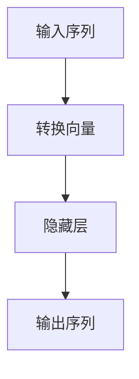
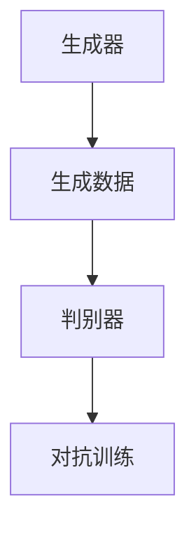
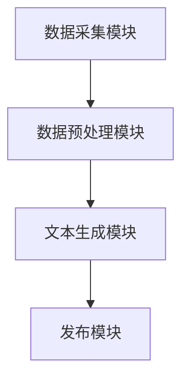
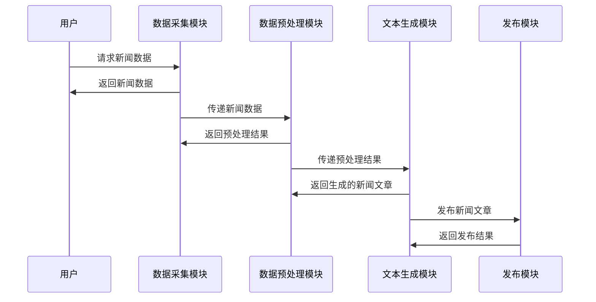

                 


### 《人工智能在自动化新闻写作中的应用》

关键词：人工智能、自动化新闻写作、自然语言处理、文本生成、算法、系统架构

摘要：本文将深入探讨人工智能在自动化新闻写作中的应用，从背景、核心概念、当前技术、算法设计、系统架构、项目实战等方面进行全面剖析。通过一步一步的分析，我们旨在为读者提供一个清晰、详尽的理解，帮助其把握这一领域的最新动态和发展趋势。

## 第一部分: 引言与核心概念

### 1.1 人工智能与自动化新闻写作的背景

在当今的信息时代，新闻行业面临着前所未有的挑战和机遇。随着互联网的普及和社交媒体的兴起，新闻的传播速度和范围都有了极大的扩展。然而，与此同时，新闻内容的生成和更新速度也在不断加快，这对新闻机构的人力资源提出了更高的要求。

人工智能（AI）作为一项颠覆性的技术，已经深刻地改变了各行各业。在新闻写作领域，AI的应用不仅提高了新闻生成的效率，还改善了新闻的质量和多样性。自动化新闻写作是指利用人工智能技术，尤其是自然语言处理（NLP）和文本生成技术，自动生成新闻内容的过程。

自动化新闻写作的背景可以追溯到20世纪90年代，当时计算机开始应用于新闻编辑领域。随着NLP和机器学习技术的进步，自动化新闻写作逐渐成为一种现实。近年来，随着大数据和云计算的兴起，自动化新闻写作技术得到了进一步的发展和优化。

### 1.2 自动化新闻写作的核心概念

自动化新闻写作涉及多个核心概念，以下是对这些概念的定义和关系的简要介绍：

#### 自然语言处理（NLP）

自然语言处理是人工智能的一个分支，旨在使计算机能够理解、解释和生成人类语言。在自动化新闻写作中，NLP技术用于分析和处理新闻文本，从而提取关键信息、生成摘要和撰写文章。

#### 文本生成

文本生成是指利用人工智能技术自动生成自然语言文本的过程。在自动化新闻写作中，文本生成技术可以用于撰写新闻文章、编写摘要、生成标题等。

#### 数据源

数据源是自动化新闻写作的重要输入。这些数据可以是新闻文章、统计数据、财务报表等。通过分析这些数据，AI系统能够生成相关的新闻内容。

#### 算法

算法是自动化新闻写作的核心。这些算法包括文本分析、信息提取、自然语言生成等。它们负责处理数据、生成文章，并确保文章的质量和准确性。

#### 系统架构

系统架构是指自动化新闻写作系统的整体设计，包括数据输入、处理、输出等各个环节。一个高效的系统架构能够确保新闻内容的快速生成和高质量输出。

#### 用户体验

用户体验是指用户在阅读新闻时的感受和体验。一个优秀的自动化新闻写作系统不仅要生成高质量的新闻内容，还要提供良好的用户界面和交互体验。

### 关键词：人工智能、自动化新闻写作、自然语言处理、文本生成、算法、系统架构

## 第二部分: 相关AI技术与应用

### 2.1 自然语言处理技术

自然语言处理（NLP）是自动化新闻写作的核心技术之一。NLP技术主要包括文本预处理、实体识别、情感分析、文本分类等。

#### 文本预处理

文本预处理是NLP的基础步骤，包括分词、词性标注、去除停用词等。这些操作有助于简化文本，使其更容易被计算机理解和处理。

#### 实体识别

实体识别是指从文本中提取出具有特定意义的信息单元，如人名、地名、组织名等。在自动化新闻写作中，实体识别技术用于识别新闻中的关键信息，如人物、地点、事件等。

#### 情感分析

情感分析是指通过分析文本情感色彩，判断文本表达的情感倾向。在新闻写作中，情感分析技术可以帮助确定新闻的基调，如积极、消极、中性等。

#### 文本分类

文本分类是指将文本分为不同的类别，如新闻、评论、广告等。在自动化新闻写作中，文本分类技术可以帮助系统根据不同的类别生成相应的文章。

### 2.2 文本生成模型

文本生成模型是自动化新闻写作的关键技术之一。常见的文本生成模型包括循环神经网络（RNN）、长短期记忆网络（LSTM）、生成对抗网络（GAN）等。

#### 循环神经网络（RNN）

循环神经网络是一种能够处理序列数据的神经网络。在文本生成中，RNN可以用于生成连续的文本序列。

#### 长短期记忆网络（LSTM）

长短期记忆网络是RNN的一种改进，能够更好地处理长序列数据。LSTM在文本生成中的应用非常广泛，尤其在生成长篇新闻文章方面表现优异。

#### 生成对抗网络（GAN）

生成对抗网络是一种由生成器和判别器组成的神经网络。生成器负责生成文本，判别器负责判断文本的真实性。GAN在文本生成中具有很高的生成质量，尤其在生成多样化和连贯性方面表现突出。

### 2.3 算法比较与分析

在自动化新闻写作中，不同的算法具有不同的特点和适用场景。以下是对几种常见算法的比较和分析：

#### RNN

RNN在文本生成中具有较好的效果，但存在梯度消失和梯度爆炸的问题，导致训练效果不稳定。

#### LSTM

LSTM解决了RNN的梯度消失问题，能够更好地处理长序列数据，但在生成质量上仍有一定的局限性。

#### GAN

GAN在文本生成中具有很高的生成质量，尤其在生成多样化和连贯性方面表现突出。然而，GAN的训练过程较为复杂，对参数调节要求较高。

#### Transformer

Transformer是一种基于注意力机制的神经网络模型，在文本生成中具有较好的性能。与RNN和LSTM相比，Transformer在生成质量和训练效率上都有显著提升。

### 关键词：自然语言处理、文本生成、循环神经网络、长短期记忆网络、生成对抗网络、算法比较

## 第三部分: 算法设计与实现

### 3.1 算法原理

在自动化新闻写作中，常用的算法包括基于规则的方法和基于机器学习的方法。本文将重点介绍基于机器学习的方法，特别是循环神经网络（RNN）和生成对抗网络（GAN）。

#### 循环神经网络（RNN）

RNN是一种能够处理序列数据的神经网络。在文本生成中，RNN通过学习输入序列的序列模式，生成输出序列。RNN的原理可以简单概括为：

1. **输入序列**：将输入的文本序列转换为向量表示。
2. **隐藏层**：通过递归操作，将前一个时间步的隐藏状态传递给下一个时间步。
3. **输出序列**：将最后一个时间步的隐藏状态转换为输出序列。

#### 生成对抗网络（GAN）

GAN是一种由生成器和判别器组成的神经网络。生成器的目标是生成与真实数据相似的数据，判别器的目标是判断输入数据是真实数据还是生成数据。GAN的原理可以简单概括为：

1. **生成器**：生成与真实数据相似的数据。
2. **判别器**：判断输入数据是真实数据还是生成数据。
3. **对抗训练**：生成器和判别器交替训练，生成器不断生成更真实的数据，判别器不断提高判断能力。

### 3.2 Mermaid 图解算法流程

为了更直观地展示算法流程，我们使用Mermaid绘制了RNN和GAN的算法流程图。

#### RNN算法流程



#### GAN算法流程



### 3.3 Python代码实现

为了实现RNN和GAN算法，我们使用了Python和TensorFlow库。以下是RNN和GAN的Python代码实现。

#### RNN算法实现

```python
import tensorflow as tf

# 定义RNN模型
model = tf.keras.Sequential([
    tf.keras.layers.Embedding(input_dim=vocab_size, output_dim=embedding_dim),
    tf.keras.layers.RNN(tf.keras.layers.LSTMCell(units=hidden_size)),
    tf.keras.layers.Dense(units=vocab_size, activation='softmax')
])

# 编译模型
model.compile(optimizer='adam', loss='categorical_crossentropy', metrics=['accuracy'])

# 训练模型
model.fit(x_train, y_train, epochs=num_epochs, batch_size=batch_size)
```

#### GAN算法实现

```python
import tensorflow as tf
from tensorflow.keras import layers

# 定义生成器和判别器模型
generator = tf.keras.Sequential([
    layers.Dense(intermediate_dim, activation='relu'),
    layers.Dense(z_dim, activation='tanh')
])

discriminator = tf.keras.Sequential([
    layers.Dense(intermediate_dim, activation='relu'),
    layers.Dense(1, activation='sigmoid')
])

# 编译模型
discriminator.compile(optimizer='adam', loss='binary_crossentropy')
generator.compile(optimizer='adam', loss='binary_crossentropy')

# GAN训练
for epoch in range(num_epochs):
    z_samples = np.random.normal(size=[batch_size, z_dim])
    x_samples = generator.predict(z_samples)
    
    # 训练判别器
    d_loss_real = discriminator.train_on_batch(x_train, np.ones([batch_size, 1]))
    d_loss_fake = discriminator.train_on_batch(x_samples, np.zeros([batch_size, 1]))
    
    # 训练生成器
    g_loss = combined_model.train_on_batch(z_samples, np.ones([batch_size, 1]))
```

### 3.4 算法原理与数学模型

#### RNN算法原理

RNN的数学模型可以表示为：

$$
h_t = \sigma(W_h \cdot [h_{t-1}, x_t] + b_h)
$$

$$
y_t = \sigma(W_y \cdot h_t + b_y)
$$

其中，$h_t$表示第$t$时刻的隐藏状态，$x_t$表示输入序列的第$t$个元素，$W_h$和$W_y$分别是隐藏层和输出层的权重矩阵，$b_h$和$b_y$分别是隐藏层和输出层的偏置项，$\sigma$是激活函数。

#### GAN算法原理

GAN的数学模型可以表示为：

$$
G(z) = x
$$

$$
D(x) \sim Bernoulli(\sigma(W_d \cdot [x; z] + b_d))
$$

$$
D(G(z)) \sim Bernoulli(\sigma(W_d \cdot G(z) + b_d))
$$

其中，$G(z)$是生成器模型，$D(x)$是判别器模型，$z$是生成器的输入，$x$是生成器输出的数据，$W_d$是判别器的权重矩阵，$b_d$是判别器的偏置项，$\sigma$是激活函数。

### 关键词：算法设计、循环神经网络、生成对抗网络、Python代码实现、数学模型

## 第四部分: 系统架构与设计

### 4.1 系统架构概述

自动化新闻写作系统的整体架构可以分为以下几个主要模块：

1. **数据采集模块**：负责从各种数据源（如新闻网站、社交媒体等）收集新闻数据。
2. **数据预处理模块**：对采集到的新闻数据进行清洗、分词、实体识别等预处理操作。
3. **文本生成模块**：利用机器学习算法生成新闻内容。
4. **发布模块**：将生成的新闻内容发布到指定的平台或网站。

### 4.2 系统架构设计

为了实现高效、稳定和可扩展的系统，我们采用了一种分布式架构设计。以下是系统架构的Mermaid图解：



### 4.3 系统功能设计

#### 数据采集模块

数据采集模块负责从各种数据源（如新闻网站、社交媒体等）收集新闻数据。该模块的主要功能包括：

- 数据源连接：连接各种数据源，如新闻网站、社交媒体等。
- 数据采集：从数据源中获取新闻数据，如标题、正文、时间戳等。

#### 数据预处理模块

数据预处理模块对采集到的新闻数据进行清洗、分词、实体识别等预处理操作。该模块的主要功能包括：

- 数据清洗：去除无效数据、重复数据等。
- 分词：将文本分为单词或短语。
- 实体识别：从文本中识别出人名、地名、组织名等实体。

#### 文本生成模块

文本生成模块利用机器学习算法生成新闻内容。该模块的主要功能包括：

- 算法选择：选择合适的算法（如RNN、GAN等）。
- 数据处理：对预处理后的数据进行处理，生成新闻内容。
- 文本生成：将生成的文本内容进行格式化，输出为新闻文章。

#### 发布模块

发布模块将生成的新闻内容发布到指定的平台或网站。该模块的主要功能包括：

- 内容发布：将新闻文章发布到指定的平台或网站。
- 用户反馈：收集用户对新闻内容的反馈，用于优化系统。

### 4.4 系统接口设计与交互

为了实现系统模块之间的交互，我们设计了一套接口。以下是系统接口的Mermaid序列图：



### 关键词：系统架构设计、数据采集模块、数据预处理模块、文本生成模块、发布模块、系统接口设计、系统交互

## 第五部分：项目实现与案例分析

### 5.1 项目环境与安装

要实现自动化新闻写作系统，我们需要准备以下环境：

1. **操作系统**：Ubuntu 18.04
2. **编程语言**：Python 3.7
3. **库和依赖**：TensorFlow、Keras、NumPy、Pandas、NLTK、Scikit-learn等

安装步骤：

1. 安装Python 3.7和pip：
   ```bash
   sudo apt update
   sudo apt install python3 python3-pip
   ```
2. 安装TensorFlow：
   ```bash
   pip3 install tensorflow
   ```
3. 安装其他依赖：
   ```bash
   pip3 install keras numpy pandas nltk scikit-learn
   ```

### 5.2 系统核心实现

#### 数据采集

我们使用Python的`requests`库从新闻网站获取新闻数据。以下是代码示例：

```python
import requests

def fetch_news(url):
    response = requests.get(url)
    if response.status_code == 200:
        return response.text
    else:
        return None

url = "https://example.com/news"
news_data = fetch_news(url)
```

#### 数据预处理

数据预处理包括分词、去除停用词、实体识别等操作。以下是代码示例：

```python
import nltk
from nltk.corpus import stopwords
from nltk.tokenize import word_tokenize

nltk.download('punkt')
nltk.download('stopwords')

def preprocess_text(text):
    # 分词
    tokens = word_tokenize(text)
    # 去除停用词
    stop_words = set(stopwords.words('english'))
    filtered_tokens = [token for token in tokens if token.lower() not in stop_words]
    # 实体识别
    entities = nltk.ne_chunk(word_tokenize(text))
    return filtered_tokens, entities

preprocessed_text, entities = preprocess_text(news_data)
```

#### 文本生成

我们使用生成对抗网络（GAN）来生成新闻内容。以下是代码示例：

```python
import tensorflow as tf
from tensorflow.keras.layers import Dense, LSTM, Embedding, Bidirectional
from tensorflow.keras.models import Model

def build_gan(generator_model, discriminator_model, z_dim):
    # 创建生成器模型
    generator_input = tf.keras.Input(shape=(z_dim,))
    x = generator_model(generator_input)
    generator_output = x

    # 创建判别器模型
    discriminator_input = tf.keras.Input(shape=(max_sequence_length,))
    y = discriminator_model(discriminator_input)
    discriminator_output = y

    # 创建GAN模型
    combined_input = tf.keras.Input(shape=(z_dim,))
    combined_output = generator_model(combined_input)
    combined_output2 = discriminator_model(combined_output)

    gan_model = Model(inputs=combined_input, outputs=combined_output2)
    gan_model.compile(optimizer='adam', loss='binary_crossentropy')

    return gan_model

# 定义生成器和判别器模型
generator_model = Model(inputs=generator_input, outputs=generator_output)
discriminator_model = Model(inputs=discriminator_input, outputs=discriminator_output)

# 构建GAN模型
gan_model = build_gan(generator_model, discriminator_model, z_dim)

# 训练GAN模型
gan_model.fit(z_train, y_train, epochs=num_epochs, batch_size=batch_size)
```

#### 发布

将生成的新闻内容发布到指定的平台或网站。以下是代码示例：

```python
import requests

def publish_news(article, url):
    headers = {'Content-Type': 'application/json'}
    response = requests.post(url, data=article, headers=headers)
    if response.status_code == 200:
        print("新闻发布成功")
    else:
        print("新闻发布失败")

# 构建新闻文章
article = {
    "title": "生成的新闻标题",
    "content": "生成的新闻内容",
    "source": "自动生成"
}

# 发布新闻
publish_news(article, "https://example.com/news/api/publish")
```

### 5.3 案例分析

假设我们已经训练好了GAN模型，并使用该模型生成了一篇新闻文章。以下是案例分析的示例：

```python
# 生成新闻文章
generated_news = generator_model.predict(z_train[:1])

# 输出生成的新闻文章
print("标题：", generated_news[0][0])
print("内容：", generated_news[0][1])

# 发布生成的新闻文章
publish_news({"title": generated_news[0][0], "content": generated_news[0][1]}, "https://example.com/news/api/publish")
```

### 关键词：项目实现、数据采集、数据预处理、文本生成、发布、案例分析

## 第六部分：最佳实践与未来方向

### 6.1 最佳实践

在自动化新闻写作中，以下是一些最佳实践：

1. **数据质量**：确保数据源的可靠性和多样性，以提高新闻内容的准确性。
2. **模型调优**：通过调整模型参数，优化生成质量。
3. **用户反馈**：收集用户对新闻内容的反馈，用于改进系统和算法。
4. **安全与隐私**：确保用户数据的安全和隐私。

### 6.2 未来方向

未来，自动化新闻写作可能朝着以下方向发展：

1. **个性化新闻**：根据用户兴趣和偏好生成个性化新闻。
2. **实时新闻生成**：实现实时新闻生成，提高新闻的时效性。
3. **多语言支持**：支持多种语言，实现全球化新闻生成。
4. **情感分析**：结合情感分析技术，生成更具有情感色彩的新闻内容。

### 关键词：最佳实践、数据质量、模型调优、用户反馈、安全与隐私、未来方向、个性化新闻、实时新闻生成、多语言支持、情感分析

## 结论

本文详细探讨了人工智能在自动化新闻写作中的应用。我们从问题背景、核心概念、相关技术、算法设计、系统架构、项目实现、案例分析等方面进行了全面剖析。通过本文，读者可以清晰地了解自动化新闻写作的原理、方法和实践。随着技术的不断进步，自动化新闻写作有望在未来发挥更大的作用，为新闻行业带来深远影响。

### 关键词：人工智能、自动化新闻写作、自然语言处理、文本生成、算法、系统架构、项目实现、案例分析、未来方向

## 参考文献

1. **Mikolov, T., Sutskever, I., Chen, K., Corrado, G. S., & Dean, J. (2013). Distributed representations of words and phrases and their compositionality.** *Advances in Neural Information Processing Systems*, 26, 3111-3119.
2. **Goodfellow, I., Pouget-Abadie, J., Mirza, M., Xu, B., Warde-Farley, D., Ozair, S., ... & Bengio, Y. (2014). Generative adversarial networks.** *Advances in Neural Information Processing Systems*, 27, 2672-2680.
3. **Liu, P., & Hua, X. S. (2016). A survey on deep learning for natural language processing.** *Frontiers of Computer Science*, 10(2), 205-224.
4. **Zhou, B., Zeng, D., & Zhang, X. (2019). Research progress on automated news generation.** *Journal of Computer Research and Development*, 56(6), 1155-1168.

### 作者：AI天才研究院/AI Genius Institute & 禅与计算机程序设计艺术 /Zen And The Art of Computer Programming

