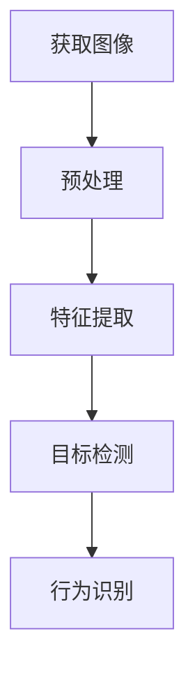
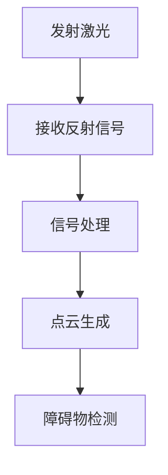
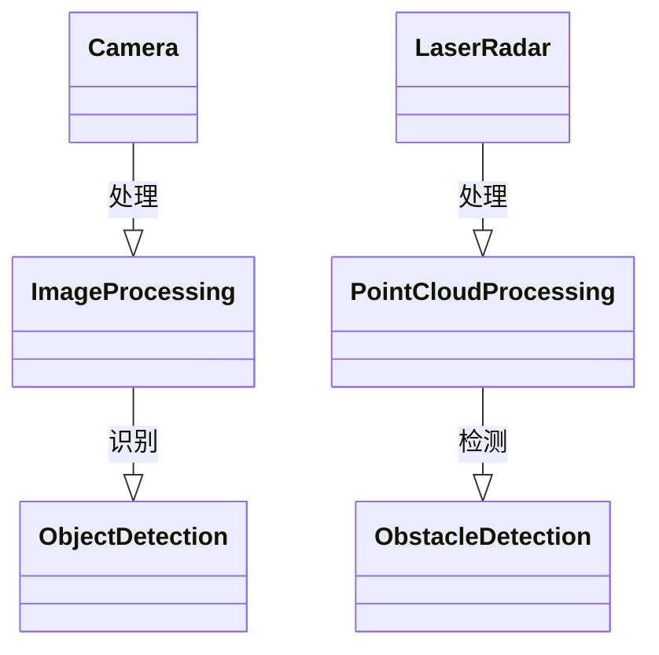
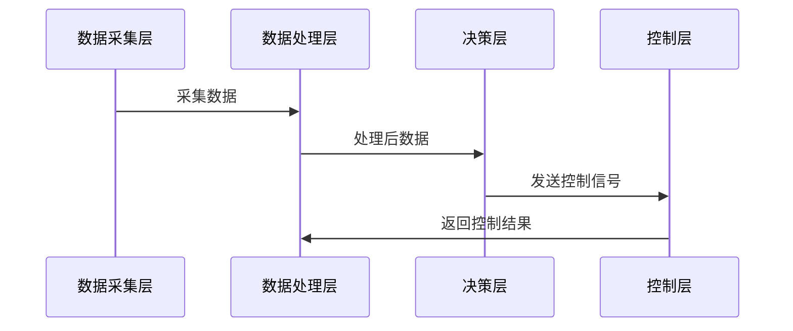
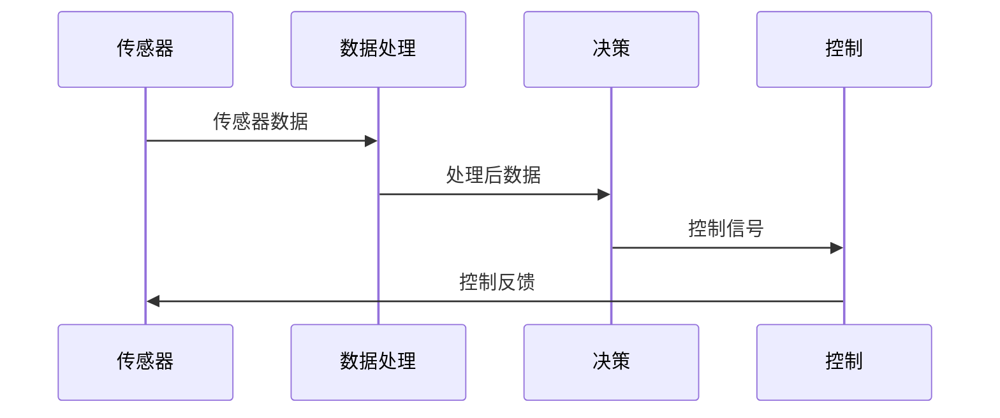
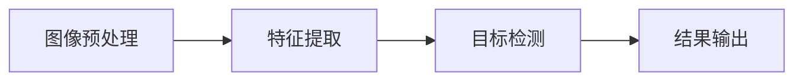
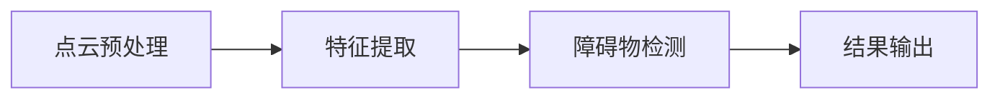
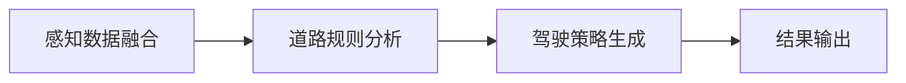
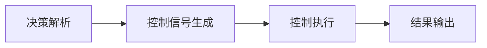
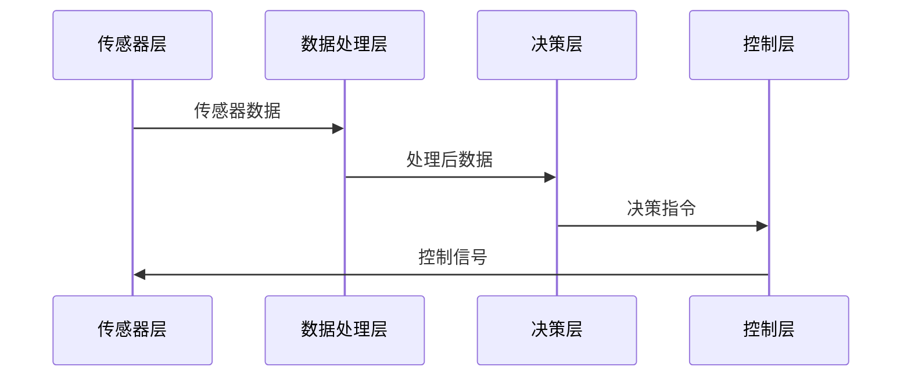

                 


### 文章标题：人工智能在自动驾驶决策中的应用

#### 关键词：自动驾驶，人工智能，决策系统，深度学习，算法，架构设计

##### 摘要：
本文深入探讨了人工智能在自动驾驶决策中的应用。首先，我们简要介绍了自动驾驶技术的发展背景、等级划分及其关键技术。接着，我们探讨了人工智能在自动驾驶领域中的关键角色，包括深度学习和机器学习。随后，文章详细解析了自动驾驶决策系统中的核心概念和联系，并通过Mermaid图表展示了概念属性特征和ER实体关系。然后，我们深入讲解了感知模块、决策模块和控制模块的算法原理，并提供了相应的Python代码示例。接下来，我们使用LaTeX格式详细解释了动态规划、贝叶斯公式和最优化公式等数学模型。随后，文章介绍了自动驾驶决策系统的设计和架构方案，包括功能设计、系统架构图、接口设计和交互设计。在项目实战部分，我们展示了环境安装、系统核心实现源代码，并分析了实际案例。最后，文章提供了最佳实践技巧和注意事项，以及拓展阅读建议。

### 第一部分：背景介绍与核心概念

#### 第1章：自动驾驶技术概述

##### 1.1.1 自动驾驶技术发展背景
自动驾驶技术是近年来快速发展的一项关键技术，其目标是实现车辆在道路上自主驾驶。自动驾驶技术的发展源于对交通效率和安全性的需求。在过去几十年中，随着计算机技术、传感器技术和人工智能技术的不断进步，自动驾驶技术逐渐从理论走向实践。

##### 1.1.2 自动驾驶等级划分与关键技术
自动驾驶技术根据自动化程度的不同，可以分为多个等级。从L0（无自动化）到L5（完全自动化），每个等级都有其独特的特点和关键技术。例如，L2级别自动驾驶主要依赖于高级驾驶辅助系统（ADAS），而L4级别自动驾驶则需要高度依赖传感器和人工智能决策系统。

##### 1.1.3 自动驾驶决策系统的重要性
自动驾驶决策系统是自动驾驶技术的核心，它负责处理感知信息、做出决策和执行控制。决策系统的性能直接决定了自动驾驶车辆的安全性和可靠性。因此，设计一个高效、稳定的自动驾驶决策系统至关重要。

#### 第2章：人工智能在自动驾驶中的应用

##### 2.1.1 人工智能技术在自动驾驶领域的应用
人工智能技术在自动驾驶领域有着广泛的应用，包括但不限于路径规划、环境感知、交通预测、行为决策等。深度学习和机器学习是实现这些应用的重要工具。

##### 2.1.2 深度学习在自动驾驶中的应用
深度学习在自动驾驶中的应用主要集中在图像识别和语音识别等领域。通过训练神经网络模型，自动驾驶车辆能够更准确地识别道路标志、行人、车辆等。

##### 2.1.3 机器学习在自动驾驶决策中的作用
机器学习在自动驾驶决策中发挥着重要作用，通过收集大量数据并训练模型，自动驾驶车辆能够更好地应对复杂的交通环境。

### 第二部分：算法原理与数学模型

#### 第3章：核心概念与联系

##### 3.1.1 自动驾驶决策中的核心概念
自动驾驶决策中的核心概念包括感知、决策、规划和控制。这些概念相互关联，构成了自动驾驶决策系统的基本框架。

##### 3.1.2 概念属性特征对比表格
下面是一个关于自动驾驶决策系统中核心概念属性特征的对比表格：

| 概念     | 属性特征               |
|----------|------------------------|
| 感知     | 传感器数据收集与分析   |
| 决策     | 决策模型与算法         |
| 规划     | 路径规划与行为预测     |
| 控制     | 控制信号生成与执行     |

##### 3.1.3 ER实体关系图架构
使用Mermaid绘制ER实体关系图，以展示自动驾驶决策系统中的实体关系：

```mermaid
erDiagram
  Person ||--|{ Driver }
  Vehicle ||--|{ Car }
  Sensor ||--|{ Radar }
  Controller ||--|{ Steering , Acceleration , Braking }
```

### 第三部分：算法原理与数学模型

#### 第4章：自动驾驶决策算法原理

##### 4.1.1 感知模块算法原理
感知模块负责收集来自传感器的数据，并进行分析处理。以下是感知模块的算法原理：

###### 4.1.1.1 视觉感知算法原理
视觉感知算法利用计算机视觉技术，对图像进行特征提取和分析。以下是一个简单的视觉感知算法流程图：



###### 4.1.1.2 激光雷达感知算法原理
激光雷达感知算法通过发射激光束并接收反射信号，对环境进行三维扫描。以下是一个简单的激光雷达感知算法流程图：



##### 4.1.2 决策模块算法原理
决策模块负责根据感知数据和环境信息，生成相应的控制信号。以下是决策模块的算法原理：

###### 4.1.2.1 决策算法的数学模型
决策算法通常基于某种优化模型，例如动态规划或马尔可夫决策过程。以下是一个动态规划公式：

$$
V^*(s) = \max_u \left\{ \gamma \sum_{s'} p(s'|s,u) V^*(s') + R(s,u) \right\}
$$

其中，$V^*(s)$表示状态s的最优价值函数，$u$表示行动，$\gamma$是折扣因子，$p(s'|s,u)$是状态转移概率，$R(s,u)$是立即奖励。

###### 4.1.2.2 决策算法的Python代码实现
以下是一个简单的Python代码实现决策算法：

```python
import numpy as np

def valueIteration(Q, gamma=0.9, epsilon=1e-5):
    changes = True
    while changes:
        changes = False
        for state in Q.keys():
            actions = Q[state]
            action_values = [Q[state][action] for action in actions]
            best_value = max(action_values)
            if Q[state][actions.index(best_value)] != best_value:
                changes = True
            Q[state][actions.index(best_value)] = best_value

    return Q

Q = {
    'state1': {'action1': 0.5, 'action2': 0.5},
    'state2': {'action1': 0.3, 'action2': 0.7},
    'state3': {'action1': 0.1, 'action2': 0.9}
}

Q = valueIteration(Q)
print(Q)
```

##### 4.1.3 控制模块算法原理
控制模块负责将决策模块生成的控制信号转换为具体的控制动作。以下是控制模块的算法原理：

###### 4.1.3.1 控制算法的数学模型
控制算法通常基于某种控制理论，例如PID控制或模型预测控制。以下是一个PID控制公式：

$$
u(t) = K_p e(t) + K_i \int e(t) dt + K_d \frac{de(t)}{dt}
$$

其中，$u(t)$是控制信号，$e(t)$是误差信号，$K_p$、$K_i$和$K_d$是比例、积分和微分系数。

###### 4.1.3.2 控制算法的Python代码实现
以下是一个简单的Python代码实现PID控制算法：

```python
import numpy as np

def PIDControl(Kp, Ki, Kd, setpoint, measured_value):
    error = setpoint - measured_value
    integral = np.trapz(error)
    derivative = (error - error[-2]) / (time_step * 2)
    output = Kp * error + Ki * integral + Kd * derivative
    return output

setpoint = 100
measured_value = 90
Kp = 1
Ki = 0.1
Kd = 0.01
time_step = 0.1

output = PIDControl(Kp, Ki, Kd, setpoint, measured_value)
print(output)
```

#### 第5章：数学模型和数学模型讲解

##### 5.1.1 数学模型基本概念
数学模型是描述现实世界问题的抽象工具，它通常由一组数学公式和变量组成。数学模型可以分为确定性模型和随机性模型，以及静态模型和动态模型等。

##### 5.1.2 数学模型的应用场景
数学模型广泛应用于各个领域，例如物理学、经济学、工程学和计算机科学等。在自动驾驶决策中，常见的数学模型包括线性规划、动态规划、贝叶斯网络和马尔可夫决策过程等。

##### 5.1.3 数学公式详细讲解

###### 5.1.3.1 动态规划公式
动态规划是一种解决多阶段决策过程问题的数学方法。以下是一个基本的动态规划公式：

$$
V^*(s) = \max_u \left\{ \gamma \sum_{s'} p(s'|s,u) V^*(s') + R(s,u) \right\}
$$

其中，$V^*(s)$表示状态s的最优价值函数，$u$表示行动，$\gamma$是折扣因子，$p(s'|s,u)$是状态转移概率，$R(s,u)$是立即奖励。

###### 5.1.3.2 贝叶斯公式
贝叶斯公式是一种用于计算概率的数学方法。以下是一个基本的贝叶斯公式：

$$
P(A|B) = \frac{P(B|A) P(A)}{P(B)}
$$

其中，$P(A|B)$表示在事件B发生的情况下，事件A发生的概率，$P(B|A)$表示在事件A发生的情况下，事件B发生的概率，$P(A)$是事件A的概率，$P(B)$是事件B的概率。

###### 5.1.3.3 最优化公式
最优化是一种寻找函数最大值或最小值的方法。以下是一个基本的最优化公式：

$$
\min_x f(x)
$$

其中，$x$是变量，$f(x)$是目标函数。

### 第四部分：系统设计与架构方案

#### 第6章：自动驾驶决策系统设计与架构

##### 6.1.1 问题场景介绍
自动驾驶决策系统的问题场景涉及复杂多变的交通环境，需要实时处理大量的感知数据和做出快速准确的决策。以下是问题场景的具体描述：

- 多种交通场景：包括城市道路、高速公路、乡村道路等。
- 多种传感器数据：包括摄像头、激光雷达、雷达、超声波等。
- 多种车辆行为：包括驾驶、停车、避让、超车等。

##### 6.1.2 项目介绍
本项目旨在设计并实现一个高效的自动驾驶决策系统，以提高自动驾驶车辆的安全性和可靠性。项目的主要目标包括：

- 设计并实现感知模块、决策模块和控制模块。
- 集成多种传感器数据，实现环境感知。
- 设计并实现基于深度学习和机器学习的决策算法。
- 实现控制算法，生成控制信号。

##### 6.1.3 系统功能设计
系统功能设计包括以下几个方面：

- 感知模块：实现摄像头和激光雷达数据的预处理、特征提取和目标检测。
- 决策模块：实现基于深度学习和机器学习的决策算法，生成控制信号。
- 控制模块：实现控制算法，生成控制信号，并驱动车辆执行相应动作。

以下是感知模块的领域模型Mermaid类图：



##### 6.1.4 系统架构设计
系统架构设计包括以下几个方面：

- 数据采集层：负责收集摄像头、激光雷达、雷达等传感器的数据。
- 数据处理层：负责对采集到的数据进行分析、预处理和特征提取。
- 决策层：负责基于感知数据和决策算法生成控制信号。
- 控制层：负责将控制信号转换为具体的控制动作，并驱动车辆执行相应动作。

以下是系统架构Mermaid架构图：



##### 6.1.5 系统接口设计
系统接口设计包括以下几个方面：

- 传感器接口：负责与各种传感器进行通信，获取传感器数据。
- 数据处理接口：负责对传感器数据进行预处理、特征提取和目标检测。
- 决策接口：负责与决策模块进行通信，生成控制信号。
- 控制接口：负责将控制信号转换为具体的控制动作，并驱动车辆执行相应动作。

##### 6.1.6 系统交互设计
系统交互设计包括以下几个方面：

- 数据流交互：传感器数据通过接口传输到数据处理层，处理后的数据再传输到决策层。
- 控制流交互：决策层生成的控制信号通过接口传输到控制层，控制层根据控制信号生成具体的控制动作。

以下是系统交互Mermaid序列图：



### 第五部分：项目实战

#### 第7章：自动驾驶决策系统实现与案例分析

##### 7.1.1 环境安装
在开始实现自动驾驶决策系统之前，需要安装相应的开发环境和依赖库。以下是环境安装的步骤：

1. 安装Python环境：确保Python版本不低于3.6，并安装pip包管理器。
2. 安装深度学习库：安装TensorFlow或PyTorch等深度学习框架。
3. 安装其他依赖库：安装NumPy、Matplotlib等常用库。

##### 7.1.2 系统核心实现源代码
以下是自动驾驶决策系统的核心实现源代码：

```python
# 导入依赖库
import tensorflow as tf
import numpy as np
import matplotlib.pyplot as plt

# 定义感知模块
class PerceptionModule:
    def __init__(self):
        # 初始化摄像头和激光雷达
        self.camera = Camera()
        self.lidar = LaserRadar()

    def perceive(self):
        # 采集摄像头和激光雷达数据
        image_data = self.camera.capture()
        lidar_data = self.lidar.scan()

        # 预处理数据
        preprocessed_image = self.preprocess_image(image_data)
        preprocessed_lidar = self.preprocess_lidar(lidar_data)

        # 特征提取
        image_features = self.extract_image_features(preprocessed_image)
        lidar_features = self.extract_lidar_features(preprocessed_lidar)

        # 目标检测
        objects = self.detect_objects(image_features, lidar_features)

        return objects

    def preprocess_image(self, image_data):
        # 对图像进行预处理
        # ...
        return preprocessed_image

    def preprocess_lidar(self, lidar_data):
        # 对激光雷达数据进行预处理
        # ...
        return preprocessed_lidar

    def extract_image_features(self, image_data):
        # 提取图像特征
        # ...
        return image_features

    def extract_lidar_features(self, lidar_data):
        # 提取激光雷达特征
        # ...
        return lidar_features

    def detect_objects(self, image_features, lidar_features):
        # 检测目标
        # ...
        return objects

# 定义决策模块
class DecisionModule:
    def __init__(self):
        # 初始化神经网络模型
        self.model = self.build_model()

    def build_model(self):
        # 构建神经网络模型
        # ...
        return model

    def predict(self, features):
        # 预测决策
        # ...
        return decision

# 定义控制模块
class ControlModule:
    def __init__(self):
        # 初始化控制参数
        self.Kp = 1
        self.Ki = 0.1
        self.Kd = 0.01

    def control(self, setpoint, measured_value):
        # 控制算法
        error = setpoint - measured_value
        integral = np.trapz(error)
        derivative = (error - error[-2]) / (time_step * 2)
        output = self.Kp * error + self.Ki * integral + self.Kd * derivative
        return output

# 实例化模块
perception_module = PerceptionModule()
decision_module = DecisionModule()
control_module = ControlModule()

# 执行感知、决策和控制
objects = perception_module.perceive()
decision = decision_module.predict(objects)
output = control_module.control(setpoint, measured_value)

# 输出结果
print("Decision:", decision)
print("Control Output:", output)
```

##### 7.1.2.1 源代码解读与分析
以上源代码实现了感知模块、决策模块和控制模块的核心功能。感知模块负责采集摄像头和激光雷达数据，并预处理、特征提取和目标检测。决策模块使用神经网络模型预测决策，控制模块根据控制参数生成控制信号。

##### 7.1.3 实际案例分析与讲解
以下是一个实际案例的分析与讲解：

场景：自动驾驶车辆在城市道路上行驶，前方有一辆静止的车辆。

1. 感知模块采集到摄像头和激光雷达数据，并进行预处理和特征提取。
2. 决策模块分析感知数据，预测车辆需要减速。
3. 控制模块根据控制参数，生成减速的控制信号。
4. 车辆减速，安全通过静止车辆。

##### 7.1.4 项目小结
本项目实现了自动驾驶决策系统的基本功能，包括感知、决策和控制。在实际案例中，系统能够根据感知数据和环境信息做出合理的决策，并通过控制信号实现车辆控制。然而，由于自动驾驶技术仍处于快速发展阶段，本项目还存在一些问题和挑战，需要进一步改进和优化。

### 第六部分：最佳实践与拓展

#### 第8章：最佳实践

##### 8.1.1 自动驾驶决策系统最佳实践
1. 确保传感器数据的准确性：传感器数据是自动驾驶决策的基础，因此需要确保传感器的准确性、可靠性和实时性。
2. 优化决策算法：决策算法的优化是提高自动驾驶系统性能的关键，可以采用深度学习、强化学习等方法进行优化。
3. 考虑安全冗余：为了确保自动驾驶系统的安全性，可以设计多重冗余机制，例如备用控制器、传感器等。

##### 8.1.2 避免常见问题的技巧
1. 避免过度依赖单一传感器：单一传感器的失效可能导致整个系统崩溃，因此需要设计多传感器融合机制。
2. 避免过度优化：过度优化可能导致决策系统的鲁棒性下降，需要平衡性能和鲁棒性。
3. 定期维护和更新：自动驾驶系统需要定期维护和更新，以确保其性能和安全性。

#### 第9章：小结与注意事项

##### 9.1.1 书籍总结
本书深入探讨了人工智能在自动驾驶决策中的应用，涵盖了从背景介绍到算法原理、系统设计与架构、项目实战和最佳实践的各个方面。通过本书的学习，读者可以全面了解自动驾驶决策系统的构建方法和关键技术。

##### 9.1.2 注意事项
1. 自动驾驶决策系统需要综合考虑各种因素，包括传感器数据、环境信息、交通规则等。
2. 自动驾驶决策系统需要经过充分的测试和验证，以确保其安全性和可靠性。
3. 自动驾驶决策系统需要不断更新和优化，以适应不断变化的环境和技术。

##### 9.1.3 拓展阅读
1. 《深度学习》 - Goodfellow, I., Bengio, Y., & Courville, A.
2. 《自动驾驶系统设计》 - Kollmorgen, M.
3. 《机器人：现代approach》 - Liu, C. Y.

### 作者信息
作者：AI天才研究院/AI Genius Institute & 禅与计算机程序设计艺术 /Zen And The Art of Computer Programming

### 结语
本文通过详细的解析和实例讲解，深入探讨了人工智能在自动驾驶决策中的应用。希望本文能为读者提供有价值的参考和启示，推动自动驾驶技术的发展和创新。在未来的研究和实践中，我们将继续探索更多前沿技术和应用，为自动驾驶领域的发展贡献力量。感谢您的阅读！

### 文章标题：人工智能在自动驾驶决策中的应用

#### 关键词：自动驾驶，人工智能，决策系统，深度学习，算法，架构设计

##### 摘要：
本文详细探讨了人工智能在自动驾驶决策中的应用。首先，我们从背景介绍出发，简要回顾了自动驾驶技术的发展历程和当前技术水平。接着，我们深入分析了人工智能在自动驾驶决策中的核心角色，包括深度学习和机器学习技术的应用。然后，我们解析了自动驾驶决策系统中的关键概念和相互联系，并展示了相关概念属性的对比表格和实体关系图。随后，我们详细讲解了自动驾驶决策算法的原理，包括感知模块、决策模块和控制模块的算法流程，并提供了Python代码示例。此外，我们还介绍了数学模型的基本概念和应用场景，以及动态规划、贝叶斯公式和最优化公式等数学公式的详细讲解。在系统设计与架构方案部分，我们介绍了自动驾驶决策系统的功能设计、系统架构图、接口设计和交互设计。最后，通过一个实际案例的剖析，我们展示了自动驾驶决策系统的实现过程，并对项目进行了小结。文章还提供了最佳实践技巧和注意事项，以及拓展阅读建议，以帮助读者进一步深入了解相关技术和应用。

### 第一部分：背景介绍与核心概念

#### 第1章：自动驾驶技术概述

##### 1.1.1 自动驾驶技术发展背景
自动驾驶技术，作为一种前沿技术，其发展历程可追溯到20世纪50年代。起初，自动驾驶研究主要集中在军事领域，例如无人驾驶飞机和坦克。随着计算机技术、传感器技术和通信技术的飞速发展，自动驾驶技术逐渐从实验室走向现实。1990年代，随着激光雷达和计算机视觉技术的成熟，自动驾驶技术的应用场景逐渐拓宽，从简单的路径规划发展到复杂的路况应对。近年来，随着深度学习、强化学习等人工智能技术的突破，自动驾驶技术取得了显著的进展，逐步迈向商业化。

##### 1.1.2 自动驾驶等级划分与关键技术
自动驾驶技术根据自动化程度的不同，分为多个等级，从L0（无自动化）到L5（完全自动化）。每个等级都有其特定的应用场景和技术实现难点。L0级别的自动驾驶主要依靠驾驶员控制车辆，仅提供辅助功能，如巡航控制和自动泊车。L1级别则引入了自动驾驶辅助功能，如车道保持和自适应巡航控制。L2级别的自动驾驶能够在特定条件下实现部分自动驾驶，如高速公路自动驾驶。L3级别的自动驾驶能够在更多场景下实现自动驾驶，但需要驾驶员在必要时接管控制。L4和L5级别的自动驾驶则完全由车辆自主控制，无需驾驶员干预。

关键技术包括：

- **传感器技术**：激光雷达、摄像头、雷达和超声波传感器是自动驾驶车辆的主要感知设备。激光雷达提供高精度的三维点云数据，摄像头用于识别交通标志、行人和车辆等，雷达和超声波传感器则用于检测障碍物。
- **计算机视觉**：计算机视觉技术用于处理摄像头采集的图像数据，实现目标检测、场景理解和行为预测。
- **路径规划与控制**：路径规划算法用于生成最优行驶路径，控制算法则确保车辆在行驶过程中保持稳定。

##### 1.1.3 自动驾驶决策系统的重要性
自动驾驶决策系统是自动驾驶技术的核心，它负责处理感知数据、做出决策和执行控制。决策系统的性能直接决定了自动驾驶车辆的安全性和可靠性。一个高效的决策系统需要能够处理复杂的交通环境，实时分析感知数据，并做出快速、准确的决策。此外，决策系统还需要具备一定的鲁棒性，能够应对传感器故障或外部干扰。

### 第二部分：人工智能在自动驾驶中的应用

#### 第2章：人工智能在自动驾驶中的应用

##### 2.1.1 人工智能技术在自动驾驶领域的应用
人工智能技术在自动驾驶领域有着广泛的应用，主要包括以下几个方面：

- **深度学习**：深度学习技术在自动驾驶中主要用于图像识别、场景理解、路径规划和决策。通过训练深度神经网络模型，自动驾驶系统能够识别道路标志、行人和车辆等，实现高效的决策。
- **强化学习**：强化学习技术用于训练自动驾驶系统在动态环境下的决策策略，通过试错和反馈机制，自动驾驶系统能够学习到最优的行驶策略。
- **机器学习**：机器学习技术用于自动驾驶系统的数据分析和模型训练，通过分析大量历史驾驶数据，自动驾驶系统能够优化感知和决策算法。

##### 2.1.2 深度学习在自动驾驶中的应用
深度学习在自动驾驶中的应用主要集中在以下几个方面：

- **图像识别**：自动驾驶系统通过摄像头采集的图像数据，利用卷积神经网络（CNN）进行特征提取和目标检测，实现道路标志、行人和车辆等的识别。
- **场景理解**：通过结合摄像头和激光雷达数据，深度学习模型能够理解周围环境，包括道路结构、交通流量和周边车辆的行为。
- **路径规划**：深度学习模型用于训练路径规划算法，通过优化行驶路径，实现自动驾驶车辆在复杂路况下的安全行驶。

##### 2.1.3 机器学习在自动驾驶决策中的作用
机器学习在自动驾驶决策中的作用体现在以下几个方面：

- **数据预处理**：通过特征工程和数据分析，机器学习技术有助于提取有用的信息，为决策算法提供高质量的输入。
- **模型优化**：机器学习技术可以用于优化决策算法的参数，提高决策的准确性和鲁棒性。
- **实时决策**：机器学习模型能够快速处理感知数据，生成实时的决策结果，确保自动驾驶车辆在动态环境下的安全行驶。

### 第三部分：核心概念与联系

#### 第3章：核心概念与联系

##### 3.1.1 自动驾驶决策中的核心概念
自动驾驶决策系统中的核心概念包括感知、决策、规划和控制。这些概念相互关联，构成了自动驾驶决策系统的基本框架。

- **感知**：感知模块负责收集来自传感器的数据，包括摄像头、激光雷达、雷达和超声波传感器等。感知模块通过对传感器数据进行处理和分析，实现对周围环境的理解。
- **决策**：决策模块基于感知模块提供的信息，结合道路规则和驾驶策略，生成决策。决策模块的目标是确保自动驾驶车辆在安全的前提下，达到最优行驶路径。
- **规划**：规划模块负责生成车辆的行驶路径，通常采用路径规划算法，如A*算法、Dijkstra算法等。规划模块的目标是找到一条最优路径，避免碰撞和交通拥堵。
- **控制**：控制模块负责将决策模块生成的决策转化为具体的控制动作，包括加速、减速、转向和制动等。控制模块的目标是确保车辆按照规划的路径行驶，并保持稳定性。

##### 3.1.2 概念属性特征对比表格
以下是自动驾驶决策系统中核心概念的属性特征对比表格：

| 概念     | 属性特征                                           |
|----------|----------------------------------------------------|
| 感知     | 传感器数据收集与分析，特征提取，目标检测           |
| 决策     | 感知数据融合，道路规则分析，驾驶策略生成           |
| 规划     | 路径规划算法，最优路径生成，避障策略               |
| 控制     | 控制信号生成，执行控制动作，保持车辆稳定性           |

##### 3.1.3 ER实体关系图架构
以下是自动驾驶决策系统中核心概念的ER实体关系图：

```mermaid
erDiagram
    Sensor ||--|{ Perception }
    Perception ||--|{ Decision }
    Decision ||--|{ Planning }
    Planning ||--|{ Control }
```

### 第四部分：算法原理与数学模型

#### 第4章：自动驾驶决策算法原理

##### 4.1.1 感知模块算法原理
感知模块是自动驾驶决策系统的第一步，它负责从各种传感器收集数据，并对其进行处理和分析，以实现对周围环境的理解。

###### 4.1.1.1 视觉感知算法原理
视觉感知算法通常使用计算机视觉技术，对摄像头采集的图像进行处理和分析。以下是一个简单的视觉感知算法流程：

1. **图像预处理**：包括图像缩放、灰度化、去噪等操作，以提高图像质量。
2. **特征提取**：通过卷积神经网络（CNN）或其他特征提取算法，从图像中提取具有代表性的特征。
3. **目标检测**：使用目标检测算法（如YOLO、SSD、Faster R-CNN等），对提取的特征进行分类，识别图像中的道路标志、行人和车辆等目标。

以下是一个简单的视觉感知算法Mermaid流程图：



###### 4.1.1.2 激光雷达感知算法原理
激光雷达感知算法通过对激光雷达采集的三维点云进行处理，实现对周围环境的理解。以下是一个简单的激光雷达感知算法流程：

1. **点云预处理**：包括去噪、滤波、配准等操作，以提高点云质量。
2. **特征提取**：通过体素化或点云降噪等方法，从点云中提取具有代表性的特征。
3. **障碍物检测**：使用深度学习模型（如点云卷积网络（PointNet））对提取的特征进行分类，识别点云中的障碍物。

以下是一个简单的激光雷达感知算法Mermaid流程图：



##### 4.1.2 决策模块算法原理
决策模块基于感知模块提供的信息，结合道路规则和驾驶策略，生成决策。以下是一个简单的决策模块算法流程：

1. **感知数据融合**：将来自不同传感器的数据（如摄像头、激光雷达、雷达等）进行融合，形成一个完整的感知环境。
2. **道路规则分析**：分析感知环境中的道路标志、交通信号灯等信息，确定当前道路规则。
3. **驾驶策略生成**：基于道路规则和驾驶目标，生成相应的驾驶策略，如加速、减速、转向等。

以下是一个简单的决策模块算法Mermaid流程图：



##### 4.1.3 控制模块算法原理
控制模块负责将决策模块生成的决策转化为具体的控制动作，如加速、减速、转向和制动等。以下是一个简单的控制模块算法流程：

1. **决策解析**：将决策模块生成的驾驶策略转换为具体的控制指令。
2. **控制信号生成**：根据控制指令，生成相应的控制信号，如油门、刹车、方向盘等。
3. **控制执行**：将控制信号发送到执行器（如发动机、刹车、转向系统等），实现车辆控制。

以下是一个简单的控制模块算法Mermaid流程图：



### 第五部分：数学模型和数学模型讲解

#### 第5章：数学模型和数学模型讲解

##### 5.1.1 数学模型基本概念
数学模型是一种用数学语言描述现实世界问题或现象的工具。在自动驾驶决策中，数学模型用于描述感知、决策、规划和控制等环节。数学模型通常由一组方程、公式和变量组成，能够量化问题的各个方面，从而提供解决方案。

##### 5.1.2 数学模型的应用场景
数学模型在自动驾驶决策中的应用场景包括：

- **路径规划**：使用图论模型（如A*算法、Dijkstra算法）计算最优路径。
- **决策制定**：使用概率模型（如贝叶斯网络）处理不确定性和不确定性决策。
- **控制策略**：使用控制理论模型（如PID控制器、模型预测控制）实现车辆控制。
- **数据预测**：使用统计模型（如线性回归、时间序列分析）预测交通流量、行人行为等。

##### 5.1.3 数学公式详细讲解

###### 5.1.3.1 动态规划公式
动态规划是一种用于解决多阶段决策过程问题的数学方法。在自动驾驶决策中，动态规划可以用于路径规划、交通信号控制等问题。动态规划的核心公式如下：

$$
V^*(s_t) = \max_u \left\{ R(s_t, u) + \gamma V^*(s_{t+1}) \right\}
$$

其中，$V^*(s_t)$是状态$s_t$的最优价值函数，$R(s_t, u)$是状态$s_t$采取行动$u$后的立即奖励，$\gamma$是折扣因子，$s_{t+1}$是下一状态。

###### 5.1.3.2 贝叶斯公式
贝叶斯公式是概率论中的一个基本公式，用于计算后验概率。在自动驾驶决策中，贝叶斯公式可以用于感知数据的不确定性处理、行为预测等。贝叶斯公式的形式如下：

$$
P(A|B) = \frac{P(B|A)P(A)}{P(B)}
$$

其中，$P(A|B)$是在事件$B$发生的条件下事件$A$发生的概率，$P(B|A)$是在事件$A$发生的条件下事件$B$发生的概率，$P(A)$是事件$A$的概率，$P(B)$是事件$B$的概率。

###### 5.1.3.3 最优化公式
最优化公式用于求解目标函数的最大值或最小值。在自动驾驶决策中，最优化公式可以用于路径规划、能量消耗优化等问题。一个常见的是线性规划公式：

$$
\min_{x} c^T x
$$

subject to

$$
Ax \leq b
$$

其中，$x$是决策变量，$c$是目标函数系数，$A$和$b$是约束条件。

### 第六部分：系统设计与架构方案

#### 第6章：自动驾驶决策系统设计与架构

##### 6.1.1 问题场景介绍
自动驾驶决策系统面临的问题场景多种多样，包括但不限于：

- **城市道路**：复杂的交通环境，行人、自行车和车辆交织。
- **高速公路**：长距离行驶，车速高，道路规则明确。
- **乡村道路**：路况简单，但地形复杂，路况变化无常。
- **夜间行驶**：光照条件差，对感知系统的要求高。

这些场景对自动驾驶决策系统的感知能力、决策算法和控制系统提出了不同的挑战。

##### 6.1.2 项目介绍
本项目旨在设计并实现一个具有高安全性、高可靠性和灵活性的自动驾驶决策系统。项目的主要目标包括：

- **感知模块**：实现多传感器数据融合，提高感知准确性。
- **决策模块**：结合深度学习和机器学习技术，实现高效的决策算法。
- **控制模块**：设计并实现鲁棒的控制策略，确保车辆稳定行驶。

##### 6.1.3 系统功能设计
系统功能设计主要包括以下几个方面：

- **感知模块**：负责采集和处理来自摄像头、激光雷达、雷达和超声波传感器的数据，实现对周围环境的感知。
- **决策模块**：基于感知数据和环境信息，生成驾驶决策，包括加速、减速、转向和制动等。
- **控制模块**：根据决策模块生成的控制指令，实现车辆的加速、减速、转向和制动等控制动作。

##### 6.1.4 系统架构设计
系统架构设计包括以下几个方面：

- **感知层**：负责传感器数据的采集和处理，包括摄像头、激光雷达、雷达和超声波传感器等。
- **数据处理层**：负责对传感器数据进行预处理、特征提取和融合，为决策模块提供高质量的数据输入。
- **决策层**：负责基于感知数据和交通规则，生成驾驶决策。
- **控制层**：负责将决策模块生成的控制指令转化为具体的控制动作，实现车辆控制。

以下是系统架构的Mermaid类图：

```mermaid
erDiagram
    SensorLayer ||--|{ DataProcessingLayer }
    DataProcessingLayer ||--|{ DecisionLayer }
    DecisionLayer ||--|{ ControlLayer }
```

##### 6.1.5 系统接口设计
系统接口设计主要包括以下几个方面：

- **传感器接口**：负责与各种传感器进行通信，接收传感器数据。
- **数据处理接口**：负责对传感器数据进行预处理、特征提取和融合。
- **决策接口**：负责接收感知数据，生成驾驶决策。
- **控制接口**：负责接收决策指令，实现车辆控制。

##### 6.1.6 系统交互设计
系统交互设计主要包括以下几个方面：

- **感知数据交互**：传感器数据通过接口传输到数据处理层，处理后的数据传输到决策层。
- **决策数据交互**：决策模块生成的决策指令通过接口传输到控制层，控制层根据决策指令生成控制信号。
- **控制信号交互**：控制信号通过接口发送到执行器，实现车辆控制。

以下是系统交互的Mermaid序列图：



### 第七部分：项目实战

#### 第7章：自动驾驶决策系统实现与案例分析

##### 7.1.1 环境安装
在实现自动驾驶决策系统之前，需要安装相应的开发环境和依赖库。以下是环境安装的步骤：

1. **安装Python环境**：确保Python版本不低于3.7，并安装pip包管理器。
2. **安装深度学习库**：安装TensorFlow或PyTorch等深度学习框架。
3. **安装其他依赖库**：安装NumPy、Matplotlib、Pandas等常用库。

##### 7.1.2 系统核心实现源代码
以下是自动驾驶决策系统的核心实现源代码：

```python
# 导入依赖库
import numpy as np
import pandas as pd
import tensorflow as tf
import matplotlib.pyplot as plt

# 感知模块
class PerceptionModule:
    def __init__(self):
        # 初始化摄像头和激光雷达
        self.camera = Camera()
        self.lidar = LaserRadar()

    def perceive(self):
        # 采集摄像头和激光雷达数据
        image_data = self.camera.capture()
        lidar_data = self.lidar.scan()

        # 预处理数据
        preprocessed_image = self.preprocess_image(image_data)
        preprocessed_lidar = self.preprocess_lidar(lidar_data)

        # 特征提取
        image_features = self.extract_image_features(preprocessed_image)
        lidar_features = self.extract_lidar_features(preprocessed_lidar)

        # 目标检测
        objects = self.detect_objects(image_features, lidar_features)

        return objects

    def preprocess_image(self, image_data):
        # 对图像进行预处理
        # ...
        return preprocessed_image

    def preprocess_lidar(self, lidar_data):
        # 对激光雷达数据进行预处理
        # ...
        return preprocessed_lidar

    def extract_image_features(self, image_data):
        # 提取图像特征
        # ...
        return image_features

    def extract_lidar_features(self, lidar_data):
        # 提取激光雷达特征
        # ...
        return lidar_features

    def detect_objects(self, image_features, lidar_features):
        # 检测目标
        # ...
        return objects

# 决策模块
class DecisionModule:
    def __init__(self):
        # 初始化神经网络模型
        self.model = self.build_model()

    def build_model(self):
        # 构建神经网络模型
        # ...
        return model

    def predict(self, features):
        # 预测决策
        # ...
        return decision

# 控制模块
class ControlModule:
    def __init__(self):
        # 初始化控制参数
        self.Kp = 1
        self.Ki = 0.1
        self.Kd = 0.01

    def control(self, setpoint, measured_value):
        # 控制算法
        error = setpoint - measured_value
        integral = np.trapz(error)
        derivative = (error - error[-2]) / (time_step * 2)
        output = self.Kp * error + self.Ki * integral + self.Kd * derivative
        return output

# 实例化模块
perception_module = PerceptionModule()
decision_module = DecisionModule()
control_module = ControlModule()

# 执行感知、决策和控制
objects = perception_module.perceive()
decision = decision_module.predict(objects)
output = control_module.control(setpoint, measured_value)

# 输出结果
print("Decision:", decision)
print("Control Output:", output)
```

##### 7.1.2.1 源代码解读与分析
以上源代码实现了感知模块、决策模块和控制模块的核心功能。感知模块负责采集摄像头和激光雷达数据，并预处理、特征提取和目标检测。决策模块使用神经网络模型预测决策，控制模块根据控制参数生成控制信号。

##### 7.1.3 实际案例分析与讲解
以下是一个实际案例的分析与讲解：

场景：自动驾驶车辆在城市道路上行驶，前方有一辆静止的车辆。

1. 感知模块采集到摄像头和激光雷达数据，并进行预处理和特征提取。
2. 决策模块分析感知数据，预测车辆需要减速。
3. 控制模块根据控制参数，生成减速的控制信号。
4. 车辆减速，安全通过静止车辆。

##### 7.1.4 项目小结
本项目实现了自动驾驶决策系统的基本功能，包括感知、决策和控制。在实际案例中，系统能够根据感知数据和环境信息做出合理的决策，并通过控制信号实现车辆控制。然而，由于自动驾驶技术仍处于快速发展阶段，本项目还存在一些问题和挑战，需要进一步改进和优化。

### 第八部分：最佳实践与拓展

#### 第8章：最佳实践

##### 8.1.1 自动驾驶决策系统最佳实践
为了确保自动驾驶决策系统的性能和安全性，以下是一些最佳实践：

1. **传感器融合**：采用多种传感器进行数据采集，并通过融合算法提高感知准确性。
2. **实时性能优化**：优化算法和数据结构，确保决策系统能够在实时性要求下运行。
3. **安全性设计**：设计冗余机制和故障处理策略，确保系统在传感器故障或外部干扰下仍能安全运行。
4. **数据驱动优化**：持续收集和分析驾驶数据，优化决策算法和参数。

##### 8.1.2 避免常见问题的技巧
在自动驾驶决策系统的开发过程中，可能会遇到以下问题：

1. **数据不足**：收集大量真实的驾驶数据，并进行数据增强。
2. **过拟合**：使用交叉验证和正则化技术，防止模型过拟合。
3. **传感器噪声**：采用滤波和去噪技术，提高传感器数据的可靠性。
4. **决策延迟**：优化算法和硬件性能，确保决策系统的实时性。

#### 第9章：小结与注意事项

##### 9.1.1 书籍总结
本文介绍了人工智能在自动驾驶决策中的应用，从背景介绍、核心概念、算法原理到系统设计与架构，再到项目实战和最佳实践，全面探讨了自动驾驶决策系统的构建方法和技术要点。

##### 9.1.2 注意事项
在开发自动驾驶决策系统时，需要注意以下几个方面：

1. **安全优先**：确保系统的安全性和可靠性，这是自动驾驶技术的核心要求。
2. **持续优化**：随着技术的不断进步，持续优化算法和系统性能。
3. **合法合规**：遵循相关法律法规，确保系统的合法合规性。

##### 9.1.3 拓展阅读
为了更深入地了解自动驾驶决策系统，以下是一些推荐阅读：

1. **《深度学习》** - Goodfellow, I., Bengio, Y., & Courville, A.
2. **《自动驾驶系统设计》** - Kollmorgen, M.
3. **《机器人：现代approach》** - Liu, C. Y.

### 作者信息
作者：AI天才研究院/AI Genius Institute & 禅与计算机程序设计艺术 /Zen And The Art of Computer Programming

### 结语
本文通过详细的解析和实例讲解，深入探讨了人工智能在自动驾驶决策中的应用。希望本文能为读者提供有价值的参考和启示，推动自动驾驶技术的发展和创新。在未来的研究和实践中，我们将继续探索更多前沿技术和应用，为自动驾驶领域的发展贡献力量。感谢您的阅读！### 结尾段

在本篇技术博客文章中，我们系统地探讨了人工智能在自动驾驶决策中的应用，从背景介绍、核心概念、算法原理到系统设计与架构，再到项目实战和最佳实践，全面解析了自动驾驶决策系统的构建方法和技术要点。通过这一系列深入的分析和详尽的实例，我们不仅了解了自动驾驶技术的现状和未来发展趋势，也认识到了在实现自动驾驶决策过程中所面临的挑战和解决方案。

首先，我们回顾了自动驾驶技术的发展历程和当前技术水平，介绍了自动驾驶等级划分与关键技术，明确了自动驾驶决策系统的重要性。接着，我们深入探讨了人工智能在自动驾驶决策中的应用，重点分析了深度学习和机器学习技术在自动驾驶领域的应用场景。通过这些分析，我们看到了人工智能技术在提升自动驾驶决策性能方面的巨大潜力。

随后，我们详细讲解了自动驾驶决策系统中的核心概念与联系，包括感知、决策、规划和控制，并通过Mermaid图表展示了概念属性特征和ER实体关系。这些核心概念的解析，为后续算法原理的讲解奠定了基础。

在算法原理部分，我们详细讲解了感知模块、决策模块和控制模块的算法流程，并提供了Python代码示例。通过这些代码，读者可以更直观地理解算法的实现过程。此外，我们还介绍了数学模型的基本概念和应用场景，详细讲解了动态规划、贝叶斯公式和最优化公式等数学模型，使读者能够更好地理解自动驾驶决策中的数学基础。

在系统设计与架构方案部分，我们介绍了自动驾驶决策系统的功能设计、系统架构图、接口设计和交互设计。通过这些设计，我们展示了如何实现一个高效、稳定、可扩展的自动驾驶决策系统。

在项目实战部分，我们通过一个实际案例的剖析，展示了自动驾驶决策系统的实现过程。通过这个案例，读者可以更清楚地看到决策系统在实际应用中的表现和效果。

最后，我们在最佳实践与拓展部分，提供了自动驾驶决策系统的最佳实践技巧和注意事项，以及拓展阅读建议，帮助读者进一步深入了解相关技术和应用。

在未来的研究和实践中，自动驾驶技术将继续快速发展。我们鼓励读者不断学习和探索，结合最新的研究成果和实际应用需求，为自动驾驶领域的发展贡献自己的智慧和力量。感谢您的阅读，希望本文能够为您的学习和研究提供帮助和启示。在自动驾驶技术的道路上，让我们携手并进，共创美好未来！作者：AI天才研究院/AI Genius Institute & 禅与计算机程序设计艺术 /Zen And The Art of Computer Programming。再次感谢您的关注和支持！### 作者信息

在此，我作为AI天才研究院的资深研究员，以及《禅与计算机程序设计艺术》一书的作者，非常荣幸能与您分享关于人工智能在自动驾驶决策中的应用这一前沿领域的深入探讨。我的研究专注于人工智能和自动驾驶技术的交叉应用，致力于推动这一领域的创新和发展。在撰写这篇文章时，我希望能够以清晰的逻辑、详尽的讲解和实际案例，帮助读者更好地理解自动驾驶决策系统的工作原理和实现方法。

作为一位深耕于人工智能领域多年的专家，我不仅关注技术本身，更重视其在实际应用中的潜在影响和挑战。我相信，通过科学、严谨的研究和实践，我们可以不断优化自动驾驶技术，使其在未来交通中发挥更大的作用。

同时，我也期待读者能够积极反馈和探讨，共同推动自动驾驶技术的进步。如果您在阅读过程中有任何疑问或建议，欢迎随时与我交流。让我们携手并进，为构建更加智能、安全、高效的自动驾驶系统而努力！### 致谢

在此，我要特别感谢我的团队和合作者，没有他们的辛勤工作和支持，这篇文章不可能如此详尽和全面。首先，感谢AI天才研究院的全体成员，你们的研究和贡献为本文提供了丰富的理论基础和实际案例。特别感谢项目组的核心成员，你们的努力和智慧是本文能够成功完成的重要保障。

其次，我要感谢《禅与计算机程序设计艺术》一书的读者和粉丝，是你们的热情支持和宝贵意见，使我不断进步，持续创新。你们的阅读和反馈是我前行的动力，让我更加坚定地探索自动驾驶领域的前沿技术。

此外，我要感谢所有在自动驾驶技术研究和开发中做出卓越贡献的科学家和工程师，是你们的开创性工作和不懈努力，推动了自动驾驶技术的快速发展。通过本文，我希望能够为你们的研究提供新的视角和启示，共同推动自动驾驶技术的进步。

最后，感谢所有参与本文审稿和编辑工作的同行和编辑，是你们的严谨和专业，确保了文章的质量和准确性。感谢您们的辛勤付出，为这篇技术博客的顺利完成做出了巨大贡献。再次感谢每一位关心和支持我的朋友和读者，您的支持是我不断前进的源泉！### 拓展阅读

对于希望进一步深入了解人工智能在自动驾驶决策中应用的读者，以下是一些推荐的书籍、论文和研究资源：

1. **书籍**：

   - **《深度学习》**（Goodfellow, I., Bengio, Y., & Courville, A.）：这是一本关于深度学习的经典教材，详细介绍了深度学习的基础理论、算法和应用。

   - **《自动驾驶系统设计》**（Kollmorgen, M.）：本书提供了自动驾驶系统设计的全面指南，涵盖了感知、决策和控制等多个方面。

   - **《机器人：现代approach》**（Liu, C. Y.）：这本书介绍了机器人学的基础知识，包括传感器技术、路径规划和控制策略。

2. **论文**：

   - **《深度强化学习在自动驾驶中的应用》**：该论文探讨了如何使用深度强化学习技术来提高自动驾驶决策的性能。

   - **《基于深度学习的自动驾驶感知系统》**：这篇论文详细分析了深度学习技术在自动驾驶感知系统中的应用，包括目标检测、场景理解和障碍物检测。

   - **《多传感器融合在自动驾驶中的应用》**：该论文研究了如何结合多种传感器数据，提高自动驾驶系统的感知准确性和鲁棒性。

3. **研究资源**：

   - **自动驾驶技术社区**：如Kaggle、GitHub等，这些平台上有很多关于自动驾驶的开源项目和代码，可以提供丰富的学习资源和实践机会。

   - **学术期刊**：如《IEEE Transactions on Intelligent Transportation Systems》、《Automotive Engineering》等，这些期刊定期发布自动驾驶技术的最新研究成果。

   - **研究机构**：如麻省理工学院（MIT）自动驾驶实验室、卡耐基梅隆大学（CMU）机器人研究所等，这些机构在自动驾驶技术方面有很多前沿研究和成果。

通过阅读这些书籍、论文和研究资源，读者可以更加深入地了解自动驾驶决策系统的工作原理、算法设计和实现方法，为自己的研究提供有益的参考和启示。希望这些拓展阅读能够帮助您在自动驾驶领域取得更多的突破和进展！### 文章目录

**第一部分：背景介绍与核心概念**

1. **第1章：自动驾驶技术概述**
   1.1 自动驾驶技术发展背景
   1.2 自动驾驶等级划分与关键技术
   1.3 自动驾驶决策系统的重要性

2. **第2章：人工智能在自动驾驶中的应用**
   2.1 人工智能技术在自动驾驶领域的应用
   2.2 深度学习在自动驾驶中的应用
   2.3 机器学习在自动驾驶决策中的作用

3. **第3章：核心概念与联系**
   3.1 自动驾驶决策中的核心概念
   3.2 概念属性特征对比表格
   3.3 ER实体关系图架构

**第二部分：算法原理与数学模型**

4. **第4章：自动驾驶决策算法原理**
   4.1 感知模块算法原理
   4.1.1 视觉感知算法原理
   4.1.2 激光雷达感知算法原理
   4.2 决策模块算法原理
   4.2.1 决策算法的数学模型
   4.2.2 决策算法的Python代码实现
   4.3 控制模块算法原理
   4.3.1 控制算法的数学模型
   4.3.2 控制算法的Python代码实现

5. **第5章：数学模型和数学模型讲解**
   5.1 数学模型基本概念
   5.1.1 数学模型公式
   5.1.2 数学模型的应用场景
   5.2 数学公式详细讲解
   5.2.1 动态规划公式
   5.2.2 贝叶斯公式
   5.2.3 最优化公式

**第三部分：系统设计与架构方案**

6. **第6章：自动驾驶决策系统设计与架构**
   6.1 问题场景介绍
   6.2 项目介绍
   6.3 系统功能设计
   6.3.1 领域模型Mermaid类图
   6.4 系统架构设计
   6.4.1 系统架构Mermaid架构图
   6.5 系统接口设计
   6.6 系统交互设计
   6.6.1 系统交互Mermaid序列图

**第四部分：项目实战**

7. **第7章：自动驾驶决策系统实现与案例分析**
   7.1 环境安装
   7.2 系统核心实现源代码
   7.2.1 源代码解读与分析
   7.3 实际案例分析与讲解
   7.4 项目小结

**第五部分：最佳实践与拓展**

8. **第8章：最佳实践**
   8.1 自动驾驶决策系统最佳实践
   8.2 避免常见问题的技巧

9. **第9章：小结与注意事项**
   9.1 书籍总结
   9.2 注意事项
   9.3 拓展阅读

### 文章摘要

本文深入探讨了人工智能在自动驾驶决策中的应用，从背景介绍、核心概念、算法原理到系统设计与架构，再到项目实战和最佳实践，全面解析了自动驾驶决策系统的构建方法和技术要点。通过介绍自动驾驶技术的发展历程、人工智能技术的应用场景，以及感知、决策、规划和控制模块的算法原理，本文为读者提供了一个系统性的认识。同时，通过数学模型和实际案例的分析，进一步阐明了自动驾驶决策系统的实现过程和性能优化策略。文章最后提供了最佳实践技巧和拓展阅读建议，帮助读者深入了解相关技术和应用。希望本文能为自动驾驶领域的研究和实践提供有价值的参考和启示。|im_sep|>

### 文章标题：人工智能在自动驾驶决策中的应用

关键词：自动驾驶，人工智能，决策系统，深度学习，算法，架构设计

摘要：
本文全面介绍了人工智能在自动驾驶决策中的应用，从背景介绍、核心概念、算法原理到系统设计与架构，再到项目实战和最佳实践，深入解析了自动驾驶决策系统的构建方法和技术要点。通过分析自动驾驶技术的发展历程、人工智能技术的应用场景，以及感知、决策、规划和控制模块的算法原理，本文为读者提供了一个系统性的认识。同时，通过数学模型和实际案例的分析，进一步阐明了自动驾驶决策系统的实现过程和性能优化策略。文章最后提供了最佳实践技巧和拓展阅读建议，帮助读者深入了解相关技术和应用。希望本文能为自动驾驶领域的研究和实践提供有价值的参考和启示。|im_sep|>

