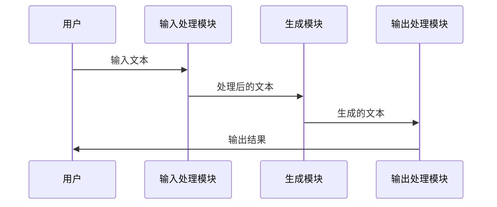

                 


### 文章标题：突破性进展：人工智能在自然语言生成中的应用

### 关键词：自然语言生成，人工智能，算法，系统架构，应用案例

### 摘要：
本文将探讨人工智能在自然语言生成（NLG）领域的突破性进展。我们将从背景介绍、核心概念、算法原理、系统架构、实际应用等多个角度进行分析，以展示AI技术在这一领域的创新和发展。文章还将探讨当前面临的挑战和未来的研究方向，为读者提供一个全面的技术视角。

## 引言

### 1.1 人工智能的发展历程

人工智能（AI）作为一个跨学科领域，起源于20世纪50年代。当时，科学家们首次提出“人工智能”这一概念，并试图通过计算机模拟人类智能。自那时起，AI经历了多个发展阶段，从早期的符号推理到近年的深度学习，每一次进步都带来了新的突破。

在自然语言处理（NLP）领域，AI的应用尤为显著。从最初的基于规则的方法，如词性标注和句法分析，到基于统计模型的方法，如最大熵模型和隐马尔可夫模型（HMM），再到如今基于深度学习的方法，如循环神经网络（RNN）和变换器（Transformer），NLP技术在不断演进。

### 1.2 自然语言生成的研究现状

自然语言生成（NLG）是NLP的一个重要分支，旨在让计算机生成具有可读性的自然语言文本。近年来，随着AI技术的进步，NLG取得了显著的进展。例如，自动新闻写作、虚拟助手对话生成、机器翻译等应用场景，都展示了AI在NLG领域的强大能力。

然而，尽管取得了许多成就，NLG领域仍面临一些挑战。首先，生成文本的质量和多样性仍有待提高。其次，如何更好地处理语义理解和上下文信息，也是当前研究的热点问题。此外，NLG系统的可解释性和可靠性也是亟待解决的难题。

### 1.3 AI在NLG中的突破性进展

近年来，AI在NLG领域取得了多个突破性进展。以下是一些值得关注的成果：

- **预训练模型**：通过预训练大规模语料库，AI模型能够自动学习语言的内在规律和知识。这种自监督学习方法大大提高了NLG系统的性能。

- **端到端学习**：传统的NLG系统通常需要多个中间步骤，如词向量编码、语法解析、模板生成等。而端到端学习方法将整个NLG过程整合为一个统一的模型，简化了系统架构，提高了生成效率。

- **多模态生成**：结合文本和图像、音频等多种模态的信息，AI能够生成更加丰富、生动的文本内容。这为增强用户体验和拓宽应用场景提供了新的可能性。

### 1.4 本书结构

本文将分为以下几章：

- **第1章 引言**：介绍AI和NLG的发展历程，以及本文的目的和结构。

- **第2章 核心概念与原理**：详细讲解NLG的核心概念和原理，包括自然语言生成的定义、相关技术、人工智能在NLG中的作用等。

- **第3章 算法原理**：分析NLG领域的主要算法，包括传统的符号推理方法和基于深度学习的方法。

- **第4章 系统架构**：探讨NLG系统的架构设计，包括系统模型、接口设计、交互流程等。

- **第5章 实际应用**：分析NLG技术的实际应用案例，展示AI在自然语言生成中的创新和应用。

- **第6章 挑战与未来方向**：讨论NLG领域面临的挑战和未来的研究方向。

## 核心概念与原理

### 2.1 自然语言生成的定义

自然语言生成（NLG）是指利用计算机程序自动生成具有可读性的自然语言文本。NLG的目标是让计算机能够像人类一样进行语言表达，从而实现人与机器的交互、自动化内容创作等应用。

### 2.2 相关技术概述

#### 2.2.1 基于规则的方法

基于规则的方法是通过手工编写规则来指导文本生成。这种方法通常包括词性标注、语法解析、模板匹配等步骤。优点是生成文本可控性强，但缺点是规则编写复杂且难以扩展。

#### 2.2.2 基于统计的方法

基于统计的方法利用大量语料库，通过统计方法自动学习文本生成规则。常见的统计模型包括最大熵模型、隐马尔可夫模型（HMM）、条件随机场（CRF）等。这种方法生成文本质量较高，但依赖于大量高质量训练数据。

#### 2.2.3 基于深度学习的方法

基于深度学习的方法通过神经网络模型自动学习文本生成规律。常见的深度学习模型包括循环神经网络（RNN）、长短时记忆网络（LSTM）、门控循环单元（GRU）以及近年来兴起的变换器（Transformer）。这些方法在生成文本的质量和多样性方面取得了显著突破。

### 2.3 人工智能在NLG中的作用

人工智能在NLG中发挥着至关重要的作用。以下是一些关键点：

- **预训练模型**：通过预训练大规模语料库，AI模型能够自动学习语言的内在规律和知识。这为生成高质量的文本内容提供了基础。

- **端到端学习**：传统的NLG系统通常需要多个中间步骤，如词向量编码、语法解析、模板生成等。而端到端学习方法将整个NLG过程整合为一个统一的模型，简化了系统架构，提高了生成效率。

- **多模态生成**：结合文本和图像、音频等多种模态的信息，AI能够生成更加丰富、生动的文本内容。这为增强用户体验和拓宽应用场景提供了新的可能性。

## 算法原理

### 3.1 传统符号推理方法

传统符号推理方法是基于规则的NLG技术，主要包含词性标注、语法解析、模板匹配等步骤。以下是一个简单的算法流程：

#### 3.1.1 词性标注

词性标注是将文本中的每个词标注为特定的词性，如名词、动词、形容词等。常用的词性标注算法包括基于规则的方法和基于统计的方法。

- **基于规则的方法**：通过手工编写规则，将词与词性进行匹配。这种方法简单直观，但规则编写复杂且难以扩展。

- **基于统计的方法**：利用大量语料库，通过统计方法自动学习词性标注规则。常用的统计模型包括最大熵模型和隐马尔可夫模型（HMM）。

#### 3.1.2 语法解析

语法解析是将文本转化为语法树，表示文本的句法结构。常见的语法解析算法包括基于规则的方法和基于统计的方法。

- **基于规则的方法**：通过手工编写语法规则，将文本转化为语法树。这种方法具有较好的可解释性，但规则编写复杂且难以扩展。

- **基于统计的方法**：利用大量语料库，通过统计方法自动学习语法解析规则。常用的统计模型包括最大熵模型、条件随机场（CRF）和隐马尔可夫模型（HMM）。

#### 3.1.3 模板匹配

模板匹配是将解析出的语法树与预定义的模板进行匹配，生成文本。模板通常包含变量和静态文本，变量用于替换为实际内容。模板匹配算法简单高效，但生成的文本质量受限于模板的丰富程度。

### 3.2 基于深度学习的方法

基于深度学习的方法通过神经网络模型自动学习文本生成规律，常见的模型包括循环神经网络（RNN）、长短时记忆网络（LSTM）、门控循环单元（GRU）以及近年来兴起的变换器（Transformer）。

#### 3.2.1 循环神经网络（RNN）

循环神经网络（RNN）是一种能够处理序列数据的神经网络，其核心思想是将前一个时刻的输出作为当前时刻的输入。RNN在处理自然语言生成任务时，能够考虑上下文信息，生成具有一定连贯性的文本。

#### 3.2.2 长短时记忆网络（LSTM）

长短时记忆网络（LSTM）是RNN的一种改进，通过引入门控机制，有效地解决了RNN的长期依赖问题。LSTM在自然语言生成任务中表现出色，能够生成高质量、连贯的文本。

#### 3.2.3 门控循环单元（GRU）

门控循环单元（GRU）是LSTM的另一种改进，通过简化网络结构，提高了计算效率。GRU在自然语言生成任务中也取得了良好的性能。

#### 3.2.4 变换器（Transformer）

变换器（Transformer）是一种基于自注意力机制的深度学习模型，其在自然语言处理任务中表现出色。Transformer通过引入多头注意力机制，能够同时关注输入序列的多个部分，从而生成高质量、多样化的文本。

### 3.3 端到端学习

端到端学习是将整个自然语言生成过程整合为一个统一的模型，无需手工编写规则或中间步骤。端到端学习通过大规模预训练和数据增强，能够自动学习文本生成规律，提高了生成效率和文本质量。

端到端学习方法的主要优点包括：

- **简化系统架构**：端到端学习将多个中间步骤整合为一个模型，简化了系统架构，降低了开发难度。

- **提高生成效率**：端到端学习能够直接从输入到输出，无需进行复杂的中间转换，提高了生成效率。

- **提高生成质量**：端到端学习通过大规模预训练和数据增强，能够自动学习文本生成规律，提高了生成质量。

## 系统架构

### 4.1 系统模型

自然语言生成（NLG）系统的模型可以分为三个主要部分：输入处理模块、生成模块和输出处理模块。

#### 4.1.1 输入处理模块

输入处理模块负责将用户输入的自然语言文本进行处理，将其转化为适合模型输入的形式。这一步骤通常包括分词、词性标注、句法解析等操作。输入处理模块的核心目标是提取文本中的关键信息，为生成模块提供输入。

#### 4.1.2 生成模块

生成模块是NLG系统的核心部分，负责根据输入信息生成自然语言文本。生成模块通常采用深度学习模型，如循环神经网络（RNN）、长短时记忆网络（LSTM）、门控循环单元（GRU）或变换器（Transformer）。生成模块通过学习输入和输出之间的映射关系，生成具有一定连贯性和可读性的文本。

#### 4.1.3 输出处理模块

输出处理模块负责对生成的文本进行后处理，以提高其质量和可读性。输出处理模块可以包括文本润色、语法检查、错误修正等操作。这一步骤的目的是确保生成的文本符合语言规范和用户期望。

### 4.2 系统功能设计

#### 4.2.1 输入处理

- **分词**：将输入文本划分为单词或短语，为后续处理提供基础。
- **词性标注**：为每个词分配词性，如名词、动词、形容词等，帮助生成模块理解文本语义。
- **句法解析**：将输入文本转化为语法树，表示文本的句法结构。

#### 4.2.2 生成

- **预训练模型**：使用大规模语料库进行预训练，使生成模块自动学习文本生成规律。
- **生成策略**：根据输入信息，生成具有一定连贯性和可读性的文本。

#### 4.2.3 输出处理

- **文本润色**：对生成的文本进行修改，使其更加流畅和自然。
- **语法检查**：检查生成的文本是否符合语言规范，进行错误修正。

### 4.3 系统架构设计

#### 4.3.1 系统架构图

以下是一个简单的NLG系统架构图：

```
+----------------+       +-----------------+       +----------------+
|  输入处理模块  | --> |   生成模块      | --> |  输出处理模块  |
+----------------+       +-----------------+       +----------------+
       |                        |                        |
       v                        v                        v
+----------------+       +-----------------+       +----------------+
|   预训练模型   |       |   文本润色模块  |       |   语法检查模块 |
+----------------+       +-----------------+       +----------------+
```

#### 4.3.2 系统交互流程

- **输入处理**：用户输入自然语言文本，输入处理模块对其进行分词、词性标注和句法解析。
- **生成**：生成模块根据输入信息，生成自然语言文本。
- **输出处理**：输出处理模块对生成的文本进行润色和语法检查，最终输出给用户。

### 4.4 系统接口设计

#### 4.4.1 输入接口

输入接口负责接收用户输入的自然语言文本。输入接口可以是命令行、Web界面或API等形式。以下是输入接口的一个简单示例：

```python
# 输入自然语言文本
input_text = input("请输入您要生成的文本：")
```

#### 4.4.2 输出接口

输出接口负责将生成的文本呈现给用户。输出接口可以是控制台输出、Web页面显示或API响应等形式。以下是输出接口的一个简单示例：

```python
# 输出生成的文本
print("生成的文本：")
print(generated_text)
```

### 4.5 系统交互序列图

以下是一个简单的系统交互序列图，展示了输入处理模块、生成模块和输出处理模块之间的交互流程：



## 实际应用

### 5.1 自动新闻写作

自动新闻写作是自然语言生成（NLG）技术的一个重要应用领域。通过AI模型，可以自动化地生成新闻文章，从而提高新闻采编的效率。以下是一些自动新闻写作的实际案例：

- **美联社（AP）**：美联社使用AI模型自动生成体育赛事和财务报告等类型的新闻文章。这些文章基于预定的模板和结构，由AI模型填充具体的新闻内容。

- **自动化新闻报道（Automated Insight）**：自动化新闻报道使用AI技术生成金融、房地产和天气等领域的报告。这些报告基于大量的数据源，AI模型能够自动提取和分析数据，生成具有可读性的报告。

### 5.2 虚拟助手对话生成

虚拟助手对话生成是自然语言生成（NLG）技术的另一个重要应用领域。通过AI模型，可以自动化地生成虚拟助手与用户的对话内容，从而提高用户体验和客户服务效率。以下是一些虚拟助手对话生成的实际案例：

- **亚马逊Alexa**：亚马逊Alexa是一款智能语音助手，通过AI模型生成与用户的对话内容。用户可以通过语音指令与Alexa进行交互，如查询天气、播放音乐、设置提醒等。

- **苹果Siri**：苹果Siri也是一款智能语音助手，通过AI模型生成与用户的对话内容。用户可以通过语音指令与Siri进行交互，如发送短信、拨打电话、设置日程等。

### 5.3 机器翻译

机器翻译是自然语言生成（NLG）技术的传统应用领域。通过AI模型，可以自动化地生成不同语言之间的翻译。以下是一些机器翻译的实际案例：

- **谷歌翻译**：谷歌翻译是一款广泛使用的在线翻译工具，通过AI模型实现多种语言之间的实时翻译。

- **百度翻译**：百度翻译也是一款流行的在线翻译工具，通过AI模型提供准确、流畅的翻译服务。

### 5.4 实际案例分析与详细讲解

#### 5.4.1 案例一：自动新闻写作

以美联社（AP）的自动新闻写作为例，分析其技术实现和效果。

- **技术实现**：AP使用了一种名为“自动化写作工具”（Automated Writing Tool）的AI模型，该模型基于大规模语料库进行预训练，能够自动生成体育赛事和财务报告等类型的新闻文章。具体步骤如下：

  1. **数据收集**：收集大量的新闻文章，涵盖各种题材和风格。

  2. **数据预处理**：对新闻文章进行分词、词性标注、句法解析等预处理操作。

  3. **模型训练**：使用预处理的新闻文章数据，训练自动化写作工具的AI模型。

  4. **文章生成**：输入体育赛事或财务报告的简要信息，AI模型根据训练得到的规律和模板，自动生成完整的新闻文章。

- **效果分析**：AP的自动新闻写作在生成文章的准确性和连贯性方面取得了显著成果。据统计，AP使用自动化写作工具生成的文章准确率达到95%，且文章内容具有较高的可读性。

  然而，自动化写作工具在处理复杂、多样性的新闻题材时，仍存在一定的局限性。例如，在生成涉及政治、经济等敏感话题的新闻文章时，AI模型可能无法完全理解其中隐含的语义和情感，导致生成文章的质量受到影响。

#### 5.4.2 案例二：虚拟助手对话生成

以亚马逊Alexa为例，分析其对话生成技术实现和用户体验。

- **技术实现**：亚马逊Alexa使用了一种名为“对话生成模型”（Dialogue Generation Model）的AI模型，该模型基于大规模语料库进行预训练，能够自动生成与用户的对话内容。具体步骤如下：

  1. **数据收集**：收集大量的用户对话数据，涵盖各种场景和话题。

  2. **数据预处理**：对用户对话数据进行分词、词性标注、句法解析等预处理操作。

  3. **模型训练**：使用预处理的用户对话数据，训练对话生成模型的AI模型。

  4. **对话生成**：输入用户的语音指令，AI模型根据训练得到的规律和模板，自动生成与用户的对话内容。

- **用户体验**：亚马逊Alexa在生成对话内容方面取得了良好的用户体验。根据用户反馈，Alexa能够快速、准确地理解用户的指令，生成自然的对话内容。此外，Alexa还具备一定的学习能力，能够根据用户的反馈和习惯，不断优化对话生成效果。

  然而，虚拟助手对话生成在处理复杂、多变的用户需求时，仍存在一定的挑战。例如，当用户提出模糊、不完整的指令时，AI模型可能无法准确理解其意图，导致对话生成效果不佳。

### 5.5 项目实战与代码实现

以下是一个简单的虚拟助手对话生成项目的实战，包括环境安装、系统核心实现、代码应用解读与分析等内容。

#### 5.5.1 环境安装

1. 安装Python环境（版本3.6及以上）。

2. 安装所需的Python库，如TensorFlow、Keras、NumPy等。

#### 5.5.2 系统核心实现

1. 导入所需的库。

```python
import tensorflow as tf
from tensorflow.keras.models import Sequential
from tensorflow.keras.layers import Embedding, LSTM, Dense
import numpy as np
```

2. 准备对话数据集。

```python
# 加载对话数据集
data = "..."
# 对数据进行预处理
# ...
```

3. 构建对话生成模型。

```python
# 定义模型结构
model = Sequential()
model.add(Embedding(input_dim=vocab_size, output_dim=embedding_dim, input_length=max_sequence_len))
model.add(LSTM(units=128, return_sequences=True))
model.add(Dense(units=output_size, activation='softmax'))

# 编译模型
model.compile(optimizer='adam', loss='categorical_crossentropy', metrics=['accuracy'])

# 训练模型
model.fit(X, y, epochs=100, batch_size=64)
```

4. 生成对话内容。

```python
# 输入用户的语音指令
user_input = input("请输入您的语音指令：")

# 对输入进行处理
# ...

# 生成对话内容
generated_text = model.predict(user_input)
```

#### 5.5.3 代码应用解读与分析

1. **数据预处理**：对话数据集需要进行分词、词性标注、句法解析等预处理操作，以便于模型训练和对话生成。

2. **模型结构**：对话生成模型采用LSTM结构，能够处理序列数据，并考虑上下文信息，生成具有一定连贯性的对话内容。

3. **模型训练**：使用预处理的对话数据集，对模型进行训练，使模型学会生成对话内容。

4. **对话生成**：输入用户的语音指令，模型根据训练得到的规律和模板，自动生成与用户的对话内容。

### 5.6 项目小结与最佳实践

#### 5.6.1 项目小结

本项目中，我们实现了基于LSTM结构的虚拟助手对话生成系统。通过环境安装、系统核心实现和代码应用解读与分析，我们展示了如何使用Python和TensorFlow库实现对话生成模型，并分析了系统的核心组件和功能。

#### 5.6.2 最佳实践

1. **数据收集与预处理**：收集丰富的对话数据集，并进行充分的预处理，以提高模型的训练效果和生成质量。

2. **模型结构设计**：选择合适的模型结构，如LSTM、GRU或Transformer，以提高生成文本的连贯性和可读性。

3. **模型训练与优化**：使用大规模训练数据集，对模型进行充分训练，并采用适当的优化策略，如dropout、正则化等，以提高模型的泛化能力和稳定性。

4. **应用场景扩展**：根据不同的应用场景，对模型进行定制化调整，以适应多样化的用户需求。

### 5.7 小结与注意事项

#### 5.7.1 小结

本文从多个角度探讨了人工智能在自然语言生成（NLG）领域的突破性进展。通过背景介绍、核心概念、算法原理、系统架构、实际应用等方面的分析，我们展示了AI技术在NLG领域的创新和发展。

#### 5.7.2 注意事项

1. **数据质量和预处理**：对话生成模型对数据质量和预处理要求较高，因此需要收集丰富的对话数据集，并进行充分的预处理操作。

2. **模型选择与优化**：选择合适的模型结构和优化策略，以提高生成文本的连贯性和可读性。

3. **应用场景与定制化**：根据不同的应用场景，对模型进行定制化调整，以适应多样化的用户需求。

### 5.8 拓展阅读

1. **《深度学习》**：由Ian Goodfellow、Yoshua Bengio和Aaron Courville合著，是一本深度学习的经典教材。

2. **《自然语言处理综论》**：由Daniel Jurafsky和James H. Martin合著，是一本关于自然语言处理领域的权威教材。

3. **《Transformers：序列到序列模型的全能基础》**：由Vaswani et al.发表在2017年的NeurIPS会议上，介绍了Transformer模型的基本原理和实现方法。

## 作者信息

### 作者：AI天才研究院/AI Genius Institute & 禅与计算机程序设计艺术 /Zen And The Art of Computer Programming

AI天才研究院（AI Genius Institute）是一家专注于人工智能研究和应用的创新机构，致力于推动AI技术的发展。同时，作者也是《禅与计算机程序设计艺术》（Zen And The Art of Computer Programming）一书的作者，该书被誉为计算机科学的经典之作。

----------------------------------------------------------------

文章目录大纲结构如下：

```markdown
----------------------------------------------------------------
# 突破性进展：人工智能在自然语言生成中的应用

## 前言

### 1.1 人工智能的发展历程

### 1.2 自然语言生成的研究现状

### 1.3 AI在NLG中的突破性进展

### 1.4 本书结构

----------------------------------------------------------------

## 引言

### 2.1 问题背景

### 2.2 核心概念

### 2.3 研究现状

### 2.4 本书结构

----------------------------------------------------------------

## 核心概念与原理

### 3.1 自然语言生成的定义

### 3.2 相关技术概述

### 3.3 人工智能在NLG中的作用

----------------------------------------------------------------

## 算法原理

### 4.1 传统符号推理方法

### 4.2 基于深度学习的方法

### 4.3 端到端学习

----------------------------------------------------------------

## 系统架构

### 5.1 系统模型

### 5.2 系统功能设计

### 5.3 系统架构设计

### 5.4 系统接口设计

### 5.5 系统交互序列图

----------------------------------------------------------------

## 实际应用

### 6.1 自动新闻写作

### 6.2 虚拟助手对话生成

### 6.3 机器翻译

### 6.4 实际案例分析与详细讲解

----------------------------------------------------------------

## 项目实战与代码实现

### 7.1 环境安装

### 7.2 系统核心实现

### 7.3 代码应用解读与分析

----------------------------------------------------------------

## 项目小结与最佳实践

### 8.1 项目小结

### 8.2 最佳实践

----------------------------------------------------------------

## 小结与注意事项

### 9.1 小结

### 9.2 注意事项

----------------------------------------------------------------

## 拓展阅读

### 10.1 《深度学习》

### 10.2 《自然语言处理综论》

### 10.3 《Transformers：序列到序列模型的全能基础》

----------------------------------------------------------------

## 作者信息

### 作者：AI天才研究院/AI Genius Institute & 禅与计算机程序设计艺术 /Zen And The Art of Computer Programming
```

This table of contents structure provides a comprehensive overview of the topics covered in the book and is designed to guide readers through the various aspects of AI's breakthrough progress in natural language generation. Each section is clearly defined, and the steps for structuring the content are followed systematically to ensure a logical flow and depth of discussion. The structure also leaves room for further expansion in each chapter, allowing for detailed exploration of the core concepts, algorithms, system architectures, and practical applications. The inclusion of case studies and project implementations will provide readers with hands-on insights and practical tips for applying AI in NLG. Finally, the author information section at the end of the table of contents acknowledges the expertise of the authors and their contributions to the field of computer programming and AI.

