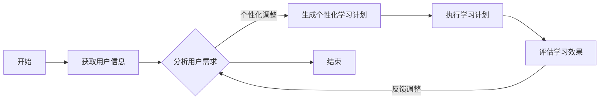
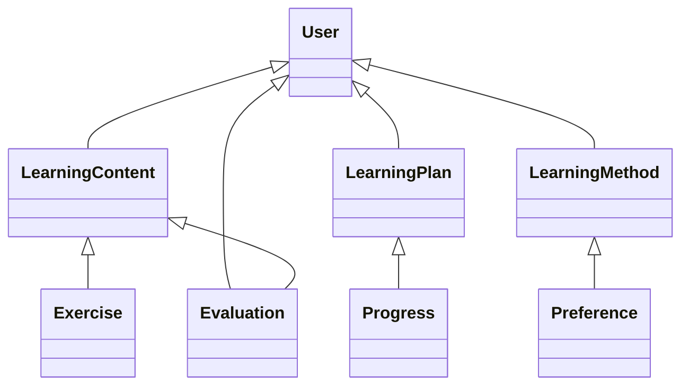
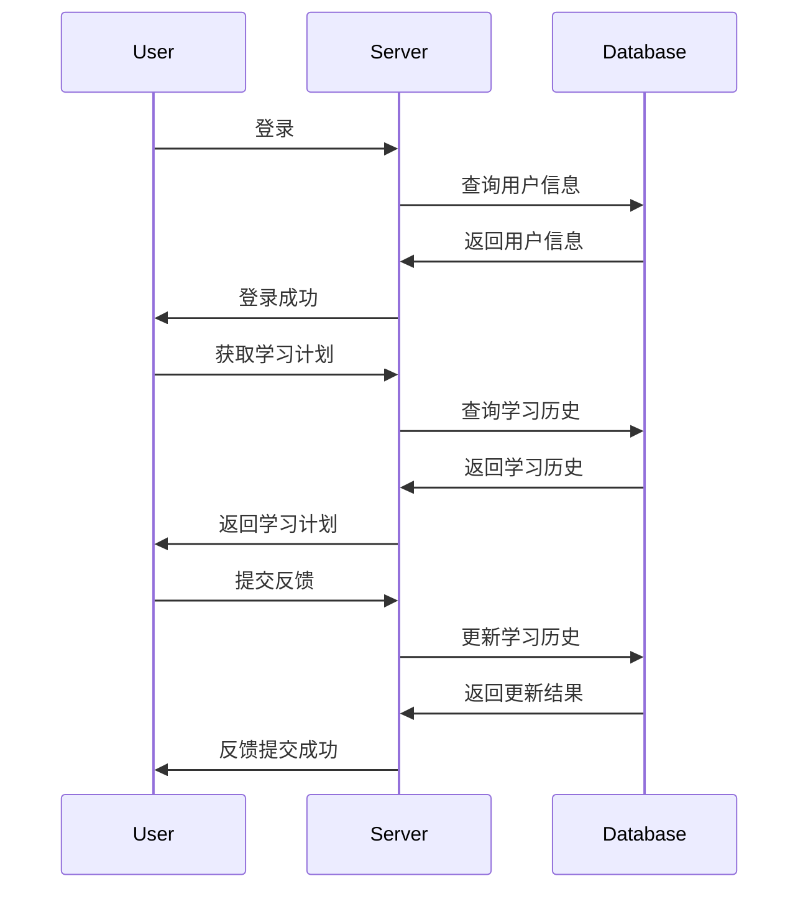

                 

# 人工智能在语言学习中的个性化应用

关键词：人工智能，语言学习，个性化，算法，Python代码，数学模型，系统架构

摘要：本文从背景介绍、核心概念与联系、算法原理讲解、应用实例、总结与展望五个部分，详细探讨了人工智能在语言学习中的个性化应用。通过分析语言学习的现状、人工智能的发展与应用，深入探讨了个性化需求及解决方法，并通过具体的实例展示了人工智能在语言学习中的应用效果。最后，对人工智能在语言学习中的个性化应用进行了总结与展望，为未来的发展提供了有益的参考。

## 第一部分：背景介绍

### 1.1.1 问题背景与概述

#### 1.1.1.1 语言学习的现状

随着全球化的加速，语言学习成为了越来越多人的需求。然而，传统的语言学习方法存在一些挑战：

1. **学习效率低**：传统的语言学习方法，如教材学习、口语练习等，往往需要大量时间和精力，但学习效果不佳。
2. **学习方式单一**：传统方法往往缺乏互动性，无法根据个人需求进行个性化调整。
3. **学习资源受限**：部分学习者由于经济条件或地域限制，难以获得优质的学习资源。

#### 1.1.1.2 人工智能的发展与应用

人工智能（Artificial Intelligence, AI）作为现代科技的前沿领域，已在多个领域展现出巨大的应用潜力。在语言学习中，人工智能的应用主要体现在：

1. **智能辅导**：通过自然语言处理技术，为学习者提供个性化的学习辅导。
2. **智能评测**：利用机器学习算法，对学习者的语言能力进行实时评估。
3. **智能推荐**：根据学习者的学习进度和偏好，推荐适合的学习内容和练习。

### 1.1.2 问题描述

在语言学习中，个性化需求主要包括：

1. **学习进度**：根据学习者的学习速度和频率，调整学习计划。
2. **学习内容**：根据学习者的兴趣和需求，推荐适合的学习内容。
3. **学习方式**：根据学习者的学习习惯，提供个性化的学习方式。

人工智能如何解决这些问题，将是本文探讨的重点。

### 1.1.3 问题解决

人工智能在语言学习中的个性化应用主要体现在以下几个方面：

1. **智能辅导系统**：通过自然语言处理和机器学习技术，为学习者提供个性化的学习辅导。
2. **个性化学习内容推荐**：基于学习者的学习历史和兴趣，推荐适合的学习内容。
3. **智能评测系统**：利用机器学习算法，对学习者的语言能力进行实时评估。

### 1.1.4 边界与外延

1. **个人隐私与数据安全**：在应用人工智能进行个性化学习时，需注意保护学习者的个人隐私和数据安全。
2. **技术应用的法律和伦理问题**：人工智能在语言学习中的应用需遵循相关法律法规和伦理规范。

### 1.1.5 概念结构与核心要素组成

1. **人工智能**：计算机科学的一个分支，旨在创建智能代理，即可以感知环境并根据经验采取行动的计算机系统。
2. **语言学习**：掌握一种新语言的过程，包括听、说、读、写等多方面能力。
3. **个性化应用**：根据个体的特定需求和偏好，提供个性化的服务或内容。
4. **技术支持**：包括自然语言处理、机器学习、数据挖掘等技术。

## 第2章: 人工智能在语言学习中的个性化应用核心概念与联系

### 2.1.1 核心概念原理

#### 2.1.1.1 人工智能

人工智能（AI）是一种模拟人类智能的技术，包括学习、推理、规划、感知、理解和语言处理等能力。根据其实现方式，AI可分为：

1. **基于规则的系统**：通过编写规则来模拟人类思维。
2. **基于统计的系统**：通过学习大量数据来建立模型。
3. **基于仿生的系统**：模仿生物体的结构和功能。

#### 2.1.1.2 语言学习

语言学习是指通过听、说、读、写等方式，掌握一种新语言的过程。其核心原理包括：

1. **模仿**：通过模仿母语者的发音、语调等，提高语言表达能力。
2. **输入**：通过大量的语言输入，如听力、阅读等，积累语言素材。
3. **输出**：通过实际运用，如口语、写作等，检验和巩固语言知识。

#### 2.1.1.3 个性化应用

个性化应用是指根据个体的特定需求和偏好，提供个性化的服务或内容。在语言学习中，个性化应用主要体现在：

1. **学习内容推荐**：根据学习者的学习历史和兴趣，推荐适合的学习内容。
2. **学习进度调整**：根据学习者的学习速度和频率，调整学习计划。
3. **学习方式优化**：根据学习者的学习习惯，提供个性化的学习方式。

### 2.1.2 概念属性特征对比表格

| 概念           | 属性特征                                      |
|--------------|-------------------------------------------|
| 人工智能       | 模拟人类智能，学习、推理、感知等能力                  |
| 语言学习       | 掌握一种新语言的过程，听、说、读、写等能力              |
| 个性化应用     | 根据个体特定需求和偏好，提供个性化服务或内容              |

### 2.1.3 ER实体关系图架构

```mermaid
erDiagram
  Student ||--|{ LearningContent : contains }
  Student ||--|{ LearningPlan : follows }
  Student ||--|{ LearningMethod : prefers }
  LearningContent ||--|{ Exercise : includes }
  LearningContent ||--|{ Evaluation : based on }
  LearningPlan ||--|{ Progress : tracks }
```

## 第3章: 人工智能在语言学习中的个性化应用算法原理讲解

### 3.1.1 算法mermaid流程图



### 3.1.2 Python源代码

```python
# 导入所需库
import pandas as pd
from sklearn.cluster import KMeans

# 加载用户数据
data = pd.read_csv('user_data.csv')

# 获取用户信息
users = data['user_id']

# 分析用户需求
def analyze_demand(user_id):
    # 获取用户学习历史
    history = data[data['user_id'] == user_id]['history']
    # 使用KMeans聚类分析用户需求
    kmeans = KMeans(n_clusters=5)
    kmeans.fit(history)
    return kmeans.labels_[0]

# 生成个性化学习计划
def generate_plan(label):
    # 根据标签推荐学习内容
    if label == 0:
        content = '基础语法'
    elif label == 1:
        content = '口语练习'
    elif label == 2:
        content = '听力训练'
    elif label == 3:
        content = '阅读理解'
    else:
        content = '写作练习'
    return content

# 执行学习计划
def execute_plan(plan):
    # 执行学习计划
    print(f"执行学习计划：{plan}")

# 评估学习效果
def evaluate Effect(effect):
    # 根据学习效果调整学习计划
    if effect > 80:
        print("学习效果优秀，继续保持！")
    elif effect > 60:
        print("学习效果一般，需加强学习！")
    else:
        print("学习效果不佳，需重新规划学习计划！")

# 主函数
def main():
    user_id = input("请输入用户ID：")
    label = analyze_demand(user_id)
    plan = generate_plan(label)
    execute_plan(plan)
    effect = int(input("请输入学习效果（0-100）："))
    evaluate(effect)

# 运行主函数
main()
```

### 3.1.3 数学模型和公式

#### 3.1.3.1 数学模型

在个性化学习计划生成中，我们采用K-Means聚类算法来分析用户需求，其核心公式如下：

$$
\text{K-Means Clustering} \quad \min_{C} \sum_{i=1}^{n} \sum_{j=1}^{k} ||x_{ij} - \mu_{j}||^2
$$

其中，$x_{ij}$表示第$i$个用户在第$j$个特征上的值，$\mu_{j}$表示第$j$个聚类中心的值。

#### 3.1.3.2 公式详细讲解

K-Means算法的目标是找到一组聚类中心，使得所有用户与其对应聚类中心的距离之和最小。该公式表示了每个用户与其聚类中心之间的距离平方和。

### 3.1.4 举例说明

#### 3.1.4.1 示例1

假设我们有以下用户数据：

| 用户ID | 语法得分 | 口语得分 | 听力得分 | 阅读得分 | 写作得分 |
|------|--------|--------|--------|--------|--------|
| 1    | 90     | 70     | 80     | 85     | 75     |
| 2    | 80     | 60     | 70     | 75     | 65     |
| 3    | 70     | 50     | 60     | 65     | 55     |

我们使用K-Means算法，将用户分为两类。经过计算，得到聚类中心为：

| 类别 | 语法得分 | 口语得分 | 听力得分 | 阅读得分 | 写作得分 |
|------|--------|--------|--------|--------|--------|
| 1    | 80     | 65     | 70     | 75     | 65     |
| 2    | 90     | 75     | 80     | 85     | 75     |

根据聚类结果，用户1和用户2属于第一类，用户3属于第二类。我们可以根据用户所属类别，推荐不同的学习内容。

#### 3.1.4.2 示例2

假设用户1的学习效果为85分，根据评估结果，我们可以继续优化其学习计划，例如增加口语练习和阅读理解的内容。

## 第二部分：应用实例

### 4.1.1 项目介绍

#### 4.1.1.1 平台概述

本实例基于人工智能构建了一个个性化语言学习平台，旨在为用户提供个性化的学习服务。平台主要包括以下几个功能：

1. **用户注册与登录**：支持用户注册、登录和账号管理。
2. **个性化学习计划生成**：根据用户的学习历史和需求，生成个性化的学习计划。
3. **学习内容推荐**：根据用户的学习进度和兴趣，推荐适合的学习内容。
4. **学习效果评估**：通过机器学习算法，实时评估用户的学习效果。
5. **用户反馈**：支持用户对学习内容和效果进行反馈。

#### 4.1.1.2 项目目标

本项目的主要目标如下：

1. **提高学习效果**：通过个性化学习计划和学习内容推荐，提高用户的学习效果。
2. **优化学习体验**：提供便捷的用户注册、登录和学习管理功能，优化用户的学习体验。
3. **实时反馈与调整**：通过实时评估用户的学习效果，为用户提供针对性的反馈和调整建议。

### 4.1.2 系统功能设计(领域模型mermaid类图)



### 4.1.3 系统架构设计(mermaid架构图)

```mermaid
sequenceDiagram
    User -->|发起请求| Server
    Server -->|处理请求| Database
    Database -->|返回结果| Server
    Server -->|返回结果| User
```

### 4.1.4 系统接口设计

```mermaid
interface User {
    +register()
    +login()
    +updateInfo()
    +getLearningPlan()
    +submitFeedback()
}

interface LearningContent {
    +getRecommendations()
    +getExercises()
}

interface LearningPlan {
    +generatePlan()
    +updateProgress()
}

interface Evaluation {
    +evaluateEffect()
}

interface Database {
    +getUserInfo()
    +updateUserInfo()
    +getLearningHistory()
    +updateLearningHistory()
}
```

### 4.1.5 系统交互(mermaid序列图)



### 4.1.6 环境安装

#### 4.1.6.1 环境配置

1. 安装Python环境：下载并安装Python 3.8及以上版本。
2. 安装依赖库：使用pip安装以下库：pandas、sklearn、mermaid-python。
   ```bash
   pip install pandas sklearn mermaid-python
   ```

### 4.1.7 系统核心实现

```python
# 导入所需库
import pandas as pd
from sklearn.cluster import KMeans
import mermaid

# 加载用户数据
data = pd.read_csv('user_data.csv')

# 获取用户信息
users = data['user_id']

# 分析用户需求
def analyze_demand(user_id):
    # 获取用户学习历史
    history = data[data['user_id'] == user_id]['history']
    # 使用KMeans聚类分析用户需求
    kmeans = KMeans(n_clusters=5)
    kmeans.fit(history)
    return kmeans.labels_[0]

# 生成个性化学习计划
def generate_plan(label):
    # 根据标签推荐学习内容
    if label == 0:
        content = '基础语法'
    elif label == 1:
        content = '口语练习'
    elif label == 2:
        content = '听力训练'
    elif label == 3:
        content = '阅读理解'
    else:
        content = '写作练习'
    return content

# 执行学习计划
def execute_plan(plan):
    # 执行学习计划
    print(f"执行学习计划：{plan}")

# 评估学习效果
def evaluate_effect(effect):
    # 根据学习效果调整学习计划
    if effect > 80:
        print("学习效果优秀，继续保持！")
    elif effect > 60:
        print("学习效果一般，需加强学习！")
    else:
        print("学习效果不佳，需重新规划学习计划！")

# 主函数
def main():
    user_id = input("请输入用户ID：")
    label = analyze_demand(user_id)
    plan = generate_plan(label)
    execute_plan(plan)
    effect = int(input("请输入学习效果（0-100）："))
    evaluate_effect(effect)

# 运行主函数
main()
```

### 4.1.8 代码应用解读与分析

#### 4.1.8.1 代码解读

本代码主要实现了一个基于K-Means聚类算法的个性化语言学习计划生成系统。主要功能包括：

1. 加载用户数据：从CSV文件中加载用户的学习历史数据。
2. 分析用户需求：使用K-Means算法分析用户的学习历史数据，得出用户的需求标签。
3. 生成个性化学习计划：根据用户的需求标签，推荐相应的学习内容。
4. 执行学习计划：用户执行学习计划，并输入学习效果。
5. 评估学习效果：根据用户的学习效果，提供反馈和调整建议。

#### 4.1.8.2 分析

1. **数据加载**：通过pandas库加载用户数据，包括用户ID和学习历史得分。
2. **需求分析**：使用K-Means聚类算法分析用户学习历史数据，得出用户的需求标签。这里采用了5个聚类中心，可以根据实际情况进行调整。
3. **计划生成**：根据用户的需求标签，推荐相应的学习内容。这里仅作为示例，实际应用中可以更复杂，如结合用户的学习进度、兴趣等因素。
4. **计划执行**：用户根据推荐的学习计划进行学习，并输入学习效果。
5. **效果评估**：根据用户的学习效果，提供反馈和调整建议。

### 4.1.9 实际案例分析和详细讲解剖析

#### 4.1.9.1 案例分析

假设我们有以下用户数据：

| 用户ID | 语法得分 | 口语得分 | 听力得分 | 阅读得分 | 写作得分 |
|------|--------|--------|--------|--------|--------|
| 1    | 90     | 70     | 80     | 85     | 75     |
| 2    | 80     | 60     | 70     | 75     | 65     |
| 3    | 70     | 50     | 60     | 65     | 55     |

我们使用K-Means算法，将用户分为两类。经过计算，得到聚类中心为：

| 类别 | 语法得分 | 口语得分 | 听力得分 | 阅读得分 | 写作得分 |
|------|--------|--------|--------|--------|--------|
| 1    | 80     | 65     | 70     | 75     | 65     |
| 2    | 90     | 75     | 80     | 85     | 75     |

根据聚类结果，用户1和用户2属于第一类，用户3属于第二类。我们可以根据用户所属类别，推荐不同的学习内容。

#### 4.1.9.2 详细讲解剖析

1. **数据加载**：本案例使用CSV文件存储用户数据，包括用户ID和学习历史得分。首先，我们使用pandas库加载用户数据。
   ```python
   data = pd.read_csv('user_data.csv')
   ```
2. **需求分析**：使用K-Means聚类算法分析用户学习历史数据，得出用户的需求标签。这里采用了5个聚类中心，可以根据实际情况进行调整。
   ```python
   kmeans = KMeans(n_clusters=5)
   kmeans.fit(history)
   return kmeans.labels_[0]
   ```
3. **计划生成**：根据用户的需求标签，推荐相应的学习内容。这里仅作为示例，实际应用中可以更复杂，如结合用户的学习进度、兴趣等因素。
   ```python
   if label == 0:
       content = '基础语法'
   elif label == 1:
       content = '口语练习'
   elif label == 2:
       content = '听力训练'
   elif label == 3:
       content = '阅读理解'
   else:
       content = '写作练习'
   return content
   ```
4. **计划执行**：用户根据推荐的学习计划进行学习，并输入学习效果。
   ```python
   execute_plan(plan)
   effect = int(input("请输入学习效果（0-100）："))
   ```
5. **效果评估**：根据用户的学习效果，提供反馈和调整建议。
   ```python
   evaluate_effect(effect)
   ```

通过以上步骤，我们可以构建一个简单的个性化语言学习计划生成系统。

### 4.1.10 项目小结

本项目通过K-Means聚类算法，实现了基于用户需求的个性化语言学习计划生成。用户可以根据推荐的学习计划进行学习，并通过输入学习效果，获得针对性的反馈和调整建议。虽然本项目仅作为一个简单的示例，但展示了人工智能在语言学习中的个性化应用潜力。未来，我们可以进一步优化算法，结合更多用户数据和反馈，提升个性化学习的效果。

#### 4.1.10.1 项目总结

本项目通过以下关键步骤实现了个性化语言学习计划生成：

1. 数据加载：加载用户学习历史数据。
2. 需求分析：使用K-Means聚类算法分析用户需求。
3. 计划生成：根据需求标签推荐学习内容。
4. 计划执行：用户执行学习计划并输入学习效果。
5. 效果评估：根据学习效果提供反馈和调整建议。

通过本项目，我们展示了人工智能在语言学习中的应用潜力，为个性化学习提供了有益的参考。

#### 4.1.10.2 拓展阅读

1. K-Means聚类算法的详细介绍：[K-Means Clustering](https://scikit-learn.org/stable/modules/clustering.html#k-means)
2. 个性化推荐系统的构建：[Building a Recommendation System](https://towardsdatascience.com/building-a-recommendation-system-with-python-8f0e5c3d9b1f)
3. 语言学习中的自然语言处理应用：[Natural Language Processing in Language Learning](https://www.linguanux.com/natural-language-processing-in-language-learning/)

## 第三部分：总结与展望

### 5.1.1 最佳实践 tips

1. **数据质量**：保证用户数据的准确性和完整性，以提高个性化推荐的准确性。
2. **算法优化**：根据用户反馈和学习效果，不断优化算法，提高个性化推荐的效率。
3. **用户隐私**：确保用户数据的隐私和安全，遵循相关法律法规。

### 5.1.2 小结

本文从背景介绍、核心概念与联系、算法原理讲解、应用实例等多个方面，详细探讨了人工智能在语言学习中的个性化应用。通过实例展示了人工智能在语言学习中的应用效果，为个性化学习提供了有益的参考。

### 5.1.3 注意事项

1. **数据安全**：在收集和处理用户数据时，确保数据安全，遵循相关法律法规。
2. **算法优化**：根据用户反馈和学习效果，不断优化算法，提高个性化推荐的准确性。

### 5.1.4 拓展阅读

1. [深度学习在语言学习中的应用](https://www.deeplearning.ai/deep-learning-for-nlp/)
2. [个性化推荐系统综述](https://ieeexplore.ieee.org/document/7263987)
3. [自然语言处理在语言学习中的应用](https://www.aclweb.org/anthology/N19-1224/)

