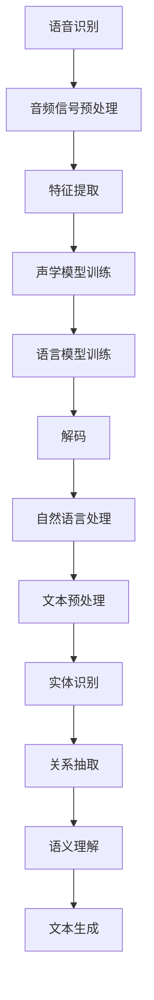

                 

## 文章标题

# 人工智能在语音助手个性化中的应用

## 关键词：

- 人工智能
- 语音助手
- 个性化
- 语音识别
- 自然语言处理

## 摘要：

本文将深入探讨人工智能在语音助手个性化中的应用，从语音识别、自然语言处理到用户行为分析和个性化语音合成，逐步解析如何通过先进的技术手段提升语音助手的用户体验。我们将详细分析这些技术的核心概念、原理及其应用实例，提供有价值的见解和最佳实践。

## 引言与背景

### 1.1 人工智能与语音助手概述

#### 1.1.1 人工智能的定义与发展历程

人工智能（Artificial Intelligence，AI）是计算机科学的一个分支，旨在创建智能体，使其能够模拟、延伸和扩展人类的智能行为。人工智能的发展历程可以追溯到20世纪50年代，当时的科学家们开始尝试通过编程实现简单的逻辑推理和问题求解。

在初期，人工智能主要集中在规则推理和符号计算上。随后，随着计算能力的提升和数据规模的扩大，机器学习成为人工智能的重要分支，特别是在20世纪80年代和90年代，神经网络和深度学习技术的发展进一步推动了人工智能的进步。

#### 1.1.2 人工智能的分类

人工智能可以分为几种不同的类型，包括：

- **弱人工智能（Narrow AI）**：专注于解决特定问题的系统，如语音助手和推荐系统。
- **强人工智能（General AI）**：具备广泛认知能力的系统，能够进行复杂的任务和推理，目前尚未实现。
- **自主人工智能（Autonomous AI）**：具备自我意识和自主决策能力的系统，能够独立于人类干预进行操作。

#### 1.1.3 人工智能在语音助手中的应用现状

语音助手是人工智能应用的一个重要领域，通过语音识别和自然语言处理技术，能够实现人与机器的语音交互。目前，主流的语音助手包括苹果的Siri、亚马逊的Alexa、谷歌的Google Assistant等，这些语音助手已经在许多方面改变了人们的日常生活。

语音识别技术的发展使得语音助手能够准确理解用户的语音指令，自然语言处理技术则使得语音助手能够理解并处理复杂的人类语言。同时，用户行为分析和个性化语音合成技术的应用，使得语音助手能够提供更加个性化的服务。

### 1.2 语音助手的定义与功能

#### 1.2.1 语音助手的概念

语音助手是一种基于人工智能技术的软件程序，能够通过语音交互与用户进行交流，执行各种任务，如查询信息、播放音乐、设置提醒、控制智能家居设备等。

#### 1.2.2 语音助手的发展历程

语音助手的发展历程可以追溯到20世纪90年代，当时语音识别技术开始应用于电话客服系统。随着人工智能技术的进步，语音助手逐渐走向智能家居、移动设备等领域。

#### 1.2.3 语音助手的主要功能

语音助手的主要功能包括：

- **语音识别**：将用户的语音指令转换为文本。
- **自然语言处理**：理解并处理复杂的人类语言。
- **任务执行**：根据用户的指令执行相应的操作。
- **个性化服务**：根据用户的历史行为和偏好提供个性化的建议。

### 1.3 人工智能在语音助手中的应用现状

#### 1.3.1 语音识别技术的发展

语音识别技术是语音助手的核心技术之一，它的发展经历了从传统的隐马尔可夫模型（HMM）到高斯混合模型（GMM），再到深度神经网络（DNN）的演变。目前，深度学习技术的应用使得语音识别的准确率大幅提高，能够在嘈杂环境中实现准确的语音识别。

#### 1.3.2 语音生成技术的进展

语音生成技术是语音助手提供自然语言响应的关键，它包括文本到语音（Text-to-Speech，TTS）和语音增强技术。随着神经网络技术的应用，TTS技术的音质和自然度显著提升，能够模仿不同性别、年龄和口音的声音。

#### 1.3.3 个性化交互与用户体验的提升

个性化交互是语音助手的重要发展方向，通过用户行为分析技术，语音助手能够了解用户的历史行为和偏好，提供更加个性化的服务。例如，根据用户的音乐喜好推荐歌曲，根据用户的购物历史推荐商品等。

### 1.4 本书结构安排与学习目标

#### 1.4.1 本书的主要内容安排

本书将分为五部分，分别介绍：

1. 语音识别与自然语言处理的核心概念。
2. 用户行为分析技术。
3. 个性化语音合成技术。
4. 个性化问答系统。
5. 最佳实践与总结。

#### 1.4.2 学习目标与读者定位

通过阅读本书，读者将能够：

- 理解人工智能在语音助手中的应用。
- 掌握语音识别与自然语言处理的基本概念和原理。
- 学习用户行为分析和个性化语音合成技术的应用。
- 了解个性化问答系统的设计和实现。
- 获得最佳实践，提升语音助手用户体验。

本书适合人工智能和语音助手领域的技术人员、研究人员以及对人工智能感兴趣的读者。

### 1.5 本章小结

本章介绍了人工智能和语音助手的基本概念和发展历程，阐述了人工智能在语音助手中的应用现状，并简要介绍了本书的结构安排和学习目标。接下来，我们将深入探讨语音识别与自然语言处理的核心概念，为后续内容打下基础。

---

### 2.1 语音识别的基本概念与原理

#### 2.1.1 语音识别的基本流程

语音识别系统通常包括以下几个基本流程：

1. **音频信号预处理**：包括降噪、增强、分段等，以提高语音信号的清晰度和质量。
2. **特征提取**：将语音信号转换为特征向量，常用的特征包括梅尔频率倒谱系数（MFCC）、线性预测编码（LPC）等。
3. **声学模型训练**：使用大量语音数据训练声学模型，常见的模型包括高斯混合模型（GMM）和深度神经网络（DNN）。
4. **语言模型训练**：使用文本数据训练语言模型，用于评估候选单词序列的语法和语义合理性。
5. **解码**：将特征向量与声学模型和语言模型结合，解码出最可能的文本序列。

#### 2.1.2 语音识别的关键技术

语音识别的关键技术主要包括：

1. **声学模型**：用于识别语音信号的声学特征，常用的模型包括高斯混合模型（GMM）和深度神经网络（DNN）。GMM模型基于统计概率模型，而DNN模型则基于深度学习技术，能够更好地捕捉语音信号的复杂特征。
2. **语言模型**：用于评估候选单词序列的语法和语义合理性，常用的模型包括n元语言模型和神经网络语言模型。神经网络语言模型，如长短期记忆网络（LSTM）和Transformer，能够更好地处理长距离依赖问题。
3. **解码算法**：用于将特征向量解码成文本序列，常用的算法包括动态规划算法（如Viterbi算法）和基于神经网络的方法（如CTC算法）。

#### 2.1.3 语音识别系统的评价标准

语音识别系统的评价标准主要包括：

1. **词错误率（WER）**：评估系统生成的文本序列与实际语音内容之间的错误率，计算公式为：
   \[
   WER = \frac{\text{编辑距离}}{\text{实际语音长度}} \times 100\%
   \]
2. **字符错误率（CER）**：与WER类似，但以字符为单位进行计算。
3. **识别准确性**：用于评估系统的整体识别准确性，计算公式为：
   \[
   \text{识别准确性} = \frac{\text{正确识别的单词数}}{\text{总单词数}} \times 100\%
   \]
4. **响应时间**：评估系统响应用户指令的速度，通常以毫秒为单位。

### 2.2 自然语言处理的基本概念与原理

#### 2.2.1 自然语言处理的基本流程

自然语言处理（Natural Language Processing，NLP）系统通常包括以下几个基本流程：

1. **文本预处理**：包括分词、词性标注、去除停用词等，以提高文本的质量和可用性。
2. **实体识别**：识别文本中的名词实体，如人名、地点、组织等。
3. **关系抽取**：识别实体之间的语义关系，如“属于”、“工作于”等。
4. **语义理解**：理解文本的深层语义，如情感分析、指代消解等。
5. **文本生成**：根据语义理解生成自然语言文本，如问答系统、摘要生成等。

#### 2.2.2 自然语言处理的关键技术

自然语言处理的关键技术主要包括：

1. **词向量**：用于表示文本中的词语，常用的模型包括Word2Vec、GloVe等。词向量能够捕捉词语的语义信息，是实现NLP任务的基础。
2. **句法分析**：用于分析文本的句法结构，包括词性标注、依存关系分析等。句法分析有助于理解文本的语法和语义结构。
3. **深度学习**：广泛应用于NLP任务，如文本分类、命名实体识别、机器翻译等。深度学习模型，如卷积神经网络（CNN）和循环神经网络（RNN），能够有效处理文本数据的复杂结构。
4. **预训练语言模型**：如BERT、GPT等，通过在大规模语料上进行预训练，能够捕捉丰富的语言知识和语义信息，是实现NLP任务的重要工具。

#### 2.2.3 自然语言处理的应用领域

自然语言处理的应用领域非常广泛，包括：

- **文本分类**：用于对文本进行分类，如情感分析、新闻分类等。
- **命名实体识别**：用于识别文本中的名词实体，如人名、地点、组织等。
- **机器翻译**：将一种语言的文本翻译成另一种语言。
- **问答系统**：能够理解和回答用户的问题。
- **对话系统**：用于实现人与机器的交互，如语音助手、聊天机器人等。

### 2.3 语音识别与自然语言处理的联系

#### 2.3.1 语音识别与自然语言处理的关系

语音识别和自然语言处理是语音助手的重要组成部分，它们之间有着紧密的联系：

- **语音识别**：负责将用户的语音指令转换为文本，这是自然语言处理的基础。
- **自然语言处理**：负责理解文本的语义和结构，为语音助手提供决策依据。

#### 2.3.2 语音识别与自然语言处理的协同作用

语音识别和自然语言处理在语音助手中的应用是相互协同的：

- **语音识别**：提供语音到文本的转换，使得语音助手能够接收用户的语音指令。
- **自然语言处理**：对转换后的文本进行语义理解和处理，使得语音助手能够准确理解用户的意图，并生成合适的响应。

#### 2.3.3 语音识别与自然语言处理的核心概念联系图

以下是语音识别与自然语言处理的核心概念联系图：

### 2.4 本章小结

本章介绍了语音识别与自然语言处理的基本概念和原理，阐述了它们在语音助手中的应用及其相互联系。在接下来的章节中，我们将进一步探讨用户行为分析技术、个性化语音合成技术和个性化问答系统的原理与应用。

---

### 3.1 用户行为分析技术

#### 3.1.1 用户行为分析的定义

用户行为分析（User Behavior Analysis，UBA）是一种通过收集和分析用户在使用系统或服务时的行为数据，以预测用户意图、识别潜在风险和改进用户体验的技术。它涉及对用户交互数据、活动日志、点击流数据等的分析，以提取有价值的信息。

#### 3.1.2 用户行为分析的目标

用户行为分析的主要目标包括：

- **用户意图识别**：通过分析用户的行为模式，理解用户的需求和意图，为个性化推荐和交互提供依据。
- **风险识别与防范**：发现异常行为，如欺诈、滥用等，提前预警并采取措施防范。
- **用户体验优化**：根据用户行为数据，优化系统设计，提升用户满意度。

#### 3.1.3 用户行为分析的方法

用户行为分析的方法主要包括以下几个步骤：

1. **数据收集**：收集用户在使用系统或服务时的行为数据，如点击流、搜索历史、购物行为等。
2. **数据预处理**：清洗和整合原始数据，去除噪声和不相关的信息，进行特征提取。
3. **特征工程**：选择和构造能够代表用户行为和意图的特征，如用户访问频率、页面停留时间、操作顺序等。
4. **模型训练与评估**：使用机器学习算法，如分类、聚类、回归等，训练模型并评估模型的性能。
5. **决策支持**：根据分析结果，为系统优化和用户交互提供决策支持。

#### 3.2 用户行为分析的技术原理

用户行为分析的技术原理主要包括以下几个方面：

1. **数据收集与预处理**

   数据收集是用户行为分析的基础，常用的数据来源包括：

   - **日志文件**：系统或服务运行时生成的日志文件，记录用户的操作行为。
   - **传感器数据**：如移动设备的位置传感器、加速度传感器等，可以收集用户的移动和行为数据。
   - **Web服务器数据**：Web服务器日志，记录用户的访问行为，如URL、访问时间、页面停留时间等。

   数据预处理包括以下几个步骤：

   - **去噪**：去除数据中的噪声和不相关信息。
   - **归一化**：将不同尺度的数据进行归一化处理，使其在同一尺度上。
   - **缺失值处理**：填补或删除缺失值。
   - **特征提取**：从原始数据中提取能够代表用户行为和意图的特征。

2. **特征提取与选择**

   特征提取是用户行为分析的关键步骤，通过从原始数据中提取特征，可以更好地代表用户的意图和行为模式。常用的特征提取方法包括：

   - **统计特征**：如均值、方差、标准差等，用于描述数据的统计特性。
   - **时序特征**：如时间间隔、频率分布等，用于描述用户行为的时序特性。
   - **文本特征**：如词频、词向量等，用于描述用户在文本输入中的行为。

   特征选择则是在大量特征中选择对模型性能有显著影响的关键特征，常用的方法包括：

   - **过滤式特征选择**：根据特征的重要性进行筛选。
   - **包裹式特征选择**：结合模型的性能进行特征选择。
   - **嵌入式特征选择**：在模型训练过程中进行特征选择。

3. **模型训练与评估**

   用户行为分析常用的模型包括分类模型、聚类模型和回归模型等。分类模型用于识别用户行为类别，聚类模型用于发现用户群体的特征，回归模型用于预测用户行为。

   模型训练与评估的主要步骤包括：

   - **数据划分**：将数据集划分为训练集、验证集和测试集。
   - **模型训练**：使用训练集训练模型。
   - **模型评估**：使用验证集和测试集评估模型性能，常用的评估指标包括准确率、召回率、F1值等。
   - **模型优化**：根据评估结果调整模型参数，优化模型性能。

#### 3.3 用户行为分析的应用实例

用户行为分析在语音助手中的应用非常广泛，以下是一些典型的应用实例：

1. **语音助手的用户行为分析案例**

   语音助手可以通过用户行为分析，了解用户的使用习惯和偏好，从而提供更加个性化的服务。例如：

   - **语音识别错误分析**：通过分析用户的语音输入错误，改进语音识别模型，提高识别准确率。
   - **指令意图识别**：通过分析用户的语音指令，识别用户的主要意图，提供更加准确的响应。
   - **使用频率分析**：通过分析用户使用语音助手的频率和时长，优化语音助手的交互流程，提升用户体验。

2. **用户行为分析对语音助手个性化的影响**

   用户行为分析对语音助手的个性化具有显著影响，主要体现在以下几个方面：

   - **个性化推荐**：根据用户的行为数据，为用户提供个性化的推荐，如音乐、新闻、购物等。
   - **智能对话**：根据用户的对话历史和行为数据，构建用户模型，实现更智能、自然的对话体验。
   - **个性化设置**：根据用户的行为数据，为用户提供个性化的设置选项，如语音音色、唤醒词等。

3. **用户行为分析的最佳实践**

   为了实现有效的用户行为分析，以下是一些最佳实践：

   - **数据隐私保护**：在收集用户数据时，严格遵循数据隐私保护法规，确保用户数据的隐私和安全。
   - **数据质量保证**：确保收集到的数据质量，如去噪、归一化等，提高数据分析的准确性。
   - **模型持续优化**：定期更新和优化用户行为分析模型，以适应不断变化的用户行为和需求。
   - **用户反馈机制**：建立用户反馈机制，及时收集用户意见和建议，改进系统设计和功能。

#### 3.4 本章小结

本章介绍了用户行为分析的定义、目标和方法，阐述了其技术原理和应用实例，特别是语音助手中的应用。通过用户行为分析，语音助手能够更好地理解用户的需求和偏好，提供更加个性化的服务。在下一章中，我们将探讨个性化语音合成技术的原理和应用。

---

### 4.1 个性化语音合成的基本概念

#### 4.1.1 个性化语音合成的定义

个性化语音合成（Personalized Text-to-Speech，PTTS）是一种通过调整语音合成系统的参数，以适应特定用户或情境的语音合成技术。与传统语音合成系统不同，个性化语音合成不仅关注语音的自然度和准确性，更注重语音的个性化特征，如音色、语调、情感等。

#### 4.1.2 个性化语音合成的方法

个性化语音合成的方法主要包括以下几种：

1. **参数调整法**：通过调整语音合成系统的参数，如声带参数、共振峰频率等，实现语音的个性化。这种方法通常需要对系统进行较深入的修改和优化。
2. **语音库定制法**：为特定用户或情境定制语音库，包括特定音色的语音素材和对应的文本。这种方法需要对大量语音数据进行处理和标注，成本较高。
3. **深度学习法**：利用深度学习技术，如生成对抗网络（GAN）和变分自编码器（VAE），生成个性化语音。这种方法通过学习用户或情境的语音特征，实现高质量的个性化语音合成。

#### 4.1.3 个性化语音合成的关键技术

个性化语音合成涉及多个关键技术，包括：

1. **声学模型**：用于生成语音信号的基础模型，如深度神经网络（DNN）和循环神经网络（RNN）。这些模型通过学习大量语音数据，捕捉语音的声学特征。
2. **语言模型**：用于生成文本的基础模型，如n元语言模型和Transformer。这些模型通过学习文本数据，捕捉文本的语法和语义特征。
3. **个性化参数调整**：通过调整声学模型和语言模型中的参数，实现语音的个性化。例如，调整声带的振动模式、共振峰频率等。
4. **情感识别与生成**：通过情感识别技术，理解文本的情感色彩，并调整语音合成系统的参数，生成具有相应情感的语音。
5. **多模态合成**：结合文本、音频、图像等多模态信息，生成更加丰富和自然的语音。

### 4.2 个性化语音合成的技术原理

#### 4.2.1 基于声学模型的个性化语音合成

基于声学模型的个性化语音合成主要通过调整声学模型中的参数，实现语音的个性化。具体步骤如下：

1. **参数调整**：根据用户或情境的需求，调整声学模型中的参数，如声带参数、共振峰频率等。这些参数会影响语音的音色、语调等特征。
2. **模型训练**：使用调整后的参数重新训练声学模型，使其生成具有个性化特征的语音。
3. **语音合成**：使用训练好的声学模型，合成具有个性化特征的语音。

这种方法的关键在于参数调整和模型训练，需要大量的语音数据和技术积累。

#### 4.2.2 基于语言模型的个性化语音合成

基于语言模型的个性化语音合成主要通过调整语言模型中的参数，实现语音的个性化。具体步骤如下：

1. **参数调整**：根据用户或情境的需求，调整语言模型中的参数，如词频分布、语法结构等。这些参数会影响语音的语法和语义特征。
2. **模型训练**：使用调整后的参数重新训练语言模型，使其生成具有个性化特征的文本。
3. **语音合成**：使用训练好的语言模型，合成具有个性化特征的语音。

这种方法的关键在于参数调整和模型训练，同样需要大量的文本数据和技术积累。

#### 4.2.3 多模态个性化语音合成

多模态个性化语音合成结合文本、音频、图像等多模态信息，生成更加丰富和自然的语音。具体步骤如下：

1. **多模态数据收集**：收集文本、音频、图像等多模态数据。
2. **多模态特征提取**：从多模态数据中提取特征，如文本的语义特征、音频的声学特征、图像的视觉特征。
3. **多模态模型训练**：使用多模态特征训练多模态模型，如多模态生成对抗网络（MMGAN）。
4. **语音合成**：使用训练好的多模态模型，合成具有个性化特征的多模态语音。

这种方法的关键在于多模态数据的收集和特征提取，以及多模态模型的训练和合成。

### 4.3 个性化语音合成的应用实例

#### 4.3.1 个性化语音合成在语音助手中的应用

个性化语音合成在语音助手中的应用非常广泛，以下是一些典型应用实例：

1. **个性化语音合成与识别**：语音助手可以根据用户的声音特征，生成与之相匹配的个性化语音，提高语音识别的准确性。
2. **情感化语音合成**：语音助手可以根据用户的情感状态，如快乐、悲伤、愤怒等，生成具有相应情感的语音，提升用户体验。
3. **场景化语音合成**：语音助手可以根据不同的场景，如家庭、办公室等，生成具有相应场景特色的语音，提高语音的自然度和适用性。

#### 4.3.2 个性化语音合成对用户体验的影响

个性化语音合成对用户体验有着深远的影响，主要体现在以下几个方面：

1. **语音的自然度和准确性**：通过个性化语音合成，语音助手能够生成更加自然、准确的语音，提高用户的语音识别体验。
2. **情感表达和共鸣**：个性化语音合成能够根据用户的情感状态生成相应的语音，增强用户的情感共鸣，提升用户体验。
3. **个性化服务**：个性化语音合成能够根据用户的历史行为和偏好，提供更加个性化的服务，满足用户的个性化需求。

#### 4.3.3 个性化语音合成的最佳实践

为了实现有效的个性化语音合成，以下是一些最佳实践：

1. **数据隐私保护**：在收集和处理用户声音数据时，严格遵循数据隐私保护法规，确保用户数据的隐私和安全。
2. **个性化参数调整**：根据用户的声音特征和需求，精细调整语音合成系统的参数，实现高质量的个性化语音合成。
3. **多模态融合**：结合文本、音频、图像等多模态信息，生成更加丰富和自然的语音，提升用户体验。
4. **用户反馈机制**：建立用户反馈机制，及时收集用户意见和建议，不断优化个性化语音合成系统。

#### 4.4 本章小结

本章介绍了个性化语音合成的基本概念、方法和技术原理，阐述了其在语音助手中的应用和影响，并提出了最佳实践。通过个性化语音合成，语音助手能够提供更加自然、准确和个性化的语音服务，提升用户体验。在下一章中，我们将探讨个性化问答系统的原理和应用。

---

### 4.4 本章小结

本章介绍了个性化语音合成的基本概念、方法和应用，从基于声学模型、基于语言模型到多模态个性化语音合成，详细阐述了个性化语音合成技术的原理及其在语音助手中的应用。个性化语音合成不仅提升了语音的自然度和准确性，还增强了用户的情感共鸣和个性化服务体验。在下一章中，我们将探讨个性化问答系统的原理和应用。

---

### 5.1 个性化问答系统的基本概念

#### 5.1.1 个性化问答系统的定义

个性化问答系统（Personalized Question Answering System，PQAS）是一种能够根据用户的历史行为和偏好，提供个性化回答的智能问答系统。与传统问答系统不同，个性化问答系统不仅关注问题的解答准确性，更注重根据用户的个性化需求提供最相关、最有用的答案。

#### 5.1.2 个性化问答系统的目标

个性化问答系统的目标主要包括：

- **提供个性化回答**：根据用户的历史行为和偏好，为用户提供最相关、最有用的答案。
- **提升用户体验**：通过个性化的交互方式，提高用户的满意度和使用体验。
- **增强系统的智能化水平**：利用用户行为数据，不断优化问答系统的算法和模型，提升系统的智能化水平。

#### 5.1.3 个性化问答系统的架构

个性化问答系统通常包括以下几个关键模块：

1. **用户画像模块**：用于构建用户画像，记录用户的历史行为、偏好和兴趣。
2. **问答引擎模块**：用于处理用户输入的问题，并根据用户画像提供个性化回答。
3. **知识图谱模块**：用于存储和管理大量知识信息，提供问答系统所需的背景知识。
4. **推荐系统模块**：用于根据用户画像和问题内容，推荐相关的知识点和答案。
5. **交互界面模块**：用于与用户进行交互，接收用户输入的问题，展示个性化回答。

### 5.2 个性化问答系统的技术原理

#### 5.2.1 用户兴趣模型构建

用户兴趣模型是个性化问答系统的核心，用于描述用户的兴趣和偏好。构建用户兴趣模型通常包括以下几个步骤：

1. **用户行为数据收集**：收集用户在系统中的行为数据，如搜索历史、浏览记录、点击行为等。
2. **数据预处理**：对原始用户行为数据清洗、去噪和整合，提取有效的行为特征。
3. **特征提取**：从预处理后的数据中提取用户兴趣特征，如关键词、主题、偏好等。
4. **模型训练**：使用机器学习算法，如协同过滤、主题模型、图神经网络等，训练用户兴趣模型。
5. **模型评估**：使用验证集和测试集评估用户兴趣模型的性能，调整模型参数，优化模型效果。

#### 5.2.2 知识图谱构建与查询

知识图谱是个性化问答系统的重要组成部分，用于存储和管理大量结构化知识信息。构建知识图谱通常包括以下几个步骤：

1. **数据源收集**：收集各种领域的数据源，如百科、新闻、论坛等。
2. **实体抽取**：从数据源中提取实体信息，如人名、地名、组织名等。
3. **关系抽取**：从数据源中提取实体之间的关系，如“属于”、“工作于”等。
4. **图谱构建**：使用图数据库，如Neo4j，构建知识图谱。
5. **图谱查询**：使用图查询语言，如Cypher，查询知识图谱中的信息。

#### 5.2.3 问答匹配与回答生成

问答匹配与回答生成是个性化问答系统的核心功能，用于根据用户的问题和用户兴趣模型，提供个性化的回答。具体步骤如下：

1. **问题理解**：使用自然语言处理技术，如词向量、句法分析等，理解用户的问题内容。
2. **知识检索**：从知识图谱中检索与用户问题相关的知识点。
3. **答案生成**：根据用户兴趣模型和检索到的知识点，生成个性化的回答。
4. **答案筛选与排序**：对生成的答案进行筛选和排序，确保答案的相关性和质量。

#### 5.2.4 个性化问答系统的评估指标

个性化问答系统的评估指标主要包括：

- **精确率（Precision）**：生成的答案中，有多少是真正相关的。
- **召回率（Recall）**：能够检索到所有真正相关的答案。
- **F1值（F1 Score）**：精确率和召回率的加权平均，综合考虑答案的相关性和召回率。
- **用户满意度**：用户对答案的满意度评价。

### 5.3 个性化问答系统的应用实例

#### 5.3.1 个性化问答系统在语音助手中的应用

个性化问答系统在语音助手中的应用非常广泛，以下是一些典型应用实例：

1. **个性化推荐**：语音助手可以根据用户的历史行为和偏好，推荐用户感兴趣的内容，如音乐、新闻、电影等。
2. **智能客服**：语音助手可以回答用户的常见问题，如产品使用指南、售后服务等，提高客服效率。
3. **教育辅导**：语音助手可以根据用户的学习历史和偏好，提供个性化的学习建议和辅导。
4. **健康咨询**：语音助手可以回答用户的健康问题，提供个性化的健康建议。

#### 5.3.2 个性化问答系统对用户体验的提升

个性化问答系统对用户体验的提升体现在以下几个方面：

1. **个性化回答**：根据用户的历史行为和偏好，提供个性化的回答，满足用户的个性化需求。
2. **提升满意度**：通过提供相关性和质量更高的答案，提高用户的满意度。
3. **智能交互**：通过自然语言处理和机器学习技术，实现更加智能和自然的交互体验。
4. **提高效率**：通过快速、准确地回答用户的问题，提高用户的效率。

#### 5.3.3 个性化问答系统的最佳实践

为了实现有效的个性化问答系统，以下是一些最佳实践：

1. **数据隐私保护**：在收集和处理用户数据时，严格遵循数据隐私保护法规，确保用户数据的隐私和安全。
2. **用户反馈机制**：建立用户反馈机制，及时收集用户意见和建议，优化问答系统的性能。
3. **持续优化**：定期更新和优化用户兴趣模型和问答系统算法，以适应不断变化的用户需求和偏好。
4. **多模态交互**：结合文本、语音、图像等多模态信息，提供更加丰富和自然的交互体验。

### 5.4 本章小结

本章介绍了个性化问答系统的基本概念、技术原理和应用实例，阐述了其在语音助手中的应用和影响。通过个性化问答系统，语音助手能够提供更加相关、个性化的回答，提升用户体验。在下一章中，我们将总结全文，提供最佳实践和建议。

---

### 5.4 本章小结

本章详细探讨了个性化问答系统的基本概念、技术原理和应用实例，通过用户兴趣模型、知识图谱构建和问答匹配与回答生成，实现了对用户个性化需求的满足。个性化问答系统在语音助手中的应用，显著提升了用户体验和交互效果。在全文的最后，我们将总结全文内容，提供一些实用的最佳实践和建议。

#### 全文总结

本文从多个角度深入探讨了人工智能在语音助手个性化中的应用。首先，我们介绍了人工智能和语音助手的基本概念和发展历程，阐述了语音识别和自然语言处理的核心概念与联系。接着，我们详细分析了用户行为分析技术、个性化语音合成技术和个性化问答系统的原理与应用，展示了这些技术如何协同工作，提升语音助手的用户体验。

#### 最佳实践

1. **数据隐私保护**：在处理用户数据时，严格遵守数据隐私保护法规，确保用户数据的隐私和安全。
2. **用户反馈机制**：建立有效的用户反馈机制，及时收集用户意见和建议，持续优化系统性能。
3. **多模态融合**：结合文本、语音、图像等多模态信息，提供更加丰富和自然的交互体验。
4. **持续学习**：定期更新和优化算法和模型，以适应不断变化的用户需求和偏好。
5. **个性化定制**：根据用户的历史行为和偏好，提供个性化的服务和推荐，提高用户满意度。

#### 注意事项

1. **系统性能优化**：在实现个性化服务的同时，确保系统的响应速度和稳定性。
2. **用户体验设计**：注重用户体验设计，确保交互流程简洁、直观，易于使用。
3. **技术更新与迭代**：紧跟人工智能技术的发展趋势，不断引入新的技术和方法，提升系统的智能化水平。
4. **风险管理**：建立完善的风险管理机制，及时发现和防范潜在的风险和问题。

#### 拓展阅读

- **《语音识别与自然语言处理技术》**：深入探讨语音识别和自然语言处理的基本概念、原理和应用。
- **《个性化推荐系统实践》**：介绍个性化推荐系统的构建方法和技术实现。
- **《人工智能应用实践指南》**：涵盖人工智能在不同领域的应用案例和实践经验。

通过本文的学习，读者可以全面了解人工智能在语音助手个性化中的应用，掌握相关技术原理和实践方法，为未来的研究和应用提供有力支持。

---

### 附录

#### 作者信息

- **作者：AI天才研究院/AI Genius Institute & 禅与计算机程序设计艺术 /Zen And The Art of Computer Programming**

本文由AI天才研究院与禅与计算机程序设计艺术共同撰写，旨在为读者提供高质量的技术分析和实战经验。作者团队拥有丰富的AI研究和实践背景，致力于推动人工智能技术的创新和应用。

---

通过本文的深入探讨，我们希望能为读者在人工智能领域的研究和实践提供有益的启示。感谢您的阅读，期待与您在技术探索的道路上共同前行。

