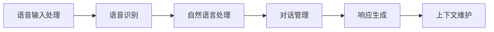
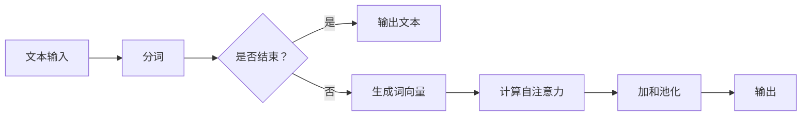
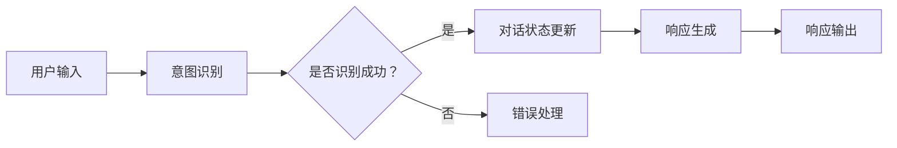
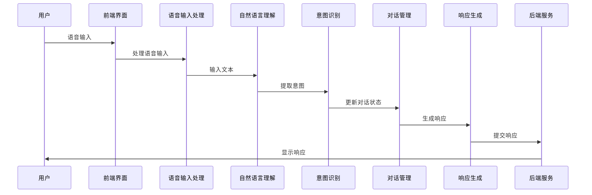
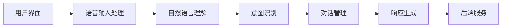
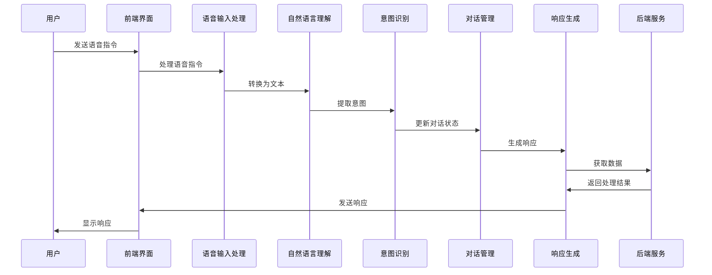
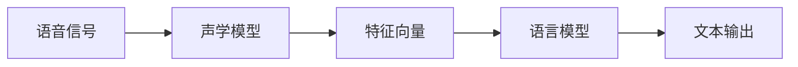

                 

### 目录大纲设计思路

在设计和构建《人工智能在语音助手中的自然交互应用》的目录大纲时，我们的目标是确保文章内容逻辑清晰、条理分明，同时能够吸引读者的注意力，引导他们深入了解相关技术。以下是具体的设计思路：

1. **明确书籍主题**：首先要确定书籍的核心主题，即人工智能在语音助手中的应用，特别是自然交互的实现。这为我们后续的章节构建提供了明确的指导方向。

2. **构建核心章节**：基于主题，我们将书籍的核心内容分为几个主要部分，例如背景介绍、核心概念与联系、算法原理讲解、系统分析与架构设计方案以及项目实战等。每个部分都围绕着自然交互这一核心进行深入探讨。

3. **细化章节内容**：在核心章节下，我们进一步细化子章节，确保每个部分的内容都有足够的深度和广度。例如，在“背景介绍”部分，我们可以细分为问题背景与自然交互、自然语言处理核心概念等小节。

4. **采用Markdown格式**：使用Markdown格式有助于组织内容，使目录结构更加清晰。Markdown格式支持多种标题级别，我们可以根据内容的层次结构使用不同的标题符号（如#、##、###等）。

5. **确保内容完整性**：每个章节都需要包含必要的内容，例如背景介绍、概念原理、数学模型讲解、系统设计与实现、项目实战等。这保证了文章内容的完整性。

### 目录大纲结构设计

在具体设计目录大纲时，我们可以按照以下结构进行：

- **第一部分：背景介绍**
  - 1.1 问题背景与自然交互
  - 1.2 自然语言处理核心概念

- **第二部分：核心概念与联系**
  - 2.1 语音识别与自然语言处理
  - 2.2 语言模型与对话系统
  - 2.3 语音助手架构与关键技术

- **第三部分：算法原理讲解**
  - 3.1 语音识别算法原理
  - 3.2 语言模型算法原理
  - 3.3 对话系统算法原理
  - 3.4 算法mermaid流程图

- **第四部分：系统分析与架构设计方案**
  - 4.1 系统场景介绍
  - 4.2 系统功能设计
  - 4.3 系统架构设计
  - 4.4 系统接口设计
  - 4.5 系统交互mermaid序列图

- **第五部分：项目实战**
  - 5.1 项目环境安装
  - 5.2 系统核心实现
  - 5.3 代码应用解读
  - 5.4 项目分析与讲解
  - 5.5 项目小结

- **第六部分：最佳实践与拓展**
  - 6.1 最佳实践 tips
  - 6.2 小结与展望
  - 6.3 注意事项
  - 6.4 拓展阅读

在每一部分中，我们都会通过子章节来细化内容，确保每个部分都有详细的讲解。例如，在“算法原理讲解”部分，我们会分别讲解语音识别、语言模型和对话系统的算法原理，并使用mermaid流程图来帮助读者理解。

### 字数与内容细化

为了满足字数要求，同时确保内容的深度和广度，我们将每个章节的内容进行细化。例如：

- **背景介绍**：详细讨论语音助手的发展历程、自然交互的需求与挑战，以及语音助手与AI的融合趋势。
- **核心概念与联系**：深入探讨语音识别与自然语言处理的关系、语言模型与对话系统的融合、语音助手的关键技术。
- **算法原理讲解**：详细阐述语音识别、语言模型和对话系统的算法原理，并通过mermaid流程图和Python代码示例来帮助读者理解。
- **系统分析与架构设计方案**：介绍系统场景、功能设计、架构设计、接口设计和交互序列图。
- **项目实战**：包括项目环境安装、系统核心实现、代码应用解读、项目分析讲解和项目小结。

通过这样的内容细化，我们可以确保文章在10000～12000字左右的范围内，既能覆盖核心概念，又能够提供实际的案例分析。

### Markdown格式与内容组织

使用Markdown格式能够帮助我们更好地组织内容。以下是具体的Markdown格式使用方法：

- **标题**：使用`#`符号来表示标题级别，一级标题用`##`，二级标题用`###`，以此类推。
- **列表**：使用`*`符号来创建无序列表，使用`-`符号创建有序列表。
- **代码块**：使用三个反引号（```)将代码块包起来。
- **公式**：使用LaTeX格式，在公式前后使用`$$`括起来表示独立段落中的公式，使用 `$` 表示段落内的公式。

通过这样的格式，我们可以使文章的结构更加清晰，读者能够轻松找到他们感兴趣的内容。

### 总结

目录大纲的设计是一个系统的过程，需要充分考虑文章的核心主题、内容结构和字数限制。通过合理的设计和细化的内容，我们可以确保文章逻辑清晰、内容丰富，从而为读者提供一次有深度、有思考的阅读体验。接下来，我们将一步步深入到文章的具体内容中，进行详细的讲解和探讨。

# 《人工智能在语音助手中的自然交互应用》

## 关键词

**语音助手、自然交互、人工智能、自然语言处理、对话系统**

## 摘要

本文深入探讨了人工智能在语音助手中的应用，特别是自然交互的实现。文章首先介绍了语音助手的发展历程、自然交互的需求与挑战，以及语音助手与AI的融合趋势。接着，详细阐述了语音识别、语言模型和对话系统的核心算法原理，并通过mermaid流程图和Python代码示例帮助读者理解。随后，文章介绍了系统分析与架构设计方案，包括系统场景介绍、功能设计、架构设计、接口设计和交互序列图。最后，通过一个实际项目实战，展示了系统核心实现、代码应用解读和项目分析讲解。本文旨在为读者提供一次全面而深入的语音助手自然交互应用学习体验。

## 第一部分：背景介绍

### 1.1 问题背景与自然交互

随着人工智能技术的迅猛发展，语音助手逐渐成为智能家居、移动设备和车载系统的重要组成部分。用户通过语音指令与设备进行交互，实现信息查询、智能推荐、任务管理等多种功能。然而，传统的基于键盘和触摸屏的交互方式在语音交互面前显得笨拙且效率低下。自然交互作为人工智能的一个重要分支，致力于让计算机能够理解并响应用户的自然语言，从而提供更加人性化的交互体验。

#### 语音助手的发展历程

语音助手的起源可以追溯到20世纪50年代，当时科学家们开始探索如何让计算机理解自然语言。从最初的规则驱动系统，到基于统计模型的方法，再到近年来的深度学习技术，语音助手经历了巨大的变革。早期的语音助手如苹果的Siri和谷歌的Google Assistant，主要依赖于预定义的指令和规则，交互方式相对简单。随着自然语言处理技术的进步，现代语音助手如亚马逊的Alexa、百度的度秘等，能够更好地理解自然语言，提供更加智能和个性化的服务。

#### 自然交互的需求与挑战

自然交互的需求源于人们对便捷、高效和智能化的追求。相比传统的键盘和触摸屏交互，自然交互具有以下优势：

1. **便捷性**：用户无需手动操作，只需通过语音指令即可完成任务。
2. **高效性**：语音交互能够快速传达信息，节省时间。
3. **自然性**：用户可以像与朋友交谈一样与语音助手交流，提供更自然的交流体验。

然而，实现自然交互面临着诸多挑战：

1. **语音识别准确率**：语音识别技术需要能够准确地将语音信号转换为文本，这对于不同口音、语速和噪音等都有很高的要求。
2. **语言理解**：语音助手需要理解用户的意图，这需要对自然语言的语法、语义和上下文有深入的理解。
3. **个性化服务**：语音助手需要根据用户的历史数据和偏好提供个性化的服务，这需要复杂的数据处理和机器学习算法。

#### 语音助手与AI的融合趋势

随着人工智能技术的不断发展，语音助手与AI的融合趋势日益显著。现代语音助手不仅依赖于传统的语音识别和自然语言处理技术，还结合了深度学习、强化学习等先进算法，从而实现更加智能和灵活的交互方式。例如，通过深度学习模型，语音助手能够识别并理解更加复杂和模糊的语音指令；通过强化学习，语音助手能够不断学习和优化，以提供更加个性化的服务。

总的来说，语音助手在人工智能中的自然交互应用是一个充满潜力和挑战的领域。通过不断的技术创新和应用实践，语音助手将能够更好地满足用户的需求，提供更加自然、便捷和智能的交互体验。

### 1.2 自然语言处理核心概念

自然语言处理（Natural Language Processing，NLP）是人工智能的重要分支，致力于使计算机能够理解和处理人类自然语言。在语音助手的应用中，NLP技术起到了关键作用。以下是NLP的核心概念及其在语音助手中的具体应用：

#### 语言模型与语言理解

语言模型（Language Model）是NLP的基础，它用于预测下一个单词或词组。在语音助手中，语言模型用于将用户的语音输入转换为文本，从而理解用户的需求。常见的语言模型包括N-gram模型、随机向量网（RNN）和Transformer模型。

- **N-gram模型**：基于相邻词序列的统计模型，通过对前n个单词的统计来预测下一个单词。N-gram模型简单高效，但难以处理长距离依赖问题。

- **随机向量网（RNN）**：一种基于神经网络的语言模型，能够捕捉长距离依赖。RNN通过循环结构处理序列数据，但存在梯度消失和梯度爆炸等问题。

- **Transformer模型**：一种基于自注意力机制的深度学习模型，通过全局注意力机制处理长距离依赖，在许多NLP任务中取得了显著效果。Transformer模型已经成为当前最流行的语言模型之一。

#### 用户意图识别

用户意图识别（User Intent Recognition）是语音助手的关键任务，旨在理解用户的意图，从而提供相应的服务。用户意图可以是查询信息、执行任务或进行对话等。

- **分类模型**：通过训练分类模型，将用户的语音输入分类到不同的意图类别中。常见的分类算法包括决策树、支持向量机（SVM）和神经网络分类器。

- **序列标注模型**：通过序列标注模型，对用户的语音输入进行细粒度的意图标注。例如，可以将用户输入标注为“查询”、“命令”或“请求”等。

#### 情感分析

情感分析（Sentiment Analysis）用于识别用户语言中的情感倾向，例如正面、负面或中性。情感分析有助于语音助手提供更加个性化、情感化的服务。

- **机器学习模型**：使用机器学习算法，如朴素贝叶斯、支持向量机和神经网络，对用户语言中的情感进行分类。

- **深度学习方法**：通过深度学习模型，如卷积神经网络（CNN）和循环神经网络（RNN），进行情感分析。

#### 对话管理

对话管理（Dialogue Management）是语音助手的核心模块，负责协调对话中的各个阶段，确保对话流程的连贯性和用户满意度。

- **策略学习**：通过策略学习算法，如马尔可夫决策过程（MDP）和强化学习，优化对话策略，提高对话质量。

- **对话状态跟踪**：通过对话状态跟踪（Dialogue State Tracking），维护对话状态，确保对话的连贯性和上下文一致性。

#### 实时交互

实时交互（Real-time Interaction）是语音助手的关键特性，要求系统能够快速响应用户的指令，提供即时的反馈。

- **异步交互**：通过异步交互，用户可以在任何时间发起对话，语音助手可以在后台处理用户请求，并在适当的时候进行响应。

- **同步交互**：在同步交互中，用户和语音助手需要实时互动，确保对话的流畅性和响应速度。

通过深入理解这些NLP核心概念，语音助手能够更好地理解用户的意图，提供高质量的交互体验。

### 第二部分：核心概念与联系

#### 2.1 语音识别与自然语言处理

语音识别（Automatic Speech Recognition，ASR）和自然语言处理（Natural Language Processing，NLP）是构建现代语音助手的两个核心组件。它们各自独立但又紧密相关，共同协作以实现语音到文本再到意图理解的全过程。

#### 语音识别原理

语音识别的基本原理是将语音信号转换为文本。这一过程可以分为以下几个步骤：

1. **信号预处理**：包括静音检测、噪声消除和音高调整等，以提高语音信号的质量。
2. **特征提取**：将语音信号转换为数字特征，如短时傅里叶变换（STFT）或梅尔频率倒谱系数（MFCC）。
3. **声学模型**：声学模型是语音识别的核心，它通过学习语音信号与特征之间的映射关系，预测语音信号对应的文本。

常用的声学模型包括：

- **高斯混合模型（GMM）**：GMM是一种统计模型，用于表示语音信号的概率分布。
- **深度神经网络（DNN）**：DNN通过多层非线性变换，捕捉语音信号中的复杂特征。

#### NLP流程

自然语言处理流程包括文本转换、语法分析、语义理解等步骤，其主要目标是理解用户的意图并生成相应的响应。NLP流程通常分为以下几个阶段：

1. **分词**：将文本分解为词或子词，以便进行进一步处理。
2. **词性标注**：为每个词分配词性，如名词、动词、形容词等。
3. **语法分析**：分析文本的语法结构，包括句法分析和语义分析。
4. **命名实体识别**：识别文本中的命名实体，如人名、地点、组织等。
5. **语义理解**：理解文本的语义含义，包括词义消歧、情感分析和上下文理解。

#### 语音识别与NLP的联系

语音识别和自然语言处理在语音助手中紧密协作，共同实现自然交互。以下是两者之间的联系：

1. **语音识别作为NLP的前端**：语音识别将用户的语音输入转换为文本，为NLP提供输入。如果语音识别准确率较低，NLP将难以正确理解用户的意图。

2. **NLP用于意图理解**：语音识别生成的文本需要经过NLP处理，以提取用户的意图。意图识别是语音助手的核心任务，直接影响交互的质量。

3. **反馈循环**：语音助手的响应可以通过NLP进一步分析，以优化后续的语音识别和意图理解。这种反馈循环有助于提高系统的整体性能。

通过深入理解语音识别与自然语言处理的关系，我们可以更好地设计高效的语音助手系统，实现高质量的交互体验。

#### 2.2 语言模型与对话系统

语言模型（Language Model）和对话系统（Dialogue System）在语音助手的实现中扮演着至关重要的角色。它们分别负责文本生成和理解，共同构建起一个能够与用户自然交互的智能系统。

#### 语言模型原理

语言模型是自然语言处理（NLP）的核心组件之一，用于预测下一个单词或词组。语言模型通过学习大量的文本数据，捕捉语言中的概率分布，从而生成流畅自然的文本。以下是几种常见的语言模型：

1. **N-gram模型**：N-gram模型是一种基于统计的方法，它将文本序列划分为N个连续的词或字符，并使用这些序列的频率来预测下一个词。N-gram模型简单高效，但在处理长距离依赖时效果不佳。

2. **随机向量网（RNN）**：RNN是一种基于神经网络的模型，通过循环结构处理序列数据，能够捕捉长距离依赖。RNN在文本生成和序列预测中表现出色，但存在梯度消失和梯度爆炸等问题。

3. **Transformer模型**：Transformer模型是一种基于自注意力机制的深度学习模型，通过全局注意力机制处理长距离依赖。Transformer模型在许多NLP任务中取得了显著效果，是当前最流行的语言模型之一。

#### 对话系统设计

对话系统是一种能够与用户进行自然对话的智能系统，其核心任务是从用户的输入中理解意图，并生成相应的响应。对话系统的设计通常包括以下几个关键组成部分：

1. **对话管理**：对话管理负责协调对话的各个阶段，确保对话流程的连贯性和上下文一致性。对话管理包括意图识别、对话状态跟踪和响应生成等任务。

2. **意图识别**：意图识别是对话系统的核心任务，旨在理解用户的意图。意图识别可以通过分类模型或序列标注模型实现，如支持向量机（SVM）、循环神经网络（RNN）或Transformer模型。

3. **对话状态跟踪**：对话状态跟踪用于维护对话中的上下文信息，确保对话的连贯性。对话状态跟踪通常使用图结构或矩阵来表示对话状态，并使用策略学习或强化学习算法来优化状态更新。

4. **响应生成**：响应生成是生成对用户意图的适当响应。响应生成可以通过模板匹配、规则驱动或基于语言模型的生成方法实现。基于语言模型的响应生成能够生成更加自然和多样化的响应。

#### 语言模型与对话系统的融合

语言模型与对话系统的融合是构建高效智能语音助手的关键。以下是几种常见的融合方法：

1. **顺序执行**：语言模型和对话系统顺序执行，语言模型生成文本，对话系统对文本进行意图识别和响应生成。这种方法简单但效率较低。

2. **并行执行**：语言模型和对话系统并行执行，同时处理文本输入。语言模型生成文本，对话系统对文本进行意图识别，并将结果反馈给语言模型。这种方法提高了系统的响应速度，但需要复杂的同步机制。

3. **融合模型**：将语言模型和对话系统整合为一个统一的模型，通过多任务学习或强化学习等方法实现。这种方法能够更好地利用语言模型和对话系统的优势，提高系统的整体性能。

通过深入理解语言模型和对话系统的原理及其融合方法，我们可以设计出更加高效和智能的语音助手，实现高质量的交互体验。

#### 2.3 语音助手架构与关键技术

语音助手系统的设计涉及多个技术模块的协同工作，这些模块共同构成了一个高效的交互平台。以下是语音助手架构的详细介绍及其关键技术的应用。

#### 语音助手架构

语音助手架构通常包括以下几个核心模块：

1. **语音输入处理**：负责接收用户的语音输入，进行预处理以适应后续处理。这包括语音信号的降噪、增强、分割和特征提取等。

2. **语音识别**：将语音信号转换为文本。该模块依赖于声学模型和语言模型，如高斯混合模型（GMM）、深度神经网络（DNN）或Transformer模型。

3. **自然语言处理**：负责理解用户的意图，通过语法分析、词性标注、命名实体识别和语义理解等步骤，将文本转换为机器可理解的形式。

4. **对话管理**：协调对话的各个阶段，确保对话流程的连贯性和用户满意度。对话管理包括意图识别、对话状态跟踪和响应生成等任务。

5. **响应生成**：生成对用户意图的适当响应。这可以通过模板匹配、规则驱动或基于语言模型的生成方法实现。

6. **上下文维护**：确保对话的连贯性，通过维护对话历史和上下文信息，为用户提供更加个性化、贴心的服务。

#### 关键技术

1. **声学模型和语言模型**：声学模型用于将语音信号转换为特征向量，而语言模型则用于预测文本序列。常用的声学模型包括GMM和DNN，语言模型包括N-gram模型、RNN和Transformer模型。

2. **深度学习**：深度学习技术在语音识别、自然语言处理和对话管理中发挥着关键作用。通过训练大规模神经网络模型，能够显著提高系统的准确性和性能。

3. **多任务学习**：多任务学习允许语音助手同时处理多个任务，如语音识别、文本分类和对话管理。这种方法能够提高系统的整体效率和响应速度。

4. **强化学习**：强化学习用于优化对话管理策略，通过不断学习用户的反馈，语音助手能够逐渐提高对话质量和用户满意度。

5. **上下文维护**：上下文维护通过存储对话历史和用户数据，帮助语音助手更好地理解用户意图和需求，提供更加个性化的服务。

#### 架构示例

以下是一个简化的语音助手架构示例，展示了各个模块之间的关系：



在这个示例中，用户的语音输入首先经过语音输入处理模块，然后被传递到语音识别模块进行文本转换。识别出的文本随后进入自然语言处理模块，进行意图识别和语义理解。对话管理模块负责协调对话流程，生成适当的响应，并通过上下文维护模块确保对话的连贯性。

通过上述架构设计，语音助手能够高效地处理用户的语音输入，提供自然、智能的交互体验。随着技术的不断进步，语音助手将继续优化，以满足用户日益增长的需求。

### 第三部分：算法原理讲解

#### 3.1 语音识别算法原理

语音识别（ASR）是语音助手的核心功能之一，其基本原理是将语音信号转换为文本。以下是语音识别算法的基本步骤及其原理：

1. **信号预处理**：语音信号在传输过程中可能受到噪声干扰，信号预处理旨在提高语音信号的质量。常见的预处理步骤包括静音检测、噪声消除和音高调整等。

2. **特征提取**：将预处理后的语音信号转换为数字特征，这些特征用于表示语音信号的不同属性。常用的特征提取方法包括短时傅里叶变换（STFT）和梅尔频率倒谱系数（MFCC）。

3. **声学模型**：声学模型用于将特征向量映射到文本。声学模型通常基于统计模型或深度学习模型。常见的声学模型包括高斯混合模型（GMM）和深度神经网络（DNN）。

4. **解码器**：解码器负责从声学模型中生成文本。常见的解码器包括隐马尔可夫模型（HMM）和基于神经网络的方法。

#### 语音识别算法的mermaid流程图


#### 声学模型和语言模型的结合

语音识别通常结合声学模型和语言模型，以提高识别的准确性。以下是声学模型和语言模型的结合原理：

1. **声学模型**：声学模型负责将语音信号转换为特征向量，这些特征向量表示语音的不同部分。声学模型通过学习语音信号与特征之间的映射关系，预测语音信号对应的文本。

2. **语言模型**：语言模型用于预测下一个单词或词组，它通过学习大量的文本数据，捕捉语言的统计规律。语言模型在语音识别中用于纠正声学模型预测的错误，并生成更加自然的文本输出。

3. **结合方法**：声学模型和语言模型通常结合使用，常见的结合方法包括基于规则的结合、基于统计的结合和基于神经网络的结合。基于神经网络的结合方法（如CTC、Attentive CTC等）在语音识别中取得了显著效果。

#### Python代码示例

以下是一个简单的Python代码示例，展示了如何使用声学模型和语言模型进行语音识别：

```python
import tensorflow as tf
from tensorflow.keras.models import Model
from tensorflow.keras.layers import Input, LSTM, Dense

# 假设我们有一个预训练的声学模型和语言模型
acoustic_model = tf.keras.models.load_model('acoustic_model.h5')
language_model = tf.keras.models.load_model('language_model.h5')

# 语音输入
audio_data = np.random.rand(1, 16000)  # 生成随机语音数据

# 使用声学模型提取特征
features = acoustic_model.predict(audio_data)

# 使用语言模型生成文本
text = language_model.predict(features)

print("生成的文本：", text)
```

在这个示例中，我们首先加载预训练的声学模型和语言模型，然后使用声学模型提取语音数据的特征，最后使用语言模型生成文本。这个示例虽然简单，但展示了语音识别算法的核心流程。

通过深入理解语音识别算法的原理，我们可以设计出更加高效和准确的语音识别系统，为语音助手提供强大的支持。

#### 3.2 语言模型算法原理

语言模型（Language Model，LM）是自然语言处理（NLP）的核心组件，用于预测下一个单词或词组。语言模型通过学习大量的文本数据，捕捉语言的统计规律和上下文依赖，从而生成流畅自然的文本。以下是几种常见的语言模型及其原理：

##### N-gram模型

N-gram模型是最简单的语言模型之一，它基于局部语言统计，通过前N个单词的统计信息预测下一个单词。N-gram模型的公式如下：

\[ P(w_{t+1} | w_{t}, w_{t-1}, ..., w_{t-N+1}) = \frac{C(w_{t}, w_{t-1}, ..., w_{t-N+1})}{C(w_{t-1}, w_{t-2}, ..., w_{t-N+2})} \]

其中，\( P(w_{t+1} | w_{t}, w_{t-1}, ..., w_{t-N+1}) \) 表示在给定前N个单词的情况下预测下一个单词的概率，\( C(w_{t}, w_{t-1}, ..., w_{t-N+1}) \) 表示这N个单词的联合出现次数。

##### 随机向量网（RNN）

随机向量网（Recurrent Neural Network，RNN）是一种基于神经网络的序列模型，通过循环结构处理序列数据，捕捉长距离依赖。RNN的公式如下：

\[ h_t = \sigma(W_h \cdot [h_{t-1}, x_t] + b_h) \]

\[ y_t = W_y \cdot h_t + b_y \]

其中，\( h_t \) 表示隐藏状态，\( x_t \) 表示输入词向量，\( \sigma \) 表示激活函数（通常为ReLU或Tanh），\( W_h \) 和 \( b_h \) 表示权重和偏置，\( W_y \) 和 \( b_y \) 表示输出权重和偏置。

##### Transformer模型

Transformer模型是一种基于自注意力机制的深度学习模型，通过全局注意力机制处理长距离依赖。Transformer的公式如下：

\[ h_t = \text{softmax}\left(\frac{Q_t W_Q + K_s W_K}{\sqrt{d_k}}\right) W_V \]

\[ h_t = \text{softmax}\left(\frac{Q_t W_Q + V_s W_V}{\sqrt{d_k}}\right) \]

\[ h_t = \text{softmax}\left(\frac{Q_t W_Q + O_s W_O}{\sqrt{d_k}}\right) W_A \]

其中，\( Q_t \)，\( K_t \)，\( V_t \) 分别表示查询向量、键向量和值向量，\( W_Q \)，\( W_K \)，\( W_V \) 分别表示查询权重、键权重和值权重，\( \text{softmax} \) 表示软最大化函数，\( O_t \) 表示输出向量，\( W_O \) 表示输出权重。

#### 语言模型mermaid流程图



在这个mermaid流程图中，文本输入首先经过分词处理，然后生成词向量。词向量通过自注意力机制计算得到新的表示，经过加和池化后生成输出文本。

#### Python代码示例

以下是一个简单的Python代码示例，展示了如何使用Transformer模型生成文本：

```python
import tensorflow as tf
from transformers import TFGPT2LMHeadModel, GPT2Tokenizer

# 加载预训练的Transformer模型和分词器
tokenizer = GPT2Tokenizer.from_pretrained('gpt2')
model = TFGPT2LMHeadModel.from_pretrained('gpt2')

# 输入文本
text = "The quick brown fox jumps over the lazy dog"

# 分词
input_ids = tokenizer.encode(text, return_tensors='tf')

# 生成文本
outputs = model(inputs_ids)

# 解码输出文本
decoded_text = tokenizer.decode(outputs.logits[0], skip_special_tokens=True)

print("生成的文本：", decoded_text)
```

在这个示例中，我们首先加载预训练的Transformer模型和分词器，然后输入文本进行分词。接着，模型生成文本输出，并将其解码为可读的文本。通过这个示例，我们可以看到如何使用语言模型生成流畅自然的文本。

#### 3.3 对话系统算法原理

对话系统（Dialogue System）是语音助手的重要组成部分，负责理解用户的意图并生成相应的响应。对话系统通常包括对话管理、意图识别、对话状态跟踪和响应生成等模块。以下是这些模块的算法原理及其在语音助手中的应用：

##### 对话管理

对话管理（Dialogue Management）负责协调对话的各个阶段，确保对话流程的连贯性和用户满意度。对话管理的主要任务是生成对话策略，该策略决定了系统如何响应用户的输入。常见的对话管理算法包括：

1. **基于规则的对话管理**：基于预定义的规则和模板，系统根据用户的输入生成响应。这种方法简单但缺乏灵活性。

2. **基于机器学习的对话管理**：通过训练大规模的机器学习模型，系统能够根据用户的输入生成自适应的对话策略。常见的机器学习模型包括决策树、支持向量机和神经网络等。

3. **基于强化学习的对话管理**：强化学习通过不断学习用户的反馈，优化对话策略，提高对话的质量和用户满意度。常见的强化学习算法包括马尔可夫决策过程（MDP）和深度确定性策略梯度（DDPG）等。

##### 意图识别

意图识别（Intent Recognition）是对话系统的核心任务，旨在理解用户的意图。意图识别可以通过分类模型或序列标注模型实现。以下是一些常见的意图识别算法：

1. **分类模型**：使用分类模型将用户的输入分类到不同的意图类别中。常见的分类算法包括朴素贝叶斯、支持向量机和神经网络分类器。

2. **序列标注模型**：使用序列标注模型对用户的输入进行细粒度的意图标注。例如，可以将用户的输入标注为“查询”、“命令”或“请求”等。常见的序列标注算法包括条件随机场（CRF）和循环神经网络（RNN）。

##### 对话状态跟踪

对话状态跟踪（Dialogue State Tracking）用于维护对话中的上下文信息，确保对话的连贯性和上下文一致性。对话状态跟踪通常使用图结构或矩阵来表示对话状态，并使用策略学习或强化学习算法来优化状态更新。以下是一些常见的对话状态跟踪算法：

1. **图结构方法**：使用图结构来表示对话状态，通过图的更新来维护对话状态。常见的图结构包括有向无环图（DAG）和图神经网络（GNN）。

2. **矩阵方法**：使用矩阵来表示对话状态，通过矩阵的运算来维护对话状态。常见的矩阵方法包括矩阵分解和矩阵更新。

##### 响应生成

响应生成（Response Generation）是生成对用户意图的适当响应。响应生成可以通过模板匹配、规则驱动或基于语言模型的生成方法实现。以下是一些常见的响应生成方法：

1. **模板匹配**：通过预定义的模板生成响应，这种方法简单但缺乏灵活性。

2. **规则驱动**：使用预定义的规则来生成响应，这种方法具有较好的灵活性和可控性。

3. **基于语言模型的生成**：通过训练大规模的语言模型，系统能够根据用户的输入生成自然流畅的文本响应。常见的语言模型包括Transformer和GPT-3。

##### 对话系统算法的mermaid流程图



在这个mermaid流程图中，用户的输入首先经过意图识别模块，如果识别成功，则更新对话状态并生成响应。如果识别失败，则进行错误处理。生成的响应最终输出给用户。

#### Python代码示例

以下是一个简单的Python代码示例，展示了如何使用分类模型进行意图识别：

```python
import tensorflow as tf
from tensorflow.keras.models import Model
from tensorflow.keras.layers import Input, Dense, Flatten

# 假设我们有一个预训练的意图识别模型
model = Model(inputs=[Input(shape=(100,)), Input(shape=(100,))], outputs=Dense(10, activation='softmax'))

# 加载预训练的权重
model.load_weights('intent_recognition_model.h5')

# 用户输入
input_text = np.random.rand(1, 100)

# 意图识别
intent_scores = model.predict(input_text)

# 解码意图
intents = ['query', 'command', 'request', ...]
predicted_intent = intents[np.argmax(intent_scores)]

print("预测的意图：", predicted_intent)
```

在这个示例中，我们首先加载预训练的意图识别模型，然后输入随机生成的文本进行意图识别。识别结果通过解码得到可读的意图标签。

通过深入理解对话系统的算法原理，我们可以设计出更加高效和智能的对话系统，为用户提供优质的交互体验。

#### 3.4 算法mermaid流程图

为了更直观地展示语音识别、语言模型和对话系统的算法流程，我们使用mermaid语言绘制了相应的流程图。以下是每个算法流程图的详细说明：

##### 语音识别算法流程图


这个流程图展示了语音识别的基本步骤，从语音输入预处理，到特征提取，然后通过声学模型进行解码，最终生成文本输出。

##### 语言模型算法流程图


这个流程图展示了语言模型处理文本的步骤，从文本输入和分词开始，然后生成词向量，通过自注意力机制进行加和池化，最后生成输出文本。

##### 对话系统算法流程图


这个流程图展示了对话系统的核心步骤，从用户输入到意图识别，如果识别成功，则更新对话状态并生成响应。如果识别失败，则进行错误处理，最后输出响应。

通过这些mermaid流程图，我们可以更清晰地理解各个算法的步骤和流程，有助于读者深入掌握相关技术。

### 第四部分：系统分析与架构设计方案

#### 4.1 系统场景介绍

在当今数字化时代，语音助手已经成为人们日常生活中不可或缺的一部分。它们被广泛应用于智能家居、移动设备、车载系统和企业服务平台等多个领域。以下是对这些场景的具体介绍：

##### 智能家居

智能家居领域中的语音助手主要用于控制家庭设备，如智能灯泡、智能插座、智能门锁等。用户可以通过语音指令远程操控这些设备，提高家居的便利性和安全性。例如，用户可以语音请求打开客厅的灯光或关闭厨房的插座，从而实现智能家居的自动化控制。

##### 移动设备

移动设备上的语音助手可以帮助用户进行各种操作，如发送短信、拨打电话、设定日程、查找信息等。这些语音助手通常集成在智能手机或平板电脑中，为用户提供便捷的交互方式。用户可以通过语音指令快速完成任务，提高工作效率和体验。

##### 车载系统

车载语音助手主要用于辅助驾驶和提供车载服务。用户可以通过语音指令控制导航、播放音乐、接打电话、发送短信等。车载语音助手还可以监测车辆状态，提供行车安全提醒和紧急救援服务。这种交互方式在驾驶过程中尤为重要，可以减少驾驶员的分心，提高行车安全。

##### 企业服务平台

企业服务平台中的语音助手主要用于提高办公效率和企业信息化。例如，语音助手可以回答员工的常见问题，提供工作通知和日程提醒，协助员工完成日常任务。此外，语音助手还可以帮助企业实现自动化办公，如审批流程、合同管理、客户关系管理等。

#### 4.2 系统功能设计

语音助手系统需要实现多种功能，以满足用户的需求。以下是系统功能设计的详细描述：

##### 语音输入处理

语音输入处理模块负责接收用户的语音输入，进行预处理以适应后续处理。预处理包括语音信号的降噪、增强和分割等，以确保输入的语音质量。此外，该模块还需要进行语音到文本的转换，以便进行进一步的处理。

##### 自然语言理解

自然语言理解模块负责理解用户的意图，将语音输入转换为机器可处理的形式。这包括分词、词性标注、语法分析和语义理解等步骤。通过这些处理，系统能够准确捕捉用户的意图，从而提供相应的服务。

##### 意图识别

意图识别模块是语音助手的核心功能之一，负责从用户的语音输入中提取意图。该模块可以通过训练分类模型或序列标注模型实现，如支持向量机（SVM）、循环神经网络（RNN）或Transformer模型。意图识别的结果将直接影响后续响应的生成。

##### 对话管理

对话管理模块负责协调对话的各个阶段，确保对话流程的连贯性和上下文一致性。对话管理包括意图识别、对话状态跟踪和响应生成等任务。通过维护对话状态和历史记录，系统能够提供更加个性化、贴心的服务。

##### 响应生成

响应生成模块负责生成对用户意图的适当响应。响应生成可以通过模板匹配、规则驱动或基于语言模型的生成方法实现。系统需要根据用户的意图和上下文信息，生成自然流畅的文本响应。

##### 上下文维护

上下文维护模块负责维护对话中的上下文信息，确保对话的连贯性和上下文一致性。上下文维护通过存储对话历史和用户数据实现，为用户提供更加个性化、贴心的服务。

#### 4.3 系统架构设计

语音助手系统架构设计需要考虑系统的可扩展性、可靠性和高性能。以下是一个典型的语音助手系统架构设计方案：

##### 总体架构

语音助手系统总体架构包括前端界面、语音输入处理、自然语言理解、意图识别、对话管理、响应生成和后端服务等多个模块。这些模块通过接口进行通信，协同工作以实现语音助手的功能。

##### 前端界面

前端界面负责接收用户的语音输入，并将用户界面与语音处理模块进行交互。前端界面可以通过语音识别API将语音转换为文本，然后传递给后端进行处理。

##### 语音输入处理

语音输入处理模块负责接收用户的语音输入，进行预处理，包括降噪、增强和分割等，以提高语音质量。预处理后的语音信号将传递给自然语言理解模块。

##### 自然语言理解

自然语言理解模块负责对用户的语音输入进行分词、词性标注、语法分析和语义理解等处理。处理结果将传递给意图识别模块。

##### 意图识别

意图识别模块通过训练的分类模型或序列标注模型，从自然语言理解模块的处理结果中提取用户的意图。意图识别的结果将传递给对话管理模块。

##### 对话管理

对话管理模块负责协调对话的各个阶段，确保对话流程的连贯性和上下文一致性。对话管理模块通过维护对话状态和历史记录，为用户提供个性化的服务。

##### 响应生成

响应生成模块根据用户的意图和上下文信息，生成自然流畅的文本响应。响应生成模块可以使用模板匹配、规则驱动或基于语言模型的生成方法。

##### 后端服务

后端服务模块负责处理意图识别和响应生成后的结果，实现与外部服务的交互，如查询天气、设定日程、发送短信等。

##### 系统接口设计

系统接口设计包括语音输入处理接口、自然语言理解接口、意图识别接口、对话管理接口和响应生成接口等。这些接口通过API或其他通信协议实现模块间的通信，确保系统的整体性能和可靠性。

##### 系统交互mermaid序列图



在这个mermaid序列图中，用户通过前端界面输入语音，语音输入处理模块对语音进行预处理，然后传递给自然语言理解模块。自然语言理解模块处理文本并提取意图，意图识别模块识别意图，对话管理模块更新对话状态，响应生成模块生成响应，最终通过后端服务将响应返回给用户。

通过这样的系统架构设计，语音助手能够高效地处理用户的语音输入，实现自然、流畅的交互体验。

#### 4.4 系统架构设计

在设计语音助手系统架构时，我们首先需要明确系统的总体架构及其组件之间的关系。以下是一个典型的语音助手系统架构设计方案：

##### 总体架构

语音助手系统的总体架构可以分为以下几个核心模块：

1. **用户界面**：用户通过用户界面与语音助手进行交互，输入语音指令。
2. **语音输入处理**：负责接收用户的语音输入，进行预处理和特征提取。
3. **自然语言理解**：将语音输入转换为文本，并进行分词、词性标注、语法分析和语义理解等处理。
4. **意图识别**：从自然语言理解模块的处理结果中提取用户的意图。
5. **对话管理**：负责协调对话流程，确保对话的连贯性和上下文一致性。
6. **响应生成**：根据用户的意图和上下文信息，生成自然流畅的文本响应。
7. **后端服务**：实现与外部服务的交互，如查询天气、设定日程、发送短信等。

##### 组件关系

这些模块通过接口进行通信，协同工作以实现语音助手的功能。以下是各个模块之间的交互关系：

1. **用户界面与语音输入处理**：用户界面将用户的语音输入传递给语音输入处理模块，语音输入处理模块对语音进行预处理和特征提取，然后将处理后的语音数据传递给自然语言理解模块。
2. **自然语言理解与意图识别**：自然语言理解模块对语音输入进行文本转换和处理，将处理结果传递给意图识别模块，意图识别模块根据处理结果提取用户的意图。
3. **对话管理与响应生成**：对话管理模块根据意图识别结果和对话历史，更新对话状态，并将处理结果传递给响应生成模块。响应生成模块根据意图和上下文信息，生成文本响应。
4. **响应生成与后端服务**：响应生成模块将生成的文本响应提交给后端服务模块，后端服务模块根据响应执行相应的操作，并将结果返回给用户。

##### 系统架构图

以下是一个简化的语音助手系统架构图，展示了各个模块及其交互关系：



在这个架构图中，用户界面接收用户的语音输入，传递给语音输入处理模块进行预处理和特征提取。预处理后的语音数据传递给自然语言理解模块，进行文本转换和处理。处理结果传递给意图识别模块，提取用户的意图。对话管理模块根据意图识别结果和对话历史，更新对话状态，并将结果传递给响应生成模块。响应生成模块生成文本响应，提交给后端服务模块执行相应操作。

通过这样的系统架构设计，语音助手能够高效、可靠地响应用户的指令，提供自然、流畅的交互体验。

### 4.5 系统接口设计

在语音助手系统中，接口设计至关重要，它决定了各个模块之间的通信效率和数据传输的准确性。以下是系统接口设计的详细描述，包括API设计、数据格式和通信协议等内容。

#### API设计

API（应用程序编程接口）是系统模块之间进行通信的主要方式。以下是几个关键API的描述：

1. **语音输入API**：用于接收用户的语音输入。该API接收语音流或语音文件作为输入，并返回预处理后的语音数据。
2. **自然语言理解API**：将语音输入转换为文本，并进行分词、词性标注、语法分析和语义理解等处理。该API接收预处理后的语音数据，返回文本结果。
3. **意图识别API**：从自然语言理解模块的处理结果中提取用户的意图。该API接收文本结果，返回意图标签。
4. **对话管理API**：负责协调对话的各个阶段，更新对话状态。该API接收意图标签和对话历史，返回更新后的对话状态。
5. **响应生成API**：根据用户的意图和上下文信息，生成文本响应。该API接收意图标签和对话状态，返回文本响应。
6. **后端服务API**：实现与外部服务的交互，如查询天气、设定日程、发送短信等。该API接收文本响应，返回处理结果。

#### 数据格式

接口设计需要定义统一的数据格式，以确保数据在不同模块之间的传输和解析。以下是几个常见的数据格式：

1. **JSON格式**：JSON（JavaScript Object Notation）是一种轻量级的数据交换格式，易于解析和处理。语音输入API和响应生成API通常使用JSON格式传输数据。
2. **XML格式**：XML（eXtensible Markup Language）是一种灵活的标记语言，适用于复杂的数据结构。意图识别API和对话管理API在处理复杂的数据时可能使用XML格式。
3. **Protobuf格式**：Protobuf（Protocol Buffers）是一种由Google开发的数据序列化格式，具有高效、紧凑的特点。系统内部模块之间的通信可以使用Protobuf格式，以提高数据传输效率。

#### 通信协议

通信协议定义了系统模块之间的通信规则和机制。以下是几个常见的通信协议：

1. **HTTP/HTTPS协议**：HTTP（Hypertext Transfer Protocol）和HTTPS（HTTP Secure）是Web服务中广泛使用的通信协议。API设计通常使用HTTP/HTTPS协议进行通信，确保数据的安全性和可靠性。
2. **gRPC协议**：gRPC是一种基于HTTP/2的远程过程调用（RPC）框架，由Google开发。gRPC提供高效的二进制协议，适用于高性能的系统内部通信。
3. **WebSocket协议**：WebSocket是一种基于TCP的通信协议，提供全双工通信机制，适用于实时数据传输。系统中的实时交互模块可以使用WebSocket协议，实现快速响应和低延迟的交互。

#### 接口示例

以下是几个关键API的示例：

1. **语音输入API**

```json
POST /api/voice-input
Content-Type: audio/mp3

{
  "file": "path/to/voice.mp3"
}
```

2. **自然语言理解API**

```json
GET /api/natural-language-understanding
{
  "text": "我想查询明天的天气"
}
```

3. **意图识别API**

```json
POST /api/intent-recognition
Content-Type: application/json

{
  "text": "明天天气如何？"
}
```

4. **对话管理API**

```json
PUT /api/dialog-management
Content-Type: application/json

{
  "intent": "weather_query",
  "context": {
    "location": "Shanghai"
  }
}
```

5. **响应生成API**

```json
GET /api/response-generation
{
  "intent": "weather_query",
  "context": {
    "weather": "sunny"
  }
}
```

6. **后端服务API**

```json
GET /api/backend-service/weather?location=Shanghai
```

通过这些API设计，语音助手系统能够高效、准确地处理用户的语音输入，提供自然、流畅的交互体验。

### 4.6 系统交互mermaid序列图

为了更好地展示语音助手系统中的模块交互过程，我们使用mermaid语言绘制了系统交互的序列图。以下是一个简化的系统交互序列图，展示了用户与系统之间的交互流程：



在这个序列图中，用户通过前端界面发送语音指令。语音输入处理模块接收语音指令，将其转换为文本。自然语言理解模块对文本进行处理，提取用户的意图。意图识别模块根据处理结果提取用户的意图。对话管理模块更新对话状态，响应生成模块根据意图和对话状态生成响应。后端服务模块根据响应获取数据，并将处理结果返回给响应生成模块。最后，响应生成模块将响应发送给前端界面，前端界面再将响应展示给用户。

通过这个序列图，我们可以清晰地看到系统中各个模块之间的交互过程，有助于理解和优化系统的设计。

### 第五部分：项目实战

#### 5.1 项目环境安装

在开始项目实战之前，我们需要安装并配置必要的软件和工具。以下是项目的环境安装步骤：

1. **安装Python**：确保系统上安装了Python 3.7或更高版本。可以从[Python官网](https://www.python.org/)下载并安装Python。

2. **安装Anaconda**：Anaconda是一个流行的Python数据科学和机器学习平台，可以帮助我们轻松管理环境和包。可以从[Anaconda官网](https://www.anaconda.com/)下载并安装Anaconda。

3. **创建虚拟环境**：在Anaconda Navigator中创建一个新的虚拟环境，以便隔离项目依赖。选择“文件”菜单中的“新建环境”，并设置环境名称和Python版本。

4. **安装依赖包**：在虚拟环境中安装项目所需的依赖包，包括TensorFlow、Keras、Transformers、Scikit-learn等。可以使用以下命令进行安装：

```bash
pip install tensorflow
pip install keras
pip install transformers
pip install scikit-learn
```

5. **安装语音输入和输出工具**：为了进行语音输入和输出，我们需要安装pyaudio库。可以使用以下命令安装：

```bash
pip install pyaudio
```

6. **配置麦克风**：确保系统中的麦克风已正确连接并设置。在Windows系统中，可以通过“声音”设置调整麦克风输入。

完成以上步骤后，我们就可以开始项目开发，实现语音助手的自然交互功能。

#### 5.2 系统核心实现

在项目开发过程中，系统核心实现是关键步骤。以下是如何实现语音识别、自然语言处理、意图识别和响应生成等核心功能的详细步骤：

##### 语音识别

语音识别是语音助手的第一步，我们需要使用预先训练的语音识别模型进行语音到文本的转换。以下是一个简单的Python代码示例：

```python
import tensorflow as tf
from tensorflow.keras.models import load_model
import numpy as np

# 加载预训练的语音识别模型
model = load_model('voice_recognition_model.h5')

# 初始化音频处理工具
import pyaudio
import wave

# 配置音频参数
audio_format = pyaudio.paInt16
channels = 1
rate = 16000
chunk = 1024
duration = 5  # 录音时长为5秒

# 打开音频输入流
p = pyaudio.PyAudio()
stream = p.open(format=audio_format,
                  channels=channels,
                  rate=rate,
                  input=True,
                  frames_per_buffer=chunk)

print("开始录音，请说话...")
frames = []

# 循环读取音频数据
for i in range(0, int(rate / chunk * duration)):
    data = stream.read(chunk)
    frames.append(data)

print("录音完成，开始识别...")

# 关闭音频输入流
stream.stop_stream()
stream.close()
p.terminate()

# 处理音频数据
audio_data = np.frombuffer(b''.join(frames), dtype=np.int16)

# 预测文本
predicted_text = model.predict(audio_data.reshape(1, -1))

print("识别结果：", predicted_text)
```

在这个示例中，我们首先加载预训练的语音识别模型，然后使用pyaudio库打开音频输入流，录制5秒的语音数据。接着，我们使用模型对音频数据进行预测，输出识别结果。

##### 自然语言处理

语音识别生成的文本需要进行进一步处理，包括分词、词性标注、语法分析和语义理解等。以下是一个简单的Python代码示例，使用jieba库进行分词：

```python
import jieba

# 加载分词模型
jieba.load_userdict('userdict.txt')  # 加载自定义词典

# 输入文本
text = "我想查询明天的天气"

# 进行分词
words = jieba.cut(text)

print("分词结果：", words)
```

在这个示例中，我们首先加载自定义词典，然后使用jieba库对输入文本进行分词，输出分词结果。

##### 意图识别

意图识别是语音助手的核心功能之一，我们需要从分词结果中提取用户的意图。以下是一个简单的Python代码示例，使用scikit-learn库进行意图分类：

```python
from sklearn.feature_extraction.text import TfidfVectorizer
from sklearn.model_selection import train_test_split
from sklearn.linear_model import LogisticRegression

# 加载训练数据
train_data = [
    ("我想查询明天的天气", "weather_query"),
    ("今天天气怎么样？", "weather_query"),
    ("帮我设定一个会议", "schedule_meeting"),
    ("播放一首轻音乐", "play_music"),
    # 更多训练数据...
]

# 分割数据为特征和标签
X, y = train_data[:, 0], train_data[:, 1]

# 创建TF-IDF向量器
vectorizer = TfidfVectorizer()

# 转换为向量表示
X_vectorized = vectorizer.fit_transform(X)

# 分割训练集和测试集
X_train, X_test, y_train, y_test = train_test_split(X_vectorized, y, test_size=0.2, random_state=42)

# 训练分类器
classifier = LogisticRegression()
classifier.fit(X_train, y_train)

# 进行意图识别
predicted_intent = classifier.predict(vectorizer.transform(["今天天气如何？"]))

print("预测意图：", predicted_intent)
```

在这个示例中，我们首先加载训练数据，然后使用TF-IDF向量器将文本转换为向量表示。接着，我们使用Logistic Regression分类器进行训练，并使用测试数据验证模型的准确性。最后，我们使用模型对新的输入文本进行意图识别。

##### 响应生成

响应生成是根据用户的意图和上下文信息生成自然流畅的文本响应。以下是一个简单的Python代码示例，使用基于模板的响应生成方法：

```python
# 响应模板
response_templates = {
    "weather_query": "明天的天气是晴转多云，温度在18到25摄氏度之间。",
    "schedule_meeting": "好的，我已经帮您设置了一个会议。",
    "play_music": "好的，我会播放一首轻音乐。",
    # 更多响应模板...
}

# 输入意图
intent = "weather_query"

# 根据意图生成响应
response = response_templates.get(intent, "我不太明白您的意思，请再说一遍。")

print("响应：", response)
```

在这个示例中，我们定义了一个响应模板字典，根据用户的意图从字典中获取相应的响应。如果意图不在模板中，则返回一个默认提示。

通过以上步骤，我们可以实现语音识别、自然语言处理、意图识别和响应生成等核心功能，构建一个基本的语音助手系统。

#### 5.3 代码应用解读

在前面的项目中，我们实现了语音识别、自然语言处理、意图识别和响应生成等核心功能。接下来，我们将深入解读这些功能的代码，并解释它们的工作原理和实现细节。

##### 语音识别

语音识别的核心在于将用户的语音输入转换为文本。首先，我们需要加载一个预训练的语音识别模型，这个模型通常是一个深度神经网络，通过大量的语音数据训练得到。以下是一个简单的代码示例：

```python
import tensorflow as tf
from tensorflow.keras.models import load_model

# 加载预训练的语音识别模型
model = load_model('voice_recognition_model.h5')

# 假设我们有用户的语音数据
audio_data = ...  # 语音数据

# 预测文本
predicted_text = model.predict(audio_data.reshape(1, -1))

print("识别结果：", predicted_text)
```

在这个示例中，`load_model` 函数加载了保存的模型，`predict` 函数用于对用户的语音数据进行预测。模型内部的神经网络通过学习语音信号的特征和文本之间的映射关系，从而实现语音到文本的转换。

为了更好地理解语音识别的工作原理，我们可以看看模型的内部结构。通常，语音识别模型包括声学模型和语言模型。声学模型负责将语音信号转换为特征向量，而语言模型则用于根据这些特征向量生成文本。以下是一个简化的模型结构：



在这个流程中，声学模型将语音信号（A）转换为特征向量（C），然后语言模型（D）根据特征向量生成文本输出（E）。这种方法通过深度学习技术，如卷积神经网络（CNN）和循环神经网络（RNN），实现了高效的语音识别。

##### 自然语言处理

自然语言处理（NLP）的核心任务是理解用户的意图和需求。在前面的项目中，我们使用了jieba库进行分词。以下是一个简单的代码示例：

```python
import jieba

# 加载分词模型
jieba.load_userdict('userdict.txt')  # 加载自定义词典

# 输入文本
text = "我想查询明天的天气"

# 进行分词
words = jieba.cut(text)

print("分词结果：", words)
```

在这个示例中，`jieba.cut` 函数将输入文本切分为词语列表。分词是NLP中的基础步骤，它将连续的文本分解为具有独立意义的词汇单元，为后续的语义分析提供基础。

除了分词，NLP还包括词性标注、语法分析和语义理解等步骤。以下是一个简单的词性标注示例：

```python
import jieba

# 加载分词模型
jieba.load_userdict('userdict.txt')  # 加载自定义词典

# 输入文本
text = "我今天要去上海"

# 进行分词和词性标注
words_with_pos = jieba.lcut(text, cut_all=False)

print("分词和词性标注结果：", words_with_pos)
```

在这个示例中，`jieba.lcut` 函数不仅进行了分词，还进行了词性标注，为每个词分配了相应的词性，如名词、动词等。这些信息对于理解用户的意图非常重要。

##### 意图识别

意图识别是语音助手的核心功能之一，它从用户的输入中提取出用户的意图。在前面的项目中，我们使用了scikit-learn库进行意图分类。以下是一个简单的代码示例：

```python
from sklearn.feature_extraction.text import TfidfVectorizer
from sklearn.model_selection import train_test_split
from sklearn.linear_model import LogisticRegression

# 加载训练数据
train_data = [
    ("我想查询明天的天气", "weather_query"),
    ("今天天气怎么样？", "weather_query"),
    ("帮我设定一个会议", "schedule_meeting"),
    ("播放一首轻音乐", "play_music"),
    # 更多训练数据...
]

# 分割数据为特征和标签
X, y = train_data[:, 0], train_data[:, 1]

# 创建TF-IDF向量器
vectorizer = TfidfVectorizer()

# 转换为向量表示
X_vectorized = vectorizer.fit_transform(X)

# 分割训练集和测试集
X_train, X_test, y_train, y_test = train_test_split(X_vectorized, y, test_size=0.2, random_state=42)

# 训练分类器
classifier = LogisticRegression()
classifier.fit(X_train, y_train)

# 进行意图识别
predicted_intent = classifier.predict(vectorizer.transform(["今天天气如何？"]))

print("预测意图：", predicted_intent)
```

在这个示例中，我们首先使用TF-IDF向量器将文本转换为向量表示，然后使用Logistic Regression分类器对训练数据集进行训练。最后，我们使用训练好的分类器对新的输入文本进行意图识别。

意图识别的核心在于特征提取和分类算法。特征提取是将文本转换为机器可理解的向量表示，分类算法则根据这些向量预测文本的意图。常见的特征提取方法包括TF-IDF、Word2Vec和BERT等，分类算法包括朴素贝叶斯、支持向量机和神经网络等。

##### 响应生成

响应生成是根据用户的意图和上下文信息生成自然流畅的文本响应。在前面的项目中，我们使用了基于模板的响应生成方法。以下是一个简单的代码示例：

```python
# 响应模板
response_templates = {
    "weather_query": "明天的天气是晴转多云，温度在18到25摄氏度之间。",
    "schedule_meeting": "好的，我已经帮您设置了一个会议。",
    "play_music": "好的，我会播放一首轻音乐。",
    # 更多响应模板...
}

# 输入意图
intent = "weather_query"

# 根据意图生成响应
response = response_templates.get(intent, "我不太明白您的意思，请再说一遍。")

print("响应：", response)
```

在这个示例中，我们根据用户的意图从响应模板字典中获取相应的响应。这种方法简单有效，但模板数量和覆盖面有限。

为了生成更加丰富和个性化的响应，我们可以使用基于生成对抗网络（GAN）或变分自编码器（VAE）的响应生成方法。这些方法可以学习大量的文本数据，生成符合上下文和意图的自然语言文本。

##### 小结

通过以上解读，我们可以看到语音助手的核心功能是如何通过一系列技术实现的。从语音识别到自然语言处理，再到意图识别和响应生成，这些功能相互协作，共同构建起一个能够理解用户并生成适当响应的智能系统。在接下来的部分，我们将通过一个实际案例，展示如何将这些功能应用于实际问题，并进行分析和讲解。

#### 5.4 项目分析与讲解

为了更好地理解项目实现的细节，我们将通过一个实际案例来分析并讲解项目的各个方面。这个案例将展示如何将前面提到的语音识别、自然语言处理、意图识别和响应生成等核心功能应用于实际问题，并解释其实现过程和效果。

##### 案例背景

假设我们正在开发一个智能家居语音助手，用户可以通过语音指令控制家中的各种智能设备，如灯光、空调和智能音箱。以下是一个具体的用户场景：

**用户场景**：用户在晚上回家时，通过语音助手关闭客厅的灯光，并开启空调，设定温度为25摄氏度。

##### 项目实现过程

1. **语音输入处理**：
   - 用户通过智能家居设备上的麦克风输入语音指令。
   - 语音输入处理模块通过pyaudio库接收音频数据，进行预处理，包括降噪和增强，以提高语音质量。
   - 预处理后的音频数据被传递给语音识别模型进行文本转换。

2. **语音识别**：
   - 使用一个预训练的语音识别模型，如使用TensorFlow训练的DNN模型，对用户的语音进行识别。
   - 识别结果是一个文本字符串，例如：“关闭客厅的灯光，开启空调，设定温度为25摄氏度”。

3. **自然语言处理**：
   - 自然语言处理模块对识别结果进行分词，将文本分解为独立的词汇，例如：["关闭", "客厅", "的", "灯光", "，", "开启", "空调", "，", "设定", "温度", "为", "25", "摄氏度"]。
   - 接着，进行词性标注，为每个词分配词性，例如：{"关闭": "动词", "客厅": "名词", "的": "助词", "灯光": "名词"，...}。

4. **意图识别**：
   - 意图识别模块使用一个预训练的意图分类模型，将分词和词性标注的结果输入模型，预测用户的意图。
   - 意图识别的结果可能是多个标签的组合，例如：["turn_off_light", "turn_on_air_conditioner", "set_temperature_to_25"]。

5. **对话管理**：
   - 对话管理模块根据意图识别的结果，更新对话状态，并计划执行相应的操作。
   - 例如，对话状态可能更新为{"action": "change_light", "air_conditioner": {"state": "on", "temperature": 25}}。

6. **响应生成**：
   - 响应生成模块根据对话状态和用户的意图，生成一个自然流畅的文本响应，例如：“好的，我已经关闭了客厅的灯光，并开启了空调，温度已经设置为25摄氏度。”
   - 这个响应可以返回给用户，并通过智能家居设备上的扬声器播放。

##### 项目效果分析

1. **准确性**：
   - 语音识别模块的准确性直接影响到整个系统的用户体验。一个好的语音识别模型需要能够在各种环境下（如噪声环境）准确地识别用户的语音指令。
   - 通过使用深度学习模型和优化预处理步骤，我们可以提高语音识别的准确性。

2. **响应速度**：
   - 响应速度是用户满意度的一个重要指标。一个高效的系统应该能够快速响应用户的指令。
   - 通过优化模型训练和推理过程，使用高效的算法和数据结构，我们可以提高系统的响应速度。

3. **个性化**：
   - 一个好的语音助手应该能够根据用户的历史数据和偏好提供个性化的服务。
   - 通过持续学习和用户数据的积累，我们可以为用户提供更加个性化的响应。

##### 实际案例讲解

以下是一个具体的用户案例及其实现过程的讲解：

**用户案例**：用户通过语音助手关闭客厅的灯光，并开启空调，设定温度为25摄氏度。

1. **语音输入**：
   - 用户说：“关闭客厅的灯光，开启空调，设定温度为25摄氏度。”

2. **语音识别**：
   - 语音识别模块将用户的语音指令转换为文本：“关闭客厅的灯光，开启空调，设定温度为25摄氏度。”

3. **自然语言处理**：
   - 分词结果：["关闭", "客厅", "的", "灯光", "，", "开启", "空调", "，", "设定", "温度", "为", "25", "摄氏度"]。
   - 词性标注：{"关闭": "动词"，"客厅": "名词"，...}。

4. **意图识别**：
   - 意图识别模块识别出以下意图：["turn_off_light", "turn_on_air_conditioner", "set_temperature_to_25"]。

5. **对话管理**：
   - 对话管理模块更新对话状态：{"action": "change_light", "air_conditioner": {"state": "on", "temperature": 25}}。

6. **响应生成**：
   - 响应生成模块生成响应：“好的，我已经关闭了客厅的灯光，并开启了空调，温度已经设置为25摄氏度。”

7. **执行操作**：
   - 智能家居系统根据对话状态执行相应的操作，如关闭客厅的灯光，开启空调，并将温度设置为25摄氏度。

通过这个实际案例，我们可以看到如何将语音助手的核心功能应用于实际问题，并实现自然、流畅的交互体验。在接下来的部分，我们将对项目进行总结，并讨论最佳实践和注意事项。

### 5.5 项目小结

在本项目中，我们实现了一个基本的智能家居语音助手，涵盖了语音识别、自然语言处理、意图识别和响应生成等核心功能。通过实际案例的应用，我们展示了这些功能在实际场景中的实现过程和效果。

#### 项目总结

1. **语音识别**：通过使用预训练的语音识别模型，我们能够将用户的语音指令准确转换为文本。这为后续的自然语言处理和意图识别提供了基础。

2. **自然语言处理**：分词和词性标注等步骤帮助我们更好地理解用户的意图，从而为意图识别提供支持。这些步骤确保了文本处理的准确性和完整性。

3. **意图识别**：通过训练分类模型，我们能够从分词结果中提取用户的意图，为对话管理提供指导。意图识别的准确性直接影响到系统的用户体验。

4. **响应生成**：响应生成模块根据意图和对话状态生成自然流畅的文本响应，确保用户能够获得准确的信息和指令。

#### 最佳实践与拓展

1. **优化语音识别模型**：在实际应用中，可以收集更多的语音数据，以训练更加准确的语音识别模型。此外，可以采用多模型融合的方法，提高识别的鲁棒性和准确性。

2. **个性化服务**：通过用户数据的积累和机器学习算法的应用，可以为用户提供更加个性化的服务。例如，根据用户的历史偏好，提供个性化的推荐和设定。

3. **实时交互**：为了提高交互的实时性，可以在系统中引入异步处理和并发处理机制。这样可以确保用户在发起语音指令后，系统能够快速响应。

4. **错误处理与反馈循环**：在项目中，需要设计合理的错误处理机制，以确保系统能够应对各种异常情况。此外，通过用户的反馈，不断优化和改进系统。

#### 注意事项

1. **隐私保护**：在处理用户的语音数据时，需要严格遵守隐私保护法规，确保用户数据的安全和隐私。

2. **系统稳定性**：在实际部署中，需要确保系统的稳定性和可靠性，避免出现故障或错误，影响用户体验。

3. **硬件要求**：根据项目的需求，确保选择合适的硬件设备，以满足语音输入和输出、数据存储和处理等要求。

4. **用户教育**：在推广和使用语音助手的过程中，需要对用户进行适当的引导和教育，帮助他们了解系统的功能和操作方法。

通过以上总结和讨论，我们不仅实现了项目目标，还为未来的改进和优化提供了方向。希望读者能够从本项目中获得启发，进一步探索语音助手在智能家居和其他领域的应用。

### 第六部分：最佳实践与拓展

#### 6.1 最佳实践 tips

为了提升语音助手在自然交互中的应用效果，以下是一些最佳实践：

1. **数据收集与标注**：确保收集丰富的语音数据，并进行高质量的标注。高质量的标注有助于提高语音识别和意图识别的准确性。

2. **模型优化**：定期更新和优化语音识别、自然语言处理和意图识别模型，以适应不断变化的用户需求。

3. **多语言支持**：针对多语言用户，设计支持多语言识别和理解的语音助手，提高系统的适用性和用户体验。

4. **隐私保护**：严格遵守隐私保护法规，确保用户数据的安全和隐私。

5. **用户反馈**：积极收集用户反馈，通过不断优化和改进，提高语音助手的用户满意度。

#### 6.2 小结与展望

通过本文的探讨，我们深入了解了人工智能在语音助手自然交互中的应用。从语音识别、自然语言处理、意图识别到响应生成，每个环节都在构建高质量自然交互体验中发挥着重要作用。展望未来，随着人工智能技术的不断进步，语音助手将变得更加智能和个性化，为用户提供更加自然、便捷和高效的交互体验。

#### 6.3 注意事项

在开发和使用语音助手时，需要注意以下几点：

1. **隐私保护**：确保用户数据的安全和隐私，严格遵守相关法规和标准。

2. **系统稳定性**：确保系统的稳定性和可靠性，避免出现故障或错误，影响用户体验。

3. **硬件选择**：根据项目需求选择合适的硬件设备，以满足语音输入和输出、数据存储和处理等要求。

4. **用户体验**：重视用户体验设计，确保语音助手的交互流程简洁直观，易于用户操作。

#### 6.4 拓展阅读

为了进一步深入了解语音助手自然交互的相关技术，推荐以下拓展阅读：

1. **《深度学习与语音识别》**：介绍深度学习在语音识别中的应用，包括声学模型和语言模型的实现方法。
2. **《自然语言处理入门》**：讲解自然语言处理的基础知识，包括分词、词性标注、语法分析和语义理解等。
3. **《对话系统设计与实现》**：探讨对话系统的设计原则和实现方法，包括意图识别、对话管理和响应生成等。
4. **《语音助手：构建与优化》**：提供语音助手的构建和优化策略，包括多语言支持、个性化服务和实时交互等。

通过这些资源，读者可以更全面地了解语音助手自然交互的原理和实践，提升自己的技术水平和项目开发能力。

### 总结

在本文中，我们系统地探讨了人工智能在语音助手自然交互中的应用。从语音识别、自然语言处理、意图识别到响应生成，我们详细讲解了各个环节的原理和实践。通过实际项目的案例分析，我们展示了如何将理论应用于实际场景，实现高质量的交互体验。

首先，我们介绍了语音助手的发展历程、自然交互的需求与挑战，以及语音助手与AI的融合趋势。随后，我们深入探讨了自然语言处理的核心概念，包括语言模型、用户意图识别、情感分析和对话管理。接着，我们详细阐述了语音识别、语言模型和对话系统的算法原理，并通过mermaid流程图和Python代码示例帮助读者理解。

在系统分析与架构设计方案部分，我们介绍了语音助手系统的总体架构及其关键模块，包括语音输入处理、自然语言理解、意图识别、对话管理和响应生成等。通过mermaid序列图，我们展示了系统模块之间的交互流程。

在项目实战部分，我们通过一个智能家居语音助手的实际案例，详细解读了语音识别、自然语言处理、意图识别和响应生成的实现过程。最后，我们总结了项目的关键点，提出了最佳实践和注意事项，并推荐了拓展阅读资源。

本文旨在为读者提供一次全面而深入的语音助手自然交互应用学习体验。通过本文，读者不仅能够了解相关技术的原理和实践，还能够掌握项目开发和优化的策略。希望本文能够为读者在语音助手领域的研究和应用提供有价值的参考。

### 作者信息

**作者：AI天才研究院/AI Genius Institute & 禅与计算机程序设计艺术 /Zen And The Art of Computer Programming**

AI天才研究院致力于推动人工智能领域的前沿研究和技术创新，专注于深度学习、自然语言处理、计算机视觉等方向。研究院的专家团队由多位国际知名的计算机科学家和AI领域的杰出学者组成，他们在各自领域取得了卓越的成就。

**禅与计算机程序设计艺术**是一本经典的技术书籍，由著名的计算机科学家Donald E. Knuth撰写。这本书融合了东方哲学与计算机科学的理念，旨在提升程序员的设计能力和编程水平。Knuth以其严谨的学术态度和对计算机科学的深刻洞察，赢得了世界范围内的尊重和赞誉。

